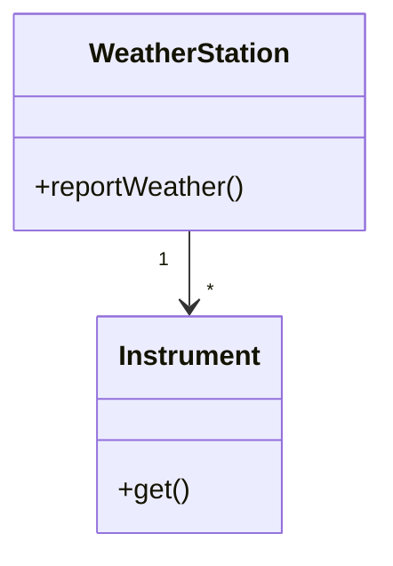

# دورات answer-and-group

## What this is for

A subject's `DAWRAT/` folder holds past-exam MCQ questions, rendered on the site as a standalone "دورات سنوات سابقة" section (see `build/cli.mjs`'s `buildExamsJson`, `site-shell/js/app.js`'s exam-archive wiring, and `parser/parts/handlers.js`'s `parseMCQ`). Getting a subject's DAWRAT content ready is two separate steps:

1. **Extraction** (a different, existing prompt — `templates/prompt-past-exam-mcq.md`): turn a raw exam PDF into markdown questions with blank `**الإجابة الصحيحة:**`/`**التعليل:**` fields. If the user hands you a PDF or asks you to "pull the questions out," that's the other prompt, not this skill.
2. **Answering + grouping** (this skill): take those blank-answer questions — one file, or several that need combining first — and produce the final, answered, lecture-grouped `DAWRAT/exams.md`.

The reason answering has to happen by reading the lectures rather than from general knowledge alone: the exam almost always uses the exact wording, terminology, and even the specific right/wrong framing that the professor's own slides used, quoted verbatim in each lecture's `#### النص الأصلي يقول:` blocks. That's the ground truth. General domain knowledge is a fallback for the (usually few) questions no lecture happens to cover.

## Step 1 — Gather the input

Find the subject's unanswered question source(s). This might already be one file at `subjects/<year-N>/<subject-id>/DAWRAT/exams.md`, or it might be one or more files the user just gave you (uploaded PDFs already run through the extraction prompt, or raw extracted `.md` files elsewhere). If there's more than one source file, combine them into a single question list first — keep each question's own `**المصدر:**` tag (it usually already encodes which exam sitting/year/semester the question came from; don't lose that), don't drop or merge questions unless truly identical wording, and don't rewrite question text or options.

## Step 2 — Know your lecture map

Read `subjects/<year-N>/<subject-id>/lectures/manifest.json` for the real lecture order (the `num` field), and each `lectures/par*.md` file's `# المحاضرة N — <Title>` heading for its real title. Don't assume `par1.md` is "Lecture 1" — check.

## Step 3 — Match each question to a lecture, cheaply

For every question, you need two things: the right answer letter, and which lecture it belongs to. Don't read each lecture file end-to-end for every question, and don't grep blindly across every lecture for every question either — both are slow and mostly wasted, since most of a lecture file isn't relevant to any given question. Instead, work in two cheap passes:

**Pass 1 — build a map once, before touching any question.** Read only the `## الجزء الأول: ملخص شامل` (comprehensive summary) section of *every* lecture file in the subject — skip the detailed walkthroughs entirely at this stage. This is a handful of short reads that gives you a lightweight mental index of which lecture covers which topics, for the cost of maybe 10% of the material. Do this before you look at a single exam question.

**Pass 2 — predict, then verify, per question.**
- Using the map from Pass 1, *predict* which lecture a question belongs to from its keywords/topic — this should be fast and usually obvious once you have the map.
- Once you have a predicted lecture, go straight to *that* lecture's `#### النص الأصلي يقول:` blocks (the exact quoted original text) to confirm the precise answer — not the simplified `الشرح المبسّط` paraphrase next to it. The original text carries the exact wording and framing the exam is actually testing; the simplified explanation can blur the very distinction the question hinges on. Only fall back to keyword-grepping across multiple lecture files when the prediction from Pass 1 turns out wrong.
- Read enough surrounding context (the enclosing section, the explanation right after the quote) to be sure, then move on — you don't need the whole file.

### When the answer isn't explicit in any lecture

Not finding a verbatim match doesn't automatically mean something is broken — there are three different situations here, and they call for different handling. Don't collapse them into "TODO" as a reflex:

1. **Genuinely answerable with outside knowledge, just not spelled out in the lecture.** Some questions apply a taught concept to a real-life example, analogy, or scenario the lecture never states directly (e.g. "which everyday situation matches this pattern?", or a worked example using numbers the slides never used). This is normal, not corruption — but reach for it only *after* you've actually confirmed the lecture's original text doesn't already settle it, not as a shortcut for skipping the read. A surprising number of "this must be outside knowledge" moments turn out to be the lecture defining the exact term or rule in its own specific way, in a paragraph you hadn't reached yet — if you stop searching early, you can end up "guessing" an answer that's actually sitting right there in `النص الأصلي يقول`, worded differently than you expected.
   And when you do genuinely need to reason beyond the lecture, **anchor the reasoning to how the lecture itself defined the underlying concept**, not to generic textbook knowledge that might frame it differently. If the lecture took a specific stance, used a specific rule, or gave a specific narrower definition of something, your answer to the "real-life example" question should stay consistent with *that* definition — don't quietly substitute a more general or more common phrasing you know from elsewhere if it conflicts with how this course specifically taught it. Still fill in `**الإجابة الصحيحة:**`, and say plainly in `**التعليل:**` what happened, e.g.: *"لم يرد نص صريح بالمحاضرة يغطي هذا المثال تحديداً — الإجابة معتمدة على تطبيق مباشر للمفهوم كما عرّفته المحاضرة، لا على اقتباس حرفي."* Label it as guessed/AI-inferred rather than hedging as if something went wrong, because nothing did.
2. **Corrupted or garbled extraction** — mismatched options that don't logically fit the stem, two unrelated concepts fused into one question, missing numeric data a calculation needs, or option text that's plainly a duplicate/typo. Leave `**الإجابة الصحيحة: TODO**` and explain exactly what's broken in `**التعليل:**` so it's easy to spot on review.
3. **Genuinely unclear even after reasoning it through** — same `TODO` treatment as above.

For both TODO cases, don't invent a made-up replacement question to fill the gap by default — just flag it honestly and move on. If you're deep into a long file and keep hitting TODOs, that's a good moment to pause, give a plain count ("140 done, 18 left as TODO"), and ask the person who gave you the file how they want to handle what's left — supply the correct option themselves, leave it flagged for later, or something else. Don't assume; check in.

**Track progress in the source file as you go.** As you answer each question, fill in its blank `**الإجابة الصحيحة:**` field directly in the *original unanswered source file* too (not just in the `exams.md` you're building) — write the letter once you've answered it, or `TODO` once you've flagged it. This turns the source file into a live checklist: a blank field means "not started yet," a letter means "answered," `TODO` means "flagged for review." This is what makes it possible to resume cleanly after an interruption, or to report progress accurately, without re-deriving what's already been done.

**Answer first, order later — if the user asks for it, or the batch is large.** Grouping-by-lecture (Step 4) and answering (this step) don't have to happen in the same pass. If the user explicitly asks you to just answer without ordering — or the question bank is large enough that doing both at once is unwieldy — it's fine to work straight through the questions in their *original* order first: answer each one with its full `**التعليل:**` rationale, tag which lecture it belongs to as an inline note (e.g. `**[محاضرة: 5 — Software Testing]**` right above the question), and leave the question number as a placeholder (`### السؤال X (صعب)`) instead of committing to a final sequential number. Keep each question's own `**المصدر:**` tag intact either way. Only do the actual reordering into `## المحاضرة N: <title>` sections and the final sequential renumbering (Step 4) once told to, or once all questions in the batch are answered — don't interleave "answer a few, reorder, answer a few more," since that's what makes large batches slow and error-prone to track. When working this way, a separate draft file (not the final `exams.md`) is a reasonable place to accumulate answers before that reordering pass.

For each question, write:
- `**الإجابة الصحيحة: <letter>**` — never leave this blank.
- `**التعليل:**` — write it in Arabic (English technical terms in backticks), and make it **readable**, not one dense run-on paragraph. This is the part a student actually learns from, not just a verdict — write it like you're teaching the idea, not grading the answer. Be generous with it: a rich, multi-paragraph explanation that leaves the student understanding *why* is worth far more than a terse one-liner that just states the letter. Structure it like this, with a blank line between each piece:
  1. One or two sentences on why the correct option is right — don't just assert it, connect it to the underlying rule or mechanism from the lecture so the reasoning is visible, not just the conclusion.
  2. Then one short line per wrong option you want to dismiss (e.g. `أ) … لأن …` / `ج) … لأن …`) — skip options that are obviously wrong if space is tight, but cover the tempting ones. For a distractor that's tempting because it's *almost* right, say what specifically makes it wrong, not just that it is.
  3. A closing paragraph tying it back to the broader lecture idea — this is where you add the extra context that makes the answer memorable: how this fact relates to a neighboring concept, why the professor would test it this way, what the common confusion is, or a small worked detail that reinforces the rule. Don't skip this for the sake of brevity; this is the paragraph that turns "I got this one right" into "I actually understand this now."
  4. **Optional `تذكرة` block** (same visual style as `مهم للامتحان`, but labeled تذكرة) — only when the answer is grounded in one or more `#### النص الأصلي يقول:` paragraphs and that idea is worth locking in. **Not mandatory** — skip it for pure general-knowledge questions, obvious one-liners, or when you have nothing concrete to reinforce. When you do add it, put it at the end of the rationale as:

     ```markdown
     #### تذكرة:
     > من المحاضرة {N} §{X.Y} (وممكن §{A.B} كمان): …
     > …
     ```

     How to write it:
     - **Ground it** in the lecture's `النص الأصلي يقول` — the idea comes from there (one paragraph, or several related ones mashed into one idea). Mention the § if you have it, but don't invent one.
     - **Do NOT quote.** Never paste the slide text as a كوت / اقتباس حرفي. Rephrase the idea in your own words.
     - **عامّية قريبة من الطالب** — احكي معه مو عليه: جمل قصيرة، واضحة، كأنك عم تشرحلّه على السريع ليش هالفكرة بتخلي الجواب يبين لحاله. الهدف يفهم الفكرة عنجد، مو يحفظ جملة المحاضرة.
     - Keep it to ~2–4 short lines inside the `>` block. If the answer needed several paragraphs, weave them into **one** idea — don't list quotes from each.

  Do **not** smash all of that into a single connected paragraph. Use real newlines (and a blank line between the "why correct" sentence and the wrong-option lines) so a student can skim it. Match the tone of existing `**التعليل:**` text in the subject's lecture MCQs (read a couple examples from `lectures/par*.md` first to calibrate), but prefer this clearer line-broken layout over whatever denser form some older lectures use.
- **Difficulty** — decide it yourself from the question (don't copy whatever the extraction left, and don't default everything to `متوسط`). Put one of `سهل` | `متوسط` | `صعب` in the heading parentheses. Use this rubric:
  - `سهل` — definition / recall / one-fact lookup; answer is almost verbatim in a lecture quote; options are clearly distinct; little or no reasoning needed.
  - `متوسط` — needs applying a concept, comparing two ideas, or a short chain of reasoning (e.g. which lifecycle callback, which layer owns X); options can look similar but one is clearly right once you know the rule.
  - `صعب` — multi-step reasoning, code/trace analysis, subtle distractors that share wording with the lecture, edge cases, or questions that combine material from more than one idea; a student who only memorized the slides will often miss it.
  When unsure between two levels, pick the harder one. Vary difficulty across the file — a whole bank of only `متوسط` means you didn't actually judge.

## Step 4 — Assemble the output, following the template exactly

Write `subjects/<year-N>/<subject-id>/DAWRAT/exams.md`. This has to parse with `parser/parts/handlers.js`'s `parseMCQ` — get the formatting exactly right, because a small deviation silently corrupts parsing for everything after it in that chunk (there's no error message, just a badly-parsed question). Two mistakes actually happened the first time this was done manually — avoid them:

1. **Always include a difficulty in parentheses on the heading line**: `### السؤال N (سهل|متوسط|صعب)` — not bare `### السؤال N`. Without it, the question number never gets extracted (defaults to `?` for every single question), which isn't just cosmetic — every question ends up sharing the same DOM id and collides. The value must be the difficulty you decided in Step 3 — never hard-code `متوسط` for every question.
2. **Never put option markers inside a fenced code block** (e.g. `// أ) ...` as a comment inside ```` ```java ```` ). The parser only recognizes `أ) ب) ج) د)` markers *outside* code fences — anything inside a fence is treated as part of the question's stem, not as options, so the question ends up with zero real options. If the source material has this shape (each option IS a code variant), put the shared/representative code in the question's stem as its own fenced block, then write short single-line options below it using inline single-backtick code spans (`` `new String[]{...}` ``) to name what's different about each variant — don't try to fence multi-line code per option.

### Mermaid diagrams for diagram-based MCQs

Past exams often include a figure (class diagram, sequence, flowchart, use case, activity graph, hierarchy, …) and then ask about it. Extraction usually loses the image and leaves a text stub like "انظر المخطط" / "based on the following diagram" with no drawable figure. **Recreate that figure as a live ` ```mermaid ` fence** so the student can actually see what the question is about.

**When to add Mermaid**
- The stem (or a shared-stimulus group) depends on a diagram/figure that isn't already drawable text or a code fence.
- The lecture's matching section already has a Mermaid/`diagram` figure for the same idea — mirror that structure (don't invent a conflicting topology).
- Optionally inside `**التعليل:**` when a small diagram makes the *why* clearer (e.g. the critical path you just reasoned about) — keep it short.

**When not to**
- Pure definition/recall questions with no figure.
- Tables or comparison matrices that are clearer as a GFM pipe table (see §7 in `templates/mermaid-template.md`).
- Don't use ` ```diagram ` (YAML SCHEMA diagrams) inside DAWRAT MCQs — use **` ```mermaid ` only**. The MCQ renderer turns `mermaid` fences into live diagrams; `diagram` fences are for lecture detail blocks, not exam cards.

**How to write it** — follow `templates/mermaid-template.md` (and the short cheat-sheet at the bottom of that file). Put the fence in the **stem**, *before* the `أ) ب) ج) د)` options (or in the shared stimulus of a Case-2 group, once, above the sub-questions):

````markdown
**المصدر:** [نمط <year> — <semester>]
### السؤال N (متوسط)
بالاعتماد على المخطط التالي، ما العلاقة بين `WeatherStation` و`Instrument`؟



أ) واحد-لواحد
ب) واحد-لمتعدد
ج) متعدد-لمتعدد
د) لا علاقة
**الإجابة الصحيحة: ب**
**التعليل:**
…
````

Pick the Mermaid diagram **type** that matches what the exam figure was:

| Exam figure | Mermaid form (from `templates/mermaid-template.md`) |
|---|---|
| UML class / associations | `classDiagram` |
| Layered architecture / components | `graph TB` + `subgraph` |
| Use case / actor↔system | `graph LR` with labeled arrows |
| Sequence / message order | `sequenceDiagram` |
| Process / decision flow | `graph TD` flowchart |
| Hierarchy / taxonomy / WBS | `graph TD` tree |
| Cycle / sprint / lifecycle loop | `graph TB` with a back-edge |

Rules specific to MCQ Mermaid:
- **Clarity over completeness** — only the nodes/edges the question needs; drop decorative attributes that don't affect the answer.
- **Same terminology as the options/stem** — if the question says `Activity Graph`, label nodes that way; don't rename to a textbook synonym.
- **Never put `أ) ب) ج) د)` markers inside the Mermaid fence** (same fence rule as code).
- **One fence per figure.** Shared-stimulus groups: draw the diagram once in the group stimulus, then ask sub-questions underneath — don't paste the same Mermaid into every sub-question.
- If the extraction left a prose description of the figure ("classes A and B with a 1..\* link…") and no image, prefer turning that description into Mermaid over leaving the prose alone.
- If you truly cannot reconstruct the figure (garbled/missing labels), leave the answer as `TODO` and say so in `**التعليل:**` — don't invent a diagram that would change what the question is testing.

Template:

```markdown
## المحاضرة 1: <lecture 1's real title>

**المصدر:** [نمط <year> — <semester>]
### السؤال 1 (سهل)
<question text>
أ) ...
ب) ...
ج) ...
د) ...
**الإجابة الصحيحة: ب**
**التعليل:**
الخيار الصحيح لأن …

أ) خاطئ لأن …
ج) خاطئ لأن …
د) خاطئ لأن …

#### تذكرة:
> من المحاضرة 1 §2.1: فكّر فيها هيك — …
> … ليش هيك الجواب بيبين لحاله لما تفهم الفكرة.

**المصدر:** [نمط <year> — <semester>]
### السؤال 2 (صعب)
...

## المحاضرة 2: <lecture 2's real title>

**المصدر:** [نمط <year> — <semester>]
### السؤال 3 (متوسط)
...
```

Rules:
- `## المحاضرة N: <title>` is a section divider (the site renders it as a visible heading grouping the questions under it) — one per lecture that actually has matched questions, in lecture order. Skip lectures with none.
- Renumber `### السؤال N` sequentially across the *whole* combined file (1, 2, 3, ... through however many total questions there are) — don't keep the original per-chapter numbering, since duplicated numbers across sections would collide.
- Every question keeps its own `**المصدر:**` tag directly on the line right above its `### السؤال N` heading — this is what makes each card show which exam sitting it came from, and it MUST be adjacent to the heading (no blank line or other text between them) or the parser leaves it attached to the wrong question.
- Leave one blank line between the end of one question's `**التعليل:**` and the next question's `**المصدر:**` tag.
- **Shared-context groups stay together as one intact block.** When the source has a "answer the following questions based on this shared text/table/scenario" setup (e.g. `### السؤال 14–17 (مجموعة أسئلة على نص مشترك)`), never split its sub-questions apart to scatter them across different lecture sections — even if individual sub-questions, read on their own, look like they belong to different topics. The group shares one stimulus; keep it as one unit. If the whole group clearly belongs to one lecture, place it there intact. If it doesn't cleanly belong to a single lecture, don't force it into one — put the whole group, intact, into the final catch-all section instead (see next rule).
- Any single question — or any shared-context group — that doesn't trace to one specific lecture goes in a final section: `## المحاضرة الكل: أسئلة عامة`. This section always comes last, after every numbered lecture section, and its contents don't need to be sorted or split further — they just live there as-is.

Also write `subjects/<year-N>/<subject-id>/DAWRAT/manifest.json` if it doesn't already exist:
```json
{
  "title": "دورات سنوات سابقة",
  "subtitle": "أسئلة من دورات امتحانية سابقة",
  "files": [
    { "path": "exams.md", "id": "exams", "icon": "📝", "matIcon": "history_edu", "label": "دورات سنوات سابقة" }
  ]
}
```

## Step 5 — Verify before you finish

Run `node scripts/verify-dawrat.mjs <year-N>/<subject-id>` (bundled with this skill) — it parses your `exams.md` with the repo's real `parseMCQ` and reports the total question count, any question missing an answer or explanation, any question with a suspicious option count (note: exactly 2 options is fine for a True/False question — don't "fix" those), and the section grouping. Fix anything it flags that's an actual mistake (a blank answer left by accident, a broken heading, a missing explanation) — but a deliberately-flagged `TODO` showing up here is expected, not a bug to paper over by guessing an answer just to make the report look clean.

Then run `node build/cli.mjs --subject <year-N>/<subject-id>` from the repo root and confirm it builds `dist/<year-N>/<subject-id>/DAWRAT/exams.json` without errors.

## Boundaries

Only ever write inside that one subject's `DAWRAT/` folder (`exams.md` and `manifest.json`). Everything else — `build/cli.mjs`, `parser/`, `renderer/`, `site-shell/` — is already wired generically to pick up any subject's `DAWRAT/` folder automatically; there's no reason to touch any of it for this task, and doing so is out of scope.
