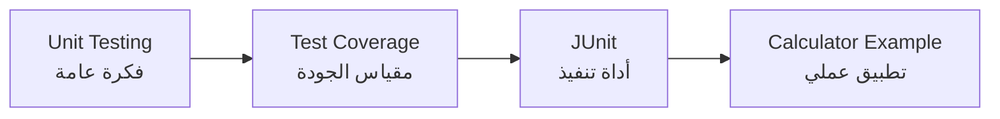
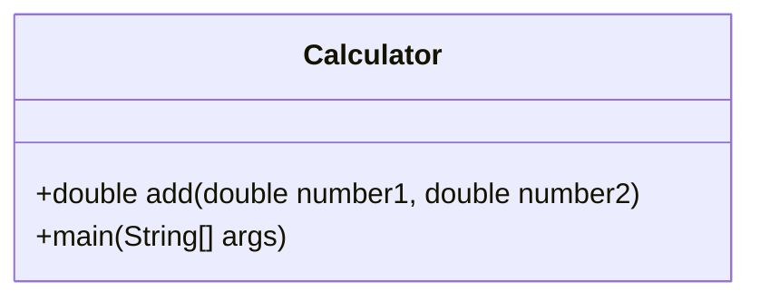
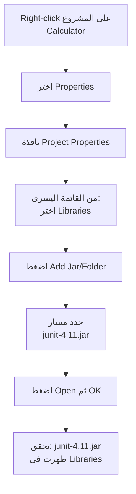
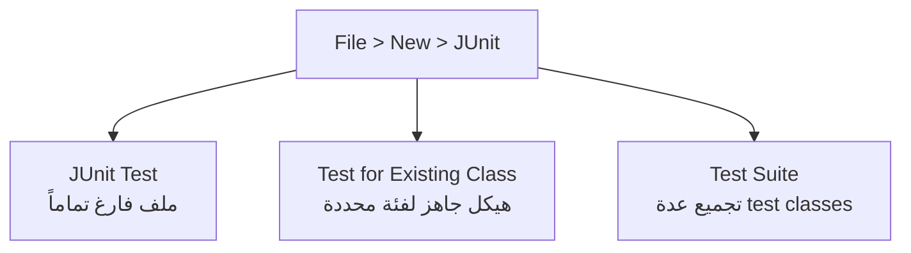
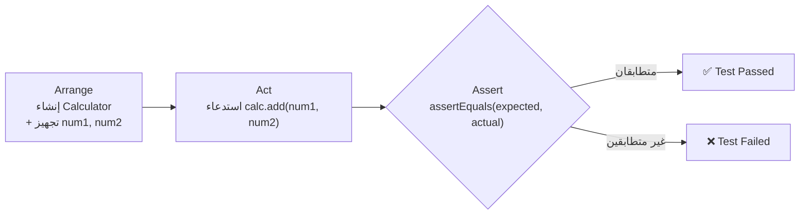
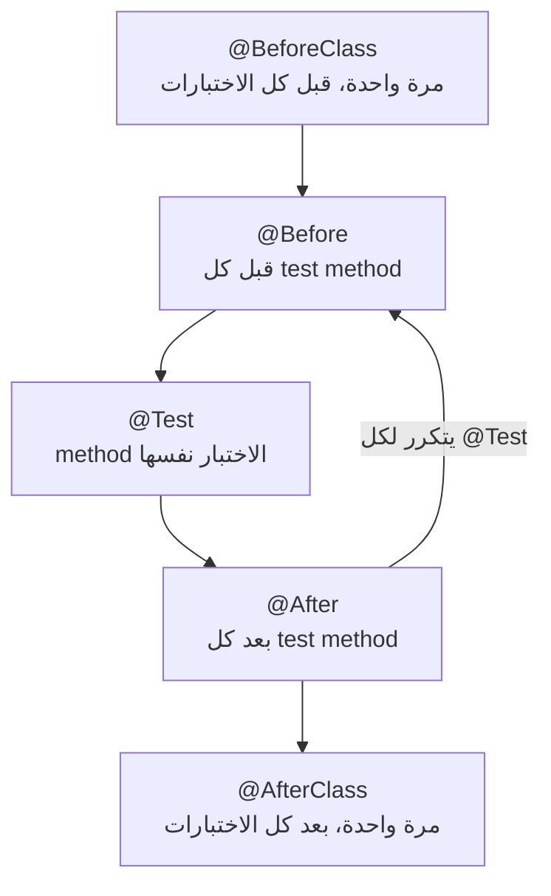
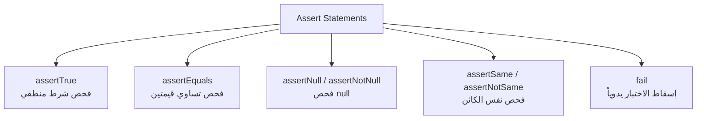
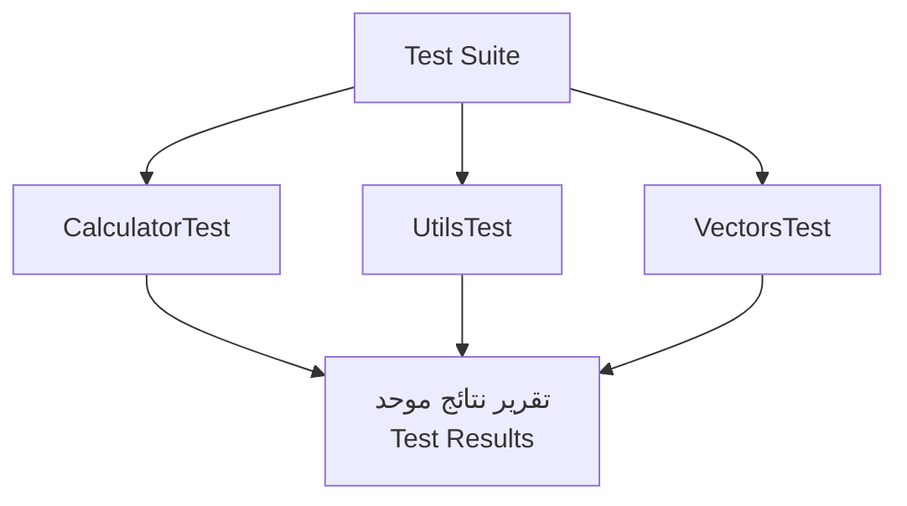
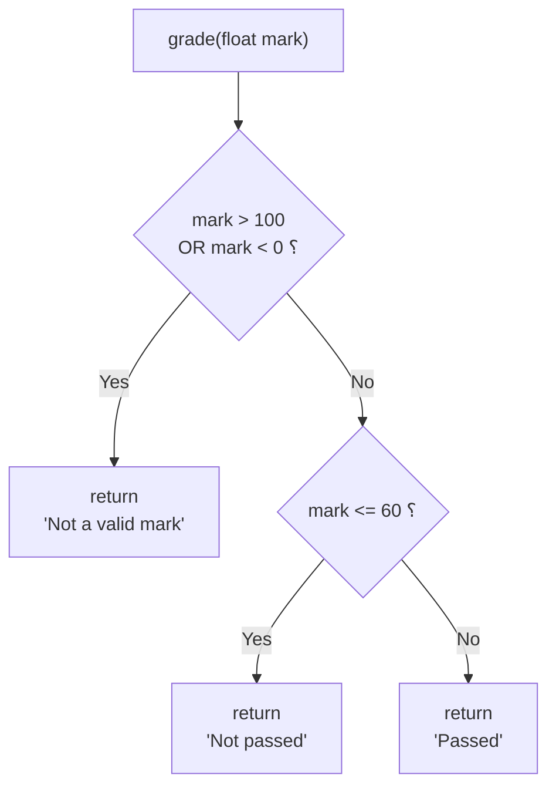

# المحاضرة 6 — JUnit (اختبار الوحدة بلغة Java)
> **المادة:** هندسة البرمجيات (المستوى الثالث) | **الموضوع:** أطر اختبار الوحدة — JUnit

---

## ملخص سريع قبل البدء

**عن ماذا هذه المحاضرة؟** نتعلم فيها كيف نستخدم مكتبة `JUnit` لكتابة اختبارات آلية (automated tests) للكود بدل ما نختبره يدوياً كل مرة.

**ليش يهمك؟** لو غيّرت سطر واحد في الكود بعد شهر، `JUnit` يخبرك خلال ثوانٍ هل كسرت شيء أم لا — بدل ما تكتشف الخطأ بعد ما يوصل للمستخدم.

**المتطلبات السابقة:**
- مفهوم `Unit Testing` (من المحاضرة السابقة)
- أساسيات Java (classes, methods, exceptions)
- استخدام IDE مثل NetBeans

**الخيط الناظم:**
```
Unit Testing (فكرة) → JUnit (أداة) → Annotations (كيف تكتب) → Assertions (كيف تتحقق) → Test Suite (كيف تنظّم) → Coverage (كيف تقيس الجودة)
```

---

## الجزء الأول: الشرح التفصيلي

### 1. مراجعة: Unit Testing و Test Coverage
<!-- @type: fact -->
<!-- @render: {type: "diagram-first", visualization: "flowchart", coverage: "100%"} -->
<!-- @connectivity: {prerequisite: "محاضرة سابقة عن Unit Testing"} -->

#### 📍 أين نحن الآن؟
نبدأ المحاضرة بمراجعة سريعة لمفاهيم أساسية قبل الدخول إلى `JUnit` نفسه.

#### ⬅️ الربط مع السابق
في المحاضرة الماضية تعرّفنا على فكرة `Unit Testing` بشكل عام؛ الآن سنربطها بأداة عملية تنفّذها.

#### 💡 الفكرة الأساسية
**`Unit Testing` هو اختبار أصغر وحدة قابلة للاختبار في الكود (عادة method واحدة) بمعزل عن باقي النظام، و`Test Coverage` هو نسبة الكود الذي فعلاً "لمسته" الاختبارات.**

---

#### 📊 المخطط: من الفكرة إلى الأداة



**الشرح:** المحاضرة تنتقل من الفكرة (اختبار الوحدة) إلى مقياسها (التغطية) ثم إلى الأداة العملية (`JUnit`) ثم لمثال حقيقي.

---

#### 📖 الشرح

`Unit Testing` معناه إنك تختبر أصغر جزء ممكن من الكود — غالباً method واحدة — بشكل منفصل عن باقي البرنامج، عشان تتأكد إنها تعطي النتيجة الصحيحة لمدخلات معينة.

`Test Coverage` هو سؤال: "الاختبارات اللي كتبتها، لمست كم بالمئة من الكود الحقيقي؟" مثلاً لو عندك method فيها 3 حالات (`if / else if / else`) وأنت كتبت اختبار لحالة واحدة بس، تغطيتك ناقصة — لأن فيه احتمالين ما تم اختبارهما أبداً.

`JUnit` هي مكتبة (framework) لغة Java تساعدك تكتب وتشغّل هذه الاختبارات بشكل آلي، بدل ما تكتب `System.out.println` وتتأكد بعينك من النتيجة كل مرة.

#### 🎯 الملخص السريع
- `Unit Testing` = اختبار أصغر وحدة كود بمعزل عن الباقي
- `Test Coverage` = نسبة الكود الذي غطّته الاختبارات فعلياً
- `JUnit` = أداة تنفّذ هذا الاختبار آلياً في Java

#### 📚 التطبيق
هذه المفاهيم الثلاثة هي الأساس لكل ما يأتي في المحاضرة: سنتعلم أداة (`JUnit`) تطبّق فكرة (`Unit Testing`) وتساعدنا نقيس (`Coverage`).

#### ⚠️ أخطاء شائعة

#### الفهم الخاطئ ❌:
تغطية 100% تعني إن الكود خالٍ من الأخطاء تماماً.

#### الفهم الصحيح ✅:
تغطية 100% تعني إن كل سطر تم تنفيذه أثناء الاختبار، لكن هذا لا يضمن اختبار كل القيم أو الحالات الحدّية (`edge cases`) — ممكن يكون فيه bug والتغطية 100%.

#### 📄 النص الأصلي من المحاضرة
<details>
<summary>عرض النص الأصلي (coverage: 100%)</summary>

> From previous lecture, what is unit testing? What is the test coverage — a percentage of what? What could JUnit do? Where do we get JUnit? Calculator is our simple example.

**ملاحظة على التغطية:**
- ✓ تم شرح كل الأسئلة المطروحة في الشريحة
- ℹ️ إضافة من الدليل: توضيح إن تغطية 100% لا تعني خلوّ الكود من الأخطاء

</details>

---

### 2. مثال Calculator Class
<!-- @type: fact -->
<!-- @render: {type: "diagram-first", coverage: "100%"} -->
<!-- @connectivity: {prerequisite: "1"} -->

#### 📍 أين نحن الآن؟
قبل كتابة أي اختبار، نحتاج كود حقيقي لاختباره — هذا هو مثالنا طوال المحاضرة.

#### ⬅️ الربط مع السابق
بعد فهم فكرة `Unit Testing`، نحتاج "وحدة" فعلية لنختبرها.

#### 💡 الفكرة الأساسية
**`Calculator` هي فئة Java بسيطة فيها method واحدة (`add`) ستكون "الوحدة" التي نطبّق عليها كل مفاهيم `JUnit` في هذه المحاضرة.**

---

#### 📊 المخطط: بنية Calculator Class



**شرح العناصر:**
- **`add(double, double)`:** method عامة (`public`) تستقبل رقمين وترجع ناتج جمعهما
- **`main(String[] args)`:** نقطة تشغيل البرنامج، فارغة هنا (فقط للتشغيل المباشر)

**التطبيق في هذا السياق:** هذه الفئة البسيطة كافية لتوضيح كل أفكار `JUnit` بدون تعقيد إضافي.

---

#### 📖 الشرح

الكود التالي هو مثالنا:

```java
package calculator;

public class Calculator {
    public double add(double number1, double number2) {
        return number1 + number2;
    }

    public static void main(String[] args) {
        // TODO code application logic here
    }
}
```

`add` هي "الوحدة" (`unit`) التي سنكتب لها اختبار `JUnit`. اختيار مثال بسيط جداً (جمع رقمين) مقصود — عشان التركيز يكون على **كيف نستخدم JUnit** مش على تعقيد منطق الكود نفسه.

#### 🎯 الملخص السريع
- الفئة فيها method واحدة قابلة للاختبار: `add`
- الهدف: مثال بسيط يوضّح آلية JUnit كاملة

#### 📚 التطبيق
سنستخدم نفس هذه الفئة في كل الأمثلة القادمة: إعداد المكتبة، كتابة test class، الـ Annotations، والـ Assertions.

#### 📄 النص الأصلي من المحاضرة
<details>
<summary>عرض النص الأصلي (coverage: 100%)</summary>

> package calculator; public class Calculator { public double add(double number1, double number2) { return number1 + number2; } public static void main(String[] args) { // TODO code application logic here } }

</details>

---

### 3. إعداد مكتبة JUnit ضمن NetBeans
<!-- @type: practice -->
<!-- @render: {type: "diagram-first", visualization: "flowchart", coverage: "100%"} -->
<!-- @connectivity: {prerequisite: "2"} -->

#### 📍 أين نحن الآن؟
قبل كتابة أي اختبار، لازم نضيف مكتبة `JUnit` إلى المشروع في الـ IDE.

#### ⬅️ الربط مع السابق
عندنا الآن كود (`Calculator`)، لكن NetBeans لا "يعرف" `JUnit` تلقائياً — لازم نربط المكتبة يدوياً.

#### 💡 الفكرة الأساسية
**قبل استخدام `JUnit`، يجب إضافة ملف المكتبة (`junit-4.11.jar`) إلى Project Properties في NetBeans حتى تصبح الـ annotations والـ classes الخاصة به متاحة.**

---

#### 📊 المخطط: خطوات إضافة JUnit في NetBeans



**الشرح:** تسلسل نقرات ثابت في NetBeans لربط أي مكتبة خارجية (`jar`) بالمشروع، وهو نفس الأسلوب المستخدم لأي مكتبة خارجية أخرى لاحقاً.

---

#### 📖 الشرح

الخطوات بالتفصيل:
1. **Right-click** على مشروع `Calculator` في شجرة المشاريع
2. اختر **Properties** ← تفتح نافذة `Project Properties`
3. من اللوحة اليسرى (Categories) اختر **Libraries**
4. اضغط زر **Add Jar/Folder**
5. حدّد مسار ملف المكتبة **`junit-4.11.jar`**
6. اضغط **Open** ثم **OK**

بعدها لازم تتأكد إن `junit-4.11.jar` ظهرت فعلاً تحت قسم **Libraries** في شجرة المشروع — هذا تأكيد إن الربط نجح، وإذا ما ظهرت يعني الخطوة السابقة فيها مشكلة (مسار خاطئ مثلاً).

ملاحظة مهمة من الشريحة: عند إنشاء test class جديد، NetBeans يسألك عن **إصدار JUnit** — `JUnit 3.x` أو `JUnit 4.x`. المحاضرة تستخدم `JUnit 4.x` لأنه يدعم الـ `annotations` (مثل `@Test`) بدل الطريقة القديمة بالوراثة من `TestCase`.

#### 🎯 الملخص السريع
- المكتبة تُضاف عبر: Right-click ← Properties ← Libraries ← Add Jar/Folder
- لازم تتحقق إنها ظهرت فعلاً في قائمة Libraries
- عند إنشاء test class أول مرة، اختر `JUnit 4.x` وليس `3.x`

#### 📚 التطبيق
بدون هذه الخطوة، لن تتعرّف NetBeans على `@Test` ولا `assertEquals` ولا أي عنصر من `JUnit` — هي شرط أساسي لكل ما يأتي بعدها.

#### ⚠️ أخطاء شائعة

#### الفهم الخاطئ ❌:
اختيار `JUnit 3.x` عند إنشاء test class لأنه "الخيار الأول" في القائمة.

#### الفهم الصحيح ✅:
اختر `JUnit 4.x` — لأن المحاضرة (والممارسة الحديثة) تعتمد على الـ annotations مثل `@Test` و`@Before`، وهذه غير متاحة بنفس الشكل في `JUnit 3.x`.

#### 📄 النص الأصلي من المحاضرة
<details>
<summary>عرض النص الأصلي (coverage: 100%)</summary>

> Add JUnit library to your IDE. In Netbeans: Right click on the Calculator project, choose Properties >> Project Properties window appears, On the left panel (Categories), select Libraries, Click on Add Jar/Folder button, Specify the path of JUnit library junit-4.11.jar, Click Open then OK. Select JUnit version for which the created test skeletons should be created: JUnit 3.x / JUnit 4.x.

</details>

---

### 4. إنشاء Test Class في NetBeans
<!-- @type: practice -->
<!-- @render: {type: "diagram-first", visualization: "flowchart", coverage: "100%"} -->
<!-- @connectivity: {prerequisite: "3"} -->

#### 📍 أين نحن الآن؟
بعد ربط المكتبة، نحتاج ننشئ ملف Test Class فعلي مرتبط بـ `Calculator`.

#### ⬅️ الربط مع السابق
المكتبة موجودة الآن في المشروع، لكن ما زلنا محتاجين ملف اختبار حقيقي يستخدمها.

#### 💡 الفكرة الأساسية
**من قائمة `File ➤ New ➤ JUnit`، نختار أحد نوعين: `JUnit Test` (ملف فارغ) أو `Test for Existing Class` (ملف جاهز يولّد هيكل اختبار لفئة موجودة مثل `Calculator`).**

---

#### 📊 المخطط: خيارات إنشاء ملف الاختبار



**الشرح:** ثلاثة خيارات — الأول للبدء من الصفر، الثاني (الأكثر شيوعاً هنا) يولّد تلقائياً methods مثل `setUp`/`tearDown` مرتبطة بفئة موجودة، والثالث لتجميع اختبارات متعددة (سنشرحه لاحقاً في قسم `Test Suite`).

---

#### 📖 الشرح

بعد اختيار **Test for Existing Class** وتحديد `Calculator`، يولّد NetBeans تلقائياً ملف باسم مثل `MyCalculatorTest` يحتوي على "هيكل" (skeleton) جاهز فيه عدة methods فارغة بانتظار أن تُكتب داخلها:

```java
public class MyCalculatorTest extends TestCase {

    public MyCalculatorTest() {
    }

    @BeforeClass
    public static void setUpClass() throws Exception {
    }

    @AfterClass
    public static void tearDownClass() throws Exception {
    }

    @Before
    public void setUp() {
    }

    @After
    public void tearDown() {
    }
}
```

الشريحة تنبّه بوضوح: **"Do not forget it"** — يعني لا تحذف هذه الـ methods المُولّدة تلقائياً حتى لو كانت فارغة، لأنها جزء من دورة حياة الاختبار (سنشرح دور كل واحدة في القسم القادم عن الـ Annotations).

#### 🎯 الملخص السريع
- المسار: `File ➤ New ➤ JUnit ➤ Test for Existing Class`
- NetBeans يولّد methods جاهزة (`setUpClass`, `tearDownClass`, `setUp`, `tearDown`)
- لا تحذف هذه الـ methods المُولّدة حتى لو بدت فارغة

#### 📚 التطبيق
هذا الملف المُولّد هو "القالب" الذي سنضيف داخله method الاختبار الفعلية `testAdd()` في القسم القادم.

#### 📄 النص الأصلي من المحاضرة
<details>
<summary>عرض النص الأصلي (coverage: 100%)</summary>

> Adding test class: File > New > JUnit: JUnit Test (creates an empty JUnit test class), Test for Existing Class (creates a simple test case for testing methods of a single class). [Generated Methods with note: "Do not forget it"]

</details>

---

### 5. كتابة وتشغيل أول اختبار (testAdd)
<!-- @type: practice -->
<!-- @render: {type: "diagram-first", visualization: "flowchart", coverage: "100%"} -->
<!-- @connectivity: {prerequisite: "4"} -->

#### 📍 أين نحن الآن؟
عندنا الآن ملف اختبار جاهز — الوقت لكتابة أول اختبار فعلي وتشغيله.

#### ⬅️ الربط مع السابق
بعد إنشاء الهيكل الفارغ، نملأه بمنطق اختبار حقيقي لـ method الـ `add`.

#### 💡 الفكرة الأساسية
**اختبار `JUnit` النموذجي يتبع نمط ثابت: جهّز البيانات (Arrange) → نفّذ الـ method (Act) → تحقق من النتيجة بـ `assert` (Assert).**

---

#### 📊 المخطط: تدفق تنفيذ الاختبار (Arrange–Act–Assert)



**الشرح:** هذا هو النمط الأساسي لأي method اختبار في `JUnit`: تجهيز، تنفيذ، ثم مقارنة بين النتيجة المتوقعة (`expected`) والنتيجة الفعلية (`actual`).

---

#### 📖 الشرح

الكود الفعلي من الشريحة:

```java
@Test
public void testAdd() {
    Calculator calc = new Calculator();
    long num1 = 5;
    long num2 = 7;
    double expectedResult = 12;
    double actualResult = calc.add(num1, num2);
    assertEquals("Expected " + expectedResult, expectedResult, actualResult, 0);
}
```

نلاحظ:
- `@Test` فوق الـ method: هذا ما يخبر `JUnit` أن هذه method اختبار فعلياً (وليست method عادية) — سنفصّلها في القسم القادم
- `expectedResult` هي القيمة "الصحيحة" اللي نتوقعها (12)
- `actualResult` هي القيمة اللي رجعتها method الـ `add` فعلياً
- `assertEquals` تقارن بينهما

لتشغيل الاختبار: **Right-click على ملف الاختبار ← Test File**. تظهر نافذة `Test Results` بشريط أخضر (كل الاختبارات نجحت) أو أحمر (فشل واحد أو أكثر منها).

الشريحة توضّح تجربة عملية: بعد نجاح الاختبار (100%، شريط أخضر)، إذا **تعمّدنا إدخال خطأ** في method الـ `add` (مثلاً استبدال `+` بـ `-`)، تشغيل الاختبار من جديد يعطي شريط أحمر برسالة دقيقة:

```
testAdd FAILED: Expected 12.0 expected:<12.0> but was:<-2.0>
junit.framework.AssertionFailedError
at calculator.MyCalculatorTest.testAdd(MyCalculatorTest.java:47)
```

هذه هي فائدة `JUnit` الحقيقية: بدل ما تكتشف الخطأ يدوياً، الاختبار يخبرك **بالضبط** أين حصل الخطأ وما الفرق بين المتوقع والفعلي.

#### 🎯 الملخص السريع
- كل اختبار = تجهيز بيانات → استدعاء method → `assert` للمقارنة
- التشغيل: Right-click على ملف الاختبار ← Test File
- شريط أخضر = نجاح كل الاختبارات، أحمر = فشل واحد على الأقل مع رسالة دقيقة لسبب الفشل

#### 📚 التطبيق
هذا هو جوهر `Test-Driven` workflow اليومي: تكتب كود، تشغّل الاختبار، تصلح أي فشل فوراً، وتكرر.

#### ⚠️ أخطاء شائعة

#### الفهم الخاطئ ❌:
رسالة الفشل مثل `expected:<12.0> but was:<-2.0>` تعني إن `JUnit` نفسه فيه خطأ.

#### الفهم الصحيح ✅:
هذه الرسالة تعني إن الكود المُختبَر (`Calculator.add`) هو اللي فيه الخطأ — `JUnit` فقط يبلّغ عن الفرق بين ما توقعناه (`expected`) وما حصل فعلياً (`actual`).

#### 📄 النص الأصلي من المحاضرة
<details>
<summary>عرض النص الأصلي (coverage: 100%)</summary>

> Write your want test: @Test public void testAdd(){ Calculator calc = new Calculator(); long num1 = 5; long num2 = 7; double expectedResult = 12; double actualResult = calc.add(num1,num2); assertEquals("Expected " + expectedResult, expectedResult, actualResult, 0); } — Run it (right click on test file, choose Test File). The test passed (100.00%). Introduce some error in add method (replace + by -) → testAdd FAILED: Expected 12.0 expected:<12.0> but was:<-2.0>.

</details>

---

### 6. JUnit Annotations
<!-- @type: fact -->
<!-- @render: {type: "diagram-first", visualization: "flowchart", coverage: "100%"} -->
<!-- @connectivity: {prerequisite: "5"} -->

#### 📍 أين نحن الآن؟
رأينا `@Test` عملياً، الآن نتعرّف على كل الـ annotations التي توفرها `JUnit` ودور كل واحدة.

#### ⬅️ الربط مع السابق
في القسم السابق استخدمنا `@Test` بدون شرح تفصيلي — هنا نغطي كل الـ annotations، ومنها ما رأيناه مُولَّداً تلقائياً في الملف (`@Before`, `@After`, إلخ).

#### 💡 الفكرة الأساسية
**كل `annotation` في `JUnit` تحدد "متى" تُنفَّذ method معينة بالنسبة لدورة حياة الاختبار — قبل الكل، قبل كل اختبار، أثناء الاختبار نفسه، بعد كل اختبار، أو بعد الكل.**

---

#### 📊 المخطط: دورة حياة تنفيذ اختبارات JUnit



**الشرح:** `@BeforeClass` و`@AfterClass` يُنفَّذان مرة واحدة فقط لكل الفئة، بينما `@Before` و`@After` يتكرران حول **كل** method اختبار على حدة.

---

#### 📖 الشرح

| Annotation | التوقيع | الوصف |
| --- | --- | --- |
| `@Test` | `public void method()` | تُحدّد أن هذه method هي اختبار فعلي |
| `@Before` | `public void method()` | تُنفَّذ قبل كل اختبار — لتجهيز بيئة الاختبار (مثل قراءة بيانات، تهيئة الكائنات) |
| `@After` | `public void method()` | تُنفَّذ بعد كل اختبار — لتنظيف البيئة (حذف بيانات مؤقتة، إعادة القيم الافتراضية) وتوفير الذاكرة |
| `@BeforeClass` | `public static void method()` | تُنفَّذ **مرة واحدة فقط** قبل بداية كل الاختبارات — مفيدة لعمليات مكلفة زمنياً مثل الاتصال بقاعدة بيانات. **يجب** أن تكون `static` |
| `@AfterClass` | `public static void method()` | تُنفَّذ **مرة واحدة فقط** بعد انتهاء كل الاختبارات — لعمليات التنظيف مثل قطع الاتصال بقاعدة البيانات. **يجب** أن تكون `static` |
| `@Ignore` | — | تتجاهل method الاختبار — مفيدة إذا تغيّر الكود ولم يُحدَّث الاختبار بعد، أو إذا كان وقت تنفيذها طويلاً جداً |
| `@Test(timeout=100)` | — | يفشل الاختبار إذا استغرقت method أكثر من 100 ميلي ثانية |
| `@Test(expected = Exception.class)` | — | يفشل الاختبار إذا **لم** تُطلق method الاستثناء (`exception`) المحدد |

نقطة مهمة جداً على `@BeforeClass` و`@AfterClass`: يجب أن تكون كلاهما `static` — وإلا لن يتعرّف عليهما `JUnit`، لأنهما مرتبطتان بالفئة نفسها وليس بكائن (`instance`) واحد.

#### 🎯 الملخص السريع
- `@Test` = هذه method اختبار
- `@Before` / `@After` = قبل/بعد **كل** اختبار
- `@BeforeClass` / `@AfterClass` = مرة واحدة فقط، ويجب أن تكونا `static`
- `@Ignore` = تجاهل مؤقت
- `@Test(timeout=..)` و `@Test(expected=..)` = خيارات إضافية على `@Test`

#### 📚 التطبيق
هذه الـ annotations هي بالضبط ما رأيناه مُولَّداً تلقائياً في القسم السابق (`setUpClass`, `tearDownClass`, `setUp`, `tearDown`) — الآن نفهم دور كل واحدة بدل حذفها بدون فهم.

#### ⚠️ أخطاء شائعة

#### الفهم الخاطئ ❌:
حذف method مثل `setUp()` أو `tearDown()` لأنها فارغة وتبدو "غير ضرورية".

#### الفهم الصحيح ✅:
حتى لو كانت فارغة الآن، هذه الـ methods جزء من دورة حياة الاختبار الرسمية — تُملأ لاحقاً بمنطق التجهيز أو التنظيف عند الحاجة، ومن الأفضل تركها كإطار جاهز.

#### 📄 النص الأصلي من المحاضرة
<details>
<summary>عرض النص الأصلي (coverage: 100%)</summary>

> @Test public void method() — Identifies that a method is a test method. @Before public void method() — Executes the method before each test... @After public void method() — Executes the method after each test... @BeforeClass public static void method() — Executes the method once, before the start of all tests... Methods annotated with this annotation need to be defined as static to work with JUnit. @AfterClass public static void method() — Executes the method once, after all tests have been finished... @Ignore — Ignores the test method... @Test(timeout=100) — Fails, if the method takes longer than 100 milliseconds. @Test (expected = Exception.class) — Fails, if the method does not throw the named exception.

</details>

---

### 7. Assert Statements
<!-- @type: fact -->
<!-- @render: {type: "diagram-first", visualization: "comparison", coverage: "100%"} -->
<!-- @connectivity: {prerequisite: "6"} -->

#### 📍 أين نحن الآن؟
فهمنا متى تُنفَّذ method الاختبار (Annotations) — الآن نتعرف على "كيف" نتحقق داخلها من صحة النتيجة.

#### ⬅️ الربط مع السابق
استخدمنا `assertEquals` في مثال `testAdd` بدون شرح باقي الخيارات — هنا نغطيها جميعاً.

#### 💡 الفكرة الأساسية
**`assert statements` هي جمل الفحص التي تقارن بين النتيجة المتوقعة والنتيجة الفعلية، وتُسقط (`fail`) الاختبار تلقائياً إذا لم تتطابقا.**

---

#### 📊 المخطط: أنواع Assert Statements



**الشرح:** كل نوع فحص يخدم غرضاً مختلفاً — من فحص شرط بسيط إلى فحص إن كائنين هما فعلياً نفس الكائن في الذاكرة.

---

#### 📖 الشرح

كل الـ statements التالية تقبل باراميتر `[msg]` **اختياري** في البداية (رسالة تظهر عند الفشل):

| Statement | الوصف |
| --- | --- |
| `assertTrue([msg], boolean condition)` | يتحقق أن الشرط المنطقي `true` |
| `assertEquals([msg], expected, actual)` | يتحقق أن القيمتين متطابقتان. **ملاحظة:** مع الـ arrays يُقارَن المرجع (`reference`) وليس المحتوى |
| `assertEquals([msg], expected, actual, tolerance)` | خاصة بـ `float`/`double` — `tolerance` هو عدد الخانات العشرية التي يجب أن تتطابق |
| `assertNull([msg], object)` | يتحقق أن الكائن يساوي `null` |
| `assertNotNull([msg], object)` | يتحقق أن الكائن **لا** يساوي `null` |
| `assertSame([msg], expected, actual)` | يتحقق أن المتغيرين يشيران لنفس الكائن (نفس المرجع في الذاكرة) |
| `assertNotSame([msg], expected, actual)` | يتحقق أن المتغيرين يشيران لكائنين **مختلفين** |
| `fail(msg)` | يُسقط method الاختبار مباشرة — تُستخدم للتأكد أن جزءاً معيناً من الكود لا يُنفَّذ، أو لكتابة اختبار فاشل مؤقتاً قبل تنفيذ الكود المطلوب |

نقطة دقيقة جداً هنا: `assertEquals` مع الـ `arrays` يقارن **المرجع** فقط — يعني لو عندك مصفوفتين بنفس المحتوى بالضبط لكنهما كائنان مختلفان في الذاكرة، `assertEquals` سيفشل رغم تطابق المحتوى ظاهرياً. هذا الفرق مهم جداً لتجنّب الحيرة عند اختبار arrays.

#### 🎯 الملخص السريع
- `assertEquals` للأرقام الصحيحة والكائنات (مع تنبّه خاص للـ arrays)
- `assertEquals` مع `tolerance` للأرقام العشرية (`float`/`double`)
- `assertSame`/`assertNotSame` تفحص المرجع (الهوية) وليس المحتوى
- `fail()` لإسقاط الاختبار يدوياً في حالات خاصة

#### 📚 التطبيق
في مثال `testAdd`، استخدمنا `assertEquals(msg, expectedResult, actualResult, 0)` — الصفر هنا هو الـ `tolerance` لأن الناتج `double`.

#### ⚠️ أخطاء شائعة

#### الفهم الخاطئ ❌:
استخدام `assertEquals` مباشرة لمقارنة مصفوفتين (`arrays`) بنفس المحتوى ظناً أنه سيرجع `true`.

#### الفهم الصحيح ✅:
`assertEquals` مع الـ arrays يقارن المرجع (reference) وليس المحتوى — يجب استخدام أدوات مخصصة مثل `assertArrayEquals` لمقارنة محتوى المصفوفات فعلياً.

#### 📄 النص الأصلي من المحاضرة
<details>
<summary>عرض النص الأصلي (coverage: 100%)</summary>

> assertTrue([msg], boolean condition) — Checks that the boolean condition is true. assertsEquals([msg], expected, actual) — Tests that two values are the same. Note: for arrays the reference is checked not the content of the arrays. assertsEquals([msg], expected, actual, tolerance) — Test that float or double values match. The tolerance is the number of decimals which must be the same. assertNull([msg], object) — Checks that the object is null. assertNotNull([msg], object) — Checks that the object is not null. assertSame([msg], expected, actual) — Checks that both variables refer to the same object. assertNotSame([msg], expected, actual) — Checks that both variables refer to different objects. fail(msg) — Let the method fail...

</details>

---

### 8. Test Suite
<!-- @type: fact -->
<!-- @render: {type: "diagram-first", coverage: "100%"} -->
<!-- @connectivity: {prerequisite: "7"} -->

#### 📍 أين نحن الآن؟
عرفنا كيف نكتب اختبار واحد — الآن كيف نجمع عدة اختبارات معاً ونشغّلها دفعة واحدة.

#### ⬅️ الربط مع السابق
حتى الآن كل مثال كان test class واحد. المشاريع الحقيقية فيها عشرات test classes.

#### 💡 الفكرة الأساسية
**`Test Suite` هي طريقة لتجميع عدة test classes معاً وتشغيلها كمجموعة واحدة، بدل تشغيل كل ملف اختبار على حدة.**

---

#### 📊 المخطط: تجميع Test Classes في Test Suite



**الشرح:** بدل تشغيل كل test class بشكل منفصل، `Test Suite` يجمعها وينفّذها معاً، ويعرض النتيجة النهائية (مثلاً "4 نجحت، 1 فشلت") في تقرير واحد — تماماً كما ظهر في مثال `Test Results` سابقاً في المحاضرة الذي جمع أكثر من test class (`UtilsJUnit3Test`, `VectorsJUnit3Test`).

---

#### 📖 الشرح

من قائمة `File ➤ New ➤ JUnit` رأينا خياراً ثالثاً هو **Test Suite** — وهو ملف خاص يجمع مرجعاً لكل test classes التي تريد تشغيلها معاً. الفائدة العملية: في مشروع حقيقي فيه عشرات test classes، تشغيل كل ملف يدوياً مضيعة وقت — الحل هو `Test Suite` واحدة تشغّل الكل بضغطة واحدة وتعطيك تقرير موحد.

#### 🎯 الملخص السريع
- `Test Suite` تجمع عدة test classes في مجموعة واحدة
- تُنشأ من: `File ➤ New ➤ JUnit ➤ Test Suite`
- النتيجة تقرير موحد لكل الاختبارات المضمومة

#### 📚 التطبيق
في مشاريع كبيرة (عشرات أو مئات الفئات)، `Test Suite` ضرورية لتشغيل كل الاختبارات معاً بدل واحد تلو الآخر، خصوصاً قبل أي إصدار (`release`) جديد.

#### 📄 النص الأصلي من المحاضرة
<details>
<summary>عرض النص الأصلي (coverage: 100%)</summary>

> Several test classes could be combined into a test suite.

**ملاحظة على التغطية:**
- ✓ تم شرح الفكرة كما وردت (سطر واحد مختصر في المحاضرة)
- ℹ️ إضافة من الدليل: توضيح الفائدة العملية والمخطط التوضيحي، لأن الشريحة الأصلية مختصرة جداً

</details>

---

### 9. تمرين تطبيقي: اختبار method الـ grade
<!-- @type: practice -->
<!-- @render: {type: "diagram-first", visualization: "flowchart", coverage: "100%"} -->
<!-- @connectivity: {prerequisite: "8"} -->

#### 📍 أين نحن الآن؟
وصلنا لتمرين عملي يجمع كل ما تعلمناه: `@Test`, `assertEquals`, وحتى مفهوم الـ `coverage` (كم حالة نحتاج نختبر؟).

#### ⬅️ الربط مع السابق
بعد فهم الـ annotations والـ assertions، الوقت لتطبيقهم على method جديدة فيها منطق شرطي (`if/else`) أكثر تعقيداً من `add`.

#### 💡 الفكرة الأساسية
**method الـ `grade` فيها 3 مسارات منطقية مختلفة (`if / else if / else`) — لتغطية كاملة يجب كتابة اختبار واحد على الأقل لكل مسار.**

---

#### 📊 المخطط: مسارات method الـ grade



**الشرح:** ثلاث مسارات ممكنة — علامة غير صالحة، علامة راسبة، علامة ناجحة — كل واحد يحتاج اختباره بشكل مستقل لتحقيق تغطية كاملة (`100% branch coverage`).

---

#### 📖 الشرح

الكود المصدر (من الشريحة):

```java
public String grade(float mark) {
    if (mark > 100 || mark < 0)
        return "Not a valid mark";
    else if (mark <= 60)
        return "Not passed";
    else
        return "Passed";
}
```

لتغطية كل الفروع (`branches`) نحتاج **3 test methods** على الأقل:

```java
@Test
public void testGrade_invalidMark() {
    Calculator calc = new Calculator();
    assertEquals("Not a valid mark", calc.grade(150));
}

@Test
public void testGrade_notPassed() {
    Calculator calc = new Calculator();
    assertEquals("Not passed", calc.grade(45));
}

@Test
public void testGrade_passed() {
    Calculator calc = new Calculator();
    assertEquals("Passed", calc.grade(85));
}
```

كل test method تختبر **مساراً واحداً محدداً**. لو اكتفينا بالاختبار الأول فقط، تكون تغطيتنا للـ branch coverage عند 1/3 تقريباً — رغم أن الـ method كلها "لُمست" جزئياً.

#### 🎯 الملخص السريع
- عدد المسارات المنطقية = الحد الأدنى لعدد test methods المطلوبة لتغطية كاملة
- كل حالة حدّية (`mark = 0`, `mark = 100`, `mark = 60`) تستحق اختباراً خاصاً بها أيضاً
- تسمية methods واضحة (`testGrade_passed`) تسهّل قراءة تقرير النتائج

#### 📚 التطبيق
هذا التمرين يربط مباشرة بمفهوم `Branch Coverage` الذي سنغطيه في القسم الأخير من المحاضرة.

#### 📄 النص الأصلي من المحاضرة
<details>
<summary>عرض النص الأصلي (coverage: 100%)</summary>

> Write test for grade method: public String grade(float mark){ if (mark > 100 || mark < 0) return "Not a valid mark"; else if (mark <= 60) return "Not passed"; else return "Passed"; }

**ملاحظة على التغطية:**
- ✓ الكود المصدر منسوخ بالكامل من الشريحة
- ℹ️ إضافة من الدليل: حل التمرين (test methods) والمخطط التوضيحي، لأن المحاضرة طرحت السؤال دون حل جاهز

</details>

---

### 10. أنواع اختبار البرمجيات: White / Black / Gray Box
<!-- @type: fact -->
<!-- @render: {type: "diagram-first", visualization: "comparison", coverage: "100%"} -->
<!-- @connectivity: {prerequisite: "9"} -->

#### 📍 أين نحن الآن؟
بعد التطبيق العملي، تختم المحاضرة بمصطلحات نظرية مهمة "غير مرتبطة مباشرة بـ JUnit لكن ضرورية للفهم" كما ورد حرفياً في الشريحة الأخيرة.

#### ⬅️ الربط مع السابق
كل الاختبارات التي كتبناها في `JUnit` كانت من نوع معيّن — الآن نصنّفها ونتعرف على الأنواع الأخرى.

#### 💡 الفكرة الأساسية
**تصنيف الاختبار يعتمد على "كمية المعرفة" بالكود الداخلي: هل ترى الكود (White Box)، لا تراه (Black Box)، أم ترى جزءاً منه (Gray Box)؟**

---

#### 📊 المخطط: أنواع الاختبار حسب الرؤية للكود


**الشرح:** الفرق الجوهري هو مقدار المعرفة بالبنية الداخلية للكود أثناء تصميم الاختبار. اختبارات `JUnit` التي كتبناها في هذه المحاضرة (مثل تمرين `grade`) كانت `White Box` — لأننا رأينا كل الشروط (`if/else`) وصممنا اختباراً لكل مسار.

---

#### 📖 الشرح

- **`White Box Testing`:** المُختبِر يرى الكود الداخلي كاملاً (الشروط، الحلقات، المسارات) ويصمّم الاختبارات بناءً على هذه البنية — مثل ما فعلنا بالضبط في تمرين `grade` (اختبار لكل فرع منطقي).
- **`Black Box Testing`:** المُختبِر لا يرى الكود الداخلي إطلاقاً، فقط يعطي مدخلات ويتحقق من المخرجات المتوقعة، دون معرفة كيف تم الوصول لها داخلياً.
- **`Gray Box Testing`:** مزيج بين الاثنين — معرفة جزئية بالبنية الداخلية (مثلاً معرفة قاعدة البيانات المستخدمة) لكن بدون رؤية كامل الكود.

بالإضافة لذلك، تختم الشريحة بمصطلحين آخرين:

- **`Test-Driven Development (TDD)`:** أسلوب تطوير تُكتب فيه الاختبارات **قبل** كتابة الكود الفعلي — تكتب اختباراً يفشل (لأن الكود غير موجود بعد)، ثم تكتب أقل كود ممكن لينجح، ثم تُحسّن الكود.
- **`Coverage` (نوعان مذكوران في الشريحة):**
  - **`Method Coverage`:** نسبة الـ methods التي تم استدعاؤها/اختبارها من إجمالي methods البرنامج
  - **`Branch Coverage`:** نسبة المسارات المنطقية (`if/else`, `switch`) التي تم تنفيذها فعلياً أثناء الاختبار — كما رأينا في تمرين `grade` (3 فروع = 3 اختبارات لتغطية كاملة)

#### 🎯 الملخص السريع
- `White Box` = رؤية كاملة للكود → اختبارات مبنية على المسارات الداخلية
- `Black Box` = بدون رؤية للكود → اختبارات مبنية فقط على المدخلات/المخرجات
- `Gray Box` = معرفة جزئية بالداخل
- `TDD` = الاختبار يُكتب قبل الكود
- `Method Coverage` مقابل `Branch Coverage`: الأولى تحسب الـ methods المُختبرة، الثانية تحسب المسارات المنطقية المُختبرة

#### 📚 التطبيق
هذه المصطلحات تربط كل شيء تعلمناه: اختبار `JUnit` الذي كتبناه في هذه المحاضرة هو أداة تنفيذ لاختبارات `White Box` غالباً، ومقياسه هو الـ `Coverage` (Method أو Branch) الذي بدأنا المحاضرة بالسؤال عنه.

#### ⚠️ أخطاء شائعة

#### الفهم الخاطئ ❌:
اعتبار `Method Coverage` كافياً وحده للحكم على جودة الاختبارات.

#### الفهم الصحيح ✅:
method قد تكون "مُختبَرة" (استُدعيت مرة واحدة) لكن `Branch Coverage` الخاص بها منخفض جداً — مثل استدعاء `grade()` مرة واحدة بقيمة ناجحة فقط، بينما مسارا "غير صالحة" و"راسب" لم يُختبرا إطلاقاً.

#### 📄 النص الأصلي من المحاضرة
<details>
<summary>عرض النص الأصلي (coverage: 100%)</summary>

> Not related directly to JUnit, but important to know: White box testing, Black box testing, Gray box testing, Test-Driven Development (TDD), Coverage: Method, Branch.

</details>

---

### 11. مثال متكامل: دورة اختبار كاملة لـ Calculator
<!-- @type: example-for-topics-6-to-10 -->

#### 📌 السياق
لنربط كل شيء تعلمناه (Annotations, Assertions, Coverage) في سيناريو واحد متكامل: فريق تطوير يبني تطبيق حاسبة صغير ويريد ضمان جودته قبل الإصدار.

#### 💼 السيناريو (Real-World Example)
فريق يعمل على تطبيق `Calculator` فيه أيضاً method `grade`. قبل كل إصدار (`release`)، يشغّلون **كل** الاختبارات معاً عبر `Test Suite` واحدة تضم `CalculatorAddTest` و`CalculatorGradeTest`.

#### 💡 كيف تجتمع المفاهيم؟
- **`@BeforeClass`:** تُستخدم مرة واحدة لتجهيز كائن `Calculator` مشترك (توفيراً للوقت) قبل بدء كل الاختبارات
- **`@Test` + `assertEquals`:** كل حالة (جمع، علامة صالحة/غير صالحة/راسبة/ناجحة) لها method اختبار منفصلة بـ `assertEquals` للمقارنة
- **`Test Suite`:** تجمع `CalculatorAddTest` و`CalculatorGradeTest` معاً، فيشغّل الفريق كل الاختبارات بضغطة واحدة قبل كل إصدار
- **`Branch Coverage`:** بما أن method الـ `grade` فيها 3 مسارات، الفريق يتأكد من وجود 3 test methods على الأقل — لا يكتفون بمسار واحد
- **النتيجة:** تقرير موحد (شريط أخضر بالكامل) يعطي الفريق ثقة بأن الإصدار الجديد لم يكسر أي شيء

#### ⚠️ لو ما طبّقتهم صح؟
لو اكتفى الفريق باختبار مسار واحد فقط من `grade` (مثلاً "Passed" فقط)، ولاحقاً غيّر أحد المطورين شرط `mark <= 60` إلى `mark <= 65` بالخطأ، ستبقى كل الاختبارات "خضراء" رغم وجود خطأ فعلي — لأن المسار الذي انكسر لم يكن مُختبراً أصلاً. هذا بالضبط الفرق العملي بين "كتابة اختبار" و"تغطية كاملة".

---

## الجزء الثاني: ملخص شامل (Alternative Complete Reading)

هذه المحاضرة تدور حول أداة واحدة اسمها `JUnit`، وهي مكتبة في Java تساعدك تكتب اختبارات آلية للكود بدل ما تختبره يدوياً كل مرة بعين المبرمج. الفكرة الأساسية اللي تبدأ فيها المحاضرة هي مراجعة سريعة: `Unit Testing` معناه اختبار أصغر وحدة كود ممكنة — عادة method واحدة — بمعزل عن باقي النظام، و`Test Coverage` هو مقياس يجاوب سؤال "الاختبارات اللي كتبتها لمست كم بالمئة من الكود فعلياً؟". ومن المهم جداً تفهم إن نسبة تغطية 100% لا تعني إطلاقاً إن الكود خالٍ من الأخطاء — هي فقط تعني إن كل سطر تم تنفيذه أثناء الاختبار، لكن ممكن يكون فيه حالات حدّية (edge cases) ما اختُبرت بقيم مختلفة.

المثال العملي اللي ترافقنا معه طوال المحاضرة كان فئة بسيطة اسمها `Calculator` فيها method واحدة `add` تجمع رقمين وترجع الناتج. هذا المثال البسيط عن قصد — عشان التركيز يكون على "كيف نستخدم JUnit" وليس على تعقيد منطق الكود.

قبل ما نقدر نكتب أي اختبار، لازم نربط مكتبة `JUnit` بالمشروع في NetBeans، وهذي خطوات عملية ثابتة: نعمل right-click على المشروع، نختار Properties، من القائمة اليسرى نختار Libraries، نضغط Add Jar/Folder، نحدد مسار ملف `junit-4.11.jar`، ونضغط Open ثم OK. بعدها نتأكد إن الملف ظهر فعلاً تحت Libraries في شجرة المشروع. عند إنشاء test class جديد لأول مرة، NetBeans يسألك عن الإصدار — JUnit 3.x أو JUnit 4.x — والمحاضرة تستخدم 4.x لأنه يدعم الـ annotations الحديثة زي `@Test`.

بعد ربط المكتبة، ننشئ ملف اختبار من `File > New > JUnit`، وفيه ثلاثة خيارات: `JUnit Test` لملف فارغ تماماً، `Test for Existing Class` وهو الأكثر استخداماً لأنه يولّد تلقائياً هيكلاً جاهزاً مرتبطاً بفئة موجودة زي `Calculator`، و`Test Suite` لتجميع عدة test classes معاً. لما تختار Test for Existing Class، NetBeans يولّد لك تلقائياً ملف فيه عدة methods فارغة: `setUpClass`، `tearDownClass`، `setUp`، و`tearDown` — والشريحة تحذّرك بوضوح "Do not forget it" يعني لا تحذف هذه الـ methods حتى لو كانت فارغة، لأنها جزء من دورة حياة الاختبار الرسمية.

الآن نصل لجوهر الموضوع: الـ annotations. كل annotation في JUnit تحدد "متى" تُنفَّذ method بالنسبة لدورة حياة الاختبار. `@Test` تحدد إن هذه method هي اختبار فعلي. `@Before` تُنفَّذ قبل كل test method — مفيدة لتجهيز بيئة الاختبار زي قراءة بيانات أو تهيئة كائنات. `@After` تُنفَّذ بعد كل test method — لتنظيف البيئة وحذف البيانات المؤقتة وتوفير الذاكرة. أما `@BeforeClass` و`@AfterClass` فتُنفّذان مرة واحدة فقط لكل الفئة (وليس لكل method) — الأولى قبل بداية كل الاختبارات، مفيدة لعمليات مكلفة زمنياً زي الاتصال بقاعدة بيانات، والثانية بعد انتهاء كل الاختبارات، لعمليات تنظيف زي قطع الاتصال. نقطة تقنية مهمة جداً: `@BeforeClass` و`@AfterClass` يجب أن تكونا `static` وإلا لن يتعرّف عليهما JUnit إطلاقاً. بالإضافة لهذا فيه `@Ignore` لتجاهل اختبار مؤقتاً (مثلاً لو الكود تغيّر ولم يُحدَّث الاختبار بعد، أو إذا وقت التنفيذ طويل جداً)، و`@Test(timeout=100)` اللي يُسقط الاختبار لو استغرقت method أكثر من 100 ميلي ثانية، و`@Test(expected = Exception.class)` اللي يُسقط الاختبار لو **لم** تُطلق method الاستثناء المحدد.

بعد ما نعرف "متى" تُنفَّذ الـ methods، نحتاج نعرف "كيف" نتحقق من صحة النتيجة داخلها — وهنا تدخل الـ assert statements. `assertTrue` تفحص إن شرط منطقي صحيح. `assertEquals` تفحص تطابق قيمتين — لكن انتبه: مع المصفوفات (arrays) هي تقارن المرجع (reference) وليس المحتوى، يعني مصفوفتين متطابقتين بالمحتوى لكن كائنين مختلفين في الذاكرة، assertEquals سيقول إنهما غير متطابقين. لو عندك أرقام عشرية (float أو double)، تستخدم `assertEquals` بنسخة فيها باراميتر إضافي اسمه tolerance وهو عدد الخانات العشرية المطلوب تطابقها — بالضبط زي ما استخدمناها في مثال testAdd مع tolerance = 0. `assertNull` و`assertNotNull` تفحصان إن كائن يساوي أو لا يساوي null. `assertSame` و`assertNotSame` تفحصان إن متغيرين يشيران لنفس الكائن فعلياً في الذاكرة (الهوية) وليس فقط تشابه القيمة. وأخيراً `fail(msg)` تُسقط الاختبار مباشرة، مفيدة للتأكد إن جزء من الكود ما يُنفَّذ إطلاقاً، أو لكتابة اختبار فاشل مؤقتاً كخطوة أولى قبل تنفيذ الكود المطلوب — وهذا فعلياً جزء من فلسفة TDD اللي بنشرحها بعدين.

بعد ما نتقن كتابة اختبار واحد بمثال testAdd الكامل، شفنا كيف يبدو الاختبار في الواقع: تجهيز البيانات (Arrange) — إنشاء كائن Calculator وتحديد num1 و num2 — ثم تنفيذ الـ method (Act) — استدعاء calc.add(num1, num2) — ثم التحقق (Assert) — استخدام assertEquals للمقارنة بين expectedResult و actualResult. لتشغيل الاختبار نعمل right-click على ملف الاختبار ونختار Test File، وتظهر نافذة Test Results بشريط أخضر إذا نجح كل شيء أو أحمر إذا فشل. المحاضرة عرضت تجربة عملية مهمة جداً: بعد نجاح الاختبار، تعمّدوا إدخال خطأ في method الـ add (استبدلوا + بـ -)، وشغّلوا الاختبار من جديد، فظهرت رسالة فشل دقيقة جداً: "Expected 12.0 expected:<12.0> but was:<-2.0>" مع تحديد بالضبط السطر اللي فيه المشكلة. هذا هو جوهر فائدة JUnit: بدل ما تكتشف الخطأ يدوياً بعد وقت طويل، الأداة تخبرك فوراً وبدقة أين المشكلة والفرق بين المتوقع والفعلي.

لما تكبر مشاريعك ويصير عندك عشرات test classes، تصير عملية تشغيل كل ملف على حدة مضيعة وقت — هنا يجي دور Test Suite، وهي ملف خاص يجمع مرجعاً لعدة test classes ويشغّلها كلها معاً بتقرير نتائج موحد.

بعدين المحاضرة تعطينا تمريناً تطبيقياً مهماً جداً لأنه يربط كل المفاهيم: method اسمها grade فيها منطق if/else if/else — لو العلامة أكبر من 100 أو أقل من صفر ترجع "Not a valid mark"، لو أقل من أو يساوي 60 ترجع "Not passed"، غير كذا ترجع "Passed". هذا التمرين يوضح مفهوم مهم جداً: عدد المسارات المنطقية في الكود يحدد الحد الأدنى لعدد test methods التي تحتاجها لتغطية كاملة. بما إن فيه 3 مسارات (فروع)، تحتاج 3 test methods على الأقل، كل واحدة تختبر مساراً محدداً — لو اكتفيت بمسار واحد بس، تغطية الفروع (Branch Coverage) بتاعتك تكون تقريباً 1/3 فقط، حتى لو الـ method "لُمست" واستُدعيت.

وتنتهي المحاضرة بمصطلحات نظرية عامة (الشريحة نفسها تقول "Not related directly to JUnit, but important to know") لكنها مهمة جداً للفهم الشامل: White Box Testing هو لما المُختبِر يرى الكود الداخلي كاملاً ويصمم اختباراته بناءً على البنية — بالضبط زي ما فعلنا في تمرين grade. Black Box Testing عكسه تماماً، المُختبِر لا يرى الكود إطلاقاً، فقط يعطي مدخلات ويتحقق من مخرجات متوقعة. Gray Box Testing مزيج بينهما — معرفة جزئية بالداخل. أما Test-Driven Development (TDD) فهو أسلوب تطوير مختلف تماماً في الترتيب: تكتب الاختبار أولاً (وهو طبيعياً سيفشل لأن الكود غير موجود بعد)، ثم تكتب أقل كود ممكن ليجتاز الاختبار، ثم تُحسّن الكود لاحقاً. وأخيراً فيه نوعان من الـ Coverage مذكوران صراحة في الشريحة الأخيرة: Method Coverage اللي يحسب نسبة الـ methods المُستدعاة/المُختبرة من الإجمالي، و Branch Coverage اللي يحسب نسبة المسارات المنطقية (if/else) المُنفَّذة فعلياً — وهذا بالضبط ما رأيناه في تمرين grade، حيث Method Coverage ممكن يكون 100% (استُدعيت الـ method) بينما Branch Coverage يكون منخفض جداً لو ما اختبرنا كل المسارات الثلاثة.

النقطة اللي لازم تتذكرها للامتحان: JUnit أداة، مو فكرة — الفكرة هي Unit Testing، والمقياس هو Coverage (بنوعيه)، وJUnit هو الأداة اللي تنفّذ الفكرة وتساعدك تحسب المقياس. وأي سؤال يجي عن annotations، ركّز على الفرق بين اللي تتكرر لكل test (@Before, @After) واللي تُنفَّذ مرة واحدة فقط (@BeforeClass, @AfterClass، ولازم تكونا static). وأي سؤال عن assertEquals مع arrays، تذكر إنها تقارن reference وليس المحتوى.

---

## الجزء الثالث: أسئلة اختيار من متعدد (MCQ)

### السؤال 1 (Easy)

**السؤال:** Which annotation identifies a method as an actual test method in JUnit?

أ) `@Before`
ب) `@Test`
ج) `@Ignore`
د) `@Suite`

**الإجابة الصحيحة:** ب

**التعليل الكامل:**
- ❌ أ): `@Before` تُنفَّذ قبل كل اختبار لتجهيز البيئة، وليست هي الاختبار نفسه
- ✅ ب): `@Test` هي الـ annotation التي تحدد أن هذه الـ method اختبار فعلي يجب تشغيله
- ❌ ج): `@Ignore` تُستخدم لتجاهل اختبار موجود، وليست لتحديد method كاختبار
- ❌ د): `@Suite` ليست annotation من الأنواع المذكورة في المحاضرة لتحديد method اختبار

---

### السؤال 2 (Medium)

**السؤال:** In the Calculator example, what happens when the `+` operator in the `add` method is replaced by `-`?

أ) `JUnit` refuses to compile the project
ب) The test `testAdd` fails with a message showing expected vs. actual values
ج) NetBeans automatically fixes the operator
د) The test passes because JUnit ignores arithmetic errors

**الإجابة الصحيحة:** ب

**التعليل الكامل:**
- ❌ أ): تغيير العامل الحسابي لا يسبب خطأ في الترجمة (compile error)، الكود سليم نحوياً
- ✅ ب): كما ظهر في الشريحة، يفشل الاختبار برسالة دقيقة مثل "expected:<12.0> but was:<-2.0>"
- ❌ ج): NetBeans لا يصلح الأخطاء المنطقية تلقائياً، هذه مسؤولية المبرمج
- ❌ د): JUnit تحديداً وُجد لاكتشاف هذا النوع من الأخطاء المنطقية، وليس تجاهلها

---

### السؤال 3 (Easy)

**السؤال:** Which two annotations must be declared as `static` to work properly with JUnit?

أ) `@Test` and `@Ignore`
ب) `@Before` and `@After`
ج) `@BeforeClass` and `@AfterClass`
د) `@Test` and `@Before`

**الإجابة الصحيحة:** ج

**التعليل الكامل:**
- ❌ أ): `@Test` و`@Ignore` لا يُشترط أن تكونا `static`
- ❌ ب): `@Before` و`@After` تُنفَّذان لكل اختبار على مستوى الكائن (instance)، وليست `static`
- ✅ ج): المحاضرة نصّت صراحة إن `@BeforeClass` و`@AfterClass` يجب أن تكونا `static` للعمل مع JUnit
- ❌ د): `@Test` و`@Before` methods عادية غير static

---

### السؤال 4 (Medium)

**السؤال:** What is the key difference between `@Before` and `@BeforeClass`?

أ) `@Before` runs once for the whole class, `@BeforeClass` runs before each test
ب) `@Before` runs before each test method, `@BeforeClass` runs once before all tests
ج) They both run exactly the same number of times
د) `@BeforeClass` is only used for exception handling

**الإجابة الصحيحة:** ب

**التعليل الكامل:**
- ❌ أ): هذا عكس الترتيب الصحيح تماماً
- ✅ ب): كما هو موضح في جدول الـ annotations، `@Before` تتكرر مع كل test method بينما `@BeforeClass` تُنفَّذ مرة واحدة فقط
- ❌ ج): عدد مرات التنفيذ مختلف تماماً بينهما
- ❌ د): `@BeforeClass` تُستخدم لتحضيرات عامة مكلفة زمنياً مثل الاتصال بقاعدة بيانات، وليست حصراً لمعالجة الاستثناءات

---

### السؤال 5 (Hard)

**السؤال:** When using `assertEquals` to compare two arrays with identical content but different object references, what is the expected result?

أ) The test passes because array contents match
ب) A compile-time error occurs
ج) The test fails because references are compared, not content
د) JUnit automatically converts arrays to lists before comparing

**الإجابة الصحيحة:** ج

**التعليل الكامل:**
- ❌ أ): هذا خطأ شائع — المحتوى المتطابق لا يكفي لأن المقارنة تتم على المرجع
- ❌ ب): لا يوجد خطأ في وقت الترجمة، المشكلة منطقية فقط في وقت التشغيل
- ✅ ج): المحاضرة نصّت صراحة إن `assertEquals` مع الـ arrays يفحص الـ reference وليس المحتوى، لذا الاختبار يفشل رغم تطابق المحتوى
- ❌ د): JUnit لا يقوم بأي تحويل تلقائي من arrays إلى lists

---

### السؤال 6 (Medium)

**السؤال:** Which assert statement is most appropriate for comparing two `double` values that may have small floating-point rounding differences?

أ) `assertTrue(expected == actual)`
ب) `assertEquals(expected, actual, tolerance)`
ج) `assertSame(expected, actual)`
د) `assertNotSame(expected, actual)`

**الإجابة الصحيحة:** ب

**التعليل الكامل:**
- ❌ أ): مقارنة `==` مباشرة على `double` غير موثوقة بسبب أخطاء التقريب العشري
- ✅ ب): `assertEquals` مع باراميتر `tolerance` مصمم خصيصاً لهذه الحالة كما ورد في جدول الـ Assert Statements
- ❌ ج): `assertSame` تفحص هوية الكائن (reference)، وليست مناسبة لمقارنة قيم عددية
- ❌ د): `assertNotSame` تفحص عدم تطابق المرجع، وهي عكس المطلوب هنا تماماً

---

### السؤال 7 (Easy)

**السؤال:** What does `@Ignore` do to a test method?

أ) It deletes the test method permanently
ب) It skips the test method during execution
ج) It converts the method into a `@BeforeClass` method
د) It forces the method to always pass

**الإجابة الصحيحة:** ب

**التعليل الكامل:**
- ❌ أ): `@Ignore` لا يحذف الـ method، فقط يتجاهلها مؤقتاً أثناء التشغيل
- ✅ ب): كما ورد في المحاضرة، تُستخدم عندما يتغيّر الكود الأساسي ولم يُحدَّث الاختبار بعد، أو عندما يكون وقت التنفيذ طويلاً جداً
- ❌ ج): لا علاقة لـ `@Ignore` بتحويل نوع الـ annotation
- ❌ د): `@Ignore` لا تُنفَّذ الـ method إطلاقاً، فلا معنى لنجاحها أو فشلها

---

### السؤال 8 (Medium)

**السؤال:** For the `grade` method with three logical branches (invalid, not passed, passed), how many test methods are minimally needed for full branch coverage?

أ) 1
ب) 2
ج) 3
د) 6

**الإجابة الصحيحة:** ج

**التعليل الكامل:**
- ❌ أ): اختبار واحد فقط يغطي مساراً واحداً من أصل ثلاثة
- ❌ ب): اختباران يتركان مساراً واحداً بلا تغطية
- ✅ ج): كما شُرح في التمرين التطبيقي، عدد المسارات المنطقية (3) يحدد الحد الأدنى لعدد test methods اللازمة لتغطية كل الفروع
- ❌ د): 6 أكثر من اللازم للحد الأدنى، رغم أن اختبارات إضافية للحالات الحدّية مفيدة لكنها ليست الحد الأدنى المطلوب

---

### السؤال 9 (Hard)

**السؤال:** A test class has 100% Method Coverage but low Branch Coverage. What does this MOST likely indicate?

أ) All methods were called, but not all internal logical paths were tested
ب) The test suite is definitely bug-free
ج) The code has no conditional statements at all
د) JUnit is not correctly installed

**الإجابة الصحيحة:** أ

**التعليل الكامل:**
- ✅ أ): هذا بالضبط ما حصل في تمرين `grade` — الـ method استُدعيت (Method Coverage عالية) لكن لم تُختبر كل المسارات (Branch Coverage منخفضة)
- ❌ ب): تغطية الطرق العالية لا تعني إطلاقاً خلو الكود من الأخطاء
- ❌ ج): لو الكود بدون شروط منطقية أصلاً، فلا معنى لمفهوم Branch Coverage نفسه هنا
- ❌ د): هذا الموقف لا علاقة له بتثبيت JUnit، بل بجودة تصميم الاختبارات

---

### السؤال 10 (Medium)

**السؤال:** What is the main characteristic that distinguishes White Box Testing from Black Box Testing?

أ) White Box testing is always automated, Black Box is always manual
ب) White Box testing is designed with knowledge of the internal code structure
ج) Black Box testing requires a debugger tool
د) There is no real difference between them

**الإجابة الصحيحة:** ب

**التعليل الكامل:**
- ❌ أ): كلاهما ممكن يكون آلياً أو يدوياً، هذا ليس معيار التفريق
- ✅ ب): كما ورد في المحاضرة، `White Box Testing` يعتمد على معرفة المُختبِر بالبنية الداخلية للكود، بعكس `Black Box`
- ❌ ج): استخدام أداة تصحيح الأخطاء ليس شرطاً لـ Black Box Testing
- ❌ د): هناك فرق جوهري في مقدار المعرفة بالكود الداخلي بين النوعين

---

### السؤال 11 (Easy)

**السؤال:** In Test-Driven Development (TDD), what is written FIRST?

أ) The final production code
ب) The user documentation
ج) The test, before the actual implementation code
د) The deployment scripts

**الإجابة الصحيحة:** ج

**التعليل الكامل:**
- ❌ أ): في TDD، الكود الفعلي يُكتب بعد الاختبار وليس قبله
- ❌ ب): التوثيق ليس جزءاً من دورة TDD الأساسية المذكورة في المحاضرة
- ✅ ج): TDD يعني كتابة الاختبار أولاً (وهو يفشل طبيعياً)، ثم كتابة الكود الذي يجعله ينجح
- ❌ د): سكربتات النشر خارج نطاق مفهوم TDD المذكور هنا

---

### السؤال 12 (Medium)

**السؤال:** To add the `junit-4.11.jar` library to a NetBeans project, which sequence is correct?

أ) File > New > JUnit > Add Library
ب) Right-click project > Properties > Libraries > Add Jar/Folder
ج) Tools > Options > Install JUnit
د) Run > Test File > Add Library

**الإجابة الصحيحة:** ب

**التعليل الكامل:**
- ❌ أ): هذا المسار مخصص لإنشاء ملفات اختبار جديدة، وليس لإضافة المكتبة نفسها
- ✅ ب): هذا هو التسلسل الدقيق الوارد في المحاضرة: Right-click على المشروع، Properties، Libraries، ثم Add Jar/Folder
- ❌ ج): لا يوجد مسار كهذا في NetBeans وفق المحاضرة
- ❌ د): هذا المسار يُستخدم لتشغيل الاختبارات، وليس لإضافة المكتبة

---

### السؤال 13 (Hard)

**السؤال:** Which statement about `@AfterClass` is FALSE?

أ) It runs once after all tests in the class have finished
ب) It is useful for cleanup activities such as disconnecting from a database
ج) It must be declared as `static`
د) It runs before each individual test method

**الإجابة الصحيحة:** د

**التعليل الكامل:**
- ❌ أ): هذه العبارة صحيحة وفق المحاضرة، لذا ليست الإجابة المطلوبة (نبحث عن الخطأ)
- ❌ ب): هذه العبارة صحيحة أيضاً — مثال قطع الاتصال بقاعدة البيانات مذكور حرفياً
- ❌ ج): هذه العبارة صحيحة، `@AfterClass` يجب أن تكون `static`
- ✅ د): هذه العبارة **خاطئة** — `@AfterClass` تُنفَّذ مرة واحدة بعد **كل** الاختبارات، وليست قبل كل method فردية (هذا دور `@Before`)

---

### السؤال 14 (Medium)

**السؤال:** What does `fail(msg)` do inside a JUnit test method?

أ) It pauses the test execution indefinitely
ب) It forces the test method to fail immediately with the given message
ج) It automatically retries the test
د) It ignores all subsequent assertions silently

**الإجابة الصحيحة:** ب

**التعليل الكامل:**
- ❌ أ): `fail` لا يوقف التنفيذ مؤقتاً، بل يُسقط الاختبار مباشرة
- ✅ ب): كما ورد في الجدول، `fail(msg)` يُسقط الـ method فوراً — مفيدة للتأكد من عدم الوصول لجزء معيّن من الكود، أو لكتابة اختبار فاشل قبل تنفيذ الكود المطلوب
- ❌ ج): لا توجد آلية إعادة محاولة تلقائية مرتبطة بـ `fail`
- ❌ د): `fail` لا "يتجاهل" التحققات اللاحقة، بل ينهي الـ method فوراً بفشل

---

### السؤال 15 (Easy)

**السؤال:** What is the purpose of `Test Suite` in JUnit?

أ) To write a single test method for one class only
ب) To combine multiple test classes and run them together
ج) To automatically generate production code
د) To replace the need for the `@Test` annotation

**الإجابة الصحيحة:** ب

**التعليل الكامل:**
- ❌ أ): هذا وصف لملف `JUnit Test` عادي وليس `Test Suite`
- ✅ ب): كما ذُكر في المحاضرة، `Test Suite` تجمع عدة test classes وتشغّلها معاً بتقرير موحد
- ❌ ج): لا علاقة لـ `Test Suite` بتوليد كود الإنتاج
- ❌ د): `Test Suite` لا تُلغي الحاجة لـ `@Test`، بل تنظّم الاختبارات التي تحتوي عليها

---

### السؤال 16 (Hard)

**السؤال:** Given `@Test(expected = ArithmeticException.class)`, what determines whether the test passes?

أ) The test passes only if the method returns `null`
ب) The test passes only if the method throws exactly the specified exception
ج) The test always passes regardless of exceptions
د) The test passes if the method runs without any exception

**الإجابة الصحيحة:** ب

**التعليل الكامل:**
- ❌ أ): قيمة الإرجاع (`null` أو غيرها) ليست معيار النجاح هنا
- ✅ ب): وفق الجدول، هذا الشكل من `@Test` يفشل إذا **لم** تُطلق الـ method الاستثناء المحدد — أي أن النجاح يعتمد على إطلاق نفس نوع الاستثناء تحديداً
- ❌ ج): الاختبار لا ينجح دائماً، بل يفشل تحديداً إذا لم يُطلَق الاستثناء المتوقع
- ❌ د): هذا عكس المطلوب تماماً — إذا لم تُطلق الـ method أي استثناء، الاختبار **يفشل**

---

## الجزء الرابع: بطاقات سؤال وجواب (Q&A Cards)

### البطاقة 1
**Q:** ما الفرق بين `Unit Testing` و`Test Coverage`؟
**A:** `Unit Testing` هو فكرة اختبار أصغر وحدة كود بمعزل، بينما `Test Coverage` هو مقياس نسبة الكود الذي لمسته الاختبارات فعلياً.

### البطاقة 2
**Q:** ما اسم المكتبة التي أُضيفت للمشروع في المحاضرة؟
**A:** `junit-4.11.jar`.

### البطاقة 3
**Q:** ما الخيارات الثلاثة عند إنشاء ملف اختبار جديد من `File > New > JUnit`؟
**A:** `JUnit Test`، `Test for Existing Class`، و`Test Suite`.

### البطاقة 4
**Q:** متى تُنفَّذ `@BeforeClass`؟
**A:** مرة واحدة فقط، قبل بداية كل الاختبارات في الفئة، ويجب أن تكون `static`.

### البطاقة 5
**Q:** متى تُنفَّذ `@Before` مقارنة بـ `@BeforeClass`؟
**A:** `@Before` تُنفَّذ قبل **كل** test method على حدة، بينما `@BeforeClass` تُنفَّذ مرة واحدة فقط لكل الفئة.

### البطاقة 6
**Q:** ما الفرق بين `assertEquals` و`assertSame`؟
**A:** `assertEquals` تفحص تطابق القيمة، بينما `assertSame` تفحص أن المتغيرين يشيران لنفس الكائن فعلياً في الذاكرة.

### البطاقة 7
**Q:** لماذا يجب الحذر عند استخدام `assertEquals` مع الـ arrays؟
**A:** لأنها تقارن الـ reference (المرجع) وليس محتوى المصفوفة.

### البطاقة 8
**Q:** ما وظيفة الباراميتر `tolerance` في `assertEquals(expected, actual, tolerance)`؟
**A:** يحدد عدد الخانات العشرية التي يجب أن تتطابق عند مقارنة قيم `float` أو `double`.

### البطاقة 9
**Q:** متى تُستخدم `@Ignore`؟
**A:** عندما يتغيّر الكود الأساسي ولم يُحدَّث الاختبار بعد، أو عندما يكون وقت تنفيذ الاختبار طويلاً جداً.

### البطاقة 10
**Q:** كم test method نحتاج على الأقل لتغطية method فيها 3 مسارات منطقية (`if/else if/else`)؟
**A:** 3 test methods على الأقل، واحدة لكل مسار.

### البطاقة 11
**Q:** ما الفرق الجوهري بين `White Box Testing` و`Black Box Testing`؟
**A:** `White Box` يعتمد على معرفة الكود الداخلي، بينما `Black Box` يعتمد فقط على المدخلات والمخرجات دون رؤية الكود.

### البطاقة 12
**Q:** ما ترتيب الخطوات في `Test-Driven Development (TDD)`؟
**A:** كتابة الاختبار أولاً (يفشل)، ثم كتابة أقل كود ممكن ليجتاز الاختبار، ثم تحسين الكود.

### البطاقة 13
**Q:** ما الفرق بين `Method Coverage` و`Branch Coverage`؟
**A:** `Method Coverage` تقيس نسبة الـ methods التي استُدعيت، بينما `Branch Coverage` تقيس نسبة المسارات المنطقية (`if/else`) التي نُفّذت فعلياً.

### البطاقة 14
**Q:** ما وظيفة `fail(msg)`؟
**A:** تُسقط method الاختبار مباشرة — تُستخدم للتأكد من عدم الوصول لجزء معيّن من الكود أو لكتابة اختبار فاشل مؤقتاً قبل تنفيذ الكود.

---

## الجزء الخامس: ورقة المراجعة السريعة (Cheat Sheet)

### 5.1 جدول مقارنة سريعة: Annotations

| Annotation | التكرار | يجب static؟ | الاستخدام الرئيسي |
| --- | --- | --- | --- |
| `@Test` | لكل اختبار | لا | تحديد method كاختبار |
| `@Before` | قبل كل اختبار | لا | تجهيز بيئة الاختبار |
| `@After` | بعد كل اختبار | لا | تنظيف بيئة الاختبار |
| `@BeforeClass` | مرة واحدة قبل الكل | **نعم** | تحضيرات مكلفة زمنياً (مثل قاعدة بيانات) |
| `@AfterClass` | مرة واحدة بعد الكل | **نعم** | تنظيف نهائي (مثل قطع اتصال) |
| `@Ignore` | لا يُنفَّذ | لا | تجاهل اختبار مؤقتاً |

### 5.2 القواعد الذهبية

- تغطية 100% لا تعني كود خالٍ من الأخطاء
- لا تحذف methods مُولَّدة تلقائياً (`setUp`, `tearDown`) حتى لو فارغة
- `@BeforeClass` و`@AfterClass` يجب أن تكونا `static`
- `assertEquals` مع الـ arrays يقارن المرجع وليس المحتوى
- عدد فروع الكود المنطقية = الحد الأدنى لعدد test methods المطلوبة لتغطية كاملة
- استخدم `Test Suite` لتشغيل عدة test classes معاً دفعة واحدة

### 5.3 مرجع سريع للمصطلحات

| المصطلح الإنجليزي | المعنى بالعربي |
| --- | --- |
| `Unit Testing` | اختبار أصغر وحدة كود بمعزل عن الباقي |
| `Test Coverage` | نسبة الكود الذي تغطيه الاختبارات |
| `Assertion` | جملة تحقق تقارن بين متوقع وفعلي |
| `Test Suite` | مجموعة test classes تُشغَّل معاً |
| `White Box Testing` | اختبار مبني على معرفة الكود الداخلي |
| `Black Box Testing` | اختبار مبني فقط على المدخلات/المخرجات |
| `Gray Box Testing` | معرفة جزئية بالكود الداخلي |
| `Test-Driven Development (TDD)` | كتابة الاختبار قبل الكود الفعلي |
| `Method Coverage` | نسبة الـ methods المُختبَرة |
| `Branch Coverage` | نسبة المسارات المنطقية المُختبَرة |
