# المحاضرة 1 — Introduction to Software Engineering (مقدمة في هندسة البرمجيات)
> **المادة:** هندسة البرمجيات (المستوى الثالث) | **الموضوع:** مقدمة عامة: أزمة البرمجيات، التكاليف، تعريف الهندسة، الأساطير، والعمليات

---

## ملخص سريع قبل البدء

**عن ماذا هذه المحاضرة؟** هذه أول محاضرة في مادة `Software Engineering`. تتكلم عن سبب وجود هذا التخصص أصلاً: مشاكل حقيقية حصلت في مشاريع برمجية كبيرة (تأخير، تجاوز ميزانية، أعطال خطيرة)، وكيف صار لازم نتعامل مع تطوير البرمجيات بطريقة منظمة (هندسية) بدل العشوائية.

**ليش يهمك؟** لأن كل المواد الجاية (متطلبات، تصميم، اختبار، صيانة) مبنية على الفكرة الأساسية هنا: البرمجيات الجيدة ما تصير صدفة — تحتاج عملية (`process`) منظمة. وفهمك للمصطلحات الأساسية هنا (Software، Product، Process، Metrics) هو الأساس لكل شيء بعده.

**المتطلبات السابقة:** لا يوجد متطلب برمجي مسبق — هذه محاضرة تعريفية بحتة، بس خلي بالك تعرف الفرق بين "برنامج" (program) و"نظام تشغيل" بشكل عام.

**الخيط الناظم:**
```
لماذا نحتاج هندسة برمجيات؟ (Software Crisis)
        ↓
ما هي هندسة البرمجيات؟ (SE Definition)
        ↓
ما الفرق بين Software و Program؟ (Terminology)
        ↓
ما هي خصائص البرمجية الجيدة؟ (Good Software)
        ↓
كيف تُدار عملية التطوير؟ (Process + Management)
```

---

## الجزء الأول: الشرح التفصيلي

### 1. أزمة البرمجيات وتكاليفها (Software Crisis & Costs)

### 1.1. لماذا نحتاج هندسة البرمجيات؟ (Software Crisis)
<!-- @type: fact -->
<!-- @render: {type: "diagram-first", visualization: "flowchart", coverage: "95%"} -->

#### 📍 أين نحن الآن؟
في بداية المادة، نفهم أولاً "ليش هذا التخصص موجود؟" قبل ما ندخل بالتفاصيل.

#### ⬅️ الربط مع السابق
لا يوجد موضوع سابق — هذه نقطة البداية.

#### 💡 الفكرة الأساسية
**`Software Crisis` (أزمة البرمجيات) هي مصطلح يوصف حقيقة إن كثير من مشاريع البرمجيات تتأخر، تتجاوز الميزانية، وتطلع فيها أخطاء خطيرة — رغم كل التقدم التقني.**

---

#### 📊 المخطط: أعراض أزمة البرمجيات

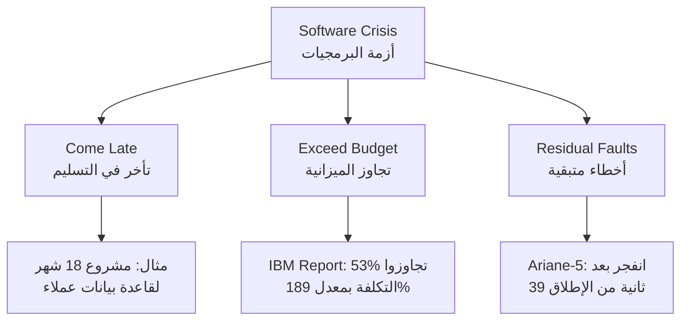

**الشرح:** ثلاثة أعراض رئيسية لأزمة البرمجيات، وكل واحد له أمثلة حقيقية موثقة من صناعة البرمجيات.

---

#### 📖 الشرح

تخيل إنك تبني بيت، وبعد ما تخلص، تكتشف إن 31% من البيوت المشابهة توقفوا عن البناء قبل ما يخلصوا، ونص البيوت الباقية كلفت ضعف السعر المتفق عليه تقريباً! هذا بالضبط اللي يصير في مشاريع البرمجيات حسب تقرير `IBM`: **31% من المشاريع تُلغى قبل الاكتمال، و53% تتجاوز تقديرات التكلفة بمعدل 189%، ومن كل 100 مشروع فيه 94 عملية إعادة بدء (`restart`)**.

المشكلة مو نظرية — فيها أمثلة حقيقية موثّقة:
- **مشكلة الـ `Y2K`:** ملايين الدولارات صُرفت للتعامل مع مشكلة كانت تقريباً وهمية (خوف من فشل الأنظمة عند دخول سنة 2000).
- **صاروخ Patriot العسكري:** خطأ صغير جداً في توقيت الساعة (`timing error`) في نظام حاسوبي أدى لمقتل 28 جندي أمريكي — يوضح كيف إن خطأ برمجي "بسيط" ممكن يكون كارثي.
- **مشروع قاعدة بيانات عملاء (1996):** مجموعة مستهلكين أمريكية صرفت مليون دولار على مدى 18 شهر لبناء نظام جديد، سُلّم في الوقت المحدد لكنه **ما اشتغل كما هو متوقع**، فاضطروا يجيبوا فريق جديد يعيد بناء النظام من الصفر!
- **صاروخ Ariane-5:** مشروع بـ 7 مليار دولار على مدى 10 سنوات، انفجر بعد 39 ثانية فقط من الإطلاق، بسبب **خطأ تحويل بيانات (`conversion error`)** من صيغة 64-bit إلى صيغة 16-bit صغيرة جداً ما تتحمل الرقم.
- **أنظمة محاسبية:** شركات كثيرة عانت من فشل أنظمتها المحاسبية بسبب أخطاء برمجية، تتراوح من معلومات خاطئة إلى انهيار كامل للنظام.
- **Windows XP:** حتى في يوم إطلاقه (25 أكتوبر 2001)، نزلت الشركة 18 ميجابايت من التحديثات في نفس اليوم — تصحيحات توافقية، تحسينات، وتصحيحين لثغرات أمنية مهمة!

الخلاصة: **فيه مشاكل حقيقية وجدية في التكلفة، الوقت، الصيانة، والجودة لكثير من منتجات البرمجيات** — وهذا بالضبط سبب وجود `Software Engineering` كتخصص.

#### 🎯 الملخص السريع
- أزمة البرمجيات = مشاريع متأخرة + تتجاوز الميزانية + فيها أخطاء متبقية
- أمثلة حقيقية: Y2K، Patriot Missile، Ariane-5، Windows XP
- تقرير IBM: 31% مشاريع ملغاة، 53% تتجاوز التكلفة بـ189%، 94 إعادة بدء لكل 100 مشروع

#### 📚 التطبيق
هذه الأزمة هي السبب المباشر لظهور `Software Engineering` كحل منهجي — سنشرحه بعد قليل.

#### ⚠️ أخطاء شائعة

#### الفهم الخاطئ ❌:
أزمة البرمجيات مشكلة قديمة انتهت مع تطور التقنية الحديثة.

#### الفهم الصحيح ✅:
المشكلة لسا موجودة اليوم؛ المشاريع الحديثة (تطبيقات جوال، أنظمة سحابية) لسا تعاني من نفس الأعراض (تأخير، تجاوز تكلفة، أخطاء) لأن السبب الجذري هو التعقيد وليس نقص الأدوات فقط.

#### 📄 النص الأصلي من المحاضرة
<details>
<summary>عرض النص الأصلي (coverage: 95%)</summary>

> "Software: still come late, exceed budget, full of residual faults... Y2K: million have been spent to handle this practically non-existent problem... Star wars (Patriot missile) → 28 U.S. soldiers, due to a small timing error in the system's clock... In 1996, a US consumer group embarked on an 18-month, $1million project to replace its customer database. The new system was delivered on time but did not work as promised... Ariane-5 space rocket, $7000 M, over a 10 years: was destroyed after 39 seconds of its launch! Conversion error: 64-bit to 16-bit format... '31% of projects get cancelled before they are completed, 53% over-run their cost estimates by an average of 189% and for every 100 projects, there are 94 restarts' IBM Report"

**ملاحظة على التغطية:**
- ✓ تم شرح جميع الأمثلة (Y2K, Patriot, Ariane-5, Windows XP, قاعدة بيانات العملاء)
- ✓ تم شرح إحصائية IBM بالكامل
- ℹ️ إضافة من الدليل: تشبيه البيت لتوضيح النسب

</details>

---

### 1.2. تكاليف البرمجيات (Software Costs)
<!-- @type: fact -->
<!-- @render: {type: "diagram-first", coverage: "100%"} -->

#### 📍 أين نحن الآن؟
بعد ما فهمنا "أزمة البرمجيات"، نركز أكثر على بُعد التكلفة تحديداً.

#### ⬅️ الربط مع السابق
تجاوز الميزانية كان أحد أعراض الأزمة — الآن نفهم لماذا البرمجيات مكلفة أصلاً.

#### 💡 الفكرة الأساسية
**تكاليف البرمجيات غالباً تفوق تكاليف الأجهزة، والصيانة (`maintenance`) أغلى من التطوير الأولي نفسه.**

---

#### 📊 المخطط: توزيع تكاليف البرمجيات

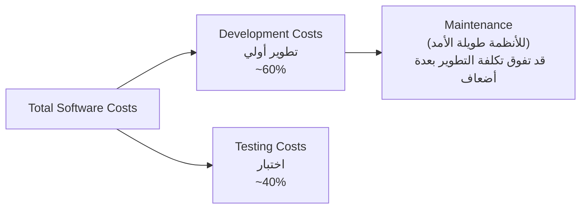

**الشرح:** التطوير والاختبار يشكلان التكلفة الأولية، لكن الصيانة على المدى الطويل هي الجزء الأكبر فعلياً في الأنظمة التي تعيش سنوات طويلة.

---

#### 📖 الشرح

فكّر في `PC` عادي: غالباً سعر البرامج المثبتة عليه (نظام التشغيل + برامج الأوفيس + برامج أخرى) أغلى من سعر قطع الهاردوير نفسها! هذا يوضح إن **تكلفة البرمجيات أصبحت تهيمن على تكلفة الأنظمة الحاسوبية ككل**، مو بس على الأجهزة.

الأهم من هذا: **صيانة البرمجية (`maintenance`) — يعني تعديلها بعد التسليم لإصلاح أخطاء أو إضافة مميزات — تكلف أكثر من تطويرها من الأول**. للأنظمة اللي تُستخدم لسنوات طويلة (مثل أنظمة بنكية أو حكومية)، ممكن تكلفة الصيانة تكون **عدة أضعاف** تكلفة التطوير الأصلي. هذا لأن النظام يستمر يتغير طوال حياته: قوانين جديدة، متطلبات مستخدمين جديدة، أخطاء تظهر مع الوقت.

#### 🎯 الملخص السريع
- تكلفة البرمجيات > تكلفة الهاردوير في أغلب الأنظمة الحديثة
- تكلفة الصيانة > تكلفة التطوير الأولي (للأنظمة طويلة العمر)
- ~60% تطوير، ~40% اختبار من إجمالي تكلفة الهندسة (حسب FAQ لاحقاً في المحاضرة)

#### 📚 التطبيق
هذا سبب رئيسي لماذا `Software Engineering` يهتم بـ`maintainability` (قابلية الصيانة) كصفة أساسية للبرمجية الجيدة — سنشرحها لاحقاً.

#### 📄 النص الأصلي من المحاضرة
<details>
<summary>عرض النص الأصلي (coverage: 100%)</summary>

> "Software costs often dominate computer system costs. The costs of software on a PC are often greater than the hardware cost. Software costs more to maintain than it does to develop. For systems with a long life, maintenance costs may be several times development costs."

**ملاحظة على التغطية:**
- ✓ تم شرح الفكرتين بالكامل مع تشبيه توضيحي

</details>

---

### 2. هندسة البرمجيات (Software Engineering)

### 2.1. تعريف هندسة البرمجيات (SE Definition)
<!-- @type: fact -->
<!-- @render: {type: "diagram-first", coverage: "100%"} -->

#### 📍 أين نحن الآن؟
بعد ما فهمنا المشكلة (الأزمة والتكاليف)، الآن نتعرف على الحل: `Software Engineering`.

#### ⬅️ الربط مع السابق
أزمة البرمجيات (التأخير، التكلفة، الأخطاء) هي بالضبط المشاكل التي جاءت `SE` لحلها.

#### 💡 الفكرة الأساسية
**`Software Engineering` (هندسة البرمجيات) هو تخصص هندسي هدفه إنتاج برمجية جيدة الجودة، قابلة للصيانة، في الوقت المحدد، وضمن الميزانية.**

---

#### 📊 المخطط: تعريفات SE عبر الزمن

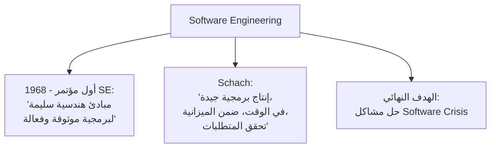

**الشرح:** رغم اختلاف الصياغة بين التعريفات، كلها تتفق على نفس الأهداف: الجودة، الوقت، الميزانية، وتحقيق المتطلبات.

---

#### 📖 التعريف الدقيق

منذ أول مؤتمر رسمي لـ `Software Engineering` سنة 1968، عُرّف بأنه: **"إنشاء واستخدام مبادئ هندسية سليمة للحصول على برمجية مطوَّرة اقتصادياً، موثوقة، وتعمل بكفاءة على الأجهزة الحقيقية"**.

تعريف آخر أكثر حداثة (`Schach`) يقول إنه **"تخصص هدفه إنتاج برمجية ذات جودة عالية، تُسلَّم في الوقت المحدد، ضمن الميزانية المتفق عليها، وتحقق كل متطلبات العميل"**.

لاحظ إن الكلمة المفتاحية هي **"هندسة" (`Engineering`)** — يعني تطبيق مبادئ منظمة وموثقة ومُختبرة، مو مجرد "كتابة كود بطريقة عشوائية". بالضبط زي أي هندسة أخرى (مدنية، ميكانيكية)، فيها عملية، معايير، وأدوات.

#### 🎯 الملخص السريع
- الهدف: جودة + وقت + ميزانية + تحقيق المتطلبات
- أول تعريف رسمي: مؤتمر 1968
- الفرق عن "البرمجة العادية": منهجية (`systematic`) وليست عشوائية

#### 📚 التطبيق
هذا التعريف هو الأساس لكل تقنيات المادة القادمة: `SDLC models`، `Requirements`، `Testing`، إلخ — كلها أدوات لتحقيق هذا الهدف.

#### 📄 النص الأصلي من المحاضرة
<details>
<summary>عرض النص الأصلي (coverage: 100%)</summary>

> "SE has the objective of solving these problems by producing good quality, maintainable software, on time, within budget. 'The establishment and use of sound engineering principles in order to obtain economically developed software that is reliable and works efficiently on real machines' 1st SE conf. 1968. 'A discipline whose aim is the production of quality software, software that is delivered on time, within budget and that satisfies its requirements' Schach"

**ملاحظة على التغطية:**
- ✓ تم شرح كلا التعريفين بالكامل

</details>

---

### 2.2. صفات مهندس البرمجيات (Software Engineers)
<!-- @type: practice -->
<!-- @render: {type: "diagram-first", coverage: "100%"} -->

#### 📍 أين نحن الآن؟
بعد ما فهمنا تعريف `SE`، نتعرف الآن على المسؤوليات المطلوبة من الشخص اللي يمارسه (`Software Engineer`).

#### ⬅️ الربط مع السابق
التعريف قال "مبادئ هندسية سليمة" — هنا نحدد كيف يطبقها المهندس عملياً.

#### 💡 الفكرة الأساسية
**مهندس البرمجيات الجيد يعتمد على نهج منظم، يختار الأدوات المناسبة لكل مشكلة، ويستغل الموارد المتاحة بكفاءة.**

---

#### 📊 المخطط: مسؤوليات مهندس البرمجيات

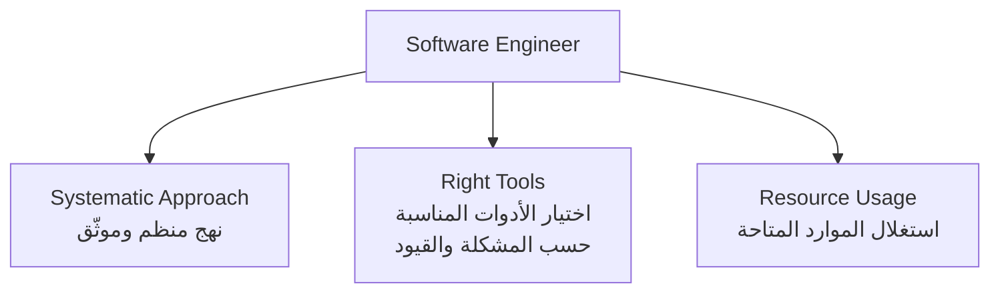

**الشرح:** ثلاث مسؤوليات أساسية تميّز "مهندس البرمجيات" عن "مبرمج عادي" يكتب كود بدون منهجية.

---

#### 📖 الشرح

المبرمج العادي ممكن يفتح الكمبيوتر ويبدأ يكتب كود على طول. مهندس البرمجيات مختلف — لازم:

1. **يعتمد نهج منظم ومرتّب (`systematic and organized approach`):** يعني فيه خطوات واضحة (تحليل، تصميم، تنفيذ، اختبار) بدل العشوائية.
2. **يختار الأدوات والتقنيات المناسبة (`appropriate tools and techniques`)** حسب طبيعة المشكلة وقيود التطوير (وقت، ميزانية، فريق) — مو نفس الأداة لكل مشكلة.
3. **يستخدم الموارد المتاحة (`resources available`)** بأفضل شكل ممكن — سواء أدوات، أفراد، أو وقت.

#### 🎯 الملخص السريع
- نهج منظم بدل العشوائية
- اختيار الأداة المناسبة حسب السياق، وليس دائماً نفس الطريقة
- استغلال الموارد بكفاءة

#### 📚 التطبيق
هذه المبادئ هي التي تفصل "المبرمج" عن "مهندس البرمجيات" — وهي الأساس لفهم لماذا يختلف نموذج `SDLC` من مشروع لآخر.

#### ⚠️ أخطاء شائعة

#### الفهم الخاطئ ❌:
مهندس البرمجيات لازم يستخدم نفس الطريقة والأدوات في كل مشروع لأنها "الطريقة الصحيحة".

#### الفهم الصحيح ✅:
اختيار الأدوات والتقنيات يعتمد على المشكلة نفسها وقيود التطوير؛ ما فيه "طريقة واحدة تناسب الجميع" — وهذا مبدأ سيتكرر لاحقاً عند اختيار نماذج `SDLC`.

#### 📄 النص الأصلي من المحاضرة
<details>
<summary>عرض النص الأصلي (coverage: 100%)</summary>

> "Software engineers must: Adopt a systematic and organized approach to their work. Use appropriate tools and techniques depending on the problem to be solved and the development constraints. Use the resource available"

**ملاحظة على التغطية:**
- ✓ شرح كامل للنقاط الثلاث

</details>

---

### 3. البرمجية مقابل البرنامج والتوثيق (Software vs Programs & Documentation)

### 3.1. الفرق بين Software و Program
<!-- @type: fact -->
<!-- @render: {type: "diagram-first", coverage: "100%"} -->

#### 📍 أين نحن الآن؟
مصطلح مهم جداً يُستخدم بكثرة طول المادة — لازم نفرّق بينه وبين "البرنامج" قبل ما نكمل.

#### ⬅️ الربط مع السابق
عرّفنا `SE` كتخصص ينتج "برمجية" — الآن نحدد بالضبط إيش تعني كلمة `Software`.

#### 💡 الفكرة الأساسية
**`Software` (البرمجية) أوسع من `Program` (البرنامج) — البرمجية = البرنامج + التوثيق + إجراءات التشغيل.**

---

#### 📊 المخطط: مكونات Software

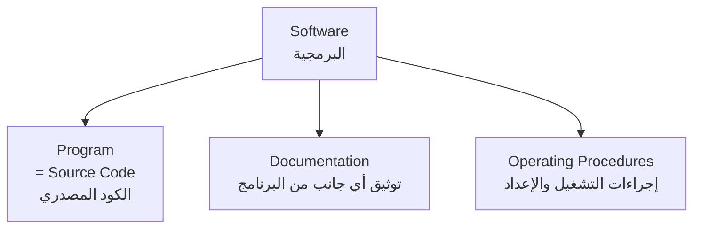

**الشرح:** كثير من المبتدئين يظنون إن "Software" و"Program" نفس الشيء — الرسم يوضح إن البرنامج مجرد جزء واحد من البرمجية الكاملة.

---

#### 📖 التعريف الدقيق

- **`Program` (البرنامج):** هو **الكود المصدري (`source code`)** فقط — التعليمات اللي يفهمها ويشغّلها الحاسوب.
- **`Software` (البرمجية):** مفهوم أشمل، يتكون من:
  1. البرامج (الكود المصدري)
  2. **التوثيق (`Documentation`)** لأي جانب من جوانب البرنامج
  3. **الإجراءات (`Procedures`)** المستخدمة لإعداد وتشغيل نظام البرمجية

يعني لو سلّمت لعميل "برنامج" بدون دليل استخدام وبدون تعليمات تشغيل، ما سلّمته "برمجية" كاملة بمعنى `Software Engineering`.

#### 🎯 الملخص السريع
- `Program` = الكود فقط
- `Software` = Program + Documentation + Operating Procedures
- الفرق مهم لأن باقي المادة تتكلم عن "منتج البرمجية" ككل، مو الكود فقط

#### 📚 التطبيق
هذا التعريف يفسّر لماذا التوثيق (القسم القادم) جزء أساسي من أي مشروع `SE` وليس "إضافة اختيارية".

#### 📄 النص الأصلي من المحاضرة
<details>
<summary>عرض النص الأصلي (coverage: 100%)</summary>

> "Software consists of programs, documentation of any facet of the program and the procedures used to setup and operate the software system. While program is source code"

**ملاحظة على التغطية:**
- ✓ شرح كامل للفرق

</details>

---

### 3.2. هيكل التوثيق (Documentation)
<!-- @type: fact -->
<!-- @render: {type: "diagram-first", visualization: "hierarchy", coverage: "100%"} -->

#### 📍 أين نحن الآن؟
بعد ما عرفنا إن التوثيق جزء أساسي من `Software`، نتعرف على أنواعه بالتفصيل.

#### ⬅️ الربط مع السابق
مباشرة يبني على القسم السابق (Software = Program + Documentation + Procedures).

#### 💡 الفكرة الأساسية
**التوثيق يُقسَّم حسب مرحلة التطوير: تحليل/تخصيص، تصميم، تنفيذ، واختبار — لكل مرحلة وثائقها الخاصة.**

---

#### 📊 المخطط: هيكل وثائق التوثيق

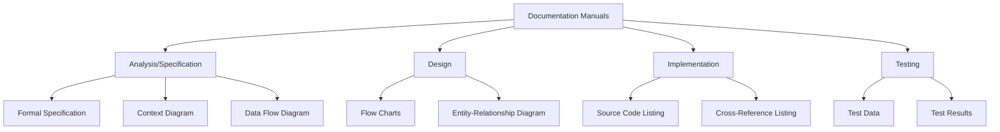

**شرح العناصر:**
- **Analysis/Specification:** وثائق تحدد "إيش" يجب أن يعمل النظام (المواصفات الرسمية، مخطط السياق، مخطط تدفق البيانات).
- **Design:** وثائق تحدد "كيف" سيُبنى النظام (المخططات الانسيابية، مخطط العلاقة بين الكيانات).
- **Implementation:** وثائق مرتبطة بالكود الفعلي (قوائم الكود المصدري، قوائم الإحالة المرجعية).
- **Testing:** وثائق التحقق من عمل النظام (بيانات الاختبار، نتائج الاختبار).

**التطبيق في هذا السياق:** هذا الهيكل يوضح إن التوثيق يواكب كل مرحلة من مراحل تطوير البرمجية، وليس مجرد ملف واحد يُكتب في النهاية.

---

#### 📖 الشرح

فكّر في التوثيق كـ"سجل رحلة" المشروع بالكامل: من لحظة تحديد المتطلبات، مروراً بالتصميم، وحتى الكود والاختبار — كل مرحلة تترك وراءها أثر موثّق. هذا مهم جداً لأن أي مهندس جديد ينضم للمشروع، أو أي شخص يحتاج يصلّح خطأ بعد سنوات، يرجع لهذه الوثائق بدل ما "يخمّن" كيف يعمل النظام.

#### 🎯 الملخص السريع
- 4 فئات: Analysis/Specification، Design، Implementation، Testing
- كل فئة لها وثائق محددة (مثال: DFD في التحليل، ERD في التصميم)

#### 📚 التطبيق
لاحقاً في المادة (Requirements، Design) ستدرس كل نوع من هذه الوثائق بالتفصيل — هذا مجرد الخريطة العامة.

#### 📄 النص الأصلي من المحاضرة
<details>
<summary>عرض النص الأصلي (coverage: 100%)</summary>

> "Documentation Manuals: Analysis/Specification (Formal Specification, Context-Diagram, Data Flow Diagram), Design (Flow Charts, Entity-relationship Diagram), Implementation (Source Code Listing, Cross-Reference Listing), Testing (Test Data, Test Results)"

**ملاحظة على التغطية:**
- ✓ تم تحويل المخطط الهرمي بالكامل إلى Mermaid مع شرح كل عنصر

</details>

---

### 3.3. إجراءات التشغيل (Operating Procedures)
<!-- @type: fact -->
<!-- @render: {type: "diagram-first", visualization: "hierarchy", coverage: "100%"} -->

#### 📍 أين نحن الآن؟
النوع الثالث من مكونات `Software` (بعد Program والـ Documentation): إجراءات التشغيل.

#### ⬅️ الربط مع السابق
استكمال لمكونات `Software` المذكورة في 3.1.

#### 💡 الفكرة الأساسية
**إجراءات التشغيل تنقسم إلى نوعين: أدلة للمستخدم النهائي (`User Manuals`)، وأدلة للتشغيل الإداري/التقني (`Operational Manuals`).**

---

#### 📊 المخطط: أنواع إجراءات التشغيل

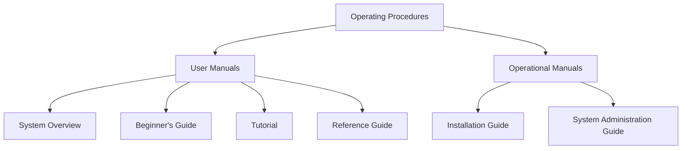

**شرح العناصر:**
- **User Manuals:** موجّهة للمستخدم النهائي العادي — نظرة عامة على النظام، دليل للمبتدئين، دروس تعليمية (`Tutorial`)، ودليل مرجعي شامل.
- **Operational Manuals:** موجّهة للفريق التقني/الإداري — دليل التثبيت (`Installation Guide`) ودليل إدارة النظام (`System Administration Guide`).

**التطبيق في هذا السياق:** الفرق مهم لأن الجمهور المستهدف مختلف — المستخدم العادي لا يحتاج يعرف كيف يثبّت النظام على سيرفر، بينما مسؤول النظام يحتاج ذلك بالضبط.

---

#### 📖 الشرح

تخيل شراء جهاز جديد: علبته فيها **دليل مستخدم** بسيط يشرح كيف تشغّله وتستخدم مميزاته الأساسية (زي `User Manuals` هنا)، وفيه أيضاً **دليل فني** للمهندس اللي يركّب الجهاز أو يصلحه (زي `Operational Manuals`). نفس المبدأ في البرمجيات — احتياجات المستخدم العادي مختلفة تماماً عن احتياجات مسؤول النظام.

#### 🎯 الملخص السريع
- User Manuals = للمستخدم النهائي (Overview, Beginner's Guide, Tutorial, Reference)
- Operational Manuals = للفريق التقني (Installation, Administration)

#### 📚 التطبيق
هذا التصنيف يساعدك تفهم لاحقاً أنواع الوثائق المطلوبة عند تسليم أي مشروع برمجي حقيقي.

#### 📄 النص الأصلي من المحاضرة
<details>
<summary>عرض النص الأصلي (coverage: 100%)</summary>

> "Operating Procedures: User Manuals (System Overview, Beginner's Guide, Tutorial, Reference Guide), Operational Manuals (Installation Guide, System Administration Guide)"

**ملاحظة على التغطية:**
- ✓ تحويل كامل للمخطط الهرمي إلى Mermaid مع شرح كل عنصر

</details>

---

### 4. منتجات البرمجيات (Software Products)

### 4.1. Generic مقابل Bespoke — أي نوع أختار؟
<!-- @type: principle -->
<!-- @render: {type: "diagram-first", coverage: "95%"} -->

#### 📍 أين نحن الآن؟
بعد فهم مكونات `Software`، ننتقل لفهم "أنواع" منتجات البرمجيات من ناحية الملكية والتخصيص.

#### ⬅️ الربط مع السابق
هذا يبني على مفهوم "منتج البرمجية" (`Software Product`) اللي سنكمله في القسم التالي.

#### 💡 الفكرة الأساسية
**السؤال ليس "أيهما أفضل؟" بل "من يملك القرار بشأن المواصفات؟" — المطوّر (Generic) أم العميل (Bespoke/Customized)؟**

---

#### 📊 المخطط: من يملك المواصفات؟

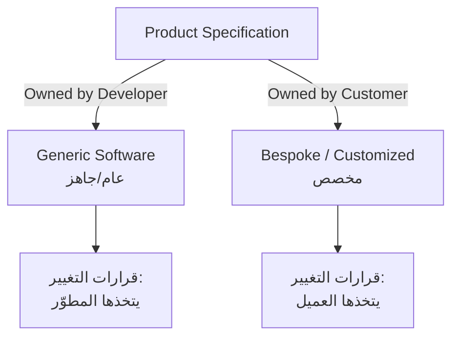

**الشرح:** الفرق الجوهري هو "من يقرر" مواصفات البرمجية وتغييراتها — ليس مستوى الجودة أو التعقيد.

---

#### 📖 الإطار القرار (Decision Framework)

**السؤال الأساسي: من يملك مواصفة "ماذا يجب أن تفعل البرمجية"؟**

1. **إذا كان المطوّر (Developer) هو من يملك المواصفة ويقرر التغييرات:**
   → المنتج **`Generic`** (عام) — مثل برنامج `Microsoft Word` الذي يُباع لملايين المستخدمين بنفس المواصفات.

2. **إذا كان العميل (Customer) هو من يملك المواصفة ويقرر التغييرات:**
   → المنتج **`Bespoke / Customized`** (مخصص) — مثل نظام محاسبي مبني خصيصاً لمتطلبات شركة معينة.

#### 💼 السياقات المختلفة (Context Examples)

**السيناريو 1: شركة تطوير تبني تطبيق للسوق العام**
- المواصفات: تحددها الشركة المطوّرة حسب دراسة السوق
- **النوع:** Generic
- **السبب:** المنتج يُباع لجمهور واسع، فالمطوّر هو من يقرر المميزات لإرضاء أكبر شريحة

**السيناريو 2: مستشفى يطلب نظام لإدارة سجلات المرضى حسب لوائحه الداخلية**
- المواصفات: يحددها المستشفى (العميل) حسب احتياجاته الخاصة
- **النوع:** Bespoke / Customized
- **السبب:** كل تغيير في المواصفات يقرره العميل مباشرة لأن النظام مبني له خصيصاً

---

#### ⚖️ المقايضة: Generic مقابل Bespoke

| الجانب | Generic | Bespoke (Customized) |
| --- | --- | --- |
| **من يملك القرار** | المطوّر | العميل |
| **الجمهور** | واسع (سوق عام) | محدد (عميل واحد أو مؤسسة) |
| **المرونة للتخصيص** | منخفضة (نفس المنتج للجميع) | عالية (مصمم خصيصاً) |
| **التكلفة للعميل الفردي** | عادة أقل (تُقسّم على عدد كبير من المستخدمين) | عادة أعلى (تطوير خاص) |

#### 🤔 تفعيل الفهم
لو شركة طلبت منك تطوير نظام لإدارة المخزون، وقالوا لك: "احنا نبي كل تفصيلة في النظام تكون حسب طريقة عملنا الخاصة، وأي تعديل مستقبلي نحن من يقرره" — هل هذا `Generic` أم `Bespoke`؟ ليش؟

**تلميح:** ركّز على "من يملك القرار بشأن المواصفات؟"

#### 📄 النص الأصلي من المحاضرة
<details>
<summary>عرض النص الأصلي (coverage: 95%)</summary>

> "Generic: The specification of what the software should do is owned by the software developer and decisions on software change are made by the developer. Customized: The specification of what the software should do is owned by the customer for the software and they make decisions on software changes that are required."

**ملاحظة على التغطية:**
- ✓ شرح كامل لتعريف كل نوع
- ℹ️ إضافة من الدليل: سيناريوهات وأمثلة عملية ومقايضة

</details>

---

### 4.2. مكونات منتج البرمجية (Software Product)
<!-- @type: fact -->
<!-- @render: {type: "diagram-first", coverage: "100%"} -->

#### 📍 أين نحن الآن؟
بعد تصنيف المنتج (Generic/Bespoke)، نحدد الآن "ماذا يتضمن" منتج البرمجية فعلياً عند التسليم.

#### ⬅️ الربط مع السابق
يبني على تعريف `Software` (Program + Documentation + Procedures) بشكل أوسع وأكثر تفصيلاً كتسليمات فعلية.

#### 💡 الفكرة الأساسية
**منتج البرمجية (`Software Product`) هو كل ما يُسلَّم فعلياً للمستخدم — وليس فقط الكود.**

---

#### 📊 المخطط: مكونات منتج البرمجية

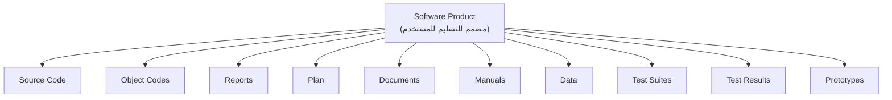

**الشرح:** منتج البرمجية النهائي يتكون من عشرة عناصر رئيسية، وليس فقط "الكود الذي يعمل" — التوثيق والاختبارات والنماذج الأولية جزء لا يتجزأ منه.

---

#### 📖 التعريف الدقيق

**`Software Product`** هو أي منتج **مُصمَّم للتسليم للمستخدم النهائي**. يشمل:
- الكود المصدري (`Source Code`) والكود الكائني (`Object Codes`)
- التقارير (`Reports`) والخطط (`Plan`)
- الوثائق (`Documents`) والأدلة (`Manuals`)
- البيانات (`Data`)
- مجموعات الاختبار (`Test Suites`) ونتائجها (`Test Results`)
- النماذج الأولية (`Prototypes`)

#### 🎯 الملخص السريع
- المنتج = كل شيء يُسلَّم للعميل، ليس فقط الكود القابل للتشغيل
- 10 عناصر: Source Code, Object Codes, Reports, Plan, Documents, Manuals, Data, Test Suites, Test Results, Prototypes

#### 📚 التطبيق
هذا يوضح لماذا "تسليم مشروع" في `Software Engineering` أعقد بكثير من مجرد إرسال ملف تنفيذي.

#### 📄 النص الأصلي من المحاضرة
<details>
<summary>عرض النص الأصلي (coverage: 100%)</summary>

> "Software product is a product designated for delivery to the user [Source Code, Object Codes, Reports, Plan, Documents, Manuals, Data, Test Suites, Test Results, Prototypes]"

**ملاحظة على التغطية:**
- ✓ تحويل المخطط بالكامل إلى Mermaid مع شرح كل عنصر

</details>

---

### 5. أساطير البرمجيات (Software Myths)
<!-- @type: practice -->
<!-- @render: {type: "diagram-first", coverage: "100%"} -->

#### 📍 أين نحن الآن؟
بعد فهم المنتج والمكونات، نتعرف على المفاهيم الخاطئة الشائعة (`myths`) حول البرمجيات — لتفاديها.

#### ⬅️ الربط مع السابق
هذه الأساطير غالباً هي **سبب مباشر** لأزمة البرمجيات (القسم 1.1) — لأن الناس يعملون بناءً عليها بشكل خاطئ.

#### 💡 الفكرة الأساسية
**فيه 9 مفاهيم خاطئة شائعة (`myths`) عن البرمجيات، يعتقدها كثير من المبتدئين والمدراء غير التقنيين، وكلها تؤدي لمشاكل حقيقية في المشاريع.**

---

#### 📊 المخطط: أساطير البرمجيات التسعة

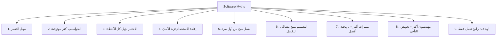

**الشرح:** تسعة أساطير شائعة، كل واحدة منها ممكن تؤدي لقرار إداري أو تقني خاطئ إذا صُدِّقت.

---

#### 📖 الشرح

هذه الأساطير خطيرة لأنها **تبدو منطقية على السطح**، لكنها تتجاهل تعقيد البرمجيات الحقيقي:

1. **"البرمجية سهلة التغيير"** — الناس يفترضون إن تعديل البرمجية أسهل من تعديل الهاردوير، لكن أي تغيير بدون فهم كامل للنظام ممكن يكسر أجزاء أخرى.
2. **"الحواسيب توفر موثوقية أكبر من الأجهزة التي استبدلتها"** — هذا مو دائماً صحيح إذا كانت البرمجية نفسها غير موثوقة.
3. **"الاختبار أو إثبات صحة البرمجية يزيل كل الأخطاء"** — الاختبار يكشف وجود أخطاء، لكن ما يقدر يثبت غياب كل الأخطاء (مستحيل عملياً في الأنظمة المعقدة).
4. **"إعادة استخدام البرمجية تزيد الأمان"** — إعادة الاستخدام مفيدة، لكنها لا تضمن الأمان تلقائياً إذا استُخدمت في سياق مختلف عن الأصلي.
5. **"البرمجية تقدر تعمل صح من أول مرة"** — واقعياً، البرمجيات المعقدة دائماً تحتاج تكرار وتصحيح.
6. **"يمكن تصميم البرمجية بشكل شامل كفاية لتجنب معظم مشاكل التكامل"** — مهما خططت، مشاكل التكامل (integration) بين الأجزاء تظهر عملياً.
7. **"البرمجية بمميزات أكثر = برمجية أفضل"** — كثرة المميزات قد تزيد التعقيد وتقلل الجودة والاستخدامية.
8. **"إضافة مزيد من مهندسي البرمجيات سيعوّض التأخير"** — هذا خطأ شائع جداً (يُعرف في الصناعة بـ "قانون Brooks": إضافة أفراد لمشروع متأخر يزيده تأخيراً، بسبب تكاليف التنسيق والتدريب).
9. **"الهدف هو تطوير برامج تعمل فقط"** — هذا خطأ لأن الهدف الحقيقي أوسع: برمجية تعمل **بجودة**، **قابلة للصيانة**، **موثوقة**.

#### 🎯 الملخص السريع
تسعة أساطير: سهولة التغيير، موثوقية الحواسيب، الاختبار الكامل، أمان إعادة الاستخدام، العمل الصحيح من أول مرة، تجنب مشاكل التكامل بالتصميم، المميزات الكثيرة، مهندسون إضافيون يعوّضون التأخير، والهدف هو "برامج تعمل فقط".

#### 📚 التطبيق
فهم هذه الأساطير يساعدك تتجنب قرارات إدارية خاطئة لاحقاً في مواد `Software Project Planning`.

#### ⚠️ أخطاء شائعة

#### الفهم الخاطئ ❌:
لو مشروع متأخر عن الجدول، الحل السريع هو إضافة مزيد من المبرمجين لتسريع الإنجاز.

#### الفهم الصحيح ✅:
إضافة أفراد لمشروع متأخر غالباً يزيده تأخيراً، بسبب الوقت المطلوب لتدريبهم وتنسيق العمل بينهم وبين الفريق الحالي — هذه واحدة من أشهر الأساطير في هندسة البرمجيات.

#### 📄 النص الأصلي من المحاضرة
<details>
<summary>عرض النص الأصلي (coverage: 100%)</summary>

> "Software Myths: 1. Software easy to change 2. Computers provide greater reliability than the devices they replace 3. Testing software or 'proving' software correct can remove all the errors 4. Reusing software increases safety 5. Software can work right the first time 6. Software can designed thoroughly enough to avoid most integration problems 7. Software with more features is better software 8. Addition of more software engineers will make up the delay 9. Aim is to develop working programs"

**ملاحظة على التغطية:**
- ✓ شرح كل أسطورة بالتفصيل
- ℹ️ إضافة من الدليل: ربط الأسطورة الثامنة بـ"قانون Brooks" الشهير في الصناعة

</details>

---

#### 🧠 Misconception: "الاختبار الشامل يضمن برمجية خالية من الأخطاء 100%"

**الأسطورة:** كثير من الطلاب والمبتدئين يعتقدون أنه لو اختبرت البرنامج بعناية كافية، تضمن عدم وجود أي خطأ فيه بعد التسليم.

**الحقيقة:** الاختبار (`Testing`) يمكنه فقط **إثبات وجود أخطاء**، وليس **إثبات غيابها الكامل** — لأن عدد الحالات الممكنة في برنامج معقد يكون كبيراً جداً بحيث يستحيل تغطيتها كلها عملياً.

**السبب:** هذا الخلط يحصل لأن الاختبار في المشاريع الصغيرة (الجامعية مثلاً) يبدو "شاملاً" لأن عدد الحالات قليل، لكن في الأنظمة الحقيقية الكبيرة الأمر مختلف تماماً.

**مثال يوضح:** برنامج Ariane-5 المذكور سابقاً مرّ بمراحل اختبار، لكن خطأ التحويل بين 64-bit و16-bit لم يُكتشف لأن الحالة المحددة (قيمة رقمية كبيرة جداً) لم تكن ضمن سيناريوهات الاختبار.

---

### 6. عملية البرمجيات (Software Process)

### 6.1. تعريف وأنشطة العملية البرمجية
<!-- @type: fact -->
<!-- @render: {type: "diagram-first", visualization: "flowchart", coverage: "100%"} -->

#### 📍 أين نحن الآن؟
بعد أن عرفنا الأساطير التي يجب تجنبها، ننتقل لتعريف "العملية" (`Process`) الصحيحة لتطوير البرمجيات.

#### ⬅️ الربط مع السابق
`Software Engineering` (القسم 2) يعتمد أساساً على وجود `Process` منظمة — هذا القسم يوضحها بالتفصيل.

#### 💡 الفكرة الأساسية
**`Software Process` هي الطريقة التي ننتج بها البرمجية، وتتكون من أربعة أنشطة أساسية متسلسلة: التخصيص، التطوير، التحقق، والتطوّر.**

---

#### 📊 المخطط: أنشطة العملية البرمجية

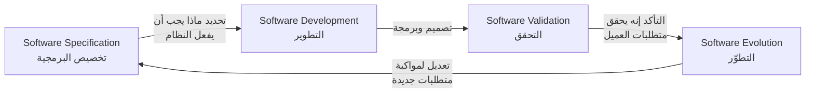

**الشرح:** الأنشطة الأربعة ليست خطية بحتة — عملية `Evolution` قد تعيد الدورة إلى `Specification` من جديد عند ظهور متطلبات جديدة، وهذا ما توضحه السهم الراجع في المخطط.

---

#### 📖 الشرح

**`Software Process` (عملية البرمجيات)** هي ببساطة **"الطريقة التي ننتج بها البرمجية"**. هدفها مساعدة المطورين على استخدام أفضل الممارسات التقنية والإدارية لإنجاز مشاريعهم بنجاح، وتحسين الجودة، الإنتاجية، وإمكانية التنبؤ بنتائج التطوير والصيانة.

تتكون من أربعة أنشطة رئيسية:

1. **`Software Specification` (التخصيص):** يحدد فيها العملاء والمهندسون معاً **ما الذي يجب أن تفعله البرمجية** والقيود على تشغيلها.
2. **`Software Development` (التطوير):** فيها يُصمَّم النظام ويُبرمَج فعلياً.
3. **`Software Validation` (التحقق):** فيها يُفحص النظام للتأكد إنه فعلاً يحقق ما يريده العميل.
4. **`Software Evolution` (التطوّر):** فيها تُعدَّل البرمجية لتعكس متطلبات العميل والسوق المتغيرة مع الوقت.

#### 🎯 الملخص السريع
- Software Process = طريقة إنتاج البرمجية
- 4 أنشطة: Specification → Development → Validation → Evolution
- الهدف: تحسين الجودة، الإنتاجية، والتنبؤ

#### 📚 التطبيق
هذه الأنشطة الأربعة هي الأساس الذي ستُبنى عليه لاحقاً كل نماذج `SDLC` (Waterfall, Spiral, Iterative...) في محاضرات قادمة.

#### 📄 النص الأصلي من المحاضرة
<details>
<summary>عرض النص الأصلي (coverage: 100%)</summary>

> "SP: the way in which we produce software. SP: help the developers to use the best technical and managerial practices to successfully complete their projects. SP is a way to improve the quality, productivity, predictability of the software development and maintenance efforts. Software Process Activities: Software specification... Software development... Software validation... Software evolution..."

**ملاحظة على التغطية:**
- ✓ شرح كامل للتعريف والأنشطة الأربعة

</details>

---

### 6.2. خصائص البرمجيات (Software Characteristics)
<!-- @type: fact -->
<!-- @render: {type: "diagram-first", coverage: "100%"} -->

#### 📍 أين نحن الآن؟
بعد فهم "كيف تُنتَج" البرمجية، نتعرف على خصائصها الجوهرية التي تميّزها عن المنتجات الهندسية الأخرى (خاصة الهاردوير).

#### ⬅️ الربط مع السابق
هذه الخصائص تفسّر لماذا `Software Process` يختلف جذرياً عن عمليات تصنيع المنتجات المادية.

#### 💡 الفكرة الأساسية
**البرمجية لا تتآكل مع الاستخدام مثل الهاردوير، ولا تُصنَّع (تُنسَخ فقط)، وهي قابلة لإعادة الاستخدام والمرونة.**

---

#### 📊 المخطط: منحنى الأعطال — هاردوير مقابل برمجية

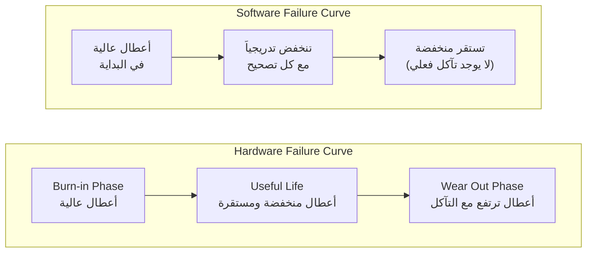

**الشرح:** منحنى أعطال الهاردوير على شكل حرف U (يرتفع في النهاية بسبب التآكل الفيزيائي)، بينما منحنى أعطال البرمجية ينخفض باستمرار مع كل تصحيح ولا يرتفع مرة أخرى بسبب "تآكل" — لأن البرمجية لا تتآكل فيزيائياً.

---

#### 📖 الشرح

أربع خصائص أساسية تميّز البرمجية:

1. **`Software does not wear out` (لا تتآكل):** الهاردوير يتآكل فيزيائياً مع الاستخدام والزمن (احتكاك، حرارة، تلف)، لكن البرمجية لا "تتآكل" — نفس الكود يبقى يعمل بنفس الطريقة بعد آلاف مرات التشغيل. المشاكل التي تظهر لاحقاً غالباً بسبب تغيّر البيئة المحيطة (نظام تشغيل جديد مثلاً)، وليس تآكل الكود نفسه.
2. **`Software is not manufactured` (لا تُصنَّع، فقط تُنسَخ):** إنتاج نسخة إضافية من برمجية هو مجرد **نسخ (`copy`)** بتكلفة شبه معدومة، على عكس تصنيع قطعة هاردوير جديدة التي تحتاج مواد خام وعمالة وتكلفة إضافية لكل نسخة.
3. **`Reusability of components` (قابلية إعادة الاستخدام):** يمكن إعادة استخدام أجزاء من البرمجية (مكتبات، وحدات) في مشاريع مختلفة.
4. **`Software is flexible` (مرونة):** يمكن تعديل البرمجية بسهولة أكبر نسبياً من تعديل منتج هاردوير فيزيائي.

#### 🎯 الملخص السريع
- لا تتآكل (منحنى الأعطال مختلف عن الهاردوير)
- لا تُصنَّع، فقط تُنسَخ (تكلفة النسخة الإضافية شبه صفر)
- قابلة لإعادة الاستخدام والمرونة

#### 📚 التطبيق
هذه الخصائص تفسّر لماذا "الصيانة" (Maintenance) في البرمجيات مختلفة تماماً عن "الصيانة" في الهاردوير — المشكلة ليست تآكل مادي بل تغيّر المتطلبات والبيئة.

#### 📄 النص الأصلي من المحاضرة
<details>
<summary>عرض النص الأصلي (coverage: 100%)</summary>

> "Software does not wear out (hardware vs. software) [diagram: burn-in phase, useful life phase, wear out phase vs decreasing failure intensity]. Software is not manufactured (just copies!). Reusability of components. Software is flexible"

**ملاحظة على التغطية:**
- ✓ تم إعادة رسم منحنى الأعطال بـ Mermaid مع شرح كامل للفرق

</details>

---

### 7. تطبيقات البرمجيات (Software Applications)
<!-- @type: fact -->
<!-- @render: {type: "diagram-first", coverage: "100%"} -->

#### 📍 أين نحن الآن؟
بعد فهم خصائص البرمجية العامة، نستعرض الآن أنواع تطبيقاتها المختلفة في الواقع.

#### ⬅️ الربط مع السابق
توسيع لفهم "أين تُستخدم" البرمجية عملياً بعد فهم "ما هي".

#### 💡 الفكرة الأساسية
**البرمجيات تُصنَّف حسب مجال استخدامها إلى ثمانية أنواع رئيسية، كل نوع له طبيعة وقيود مختلفة.**

---

#### 📊 المخطط: أنواع تطبيقات البرمجيات

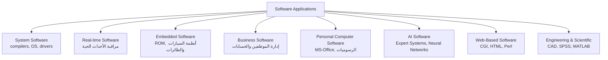

**الشرح:** كل فئة من هذه الفئات لها متطلبات مختلفة — مثلاً `Real-time Software` يحتاج استجابة فورية دقيقة، بينما `Business Software` يهتم أكثر بدقة البيانات وسهولة الاستخدام.

---

#### 📖 الشرح

- **`System Software`:** برمجيات النظام الأساسية مثل المترجمات (`compilers`)، أنظمة التشغيل، وبرامج التعريف (`drivers`).
- **`Real-time Software`:** تراقب وتتحكم وتحلّل أحداث العالم الحقيقي فور حدوثها (مثل أنظمة الطقس).
- **`Embedded Software`:** مضمّنة داخل أجهزة (ذاكرة `ROM`، أنظمة السيارات، الطائرات).
- **`Business Software`:** إدارة الموظفين والحسابات وشؤون الشركات.
- **`Personal Computer Software`:** برامج المستخدم الشخصي مثل `MS-Office` وبرامج الرسوميات.
- **`Artificial Intelligence Software`:** الأنظمة الخبيرة (`expert systems`)، الشبكات العصبية، ومعالجة الإشارات.
- **`Web-Based Software`:** تعتمد على تقنيات الويب مثل `CGI`، `HTML`، `Perl`.
- **`Engineering and Scientific Software`:** برامج التصميم الهندسي والتحليل العلمي مثل `CAD`، `SPSS`، `MATLAB`، وأدوات تحليل الدوائر الكهربائية.

#### 🎯 الملخص السريع
ثمانية أنواع: System, Real-time, Embedded, Business, Personal Computer, AI, Web-Based, Engineering & Scientific Software.

#### 📚 التطبيق
معرفة نوع التطبيق تحدد لاحقاً أي نموذج `SDLC` واختبار مناسب أكثر — مثلاً `Real-time Software` يحتاج اهتمام أكبر بالتوقيت والأداء.

#### 📄 النص الأصلي من المحاضرة
<details>
<summary>عرض النص الأصلي (coverage: 100%)</summary>

> "System Software... Real-time Software... Embedded Software... Business Software... Personal Computer Software... Artificial Intelligence Software... Web Based Software... Engineering and Scientific Software..."

**ملاحظة على التغطية:**
- ✓ شرح كل نوع مع أمثلته من المحاضرة

</details>

---

### 8. خصائص البرمجية الجيدة (Good Software)
<!-- @type: fact -->
<!-- @render: {type: "diagram-first", coverage: "100%"} -->

#### 📍 أين نحن الآن؟
سؤال مركزي في المادة كلها: "إيش يعني برمجية جيدة؟" — نجاوب عليه الآن بشكل رسمي.

#### ⬅️ الربط مع السابق
هذا يربط مباشرة بتعريف `SE` (القسم 2.1) اللي قال هدفه "إنتاج برمجية جيدة الجودة".

#### 💡 الفكرة الأساسية
**البرمجية الجيدة تتميز بأربع صفات أساسية: قابلية الصيانة، الموثوقية والأمان، الكفاءة، والقبول من المستخدم.**

---

#### 📊 المخطط: صفات البرمجية الجيدة

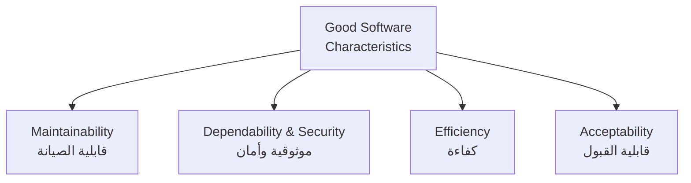

**الشرح:** أربع صفات مترابطة — برمجية عالية الكفاءة لكنها غير قابلة للصيانة، أو موثوقة لكن غير مقبولة من المستخدمين، لا تُعتبر برمجية جيدة بشكل كامل.

---

#### 📖 التعريف الدقيق

| الصفة | الوصف |
| --- | --- |
| **`Maintainability` (قابلية الصيانة)** | يجب أن تُكتب البرمجية بطريقة تسمح بتطويرها لاحقاً لمواكبة احتياجات العملاء المتغيرة — صفة حرجة لأن تغيّر بيئة الأعمال أمر لا مفر منه |
| **`Dependability & Security` (الموثوقية والأمان)** | تشمل الموثوقية (`reliability`)، الأمان الوظيفي (`safety`)، والأمان السيبراني (`security`) — يجب ألا تسبب ضرراً مادياً أو اقتصادياً عند الفشل، ولا يستطيع مستخدمون خبثاء الوصول إليها أو إتلافها |
| **`Efficiency` (الكفاءة)** | يجب ألا تُهدر موارد النظام مثل الذاكرة ودورات المعالج — تشمل سرعة الاستجابة، زمن المعالجة، واستخدام الذاكرة |
| **`Acceptability` (القبول)** | يجب أن تكون مقبولة للنوع المستهدف من المستخدمين — يعني مفهومة، قابلة للاستخدام، ومتوافقة مع الأنظمة الأخرى التي يستخدمونها |

#### 🎯 الملخص السريع
- Maintainability = قابلية التطوير مع الوقت
- Dependability & Security = موثوقية + أمان (لا ضرر عند الفشل، لا اختراق)
- Efficiency = استغلال موارد النظام بكفاءة
- Acceptability = مفهومة، قابلة للاستخدام، متوافقة

#### 📚 التطبيق
هذه الصفات الأربع ستكون معيار التقييم الأساسي في مواضيع `Software Quality` و`Software Metrics` لاحقاً في المادة.

#### 📄 النص الأصلي من المحاضرة
<details>
<summary>عرض النص الأصلي (coverage: 100%)</summary>

> "Maintainability: Software should be written in such a way so that it can evolve to meet the changing needs of customers... Dependability and security includes a range of characteristics including reliability, security and safety. Dependable software should not cause physical or economic damage in the event of system failure. Malicious users should not be able to access or damage the system. Efficiency: Software should not make wasteful use of system resources... Acceptability: Software must be acceptable to the type of users for which it is designed..."

**ملاحظة على التغطية:**
- ✓ شرح كامل للصفات الأربع من الجدول الأصلي

</details>

---

### 9. مصطلحات هندسة البرمجيات (SE Terminology)

### 9.1. Deliverables و Milestones
<!-- @type: fact -->
<!-- @render: {type: "diagram-first", coverage: "100%"} -->

#### 📍 أين نحن الآن؟
مصطلحات إدارية أساسية ستتكرر كثيراً في مادة `Software Project Planning` لاحقاً.

#### ⬅️ الربط مع السابق
`Deliverables` هي فعلياً نفس عناصر `Software Product` (القسم 4.2)، لكن بمصطلح إداري مختلف.

#### 💡 الفكرة الأساسية
**`Deliverables` هي ما يُنتَج فعلياً أثناء التطوير، بينما `Milestones` هي أحداث تُستخدم لقياس تقدم المشروع.**

---

#### 📊 المخطط: Deliverables و Milestones على خط زمني


**الشرح:** كل تسليمة (`Deliverable`) تؤدي عادة إلى نقطة تحقق (`Milestone`) تُستخدم لتقييم تقدم المشروع أمام الإدارة أو العميل.

---

#### 📖 التعريف الدقيق

- **`Deliverables` (التسليمات):** تُنتَج أثناء عملية تطوير البرمجية، مثل: الكود المصدري، أدلة المستخدم، إجراءات التشغيل.
- **`Milestones` (نقاط التحقق):** أحداث تُستخدم لتحديد حالة المشروع، مثل: اكتمال المواصفات النهائية، أو اكتمال وثائق التصميم.

#### 🎯 الملخص السريع
- Deliverable = "شيء" ملموس يُنتَج
- Milestone = "حدث" يستخدم لقياس التقدم

#### 📚 التطبيق
تُستخدم لاحقاً في تخطيط المشروع (`Project Planning`) لبناء الجدول الزمني ومتابعة الأداء.

#### 📄 النص الأصلي من المحاضرة
<details>
<summary>عرض النص الأصلي (coverage: 100%)</summary>

> "Deliverables: Generated during software development, e.g., source code, user manuals, operating procedures. Milestones: Events that are used to ascertain the status of the project, e.g., Finalization of specification is a milestone, Completion of design documentation"

**ملاحظة على التغطية:**
- ✓ شرح كامل للتعريفين مع أمثلة

</details>

---

### 9.2. Product و Process
<!-- @type: fact -->
<!-- @render: {type: "diagram-first", coverage: "100%"} -->

#### 📍 أين نحن الآن؟
تفريق مهم جداً بين مصطلحين يُخلط بينهما كثيراً: `Product` و`Process`.

#### ⬅️ الربط مع السابق
`Process` هنا نفس مفهوم `Software Process` من القسم 6.1 لكن بصياغة مختصرة كمصطلح.

#### 💡 الفكرة الأساسية
**`Product` = "ماذا" نسلّم (النتيجة)، بينما `Process` = "كيف" وصلنا لهذه النتيجة (الطريقة).**

---

#### 📊 المخطط: Product مقابل Process

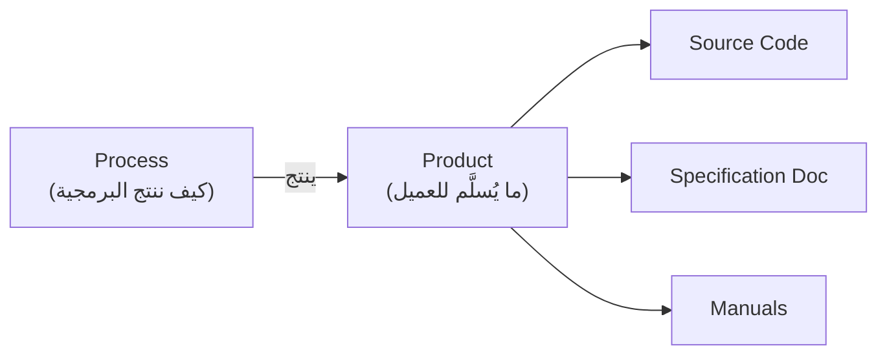

**الشرح:** العملية هي مجموعة الأنشطة التي تؤدي إلى إنتاج (جزء من) المنتج — المنتج هو النتيجة الملموسة النهائية.

---

#### 📖 التعريف الدقيق

- **`Product`:** ما يُسلَّم للعميل — يشمل الكود المصدري، وثيقة المواصفات، الأدلة، التوثيق. هو ببساطة **مجموعة التسليمات (`deliverables`) فقط**.
- **`Process`:** الطريقة التي ننتج بها البرمجية — مجموعة الأنشطة التي تؤدي إلى (جزء من) المنتج.

#### 🎯 الملخص السريع
- Product = مجموعة الـ Deliverables (النتيجة)
- Process = طريقة الوصول للنتيجة (الأنشطة)

#### 📚 التطبيق
هذا الفرق أساسي لفهم "إدارة المشروع" لاحقاً (القسم 10) — الإدارة الجيدة تهتم بالعملية (Process) بقدر اهتمامها بالمنتج (Product).

#### 📄 النص الأصلي من المحاضرة
<details>
<summary>عرض النص الأصلي (coverage: 100%)</summary>

> "Product: is what is delivered to the customer, includes source code, specification document, manuals, documentation. Basically, a set of deliverables only. Process: way in which we produce software, collection of activities that leads to (a part of) a product."

**ملاحظة على التغطية:**
- ✓ شرح كامل للتعريفين

</details>

---

### 9.3. المقاييس (Measures, Measurement, Metrics)
<!-- @type: fact -->
<!-- @render: {type: "diagram-first", coverage: "100%"} -->

#### 📍 أين نحن الآن؟
مصطلحات القياس — ستكون أساس مادة كاملة لاحقاً باسم `Software Metrics`.

#### ⬅️ الربط مع السابق
كيف نقيس "جودة" البرمجية والعملية التي درسناها سابقاً؟ عبر هذه المصطلحات.

#### 💡 الفكرة الأساسية
**ثلاث كلمات مرتبطة لكنها مختلفة: `Measure` (رقم واحد)، `Measurement` (فعل القياس)، `Metrics` (ربط عدة قياسات ببعض).**

---

#### 📊 المخطط: العلاقة بين Measure, Measurement, Metrics

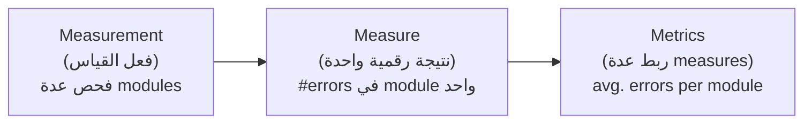

**الشرح:** تبدأ بعملية القياس (Measurement) للحصول على قيم فردية (Measures)، ثم تُربط هذه القيم ببعضها لإنتاج مقياس أشمل (Metrics).

---

#### 📖 التعريف الدقيق

- **`Measure` (مقياس فردي):** مؤشر كمي يوضح مدى/حجم/سعة/موثوقية سمة معينة في منتج أو عملية. مثال: عدد الأخطاء (`#errors`) في مراجعة وحدة واحدة.
- **`Measurement` (فعل القياس):** عملية تقييم المقياس فعلياً. مثال: فحص عدة وحدات لجمع بيانات عدد الأخطاء في كل وحدة.
- **`Metrics` (المقاييس المركّبة):** ربط عدة `measures` فردية ببعضها بطريقة معينة. مثال: متوسط عدد الأخطاء لكل وحدة (`avg. #errors per module`).

بالإضافة، فيه نوعان من `Software Metrics`:
- **`Process Metrics`:** تقيس خصائص عملية التطوير والبيئة، مثل الإنتاجية (`productivity`)، الجودة، معدل الفشل.
- **`Product Metrics`:** تقيس خصائص المنتج نفسه، مثل الحجم، الموثوقية، التعقيد، الوظائف.

#### 🎯 الملخص السريع
- Measure = رقم واحد لسمة واحدة
- Measurement = فعل القياس نفسه
- Metrics = دمج عدة measures
- Process Metrics (عن العملية) vs Product Metrics (عن المنتج)

#### 📚 التطبيق
هذا الأساس النظري ستبني عليه مادة كاملة لاحقاً (`Software Metrics`) لقياس جودة الكود والعملية.

#### 📄 النص الأصلي من المحاضرة
<details>
<summary>عرض النص الأصلي (coverage: 100%)</summary>

> "Measure: a quantitative indication of the extent, dimension, size, capacity, or reliability of some attributes of a product or process... Measurement: the act of evaluating a measure... Metrics: relating the individual measures in some way... Process metrics: quantify the attributes of software development process and environment... Product metrics: are measures for the software product..."

**ملاحظة على التغطية:**
- ✓ شرح كامل للمصطلحات الثلاثة ونوعي Software Metrics

</details>

---

### 9.4. الإنتاجية، Module، Component
<!-- @type: fact -->
<!-- @render: {type: "diagram-first", coverage: "100%"} -->

#### 📍 أين نحن الآن؟
آخر مجموعة مصطلحات أساسية قبل الانتقال لموضوع إدارة التطوير.

#### ⬅️ الربط مع السابق
`Productivity` هي أحد أنواع `Process Metrics` التي ذكرناها للتو.

#### 💡 الفكرة الأساسية
**الإنتاجية تُقاس بـ (الناتج ÷ الجهد)، والـ Module والـ Component مصطلحان مرتبطان لكن مختلفان في مستوى التجريد.**

---

#### 📊 المخطط: العلاقة بين Module و Component

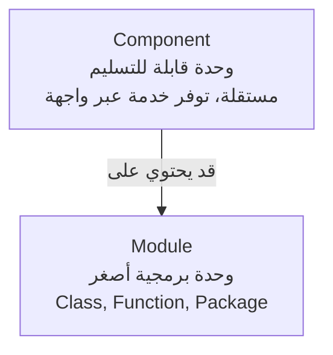

**الشرح:** `Component` مفهوم أوسع من `Module` — المكون قد يتكوّن من عدة وحدات (modules)، ويوفر خدماته عبر واجهات (`interfaces`) واضحة.

---

#### 📖 التعريف الدقيق

**الإنتاجية (`Productivity`):**
- تُعرَّف بأنها **معدل الناتج، الإنتاج لكل وحدة جهد**.
- تركّز على "الناتج المُحقَّق بالنسبة للوقت المستغرق"، بغض النظر عن التكلفة المالية.
- وحدة قياس الناتج: مثلاً عدد أسطر الكود (`LOC` - Lines of Code).
- وحدة قياس الوقت: أيام أو أشهر.
- وحدة الجهد الأنسب: **شهر-شخص (`Person Months` - PMs)** — أي عدد الأشخاص المشاركين × عدد الأشهر.
- **الصيغة:** `Productivity = LOC / PM`

**`Module` (الوحدة):**
- يمكن أن تكون: subroutine في Fortran، Package في Ada، procedures/functions في Pascal/C، class في C++/Java، أو حتى مهمة عمل مخصصة لمطوّر واحد.

**`Component` (المكوّن):**
- قطعة وظيفية **مستقلة قابلة للتسليم**، توفر الوصول لخدماتها عبر واجهات (`interfaces`).

#### 🎯 الملخص السريع
- Productivity = LOC / Person-Months
- Module = وحدة برمجية (subroutine, class, function...)
- Component = وحدة أكبر ومستقلة، توفر خدمة عبر interface

#### 📚 التطبيق
هذه المصطلحات ستُستخدم بكثرة في مواد `Software Design` و`Software Metrics` القادمة.

#### 📄 النص الأصلي من المحاضرة
<details>
<summary>عرض النص الأصلي (coverage: 100%)</summary>

> "Productivity: defined as the rate of output, production per unit of effort. Output achieved with regard to the time taken, but irrespective of the cost incurred. Unit of measure: Quantity of output: e.g., LOC produced; Time... Unit of effort: most appropriate unit of effort is Person Months (PMs)... Productivity may be measured as LOC/PM. Module: a Fortran subroutine, an Ada Package, 'procedures & functions' in Pascal & C, 'C++, Java class, Java packages', a work assignment for an individual developer. Component: an independently deliverable piece of functionality providing access to its services through interfaces."

**ملاحظة على التغطية:**
- ✓ شرح كامل لجميع المصطلحات والصيغة

</details>

---

### 10. دور الإدارة في تطوير البرمجيات (Role of Management in SD)
<!-- @type: principle -->
<!-- @render: {type: "diagram-first", visualization: "flowchart", coverage: "95%"} -->

#### 📍 أين نحن الآن؟
آخر موضوع في المحاضرة — يربط كل ما تعلمناه (المنتج، العملية، المصطلحات) بدور الإدارة الفعلي في نجاح المشروع.

#### ⬅️ الربط مع السابق
`Process` و`Product` (القسم 9.2) هما اثنان من أربعة عوامل إدارية أساسية سنشرحها الآن بالكامل.

#### 💡 الفكرة الأساسية
**نجاح إدارة تطوير البرمجيات يعتمد على أربعة عوامل مترابطة: الأفراد (People)، المنتج (Product)، العملية (Process)، والمشروع (Project) — ولا يوجد "وصفة واحدة" تناسب كل الحالات؛ القرار يعتمد على السياق.**

---

#### 📊 المخطط: العوامل الأربعة للإدارة

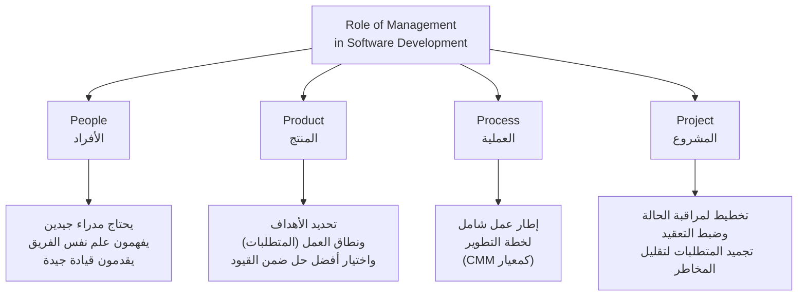

**الشرح:** أربعة عوامل مترابطة يجب على الإدارة التعامل معها معاً — إهمال أي عامل واحد (مثل تجاهل نفسية الفريق أو ترك المتطلبات مفتوحة) يهدد نجاح المشروع كله.

---

#### 📖 الإطار القرار (Decision Framework)

لفهم دور كل عامل، اسأل نفسك هذه الأسئلة:

**1. عامل الأفراد (People) — هل الفريق مُدار جيداً؟**
- تطوير البرمجيات يحتاج **مدراء جيدين**.
- المدير الجيد **يفهم سيكولوجية الأفراد** (people psychology).
- يوفّر **قيادة جيدة (leadership)**.
- الإدارة الجيدة **لا تضمن** نجاح المشروع بشكل مطلق، لكنها **تزيد احتمالية النجاح**.
- الأولويات: الاختيار (selection)، التدريب (training)، التعويض (compensation)، التطوير الوظيفي (career development)، وثقافة العمل (work culture).

**2. عامل المنتج (Product) — هل نعرف بالضبط ماذا نريد تسليمه؟**
- السؤال الأساسي: **ماذا نريد تسليمه للعميل؟**
- تحديد الأهداف ونطاق العمل (المتطلبات - requirements).
- مناقشة الحلول البديلة الممكنة.
- اختيار أفضل نهج **ضمن القيود** المفروضة (موعد التسليم، الميزانية، توفر الأفراد).
- تحديد التكلفة التقديرية، وقت التطوير، والجدول الزمني.

**3. عامل العملية (Process) — هل لدينا طريقة عمل واضحة؟**
- `Process` = الطريقة التي ننتج بها البرمجية.
- توفر إطار عمل (`framework`) يُبنى منه خطة شاملة للتطوير.
- توجد عدة نماذج لدورة الحياة (`life cycle models`) ونماذج تحسين العملية.
- **`CMM` (Capability Maturity Model)** هو معيار عالمي لإطار العملية.

**4. عامل المشروع (Project) — هل نراقب ونتحكم بالمخاطر؟**
- التخطيط ضروري **لمراقبة حالة** تطوير البرمجية.
- التخطيط ضروري **للتحكم بالتعقيد**.
- في المشروع الناجح، يجب أن نفهم **ماذا يمكن أن يخطئ وكيف نصلحه**.
- تعريف متطلبات ملموسة **وتجميدها (`freeze`)**.
- **التغييرات لا ينبغي إدخالها بلا داعٍ** لتجنب المفاجآت البرمجية، لأنها **دائماً محفوفة بالمخاطر**.

#### 💼 السياقات المختلفة (Context Examples)

**السيناريو 1: فريق صغير يبني تطبيقاً لعميل واحد**
- التركيز الأكبر: عامل **People** (لأن الفريق صغير، أداء كل فرد مؤثر جداً على النتيجة) وعامل **Product** (تحديد المتطلبات بدقة مع عميل واحد).

**السيناريو 2: مؤسسة كبيرة تطوّر نظاماً حساساً (مثل نظام بنكي)**
- التركيز الأكبر: عامل **Process** (إطار عمل موثّق مثل CMM لضمان الجودة والامتثال) وعامل **Project** (تجميد المتطلبات ومراقبة صارمة للمخاطر لأن أي تغيير مفاجئ خطير جداً في هذا السياق).

---

#### ⚖️ المقايضة: تجميد المتطلبات مقابل المرونة

| الجانب | تجميد المتطلبات (Freeze) | السماح بتغييرات مستمرة |
| --- | --- | --- |
| **المخاطر** | أقل مفاجآت برمجية | كل تغيير خطر محتمل جديد |
| **القدرة على التنبؤ** | عالية (جدول زمني وتكلفة أوضح) | منخفضة (يصعب التنبؤ بالنطاق النهائي) |
| **المرونة لاحتياجات جديدة** | منخفضة | عالية |

#### 🤔 تفعيل الفهم
أنت مدير مشروع، وفريقك يعمل على نظام حساس (مثل نظام دفع إلكتروني)، والعميل يطلب باستمرار إضافة مميزات جديدة أثناء التطوير. حسب ما تعلمته في عامل "Project"، ما هي المخاطرة الرئيسية هنا، وكيف تتعامل معها؟

**تلميح:** فكّر في مفهوم "تجميد المتطلبات" وعلاقته بالمفاجآت البرمجية.

#### 📄 النص الأصلي من المحاضرة
<details>
<summary>عرض النص الأصلي (coverage: 95%)</summary>

> "Four factors: People — SD requires good managers, Good managers understand people psychology, Provide good leadership, Cannot ensure the success of project, but can increase the probability of success, Priority: selection, training, compensation, career development, work culture. Product — What do we want to deliver to the customer? Define objectives & scope of work (requirements), Discussion of alternative solutions, Select best approach within constraints imposed by delivery deadline, budget, personnel availability, Define estimated cost, Development time, schedule. Process — Way in which we produce software, Provides framework from which a comprehensive plan for software development can be established, Several life cycle models & process improvement models, CMM (Capability Maturity Model), a standard for process framework. Project — A planning is required to monitor the status of SD, A planning is required to control the complexity, In a successful project, we must understand what can go wrong & how to do it right, Define concrete requirements & freeze them, Changes should not be incorporated to avoid software surprises, because they are always risky!"

**ملاحظة على التغطية:**
- ✓ شرح كامل للعوامل الأربعة وكل النقاط الفرعية
- ℹ️ إضافة من الدليل: سيناريوهات مقارنة، جدول مقايضة، تفعيل الفهم

</details>

---

### مثال متكامل: من الأزمة إلى الحل — مشروع نظام بنكي
<!-- @type: example-for-topics-1.1-to-10 -->

#### 📌 السياق
شركة صغيرة كُلّفت ببناء نظام إدارة حسابات بنكية بسيط. لنرَ كيف تتفاعل كل المفاهيم التي درسناها في هذه المحاضرة معاً.

#### 💼 السيناريو (Real-World Example)

**بدون تطبيق مبادئ SE (النتيجة المتوقعة حسب Software Crisis):**
- الفريق بدأ يكتب كود مباشرة بدون توثيق متطلبات واضح (تجاهل لمفهوم `Software Specification`).
- اعتقدوا أن "المميزات الأكثر = برنامج أفضل" فأضافوا خصائص غير ضرورية (وقعوا في `Software Myth #7`).
- لما تأخر المشروع، أضافوا 3 مبرمجين جدد فجأة على أمل تسريع الإنجاز (`Software Myth #8`).
- لم يوثّقوا شيئاً (تجاهلوا `Documentation` بأنواعها).
- النتيجة: تجاوز الميزانية بشكل كبير، والنظام لم يعمل كما توقّع العميل — بالضبط مثل حالة قاعدة بيانات العملاء في القسم 1.1.

**مع تطبيق مبادئ SE (الطريقة الصحيحة):**
- بدأوا بمرحلة `Software Specification`: حددوا مع العميل بالضبط ماذا يجب أن يفعل النظام (هل هو `Generic` أم `Bespoke`؟ — في هذه الحالة `Bespoke` لأن البنك يملك المواصفات).
- طبّقوا `Software Development` بمنهجية منظمة (نهج المهندس المنظم من القسم 2.2).
- وثّقوا كل مرحلة: `Analysis/Specification`, `Design`, `Implementation`, `Testing` (القسم 3.2).
- ركّزوا على صفات `Good Software` الأربع: التأكد من `Maintainability` لتسهيل التعديلات المستقبلية، و`Dependability & Security` (حرج جداً لنظام بنكي يتعامل مع أموال حقيقية)، و`Efficiency`، و`Acceptability` لموظفي البنك.
- إدارة المشروع طبّقت عوامل `People, Product, Process, Project` معاً: مدير جيد، متطلبات مجمّدة (Frozen)، عملية موثقة (قريبة من معيار CMM).

#### 💡 كيف تجتمع المفاهيم؟
- **Software Process (Specification → Development → Validation → Evolution):** أعطى الفريق خارطة طريق واضحة.
- **Good Software Characteristics:** كانت المعيار الذي يُقاس عليه نجاح كل مرحلة.
- **Management Factors (People/Product/Process/Project):** ضمنت أن العمل مُدار وليس عشوائياً.
- **النتيجة:** نظام يعمل، يُسلَّم قريباً من الموعد، ضمن الميزانية تقريباً، ويمكن صيانته لاحقاً بسهولة.

#### ⚠️ لو ما طبّقتهم صح؟
- بدون `Specification` واضح: نفس مصير قاعدة بيانات العملاء (يعمل لكن ليس كما هو متوقع).
- بدون الانتباه لـ `Software Myths`: قرارات خاطئة (مثل إضافة مبرمجين في اللحظة الأخيرة) تزيد التأخير بدل حله.
- بدون تجميد المتطلبات (عامل Project): مفاجآت مستمرة وتجاوز ميزانية — تماماً مثل إحصائية IBM (53% تجاوز تكلفة).

---

## الجزء الثاني: ملخص شامل (Alternative Complete Reading)

هذه المحاضرة تجاوب على سؤال بسيط لكنه أساسي: ليش نحتاج أصلاً تخصص اسمه `Software Engineering`؟ الجواب يبدأ من مشكلة حقيقية موثقة اسمها `Software Crisis` — أزمة البرمجيات. تقرير IBM يقول إن 31% من المشاريع البرمجية تُلغى قبل ما تخلص، و53% منها تتجاوز الميزانية المتوقعة بمعدل مهول يصل 189%، ومن كل 100 مشروع فيه 94 عملية إعادة بدء من الصفر. هذي أرقام مو نظرية — وراها قصص حقيقية: مشكلة Y2K اللي صُرفت عليها ملايين لحل مشكلة كانت شبه وهمية، صاروخ Patriot العسكري اللي قتل 28 جندي بسبب خطأ بسيط جداً في توقيت الساعة، ومشروع قاعدة بيانات عملاء كلّف مليون دولار على مدى 18 شهر وسُلّم في وقته لكنه ما اشتغل صح، وصاروخ Ariane-5 اللي انفجر بعد 39 ثانية فقط بسبب خطأ تحويل بيانات بسيط من صيغة 64-bit إلى 16-bit. حتى Windows XP نزلت له تحديثات وتصحيحات في نفس يوم إطلاقه الرسمي! كل هذه الأمثلة توضح إن المشكلة مو بس في "كتابة كود يشتغل"، المشكلة أعمق: التكلفة، الوقت، والجودة كلها معرّضة للفشل بدون منهجية واضحة. وحتى ناحية التكلفة نفسها، البرمجيات صارت تهيمن على تكلفة الأنظمة الحاسوبية — تكلفة البرمجيات على جهاز الكمبيوتر غالباً أعلى من تكلفة الهاردوير نفسه، والأهم من هذا إن صيانة البرمجية بعد تسليمها تكلف أكثر من تطويرها من الأصل، وممكن توصل لعدة أضعاف تكلفة التطوير في الأنظمة اللي تعيش لسنوات طويلة.

الحل لكل هذي المشاكل هو `Software Engineering` نفسه، اللي عُرّف من أول مؤتمر رسمي له سنة 1968 بأنه "إنشاء واستخدام مبادئ هندسية سليمة للحصول على برمجية مطوَّرة اقتصادياً، موثوقة، وتعمل بكفاءة على الأجهزة الحقيقية"، وتعريف حديث أكثر (Schach) يقول إنه تخصص هدفه إنتاج برمجية جيدة الجودة، تُسلَّم في الوقت المحدد، ضمن الميزانية، وتحقق متطلبات العميل. والفرق الجوهري بين "المبرمج العادي" و"مهندس البرمجيات" إن الأخير يعتمد نهج منظم وموثّق، يختار الأدوات المناسبة حسب طبيعة كل مشكلة (مو نفس الطريقة لكل مشروع)، ويستغل الموارد المتاحة بأفضل شكل ممكن.

من المهم جداً إنك تفرّق بين مصطلحين يُخلط بينهما كثيراً: `Program` و`Software`. البرنامج (Program) هو الكود المصدري فقط، بينما البرمجية (Software) مفهوم أوسع يشمل البرنامج + التوثيق (Documentation) + إجراءات التشغيل (Operating Procedures). التوثيق نفسه ينقسم حسب مرحلة التطوير: وثائق التحليل والمواصفات (Formal Specification, Context Diagram, Data Flow Diagram)، وثائق التصميم (Flow Charts, Entity-Relationship Diagram)، وثائق التنفيذ (Source Code Listing, Cross-Reference Listing)، ووثائق الاختبار (Test Data, Test Results). أما إجراءات التشغيل فتنقسم لنوعين: أدلة للمستخدم النهائي (System Overview, Beginner's Guide, Tutorial, Reference Guide)، وأدلة تشغيلية للفريق الفني (Installation Guide, System Administration Guide).

وعندما نتكلم عن "منتج البرمجية" (Software Product)، فهو أي شيء مصمّم للتسليم للمستخدم، ويشمل عشرة عناصر: الكود المصدري، الكود الكائني، التقارير، الخطط، الوثائق، الأدلة، البيانات، مجموعات الاختبار، نتائج الاختبار، والنماذج الأولية. ومن ناحية الملكية، فيه نوعان من منتجات البرمجيات: `Generic` وهو المنتج اللي المطوّر نفسه يملك مواصفاته ويقرر التغييرات فيها (مثل برنامج يُباع لسوق عام)، و`Bespoke` أو `Customized` وهو المنتج اللي العميل يملك مواصفاته ويقرر تغييراته (مثل نظام مبني خصيصاً لمؤسسة معينة).

نقطة مهمة جداً في هذه المحاضرة هي `Software Myths` — الأساطير التسعة اللي يصدقها كثير من الناس بالخطأ عن البرمجيات: إن البرمجية سهلة التغيير، إن الحواسيب دائماً أكثر موثوقية من الأجهزة اللي استبدلتها، إن الاختبار يزيل كل الأخطاء (وهذا خطأ لأن الاختبار يكشف وجود أخطاء بس ما يقدر يثبت غيابها الكامل)، إن إعادة استخدام البرمجية تزيد الأمان تلقائياً، إن البرمجية ممكن تعمل صح من أول مرة، إن التصميم الشامل يتجنب مشاكل التكامل، إن المميزات الأكثر تعني برمجية أفضل، إن إضافة مهندسين جدد تعوّض التأخير (وهذا من أخطر الأساطير — إضافة أفراد لمشروع متأخر غالباً يزيده تأخيراً بسبب وقت التدريب والتنسيق)، وأخيراً إن الهدف من كل هذا هو مجرد "برامج تعمل" بدون اعتبار للجودة والصيانة.

الحل المنهجي لكل هذا هو `Software Process` — الطريقة اللي ننتج فيها البرمجية، وتساعد المطورين يستخدمون أفضل الممارسات لإنجاز مشاريعهم بنجاح وتحسين الجودة والإنتاجية وإمكانية التنبؤ. تتكون من أربعة أنشطة: `Software Specification` (تحديد ماذا يجب أن تفعل البرمجية والقيود عليها)، `Software Development` (التصميم والبرمجة)، `Software Validation` (التحقق إنها تحقق متطلبات العميل)، و`Software Evolution` (تعديلها لمواكبة المتطلبات المتغيرة).

من ناحية الخصائص، البرمجية تختلف جذرياً عن الهاردوير في أربعة أشياء: لا تتآكل (منحنى أعطالها ينخفض باستمرار مع كل تصحيح، بعكس منحنى U للهاردوير اللي يرتفع في نهاية عمره بسبب التآكل الفيزيائي)، لا تُصنَّع بل تُنسَخ فقط بتكلفة شبه معدومة، قابلة لإعادة الاستخدام، ومرنة نسبياً. وتُستخدم في مجالات متنوعة جداً: برمجيات النظام (compilers, OS, drivers)، برمجيات الوقت الحقيقي (مراقبة الأحداث الحية)، برمجيات مضمّنة (embedded في الأجهزة)، برمجيات الأعمال (إدارة الموظفين والحسابات)، برمجيات الحاسوب الشخصي (MS-Office)، برمجيات الذكاء الاصطناعي (الأنظمة الخبيرة والشبكات العصبية)، برمجيات الويب (CGI, HTML, Perl)، وبرمجيات هندسية وعلمية (CAD, SPSS, MATLAB).

أهم معيار في المادة كلها هو "إيش يعني برمجية جيدة؟" — والجواب أربع صفات: `Maintainability` (قابلية الصيانة، لأن تغيّر متطلبات العمل أمر لا مفر منه)، `Dependability & Security` (الموثوقية والأمان، بحيث لا تسبب ضرراً مادياً أو اقتصادياً عند الفشل ولا يستطيع مستخدمون خبثاء الوصول لها أو إتلافها)، `Efficiency` (كفاءة استخدام الموارد كالذاكرة ودورات المعالج)، و`Acceptability` (مقبولة، مفهومة، قابلة للاستخدام، ومتوافقة مع الأنظمة الأخرى للمستخدمين المستهدفين).

وفي نهاية المحاضرة، تُشرح مجموعة مصطلحات إدارية وقياسية مهمة جداً هتتكرر طول المادة. `Deliverables` هي ما يُنتَج أثناء التطوير (كود، أدلة، إجراءات)، بينما `Milestones` أحداث تُستخدم لقياس تقدم المشروع (مثل اكتمال المواصفات). `Product` هو مجموعة التسليمات النهائية اللي تُسلَّم للعميل، بينما `Process` هو مجموعة الأنشطة اللي أنتجت هذا المنتج. أما القياس، ففيه ثلاث كلمات مترابطة: `Measure` وهو مؤشر رقمي فردي لسمة واحدة (زي عدد الأخطاء في module)، `Measurement` وهو فعل القياس نفسه (فحص عدة modules لجمع بيانات الأخطاء)، و`Metrics` وهو ربط عدة measures ببعض (زي متوسط الأخطاء لكل module). وفيه نوعان من Software Metrics: `Process Metrics` (تقيس خصائص عملية التطوير مثل الإنتاجية والجودة)، و`Product Metrics` (تقيس خصائص المنتج نفسه مثل الحجم والتعقيد). والإنتاجية (Productivity) نفسها تُعرَّف بأنها معدل الناتج لكل وحدة جهد، وتُقاس عادة بـ LOC/PM (أسطر كود مقسومة على شهر-شخص). أخيراً `Module` وحدة برمجية (subroutine, class, function...) بينما `Component` وحدة أكبر ومستقلة توفر خدماتها عبر واجهات محددة.

وتُختم المحاضرة بموضوع "دور الإدارة في تطوير البرمجيات"، اللي يلخّص كل شيء درسناه في أربعة عوامل مترابطة يجب على أي مدير مشروع ناجح التعامل معها: `People` (الأفراد — يحتاج مدراء جيدين يفهمون سيكولوجية الفريق ويقدمون قيادة جيدة، مع إن الإدارة الجيدة ما تضمن النجاح بشكل مطلق لكنها تزيد احتماليته، والأولويات هنا: الاختيار، التدريب، التعويض، التطوير الوظيفي، وثقافة العمل)، `Product` (تحديد بالضبط إيش نريد نسلّم للعميل، مناقشة الحلول البديلة، واختيار أفضل نهج ضمن قيود الموعد والميزانية وتوفر الأفراد)، `Process` (طريقة إنتاج البرمجية، توفر إطار عمل لخطة شاملة، وفيه نماذج مختلفة لدورة الحياة، ومعيار CMM هو المرجع العالمي لإطار العملية)، و`Project` (التخطيط ضروري لمراقبة الحالة والتحكم بالتعقيد، وفي المشروع الناجح لازم تفهم إيش ممكن يخطئ وكيف تصلحه، وتحديد متطلبات ملموسة وتجميدها، لأن التغييرات المستمرة دائماً محفوفة بالمخاطر وتسبب مفاجآت سيئة).

النقطة اللي لازم تربط كل هذا ببعض: كل مشكلة ذكرناها في `Software Crisis` في بداية المحاضرة، لها حل مباشر في المفاهيم اللي جاءت بعدها — الأساطير تفسّر ليش القرارات الخاطئة تصير، Process يعطي إطار منظم يتجنب العشوائية، صفات البرمجية الجيدة تعطي معايير واضحة للنجاح، ومصطلحات الإدارة (People/Product/Process/Project) تعطي إطار كامل لإدارة أي مشروع بنجاح. هذا هو الأساس اللي ستُبنى عليه باقي مواضيع المادة: نماذج دورة الحياة (SDLC Models)، تحليل وتخصيص المتطلبات، التصميم، القياسات، الموثوقية، الاختبار، والصيانة.

---

## الجزء الثالث: أسئلة اختيار من متعدد (MCQ)

### السؤال 1 (Easy)

**السؤال:** According to the IBM report mentioned in the lecture, what percentage of software projects get cancelled before completion?

أ) 53%
ب) 31%
ج) 94%
د) 189%

**الإجابة الصحيحة:** ب

**التعليل الكامل:**
- ❌ أ): 53% هي نسبة المشاريع التي تتجاوز تقديرات التكلفة، وليست نسبة الإلغاء
- ✅ ب): التقرير ينص بوضوح أن 31% من المشاريع تُلغى قبل اكتمالها
- ❌ ج): 94 هي عدد عمليات إعادة البدء لكل 100 مشروع، وليست نسبة مئوية للإلغاء
- ❌ د): 189% هو متوسط نسبة تجاوز التكلفة، وليس نسبة الإلغاء

---

### السؤال 2 (Medium)

**السؤال:** The Ariane-5 rocket failure, described in the lecture, was caused by which type of error?

أ) A memory leak in the guidance software
ب) A missing test case for extreme weather
ج) A data conversion error from 64-bit to 16-bit format
د) A hardware manufacturing defect

**الإجابة الصحيحة:** ج

**التعليل الكامل:**
- ❌ أ): المحاضرة لم تذكر تسرب ذاكرة كسبب للفشل
- ❌ ب): المحاضرة لم تربط الفشل بحالة اختبار خاصة بالطقس
- ✅ ج): النص الأصلي يذكر بوضوح أن السبب كان "Conversion error: 64-bit to 16-bit format"
- ❌ د): الفشل كان بسبب خطأ برمجي في تحويل البيانات، وليس عيباً في تصنيع الهاردوير

---

### السؤال 3 (Easy)

**السؤال:** According to the lecture, software costs on a PC compared to hardware costs are usually:

أ) Always lower than hardware costs
ب) Roughly equal to hardware costs
ج) Often greater than hardware costs
د) Impossible to compare

**الإجابة الصحيحة:** ج

**التعليل الكامل:**
- ❌ أ): المحاضرة تقول العكس تماماً
- ❌ ب): المحاضرة لم تذكر التساوي كحالة عامة
- ✅ ج): النص الأصلي ينص على أن "the costs of software on a PC are often greater than the hardware cost"
- ❌ د): المحاضرة قارنت بينهما بوضوح

---

### السؤال 4 (Medium)

**السؤال:** Which definition of Software Engineering was introduced at the 1st Software Engineering conference in 1968?

أ) A discipline concerned only with writing correct code
ب) The establishment and use of sound engineering principles to obtain economically developed, reliable software
ج) The process of testing software until no bugs remain
د) A management technique for tracking project deadlines

**الإجابة الصحيحة:** ب

**التعليل الكامل:**
- ❌ أ): التعريف لم يقتصر على "كتابة كود صحيح" فقط
- ✅ ب): هذا هو نص التعريف الحرفي من المحاضرة لمؤتمر 1968
- ❌ ج): الاختبار جزء من SE وليس تعريفه الكامل
- ❌ د): SE أوسع بكثير من مجرد تتبع المواعيد

---

### السؤال 5 (Hard)

**السؤال:** A software product is described as "Generic" when:

أ) The customer owns the specification and decides on changes
ب) The developer owns the specification and decides on changes
ج) Both the developer and customer share equal ownership of every decision
د) No one owns the specification; it evolves randomly

**الإجابة الصحيحة:** ب

**التعليل الكامل:**
- ❌ أ): هذا وصف المنتج المخصص (Bespoke/Customized)، وليس Generic
- ✅ ب): حسب المحاضرة، في المنتج العام (Generic) المطوّر هو من يملك المواصفة ويقرر التغييرات
- ❌ ج): المحاضرة لم تذكر ملكية مشتركة متساوية كتعريف رسمي
- ❌ د): وجود ملكية واضحة للمواصفة هو بالضبط ما يميز كلا النوعين

---

### السؤال 6 (Easy)

**السؤال:** Which of the following is NOT part of the "Software" definition given in the lecture (Software = Program + ... )?

أ) Documentation
ب) Operating Procedures
ج) Marketing Materials
د) Programs (Source Code)

**الإجابة الصحيحة:** ج

**التعليل الكامل:**
- ❌ أ): التوثيق جزء أساسي من تعريف Software حسب المحاضرة
- ❌ ب): إجراءات التشغيل جزء أساسي من تعريف Software حسب المحاضرة
- ✅ ج): المواد التسويقية لم تُذكر أبداً كجزء من تعريف Software في المحاضرة
- ❌ د): البرنامج (الكود المصدري) هو أحد المكونات الثلاثة الأساسية لـ Software

---

### السؤال 7 (Medium)

**السؤال:** Which of these is one of the Software Myths mentioned in the lecture?

أ) Adding more software engineers to a delayed project will make up the delay
ب) Testing can never find any errors in software
ج) Software always wears out over time like hardware
د) Reusing software always decreases system efficiency

**الإجابة الصحيحة:** أ

**التعليل الكامل:**
- ✅ أ): هذه إحدى الأساطير التسعة المذكورة حرفياً في المحاضرة
- ❌ ب): الأسطورة الحقيقية هي أن الاختبار "يزيل كل الأخطاء"، وليس أنه "لا يجد أي خطأ"
- ❌ ج): المحاضرة تقول العكس — البرمجية لا تتآكل، هذه إحدى خصائصها وليست أسطورة
- ❌ د): المحاضرة لم تذكر أن إعادة الاستخدام تقلل الكفاءة؛ الأسطورة المذكورة هي أنها "تزيد الأمان"

---

### السؤال 8 (Hard)

**السؤال:** In the lecture's software failure-intensity curves, how does software failure behavior differ from hardware?

أ) Software has a "wear out phase" identical to hardware
ب) Software failure intensity keeps decreasing and does not rise again due to physical wear
ج) Software and hardware have exactly the same failure curve shape
د) Software failure intensity always increases with usage time

**الإجابة الصحيحة:** ب

**التعليل الكامل:**
- ❌ أ): الهاردوير هو من له "wear out phase"، البرمجية لا تتآكل فيزيائياً
- ✅ ب): منحنى البرمجية ينخفض باستمرار مع كل تصحيح ولا يرتفع بسبب تآكل مادي، بعكس منحنى الهاردوير على شكل U
- ❌ ج): المنحنيان مختلفان تماماً في الشكل كما يوضح الرسم في المحاضرة
- ❌ د): هذا وصف خاطئ تماماً؛ الاتجاه العام هو الانخفاض وليس الازدياد

---

### السؤال 9 (Medium)

**السؤال:** Which of the following is classified as "Embedded Software" according to the lecture's software application types?

أ) MS-Office applications on a personal computer
ب) Software running from ROM in an automobile system
ج) A compiler used to build other programs
د) An expert system used for medical diagnosis

**الإجابة الصحيحة:** ب

**التعليل الكامل:**
- ❌ أ): هذا مثال على Personal Computer Software حسب المحاضرة
- ✅ ب): المحاضرة تذكر ROM وأنظمة السيارات كأمثلة صريحة على Embedded Software
- ❌ ج): المترجمات (compilers) مثال على System Software
- ❌ د): الأنظمة الخبيرة مثال على Artificial Intelligence Software

---

### السؤال 10 (Easy)

**السؤال:** Which characteristic of "Good Software" refers to the software not causing physical or economic damage in case of failure?

أ) Efficiency
ب) Acceptability
ج) Maintainability
د) Dependability and Security

**الإجابة الصحيحة:** د

**التعليل الكامل:**
- ❌ أ): الكفاءة تتعلق باستخدام موارد النظام مثل الذاكرة والمعالج، وليس بالضرر عند الفشل
- ❌ ب): القبول يتعلق بمدى ملاءمة البرمجية للمستخدمين المستهدفين
- ❌ ج): قابلية الصيانة تتعلق بإمكانية تطوير البرمجية مستقبلاً
- ✅ د): هذا التعريف الحرفي لصفة Dependability and Security في جدول المحاضرة

---

### السؤال 11 (Medium)

**السؤال:** What is the key difference between a "Deliverable" and a "Milestone" as defined in the lecture?

أ) A deliverable is a tangible output, while a milestone is an event used to check project status
ب) A milestone is a tangible output, while a deliverable is an event
ج) Both terms mean exactly the same thing
د) Deliverables only apply to hardware projects

**الإجابة الصحيحة:** أ

**التعليل الكامل:**
- ✅ أ): المحاضرة تعرّف الـ Deliverable كشيء يُنتَج (كود، أدلة)، والـ Milestone كحدث يُستخدم لتحديد حالة المشروع
- ❌ ب): هذا عكس التعريف الصحيح تماماً
- ❌ ج): المحاضرة فرّقت بينهما بوضوح
- ❌ د): كلا المصطلحين يُستخدمان في تطوير البرمجيات وليس الهاردوير فقط

---

### السؤال 12 (Hard)

**السؤال:** According to the terminology section, how is "Productivity" defined and measured in the lecture?

أ) LOC divided by Person Months (PM)
ب) The number of bugs found per test cycle
ج) The total cost of the project divided by its duration
د) The number of team meetings held per month

**الإجابة الصحيحة:** أ

**التعليل الكامل:**
- ✅ أ): المحاضرة تحدد صراحةً أن الإنتاجية تُقاس كـ "LOC/PM"
- ❌ ب): هذا مقياس متعلق بجودة الاختبار وليس الإنتاجية
- ❌ ج): المحاضرة تركّز على الناتج بالنسبة للوقت والجهد، وليس التكلفة المالية بشكل مباشر
- ❌ د): عدد الاجتماعات ليس مقياساً للإنتاجية حسب المحاضرة

---

### السؤال 13 (Medium)

**السؤال:** Which statement correctly distinguishes "Product" from "Process" as defined in the lecture?

أ) Product is the way we produce software; process is what is delivered
ب) Process is a set of deliverables only; product is a collection of activities
ج) Product is what is delivered to the customer; process is the way in which we produce software
د) Product and process are identical terms used interchangeably

**الإجابة الصحيحة:** ج

**التعليل الكامل:**
- ❌ أ): هذا عكس التعريف الصحيح تماماً
- ❌ ب): هذا أيضاً عكس التعريف الصحيح
- ✅ ج): هذا التعريف الحرفي الصحيح كما ورد في المحاضرة
- ❌ د): المحاضرة تفرّق بين المصطلحين بوضوح شديد

---

### السؤال 14 (Easy)

**السؤال:** Which of the following is one of the four Software Process activities mentioned in the lecture?

أ) Software Marketing
ب) Software Validation
ج) Software Pricing
د) Software Advertising

**الإجابة الصحيحة:** ب

**التعليل الكامل:**
- ❌ أ): التسويق لم يُذكر كنشاط من أنشطة Software Process
- ✅ ب): Software Validation هو أحد الأنشطة الأربعة المذكورة صراحةً (مع Specification, Development, Evolution)
- ❌ ج): التسعير لم يُذكر كنشاط من أنشطة Software Process
- ❌ د): الإعلان لم يُذكر كنشاط من أنشطة Software Process

---

### السؤال 15 (Hard)

**السؤال:** In the "Role of Management in Software Development" section, why does the lecture emphasize freezing requirements under the "Project" factor?

أ) Because frozen requirements guarantee zero bugs in the final product
ب) Because incorporating changes is always risky and can cause software surprises
ج) Because customers are legally required to freeze requirements
د) Because frozen requirements eliminate the need for testing

**الإجابة الصحيحة:** ب

**التعليل الكامل:**
- ❌ أ): تجميد المتطلبات لا يضمن خلو المنتج من الأخطاء، هذا ادعاء غير موجود في المحاضرة
- ✅ ب): النص الأصلي يقول صراحة إن التغييرات لا ينبغي إدخالها لتجنب المفاجآت البرمجية لأنها "دائماً محفوفة بالمخاطر"
- ❌ ج): لا يوجد ذكر لأي إلزام قانوني في المحاضرة
- ❌ د): تجميد المتطلبات لا علاقة له بإلغاء الحاجة للاختبار

---

### السؤال 16 (Medium)

**السؤال:** What is the main difference between a "Module" and a "Component" as described in the lecture's terminology section?

أ) A module is always larger than a component
ب) A component is an independently deliverable piece providing services through interfaces, while a module can be as small as a single function or class
ج) Modules and components are exactly the same concept with different names
د) Only components can contain source code, while modules cannot

**الإجابة الصحيحة:** ب

**التعليل الكامل:**
- ❌ أ): المحاضرة لا تذكر إن الوحدة (Module) دائماً أكبر؛ الأمر معاكس غالباً حسب مستوى التجريد
- ✅ ب): هذا وصف دقيق يجمع تعريف كلا المصطلحين من المحاضرة
- ❌ ج): المحاضرة تُقدّم تعريفين منفصلين لكل مصطلح
- ❌ د): كلاهما يحتوي على كود بطريقة أو بأخرى؛ هذا التمييز غير موجود في المحاضرة

---

## الجزء الرابع: بطاقات سؤال وجواب (Q&A Cards)

### البطاقة 1
**Q:** ما هي نسبة المشاريع البرمجية التي تُلغى قبل الاكتمال حسب تقرير IBM؟
**A:** 31% من المشاريع تُلغى قبل اكتمالها.

### البطاقة 2
**Q:** ما هو التعريف الرسمي لـ `Software Engineering` من مؤتمر 1968؟
**A:** إنشاء واستخدام مبادئ هندسية سليمة للحصول على برمجية مطوَّرة اقتصادياً، موثوقة، وتعمل بكفاءة على الأجهزة الحقيقية.

### البطاقة 3
**Q:** ما الفرق بين `Program` و`Software`؟
**A:** `Program` هو الكود المصدري فقط، بينما `Software` = Program + Documentation + Operating Procedures.

### البطاقة 4
**Q:** ما الفرق بين المنتج البرمجي `Generic` و`Bespoke`؟
**A:** في `Generic` المطوّر يملك المواصفة ويقرر التغييرات، بينما في `Bespoke` العميل هو من يملكها ويقرر تغييراتها.

### البطاقة 5
**Q:** لماذا تُعتبر "إضافة مزيد من المهندسين لمشروع متأخر" أسطورة خاطئة؟
**A:** لأنها غالباً تزيد التأخير بسبب الوقت المطلوب لتدريب الأفراد الجدد وتنسيق العمل معهم.

### البطاقة 6
**Q:** ما هي الأنشطة الأربعة لـ `Software Process`؟
**A:** Specification, Development, Validation, Evolution.

### البطاقة 7
**Q:** لماذا لا "تتآكل" البرمجية مثل الهاردوير؟
**A:** لأنها ليست منتجاً فيزيائياً؛ منحنى أعطالها ينخفض باستمرار مع كل تصحيح، بينما الهاردوير يتآكل ماديًا مع الوقت والاستخدام.

### البطاقة 8
**Q:** ما هي الصفات الأربع لـ `Good Software`؟
**A:** Maintainability, Dependability & Security, Efficiency, Acceptability.

### البطاقة 9
**Q:** ما الفرق بين `Measure` و`Measurement` و`Metrics`؟
**A:** `Measure` رقم لسمة واحدة، `Measurement` فعل القياس، `Metrics` ربط عدة measures ببعضها.

### البطاقة 10
**Q:** كيف تُقاس `Productivity` حسب المحاضرة؟
**A:** LOC (أسطر الكود) مقسومة على Person Months (شهر-شخص) — أي LOC/PM.

### البطاقة 11
**Q:** ما هي العوامل الأربعة لإدارة تطوير البرمجيات؟
**A:** People, Product, Process, Project.

### البطاقة 12
**Q:** لماذا لا ينبغي إدخال تغييرات على المتطلبات بعد تجميدها؟
**A:** لأن التغييرات دائماً محفوفة بالمخاطر وتسبب مفاجآت برمجية غير متوقعة.

### البطاقة 13
**Q:** ما هو معيار `CMM` المذكور في سياق عامل Process؟
**A:** `Capability Maturity Model` — معيار عالمي لإطار عمل عملية تطوير البرمجيات.

### البطاقة 14
**Q:** ما هو الفرق بين `Product` و`Process`؟
**A:** `Product` هو ما يُسلَّم للعميل (مجموعة deliverables)، بينما `Process` هو مجموعة الأنشطة التي أنتجت هذا المنتج.

---

## الجزء الخامس: ورقة المراجعة السريعة (Cheat Sheet)

### 5.1 جدول المقارنة السريعة: Program vs Software vs Product

| المعيار | Program | Software | Product |
| --- | --- | --- | --- |
| **التعريف** | الكود المصدري فقط | Program + Documentation + Procedures | مجموعة الـ Deliverables المُسلَّمة للعميل |
| **يشمل التوثيق؟** | لا | نعم | نعم |
| **يشمل إجراءات التشغيل؟** | لا | نعم | يعتمد |

### 5.2 القواعد الذهبية

- أزمة البرمجيات حقيقية وموثقة (IBM: 31% إلغاء، 53% تجاوز ميزانية بمعدل 189%).
- تكلفة الصيانة > تكلفة التطوير الأولي للأنظمة طويلة العمر.
- `Software` = `Program` + `Documentation` + `Operating Procedures`.
- إضافة مبرمجين لمشروع متأخر تزيده تأخيراً — هذه أشهر أسطورة برمجية.
- الاختبار يكشف وجود الأخطاء، ولا يستطيع إثبات غيابها الكامل.
- البرمجية لا تتآكل فيزيائياً؛ منحنى أعطالها ينخفض باستمرار.
- `Good Software` = Maintainability + Dependability & Security + Efficiency + Acceptability.
- تجميد المتطلبات (Freeze) يقلل المخاطر؛ التغييرات المستمرة دائماً خطرة.
- إدارة المشروع الناجحة = People + Product + Process + Project معاً.

### 5.3 مرجع سريع للمصطلحات

| المصطلح الإنجليزي | الترجمة العربية | التعريف المختصر |
| --- | --- | --- |
| `Software Crisis` | أزمة البرمجيات | مشاكل متكررة في التكلفة، الوقت، والجودة |
| `Software Engineering` | هندسة البرمجيات | تخصص لإنتاج برمجية جيدة، في الوقت، ضمن الميزانية |
| `Generic Software` | برمجية عامة | المطوّر يملك المواصفة |
| `Bespoke / Customized` | برمجية مخصصة | العميل يملك المواصفة |
| `Deliverable` | تسليمة | ناتج ملموس أثناء التطوير |
| `Milestone` | نقطة تحقق | حدث يقيس تقدم المشروع |
| `Metrics` | مقاييس | ربط عدة measures ببعضها |
| `Productivity` | الإنتاجية | LOC / Person-Months |
| `Module` | وحدة برمجية | subroutine, class, function... |
| `Component` | مكوّن | وحدة مستقلة توفر خدمة عبر interface |
| `CMM` | نموذج نضج القدرات | معيار عالمي لإطار عمل العملية البرمجية |
| `Maintainability` | قابلية الصيانة | سهولة تطوير البرمجية لاحقاً |
