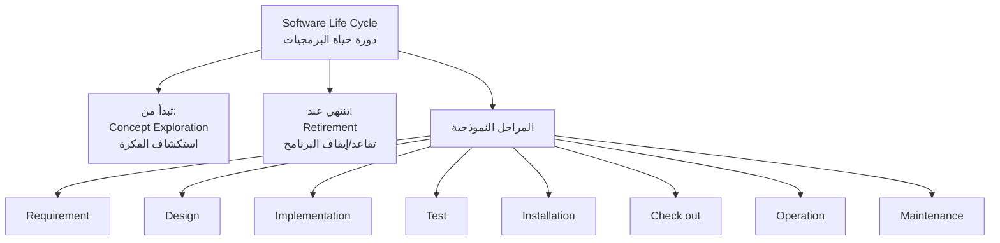
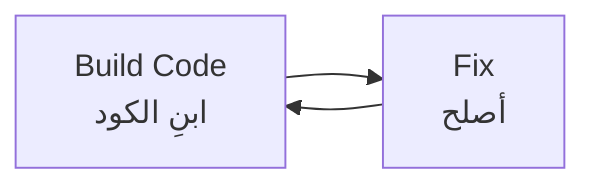
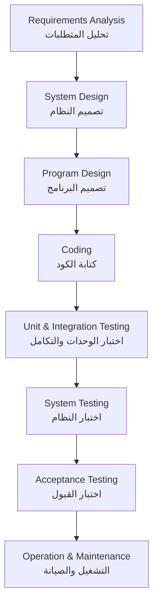
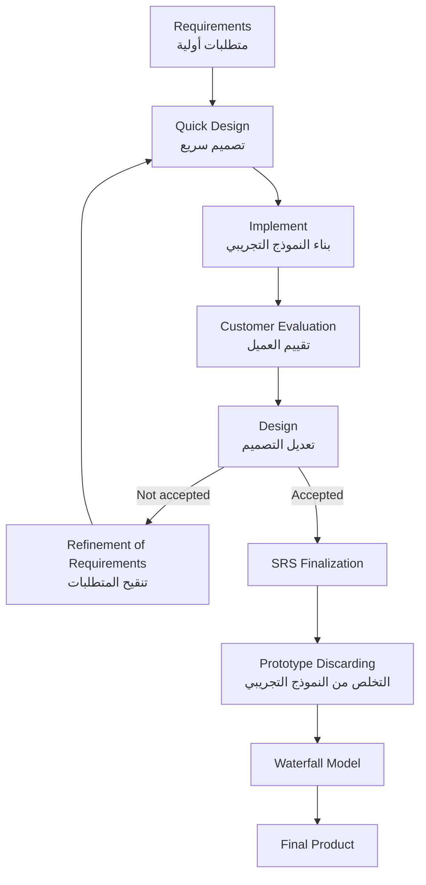
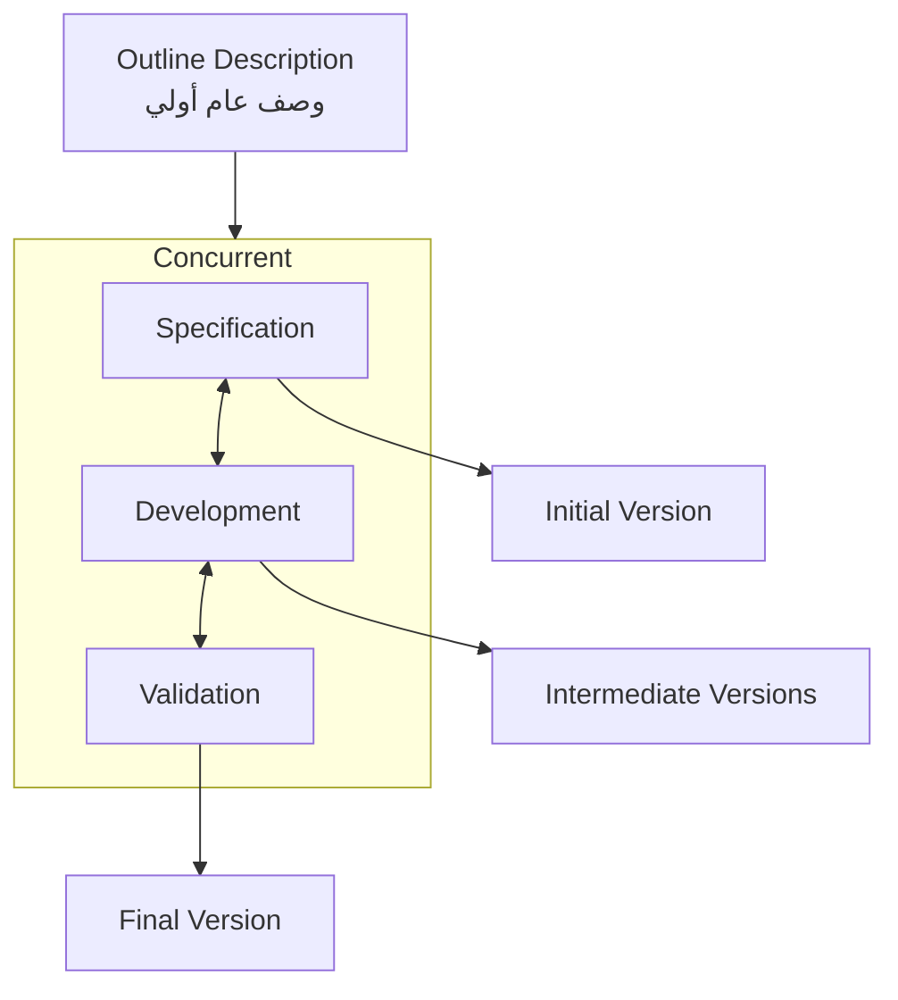
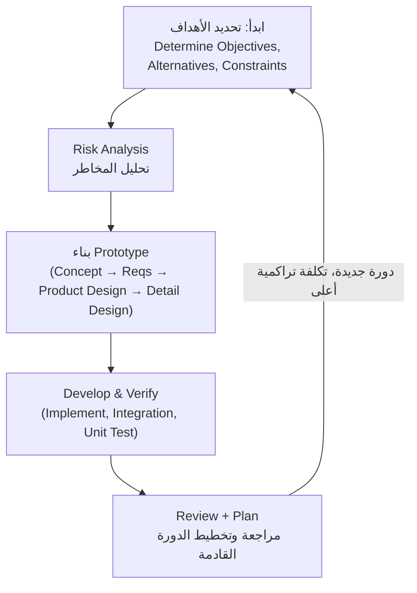
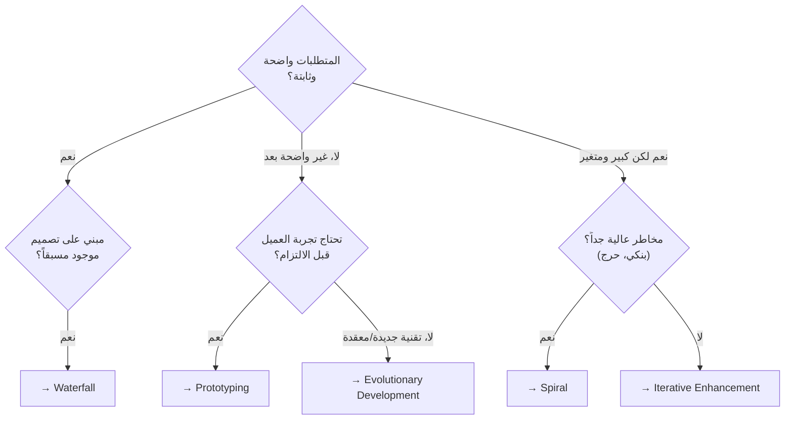

# المحاضرة 2 — Software Life Cycle Models (نماذج دورة حياة البرمجيات)
> **المادة:** هندسة البرمجيات (المستوى الثالث) | **الموضوع:** نماذج SDLC — Build and Fix, Waterfall, Prototyping, Iterative Enhancement, Evolutionary Development, Spiral, واختيار النموذج المناسب

---

## ملخص سريع قبل البدء

**عن ماذا هذه المحاضرة؟** المحاضرة تشرح `SDLC` (Software Development Life Cycle - دورة حياة تطوير البرمجيات) وأهم النماذج (Models) اللي تنظّم عملية بناء البرمجيات، من أبسطها (`Build and Fix`) إلى أكثرها نضجاً (`Spiral`).

**ليش يهمك؟** أي مشروع برمجي — صغير أو ضخم — يحتاج طريقة منظمة لبنائه. اختيار النموذج الغلط يعني ضياع وقت وفلوس، ومشروع يفشل حتى لو الكود ممتاز.

**المتطلبات السابقة:**
- Software Engineering 1 (مفاهيم أساسية)
- Programming 1
- فكرة عامة عن مراحل بناء أي نظام (متطلبات → تصميم → تنفيذ → اختبار)

**الخيط الناظم:**
```
Build and Fix (بدون تنظيم) → Waterfall (تنظيم صارم) → Prototyping (تجربة قبل الالتزام)
→ Iterative / Evolutionary (بناء تدريجي) → Spiral (تنظيم + إدارة مخاطر) → اختيار النموذج المناسب
```

---

## الجزء الأول: الشرح التفصيلي

### 1. Introduction — مقدمة عن SDLC
<!-- @type: fact -->
<!-- @render: {type: "diagram-first", visualization: "graph", coverage: "100%"} -->
<!-- @connectivity: {prerequisite: "none"} -->

#### 📍 أين نحن الآن؟
نبدأ بفهم ايش هو `SDLC` قبل ما ندخل في تفاصيل كل نموذج.

#### ⬅️ الربط مع السابق
هذا أول موضوع في المحاضرة — الأساس لكل ما بعده.

#### 💡 الفكرة الأساسية
**هدف هندسة البرمجيات هو توفير نماذج وعمليات (`models and processes`) تؤدي لإنتاج برمجيات موثّقة جيداً وقابلة للصيانة (`well-documented maintainable software`).**

---

#### 📊 المخطط: مكونات SDLC



**الشرح:** المخطط يوضح إن `SDLC` مش نقطة واحدة، بل مسار كامل يبدأ من فكرة المشروع وينتهي لما يُسحب البرنامج من الاستخدام (`retirement`)، وبينهم مجموعة مراحل (`phases`) قد تختلف تسميتها من كتاب لآخر لكن الفكرة واحدة.

---

#### 📖 الشرح

`SDLC` باختصار هو الإطار العام لأي عملية تطوير برمجيات. الفكرة إن العملية "الناضجة" (`mature process`) لازم تحدد **من البداية** كم وقت وجهد بيحتاج المشروع عشان يوصل لمنتج نهائي — يعني ما نبدأ نبرمج على العمى وننتظر شنو بيصير.

الحياة (`life cycle`) للبرنامج ما تنتهي بمجرد ما يخلص الكود؛ هي تبدأ من استكشاف الفكرة (هل المشروع أصلاً يستاهل؟) وتنتهي فقط لما البرنامج يتقاعد ويتوقف استخدامه بالكامل. بين هذين الطرفين توجد مراحل نمطية زي: تحديد المتطلبات، التصميم، التنفيذ (كتابة الكود)، الاختبار، التركيب (`installation`)، الفحص النهائي (`check out`)، التشغيل (`operation`)، والصيانة (`maintenance`) — وأحياناً مراحل إضافية حسب نوع المشروع.

كل نموذج SDLC هو ببساطة **طريقة مختلفة لترتيب وتنفيذ هذه المراحل**. بعض النماذج تنفذها بالترتيب مرة وحدة (Waterfall)، وبعضها يكررها عدة مرات (Iterative)، وبعضها يضيف تحليل مخاطر بينهم (Spiral).

#### 🎯 الملخص السريع
- `SDLC` = دورة حياة البرمجيات من الفكرة للتقاعد
- الهدف: منتج موثّق وقابل للصيانة
- المراحل النمطية: Requirement → Design → Implementation → Test → Installation → Check out → Operation → Maintenance
- كل "نموذج" هو طريقة مختلفة لتنظيم هذه المراحل

#### 📚 التطبيق
فهم `SDLC` كإطار عام يساعدك تفهم ليش يوجد أكثر من نموذج — كل نموذج حل مشكلة معينة واجهها المطورون في نماذج سابقة، وهذا بالضبط ترتيب المحاضرة اللي جاي.

#### 📄 النص الأصلي من المحاضرة
<details>
<summary>عرض النص الأصلي (coverage: 100%)</summary>

> "The goal of software engineering providing models and processes that lead to the production of well-documented maintainable software. A mature process should determine in advance how much time and effort will be required to produce the final product. Life cycle of the software starts from concept exploration and ends at the retirement of the software. SLC typically includes: requirement, design, implementation, test, installation, check out, operation, maintenance,… and some other phases"

**ملاحظة على التغطية:**
- ✓ تم شرح الهدف من SDLC والمراحل بالكامل
- ✓ تم شرح بداية ونهاية دورة الحياة

</details>

---

### 2. Build and Fix Model (نموذج البناء والإصلاح)
<!-- @type: fact -->
<!-- @render: {type: "diagram-first", visualization: "cycle", coverage: "100%"} -->
<!-- @connectivity: {prerequisite: "1"} -->

#### 📍 أين نحن الآن؟
نبدأ بأبسط وأقدم "نموذج" — وهو تقريباً غياب أي نموذج.

#### ⬅️ الربط مع السابق
بعد ما عرفنا إن SDLC يحتاج تخطيط مسبق، نشوف الآن شو بيصير لو **تجاهلنا** هذا التخطيط تماماً.

#### 💡 الفكرة الأساسية
**`Build and Fix Model` يعني تكتب الكود مباشرة بدون أي مواصفات (`specification`) أو تصميم (`design`)، وكل ما ظهرت مشكلة تصلحها.**

---

#### 📊 المخطط: دورة Build and Fix



**شرح العناصر:**
- **Build Code:** كتابة كود مباشرة بدون تخطيط مسبق
- **Fix:** التصحيح — قد يكون تصحيح خطأ (`error correction`) أو إضافة وظيفة جديدة (`addition of further functionality`)

**شرح الروابط:**
- السهمان في اتجاهين يوضحان إن هذه دورة **بلا نهاية محددة ولا مخرج واضح** — تبني، تكتشف مشكلة أو تحتاج ميزة، تعدّل، وتكرر بلا خطة.

**التطبيق في هذا السياق:** هذا هو بالضبط اللي بيصير لو مبرمج بدأ يكتب كود لمشروع متوسط أو كبير بدون أي توثيق مسبق — كل تعديل يصبح مقامرة.

---

#### 📖 الشرح

في `Build and Fix`، المبرمج يفتح المحرر ويبدأ يكتب كود على طول، بدون أي وثيقة متطلبات (`SRS`) ولا أي تصميم (`design`) يوضح كيف بيترابط النظام. أي مشكلة تظهر — سواء خطأ في المنطق أو طلب ميزة جديدة من العميل — يتم "تصليحها" (`Fixing`) مباشرة في الكود الموجود، بدون رجوع لخطة أو توثيق.

هذه الطريقة ممكن تنفع **فقط** لبرامج صغيرة جداً (سكربت شخصي، تجربة سريعة). لكن مع أي مشروع بحجم معقول، الكود بسرعة يتحول لشيء لا يمكن إصلاحه ولا تطويره (`unfixable and unenhanceable`) — لأنه ما فيه أي خريطة توضح وين كل جزء ولماذا كُتب هكذا.

#### 🎯 الملخص السريع
- بدون مواصفات، بدون تصميم
- الدورة: `Build Code ⇄ Fix`
- تصلح للبرامج الصغيرة جداً فقط
- مع الحجم الأكبر: الكود يصبح غير قابل للإصلاح أو التطوير
- التكلفة أعلى مقارنة بمنتج مُخطط له بشكل صحيح
- الصيانة صعبة جداً بدون وثائق تصميم

#### 📚 التطبيق
هذا النموذج هو "نقطة البداية السلبية" اللي كل النماذج الجاية بعده (Waterfall خصوصاً) جاءت لحل مشاكلها. فهمه يخليك تقدّر أهمية التخطيط قبل الكود.

#### ⚠️ أخطاء شائعة

#### الفهم الخاطئ ❌:
بعض الطلاب يعتقدون إن `Build and Fix` هو نفسه "البرمجة السريعة" أو `Agile`، لأن الاثنين "يكتبون كود بسرعة".

#### الفهم الصحيح ✅:
الفرق جوهري: `Agile` عنده تخطيط قصير المدى وتوثيق خفيف ومراجعات منظمة، بينما `Build and Fix` **بدون أي تخطيط أو توثيق على الإطلاق**. `Agile` نموذج ناضج مصمم بعناية، أما `Build and Fix` هو غياب أي نموذج.

#### 📄 النص الأصلي من المحاضرة
<details>
<summary>عرض النص الأصلي (coverage: 100%)</summary>

> "Without specification. No design. In this context 'Fixing' may be error correction or addition of further functionality. May work well for very small program. Totally unsatisfactory for software any reasonable size. Code soon becomes unfixable and unenhanceable. Costly, if compared to a properly specified product. Maintenance can extremely difficult without specification of design documents"

**ملاحظة على التغطية:**
- ✓ تم شرح التعريف والدورة (Build ⇄ Fix) بالكامل
- ✓ تم شرح جميع المشاكل والقيود المذكورة

</details>

---

### 3. Waterfall Model (النموذج الشلالي)
<!-- @type: fact -->
<!-- @render: {type: "diagram-first", visualization: "flowchart", coverage: "100%"} -->
<!-- @connectivity: {prerequisite: "2"} -->

#### 📍 أين نحن الآن؟
ننتقل من "غياب التنظيم" (`Build and Fix`) إلى أول نموذج منظم رسمياً في تاريخ هندسة البرمجيات.

#### ⬅️ الربط مع السابق
`Build and Fix` فشل لأنه بدون تخطيط ولا توثيق. `Waterfall` هو الحل المعاكس تماماً: كل شيء يُخطط ويُوثّق **قبل** ما يبدأ الكود.

#### 💡 الفكرة الأساسية
**`Waterfall Model` يقسّم المشروع إلى مراحل متتابعة وواضحة، بحيث تكتمل كل مرحلة بالكامل قبل الانتقال للمرحلة التالية — بدون رجوع أو تداخل.**

---

#### 📊 المخطط: مراحل Waterfall



**شرح العناصر:** كل مربع مرحلة مستقلة يجب إتمامها بالكامل — من تحليل المتطلبات وصولاً للتشغيل والصيانة.

**شرح الروابط:** الأسهم أحادية الاتجاه فقط — **لا يوجد رجوع للخلف**؛ بمجرد ما تخلص مرحلة، تنتقل للي بعدها وما ترجع تعدّل فيها (نظرياً).

**التطبيق في هذا السياق:** هذا الترتيب الصارم هو أساس تسمية "شلال" (`Waterfall`) — الماء ينزل بس اتجاه واحد، ما يرجع لفوق.

---

#### 📖 الشرح

للنموذج عدة نسخ (`variants`)، لكن عموماً فيه **5 مراحل أساسية**:

1. **Requirements Analysis & Specification** — فهم متطلبات العميل بدقة، وتوثيقها بالكامل مع العميل نفسه. النتيجة وثيقة تسمى `SRS` (Software Requirements Specification)، وتُعامل كـ"عقد" (`contract`) بين المطوّر والعميل. المتطلبات تصف "ماذا" (`What`) يفعل النظام، مو "كيف" (`How`).
2. **Design** — تحويل الـ`SRS` إلى بنية (`structure`) قابلة للتنفيذ، وتحديد معمارية البرنامج (`software architecture`) بمستوى عام ثم تفصيلي. النتيجة وثيقة تسمى `SDD` (Software Design Description).
3. **Implementation (Coding)** — تحويل `SDD` إلى كود فعلي.
4. **Testing** — على 3 مستويات: `Unit Testing` (وحدة واحدة)، `Integration Testing` (تكامل الوحدات)، `System Testing` (النظام كامل).
5. **Operation & Maintenance** — تبدأ فور إطلاق البرنامج، وتشمل تصحيح الأخطاء، إضافة تحسينات، حذف قدرات قديمة، وتحسين الأداء (`optimization`).

النموذج سهل الفهم ويفرض قاعدة "عرّف قبل ما تصمم" و"صمّم قبل ما تكتب كود" — وهذا شيء إيجابي جداً. لكن المشكلة إنه **يفترض إن المتطلبات معروفة بالكامل ودقيقة من البداية**، والعميل ما بيشوف أي نتيجة فعلية إلا في مرحلة متأخرة جداً — وقتها يكون "فات الأوان" لو تبين إن هناك سوء فهم. كمان النموذج ما فيه أي تقييم للمخاطر (`risk assessment`).

من ناحية عملية: صعب جداً تحدد **كل** المتطلبات من البداية، والنموذج ما يتناسب مع أي تغيير لاحق، ولا يتوسع جيداً (`scale up`) للمشاريع الكبيرة، لأن المشاريع الحقيقية نادراً ما تكون متسلسلة بحتة. أفضل استخدام له هو عند بناء نظام مبني على تصميم موجود مسبقاً، وهو شائع في المشاريع العسكرية والفضائية (`military and spatial projects`) حيث المتطلبات دقيقة جداً وثابتة.

#### 🎯 الملخص السريع
- 5 مراحل: Requirements → Design → Implementation → Testing → Operation & Maintenance
- الترتيب حتمي (`definitive`) وبدون تداخل
- `SRS` = عقد بين المطوّر والعميل، يصف "What" لا "How"
- `SDD` = وثيقة التصميم الناتجة عن مرحلة Design
- الميزة: بساطة + انضباط "خطط قبل التنفيذ"
- العيب: العميل يرى المنتج متأخراً جداً + لا يدعم التغيير + لا تقييم مخاطر

#### 📚 التطبيق
يُستخدم عندما تكون المتطلبات معروفة ومستقرة جداً (أنظمة عسكرية/فضائية، أو أنظمة مبنية على تصميم سابق). فهم عيوبه هو ما دفع لظهور `Prototyping` و`Iterative` و`Spiral` لاحقاً في نفس المحاضرة.

#### ⚠️ أخطاء شائعة

#### الفهم الخاطئ ❌:
كثير من الطلاب يظنون إن `Waterfall` "قديم وغير مستخدم إطلاقاً اليوم"، فيتجاهلونه بالكامل في المذاكرة.

#### الفهم الصحيح ✅:
`Waterfall` ما زال مناسب في سياقات محددة جداً: متطلبات ثابتة ودقيقة (أنظمة عسكرية، فضائية، أو مشاريع مبنية على تصميم قائم). المشكلة مش إنه "سيء دائماً"، بل إنه **غير مناسب** عندما تكون المتطلبات غير مؤكدة أو المشروع كبير ومتغيّر.

#### 📄 النص الأصلي من المحاضرة
<details>
<summary>عرض النص الأصلي (coverage: 100%)</summary>

> "Various variants of this model. Generally, 5 essential phases: Requirements Analysis & Specification, Design, Implementation, Unit/Integration/System Testing, Operation and Maintenance. Phases' order is definitive and do not overlap. Completion of each phase before starting the next... Requirements describe 'What' not 'How'. Resultant document is known SRS. SRS as contract between the developer and customer... Design Phase: Transforming SRS into a structure suitable for implementation, defining overall software architecture, high and detailed design. Resultant document is SDD... Easy model. Enforces 'define before design' & 'design before code'. Expects complete & accurate requirements early. When will the customer see the product? It is too late. Does not incorporate any kind of risk assessment... difficult to define all requirements at the beginning, not suitable for accommodating any change, not scale up to large projects, real projects are rarely sequential. Could be used if building a system based on existing designs. Used in military and spatial projects"

**ملاحظة على التغطية:**
- ✓ تم شرح جميع المراحل الخمس + SRS + SDD
- ✓ تم شرح كل المزايا والعيوب المذكورة
- ✓ تم شرح متى يُستخدم عملياً

</details>

---

### 4. Prototyping Model (نموذج النمذجة الأولية)
<!-- @type: fact -->
<!-- @render: {type: "diagram-first", visualization: "cycle", coverage: "100%"} -->
<!-- @connectivity: {prerequisite: "3"} -->

#### 📍 أين نحن الآن؟
نتعلم أول بديل رسمي طُرح لحل مشكلة "العميل ما يشوف النتيجة إلا متأخراً" في Waterfall.

#### ⬅️ الربط مع السابق
`Waterfall` يفترض متطلبات دقيقة من البداية. `Prototyping` جاء كبديل يتعامل مع الحالة اللي فيها المتطلبات **غير واضحة تماماً بعد**.

#### 💡 الفكرة الأساسية
**بدل ما تبني المنتج النهائي مباشرة، تبني نسخة تجريبية (`prototype`) سريعة، يجربها العميل، وبناءً على ملاحظاته تصل لمواصفات دقيقة قبل بناء المنتج الحقيقي.**

---

#### 📊 المخطط: دورة Prototyping



**شرح العناصر:**
- **Quick Design:** تصميم سريع وخفيف، مو تصميم نهائي
- **Customer Evaluation:** العميل يجرب النموذج الأولي فعلياً
- **Not accepted:** لو العميل ما وافق، ترجع تنقّح المتطلبات وتعيد الدورة

**شرح الروابط:** السهم الدائري بين "Customer Evaluation" و"Refinement" يوضح إن هذه عملية **تكرارية** حتى يوافق العميل، بعدها فقط ننتقل لمسار Waterfall التقليدي لبناء المنتج الحقيقي.

**التطبيق في هذا السياق:** هذا بالضبط يحل مشكلة Waterfall — العميل يشوف ويجرب شيء ملموس **قبل** الالتزام بالمواصفة النهائية.

---

#### 📖 الشرح

`Prototyping` يُبنى بناءً على المتطلبات المتاحة حالياً فقط (`current available requirements`)، وبالتالي هو نسخة **محدودة القدرات، منخفضة الموثوقية، وعادة منخفضة الأداء** — لأنه مش الهدف منه يكون منتج نهائي، بل أداة لاستكشاف المتطلبات الحقيقية.

المطورون يستخدمون تقييم العميل لهذا النموذج التجريبي عشان ينقّحوا المتطلبات ويكتبوا وثيقة المواصفات النهائية بدقة أكبر. المهم جداً هنا: **كود النموذج التجريبي يُرمى بالكامل** (`thrown away`) بعد ما تنتهي مرحلته — لأن بنيته الداخلية أصلاً لم تُصمم بعناية (`internal structure is not very important`). الفائدة الحقيقية هي **الخبرة** المكتسبة من بنائه، اللي تساعد في بناء النظام الفعلي بشكل أفضل عبر مسار Waterfall تقليدي بعد ذلك.

#### 🎯 الملخص السريع
- يُبنى على متطلبات أولية غير مكتملة
- الهدف: الوصول لمواصفة (`SRS`) دقيقة عبر تجربة العميل الفعلية
- النموذج التجريبي نفسه: منخفض الأداء والموثوقية، **يُرمى بالكامل**
- المسار: Requirements → Quick Design → Implement → Customer Evaluation → (تكرار حتى الموافقة) → SRS Finalization → Waterfall → Final Product

#### 📚 التطبيق
يُستخدم عندما تكون متطلبات العميل غامضة أو العميل نفسه غير متأكد شنو يبي بالضبط — مفيد جداً في واجهات المستخدم (`UI/UX`) اللي يصعب وصفها بالكلام فقط.

#### ⚠️ أخطاء شائعة

#### الفهم الخاطئ ❌:
كثير من الطلاب يعتقدون إن النموذج التجريبي (`prototype`) يُطوَّر ليصبح المنتج النهائي بعد تحسينه تدريجياً.

#### الفهم الصحيح ✅:
النموذج التجريبي **يُرمى بالكامل** ولا يُستخدم كأساس للمنتج النهائي، لأن بنيته الداخلية ضعيفة أصلاً. المنتج الحقيقي يُبنى من الصفر عبر Waterfall بعد أخذ الخبرة من التجربة.

#### 📄 النص الأصلي من المحاضرة
<details>
<summary>عرض النص الأصلي (coverage: 100%)</summary>

> "Proposed as an alternative to waterfall. A working prototype of software instead of the actual one. Developed as per current available requirements. Limited functional capabilities, low reliability, usually low performance. Developers refine the requirements and prepare the final specification document. Working prototype evaluated by the customer → resulting specification document will be correct... A usable program, but not suitable as final product, because of: low performance, poor maintainability, overall quality. Code of prototype is thrown away — internal structure is not very important. Experience gathered from developing prototype helps in actual system"

**ملاحظة على التغطية:**
- ✓ تم شرح الدورة الكاملة ومصير النموذج التجريبي
- ✓ تم شرح المسار النهائي: SRS finalization → Prototype discarding → Waterfall → Final product

</details>

---

### 5. Iterative Enhancement Model (نموذج التحسين التكراري)
<!-- @type: fact -->
<!-- @render: {type: "diagram-first", visualization: "flowchart", coverage: "100%"} -->
<!-- @connectivity: {prerequisite: "4"} -->

#### 📍 أين نحن الآن؟
ننتقل من "تجربة قبل الالتزام" (`Prototyping`) إلى فكرة **إصدار منتج حقيقي قابل للاستخدام من أول دورة**.

#### ⬅️ الربط مع السابق
في `Prototyping`، العميل يجرب نسخة تُرمى لاحقاً. في `Iterative Enhancement`، كل دورة تنتج **منتج حقيقي وقابل للاستخدام فعلياً**، وليس نموذجاً يُرمى.

#### 💡 الفكرة الأساسية
**يشبه Waterfall لكن يتكرر على عدة دورات (`releases`)، وفي نهاية كل دورة يُصدر منتج قابل للاستخدام فعلياً، مع إضافة وظائف جديدة في كل إصدار.**

---

#### 📊 المخطط: دورات Iterative Enhancement

```mermaid
graph LR
    subgraph Release1["Release 1"]
    R1["Requirements"] --> D1["Design"] --> I1["Implement & Unit Testing"] --> T1["Integration & System Testing"] --> O1["Operation"]
    end

    subgraph Release2["Release 2"]
    D2["Design"] --> I2["Implement & Unit Testing"] --> T2["Integration & System Testing"] --> O2["Operation"]
    end

    subgraph Release3["Release 3"]
    D3["Design"] --> I3["Implement & Unit Testing"] --> T3["Integration & System Testing"] --> O3["Operation"]
    end

    O1 --> D2
    O2 --> D3
```



**شرح العناصر:** كل `Release` (إصدار) يمر بنفس مراحل Waterfall تقريباً، لكن ابتداءً من `Release 2` لا نعيد "Requirements" الكاملة من الصفر — نكمل من "Design" مباشرة.

**شرح الروابط:** الأسهم بين الإصدارات توضح إن كل إصدار **يبني فوق سابقه**، وكل واحد ينتج منتجاً يعمل فعلياً وقابل للتشغيل قبل الانتقال للإصدار التالي.

**التطبيق في هذا السياق:** هذا يعطي العميل شيء يستخدمه بسرعة بدل انتظار المشروع كامل لسنة كاملة.

---

#### 📖 الشرح

`Iterative Enhancement` هو نفسه Waterfall من ناحية المراحل، لكن مع قيد أساسي: بدل دورة واحدة كبيرة، فيه **عدة دورات صغيرة (`several cycles`)**. كل دورة تمر بالمراحل العامة (تصميم، تنفيذ واختبار وحدة، تكامل واختبار نظام، تشغيل)، وفي **نهاية كل دورة يُطلق منتج قابل للاستخدام فعلياً (`usable product`)**، ومع كل إصدار جديد تُضاف وظائف إضافية (`additional functionality`).

الفرق الجوهري عن `Prototyping`: هنا **لا شيء يُرمى** — كل إصدار هو جزء حقيقي من المنتج النهائي المتراكم.

#### 🎯 الملخص السريع
- نفس فلسفة Waterfall لكن بعدة دورات (releases)
- كل دورة تنتج منتجاً حقيقياً قابل للاستخدام (لا يُرمى)
- كل إصدار جديد يضيف وظائف فوق الإصدار السابق
- العميل يرى نتائج فعلية بشكل متكرر ومبكر

#### 📚 التطبيق
مفيد جداً عندما نبي نعطي العميل قيمة مبكرة وسريعة، وهو حجر الأساس الذي بنت عليه نماذج لاحقة مثل `Agile` فكرة "الإصدارات المتكررة".

#### 📄 النص الأصلي من المحاضرة
<details>
<summary>عرض النص الأصلي (coverage: 100%)</summary>

> "Same as waterfall model. Has some restriction. Several cycle. Each cycle consists of the general phases. At the end of each cycle, a usable product is released. With each release, additional functionality"

**ملاحظة على التغطية:**
- ✓ تم شرح مفهوم الدورات المتكررة والإصدارات المتراكمة بالكامل

</details>

---

### 6. Evolutionary Development Model (نموذج التطوير التطوّري)
<!-- @type: fact -->
<!-- @render: {type: "diagram-first", visualization: "graph", coverage: "100%"} -->
<!-- @connectivity: {prerequisite: "5"} -->

#### 📍 أين نحن الآن؟
نشوف نموذجاً آخر شكله يشبه `Iterative Enhancement` لكن منطقه مختلف تماماً في تقسيم العمل.

#### ⬅️ الربط مع السابق
`Iterative Enhancement` يُصدر منتجاً كاملاً (بوظائف أقل) في كل دورة. `Evolutionary Development` يقسّم العمل **حسب الفئة (`category`)** لا حسب الأولوية، ولا يشترط منتجاً قابلاً للاستخدام في كل دورة.

#### 💡 الفكرة الأساسية
**يشبه Iterative Enhancement في الشكل الدوري، لكن كل دورة تنفّذ فئة كاملة من الوظائف (مثل GUI، ثم حفظ البيانات، ثم الاستعلامات)، ولا يكون المنتج قابلاً للاستخدام حتى تكتمل كل الدورات.**

---

#### 📊 المخطط: دورة Evolutionary Development



**شرح العناصر:**
- **Specification / Development / Validation:** ثلاث أنشطة تعمل **بالتزامن** (`concurrent`)، مو بالتتابع الصارم
- **Initial / Intermediate / Final Version:** نواتج متدرجة تنتج من هذه الأنشطة المتزامنة

**شرح الروابط:** الأسهم ذهاباً وإياباً بين Specification وDevelopment وValidation توضح إن كل نشاط **يغذي الآخر باستمرار** — عكس Waterfall اللي فيه اتجاه واحد فقط.

**التطبيق في هذا السياق:** مثال قاعدة بيانات بسيطة: دورة أولى تبني الـ`GUI` (واجهة التفاعل)، دورة ثانية تتعامل مع حفظ واسترجاع البيانات (`file manipulation`)، دورة ثالثة تبني الاستعلامات (`queries`) — وكل هذه الدورات **يجب أن تكتمل جميعها** قبل ما يكون عندنا منتج يعمل فعلياً.

---

#### 📖 الشرح

`Evolutionary Development` يشبه `Iterative Enhancement` في كونه دورياً (`cyclical fashion`)، لكن الفرق الأساسي إنه **لا يشترط منتجاً قابلاً للاستخدام في كل دورة**. بدل تقسيم العمل حسب الأولوية (أهم وظيفة أولاً)، يُقسَّم حسب **الفئة** (`category`) — مثلاً في تطبيق قاعدة بيانات بسيط: دورة لواجهة المستخدم، دورة لحفظ واسترجاع البيانات، دورة للاستعلامات... وهكذا. **كل الدورات لازم تكتمل** قبل أن يتوفر منتج عملي جاهز للاستخدام.

يُنصح باستخدامه عندما **لا تكون هناك حاجة ملحّة** لتقديم نسخة أولية سريعة من النظام. وهو مفيد جداً للمشاريع اللي تستخدم تقنية جديدة غير مفهومة جيداً بعد (`not well understood`)، وللمشاريع المعقّدة اللي يجب تسليم كل وظائفها دفعة واحدة، لكن متطلباتها غير مستقرة أو غير واضحة تماماً في البداية.

#### 🎯 الملخص السريع
- شبيه بـ Iterative لكن التقسيم حسب فئة الوظيفة لا الأولوية
- ثلاث أنشطة متزامنة: Specification, Development, Validation
- لا يُشترط منتج قابل للاستخدام في كل دورة
- كل الدورات يجب أن تكتمل قبل توفر منتج عملي
- مناسب للتقنيات الجديدة غير المفهومة جيداً، والمشاريع المعقدة بمتطلبات غير مستقرة

#### 📚 التطبيق
استخدمه عندما التقنية جديدة عليك أو على الفريق، أو عندما المشروع لازم يُسلَّم كاملاً دفعة واحدة رغم عدم وضوح كل التفاصيل من البداية.

#### ⚠️ أخطاء شائعة

#### الفهم الخاطئ ❌:
كثير من الطلاب يخلطون بين `Iterative Enhancement` و`Evolutionary Development` ويعتبرونهما نفس الشيء لأن الشكل الدوري متشابه.

#### الفهم الصحيح ✅:
الفرق الجوهري في **متى يصبح المنتج قابلاً للاستخدام**: في `Iterative Enhancement` كل دورة تنتج منتجاً حقيقياً يعمل. في `Evolutionary Development`، لازم **كل** الدورات تكتمل أولاً — لأن التقسيم حسب فئة الوظيفة (كل دورة تبني جزءاً غير مكتمل الفائدة لوحده) وليس حسب أولوية وظيفية متكاملة.

#### 📄 النص الأصلي من المحاضرة
<details>
<summary>عرض النص الأصلي (coverage: 100%)</summary>

> "Resemble iterative enhancement model (cyclical fashion). Does not require a useable product at each cycle. Requirements are implemented by category rather than by priority. E.g., simple DB application — One cycle implements GUI, 2nd cycle file manipulation, 3rd cycle queries. All cycles must be complete before there is a working product available... Should be used when it is not necessary to provide a minimal version of the system quickly. Useful for projects using new technology (not well understood). Used for complex projects where all functionality must be delivered at one time, but requirements are unstable or not well understood at the beginning"

**ملاحظة على التغطية:**
- ✓ تم شرح الفرق عن Iterative Enhancement بالكامل
- ✓ تم شرح مثال قاعدة البيانات ومتى يُستخدم النموذج

</details>

---

### 7. Spiral Model (النموذج الحلزوني)
<!-- @type: principle -->
<!-- @render: {type: "diagram-first", visualization: "spiral", coverage: "95%"} -->
<!-- @connectivity: {prerequisite: "6"} -->

#### 📍 أين نحن الآن؟
نصل لأكثر نموذج نضجاً في هذه المحاضرة — النموذج الذي يضيف **إدارة المخاطر** رسمياً لأول مرة.

#### ⬅️ الربط مع السابق
كل النماذج السابقة (Waterfall, Prototyping, Iterative, Evolutionary) لم تتعامل رسمياً مع فكرة "المخاطر" (`risk`). `Spiral Model` جاء تحديداً لسد هذه الفجوة.

#### 💡 الفكرة الأساسية
**`Spiral Model` يدمج عناصر Prototyping وWaterfall، ويضيف تحليل مخاطر (`Risk Analysis`) صريح في بداية كل دورة، بحيث يتوقع المشاكل غير المتوقعة قبل ما تحصل.**

---

#### 📊 المخطط: دورات Spiral Model



**شرح العناصر:**
- **البعد الشعاعي (Radial):** يمثل التكلفة التراكمية (`cumulative costs`) — كل ما ابتعدنا عن المركز، زادت التكلفة المتراكمة
- **البعد الزاوي (Angular):** يمثل التقدم المُحرز في إتمام كل دورة

**شرح الروابط:** كل "لفة" (`loop`) حول الحلزون تمثل مرحلة واحدة تتكون من 4 خطوات ثابتة تتكرر: **Planning** (تحديد الأهداف والبدائل والقيود) → **Risk Analysis** (تحليل البدائل، تحديد المخاطر وحلها) → **Development** (تطوير المنتج واختباره) → **Assessment** (تقييم العميل).

**التطبيق في هذا السياق:** كلما تقدمنا في الحلزون، يقل عدم اليقين ويزيد نضج المنتج والثقة فيه.

---

#### 📖 الشرح

النماذج السابقة كانت تتجاهل مخاطر المشروع (`project risks were neglected`)، فما كان أحد مستعداً عندما يحصل شيء غير متوقع. `Spiral Model` جاء نتيجة إدماج عامل "مخاطرة المشروع" رسمياً داخل `SDLC`.

كل لفة تمثل مرحلة كاملة تتكون من 4 أنشطة: **Planning** (الأهداف، البدائل، القيود)، **Risk Analysis** (تحليل البدائل وتحديد وحل المخاطر)، **Development** (تطوير المنتج واختباره)، و**Assessment** (تقييم العميل للنتيجة). في **اللفة الأولى**: يتم التخطيط، تحليل المخاطر، بناء نموذج تجريبي (`prototype`)، وتقييمه من العميل. في **اللفة الثانية**: يُبنى نموذج تجريبي أكثر دقة، وتُوثَّق وتُتحقق المتطلبات، ويشارك العملاء في تقييم النموذج الجديد. في **اللفة الثالثة**: المخاطر أصبحت معروفة، ويُتّبع تطوير تقليدي أكثر.

الصعوبة الأساسية في هذا النموذج: **لا يوجد إرشاد صريح للعملية (`explicit process guidance`)** في تحديد الأهداف والقيود والبدائل — الأمر يعتمد بشكل كبير على خبرة تحليل المخاطر، وهذا يمنحه مرونة أكثر مما تحتاجه كثير من التطبيقات فعلياً.

#### 🎯 الملخص السريع
- يدمج Prototyping + إدارة مخاطر صريحة
- البعد الشعاعي = التكلفة التراكمية، البعد الزاوي = التقدم
- كل لفة = Planning → Risk Analysis → Development → Assessment
- الصعوبة: يعتمد بشكل كبير على خبرة محلل المخاطر، وقد يمنح مرونة أكثر من اللازم

#### 📚 التطبيق
الأنسب للمشاريع الكبيرة وعالية المخاطر (أنظمة بنكية، أنظمة حرجة)، حيث تكلفة الخطأ عالية جداً ولازم اكتشاف المخاطر مبكراً قبل الاستثمار الكامل.

#### ⚠️ أخطاء شائعة

#### الفهم الخاطئ ❌:
البعض يظن إن `Spiral Model` هو فقط "Waterfall مكرر عدة مرات على شكل دائرة".

#### الفهم الصحيح ✅:
الفرق الجوهري هو إضافة خطوة **Risk Analysis** الصريحة في كل دورة — وهذا غير موجود في Iterative أو Evolutionary. `Spiral` مصمم خصيصاً للمشاريع عالية المخاطر حيث اكتشاف مشكلة مبكراً يوفر تكاليف ضخمة لاحقاً.

#### 📄 النص الأصلي من المحاضرة
<details>
<summary>عرض النص الأصلي (coverage: 95%)</summary>

> "Project risks were neglected — nobody were prepared when something unforeseen happened. As a result incorporate 'project risk' factor into SDLC. Radial dimension represents the cumulative costs — each path around the spiral is indicative of increased costs. Angular dimension represents progress made in completing each cycle. Each loop represents one phase: Planning, Risk Analysis, Development, Assessment. During the 1st phase, planning is performed, risks are analyzed, prototypes are built, and customers evaluate the prototype. During the 2nd phase, a more refined prototype is built, requirements are documented and validated and customers are involved in assessing the new prototype. During the 3rd phase, risks are known and somewhat more traditional development is taken. Difficulty: Lack of explicit process guidance in determining objectives, constraints, alternatives; relying on risk assessment expertise; and provides more flexibility than required for many applications"

**ملاحظة على التغطية:**
- ✓ شرح كامل للفلسفة، الأبعاد، اللفات الثلاث، والصعوبة
- ⚠️ لم تُشرح تفاصيل إضافية عن "Proto/Reqs/Product Design/Detail Design/Operating Prototype" الظاهرة داخل الرسم البياني الأصلي بشكل منفصل — هذه أسماء مراحل فرعية داخل كل لفة (concept → requirements → design → detail design → prototype تشغيلي) وتم تلخيصها ضمن Development في المخطط أعلاه

</details>

---

### 8. اختيار نموذج دورة الحياة المناسب (Selection of a LCM)
<!-- @type: principle -->
<!-- @render: {type: "diagram-first", visualization: "decision", coverage: "85%"} -->
<!-- @connectivity: {prerequisite: "3,4,5,6,7"} -->

#### 📍 أين نحن الآن؟
بعد ما تعلمنا كل نموذج على حدة، السؤال الطبيعي الآن: **أيهم أختار لمشروعي؟**

#### ⬅️ الربط مع السابق
هذا القسم يربط كل ما سبق (Waterfall, Prototyping, Iterative, Evolutionary, Spiral) في إطار واحد لاتخاذ القرار.

#### 💡 الفكرة الأساسية
**لا يوجد نموذج "الأفضل" مطلقاً — الاختيار يعتمد على وضوح المتطلبات، حجم المشروع، ومستوى المخاطرة.**

---

#### 📊 المخطط: إطار اختيار النموذج



**شرح العناصر:** كل معين (`{...}`) سؤال قرار، وكل مستطيل نموذج مقترح.

**شرح الروابط:** المسار يبدأ بسؤال وضوح المتطلبات، ثم يتفرّع حسب الحاجة لتجربة العميل، مستوى المخاطرة، وحجم/تعقيد المشروع.

**التطبيق في هذا السياق:** هذا الإطار مبني مباشرة على الشروط اللي ذُكرت لكل نموذج في المحاضرة (مثلاً: Waterfall للمشاريع العسكرية/الفضائية بمتطلبات ثابتة، Spiral للمشاريع عالية المخاطر).

---

#### 📖 الشرح

بجمع كل ما تعلمناه: `Waterfall` مناسب فقط لو المتطلبات دقيقة وثابتة من البداية (مثل مشاريع مبنية على تصميم موجود، أو مشاريع عسكرية/فضائية). `Prototyping` مناسب لو المتطلبات غير واضحة والعميل نفسه غير متأكد شنو يبي — فنحتاج نموذجاً تجريبياً يوضح له الصورة. `Iterative Enhancement` مناسب لو نبي نسلّم قيمة حقيقية للعميل بسرعة وبشكل متكرر. `Evolutionary Development` مناسب للمشاريع المعقدة بتقنية جديدة غير مفهومة جيداً، حيث لا داعي لتسليم نسخة أولية سريعة. أما `Spiral` فمناسب للمشاريع الكبيرة وعالية المخاطر، حيث تحليل المخاطر الصريح يوفر تكاليف ضخمة محتملة لاحقاً.

> ⚠️ ملاحظة هامة: محتوى شريحة "Selection of a LCM" في نسخة هذه المحاضرة (PDF) لم يتضمن تفاصيل إضافية بعد عنوانها — الإطار أعلاه مبني مباشرة على الشروط الصريحة المذكورة داخل شرح كل نموذج على حدة في نفس المحاضرة (coverage تقديري 85% لعدم توفر شرائح إضافية مخصصة لهذا العنوان في الملف المرفوع).

#### 🎯 الملخص السريع
- Waterfall → متطلبات ثابتة ودقيقة (عسكري/فضائي، أو مبني على تصميم قائم)
- Prototyping → متطلبات غامضة، نحتاج تجربة العميل أولاً
- Iterative Enhancement → نبي تسليم قيمة سريعة ومتكررة
- Evolutionary Development → تقنية جديدة/مشروع معقد، لا داعي لنسخة سريعة
- Spiral → مشروع كبير وعالي المخاطر

#### 📚 التطبيق
في الامتحان، أي سؤال "أي نموذج تختار لهذا السيناريو؟" ارجع لهذه المعايير الأربعة: وضوح المتطلبات، الحاجة لتجربة مبكرة، السرعة في التسليم، ومستوى المخاطرة.

#### 🤔 تفعيل الفهم
لو كنت تطوّر نظام لحجز تذاكر طيران لشركة ضخمة، والمتطلبات معقّدة جداً من ناحية الأمان والدفع الإلكتروني، وأي خطأ ممكن يكلّف الشركة خسائر مالية كبيرة — أي نموذج تختار؟ ليش؟

**تلميح:** فكّر في مستوى المخاطرة قبل حجم المشروع.

#### 📄 النص الأصلي من المحاضرة
<details>
<summary>عرض النص الأصلي (coverage: 85%)</summary>

> عنوان الشريحة في جدول المحتويات: "Selection of a LCM" — لم تتوفر شرائح تفصيلية إضافية لهذا العنوان في الملف المرفوع بخلاف عناوين الشرائح، والمحتوى أعلاه مُشتق من معايير الاستخدام (When to use) المذكورة صراحة تحت كل نموذج (Waterfall, Prototyping, Iterative, Evolutionary, Spiral).

**ملاحظة على التغطية:**
- ⚠️ لم يتم شرح كامل: أي معايير إضافية مخصصة قد تكون وردت في شريحة "Selection of a LCM" الأصلية ولم تظهر في النص المستخرج من الملف
- ℹ️ إضافة من الدليل: إطار القرار (decision framework) والمخطط، مبنيان على الشروط الصريحة المذكورة تحت كل نموذج في نفس المحاضرة

</details>

---

### 📌 ملاحظة: Homework — RAD Model

#### ملاحظة:
المحاضرة تنتهي بواجب منزلي (`Homework`) عن نموذج `RAD` (Rapid Application Development)، وتحديداً 3 أسئلة مطلوب من الطالب البحث عنها بنفسه:
1. مقترح من شركة IBM عام 1980
2. كم عدد مراحله؟
3. وصف كل مرحلة؟
4. متى يمكن/لا يمكن استخدامه؟

هذا محتوى **لم يُشرح** داخل هذه المحاضرة نفسها (تم تكليفه كواجب بحث ذاتي)، لذلك لا يظهر شرح تفصيلي له في هذا الدليل — راجع مصادر خارجية أو ملاحظات المحاضر للإجابة عن أسئلة الواجب.

---

## الجزء الثاني: ملخص شامل (Alternative Complete Reading)

هذه المحاضرة بالكامل تدور حول سؤال واحد بسيط: كيف تنظّم عملية بناء برنامج بحيث ما ينتهي بك الأمر لكود فوضوي لا أحد يقدر يصلحه؟ الإجابة تطورت عبر الزمن من خلال سلسلة من النماذج، كل واحد منها جاء ليحل مشكلة واجهها النموذج اللي قبله، وفهم هذا التسلسل التاريخي هو المفتاح الحقيقي للامتحان — لأن أي سؤال عن "ليش نستخدم X بدل Y" يرجع في النهاية لهذا التسلسل.

نبدأ بـ`SDLC` نفسه — دورة حياة البرمجيات — وهي ببساطة كل رحلة البرنامج من لحظة استكشاف الفكرة (`concept exploration`) إلى لحظة تقاعده وإيقاف استخدامه (`retirement`). أي مشروع ناضج يفترض إنه يحدد من البداية كم وقت وجهد بيحتاج، وهذا بالضبط الشيء اللي غاب تماماً في أبسط وأسوأ "نموذج" ممكن: `Build and Fix`. في هذا النموذج، المبرمج يفتح المحرر ويكتب كود مباشرة بدون أي مواصفات ولا أي تصميم مسبق، وأي مشكلة تظهر — سواء كانت خطأ فعلياً أو حاجة لميزة جديدة — تُعالَج فوراً في الكود نفسه بدون رجوع لأي خطة. هذه الطريقة ممكن تنجح مع برنامج صغير جداً (سكربت شخصي بسيط)، لكن مع أي مشروع بحجم معقول تصبح كارثة: الكود يتحول بسرعة لشيء غير قابل للإصلاح ولا التطوير، وتصبح تكلفته أعلى بكثير من منتج مُخطط له بشكل صحيح، والصيانة تصبح شبه مستحيلة بدون أي وثيقة تصميم توضح لماذا كُتب كل جزء بهذه الطريقة.

الحل المعاكس تماماً لهذه الفوضى هو `Waterfall Model` — أقدم وأشهر نموذج منظم رسمياً. الفكرة هنا إن المشروع ينقسم إلى خمس مراحل متتابعة صارمة، ولازم تكتمل كل مرحلة بالكامل قبل ما تبدأ اللي بعدها، وبدون أي رجوع للخلف نظرياً — تماماً مثل الماء اللي ينزل من الشلال، ما يرجع لفوق. المرحلة الأولى هي `Requirements Analysis & Specification`، وفيها نفهم متطلبات العميل ونوثقها بدقة معه شخصياً، والمتطلبات هنا تصف "ماذا" (`What`) يجب أن يفعله النظام وليس "كيف" (`How`) سيتم تنفيذه، والنتيجة النهائية وثيقة رسمية تُسمى `SRS` (Software Requirements Specification) وتُعامل عملياً كعقد بين المطوّر والعميل. بعدها تأتي مرحلة `Design`، وفيها نحوّل الـ`SRS` إلى بنية قابلة للتنفيذ ونحدد المعمارية العامة والتفصيلية للبرنامج، والنتيجة وثيقة تُسمى `SDD` (Software Design Description). بعد اكتمال التصميم، تأتي مرحلة `Implementation` (كتابة الكود الفعلي بناءً على الـ`SDD`)، ثم مرحلة `Testing` بثلاث مستويات: اختبار الوحدة الواحدة (`Unit Testing`)، ثم اختبار تكامل الوحدات مع بعضها (`Integration Testing`)، ثم اختبار النظام كاملاً (`System Testing`). أخيراً تأتي مرحلة `Operation & Maintenance` التي تبدأ فور إطلاق البرنامج فعلياً، وتشمل تصحيح الأخطاء، إضافة تحسينات، حذف قدرات أصبحت غير مستخدمة (`obsolete`)، وتحسين الأداء.

الميزة الحقيقية لـ`Waterfall` هي البساطة والانضباط: النموذج يفرض قاعدة "عرّف قبل أن تصمم" و"صمّم قبل أن تكتب الكود"، وهذا شيء إيجابي جداً في حد ذاته. لكن المشكلة الجوهرية هي إنه **يفترض أن جميع المتطلبات معروفة بدقة تامة من البداية**، وهذا نادراً ما يحصل في الواقع. والأخطر من ذلك: العميل لا يرى أي نتيجة فعلية إلا في مرحلة متأخرة جداً من المشروع، وبحلول ذلك الوقت قد يكون الوقت قد فات لتصحيح أي سوء فهم في المتطلبات. كذلك النموذج لا يتضمن أي تقييم رسمي للمخاطر (`risk assessment`) على الإطلاق، ولا يتناسب مع أي تغيير لاحق في المتطلبات، ولا يتوسع جيداً للمشاريع الكبيرة، لأن المشاريع الحقيقية نادراً ما تكون متسلسلة بحتة كما يفترض النموذج. لذلك أفضل استخدام له هو في المشاريع اللي تكون متطلباتها ثابتة جداً ومعروفة سلفاً — كأن يكون المشروع مبنياً على تصميم موجود مسبقاً، أو في مجالات مثل المشاريع العسكرية والفضائية حيث كل تفصيلة محددة بدقة متناهية.

بما أن أكبر عيوب Waterfall هو "العميل يرى النتيجة متأخراً جداً"، جاء `Prototyping Model` كأول حل مباشر لهذه المشكلة. الفكرة هنا: بدل بناء المنتج النهائي مباشرة، نبني نسخة تجريبية سريعة (`prototype`) بناءً على المتطلبات المتاحة حالياً فقط، وهذه النسخة تكون عمداً محدودة القدرات ومنخفضة الأداء والموثوقية — لأنها ليست الهدف النهائي، بل أداة استكشاف. العميل يجرّب هذا النموذج التجريبي فعلياً، وبناءً على ملاحظاته (`evaluation`) يقوم المطورون بتنقيح المتطلبات (`refinement`) وإعادة الدورة إذا لزم الأمر، حتى تصل الأمور لمواصفة نهائية (`SRS`) دقيقة يوافق عليها العميل. الجزء الأهم في هذا النموذج، والذي كثير من الطلاب يخطئون فيه: **كود النموذج التجريبي بأكمله يُرمى** (`thrown away`) بعد ما تنتهي مهمته، لأن بنيته الداخلية أصلاً لم تُصمم بعناية أو جودة كافية — الفائدة الحقيقية هي الخبرة والمعرفة المكتسبة أثناء بنائه، والتي تُستخدم بعد ذلك لبناء النظام الفعلي من الصفر، عادة عبر مسار Waterfall تقليدي.

بعد `Prototyping`، تطرح المحاضرة نموذجين متشابهين في الشكل الدائري لكن مختلفين تماماً في المنطق: `Iterative Enhancement` و`Evolutionary Development`. النموذج الأول، `Iterative Enhancement`، يشبه Waterfall تماماً من ناحية المراحل، لكن بدل دورة واحدة كبيرة، فيه عدة دورات صغيرة متتالية (`several cycles`)، وفي نهاية **كل** دورة يُطلق منتج حقيقي وقابل للاستخدام فعلياً — وليس نموذجاً يُرمى كما في Prototyping — ومع كل إصدار جديد تُضاف وظائف إضافية فوق الإصدارات السابقة. هذا يعطي العميل قيمة حقيقية بسرعة وبشكل متكرر بدل انتظار المشروع كله لسنة كاملة. أما النموذج الثاني، `Evolutionary Development`، فيشبه الأول في كونه دورياً، لكن الفرق الجوهري إنه **لا يشترط أن يكون هناك منتج قابل للاستخدام في كل دورة** — بدل تقسيم العمل حسب الأولوية الوظيفية، يُقسَّم حسب **فئة** الوظيفة (`category`)، فمثلاً في تطبيق قاعدة بيانات بسيط: دورة أولى تبني واجهة المستخدم (`GUI`) فقط، دورة ثانية تبني حفظ واسترجاع البيانات، ودورة ثالثة تبني الاستعلامات — وكل هذه الدورات مجتمعة يجب أن تكتمل قبل أن يتوفر منتج عملي واحد جاهز للاستخدام الفعلي. هذا النموذج يُفضَّل عندما لا تكون هناك حاجة ملحّة لتقديم نسخة أولية سريعة، ويكون مفيداً جداً للمشاريع اللي تستخدم تقنية جديدة غير مفهومة جيداً بعد، أو المشاريع المعقدة اللي يجب تسليم كل وظائفها دفعة واحدة رغم أن متطلباتها غير مستقرة تماماً في البداية.

آخر وأنضج نموذج في المحاضرة هو `Spiral Model`، والذي جاء لسد فجوة مهمة جداً: كل النماذج السابقة كانت تتجاهل مخاطر المشروع تماماً، وكانت النتيجة إن لا أحد يكون مستعداً عندما يحصل شيء غير متوقع في منتصف المشروع. `Spiral` أدمج عامل "مخاطرة المشروع" رسمياً داخل عملية SDLC نفسها. المخطط البصري لهذا النموذج يُرسم على شكل حلزون، حيث البعد الشعاعي (المسافة من المركز) يمثل التكلفة التراكمية للمشروع — كل ما ابتعدنا عن المركز زادت التكلفة — والبعد الزاوي يمثل مقدار التقدم المُحرز في إتمام كل دورة. كل "لفة" حول الحلزون تمثل مرحلة واحدة كاملة تتكون من أربعة أنشطة ثابتة: `Planning` (تحديد الأهداف والبدائل والقيود)، ثم `Risk Analysis` (تحليل البدائل وتحديد المخاطر وحلها)، ثم `Development` (تطوير المنتج الفعلي واختباره)، وأخيراً `Assessment` (تقييم العميل للنتيجة). في اللفة الأولى، يتم التخطيط، تحليل المخاطر، بناء نموذج تجريبي أولي، وتقييمه من العميل. في اللفة الثانية، يُبنى نموذج تجريبي أكثر دقة، وتُوثَّق وتُتحقق المتطلبات بشكل رسمي، ويشارك العملاء بفعالية في تقييم النموذج الجديد. في اللفة الثالثة، تصبح المخاطر معروفة بشكل جيد، ويُتّبع أسلوب تطوير تقليدي أكثر. الصعوبة الحقيقية في هذا النموذج هي عدم وجود إرشاد صريح واضح للعملية عند تحديد الأهداف والقيود والبدائل — الأمر يعتمد بشكل كبير جداً على خبرة الشخص الذي يقوم بتحليل المخاطر، وهذا يمنح النموذج مرونة أكثر مما تحتاجه فعلياً كثير من التطبيقات العملية البسيطة.

بجمع كل هذه النماذج مع بعضها، تظهر قاعدة اختيار عملية واضحة: `Waterfall` يُستخدم فقط عندما تكون المتطلبات ثابتة ودقيقة جداً من البداية، مثل مشاريع مبنية على تصميم موجود مسبقاً أو مشاريع عسكرية وفضائية. `Prototyping` يُستخدم عندما تكون المتطلبات غامضة والعميل نفسه غير متأكد بالضبط شنو يريد. `Iterative Enhancement` يُستخدم عندما نريد تسليم قيمة حقيقية للعميل بسرعة وبشكل متكرر عبر إصدارات متتالية قابلة للاستخدام. `Evolutionary Development` يُستخدم للمشاريع المعقدة بتقنية جديدة غير مفهومة جيداً، حيث لا داعي لتسليم نسخة سريعة أولية. وأخيراً `Spiral` يُستخدم للمشاريع الكبيرة وعالية المخاطر، حيث تحليل المخاطر الصريح المبكر يوفر تكاليف ضخمة محتملة لاحقاً في حياة المشروع.

من أشهر الأخطاء اللي يقع فيها الطلاب في الامتحان: الخلط بين `Iterative Enhancement` و`Evolutionary Development` لأن الشكل الدوري متشابه — تذكّر إن الفرق الحقيقي هو "متى يصبح المنتج قابلاً للاستخدام فعلياً": في Iterative كل دورة تنتج منتجاً يعمل، بينما في Evolutionary لازم كل الدورات تكتمل أولاً. خطأ شائع آخر هو الاعتقاد بأن `Prototyping` يُطوَّر تدريجياً ليصبح المنتج النهائي — والصحيح إن النموذج التجريبي بأكمله يُرمى ولا يُستخدم كأساس أبداً. وأخيراً، خطأ شائع ثالث هو الاعتقاد بأن `Waterfall` لا يُستخدم إطلاقاً اليوم — والصحيح إنه ما زال الخيار الأنسب في سياقات محددة جداً بمتطلبات ثابتة تماماً.

آخر نقطة تستحق الانتباه هي أن المحاضرة تنتهي بواجب منزلي عن نموذج `RAD` (Rapid Application Development)، المقترح من شركة IBM عام 1980، وتطلب من الطالب البحث بنفسه عن عدد مراحله ووصف كل مرحلة ومتى يمكن أو لا يمكن استخدامه — وهذا محتوى لم يُشرح داخل هذه المحاضرة نفسها، لذا يجب البحث عنه بشكل منفصل قبل الامتحان.

---

## الجزء الثالث: أسئلة اختيار من متعدد (MCQ)

### السؤال 1 (Easy)

**السؤال:** In the `Build and Fix Model`, what is missing from the development process?

أ) Specification and design
ب) Testing tools and compilers
ج) A programming language
د) A customer to evaluate the product

**الإجابة الصحيحة:** أ

**التعليل الكامل:**
- ✅ أ): صحيح — المحاضرة تنص صراحة إن هذا النموذج بدون مواصفات (`specification`) وبدون تصميم (`design`) على الإطلاق
- ❌ ب): خطأ — النموذج لا يتحدث عن أدوات الاختبار أو المترجمات كعنصر مفقود، بل عن غياب التخطيط
- ❌ ج): خطأ — لغة البرمجة موجودة وتُستخدم فعلياً في كتابة الكود
- ❌ د): خطأ — تقييم العميل ليس جزءاً من هذا النموذج أصلاً، فلا يمكن اعتباره "مفقوداً" من عملية لم تتضمنه

---

### السؤال 2 (Medium)

**السؤال:** Which document is described as a "contract between the developer and customer" in the Waterfall Model?

أ) Software Design Description (SDD)
ب) Software Requirements Specification (SRS)
ج) Project Risk Assessment Report
د) Final Acceptance Testing Report

**الإجابة الصحيحة:** ب

**التعليل الكامل:**
- ❌ أ): خطأ — `SDD` هي وثيقة التصميم الناتجة عن مرحلة Design، وليست عقداً مع العميل
- ✅ ب): صحيح — المحاضرة تذكر صراحة إن `SRS` يُعامل كعقد بين المطوّر والعميل
- ❌ ج): خطأ — تقييم المخاطر أصلاً غير موجود في Waterfall
- ❌ د): خطأ — تقرير القبول جزء من مرحلة الاختبار، وليس وثيقة العقد الأساسية

---

### السؤال 3 (Medium)

**السؤال:** What is the main disadvantage of the Waterfall Model regarding customer involvement?

أ) The customer must approve every single line of code
ب) The customer only sees the working product very late in the project
ج) The customer cannot be involved at all in any phase
د) The customer must write the SRS document alone

**الإجابة الصحيحة:** ب

**التعليل الكامل:**
- ❌ أ): خطأ — العميل لا يوافق على كل سطر كود، بل يشارك في مرحلة تحليل المتطلبات فقط
- ✅ ب): صحيح — المحاضرة تسأل صراحة "متى سيرى العميل المنتج؟" وتجيب إنه متأخر جداً
- ❌ ج): خطأ — العميل يشارك فعلياً في مرحلة Requirements Analysis
- ❌ د): خطأ — الـ`SRS` يُكتب من قبل المطوّر بالتعاون مع العميل، وليس من العميل وحده

---

### السؤال 4 (Hard)

**السؤال:** In the Prototyping Model, what happens to the code of the prototype after customer evaluation is complete?

أ) It becomes the core of the final product
ب) It is optimized and shipped as-is to production
ج) It is completely discarded
د) It is merged with the SDD document

**الإجابة الصحيحة:** ج

**التعليل الكامل:**
- ❌ أ): خطأ — هذا اعتقاد خاطئ شائع؛ النموذج التجريبي لا يصبح أساس المنتج النهائي
- ❌ ب): خطأ — النموذج التجريبي منخفض الأداء والموثوقية أصلاً، فلا يُشحن للإنتاج
- ✅ ج): صحيح — المحاضرة تذكر صراحة إن كود النموذج التجريبي (`prototype`) يُرمى بالكامل لأن بنيته الداخلية غير مهمة
- ❌ د): خطأ — `SDD` وثيقة تصميم منفصلة تُنتج لاحقاً في مسار Waterfall التقليدي بعد اعتماد المتطلبات

---

### السؤال 5 (Easy)

**السؤال:** What is the purpose of building a prototype in the Prototyping Model?

أ) To be the final delivered product to the customer
ب) To help refine and finalize accurate requirements
ج) To replace the need for any testing phase later
د) To avoid writing any specification document at all

**الإجابة الصحيحة:** ب

**التعليل الكامل:**
- ❌ أ): خطأ — النموذج التجريبي يُرمى، ولا يُعتبر أبداً المنتج النهائي
- ✅ ب): صحيح — الهدف الأساسي هو تقييم العميل للنموذج، وبناءً عليه تُنقّح المتطلبات ويُكتب `SRS` دقيق
- ❌ ج): خطأ — الاختبار ما زال ضرورياً لاحقاً عند بناء المنتج الفعلي عبر Waterfall
- ❌ د): خطأ — على العكس، الهدف النهائي هو الوصول لوثيقة مواصفات دقيقة

---

### السؤال 6 (Medium)

**السؤال:** In the Iterative Enhancement Model, what is released at the end of each cycle?

أ) A discarded prototype with no real functionality
ب) A usable product with additional functionality
ج) Only a risk analysis report with no code
د) A complete final product with all features at once

**الإجابة الصحيحة:** ب

**التعليل الكامل:**
- ❌ أ): خطأ — هذا وصف Prototyping، ليس Iterative Enhancement
- ✅ ب): صحيح — المحاضرة تذكر صراحة إن كل دورة تنتهي بإصدار منتج قابل للاستخدام مع وظائف إضافية
- ❌ ج): خطأ — تقرير المخاطر مرتبط بـ Spiral وليس Iterative Enhancement
- ❌ د): خطأ — المنتج الكامل بكل ميزاته دفعة واحدة يخالف فكرة "الدورات المتعددة" أصلاً

---

### السؤال 7 (Hard)

**السؤال:** What is the KEY difference between Iterative Enhancement and Evolutionary Development models?

أ) Evolutionary Development never uses any prototype at all
ب) Iterative Enhancement produces a usable product at every cycle, unlike Evolutionary Development
ج) Iterative Enhancement requires all cycles to complete before any product exists
د) Evolutionary Development is identical to the Waterfall Model in every aspect

**الإجابة الصحيحة:** ب

**التعليل الكامل:**
- ❌ أ): خطأ — لا علاقة لهذا الفرق بمفهوم النموذج التجريبي إطلاقاً؛ الفرق يخص "قابلية الاستخدام" في كل دورة
- ✅ ب): صحيح — هذا هو الفرق الجوهري المذكور صراحة في المحاضرة: Iterative يعطي منتجاً قابلاً للاستخدام كل دورة، بينما Evolutionary لا يشترط ذلك
- ❌ ج): خطأ — هذا وصف Evolutionary Development، وليس Iterative Enhancement
- ❌ د): خطأ — Evolutionary Development يشبه Iterative في الشكل الدوري وليس Waterfall المتسلسل البحت

---

### السؤال 8 (Medium)

**السؤال:** In the Evolutionary Development Model example of a simple database application, what happens in the first cycle?

أ) The final queries feature is implemented and tested
ب) The GUI (interaction interface) is implemented
ج) The entire application is delivered as a usable product
د) A risk analysis report is produced for the whole project

**الإجابة الصحيحة:** ب

**التعليل الكامل:**
- ❌ أ): خطأ — الاستعلامات (`queries`) هي الدورة الثالثة حسب المثال في المحاضرة، وليست الأولى
- ✅ ب): صحيح — المحاضرة تذكر صراحة إن الدورة الأولى في هذا المثال تُنفّذ واجهة التفاعل (`GUI`)
- ❌ ج): خطأ — التطبيق الكامل لا يكون جاهزاً إلا بعد اكتمال جميع الدورات مجتمعة
- ❌ د): خطأ — تحليل المخاطر الصريح مرتبط بـ Spiral Model وليس Evolutionary Development

---

### السؤال 9 (Easy)

**السؤال:** What does the radial dimension in the Spiral Model diagram represent?

أ) The number of developers on the team
ب) The cumulative cost of the project
ج) The number of customer complaints
د) The total lines of code written

**الإجابة الصحيحة:** ب

**التعليل الكامل:**
- ❌ أ): خطأ — عدد المطورين غير مرتبط بأبعاد المخطط الحلزوني
- ✅ ب): صحيح — المحاضرة تذكر صراحة إن البعد الشعاعي يمثل التكلفة التراكمية للمشروع
- ❌ ج): خطأ — شكاوى العملاء ليست جزءاً من تعريف أبعاد المخطط
- ❌ د): خطأ — عدد الأسطر البرمجية غير مذكور كعامل في هذا المخطط

---

### السؤال 10 (Hard)

**السؤال:** Which activity is unique to the Spiral Model and NOT explicitly emphasized in Waterfall, Iterative Enhancement, or Evolutionary Development?

أ) Coding the software modules
ب) Explicit Risk Analysis in every cycle
ج) Testing the software before release
د) Writing documentation for the customer

**الإجابة الصحيحة:** ب

**التعليل الكامل:**
- ❌ أ): خطأ — كتابة الكود موجودة في جميع النماذج تقريباً وليست حصرية لـ Spiral
- ✅ ب): صحيح — المحاضرة تنص إن Spiral جاء تحديداً لدمج عامل "تحليل المخاطر" الذي كان مُهمَلاً في كل النماذج السابقة
- ❌ ج): خطأ — الاختبار موجود بشكل أو بآخر في Waterfall وIterative أيضاً
- ❌ د): خطأ — التوثيق للعميل ليس حصرياً على Spiral، بل موجود في Waterfall (SRS) أيضاً

---

### السؤال 11 (Medium)

**السؤال:** According to the lecture, in which type of projects is the Waterfall Model commonly used?

أ) Fast-changing social media startups
ب) Military and spatial (space) projects
ج) Projects with completely unknown requirements
د) Projects requiring weekly feature releases

**الإجابة الصحيحة:** ب

**التعليل الكامل:**
- ❌ أ): خطأ — الشركات الناشئة سريعة التغيير عادة تحتاج مرونة عالية، وهذا عكس طبيعة Waterfall
- ✅ ب): صحيح — المحاضرة تذكر صراحة إن Waterfall يُستخدم في المشاريع العسكرية والفضائية
- ❌ ج): خطأ — Waterfall يتطلب متطلبات معروفة ودقيقة، وليس مجهولة تماماً
- ❌ د): خطأ — إصدارات أسبوعية متكررة تتناسب أكثر مع Iterative وليس Waterfall

---

### السؤال 12 (Easy)

**السؤال:** What is the result document produced at the end of the Design phase in the Waterfall Model?

أ) SRS (Software Requirements Specification)
ب) SDD (Software Design Description)
ج) Test Report
د) Maintenance Log

**الإجابة الصحيحة:** ب

**التعليل الكامل:**
- ❌ أ): خطأ — `SRS` هي وثيقة مرحلة تحليل المتطلبات، وليس مرحلة التصميم
- ✅ ب): صحيح — المحاضرة تذكر صراحة إن نتاج مرحلة Design هو وثيقة `SDD`
- ❌ ج): خطأ — تقرير الاختبار ينتمي لمرحلة Testing وليس Design
- ❌ د): خطأ — سجل الصيانة ينتمي لمرحلة Operation & Maintenance في نهاية المشروع

---

### السؤال 13 (Medium)

**السؤال:** Which of the following is NOT a listed problem of the Build and Fix Model?

أ) Code becomes unfixable and unenhanceable over time
ب) Maintenance is extremely difficult without design documents
ج) It is more costly compared to a properly specified product
د) It always produces a highly optimized final product

**الإجابة الصحيحة:** د

**التعليل الكامل:**
- ❌ أ): خطأ — هذه مشكلة مذكورة فعلياً في المحاضرة، لذا هي ليست الإجابة الصحيحة (السؤال يسأل عن غير المذكور)
- ❌ ب): خطأ — أيضاً مذكورة صراحة كمشكلة حقيقية في المحاضرة
- ❌ ج): خطأ — التكلفة الأعلى مقارنة بمنتج مُخطط له مذكورة صراحة أيضاً
- ✅ د): صحيح — هذا **عكس** ما تذكره المحاضرة؛ النموذج يُوصف بأنه منخفض الجودة وغير قابل للتطوير، وليس "منتجاً محسّناً للغاية"

---

### السؤال 14 (Hard)

**السؤال:** A team is building a system using a completely new, poorly understood technology, and all features must be delivered together at once. Which model best fits this scenario?

أ) Build and Fix Model
ب) Waterfall Model
ج) Evolutionary Development Model
د) Prototyping Model (only)

**الإجابة الصحيحة:** ج

**التعليل الكامل:**
- ❌ أ): خطأ — Build and Fix غير مناسب لأي مشروع بحجم أو تعقيد معقول
- ❌ ب): خطأ — Waterfall يتطلب متطلبات معروفة ومستقرة، وهذا يخالف "تقنية جديدة غير مفهومة"
- ✅ ج): صحيح — المحاضرة تذكر صراحة إن Evolutionary Development مفيد للمشاريع بتقنية جديدة غير مفهومة جيداً، وحيث يجب تسليم كل الوظائف دفعة واحدة
- ❌ د): خطأ — Prototyping وحده يهدف لتنقيح المتطلبات ثم بناء المنتج عبر Waterfall، وليس مصمماً خصيصاً لتسليم كل الوظائف دفعة واحدة بتقنية جديدة

---

### السؤال 15 (Medium)

**السؤال:** What does each "loop" around the Spiral Model represent?

أ) One complete phase consisting of Planning, Risk Analysis, Development, and Assessment
ب) One single line of code being tested
ج) A meeting between only the developers, without the customer
د) The final release of the software to the market

**الإجابة الصحيحة:** أ

**التعليل الكامل:**
- ✅ أ): صحيح — المحاضرة تذكر صراحة إن كل لفة تمثل مرحلة تتكون من هذه الأنشطة الأربعة
- ❌ ب): خطأ — سطر كود واحد غير مرتبط بمفهوم اللفة الحلزونية
- ❌ ج): خطأ — العميل جزء أساسي من مرحلة Assessment داخل كل لفة، فلا يمكن استثناؤه
- ❌ د): خطأ — الإصدار النهائي للسوق ليس هو تعريف "اللفة الواحدة" بل نتيجة تراكم عدة لفات

---

### السؤال 16 (Hard)

**السؤال:** What is described as the main "difficulty" of applying the Spiral Model in practice?

أ) It cannot be used for any large project at all
ب) It relies heavily on risk assessment expertise, with a lack of explicit process guidance
ج) It never involves the customer in any phase
د) It requires the entire project to be completed in one single cycle

**الإجابة الصحيحة:** ب

**التعليل الكامل:**
- ❌ أ): خطأ — على العكس، Spiral مناسب تحديداً للمشاريع الكبيرة وعالية المخاطر
- ✅ ب): صحيح — المحاضرة تذكر صراحة هذه الصعوبة: نقص الإرشاد الصريح للعملية، والاعتماد الكبير على خبرة تحليل المخاطر
- ❌ ج): خطأ — العميل يشارك فعلياً في مرحلة Assessment بكل لفة
- ❌ د): خطأ — Spiral مبني أصلاً على لفات متعددة وليس دورة واحدة فقط

---

## الجزء الرابع: بطاقات سؤال وجواب (Q&A Cards)

### البطاقة 1
**Q:** ما هو `SDLC`؟
**A:** دورة حياة تطوير البرمجيات — من استكشاف الفكرة إلى تقاعد البرنامج، وتشمل مراحل مثل: المتطلبات، التصميم، التنفيذ، الاختبار، والصيانة.

### البطاقة 2
**Q:** ما هي أكبر مشكلة في `Build and Fix Model`؟
**A:** غياب أي مواصفات أو تصميم، مما يجعل الكود سريعاً غير قابل للإصلاح أو التطوير مع أي مشروع بحجم معقول.

### البطاقة 3
**Q:** كم مرحلة أساسية لـ `Waterfall Model`؟
**A:** خمس مراحل: Requirements Analysis & Specification, Design, Implementation, Testing, Operation & Maintenance.

### البطاقة 4
**Q:** ما هو `SRS`؟ وما دوره؟
**A:** وثيقة مواصفات المتطلبات (Software Requirements Specification)، تُعامل كعقد بين المطوّر والعميل، وتصف "ماذا" وليس "كيف".

### البطاقة 5
**Q:** لماذا يُعتبر `Waterfall` غير مناسب لمعظم المشاريع الحديثة؟
**A:** يفترض متطلبات ثابتة من البداية، ولا يسمح بالتغيير، والعميل يرى المنتج متأخراً جداً، ولا يوجد تقييم للمخاطر.

### البطاقة 6
**Q:** ماذا يحدث لكود النموذج التجريبي في `Prototyping Model`؟
**A:** يُرمى بالكامل بعد تنقيح المتطلبات — لأن بنيته الداخلية لم تُصمم بجودة كافية.

### البطاقة 7
**Q:** ما الفرق الرئيسي بين `Iterative Enhancement` و`Evolutionary Development`؟
**A:** في `Iterative Enhancement` كل دورة تنتج منتجاً قابلاً للاستخدام، بينما في `Evolutionary Development` يجب أن تكتمل كل الدورات أولاً قبل توفر منتج عملي.

### البطاقة 8
**Q:** ما هي فئات التقسيم في مثال `Evolutionary Development` لتطبيق قاعدة بيانات؟
**A:** دورة أولى: GUI، دورة ثانية: حفظ واسترجاع البيانات (file manipulation)، دورة ثالثة: الاستعلامات (queries).

### البطاقة 9
**Q:** ما الذي يمثله البعد الشعاعي في `Spiral Model`؟
**A:** التكلفة التراكمية للمشروع — كل ما ابتعدنا عن المركز زادت التكلفة.

### البطاقة 10
**Q:** ما هي الأنشطة الأربعة في كل لفة من `Spiral Model`؟
**A:** Planning, Risk Analysis, Development, Assessment.

### البطاقة 11
**Q:** ما الصعوبة الأساسية في تطبيق `Spiral Model`؟
**A:** الاعتماد الكبير على خبرة تحليل المخاطر مع غياب إرشاد صريح واضح لتحديد الأهداف والبدائل والقيود.

### البطاقة 12
**Q:** متى يُفضّل استخدام `Evolutionary Development Model`؟
**A:** عند استخدام تقنية جديدة غير مفهومة جيداً، أو مشاريع معقدة يجب تسليم كل وظائفها دفعة واحدة رغم عدم استقرار المتطلبات.

### البطاقة 13
**Q:** من هي الجهة التي اقترحت `RAD Model` وفي أي عام؟ (واجب منزلي)
**A:** شركة `IBM` عام 1980 — تفاصيل مراحله مطلوبة كواجب بحث ذاتي، ولم تُشرح داخل هذه المحاضرة.

---

## الجزء الخامس: ورقة المراجعة السريعة (Cheat Sheet)

### 5.1 جدول المقارنة السريعة بين النماذج

| المعيار | Waterfall | Prototyping | Iterative Enhancement | Evolutionary Development | Spiral |
| --- | --- | --- | --- | --- | --- |
| **المتطلبات** | ثابتة ودقيقة من البداية | غامضة، تحتاج تجربة | معروفة نسبياً، تُبنى تدريجياً | غير مستقرة، تقنية جديدة | تُكتشف تدريجياً مع تحليل مخاطر |
| **رؤية العميل للمنتج** | متأخرة جداً | مبكرة (نموذج تجريبي يُرمى) | مبكرة ومتكررة (منتج حقيقي كل دورة) | متأخرة (بعد اكتمال كل الدورات) | مبكرة ومتكررة مع تقييم مخاطر |
| **إدارة المخاطر** | غير موجودة | غير موجودة رسمياً | غير موجودة رسمياً | غير موجودة رسمياً | **موجودة صراحة** في كل دورة |
| **الأنسب لـ** | مشاريع عسكرية/فضائية، تصميم قائم | متطلبات غامضة تحتاج توضيح | تسليم قيمة سريعة ومتكررة | تقنية جديدة، مشاريع معقدة | مشاريع كبيرة وعالية المخاطر |

### 5.2 القواعد الذهبية

- `Build and Fix` = بلا نظام، فقط للبرامج الصغيرة جداً
- `Waterfall` = خطي صارم، بلا رجوع، بلا تقييم مخاطر
- `Prototyping` = نموذج تجريبي يُرمى، الهدف تنقيح المتطلبات فقط
- `Iterative Enhancement` = منتج حقيقي قابل للاستخدام في كل دورة
- `Evolutionary Development` = تقسيم حسب الفئة، لا منتج جاهز إلا بعد كل الدورات
- `Spiral` = النموذج الوحيد اللي يضيف `Risk Analysis` صريح في كل دورة

### 5.3 مرجع سريع للمصطلحات

| المصطلح الإنجليزي | المعنى بالعربي |
| --- | --- |
| `SDLC` | دورة حياة تطوير البرمجيات |
| `SRS` | وثيقة مواصفات المتطلبات (عقد بين المطوّر والعميل) |
| `SDD` | وثيقة وصف التصميم |
| `Prototype` | نموذج تجريبي محدود القدرات |
| `Risk Analysis` | تحليل المخاطر |
| `Concurrent Activities` | أنشطة متزامنة (لا تتبع تسلسلاً صارماً) |
| `Cumulative Cost` | التكلفة التراكمية |
| `RAD` | Rapid Application Development — نموذج IBM 1980 (واجب منزلي) |

---

> ⚠️ ملاحظة هامة: هذا الدليل يغطي محتوى المحاضرة كما ورد في ملف PDF المرفق (Software Life Cycle Models). قسم `RAD Model` مُكلَّف كواجب بحث ذاتي ولم يُشرح داخل شرائح هذه المحاضرة، وقسم "Selection of a LCM" تم بناؤه من معايير الاستخدام المذكورة صراحة تحت كل نموذج، لعدم توفر شرائح تفصيلية إضافية له في الملف المرفوع.
