# المحاضرة — Software Requirements (متطلبات البرمجيات)
> **المادة:** هندسة البرمجيات (المستوى الثالث) | **الموضوع:** Requirements Engineering — من التعريف إلى الإدارة

---

## ملخص سريع قبل البدء

**عن ماذا هذه المحاضرة؟** نتعلم إيش معنى "متطلب" (`requirement`) بالضبط، ليش صعب نجمع المتطلبات الصحيحة من العميل، وكيف نمشي في عملية منظمة (`elicitation → analysis → documentation → validation`) عشان نوصل لوثيقة اسمها `SRS` (Software Requirements Specification) يتفق عليها الكل.

**ليش يهمك؟** لأن أغلب مشاريع البرمجيات اللي تفشل، تفشل بسبب سوء فهم المتطلبات — مو بسبب كود سيء. وتصحيح خطأ في مرحلة الصيانة يكلّف حرفياً **100 ضعف** تكلفة تصحيحه في مرحلة المتطلبات.

**المتطلبات السابقة:**
- فهم عام لمراحل تطوير البرمجيات (SDLC)
- لا تحتاج خبرة برمجة متقدمة — هذا موضوع نظري بالكامل

**الخيط الناظم:**
```
فهم "إيش هو الـ requirement؟"
↓
ليش صعب جمعه؟ (Present State of Practice)
↓
أنواعه (User vs System, Functional vs Non-functional)
↓
العملية: Elicitation → Analysis → Documentation → Validation
↓
الوثيقة النهائية: SRS + إدارة التغيير (Requirements Management)
```

---

## الجزء الأول: الشرح التفصيلي

### 1. ما هو المتطلب؟ (What is a Requirement?)
<!-- @type: fact -->
<!-- @render: {type: "diagram-first", visualization: "hierarchy", coverage: "100%"} -->
<!-- @connectivity: {prerequisite: "none"} -->

#### 📍 أين نحن الآن؟
هذه أول نقطة في المحاضرة — نبني تعريف واضح لكلمة "متطلب" `requirement` قبل أي شيء ثاني.

#### ⬅️ الربط مع السابق
لا يوجد موضوع سابق — هذه نقطة البداية.

#### 💡 الفكرة الأساسية
**الـ `requirement` (المتطلب) ممكن يكون جملة عامة جداً عن خدمة يقدمها النظام، أو ممكن يكون مواصفة رياضية دقيقة جداً — وكلاهما يُسمّى "متطلب".**

---

#### 📊 المخطط: طيف تفصيل المتطلب

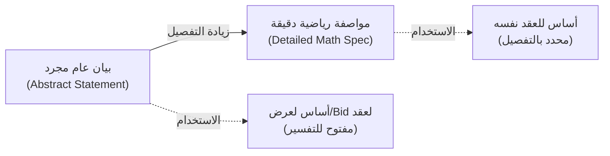

**الشرح:** نفس كلمة "متطلب" تُستخدم على طرفي الطيف — من الوصف العام لحد المواصفة الدقيقة.

---

#### 📖 الشرح

المتطلب `requirement` عنده وظيفة مزدوجة (`dual function`):

1. **أساس لتقديم عرض (Bid) على عقد:** هنا لازم يكون البيان عام ومفتوح للتفسير — لأن الشركة المتقدمة للعرض لسا ما بدأت تصمم الحل، بس تبي تفهم "شنو المطلوب تقريباً" عشان تقدر تحسب سعر وتقدّم عرضها.

2. **أساس للعقد نفسه:** بعد ما يتفق الطرفان، لازم المتطلب يتحول لبيان دقيق ومفصّل — لأنه صار جزء من العقد القانوني، وأي غموض هنا = مشاكل قانونية ومالية لاحقاً.

**مثال بسيط:** لو قلت "النظام لازم يكون آمن" — هذا بيان عام (مرحلة العرض). لو قلت "النظام لازم يستخدم `AES-256 encryption` لكل بيانات كلمات المرور" — هذا مواصفة دقيقة (مرحلة العقد).

#### 🎯 الملخص السريع
- المتطلب له وظيفة مزدوجة: أساس Bid (عام) + أساس عقد (دقيق)
- كلا الشكلين يُسمّيان "requirement" رغم اختلاف مستوى التفصيل
- التفصيل يزيد كلما اقتربنا من التنفيذ الفعلي

#### 📚 التطبيق
فهم هذا الطيف يساعدك تعرف ليش أول لقاء مع العميل يعطيك جمل عامة، وليش لازم تشتغل عليها لتحولها لمواصفة دقيقة قبل ما تبدأ التصميم.

#### ⚠️ أخطاء شائعة

#### الفهم الخاطئ ❌:
الطالب يعتقد إن "المتطلب" لازم يكون دايماً بيان دقيق ومفصل من أول يوم.

#### الفهم الصحيح ✅:
المتطلبات تبدأ عامة (خصوصاً في مرحلة العرض/Bid)، ثم تتطور تدريجياً لمواصفة دقيقة قبل التنفيذ. الاثنان صحيحان حسب المرحلة.

#### 📄 النص الأصلي من المحاضرة
<details>
<summary>عرض النص الأصلي (coverage: 100%)</summary>

> "It may range from a high-level abstract statement of a service or of a system constraint to a detailed mathematical functional specification. This is inevitable as requirements may serve a dual function: May be the basis for a bid (proposal) for a contract - therefore must be open to interpretation; May be the basis for the contract itself - therefore must be defined in detail; Both these statements may be called requirements."

**ملاحظة على التغطية:**
- ✓ تم شرح الطيف الكامل (عام ← دقيق) والوظيفة المزدوجة
- ℹ️ إضافة من الدليل: مثال الـ encryption لتوضيح الفرق

</details>

---

### 2. أهمية هندسة المتطلبات (Requirements Engineering — Importance)
<!-- @type: fact -->
<!-- @render: {type: "diagram-first", visualization: "hierarchy", coverage: "100%"} -->
<!-- @connectivity: {prerequisite: "1"} -->

#### 📍 أين نحن الآن؟
بعد ما عرفنا شنو "المتطلب"، نفهم ليش دراسته وإدارته (`Requirements Engineering` أو `RE`) موضوع بهذا الحجم من الأهمية.

#### ⬅️ الربط مع السابق
لأن المتطلب نفسه ممكن يكون غامض (كما رأينا)، فلازم عملية منظمة (`RE`) تتعامل مع هذا الغموض.

#### 💡 الفكرة الأساسية
**`Requirements Engineering` مهمة لأن الهندسة أصلاً هي حل المشاكل، وما تقدر تحل مشكلة إلا إذا فهمتها بالكامل — وكل خطأ في فهم المتطلبات يكبر كلفته كل ما تأخرنا في اكتشافه.**

---

#### 📊 المخطط: لماذا RE مهمة؟

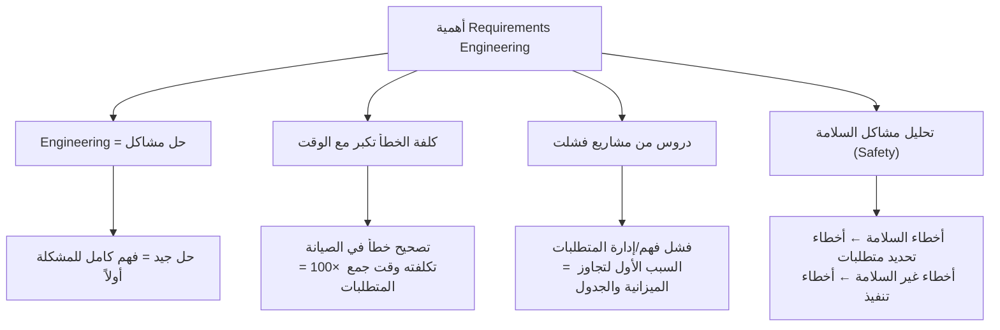

**الشرح:** أربعة أسباب مستقلة كلها تؤدي لنفس النتيجة: لازم تستثمر وقت جدي في فهم المتطلبات قبل التصميم والتنفيذ.

---

#### 📖 الشرح

**1. الهندسة = حل مشاكل:** أي مهندس (مو بس مهندس برمجيات) وظيفته تصميم حل. لو ما فهمت المشكلة صح، أي حل تصممه راح يكون غلط أو ناقص، مهما كان تنفيذك ممتاز تقنياً.

**2. كلفة الخطأ تتضاعف مع الوقت:** لو اكتشفت خطأ في متطلب وأنت لسا في مرحلة جمع المتطلبات، تصحيحه سهل ورخيص (تعديل نص). لكن لو نفس الخطأ ما اكتشفته إلا بعد ما سلّمت النظام للعميل (مرحلة الصيانة `maintenance`)، تصحيحه يكلّف **100 ضعف** — لأنك لازم تعدّل التصميم، الكود، الاختبارات، وتعيد النشر.

**3. دروس من الفشل:** لما تدرس مشاريع برمجية فشلت أو تجاوزت الميزانية والجدول الزمني، السبب الأكبر المتكرر هو "فشل فهم أو إدارة المتطلبات" — مو مشاكل في لغة البرمجة أو الأدوات.

**4. تحليل السلامة (Safety):** لو درست حوادث الأنظمة الحرجة (زي أنظمة طبية أو طيران)، تلاحظ نمط: الأخطاء المتعلقة بالسلامة (`safety-related`) غالباً سببها متطلبات محددة غلط من الأساس، بينما الأخطاء غير المتعلقة بالسلامة غالباً سببها تنفيذ خاطئ لمتطلبات صحيحة.

#### 🎯 الملخص السريع
- فهم المشكلة شرط أساسي لأي حل هندسي جيد
- كلفة تصحيح خطأ متطلب في الصيانة = 100× كلفتها في مرحلة المتطلبات
- فشل إدارة المتطلبات = السبب الأول لتجاوز الميزانية/الجدول في المشاريع الفاشلة
- أخطاء السلامة ← غالباً من تحديد المتطلبات، أخطاء أخرى ← غالباً من التنفيذ

#### 📚 التطبيق
هذا يبرر ليش تقضي وقت طويل نسبياً في مرحلة المتطلبات قبل ما تكتب أي كود — الاستثمار هنا يوفر عليك أضعاف الوقت لاحقاً.

#### ⚠️ أخطاء شائعة

#### الفهم الخاطئ ❌:
الطالب يعتقد إن "قضاء وقت طويل بالمتطلبات = مضيعة وقت، الأفضل نبدأ نبرمج بسرعة".

#### الفهم الصحيح ✅:
الوقت المستثمر في فهم المتطلبات هو أرخص استثمار ممكن في دورة حياة المشروع — لأن تكلفة إصلاح نفس الخطأ تتضاعف بشكل حاد كل ما تأخر اكتشافه.

#### 📄 النص الأصلي من المحاضرة
<details>
<summary>عرض النص الأصلي (coverage: 100%)</summary>

> "Engineering is about developing solutions to problems; A good solution is only possible if the engineer fully understands the problem; Errors cost more the longer they go undetected; Cost of correcting a requirements error is 100 times greater in the maintenance phase than in the requirement phase; Failure to understand and manage requirements is the biggest single cause of the cost and schedule over-runs; Safety-related errors tend to be errors in specifying requirements; While non-safety errors tend to be errors in implementing requirements."

</details>

---

### 2. واقع الممارسة الحالية — التحديات السبعة (Present State of Practice)
<!-- @type: practice -->
<!-- @render: {type: "diagram-first", visualization: "hierarchy", coverage: "100%"} -->
<!-- @connectivity: {prerequisite: "2"} -->

#### 📍 أين نحن الآن؟
نفهم الآن *لماذا* جمع المتطلبات صعب عملياً في الواقع — سبعة تحديات معروفة.

#### ⬅️ الربط مع السابق
بعد ما عرفنا أهمية RE، نحتاج نفهم العوائق اللي تواجهنا فعلياً أثناء تطبيقها.

#### 💡 الفكرة الأساسية
**هناك سبعة أسباب رئيسية تجعل جمع المتطلبات وإدارتها صعبة في الواقع العملي — من صعوبة الاكتشاف إلى نقص الموارد.**

---

#### 📊 المخطط: التحديات السبعة

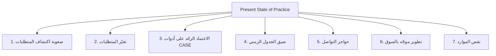

**الشرح:** سبعة تحديات مستقلة، كل واحد يزيد من صعوبة الوصول لمتطلبات دقيقة وكاملة.

---

#### 📖 الشرح

**1. صعوبة اكتشاف المتطلبات:** يصعب تحديد كل المتطلبات من البداية — الوصف الأولي للمشروع دايماً ناقص، فالمستخدمين والمطورين يضطرون يجربون ويخطئون (`trial and error`) عشان يكتشفوا المشاكل والحلول الحقيقية.

**2. تغيّر المتطلبات:** ما فيه مستخدم يقدر يعطيك قائمة كاملة من المتطلبات من أول يوم — القائمة الكاملة تظهر تدريجياً. وبما إن جدول المشروع نادراً يتعدّل ليعكس كل تعديل، يصير من الصعب تبرير قضاء وقت وموارد على `SRS` "مثالية" — لأن المتطلبات راح تتغيّر على أي حال.

**3. الاعتماد الزائد على أدوات CASE:** أدوات هندسة البرمجيات المدعومة بالحاسوب (`CASE tools`) مفيدة، لكن لازم تفهم أولاً مبادئ وتقنيات وعملية هندسة المتطلبات قبل ما تعتمد عليها، ولازم يكون عندك توقعات واقعية من قدرات هذه الأدوات — هي مساعدة، مو بديل عن التفكير.

**4. ضيق الجدول الزمني:** التخطيط الضعيف أو طلبات العميل غير الواقعية يعني وقت غير كافٍ لعمل تحليل جيد. وممارسة شائعة (وخطيرة) هي تقليص وقت تحليل المتطلبات عشان "نبدأ بسرعة" بالتصميم والبرمجة — وهذا غالباً يؤدي لكارثة لاحقاً.

**5. حواجز التواصل:** هندسة المتطلبات نشاط مكثّف تواصلياً (`communication intensive`). المستخدمون والمطورون عندهم مفردات وخلفيات مختلفة — المستخدمون يفضلون اللغة الطبيعية (وصف بالكلام العادي)، بينما المطورون يريدون مواصفات دقيقة. الاعتماد على واحدة بس يسبب سوء فهم وارتباك.

**6. تطوير موجّه بالسوق:** اليوم كثير من البرمجيات تُطوّر لإرضاء "عملاء مجهولين" (سوق عام) لا عميل محدد — والهدف يصير إبقاء العملاء يعودون لشراء ترقيات (`upgrades`)، مو بس تلبية متطلبات محددة سلفاً.

**7. نقص الموارد:** الموارد المتاحة غالباً لا تكفي لتنفيذ كل المتطلبات، لذلك المهم هو تحديد الأولويات — الأهم يُنفَّذ أولاً.

#### 🎯 الملخص السريع
- 7 تحديات: اكتشاف صعب، تغيّر مستمر، اعتماد زائد على الأدوات، جدول ضيق، حواجز تواصل، سوق مجهول، نقص موارد
- الحل المشترك لأغلبها: عملية منظمة + تواصل جيد + أولويات واضحة

#### 📚 التطبيق
معرفة هذه التحديات تجعلك تتوقعها من البداية بدل ما تتفاجأ بها — مثلاً، توقع من الأساس إن المتطلبات راح تتغيّر، وخطط لذلك بدل ما تقاومه.

#### ⚠️ أخطاء شائعة

#### الفهم الخاطئ ❌:
الطالب يعتقد إن الحل هو الحصول على أدوات `CASE` أقوى أو قضاء وقت أطول لكتابة `SRS` "مثالي" لا يتغير أبداً.

#### الفهم الصحيح ✅:
لا يوجد `SRS` مثالي ثابت — التحدي الحقيقي هو بناء عملية تتوقع التغيير وتديره (`requirements management`)، مو محاولة منعه بالكامل.

#### 📄 النص الأصلي من المحاضرة
<details>
<summary>عرض النص الأصلي (coverage: 100%)</summary>

> "Requirements are difficult to uncover: Difficulty to identify all the requirements; The description is always incomplete at start; Users & developers must resort to trial and error to identify problems & solutions. Requirements change: No user can come up with a complete list of requirements at the outset (complete list are got gradually); Project schedule is seldom adjusted to reflect all modifications; Hard to justify spending resources to make a SRS perfect! Over-reliance on CASE tools: must not rely on requirements engineering tools without first understanding and establishing requirements engineering principles, techniques and process; must have realistic expectations from the tools. Tight project schedule: Lack of planning or unreasonable customer demand; insufficient time to do decent job; It is customary to reduce time (for analyze requirement), for early start of designing & coding → disaster. Communication barriers: RE is communication intensive activity; Users & developers have different vocabularies, backgrounds; Users prefer natural language, while developers want more precise specifications. Market-driven software development: Today, software are developed to satisfy anonymous customers; Keep customers coming back to buy upgrades. Lack of resources: resource may not not be enough, therefore the most important can be implemented first."

**ملاحظة على التغطية:**
- ✓ التحديات السبعة كلها مشروحة بالكامل مع تفاصيل كل واحدة

</details>

---

### 3. أنواع المتطلبات حسب الوعي بها (Known / Unknown / Undreamt Requirements)
<!-- @type: fact -->
<!-- @render: {type: "diagram-first", visualization: "hierarchy", coverage: "100%"} -->
<!-- @connectivity: {prerequisite: "2"} -->

#### 📍 أين نحن الآن؟
بعد ما فهمنا التحديات، نصنّف المتطلبات حسب مدى وعي أصحاب المصلحة (`stakeholders`) بها.

#### ⬅️ الربط مع السابق
هذا التصنيف يفسّر مباشرة تحدي "صعوبة اكتشاف المتطلبات" اللي شرحناه فوق — ليش بعض المتطلبات ما تظهر إلا لاحقاً.

#### 💡 الفكرة الأساسية
**المتطلبات تنقسم لثلاثة أنواع حسب مدى معرفة أصحاب المصلحة بها: معروفة، غير معروفة، وغير متخيَّلة أصلاً — وكل نوع منها ممكن يكون وظيفي (`functional`) أو غير وظيفي (`non-functional`).**

---

#### 📊 المخطط: أنواع المتطلبات حسب الوعي

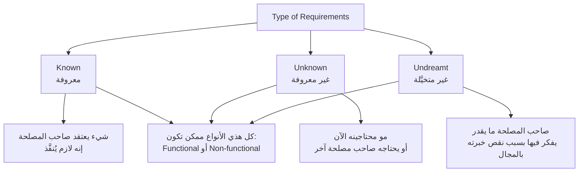

**الشرح:** الفرق الأساسي هو "مين يعرف بالمتطلب ومتى" — والتصنيف ينطبق بغض النظر عن كون المتطلب وظيفي أو غير وظيفي.

---

#### 📖 الشرح

**Known requirements (معروفة):** شيء صاحب المصلحة (`stakeholder`) واعي به تماماً ويعتقد إنه لازم يُنفَّذ في النظام — هذا النوع سهل جمعه لأنه واضح من أول لقاء.

**Unknown requirements (غير معروفة):** موجودة لكن غير معروفة حالياً — إما لأنها غير مطلوبة الآن (بترتبط بمرحلة لاحقة من المشروع)، أو لأنها مطلوبة من صاحب مصلحة آخر ما استشرناه بعد. مثال: قسم المحاسبة يحتاج تقرير معين، بس أنت تتكلم بس مع قسم المبيعات.

**Undreamt requirements (غير متخيَّلة):** الأصعب — صاحب المصلحة نفسه ما يقدر يفكر فيها، لأن معرفته بالمجال (`domain knowledge`) محدودة. هنا دور المحلل (المهندس) إنه يجيب خبرته من مشاريع ومجالات مشابهة عشان يقترح متطلبات ما كان العميل يعرف إنه يحتاجها.

#### 🎯 الملخص السريع
- Known = واضح من البداية
- Unknown = موجود لكن مو واضح الآن (توقيت أو صاحب مصلحة مختلف)
- Undreamt = العميل نفسه ما يتخيله، يحتاج خبرة المحلل
- الثلاثة ممكن تكون Functional أو Non-functional

#### 📚 التطبيق
هذا التصنيف يفسّر ليش مقابلة واحدة مع العميل ما تكفي أبداً — المحلل الجيد يحاول يكتشف الـ Unknown والـ Undreamt عبر أسئلة استباقية وخبرته بمجالات مشابهة، مو بس ينتظر العميل يقول كل شيء.

#### ⚠️ أخطاء شائعة

#### الفهم الخاطئ ❌:
الطالب يعتقد إن دور مهندس المتطلبات هو بس "تسجيل" اللي يقوله العميل حرفياً.

#### الفهم الصحيح ✅:
مهندس المتطلبات الجيد يحاول يكتشف الـ `Undreamt requirements` بخبرته بالمجال، ويسأل أسئلة توجيهية تكشف الـ `Unknown requirements` — مو بس ينتظر العميل يتذكرها.

#### 📄 النص الأصلي من المحاضرة
<details>
<summary>عرض النص الأصلي (coverage: 100%)</summary>

> "Known requirements: Something a stakeholder believes to be implemented. Unknown requirements: Not needed right now or needed by another stakeholder. Undreamt requirements: Stakeholder may not be able to think of new requirements due to limited domain knowledge. These requirements could be functional or nonfunctional ones."

</details>

---

### 4. متطلبات المستخدم مقابل متطلبات النظام (User Requirements vs System Requirements)
<!-- @type: fact -->
<!-- @render: {type: "diagram-first", visualization: "comparison", coverage: "100%"} -->
<!-- @connectivity: {prerequisite: "3"} -->

#### 📍 أين نحن الآن؟
ننتقل من "أنواع المتطلبات حسب الوعي بها" إلى "أنواع المتطلبات حسب مستوى التفصيل والجمهور المستهدف".

#### ⬅️ الربط مع السابق
هذا التصنيف عملياً هو تطبيق لفكرة "طيف التفصيل" اللي شرحناها في القسم الأول (من بيان عام إلى مواصفة دقيقة).

#### 💡 الفكرة الأساسية
**متطلبات المستخدم (`User requirements`) بيانات عامة باللغة الطبيعية موجهة للعميل، بينما متطلبات النظام (`System requirements`) وثيقة مُهيكَلة ومفصّلة موجهة للمطورين وقد تكون جزء من العقد.**

---

#### 📊 المخطط: User Requirements vs System Requirements

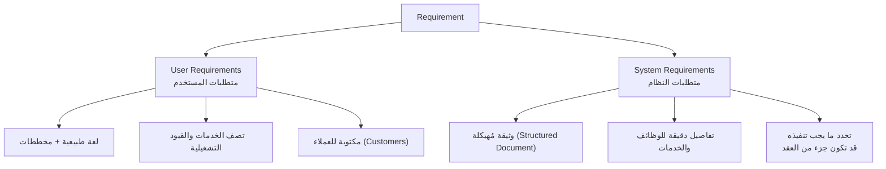

**الشرح:** كلا النوعين يصفان نفس النظام، لكن بمستوى تفصيل ولغة مختلفة تماماً حسب الجمهور المستهدف.

---

#### 📖 الشرح

**متطلبات المستخدم (`User requirements`):** جمل بلغة طبيعية (Natural Language) بالإضافة لمخططات توضح الخدمات اللي يقدمها النظام والقيود التشغيلية عليه. مكتوبة خصيصاً ليفهمها العميل (`Customer`) — مو بالضرورة عنده خلفية تقنية.

**متطلبات النظام (`System requirements`):** وثيقة مُهيكَلة (`structured document`) تحتوي وصف تفصيلي دقيق لوظائف النظام، خدماته، وقيوده التشغيلية. تحدّد بالضبط "شنو لازم يُنفَّذ" — ولهذا ممكن تصير جزء رسمي من العقد بين العميل والمقاول (Contractor).

**مثال توضيحي (Mental Health Care-Patient Management System — MHC-PMS):**

- **متطلب مستخدم (User Requirement) رقم 1:** "النظام (`MHC-PMS`) لازم يولّد تقارير إدارية شهرية توضح تكلفة الأدوية الموصوفة من كل عيادة خلال ذلك الشهر."

- **متطلبات نظام (System Requirements) المقابلة (تفصيل لنفس المتطلب):**
  1. في آخر يوم عمل من كل شهر، يُنشأ ملخص للأدوية الموصوفة، تكلفتها، والعيادات الموصِفة.
  2. النظام يولّد التقرير تلقائياً للطباعة بعد الساعة 17:30 في آخر يوم عمل من الشهر.
  3. يُنشأ تقرير منفصل لكل عيادة، يتضمن أسماء الأدوية الفردية، عدد الوصفات، عدد الجرعات الموصوفة، والتكلفة الإجمالية.
  4. لو الدواء متوفر بجرعات مختلفة (مثلاً 10mg، 20mg)، تُنشأ تقارير منفصلة لكل وحدة جرعة.
  5. الوصول لكل تقارير التكلفة مقصور على المستخدمين المصرَّح لهم المدرجين في قائمة تحكم الوصول الإدارية.

لاحظ: متطلب مستخدم واحد (عام) تحوّل إلى 5 متطلبات نظام (دقيقة جداً وقابلة للاختبار).

#### 🎯 الملخص السريع
- User Requirements = لغة طبيعية، للعميل، عامة
- System Requirements = وثيقة مُهيكلة، للمطورين، مفصّلة، ممكن تكون جزء من العقد
- متطلب مستخدم واحد غالباً يتفرّع لعدة متطلبات نظام

#### 📚 التطبيق
لما تكتب `SRS`، لازم تحافظ على المستويين معاً — العميل يراجع الـ User Requirements للتأكد إنها تعكس احتياجه، والمطور يستخدم System Requirements كمرجع دقيق للتنفيذ والاختبار.

#### ⚠️ أخطاء شائعة

#### الفهم الخاطئ ❌:
الطالب يعتقد إن `User requirements` و `System requirements` وثيقتان منفصلتان تماماً وغير مرتبطتين.

#### الفهم الصحيح ✅:
كل متطلب نظام لازم يكون قابل للتتبع (`traceable`) لمتطلب مستخدم واحد أو أكثر — هما نفس المحتوى، لكن بمستويين مختلفين من التفصيل، ومترابطين ببعض.

#### 📄 النص الأصلي من المحاضرة
<details>
<summary>عرض النص الأصلي (coverage: 100%)</summary>

> "User requirements: Statements in natural language plus diagrams of the services the system provides and its operational constraints. Written for customers. System requirements: A structured document setting out detailed descriptions of the system's functions, services and operational constraints. Defines what should be implemented so may be part of a contract between client and contractor."
> Example: MHC-PMS — "1. The MHC-PMS shall generate monthly management reports showing the cost of drugs prescribed by each clinic during that month" مع 5 System Requirements تفصيلية (1.1 إلى 1.5) عن التوقيت، التوليد التلقائي، تفاصيل التقرير، الجرعات، وضبط الوصول.

</details>

---

### 5. عملية المتطلبات الأساسية (Essential Requirements Process)
<!-- @type: principle -->
<!-- @render: {type: "diagram-first", visualization: "flowchart", coverage: "100%"} -->
<!-- @connectivity: {prerequisite: "4"} -->

#### 📍 أين نحن الآن؟
بعد ما عرفنا أنواع المتطلبات، نحتاج نعرف العملية العامة (`process`) اللي توصلنا من الفهم لحد الاتفاق النهائي.

#### ⬅️ الربط مع السابق
هذه العملية هي "الإطار الكبير" اللي يجمع كل اللي تعلمناه لحد الآن — كيف نتعامل عملياً مع Known/Unknown/Undreamt requirements.

#### 💡 الفكرة الأساسية
**عملية المتطلبات الأساسية تمر بأربع خطوات: فهم المشكلة، نمذجتها وتحليلها، الاتفاق عليها، ثم توصيلها — بالإضافة لإدارة التغيير المستمر.**

---

#### 📊 المخطط: Essential Requirements Process

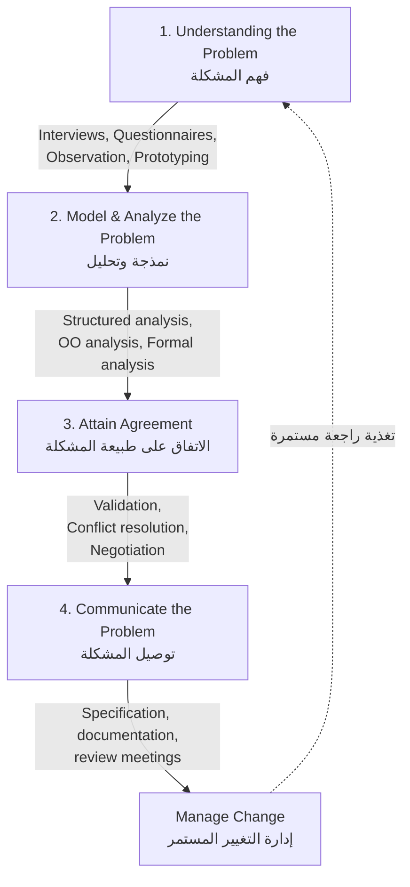

**الشرح:** العملية ليست خطية بحتة — إدارة التغيير (E) ترجع لتغذّي فهم المشكلة (A) من جديد، لأن المتطلبات تتطور طوال دورة التطوير.

---

#### 📖 الشرح

**1. فهم المشكلة (`Understanding the problem`):** نستخدم تقنيات جمع بيانات (`data gathering techniques`) لاستخراج (`elicit`) المتطلبات — أشهرها: مقابلات (`Interviews`)، استبيانات (`Questionnaires`)، ملاحظة ميدانية (`Observation`)، وبناء نماذج أولية (`Prototyping`).

**2. نمذجة وتحليل المشكلة (`Model and analyze`):** بعد جمع المعلومات الخام، نستخدم طرق نمذجة (`modeling methods`) لتنظيمها — مثل التحليل البنيوي (`Structured analysis`)، تحليل كائني التوجه (`OO analysis`)، أو التحليل الصوري (`Formal analysis`).

**3. الاتفاق على طبيعة المشكلة (`Attain agreement`):** نحتاج نتأكد إن كل أصحاب المصلحة متفقين على نفس الفهم — عبر التحقق (`Validation`)، حل الخلافات (`Conflict resolution`)، والتفاوض (`Negotiation`) لو فيه وجهات نظر متضاربة.

**4. توصيل المشكلة (`Communicate the problem`):** نوثّق كل شيء بشكل رسمي — مواصفة (`Specification`)، وثائق (`documentation`)، واجتماعات مراجعة (`review meetings`) للتأكد إن الجميع على نفس الصفحة.

**إدارة التغيير كلما تطورت المشكلة:** المتطلبات تستمر تتطور طوال عملية تطوير البرمجيات — العملية مو "نفذها مرة وخلصت"، هي دورة مستمرة تتطلب متابعة.

#### 🎯 الملخص السريع
- 4 خطوات: فهم → نمذجة/تحليل → اتفاق → توصيل
- كل خطوة عندها تقنيات محددة (مقابلات، تحليل بنيوي، تفاوض، توثيق)
- إدارة التغيير عملية مستمرة طوال المشروع، مو خطوة واحدة تنتهي

#### 📚 التطبيق
هذا الإطار يساعدك تنظم عملك في أي مشروع حقيقي — بدل ما تقفز مباشرة لكتابة الوثيقة، تمر بالمراحل الأربعة بالترتيب.

#### ⚠️ أخطاء شائعة

#### الفهم الخاطئ ❌:
الطالب يعتقد إن العملية تنتهي بمجرد توثيق المتطلبات (الخطوة 4) — "خلصنا الوثيقة، خلص الموضوع".

#### الفهم الصحيح ✅:
إدارة التغيير جزء أساسي من العملية، مستمرة طوال دورة حياة التطوير — المتطلبات دايماً تتطور، والعملية ترجع للخطوة الأولى بشكل دوري.

#### 📄 النص الأصلي من المحاضرة
<details>
<summary>عرض النص الأصلي (coverage: 100%)</summary>

> "Understanding the problem: Use data gathering techniques to elicit requirements — Interviews, Questionnaires, Observation, Prototyping. Model and analyze the problem: Use some modeling method(s) — Structured analysis, OO analysis, Formal analysis. Attain agreement on the nature of the problem: Validation, Conflict resolution, Negotiation. Communicate the problem: Specification, documentation, review meetings. Manage change as the problem evolves: Requirements continue to evolve throughout software development."

</details>

---

### 6. ماذا مقابل كيف (What vs. How)
<!-- @type: fact -->
<!-- @render: {type: "diagram-first", visualization: "comparison", coverage: "100%"} -->
<!-- @connectivity: {prerequisite: "5"} -->

#### 📍 أين نحن الآن؟
قاعدة أساسية تحدد حدود ما يجب أن يحتويه المتطلب فعلاً.

#### ⬅️ الربط مع السابق
هذا المبدأ ينطبق مباشرة على "متطلبات المستخدم" اللي شرحناها — يوضح لك بالضبط شنو المسموح تكتبه فيها.

#### 💡 الفكرة الأساسية
**المتطلبات لازم تحدد "شنو" (`What`) النظام لازم يسوي، مو "كيف" (`How`) يسويه — الـ What خاص بمجال التطبيق (`application domain`)، والـ How خاص ببنية النظام نفسه (`machine domain`).**

---

#### 📊 المخطط: What vs How

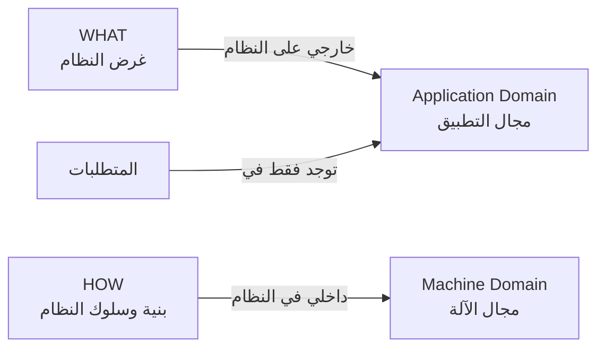

**الشرح:** المتطلبات تعيش حصرياً في مجال التطبيق (What) — بمجرد ما تبدأ تحدد "كيف" (How)، تكون خرجت من نطاق المتطلبات ودخلت نطاق التصميم.

---

#### 📖 الشرح

**الـ What (ماذا):** يشير لغرض النظام (`system's purpose`) — هو خارجي على النظام، وهو خاصية من خصائص مجال التطبيق (`application domain`، يعني عالم المشكلة نفسه، مثلاً: عالم البنوك، عالم المستشفيات).

**الـ How (كيف):** يشير لبنية وسلوك النظام (`structure and behavior`) — هو داخلي في النظام، وهو خاصية من خصائص مجال الآلة (`machine domain`، يعني كيف هنبني الحل تقنياً).

**القاعدة:** المتطلبات توجد فقط في مجال التطبيق — لهذا محتاج ترسم حدود واضحة حول مجال التطبيق: أي الأشياء جزء من المشكلة اللي تحللها، وأيها مو جزء منها؟

**مثال:** "النظام لازم يتحقق من هوية المستخدم قبل السماح له بالدخول" = **What** (متطلب صحيح). "النظام يستخدم `JWT tokens` مع `bcrypt hashing`" = **How** (هذا تصميم/تنفيذ، مو متطلب).

#### 🎯 الملخص السريع
- What = غرض النظام، خارجي، من مجال التطبيق
- How = بنية النظام، داخلي، من مجال الآلة
- المتطلبات = What فقط
- الخلط بينهم = خطأ شائع جداً في كتابة المتطلبات

#### 📚 التطبيق
لما تراجع وثيقة متطلبات، اسأل نفسك على كل بند: "هل هذا يصف حاجة العميل (What) ولا يصف حل تقني معين (How)؟" — لو الثاني، انقله لوثيقة التصميم بدل المتطلبات.

#### ⚠️ أخطاء شائعة

#### الفهم الخاطئ ❌:
الطالب يكتب متطلب مثل "النظام يستخدم قاعدة بيانات `MySQL` لتخزين المستخدمين" ويعتبره متطلب صحيح.

#### الفهم الصحيح ✅:
هذا `How` وليس `What` — المتطلب الصحيح هو "النظام لازم يخزّن بيانات المستخدمين بشكل آمن ومستمر"، أما اختيار `MySQL` تحديداً فهو قرار تصميم يأتي لاحقاً (إلا لو العميل اشترط تقنية معينة كقيد فعلي على النظام).

#### 📄 النص الأصلي من المحاضرة
<details>
<summary>عرض النص الأصلي (coverage: 100%)</summary>

> "Requirements should specify what but not how. What refers to a system's purpose — It is external to the system — It is a property of the application domain. How refers to a system's structure and behavior — It is internal to the system — It is property of the machine domain. Requirements only exists in the application domain. Need to draw a boundary around the app. Domain — Which things are part of the problem you are analyzing and which are not?"

</details>

---

### 7. متطلبات وظيفية مقابل غير وظيفية (Functional vs Non-functional Requirements)
<!-- @type: fact -->
<!-- @render: {type: "diagram-first", visualization: "hierarchy", coverage: "100%"} -->
<!-- @connectivity: {prerequisite: "6"} -->

#### 📍 أين نحن الآن؟
أهم تصنيف في هذه المحاضرة — تصنيف المتطلبات حسب طبيعتها (وظيفة مقابل قيد/جودة).

#### ⬅️ الربط مع السابق
بعد ما عرفنا إن المتطلبات لازم تكون "What"، الآن نصنّف أنواع الـ What نفسها.

#### 💡 الفكرة الأساسية
**المتطلبات الوظيفية (`Functional`) تصف وظائف وخدمات النظام الأساسية، بينما المتطلبات غير الوظيفية (`Non-functional`) تصف قيود وجودة النظام — كيف يؤدي وظائفه، مو شنو وظائفه.**

---

#### 📊 المخطط: Functional vs Non-functional

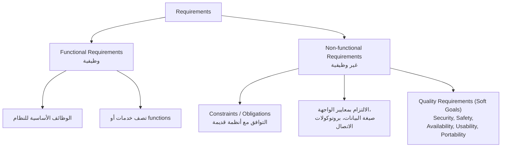

**الشرح:** الوظيفية تجاوب على "شنو النظام يسوي؟"، وغير الوظيفية تجاوب على "شنو القيود والجودة المطلوبة أثناء ما يسوي هذا؟"

---

#### 📖 الشرح

**المتطلبات الوظيفية (`Functional requirements`):** تصف الوظائف الأساسية للنظام — أي خدمة أو function يقدمها النظام للمستخدم. مثال من نظام `MHC-PMS`:

- المستخدم لازم يقدر يبحث في قوائم المواعيد لكل العيادات.
- النظام لازم يولّد يومياً، لكل عيادة، قائمة بالمرضى المتوقع حضورهم لمواعيدهم في ذلك اليوم.
- كل موظف يستخدم النظام لازم يكون معرَّف بشكل فريد برقم موظف مكوّن من 8 أرقام.

**المتطلبات غير الوظيفية (`Non-functional requirements`):** قيود والتزامات (`Constraints/obligations`) على النظام، وتنقسم عملياً لثلاث فئات:
1. **التوافق مع أنظمة قديمة (legacy):** التوافق مع (وإعادة استخدام) أنظمة قائمة سابقاً.
2. **الامتثال لمعايير:** معايير الواجهة (`interface standards`)، صيغة البيانات (`data format`)، بروتوكولات الاتصال (`communication protocols`)... إلخ.
3. **متطلبات الجودة (`Soft Goals`):** الأمان (`Security`)، السلامة (`Safety`)، التوافر (`Availability`)، سهولة الاستخدام (`Usability`)، قابلية النقل (`Portability`).

**الفرق العملي:** المتطلب الوظيفي "النظام يسمح بتسجيل الدخول" — المتطلب غير الوظيفي المرافق له "تسجيل الدخول لازم يستجيب خلال أقل من ثانيتين ويكون متوافق مع معايير `OWASP` الأمنية".

#### 🎯 الملخص السريع
- Functional = الوظائف والخدمات (شنو يسوي النظام)
- Non-functional = القيود والجودة (كيف يسوي النظام)
- Non-functional تشمل: التوافق + المعايير + Soft Goals (أمان، سلامة، توافر، سهولة استخدام، قابلية نقل)

#### 📚 التطبيق
عند كتابة `SRS`، لازم توثق النوعين لكل ميزة — متطلب وظيفي بدون متطلبات غير وظيفية مرافقة له غالباً غير كافٍ (مثلاً: "بحث سريع" بدون تحديد "سريع" يعني كم بالضبط).

#### ⚠️ أخطاء شائعة

#### الفهم الخاطئ ❌:
الطالب يعتقد إن المتطلبات غير الوظيفية "أقل أهمية" أو ثانوية مقارنة بالوظيفية.

#### الفهم الصحيح ✅:
المتطلبات غير الوظيفية (خصوصاً الأمان والسلامة) ممكن تكون أهم من الوظيفية في أنظمة حرجة — نظام بنكي وظيفياً صحيح لكن غير آمن هو نظام فاشل بالكامل.

#### 📄 النص الأصلي من المحاضرة
<details>
<summary>عرض النص الأصلي (coverage: 100%)</summary>

> "Functional requirements: Fundamental functions of the system — Describe system services or functions. Non-functional requirements: Constraints/obligations — Compatibility with (and reuse of) legacy systems; Compliance with interface standards, data format, communication protocols; Quality requirements (soft goals) — Security, Safety, Availability, Usability, Portability."
> Functional requirements for MHC-PMS: "A user shall be able to search the appointments lists for all clinics. The system shall generate each day, for each clinic, a list of patients who are expected to attend appointments that day. Each staff member using the system shall be uniquely identified by his or her 8-digit employee number."

</details>

---

### 8. الغموض في المتطلبات (Requirements Imprecision)
<!-- @type: fact -->
<!-- @render: {type: "diagram-first", visualization: "flowchart", coverage: "100%"} -->
<!-- @connectivity: {prerequisite: "7"} -->

#### 📍 أين نحن الآن؟
مثال عملي حي يوضح كيف نفس الكلمة تسبب مشكلة حقيقية إذا ما كانت المتطلبات دقيقة.

#### ⬅️ الربط مع السابق
هذا مثال مباشر على تحدي "حواجز التواصل" اللي شرحناه سابقاً — كيف اختلاف اللغة بين المستخدم والمطور يسبب غموض فعلي.

#### 💡 الفكرة الأساسية
**عندما لا تُصاغ المتطلبات بدقة، تظهر مشاكل — لأن المتطلب الغامض ممكن يُفسَّر بطرق مختلفة تماماً من قِبل المطورين والمستخدمين.**

---

#### 📊 المخطط: تفسيرين لكلمة واحدة

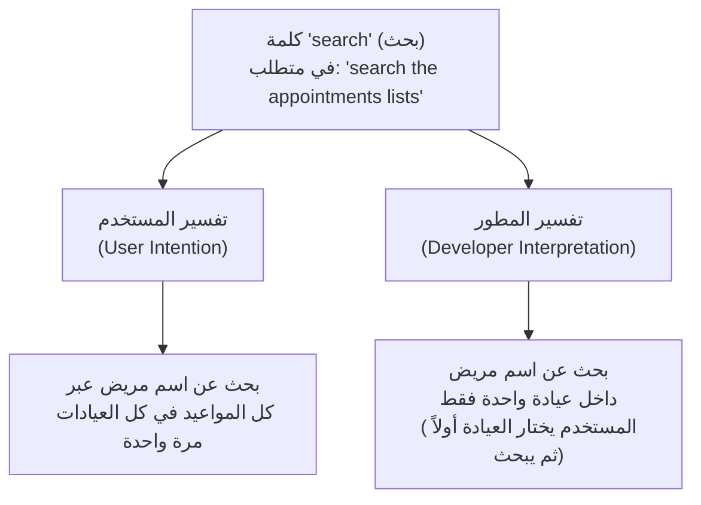

**الشرح:** نفس كلمة "بحث" فُهمت بطريقتين مختلفتين تماماً — النتيجة نظام لا يلبي احتياج المستخدم الفعلي رغم إنه "نفّذ المتطلب حرفياً".

---

#### 📖 الشرح

المتطلبات الغامضة (`ambiguous`) قد تُفسَّر بطرق مختلفة من قِبل المطورين والمستخدمين. خذ متطلب `MHC-PMS` الأول: "المستخدم لازم يقدر يبحث في قوائم المواعيد لكل العيادات."

كلمة **"search"** (بحث) هنا هي مصدر المشكلة:
- **نية المستخدم:** يقصد بحث عن اسم مريض عبر **كل** المواعيد في **كل** العيادات دفعة واحدة (بحث شامل).
- **تفسير المطور:** يقصد بحث عن اسم مريض داخل عيادة **واحدة فقط** — المستخدم يختار العيادة أولاً، ثم يبحث بداخلها.

النتيجة: المطور بنى النظام حسب فهمه، سلّمه للمستخدم، والمستخدم اكتشف إن النظام "ما يشتغل صح" — رغم إن المطور نفّذ بالضبط النص المكتوب!

#### 🎯 الملخص السريع
- الغموض في متطلب واحد يسبب اختلاف كامل في السلوك المتوقَّع
- الحل: تفصيل أكثر دقة في مرحلة System Requirements (وليس الاكتفاء بـ User Requirements العام)
- كلمات عامة مثل "بحث"، "سريع"، "سهل" لازم تُعرَّف بدقة

#### 📚 التطبيق
هذا يبرر أهمية تحويل كل `User Requirement` عام إلى `System Requirements` دقيقة (زي مثال `MHC-PMS` اللي شفناه سابقاً) — التفصيل يقلل مساحة الغموض.

#### ⚠️ أخطاء شائعة

#### الفهم الخاطئ ❌:
الطالب يعتقد إن كتابة متطلب بجملة واحدة واضحة ("النظام يدعم البحث") كافية.

#### الفهم الصحيح ✅:
لازم تحدد نطاق كل فعل بدقة — "البحث" لازم يحدد: بحث في شنو بالضبط؟ عبر أي نطاق (عيادة واحدة أم الكل)؟ بأي معايير؟

#### 📄 النص الأصلي من المحاضرة
<details>
<summary>عرض النص الأصلي (coverage: 100%)</summary>

> "Problems arise when requirements are not precisely stated. Ambiguous requirements may be interpreted in different ways by developers and users. Consider the term 'search' in requirement 1 — User intention: search for a patient name across all appointments in all clinics; Developer interpretation: search for a patient name in an individual clinic. User chooses clinic then search."

</details>

---

### 9. أنشطة هندسة المتطلبات (Requirements Engineering Activities)
<!-- @type: fact -->
<!-- @render: {type: "diagram-first", visualization: "flowchart", coverage: "100%"} -->
<!-- @connectivity: {prerequisite: "8"} -->

#### 📍 أين نحن الآن؟
هذا القسم الأهم — يحوّل كل اللي تعلمناه لعملية رسمية من 4 أنشطة متسلسلة.

#### ⬅️ الربط مع السابق
هذه الأنشطة الأربعة هي التطبيق العملي التفصيلي لـ "Essential Requirements Process" اللي شرحناها سابقاً.

#### 💡 الفكرة الأساسية
**هندسة المتطلبات تتكون من أربعة أنشطة متسلسلة: استخراج (Elicitation)، تحليل وتفاوض (Analysis & Negotiation)، توثيق (Documentation)، وتحقق (Validation) — كل نشاط يغذي الي بعده.**

---

#### 📊 المخطط: Requirements Engineering Activities

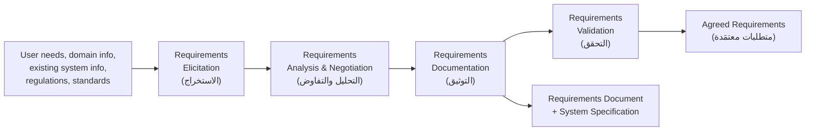

**الشرح:** المدخلات (احتياجات المستخدم، معرفة المجال، معلومات أنظمة قائمة، لوائح ومعايير) تغذي عملية الاستخراج، ثم تتحول تدريجياً عبر أربعة أنشطة إلى متطلبات معتمَدة نهائياً.

---

#### 📖 الشرح

**1. الاستخراج (`Elicitation`):** يُعرف أيضاً بـ "جمع المتطلبات" (`requirements gathering`) — يُحدَّد فيه المتطلبات بمساعدة العميل وأنظمة/عمليات موجودة سلفاً (إن وُجدت).

**2. التحليل والتفاوض (`Analysis and negotiation`):** يبدأ بعد الاستخراج — المتطلبات تُحلَّل بهدف اكتشاف التناقضات (`inconsistencies`)، العيوب (`defects`)، والنواقص (`omissions`). المتطلبات تُوصف من حيث العلاقات بينها، وتُحل الخلافات (`conflicts`) إن وُجدت.

**3. التوثيق (`Documentation`):** هي المنتج النهائي (`end product`) لعمليتي الاستخراج والتحليل — تُعرف باسم `SRS` (Software Requirements Specification).

**4. التحقق (`Validation`):** يُعرف أيضاً بـ "التحقق من صحة المتطلبات" (`requirements verification`) — يُنفَّذ لتحسين جودة الـ `SRS`.

#### 🎯 الملخص السريع
- 4 أنشطة: Elicitation → Analysis & Negotiation → Documentation → Validation
- Elicitation = جمع المتطلبات من مصادرها
- Documentation = المنتج النهائي = SRS
- Validation = تحسين جودة الـ SRS بعد كتابته

#### 📚 التطبيق
هذا المخطط هو "خريطة الطريق" لبقية المحاضرة — الأقسام القادمة راح تشرح كل نشاط من هذي الأربعة بالتفصيل (Elicitation، Analysis، Validation، ثم Documentation/SRS).

#### ⚠️ أخطاء شائعة

#### الفهم الخاطئ ❌:
الطالب يعتقد إن هذي الأنشطة الأربعة خطية بحتة، تنفذها مرة وحدة وتخلص.

#### الفهم الصحيح ✅:
عملياً فيه تكرار وتغذية راجعة بينهم — مثلاً التحقق (Validation) ممكن يكشف نواقص تخلّيك ترجع لـ Elicitation من جديد لجمع معلومات إضافية.

#### 📄 النص الأصلي من المحاضرة
<details>
<summary>عرض النص الأصلي (coverage: 100%)</summary>

> Elicitation: "known as requirements gathering. Requirements are identified with the help of customer & existing systems processes, if available." Analysis and negotiation: "Starts with requirement elicitation. Requirements are analyzed in order to identify inconsistencies, defects, omissions, etc. Requirements are described in terms of relationships and also resolve conflicts, if any." Documentation: "is the end product of requirements elicitation and analysis. Known as SRS." Validation: "Known also as requirements verification. It is carried out to improve the quality of SRS."

</details>

---

### 10. الاستخراج — مصادر المتطلبات (Elicitation — Sources)
<!-- @type: fact -->
<!-- @render: {type: "diagram-first", visualization: "hierarchy", coverage: "100%"} -->
<!-- @connectivity: {prerequisite: "9"} -->

#### 📍 أين نحن الآن؟
نبدأ نفصّل النشاط الأول من الأربعة: من وين نجيب المتطلبات أصلاً؟

#### ⬅️ الربط مع السابق
هذا تفصيل مباشر لخانة "Elicitation" في المخطط اللي شفناه بالقسم السابق.

#### 💡 الفكرة الأساسية
**قبل ما تبدأ جمع المتطلبات، لازم تحدد مصادرها المحتملة الخمسة: الأهداف، معرفة المجال، أصحاب المصلحة، بيئة التشغيل، والبيئة التنظيمية.**

---

#### 📊 المخطط: مصادر المتطلبات المحتملة

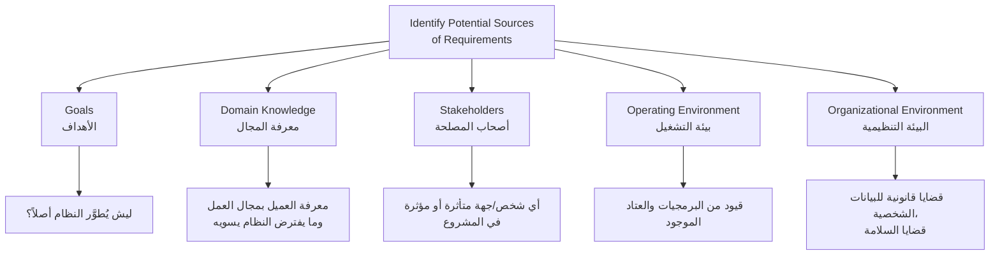

**الشرح:** خمسة أماكن مستقلة يجب البحث فيها عن المتطلبات — تجاهل أي مصدر منها يعني احتمال فقدان متطلبات مهمة.

---

#### 📖 الشرح

**الأهداف (`Goals`):** ليش يُطوَّر النظام أصلاً؟ فهم الهدف الاستراتيجي وراء المشروع يوجّه كل قرار لاحق في جمع المتطلبات.

**معرفة المجال (`Domain knowledge`):** العميل عنده معرفة بمجال العمل التجاري (`business application`) اللي يُكتَب النظام له، وما المفترض يسويه — هذه هي "معرفة المجال"، ومهمتك كمحلل تستخرجها منه.

**أصحاب المصلحة (`Stakeholders`):** شخص، مجموعة، أو منظمة مشاركة فعلياً في المشروع، متأثرة بنتائجه، أو قادرة على التأثير في نتائجه. كل صاحب مصلحة عنده منظور مختلف ومتطلبات محتملة مختلفة.

**بيئة التشغيل (`Operating environment`):** المتطلبات ممكن تكون مقيَّدة (`constrained`) ببرمجيات وعتاد موجود سلفاً — مثلاً لازم النظام يشتغل على نظام تشغيل معين أو يتكامل مع نظام قديم.

**البيئة التنظيمية (`Organizational environment`):** قضايا قانونية متعلقة بحفظ البيانات الشخصية (`legal issues of keeping personal data`)، وقضايا السلامة (`safety issues`) — قيود خارج نطاق التقنية البحتة لكنها تفرض متطلبات حقيقية.

#### 🎯 الملخص السريع
- 5 مصادر: Goals, Domain knowledge, Stakeholders, Operating environment, Organizational environment
- تجاهل أي مصدر = خطر فقدان متطلبات مهمة (خصوصاً Unknown/Undreamt)
- البيئة التنظيمية غالباً تُنسى لكنها تحمل قيود قانونية حقيقية

#### 📚 التطبيق
قبل أي مقابلة جمع متطلبات، راجع هذه القائمة الخمسية — هل غطيت كل مصدر، أم ركّزت بس على "أصحاب المصلحة" ونسيت القيود القانونية والتقنية؟

#### ⚠️ أخطاء شائعة

#### الفهم الخاطئ ❌:
الطالب يعتقد إن "أصحاب المصلحة" هم المصدر الوحيد المهم للمتطلبات، والباقي ثانوي.

#### الفهم الصحيح ✅:
كل مصدر من الخمسة يكشف نوع مختلف من المتطلبات — البيئة التنظيمية مثلاً تكشف متطلبات قانونية (زي حماية بيانات المرضى) ما كان أي stakeholder بيذكرها تلقائياً.

#### 📄 النص الأصلي من المحاضرة
<details>
<summary>عرض النص الأصلي (coverage: 100%)</summary>

> "Identify potential sources of requirements: Goals [why the system is being developed]; Domain knowledge (The customer has knowledge of the business application being written and what it is supposed to do, this is the domain knowledge); Stakeholders (A person, group, or organization that is actively involved in a project, is affected by its outcome, or can influence its outcome); Operating environment — May be constrained by existing software and hardware; Organizational environment — Legal issues of keeping personal data, safety issues."

</details>

---

### 11. أنشطة الاستخراج (Requirements Elicitation Activities)
<!-- @type: fact -->
<!-- @render: {type: "diagram-first", visualization: "hierarchy", coverage: "100%"} -->
<!-- @connectivity: {prerequisite: "10"} -->

#### 📍 أين نحن الآن؟
بعد ما عرفنا "من وين" نستخرج المتطلبات، الآن نفهم "شنو بالضبط" لازم نفهمه أثناء الاستخراج.

#### ⬅️ الربط مع السابق
هذا امتداد مباشر لمصادر المتطلبات — يحدد أربعة أنواع من الفهم لازم تحققهم أثناء التعامل مع تلك المصادر.

#### 💡 الفكرة الأساسية
**عملية الاستخراج تتطلب أربعة أنواع من الفهم: فهم مجال التطبيق، فهم المشكلة تحديداً، فهم الأعمال، وفهم احتياجات أصحاب المصلحة وقيودهم.**

---

#### 📊 المخطط: أنواع الفهم المطلوبة أثناء Elicitation

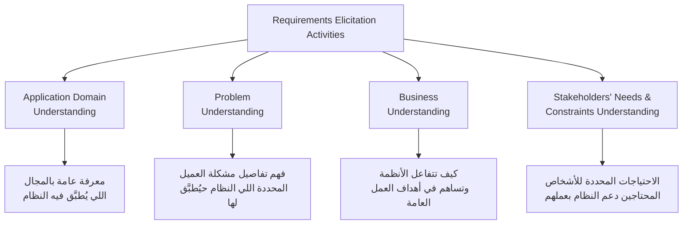

**الشرح:** أربعة مستويات فهم متكاملة — من العام (المجال) إلى الأكثر تحديداً (احتياجات فرد معيّن).

---

#### 📖 الشرح

**فهم مجال التطبيق (`Application domain understanding`):** معرفة عامة بالمنطقة (`general area`) اللي يُطبَّق فيها النظام — مثلاً، لو تبني نظام مستشفى، لازم تعرف أساسيات كيف تشتغل المستشفيات بشكل عام.

**فهم المشكلة (`Problem understanding`):** تفاصيل مشكلة العميل المحددة (`specific customer problem`) اللي النظام حيُطبَّق فيها لازم تُفهَم بدقة — مو بس فهم عام للمجال، بل فهم عميق للحالة الخاصة بهذا العميل.

**فهم الأعمال (`Business understanding`):** لازم تفهم كيف تتفاعل الأنظمة مع بعضها وتساهم في أهداف العمل الشاملة (`overall business goals`) — النظام الجديد جزء من منظومة أكبر.

**فهم احتياجات وقيود أصحاب المصلحة:** لازم تفهم بالتفصيل الاحتياجات المحددة للأشخاص المحتاجين دعم النظام في عملهم — هذا يتطلب تواصل مباشر ومستمر مع كل فئة مستخدمين.

#### 🎯 الملخص السريع
- 4 مستويات فهم: Application Domain (عام) → Problem (خاص) → Business (سياق أوسع) → Stakeholders (احتياج فردي)
- كل مستوى يكمّل الآخر، مو بديل عنه

#### 📚 التطبيق
لو ركّزت بس على "فهم المشكلة" ونسيت "فهم الأعمال"، راح تبني نظام يحل المشكلة المحددة لكنه ما يتناسق مع أنظمة الشركة الثانية — لازم توازن بين المستويات الأربعة.

#### ⚠️ أخطاء شائعة

#### الفهم الخاطئ ❌:
الطالب يعتقد إن "فهم المشكلة" (Problem Understanding) كافي وحده لبدء الاستخراج.

#### الفهم الصحيح ✅:
فهم المشكلة بدون فهم مجال التطبيق العام أو سياق الأعمال الأوسع يؤدي غالباً لحل ضيق لا يتماشى مع باقي أنظمة المنظمة.

#### 📄 النص الأصلي من المحاضرة
<details>
<summary>عرض النص الأصلي (coverage: 100%)</summary>

> "Application domain understanding — is knowledge of the general area where the system is applied. Problem understanding — The details of the specific customer problem where the system will be applied must be understood. Business understanding — You must understand how systems interact and contribute to overall business goals. Understanding the needs and constraints of the system stakeholders — You must understand, in detail, the specific needs of people who require system support in their work."

</details>

---

### 12. تحليل المتطلبات (Requirements Analysis)
<!-- @type: fact -->
<!-- @render: {type: "diagram-first", visualization: "flowchart", coverage: "100%"} -->
<!-- @connectivity: {prerequisite: "11"} -->

#### 📍 أين نحن الآن؟
النشاط الثاني من الأربعة: بعد جمع المتطلبات الخام، نحللها لاكتشاف المشاكل فيها.

#### ⬅️ الربط مع السابق
هذا هو تفصيل خانة "Analysis and Negotiation" اللي رأيناها في مخطط أنشطة RE.

#### 💡 الفكرة الأساسية
**التحليل يكتشف المشاكل، النواقص، والتناقضات في المتطلبات المُستخرَجة، ثم يحلها عبر التفاوض والتغذية الراجعة لأصحاب المصلحة.**

---

#### 📊 المخطط: Requirements Analysis Process

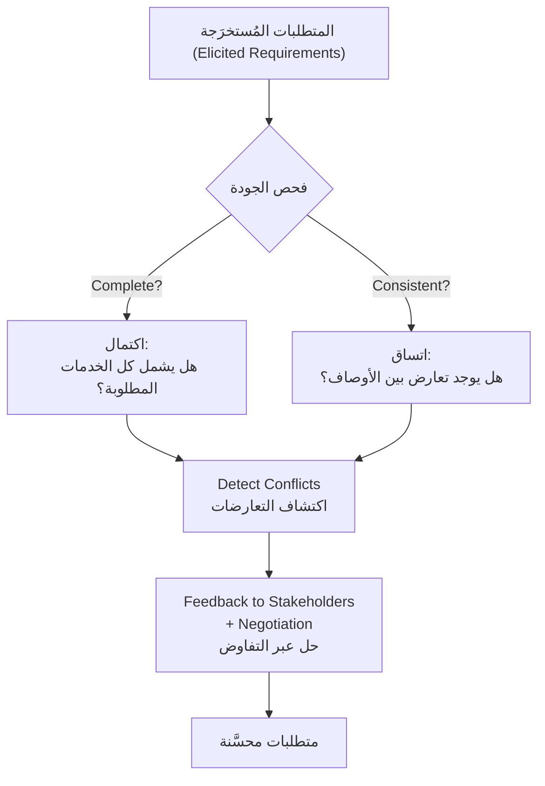

**الشرح:** التحليل ليس مجرد قراءة — هو فحص منهجي بمعيارين (اكتمال + اتساق)، يليه حل تعاوني للتعارضات المكتشَفة.

---

#### 📖 الشرح

هدف التحليل: اكتشاف المشاكل، النواقص (`incompleteness`)، والتناقضات (`inconsistencies`) في المتطلبات اللي جُمعت.

يُفحَص المعيارين التاليين:
1. **الاكتمال (`Complete`):** لازم يشمل أوصاف لكل التسهيلات (`facilities`) المطلوبة — لا شيء ناقص.
2. **الاتساق (`Consistence`):** لازم ما يكون فيه تعارض (`conflicts`) أو تناقض (`contradictions`) في أوصاف تسهيلات النظام.

بعد الفحص، إذا اكتُشفت تعارضات، يتم حلها عبر التغذية الراجعة (`feedback`) لأصحاب المصلحة من خلال عملية التفاوض (`negotiation process`).

**مثال:** لو صاحب مصلحة أ يقول "النظام لازم يسمح بحذف المرضى نهائياً من قاعدة البيانات"، وصاحب مصلحة ب (قانوني) يقول "لازم نحتفظ بسجل كل مريض لمدة 7 سنوات على الأقل" — هذا تعارض واضح يحتاج تفاوض للوصول لحل (مثلاً: أرشفة بدل حذف نهائي).

#### 🎯 الملخص السريع
- التحليل = اكتشاف مشاكل (نواقص + تعارضات)
- معياران: Completeness (اكتمال) + Consistency (اتساق)
- حل التعارضات يتم عبر Feedback + Negotiation مع أصحاب المصلحة

#### 📚 التطبيق
كل مرة تنتهي من جمع مجموعة متطلبات جديدة، اسأل: هل هي كاملة؟ هل تتعارض مع متطلبات موجودة سابقاً؟ — هذا الفحص يمنع مفاجآت لاحقة في مرحلة التنفيذ.

#### ⚠️ أخطاء شائعة

#### الفهم الخاطئ ❌:
الطالب يعتقد إن اكتشاف تعارض بين متطلبين يعني إن أحدهما "غلط" ولازم يُلغى فوراً.

#### الفهم الصحيح ✅:
التعارض يُحل عادةً عبر التفاوض (`negotiation`) — إيجاد حل وسط يرضي كل الأطراف، مو بالضرورة إلغاء أحد الطرفين بالكامل.

#### 📄 النص الأصلي من المحاضرة
<details>
<summary>عرض النص الأصلي (coverage: 100%)</summary>

> "Discover problems, incompleteness, inconsistencies in the elicited requirements. Complete: it should include descriptions of all facilities required. Consistence: it should be no conflicts or contradictions in the descriptions of the system facilities. Detect and resolve conflicts — Feedback to stakeholders to resolve them through the negotiation process."

</details>

---

### 13. التحقق من المتطلبات (Requirements Validation)
<!-- @type: fact -->
<!-- @render: {type: "diagram-first", visualization: "hierarchy", coverage: "100%"} -->
<!-- @connectivity: {prerequisite: "12"} -->

#### 📍 أين نحن الآن؟
النشاط الرابع (الأخير) من دورة RE — التأكد إن اللي وثّقناه فعلاً يمثل ما يحتاجه العميل.

#### ⬅️ الربط مع السابق
بعد التحليل (اللي يفحص اتساق المتطلبات مع بعضها)، التحقق يفحص شيء مختلف: هل المتطلبات نفسها صحيحة أصلاً؟

#### 💡 الفكرة الأساسية
**التحقق يتأكد إن المتطلبات المكتوبة تُعرِّف فعلاً النظام اللي يحتاجه العميل حقيقةً — عبر خمسة أنواع من الفحص.**

---

#### 📊 المخطط: أنواع فحوصات Requirements Validation

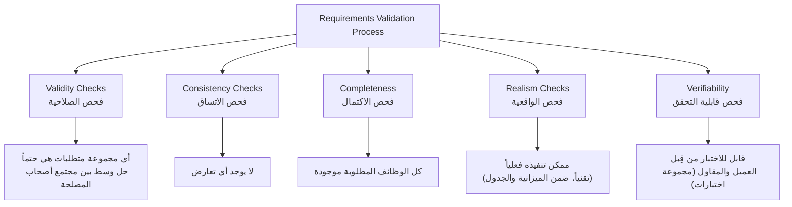

**الشرح:** خمسة فحوصات مستقلة، كل واحد يكشف نوع مختلف من المشاكل قبل ما نعتمد المتطلبات نهائياً.

---

#### 📖 الشرح

الهدف من التحقق: التأكد إن المتطلبات تُعرِّف فعلاً النظام اللي يحتاجه العميل حقاً. تذكّر: **كلفة تصحيح متطلب خطأ أكبر بكثير من تصحيح خطأ تصميم أو برمجة**.

خطوات عملية التحقق:

1. **فحص الصلاحية (`Validity checks`):** أي مجموعة متطلبات هي حتماً حل وسط (`compromise`) بين مجتمع أصحاب المصلحة — لأن كل طرف عنده أولويات مختلفة.
2. **فحص الاتساق (`Consistency checks`):** لا يوجد أي تعارض (`no conflict`) بين المتطلبات.
3. **فحص الاكتمال (`Completeness`):** كل الوظائف (`all functions`) المطلوبة موجودة ومغطاة.
4. **فحص الواقعية (`Realism checks`):** هل يمكن تنفيذ المتطلب فعلياً — من حيث التقنية المتاحة، الميزانية، والجدول الزمني؟
5. **فحص قابلية التحقق (`Verifiability`):** هل يقدر العميل والمقاول يتفقون على مجموعة اختبارات (`set of test`) تثبت إن المتطلب تحقق فعلاً؟ متطلب لا يمكن اختباره هو متطلب غامض غير مفيد.

#### 🎯 الملخص السريع
- 5 فحوصات: Validity, Consistency, Completeness, Realism, Verifiability
- الهدف: التأكد إن المتطلبات = ما يحتاجه العميل حقاً
- كلفة إصلاح متطلب خطأ >> كلفة إصلاح خطأ تصميم/برمجة

#### 📚 التطبيق
قبل ما تعتمد `SRS` نهائياً، مرّ على كل متطلب بهذه الخمسة فحوصات — خصوصاً `Verifiability`، لأن متطلب غير قابل للاختبار سيسبب نزاع لاحقاً حول "هل تم تسليمه صح أم لا".

#### ⚠️ أخطاء شائعة

#### الفهم الخاطئ ❌:
الطالب يعتقد إن "التحقق" (Validation) نفس شيء "التحليل" (Analysis) — يخلطهم مع بعض.

#### الفهم الصحيح ✅:
التحليل يركز على اتساق واكتمال المتطلبات فيما بينها (داخلياً)، أما التحقق يركز على مطابقتها للاحتياج الحقيقي للعميل + واقعية تنفيذها + قابليتها للاختبار (فحص أشمل وأعمق يحصل بعد التحليل والتوثيق).

#### 📄 النص الأصلي من المحاضرة
<details>
<summary>عرض النص الأصلي (coverage: 100%)</summary>

> "Check that requirements define the system which the customer really needs. Cost of fixing a requirement >> repairing design or coding errors. Req. val. Process: Validity checks [any set of requirements is inevitably a compromise across the stakeholder community]; Consistency checks [no conflict]; Completeness [all functions]; Realism checks [technology, can actually be implemented, budget and schedule]; Verifiability [customer and contractor, set of test]."

</details>

---

### 14. تقنيات التحقق من المتطلبات (Requirements Validation Techniques)
<!-- @type: fact -->
<!-- @render: {type: "diagram-first", visualization: "hierarchy", coverage: "100%"} -->
<!-- @connectivity: {prerequisite: "13"} -->

#### 📍 أين نحن الآن؟
كيف نطبّق عملياً الفحوصات الخمسة اللي شرحناها في القسم السابق؟

#### ⬅️ الربط مع السابق
هذا الجزء العملي (`how`) للجزء النظري (`what to check`) اللي سبقه مباشرة.

#### 💡 الفكرة الأساسية
**فيه ثلاث تقنيات رئيسية للتحقق من المتطلبات، ممكن تُستخدم واحدة أو أكثر منها معاً: مراجعات، نمذجة أولية، وتوليد حالات اختبار.**

---

#### 📊 المخطط: تقنيات Requirements Validation

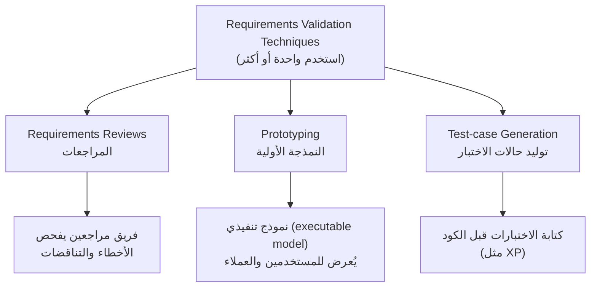

**الشرح:** ثلاث طرق مكمّلة، كل واحدة تكشف نوع مختلف من المشاكل في المتطلبات.

---

#### 📖 الشرح

**مراجعات المتطلبات (`Requirements reviews`):** فريق من المراجعين (`reviewers team`) يفحص الوثيقة بحثاً عن الأخطاء والتناقضات — أسلوب تقليدي فعّال يعتمد على الخبرة البشرية والعين الفاحصة.

**النمذجة الأولية (`Prototyping`):** يُبنى نموذج تنفيذي (`executable model`) بشكل سريع ويُعرَض للمستخدمين النهائيين والعملاء — بدل ما يقرأ العميل نص المتطلبات، يشوف ويجرب نموذج فعلي، وهذا يكشف سوء الفهم بسرعة أكبر من القراءة (تذكّر مثال كلمة "search" الغامضة — نموذج أولي كان راح يكشفها فوراً).

**توليد حالات الاختبار (`Test-case generation`):** كتابة الاختبارات (`test`) قبل كتابة الكود — كما في منهجية `XP` (Extreme Programming). لو صعب عليك تكتب حالة اختبار لمتطلب معيّن، هذا مؤشر إن المتطلب نفسه غامض أو غير قابل للتحقق.

#### 🎯 الملخص السريع
- 3 تقنيات: Reviews (مراجعة بشرية)، Prototyping (نموذج تجريبي)، Test-case generation (اختبارات مبكرة)
- ممكن استخدام أكثر من تقنية معاً
- Prototyping فعّالة جداً لكشف الغموض (زي مشكلة "search" اللي شفناها)

#### 📚 التطبيق
لمشروع فيه متطلبات غامضة أو معقدة، الأفضل تدمج التقنيات الثلاث: مراجعة أولية، ثم نموذج أولي للتأكد من الفهم المشترك، ثم كتابة اختبارات تثبت التحقق.

#### ⚠️ أخطاء شائعة

#### الفهم الخاطئ ❌:
الطالب يعتقد إن تقنية واحدة (مثلاً المراجعات فقط) كافية لكل أنواع المشاريع.

#### الفهم الصحيح ✅:
اختيار التقنية (أو مزيج منها) يعتمد على طبيعة المشروع — نظام حرج (زي بنكي) قد يحتاج الثلاثة معاً، بينما نظام بسيط قد يكتفي بمراجعة واحدة.

#### 📄 النص الأصلي من المحاضرة
<details>
<summary>عرض النص الأصلي (coverage: 100%)</summary>

> "One or more: Requirements reviews, by reviewers team who check for errors and inconsistencies; Prototyping, executable model is demonstrated to end-users and customers; Test-case generation, [writing test before code — XP]."

</details>

---

### 15. وثيقة متطلبات البرمجيات — SRS (Software Requirements Document)
<!-- @type: fact -->
<!-- @render: {type: "diagram-first", visualization: "hierarchy", coverage: "100%"} -->
<!-- @connectivity: {prerequisite: "14"} -->

#### 📍 أين نحن الآن؟
بعد ما مررنا بالأربعة أنشطة (Elicitation, Analysis, Documentation, Validation)، نتعرف على المنتج النهائي رسمياً: وثيقة الـ SRS.

#### ⬅️ الربط مع السابق
هذا هو النشاط الثالث "Documentation" اللي أشرنا له سابقاً بدون تفصيل — الآن نفصّله كاملاً.

#### 💡 الفكرة الأساسية
**وثيقة متطلبات البرمجيات (`SRS`) هي البيان الرسمي لما يجب على مطوري النظام تنفيذه، وتشمل متطلبات المستخدم والمواصفة التفصيلية لمتطلبات النظام معاً — لكن `Agile` تتحداها بأسلوب مختلف.**

---

#### 📊 المخطط: محتوى وثيقة SRS

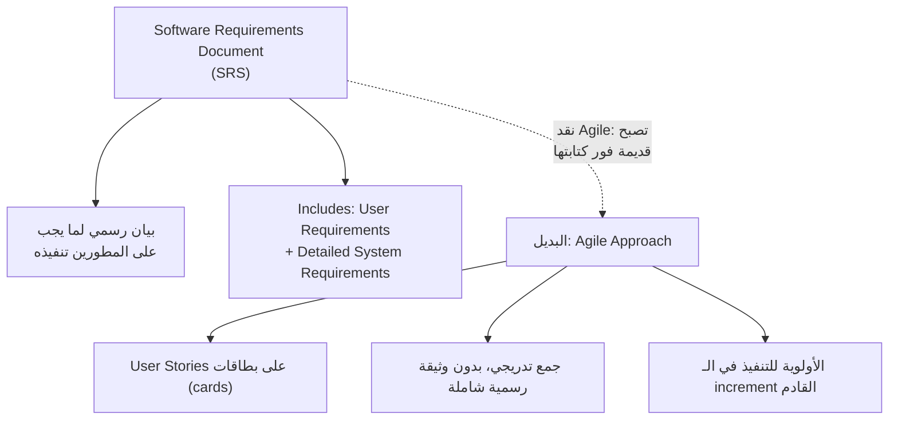

**الشرح:** الوثيقة التقليدية (SRS) شاملة وثابتة نسبياً، بينما النهج الأجايل يتعامل مع نفس المحتوى بشكل تدريجي وأخف عبر بطاقات قصص المستخدم.

---

#### 📖 الشرح

وثيقة متطلبات البرمجيات (`Software Requirements Document`)، تُعرف أيضاً باسم `SRS`، هي البيان الرسمي (`official statement`) لما يجب على مطوري النظام تنفيذه. تشمل:
- متطلبات المستخدم (`User requirements`) للنظام
- المواصفة التفصيلية (`detailed specification`) لمتطلبات النظام

**نقطة مهمة — نقد Agile:** طرق التطوير الرشيقة (`Agile development methods`) تجادل بأن المتطلبات تتغير بسرعة كبيرة، لدرجة إن وثيقة المتطلبات تصبح "قديمة" (`out of date`) بمجرد كتابتها — يعني الجهد المبذول فيها ضائع إلى حد كبير. بدل الوثيقة الرسمية، طرق مثل `Extreme Programming` تجمع متطلبات المستخدم بشكل تدريجي، وتكتبها على بطاقات كـ"قصص مستخدم" (`user stories`). بعدها المستخدم يحدد أولويات هذه المتطلبات للتنفيذ في الزيادة (`increment`) القادمة من النظام.

#### 🎯 الملخص السريع
- SRS = بيان رسمي = User Requirements + System Requirements التفصيلية
- Agile ينتقد الوثيقة الرسمية الشاملة كونها "تُصبح قديمة فور كتابتها"
- البديل الأجايل: User Stories على بطاقات + أولويات تدريجية

#### 📚 التطبيق
هذا يبرز الفرق العملي بين النهج الكلاسيكي (وثيقة SRS ضخمة) والنهج العملي في كثير من الشركات اليوم (بطاقات وقصص مستخدم قصيرة) — راجع الجدول العام "Textbook vs Industry Reality" في الملخص الشامل لمزيد من التفاصيل.

#### ⚠️ أخطاء شائعة

#### الفهم الخاطئ ❌:
الطالب يعتقد إن `SRS` الرسمية أصبحت "غير مستخدَمة أبداً" في الصناعة الحديثة بسبب Agile.

#### الفهم الصحيح ✅:
كثير من المشاريع (خصوصاً الحرجة أو التعاقدية) لا زالت تتطلب `SRS` رسمية بسبب متطلبات قانونية/تعاقدية، بينما مشاريع Agile الداخلية تستبدلها بـ user stories — الاختيار يعتمد على سياق المشروع.

#### 📄 النص الأصلي من المحاضرة
<details>
<summary>عرض النص الأصلي (coverage: 100%)</summary>

> "Official statement of what the system developers should implement. Called also SRS. Includes: User requirements for a system; Detailed specification of the system requirements. Agile development methods argue that requirements change so rapidly that a requirements document is out of date as soon as it is written, so the effort is largely wasted. Rather than a formal document, approaches such as Extreme Programming collect user requirements incrementally and write these on cards as user stories. The user then prioritizes requirements for implementation in the next increment of the system."

</details>

---

### 16. مستخدمو وثيقة المتطلبات (Requirements Document's Users)
<!-- @type: fact -->
<!-- @render: {type: "diagram-first", visualization: "comparison", coverage: "100%"} -->
<!-- @connectivity: {prerequisite: "15"} -->

#### 📍 أين نحن الآن؟
نفهم الآن مين بالضبط يستخدم وثيقة SRS وليش — عشان نفهم ليش لازم تكون دقيقة ومنظمة.

#### ⬅️ الربط مع السابق
هذا امتداد مباشر لفهم SRS — بما إنها "وثيقة رسمية"، لازم نعرف جمهورها المتعدد.

#### 💡 الفكرة الأساسية
**وثيقة المتطلبات لها خمس فئات مستخدمين مختلفة، وكل فئة تستخدمها لغرض مختلف تماماً.**

---

#### 📊 المخطط: مستخدمو وثيقة المتطلبات

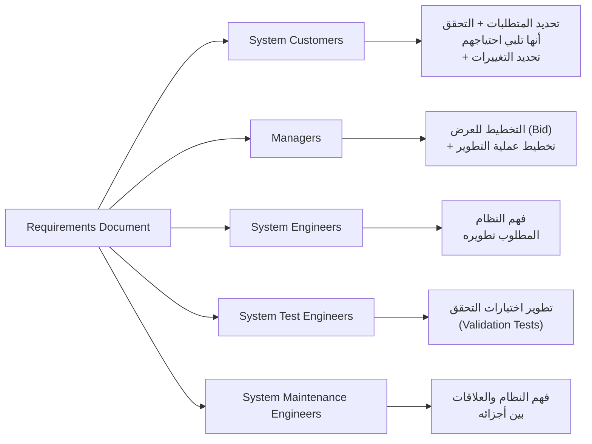

**الشرح:** نفس الوثيقة الواحدة تخدم خمسة أدوار مختلفة تماماً — من العميل غير التقني إلى مهندس الصيانة الفني.

---

#### 📖 الشرح

| الفئة | الاستخدام |
| --- | --- |
| **عملاء النظام (`System Customers`)** | يحددون المتطلبات ويقرؤونها للتحقق من أنها تلبي احتياجاتهم. العملاء أيضاً هم من يحدد التغييرات على المتطلبات. |
| **المدراء (`Managers`)** | يستخدمون الوثيقة للتخطيط لتقديم عرض (`bid`) على النظام، ولتخطيط عملية تطوير النظام بشكل عام. |
| **مهندسو النظام (`System Engineers`)** | يستخدمون المتطلبات لفهم أي نظام مطلوب تطويره بالضبط. |
| **مهندسو اختبار النظام (`System Test Engineers`)** | يستخدمون المتطلبات لتطوير اختبارات التحقق (`validation tests`) للنظام. |
| **مهندسو صيانة النظام (`System Maintenance Engineers`)** | يستخدمون المتطلبات لفهم النظام والعلاقات بين أجزائه المختلفة — مهم جداً وقت تعديل أو إصلاح النظام لاحقاً. |

**ملاحظة عملية:** نفس الوثيقة الواحدة (SRS) يجب أن تخدم كل هذه الفئات في نفس الوقت — لهذا مهم يكون فيها مستويان: عام (لغة طبيعية للعملاء) ودقيق (System requirements للمهندسين).

#### 🎯 الملخص السريع
- 5 فئات مستخدمين: Customers, Managers, System Engineers, Test Engineers, Maintenance Engineers
- كل فئة تستخدم الوثيقة لغرض مختلف تماماً
- هذا يفسر ليش SRS لازم تحتوي مستويات تفصيل مختلفة (User + System requirements)

#### 📚 التطبيق
لما تكتب SRS، تذكّر إن قارئها ليس شخص واحد — لازم تفكر: هل هذا القسم مفهوم للعميل؟ هل فيه تفاصيل كافية للمختبِر يكتب اختبارات؟ هل واضح لمهندس الصيانة بعد سنتين من كتابته؟

#### ⚠️ أخطاء شائعة

#### الفهم الخاطئ ❌:
الطالب يعتقد إن SRS مكتوبة فقط للمطورين اللي راح يبرمجون النظام.

#### الفهم الصحيح ✅:
SRS تُقرأ من خمس فئات مختلفة (عملاء، مدراء، مهندسو نظام، مهندسو اختبار، مهندسو صيانة) — لكل فئة احتياج مختلف من نفس الوثيقة.

#### 📄 النص الأصلي من المحاضرة
<details>
<summary>عرض النص الأصلي (coverage: 100%)</summary>

> "System Customers: Specify the requirements and read them to check that they meet their needs. Customers specify changes to the requirements. Managers: Use the document to plan a bid for the system and to plan the system development process. System Engineers: Use the requirements to understand what system is to be developed. System Test Engineers: Use the requirements to develop validation tests for the system. System Maintenance Engineers: Use the requirements to understand the system and the relationships between its parts."

</details>

---

### 17. إدارة المتطلبات — لماذا تتغير المتطلبات دائماً (Requirements Management — Why Requirements Always Change)
<!-- @type: fact -->
<!-- @render: {type: "diagram-first", visualization: "hierarchy", coverage: "100%"} -->
<!-- @connectivity: {prerequisite: "16"} -->

#### 📍 أين نحن الآن؟
آخر موضوع في المحاضرة — نفهم ليش المتطلبات "دائماً" تتغير، بشكل رسمي مو بس ملاحظة عابرة.

#### ⬅️ الربط مع السابق
هذا يربط مباشرة بتحدي "Requirements change" اللي ذكرناه في قسم "Present State of Practice" — الآن نفهم الأسباب الجذرية الثلاثة رسمياً.

#### 💡 الفكرة الأساسية
**المتطلبات تتغير دائماً لثلاثة أسباب جذرية: المشكلة نفسها لا يمكن تعريفها بالكامل من البداية، بيئة العمل والتقنية تتغير باستمرار، ومن يدفع مقابل النظام ليسوا نفس من يستخدمونه.**

---

#### 📊 المخطط: لماذا المتطلبات تتغير دائماً؟

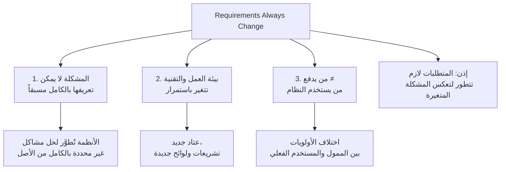

**الشرح:** ثلاثة أسباب مستقلة، كل واحد كافٍ وحده لجعل المتطلبات غير ثابتة — وبالتالي إدارة التغيير أمر حتمي وليس فشل في التخطيط.

---

#### 📖 الشرح

**1. المشكلة لا يمكن تعريفها بالكامل من البداية:** الأنظمة عادةً تُطوَّر لمعالجة مشاكل لا يمكن تعريفها بشكل كامل من الأصل. وبما إن المشكلة لا يمكن تعريفها بالكامل، فإن متطلبات البرمجيات محكوم عليها بأن تكون ناقصة في البداية حتماً.

**2. البيئة التقنية والتجارية دائماً تتغير:** عتاد جديد (`new hardware`)، تشريعات ولوائح جديدة (`new legislation and regulations`) — كلها عوامل خارجية تفرض تغييرات على المتطلبات بغض النظر عن رغبة فريق المشروع.

**3. الممول ≠ المستخدم:** الأشخاص الذين يدفعون مقابل النظام (`pay for a system`) والمستخدمون الفعليون لذلك النظام (`the users of that system`) نادراً ما يكونون نفس الأشخاص — ولهذا أولوياتهم واحتياجاتهم غالباً مختلفة، مما يخلق تغييرات وضغوطات متعارضة على المتطلبات.

**النتيجة المنطقية:** بما إن المشكلة تتغير باستمرار، فإن متطلبات النظام يجب أن **تتطور أيضاً** لتعكس هذا الفهم المتغير للمشكلة. التغيير ليس "خطأ" في العملية — هو خاصية متأصلة فيها.

#### 🎯 الملخص السريع
- 3 أسباب جذرية: مشكلة غير قابلة للتعريف الكامل + بيئة متغيرة + اختلاف الممول عن المستخدم
- التغيير في المتطلبات حتمي، وليس علامة فشل في التخطيط
- الاستنتاج: النظام والمتطلبات لازم يتطوران معاً باستمرار

#### 📚 التطبيق
هذا يبرر ليش "إدارة المتطلبات" (اللي نشرحها في القسم القادم) نشاط مستمر طوال المشروع، مو مرحلة واحدة تنتهي بعد كتابة SRS.

#### ⚠️ أخطاء شائعة

#### الفهم الخاطئ ❌:
الطالب يعتقد إن تغيّر المتطلبات دليل على "سوء تخطيط" أو "فريق متطلبات ضعيف".

#### الفهم الصحيح ✅:
التغيير حتمي لأسباب بنيوية (المشكلة نفسها، البيئة، اختلاف الممول عن المستخدم) — التخطيط الجيد لا يمنع التغيير، بل يستعد له عبر عملية إدارة متطلبات فعّالة.

#### 📄 النص الأصلي من المحاضرة
<details>
<summary>عرض النص الأصلي (coverage: 100%)</summary>

> "Requirements always change: 1. Systems are usually developed to address problems that cannot be completely defined. Because the problem cannot be fully defined, the software requirements are bound to be incomplete. 2. The business and technical environment of the system always changes. New hardware, new legislation and regulations. 3. The people who pay for a system and the users of that system are rarely the same people. Since the problem is constantly changing, the system requirements must then also evolve to reflect this changed problem view."

</details>

---

### 18. عملية إدارة المتطلبات (Requirements Management Process)
<!-- @type: practice -->
<!-- @render: {type: "diagram-first", visualization: "flowchart", coverage: "100%"} -->
<!-- @connectivity: {prerequisite: "17"} -->

#### 📍 أين نحن الآن؟
آخر قسم في المحاضرة — كيف نتعامل عملياً مع حتمية تغيّر المتطلبات؟

#### ⬅️ الربط مع السابق
بعد ما فهمنا "ليش" تتغير المتطلبات، الآن نفهم "كيف" ندير هذا التغيير بشكل منظم.

#### 💡 الفكرة الأساسية
**إدارة المتطلبات (`Requirements Management`) هي عملية فهم والتحكم في التغييرات على متطلبات النظام — تبدأ من أول مسودة، ولازم التخطيط لها من مرحلة الاستخراج نفسها.**

---

#### 📊 المخطط: Requirements Management Process

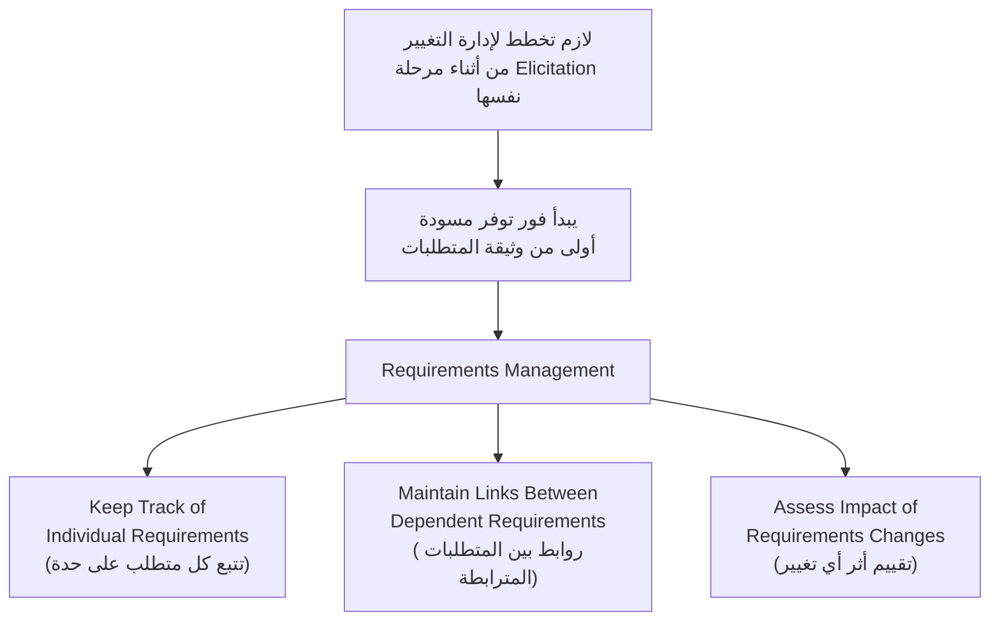

**الشرح:** إدارة المتطلبات ليست خطوة تُضاف لاحقاً — هي نشاط يبدأ مبكراً ويستمر بالتوازي مع بقية عملية RE.

---

#### 📖 الشرح

إدارة المتطلبات (`requirements management`) هي عملية فهم والتحكم في التغييرات (`understanding and controlling changes`) على متطلبات النظام. تتضمن ثلاث مهام أساسية:

1. **تتبع المتطلبات الفردية (`keep track of individual requirements`):** الاحتفاظ بسجل واضح لكل متطلب على حدة، حالته، ومصدره.
2. **الحفاظ على الروابط بين المتطلبات المترابطة (`maintain links between dependent requirements`):** فهم أي المتطلبات مرتبطة ببعضها، حتى تعرف تأثير تغيير واحد على البقية.
3. **الهدف النهائي:** تقييم أثر أي تغيير مقترح (`assess the impact of requirements changes`) قبل تطبيقه.

**نقطة حرجة جداً (مؤكَّدة في المحاضرة بخط مائل):** *عملية إدارة المتطلبات يجب أن تبدأ بمجرد توفر مسودة أولية (`draft version`) من وثيقة المتطلبات — وليس بعد اكتمالها النهائي.* هذا يعني: لازم تبدأ التخطيط لكيفية إدارة المتطلبات المتغيرة أثناء عملية استخراج المتطلبات (`requirements elicitation process`) نفسها، مو بعدها.

#### 🎯 الملخص السريع
- 3 مهام: تتبع كل متطلب + روابط بين المتطلبات المترابطة + تقييم أثر التغييرات
- تبدأ من أول مسودة، مو من الوثيقة النهائية
- التخطيط لإدارة التغيير يبدأ من مرحلة Elicitation نفسها

#### 📚 التطبيق
عملياً، هذا يعني إنك تحتاج نظام تتبع (مثل جدول أو أداة) لكل متطلب من أول يوم — عشان لما يتغير متطلب واحد، تقدر فوراً تعرف أي المتطلبات الثانية والأجزاء الثانية من النظام بتتأثر.

#### ⚠️ أخطاء شائعة

#### الفهم الخاطئ ❌:
الطالب يعتقد إن إدارة المتطلبات تبدأ فقط بعد ما تكتمل وثيقة الـ SRS النهائية وتُعتمَد.

#### الفهم الصحيح ✅:
إدارة المتطلبات تبدأ من أول مسودة أولية للوثيقة — التخطيط لها يجب أن يحدث أثناء الاستخراج نفسه، ليس كخطوة لاحقة منفصلة.

#### 📄 النص الأصلي من المحاضرة
<details>
<summary>عرض النص الأصلي (coverage: 100%)</summary>

> "Requirements management is the process of understanding and controlling changes to system requirements: keep track of individual requirements; maintain links between dependent requirements; so that you can assess the impact of requirements changes. The process of requirements management should start as soon as a draft version of the requirements document is available. Start planning how to manage changing requirements during the requirements elicitation process."

</details>

---

## الجزء الثاني: ملخص شامل (Alternative Complete Reading)

هذه المحاضرة، بكل بساطة، تجاوب على سؤال واحد كبير: **إيش هو "المتطلب" بالضبط، وكيف نتعامل معه بشكل منظم من أول لحظة نسمعها من العميل لين ما نوصلها لوثيقة معتمَدة يشتغل عليها فريق التطوير؟**

نبدأ من التعريف — المتطلب `requirement` مو بيان ثابت الشكل، هو طيف. في أول مرحلة (لما تقدّم شركة عرض/`bid` على مشروع)، المتطلب يكون عام ومفتوح للتفسير، لأن ما فيه وقت أو حاجة لتفصيل دقيق قبل ما يوافق العميل. لكن لما يصير المتطلب جزء من عقد فعلي، لازم يتحول لمواصفة دقيقة جداً لأنه صار ملزم قانونياً. هذا الطيف — من العام للدقيق — هو نفسه اللي بيفسر لك ليش أول اجتماع مع عميل يعطيك جمل عامة زي "أبي نظام يدير المخزون"، وشغلك كمحلل إنك تحوّل هذي الجملة العامة تدريجياً لمواصفة دقيقة قابلة للتنفيذ والاختبار.

ليش هذا الموضوع مهم لهذي الدرجة؟ لأن هندسة البرمجيات في جوهرها حل مشاكل، وما تقدر تحل مشكلة صح إلا إذا فهمتها صح من الأول. والمشكلة الحقيقية إن كلفة تصحيح خطأ في المتطلبات تكبر بشكل مخيف كل ما تأخر اكتشافها — تصحيح خطأ في مرحلة الصيانة (بعد ما سلّمت النظام للعميل) يكلّف حرفياً **100 ضعف** كلفة تصحيح نفس الخطأ في مرحلة جمع المتطلبات. ولو رجعت لتحليل المشاريع اللي فشلت أو تجاوزت الميزانية والجدول الزمني، بتلاحظ إن السبب الأكبر المتكرر هو فشل فهم وإدارة المتطلبات — مو مشاكل في لغة برمجة أو أداة معيّنة. وحتى في تحليل مشاكل السلامة (Safety) في الأنظمة الحرجة، تلاحظ نمط واضح: الأخطاء المتعلقة بالسلامة غالباً سببها متطلبات مُحدَّدة غلط من الأساس، بينما الأخطاء غير المتعلقة بالسلامة عادة سببها تنفيذ خاطئ لمتطلبات صحيحة أصلاً.

لكن جمع المتطلبات في الواقع صعب جداً، ولهذا فيه سبعة تحديات معروفة تواجه أي مهندس متطلبات. أول تحدي: المتطلبات صعبة الاكتشاف من الأساس — الوصف الأولي للمشروع دايماً ناقص، والمستخدمين أنفسهم ما يقدرون يعطوك قائمة كاملة من أول يوم؛ لازم تصير عملية تجربة وخطأ (trial and error) عشان تكتشف المشاكل الحقيقية والحلول المناسبة. ثاني تحدي مرتبط: المتطلبات تتغير — لأن مافيه مستخدم يقدر يفكر بكل شيء من البداية، والقائمة الكاملة تظهر تدريجياً، وهذا يخلي محاولة كتابة SRS "مثالية" مضيعة وقت لأنها راح تتغير على أي حال. ثالث تحدي: الاعتماد الزائد على أدوات CASE — الأدوات مفيدة لكن لازم تفهم مبادئ هندسة المتطلبات أولاً قبل ما تعتمد عليها بشكل أعمى، ولازم يكون عندك توقعات واقعية من قدراتها. رابع تحدي: ضيق الجدول الزمني — تخطيط ضعيف أو طلب عميل غير واقعي يعني وقت غير كافٍ، وممارسة خطيرة شائعة هي تقليص وقت التحليل عشان "نبدأ نبرمج بسرعة" — وهذا غالباً يقود لكارثة لاحقة. خامس تحدي: حواجز التواصل — هندسة المتطلبات نشاط مكثّف تواصلياً، والمستخدمين يفضلون اللغة الطبيعية بينما المطورين يريدون دقة، والاعتماد على واحدة بس يسبب سوء فهم (زي مثال كلمة "search" اللي راح نشرحه بعد شوي). سادس تحدي: التطوير الموجّه بالسوق — اليوم كثير برمجيات تُطوَّر لعملاء مجهولين (سوق عام)، والهدف يصير إبقاء العملاء يشترون ترقيات، مو بس تلبية متطلب محدد. سابع تحدي: نقص الموارد — الموارد غالباً ما تكفي لتنفيذ كل شيء، فلازم نحدد أولويات ونبدأ بالأهم.

بعد فهم التحديات، فيه تصنيف مهم للمتطلبات حسب مدى وعي أصحاب المصلحة بها: **Known requirements** هي المتطلبات اللي صاحب المصلحة واعي بها تماماً ويعتقد إنها لازم تُنفَّذ — هذي سهلة الجمع. **Unknown requirements** هي موجودة لكن غير معروفة حالياً، إما لأنها مو مطلوبة الآن أو مطلوبة من صاحب مصلحة ثاني ما استشرناه بعد. **Undreamt requirements** هي الأصعب على الإطلاق — صاحب المصلحة نفسه ما يقدر يفكر فيها بسبب محدودية معرفته بالمجال، وهنا دور المحلل الخبير إنه يجيب خبرته من مشاريع مشابهة عشان يقترح متطلبات ما كان العميل يتخيلها أصلاً. وكل هذي الأنواع الثلاثة — Known وUnknown وUndreamt — ممكن تكون functional أو non-functional.

ننتقل لتصنيف ثاني مختلف تماماً: **User requirements** مقابل **System requirements**. متطلبات المستخدم جمل بلغة طبيعية بالإضافة لمخططات، تصف الخدمات والقيود التشغيلية، ومكتوبة خصيصاً للعميل غير التقني. أما متطلبات النظام فهي وثيقة مُهيكَلة تحتوي وصف دقيق ومفصّل لوظائف وخدمات وقيود النظام، وتحدد بالضبط شنو لازم يُنفَّذ — ولهذا ممكن تصير جزء رسمي من العقد. المحاضرة أعطتنا مثال واضح جداً من نظام إدارة مرضى الصحة النفسية (MHC-PMS): متطلب مستخدم واحد فقط — "النظام لازم يولّد تقارير إدارية شهرية توضح تكلفة الأدوية الموصوفة من كل عيادة" — تحوّل إلى خمسة متطلبات نظام تفصيلية جداً: توقيت التوليد (آخر يوم عمل من الشهر)، التوليد التلقائي للطباعة بعد الساعة 17:30، إنشاء تقرير منفصل لكل عيادة بتفاصيل الأدوية والكميات والتكلفة، تقارير منفصلة لكل وحدة جرعة لو الدواء متوفر بجرعات مختلفة، وأخيراً تقييد الوصول للتقارير على المستخدمين المصرَّح لهم فقط. هذا المثال يوضح لك حرفياً كيف يتحول المتطلب من "شنو يبي العميل" إلى "شنو بالضبط لازم يبني المطور".

الآن، إطار العملية العام. عملية المتطلبات الأساسية عندها أربع خطوات: فهم المشكلة (باستخدام مقابلات، استبيانات، ملاحظة، ونماذج أولية)، ثم نمذجة وتحليل المشكلة (باستخدام تحليل بنيوي، تحليل كائني التوجه، أو تحليل صوري)، ثم الوصول لاتفاق حول طبيعة المشكلة (عبر التحقق، حل التعارضات، والتفاوض)، وأخيراً توصيل المشكلة (عبر المواصفة، التوثيق، واجتماعات المراجعة). وفوق كل هذا، إدارة التغيير عملية مستمرة طوال دورة التطوير — مو خطوة تنتهي.

قاعدة أساسية جداً تحكم كل هذا: المتطلبات لازم تصف "ماذا" (What) مو "كيف" (How). الـ What يشير لغرض النظام، وهو خارجي على النظام، وخاصية من خصائص مجال التطبيق (application domain — عالم المشكلة نفسه). الـ How يشير لبنية وسلوك النظام، وهو داخلي، وخاصية من مجال الآلة (machine domain — كيف هنبني الحل تقنياً). المتطلبات توجد فقط في مجال التطبيق، وهذا يعني إنك لازم ترسم حدود واضحة حول مجال التطبيق: أي شيء جزء من المشكلة اللي تحللها وأيها مو جزء منها. مثلاً "النظام لازم يتحقق من هوية المستخدم" = What صحيح، بينما "النظام يستخدم JWT tokens" = How، هذا تصميم مو متطلب.

وفوق هذا الخط الفاصل، فيه تصنيف آخر مهم جداً: **Functional requirements** (وظيفية) تصف الوظائف والخدمات الأساسية للنظام — مثال من MHC-PMS: "المستخدم لازم يقدر يبحث في قوائم المواعيد لكل العيادات"، أو "كل موظف لازم يكون معرَّف برقم موظف فريد من 8 أرقام". أما **Non-functional requirements** (غير وظيفية) فهي قيود والتزامات، وتنقسم لثلاث فئات: التوافق مع أنظمة قديمة، الامتثال لمعايير الواجهة وصيغة البيانات وبروتوكولات الاتصال، ومتطلبات الجودة (soft goals) زي الأمان، السلامة، التوافر، سهولة الاستخدام، وقابلية النقل. الفرق العملي بينهم: الوظيفي يجاوب "شنو النظام يسوي؟"، وغير الوظيفي يجاوب "كيف يسويه بجودة معينة؟".

وهنا نرجع لمثال كلمة "search" اللي ذكرناه سابقاً — لأنه أفضل توضيح عملي لخطر الغموض. المتطلب "المستخدم لازم يقدر يبحث في قوائم المواعيد لكل العيادات" يبدو واضح، لكن كلمة "بحث" فُهمت بطريقتين متعارضتين تماماً: المستخدم كان يقصد بحث شامل عن اسم مريض عبر كل المواعيد في كل العيادات دفعة وحدة، بينما المطور فهمها إنه بحث داخل عيادة واحدة يختارها المستخدم أولاً. النتيجة: المطور نفّذ بالضبط النص المكتوب، لكن النظام النهائي ما لبى احتياج المستخدم الحقيقي إطلاقاً. هذا المثال يبرر ليش لازم نحول كل متطلب مستخدم عام إلى متطلبات نظام دقيقة جداً — التفصيل يقلل مساحة الغموض.

الآن ندخل قلب المحاضرة: أنشطة هندسة المتطلبات الأربعة الرسمية. **الاستخراج (Elicitation)** — يُعرف أيضاً "جمع المتطلبات"، يُحدَّد فيه المتطلبات بمساعدة العميل والأنظمة الموجودة سلفاً. **التحليل والتفاوض (Analysis and Negotiation)** — يبدأ بعد الاستخراج، يكتشف التناقضات والعيوب والنواقص، ويصف المتطلبات من حيث علاقاتها ويحل الخلافات. **التوثيق (Documentation)** — المنتج النهائي لعمليتي الاستخراج والتحليل، يُعرف باسم SRS. **التحقق (Validation)** — يُعرف أيضاً "التحقق من صحة المتطلبات"، يُنفَّذ لتحسين جودة الـ SRS.

نفصّل الاستخراج أكثر: قبل ما تبدأ الجمع، لازم تحدد مصادر المتطلبات المحتملة الخمسة: الأهداف (ليش يُطوَّر النظام أصلاً؟)، معرفة المجال (خبرة العميل بمجاله وما يفترض النظام يسويه)، أصحاب المصلحة (أي شخص أو جهة متأثرة أو مؤثرة بالمشروع)، بيئة التشغيل (القيود من البرمجيات والعتاد الموجود)، والبيئة التنظيمية (قضايا قانونية لحفظ البيانات، وقضايا السلامة). وبالتوازي، عملية الاستخراج تتطلب أربعة أنواع من الفهم: فهم مجال التطبيق العام، فهم المشكلة المحددة، فهم الأعمال (كيف تتفاعل الأنظمة معاً لخدمة أهداف الشركة الكبرى)، وفهم احتياجات وقيود أصحاب المصلحة بالتفصيل.

بعد الاستخراج يأتي التحليل: هدفه اكتشاف المشاكل، النواقص، والتناقضات في المتطلبات المجموعة، عبر فحصين رئيسيين — الاكتمال (كل التسهيلات المطلوبة موصوفة؟) والاتساق (لا يوجد تعارض بين الأوصاف؟). لو اكتُشفت تعارضات، تُحل عبر التغذية الراجعة لأصحاب المصلحة من خلال عملية التفاوض.

بعد التحليل، أو أحياناً بعد كتابة الوثيقة، تأتي عملية التحقق (Validation) — وهذي أوسع من التحليل، لأنها تتأكد إن المتطلبات فعلاً تُعرِّف النظام اللي يحتاجه العميل حقاً، مو بس إنها متسقة داخلياً. عملية التحقق تشمل خمسة فحوصات: فحص الصلاحية (أي مجموعة متطلبات هي حتماً حل وسط بين مجتمع أصحاب المصلحة المختلفين)، فحص الاتساق (لا يوجد تعارض)، فحص الاكتمال (كل الوظائف موجودة)، فحص الواقعية (ممكن تنفيذه فعلياً من ناحية تقنية، ميزانية، وجدول زمني)، وأخيراً فحص قابلية التحقق (هل يقدر العميل والمقاول يتفقون على مجموعة اختبارات تثبت تحقق المتطلب؟). تُطبَّق هذي الفحوصات عملياً عبر ثلاث تقنيات ممكن نستخدم واحدة أو أكثر منها معاً: مراجعات المتطلبات (فريق مراجعين يفحص الأخطاء والتناقضات)، النمذجة الأولية (نموذج تنفيذي سريع يُعرض للمستخدمين — طريقة ممتازة لكشف غموض زي مشكلة "search")، وتوليد حالات الاختبار (كتابة الاختبارات قبل الكود، زي منهجية XP — لو صعب تكتب اختبار لمتطلب، هذا مؤشر إنه غامض).

المنتج النهائي لكل هذا هو وثيقة متطلبات البرمجيات (SRS) — البيان الرسمي لما يجب على المطورين تنفيذه، وتشمل متطلبات المستخدم والمواصفة التفصيلية لمتطلبات النظام معاً. لكن مهم جداً تعرف نقد Agile لهذا النهج: طرق التطوير الرشيقة تجادل إن المتطلبات تتغير بسرعة كبيرة، لدرجة إن الوثيقة تصبح قديمة بمجرد كتابتها، والجهد يضيع. البديل الأجايل (زي Extreme Programming) يجمع المتطلبات بشكل تدريجي، ويكتبها على بطاقات كـ"قصص مستخدم" (user stories)، والمستخدم يحدد أولوياتها للتنفيذ في الزيادة القادمة من النظام. الاثنان مقاربتان صحيحتان حسب سياق المشروع — SRS رسمية غالباً مطلوبة في مشاريع تعاقدية أو حرجة، وuser stories أخف وأنسب لمشاريع Agile داخلية.

ولأن SRS وثيقة مركزية جداً، لها خمس فئات مستخدمين مختلفة تماماً: عملاء النظام (يحددون المتطلبات ويتحققون إنها تلبي احتياجهم، ويحددون التغييرات)، المدراء (يخططون للعرض/Bid ولعملية التطوير)، مهندسو النظام (يفهمون شنو النظام المطلوب تطويره)، مهندسو اختبار النظام (يطورون اختبارات التحقق)، ومهندسو صيانة النظام (يفهمون النظام والعلاقات بين أجزائه لأغراض التعديل والإصلاح لاحقاً). هذا التنوع في الجمهور هو سبب إضافي ليش SRS لازم تحتوي على مستويي التفصيل معاً (User + System requirements) — كل فئة تحتاج مستوى مختلف.

نختم بموضوع إدارة المتطلبات، وهو امتداد طبيعي لتحدي "تغيّر المتطلبات" اللي ذكرناه من البداية، لكن الآن بشكل رسمي أعمق. المتطلبات تتغير دائماً لثلاثة أسباب جذرية: أولاً، الأنظمة عادة تُطوَّر لمعالجة مشاكل لا يمكن تعريفها بالكامل من الأساس، وبالتالي المتطلبات محكوم عليها تكون ناقصة في البداية حتماً. ثانياً، البيئة التقنية والتجارية للنظام تتغير باستمرار — عتاد جديد، تشريعات ولوائح جديدة. ثالثاً، الأشخاص اللي يدفعون مقابل النظام والمستخدمون الفعليون له نادراً ما يكونون نفس الأشخاص، وبالتالي عندهم أولويات مختلفة تخلق ضغوط تغيير متعارضة. والنتيجة المنطقية: بما إن المشكلة تتغير باستمرار، فالمتطلبات لازم تتطور معاها لتعكس هذا الفهم المتغير.

وهنا تأتي إدارة المتطلبات كحل: هي عملية فهم والتحكم في التغييرات على متطلبات النظام، وتشمل ثلاث مهام: تتبع كل متطلب فردي، الحفاظ على روابط بين المتطلبات المترابطة، وتقييم أثر أي تغيير مقترح قبل تطبيقه. النقطة الحرجة اللي أكدتها المحاضرة بوضوح: عملية إدارة المتطلبات يجب أن تبدأ بمجرد توفر مسودة أولية من الوثيقة — مو بعد اكتمالها النهائي — ولازم تبدأ التخطيط لكيفية إدارة التغيير أثناء عملية الاستخراج نفسها، مو كخطوة منفصلة تُضاف لاحقاً.

**ملاحظة عملية مهمة (مو من المحاضرة، إضافة للفهم):** في الكتاب/الجامعة تتعلم SRS الرسمية الشاملة كنموذج مثالي، لكن في كثير من الشركات الحقيقية اليوم — خصوصاً الفرق الأجايل الصغيرة — تلقى الاعتماد بشكل أكبر على user stories قصيرة وتواصل مستمر مع أصحاب المصلحة بدل وثيقة ضخمة ثابتة. المبادئ اللي تعلمناها (Elicitation، Analysis، Validation، إدارة التغيير) تبقى صحيحة في الحالتين — بس الشكل النهائي للوثيقة يختلف حسب سياق المشروع وحجمه ومخاطره.

**الأسئلة المتوقعة في الامتحان تركّز على:** الفرق بين User وSystem requirements (مع قدرتك على إعطاء مثال زي MHC-PMS)، الفرق بين Functional وNon-functional، الفرق بين What وHow، الأنشطة الأربعة لـ RE بالترتيب الصحيح، الفحوصات الخمسة لـ Validation، وليش تتغير المتطلبات دائماً (الأسباب الثلاثة).

---

## الجزء الثالث: أسئلة اختيار من متعدد (MCQ)

### السؤال 1 (Easy)

**السؤال:** According to the lecture, a requirement may serve a dual function. What is this dual function?

أ) A basis for testing the system and a basis for training new employees
ب) A basis for a bid (proposal) for a contract and a basis for the contract itself
ج) A basis for marketing the product and a basis for pricing it
د) A basis for hiring developers and a basis for scheduling releases

**الإجابة الصحيحة:** ب

**التعليل الكامل:**
- ❌ أ): التدريب واختبار النظام ليست الوظيفة المزدوجة المذكورة في المحاضرة للمتطلبات.
- ✅ ب): المحاضرة تنص بوضوح إن المتطلب ممكن يكون أساساً لعرض/bid على عقد (يحتاج انفتاح للتفسير)، أو أساساً للعقد نفسه (يحتاج تفصيل دقيق) — وكلاهما يُسمّى "متطلب".
- ❌ ج): التسويق والتسعير مواضيع خارج نطاق تعريف المتطلب في المحاضرة.
- ❌ د): التوظيف والجدولة ليست وظيفة المتطلب المذكورة هنا.

---

### السؤال 2 (Medium)

**السؤال:** Why is the cost of correcting a requirements error significantly higher during the maintenance phase compared to the requirements phase?

أ) Because maintenance engineers charge higher hourly rates than requirements analysts
ب) Because errors caught early only need a text edit, while late-discovered errors require redesign, recoding, and retesting across a deployed system
ج) Because maintenance phase errors are always more numerous than requirements phase errors
د) Because requirements documents cannot legally be modified after signing

**الإجابة الصحيحة:** ب

**التعليل الكامل:**
- ❌ أ): المحاضرة ما ذكرت أسعار ساعات العمل كسبب — هذا تفسير غير موجود بالمصدر.
- ✅ ب): المحاضرة توضح إن كلفة تصحيح خطأ متطلب في مرحلة الصيانة تبلغ 100 ضعف كلفتها في مرحلة المتطلبات، لأن الخطأ المكتشف مبكراً يحتاج بس تعديل نص، بينما المكتشف متأخراً يحتاج إعادة تصميم وبرمجة واختبار لنظام قيد التشغيل فعلياً.
- ❌ ج): المحاضرة لم تقل إن عدد الأخطاء بحد ذاته أكبر، بل إن كلفة كل خطأ تكبر مع الوقت.
- ❌ د): لا علاقة لهذا بالتعديل القانوني للعقود — السبب تقني/عملي.

---

### السؤال 3 (Easy)

**السؤال:** Which of the following is NOT one of the seven challenges listed under "Present State of Practice" in the lecture?

أ) Requirements change
ب) Communication barriers
ج) Over-reliance on CASE tools
د) Excessive use of automated testing frameworks

**الإجابة الصحيحة:** د

**التعليل الكامل:**
- ❌ أ): "Requirements change" فعلاً أحد التحديات السبعة المذكورة في المحاضرة.
- ❌ ب): "Communication barriers" فعلاً أحد التحديات السبعة المذكورة.
- ❌ ج): "Over-reliance on CASE tools" فعلاً أحد التحديات السبعة المذكورة.
- ✅ د): "الاستخدام المفرط لأطر الاختبار الآلي" لم يُذكر إطلاقاً في المحاضرة كأحد التحديات السبعة — هذا خيار مُصنَّع.

---

### السؤال 4 (Medium)

**السؤال:** A stakeholder cannot think of a new requirement because their domain knowledge is limited, even though the requirement is genuinely relevant to the system. Which type of requirement is this?

أ) Known requirement
ب) Unknown requirement
ج) Undreamt requirement
د) Non-functional requirement

**الإجابة الصحيحة:** ج

**التعليل الكامل:**
- ❌ أ): الـ Known requirement هو شيء صاحب المصلحة واعٍ به تماماً ويعتقد إنه لازم يُنفَّذ — عكس الحالة الموصوفة بالسؤال.
- ❌ ب): الـ Unknown requirement موجود لكنه غير مطلوب الآن أو يخص صاحب مصلحة آخر — مو بسبب نقص معرفة المجال.
- ✅ ج): الـ Undreamt requirement بالتحديد هو ما لا يستطيع صاحب المصلحة التفكير فيه بسبب محدودية معرفته بالمجال — وهذا يطابق وصف السؤال حرفياً.
- ❌ د): Functional/Non-functional تصنيف مختلف تماماً (طبيعة المتطلب)، وليس تصنيف حسب الوعي به.

---

### السؤال 5 (Hard)

**السؤال:** In the MHC-PMS example, the user requirement states the system shall generate monthly reports on drug costs per clinic. Which of the following is a correctly-derived SYSTEM requirement (not user requirement) for this?

أ) The system should be easy for hospital staff to use
ب) Access to all cost reports shall be restricted to authorized users listed on a management access control list
ج) The hospital wants to reduce drug costs across all clinics
د) The system shall be developed using an agile methodology

**الإجابة الصحيحة:** ب

**التعليل الكامل:**
- ❌ أ): "سهل الاستخدام" بيان عام جداً (غير قابل للاختبار بدقة) — أقرب لمتطلب مستخدم غامض، مو متطلب نظام دقيق.
- ✅ ب): هذا حرفياً أحد الخمسة System Requirements المذكورة في مثال MHC-PMS بالمحاضرة (البند 1.5) — دقيق، قابل للاختبار، ويحدد بالضبط شنو المطلوب تقنياً.
- ❌ ج): "تقليل التكلفة" هدف عمل (Business Goal) مو متطلب نظام قابل للتنفيذ مباشرة.
- ❌ د): اختيار منهجية التطوير (Agile) قرار إدارة مشروع، ليس متطلب نظام على الإطلاق.

---

### السؤال 6 (Medium)

**السؤال:** According to the lecture, what is the key distinguishing feature of "What" versus "How" in requirements engineering?

أ) "What" belongs to the machine domain while "How" belongs to the application domain
ب) "What" is external to the system and belongs to the application domain, while "How" is internal and belongs to the machine domain
ج) "What" and "How" are interchangeable terms with no real difference
د) "What" refers only to non-functional requirements while "How" refers only to functional ones

**الإجابة الصحيحة:** ب

**التعليل الكامل:**
- ❌ أ): هذا معكوس تماماً — المحاضرة تقول العكس بالضبط.
- ✅ ب): هذا المطابق للمحاضرة حرفياً: What = غرض النظام، خارجي، من مجال التطبيق. How = بنية وسلوك النظام، داخلي، من مجال الآلة.
- ❌ ج): المحاضرة تؤكد بوضوح على الفرق الجوهري بينهما، وتحذّر من الخلط بينهما.
- ❌ د): التمييز بين What/How مختلف تماماً عن تمييز Functional/Non-functional — لا علاقة مباشرة بينهما بهذا الشكل.

---

### السؤال 7 (Easy)

**السؤال:** Which of the following is classified as a Non-functional requirement under the "Quality requirements (soft goals)" category?

أ) The system shall allow a user to search appointment lists
ب) Security
ج) The system shall generate a daily patient list
د) Each staff member shall have a unique 8-digit employee number

**الإجابة الصحيحة:** ب

**التعليل الكامل:**
- ❌ أ): هذا وصف لوظيفة (بحث) — متطلب وظيفي (Functional)، مو غير وظيفي.
- ✅ ب): الأمان (Security) مذكور صراحة في المحاضرة ضمن قائمة Quality Requirements (Soft Goals) تحت Non-functional requirements.
- ❌ ج): توليد قائمة يومية وظيفة أساسية للنظام — متطلب وظيفي.
- ❌ د): تعريف الموظف برقم فريد وظيفة تعريف — متطلب وظيفي أيضاً حسب المحاضرة.

---

### السؤال 8 (Hard)

**السؤال:** In the lecture's example about the ambiguous term "search," what was the core mismatch between the user's intention and the developer's interpretation?

أ) The user wanted a voice-activated search while the developer built a text search
ب) The user wanted to search across all clinics' appointments at once, while the developer built a search restricted to one clinic chosen first
ج) The user wanted to search by doctor name while the developer built search by patient name
د) The user wanted real-time search while the developer built a batch search that ran once daily

**الإجابة الصحيحة:** ب

**التعليل الكامل:**
- ❌ أ): البحث الصوتي غير مذكور إطلاقاً — تفصيل مُصنَّع.
- ✅ ب): هذا بالضبط ما ذكرته المحاضرة: نية المستخدم كانت بحث شامل عبر كل العيادات دفعة واحدة، بينما المطور فهمها كبحث داخل عيادة واحدة يُختار أولاً.
- ❌ ج): كلا الطرفين كانا يبحثان باسم المريض — الفرق كان في النطاق (كل العيادات مقابل عيادة واحدة)، مو في معيار البحث.
- ❌ د): البحث اللحظي مقابل الدفعي غير مذكور في هذا المثال إطلاقاً.

---

### السؤال 9 (Medium)

**السؤال:** What is the correct order of the four Requirements Engineering activities as presented in the lecture's diagram?

أ) Documentation → Elicitation → Validation → Analysis and negotiation
ب) Analysis and negotiation → Validation → Elicitation → Documentation
ج) Elicitation → Analysis and negotiation → Documentation → Validation
د) Validation → Documentation → Analysis and negotiation → Elicitation

**الإجابة الصحيحة:** ج

**التعليل الكامل:**
- ❌ أ): هذا ترتيب غير منطقي وغير مطابق للمخطط الأصلي.
- ❌ ب): معكوس ولا يتبع التسلسل المنطقي الموضح بالمخطط.
- ✅ ج): هذا الترتيب الصحيح كما ورد في مخطط "Requirements eng. activities" — الاستخراج أولاً، ثم التحليل والتفاوض، ثم التوثيق (المنتج النهائي = SRS)، ثم التحقق (لتحسين جودة الـ SRS).
- ❌ د): هذا معكوس تماماً عن الترتيب الفعلي في المحاضرة.

---

### السؤال 10 (Easy)

**السؤال:** Which of the following is listed in the lecture as one of the five potential sources of requirements during Elicitation?

أ) Competitor pricing
ب) Stakeholders
ج) Marketing budget
د) Social media trends

**الإجابة الصحيحة:** ب

**التعليل الكامل:**
- ❌ أ): تسعير المنافسين غير مذكور في قائمة المصادر الخمسة بالمحاضرة.
- ✅ ب): أصحاب المصلحة (Stakeholders) هم أحد المصادر الخمسة المذكورة صراحة: Goals, Domain knowledge, Stakeholders, Operating environment, Organizational environment.
- ❌ ج): ميزانية التسويق غير مذكورة في القائمة.
- ❌ د): اتجاهات السوشيال ميديا غير مذكورة في القائمة.

---

### السؤال 11 (Medium)

**السؤال:** During Requirements Analysis, the lecture identifies two key quality checks. What are they?

أ) Complete and Consistent
ب) Fast and Cheap
ج) Popular and Trendy
د) Legal and Ethical

**الإجابة الصحيحة:** أ

**التعليل الكامل:**
- ✅ أ): المحاضرة تحدد صراحة معيارين للتحليل: Complete (يشمل كل التسهيلات المطلوبة) وConsistent (لا يوجد تعارض أو تناقض في الأوصاف).
- ❌ ب): السرعة والتكلفة غير مذكورة كمعايير تحليل في هذا القسم.
- ❌ ج): "شائع وعصري" ليست معايير هندسية مطروحة إطلاقاً.
- ❌ د): "قانوني وأخلاقي" غير مذكورة كمعايير Analysis في هذا الجزء تحديداً.

---

### السؤال 12 (Hard)

**السؤال:** Which of the FIVE Requirements Validation checks specifically ensures that the customer and contractor can agree on a set of tests to demonstrate that a requirement has been met?

أ) Realism checks
ب) Consistency checks
ج) Verifiability
د) Validity checks

**الإجابة الصحيحة:** ج

**التعليل الكامل:**
- ❌ أ): فحص الواقعية (Realism) يتعلق بإمكانية التنفيذ الفعلي تقنياً وضمن الميزانية والجدول — مو بالاختبارات.
- ❌ ب): فحص الاتساق (Consistency) يتعلق بعدم وجود تعارضات بين المتطلبات — مو بالاختبارات.
- ✅ ج): فحص قابلية التحقق (Verifiability) هو بالضبط ما يضمن اتفاق العميل والمقاول على مجموعة اختبارات تثبت تحقق المتطلب، كما ورد حرفياً في المحاضرة.
- ❌ د): فحص الصلاحية (Validity) يتعلق بكون مجموعة المتطلبات حل وسط بين أصحاب المصلحة — مو بالاختبارات.

---

### السؤال 13 (Medium)

**السؤال:** Which validation technique involves demonstrating an executable model of the system to end-users and customers before full development?

أ) Requirements reviews
ب) Prototyping
ج) Test-case generation
د) Requirements management

**الإجابة الصحيحة:** ب

**التعليل الكامل:**
- ❌ أ): المراجعات (Reviews) تعتمد على فريق مراجعين يفحص الوثيقة نصياً، مو نموذج تنفيذي يُعرض للمستخدمين.
- ✅ ب): النمذجة الأولية (Prototyping) هي بالضبط بناء نموذج تنفيذي (executable model) وعرضه على المستخدمين النهائيين والعملاء، كما ورد في المحاضرة.
- ❌ ج): توليد حالات الاختبار يتعلق بكتابة اختبارات قبل الكود (زي XP)، مو بعرض نموذج تنفيذي.
- ❌ د): إدارة المتطلبات موضوع مختلف تماماً يتعلق بالتتبع والتغيير، مو تقنية تحقق.

---

### السؤال 14 (Hard)

**السؤال:** According to the lecture, why do Agile development methods argue against relying on a formal, comprehensive SRS document?

أ) Because SRS documents are illegal in most countries
ب) Because requirements change so rapidly that the document becomes outdated as soon as it is written, wasting the effort
ج) Because customers refuse to sign SRS documents
د) Because SRS documents cannot include diagrams

**الإجابة الصحيحة:** ب

**التعليل الكامل:**
- ❌ أ): لا علاقة قانونية بالموضوع — هذا خيار مُصنَّع بالكامل.
- ✅ ب): هذا حرفياً حجة Agile كما وردت في المحاضرة: المتطلبات تتغير بسرعة كبيرة لدرجة إن الوثيقة تصبح قديمة بمجرد كتابتها، فالجهد يضيع إلى حد كبير.
- ❌ ج): رفض التوقيع غير مذكور كسبب في المحاضرة.
- ❌ د): تضمين المخططات ليس قيداً مذكوراً على SRS في هذا السياق.

---

### السؤال 15 (Medium)

**السؤال:** Which category of Requirements Document users specifically uses the document to develop validation tests for the system?

أ) System Customers
ب) Managers
ج) System Test Engineers
د) System Maintenance Engineers

**الإجابة الصحيحة:** ج

**التعليل الكامل:**
- ❌ أ): عملاء النظام يستخدمون الوثيقة للتحقق من تلبية احتياجاتهم وتحديد التغييرات، مو لتطوير اختبارات.
- ❌ ب): المدراء يستخدمون الوثيقة للتخطيط للعرض (Bid) وعملية التطوير، مو لتطوير اختبارات.
- ✅ ج): مهندسو اختبار النظام (System Test Engineers) هم بالتحديد من يستخدم المتطلبات لتطوير اختبارات التحقق (validation tests) — مذكور حرفياً في المحاضرة.
- ❌ د): مهندسو الصيانة يستخدمون الوثيقة لفهم النظام والعلاقات بين أجزائه، مو لتطوير اختبارات.

---

### السؤال 16 (Hard)

**السؤال:** According to the lecture, which of the following is NOT one of the three fundamental reasons why requirements always change?

أ) Systems are usually developed to address problems that cannot be completely defined
ب) The business and technical environment of the system always changes
ج) The people who pay for a system and the users of that system are rarely the same people
د) Developers intentionally leave requirements vague to increase billable hours

**الإجابة الصحيحة:** د

**التعليل الكامل:**
- ❌ أ): هذا فعلاً أحد الأسباب الثلاثة المذكورة صراحة في المحاضرة.
- ❌ ب): هذا فعلاً أحد الأسباب الثلاثة المذكورة صراحة في المحاضرة (عتاد جديد، تشريعات جديدة).
- ❌ ج): هذا فعلاً أحد الأسباب الثلاثة المذكورة صراحة (الممول ≠ المستخدم).
- ✅ د): "المطورون يتركون المتطلبات غامضة عمداً لزيادة ساعات العمل المدفوعة" غير مذكور إطلاقاً في المحاضرة — هذا اتهام مُصنَّع وغير أخلاقي لا علاقة له بالأسباب البنيوية الثلاثة الحقيقية.

---

## الجزء الرابع: بطاقات سؤال وجواب (Q&A Cards)

### البطاقة 1
**Q:** ما الوظيفة المزدوجة للمتطلب `requirement`؟
**A:** أساس لتقديم عرض/bid (بيان عام ومفتوح للتفسير)، أو أساس للعقد نفسه (بيان دقيق ومفصّل).

### البطاقة 2
**Q:** كم تبلغ كلفة تصحيح خطأ متطلب في مرحلة الصيانة مقارنة بمرحلة المتطلبات؟
**A:** 100 ضعف تقريباً.

### البطاقة 3
**Q:** اذكر ثلاثة من التحديات السبعة في "Present State of Practice".
**A:** صعوبة اكتشاف المتطلبات، تغيّر المتطلبات، حواجز التواصل (أو أي ثلاثة من السبعة).

### البطاقة 4
**Q:** ما الفرق بين `Unknown requirement` و`Undreamt requirement`؟
**A:** الـ Unknown موجود لكن غير مطلوب الآن أو يخص صاحب مصلحة آخر؛ الـ Undreamt صاحب المصلحة نفسه ما يقدر يتخيله بسبب نقص معرفته بالمجال.

### البطاقة 5
**Q:** لمن تُكتَب `User requirements`؟ ولمن تُكتَب `System requirements`؟
**A:** User requirements للعملاء (لغة طبيعية)؛ System requirements للمطورين (وثيقة مُهيكلة دقيقة، قد تكون جزء من العقد).

### البطاقة 6
**Q:** ما الفرق بين `What` و`How` في المتطلبات؟
**A:** What = غرض النظام (خارجي، من مجال التطبيق) — هو ما يجب أن تحتويه المتطلبات. How = بنية النظام (داخلي، من مجال الآلة) — هذا تصميم وليس متطلب.

### البطاقة 7
**Q:** اذكر مثال على متطلب وظيفي (Functional) من MHC-PMS.
**A:** "المستخدم لازم يقدر يبحث في قوائم المواعيد لكل العيادات."

### البطاقة 8
**Q:** اذكر الفئات الثلاث تحت المتطلبات غير الوظيفية (Non-functional).
**A:** التوافق مع أنظمة قديمة، الامتثال للمعايير (واجهة/بيانات/بروتوكولات)، متطلبات الجودة (Soft Goals مثل الأمان والسلامة).

### البطاقة 9
**Q:** ما الأنشطة الأربعة لهندسة المتطلبات بالترتيب؟
**A:** Elicitation → Analysis and Negotiation → Documentation → Validation.

### البطاقة 10
**Q:** اذكر ثلاثة من الفحوصات الخمسة في Requirements Validation.
**A:** Validity, Consistency, Completeness, Realism, Verifiability (أي ثلاثة منها).

### البطاقة 11
**Q:** ما هي الثلاث تقنيات المستخدمة للتحقق من المتطلبات؟
**A:** المراجعات (Reviews)، النمذجة الأولية (Prototyping)، توليد حالات الاختبار (Test-case generation).

### البطاقة 12
**Q:** لماذا تنتقد Agile وثيقة SRS الرسمية؟
**A:** لأن المتطلبات تتغير بسرعة كبيرة، فتصبح الوثيقة قديمة بمجرد كتابتها والجهد المبذول يضيع.

### البطاقة 13
**Q:** اذكر الأسباب الثلاثة لكون المتطلبات "تتغير دائماً".
**A:** المشكلة لا يمكن تعريفها بالكامل مسبقاً، البيئة التقنية/التجارية تتغير باستمرار، الممول ≠ المستخدم الفعلي.

### البطاقة 14
**Q:** متى يجب أن تبدأ عملية إدارة المتطلبات (Requirements Management)؟
**A:** بمجرد توفر مسودة أولية من وثيقة المتطلبات — والتخطيط لها يبدأ من مرحلة الاستخراج نفسها.

---

## الجزء الخامس: ورقة المراجعة السريعة (Cheat Sheet)

### 5.1 جدول المقارنة السريعة

| المعيار | User Requirements | System Requirements |
| --- | --- | --- |
| **اللغة** | لغة طبيعية + مخططات | وثيقة مُهيكلة تقنية |
| **الجمهور** | العملاء | المطورون / المهندسون |
| **مستوى التفصيل** | عام | دقيق جداً وقابل للاختبار |
| **علاقتها بالعقد** | أساس نقاشي | قد تكون جزء رسمي من العقد |

| المعيار | Functional Requirements | Non-functional Requirements |
| --- | --- | --- |
| **يجاوب على** | شنو النظام يسوي؟ | كيف يسويه بجودة معينة؟ |
| **أمثلة** | بحث، توليد تقرير، تسجيل دخول | أمان، سلامة، توافر، سهولة استخدام، توافقية |
| **قابلية القياس** | فعل/وظيفة محددة | معيار جودة أو قيد |

### 5.2 القواعد الذهبية

1. المتطلبات لازم تصف **What** لا **How**.
2. كل متطلب مستخدم لازم يتحول لمتطلبات نظام قابلة للاختبار.
3. الغموض في متطلب واحد = تفسيرات متعددة = نظام لا يلبي الاحتياج رغم "التنفيذ الحرفي".
4. كلفة تصحيح خطأ متطلب في الصيانة = 100× كلفتها وقت جمع المتطلبات.
5. إدارة التغيير تبدأ من أول مسودة، مو بعد اكتمال الوثيقة.
6. لا يوجد `SRS` "مثالي" ثابت — التغيير حتمي ولازم تُدار لا أن تُمنَع.

### 5.3 مرجع سريع للمصطلحات

| المصطلح الإنجليزي | المعنى بالعربي |
| --- | --- |
| `Requirement` | متطلب |
| `Elicitation` | استخراج/جمع المتطلبات |
| `Analysis and Negotiation` | التحليل والتفاوض |
| `Documentation` | التوثيق |
| `Validation` | التحقق من صحة المتطلبات |
| `SRS` (Software Requirements Specification) | مواصفة/وثيقة متطلبات البرمجيات |
| `Functional Requirement` | متطلب وظيفي |
| `Non-functional Requirement` | متطلب غير وظيفي |
| `Stakeholder` | صاحب مصلحة |
| `Application Domain` | مجال التطبيق |
| `Machine Domain` | مجال الآلة |
| `Known / Unknown / Undreamt Requirements` | متطلبات معروفة / غير معروفة / غير متخيَّلة |
| `Requirements Management` | إدارة المتطلبات |
| `User Story` | قصة مستخدم (نهج Agile) |

---

## ملاحظة ختامية

> #### ملاحظة:
> غطّت هذه المحاضرة بالكامل المحتوى الوارد في ملف `03_Software_Requirements2_slides_per_page_df4c57433b5e16c67e520a.pdf` (31 شريحة)، بما في ذلك مثال `Mental Health Care-Patient Management System (MHC-PMS)` الظاهر كصورة في الشريحة 14 — تم إعادة بناء محتواه نصياً بالكامل ضمن القسم الرابع من الجزء الأول. لا توجد رسومات أو مخططات تم تجاهلها من المصدر الأصلي.
