# المحاضرة 10 — Software Requirements Specification (مواصفات متطلبات البرمجيات)
> **المادة:** هندسة البرمجيات (المستوى الثالث) | **الموضوع:** توثيق متطلبات النظام وفق معيار `IEEE 830`

---

## ملخص سريع قبل البدء

**عن ماذا هذه المحاضرة؟**
هذه المحاضرة تشرح وثيقة الـ `SRS` (Software Requirements Specification - مواصفات متطلبات البرمجيات) حسب معيار `IEEE 830`، وتفصّل أول قسمين منها: `Introduction` و`Overall Description` (تحديداً `Product Perspective` و`Product Functions`) عبر مثال حقيقي: نظام مكتبة `ACME`.

**ليش يهمك؟**
كل مشروع برمجي يبدأ بتوثيق متطلبات واضح — لو المتطلبات غير موثقة، لا الفريق ولا العميل يعرفون متى "انتهى" المشروع فعلاً. الـ `SRS` هو العقد المكتوب بين الطرفين.

**المتطلبات السابقة:**
- فهم عام لدورة حياة تطوير البرمجيات (`SDLC`)
- مفهوم الـ `stakeholders` (أصحاب المصلحة في المشروع)

**الخيط الناظم:**
```
فكرة المشروع → جمع المتطلبات → توثيقها في SRS → استخدامها في Design → Implementation → Testing
```

---

## الجزء الأول: الشرح التفصيلي

### 1. ما هي SRS ولماذا معيار IEEE 830؟
<!-- @type: fact -->
<!-- @render: {type: "diagram-first", visualization: "hierarchy", coverage: "100%"} -->
<!-- @connectivity: {prerequisite: "none"} -->

#### 📍 أين نحن الآن؟
نبدأ بفهم ما هي وثيقة الـ `SRS` وليش نحتاج معياراً موحداً لكتابتها.

#### ⬅️ الربط مع السابق
بعد ما نجمع متطلبات المشروع من العميل، نحتاج طريقة موحدة لتوثيقها بحيث يفهمها كل الأطراف بنفس الشكل.

#### 💡 الفكرة الأساسية
**وثيقة متطلبات البرمجيات (Software Requirements Document) تُسمى أيضاً `SRS`، ومعيار `IEEE 830` يحدد بنيتها الموحدة من 3 أجزاء رئيسية: Introduction, General Description, Specific Requirements.**

---

#### 📊 المخطط: بنية معيار IEEE 830 العامة

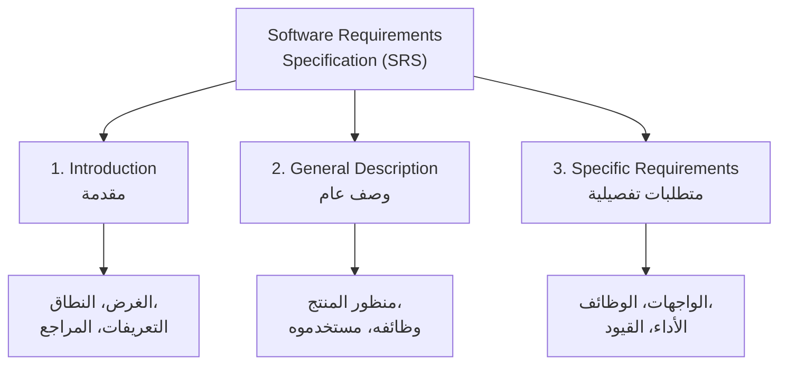

**شرح العناصر:**
- **Introduction:** يعرّف القارئ بالوثيقة نفسها — لماذا كُتبت ولمن.
- **General Description:** يعطي صورة عامة عن المنتج دون تفاصيل دقيقة.
- **Specific Requirements:** التفاصيل الدقيقة القابلة للاختبار (`testable`).

**شرح الروابط:**
- الأسهم تعني "يتفرّع إلى" — كل قسم رئيسي له أقسام فرعية أصغر.

**التطبيق في هذا السياق:**
هذا الهيكل هو الخريطة التي سنتبعها طوال المحاضرة؛ كل قسم لاحق هو تفصيل لأحد هذه الفروع.

---

#### 📖 الشرح

فكّر في الـ `SRS` مثل **عقد إيجار بيت**: قبل ما توقّع، لازم يكون فيه كل التفاصيل مكتوبة بوضوح (المساحة، السعر، الشروط) بحيث لا يقدر أي طرف يقول "أنا فاهم شي ثاني". نفس الفكرة في البرمجيات: الـ `SRS` هو "العقد" بين فريق التطوير والعميل، يحدد بالضبط شنو النظام المفروض يسويه.

معيار `IEEE 830` هو **قالب معياري عالمي** — بدل كل شركة تكتب الوثيقة بطريقتها الخاصة (وبالتالي يصعب على مهندس جديد يقرأها)، المعيار يعطي بنية موحدة يفهمها أي مهندس برمجيات في العالم بمجرد ما يشوف رقم القسم (مثلاً كل من يقرأ قسم `1.1` يعرف إنه `Purpose`).

**ملاحظة مهمة من المحاضرة:** ليس إلزامياً ملء كل قسم من قالب `IEEE 830` — لكن **يجب ترك عنوان القسم حتى لو فارغ**، بحيث يبقى الهيكل كاملاً ومعروفاً لأي قارئ لاحق.

#### 🎯 الملخص السريع
- `SRS` = وثيقة متطلبات البرمجيات
- `IEEE 830` = المعيار العالمي لبنيتها
- 3 أجزاء رئيسية: `Introduction` → `General Description` → `Specific Requirements`
- الأقسام الفارغة تبقى بعناوينها (لا تُحذف)

#### 📚 التطبيق
هذا الهيكل هو ما سيُستخدم في باقي المحاضرة لشرح كل قسم بالتفصيل، بدءاً من `Introduction`.

#### ⚠️ أخطاء شائعة

#### الفهم الخاطئ ❌:
الطالب يعتقد أن `SRS` مجرد قائمة ميزات (`features list`) بسيطة يكتبها المطوّر لنفسه.

#### الفهم الصحيح ✅:
`SRS` وثيقة رسمية موجهة لعدة أطراف (`stakeholders`) — عميل، محلل، مطوّر، مختبِر — ولكل طرف يحتاج يفهم منها شيئاً مختلفاً؛ لهذا شكلها موحّد ودقيق وليس ملاحظات عشوائية.

#### 📄 النص الأصلي من المحاضرة
<details>
<summary>عرض النص الأصلي (coverage: 100%)</summary>

> "Software Requirements Documents = Software Requirements Specification (SRS). IEEE Standard 830: Introduction, General Description, Specific Requirements. Not all parts are required, but at least leave the section title."

**ملاحظة على التغطية:**
- ✓ تم شرح بالكامل: تعريف SRS، الأجزاء الثلاثة، قاعدة الأقسام الفارغة
- ℹ️ إضافة من الدليل: تشبيه عقد الإيجار

</details>

---

### 2. البنية التفصيلية لقالب IEEE 830
<!-- @type: fact -->
<!-- @render: {type: "diagram-first", visualization: "hierarchy", coverage: "100%"} -->
<!-- @connectivity: {prerequisite: "1"} -->

#### 📍 أين نحن الآن؟
بعد فهم الأجزاء الثلاثة الكبرى، الآن نشوف كل قسم فرعي بالتفصيل قبل ما نغوص في الشرح.

#### ⬅️ الربط مع السابق
هذا القسم هو "خريطة الطريق" الكاملة — سنرجع له كل ما ننتقل لقسم جديد.

#### 💡 الفكرة الأساسية
**كل قسم رئيسي من الثلاثة ينقسم لأقسام فرعية مرقّمة هرمياً (1.1, 2.1.1, 3.6.2 ...)، وهذا الترقيم هو نفسه المستخدم في أي SRS مكتوب حول العالم.**

---

#### 📊 المخطط: القالب الكامل لـ IEEE 830

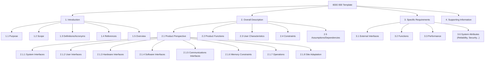

**شرح العناصر:**
- **الرقم الأول (1، 2، 3):** القسم الرئيسي.
- **الرقم الثاني (2.1):** قسم فرعي مباشر.
- **الرقم الثالث (2.1.1):** تفصيل أدق داخل القسم الفرعي.

**شرح الروابط:**
- كل سهم = "هذا القسم جزء من ذاك القسم" (علاقة احتواء `contains`، وليست تسلسل زمني).

**التطبيق في هذا السياق:**
في هذه المحاضرة سنركّز على القسم `1` كاملاً، ثم `2.1` (`Product Perspective` بكل فروعها الثمانية) و`2.2` (`Product Functions`). باقي الأقسام (`3.x`, `2.3`-`2.6`, `4`) تُشرح في محاضرات لاحقة.

#### 🎯 الملخص السريع
- الترقيم الهرمي (`1`, `1.1`, `2.1.1`) موحّد عالمياً في `SRS`
- `2.1 Product Perspective` له **8 أقسام فرعية** كلها عن الواجهات والقيود
- هذه المحاضرة تغطي: `Introduction` كاملاً + `2.1` كاملاً + `2.2`

#### 📚 التطبيق
استخدم هذا المخطط كمرجع سريع أثناء قراءة باقي المحاضرة لمعرفة "أين نحن" من القالب الكامل.

#### 📄 النص الأصلي من المحاضرة
<details>
<summary>عرض النص الأصلي (coverage: 100%)</summary>

> "1. Introduction (1.1 Purpose, 1.2 Scope, 1.3 Definitions, acronyms, abbreviations, 1.4 References, 1.5 Overview). 2. Overall description (2.1 Product perspective [2.1.1 System interfaces ... 2.1.8 Site adaptation requirements], 2.2 Product functions, 2.3 User characteristics, 2.4 Constraints, 2.5 Assumptions and dependencies, 2.6 Apportioning of requirements). 3. Specific requirements ... 4. Supporting information."

**ملاحظة على التغطية:**
- ✓ تم شرح كل مستويات الترقيم والأقسام المذكورة في السلايد
- ⚠️ لم يتم التوسّع في القسم 3 (Specific Requirements) و4 (Supporting Information) لأنهما خارج نطاق هذه المحاضرة (محاضرة قادمة)

</details>

---

### 3. القسم الأول من SRS: Introduction

#### 3.1 الغرض (Purpose)
<!-- @type: fact -->
<!-- @render: {type: "diagram-first", coverage: "100%"} -->
<!-- @connectivity: {prerequisite: "2"} -->

##### 📍 أين نحن الآن؟
ندخل الآن للقسم `1.1` — أول جزء فعلي يُكتب في أي `SRS`.

##### ⬅️ الربط مع السابق
بعد معرفة أن `Introduction` يحتوي 5 أقسام فرعية، نبدأ بأولها.

##### 💡 الفكرة الأساسية
**قسم `Purpose` يجيب على سؤال: "ليش كُتبت هذه الوثيقة، ولمن؟"**

---

##### 📊 المخطط: مكوّنات قسم Purpose

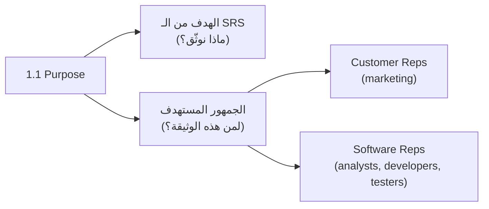

**شرح العناصر:**
- **الهدف:** جملة تشرح لماذا يوجد هذا المستند (مثلاً: توثيق متطلبات نظام مكتبة).
- **الجمهور:** كل `stakeholder` سيقرأ الوثيقة لسبب مختلف — العميل ليتأكد أن فهمه صحيح، والمطوّر ليبني عليها.

##### 📖 الشرح

قسم `Purpose` قصير لكنه مهم جداً لأنه أول شيء يقرأه أي شخص جديد على المشروع. يجب أن يجيب بوضوح عن سؤالين: **ما الذي نوثّقه هنا؟** و**من سيستخدم هذه الوثيقة؟**

في مثال المحاضرة (نظام مكتبة `ACME`)، الغرض هو توثيق متطلبات نظام إدارة مكتبة صغيرة إلى متوسطة، والجمهور هو كل `stakeholders`: ممثلو العميل (`marketing`) وممثلو الفريق التقني (`analysts, developers, testers`).

**الفائدة العملية:** توثيق المتطلبات في مرحلة مبكرة **يقلل خطر تأخر الجدول الزمني أو تجاوز الميزانية** — لأن كل الأطراف توافقت على نفس الفهم قبل ما يبدأ أحد بالكتابة.

##### 🎯 الملخص السريع
- `Purpose` = لماذا + لمن
- الجمهور دائماً يشمل: العميل (business) + الفريق التقني (technical)
- توثيق مبكر = مخاطر أقل لاحقاً

##### 📚 التطبيق
كل من يفتح الوثيقة لأول مرة يبدأ من هنا ليعرف إذا هذه الوثيقة تخصّه أو لا.

##### 📄 النص الأصلي من المحاضرة
<details>
<summary>عرض النص الأصلي (coverage: 100%)</summary>

> "The purpose of this software requirements specification is to capture requirements for developing a library management system for a small- to medium-sized library. The document is intended for use by all stakeholders involved in the development of such a system. Stakeholders include customer representatives (marketing personnel) and software representatives (analysts, developers, and testers)... Capturing requirements in the early stages of the development cycle reduces the risk of schedule slippage or budget overspending."

**ملاحظة على التغطية:**
- ✓ تم شرح الهدف، الجمهور، وفائدة التوثيق المبكر بالكامل

</details>

---

#### 3.2 النطاق (Scope)
<!-- @type: fact -->
<!-- @render: {type: "diagram-first", coverage: "100%"} -->
<!-- @connectivity: {prerequisite: "3.1"} -->

##### 📍 أين نحن الآن؟
بعد ما عرفنا "لماذا ولمن"، الآن نحدد "ما حدود النظام نفسه؟"

##### ⬅️ الربط مع السابق
`Purpose` تحدثت عن الوثيقة نفسها، أما `Scope` فتتحدث عن **المنتج** الذي توثّقه الوثيقة.

##### 💡 الفكرة الأساسية
**`Scope` يصف حدود النظام: ماذا يشمل النظام، ولمن هو مصمَّم، وما هي أهدافه العامة (وأحياناً ما لا يشمله).**

---

##### 📊 المخطط: حدود النطاق (In / Out of Scope)

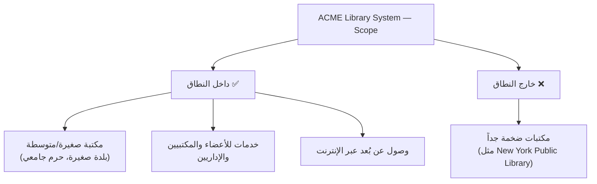

**شرح العناصر:**
- **داخل النطاق:** الوظائف والحجم الذي صُمّم النظام له فعلياً.
- **خارج النطاق:** حالات صريحة استُبعدت، لتجنّب أي توقعات خاطئة من العميل لاحقاً.

**التطبيق في هذا السياق:**
تحديد "خارج النطاق" بوضوح **يحمي فريق التطوير** — لو طلب العميل لاحقاً دعم مكتبة بحجم مكتبة نيويورك العامة، الفريق يرجع لهذه الفقرة ويقول "هذا لم يكن ضمن الاتفاق".

##### 📖 الشرح

`Scope` يجاوب على: **ما هو المنتج؟** و**ما هو حجم/سياق استخدامه؟** و**ما هدفه العام؟**

في المثال: النظام مصمم لمكتبة صغيرة/متوسطة (بلدة صغيرة أو حرم جامعي)، **وليس** لمكتبة ضخمة مثل مكتبة نيويورك العامة — هذا استبعاد صريح ومهم جداً لأنه يمنع سوء فهم لاحق. النظام يشمل الهاردوير والسوفتوير لدعم العمليات اليومية، ويخدم 3 أنواع مستخدمين: الأعضاء، المكتبيين، والإداريين، بالإضافة لخدمة المستخدمين عن بُعد عبر الإنترنت.

**الهدف العام** المذكور: نظام سريع الاستجابة (`responsive`)، فعّال (`efficient`)، موثوق (`reliable`)، سهل الاستخدام، وسهل الصيانة.

##### 🎯 الملخص السريع
- `Scope` = حدود المنتج (ماذا يشمل + ماذا لا يشمل)
- تحديد "خارج النطاق" يمنع سوء فهم لاحق مع العميل
- الأهداف العامة (performance, usability...) تُذكر هنا بشكل عام فقط (التفاصيل الدقيقة تأتي لاحقاً في `Specific Requirements`)

##### 📚 التطبيق
`Scope` يُستخدم كمرجع أول عند أي خلاف لاحق حول "هل هذه الميزة كانت ضمن المشروع أصلاً؟"

##### ⚠️ أخطاء شائعة

##### الفهم الخاطئ ❌:
الطالب يكتب `Scope` كوصف تقني مفصّل للميزات (مثل شرح كل شاشة بالتفصيل).

##### الفهم الصحيح ✅:
`Scope` يبقى على مستوى عام جداً — فقط الحدود والسياق والهدف الكلي؛ التفاصيل التقنية الدقيقة مكانها القسم الثالث (`Specific Requirements`).

##### 📄 النص الأصلي من المحاضرة
<details>
<summary>عرض النص الأصلي (coverage: 100%)</summary>

> "The ACME Library Management System is intended for use in a small- to medium-sized library, such as a library in a small town or on a college campus. It is not intended to support very large libraries such as the New York Public Library... The goal is to provide a system that is responsive, efficient, reliable, easy to use, and easy to maintain."

**ملاحظة على التغطية:**
- ✓ تم شرح الحدود، الاستبعاد الصريح، والأهداف العامة بالكامل

</details>

---

#### 3.3 التعريفات والاختصارات (Definitions, Acronyms, Abbreviations)
<!-- @type: fact -->
<!-- @render: {type: "diagram-first", coverage: "100%"} -->
<!-- @connectivity: {prerequisite: "3.2"} -->

##### 📍 أين نحن الآن؟
بعد تحديد الحدود، نحتاج نتأكد أن كل من يقرأ الوثيقة يفهم نفس الكلمات بنفس المعنى.

##### ⬅️ الربط مع السابق
هذا القسم "قاموس" صغير يُستخدم كمرجع لكل بقية الوثيقة.

##### 💡 الفكرة الأساسية
**هذا القسم يوحّد معنى كل مصطلح متخصص (`Definitions`) وكل اختصار (`Acronyms/Abbreviations`) يُستخدم في بقية الوثيقة، لمنع أي لبس بين القراء المختلفين.**

---

##### 📊 المخطط: تصنيف القسم 1.3

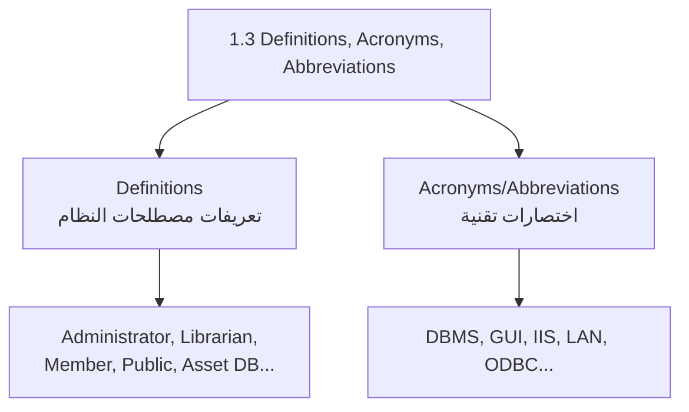

**شرح العناصر:**
- **Definitions:** مصطلحات خاصة بمجال النظام نفسه (مثل من هو "Member" داخل نظام المكتبة).
- **Acronyms/Abbreviations:** اختصارات تقنية عامة معروفة في الصناعة (`DBMS`, `GUI`...).

##### 📖 الشرح

الفكرة بسيطة: كلمة مثل "Member" قد تعني شيئاً مختلفاً لكل قارئ إذا لم تُعرَّف رسمياً. في مثال المكتبة، تم تعريف مصطلحات مثل: `Administrator` (المسؤول عن إدارة النظام)، `Librarian` (المسؤول عن خدمة الأعضاء)، `Member` (شخص لديه رقم عضوية وكلمة مرور)، و`Public` (شخص يصل من بعيد عبر الإنترنت).

بالإضافة لذلك، تُدرج الاختصارات التقنية المستخدمة لاحقاً في الوثيقة مثل `DBMS` (نظام إدارة قواعد البيانات)، `GUI` (واجهة المستخدم الرسومية)، `IIS` (خادم معلومات الإنترنت)، `LAN` (شبكة محلية)، و`ODBC` (اتصال قواعد بيانات مفتوح).

**الفائدة العملية:** لو مطوّر جديد انضم للمشروع بعد 6 أشهر، هذا القسم يوفر عليه أسئلة كثيرة لفريق العمل.

##### 🎯 الملخص السريع
- `Definitions` = مصطلحات خاصة بالنظام نفسه
- `Acronyms` = اختصارات تقنية عامة
- الهدف: توحيد الفهم بين كل القرّاء

##### 📚 التطبيق
أي مصطلح غامض في بقية الوثيقة، القارئ يرجع لهذا القسم أولاً.

##### 📄 النص الأصلي من المحاضرة
<details>
<summary>عرض النص الأصلي (coverage: 100%)</summary>

> "Administrator — a person responsible for administering the system. Librarian — a person responsible for serving the needs of the members. Member — a person that has a membership number and password... The following acronyms and abbreviations are used in this document: ADO, DBMS, GUI, IIS, LAN, ODBC."

**ملاحظة على التغطية:**
- ✓ تم ذكر كل المصطلحات والاختصارات المذكورة في السلايدات

</details>

---

#### 3.4 المراجع (References)
<!-- @type: fact -->
<!-- @render: {type: "diagram-first", coverage: "100%"} -->
<!-- @connectivity: {prerequisite: "3.3"} -->

##### 📍 أين نحن الآن؟
بعد توحيد المصطلحات، نوثّق أي مصادر خارجية استندنا إليها.

##### ⬅️ الربط مع السابق
هذا القسم قصير جداً لكنه يكمل "الشفافية" التي بدأناها في `Definitions`.

##### 💡 الفكرة الأساسية
**`References` قائمة بكل الوثائق، الكتب، أو الروابط (`URLs`) التي استند إليها هذا الـ `SRS`، بذكر العنوان، المؤلف، رقم الإصدار، التاريخ، والمصدر.**

---

##### 📊 المخطط: عناصر كل مرجع

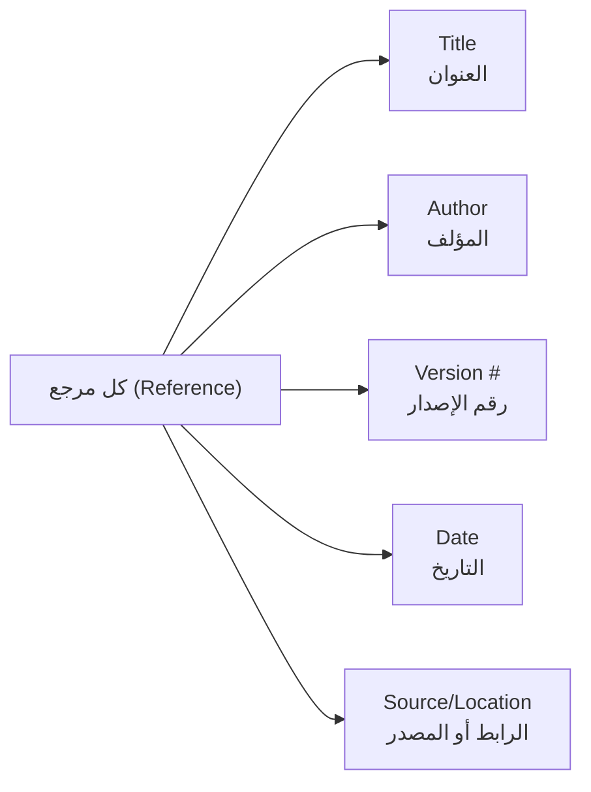

##### 📖 الشرح

هذا القسم إداري بحت — قائمة ببليوغرافية (`bibliography`) لكل وثيقة استُخدمت أثناء كتابة الـ `SRS`، مثل وثائق `Vision and Scope`، معايير تطوير داخلية، أو كتالوجات قواعد العمل. كل مرجع يجب أن يحتوي: العنوان، المؤلف، رقم الإصدار، التاريخ، ومكان الوصول إليه (رابط أو موقع).

**الفائدة العملية:** إذا احتاج القارئ التأكد من تفصيلة معينة أو خلفية قرار ما، يقدر يرجع للمصدر الأصلي مباشرة بدل ما يسأل الفريق.

##### 🎯 الملخص السريع
- قائمة توثيقية لكل مصدر خارجي استُخدم
- كل مرجع = عنوان + مؤلف + إصدار + تاريخ + مصدر

##### 📚 التطبيق
مفيد جداً في المشاريع الكبيرة التي تعتمد على معايير شركة أو وثائق سابقة.

##### 📄 النص الأصلي من المحاضرة
<details>
<summary>عرض النص الأصلي (coverage: 100%)</summary>

> "Any documents, books, URLs, etc to which this SRS refers including its title, author, version number, date, source or location of the resource." (مع أمثلة: Wiegers, Karl. Cafeteria Ordering System Vision and Scope Document...)

**ملاحظة على التغطية:**
- ✓ تم شرح الغرض والعناصر المطلوبة في كل مرجع

</details>

---

#### 3.5 نظرة عامة (Overview)
<!-- @type: fact -->
<!-- @render: {type: "diagram-first", coverage: "100%"} -->
<!-- @connectivity: {prerequisite: "3.4"} -->

##### 📍 أين نحن الآن؟
هذا آخر قسم فرعي في `Introduction`، ويُغلق الفصل الأول من الوثيقة.

##### ⬅️ الربط مع السابق
بعد كل التفاصيل التمهيدية (`Purpose`, `Scope`, `Definitions`, `References`)، نحتاج جسراً يوضح للقارئ ماذا سيجد في بقية الوثيقة.

##### 💡 الفكرة الأساسية
**`Overview` يصف محتوى وتنظيم بقية الوثيقة — خارطة طريق مختصرة قبل الغوص في التفاصيل.**

---

##### 📊 المخطط: وظيفة قسم Overview

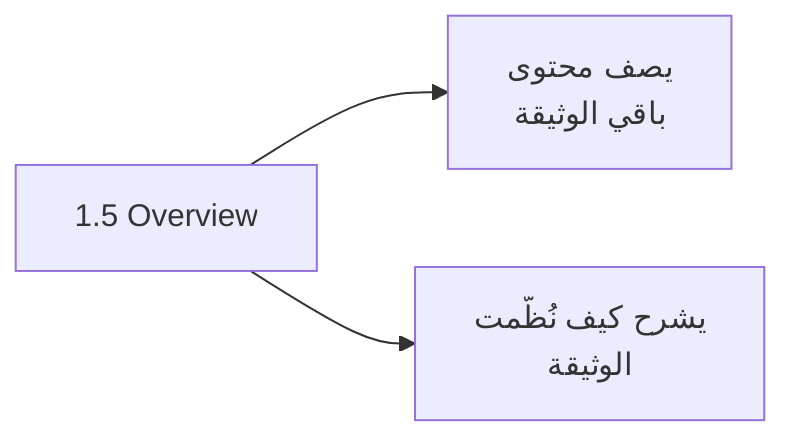

##### 📖 الشرح

هذا القسم بسيط: فقرة قصيرة تشرح "القسم الثاني يتحدث عن كذا، القسم الثالث عن كذا..." — تماماً مثل جدول محتويات نصّي. في مثال المكتبة، يوضح أن القسم الثاني يصف النظام العام والافتراضات والقيود والمستخدمين، والقسم الثالث يحتوي المتطلبات التفصيلية اللازمة للاختبار.

**الفائدة العملية:** يساعد القارئ يقرر أين يذهب مباشرة إذا كان يبحث عن معلومة محددة، بدل ما يقرأ الوثيقة كاملة.

##### 🎯 الملخص السريع
- `Overview` = خارطة طريق لباقي الوثيقة
- يوضح "ماذا يحتوي" و"كيف نُظّم" كل قسم لاحق

##### 📚 التطبيق
يُقرأ آخر شيء في `Introduction`، ويهيّئ القارئ للانتقال لـ `Overall Description`.

##### 📄 النص الأصلي من المحاضرة
<details>
<summary>عرض النص الأصلي (coverage: 100%)</summary>

> "The remainder of this document describes the system requirements for the ACME library management system. The next section contains a description of the overall system, assumptions, dependencies, constraints, and its intended users. The third section on specific requirements contains a detailed description..."

**ملاحظة على التغطية:**
- ✓ تم شرح الهدف والمحتوى النموذجي لهذا القسم

</details>

---

### 🔗 مثال متكامل: كتابة قسم Introduction لنظام حقيقي
<!-- @type: example-for-topics-3.1-to-3.5 -->
<!-- @covers: Purpose + Scope + Definitions + References + Overview -->

#### 📌 السياق
تخيّل أنك مهندس متطلبات (`requirements engineer`) مكلّف بكتابة الـ `Introduction` كاملاً لنظام حجز مواعيد عيادة طبية صغيرة.

#### 💼 السيناريو (Real-World Example)
- **1.1 Purpose:** "توثيق متطلبات نظام حجز مواعيد لعيادة طبية واحدة. موجّه لصاحب العيادة، فريق التطوير، والممرضة المسؤولة عن الجدولة."
- **1.2 Scope:** "النظام يخدم عيادة واحدة بطبيب واحد فقط، وليس مستشفى متعدد الأقسام. يشمل حجز المواعيد وتذكيرات SMS."
- **1.3 Definitions:** "`Patient` = شخص لديه ملف طبي مسجّل. `Slot` = فترة زمنية متاحة للحجز."
- **1.4 References:** "معايير `HIPAA` لخصوصية البيانات الطبية (رابط)."
- **1.5 Overview:** "القسم القادم يصف كيف يتفاعل المريض والممرضة مع النظام."

#### 💡 كيف تجتمع المفاهيم؟
- **Purpose:** يحدد لماذا نكتب ولمن (صاحب العيادة + الفريق التقني)
- **Scope:** يستبعد صراحة "المستشفيات متعددة الأقسام" لمنع توقعات زائدة
- **Definitions:** توحّد فهم كلمة "Patient" و"Slot" بين الجميع
- **References:** تربط النظام بمعيار خصوصية طبي حقيقي
- **النتيجة:** أي شخص يفتح هذه الوثيقة يفهم خلال دقيقتين ماذا يبني الفريق ولمن، دون لبس

#### ⚠️ لو ما طبّقتهم صح؟
لو أُهمل `Scope` (مثلاً لم يُذكر أنه لعيادة واحدة فقط)، قد يتوقع صاحب العيادة لاحقاً أن يدعم النظام عدة أطباء وأقسام — وهذا نزاع مباشر على الميزانية والجدول الزمني، رغم أنه لم يكن جزءاً من الاتفاق أصلاً.

---

### 4. القسم الثاني من SRS: Overall Description — Product Perspective (2.1)
<!-- @type: fact -->
<!-- @render: {type: "diagram-first", visualization: "flowchart", coverage: "100%"} -->
<!-- @connectivity: {prerequisite: "3.5"} -->

#### 📍 أين نحن الآن؟
انتهينا من `Introduction`، وندخل الآن للقسم الثاني: `Overall Description`، وتحديداً أول جزء فيه: `Product Perspective`.

#### ⬅️ الربط مع السابق
بعد ما عرفنا "لماذا الوثيقة" و"ما حدود النظام" بشكل عام (`Scope`)، الآن نضع النظام **في سياقه الأوسع**: هل هو منتج جديد كلياً؟ نسخة محدّثة؟ جزء من نظام أكبر؟

#### 💡 الفكرة الأساسية
**`Product Perspective` يصف سياق المنتج (منتج جديد؟ نسخة تالية؟ جزء من نظام أكبر؟) ويحدد الأوضاع (`modes`) المختلفة التي يعمل بها النظام لكل نوع مستخدم.**

---

#### 📊 المخطط: أوضاع تشغيل نظام ACME

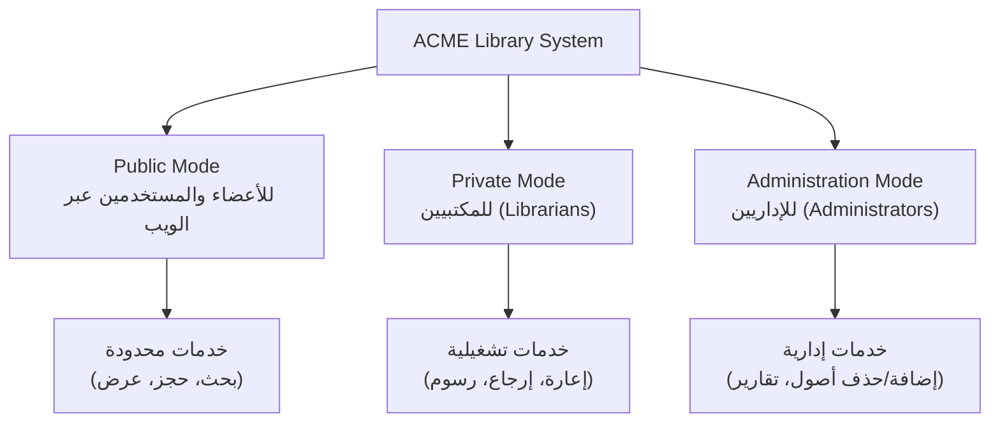

**شرح العناصر:**
- **Public Mode:** وضع مخصص للأعضاء والزوّار العاديين، صلاحيات محدودة.
- **Private Mode:** وضع المكتبي، صلاحيات تشغيلية أوسع.
- **Administration Mode:** وضع الإداري، أعلى صلاحية للتحكم بالنظام.

**شرح الروابط:**
- الأسهم من `Sys` إلى كل `Mode` تعني "النظام يوفر هذا الوضع".
- الأسهم من كل `Mode` إلى `Services` تعني "هذا الوضع يمنح هذه الخدمات فقط".

**التطبيق في هذا السياق:**
تقسيم الأوضاع (`modes`) بهذا الشكل **يتحكم بالوصول** (`access control`) ويحافظ على سلامة البيانات — كل مستخدم يرى فقط ما يخصّه.

---

#### 📖 الشرح

`Product Perspective` يجيب عادةً على سؤال: هل هذا المنتج مستقل تماماً (`self-contained`)، أم جزء من نظام أكبر؟ في حالة نظام `ACME`، هو نظام مستقل يوفر الهاردوير والسوفتوير والواجهات اللازمة لدعم مستخدميه.

النقطة الأهم هنا هي مفهوم **الأوضاع (`modes`)**: النظام نفسه (نفس الكود، نفس قاعدة البيانات) يتصرف بشكل مختلف حسب نوع المستخدم الذي دخل. هذا يشبه تطبيق بنكي واحد يعرض شاشة مختلفة تماماً للعميل العادي مقارنة بموظف الفرع — نفس النظام، صلاحيات وواجهات مختلفة.

يوجد أيضاً فئة رابعة غير مذكورة كـ "mode" رسمي لكنها مهمة: **المستخدم البعيد (`Remote User`)** الذي يتصفح موقع المكتبة عبر الإنترنت ويحصل على مجموعة فرعية من خدمات الأعضاء، بالإضافة لخدمات إضافية خاصة به مثل الحصول على الاتجاهات لموقع المكتبة.

#### 🎯 الملخص السريع
- `Product Perspective` = سياق المنتج (مستقل / جزء من نظام أكبر) + أوضاع التشغيل
- 3 أوضاع رئيسية: `Public`, `Private`, `Administration`
- كل وضع له خدمات مختلفة = تحكم بالصلاحيات

#### 📚 التطبيق
هذا القسم يُبنى عليه لاحقاً 8 أقسام فرعية (`2.1.1` إلى `2.1.8`) تشرح تفاصيل كل نوع واجهة يحتاجها النظام.

#### ⚠️ أخطاء شائعة

#### الفهم الخاطئ ❌:
اعتقاد أن "الأوضاع" (`modes`) تعني نسخاً منفصلة من البرنامج لكل نوع مستخدم.

#### الفهم الصحيح ✅:
هو نفس النظام وقاعدة البيانات، لكن الصلاحيات والواجهة المعروضة تختلف حسب نوع تسجيل الدخول — تماماً مثل موقع واحد بحسابات مختلفة الصلاحيات.

#### 📄 النص الأصلي من المحاضرة
<details>
<summary>عرض النص الأصلي (coverage: 100%)</summary>

> "The ACME library management system provides the hardware, software, and interfaces to support the various system users. For each user type, the system will operate in a different mode: Public mode – for library members and users accessing the system via the Web. Private mode — for librarians. Administration mode — for administrators."

**ملاحظة على التغطية:**
- ✓ تم شرح مفهوم الأوضاع الثلاثة وفئة المستخدم البعيد
- ℹ️ إضافة من الدليل: تشبيه التطبيق البنكي

</details>

---

#### 4.1 واجهات النظام (System Interfaces) — 2.1.1
<!-- @type: fact -->
<!-- @render: {type: "diagram-first", coverage: "100%"} -->
<!-- @connectivity: {prerequisite: "4"} -->

##### 📍 أين نحن الآن؟
بعد فهم الأوضاع العامة، نبدأ بتصنيف أنواع الواجهات (`interfaces`) الأربعة التي سنفصّلها في الأقسام التالية.

##### ⬅️ الربط مع السابق
هذا القسم بمثابة "جدول المحتويات" لبقية الأقسام الفرعية (`2.1.2` إلى `2.1.5`).

##### 💡 الفكرة الأساسية
**واجهات النظام تصنَّف لأربعة أنواع: واجهات المستخدم، الهاردوير، السوفتوير، والاتصالات — وكل نوع يُشرح بالتفصيل في قسم فرعي منفصل.**

---

##### 📊 المخطط: تصنيف واجهات النظام

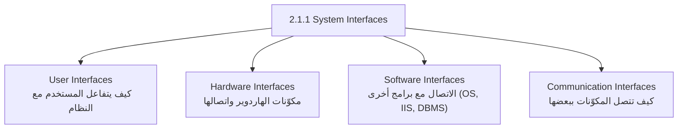

**شرح العناصر:**
- **User Interfaces:** الشاشات والتفاعل المباشر مع المستخدم.
- **Hardware Interfaces:** الأجهزة الفيزيائية (`PC`, قارئ باركود...).
- **Software Interfaces:** برامج أخرى يعتمد عليها النظام (نظام تشغيل، خادم، قاعدة بيانات).
- **Communication Interfaces:** الشبكات وطرق نقل البيانات بين المكوّنات.

##### 📖 الشرح

هذا القسم لا يشرح التفاصيل بنفسه، بل **يعرّف الفئات الأربع** التي ستُشرح لاحقاً كل واحدة في قسم مستقل. الفكرة أن أي نظام برمجي له نقاط اتصال (`interfaces`) مع 4 جهات مختلفة: المستخدم البشري، الأجهزة، برامج أخرى، والشبكة. تنظيم هذه الأنواع بشكل منفصل يجعل من السهل جداً على أي مهندس هاردوير مثلاً أن يقرأ فقط قسم `Hardware Interfaces` دون الحاجة لقراءة الوثيقة كاملة.

##### 🎯 الملخص السريع
- 4 أنواع واجهات: `User`, `Hardware`, `Software`, `Communication`
- هذا القسم فهرس فقط — التفاصيل في الأقسام التالية (`2.1.2` - `2.1.5`)

##### 📚 التطبيق
يُستخدم كخريطة سريعة لأي مهندس يريد معرفة أي قسم يخصّ تخصّصه.

##### 📄 النص الأصلي من المحاضرة
<details>
<summary>عرض النص الأصلي (coverage: 100%)</summary>

> "System interfaces for the ACME library management system include interfaces of the following types: User interfaces..., Hardware interfaces..., Software interfaces..., Communication interfaces..."

**ملاحظة على التغطية:**
- ✓ تم شرح كل الأنواع الأربعة المذكورة

</details>

---

#### 4.2 واجهات المستخدم (User Interfaces) — 2.1.2
<!-- @type: fact -->
<!-- @render: {type: "diagram-first", coverage: "100%"} -->
<!-- @connectivity: {prerequisite: "4.1"} -->

##### 📍 أين نحن الآن؟
أول تفصيل من الأنواع الأربعة: كيف يتفاعل المستخدم البشري مع النظام فعلياً.

##### ⬅️ الربط مع السابق
هذا تفصيل مباشر للفئة الأولى المذكورة في `2.1.1`.

##### 💡 الفكرة الأساسية
**كل واجهات المستخدم في نظام ACME تُنفَّذ بصيغة `HTML` وتُعرض داخل متصفح إنترنت، بنفس الشكل العام لكل أنواع المستخدمين.**

---

##### 📊 المخطط: مبدأ التوحيد في واجهة المستخدم

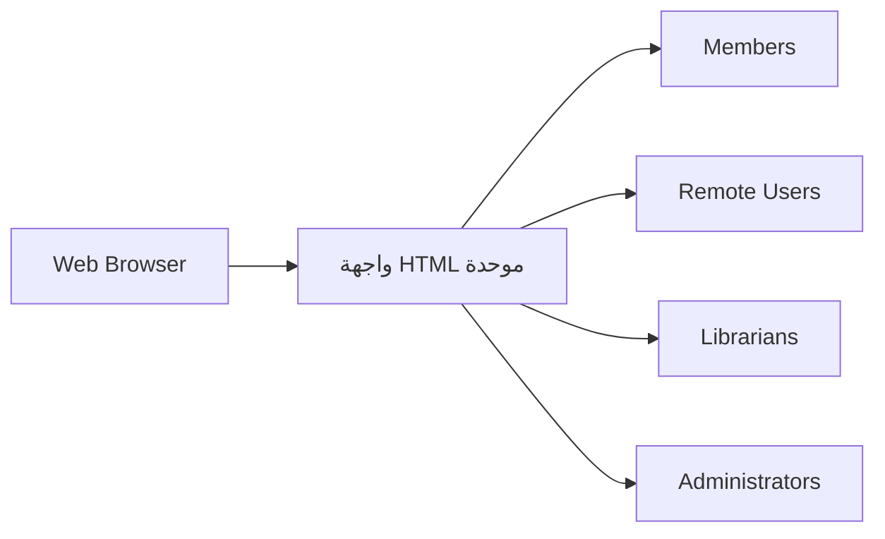

**شرح العناصر:**
- **HTML موحدة:** نفس أسلوب التصميم (`look-and-feel`) لكل الفئات، رغم اختلاف الصلاحيات.

##### 📖 الشرح

القرار التصميمي هنا واضح: **واجهة واحدة متسقة (`consistent GUI`)** لكل أنواع المستخدمين، لأن المكتبة تخدم شريحة عامة واسعة الخلفيات، فالواجهة يجب أن تكون بديهية (`intuitive`) وسهلة الاستخدام للجميع. استخدام `HTML` داخل متصفح يعني أن المستخدم لا يحتاج تثبيت أي برنامج إضافي.

##### 🎯 الملخص السريع
- الواجهة = `HTML` داخل متصفح
- نفس التصميم العام لكل المستخدمين (فقط الصلاحيات تختلف)
- الأولوية: البساطة والوضوح لجمهور عام غير تقني بالضرورة

##### 📚 التطبيق
هذا يبسّط الصيانة لاحقاً — تحديث تصميم واحد يؤثر على كل الفئات دفعة واحدة.

##### 📄 النص الأصلي من المحاضرة
<details>
<summary>عرض النص الأصلي (coverage: 100%)</summary>

> "All user interfaces are implemented in HTML format and displayed inside an Internet web browser. Because the system is designed to support members of the public from a wide variety of backgrounds, the graphical user interface (GUI) will be designed to be both intuitive and easy-to-use. The same look-and-feel will be used for members, remote users, librarians, and administrators."

**ملاحظة على التغطية:**
- ✓ تم شرح النقاط الثلاث: التقنية المستخدمة، سبب التصميم، وتوحيد الشكل

</details>

---

#### 4.3 واجهات الهاردوير (Hardware Interfaces) — 2.1.3
<!-- @type: fact -->
<!-- @render: {type: "diagram-first", coverage: "100%"} -->
<!-- @connectivity: {prerequisite: "4.2"} -->

##### 📍 أين نحن الآن؟
الآن ننتقل من الشاشة (`software`) إلى الأجهزة الفيزيائية التي يتفاعل معها النظام.

##### ⬅️ الربط مع السابق
`User Interfaces` وصفت الشاشة، `Hardware Interfaces` تصف الجهاز الذي تعمل عليه هذه الشاشة، ونقاط الاتصال الفيزيائية الأخرى.

##### 💡 الفكرة الأساسية
**واجهات الهاردوير تحدد الأجهزة الفيزيائية وطريقة اتصالها بالنظام: بطاقات شبكة `Ethernet`، وقارئ الباركود المتصل بالمنفذ التسلسلي (`serial port`).**

---

##### 📊 المخطط: اتصالات الهاردوير

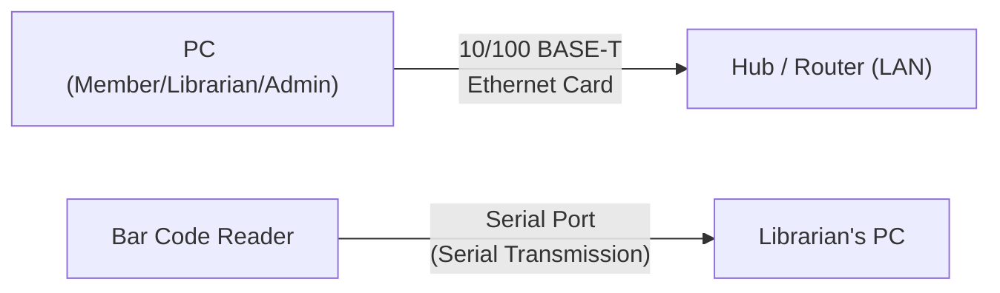

**شرح العناصر:**
- **بطاقة شبكة Ethernet:** تربط أي جهاز `PC` بالشبكة المحلية.
- **قارئ الباركود:** جهاز إضافي خاص بمكتب المكتبي فقط.

**شرح الروابط:**
- السهم الأول: كل `PC` يتصل بالشبكة عبر كرت شبكة `10/100 BASE-T`.
- السهم الثاني: قارئ الباركود يتصل مباشرة (وليس عبر الشبكة) بمنفذ تسلسلي على جهاز المكتبي فقط.

##### 📖 الشرح

هذا القسم عملي جداً ودقيق: يحدد نوع كرت الشبكة المطلوب (`10/100 BASE-T Ethernet`) لكل الأجهزة، بالإضافة إلى جهاز خاص (قارئ الباركود) يُستخدم فقط في مكتب المكتبي، ويتصل مباشرة عبر منفذ تسلسلي (`serial port`) وليس عبر الشبكة. هذا التفصيل الدقيق ضروري لفريق البنية التحتية (`infrastructure`) لأنه يحدد بالضبط ما يجب شراؤه وتركيبه.

##### 🎯 الملخص السريع
- كل `PC`: كرت شبكة `10/100 BASE-T`
- قارئ الباركود: يتصل عبر `serial port` في جهاز المكتبي فقط

##### 📚 التطبيق
يُستخدم مباشرة من قبل فريق الشراء والبنية التحتية لتجهيز الأجهزة قبل التركيب.

##### 📄 النص الأصلي من المحاضرة
<details>
<summary>عرض النص الأصلي (coverage: 100%)</summary>

> "Each PC will be equipped with a 10/100 BASE-T Ethernet network interface card that will enable the PC to connect to a hub or router on the LAN. The bar code reader will connect directly to the serial port on the librarian's PC and use serial transmission to communicate with the PC."

**ملاحظة على التغطية:**
- ✓ تم شرح كلا النقطتين المذكورتين بالكامل

</details>

---

#### 4.4 واجهات السوفتوير (Software Interfaces) — 2.1.4
<!-- @type: fact -->
<!-- @render: {type: "diagram-first", coverage: "100%"} -->
<!-- @connectivity: {prerequisite: "4.3"} -->

##### 📍 أين نحن الآن؟
بعد الأجهزة الفيزيائية، ننتقل لبرامج أخرى (خارج النظام نفسه) يعتمد عليها النظام للعمل.

##### ⬅️ الربط مع السابق
`Hardware Interfaces` وصفت الجهاز، `Software Interfaces` تصف البرامج التي تعمل فوق هذا الجهاز وتتفاعل مع نظامنا.

##### 💡 الفكرة الأساسية
**النظام يجب أن يتعامل (`interoperate`) مع 3 مكوّنات برمجية خارجية: نظام التشغيل، خادم معلومات الإنترنت (`IIS`)، ونظام إدارة قواعد البيانات (`DBMS`).**

---

##### 📊 المخطط: اعتمادية النظام على برامج خارجية

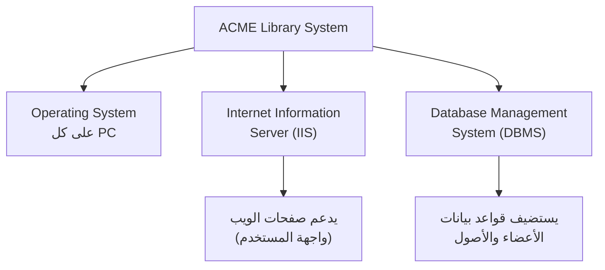

**شرح العناصر:**
- **Operating System:** يعمل على كل جهاز `PC` في النظام.
- **IIS:** يشغّل صفحات الويب التي تشكل واجهة المستخدم.
- **DBMS:** يخزّن بيانات الأعضاء والأصول ويعالج كل الاستعلامات.

##### 📖 الشرح

هذا القسم يذكر **البرامج الجاهزة (`off-the-shelf`) التي لن نبنيها نحن**، لكن نظامنا يعتمد عليها بشكل مباشر. `IIS` مسؤول عن تشغيل صفحات الويب (أي واجهة المستخدم التي شرحناها في `2.1.2`)، بينما `DBMS` يستضيف قواعد بيانات العضوية والأصول ويعالج كل استعلام يصدر من النظام.

**لماذا هذا مهم؟** لأن أي تغيير أو ترقية في هذه البرامج الخارجية (مثلاً تحديث إصدار `DBMS`) قد يؤثر مباشرة على عمل نظامنا — لذلك توثيقها هنا يجعل فريق الصيانة يتذكر هذه الاعتماديات (`dependencies`).

##### 🎯 الملخص السريع
- 3 اعتماديات: `Operating System`, `IIS`, `DBMS`
- `IIS` يخدم واجهة المستخدم، `DBMS` يخزن ويعالج البيانات

##### 📚 التطبيق
يُستخدم عند التخطيط لأي ترقية أو تغيير في البنية التقنية التحتية للنظام.

##### 📄 النص الأصلي من المحاضرة
<details>
<summary>عرض النص الأصلي (coverage: 100%)</summary>

> "The software developed for the ACME library management system must interoperate with several other software components in the system including: The operating system running on each PC, The Internet information server running on the administrator's PC, The DBMS running on the administrator's PC."

**ملاحظة على التغطية:**
- ✓ تم شرح كل الاعتماديات الثلاث ودور كل واحدة

</details>

---

#### 4.5 واجهات الاتصالات (Communications Interfaces) — 2.1.5
<!-- @type: fact -->
<!-- @render: {type: "diagram-first", coverage: "100%"} -->
<!-- @connectivity: {prerequisite: "4.4"} -->

##### 📍 أين نحن الآن؟
آخر نوع من أنواع الواجهات الأربعة: كيف تنتقل البيانات بين المكوّنات المختلفة والمستخدمين البعيدين.

##### ⬅️ الربط مع السابق
هذا القسم يجمع بين ما سبق: كيف يصل المستخدم البعيد (المذكور في `Product Perspective`) وكيف يتصل قارئ الباركود (المذكور في `Hardware Interfaces`) فعلياً.

##### 💡 الفكرة الأساسية
**واجهات الاتصالات تحدد طرق نقل البيانات بين النظام والمستخدمين البعيدين، وبين مكوّنات النظام الداخلية.**

---

##### 📊 المخطط: قنوات الاتصال

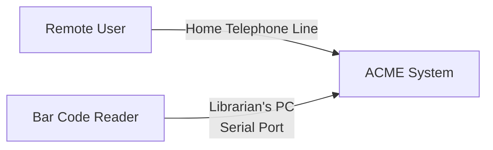

**شرح العناصر:**
- **خط الهاتف المنزلي:** طريقة وصول المستخدمين البعيدين لخدمات النظام عبر الإنترنت.
- **المنفذ التسلسلي:** تكرار مقصود من القسم السابق، لأنه أيضاً نوع من "قناة اتصال" بين جهازين.

##### 📖 الشرح

هذا القسم مختصر جداً في المثال، لكنه يجمع نقطتين مهمتين: كيف يصل **المستخدم البعيد** للنظام (عبر خط الهاتف المنزلي إلى الإنترنت)، وكيف يتصل **قارئ الباركود** بجهاز المكتبي (عبر المنفذ التسلسلي). الملاحظة هنا أن قارئ الباركود ذُكر في قسمين مختلفين (`Hardware` و`Communications`) لأنه في آنٍ واحد جهاز فيزيائي **وقناة اتصال**.

##### 🎯 الملخص السريع
- المستخدم البعيد يتصل عبر خط الهاتف المنزلي/الإنترنت
- قارئ الباركود يتصل عبر المنفذ التسلسلي (تكرار مرجعي من 2.1.3)

##### 📚 التطبيق
مهم لفريق الشبكات لتحديد نوع البنية التحتية اللازمة لدعم الوصول البعيد.

##### 📄 النص الأصلي من المحاضرة
<details>
<summary>عرض النص الأصلي (coverage: 100%)</summary>

> "The communication interfaces in the system include: Remote users use their home telephone lines to access the remote services provided by the ACME library management system. The bar code reader connects to the librarian's PC via the PC's serial port."

**ملاحظة على التغطية:**
- ✓ تم شرح كلا النقطتين المذكورتين

</details>

---

#### 4.6 قيود الذاكرة (Memory Constraints) — 2.1.6
<!-- @type: fact -->
<!-- @render: {type: "diagram-first", visualization: "comparison table", coverage: "100%"} -->
<!-- @connectivity: {prerequisite: "4.5"} -->

##### 📍 أين نحن الآن؟
بعد وصف كل الواجهات، ننتقل لقيد ملموس على الموارد: كم ذاكرة يحتاجها كل جهاز؟

##### ⬅️ الربط مع السابق
هذا القسم يحدد المتطلبات الفعلية للأجهزة التي وصفناها في `Hardware Interfaces`.

##### 💡 الفكرة الأساسية
**كل نوع جهاز (`PC`) له متطلب ذاكرة ومساحة تخزين مختلف حسب الدور — أجهزة الإدارة تحتاج موارد أكبر لأنها تُشغّل `IIS` و`DBMS`.**

---

##### 📊 المخطط: متطلبات الذاكرة لكل نوع جهاز

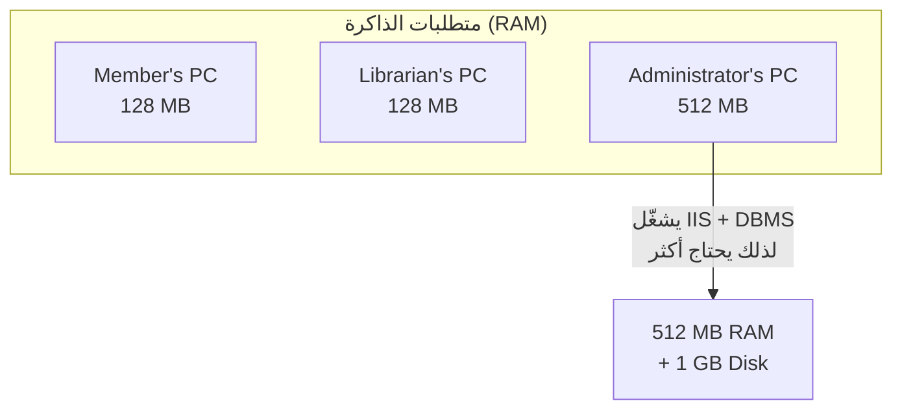

**شرح العناصر:**
- **جهاز العضو والمكتبي:** 128 ميجابايت ذاكرة، 200 ميجابايت تخزين.
- **جهاز الإداري:** 512 ميجابايت ذاكرة، 1 جيجابايت تخزين — أكبر بكثير لأنه يستضيف `IIS` و`DBMS`.

##### 📖 الشرح

هذا القسم يترجم القرارات المعمارية السابقة إلى **أرقام محددة**: جهاز العضو وجهاز المكتبي يحتاجان فقط 128 ميجابايت ذاكرة (لأنهما يعرضان صفحات ويب فقط)، بينما جهاز الإداري يحتاج 512 ميجابايت لأنه — كما ذُكر في `Software Interfaces` — يستضيف كلاً من `IIS` و`DBMS` في نفس الوقت. نفس المنطق ينطبق على مساحة القرص: 200 ميجابايت للأجهزة العادية مقابل 1 جيجابايت لجهاز الإداري.

**الفائدة العملية:** هذا يمنع مفاجأة لاحقة عند الشراء — فريق المشتريات يعرف بالضبط أي جهاز يحتاج ترقية.

##### 🎯 الملخص السريع
- Member's PC / Librarian's PC: 128 MB RAM, 200 MB Disk
- Administrator's PC: 512 MB RAM, 1 GB Disk (بسبب IIS + DBMS)

##### 📚 التطبيق
مرجع مباشر لفريق الشراء والبنية التحتية عند تجهيز الأجهزة.

##### 📄 النص الأصلي من المحاضرة
<details>
<summary>عرض النص الأصلي (coverage: 100%)</summary>

> "Member's PC — 128 MB. Librarian's PC — 128 MB. Administrator's PC — 512 MB. The larger memory size on the administrator's PC reflects the fact that this PC is running the IIS and the DBMS. Also, the administrator's PC has a much higher disk space requirement: 1 GB, as opposed to the disk space requirement of 200 MB for member and librarian PCs."

**ملاحظة على التغطية:**
- ✓ تم شرح كل الأرقام والسبب المنطقي وراء الفرق

</details>

---

#### 4.7 التشغيل (Operations) — 2.1.7
<!-- @type: practice -->
<!-- @render: {type: "diagram-first", coverage: "100%"} -->
<!-- @connectivity: {prerequisite: "4.6"} -->

##### 📍 أين نحن الآن؟
بعد تحديد الموارد التقنية، نصف الآن كيف يعمل النظام يومياً من الناحية التشغيلية.

##### ⬅️ الربط مع السابق
هذا القسم يبني على كل ما سبق (الواجهات والموارد) ليصف "السلوك اليومي" للنظام.

##### 💡 الفكرة الأساسية
**قسم `Operations` يوثّق أوقات التشغيل الطبيعية، إجراءات النسخ الاحتياطي، وإجراءات الاسترداد عند الأعطال — وهي ممارسة أساسية لضمان استمرارية العمل (`business continuity`).**

---

##### 📊 المخطط: دورة التشغيل اليومية والنسخ الاحتياطي

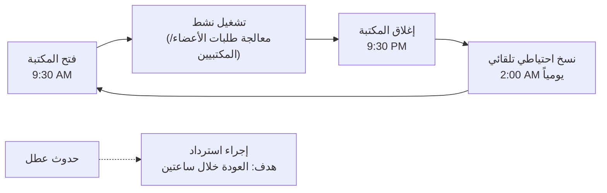

**شرح العناصر:**
- **ساعات التشغيل:** 9:30 صباحاً إلى 9:30 مساءً، وقت الذروة الذي يجب أن يتحمّله النظام دون تأخير.
- **النسخ الاحتياطي:** يحدث تلقائياً كل ليلة الساعة 2:00 صباحاً (خارج ساعات الذروة عمداً).
- **إجراء الاسترداد:** خطة مكتوبة للإداري لإعادة النظام للعمل خلال ساعتين من أي عطل.

##### 📖 الشرح

لماذا هذا `PRACTICE` وليس `FACT`؟ لأن **توثيق النسخ الاحتياطي والاسترداد** ليس تعريفاً موحداً بل **ممارسة هندسية جيدة مثبتة الفائدة** — أي نظام إنتاجي محترف يوثّق هذه النقاط، لكن التفاصيل (وقت النسخ، مدة الاسترداد) تختلف حسب سياق كل مشروع.

في مثالنا: النظام يجب أن يتحمّل طلبات متعددة من الأعضاء والمكتبيين دون رفض أي طلب خلال ساعات الذروة (9:30 صباحاً - 9:30 مساءً). النسخ الاحتياطي جدولته الساعة 2:00 صباحاً تحديداً — لأنها خارج ساعات العمل، فلا تؤثر على أداء النظام. وأخيراً، يوجد **هدف زمني واضح** للاسترداد بعد أي عطل: ساعتان فقط، وهذا رقم يمكن قياسه واختباره لاحقاً.

**لماذا مهم؟** لأن تحديد رقم واضح مثل "ساعتين" يحوّل هدفاً غامضاً ("النظام يجب أن يستعيد نفسه بسرعة") إلى **متطلب قابل للاختبار** (`testable requirement`).

##### 🎯 الملخص السريع
- ساعات التشغيل: 9:30 ص - 9:30 م، بدون تأخير أو فقدان طلبات
- نسخ احتياطي تلقائي: كل ليلة الساعة 2:00 ص
- هدف الاسترداد بعد عطل: خلال ساعتين

##### 📚 التطبيق
يُستخدم لاحقاً في القسم الثالث (`Specific Requirements → Reliability/Availability`) كأساس لمتطلبات قابلة للقياس.

##### ⚠️ أخطاء شائعة

##### الفهم الخاطئ ❌:
الاكتفاء بكتابة "النظام يجب أن يكون موثوقاً" دون أي رقم أو تفصيل.

##### الفهم الصحيح ✅:
كتابة أهداف قابلة للقياس مثل "الاسترداد خلال ساعتين" و"نسخة احتياطية يومياً الساعة 2:00 ص" — لأن المتطلب غير القابل للقياس لا يمكن اختباره لاحقاً.

##### 📄 النص الأصلي من المحاضرة
<details>
<summary>عرض النص الأصلي (coverage: 100%)</summary>

> "The system will experience most use during normal opening hours of the library 9:30 a.m. to 9:30 p.m... The database information will be automatically backed up each night at 2:00 a.m... A procedure will be developed to provide instructions for the administrator to perform a recovery operation... The objective of such a procedure will be to bring the system back into normal operation within two hours."

**ملاحظة على التغطية:**
- ✓ تم شرح كل النقاط الثلاث (ساعات التشغيل، النسخ الاحتياطي، الاسترداد)

</details>

---

#### 4.8 متطلبات التكيّف مع الموقع (Site Adaptation Requirements) — 2.1.8
<!-- @type: fact -->
<!-- @render: {type: "diagram-first", coverage: "100%"} -->
<!-- @connectivity: {prerequisite: "4.7"} -->

##### 📍 أين نحن الآن؟
آخر قسم فرعي في `Product Perspective`: كيف يتكيّف النظام مع البنية التحتية الموجودة مسبقاً في موقع التركيب.

##### ⬅️ الربط مع السابق
بعد وصف كل احتياجات النظام الجديدة، هذا القسم يصف **ما هو موجود مسبقاً** ويجب أن يتوافق معه النظام.

##### 💡 الفكرة الأساسية
**`Site Adaptation` يحدد أي بيانات أو إعدادات خاصة يجب تعديلها لتلائم موقع تركيب معين — مثل الاستفادة من شبكة أو بوابة إنترنت موجودة مسبقاً بدل بناء واحدة جديدة.**

---

##### 📊 المخطط: التكيّف مع البنية التحتية الموجودة

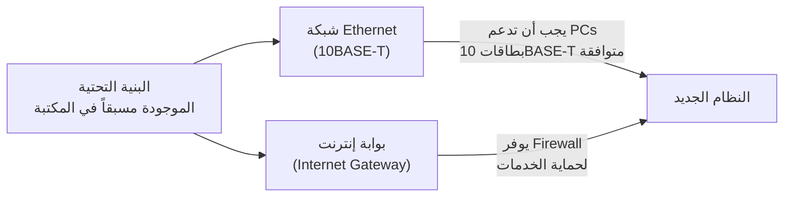

**شرح العناصر:**
- **الشبكة الموجودة:** شبكة `10BASE-T`، والنظام الجديد يجب أن تكون أجهزته متوافقة معها (وليس العكس).
- **بوابة الإنترنت الموجودة:** تُستخدم كما هي، وتوفر جدار حماية (`firewall`) يحمي من وصول غير مصرّح للمستخدمين البعيدين.

##### 📖 الشرح

هذا القسم يوضّح مبدأ مهم في هندسة الأنظمة: **لا تُعِد اختراع ما هو موجود مسبقاً**. بدل بناء شبكة جديدة، النظام يُصمَّم ليتوافق مع الشبكة الموجودة مسبقاً في المكتبة (نوع `10BASE-T`)، وبالمثل يستخدم بوابة الإنترنت الموجودة مسبقاً بدل تركيب واحدة جديدة. هذا يوفر تكلفة كبيرة، لكنه أيضاً **قيد** يجب أن يعرفه فريق التطوير: الأجهزة الجديدة يجب أن تكون متوافقة مع معيار الشبكة القديم تحديداً.

##### 🎯 الملخص السريع
- استخدام الشبكة الموجودة (`10BASE-T`) بدل شبكة جديدة
- استخدام بوابة الإنترنت الموجودة، التي توفر `firewall` جاهز

##### 📚 التطبيق
مهم عند التخطيط للتركيب الفعلي في مواقع مختلفة (كل مكتبة قد يكون لها بنية تحتية مختلفة قليلاً).

##### 📄 النص الأصلي من المحاضرة
<details>
<summary>عرض النص الأصلي (coverage: 100%)</summary>

> "The system will use the library's previously installed Ethernet network. The network is a 10BASE-T network and therefore the PCs will need to be equipped with network interface cards that support the 10BASE-T network type. The system will also use the library's existing Internet gateway. The gateway will connect to the library's network and provide firewall protection against remote users' accessing unauthorized services."

**ملاحظة على التغطية:**
- ✓ تم شرح كلا النقطتين (الشبكة والبوابة) بالكامل

</details>

---

### 🔗 مثال متكامل: من الواجهات الأربعة إلى نظام يعمل فعلياً
<!-- @type: example-for-topics-4.1-to-4.8 -->
<!-- @covers: System/User/Hardware/Software/Communications Interfaces + Memory + Operations + Site Adaptation -->

#### 📌 السياق
عضو مكتبة اسمه أحمد يريد حجز كتاب من بيته مساءً الساعة 8:00.

#### 💼 السيناريو (Real-World Example)
1. أحمد يفتح متصفحه (`User Interface — HTML`) من بيته.
2. طلبه يمر عبر خط الهاتف/الإنترنت إلى بوابة المكتبة (`Communications Interface` + `Site Adaptation — existing gateway`).
3. البوابة تمرّر الطلب عبر `firewall` إلى خادم `IIS` (`Software Interface`) الذي يعمل على جهاز الإداري (`Hardware Interface` — 512 MB RAM لأنه يستضيف IIS+DBMS).
4. `IIS` يستعلم من `DBMS` (`Software Interface`) عن حالة الكتاب المطلوب.
5. النتيجة تُعرض لأحمد كصفحة `HTML` مطابقة تماماً لواجهة المكتبي والإداري في الشكل العام.

#### 💡 كيف تجتمع المفاهيم؟
- **System/User Interfaces:** كل تفاعل أحمد يمر عبر واجهة ويب موحدة.
- **Hardware/Software Interfaces:** الخادم يحتاج ذاكرة كافية (512 MB) لأنه يشغّل IIS وDBMS معاً.
- **Communications:** الاتصال يمر عبر خط هاتفي واتصال إنترنت، وليس شبكة داخلية.
- **Site Adaptation:** كل هذا يعتمد على بوابة إنترنت **كانت موجودة مسبقاً** في المكتبة.
- **النتيجة:** طلب حجز واحد بسيط في الواقع يمر عبر 4 أنواع واجهات مختلفة تعمل معاً بسلاسة.

#### ⚠️ لو ما طبّقتهم صح؟
لو لم يُوثَّق قيد الذاكرة (512 MB) بدقة، قد يُشترى جهاز إداري بمواصفات أضعف، فيتباطأ `IIS` و`DBMS` معاً عند الذروة، ويشعر أحمد وكل الأعضاء بالبطء دون أن يعرف الفريق السبب الجذري — لأن الوثيقة لم تربط بين "من يستضيف ماذا" و"كم يحتاج من موارد".

---

### 5. وظائف المنتج (Product Functions) — 2.2
<!-- @type: fact -->
<!-- @render: {type: "diagram-first", visualization: "hierarchy", coverage: "100%"} -->
<!-- @connectivity: {prerequisite: "4.8"} -->

#### 📍 أين نحن الآن؟
بعد وصف كل الواجهات والبنية التحتية، ننتقل الآن لخلاصة عملية: ماذا يفعل النظام فعلياً لكل نوع مستخدم؟

#### ⬅️ الربط مع السابق
هذا القسم يترجم "الأوضاع" (`modes`) التي ذكرناها في `Product Perspective` إلى قائمة وظائف ملموسة لكل وضع.

#### 💡 الفكرة الأساسية
**`Product Functions` ملخص عالي المستوى للوظائف الرئيسية لكل فئة مستخدم — منظّمة بطريقة يفهمها القارئ من أول مرة دون تفاصيل تقنية.**

---

#### 📊 المخطط: وظائف كل نوع مستخدم

```mermaid
graph TD
    PF["2.2 Product Functions"]

    PF --> Mem["Members"]
    Mem --> M1["Check checked-out status"]
    Mem --> M2["Search for asset"]
    Mem --> M3["Reserve asset"]
    Mem --> M4["View events / floor map / info"]

    PF --> Rem["Remote Users"]
    Rem --> R1["Search for asset"]
    Rem --> R2["Get library directions"]
    Rem --> R3["View events / floor map / info"]

    PF --> Lib["Librarians"]
    Lib --> L1["Check out / check in asset"]
    Lib --> L2["Assess & collect fees"]
    Lib --> L3["Print overdue notices"]
    Lib --> L4["Determine asset/member status"]
    Lib --> L5["Read cards via bar code reader"]

    PF --> Adm["Administrators"]
    Adm --> A1["Manage library assets"]
    Adm --> A2["Maintain membership"]
    Adm --> A3["Generate reports"]
```

**شرح العناصر:**
- **Members:** وظائف تخص العضو الحاضر فعلياً في المكتبة.
- **Remote Users:** مجموعة جزئية من وظائف الأعضاء + ميزة إضافية (الاتجاهات للمكتبة).
- **Librarians:** وظائف تشغيلية يومية (إعارة، رسوم، إشعارات).
- **Administrators:** وظائف إدارية عليا (إدارة الأصول والعضوية والتقارير).

**شرح الروابط:**
- كل سهم من `PF` إلى فئة مستخدم يعني "هذه الوظائف متاحة فقط لهذه الفئة" — ربط مباشر بمفهوم `modes` من `Product Perspective`.

**التطبيق في هذا السياق:**
هذا المخطط هو أول مكان في الوثيقة يقارن **بوضوح جنباً إلى جنب** بين صلاحيات الفئات الأربع، وهو مرجع سريع ممتاز عند تصميم شاشات النظام لاحقاً.

---

#### 📖 الشرح

لاحظ الفرق الدقيق بين **Members** و**Remote Users**: كلاهما يمكنه البحث عن أصل، وعرض الأحداث والخريطة والمعلومات العامة، وحجز أصل — لكن **Remote Users** يحصلون على ميزة إضافية غير متاحة للأعضاء الحاضرين فعلياً: الحصول على اتجاهات للوصول للمكتبة من موقعهم. هذا مثال جميل على كيف يمكن لفئتين متشابهتين أن تملكا وظائف متقاطعة جزئياً وليست متطابقة 100%.

أما **Librarians** فوظائفهم عملية بحتة تخص إدارة الإعارة اليومية: تسجيل الدخول والخروج للأصول (`check in/out`)، تحصيل الرسوم المتأخرة، طباعة إشعارات التأخير، والتحقق من حالة الأصول والأعضاء — بالإضافة لاستخدام قارئ الباركود (المذكور سابقاً في `Hardware Interfaces`) لقراءة بطاقات العضوية وأرقام الأصول بسرعة بدل الإدخال اليدوي.

أما **Administrators** فوظائفهم على مستوى أعلى: إدارة الأصول (إضافة/حذف)، صيانة قاعدة بيانات العضوية، وتوليد التقارير — وهذا يتوافق تماماً مع كونهم يعملون في `Administration Mode` الذي وصفناه سابقاً.

#### 🎯 الملخص السريع
- 4 فئات مستخدمين، كل واحدة لها قائمة وظائف مختلفة
- `Remote Users` ⊂ `Members` تقريباً + ميزة "الاتجاهات"
- `Librarians` = عمليات يومية، `Administrators` = إدارة عليا

#### 📚 التطبيق
هذه القائمة هي المرجع الأساسي عند تصميم شاشات النظام وقوائم الصلاحيات (`permissions`) لاحقاً في مرحلة التصميم.

#### 📄 النص الأصلي من المحاضرة
<details>
<summary>عرض النص الأصلي (coverage: 100%)</summary>

> "Members: Check the status of checked-out assets, Search for an asset, Reserve an asset... Remote User: Search for an asset, Get library directions... Librarian: Check out or check in an asset, Assess and collect fees, Print overdue notices... Administrator: Manage library assets, Maintain membership, Generate reports."

**ملاحظة على التغطية:**
- ✓ تم ذكر كل الوظائف لكل الفئات الأربع كما وردت في السلايدات

</details>

---

#### ملاحظة:
هذه المحاضرة (رقم 10) تنتهي عند هذا الحد وتُكمل شرح باقي أقسام معيار `IEEE 830` (`2.3 User Characteristics` وما بعدها) في المحاضرة القادمة، كما ذُكر صراحة في آخر سلايد: "Next Lecture .. Continue with IEEE of SRS".

---

## الجزء الثاني: ملخص شامل (Alternative Complete Reading)

خلّينا نمر على كل الموضوع من أوله بطريقة سهلة، بدون تقسيمات كثيرة، كأنك تسولف مع زميل يشرحلك المحاضرة.

الموضوع كله يدور حول شيء اسمه الـ `SRS`، أو `Software Requirements Specification`. تخيّل إنك بتبني بيت، وقبل ما تبدأ البناء لازم يكون عندك مخطط مكتوب فيه كل التفاصيل — كم غرفة، وين الحمامات، شنو نوع الأبواب — عشان ما يصير خلاف بينك وبين المقاول لاحقاً. الـ `SRS` هو بالضبط هذا المخطط، بس للبرمجيات. هو وثيقة مكتوبة توثّق كل متطلبات النظام، وتصير مثل "عقد" بين فريق التطوير والعميل، بحيث الكل متفق من البداية شنو النظام المفروض يسويه بالضبط.

المشكلة إن كل شركة أو فريق ممكن يكتب هذه الوثيقة بطريقته الخاصة، وهذا يخلي القراءة صعبة لأي شخص جديد يدخل المشروع. عشان كذا، فيه معيار عالمي اسمه `IEEE 830` يعطي قالباً موحداً — بحيث أي مهندس برمجيات في أي مكان في العالم، لو شاف قسم رقم `1.1` في أي `SRS`، يعرف مباشرة إنه قسم الـ `Purpose`. المعيار مبني من ثلاثة أجزاء رئيسية: `Introduction` (المقدمة)، `General Description` (الوصف العام)، و`Specific Requirements` (المتطلبات التفصيلية). النقطة المهمة اللي لازم تتذكرها: مو كل قسم إلزامي تعبّيه بمحتوى، لكن لازم على الأقل تسيب عنوان القسم موجود، عشان الهيكل يضل كامل ومعروف لأي قارئ لاحق.

خلّينا ندخل بالتفصيل بقسم الـ `Introduction`، اللي فيه خمسة أقسام فرعية. أول قسم هو `1.1 Purpose`، ووظيفته يجاوب على سؤالين بسيطين: ليش كتبنا هذه الوثيقة، ولمن هي موجهة؟ في مثال المحاضرة، اللي هو نظام مكتبة اسمه `ACME Library Management System`، الهدف كان توثيق متطلبات نظام إدارة مكتبة صغيرة إلى متوسطة، والجمهور المستهدف يشمل كل الـ `stakeholders` — يعني ممثلي العميل (زي فريق التسويق) وممثلي الفريق التقني (المحللين، المطورين، المختبِرين). والفايدة العملية من توثيق المتطلبات بدري، إنها تقلل خطر تأخر الجدول الزمني أو زيادة التكلفة عن الميزانية، لأن الكل يتفق من البداية بدل ما يكتشفون سوء فهم بعد ما نصف المشروع خلص.

بعدها يجي `1.2 Scope`، وهذا يختلف عن `Purpose` — بينما `Purpose` يتكلم عن الوثيقة نفسها، `Scope` يتكلم عن **المنتج** اللي الوثيقة توثقه. في المثال، نظام `ACME` مصمم لمكتبة صغيرة أو متوسطة، زي مكتبة بلدة صغيرة أو حرم جامعي، وتذكر الوثيقة بشكل صريح إنه **مو** مصمم لمكتبات ضخمة جداً زي مكتبة نيويورك العامة. هذا الاستبعاد الصريح مهم جداً — لأنه يحمي الفريق لاحقاً، لو العميل طلب دعم حجم أكبر بكثير، الفريق يرجع لهذه الفقرة ويقول "هذا ما كان جزء من الاتفاق". النظام بشكل عام يشمل الهاردوير والسوفتوير للعمليات اليومية، ويخدم الأعضاء والمكتبيين والإداريين، بالإضافة لمستخدمين بعيدين عبر الإنترنت. والهدف العام المذكور: نظام سريع الاستجابة، فعّال، موثوق، سهل الاستخدام وسهل الصيانة.

القسم الثالث `1.3 Definitions, Acronyms, Abbreviations` هو أساساً قاموس صغير. الفكرة إن كلمة زي "Member" ممكن تعني شي مختلف لكل قارئ لو ما عُرِّفت رسمياً، فالقسم يحدد معنى كل مصطلح: `Administrator` هو المسؤول عن إدارة النظام، `Librarian` مسؤول عن خدمة الأعضاء، `Member` شخص عنده رقم عضوية وباسورد، و`Public` شخص يوصل من بعيد عبر الإنترنت. بالإضافة لهذا، فيه قائمة اختصارات تقنية زي `DBMS` (نظام إدارة قواعد بيانات)، `GUI` (واجهة رسومية)، `IIS` (خادم معلومات إنترنت)، `LAN` (شبكة محلية)، و`ODBC`.

بعدين يجي `1.4 References`، وهذا قسم بسيط جداً، بس قائمة بكل المصادر الخارجية اللي استند إليها الفريق أثناء كتابة الوثيقة — كتب، وثائق، روابط — وكل مرجع لازم يحتوي العنوان والمؤلف ورقم الإصدار والتاريخ والمصدر. وآخر قسم فرعي في الـ `Introduction` هو `1.5 Overview`، وهذا يشتغل مثل خارطة طريق مختصرة — يشرح شنو محتوى بقية الوثيقة وكيف نُظّمت، عشان القارئ يقدر يعرف وين يروح مباشرة لو يدور على معلومة معينة.

بعد ما خلصنا من `Introduction`، ننتقل للقسم الثاني اللي اسمه `Overall Description`، وبالتحديد أول جزء فيه اللي هو `2.1 Product Perspective`. هذا القسم يحط النظام في سياقه: هل هو منتج مستقل تماماً، ولا جزء من نظام أكبر؟ في مثالنا، نظام `ACME` مستقل تماماً ويوفر كل الهاردوير والسوفتوير اللي يحتاجه. النقطة المهمة هنا هي مفهوم "الأوضاع" (`modes`) — نفس النظام، نفس الكود، بس يتصرف بشكل مختلف حسب نوع المستخدم اللي دخل. فيه ثلاثة أوضاع: `Public Mode` للأعضاء والمستخدمين اللي يدخلون عبر الويب، `Private Mode` للمكتبيين، و`Administration Mode` للإداريين. كل وضع يعطي مجموعة صلاحيات مختلفة، تماماً زي تطبيق بنكي واحد يعرض شاشة مختلفة للعميل العادي مقابل الموظف.

من هذا القسم، تتفرّع 8 أقسام فرعية تشرح أنواع الواجهات المختلفة اللي يحتاجها النظام. أولها `2.1.1 System Interfaces`، وهو فهرس بس — يصنّف الواجهات لأربعة أنواع: واجهات المستخدم، الهاردوير، السوفتوير، والاتصالات. بعده `2.1.2 User Interfaces`، اللي يشرح إن كل واجهات النظام تُنفَّذ بصيغة `HTML` وتُعرض داخل متصفح، وكلها بنفس الشكل العام (`look-and-feel`) لكل أنواع المستخدمين، عشان النظام يخدم شريحة عامة واسعة الخلفيات ولازم يكون بديهي وسهل.

`2.1.3 Hardware Interfaces` يحدد إن كل جهاز `PC` لازم يكون فيه كرت شبكة `Ethernet` نوع `10/100 BASE-T` عشان يتصل بالشبكة، وفيه جهاز إضافي — قارئ الباركود — اللي يتصل مباشرة عبر منفذ تسلسلي (`serial port`) بجهاز المكتبي بس. `2.1.4 Software Interfaces` يذكر إن النظام لازم يتعامل مع ثلاثة برامج خارجية جاهزة: نظام التشغيل اللي يشتغل على كل جهاز، خادم `IIS` اللي يشغّل صفحات الويب، و`DBMS` اللي يستضيف قواعد البيانات ويعالج كل الاستعلامات.

`2.1.5 Communications Interfaces` يجمع نقطتين: المستخدمين البعيدين يستخدمون خط الهاتف المنزلي للوصول للخدمات عبر الإنترنت، وقارئ الباركود يتصل بجهاز المكتبي عبر المنفذ التسلسلي (تكرار للنقطة السابقة، بس من زاوية "قناة اتصال"). `2.1.6 Memory Constraints` يحط أرقام دقيقة: جهاز العضو وجهاز المكتبي يحتاجان 128 ميجابايت ذاكرة و200 ميجابايت تخزين، بينما جهاز الإداري يحتاج 512 ميجابايت ذاكرة و1 جيجابايت تخزين — أكبر بكثير لأنه يشغّل `IIS` و`DBMS` سوا.

`2.1.7 Operations` يوثّق كيف يشتغل النظام يومياً: النظام يشتغل بشكل رئيسي بين الساعة 9:30 صباحاً و9:30 مساءً، ولازم يتحمّل طلبات متعددة من الأعضاء والمكتبيين بدون تأخير أو رفض طلبات. النسخ الاحتياطي يصير تلقائياً كل ليلة الساعة 2:00 صباحاً (خارج أوقات الذروة عمداً). ولو صار عطل، فيه إجراء استرداد هدفه إرجاع النظام للعمل الطبيعي خلال ساعتين بالضبط — وهذا رقم واضح يقدر الفريق يختبره لاحقاً، عكس عبارة غامضة زي "النظام يجب أن يكون موثوقاً". آخر قسم فرعي `2.1.8 Site Adaptation Requirements` يوضح إن النظام يستخدم الشبكة الموجودة مسبقاً في المكتبة (نوع `10BASE-T`) وبوابة الإنترنت الموجودة، اللي توفر جدار حماية (`firewall`) — بدل ما يبني الفريق بنية تحتية جديدة من الصفر.

وآخر قسم غطته المحاضرة هو `2.2 Product Functions`، اللي يلخّص وظائف كل فئة مستخدم. الأعضاء يقدرون: يشيكون على حالة الأصول المستعارة، يبحثون عن أصل، يحجزون أصل، ويشوفون الأحداث القادمة وخريطة المكتبة ومعلومات عامة. المستخدمين البعيدين عندهم نفس هذي الوظائف تقريباً، بس بدون بعض الميزات الحاضرة فعلياً، وعندهم ميزة إضافية: الحصول على اتجاهات للوصول للمكتبة. المكتبيين وظائفهم عملية: تسجيل دخول وخروج الأصول، تحصيل الرسوم المتأخرة، طباعة إشعارات التأخير، التحقق من حالة الأصول والأعضاء، واستخدام قارئ الباركود. والإداريين عندهم وظائف أعلى مستوى: إدارة الأصول، صيانة العضوية، وتوليد التقارير.

خلاصة القصة: الـ `SRS` وثيقة منظمة جداً وفق معيار `IEEE 830`، تبدأ بمقدمة عامة تعرّف الوثيقة (`Purpose`, `Scope`, `Definitions`, `References`, `Overview`)، ثم توصف المنتج بشكل عام (`Product Perspective` بكل واجهاته الثمانية، و`Product Functions`)، وباقي أقسام المعيار (زي `Specific Requirements`) تُشرح في محاضرات لاحقة. المحاضرة القادمة تكمل باقي أقسام معيار `IEEE 830` بدءاً من `2.3 User Characteristics`.

---

## الجزء الثالث: أسئلة اختيار من متعدد (MCQ)

### السؤال 1 (Easy)

**السؤال:** According to `IEEE Standard 830`, what are the three main parts of an SRS document?

أ) Design, Implementation, Testing
ب) Introduction, General Description, Specific Requirements
ج) Planning, Development, Deployment
د) Analysis, Coding, Maintenance

**الإجابة الصحيحة:** ب

**التعليل الكامل:**
- ❌ أ): هذه مراحل تطوير عامة، وليست أقسام وثيقة الـ SRS نفسها حسب المعيار.
- ✅ ب): المحاضرة ذكرت صراحة أن IEEE 830 يقسّم الوثيقة لثلاثة أجزاء: Introduction, General Description, Specific Requirements.
- ❌ ج): هذه أيضاً مراحل مشروع عامة، لا علاقة لها ببنية وثيقة SRS.
- ❌ د): هذه أنشطة تطوير برمجيات عامة، وليست أقسام SRS.

---

### السؤال 2 (Easy)

**السؤال:** What must you do with a section of the IEEE 830 template if it is not applicable to your project?

أ) Delete the section entirely from the document
ب) Merge it with the next available section
ج) Leave at least the section title in place
د) Replace it with a custom section name

**الإجابة الصحيحة:** ج

**التعليل الكامل:**
- ❌ أ): المحاضرة ذكرت صراحة أن الحذف الكامل غير مطلوب.
- ❌ ب): لا يوجد ذكر لدمج الأقسام في المحاضرة؛ الترقيم الهرمي يبقى ثابتاً.
- ✅ ج): النص الأصلي يقول: "Not all parts are required, but at least leave the section title" — أي يبقى العنوان حتى لو فارغ.
- ❌ د): تغيير الأسماء يكسر التوحيد الذي يوفره المعيار.

---

### السؤال 3 (Medium)

**السؤال:** In the ACME Library System example, why does the `1.2 Scope` section explicitly state the system is NOT intended for very large libraries like the New York Public Library?

أ) To describe a future feature planned for a later version
ب) To prevent misunderstanding about the system's intended size later
ج) To list a competitor's product for comparison
د) To satisfy a legal requirement for library software

**الإجابة الصحيحة:** ب

**التعليل الكامل:**
- ❌ أ): لا يوجد ذكر لهذا كخطة مستقبلية في المحاضرة.
- ✅ ب): استبعاد صريح لحجم كبير جداً يحمي الفريق من توقعات زائدة من العميل لاحقاً، وهذا هو الغرض من تحديد "خارج النطاق".
- ❌ ج): لم تُذكر أي منافسة أو مقارنة تجارية في هذا السياق.
- ❌ د): لا علاقة له بأي متطلب قانوني مذكور في المحاضرة.

---

### السؤال 4 (Medium)

**السؤال:** Which section of the SRS acts as a "dictionary" to unify the meaning of specialized terms and acronyms across all readers?

أ) 1.1 Purpose
ب) 1.2 Scope
ج) 1.3 Definitions, Acronyms, Abbreviations
د) 1.4 References

**الإجابة الصحيحة:** ج

**التعليل الكامل:**
- ❌ أ): Purpose يشرح لماذا وُجدت الوثيقة، وليس معاني المصطلحات.
- ❌ ب): Scope يحدد حدود المنتج، وليس تعريفات الكلمات.
- ✅ ج): هذا القسم يعرّف مصطلحات مثل Member وAdministrator، واختصارات مثل DBMS وGUI، لتوحيد الفهم بين كل القراء.
- ❌ د): References تسرد المصادر الخارجية، وليس تعريفات المصطلحات.

---

### السؤال 5 (Hard)

**السؤال:** In the ACME system's `Product Perspective`, what is the key difference between "Members" and "Remote Users" in terms of access mode?

أ) Remote Users have full administrative privileges while Members do not
ب) Members and Remote Users use completely separate software systems
ج) Both access a similar service set, but Remote Users get an additional directions feature via the Web
د) Remote Users can only view the system but cannot search for assets

**الإجابة الصحيحة:** ج

**التعليل الكامل:**
- ❌ أ): المحاضرة لم تذكر أي صلاحيات إدارية للمستخدمين البعيدين.
- ❌ ب): كلاهما يستخدم نفس النظام عبر الويب، وليس نظاماً منفصلاً.
- ✅ ج): المحاضرة ذكرت أن Remote Users يحصلون على مجموعة فرعية من خدمات الأعضاء مع ميزة إضافية: الحصول على اتجاهات للوصول للمكتبة.
- ❌ د): المستخدمون البعيدون يمكنهم البحث عن أصل حسب النص الأصلي.

---

### السؤال 6 (Medium)

**السؤال:** According to `2.1.6 Memory Constraints`, why does the Administrator's PC require significantly more RAM (512 MB) than a Member's or Librarian's PC (128 MB)?

أ) It stores backup copies of all member records locally
ب) It runs the IIS and DBMS software components
ج) It requires more RAM to run the bar code reader
د) It processes video files for the library's website

**الإجابة الصحيحة:** ب

**التعليل الكامل:**
- ❌ أ): لا ذكر لتخزين نسخ احتياطية محلية كسبب لزيادة الذاكرة.
- ✅ ب): النص الأصلي يقول صراحة إن حجم الذاكرة الأكبر يعكس أن هذا الجهاز يشغّل IIS وDBMS.
- ❌ ج): قارئ الباركود متصل بجهاز المكتبي وليس جهاز الإداري، ولا علاقة له بمتطلبات الذاكرة.
- ❌ د): لا ذكر لمعالجة فيديو في أي جزء من المحاضرة.

---

### السؤال 7 (Easy)

**السؤال:** What technology is used to implement all user interfaces in the ACME Library System?

أ) A native desktop application installed on each PC
ب) HTML displayed inside a web browser
ج) A mobile-only application
د) A command-line interface (CLI)

**الإجابة الصحيحة:** ب

**التعليل الكامل:**
- ❌ أ): المحاضرة ذكرت أن الواجهات تُعرض داخل متصفح، وليس تطبيق سطح مكتب مثبّت.
- ✅ ب): النص الأصلي يقول: "All user interfaces are implemented in HTML format and displayed inside an Internet web browser".
- ❌ ج): لا يوجد ذكر لتطبيق جوال في المحاضرة.
- ❌ د): واجهة سطر الأوامر تتعارض مع هدف السهولة لجمهور عام غير تقني.

---

### السؤال 8 (Medium)

**السؤال:** Which requirement in `2.1.7 Operations` is written as a measurable, testable target rather than a vague statement?

أ) "The system should be user-friendly"
ب) "The system will be capable of handling multiple client requests"
ج) "Recovery should bring the system back to normal operation within two hours"
د) "The system will be reliable during library hours"

**الإجابة الصحيحة:** ج

**التعليل الكامل:**
- ❌ أ): "سهل الاستخدام" عبارة غامضة غير قابلة للقياس مباشرة.
- ❌ ب): "التعامل مع طلبات متعددة" وصف عام بدون رقم محدد.
- ✅ ج): هذا هدف برقم واضح (ساعتين) يمكن اختباره فعلياً — هل استعاد النظام خلال ساعتين أم لا.
- ❌ د): "موثوق" كلمة عامة بدون معيار قياس واضح.

---

### السؤال 9 (Hard)

**السؤال:** The bar code reader is mentioned in both `2.1.3 Hardware Interfaces` and `2.1.5 Communications Interfaces`. What is the BEST explanation for this repetition?

أ) It is a documentation error that should be removed from one section
ب) The reader is both a physical device AND a communication channel, so each section covers a different aspect
ج) The two sections describe two completely different bar code readers
د) IEEE 830 requires every hardware device to be mentioned exactly twice

**الإجابة الصحيحة:** ب

**التعليل الكامل:**
- ❌ أ): هذا ليس خطأ توثيقي؛ كلا القسمين يخدم غرضاً مختلفاً حسب المحاضرة.
- ✅ ب): القسم الأول يصف الجهاز الفيزيائي واتصاله، والثاني يصفه كقناة اتصال بين جهازين — نفس العنصر من زاويتين مختلفتين.
- ❌ ج): لا يوجد ذكر لجهازين مختلفين في المحاضرة.
- ❌ د): لا توجد قاعدة كهذه مذكورة في معيار IEEE 830 كما شُرح بالمحاضرة.

---

### السؤال 10 (Medium)

**السؤال:** What is the primary purpose of the `1.5 Overview` section in an SRS?

أ) To list every function the system will perform in detail
ب) To describe what the rest of the document contains and how it is organized
ج) To define technical acronyms used later in the document
د) To specify hardware memory requirements for each user type

**الإجابة الصحيحة:** ب

**التعليل الكامل:**
- ❌ أ): تفاصيل الوظائف موجودة في أقسام لاحقة مثل Product Functions، وليس في Overview.
- ✅ ب): المحاضرة وصفته كخارطة طريق: "Describe what the rest of the SRS contains" و"Explain how the SRS organized".
- ❌ ج): تعريف الاختصارات مكانه قسم 1.3 وليس 1.5.
- ❌ د): متطلبات الذاكرة موجودة في قسم منفصل تماماً (2.1.6).

---

### السؤال 11 (Hard)

**السؤال:** A librarian scans a member's card using the bar code reader. Which TWO SRS sections together explain how this action is technically possible?

أ) 1.1 Purpose and 1.2 Scope
ب) 2.1.3 Hardware Interfaces and 2.1.5 Communications Interfaces
ج) 1.4 References and 1.5 Overview
د) 2.2 Product Functions only, with no interface section needed

**الإجابة الصحيحة:** ب

**التعليل الكامل:**
- ❌ أ): هذان القسمان يتحدثان عن الوثيقة والمنتج بشكل عام، وليس عن آلية اتصال الجهاز.
- ✅ ب): 2.1.3 يصف اتصال القارئ الفيزيائي عبر المنفذ التسلسلي، و2.1.5 يصفه كقناة اتصال — معاً يفسران كيف تعمل هذه العملية تقنياً.
- ❌ ج): References وOverview لا علاقة لهما بالتفاصيل التقنية لأجهزة الهاردوير.
- ❌ د): Product Functions تذكر فقط "أن" المكتبي يستخدم القارئ، لكن لا تشرح "كيف" يتصل تقنياً.

---

### السؤال 12 (Easy)

**السؤال:** Which user type in the ACME system is responsible for generating reports and maintaining membership records?

أ) Member
ب) Remote User
ج) Librarian
د) Administrator

**الإجابة الصحيحة:** د

**التعليل الكامل:**
- ❌ أ): الأعضاء لهم وظائف محدودة مثل البحث والحجز وعرض المعلومات فقط.
- ❌ ب): المستخدمون البعيدون لهم صلاحيات مشابهة للأعضاء مع ميزة الاتجاهات فقط.
- ❌ ج): المكتبيون مسؤولون عن الإعارة والرسوم والإشعارات، وليس التقارير أو صيانة العضوية.
- ✅ د): النص الأصلي يذكر أن الإداري مسؤول عن "Maintain membership" و"Generate reports".

---

### السؤال 13 (Medium)

**السؤال:** Why does `2.1.8 Site Adaptation Requirements` specify using the library's EXISTING Ethernet network and Internet gateway instead of installing new ones?

أ) New equipment was not available in the market at the time
ب) It leverages existing infrastructure, avoiding unnecessary cost and rework
ج) IEEE 830 legally forbids installing new network equipment
د) The existing network offers higher speed than any new alternative

**الإجابة الصحيحة:** ب

**التعليل الكامل:**
- ❌ أ): لا يوجد ذكر لأي نقص في توفر المعدات في السوق.
- ✅ ب): استخدام البنية التحتية الموجودة مسبقاً (الشبكة والبوابة) يوفر التكلفة ويتجنب إعادة العمل غير الضرورية — هذا مبدأ هندسي عام يشرحه هذا القسم.
- ❌ ج): IEEE 830 معيار توثيق، وليس قانوناً يمنع تركيب معدات جديدة.
- ❌ د): لا توجد مقارنة سرعة مذكورة في المحاضرة بين الشبكة القديمة والبدائل.

---

### السؤال 14 (Hard)

**السؤال:** Which statement BEST distinguishes the purpose of `1.2 Scope` from `2.1 Product Perspective`?

أ) Scope defines the product's boundaries and goals; Product Perspective places the product in a wider system context and defines its operating modes
ب) They are identical sections that simply appear twice in the document
ج) Scope is technical while Product Perspective is purely for marketing purposes
د) Product Perspective replaces the need for a Scope section entirely

**الإجابة الصحيحة:** أ

**التعليل الكامل:**
- ✅ أ): Scope (1.2) يحدد حدود المنتج وأهدافه العامة، بينما Product Perspective (2.1) يضع المنتج في سياق أوسع (مستقل أم جزء من نظام أكبر) ويحدد أوضاع التشغيل (modes) — وهذا الفرق واضح من تسلسل المحاضرة.
- ❌ ب): القسمان مختلفان تماماً في المحتوى والغرض، رغم التشابه الظاهري.
- ❌ ج): لا يوجد أي دليل في المحاضرة على أن أحدهما "تسويقي" فقط.
- ❌ د): كلا القسمين مطلوب حسب قالب IEEE 830 ولا يحل أحدهما محل الآخر.

---

### السؤال 15 (Medium)

**السؤال:** Which of the following is NOT one of the four interface types listed under `2.1.1 System Interfaces`?

أ) User interfaces
ب) Hardware interfaces
ج) Database schema interfaces
د) Communication interfaces

**الإجابة الصحيحة:** ج

**التعليل الكامل:**
- ❌ أ): واجهات المستخدم مذكورة صراحة كأحد الأنواع الأربعة.
- ❌ ب): واجهات الهاردوير مذكورة صراحة كأحد الأنواع الأربعة.
- ✅ ج): "Database schema interfaces" لم تُذكر كنوع منفصل في هذا القسم؛ الأنواع الأربعة هي User, Hardware, Software, Communication فقط.
- ❌ د): واجهات الاتصالات مذكورة صراحة كأحد الأنواع الأربعة.

---

### السؤال 16 (Medium)

**السؤال:** What backup schedule does the ACME system use for membership and asset data, according to `2.1.7 Operations`?

أ) Every hour during library opening hours
ب) Automatically every night at 2:00 a.m.
ج) Once a week on weekends only
د) Manually by the administrator whenever convenient

**الإجابة الصحيحة:** ب

**التعليل الكامل:**
- ❌ أ): النسخ الاحتياطي كل ساعة أثناء الدوام غير مذكور، وسيؤثر سلباً على الأداء أثناء الذروة.
- ✅ ب): النص الأصلي يذكر صراحة: "automatically backed up each night at 2:00 a.m."
- ❌ ج): لا ذكر لجدولة أسبوعية في المحاضرة.
- ❌ د): النسخ الاحتياطي تلقائي (automatic) وليس يدوياً حسب النص الأصلي.

---

## الجزء الرابع: بطاقات سؤال وجواب (Q&A Cards)

### البطاقة 1
**Q:** ما هو الاختصار `SRS` وماذا يعني؟
**A:** `Software Requirements Specification` — وثيقة توثّق متطلبات النظام البرمجي بالكامل.

### البطاقة 2
**Q:** ما هي الأجزاء الثلاثة الرئيسية في معيار `IEEE 830`؟
**A:** `Introduction`، `General Description`، و`Specific Requirements`.

### البطاقة 3
**Q:** ماذا تفعل لو قسم في القالب غير مطلوب لمشروعك؟
**A:** تترك عنوان القسم على الأقل، ولا تحذفه تماماً.

### البطاقة 4
**Q:** ما الفرق بين قسم `Purpose` وقسم `Scope`؟
**A:** `Purpose` يشرح لماذا وُجدت الوثيقة ولمن، و`Scope` يحدد حدود المنتج نفسه وأهدافه العامة.

### البطاقة 5
**Q:** لماذا كُتب صراحة أن نظام ACME "غير مخصص" لمكتبات ضخمة مثل New York Public Library؟
**A:** لمنع أي سوء فهم أو توقعات زائدة من العميل لاحقاً حول حجم النظام.

### البطاقة 6
**Q:** ما هي الأوضاع (`modes`) الثلاثة في نظام مكتبة ACME؟
**A:** `Public Mode` (للأعضاء)، `Private Mode` (للمكتبيين)، و`Administration Mode` (للإداريين).

### البطاقة 7
**Q:** بأي تقنية تُنفَّذ كل واجهات المستخدم في نظام ACME؟
**A:** بصيغة `HTML` تُعرض داخل متصفح إنترنت.

### البطاقة 8
**Q:** ما هي الأنواع الأربعة لواجهات النظام حسب قسم `2.1.1`؟
**A:** `User`, `Hardware`, `Software`, `Communication` interfaces.

### البطاقة 9
**Q:** لماذا يحتاج جهاز الإداري ذاكرة (512 MB) أكبر من جهاز العضو (128 MB)؟
**A:** لأنه يشغّل خادم `IIS` ونظام إدارة قواعد البيانات `DBMS` معاً.

### البطاقة 10
**Q:** متى يحدث النسخ الاحتياطي التلقائي لبيانات نظام ACME؟
**A:** كل ليلة الساعة 2:00 صباحاً.

### البطاقة 11
**Q:** ما هو الهدف الزمني لاستعادة النظام بعد حدوث عطل؟
**A:** إعادة النظام للعمل الطبيعي خلال ساعتين.

### البطاقة 12
**Q:** ما الفرق الرئيسي بين وظائف `Members` ووظائف `Remote Users`؟
**A:** متشابهة تقريباً، لكن `Remote Users` يحصلون على ميزة إضافية: الحصول على اتجاهات للوصول للمكتبة.

### البطاقة 13
**Q:** ما هي وظائف `Librarian` الرئيسية؟
**A:** إعارة/إرجاع الأصول، تحصيل الرسوم، طباعة إشعارات التأخير، والتحقق من حالة الأعضاء والأصول.

### البطاقة 14
**Q:** ما الغرض من قسم `Site Adaptation Requirements`؟
**A:** تحديد كيفية تكيّف النظام مع البنية التحتية الموجودة مسبقاً في الموقع (شبكة، بوابة إنترنت) بدل بناء واحدة جديدة.

---

## الجزء الخامس: ورقة المراجعة السريعة (Cheat Sheet)

### 5.1 جدول المقارنة السريعة — أنواع الواجهات (2.1.1 - 2.1.5)

| نوع الواجهة | ماذا تصف؟ | مثال من نظام ACME |
| --- | --- | --- |
| `User Interfaces` | تفاعل المستخدم البشري مع النظام | صفحات `HTML` داخل متصفح |
| `Hardware Interfaces` | الأجهزة الفيزيائية واتصالها | كرت `Ethernet`, قارئ باركود عبر `serial port` |
| `Software Interfaces` | برامج خارجية يعتمد عليها النظام | `Operating System`, `IIS`, `DBMS` |
| `Communications Interfaces` | قنوات نقل البيانات بين المكوّنات | خط هاتف للمستخدمين البعيدين |

### 5.2 القواعد الذهبية

- كل قسم في `IEEE 830` له رقم ثابت يفهمه أي مهندس برمجيات — **لا تُخترع أرقاماً جديدة**.
- الأقسام الفارغة تبقى بعناوينها، **لا تُحذف**.
- `Scope` يحدد أيضاً ما هو **خارج** النطاق، وليس فقط ما بداخله.
- كل متطلب تشغيلي جيد يُكتب برقم قابل للقياس (مثل "خلال ساعتين")، وليس بصفة غامضة (مثل "سريع").
- `Product Perspective` يحدد "الأوضاع" (`modes`) التي تتحكم بالصلاحيات، أما `Product Functions` فيسرد وظائف كل وضع بالتفصيل.

### 5.3 مرجع سريع للمصطلحات

| المصطلح الإنجليزي | المعنى بالعربي |
| --- | --- |
| `SRS` (Software Requirements Specification) | مواصفات متطلبات البرمجيات |
| `Stakeholders` | أصحاب المصلحة في المشروع |
| `Scope` | نطاق/حدود المشروع |
| `DBMS` (Database Management System) | نظام إدارة قواعد البيانات |
| `IIS` (Internet Information Server) | خادم معلومات الإنترنت |
| `GUI` (Graphical User Interface) | واجهة المستخدم الرسومية |
| `LAN` (Local Area Network) | شبكة محلية |
| `ODBC` (Open Database Connectivity) | اتصال قواعد بيانات مفتوح |
| `Modes` | أوضاع تشغيل النظام حسب نوع المستخدم |
| `Site Adaptation` | التكيّف مع بيئة/موقع تركيب معين |
