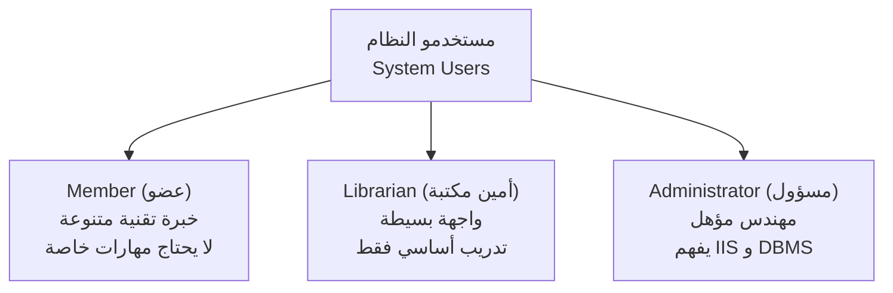
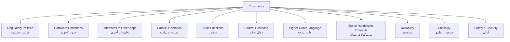
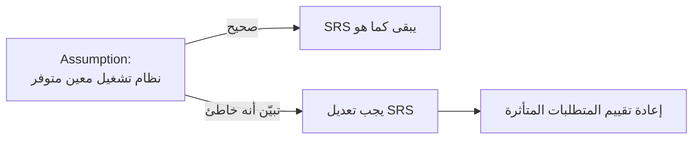
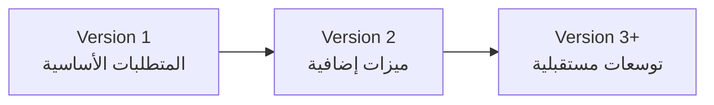
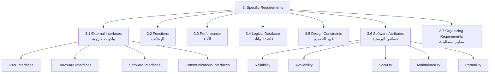
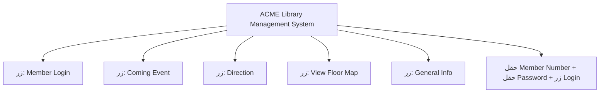
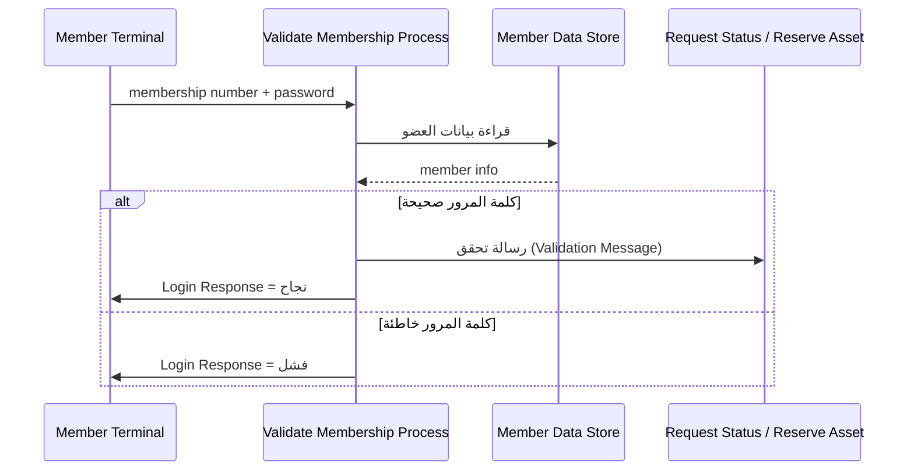

# المحاضرة 11 — Software Requirements Specification - 2 (وثيقة متطلبات البرمجيات - الجزء الثاني)
> **المادة:** هندسة البرمجيات (المستوى الثالث) | **الموضوع:** استكمال قالب IEEE لـ `SRS` — من User Characteristics إلى Specific Requirements

---

## ملخص سريع قبل البدء

**عن ماذا هذه المحاضرة؟**
تكمل هذه المحاضرة قالب `IEEE` لكتابة وثيقة `SRS` (Software Requirements Specification)، بالتركيز على البنود المتبقية من القسم الثاني (Overall Description) وبداية القسم الثالث (Specific Requirements)، مع مثال تطبيقي كامل على نظام مكتبة وهمي اسمه ACME.

**ليش يهمك؟**
هذه البنود هي التي تحوّل `SRS` من مجرد "وصف عام للمشروع" إلى وثيقة قابلة للتنفيذ والاختبار — فيها كل قيد، كل افتراض، وكل متطلب مفصّل يحتاج المصمم (Designer) والمختبر (Tester) أن يعرفه.

**المتطلبات السابقة:**
- المحاضرة الأولى عن `SRS` (Purpose, Scope, Product Perspective, System Interfaces)
- فهم أساسي لمفهوم `Requirements Engineering`

**الخيط الناظم:**
```
Product Perspective → User Characteristics → Constraints → Assumptions/Dependencies
    → Apportioning of Requirements → Specific Requirements (External Interfaces, Functions)
```

---

## الجزء الأول: الشرح التفصيلي

### 1. User Characteristics (خصائص المستخدمين)
<!-- @type: fact -->
<!-- @render: {type: "diagram-first", visualization: "hierarchy", coverage: "100%"} -->
<!-- @connectivity: {prerequisite: "Product Perspective"} -->

#### 📍 أين نحن الآن؟
بعد وصف بنية النظام (Product Perspective)، ننتقل لوصف **من سيستخدم هذا النظام**.

#### ⬅️ الربط مع السابق
وصفنا واجهات النظام (System/User Interfaces)؛ الآن نحدد لمن صُمّمت هذه الواجهات، لأن نوع المستخدم يفرض شكل الواجهة.

#### 💡 الفكرة الأساسية
**قسم User Characteristics يصف الخلفية التعليمية والخبرة التقنية للمستخدمين المتوقعين — ليس لكتابة متطلبات جديدة، بل لتبرير المتطلبات التي ستُكتب لاحقاً في القسم 3.**

---

#### 📊 المخطط: من يستخدم النظام؟



**الشرح:** كل فئة مستخدم لها مستوى خبرة مختلف، وهذا الفرق هو الذي يحدد لاحقاً تعقيد كل واجهة.

---

#### 📖 الشرح

هذا القسم **لا يكتب متطلبات مباشرة** — بل يشرح "لماذا" ستُكتب متطلبات معينة لاحقاً. مثلاً، لو قلنا إن المستخدم العادي (Member) "لا يحتاج أي مهارة خاصة"، فهذا يبرر لاحقاً متطلب مثل: "الواجهة يجب أن تكون بسيطة وبدون تعليمات تقنية معقدة".

في مثال `ACME Library System`، يوجد ثلاث فئات: الأعضاء (Members) من خلفيات تعليمية متنوعة ولا يحتاجون مهارات خاصة، أمناء المكتبة (Librarians) يحتاجون تدريباً أساسياً بسيطاً فقط، والمسؤول (Administrator) يجب أن يكون مهندساً مؤهلاً يفهم `Internet Information Server (IIS)` وأنظمة إدارة قواعد البيانات `DBMS`، وقادراً على التواصل مع الدعم الفني عند حدوث مشاكل.

لاحظ الفرق في مستوى الوصف: كلما زادت صلاحيات المستخدم (Admin > Librarian > Member)، زادت المهارة التقنية المطلوبة منه — وهذا نمط شائع في أغلب الأنظمة.

#### 🎯 الملخص السريع
- القسم يوصف المستخدمين، لا يكتب متطلبات
- كل فئة مستخدم = مستوى خبرة مختلف
- التبرير هنا يُستخدم لاحقاً في القسم 3 (Specific Requirements)

#### 📚 التطبيق
عند تصميم أي شاشة لاحقاً، ارجع لهذا القسم لتعرف: هل المستخدم مبتدئ (يحتاج واجهة مبسطة) أم خبير (يمكن أن تحتوي الواجهة على خيارات متقدمة)؟

#### ⚠️ أخطاء شائعة

#### الفهم الخاطئ ❌:
الطلاب أحياناً يكتبون في هذا القسم متطلبات فعلية مثل "يجب أن يستطيع العضو حجز كتاب".

#### الفهم الصحيح ✅:
هذا القسم وصفي فقط عن خصائص المستخدم (تعليم، خبرة، مهارة تقنية) — المتطلبات الفعلية مكانها القسم 3.

#### 📄 النص الأصلي من المحاضرة
<details>
<summary>عرض النص الأصلي (coverage: 100%)</summary>

> Describe those general characteristics of the intended users: educational level, experience, technical expertise. It should not be used to state specific requirements, but rather should provide the reasons why certain specific requirements are later specified in Section 3 of the SRS.

**ملاحظة على التغطية:**
- ✓ تم شرح التعريف والغرض بالكامل
- ✓ تم شرح المثال (ACME) الثلاث فئات
- ℹ️ إضافة من الدليل: المخطط الهرمي للمستخدمين

</details>

---

### 2. Constraints (القيود)
<!-- @type: fact -->
<!-- @render: {type: "diagram-first", visualization: "hierarchy", coverage: "95%"} -->
<!-- @connectivity: {prerequisite: "User Characteristics"} -->

#### 📍 أين نحن الآن؟
بعد تحديد من يستخدم النظام، نحدد الآن **ما الذي يقيّد** تصميم النظام من الخارج.

#### ⬅️ الربط مع السابق
بعد أن عرفنا المستخدمين، ننتقل للحدود التي يجب أن يعمل ضمنها النظام — قوانين، أجهزة، تطبيقات أخرى.

#### 💡 الفكرة الأساسية
**القيود (Constraints) هي كل عامل خارجي يحدّ من خيارات التصميم — من قوانين تنظيمية إلى حدود الذاكرة والأجهزة.**

---

#### 📊 المخطط: أنواع الـ Constraints



**الشرح:** هذه الأنواع الإحدى عشر تغطي كل الجوانب الخارجية التي قد تحدّ من حرية المصمم — من القانون إلى الأجهزة إلى الأمان.

---

#### 📖 الشرح

فكّر في الـ Constraints مثل "القواعد التي لا تستطيع كسرها" عند تصميم النظام — مو خيارات تصميمية، بل حدود مفروضة من الخارج. مثلاً، `Regulatory Policies` تعني أن النظام يجب أن يلتزم بقوانين معينة (مثل قوانين `FCC` لنقل البيانات عبر الإنترنت في المثال).

`Hardware Limitations` تحدد الحد الأدنى من موارد الجهاز (ذاكرة، تخزين) لكل نوع مستخدم — في مثال `ACME`، جهاز العضو والأمين يحتاجان 128 MB ذاكرة و200 MB تخزين، بينما جهاز المسؤول يحتاج 512 MB و1 GB لأنه يستضيف الخوادم.

أما `Criticality of the Application` فتحدد: هل فشل النظام يهدد حياة أحد (Life-threatening) أم لا؟ في مثال المكتبة، الفشل ليس خطيراً لكن التوفر المستمر (Availability) مهم — الهدف أن يعود النظام للعمل خلال ساعتين من أي عطل جسيم.

#### جدول الخصائص: أهم أنواع الـ Constraints

| النوع | ماذا يعني | مثال من ACME |
| --- | --- | --- |
| Regulatory Policies | الالتزام بقوانين رسمية | الالتزام بلوائح `FCC` لنقل البيانات |
| Hardware Limitations | حد أدنى من موارد الجهاز | Admin PC: 512 MB / 1 GB |
| Interfaces to Other Applications | التوافق مع أنظمة تشغيل/تطبيقات أخرى | يجب العمل على `Windows` مع `IIS` و`DBMS` |
| Reliability Requirements | ضمان استرجاع البيانات عند الفشل | نسخ احتياطي + سجل معاملات (Transaction Log) |
| Safety and Security | حماية الوصول والبيانات | Firewall + صلاحيات محدودة عبر البوابة |

#### 🎯 الملخص السريع
- Constraints = حدود خارجية مفروضة، ليست خيارات تصميم
- تشمل: قوانين، أجهزة، تطبيقات أخرى، أمان، موثوقية
- كل قيد يجب تبريره بذكر أثره على التصميم

#### 📚 التطبيق
عند كتابة أي متطلب لاحقاً في القسم 3، تحقق أنه لا يتعارض مع القيود المذكورة هنا (مثلاً لا تصمّم ميزة تحتاج ذاكرة أكبر من الحد المذكور في Hardware Limitations).

#### ⚠️ أخطاء شائعة

#### الفهم الخاطئ ❌:
الاعتقاد أن Constraints هي نفسها Design Decisions التي يختارها المصمم بحرية.

#### الفهم الصحيح ✅:
Constraints مفروضة من الخارج (قانون، عميل، أجهزة موجودة مسبقاً) — المصمم لا يملك خياراً بشأنها، فقط يلتزم بها.

#### 📄 النص الأصلي من المحاضرة
<details>
<summary>عرض النص الأصلي (coverage: 95%)</summary>

> Includes: Regulatory policies, Hardware limitations (e.g., signal timing requirements), Interfaces to other applications, Parallel operation, Audit functions, Control functions, Higher-order language requirements, Signal handshake protocols (e.g., XON-XOFF, ACK-NACK), Reliability requirements, Criticality of the application, Safety and security considerations.

**ملاحظة على التغطية:**
- ✓ تم شرح الأنواع الرئيسية مع أمثلة من ACME
- ⚠️ لم يُفصَّل بعمق: Signal Handshake Protocols (تقنية جداً وخارج نطاق هذا المستوى)
- ℹ️ إضافة من الدليل: جدول تلخيصي للمقارنة

</details>

---

### 3. Assumptions and Dependencies (الافتراضات والتبعيات)
<!-- @type: fact -->
<!-- @render: {type: "diagram-first", visualization: "flowchart", coverage: "100%"} -->
<!-- @connectivity: {prerequisite: "Constraints"} -->

#### 📍 أين نحن الآن؟
بعد القيود الثابتة، ننتقل الآن للعوامل **غير المؤكدة** التي قد تتغير مستقبلاً.

#### ⬅️ الربط مع السابق
القيود (Constraints) ثابتة ومفروضة، أما الافتراضات فهي أشياء "نتوقعها" لكنها قد لا تتحقق — والفرق بينهما مهم جداً.

#### 💡 الفكرة الأساسية
**الافتراض هو عامل خارجي غير مضمون، لو تغيّر يجب تعديل الـ SRS بأكمله وفقاً له — وهو ليس قيداً تصميمياً بل احتمالاً يجب مراقبته.**

---

#### 📊 المخطط: كيف يؤثر تغيّر الافتراض على SRS؟



**الشرح:** الافتراض الخاطئ لا يُكتشف إلا لاحقاً، وعندها يفرض تعديل الوثيقة — لهذا يجب توثيقه بوضوح من البداية.

---

#### 📖 الشرح

كل SRS يُبنى على بعض "الافتراضات" — مثلاً، افتراض أن نظام تشغيل معين سيكون متوفراً على الجهاز المستهدف. لو تبيّن أن هذا الافتراض خاطئ (مثلاً النظام غير متوفر فعلاً)، فإن الـ SRS يحتاج تعديلاً وفقاً لذلك.

الفرق الجوهري بين Constraints و Assumptions: الـ Constraint حقيقة ثابتة ومؤكدة (مثل: "يجب استخدام Windows")، بينما الـ Assumption توقّع قد يتغير (مثل: "نتوقع أن يبقى معدّل النمو في عدد المستخدمين كما هو"). في مثال ACME، الافتراض هو أن النظام سيستخدم المعدات المثبتة مسبقاً في المكتبة (الشبكة الموجودة وبوابة الإنترنت)، وأن التقنيات المستخدمة (IIS وDBMS) ستتطور بمرور الوقت وتُصدر نسخاً جديدة تحسّن الأداء وتفتح الباب لميزات جديدة.

#### 🎯 الملخص السريع
- Assumption = توقع غير مضمون، قد يتغير
- Dependency = اعتماد النظام على عامل خارجي (تقنية، جهاز، طرف ثالث)
- إذا تغيّر الافتراض، يجب مراجعة الـ SRS

#### 📚 التطبيق
عند ظهور مشكلة لاحقاً في المشروع (مثلاً تقنية توقفت أو تغيّرت)، أول مكان تراجعه هو قائمة Assumptions and Dependencies لمعرفة أي متطلبات تأثرت.

#### ⚠️ أخطاء شائعة

#### الفهم الخاطئ ❌:
الخلط بين Assumptions و Constraints واعتبارهما نفس الشيء.

#### الفهم الصحيح ✅:
Constraint = حد ثابت مفروض (لا نقاش فيه). Assumption = توقع منطقي لكن غير مؤكد، قد يتغير ويفرض تعديل الوثيقة.

#### 📄 النص الأصلي من المحاضرة
<details>
<summary>عرض النص الأصلي (coverage: 100%)</summary>

> List each of the factors that affect the requirements stated in the SRS. The factors are not design constraints on the software but are, rather, any changes to them that can affect the requirements in the SRS. For example, an assumption may be that a specific operating system will be available on the hardware designated for the software product. If, in fact, the operating system is not available, the SRS would then have to change accordingly.

**ملاحظة على التغطية:**
- ✓ تم شرح التعريف والفرق عن Constraints بالكامل
- ✓ تم شرح مثال ACME

</details>

---

### 4. Apportioning of Requirements (توزيع المتطلبات على الإصدارات)
<!-- @type: fact -->
<!-- @render: {type: "diagram-first", visualization: "flowchart", coverage: "100%"} -->
<!-- @connectivity: {prerequisite: "Assumptions and Dependencies"} -->

#### 📍 أين نحن الآن؟
آخر بند في القسم الثاني (Overall Description) قبل الانتقال إلى المتطلبات التفصيلية.

#### ⬅️ الربط مع السابق
بعد تحديد كل الافتراضات والقيود، نحدد الآن: هل كل المتطلبات ستُنفَّذ في النسخة الأولى، أم بعضها مؤجَّل لنسخ لاحقة؟

#### 💡 الفكرة الأساسية
**قسم Apportioning of Requirements يحدد أي المتطلبات قد تُؤجَّل إلى إصدارات مستقبلية من النظام، بدل تنفيذها كلها دفعة واحدة.**

---

#### 📊 المخطط: توزيع المتطلبات عبر الإصدارات



**الشرح:** بدل انتظار تنفيذ كل شيء دفعة واحدة، يُصمَّم النظام بحيث يسهل إضافة ميزات جديدة لاحقاً دون إعادة هيكلة كاملة.

---

#### 📖 الشرح

هذا القسم يجيب على سؤال: "هل كل هذا المطلوب في النسخة الأولى؟" — أحياناً بعض المتطلبات تكون مفيدة لكن ليست ضرورية للإطلاق الأول، فتُذكر هنا كمرشحة للتأجيل.

في مثال ACME، لم يُؤجَّل شيء صراحة، لكن التصميم بُني بحيث يسهل إضافة ميزات جديدة للأعضاء أو الأمناء أو المسؤولين لاحقاً، لأن الجمع بين `IIS` و`DBMS` يوفر آلية مرنة لاستخدام البيانات المخزنة بطرق جديدة مستقبلاً — أي أن التوسعية (Extensibility) نفسها جزء من التخطيط لتوزيع المتطلبات.

#### 🎯 الملخص السريع
- يحدد ما يُنفَّذ الآن مقابل ما يُؤجَّل لاحقاً
- يرتبط مباشرة بمرونة التصميم (Extensibility)
- ليس إلزامياً أن تُذكر متطلبات مؤجَّلة صراحة، لكن يجب توضيح قابلية التوسع

#### 📚 التطبيق
مفيد عند التخطيط لـ MVP (Minimum Viable Product) — يساعد الفريق على تحديد الأولويات بوضوح من بداية المشروع.

#### ⚠️ أخطاء شائعة

#### الفهم الخاطئ ❌:
تجاهل هذا القسم لأن "كل المتطلبات ستُنفَّذ على أي حال".

#### الفهم الصحيح ✅:
حتى لو نُفِّذت كل المتطلبات دفعة واحدة، هذا القسم يوثّق خطة التوسع المستقبلية ويجنّب إعادة التصميم لاحقاً.

#### 📄 النص الأصلي من المحاضرة
<details>
<summary>عرض النص الأصلي (coverage: 100%)</summary>

> Should identify requirements that may be delayed until future versions of the system.

**ملاحظة على التغطية:**
- ✓ تم شرح الغرض والمثال بالكامل

</details>

---

### 5. Specific Requirements (المتطلبات التفصيلية) — نظرة عامة
<!-- @type: fact -->
<!-- @render: {type: "diagram-first", visualization: "hierarchy", coverage: "100%"} -->
<!-- @connectivity: {prerequisite: "Apportioning of Requirements"} -->

#### 📍 أين نحن الآن؟
ننتقل من الوصف العام (Overall Description) إلى **القسم 3: Specific Requirements** — قلب وثيقة الـ SRS.

#### ⬅️ الربط مع السابق
كل ما سبق (خصائص المستخدمين، القيود، الافتراضات) كان تمهيداً يبرر ما سنكتبه الآن بالتفصيل الكامل.

#### 💡 الفكرة الأساسية
**القسم 3 يجب أن يحتوي على تفاصيل كافية تمكّن المصمم من تصميم النظام والمختبر من اختباره — أي وصف لكل input وكل output وكل دالة تربط بينهما.**

---

#### 📊 المخطط: مكونات Specific Requirements



**الشرح:** القسم 3 مقسّم لسبعة أبواب رئيسية، كل باب يغطي جانباً مختلفاً من التفاصيل التقنية اللازمة للتنفيذ.

---

#### 📖 الشرح

الفكرة الجوهرية هنا: كل input (مدخل) يدخل للنظام، وكل output (مخرج) يخرج منه، وكل دالة تربط بينهما، يجب أن تُوصَف بدقة كافية بحيث لا يحتاج المصمم أو المختبر لتخمين أي شيء.

في مثال `ACME`، القسم 3.1 (External Interfaces) يحدد أن كل واجهات المستخدم ستكون `HTML`-based وتُعرض داخل متصفح، ويقسّم الشاشات حسب نوع المستخدم: شاشات الأعضاء (تحقق العضوية، حجز أصل، بحث)، شاشات الأمناء (تسجيل استعارة/إرجاع، تقارير)، وشاشات المسؤول (إدارة الأصول، العضويات، التقارير). كما يحدد الواجهات الصلبة (Hardware) مثل بطاقات الشبكة `10/100BASE-T` وقارئ الباركود المتصل عبر المنفذ التسلسلي، والواجهات البرمجية (`Windows 2000`، `IIS`، `Microsoft SQL Server 2000` عبر `ODBC`/`ADO`).

#### 📊 المخطط: شاشة تسجيل الدخول (Login Screen) — من المحاضرة الأصلية

هذا مخطط توضيحي أعيد بناؤه من الصورة الأصلية في المحاضرة (صفحة 21، شاشة "Validate Membership"):



**الشرح:** الشاشة الأصلية تحتوي على قائمة أزرار جانبية (تنقّل عام) وصندوق تسجيل دخول منفصل (رقم عضوية + كلمة مرور)، وهذا مثال فعلي على كيف يترجم متطلب "3.1.1 User Interfaces" إلى تصميم شاشة حقيقي.

#### 🎯 الملخص السريع
- 3.1 External Interfaces: كل واجهة (مستخدم، هاردوير، سوفتوير، اتصالات)
- 3.2 Functions: الوظائف مفصّلة بـ Introduction → Inputs → Processing → Outputs → Error Handling
- 3.3–3.7: أداء، قاعدة بيانات، قيود تصميم، خصائص برمجية (Reliability/Security/…)، وطرق تنظيم المتطلبات

#### 📚 التطبيق
هذا القسم هو المرجع المباشر الذي يستخدمه المطوّر أثناء البرمجة والمختبِر أثناء كتابة حالات الاختبار (Test Cases).

#### ⚠️ أخطاء شائعة

#### الفهم الخاطئ ❌:
الاعتقاد أن وصف "الواجهة ستكون سهلة الاستخدام" كافٍ كمتطلب.

#### الفهم الصحيح ✅:
يجب تحديد كل شاشة على حدة (اسمها، حقولها، الأزرار)، لأن "سهل الاستخدام" غير قابل للاختبار (Not Testable) بينما "شاشة تحتوي على حقل Member Number وحقل Password وزر Login" قابلة للاختبار.

#### 📄 النص الأصلي من المحاضرة
<details>
<summary>عرض النص الأصلي (coverage: 90%)</summary>

> Should contain all of the software requirements to a level of detail sufficient to enable: designers to design a system to satisfy those requirements, testers to test that the system satisfies those requirements. These requirements should include at a minimum a description of every input (stimulus) into the system, every output (response) from the system, and all functions performed by the system in response to an input or in support of an output.

**ملاحظة على التغطية:**
- ✓ تم شرح البنية الكاملة (3.1 – 3.7) وأمثلة من ACME
- ⚠️ لم يُفصَّل بعمق: محتوى 3.3 حتى 3.7 (وردت كعناوين فقط في المحاضرة الأصلية بدون أمثلة)
- ℹ️ إضافة من الدليل: إعادة بناء شاشة الـ Login بـ Mermaid

</details>

---

### 6. Functions — مثال تطبيقي: Member Access Process
<!-- @type: practice -->
<!-- @render: {type: "diagram-first", visualization: "sequence", coverage: "95%"} -->
<!-- @connectivity: {prerequisite: "Specific Requirements Overview"} -->

#### 📍 أين نحن الآن؟
نطبّق الآن قالب "3.2 Functions" على مثال حقيقي من نظام ACME: عملية دخول العضو (Member Access).

#### ⬅️ الربط مع السابق
بعد أن عرفنا بنية القسم 3.2 نظرياً (Introduction → Inputs → Processing → Outputs → Error Handling)، نرى الآن كيف تُطبَّق عملياً.

#### 💡 الفكرة الأساسية
**كل دالة في النظام تُوصَف بأربعة عناصر: من أين تأتي مدخلاتها، كيف تعالجها، ماذا تُخرج، وكيف تتصل بالدوال الأخرى — وهذا بالضبط ما يفعله مثال Validate Membership.**

---

#### 📊 المخطط: تسلسل عملية Validate Membership



**الشرح:** العملية تقارن كلمة المرور المُدخلة مع المخزنة، وترسل رسالة تحقق فقط عند النجاح — لا رسالة تُرسل عند الفشل غير رد الدخول نفسه.

---

#### 📖 الشرح

هذا مثال ممتاز لكيفية توثيق دالة واحدة بشكل كامل. الغرض (Purpose): معالجة طلبات حالة العضو، طلبات البحث، والسماح بحجز الأصول، مع التحقق من العضوية عبر مقارنة كلمة المرور المُدخلة بالمخزنة في مخزن بيانات الأعضاء (الذي يتحدّث بدوره من الـ `DBMS`).

الـ Inputs: رقم العضوية وكلمة المرور من العضو + بيانات العضو من مخزن البيانات. الـ Processing: مقارنة كلمة المرور؛ لو تطابقت، تُرسَل رسالة تحقق (Validation Message) للعمليات الأخرى (Request Status وReserve Asset) لتستخدمها في التحقق من الطلبات، ولو لم تتطابق فلا تُرسَل أي رسالة. الـ Outputs: رسالة التحقق (تذهب للعمليتين الأخريين) + رد تسجيل الدخول (يذهب لشاشة العضو مباشرة يوضح النجاح أو الفشل).

نفس النمط يتكرر مع عملية "Request Status" التي تستقبل طلب حالة من العضو ورسالة تحقق من عملية Validate Membership، وتنتج رسالة حالة مُوَجَّهة للعضو، بعد أن تولّد طلب حالة مُتحقَّق منه يُرسَل للـ `DBMS`.

#### 🎯 الملخص السريع
- كل دالة = Purpose + Inputs + Processing + Outputs
- الدوال تتصل ببعضها عبر رسائل (Messages) — مثل validation message
- Error Handling ضمني هنا: لا رسالة = فشل التحقق (بدل رسالة خطأ صريحة)

#### 📚 التطبيق
هذا هو المستوى المطلوب من التفصيل عند كتابة أي دالة في القسم 3.2 من أي مشروع تخرج — بما فيه مشروع Rennello الخاص بك، حيث كل عملية (مثل تسجيل دخول ورشة أو حجز خدمة) تحتاج نفس هذا التفصيل: Inputs / Processing / Outputs / Error Handling.

#### ⚠️ أخطاء شائعة

#### الفهم الخاطئ ❌:
كتابة الوظيفة كجملة عامة مثل "النظام يتحقق من العضوية" بدون تفصيل المدخلات والمخرجات والرسائل المتبادلة.

#### الفهم الصحيح ✅:
كل وظيفة يجب أن تُفصَّل لدرجة أن مطوّراً آخر يستطيع برمجتها بدون أسئلة إضافية — من أين تأتي البيانات، وماذا يحدث بالضبط عند كل حالة (نجاح/فشل).

#### 📄 النص الأصلي من المحاضرة
<details>
<summary>عرض النص الأصلي (coverage: 95%)</summary>

> Validate membership (Process 1.1.1): This process validates a member's membership number and password. The member's membership number and password are compared to the information in the member data store for validity. Inputs: membership number and password from the member and member info from the member data store... Outputs: a validation message and a login response.

**ملاحظة على التغطية:**
- ✓ تم شرح Validate Membership وRequest Status بالكامل
- ⚠️ لم تُغطَّ: تفاصيل عملية Reserve Asset (لم ترد في شرائح المحاضرة المرفقة)
- ℹ️ إضافة من الدليل: مخطط Sequence Diagram لتوضيح تدفق الرسائل

</details>

---

## الجزء الثاني: ملخص شامل (Alternative Complete Reading)

بعد أن انتهينا من وصف بنية النظام العامة والمستخدمين في المحاضرة السابقة، هذه المحاضرة تكمل قالب `IEEE` لوثيقة `SRS` بأربعة بنود متبقية من القسم الثاني، ثم تفتح باب القسم الثالث الذي هو قلب الوثيقة كلها.

نبدأ بـ `User Characteristics`، وهو قسم لا يكتب أي متطلب مباشر، بل يصف من سيستخدم النظام من الناحية التعليمية والتقنية، لكي يُستخدم لاحقاً كتبرير للمتطلبات. في مثال مكتبة `ACME`، هناك ثلاث فئات: الأعضاء الذين قد يأتون من خلفيات تعليمية متنوعة تماماً ولا يُفترض أن يمتلكوا أي مهارة تقنية خاصة، أمناء المكتبة الذين يحتاجون فقط تدريباً أساسياً بسيطاً على الواجهة، والمسؤول الذي يجب أن يكون مهندساً مؤهلاً يفهم بعمق كل من خادم المعلومات على الإنترنت (`IIS`) وأنظمة إدارة قواعد البيانات (`DBMS`)، ويستطيع التواصل باحترافية مع جهات الدعم الفني عند حدوث مشاكل تقنية بعد إطلاق النظام. لاحظ كيف أن مستوى المهارة المطلوبة يتصاعد مع مستوى الصلاحيات — نمط شائع جداً في تصميم أي نظام له عدة أدوار مستخدمين.

بعدها ننتقل إلى `Constraints`، وهي القيود المفروضة من خارج فريق التصميم والتي لا يمكن التفاوض عليها أو تجاهلها. تشمل هذه القيود إحدى عشرة فئة: القوانين التنظيمية (Regulatory Policies) مثل الالتزام بلوائح `FCC` لنقل البيانات عبر الإنترنت، حدود الأجهزة (Hardware Limitations) التي تحدد بدقة الحد الأدنى من الذاكرة والتخزين لكل نوع مستخدم — فمثلاً جهاز العضو وجهاز الأمين يحتاجان 128 ميجابايت ذاكرة و200 ميجابايت تخزين، بينما جهاز المسؤول يحتاج موارد أكبر بكثير (512 ميجابايت و1 جيجابايت) لأنه يستضيف الخوادم الفعلية للنظام. كذلك هناك الواجهات مع تطبيقات أخرى (Interfaces to Other Applications)، حيث يجب أن يعمل كل شيء على نظام `Windows` ويتكامل مع `IIS` و`DBMS`. الفهم المهم هنا هو الفرق بين القيد (Constraint) الذي هو حقيقة ثابتة يجب الالتزام بها بلا نقاش، والافتراض (Assumption) الذي هو توقع منطقي قد يتغير.

هذا يقودنا مباشرة إلى `Assumptions and Dependencies`، وهي كل العوامل الخارجية غير المضمونة التي إذا تغيّرت، يجب إعادة النظر في الـ `SRS` بأكمله وتعديله وفقاً لذلك. المثال الكلاسيكي الذي تعطيه المحاضرة هو افتراض توفر نظام تشغيل معين على الجهاز المستهدف — فإذا اتضح لاحقاً أن هذا النظام غير متوفر فعلاً، فإن الوثيقة كلها تحتاج مراجعة. في مثال `ACME`، الافتراض هو استخدام المعدات المثبتة أصلاً في مبنى المكتبة (الشبكة وبوابة الإنترنت الموجودة)، مع توقع أن التقنيات المستخدمة (`IIS` و`DBMS`) ستتطور وتصدر نسخاً جديدة تفتح المجال لميزات أفضل مستقبلاً لكل من المسؤول والأمناء والأعضاء.

آخر بند في القسم الثاني هو `Apportioning of Requirements`، الذي يحدد أي المتطلبات يمكن تأجيلها لإصدارات مستقبلية بدل تنفيذها كلها في الإطلاق الأول. في مثال المكتبة، لم يُذكر تأجيل صريح لأي متطلب، لكن التصميم بُني مسبقاً بحيث يسهل إضافة ميزات جديدة للأعضاء أو الأمناء أو المسؤولين لاحقاً — وهذا في حد ذاته نوع من التخطيط لتوزيع المتطلبات عبر الزمن، لأن الجمع بين `IIS` و`DBMS` يوفر آلية مرنة لاستخدام البيانات المخزنة بطرق جديدة كلما ظهرت حاجة جديدة.

بعد الانتهاء من القسم الثاني بالكامل، تنتقل المحاضرة إلى القسم الثالث `Specific Requirements`، وهو الجزء الأهم عملياً في كامل وثيقة `SRS` لأنه يجب أن يحتوي على تفاصيل كافية لتمكين المصمم من تصميم النظام والمختبِر من اختباره، وهذا يعني على الأقل وصف كل مدخل (Input/Stimulus) يدخل النظام، وكل مخرج (Output/Response) يخرج منه، وكل الوظائف التي تربط بينهما. يُقسَّم هذا القسم إلى سبعة أبواب رئيسية: External Interfaces (واجهات المستخدم والهاردوير والسوفتوير والاتصالات)، Functions (الوظائف)، Performance Requirements، Logical Database Requirements، Design Constraints، Software System Attributes (موثوقية، توفر، أمان، قابلية صيانة، قابلية نقل)، وأخيراً طرق تنظيم المتطلبات (بحسب حالة النظام، فئة المستخدم، الكائنات، إلخ).

مثال External Interfaces من `ACME` يوضح هذا بعمق: كل واجهات المستخدم ستكون مبنية على `HTML` وتُعرض داخل متصفح، مقسّمة حسب الدور — شاشات الأعضاء (تحقق العضوية عبر رقم عضوية وكلمة مرور، شاشة حجز أصل، شاشة بحث، شاشة حالة الطلب، شاشة الفعاليات القادمة، شاشة الاتجاهات، شاشة خريطة الطابق، شاشة معلومات عامة)، شاشات الأمناء (تسجيل استعارة/إرجاع الأصول، توليد تقارير)، وشاشات المسؤول (إدارة الأصول، صيانة العضويات، توليد تقارير). كذلك يحدد واجهات الهاردوير (بطاقات شبكة `10/100BASE-T` واتصال قارئ الباركود عبر المنفذ التسلسلي) وواجهات السوفتوير (`Windows 2000`، `IIS`، `Microsoft SQL Server 2000` عبر `ODBC` و`ADO`) وواجهات الاتصالات (دعم `TCP/IP` عبر واجهة `Windows Sockets`، وطبقات البروتوكول الثلاث للجدار الناري: الطبقة الفيزيائية، طبقة الربط، وطبقة المعاملات).

أما مثال Functions فيُظهر كيف تُوثَّق دالة واحدة بشكل كامل عبر مثال Member Access، وتحديداً عملية Validate Membership: الغرض منها التحقق من رقم عضوية وكلمة مرور العضو بمقارنتهما مع المخزّن في مخزن بيانات الأعضاء (الذي يتحدّث بدوره من الـ `DBMS`)؛ مدخلاتها هي رقم العضوية وكلمة المرور من العضو بالإضافة لمعلومات العضو من مخزن البيانات؛ معالجتها هي مقارنة كلمة المرور، وإذا تطابقت تُرسَل رسالة تحقق (Validation Message) لعمليتي Request Status وReserve Asset لتستخدماها في التحقق من طلباتهما، وإذا لم تتطابق فلا تُرسَل أي رسالة؛ ومخرجاتها هي رسالة التحقق (لِلعمليات الأخرى) ورد تسجيل الدخول (لشاشة العضو مباشرة، يوضح نجاح أو فشل الدخول). نفس النمط يتكرر بعملية Request Status التي تستقبل طلب حالة من العضو مع رسالة تحقق من Validate Membership، وتولّد طلب حالة مُتحقَّق منه يُرسَل للـ `DBMS`، ثم تستقبل رسالة الحالة من الـ `DBMS` وترسل رداً نهائياً للعضو.

النقطة المشتركة بين كل هذه الأمثلة أن كل جزء من الوثيقة — من وصف المستخدمين إلى القيود إلى الافتراضات إلى المتطلبات التفصيلية — يخدم هدفاً واحداً: تحويل فكرة المشروع إلى وثيقة قابلة للتنفيذ والاختبار، بحيث لا يحتاج أي مطوّر أو مختبِر لتخمين أي تفصيل. هذا مهم جداً للامتحان لأن أشهر خطأ يقع فيه الطلاب هو الخلط بين هذه الأقسام (خاصة بين Constraints وAssumptions)، أو الاعتقاد أن قسم User Characteristics يحتوي متطلبات فعلية بدل كونه تبريراً وصفياً فقط.

هذه المحاضرة تمهّد للمحاضرة القادمة التي ستتوسع في بقية بنود القسم الثالث (Performance، Database، Design Constraints، Software Attributes) وطرق تنظيم المتطلبات بحسب حالة النظام أو فئة المستخدم أو الكائنات.

---

## الجزء الثالث: أسئلة اختيار من متعدد (MCQ)

### السؤال 1 (Easy)

**السؤال:** What is the main purpose of the "User Characteristics" section in an SRS?

أ) To state specific functional requirements directly
ب) To describe the educational level and technical expertise of intended users
ج) To list the hardware needed by end users
د) To define the database schema for user accounts

**الإجابة الصحيحة:** ب

**التعليل الكامل:**
- ❌ أ): هذا القسم لا يكتب متطلبات مباشرة، بل يبرر متطلبات لاحقة
- ✅ ب): هذا هو التعريف الدقيق كما ورد في المحاضرة
- ❌ ج): الهاردوير يُذكر في Hardware Interfaces وليس هنا
- ❌ د): قاعدة البيانات لها قسم منفصل (Logical Database Requirements)

---

### السؤال 2 (Medium)

**السؤال:** In the ACME library example, why does the Administrator's PC require more memory (512 MB) than a Member's PC (128 MB)?

أ) Because the Administrator uses a different operating system
ب) Because the Administrator's PC hosts the IIS and DBMS servers
ج) Because Members are not allowed to use the system remotely
د) Because the Administrator requires a faster internet connection

**الإجابة الصحيحة:** ب

**التعليل الكامل:**
- ❌ أ): الجميع يستخدم نفس نظام التشغيل (Windows)
- ✅ ب): جهاز المسؤول يستضيف خوادم IIS وDBMS، وهذا يتطلب موارد أكبر
- ❌ ج): الأعضاء يستطيعون الوصول عن بعد فعلاً حسب المحاضرة
- ❌ د): سرعة الإنترنت لم تُذكر كسبب في المحاضرة

---

### السؤال 3 (Hard)

**السؤال:** Which of the following BEST distinguishes a "Constraint" from an "Assumption" in an SRS?

أ) Constraints are optional while assumptions are mandatory
ب) A constraint is a fixed external limit; an assumption is an expected condition that may change
ج) Assumptions only apply to hardware, while constraints apply to software
د) There is no meaningful difference between the two terms

**الإجابة الصحيحة:** ب

**التعليل الكامل:**
- ❌ أ): العكس هو الصحيح تقريباً — القيود إلزامية وثابتة
- ✅ ب): هذا هو جوهر الفرق كما شُرح في المحاضرة والدليل
- ❌ ج): كلاهما قد يشمل هاردوير أو سوفتوير، لا فرق مبني على النوع
- ❌ د): الفرق جوهري وموثّق بوضوح في IEEE Template

---

### السؤال 4 (Easy)

**السؤال:** According to the sample SRS, what regulatory body's rules must the ACME gateway comply with?

أ) ISO
ب) FCC
ج) IEEE
د) W3C

**الإجابة الصحيحة:** ب

**التعليل الكامل:**
- ❌ أ): ISO لم يُذكر في هذا القسم بالتحديد
- ✅ ب): النص الأصلي يذكر صراحة الالتزام بلوائح FCC لنقل البيانات
- ❌ ج): IEEE هو قالب الوثيقة نفسه، وليس جهة تنظيمية للاتصالات هنا
- ❌ د): W3C غير مذكور في المحاضرة

---

### السؤال 5 (Medium)

**السؤال:** What does the "Apportioning of Requirements" section primarily identify?

أ) The database tables needed for the system
ب) Requirements that may be delayed to future versions of the system
ج) The list of all system users and their roles
د) The hardware vendors approved for the project

**الإجابة الصحيحة:** ب

**التعليل الكامل:**
- ❌ أ): قواعد البيانات تُذكر في قسم منفصل تماماً
- ✅ ب): هذا هو التعريف الحرفي من المحاضرة
- ❌ ج): المستخدمون يُذكرون في User Characteristics
- ❌ د): الموردون لم يُذكروا في هذا القسم إطلاقاً

---

### السؤال 6 (Hard)

**السؤال:** In the "Validate Membership" process, what happens if the password entered does NOT match the stored password?

أ) An error message is sent to the DBMS
ب) A validation message is sent to Request Status and Reserve Asset
ج) No validation message is sent, only a login response indicating failure
د) The member's account is automatically locked

**الإجابة الصحيحة:** ج

**التعليل الكامل:**
- ❌ أ): لا رسالة تُرسل للـ DBMS في حالة الفشل حسب النص الأصلي
- ❌ ب): رسالة التحقق تُرسَل فقط عند نجاح المطابقة
- ✅ ج): النص الأصلي يذكر صراحة أنه لا رسالة تُرسل عند عدم التطابق، فقط رد الدخول
- ❌ د): قفل الحساب لم يُذكر إطلاقاً في هذا المثال

---

### السؤال 7 (Medium)

**السؤال:** Which category of external interface covers the connection of PCs to a LAN using network interface cards?

أ) Software Interfaces
ب) Communications Interfaces
ج) Hardware Interfaces
د) User Interfaces

**الإجابة الصحيحة:** ج

**التعليل الكامل:**
- ❌ أ): البرمجيات تشمل نظام التشغيل وقواعد البيانات، وليس بطاقات الشبكة
- ❌ ب): الاتصالات تشمل بروتوكولات TCP/IP والجدار الناري، وليس البطاقات نفسها
- ✅ ج): النص الأصلي يضع بطاقات الشبكة تحت Hardware Interfaces صراحة
- ❌ د): واجهات المستخدم تخص الشاشات فقط

---

### السؤال 8 (Easy)

**السؤال:** What database management system does the ACME library system use?

أ) MySQL
ب) Oracle Database
ج) Microsoft SQL Server 2000
د) PostgreSQL

**الإجابة الصحيحة:** ج

**التعليل الكامل:**
- ❌ أ): غير مذكور في المحاضرة
- ❌ ب): غير مذكور في المحاضرة
- ✅ ج): النص الأصلي يذكره صراحة كخيار الـ DBMS
- ❌ د): غير مذكور في المحاضرة

---

### السؤال 9 (Medium)

**السؤال:** What is the target recovery time mentioned in the "Criticality of the Application" section for the ACME system?

أ) The system must be operational within 24 hours
ب) The system must be operational within 2 hours after a serious failure
ج) The system must never go offline
د) There is no defined recovery time

**الإجابة الصحيحة:** ب

**التعليل الكامل:**
- ❌ أ): الرقم المذكور في النص هو ساعتان، ليس 24 ساعة
- ✅ ب): النص الأصلي يذكر صراحة هدف ساعتين بعد أي عطل جسيم
- ❌ ج): النص يقول إن التوقف قد يحدث لكن يجب أن يكون قصيراً
- ❌ د): هناك وقت محدد بوضوح

---

### السؤال 10 (Hard)

**السؤال:** According to the SRS guidelines, "Specific Requirements" must include, at a minimum, descriptions of which THREE elements?

أ) User feedback, marketing goals, and budget constraints
ب) Every input (stimulus), every output (response), and all functions performed
ج) The project timeline, team roles, and testing schedule
د) The company's mission statement, vision, and values

**الإجابة الصحيحة:** ب

**التعليل الكامل:**
- ❌ أ): هذه ليست من متطلبات الـ SRS التقنية
- ✅ ب): هذا هو النص الحرفي من المحاضرة عن الحد الأدنى المطلوب
- ❌ ج): الجدول الزمني والفريق يخصان إدارة المشروع، ليس الـ SRS
- ❌ د): الرؤية والرسالة ليست جزءاً من هذا القسم التقني

---

### السؤال 11 (Medium)

**السؤال:** Which of the following is NOT one of the seven main subsections under "3. Specific Requirements" in the IEEE template?

أ) External Interfaces
ب) User Characteristics
ج) Logical Database Requirements
د) Software System Attributes

**الإجابة الصحيحة:** ب

**التعليل الكامل:**
- ❌ أ): موجود ضمن القسم 3 (3.1)
- ✅ ب): User Characteristics ينتمي للقسم 2 (Overall Description)، وليس القسم 3
- ❌ ج): موجود ضمن القسم 3 (3.4)
- ❌ د): موجود ضمن القسم 3 (3.6)

---

### السؤال 12 (Easy)

**السؤال:** How are the ACME member interface screens described to be built, according to the sample SRS?

أ) As desktop-only native applications
ب) As HTML-based screens displayed in a web browser
ج) As command-line interfaces
د) As mobile-only applications

**الإجابة الصحيحة:** ب

**التعليل الكامل:**
- ❌ أ): النص يذكر HTML وليس تطبيق سطح مكتب أصلي
- ✅ ب): النص الأصلي يذكر صراحة أن كل الواجهات HTML-based وتُعرض في متصفح
- ❌ ج): لا علاقة بواجهة سطر الأوامر
- ❌ د): لم يُذكر أي قيد على الموبايل فقط

---

### السؤال 13 (Hard)

**السؤال:** Why is a statement like "the interface should be user-friendly" considered a WEAK requirement in the "Specific Requirements" section?

أ) Because user-friendliness is not important to users
ب) Because it is not specific or testable enough for designers and testers
ج) Because it violates FCC regulations
د) Because it requires too much hardware

**الإجابة الصحيحة:** ب

**التعليل الكامل:**
- ❌ أ): سهولة الاستخدام مهمة، لكن هذا ليس سبب الضعف
- ✅ ب): المتطلب الجيد يجب أن يكون قابلاً للاختبار بدقة، وهذه العبارة غامضة
- ❌ ج): لا علاقة بلوائح FCC هنا
- ❌ د): لا علاقة بالهاردوير في هذا السياق

---

### السؤال 14 (Medium)

**السؤال:** In the Assumptions and Dependencies example, what does ACME assume will change over time, potentially enabling new features?

أ) The library's physical location
ب) The technologies used, such as new versions of IIS and DBMS
ج) The number of librarians employed
د) The legal name of the library

**الإجابة الصحيحة:** ب

**التعليل الكامل:**
- ❌ أ): الموقع الفيزيائي لم يُذكر كافتراض متغير
- ✅ ب): النص الأصلي يذكر صراحة توقّع صدور نسخ جديدة من IIS وDBMS
- ❌ ج): عدد الأمناء لم يُذكر كافتراض
- ❌ د): الاسم القانوني غير مذكور إطلاقاً

---

### السؤال 15 (Easy)

**السؤال:** What protocol is used by the ACME system to query and update information in the database?

أ) FTP
ب) HTTP
ج) SQL
د) SMTP

**الإجابة الصحيحة:** ج

**التعليل الكامل:**
- ❌ أ): FTP يخص نقل الملفات، غير مذكور هنا كطريقة استعلام
- ❌ ب): HTTP بروتوكول ويب عام، ليس استعلام قواعد بيانات
- ✅ ج): النص الأصلي يذكر SQL صراحة تحت "High Order Language Functions"
- ❌ د): SMTP يخص البريد الإلكتروني، غير مرتبط بهذا السياق

---

### السؤال 16 (Hard)

**السؤال:** What mechanism does the ACME system use to help identify remote users accessing it via the Internet, as mentioned under "Signal Handshaking Protocols"?

أ) Two-factor authentication via SMS
ب) Biometric fingerprint scanning
ج) Cookies
د) IP address whitelisting only

**الإجابة الصحيحة:** ج

**التعليل الكامل:**
- ❌ أ): المصادقة الثنائية عبر SMS لم تُذكر في المحاضرة
- ❌ ب): البصمة الحيوية لم تُذكر
- ✅ ج): النص الأصلي يذكر صراحة أن النظام يستخدم الـ cookies لتحديد هوية المستخدمين البعيدين
- ❌ د): القائمة البيضاء لعناوين IP لم تُذكر كآلية في المحاضرة

---

## الجزء الرابع: بطاقات سؤال وجواب (Q&A Cards)

### البطاقة 1
**Q:** ما الفرق بين User Characteristics وSpecific Requirements؟
**A:** الأول وصفي فقط (خصائص المستخدمين)، والثاني يحتوي المتطلبات الفعلية القابلة للتنفيذ والاختبار.

### البطاقة 2
**Q:** ما التعريف الدقيق للـ Constraint؟
**A:** عامل خارجي ثابت مفروض على التصميم (قانون، هاردوير، أمان...) لا يملك المصمم خياراً بشأنه.

### البطاقة 3
**Q:** ما التعريف الدقيق للـ Assumption؟
**A:** توقع منطقي غير مضمون، إذا تغيّر يجب تعديل الـ SRS بأكمله.

### البطاقة 4
**Q:** كم عدد فئات القيود (Constraints) المذكورة في المحاضرة؟
**A:** إحدى عشرة فئة (من Regulatory Policies إلى Safety and Security).

### البطاقة 5
**Q:** ما وظيفة قسم Apportioning of Requirements؟
**A:** تحديد أي المتطلبات قد تُؤجَّل لإصدارات مستقبلية بدل تنفيذها كلها فوراً.

### البطاقة 6
**Q:** ما الحد الأدنى الذي يجب أن يصفه قسم Specific Requirements؟
**A:** كل مدخل (input/stimulus)، كل مخرج (output/response)، وكل وظيفة تربط بينهما.

### البطاقة 7
**Q:** ما نظام قاعدة البيانات المستخدم في مثال ACME؟
**A:** Microsoft SQL Server 2000، عبر اتصال ODBC ومكتبة ADO.

### البطاقة 8
**Q:** كيف تُبنى واجهات المستخدم في ACME؟
**A:** واجهات HTML تُعرض داخل متصفح ويب.

### البطاقة 9
**Q:** ماذا يحدث في عملية Validate Membership عند عدم تطابق كلمة المرور؟
**A:** لا تُرسَل أي رسالة تحقق، فقط رد دخول (Login Response) يوضح الفشل.

### البطاقة 10
**Q:** ما الهدف الزمني لاستعادة النظام بعد عطل جسيم في ACME؟
**A:** ساعتان (كما ورد في Criticality of the Application).

### البطاقة 11
**Q:** ما الآلية المستخدمة لتحديد هوية المستخدمين البعيدين عبر الإنترنت في ACME؟
**A:** الـ Cookies (تحت بند Signal Handshaking Protocols).

### البطاقة 12
**Q:** ما الفئات الثلاث للمستخدمين في مثال ACME؟
**A:** Member (عضو)، Librarian (أمين مكتبة)، Administrator (مسؤول).

### البطاقة 13
**Q:** أي أقسام تندرج تحت "3.1 External Interfaces"؟
**A:** User Interfaces، Hardware Interfaces، Software Interfaces، Communications Interfaces.

---

## الجزء الخامس: ورقة المراجعة السريعة (Cheat Sheet)

### 5.1 جدول المقارنة السريعة: Constraint vs Assumption

| المعيار | Constraint (قيد) | Assumption (افتراض) |
| --- | --- | --- |
| الطبيعة | ثابت ومفروض | متوقع لكن غير مضمون |
| قابلية التغيير | لا يتغير | قد يتغيّر مستقبلاً |
| الأثر عند الخطأ | لا ينطبق (ثابت أصلاً) | يفرض تعديل الـ SRS بأكمله |
| مثال | الالتزام بلوائح FCC | توقّع توفر نظام تشغيل معين |

### 5.2 القواعد الذهبية

- User Characteristics = وصفي فقط، ليس متطلبات
- Constraint = ثابت لا نقاش فيه؛ Assumption = متوقع وقد يتغير
- Specific Requirements يجب أن تصف كل input وoutput وfunction بدقة قابلة للاختبار
- كل Function تُوثَّق بأربعة عناصر: Purpose/Inputs → Processing → Outputs → Error Handling

### 5.3 مرجع سريع للمصطلحات

| المصطلح الإنجليزي | المعنى بالعربي |
| --- | --- |
| `Constraints` | قيود خارجية ثابتة |
| `Assumptions and Dependencies` | افتراضات وتبعيات متغيرة |
| `Apportioning of Requirements` | توزيع المتطلبات على الإصدارات |
| `Specific Requirements` | المتطلبات التفصيلية القابلة للتنفيذ والاختبار |
| `External Interfaces` | الواجهات الخارجية (مستخدم/هاردوير/سوفتوير/اتصالات) |
| `Stimulus` | المدخل المُحفِّز للوظيفة |
| `Response` | المخرج/الرد الناتج عن الوظيفة |
| `DBMS` | نظام إدارة قواعد البيانات |
| `IIS` | خادم معلومات الإنترنت من مايكروسوفت |
| `ODBC` / `ADO` | تقنيات اتصال التطبيق بقاعدة البيانات |
