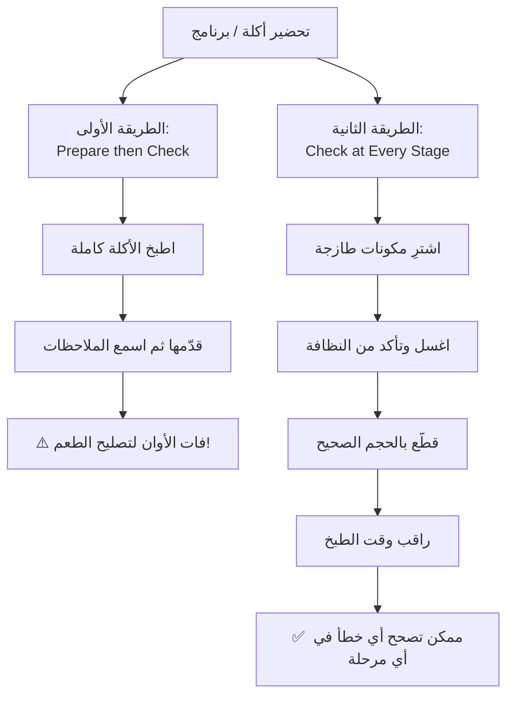
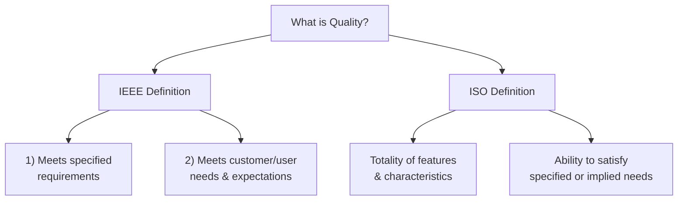
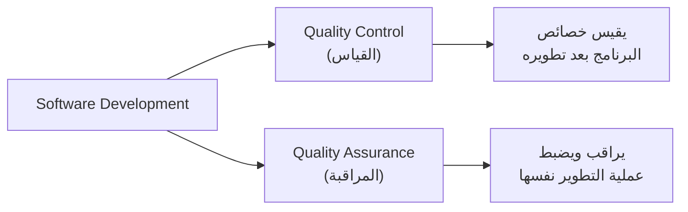
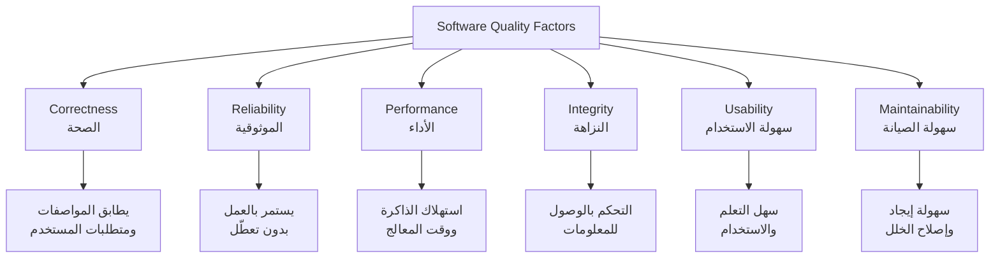
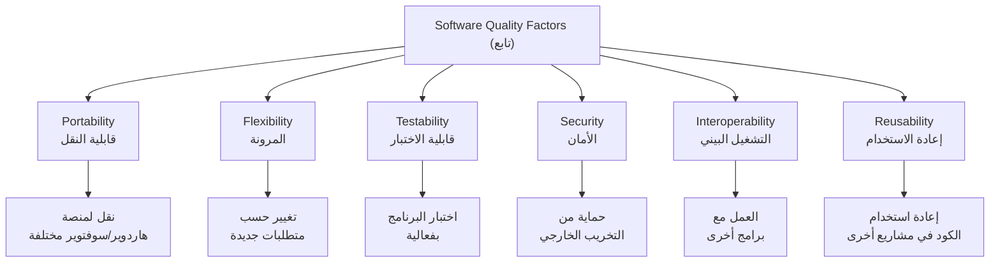
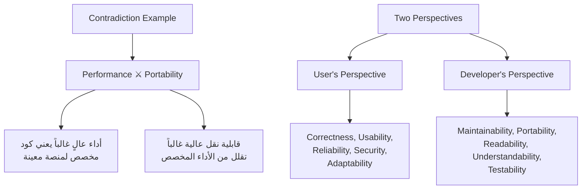
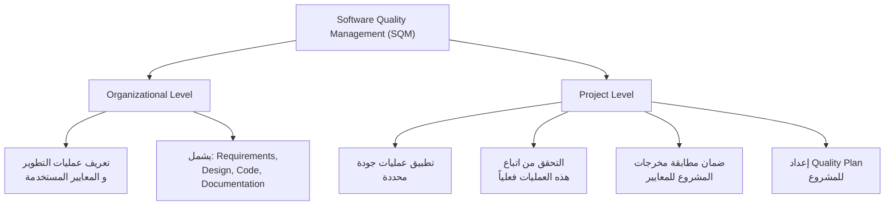
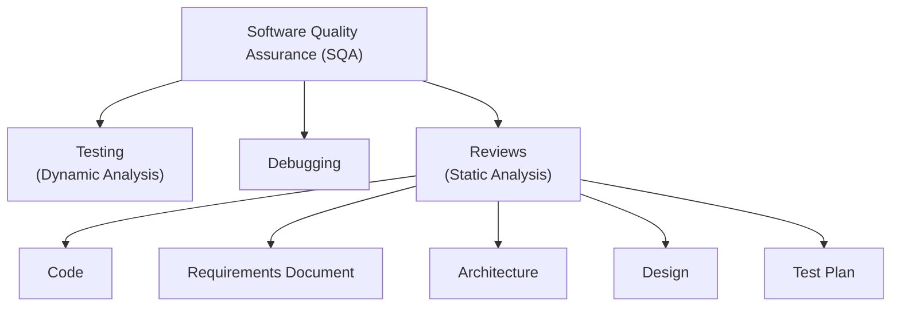
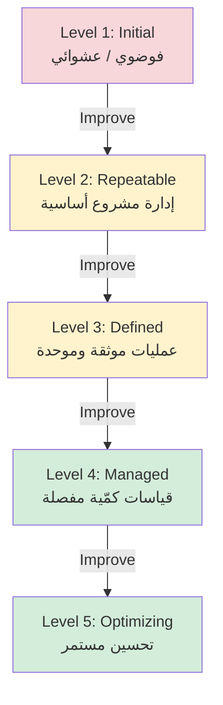

# المحاضرة 12 — Software Quality (جودة البرمجيات)
> **المادة:** هندسة البرمجيات (المستوى الثالث) | **الموضوع:** تعريف الجودة، عوامل الجودة، إدارة الجودة، CMM

---

## ملخص سريع قبل البدء

**عن ماذا هذه المحاضرة؟** هذه آخر محاضرة في المادة، وتتكلم عن `Software Quality` — كيف نعرّف "جودة" البرنامج، وايش العوامل (`Quality Factors`) اللي نقيسها، وكيف تدير الشركة عملية الجودة (`SQM`, `SQA`)، وأخيراً نظام تقييم نضج الشركات `CMM`.

**ليش يهمك؟** لأنه ما يكفي إن الكود "يشتغل" — لازم تعرف: يشتغل بأداء كويس؟ سهل الصيانة؟ آمن؟ هذا الفرق بين مبرمج مبتدئ ومهندس برمجيات حقيقي، وهذا أيضاً مادة أساسية بالامتحان النهائي.

**المتطلبات السابقة:** فهم عام لـ `SDLC` (دورة حياة تطوير البرمجيات)، `Testing`، `Requirements`.

**الخيط الناظم:**
```
Requirements → Design → Implementation → Testing → Quality Assessment (هذه المحاضرة)
```
كل المحاضرات اللي قبل كانت عن "كيف نبني البرنامج"، وهذه المحاضرة عن "كيف نعرف إذا اللي بنيناه كويس".

---

## الجزء الأول: الشرح التفصيلي

### 1. مقدمة: قياس الجودة (تشبيه الطبخ)
<!-- @render: {type: "diagram-first", visualization: "flowchart", coverage: "100%"} -->
<!-- @connectivity: {prerequisite: "none"} -->

#### 📍 أين نحن الآن؟
نبدأ المحاضرة بفكرة بسيطة تشرح "متى نقدر نتحكم بالجودة".

#### ⬅️ الربط مع السابق
بعد ما تعلمنا `Testing` في محاضرة سابقة، نسأل الآن: هل الاختبار بعد الانتهاء كافي لضمان الجودة؟

#### 💡 الفكرة الأساسية
**فيه طريقتان لضمان جودة أي منتج (حتى لو كان أكلة!): إما تتأكد من الجودة في كل خطوة أثناء التحضير، أو تنتظر النهاية وتحاول تصلح الأخطاء بعد فوات الأوان.**

---

#### 📊 المخطط: طريقتان لضمان الجودة



**الشرح:** الطريقة الأولى (تحضير الأكلة كاملة ثم سؤال الناس عن رأيهم في `Taste`، `Color`، `Temperature`) توضح مشكلة أساسية: **بعد ما تُقدَّم الأكلة، يكون الوقت متأخراً لتصليح أي عيب**. نفس الشيء بالضبط في البرمجيات — لو انتظرت لنهاية المشروع عشان تختبر الجودة، تكون معظم الأخطاء مكلفة جداً للتصحيح.

#### 📖 الشرح

المحاضرة تبدأ بمثال تحضير وجبة (`meal`) — تجهزها، تقدمها (`serve it up`)، وتحصل على كمية من التعليقات (`comments`). المستهلكون (`consumers`) يقيّمون عدة عوامل: الطعم (`Taste`)، اللون (`Color`)، الحرارة (`Temperature`). السؤال المطروح: **"هل فات الأوان لتحسين الجودة؟"** — والجواب واضح: نعم، لأن الأكلة خلصت.

الطريقة البديلة (`Alternative way`) هي أنك من البداية تتأكد من جودة كل خطوة: تشتري مكونات طازجة وتتأكد منها، تغسلها وتتحقق من نظافتها، تقطعها بالحجم الصحيح، وتراقب وقت الطبخ. **في أي مرحلة من هذه المراحل تقدر تصحح خطأ إذا حصل شيء غلط** — وهذا بالضبط الفرق بين `Quality Control` (فحص المنتج النهائي) و`Quality Assurance` (مراقبة العملية من البداية)، وهو موضوع سنشرحه بالتفصيل بالقسم التالي.

#### 🎯 الملخص السريع
- تحضير كامل ثم فحص = لا يمكن تصحيح الأخطاء
- فحص في كل خطوة = يمكن تصحيح الأخطاء فوراً
- نفس المبدأ ينطبق على تطوير البرمجيات

#### 📚 التطبيق
هذا المبدأ هو الأساس اللي تُبنى عليه فكرة `Quality Assurance` — أفضل من انتظار اختبار البرنامج كاملاً في النهاية.

#### ⚠️ أخطاء شائعة

#### الفهم الخاطئ ❌:
الطالب يعتقد أن اختبار البرنامج (`Testing`) في آخر مرحلة كافٍ لضمان الجودة.

#### الفهم الصحيح ✅:
الجودة تُبنى في كل مرحلة من مراحل التطوير (`Requirements`, `Design`, `Coding`)، وليس فقط في مرحلة الاختبار النهائية.

#### 📄 النص الأصلي من المحاضرة
<details>
<summary>عرض النص الأصلي (coverage: 100%)</summary>

> "Prepare some meal, Serve it up, Get ample of comments!!! Consumers assess a number of factors: Taste, Color, Temperature. Is it too late to do anything about the quality? Alternative way to prepare: Buy the ingredients and make sure that they are all fresh, Wash the ingredients and check that they are clean, Chop (cut) the ingredients and check that they are chopped to the correct size, Monitor the cooking time. At any stage we can correct a fault if something has been done incorrectly."

**ملاحظة على التغطية:**
- ✓ تم شرح كلا الطريقتين بالكامل
- ✓ تم ربط الفكرة بمفهوم QC/QA
- ℹ️ إضافة من الدليل: المخطط ونوع التشبيه الموسّع

</details>

---

### 2. تعريف الجودة (What is Quality?)
<!-- @render: {type: "diagram-first", visualization: "graph", coverage: "100%"} -->
<!-- @connectivity: {prerequisite: "1"} -->

#### 📍 أين نحن الآن؟
بعد ما فهمنا لماذا الجودة تُبنى تدريجياً، نحتاج تعريفاً رسمياً ومعيارياً للكلمة نفسها.

#### ⬅️ الربط مع السابق
مثال الأكلة أعطانا حدساً (`intuition`)؛ الآن نحوّله لتعريف علمي معتمد من هيئتين عالميتين.

#### 💡 الفكرة الأساسية
**الجودة تُعرَّف بطريقتين متكاملتين: مطابقة المواصفات المكتوبة، ورضا المستخدم الفعلي عن حاجاته.**

---

#### 📊 المخطط: تعريفا IEEE و ISO



**الشرح:** كلا التعريفين يجمعان بين شيئين: (1) ما هو مكتوب رسمياً في وثيقة المتطلبات، و(2) ما يحتاجه المستخدم فعلياً حتى لو ما كُتب صراحة (`implied needs`).

#### 📖 الشرح

**تعريف `IEEE`:** الجودة هي الدرجة (`Degree`) التي يحقق فيها النظام أو المكوّن أو العملية أمرين: (1) المتطلبات المحددة مسبقاً (`specified requirements`)، و(2) احتياجات وتوقعات العميل أو المستخدم (`customer or user needs or expectations`).

لاحظ الفرق المهم هنا: مو بس "شغال حسب الوثيقة" — لازم كمان "يحقق توقعات المستخدم الحقيقية". مثال: لو طلب العميل تطبيق يسجّل دخول بسرعة، لكن الوثيقة ما حددت رقم زمني معين، والمستخدم ينتظر 10 ثواني لكل تسجيل دخول — تقنياً حققت `specified requirements`، لكن فشلت في `user expectations`.

**تعريف `ISO`:** الجودة هي مجمل السمات والخصائص (`totality of features and characteristics`) لمنتج أو خدمة والتي تؤثر على قدرته على تلبية احتياجات محددة أو ضمنية (`specified or implied needs`). كلمة `implied` هنا مهمة جداً — يعني احتياجات ما حد كتبها بالوثيقة لكنها بديهية (مثل: البرنامج ما يكرش `crash`).

#### 🎯 الملخص السريع
- `IEEE`: مطابقة المواصفات + رضا المستخدم
- `ISO`: مجمل الخصائص التي تلبي احتياجات معلنة أو ضمنية
- الاثنان يتفقان على: مواصفات مكتوبة + احتياجات حقيقية (حتى لو غير مكتوبة)

#### 📚 التطبيق
هذين التعريفين هما الأساس اللي تُبنى عليه `Quality Factors` (القسم القادم) — كل عامل جودة هو محاولة لقياس جزء من هذا التعريف الواسع.

#### ⚠️ أخطاء شائعة

#### الفهم الخاطئ ❌:
الطالب يعتقد أن تحقيق كل بند مكتوب في وثيقة المتطلبات (`SRS`) يعني تلقائياً أن البرنامج "عالي الجودة".

#### الفهم الصحيح ✅:
الجودة تشمل أيضاً الاحتياجات الضمنية (`implied needs`) وتوقعات المستخدم غير المكتوبة — برنامج يطابق الوثيقة حرفياً لكنه بطيء أو صعب الاستخدام لا يُعتبر عالي الجودة.

#### 📄 النص الأصلي من المحاضرة
<details>
<summary>عرض النص الأصلي (coverage: 100%)</summary>

> "IEEE: Degree to which a system, component, or process meets (1) specified requirements, and (2) customer or user needs or expectations. ISO: The totality of features and characteristics of a product or service that bear on its ability to satisfy specified or implied needs."

**ملاحظة على التغطية:**
- ✓ تم شرح التعريفين بالكامل مع أمثلة توضيحية

</details>

---

### 3. Quality Control مقابل Quality Assurance
<!-- @render: {type: "diagram-first", visualization: "graph", coverage: "100%"} -->
<!-- @connectivity: {prerequisite: "2"} -->

#### 📍 أين نحن الآن؟
بعد تعريف الجودة، نحتاج نعرف كيف "نتأكد" منها عملياً — وهنا يظهر مصطلحان كثيراً ما يُخلط بينهما.

#### ⬅️ الربط مع السابق
يربط مباشرة بمثال الأكلة في القسم 1: فحص الأكلة النهائية = `QC`، مراقبة كل خطوة تحضير = `QA`.

#### 💡 الفكرة الأساسية
**`Quality Control` يقيس المنتج بعد اكتماله، بينما `Quality Assurance` يراقب ويتحكم بعملية التطوير نفسها من البداية.**

---

#### 📊 المخطط: QC مقابل QA



**الشرح:** `QC` يجيب على سؤال "هل المنتج جيد؟"، أما `QA` يجيب على سؤال "هل العملية اللي أنتجت هذا المنتج جيدة؟".

#### 📖 الشرح

السؤال الذي تطرحه المحاضرة: **"كيف تعرف أنك أنتجت برنامجاً بجودة عالية؟"** — والجواب ينقسم لمسارين:

**`Quality Control` (ضبط الجودة):** قياس الخصائص (`attributes`) للبرنامج بعد أن تم تطويره. هذا يشبه فحص الأكلة بعد ما خلصت — تتذوقها وتحكم عليها.

**`Quality Assurance` (تأكيد/ضمان الجودة):** مراقبة والتحكم بعملية تطوير البرنامج (`process of development`) نفسها أثناء حدوثها. هذا يشبه مراقبتك لكل خطوة أثناء الطبخ — تتأكد من نظافة المكونات وصحة القياسات قبل ما تنتهي الأكلة.

الفرق الجوهري: `QC` رد فعل بعد وقوع المشكلة (`reactive`)، بينما `QA` وقائي يمنع المشكلة من الأساس (`proactive`).

#### 🎯 الملخص السريع
- `QC` = قياس المنتج النهائي (بعد الانتهاء)
- `QA` = مراقبة العملية (أثناء التطوير)
- `QA` وقائي، `QC` رد فعل

#### 📚 التطبيق
لاحقاً بالمحاضرة (القسم 8) سنرى أن `SQA` تتكون من ثلاث ركائز عملية: `Testing`, `Debugging`, `Reviews` — وهذه تطبيقات حقيقية لمفهوم `QA`.

#### ⚠️ أخطاء شائعة

#### الفهم الخاطئ ❌:
الطالب يستخدم `QC` و`QA` كمرادفين لنفس الشيء.

#### الفهم الصحيح ✅:
`QC` يفحص "المنتج" بعد اكتماله، بينما `QA` يراقب "العملية" التي تنتج المنتج — الفرق بين النتيجة والطريقة.

#### 📄 النص الأصلي من المحاضرة
<details>
<summary>عرض النص الأصلي (coverage: 100%)</summary>

> "How do you know when you have produced good-quality software? Quality Control: measuring the attributes of software that has been developed. Quality Assurance: monitoring and controlling the process of development of the software."

**ملاحظة على التغطية:**
- ✓ تم شرح الفرق بالكامل مع ربطه بمثال الأكلة

</details>

---

### 4. عوامل جودة البرمجيات — الجزء الأول (Quality Factors 1)
<!-- @render: {type: "diagram-first", visualization: "graph", coverage: "100%"} -->
<!-- @connectivity: {prerequisite: "3"} -->

#### 📍 أين نحن الآن؟
بعد تعريف الجودة وطرق التحكم بها، ندخل الآن لتفاصيل: **ما هي العوامل (`Factors`) التي نقيسها فعلياً؟**

#### ⬅️ الربط مع السابق
هذه العوامل هي "الترجمة العملية" لتعريف `ISO`/`IEEE` — كل عامل يقيس جزءاً محدداً من "الخصائص" العامة.

#### 💡 الفكرة الأساسية
**جودة البرنامج ليست شيئاً واحداً — هي مجموعة من ستة عوامل مرتبطة مباشرة بتجربة المستخدم: الصحة، الموثوقية، الأداء، النزاهة، سهولة الاستخدام، وسهولة الصيانة.**

---

#### 📊 المخطط: عوامل الجودة (المجموعة الأولى)



**الشرح:** هذه الستة عوامل الأولى (من أصل اثني عشر بالمحاضرة) تركز أكثر على تجربة الاستخدام اليومية للبرنامج.

#### 📖 الشرح

**`Correctness` (الصحة):** مدى مطابقة البرنامج لمواصفاته (`specification`) ومتطلبات مستخدميه. مثال: تطبيق حاسبة يفترض أن يجمع 2+2 = 4، إذا أعطى نتيجة خاطئة فهو غير صحيح مهما كان جميل التصميم.

**`Reliability` (الموثوقية):** درجة استمرار البرنامج بالعمل بدون فشل (`without failing`). مثال: تطبيق بنكي يجب أن يعمل 99.9% من الوقت — إذا كان يتعطل كل ساعة، فموثوقيته منخفضة رغم أنه "صحيح" منطقياً.

**`Performance` (الأداء):** كمية الذاكرة الرئيسية (`main memory`) ووقت المعالج (`processor time`) التي يستخدمها البرنامج. **لاحظ:** التعريف هنا عن الاستهلاك، ليس السرعة فقط — برنامج يستهلك موارد أقل يُعتبر أداؤه أفضل.

**`Integrity` (النزاهة):** الدرجة التي يفرض بها البرنامج تحكماً بالوصول للمعلومات من قبل المستخدمين (`control over access to information by users`). مثال: نظام صلاحيات يمنع موظف عادي من رؤية رواتب المدراء.

**`Usability` (سهولة الاستخدام):** سهولة استخدام البرنامج وسهولة تعلمه (`easy to learn`). مثال: تطبيق بواجهة بديهية لا يحتاج دليل استخدام.

**`Maintainability` (سهولة الصيانة):** الجهد المطلوب لإيجاد وإصلاح خلل (`fault`) بالبرنامج. كود مكتوب بوضوح مع تعليقات جيدة يجعل هذا الجهد أقل.

#### 🎯 الملخص السريع
- `Correctness`: يطابق المواصفات والمتطلبات
- `Reliability`: يستمر يعمل بدون تعطّل
- `Performance`: استهلاك الذاكرة والمعالج
- `Integrity`: تحكم بالوصول للبيانات
- `Usability`: سهل التعلم والاستخدام
- `Maintainability`: سهل إيجاد وإصلاح الأخطاء

#### 📚 التطبيق
هذه العوامل تُستخدم كـ checklist عند تقييم أي برنامج — وسنكمل الستة عوامل المتبقية بالقسم القادم.

#### ⚠️ أخطاء شائعة

#### الفهم الخاطئ ❌:
الطالب يخلط بين `Correctness` و`Reliability` ويعتبرهما نفس الشيء.

#### الفهم الصحيح ✅:
`Correctness` يعني "النتيجة صحيحة منطقياً"، بينما `Reliability` يعني "يستمر يعطي هذه النتيجة الصحيحة بدون تعطّل بمرور الوقت" — برنامج ممكن يكون صحيحاً لكن غير موثوق (يكرش أحياناً).

#### 📄 النص الأصلي من المحاضرة
<details>
<summary>عرض النص الأصلي (coverage: 100%)</summary>

> "Correctness: The extent to which the software meets its specification and meets its users' requirements. Reliability: The degree to which the software continues to work without failing. Performance: The amount of main memory and processor time that the software uses. Integrity: The degree to which the software enforces control over access to information by users. Usability: The ease of use of the software, easy to learn. Maintainability: The effort required to find and fix a fault."

**ملاحظة على التغطية:**
- ✓ تم شرح كل عامل من الستة مع مثال توضيحي مستقل

</details>

---

### 5. عوامل جودة البرمجيات — الجزء الثاني (Quality Factors 2)
<!-- @render: {type: "diagram-first", visualization: "graph", coverage: "100%"} -->
<!-- @connectivity: {prerequisite: "4"} -->

#### 📍 أين نحن الآن؟
نكمل باقي عوامل الجودة الستة — هذه المجموعة تركز أكثر على منظور المطوّر (`developer`) وقابلية النظام للتغيير مستقبلاً.

#### ⬅️ الربط مع السابق
امتداد مباشر للقسم السابق — نفس مفهوم `Quality Factors`، لكن هذه المجموعة الثانية.

#### 💡 الفكرة الأساسية
**العوامل الستة المتبقية تقيس مدى "مرونة" البرنامج تجاه التغيير والنقل والاختبار وإعادة الاستخدام والأمان والعمل مع أنظمة أخرى.**

---

#### 📊 المخطط: عوامل الجودة (المجموعة الثانية)



**الشرح:** هذه المجموعة الثانية غالباً ما تُهمَل من قبل المبتدئين لأنها لا تظهر للمستخدم النهائي مباشرة، لكنها حرجة جداً لصحة المشروع على المدى الطويل.

#### 📖 الشرح

**`Portability` (قابلية النقل):** الجهد المطلوب لنقل البرنامج لمنصة هاردوير و/أو سوفتوير مختلفة (`different hardware and/or software platform`). مثال: تطبيق يعمل على `Windows` فقط له `Portability` منخفضة إذا احتاج إعادة كتابة كاملة للعمل على `Linux`.

**`Flexibility` (المرونة):** الجهد المطلوب لتغيير البرنامج لتلبية متطلبات متغيّرة (`changed requirements`). مثال: نظام مصمم بشكل modular يسهل تعديله أكثر من نظام كل شيء فيه مترابط (`tightly coupled`).

**`Testability` (قابلية الاختبار):** الجهد المطلوب لاختبار البرنامج بفعالية (`effectively`). كود مقسّم لدوال صغيرة واضحة أسهل بالاختبار من كتلة كود ضخمة واحدة.

**`Security` (الأمان):** مدى حماية البرنامج من التخريب الخارجي (`external sabotage`) الذي قد يضره أو يعيق استخدامه.

**`Interoperability` (التشغيل البيني):** الجهد المطلوب لجعل البرنامج يعمل بالتنسيق مع برامج أخرى (`in conjunction with some other software`). مثال: نظام يستخدم `API` قياسية يتواصل بسهولة مع أنظمة خارجية.

**`Reusability` (إعادة الاستخدام):** المدى الذي يمكن فيه إعادة استخدام البرنامج أو أحد مكوناته (`component`) ضمن برنامج آخر. مثال: مكتبة (`library`) عامة للتحقق من صحة البريد الإلكتروني يمكن استخدامها بمشاريع متعددة.

#### 🎯 الملخص السريع
- `Portability`: سهولة النقل لمنصة أخرى
- `Flexibility`: سهولة تعديل المتطلبات
- `Testability`: سهولة الاختبار
- `Security`: الحماية من التخريب الخارجي
- `Interoperability`: التعاون مع أنظمة أخرى
- `Reusability`: إعادة استخدام الكود بمشاريع أخرى

#### 📚 التطبيق
لاحظ أن هذه الستة، مع الستة السابقة، تشكّل قائمة كاملة من 12 عاملاً — استخدمها كـ checklist شامل عند مراجعة أي تصميم برمجي.

#### ⚠️ أخطاء شائعة

#### الفهم الخاطئ ❌:
الطالب يخلط بين `Portability` (نقل لمنصة مختلفة) و`Interoperability` (العمل مع برامج أخرى بنفس المنصة).

#### الفهم الصحيح ✅:
`Portability` يهتم بـ "أين يعمل البرنامج" (Windows، Linux، Android...). `Interoperability` يهتم بـ "مع من يتعاون البرنامج" (مثل ربط نظام محاسبة مع نظام مخزون) — التركيز مختلف تماماً.

#### 📄 النص الأصلي من المحاضرة
<details>
<summary>عرض النص الأصلي (coverage: 100%)</summary>

> "Portability: The effort required to transfer the software to a different hardware and/or software platform. Flexibility: The effort required to change the software to meet changed requirements. Testability: The effort required to test the software effectively. Security: The extent to which the software is safe from external sabotage that may damage it and impair its use. Interoperability: The effort required to make the software work in conjunction with some other software. Reusability: The extent to which the software/component can be reused within some other software."

**ملاحظة على التغطية:**
- ✓ تم شرح كل عامل من الستة مع مثال توضيحي مستقل

</details>

---

### 6. التناقض بين العوامل ومنظورَي المستخدم والمطوّر
<!-- @render: {type: "diagram-first", visualization: "graph", coverage: "100%"} -->
<!-- @connectivity: {prerequisite: "5"} -->

#### 📍 أين نحن الآن؟
بعد أن عرفنا 12 عاملاً منفصلاً، نطرح سؤالاً مهماً: هل يمكن تحقيقها جميعاً معاً بنفس الوقت؟

#### ⬅️ الربط مع السابق
يبني مباشرة على القسمين 4 و5 — يأخذ العوامل الاثني عشر ويوضح أن بعضها يتعارض مع بعض.

#### 💡 الفكرة الأساسية
**لا يمكن تحقيق كل عوامل الجودة بأقصى درجة في آنٍ واحد — بعضها يتناقض مع بعض (Trade-off)، وأهمية كل عامل تختلف حسب منظورك: مستخدم أم مطوّر.**

---

#### 📊 المخطط: تعارض العوامل + المنظوران



**الشرح:** المستخدم يهتم بما يراه ويستخدمه مباشرة، بينما المطوّر يهتم بما يسهّل عليه العمل مستقبلاً على نفس الكود.

#### 📖 الشرح

المحاضرة تطرح سؤالين مباشرين: **"هل التناقض ممكن؟"** والمثال المعطى هو `Performance` مقابل `Portability` — برنامج مُحسَّن بشدة (`optimized`) لمنصة معينة (مثل استخدام تعليمات معالج خاصة) يعطي أداءً ممتازاً، لكنه يصبح صعب النقل لمنصة أخرى لأنه مرتبط بتفاصيل تلك المنصة تحديداً. والعكس: كود عام (`generic`) قابل للنقل بسهولة، لكنه غالباً أبطأ لأنه لا يستغل خصائص المنصة المحددة.

والسؤال الثاني: **"هل كل عامل جودة مطلوب في كل برنامج؟"** — الجواب: لا. مثلاً `Reusability` قد لا تكون أولوية في سكربت بسيط يُستخدم مرة واحدة فقط.

بعدها تقسّم المحاضرة العوامل حسب منظورين مختلفين:

**منظور المستخدم (`User's perspective`):** يهتم بـ `Correctness` (يعطي نتيجة صحيحة)، `Usability` (سهل الاستخدام)، `Reliability` (لا يتعطل)، `Security` (آمن)، و`Adaptability` (سهولة إضافة ميزات جديدة).

**منظور المطوّر (`Developer's perspective`):** يهتم بـ `Maintainability` (سهل الصيانة)، `Portability` (سهل النقل)، `Readability` (الكود قابل للقراءة)، `Understandability` (تصميم يفهمه مطوّر جديد بسهولة)، و`Testability` (سهل الاختبار).

#### 🎯 الملخص السريع
- التناقض ممكن (مثل `Performance` مقابل `Portability`)
- ليس كل عامل مطلوب في كل مشروع
- المستخدم يركز على: Correctness, Usability, Reliability, Security, Adaptability
- المطوّر يركز على: Maintainability, Portability, Readability, Understandability, Testability

#### 📚 التطبيق
عند تصميم أي نظام، على فريق المشروع أن يقرر أولويات الجودة (`Quality priorities`) بناءً على من هو المستخدم النهائي ونوع المشروع — هذا الفهم يقود مباشرة لموضوع `Quality Management` بالقسم القادم.

#### ⚠️ أخطاء شائعة

#### الفهم الخاطئ ❌:
الطالب يعتقد أن هدف كل مشروع برمجي هو تحقيق كل الـ 12 عاملاً بأقصى درجة ممكنة.

#### الفهم الصحيح ✅:
بعض العوامل تتعارض فعلياً (مثل الأداء مقابل قابلية النقل)، لذلك المطلوب هو موازنة (`trade-off`) واعية حسب أولويات المشروع، وليس تعظيم كل شيء معاً.

#### 📄 النص الأصلي من المحاضرة
<details>
<summary>عرض النص الأصلي (coverage: 100%)</summary>

> "Contradiction is possible? Ex. Performance vs. Portability. Is every software attribute is desired in every piece of software? User's perspective: Correctness, Usability, Reliability, Security, Adaptability (easy to add new features). Developer's perspective: Maintainability, Portability, Readability (you do need to be able to read the code), Understandability (design code in a way that new developer can understand how it all hangs together), Testability."

**ملاحظة على التغطية:**
- ✓ تم شرح مثال التعارض ومنظورَي المستخدم والمطوّر بالكامل

</details>

---

### 7. إدارة جودة البرمجيات (Software Quality Management)
<!-- @render: {type: "diagram-first", visualization: "graph", coverage: "100%"} -->
<!-- @connectivity: {prerequisite: "6"} -->

#### 📍 أين نحن الآن؟
بعد ما عرفنا العوامل وأولوياتها، ننتقل لسؤال تنظيمي: من المسؤول عن ضمان تحقيق هذه العوامل داخل الشركة؟

#### ⬅️ الربط مع السابق
`SQM` هو الإطار العملي (`practical framework`) الذي يضمن الأخذ بالحسبان أولويات الجودة اللي ناقشناها بالقسم السابق.

#### 💡 الفكرة الأساسية
**إدارة جودة البرمجيات (`SQM`) لها ثلاث اهتمامات رئيسية: على مستوى المنظمة (وضع المعايير)، على مستوى المشروع (تطبيق العمليات)، وإعداد خطة جودة (`Quality Plan`) لكل مشروع.**

---

#### 📊 المخطط: مستويات SQM



**الشرح:** المستوى التنظيمي يضع "القواعد العامة"، بينما المستوى المشروعي يطبقها ويتحقق من الالتزام بها فعلياً.

#### 📖 الشرح

`SQM` (إدارة جودة البرمجيات) لها ثلاثة اهتمامات رئيسية:

**على المستوى التنظيمي (`Organizational level`):** فريق إدارة الجودة مسؤول عن تحديد عمليات تطوير البرمجيات (`software development processes`) والمعايير (`standards`) التي يجب أن تُطبَّق على البرنامج والوثائق المرتبطة به، بما في ذلك متطلبات النظام، التصميم، والكود.

**على مستوى المشروع (`Project level`):** يتضمن تطبيق عمليات جودة محددة، والتحقق من أن هذه العمليات المخطط لها قد اتُّبعت فعلياً، وضمان أن مخرجات المشروع (`project outputs`) مطابقة للمعايير القابلة للتطبيق على ذلك المشروع.

**خطة الجودة (`Quality Plan`):** إدارة الجودة على مستوى المشروع تهتم أيضاً بوضع خطة جودة تحدد أهداف الجودة للمشروع (`quality goals`) وتعرّف أي عمليات ومعايير سوف تُستخدم.

بعدها تطرح المحاضرة أسئلة عملية يجب على فريق إدارة الجودة الإجابة عنها للتأكد من أن البرنامج ملائم للغرض المقصود منه (`fit for its intended purpose`):
- هل اتُّبعت معايير البرمجة والتوثيق أثناء التطوير؟
- هل اختُبر البرنامج بشكل صحيح؟
- هل البرنامج موثوق بما يكفي للاستخدام؟
- هل أداء البرنامج مقبول للاستخدام العادي؟
- هل البرنامج قابل للاستخدام؟
- هل البرنامج جيد البنية ومفهوم؟

وأسئلة إضافية على مستوى الفريق: هل سيكتب المبرمجون حالات اختبار (`test cases`) قبل كتابة الكود؟ هل سيكتبون اختبارات وحدة (`unit tests`)؟ هل سيتتبعون كودهم بالـ `debugger` قبل تسجيله (`check in`)؟ وهل سيراجع المبرمجون كود بعضهم البعض (`review or inspect each others' code`)؟

#### 🎯 الملخص السريع
- المستوى التنظيمي: يضع المعايير والعمليات العامة
- المستوى المشروعي: يطبّق ويتحقق من الالتزام
- `Quality Plan`: تحدد أهداف وعمليات جودة كل مشروع

#### 📚 التطبيق
أسئلة `SQM` (مثل: هل تمت مراجعة الكود؟) هي بالضبط ما تنفّذه `SQA` عملياً — الركائز الثلاث للـ `SQA` بالقسم التالي هي الأدوات العملية للإجابة على هذه الأسئلة.

#### ⚠️ أخطاء شائعة

#### الفهم الخاطئ ❌:
الطالب يعتقد أن `SQM` مسؤولية شخص واحد أو مرحلة واحدة في المشروع.

#### الفهم الصحيح ✅:
`SQM` عملية مستمرة على مستويين متزامنين — تنظيمي (وضع المعايير) ومشروعي (تطبيقها والتحقق منها) — وتستمر طوال دورة حياة المشروع.

#### 📄 النص الأصلي من المحاضرة
<details>
<summary>عرض النص الأصلي (coverage: 100%)</summary>

> "SQM has three principle concerns: At the organizational level: the quality management team should take responsibility for defining the software development processes to be used and standards that should apply... At the project level: involves the application of specific quality processes, checking that these planned processes have been followed, and ensuring that the project outputs are conformant with the standards... The quality plan should set out the quality goals for the project and define what processes and standards are to be used... Have programming and documentation standards been followed...? Has the software been properly tested? Is the software sufficiently dependable...? Is the performance of the software acceptable...? Is the software usable? Is the software well structured and understandable? Will programmers write test cases for their code before writing the code itself? Will programmers write unit tests...? Will programmers step through their code in the debugger...? Will programmers review or inspect each others' code?"

**ملاحظة على التغطية:**
- ✓ تم شرح المستويين وخطة الجودة وكل الأسئلة المذكورة بالمحاضرة

</details>

---

### 8. ضمان الجودة (Quality Assurance — SQA)
<!-- @render: {type: "diagram-first", visualization: "graph", coverage: "100%"} -->
<!-- @connectivity: {prerequisite: "7"} -->

#### 📍 أين نحن الآن؟
بعد الإطار التنظيمي لـ `SQM`، ندخل بالتفاصيل العملية: ما هي الأدوات الثلاث التي تستخدمها `SQA` فعلياً؟

#### ⬅️ الربط مع السابق
`SQA` هي التنفيذ العملي (`practical execution`) لأسئلة `SQM` اللي شُرحت بالقسم السابق — مثل "هل اختُبر البرنامج؟" و"هل رُوجع الكود؟".

#### 💡 الفكرة الأساسية
**ضمان جودة البرمجيات (SQA) يعني التأكد من أن نظام البرمجيات يحقق أهداف الجودة المحددة له، وذلك عبر ثلاث ركائز: الاختبار، تصحيح الأخطاء، والمراجعات.**

---

#### 📊 المخطط: الركائز الثلاث لـ SQA



**الشرح:** `Testing` يحلل البرنامج وهو يعمل فعلياً (`dynamic`)، بينما `Reviews` تحلل الوثائق والكود بدون تشغيله (`static`) — والمراجعات لا تقتصر على الكود فقط بل تشمل كل وثائق المشروع.

#### 📖 الشرح

`SQA` تعني ضمان أن نظام البرمجيات يحقق أهدافه من الجودة (`quality goals`)، وهذه الأهداف تختلف من مشروع لآخر (`differ from one project to another`) — مما يربطها مباشرة بـ `Quality Plan` اللي ذكرناها بالقسم السابق.

`SQA` تعتمد على ثلاث ركائز (`three legs`):

**`Testing` (تحليل ديناميكي — `dynamic analysis`):** تشغيل البرنامج فعلياً واختبار سلوكه بمدخلات مختلفة — هذا ما تعلمناه بالتفصيل بمحاضرات سابقة.

**`Debugging` (تصحيح الأخطاء):** عملية إيجاد وإصلاح الأخطاء المكتشفة أثناء أو بعد الاختبار.

**`Reviews` (مراجعات — تحليل ثابت `static analysis`):** فحص المخرجات بدون تشغيل البرنامج فعلياً، وتشمل مراجعة: الكود (`Code`)، وثيقة المتطلبات (`Requirements document`)، المعمارية (`Architecture`)، التصميم (`Design`)، وخطة الاختبار (`Test plan`).

لاحظ أن `Reviews` هي الأداة الوحيدة من بين الثلاث التي تُطبَّق على مراحل المشروع المبكرة (مثل وثيقة المتطلبات) قبل حتى وجود كود قابل للتشغيل — وهذا يعيدنا لمبدأ القسم الأول: **كلما اكتُشف الخلل مبكراً، كان تصحيحه أرخص وأسهل**.

#### 🎯 الملخص السريع
- `SQA` = التأكد من تحقيق أهداف الجودة (تختلف حسب المشروع)
- ثلاث ركائز: `Testing` (ديناميكي)، `Debugging`، `Reviews` (ثابت)
- `Reviews` تشمل: الكود، المتطلبات، المعمارية، التصميم، خطة الاختبار

#### 📚 التطبيق
`Reviews` تحديداً هي الأداة التي تسمح باكتشاف مشاكل في مرحلة `Requirements` أو `Design` — أي قبل أن يبدأ الكود بالأساس، وهذا أرخص بكثير من اكتشاف نفس المشكلة عبر `Testing` بعد اكتمال البرمجة.

#### ⚠️ أخطاء شائعة

#### الفهم الخاطئ ❌:
الطالب يعتقد أن `Reviews` تقتصر على مراجعة الكود المصدري فقط.

#### الفهم الصحيح ✅:
`Reviews` تشمل مراجعة أي وثيقة مشروع — وثيقة المتطلبات، المعمارية، التصميم، وخطة الاختبار — وليس الكود فقط، وهذا يجعلها أداة مفيدة من أول يوم بالمشروع.

#### 📄 النص الأصلي من المحاضرة
<details>
<summary>عرض النص الأصلي (coverage: 100%)</summary>

> "SQA: means ensuring that a software system meets its quality goals. The goals differ from one project to another. SQA has three legs: Testing (dynamic analysis), Debugging, Reviews (static analysis): Code, Requirements document, Architecture, Design, Test plan."

**ملاحظة على التغطية:**
- ✓ تم شرح الركائز الثلاث وربطها بموضوع الاكتشاف المبكر للأخطاء

</details>

---

### 9. نموذج نضج القدرات (Capability Maturity Model — CMM)
<!-- @render: {type: "diagram-first", visualization: "flowchart", coverage: "100%"} -->
<!-- @connectivity: {prerequisite: "8"} -->

#### 📍 أين نحن الآن؟
آخر موضوع بالمحاضرة والمادة: كيف نقيس مدى نضج (`maturity`) الشركة نفسها في تطبيق كل ما سبق؟

#### ⬅️ الربط مع السابق
`CMM` هو "مقياس شامل" يفحص هل الشركة فعلاً تطبق مبادئ `SQM` و`SQA` اللي ناقشناها بالقسمين السابقين بشكل منظّم ومتكرر.

#### 💡 الفكرة الأساسية
**نموذج نضج القدرات (CMM) نظام تصنيف من 5 مستويات (من الفوضوي إلى الأمثل) يقيس مدى انضباط الشركة في عمليات تطوير البرمجيات، وتديره جهة معتمدة (SEI بجامعة Carnegie Mellon).**

---

#### 📊 المخطط: مستويات CMM الخمسة



**الشرح:** كل مستوى يشمل كل خصائص المستوى الذي قبله (`includes all the characteristics defined for the previous level`) بالإضافة لخصائص جديدة أكثر انضباطاً.

#### 📖 الشرح

`CMM` هو نظام تصنيف (`grading system`) يقيس مدى جودة منظمة في تطوير البرمجيات، بتصنيف من 5 مستويات — المستوى 1 هو الأسوأ (`bad`) والمستوى 5 هو الأفضل (`good`). ترتيب المنظمة يُحدَّد عبر استبيانات (`questionnaires`) تديرها معهد هندسة البرمجيات (`Software Engineering Institute`) بجامعة `Carnegie Mellon` بالولايات المتحدة.

**المستوى 1 — الأولي (`Initial`):** عملية التطوير عشوائية (`ad hoc`) وأحياناً فوضوية تماماً (`chaotic`). قليل من العمليات مُعرَّفة، ونجاح أي مشروع يعتمد على جهد أفراد معينين وليس عملية منظمة.

**المستوى 2 — القابل للتكرار (`Repeatable`):** عمليات إدارة مشروع أساسية موجودة داخل المنظمة لتتبع التكلفة، الجدول الزمني، والوظائف (`cost, schedule and functionality`). هذه العمليات تمكّن المنظمة من تكرار نجاحها في مشاريع مشابهة سابقة.

**المستوى 3 — المُعرَّف (`Defined`):** عملية التطوير (لكل من الإدارة وهندسة البرمجيات) موثّقة، موحّدة (`standardized`)، ومدمجة بعملية تطوير على مستوى المنظمة بأكملها. كل المشاريع تستخدم نسخة معتمدة وموثّقة من العملية القياسية. يشمل كل خصائص المستوى 2.

**المستوى 4 — المُدار (`Managed`):** قياسات مفصلة (`detailed measures`) لعملية التطوير وللمنتج البرمجي تُجمع، وتكون كمّية (`quantitative`) ومُقاسة بطريقة منضبطة. يشمل كل خصائص المستوى 3.

**المستوى 5 — الأمثل (`Optimizing`):** القياسات تُستخدم باستمرار لتحسين العملية. تقنيات وأدوات جديدة تُستخدم وتُختبر باستمرار. يشمل كل خصائص المستوى 4.

**قياسات المستوى 2** يمكن أن تشمل: مقدار الجهد اللازم لتطوير النظام، تكلفة المشروع الإجمالية، حجم البرنامج (بعدد الأسطر `LOC`، أو نقاط الوظائف، أو عدد الكائنات والدوال)، جهد الأفراد (`person-months`)، وتقلّب المتطلبات (`requirements volatility`).

**قياسات المستوى 3** تشمل: تعقيد المتطلبات، تعقيد التصميم، تعقيد الكود، تعقيد الاختبار، ومقاييس الجودة (عدد العيوب المكتشفة لكل وحدة، عيوب المتطلبات المكتشفة).

**حقيقة مثيرة (Do you know!):** دراسات معهد `SEI` أظهرت أن 85% من المنظمات كانت بالمستوى 1، و14% بالمستوى 2، و1% فقط بالمستوى 3 — ولا منظمة وصلت للمستوى 4 أو 5 من المنظمات التي شُملت بالدراسة.

#### 🎯 الملخص السريع
- 5 مستويات من الفوضوي (1) إلى الأمثل (5)
- كل مستوى يشمل خصائص المستوى الأدنى منه + إضافات
- 85% من المنظمات عالقة عند المستوى 1 فقط
- تديره `SEI` بجامعة `Carnegie Mellon`

#### 📚 التطبيق
`CMM` هو "خارطة الطريق" للمنظمة كي تتحول من عمليات فوضوية إلى عمليات منضبطة وقابلة للقياس — وهو تطبيق مباشر لكل ما تعلمناه في `SQM` و`SQA` على مستوى المنظمة بأكملها.

#### ⚠️ أخطاء شائعة

#### الفهم الخاطئ ❌:
الطالب يعتقد أن الوصول للمستوى 3 يعني الاستغناء عن ممارسات المستوى 2.

#### الفهم الصحيح ✅:
كل مستوى في `CMM` يشمل كل خصائص المستوى الذي قبله ويضيف عليها — المستوى 3 = المستوى 2 + التوثيق والتوحيد على مستوى المنظمة، وليس بديلاً عنه.

#### 📄 النص الأصلي من المحاضرة
<details>
<summary>عرض النص الأصلي (coverage: 100%)</summary>

> "CMM is a grading system that measures how good an organization is at software development. 5 levels: level 1 (bad) to level 5 (good). An organization's ranking is determined by questionnaires administered by the Software Engineering Institute of Carnegie Mellon University, USA. Level 1, initial: the development process is ad hoc and even, occasionally, chaotic... Level 2, repeatable: basic project management processes are established... Level 3, defined: the development process for both management and software engineering activities is documented, standardized and integrated... Level 4, managed: detailed measures of the development process and of the software product are collected... Level 5, optimizing: measurements are continuously used to improve the process... Studies by SEI report that 85 percent of organizations are at level 1, 14 percent at level 2, and 1 percent at level 3. None of the firms surveyed had reached levels 4 or 5."

**ملاحظة على التغطية:**
- ✓ تم شرح المستويات الخمسة كاملة مع قياسات المستويين 2 و3 والإحصائية الختامية

</details>

---

## الجزء الثاني: ملخص شامل (Alternative Complete Reading)

هذه المحاضرة هي آخر محاضرة بمادة `Software Engineering`، وتتمحور حول سؤال جوهري: كيف نعرف أن البرنامج الذي بنيناه "جيد" فعلاً؟ تبدأ المحاضرة بمثال بسيط جداً — تحضير أكلة — لتوضح فكرة عميقة: لو انتظرت حتى تنتهي من تحضير الأكلة كاملة ثم سألت الناس عن رأيهم بالطعم واللون والحرارة، يكون الوقت قد فات لتصليح أي خطأ. لكن لو راقبت كل خطوة أثناء التحضير — تأكدت من طزاجة المكونات، نظافتها، حجم التقطيع الصحيح، ومراقبة وقت الطبخ — تقدر تصحح أي خطأ في أي لحظة. هذا بالضبط الفرق بين فحص المنتج النهائي (`Quality Control`) ومراقبة العملية نفسها (`Quality Assurance`)، وهو الأساس الذي تُبنى عليه كل بقية المحاضرة.

بعدها تعطينا المحاضرة تعريفين رسميين للجودة. حسب `IEEE`، الجودة هي الدرجة التي يحقق فيها النظام أمرين: المتطلبات المحددة رسمياً، واحتياجات وتوقعات المستخدم الحقيقية — حتى لو لم تُكتب هذه التوقعات بالوثيقة. حسب `ISO`، الجودة هي مجمل الخصائص التي تجعل المنتج قادراً على تلبية احتياجات محددة أو ضمنية (`implied`). النقطة المهمة في كلا التعريفين هي كلمة "ضمنية" أو "توقعات" — يعني برنامج قد يطابق الوثيقة حرفياً 100%، لكنه لا يزال "سيء الجودة" إذا لم يلبِ احتياجات المستخدم الحقيقية غير المكتوبة، مثل السرعة المعقولة أو الاستقرار.

هذا يقودنا مباشرة لمفهومي `Quality Control` و`Quality Assurance` بشكل أوضح: `QC` يعني قياس خصائص البرنامج بعد أن اكتمل تطويره — يشبه تذوّق الأكلة النهائية. أما `QA` فيعني مراقبة والتحكم بعملية التطوير نفسها وهي جارية — يشبه التأكد من نظافة وطزاجة كل مكوّن أثناء الطبخ. `QC` رد فعل بعد وقوع المشكلة، بينما `QA` وقائي يمنعها من الأساس. وهذا الفرق مهم جداً لأن أغلب فرق العمل المبتدئة تعتمد فقط على `QC` (اختبار في النهاية) وتغفل عن `QA` (مراقبة مستمرة)، مما يجعل تكلفة إصلاح الأخطاء أعلى بكثير.

ثم تنتقل المحاضرة لسؤال محوري: ما هي بالضبط "الخصائص" التي نقيسها في البرنامج؟ الجواب هو اثنا عشر عاملاً للجودة (`Quality Factors`)، مقسّمة لمجموعتين. المجموعة الأولى تشمل: `Correctness` وهي مدى مطابقة البرنامج لمواصفاته ومتطلبات مستخدميه (مثل حاسبة تعطي نتائج صحيحة رياضياً)؛ `Reliability` وهي استمرار البرنامج بالعمل بدون فشل، وهذه مختلفة عن `Correctness` — برنامج قد يعطي نتائج صحيحة لكنه يتعطل كل ساعة فيكون صحيحاً لكن غير موثوق؛ `Performance` وهي كمية الذاكرة الرئيسية ووقت المعالج التي يستهلكها البرنامج؛ `Integrity` وهي درجة تحكم البرنامج بالوصول للمعلومات من قبل المستخدمين المختلفين (مثل نظام صلاحيات يمنع موظفاً عادياً من رؤية بيانات حساسة)؛ `Usability` وهي سهولة استخدام وتعلّم البرنامج؛ و`Maintainability` وهي الجهد المطلوب لإيجاد وإصلاح خلل ما.

المجموعة الثانية من العوامل تشمل: `Portability` وهي الجهد المطلوب لنقل البرنامج لمنصة هاردوير أو سوفتوير مختلفة، تختلف عن `Interoperability` التي تعني الجهد اللازم لجعل البرنامج يعمل بالتنسيق مع برامج أخرى — الأولى تسأل "أين يعمل البرنامج؟" والثانية تسأل "مع من يتعاون البرنامج؟"؛ `Flexibility` وهي الجهد المطلوب لتغيير البرنامج تبعاً لمتطلبات متغيّرة؛ `Testability` وهي الجهد المطلوب لاختبار البرنامج بفعالية؛ `Security` وهي مدى حماية البرنامج من التخريب الخارجي الذي قد يضره أو يعيق استخدامه؛ و`Reusability` وهي المدى الذي يمكن فيه إعادة استخدام البرنامج أو أحد مكوناته ضمن برنامج آخر (مثل مكتبة عامة تُستخدم بعدة مشاريع).

نقطة مهمة جداً بالمحاضرة هي أن هذه العوامل الاثني عشر لا يمكن تحقيقها كلها بأقصى درجة بنفس الوقت — أحياناً تتناقض مع بعضها. المثال الكلاسيكي المذكور هو `Performance` مقابل `Portability`: كود مُحسَّن بشدة لمنصة معينة يعطي أداءً ممتازاً، لكنه يصبح صعب النقل لمنصة أخرى لأنه مرتبط بتفاصيل تلك المنصة تحديداً. والعكس صحيح: كود عام قابل للنقل بسهولة يكون غالباً أبطأ لأنه لا يستغل خصائص المنصة المحددة. كذلك، ليس كل عامل جودة مطلوباً بنفس الأهمية في كل مشروع — مثلاً `Reusability` ليست أولوية بسكربت بسيط يُستخدم مرة واحدة.

المحاضرة تقسّم هذه العوامل أيضاً حسب من يهتم بها: من منظور المستخدم (`User's perspective`)، أهم العوامل هي `Correctness`، `Usability`، `Reliability`، `Security`، و`Adaptability` (سهولة إضافة ميزات جديدة) — لأن هذه العوامل هي ما يلمسه المستخدم مباشرة في تجربته اليومية. أما من منظور المطوّر (`Developer's perspective`)، فالأهم هو `Maintainability`، `Portability`، `Readability` (الكود قابل للقراءة)، `Understandability` (تصميم يفهمه مطوّر جديد بسرعة)، و`Testability` — لأن هذه هي العوامل التي تسهّل على المطورين العمل على نفس الكود مستقبلاً. فهم هذين المنظورين يساعد فرق العمل على تحديد أولويات الجودة بذكاء بدل محاولة تعظيم كل شيء بنفس الوقت.

بعد فهم "ماذا نقيس"، تنتقل المحاضرة لسؤال "من يدير هذا القياس؟" — وهنا يظهر مفهوم `Software Quality Management (SQM)`. لدى `SQM` ثلاث اهتمامات رئيسية: على المستوى التنظيمي، فريق إدارة الجودة مسؤول عن تحديد عمليات التطوير والمعايير التي تُطبَّق على البرنامج ووثائقه (المتطلبات، التصميم، الكود)؛ على مستوى المشروع، الاهتمام ينتقل لتطبيق عمليات جودة محددة والتحقق من اتباعها فعلياً وضمان مطابقة المخرجات للمعايير؛ وأخيراً وضع خطة جودة (`Quality Plan`) لكل مشروع تحدد أهدافه وأي عمليات ومعايير ستُستخدم. المحاضرة تعطي مجموعة أسئلة عملية يجب أن يجيب عليها فريق إدارة الجودة، مثل: هل اتُّبعت معايير البرمجة والتوثيق؟ هل اختُبر البرنامج بشكل صحيح؟ هل هو موثوق بما يكفي للاستخدام؟ هل أداؤه مقبول؟ هل هو قابل للاستخدام وجيد البنية ومفهوم؟ بالإضافة لأسئلة على مستوى الفريق: هل سيكتب المبرمجون حالات اختبار قبل الكود نفسه؟ هل سيكتبون اختبارات وحدة؟ هل سيتتبعون كودهم بالـ debugger قبل تسجيله؟ وهل سيراجع المبرمجون كود بعضهم البعض؟

هذه الأسئلة تجد إجاباتها العملية في مفهوم `Quality Assurance (SQA)` — الذي يعني التأكد من أن نظام البرمجيات يحقق أهداف جودته المحددة (وهي تختلف من مشروع لآخر، مما يربطها مباشرة بـ `Quality Plan`). `SQA` تقوم على ثلاث ركائز: `Testing` وهو تحليل ديناميكي (`dynamic analysis`) يتضمن تشغيل البرنامج فعلياً واختباره؛ `Debugging` وهو إيجاد وإصلاح الأخطاء المكتشفة؛ و`Reviews` وهو تحليل ثابت (`static analysis`) يفحص الوثائق دون تشغيل البرنامج، ويشمل مراجعة الكود، وثيقة المتطلبات، المعمارية، التصميم، وخطة الاختبار. النقطة المهمة هنا هي أن `Reviews` هي الأداة الوحيدة القابلة للتطبيق على مراحل المشروع المبكرة جداً (مثل وثيقة المتطلبات) قبل وجود أي كود قابل للتشغيل، وهذا يعيدنا لمبدأ القسم الأول: كلما اكتُشف الخلل مبكراً، كان تصحيحه أرخص وأسهل بكثير.

آخر موضوع بالمحاضرة هو `Capability Maturity Model (CMM)` — وهو نظام يقيس مدى نضج المنظمة بأكملها (وليس مشروعاً واحداً فقط) في تطبيق كل مبادئ الجودة اللي ذكرناها. يتكوّن `CMM` من 5 مستويات، ويُحدَّد ترتيب المنظمة عبر استبيانات يديرها معهد هندسة البرمجيات (`SEI`) بجامعة `Carnegie Mellon`. المستوى 1 (`Initial`) هو الأسوأ — عملية التطوير عشوائية وأحياناً فوضوية تماماً، ونجاح أي مشروع يعتمد على جهد أفراد وليس عملية منظمة. المستوى 2 (`Repeatable`) يضيف عمليات إدارة مشروع أساسية لتتبع التكلفة والجدول الزمني والوظائف، مما يمكّن المنظمة من تكرار نجاحها بمشاريع مشابهة. المستوى 3 (`Defined`) يوثّق ويوحّد عملية التطوير بأكملها على مستوى المنظمة، بحيث تستخدم كل المشاريع نسخة معتمدة موحّدة من العملية القياسية. المستوى 4 (`Managed`) يضيف قياسات كمّية مفصلة لعملية التطوير وللمنتج نفسه. وأخيراً المستوى 5 (`Optimizing`) حيث تُستخدم هذه القياسات باستمرار لتحسين العملية، مع اختبار تقنيات وأدوات جديدة باستمرار. من المهم ملاحظة أن كل مستوى يشمل كل خصائص المستوى الذي قبله ويضيف عليها — فالمستوى 3 لا يلغي ممارسات المستوى 2 بل يبني فوقها.

قياسات المستوى 2 تشمل: مقدار الجهد اللازم للتطوير، تكلفة المشروع الإجمالية، حجم البرنامج (بعدد الأسطر أو نقاط الوظائف)، جهد الأفراد بالأشهر، وتقلّب المتطلبات. قياسات المستوى 3 تشمل: تعقيد المتطلبات والتصميم والكود والاختبار، ومقاييس الجودة مثل عدد العيوب المكتشفة لكل وحدة. المحاضرة تختم بحقيقة مثيرة توضح صعوبة الوصول لمستويات النضج العالية عملياً: دراسات `SEI` أظهرت أن 85% من المنظمات المدروسة كانت لا تزال بالمستوى 1، و14% فقط وصلت للمستوى 2، ونسبة ضئيلة جداً (1%) وصلت للمستوى 3 — ولا منظمة واحدة من العينة وصلت للمستوى 4 أو 5. هذه الإحصائية تعطي صورة واقعية: معظم الشركات، حتى لو تدّعي اتباع ممارسات جودة، لا تزال بعيدة جداً عن الانضباط الكامل الذي يصفه `CMM`.

بالنسبة للأسئلة المتوقعة بالامتحان، ركّز الأستاذ بشكل واضح على: الفرق بين تعريفي `IEEE` و`ISO`، الفرق بين `QC` و`QA`، حفظ العوامل الاثني عشر ومعنى كل واحد بدقة (خصوصاً التمييز بين `Correctness`/`Reliability` وبين `Portability`/`Interoperability`)، منظورَي المستخدم والمطوّر، الركائز الثلاث لـ `SQA`، ومستويات `CMM` الخمسة بالترتيب مع خصائص كل مستوى والإحصائية الختامية عن توزيع الشركات. لاحظ أن هذه المحاضرة هي آخر محاضرة بالمادة، والملاحظة الختامية بالسلايدات كانت واضحة جداً: **كل المحاضرات والملفات مطلوبة للامتحان، ولا شيء تم استبعاده، فلا تسأل عن طبيعة الأسئلة لأن كل شيء متوقّع**.

---

## الجزء الثالث: أسئلة اختيار من متعدد (MCQ)

### السؤال 1 (Easy)

**السؤال:** According to the IEEE definition, software quality is the degree to which a system meets specified requirements and:

أ) The lowest possible development cost
ب) Customer or user needs or expectations
ج) The shortest possible development schedule
د) The preferences of the development team

**الإجابة الصحيحة:** ب

**التعليل الكامل:**
- ❌ أ): التكلفة ليست جزءاً من تعريف `IEEE` للجودة أبداً.
- ✅ ب): هذا نص تعريف `IEEE` بالضبط: مطابقة المواصفات + تلبية احتياجات وتوقعات العميل أو المستخدم.
- ❌ ج): الجدول الزمني ليس جزءاً من التعريف.
- ❌ د): تفضيلات فريق التطوير غير مذكورة بالتعريف؛ الجودة تتعلق بالمستخدم لا بالمطوّر.

---

### السؤال 2 (Medium)

**السؤال:** Which term refers to measuring the attributes of software AFTER it has been developed?

أ) Quality Assurance
ب) Quality Plan
ج) Quality Control
د) Capability Maturity Model

**الإجابة الصحيحة:** ج

**التعليل الكامل:**
- ❌ أ): `Quality Assurance` تراقب العملية أثناء التطوير، وليس المنتج بعد اكتماله.
- ❌ ب): `Quality Plan` هي وثيقة تحدد الأهداف، وليست عملية قياس.
- ✅ ج): `Quality Control` بالتعريف هو قياس خصائص البرنامج بعد اكتمال تطويره.
- ❌ د): `CMM` يقيس نضج المنظمة بأكملها، وليس منتجاً برمجياً محدداً.

---

### السؤال 3 (Hard)

**السؤال:** A team writes highly platform-specific optimized code to maximize speed on one machine, making it very hard to run elsewhere. This best illustrates a trade-off between which two quality factors?

أ) Correctness and Reliability
ب) Usability and Security
ج) Performance and Portability
د) Integrity and Testability

**الإجابة الصحيحة:** ج

**التعليل الكامل:**
- ❌ أ): لا علاقة لهذا المثال بصحة النتائج أو استمرارية العمل بدون تعطل.
- ❌ ب): لا علاقة له بسهولة الاستخدام أو الحماية من التخريب.
- ✅ ج): هذا المثال بالضبط ذُكر بالمحاضرة كمثال على التناقض — تحسين الأداء عبر ربط الكود بمنصة معينة يقلل من قابلية نقله.
- ❌ د): لا علاقة له بالتحكم بالوصول للبيانات أو سهولة الاختبار.

---

### السؤال 4 (Easy)

**السؤال:** Which quality factor is defined as "the amount of main memory and processor time that the software uses"?

أ) Reliability
ب) Performance
ج) Maintainability
د) Efficiency Rating

**الإجابة الصحيحة:** ب

**التعليل الكامل:**
- ❌ أ): `Reliability` تتعلق باستمرار العمل بدون تعطل، وليس باستهلاك الموارد.
- ✅ ب): هذا هو النص الحرفي لتعريف `Performance` بالمحاضرة.
- ❌ ج): `Maintainability` تتعلق بجهد إصلاح الأخطاء، ليس باستهلاك الموارد.
- ❌ د): هذا مصطلح غير موجود بالمحاضرة إطلاقاً.

---

### السؤال 5 (Medium)

**السؤال:** From the developer's perspective mentioned in the lecture, which factor focuses on whether a new developer can understand how the whole design fits together?

أ) Usability
ب) Understandability
ج) Adaptability
د) Correctness

**الإجابة الصحيحة:** ب

**التعليل الكامل:**
- ❌ أ): `Usability` من منظور المستخدم، وتعني سهولة الاستخدام، وليست فهم التصميم من قبل مطوّر جديد.
- ✅ ب): بالتحديد هذا تعريف `Understandability` بالمحاضرة: تصميم الكود بطريقة يفهم بها مطوّر جديد كيف يترابط كل شيء.
- ❌ ج): `Adaptability` من منظور المستخدم، وتعني سهولة إضافة ميزات جديدة.
- ❌ د): `Correctness` تتعلق بمطابقة المواصفات، وليس بفهم التصميم.

---

### السؤال 6 (Medium)

**السؤال:** According to the lecture, which factor measures the effort required to transfer software to a different hardware or software platform?

أ) Interoperability
ب) Flexibility
ج) Portability
د) Reusability

**الإجابة الصحيحة:** ج

**التعليل الكامل:**
- ❌ أ): `Interoperability` تتعلق بالعمل مع برامج أخرى، وليس بالانتقال لمنصة مختلفة.
- ❌ ب): `Flexibility` تتعلق بتغيير البرنامج لمتطلبات جديدة، وليس بنقله لمنصة أخرى.
- ✅ ج): هذا هو النص الحرفي لتعريف `Portability` بالمحاضرة.
- ❌ د): `Reusability` تتعلق بإعادة استخدام مكوّن ببرنامج آخر، وليس بالنقل لمنصة مختلفة.

---

### السؤال 7 (Hard)

**السؤال:** Which of the following is NOT one of the three "legs" of Software Quality Assurance (SQA) as described in the lecture?

أ) Testing
ب) Debugging
ج) Reviews
د) Requirements Elicitation

**الإجابة الصحيحة:** د

**التعليل الكامل:**
- ❌ أ): `Testing` هي إحدى الركائز الثلاث المذكورة صراحة.
- ❌ ب): `Debugging` هي إحدى الركائز الثلاث المذكورة صراحة.
- ❌ ج): `Reviews` هي إحدى الركائز الثلاث المذكورة صراحة.
- ✅ د): `Requirements Elicitation` (جمع المتطلبات) موضوع مختلف تماماً من محاضرة أخرى، وليست إحدى ركائز `SQA` المذكورة هنا.

---

### السؤال 8 (Easy)

**السؤال:** In the CMM model, how many maturity levels are defined?

أ) 3
ب) 4
ج) 5
د) 7

**الإجابة الصحيحة:** ج

**التعليل الكامل:**
- ❌ أ): العدد أكبر من 3.
- ❌ ب): العدد أكبر من 4.
- ✅ ج): المحاضرة تذكر صراحة 5 مستويات: Initial, Repeatable, Defined, Managed, Optimizing.
- ❌ د): العدد أقل من 7؛ هذا رقم غير مذكور بالمحاضرة.

---

### السؤال 9 (Medium)

**السؤال:** At which CMM level does an organization document, standardize, and integrate its development process across ALL projects?

أ) Level 1 — Initial
ب) Level 2 — Repeatable
ج) Level 3 — Defined
د) Level 5 — Optimizing

**الإجابة الصحيحة:** ج

**التعليل الكامل:**
- ❌ أ): المستوى الأول عملية عشوائية وفوضوية، بدون أي توثيق أو توحيد.
- ❌ ب): المستوى الثاني يوجد فيه إدارة مشروع أساسية فقط، وليس توحيداً على مستوى المنظمة بأكملها.
- ✅ ج): هذا هو التعريف الحرفي لمستوى `Defined` — عملية موثّقة وموحّدة ومدمجة على مستوى المنظمة، وكل المشاريع تستخدم نسخة معتمدة منها.
- ❌ د): المستوى الخامس يركز على التحسين المستمر باستخدام القياسات، وليس على التوحيد الأولي للعملية.

---

### السؤال 10 (Hard)

**السؤال:** Based on the SEI study cited in the lecture, what percentage of surveyed organizations had reached CMM Level 3 or higher?

أ) 1 percent
ب) 14 percent
ج) 50 percent
د) 85 percent

**الإجابة الصحيحة:** أ

**التعليل الكامل:**
- ✅ أ): الدراسة تذكر أن 1% فقط وصلت للمستوى 3، ولا أحد وصل للمستوى 4 أو 5 — فيكون إجمالي من وصل للمستوى 3 فما فوق هو 1% بالضبط.
- ❌ ب): 14% كانت النسبة عند المستوى 2 فقط، وليس المستوى 3 فما فوق.
- ❌ ج): 50% رقم غير مذكور بالدراسة إطلاقاً.
- ❌ د): 85% كانت نسبة الشركات العالقة عند المستوى 1، وهذا عكس ما يسأله السؤال.

---

### السؤال 11 (Medium)

**السؤال:** Which of the following BEST describes "Reviews" as one of the SQA legs?

أ) Running the software with various test inputs
ب) Static analysis of documents such as code, requirements, and design
ج) Fixing bugs discovered during testing
د) Measuring an organization's overall maturity level

**الإجابة الصحيحة:** ب

**التعليل الكامل:**
- ❌ أ): هذا وصف `Testing`، وليس `Reviews`.
- ✅ ب): `Reviews` هي تحليل ثابت (`static analysis`) للكود، وثيقة المتطلبات، المعمارية، التصميم، وخطة الاختبار — بدون تشغيل البرنامج فعلياً.
- ❌ ج): هذا وصف `Debugging`.
- ❌ د): هذا وصف `CMM`، وليس `Reviews`.

---

### السؤال 12 (Easy)

**السؤال:** According to the ISO definition, software quality relates to the totality of features and characteristics that satisfy specified or:

أ) Implied needs
ب) Budgeted needs
ج) Documented complaints
د) Marketing requirements

**الإجابة الصحيحة:** أ

**التعليل الكامل:**
- ✅ أ): هذا هو النص الحرفي لتعريف `ISO`: تلبية احتياجات محددة أو ضمنية (`implied`).
- ❌ ب): الميزانية غير مذكورة بتعريف `ISO`.
- ❌ ج): الشكاوى الموثّقة ليست جزءاً من التعريف.
- ❌ د): متطلبات التسويق غير مذكورة بالتعريف إطلاقاً.

---

### السؤال 13 (Medium)

**السؤال:** Which factor is described in the lecture as "the degree to which the software enforces control over access to information by users"?

أ) Security
ب) Integrity
ج) Reliability
د) Correctness

**الإجابة الصحيحة:** ب

**التعليل الكامل:**
- ❌ أ): `Security` تتعلق بالحماية من التخريب الخارجي، وليس بالتحكم بوصول المستخدمين للمعلومات.
- ✅ ب): هذا هو النص الحرفي لتعريف `Integrity` بالمحاضرة.
- ❌ ج): `Reliability` تتعلق باستمرار العمل بدون تعطل، لا علاقة لها بالتحكم بالوصول.
- ❌ د): `Correctness` تتعلق بمطابقة المواصفات، لا علاقة لها بالتحكم بالوصول.

---

### السؤال 14 (Hard)

**السؤال:** From the user's perspective as listed in the lecture, which of the following is NOT considered a priority factor?

أ) Correctness
ب) Security
ج) Portability
د) Reliability

**الإجابة الصحيحة:** ج

**التعليل الكامل:**
- ❌ أ): `Correctness` مذكورة صراحة ضمن منظور المستخدم.
- ❌ ب): `Security` مذكورة صراحة ضمن منظور المستخدم.
- ✅ ج): `Portability` مذكورة بالمحاضرة ضمن منظور المطوّر (`Developer's perspective`)، وليس منظور المستخدم.
- ❌ د): `Reliability` مذكورة صراحة ضمن منظور المستخدم.

---

### السؤال 15 (Medium)

**السؤال:** Which CMM level is characterized by measurements being continuously used to improve the process, with new techniques and tools being tested?

أ) Level 2 — Repeatable
ب) Level 3 — Defined
ج) Level 4 — Managed
د) Level 5 — Optimizing

**الإجابة الصحيحة:** د

**التعليل الكامل:**
- ❌ أ): المستوى الثاني يركز على إدارة المشروع الأساسية، وليس التحسين المستمر.
- ❌ ب): المستوى الثالث يركز على توحيد وتوثيق العملية، وليس التحسين المستمر باستخدام القياسات.
- ❌ ج): المستوى الرابع يركز على جمع قياسات كمّية مفصلة، لكن بدون التركيز على "التحسين المستمر" الذي يميّز المستوى الخامس.
- ✅ د): هذا التعريف الحرفي لمستوى `Optimizing` — القياسات تُستخدم باستمرار لتحسين العملية مع اختبار تقنيات وأدوات جديدة.

---

### السؤال 16 (Medium)

**السؤال:** Which best explains why "Quality Assurance" is generally considered more proactive than "Quality Control"?

أ) QA only happens after the software is fully released to customers
ب) QA monitors and controls the development process itself, allowing early correction of faults
ج) QA is only concerned with measuring memory and processor usage
د) QA replaces the need for any testing of the final product

**الإجابة الصحيحة:** ب

**التعليل الكامل:**
- ❌ أ): هذا عكس تعريف `QA`؛ إنها تراقب أثناء التطوير، وليس بعد الإصدار النهائي.
- ✅ ب): بالضبط هذا سبب كون `QA` وقائياً — مراقبة العملية أثناء حدوثها تسمح بتصحيح الأخطاء بأي مرحلة، تماماً مثل مثال الأكلة بالمحاضرة.
- ❌ ج): هذا وصف لـ `Performance`، وليس `QA`.
- ❌ د): `QA` لا تلغي الحاجة لـ `Testing`؛ `Testing` هي إحدى ركائز `SQA` نفسها.

---

## الجزء الرابع: بطاقات سؤال وجواب (Q&A Cards)

### البطاقة 1
**Q:** ما الفرق الأساسي بين `Quality Control` و`Quality Assurance`؟
**A:** `QC` يقيس المنتج بعد اكتماله، بينما `QA` يراقب ويتحكم بعملية التطوير نفسها أثناء حدوثها.

### البطاقة 2
**Q:** ما هما تعريفا الجودة حسب `IEEE` و`ISO`؟
**A:** `IEEE`: مطابقة المواصفات + احتياجات وتوقعات المستخدم. `ISO`: مجمل الخصائص التي تلبي احتياجات محددة أو ضمنية.

### البطاقة 3
**Q:** ما الفرق بين `Correctness` و`Reliability`؟
**A:** `Correctness` تعني النتيجة صحيحة منطقياً؛ `Reliability` تعني استمرار إعطاء هذه النتيجة بدون تعطل مع مرور الوقت.

### البطاقة 4
**Q:** اذكر مثالاً على تناقض بين عاملَي جودة كما ذُكر بالمحاضرة.
**A:** `Performance` مقابل `Portability` — الكود المُحسَّن لمنصة معينة يعطي أداءً أفضل لكنه أصعب بالنقل.

### البطاقة 5
**Q:** ما الفرق بين `Portability` و`Interoperability`؟
**A:** `Portability`: سهولة نقل البرنامج لمنصة هاردوير/سوفتوير مختلفة. `Interoperability`: سهولة عمل البرنامج مع برامج أخرى.

### البطاقة 6
**Q:** ما هي عوامل الجودة الخمسة من منظور المستخدم؟
**A:** `Correctness`, `Usability`, `Reliability`, `Security`, `Adaptability`.

### البطاقة 7
**Q:** ما هي عوامل الجودة الخمسة من منظور المطوّر؟
**A:** `Maintainability`, `Portability`, `Readability`, `Understandability`, `Testability`.

### البطاقة 8
**Q:** ما هي الاهتمامات الثلاثة لإدارة جودة البرمجيات `SQM`؟
**A:** المستوى التنظيمي (وضع المعايير)، مستوى المشروع (التطبيق والتحقق)، ووضع `Quality Plan` لكل مشروع.

### البطاقة 9
**Q:** ما هي الركائز الثلاث لـ `SQA`؟
**A:** `Testing` (تحليل ديناميكي)، `Debugging`، و`Reviews` (تحليل ثابت).

### البطاقة 10
**Q:** ما هي الوثائق التي تشملها `Reviews` حسب المحاضرة؟
**A:** الكود، وثيقة المتطلبات، المعمارية، التصميم، وخطة الاختبار.

### البطاقة 11
**Q:** كم عدد مستويات `CMM` ومن يديرها؟
**A:** 5 مستويات، ويديرها معهد هندسة البرمجيات (`SEI`) بجامعة `Carnegie Mellon`.

### البطاقة 12
**Q:** ما هو مستوى `CMM` الذي تُوثَّق وتُوحَّد فيه عملية التطوير على مستوى المنظمة بأكملها؟
**A:** المستوى 3 — `Defined`.

### البطاقة 13
**Q:** ما نسبة المنظمات التي وصلت للمستوى 1 فقط حسب دراسة `SEI`؟
**A:** 85% من المنظمات المدروسة.

### البطاقة 14
**Q:** ما تعريف عامل `Integrity`؟
**A:** درجة تحكم البرنامج بالوصول للمعلومات من قبل المستخدمين المختلفين.

---

## الجزء الخامس: ورقة المراجعة السريعة (Cheat Sheet)

### 5.1 جدول مقارنة سريعة: QC مقابل QA

| المعيار | Quality Control | Quality Assurance |
| --- | --- | --- |
| التوقيت | بعد اكتمال البرنامج | أثناء عملية التطوير |
| الطبيعة | رد فعل (Reactive) | وقائي (Proactive) |
| ما يُفحص | خصائص المنتج النهائي | عملية التطوير نفسها |
| مثال | اختبار البرنامج بعد الانتهاء | مراجعة الكود والتصميم أثناء العمل |

### 5.2 جدول عوامل الجودة الاثني عشر

| العامل | التعريف المختصر |
| --- | --- |
| `Correctness` | مطابقة المواصفات ومتطلبات المستخدم |
| `Reliability` | الاستمرار بالعمل بدون تعطّل |
| `Performance` | استهلاك الذاكرة ووقت المعالج |
| `Integrity` | التحكم بالوصول للمعلومات |
| `Usability` | سهولة الاستخدام والتعلّم |
| `Maintainability` | جهد إيجاد وإصلاح الخلل |
| `Portability` | جهد النقل لمنصة مختلفة |
| `Flexibility` | جهد تغيير البرنامج لمتطلبات جديدة |
| `Testability` | جهد اختبار البرنامج بفعالية |
| `Security` | الحماية من التخريب الخارجي |
| `Interoperability` | جهد العمل مع برامج أخرى |
| `Reusability` | إمكانية إعادة الاستخدام بمشاريع أخرى |

### 5.3 جدول مستويات CMM

| المستوى | الاسم | الوصف المختصر |
| --- | --- | --- |
| 1 | Initial | عملية عشوائية وفوضوية، النجاح يعتمد على أفراد |
| 2 | Repeatable | إدارة مشروع أساسية (تكلفة، جدول، وظائف) |
| 3 | Defined | عملية موثّقة وموحّدة على مستوى المنظمة كاملة |
| 4 | Managed | قياسات كمّية مفصلة للعملية والمنتج |
| 5 | Optimizing | تحسين مستمر باستخدام القياسات وأدوات جديدة |

### 5.4 القواعد الذهبية

- اكتشاف الخطأ مبكراً (بمرحلة `Requirements` أو `Design`) أرخص بكثير من اكتشافه بعد اكتمال الكود.
- `QA` تراقب "العملية"، `QC` تقيس "المنتج".
- كل عامل جودة له تكلفة موازِنة (`trade-off`) مع عوامل أخرى — لا يمكن تعظيم كل شيء معاً.
- كل مستوى `CMM` يشمل خصائص المستوى الذي قبله + إضافات جديدة.

### 5.5 مرجع سريع للمصطلحات

| المصطلح الإنجليزي | المعنى بالعربي |
| --- | --- |
| `Quality Control (QC)` | ضبط الجودة (قياس المنتج بعد اكتماله) |
| `Quality Assurance (QA)` | تأكيد/ضمان الجودة (مراقبة العملية) |
| `Software Quality Management (SQM)` | إدارة جودة البرمجيات |
| `Software Quality Assurance (SQA)` | ضمان جودة البرمجيات |
| `Capability Maturity Model (CMM)` | نموذج نضج القدرات |
| `Dynamic Analysis` | تحليل ديناميكي (تشغيل البرنامج فعلياً) |
| `Static Analysis` | تحليل ثابت (فحص بدون تشغيل) |
| `Specified Requirements` | متطلبات محددة رسمياً |
| `Implied Needs` | احتياجات ضمنية غير مكتوبة |
| `Software Engineering Institute (SEI)` | معهد هندسة البرمجيات |
