# المحاضرة — Refactoring (إعادة هيكلة الكود)
> **المادة:** هندسة البرمجيات (المستوى الثالث) | **الموضوع:** Refactoring — الجزء الأول والثاني (Muhammad Rabee Shaheen, PhD)

---

## ملخص سريع قبل البدء

**عن ماذا هذه المحاضرة؟** المحاضرة تشرح `Refactoring` — فن تحسين تصميم الكود الموجود بدون تغيير سلوكه الخارجي، وتغطي أهم `code smells` (روائح الكود السيئة) وطرق علاجها بتقنيات محددة مثل `Extract Method` و `Inline Method` و `Replace Data Value with Object`.

**ليش يهمك؟** أي مبرمج حقيقي يتعامل مع كود موجود أكتر بكثير من كتابة كود جديد من الصفر. لو ما تعرف Refactoring، الكود يصير معقد بمرور الوقت وصعب الصيانة، وتصير خايف تلمسه.

**المتطلبات السابقة:** Programming 1, Software Engineering 1, أساسيات OOP (classes, methods, fields).

**الخيط الناظم:**
```
تعريف Refactoring → ليش نحتاجه → متى نطبقه → التعرف على Bad Code (Smells) → دورة Refactoring → تقنيات محددة لكل smell
```

---

## الجزء الأول: الشرح التفصيلي

### 1. تعريف Refactoring
<!-- @type: fact -->
<!-- @render: {type: "diagram-first", coverage: "100%"} -->

#### 📍 أين نحن الآن؟
نبدأ بتعريف المصطلح الأساسي لكل المحاضرة: `Refactoring`.

#### ⬅️ الربط مع السابق
هذا أول موضوع، فهو نقطة الانطلاق لكل ما يليه.

#### 💡 الفكرة الأساسية
**`Refactoring` هو عملية تغيير الكود لتحسين بنيته الداخلية (internal structure) دون تغيير سلوكه الخارجي (external behavior) على الإطلاق.**

---

#### 📊 المخطط: تعريف Refactoring

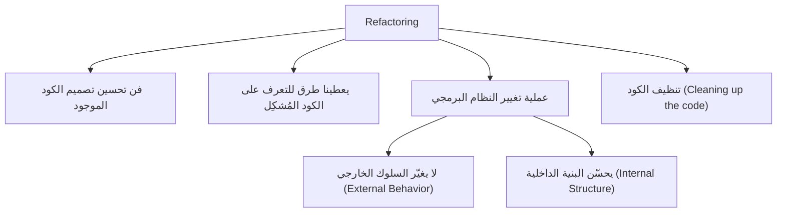

**الشرح:** المخطط يلخّص التعريفات الأربعة التي ذكرها المحاضر لنفس المفهوم — كلها تصب في معنى واحد: نغيّر الشكل الداخلي، ونحافظ على النتيجة الخارجية.

---

#### 📖 الشرح

تخيّل أن عندك غرفة مليئة بالأغراض بشكل عشوائي — تقدر توصل لكل شيء (السلوك الخارجي شغّال)، لكن لو حد ثاني دخل الغرفة، ما بيفهم شيء. الآن لو رتّبت الغرفة بدون ما تضيف أو تشيل أي غرض، النتيجة (كل الأغراض موجودة وتقدر تستخدمها) ما تغيّرت، لكن أي حد يدخل الآن يفهم وين كل شيء. هذا بالضبط `Refactoring`: نفس الوظيفة، لكن بنية أوضح.

المثال المباشر من المحاضرة (كود الراتب):

```
if (salary < 5000){
    salary = salary * 2.35;
    update();
}
else{
    salary = salary * 2.00;
    update();
}
```

يتحول إلى:

```
if (salary < 5000){
    salary = salary * 2.35;
}
else{
    salary = salary * 2.00;
}
update();
```

النتيجة النهائية للبرنامج (يُحدَّث `salary` ثم يُستدعى `update()`) **نفسها تماماً**، لكن الكود صار أنظف — سطر `update()` تكرر مرتين بدون داعٍ، والآن صار مرة واحدة فقط. هذا مثال حي على مبدأ `DRY` (عدم تكرار الكود) يتحقق عبر Refactoring.

#### 🎯 الملخص السريع
- `Refactoring` = فن تحسين تصميم كود موجود مسبقاً
- يعطي طرق للتعرف على المشاكل (`smells`) وحلول جاهزة (`recipes`)
- **لا يغيّر** السلوك الخارجي، **يحسّن** البنية الداخلية فقط
- يُسمّى أيضاً "تنظيف الكود"

#### 📚 التطبيق
نستخدم Refactoring باستمرار أثناء عملنا اليومي — مو مرة واحدة في نهاية المشروع، بل كل مرة نلاحظ كود يمكن تحسينه.

#### ⚠️ أخطاء شائعة

#### الفهم الخاطئ ❌:
يظن البعض أن Refactoring يعني إعادة كتابة الكود بالكامل أو تحسين أدائه (performance).

#### الفهم الصحيح ✅:
Refactoring يحافظ على نفس السلوك تماماً، ويركّز فقط على وضوح البنية الداخلية وسهولة الصيانة — ليس بالضرورة تحسين السرعة.

#### 📄 النص الأصلي من المحاضرة
<details>
<summary>عرض النص الأصلي (coverage: 100%)</summary>

> "art of improving the design of existing code. provides us with ways to recognize problematic code and gives us recipes for improving it. process of changing a software system: it does not alter the external behavior of the code yet improves its internal structure. Cleaning up the code"

**ملاحظة على التغطية:**
- ✓ تم شرح كل نقطة من التعريف
- ℹ️ إضافة من الدليل: تشبيه الغرفة + إعادة صياغة مثال الراتب بالتفصيل

</details>

---

### 2. ما هو ليس Refactoring (Not Refactoring)
<!-- @type: fact -->
<!-- @render: {type: "diagram-first", coverage: "100%"} -->

#### 📍 أين نحن الآن؟
بعد تعريف Refactoring، نحدد حدوده — إيش اللي **ليس** Refactoring.

#### ⬅️ الربط مع السابق
هذا امتداد مباشر للتعريف: نفهم الحد الفاصل بين "تحسين البنية" و"تغيير الوظيفة".

#### 💡 الفكرة الأساسية
**أي عملية تضيف سلوكاً جديداً أو تعيد كتابة النظام من الصفر لا تُعتبر Refactoring.**

---

#### 📊 المخطط: Refactoring vs Not Refactoring

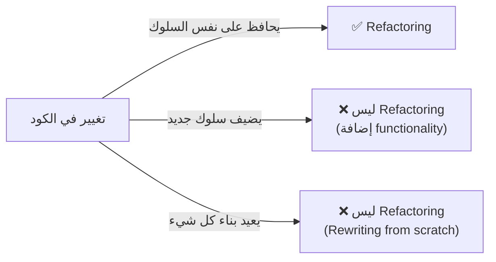

**الشرح:** الفارق الحاسم هو: هل السلوك الخارجي تغيّر أم لا؟ لو تغيّر (بإضافة ميزة أو بإعادة بناء كامل)، فهذا ليس Refactoring.

---

#### 📖 الشرح

من الأمثلة على ما **ليس** Refactoring:
- **إضافة functionality جديدة:** مثل إضافة `attributes` جديدة، `methods` جديدة، أو `classes` جديدة بالكامل — هذه تطوير (development)، وليست Refactoring.
- **إعادة الكتابة من الصفر (Rewriting from scratch):** لو رميت الكود القديم وكتبت نظام جديد بالكامل، هذا مشروع جديد، مو Refactoring.

#### 🎯 الملخص السريع
- إضافة ميزة جديدة ≠ Refactoring
- إعادة كتابة من الصفر ≠ Refactoring
- Refactoring = تحسين بنية موجودة فقط

#### 📚 التطبيق
مهم تفرّق بين الاثنين وقت العمل: لو طلب منك "حسّن الكود"، لا تضيف ميزات جديدة أثناء ذلك — افصل بين الاثنين حتى لا تختلط الاختبارات (testing) والمراجعة (code review).

#### ⚠️ أخطاء شائعة

#### الفهم الخاطئ ❌:
يعتقد بعض المبرمجين أنهم "يعملون Refactoring" أثناء إضافة ميزة جديدة لأنهم يغيّرون كود قديم بالمناسبة.

#### الفهم الصحيح ✅:
لازم تفصل: أولاً Refactor (تنظيف)، بعدين أضف الميزة الجديدة — أو العكس، لكن ما تخلطهم في نفس الخطوة لأن كل واحد له هدف واختبار مختلف.

#### 📄 النص الأصلي من المحاضرة
<details>
<summary>عرض النص الأصلي (coverage: 100%)</summary>

> "Add new functionality: attributes, methods, classes. Rewriting from scratch"

</details>

---

### 3. لماذا نحتاج Refactoring؟ (Why We Need Refactoring)
<!-- @type: practice -->
<!-- @render: {type: "diagram-first", coverage: "100%"} -->

#### 📍 أين نحن الآن؟
بعد فهم التعريف والحدود، نفهم الآن **الدافع العملي** وراء Refactoring.

#### ⬅️ الربط مع السابق
لأننا عرفنا إيش هو Refactoring وإيش مو هو، الآن السؤال الطبيعي: ليش نتعب نفسنا فيه؟

#### 💡 الفكرة الأساسية
**لا يمكن الوصول للتصميم الصحيح من أول مرة — Refactoring يقلل حجم الكود، يبسّط البنية، ويساعد في اكتشاف الأخطاء.**

---

#### 📊 المخطط: فوائد Refactoring

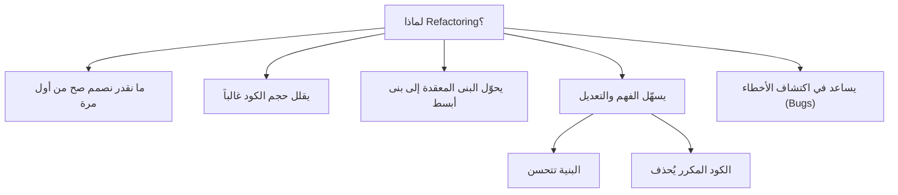

**الشرح:** كل سبب من هذه الأسباب مستقل، لكنها تصب في هدف واحد: كود أسهل فهماً وتعديلاً.

---

#### 📖 الشرح

**السبب الأول:** لا أحد — مهما كان خبيراً — يستطيع كتابة أفضل تصميم من أول محاولة؛ الفهم يتطور مع الوقت مع رؤية النظام الفعلي يعمل.

**السبب الثاني والثالث:** في الغالب حجم الكود يقل بعد Refactoring (لأن التكرار يُزال)، والبنى المربكة (confusing structures) تتحول إلى بنى أبسط.

**السبب الرابع:** Refactoring يجعل البرنامج أسهل للفهم والتعديل، لأن البنية تتحسن والكود المكرر (duplicated code) يُحذف — وهذان هما بالضبط سببا صعوبة الصيانة.

**السبب الخامس:** أثناء عملية Refactoring، غالباً تكتشف bugs كانت مخفية داخل الكود المعقد أو المكرر.

#### 🎯 الملخص السريع
- لا يوجد تصميم مثالي من أول مرة
- Refactoring يقلل الحجم ويبسّط البنية
- يسهّل الفهم والتعديل عبر تحسين البنية + إزالة التكرار
- يساعد في اكتشاف الأخطاء

#### 📚 التطبيق
هذا يفيدنا مباشرة في اتخاذ قرار "متى نرفكتر؟" في القسم التالي.

#### ⚠️ أخطاء شائعة

#### الفهم الخاطئ ❌:
يظن البعض أن Refactoring "مضيعة وقت" لأنه لا يضيف ميزات جديدة يراها العميل.

#### الفهم الصحيح ✅:
Refactoring استثمار طويل المدى — يقلل تكلفة الصيانة المستقبلية ويقلل احتمال الأخطاء، حتى لو لم يظهر تأثيره مباشرة للعميل.

#### 📄 النص الأصلي من المحاضرة
<details>
<summary>عرض النص الأصلي (coverage: 100%)</summary>

> "We cannot get right design from the first time... Often code size is reduced after refactoring. Confusing structures are transformed into simpler structures. Refactoring making software easier to understand and modify because: structure is improved, duplicated code is eliminated. Helps in finding bugs"

</details>

---

### 4. متى نُرفكتِر؟ (When To Refactor)
<!-- @type: practice -->
<!-- @render: {type: "diagram-first", coverage: "100%"} -->

#### 📍 أين نحن الآن؟
نعرف الآن **متى** بالضبط نطبّق Refactoring خلال العمل اليومي.

#### ⬅️ الربط مع السابق
بعد فهم الفوائد، نحتاج توقيتاً عملياً — Refactoring ليس نشاطاً منفصلاً بل جزء من سير العمل.

#### 💡 الفكرة الأساسية
**نرفكتر عندما نضيف وظيفة جديدة، عندما نراجع الكود، وعندما نحتاج نصلح bug.**

---

#### 📊 المخطط: متى نطبّق Refactoring

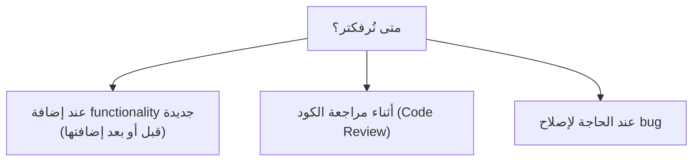

**الشرح:** هذه ثلاث لحظات طبيعية في دورة حياة أي مبرمج — Refactoring مدمج فيها، مو منفصل عنها.

---

#### 📖 الشرح

- **إضافة وظيفة جديدة:** قبل الإضافة، Refactoring يجعل الكود جاهزاً لاستقبال الميزة بسهولة (Refactor first, then add). بعد الإضافة، يساعد في تنظيف أي فوضى نتجت أثناء التطوير السريع.
- **مراجعة الكود:** أثناء `code review`، لو لاحظت `smell`، فرصة مثالية لتحسينه فوراً.
- **إصلاح bug:** غالباً السبب في صعوبة اكتشاف bug هو تعقيد الكود؛ Refactoring الكود المحيط بالخطأ يسهّل رؤية السبب الحقيقي.

#### 🎯 الملخص السريع
- Refactor عند إضافة functionality (قبل/بعد)
- Refactor عند code review
- Refactor عند إصلاح bug

#### 📚 التطبيق
هذا القسم يمهّد مباشرة لموضوع "البرامج السهلة" و"الكود السيئ" — لأن معرفة "متى" تحتاج معرفة "كيف تتعرف على المشكلة" أولاً.

#### ⚠️ أخطاء شائعة

#### الفهم الخاطئ ❌:
البعض يؤجل Refactoring لـ "sprint خاص بالتنظيف" في نهاية المشروع فقط.

#### الفهم الصحيح ✅:
Refactoring نشاط مستمر مدمج في كل يوم عمل، لا نشاط منفصل يُؤجَّل — كلما أُجِّل، تراكمت المشاكل وصار أصعب.

#### 📄 النص الأصلي من المحاضرة
<details>
<summary>عرض النص الأصلي (coverage: 100%)</summary>

> "Refactor when you: Add new functionality (before or after adding the function(s)), Reviewing the code, Need to fix a bug"

</details>

---

### 5. البرامج السهلة (Easier Programs)
<!-- @type: fact -->
<!-- @render: {type: "diagram-first", coverage: "100%"} -->

#### 📍 أين نحن الآن؟
نحدد الآن **خصائص** البرنامج الصعب التعديل، لنعرف ما الذي نسعى لتفاديه.

#### ⬅️ الربط مع السابق
بعد معرفة "متى نرفكتر"، نحتاج معياراً واضحاً: كيف نعرف أن البرنامج "صعب"؟

#### 💡 الفكرة الأساسية
**البرامج الصعبة القراءة، أو المليئة بالمنطق المكرر، أو التي تتطلب تعديل كود شغّال، أو التي فيها شروط معقدة — كلها صعبة التعديل.**

---

#### 📊 المخطط: أسباب صعوبة التعديل

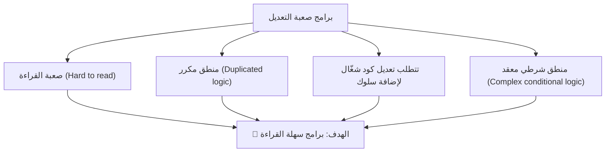

**الشرح:** أربعة أسباب مباشرة لصعوبة التعديل، وكلها تقود لنفس النتيجة: يجب أن يكون البرنامج سهل القراءة.

---

#### 📖 الشرح

هذه الأسباب الأربعة هي بالضبط ما تبحث عنه `code smells` لاحقاً في المحاضرة:
1. **صعوبة القراءة** تعني أن أي تعديل يتطلب وقتاً طويلاً لفهم الكود أولاً.
2. **المنطق المكرر** يعني أن أي تعديل يجب تكراره في كل مكان يوجد فيه نفس المنطق (خطر نسيان مكان).
3. **الحاجة لتعديل كود شغّال (running code)** لإضافة سلوك جديد تعني خطر كسر شيء يعمل بالفعل.
4. **الشروط المعقدة** تجعل تتبع كل الحالات الممكنة أمراً صعباً ومربكاً.

#### 🎯 الملخص السريع
- صعوبة القراءة → صعوبة التعديل
- التكرار → صعوبة التعديل
- الحاجة لتعديل كود شغّال → خطر
- الشروط المعقدة → ارتباك
- **الهدف النهائي: برامج سهلة القراءة**

#### 📚 التطبيق
هذه الخصائص الأربعة هي بالضبط ما سنتعرف عليه في قسم `Bad Code (Code Smells)` القادم — كل واحدة منها تقابل smell محدد.

#### ⚠️ أخطاء شائعة

#### الفهم الخاطئ ❌:
البعض يظن أن "سهولة القراءة" رفاهية أو مسألة ذوق شخصي فقط.

#### الفهم الصحيح ✅:
سهولة القراءة تؤثر مباشرة على تكلفة الصيانة وسرعة إضافة الميزات وعدد الأخطاء — وهي معيار هندسي حقيقي.

#### 📄 النص الأصلي من المحاضرة
<details>
<summary>عرض النص الأصلي (coverage: 100%)</summary>

> "Programs that are hard to read are hard to modify. Programs that have duplicated logic are hard to modify. Programs that require additional behavior that requires you to change running code are hard to modify. Programs with complex conditional logic are hard to modify. → Programs need to be easy to read"

</details>

---

### 6. الكود السيئ (Bad Code / Code Smells)
<!-- @type: fact -->
<!-- @render: {type: "diagram-first", coverage: "100%"} -->

#### 📍 أين نحن الآن؟
نتعلم الآن المصطلحات المستخدمة لوصف الكود السيئ، وأنواع "الروائح" الممكنة.

#### ⬅️ الربط مع السابق
بعد تحديد خصائص الكود الصعب، نعطيها الآن اسماً موحداً: `Code Smell`.

#### 💡 الفكرة الأساسية
**`Code Smell` (رائحة الكود) هو مؤشر — قوي أو خفي — على وجود مشكلة تصميمية محتملة في الكود، حتى لو كان يعمل بشكل صحيح ظاهرياً.**

---

#### 📊 المخطط: مصطلحات ودرجات Code Smell

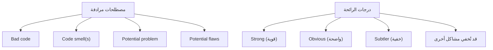

**الشرح:** الفكرة أن "رائحة" واحدة قد تكون العرض الظاهر فقط، بينما المشكلة الحقيقية أعمق ومخفية خلفها.

---

#### 📖 الشرح

يستخدم المصطلح `smell` (رائحة) لأن الكود — تماماً مثل الطعام — قد "يبدو سليماً" لكن رائحته تنبئ بمشكلة. بعض الروائح قوية وواضحة فوراً (مثل method طولها 500 سطر)، وبعضها خفي (subtler) ولا يظهر إلا بعد تدقيق، وأحياناً رائحة واحدة تكون قناعاً (mask) يخفي مشكلة أعمق تحتها.

#### 🎯 الملخص السريع
- Code Smell = مؤشر على مشكلة تصميمية محتملة
- يمكن أن تكون: قوية / واضحة / خفية / تخفي مشاكل أخرى
- المصطلح لا يعني أن الكود "خاطئ حتماً"، بل أنه "يستحق فحصاً"

#### 📚 التطبيق
في الأقسام القادمة سنمر على سبعة أنواع محددة من `smells` مع الحلول المقترحة لكل واحد.

#### ⚠️ أخطاء شائعة

#### الفهم الخاطئ ❌:
يظن البعض أن code smell = bug، أي أن الكود لا يعمل بشكل صحيح.

#### الفهم الصحيح ✅:
الكود قد يعمل بشكل صحيح تماماً (functionally correct) ومع ذلك يحتوي على smell — المشكلة في قابلية الصيانة، ليس في صحة النتيجة.

#### 📄 النص الأصلي من المحاضرة
<details>
<summary>عرض النص الأصلي (coverage: 100%)</summary>

> "Terms: Bad code, Code smell(s), Potential problem, Potential flaws. Smells could be: Strong, Obvious, Subtler, … or could mask other problems"

</details>

---

### 7. دورة Refactoring (Refactoring Cycle)
<!-- @type: fact -->
<!-- @render: {type: "diagram-first", coverage: "100%"} -->

#### 📍 أين نحن الآن؟
نتعلم الآن الخوارزمية العملية (process) التي نتبعها فعلياً لتطبيق Refactoring.

#### ⬅️ الربط مع السابق
بعد فهم Code Smells كمفهوم، نحتاج خطوات محددة نستخدمها كل مرة نجد فيها smell.

#### 💡 الفكرة الأساسية
**دورة Refactoring هي حلقة متكررة: طالما توجد smells، اختر الأسوأ، اختر التقنية المناسبة، طبّقها، ثم كرر.**

---

#### 📊 المخطط: دورة Refactoring

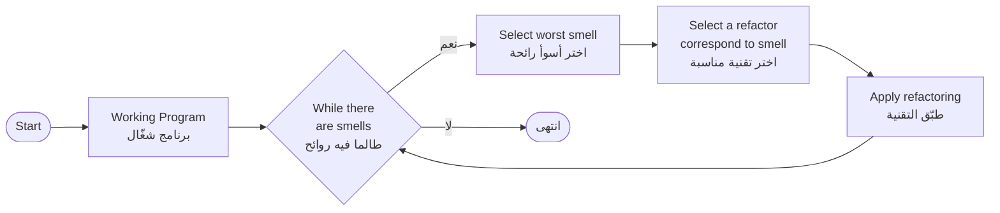

**الشرح:** هذه حلقة (loop) كلاسيكية — الشرط هو "هل ما زال هناك smell؟"، وداخل الحلقة نختار الأسوأ أولاً (worst first)، ثم نطبّق التقنية المناسبة، ثم نعيد الفحص من جديد.

---

#### 📖 الشرح

النقطة المهمة هنا هي ترتيب الأولوية: **لا نُصلح كل شيء دفعة واحدة**، بل نبدأ بـ "أسوأ رائحة" (worst smell) لأنها غالباً تسبب أكبر ضرر أو تُخفي مشاكل أخرى. بعد إصلاحها، قد تختفي روائح أخرى تلقائياً أو تصبح أوضح، فنكرر الدورة من جديد حتى لا يبقى smell يستحق الإصلاح.

#### 🎯 الملخص السريع
1. ابدأ ببرنامج شغّال (working program)
2. طالما توجد smells → كرر:
   - اختر الأسوأ
   - اختر التقنية المناسبة
   - طبّقها
3. توقف عندما لا توجد smells (أو تصل لمستوى مقبول)

#### 📚 التطبيق
هذه الدورة هي الإطار الذي سنطبقه عملياً في القسم القادم على كل smell محدد بالتقنية المناسبة له.

#### ⚠️ أخطاء شائعة

#### الفهم الخاطئ ❌:
البعض يحاول إصلاح كل الـ smells في نفس الوقت دفعة واحدة قبل أي اختبار.

#### الفهم الصحيح ✅:
الدورة تفترض خطوات صغيرة متكررة — نصلح رائحة واحدة، نختبر (compile & test)، ثم ننتقل للتالية؛ هذا يقلل خطر كسر الكود.

#### 📄 النص الأصلي من المحاضرة
<details>
<summary>عرض النص الأصلي (coverage: 100%)</summary>

> "Start → Working program → While there are smells → Select worst smell → Select a refactor correspond to smell → Apply refactoring → (back to While there are smells)"

</details>

---

### 8. الرجوع للروائح: أنواع Code Smells وحلولها
<!-- @type: principle -->
<!-- @render: {type: "diagram-first", coverage: "95%"} -->

#### 📍 أين نحن الآن؟
نطبّق الآن الدورة السابقة على قائمة محددة من `Code Smells`، مع تقنية أو نمط تصميمي (`Design Pattern`) مناسب لكل واحدة.

#### ⬅️ الربط مع السابق
بعد فهم "الدورة" كإطار عام، هنا التفاصيل: أي smell يقابل أي حل؟ وهذا `PRINCIPLE` لأن اختيار الحل يعتمد على **سبب** ظهور الـ smell، لا حل واحد يناسب كل الحالات.

#### 💡 الفكرة الأساسية
**كل نوع من Code Smells له علاج مختلف؛ اختيار العلاج الصحيح يعتمد على سبب المشكلة تحديداً، وليس فقط اسم الـ smell.**

---

#### 📊 المخطط: خريطة Smells وحلولها

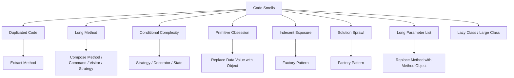

**الشرح:** المخطط يربط كل smell بالحل أو الأنماط (patterns) المذكورة في المحاضرة له. لاحظ أن `Long Method` وحدها قد تحتاج أكثر من حل حسب السبب الجذري.

---

#### 📖 الشرح

**8.1 — Duplicated Code (كود مكرر):**
نفس بنية الكود (code structure) موجودة في أكثر من مكان واحد. الحل: `Extract Method` — استخرج الجزء المكرر إلى دالة (method) واحدة، ثم نادِها من كل الأماكن.

**8.2 — Long Method (دالة طويلة):**
السؤال الأول: كم عدد الأسطر؟ إذا كانت طويلة بلا سبب واضح → استخدم `Compose Method` (قسّمها لدوال أصغر بأسماء واضحة).
- إذا كانت طويلة بسبب `switch` كبير لمعالجة طلبات (handling request) → استخدم نمط `Command (Handler)`.
- إذا كانت طويلة بسبب `switch` كبير لجمع بيانات من عدة classes → استخدم نمط `Visitor`.
- إذا كانت طويلة بسبب نسخ متعددة من خوارزمية مع منطق شرطي → استخدم نمط `Strategy`.

**8.3 — Conditional Complexity (تعقيد شرطي):**
عند إضافة ميزات جديدة، بعض المنطق الشرطي يصبح معقداً ومكلفاً. الحلول الممكنة: `Strategy pattern`، `Decorator pattern`، أو `State pattern` — كل واحد يناسب سياقاً مختلفاً (خوارزميات بديلة، طبقات سلوك إضافية، أو حالات متغيرة على التوالي).

**8.4 — Primitive Obsession (الهوس بالأنواع الأولية):**
عندما يعتمد الكود بشكل مفرط على أنواع بدائية (`int`, `String`, `double`) بدلاً من مستوى أعلى من التجريد (abstraction). مثال المحاضرة: استخدام `String` مباشرة لتمثيل حالات مثل `"REQUESTED"` بدلاً من إنشاء class مخصص `PermissionState` يحتوي القيم الثابتة `REQUESTED`, `CLAIMED`, `DENIED`, `GRANTED`. الحل: `Replace Data Value with Object`.

**8.5 — Indecent Exposure (كشف غير لائق):**
يشير إلى غياب `Information Hiding` — أي أن methods أو classes يجب أن تبقى مخفية (internal)، لكنها ظاهرة للعملاء (clients) مباشرة. الحل: استخدام `Factory Pattern` — بحيث العميل (Client) يتعامل فقط مع class مجرد عام (`AttributeDescriptor`)، بينما الـ subclasses الفعلية (`BooleanDescriptor`, `DefaultDescriptor`, `ReferenceDescriptor`) تبقى غير مرئية خارج الـ package.

**8.6 — Solution Sprawl (انتشار الحل):**
شبيه بـ `Shotgun Surgery` — تغيير بسيط يتطلب تعديل عدة classes، لأن البيانات والكود الخاص بإنشاء (instantiate) class واحد أصبحا منتشرين عبر classes عديدة. مثال المحاضرة: `aClient` يضطر ينادي `setStringNodeDecoding`، `setRemoveEscapeCharacters`، ثم `parse` على `aParser`، الذي بدوره ينادي عدة استعلامات (`shouldDecodeStringNodes`, `shouldRemoveEscapeCharacters`) على `aStringParser`. الحل: تجميع منطق الإنشاء في `Factory` واحد (`aNodeFactory`) يستقبل الإعدادات ويُنشئ الكائن مباشرة، فيختصر عدد الرسائل والاعتماديات.

**8.7 — Long Parameter List (قائمة معاملات طويلة):**
في البرمجة الكائنية (`OO`)، لا حاجة لتمرير عدد كبير من المعاملات كما في البرمجة الإجرائية القديمة. مثال:
```
int basePrice = _quantity * _itemPrice;
discountLevel = getDiscountLevel();
double finalPrice = discountedPrice (basePrice, discountLevel);
```
يتحول إلى:
```
int basePrice = _quantity * _itemPrice;
double finalPrice = discountedPrice (basePrice);
```
لأن `discountLevel` يمكن حسابه داخلياً بدل تمريره كمعامل منفصل. الحل العام: `Replace Method with Method Object` أو تجميع المعاملات المرتبطة في كائن واحد.

#### 🎯 الملخص السريع
| الـ Smell | الحل المقترح |
| --- | --- |
| Duplicated Code | Extract Method |
| Long Method (عام) | Compose Method |
| Long Method (switch لمعالجة طلبات) | Command Pattern |
| Long Method (switch لجمع بيانات) | Visitor Pattern |
| Long Method (خوارزميات متعددة) | Strategy Pattern |
| Conditional Complexity | Strategy / Decorator / State |
| Primitive Obsession | Replace Data Value with Object |
| Indecent Exposure | Factory Pattern |
| Solution Sprawl | Factory Pattern |
| Long Parameter List | Replace Method with Method Object |

#### 💼 السياقات المختلفة (Context Examples)

**سيناريو 1: نظام صلاحيات (SystemPermission)**
- المشكلة: حالات الصلاحية (`REQUESTED`, `CLAIMED`, `DENIED`, `GRANTED`) مُمثَّلة كنصوص (`String`) مباشرة.
- **الحل:** `Replace Data Value with Object` — إنشاء class `PermissionState` يحتوي القيم كـ constants ثابتة (`static final`).
- **السبب:** يمنع الأخطاء الإملائية في النصوص، ويعطي مستوى تجريد أعلى (`state.equals(REQUESTED)` بدل مقارنة نصوص خام).

**سيناريو 2: Parser لملفات (aStringParser)**
- المشكلة: العميل يضطر ينادي عدة setters منفصلة قبل الـ parsing، والبيانات منتشرة بين عدة classes.
- **الحل:** `Factory Pattern` (`aNodeFactory`) يجمع كل الإعدادات في مكان واحد.
- **السبب:** تقليل عدد الرسائل (messages) والاعتماديات بين الكائنات، وتسهيل الصيانة المستقبلية.

---

#### ⚖️ المقايضة: حل يدوي مباشر vs استخدام Design Pattern

| الجانب | حل مباشر (بدون pattern) | استخدام Design Pattern |
| --- | --- | --- |
| **السرعة الأولية** | أسرع في الكتابة | يحتاج وقت تصميم إضافي |
| **قابلية التوسع** | ضعيفة | عالية جداً |
| **الصيانة المستقبلية** | صعبة مع نمو المشروع | أسهل بكثير |
| **الأنسب لـ** | نماذج أولية صغيرة (prototypes) | أنظمة تُصان وتتوسع طويلاً |

#### 🤔 تفعيل الفهم
عندك method طولها 200 سطر، فيها `switch` كبير يحسب عمولة موظف حسب نوعه (مدير، مبيعات، فني). كل نوع له خوارزمية حساب مختلفة تماماً، وقد تُضاف أنواع جديدة لاحقاً. أي تقنية Refactoring تختار ولماذا؟

**(الإجابة: `Strategy Pattern` — لأن المشكلة أن هناك عدة نسخ من خوارزمية حساب مع منطق شرطي؛ Strategy تسمح بإضافة نوع جديد كـ class منفصل دون تعديل الكود القديم.)**

#### 📄 النص الأصلي من المحاضرة
<details>
<summary>عرض النص الأصلي (coverage: 95%)</summary>

> "Duplicated code: Same code structure in more than one place → use Extract Method. Long method: How many lines? → use Compose method. If it is long because it contains large switch for handling request → use Command (Handler) pattern. If it is long because it contains large switch for gather data from several classes → use Visitor pattern. If it is long because it numerous versions of an algorithm and conditional logic → use Strategy pattern. Conditional complexity: By adding new features some conditional logic becomes complicated and expensive → use Strategy pattern, → use Decorator pattern, → use State pattern. Primitive obsession: Primitives (integers, strings, double, i.e., low-level language elements). Primitive obsession appears when code relies too much on primitives, i.e., you have not higher level of abstraction. Indecent exposure: Indicates lack of "information hiding", means, methods & classes that must not be visible, are publicly visible to the clients → Use Factory Pattern. Solution sprawl: Similar to shotgun surgery smell. Making a simple change requires you to change several classes. Data and code used to instantiate a class is sprawled across numerous classes. Long parameter list: In OO not like old days, no need to pass a lot of params → use Replace Method"

**ملاحظة على التغطية:**
- ✓ تم شرح كل smell مذكور في المحاضرة مع حله
- ⚠️ لم تُشرح `Lazy class` و`Large class` بالتفصيل لأن المحاضرة ذكرتهما بالاسم فقط بدون تفاصيل إضافية (سيُشار لهما في Cheat Sheet)
- ℹ️ إضافة من الدليل: جدول التلخيص، السيناريوهات، تفعيل الفهم

</details>

---

### 9. أدوات Refactoring في NetBeans
<!-- @type: fact -->
<!-- @render: {type: "diagram-first", coverage: "100%"} -->

#### 📍 أين نحن الآن؟
ننتقل من النظرية إلى الأدوات العملية التي تسهّل تطبيق Refactoring آلياً داخل IDE.

#### ⬅️ الربط مع السابق
بعد أن تعلمنا تقنيات Refactoring يدوياً، نرى أن بيئات التطوير مثل `NetBeans` توفر أدوات جاهزة تنفذ نفس هذه العمليات تلقائياً.

#### 💡 الفكرة الأساسية
**بيئات التطوير الحديثة (مثل NetBeans) توفر عمليات Refactoring جاهزة تُطبَّق آلياً مع تحديث كل الكود المرتبط تلقائياً.**

---

#### 📊 المخطط: عمليات Refactoring في NetBeans

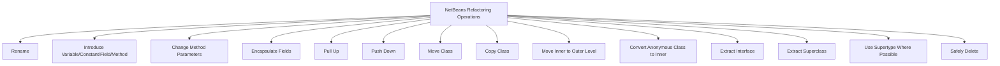

**الشرح:** كل عملية من هذه العمليات تقابل تحسيناً تصميمياً محدداً، وتقوم NetBeans بتحديث كل الملفات المرتبطة في المشروع تلقائياً.

---

#### 📖 التعريف الدقيق

| العملية | الوصف |
| --- | --- |
| `Rename` | تغيير اسم class أو variable أو method لاسم أوضح، مع تحديث كل الاستخدامات في المشروع |
| `Introduce Variable/Constant/Field/Method` | توليد جملة من كود محدد واستبدال الجزء المحدد باستدعاء لها |
| `Change Method Parameters` | إضافة معاملات لدالة وتغيير مستوى الوصول (access modifier) |
| `Encapsulate Fields` | توليد getter و setter لحقل (field)، وتحديث كل الكود المرجعي لاستخدامهما |
| `Pull Up` | نقل methods و fields إلى class أب (superclass) ترثه الفئة الحالية |
| `Push Down` | نقل inner classes أو methods أو fields إلى كل الفئات الوارثة (subclasses) |
| `Move Class` | نقل class إلى package آخر أو داخل class آخر، مع تحديث كل المراجع |
| `Copy Class` | نسخ class إلى نفس أو package مختلف |
| `Move Inner to Outer Level` | نقل inner class مستوى واحد للأعلى في التسلسل الهرمي |
| `Convert Anonymous Class to Inner` | تحويل anonymous class إلى inner class باسم و constructor |
| `Extract Interface` | إنشاء interface جديدة من الـ public non-static methods المحددة |
| `Extract Superclass` | إنشاء abstract class جديدة، ونقل الفئة الحالية والحقول والدوال المختارة إليها |
| `Use Supertype Where Possible` | تغيير الكود ليستخدم supertype بدل النوع المحدد |
| `Safely Delete` | فحص كل المراجع لعنصر ما، وحذفه تلقائياً إذا لم يستخدمه أي كود آخر |

#### 🎯 الملخص السريع
- NetBeans يوفر 14 عملية Refactoring آلية على الأقل
- كل عملية تقابل مشكلة تصميمية شائعة (تسمية، تكرار، وراثة، تغليف...)
- التحديث يشمل كل ملفات المشروع تلقائياً، وليس الملف الحالي فقط

#### 📚 التطبيق
هذه الأدوات تجعل تطبيق التقنيات النظرية (مثل `Encapsulate Field` الذي سنشرحه بالتفصيل في القسم القادم) أسرع وأكثر أماناً — لأن IDE يتولى تحديث كل المراجع بدل القيام بذلك يدوياً.

#### 📄 النص الأصلي من المحاضرة
<details>
<summary>عرض النص الأصلي (coverage: 100%)</summary>

> جدول يحتوي على: Rename, Introduce Variable/Constant/Field/Method, Change Method Parameters, Encapsulate Fields, Pull Up, Push Down, Move Class, Copy Class, Move Inner to Outer Level, Convert Anonymous Class to Inner, Extract Interface, Extract Superclass, Use Supertype Where Possible, Safely Delete — مع وصف كل عملية.

</details>

---

### 10. مثال تطبيقي: Encapsulate Field
<!-- @type: practice -->
<!-- @render: {type: "diagram-first", coverage: "100%"} -->

#### 📍 أين نحن الآن؟
نطبّق الآن تقنية عملية كاملة خطوة بخطوة: `Encapsulate Field`.

#### ⬅️ الربط مع السابق
هذه واحدة من عمليات NetBeans المذكورة في الجدول السابق، ونشرحها هنا بالتفصيل كمثال كامل على منهجية "خطوات محددة" في Refactoring.

#### 💡 الفكرة الأساسية
**`Encapsulate Field` تحوّل حقلاً عاماً (public field) إلى حقل خاص (private) مع getter و setter، حتى يتحكم الـ class بالوصول إليه بدل السماح للعملاء بالوصول المباشر.**

---

#### 📊 المخطط: خطوات Encapsulate Field

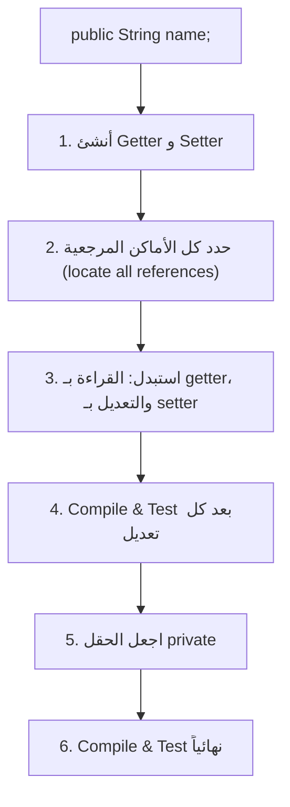

**الشرح:** الخطوات مصممة لتقليل الخطر — نضيف الـ getter/setter أولاً بينما الحقل ما زال عاماً (fallback آمن)، ثم نستبدل الاستخدامات تدريجياً، ولا نجعله `private` إلا بعد التأكد أن كل الاستخدامات تحولت.

---

#### 📖 الشرح

**ليش نطبّق هذا الـ Refactoring؟** لجعل العملاء (clients) يستخدمون methods للوصول للحقل بدلاً من الوصول المباشر (`public String name;`) — هذا يحمي الـ class من تغييرات مستقبلية في طريقة تخزين البيانات، ويسمح بإضافة تحقق (validation) لاحقاً داخل الـ setter دون كسر الكود الخارجي.

الخطوات بالترتيب الدقيق كما وردت في المحاضرة:
1. إنشاء getters و setters
2. تحديد كل المراجع (locate all references)
3. استبدال الوصول المباشر بنداءات getter، والتعديلات بنداءات setter
4. Compile و test بعد تعديل كل مرجع (وليس بعد كل التعديلات دفعة واحدة)
5. تصريح الحقل كـ `private`
6. Compile و test نهائياً

#### 🎯 الملخص السريع
- الهدف: منع الوصول المباشر للحقل من خارج الـ class
- الترتيب مهم: أنشئ الوصول البديل أولاً، ثم امنع القديم لاحقاً
- اختبر بعد كل خطوة صغيرة، لا بعد كل شيء دفعة واحدة

#### 📚 التطبيق
هذه المنهجية (خطوات صغيرة + اختبار متكرر) تنطبق على كل تقنيات Refactoring اللاحقة، وسنراها مرة أخرى في `Replace Method with Method Object`.

#### ⚠️ أخطاء شائعة

#### الفهم الخاطئ ❌:
يبدأ بعض المبرمجين بجعل الحقل `private` أولاً، ثم يحاولون إصلاح كل مكان استخدمه مباشرة دفعة واحدة.

#### الفهم الصحيح ✅:
الترتيب الصحيح هو: أضف الوصول البديل (getter/setter) أولاً بينما القديم ما زال يعمل، بدّل الاستخدامات تدريجياً مع اختبار، ثم امنع الوصول القديم أخيراً — هذا يقلل خطر كسر الكود في منتصف العملية.

#### 📄 النص الأصلي من المحاضرة
<details>
<summary>عرض النص الأصلي (coverage: 100%)</summary>

> "Encapsulate Field: public String name; Why to refactor: Make clients use methods to access the field not directly! Steps: Create getters & setters, Locate all ref, Replace: accesses with calls to getter, Changes to the field with calls to setter, Compile and test after changing each reference, Declare the field as private, Compile and test"

</details>

---

### 11. طرق Refactoring: Extract و Inline
<!-- @type: fact -->
<!-- @render: {type: "diagram-first", coverage: "100%"} -->

#### 📍 أين نحن الآن؟
ننتقل للجزء الثاني من المحاضرة (Part 2)، حيث نتعلم مجموعة قوالب Refactoring المصنّفة تحت `Extract` و `Inline`.

#### ⬅️ الربط مع السابق
بعد أن رأينا `Encapsulate Field` كمثال كامل، الآن نتعرف على تصنيف أوسع لتقنيات Refactoring: بعضها "يستخرج" كوداً (Extract) والبعض الآخر "يدمج" كوداً (Inline).

#### 💡 الفكرة الأساسية
**`Extract` يفصل جزءاً من الكود إلى وحدة مستقلة (method/class/subclass/superclass)، بينما `Inline` يدمج الكود المستقل داخل مكان استخدامه عندما يصبح الفصل غير مفيد.**

---

#### 📊 المخطط: Extract vs Inline

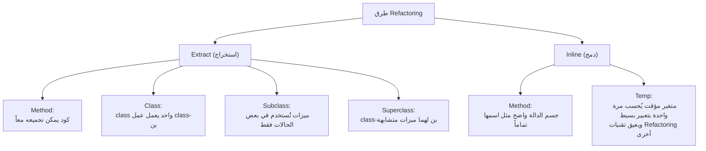

**الشرح:** المخطط يوضح أن `Extract` و `Inline` عمليتان متعاكستان تماماً — واحدة تفصل، والأخرى تجمع — وكل واحدة تُستخدم حسب حالة الكود المختلفة.

---

#### 📖 الشرح

**Extract Method:** عندما يكون هناك جزء من الكود (code fragment) يمكن تجميعه منطقياً في وحدة واحدة، نستخرجه كـ method مستقلة بحيث تُستدعى من مكانها الأصلي.

**Extract Class:** عندما يقوم class واحد بعمل يجب أن يتوزع على classين، نفصل جزءاً من مسؤولياته إلى class جديد.

**Extract Subclass:** عندما تكون بعض ميزات class مستخدمة فقط في بعض حالاته (instances)، نفصلها في subclass مخصص.

**Extract Superclass:** عندما يكون هناك classان لهما ميزات متشابهة، ننشئ superclass مشترك يحتوي المشترك بينهما.

**Inline Method:** عندما يكون جسم method واضحاً بنفس درجة وضوح اسمها تماماً — أي أن استدعاء الدالة لا يضيف وضوحاً فعلياً — ندمج جسمها مباشرة في مكان الاستدعاء ونحذف الدالة.

**Inline Temp:** عندما يكون هناك متغير مؤقت (temp) يُسند إليه قيمة مرة واحدة فقط بتعبير بسيط، وهذا المتغير يعيق تطبيق تقنيات Refactoring أخرى، نستبدل كل استخدام له بالتعبير نفسه مباشرة ونحذف المتغير.

#### 🎯 الملخص السريع
| التقنية | متى نستخدمها |
| --- | --- |
| `Extract Method` | كود يمكن تجميعه معاً |
| `Extract Class` | class واحد يعمل عمل class-ين |
| `Extract Subclass` | ميزات تُستخدم في بعض الحالات فقط |
| `Extract Superclass` | class-ين لهما ميزات متشابهة |
| `Inline Method` | جسم method واضح كاسمها |
| `Inline Temp` | متغير مؤقت بسيط يعيق Refactoring آخر |

#### 📚 التطبيق
هذه القوالب الأساسية تُستخدم لاحقاً كخطوات فرعية داخل تقنيات أكبر — مثلاً سنرى `Extract Method` كخطوة فرعية أساسية داخل `Replace Method with Method Object`.

#### 📄 النص الأصلي من المحاضرة
<details>
<summary>عرض النص الأصلي (coverage: 100%)</summary>

> "Extract: Method (A code fragment that can be grouped together), Class (One class doing work that should be done by two), Subclass (A class has features that are used only in some instances), Superclass (Two classes with similar features). Inline: Method (A method's body is just as clear as its name), Temp (A temp that is assigned to once with a simple expression, and the temp is getting in the way of other refactorings)"

</details>

---

### 12. مثال: Extract Method و Inline Method و Inline Temp
<!-- @type: practice -->
<!-- @render: {type: "diagram-first", coverage: "100%"} -->

#### 📍 أين نحن الآن؟
نطبّق الآن أمثلة كود فعلية على `Extract Method` و `Inline Method` و `Inline Temp` من المحاضرة.

#### ⬅️ الربط مع السابق
بعد التعريف النظري للقوالب الست، نرى الآن أمثلة كود حقيقية توضح التطبيق العملي لثلاثة منها.

#### 💡 الفكرة الأساسية
**كل تقنية Refactoring تتحول من نظرية إلى ممارسة عبر أمثلة كود واضحة قبل/بعد.**

---

#### 📊 المخطط: تسلسل الأمثلة الثلاثة

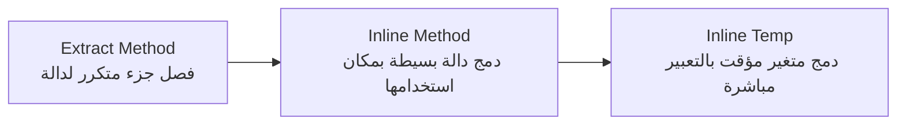

**الشرح:** الأمثلة الثلاثة مرتبة من "الفصل" (Extract) إلى "الدمج" (Inline)، لتوضيح أن كلا الاتجاهين أداة صحيحة حسب الحالة.

---

#### 📖 الشرح

**مثال Extract Method:**
```
void printOwing(double amount) {
    printBanner();
    // print details
    System.out.println ("name:" + _name);
    System.out.println ("amount" + amount);
}
```
يتحول إلى:
```
void printOwing(double amount) {
    printBanner();
    printDetails(amount);
}

void printDetails (double amount) {
    System.out.println ("name:" + _name);
    System.out.println ("amount" + amount);
}
```
لاحظ كيف صار `printOwing` أقصر وأوضح، وأصبح جزء "طباعة التفاصيل" وحدة مستقلة يمكن إعادة استخدامها من مكان آخر لاحقاً.

**مثال Inline Method:**
```
int getRating() {
    return (moreThanFiveLateDeliveries()) ? 2 : 1;
}
boolean moreThanFiveLateDeliveries() {
    return _numberOfLateDeliveries > 5;
}
```
يتحول إلى:
```
int getRating() {
    return (_numberOfLateDeliveries > 5) ? 2 : 1;
}
```
هنا `moreThanFiveLateDeliveries()` لا تضيف وضوحاً حقيقياً فوق التعبير نفسه، فدمجناها مباشرة وحذفنا الدالة المنفصلة.

**مثال Inline Temp:**
```
double basePrice = anOrder.basePrice();
return (basePrice > 1000)
```
يتحول إلى:
```
return (anOrder.basePrice() > 1000)
```
المتغير `basePrice` استُخدم مرة واحدة فقط بتعبير بسيط، فاستبدلناه بالتعبير الأصلي مباشرة.

#### 🎯 الملخص السريع
- `Extract Method`: يفصل جزءاً متكرراً/معقداً إلى دالة بإسم واضح
- `Inline Method`: يدمج دالة لا تضيف وضوحاً فوق التعبير الذي تحتويه
- `Inline Temp`: يدمج متغيراً مؤقتاً بسيطاً يُستخدم مرة واحدة فقط

#### 📚 التطبيق
`Extract Method` هي التقنية الأساسية التي ستُستخدم لاحقاً كخطوة أخيرة داخل `Replace Method with Method Object` بعد تحويل المتغيرات المحلية إلى حقول class.

#### ⚠️ أخطاء شائعة

#### الفهم الخاطئ ❌:
يظن البعض أن `Extract Method` أفضل دائماً من `Inline Method`، أو العكس.

#### الفهم الصحيح ✅:
الاثنان أدوات متعاكسة تُستخدم حسب الحالة — لو الفصل يزيد الوضوح، استخدم Extract؛ لو الفصل صار زائداً عن الحاجة ويربك القارئ، استخدم Inline.

#### 📄 النص الأصلي من المحاضرة
<details>
<summary>عرض النص الأصلي (coverage: 100%)</summary>

> أمثلة كود Extract (printOwing/printDetails)، Inline Method (getRating/moreThanFiveLateDeliveries)، وInline Temp (basePrice/anOrder.basePrice())

</details>

---

### 13. طرق Refactoring: Replace (نظرة عامة)
<!-- @type: fact -->
<!-- @render: {type: "diagram-first", coverage: "100%"} -->

#### 📍 أين نحن الآن؟
بعد `Extract` و `Inline`، نتعرف الآن على تصنيف ثالث أوسع: `Replace` — استبدال حل بحل أفضل.

#### ⬅️ الربط مع السابق
`Replace` تصنيف مختلف عن `Extract`/`Inline`: بدل الفصل أو الدمج، نستبدل بنية كاملة ببنية أفضل.

#### 💡 الفكرة الأساسية
**`Replace` تشمل مجموعة تقنيات تستبدل حلاً بدائياً أو محدوداً بحل أكثر تجريداً أو مرونة.**

---

#### 📊 المخطط: قائمة تقنيات Replace

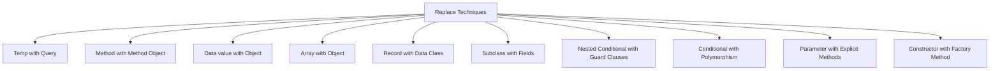

**الشرح:** عشر تقنيات `Replace` مذكورة في المحاضرة؛ سنشرح بالتفصيل الأكثر أهمية وشيوعاً منها في الأقسام القادمة (`Replace Temp with Query`, `Replace Method with Method Object`, `Replace Data Value with Object`).

---

#### 📖 الشرح

جميع تقنيات `Replace` تشترك في فكرة واحدة: **استبدال بنية بسيطة أو خام (raw) ببنية أكثر تعبيراً عن المعنى الحقيقي للكود**:
- `Temp with Query`: بدل تخزين نتيجة في متغير مؤقت، استخرجها كـ دالة استعلام (query method).
- `Method with Method Object`: بدل دالة طويلة معقدة، حوّلها لـ class مستقل.
- `Data value with Object`: بدل قيمة بسيطة (نص/رقم)، أنشئ class مخصص لها.
- `Array with Object`: بدل مصفوفة تحمل معاني مختلفة لكل عنصر، أنشئ class بحقول واضحة.
- `Record with Data Class`: بدل سجل بيانات خام (مثل صف من قاعدة بيانات)، أنشئ class مخصص.
- `Subclass with Fields`: بدل عدة subclasses تختلف فقط بقيمة ثابتة، استخدم حقل (field) عادي.
- `Nested Conditional with Guard Clauses`: بدل شروط متداخلة معقدة، استخدم "شروط حراسة" (early return) في بداية الدالة.
- `Conditional with Polymorphism`: بدل `switch`/`if` كبير حسب النوع، استخدم تعدد الأشكال (Polymorphism) عبر subclasses.
- `Parameter with Explicit Methods`: بدل معامل يغيّر سلوك الدالة، أنشئ دالة منفصلة صريحة لكل سلوك.
- `Constructor with Factory Method`: بدل constructor مباشر، استخدم factory method يوفر مرونة أكبر في الإنشاء.

#### 🎯 الملخص السريع
- `Replace` = استبدال بنية خام ببنية أكثر تعبيراً ومرونة
- 10 تقنيات مذكورة، أهمها للشرح التفصيلي: `Temp with Query`, `Method with Method Object`, `Data value with Object`

#### 📚 التطبيق
سنشرح الآن التقنيات الثلاث الأهم بالتفصيل مع أمثلة كود كاملة.

#### 📄 النص الأصلي من المحاضرة
<details>
<summary>عرض النص الأصلي (coverage: 100%)</summary>

> "Replace: Temp with Query, Method with Method Object, Data value with Object, Array with Object, Record with Data Class, Subclass with Fields, Nested Conditional with Guard Clauses, Conditional with Polymorphism, Parameter with Explicit Methods, Constructor with Factory Method"

</details>

---

### 14. Replace Temp with Query
<!-- @type: practice -->
<!-- @render: {type: "diagram-first", coverage: "100%"} -->

#### 📍 أين نحن الآن؟
نبدأ الشرح التفصيلي بأول تقنية Replace: `Replace Temp with Query`.

#### ⬅️ الربط مع السابق
هذه امتداد مباشر لفكرة `Inline Temp` التي رأيناها سابقاً، لكن هنا التعبير معقد بما يكفي ليستحق دالة مستقلة بدل الدمج المباشر.

#### 💡 الفكرة الأساسية
**استخرج التعبير المحسوب في المتغير المؤقت إلى دالة (method)، ثم استبدل كل استخدامات ذلك المتغير بنداء الدالة.**

---

#### 📊 المخطط: خطوات Replace Temp with Query

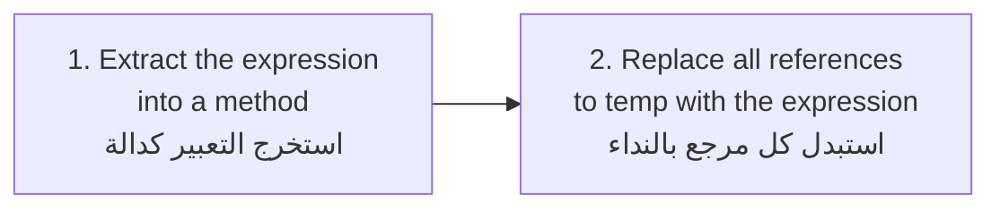

**الشرح:** خطوتان فقط — استخراج التعبير، ثم استبدال المتغير المؤقت بنداء الدالة الجديدة في كل مكان استُخدم فيه.

---

#### 📖 الشرح

المثال من المحاضرة:
```
double getPrice() {
    int basePrice = _quantity * _itemPrice;
    double discountFactor;
    if (basePrice > 1000) discountFactor = 0.95;
    else discountFactor = 0.98;
    return basePrice * discountFactor;
}
```
يتحول إلى:
```
private int basePrice() {
    return _quantity * _itemPrice;
}
private double discountFactor() {
    if (basePrice() > 1000) return 0.95;
    else return 0.98;
}
double getPrice() {
    return basePrice() * discountFactor();
}
```
لاحظ أننا استخرجنا `basePrice` و `discountFactor` كل واحد كدالة مستقلة (`private`)، وأصبحت `getPrice()` مجرد تركيب لهما — أوضح بكثير من الكود الأصلي المليء بالمتغيرات المؤقتة.

#### 🎯 الملخص السريع
- استخرج التعبير إلى method
- استبدل كل الاستخدامات بنداء الـ method
- النتيجة: methods صغيرة قابلة لإعادة الاستخدام بدل متغيرات مؤقتة محلية

#### 📚 التطبيق
هذه التقنية أساسية جداً لأنها تمهد الطريق لتقنيات أخرى مثل `Extract Method` و `Replace Conditional with Polymorphism`، حيث تحتاج التعبيرات المعقدة أن تكون methods مستقلة أولاً.

#### ⚠️ أخطاء شائعة

#### الفهم الخاطئ ❌:
يظن البعض أن هذه التقنية تُبطئ الأداء لأننا ننادي دالة بدل قراءة متغير مباشرة.

#### الفهم الصحيح ✅:
الفرق في الأداء غالباً ضئيل جداً في أغلب التطبيقات، بينما الفائدة في الوضوح وإعادة الاستخدام أكبر بكثير — ولو ظهرت مشكلة أداء حقيقية، يمكن معالجتها لاحقاً بشكل مستهدف (caching مثلاً).

#### 📄 النص الأصلي من المحاضرة
<details>
<summary>عرض النص الأصلي (coverage: 100%)</summary>

> "Steps: Extract the expression into a method, Replace all ref. to temp with the expression" + مثال getPrice/basePrice/discountFactor

</details>

---

### 15. Replace Method with Method Object
<!-- @type: practice -->
<!-- @render: {type: "diagram-first", coverage: "100%"} -->

#### 📍 أين نحن الآن؟
ننتقل لتقنية أكثر تعقيداً: التعامل مع دالة طويلة جداً لدرجة أن `Extract Method` وحدها لا تكفي.

#### ⬅️ الربط مع السابق
تذكر من قسم `Long Method` سابقاً: أحياناً الدالة طويلة **ولا يمكن** تطبيق `Extract Method` مباشرة عليها بسبب كثرة المتغيرات المحلية المتشابكة — هنا يأتي دور هذه التقنية.

#### 💡 الفكرة الأساسية
**حوّل الدالة الطويلة المعقدة نفسها إلى class مستقل، بحيث تصبح كل متغيراتها المحلية والمعاملات حقولاً (fields) في ذلك الـ class — وعندها يصبح تقسيمها بـ Extract Method سهلاً.**

---

#### 📊 المخطط: خطوات Replace Method with Method Object

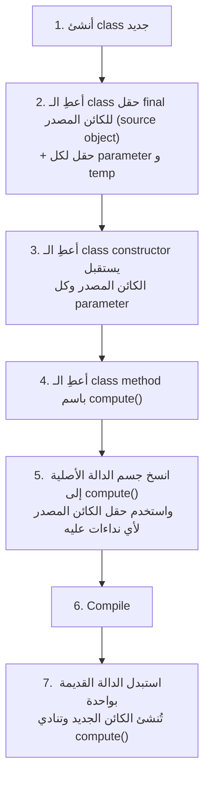

**الشرح:** الفكرة المحورية هي "تجميد" حالة الدالة (متغيراتها ومعاملاتها) كحقول class، فتتحرر من قيود "المتغيرات المحلية" التي كانت تمنع تطبيق Extract Method مباشرة.

---

#### 📖 الشرح

**متى نستخدمها؟** عندما تكون الدالة طويلة **ولا يمكن** تطبيق `Extract Method` عليها مباشرة، وعادة السبب هو أن الدالة تستخدم متغيرات محلية (local variables) كثيرة ومتشابكة، بحيث لو استخرجت جزءاً منها كدالة منفصلة، ستحتاج تمرير عدد كبير جداً من المعاملات.

مثال من المحاضرة — داخل class `Account` توجد دالة `gamma`:
```
// Class Account
int gamma (int inputVal, int quantity, int yearToDate) {
    int importantValue1 = (inputVal * quantity) + delta();
    int importantValue2 = (inputVal * yearToDate) + 100;
    if ((yearToDate - importantValue1) > 100)
        importantValue2 -= 20;
    int importantValue3 = importantValue2 * 7;
    // and so on...
    return importantValue3 - 2 * importantValue1;
}
```

**الخطوة 1 — إعلان class جديد** بحقل `final` للكائن المصدر (`Account`) وحقل لكل parameter ومتغير مؤقت:
```
// class Gamma...
private final Account _account;
private int inputVal;
private int quantity;
private int yearToDate;
private int importantValue1;
private int importantValue2;
private int importantValue3;
```

**الخطوة 2 — Constructor:**
```
Gamma (Account source, int inputValArg, int quantityArg, int yearToDateArg) {
    _account = source;
    inputVal = inputValArg;
    quantity = quantityArg;
    yearToDate = yearToDateArg;
}
```

**الخطوة 3 — نقل الدالة الأصلية إلى `compute()`:**
```
int compute () {
    importantValue1 = (inputVal * quantity) + _account.delta();
    importantValue2 = (inputVal * yearToDate) + 100;
    if ((yearToDate - importantValue1) > 100)
        importantValue2 -= 20;
    int importantValue3 = importantValue2 * 7;
    // and so on...
    return importantValue3 - 2 * importantValue1;
}
```

**الخطوة 4 — تعديل الدالة القديمة لتفويض العمل (delegate) لـ `Gamma`:**
```
int gamma (int inputVal, int quantity, int yearToDate) {
    return new Gamma(this, inputVal, quantity, yearToDate).compute();
}
```

**الخطوة 5 — الآن يمكننا تطبيق `Extract Method` بحرية داخل `compute()`**، لأن كل شيء أصبح حقول class بدل متغيرات محلية متشابكة، فلا حاجة لتمرير معاملات كثيرة بين الأجزاء المستخرجة.

#### 🎯 الملخص السريع
1. class جديد بحقل للكائن المصدر + حقل لكل parameter/temp
2. Constructor يستقبل الكائن المصدر وكل parameter
3. method باسم `compute()` يحتوي جسم الدالة الأصلية
4. الدالة القديمة تُفوّض العمل لكائن جديد من هذا الـ class
5. الآن يمكن تطبيق `Extract Method` بحرية

#### 📚 التطبيق
هذه التقنية تُستخدم كخطوة تمهيدية قبل `Extract Method` عندما تكون الدالة طويلة ومتشابكة جداً بحيث لا يمكن تفكيكها مباشرة — وهي حل شائع جداً لمشكلة `Long Method` التي ذكرناها سابقاً.

#### ⚠️ أخطاء شائعة

#### الفهم الخاطئ ❌:
يعتقد البعض أن هذه التقنية معقدة أكثر من اللازم لمجرد "دالة طويلة"، ويفضلون تركها كما هي.

#### الفهم الصحيح ✅:
هذه التقنية مصممة خصيصاً للحالات التي تفشل فيها `Extract Method` المباشرة بسبب تشابك المتغيرات المحلية؛ التعقيد المؤقت في الخطوات يُبسّط الكود بشكل جذري بعد اكتمالها.

#### 📄 النص الأصلي من المحاضرة
<details>
<summary>عرض النص الأصلي (coverage: 100%)</summary>

> "Long method but cannot apply Extract Method. The Method use local variables. Steps: Create new class, Give the new class a final field for the object that hosted the original method (the source object) and a field for each temporary variable and each parameter in the method, Give the new class a constructor that takes the source object and each parameter, Give the new class a method named 'compute.', Copy the body of the original method into compute. Use the source object field for any invocations of methods on the original object, Compile, Replace the old method with one that creates the new object and calls compute" + مثال كامل بكود gamma/Account/Gamma

</details>

---

### 16. Replace Data Value with Object
<!-- @type: practice -->
<!-- @render: {type: "diagram-first", coverage: "100%"} -->

#### 📍 أين نحن الآن؟
آخر تقنية تفصيلية في المحاضرة: كيف نحوّل قيمة بيانات بسيطة إلى كائن (object) كامل.

#### ⬅️ الربط مع السابق
هذه هي نفس فكرة `Primitive Obsession` التي شرحناها سابقاً — لكن هنا نرى الخطوات التفصيلية والمثال الكامل خطوة بخطوة.

#### 💡 الفكرة الأساسية
**عندما تبدأ حقيقة بسيطة (مثل اسم العميل كـ `String`) بالحاجة لسلوك خاص بها (تنسيق، تحقق، مقارنة)، حوّلها إلى class مستقل بدل إبقائها قيمة بدائية.**

---

#### 📊 المخطط: خطوات Replace Data Value with Object

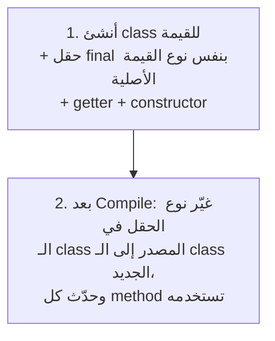

**الشرح:** خطوتان رئيسيتان: أولاً نبني "الغلاف" (wrapper class) الجديد، ثم نُبدّل استخدام النوع القديم بالجديد في كل مكان.

---

#### 📖 الشرح

**السياق (من المحاضرة):** في المراحل الأولى من التطوير، غالباً تمثل حقائق بسيطة كقيم بيانات بدائية. مثلاً، رقم الهاتف قد يُمثَّل كـ `String` لفترة، لكن لاحقاً تكتشف أنك تحتاج سلوكاً خاصاً به مثل التنسيق (formatting) أو استخراج رمز المنطقة (extracting area code). لعنصر أو عنصرين قد تضع الدوال داخل الـ class المالك، لكن سرعان ما يظهر smell التكرار (duplication) و`feature envy`. عندما تبدأ هذه الرائحة بالظهور، حوّل قيمة البيانات إلى كائن.

**مثال من المحاضرة — قبل التحويل:**
```
class Order...
    private String _customer;

    public Order (String customer) {
        _customer = customer;
    }
    public String getCustomer() {
        return _customer;
    }
    public void setCustomer(String arg) {
        _customer = arg;
    }
```

**الخطوة 1 — إنشاء class جديد للقيمة (`Customer`)** بحقل `final` من نفس نوع القيمة الأصلية (`String`)، مع getter و constructor:
```
class Customer {
    private final String _name;
    public Customer (String name) {
        _name = name;
    }
    public String getName() {
        return _name;
    }
}
```

**الخطوة 2 — تغيير نوع الحقل في `Order` من `String` إلى `Customer`،** وتحديث كل method تستخدمه:
```
class Order...
    private Customer _customer;

    public Order (String customer) {
        _customer = new Customer(customer);
    }
    public String getCustomer() {
        return _customer.getName();
    }
    public void setCustomer(String arg) {
        _customer = new Customer(customer);
    }
```

لاحظ أن اسم المعامل (`arg`) في `setCustomer` تحوّل لاسم أوضح (`customer`) أثناء التعديل — تفصيل صغير لكنه يحسّن القراءة.

#### 🎯 الملخص السريع
- القيم البسيطة (نصوص/أرقام) قد "تكبر" وتحتاج سلوكاً خاصاً بها لاحقاً
- علامة الحاجة للتحويل: تكرار الكود أو `feature envy` حول تلك القيمة
- الخطوات: أنشئ class جديد بحقل final + getter + constructor → غيّر نوع الحقل الأصلي واستخدم الـ getter الجديد

#### 📚 التطبيق
هذه التقنية هي نفس الحل المقترح سابقاً لمشكلة `Primitive Obsession` (مثال `PermissionState` بدل النصوص الخام)، وتُستخدم كثيراً عند تصميم أنظمة حقيقية (مثل تمثيل `Money`, `PhoneNumber`, `EmailAddress` كـ classes مستقلة بدل نصوص أو أرقام خام).

#### ⚠️ أخطاء شائعة

#### الفهم الخاطئ ❌:
يعتقد البعض أنه يجب تحويل **كل** قيمة بيانات بسيطة إلى class منذ البداية، حتى لو لم تكن هناك حاجة فعلية.

#### الفهم الصحيح ✅:
التحويل يُطبَّق فقط عندما تظهر إشارات حقيقية (تكرار الكود أو feature envy) — التحويل المبكر بدون حاجة فعلية يُعقّد الكود بلا داعٍ (over-engineering).

#### 📄 النص الأصلي من المحاضرة
<details>
<summary>عرض النص الأصلي (coverage: 100%)</summary>

> "Often in early stages of development you make decisions about representing simple facts as simple data items. As development proceeds you realize that those simple items aren't so simple anymore. A telephone number may be represented as a string for a while, but later you realize that the telephone needs special behavior for formatting, extracting area code, and the like. For one or two items you may put the methods in the owning object, but quickly the code smells of duplication and feature envy. When the smell begins, turn the data value into an object." + خطوات ومثال Order/Customer الكامل

</details>

---

## الجزء الثاني: ملخص شامل (Alternative Complete Reading)

خلينا نمشي على كل موضوع المحاضرة بشكل متصل، بدون تقسيمات كثيرة، عشان لو حاب تراجع كل شي بجلسة واحدة.

`Refactoring` هو فن تحسين تصميم كود موجود مسبقاً — يعطينا طرق نتعرف فيها على الكود المُشكِل (problematic code) ووصفات جاهزة (recipes) لإصلاحه. أهم نقطة فيه: هو عملية تغيير نظام برمجي **بدون** ما يتغير سلوكه الخارجي (external behavior)، لكن مع تحسين بنيته الداخلية (internal structure). ببساطة: نفس النتيجة، لكن الطريقة اللي وصلنا فيها للنتيجة صارت أوضح وأنظف. المثال الكلاسيكي: كود فيه `if/else` يحسب راتب موظف وينادي `update()` في كل فرع من الشرطين بشكل مكرر — الحل البسيط هو سحب `update()` خارج الشرط ونداءه مرة واحدة بعد الـ if/else كله؛ النتيجة النهائية للبرنامج ما تغيرت أبداً، بس الكود صار أنظف وما فيه تكرار.

مهم جداً نفرّق بين Refactoring وبين أشياء تشبهه لكنها مختلفة تماماً: إضافة functionality جديدة (زي attributes أو methods أو classes جديدة) **ليست** Refactoring، وكذلك إعادة كتابة النظام بالكامل من الصفر (rewriting from scratch) **ليست** Refactoring. الفيصل الحاسم دائماً: هل تغيّر السلوك الخارجي؟ لو تغيّر، فهذا تطوير (development) أو إعادة بناء، مو Refactoring.

ليش أصلاً نحتاج Refactoring؟ لأنه ببساطة ما فيه أحد — مهما كانت خبرته — يقدر يوصل للتصميم الصحيح من أول محاولة. الفهم يتطور مع الوقت مع رؤية النظام يشتغل فعلياً. وفي الغالب، حجم الكود يقل بعد Refactoring لأن التكرار ينحذف، والبنى المربكة تتحول لبنى أبسط. والنتيجة الكبرى: البرنامج يصير أسهل فهماً وتعديلاً، لأن البنية تتحسن والكود المكرر ينحذف. وفائدة إضافية مهمة: أثناء عملية Refactoring، غالباً تكتشف bugs كانت مختبئة جوا الكود المعقد.

بالنسبة لتوقيت التطبيق، نرفكتر في ثلاث لحظات طبيعية: أول شيء، عند إضافة functionality جديدة — سواء قبل الإضافة (عشان نجهز الكود لاستقبالها بسهولة) أو بعدها (عشان ننظف أي فوضى نتجت من التطوير السريع). ثاني شيء، أثناء code review — لو لاحظت smell، هذي فرصة مثالية تصلحه فوراً. وثالث شيء، عند الحاجة لإصلاح bug — غالباً السبب في صعوبة اكتشاف الـ bug هو تعقيد الكود نفسه، فتنظيفه يسهّل رؤية السبب الحقيقي.

لكن كيف نعرف أن برنامج معين "صعب"؟ فيه أربع علامات: البرنامج صعب لو كان صعب القراءة، أو فيه منطق مكرر (duplicated logic)، أو يتطلب تعديل كود شغّال عشان تضيف سلوك جديد، أو فيه منطق شرطي معقد (complex conditional logic). كل هذي الأربعة تصب في هدف واحد: لازم البرنامج يكون سهل القراءة. والمصطلح المستخدم لوصف هذي المشاكل هو `Code Smell` — رائحة الكود — وهو مؤشر (مو حكم قاطع) على وجود مشكلة تصميمية محتملة، حتى لو الكود شغّال صح تماماً من ناحية النتيجة. الروائح ممكن تكون قوية وواضحة، أو خفية (subtler)، أو حتى تخفي مشكلة أعمق تحتها.

عشان نطبّق Refactoring بشكل منظم، فيه دورة (cycle) بسيطة: نبدأ ببرنامج شغّال (working program)، وطالما فيه smells، نكرر: نختار أسوأ رائحة، نختار تقنية Refactoring مناسبة لها، نطبّقها، ثم نرجع نفحص من جديد. النقطة المهمة هنا: ما نصلح كل شيء دفعة وحدة، نبدأ بالأسوأ لأنه غالباً يسبب أكبر ضرر أو يخفي مشاكل ثانية.

الآن نيجي لأهم جزء — قائمة Code Smells محددة وحلولها. أول واحدة: `Duplicated Code` — نفس بنية الكود موجودة في أكثر من مكان — الحل: `Extract Method`، تستخرج الجزء المكرر لدالة وحدة وتناديها من كل مكان. ثاني واحدة: `Long Method` — دالة طويلة جداً. أول سؤال نسأله: كم عدد الأسطر؟ لو طويلة بلا سبب واضح، الحل `Compose Method` (تقسيمها لدوال أصغر بأسماء واضحة). لكن لو السبب أعمق: لو طويلة بسبب `switch` كبير لمعالجة طلبات (handling request)، نستخدم نمط `Command (Handler)`؛ لو طويلة بسبب `switch` كبير لجمع بيانات من عدة classes، نستخدم نمط `Visitor`؛ ولو طويلة بسبب عدة نسخ من خوارزمية مع منطق شرطي، نستخدم نمط `Strategy`. الفكرة المهمة: نفس الـ smell (Long Method) ممكن يحتاج حلول مختلفة تماماً حسب السبب الجذري.

ثالث smell: `Conditional Complexity` — بعد إضافة ميزات جديدة، بعض المنطق الشرطي يصير معقد ومكلف. الحلول: `Strategy`, `Decorator`, أو `State` pattern — كل واحد يناسب سياق مختلف. رابع smell: `Primitive Obsession` — يظهر لما الكود يعتمد كثير على أنواع بدائية (integers, strings, doubles) بدل مستوى تجريد أعلى. مثال حقيقي من المحاضرة: نظام صلاحيات فيه حالات زي `REQUESTED`, `CLAIMED`, `DENIED`, `GRANTED` ممثلة كـ `String` مباشرة — لو استخدمنا نص `"REQUESTED"` في أكثر من مكان، أي خطأ إملائي بسيط بيسبب bug صعب الاكتشاف. الحل: `Replace Data Value with Object` — أنشئ class اسمه `PermissionState` فيه constants ثابتة (`static final`) بدل النصوص الخام.

خامس smell: `Indecent Exposure` — معناته غياب `Information Hiding`؛ يعني methods أو classes المفروض تكون مخفية (internal) لكنها ظاهرة للعملاء (clients) مباشرة. الحل: `Factory Pattern` — العميل يتعامل بس مع class مجرد عام (زي `AttributeDescriptor`)، بينما الـ subclasses الفعلية (`BooleanDescriptor`, `DefaultDescriptor`, `ReferenceDescriptor`) تبقى غير مرئية خارج الـ package. سادس smell: `Solution Sprawl` — شبيه بـ `Shotgun Surgery`؛ تغيير بسيط يتطلب تعديل عدة classes لأن البيانات والكود اللازم لإنشاء كائن واحد منتشرة عبر عدة classes. المثال: عميل يضطر ينادي `setStringNodeDecoding` و `setRemoveEscapeCharacters` بشكل منفصل قبل `parse` على parser، والـ parser بدوره ينادي عدة استعلامات على parser ثاني. الحل: نجمّع كل هذا المنطق في `Factory` واحد يستقبل الإعدادات ويُنشئ الكائن الصحيح مباشرة — يقلل عدد الرسائل والاعتماديات بشكل ملحوظ.

سابع smell: `Long Parameter List` — في البرمجة الكائنية (OO)، ما فيه داعي تمرر كمية كبيرة من المعاملات زي أيام البرمجة الإجرائية القديمة. مثال: `discountedPrice(basePrice, discountLevel)` ممكن تصير `discountedPrice(basePrice)` لو `discountLevel` قدرنا نحسبه داخلياً بدل ما نمرره كمعامل منفصل. الحل العام: `Replace Method with Method Object`.

بعدين المحاضرة تعرض جدول أدوات NetBeans اللي تطبّق كل هذي المفاهيم آلياً — زي `Rename`, `Encapsulate Fields`, `Pull Up`, `Push Down`, `Move Class`, `Extract Interface`, `Extract Superclass`, `Safely Delete`، وغيرها. كل عملية من هذي تقابل تحسين تصميمي محدد، وتحدّث كل الملفات المرتبطة في المشروع تلقائياً — وهذا يوفر وقت كبير مقارنة بالتطبيق اليدوي.

ومن أهم الأمثلة التفصيلية المشروحة: `Encapsulate Field` — نحول حقل public (زي `public String name;`) إلى private مع getter وsetter. الخطوات بالترتيب: أنشئ الـ getters والsetters أولاً، حدد كل الأماكن اللي تستخدم الحقل مباشرة، استبدل القراءة بنداء getter والتعديل بنداء setter، اختبر (compile & test) بعد كل مرجع تعدّله (مو بعد الكل دفعة وحدة)، وأخيراً خلّي الحقل private، واختبر مرة نهائية.

في الجزء الثاني من المحاضرة، انتقلنا لتصنيف أوسع للتقنيات: `Extract` و `Inline`. `Extract Method` تفصل جزء متكرر أو معقد لدالة مستقلة — مثال: كود `printOwing` كان فيه سطرين طباعة تفاصيل مكررين، فاستخرجناهم لدالة `printDetails(amount)`. `Extract Class` تستخدم لو class واحد يعمل عمل class-ين. `Extract Subclass` لو بعض ميزات الـ class مستخدمة فقط في بعض الحالات. `Extract Superclass` لو classين عندهم ميزات متشابهة. في الاتجاه المعاكس، `Inline Method` تدمج دالة لا تضيف وضوحاً حقيقياً فوق التعبير اللي فيها — مثال: `moreThanFiveLateDeliveries()` كانت بس تُرجع `_numberOfLateDeliveries > 5`، فدمجناها مباشرة داخل `getRating()`. و`Inline Temp` تدمج متغير مؤقت بسيط استُخدم مرة وحدة فقط — مثال: `basePrice = anOrder.basePrice()` استُبدل مباشرة بـ `anOrder.basePrice()` في مكان استخدامه.

بعدين وصلنا لتصنيف `Replace` — عشر تقنيات، أهمها ثلاثة شُرحوا بالتفصيل. أول واحدة: `Replace Temp with Query` — بخطوتين: استخرج التعبير المحسوب في المتغير المؤقت إلى دالة، ثم استبدل كل استخدام للمتغير بنداء الدالة. المثال: `getPrice()` كانت فيها متغيرات `basePrice` و `discountFactor` محسوبة يدوياً، فحولناهم لدالتين مستقلتين `basePrice()` و `discountFactor()`، وصارت `getPrice()` مجرد `return basePrice() * discountFactor();` — أوضح بكثير.

ثاني تقنية: `Replace Method with Method Object` — هذي تُستخدم لما الدالة طويلة جداً **ولا يمكن** تطبيق `Extract Method` مباشرة عليها، عادة بسبب كثرة المتغيرات المحلية المتشابكة. الحل: نحول الدالة نفسها لـ class مستقل. الخطوات: ننشئ class جديد فيه حقل final للكائن المصدر (source object) وحقل لكل parameter ومتغير مؤقت في الدالة الأصلية؛ نعطيه constructor يستقبل الكائن المصدر وكل parameter؛ نعطيه method باسم `compute()` وننسخ جسم الدالة الأصلية فيها (مستخدمين حقل الكائن المصدر لأي نداءات على الكائن الأصلي)؛ نعمل compile؛ وأخيراً نستبدل الدالة القديمة بواحدة تُنشئ كائن جديد من الـ class الجديد وتنادي `compute()` عليه وترجع النتيجة. المثال الكامل من المحاضرة كان دالة `gamma` داخل class `Account` — حولناها لـ class اسمه `Gamma` فيه حقول `_account`, `inputVal`, `quantity`, `yearToDate`, `importantValue1/2/3`، وبعدين `gamma()` صارت بس سطر واحد: `return new Gamma(this, inputVal, quantity, yearToDate).compute();`. الفائدة الكبرى: بعد هذا التحويل، صار فينا نطبّق `Extract Method` بحرية داخل `compute()` لأن كل شيء صار حقول class بدل متغيرات محلية متشابكة.

ثالث وآخر تقنية: `Replace Data Value with Object` — نفس فكرة `Primitive Obsession` لكن بخطوات تفصيلية. السياق: في مراحل التطوير الأولى، غالباً نمثّل حقائق بسيطة كقيم بيانات بدائية (زي رقم هاتف كـ `String`)، لكن لاحقاً نكتشف إنها تحتاج سلوك خاص (تنسيق، تحقق، استخراج جزء منها). لعنصر أو اثنين، ممكن نضع الدوال داخل الـ class المالك، لكن سرعان ما يظهر تكرار الكود و`feature envy`. لما تبدأ هالرائحة، نحول قيمة البيانات لكائن. الخطوات: ننشئ class جديد للقيمة فيه حقل final بنفس نوع القيمة الأصلية + getter + constructor؛ وبعد الـ compile، نغيّر نوع الحقل في الـ class المصدر للـ class الجديد ونحدث كل method تستخدمه. المثال الكامل: class `Order` فيه حقل `_customer` من نوع `String`، حولناه لـ class `Customer` فيه حقل `_name` من نوع `String` مع `getName()`، وبعدين `Order` صار يستخدم `_customer.getName()` بدل الوصول المباشر للنص.

النقطة الأهم اللي تربط كل هذي الأمثلة سوا: كل تقنية Refactoring مصممة تحل مشكلة محددة جداً، وفيها خطوات دقيقة تتبعها بالترتيب مع اختبار (compile & test) بعد كل خطوة صغيرة — مو كل شي دفعة وحدة. هذي المنهجية (خطوات صغيرة + اختبار متكرر) هي القاعدة الذهبية لكل Refactoring آمن، وهي اللي تخليك تحسّن الكود بدون خوف من كسره.

---

## الجزء الثالث: أسئلة اختيار من متعدد (MCQ)

### السؤال 1 (Easy)

**السؤال:** According to the lecture, what is the correct definition of Refactoring?

أ) Rewriting the entire application from scratch
ب) The process of changing a software system without altering its external behavior while improving internal structure
ج) Adding new attributes, methods, or classes to extend functionality
د) A testing technique used to find performance bottlenecks

**الإجابة الصحيحة:** ب

**التعليل الكامل:**
- ❌ أ): إعادة الكتابة من الصفر ذُكرت صراحة في المحاضرة على أنها **ليست** Refactoring.
- ✅ ب): هذا هو التعريف الحرفي من المحاضرة: تغيير النظام بدون تغيير السلوك الخارجي مع تحسين البنية الداخلية.
- ❌ ج): إضافة functionality جديدة ذُكرت أيضاً كمثال على ما **ليس** Refactoring.
- ❌ د): المحاضرة لا تربط Refactoring بأداء الاختبار أو قياس الأداء مباشرة.

---

### السؤال 2 (Medium)

**السؤال:** Which of the following is NOT considered refactoring according to the lecture?

أ) Extracting a duplicated code block into a new method
ب) Renaming a variable for better clarity
ج) Adding a brand-new class with new functionality
د) Encapsulating a public field with getters and setters

**الإجابة الصحيحة:** ج

**التعليل الكامل:**
- ❌ أ): استخراج كود مكرر لدالة هو Refactoring كلاسيكي (Extract Method).
- ❌ ب): إعادة التسمية (Rename) من عمليات Refactoring المذكورة في جدول NetBeans.
- ✅ ج): إضافة class جديد بوظيفة جديدة تعتبر تطوير functionality جديدة، وذُكرت صراحة كمثال على ما ليس Refactoring.
- ❌ د): Encapsulate Field تقنية Refactoring مشروحة بالتفصيل في المحاضرة.

---

### السؤال 3 (Easy)

**السؤال:** Why do we need refactoring according to the lecture?

أ) Because we can never get the right design from the first time
ب) Because it always makes code run significantly faster
ج) Because it is required by all programming languages
د) Because it eliminates the need for testing

**الإجابة الصحيحة:** أ

**التعليل الكامل:**
- ✅ أ): المحاضرة تذكر مباشرة "We cannot get right design from the first time" كسبب رئيسي.
- ❌ ب): Refactoring لا يهدف لتحسين الأداء (performance) بالضرورة، بل تحسين البنية.
- ❌ ج): لا علاقة له بمتطلبات لغات البرمجة.
- ❌ د): Refactoring لا يلغي الحاجة للاختبار، بل يتطلب compile & test بعد كل خطوة.

---

### السؤال 4 (Medium)

**السؤال:** When should you refactor according to the lecture?

أ) Only at the very end of the entire project
ب) Only when a manager explicitly requests it
ج) When adding new functionality, during code review, or when fixing a bug
د) Only once per year during a scheduled maintenance window

**الإجابة الصحيحة:** ج

**التعليل الكامل:**
- ❌ أ): المحاضرة لا تذكر تأجيل Refactoring لنهاية المشروع.
- ❌ ب): لم يُذكر أن الطلب الإداري شرط لتطبيق Refactoring.
- ✅ ج): هذي بالضبط الثلاث لحظات المذكورة: إضافة functionality، code review، وإصلاح bug.
- ❌ د): لا يوجد ذكر لجدولة سنوية.

---

### السؤال 5 (Hard)

**السؤال:** A method contains a large switch statement used to gather data from several different classes. Which pattern does the lecture recommend?

أ) Command (Handler) pattern
ب) Visitor pattern
ج) Singleton pattern
د) Observer pattern

**الإجابة الصحيحة:** ب

**التعليل الكامل:**
- ❌ أ): `Command (Handler)` يُستخدم لما الـ switch الكبير يعالج طلبات (handling request)، مو لجمع بيانات.
- ✅ ب): المحاضرة تربط صراحة بين `switch` لجمع بيانات من عدة classes وبين نمط `Visitor`.
- ❌ ج): `Singleton` لم يُذكر إطلاقاً في هذا السياق في المحاضرة.
- ❌ د): `Observer` لم يُذكر في المحاضرة كحل لهذه المشكلة.

---

### السؤال 6 (Medium)

**السؤال:** What smell describes a situation where a simple change requires modifying several classes because instantiation data is scattered across them?

أ) Indecent Exposure
ب) Primitive Obsession
ج) Solution Sprawl
د) Long Parameter List

**الإجابة الصحيحة:** ج

**التعليل الكامل:**
- ❌ أ): `Indecent Exposure` عن غياب information hiding، مو انتشار بيانات الإنشاء.
- ❌ ب): `Primitive Obsession` عن الاعتماد الزائد على الأنواع البدائية.
- ✅ ج): `Solution Sprawl` وُصف حرفياً بأنه شبيه بـ `Shotgun Surgery`، حيث بيانات وكود الإنشاء منتشرة عبر عدة classes.
- ❌ د): `Long Parameter List` عن كثرة المعاملات في دالة واحدة، مو انتشار البيانات عبر classes.

---

### السؤال 7 (Easy)

**السؤال:** Which technique is recommended for duplicated code appearing in more than one place?

أ) Replace Method with Method Object
ب) Extract Method
ج) Inline Temp
د) Factory Pattern

**الإجابة الصحيحة:** ب

**التعليل الكامل:**
- ❌ أ): تُستخدم لدوال طويلة يتعذر تطبيق Extract Method مباشرة عليها، مو للتكرار مباشرة.
- ✅ ب): المحاضرة تذكر صراحة: "Duplicated code: Same code structure in more than one place → use Extract Method".
- ❌ ج): `Inline Temp` عن دمج متغير مؤقت، عكس فكرة الاستخراج.
- ❌ د): `Factory Pattern` حل لـ Indecent Exposure و Solution Sprawl، مو للتكرار.

---

### السؤال 8 (Hard)

**السؤال:** In the "Replace Method with Method Object" example (the `gamma` method), why couldn't Extract Method be applied directly?

أ) Because the method used too many local variables that would need to be passed as parameters
ب) Because the method had no local variables at all
ج) Because Java does not support Extract Method
د) Because the method was too short to extract anything

**الإجابة الصحيحة:** أ

**التعليل الكامل:**
- ✅ أ): المحاضرة تنص: "Long method but cannot apply Extract Method. The Method use local variables" — أي أن كثرة المتغيرات المحلية المتشابكة هي السبب.
- ❌ ب): على العكس، المشكلة هي وجود متغيرات محلية كثيرة، وليس غيابها.
- ❌ ج): لا علاقة للمشكلة بقدرة اللغة نفسها.
- ❌ د): المشكلة هي طول الدالة الزائد، وليس قصرها.

---

### السؤال 9 (Medium)

**السؤال:** What is the main purpose of "Replace Data Value with Object"?

أ) To convert a simple primitive value into a dedicated class once it needs its own behavior
ب) To delete unused variables from the codebase
ج) To merge two classes with similar attributes into one
د) To speed up the compilation process

**الإجابة الصحيحة:** أ

**التعليل الكامل:**
- ✅ أ): المحاضرة توضح أن القيمة البسيطة (مثل String لرقم هاتف) تُحوَّل لـ class مستقل عندما تحتاج سلوكاً خاصاً بها (formatting, extracting).
- ❌ ب): لا علاقة للتقنية بحذف متغيرات غير مستخدمة.
- ❌ ج): هذا وصف أقرب لـ `Extract Superclass`، مو `Replace Data Value with Object`.
- ❌ د): التقنية لا تتعلق بسرعة الـ compilation.

---

### السؤال 10 (Easy)

**السؤال:** Which NetBeans refactoring operation automatically checks references to a code element and deletes it if unused?

أ) Rename
ب) Safely Delete
ج) Move Class
د) Pull Up

**الإجابة الصحيحة:** ب

**التعليل الكامل:**
- ❌ أ): `Rename` تغيّر الاسم، لا تتحقق من عدم الاستخدام لحذف العنصر.
- ✅ ب): وصف الجدول حرفياً: "Checks for references to a code element and then automatically deletes that element if no other code references it".
- ❌ ج): `Move Class` تنقل الـ class، ولا تحذفه.
- ❌ د): `Pull Up` تنقل methods/fields لـ superclass، ليست عملية حذف.

---

### السؤال 11 (Medium)

**السؤال:** In the "Refactoring Cycle" diagram, what is the correct order of steps inside the loop?

أ) Apply refactoring → Select worst smell → Select a refactor
ب) Select worst smell → Select a refactor corresponding to it → Apply refactoring
ج) Select a refactor → Apply refactoring → Select worst smell
د) Apply refactoring → Select a refactor → Select worst smell

**الإجابة الصحيحة:** ب

**التعليل الكامل:**
- ❌ أ): الترتيب معكوس؛ التطبيق يجب أن يأتي أخيراً وليس أولاً.
- ✅ ب): هذا هو الترتيب الحرفي في مخطط الدورة: اختيار الأسوأ، ثم اختيار التقنية المناسبة، ثم التطبيق.
- ❌ ج): اختيار التقنية يجب أن يسبقه تحديد "أسوأ رائحة" أولاً.
- ❌ د): هذا الترتيب معكوس بالكامل مقارنة بالمخطط الأصلي.

---

### السؤال 12 (Hard)

**السؤال:** Which statement BEST explains why "Indecent Exposure" is solved using the Factory Pattern?

أ) Because it hides internal classes from clients while exposing only an abstract type
ب) Because it improves the runtime speed of object creation
ج) Because it removes the need for constructors entirely
د) Because it automatically fixes duplicated code across the project

**الإجابة الصحيحة:** أ

**التعليل الكامل:**
- ✅ أ): مثال المحاضرة يوضح أن العميل يتعامل فقط مع `AttributeDescriptor` (abstract)، بينما الـ subclasses الفعلية تبقى غير مرئية خارج الـ package — هذا هو جوهر إخفاء المعلومات.
- ❌ ب): الهدف ليس تحسين سرعة الإنشاء، بل إخفاء التفاصيل الداخلية.
- ❌ ج): الـ Factory لا يزال يستخدم constructors داخلياً، لكنه يخفيها عن العميل المباشر.
- ❌ د): Factory Pattern لا علاقة له مباشرة بحل مشكلة التكرار (تلك مهمة Extract Method).

---

### السؤال 13 (Medium)

**السؤال:** What is the correct order of steps in "Encapsulate Field" as described in the lecture?

أ) Declare field private → Create getters/setters → Replace references
ب) Create getters/setters → Locate references → Replace references → Declare field private
ج) Replace references → Declare field private → Create getters/setters
د) Delete the field → Create a new one → Add getters/setters

**الإجابة الصحيحة:** ب

**التعليل الكامل:**
- ❌ أ): جعل الحقل private قبل إنشاء الوصول البديل يكسر كل الكود القديم فوراً.
- ✅ ب): هذا هو الترتيب الحرفي من المحاضرة: إنشاء getters/setters، تحديد المراجع، استبدالها، ثم جعل الحقل private.
- ❌ ج): استبدال المراجع قبل إنشاء getters/setters غير ممكن منطقياً.
- ❌ د): لا يوجد ذكر لحذف الحقل وإنشاء آخر بديل عنه.

---

### السؤال 14 (Easy)

**السؤال:** According to the lecture, which of the following is a sign that a program is hard to modify?

أ) It has complex conditional logic
ب) It compiles without any warnings
ج) It uses only private fields
د) It has a well-documented README file

**الإجابة الصحيحة:** أ

**التعليل الكامل:**
- ✅ أ): المنطق الشرطي المعقد ذُكر صراحة كأحد أسباب صعوبة تعديل البرنامج.
- ❌ ب): التحذيرات أثناء الـ compile لا علاقة لها بالموضوع المذكور في المحاضرة.
- ❌ ج): استخدام private fields ممارسة جيدة، وليس سبباً لصعوبة التعديل.
- ❌ د): وجود توثيق (README) لا يتعلق ببنية الكود الداخلية المذكورة في المحاضرة.

---

### السؤال 15 (Hard)

**السؤال:** In the "Replace Temp with Query" example, what happens to the temporary variables `basePrice` and `discountFactor`?

أ) They are deleted without replacement, and `getPrice()` becomes empty
ب) They are each converted into a private method, and `getPrice()` calls both
ج) They are merged into a single public field
د) They remain temporary variables but are renamed

**الإجابة الصحيحة:** ب

**التعليل الكامل:**
- ❌ أ): المتغيرات لم تُحذف بلا بديل؛ استُبدلت بدوال محسوبة.
- ✅ ب): المثال يوضح تحويل `basePrice` و `discountFactor` إلى دالتين `private`، وأصبحت `getPrice()` تنادي كلتيهما.
- ❌ ج): لم يتم دمجهما في حقل عام واحد؛ كل واحد أصبح دالة مستقلة.
- ❌ د): لم تبق متغيرات مؤقتة على الإطلاق؛ تحولت بالكامل لدوال.

---

### السؤال 16 (Medium)

**السؤال:** Which pair correctly matches a code smell with its recommended solution as stated in the lecture?

أ) Long Parameter List → Extract Superclass
ب) Primitive Obsession → Replace Data Value with Object
ج) Conditional Complexity → Safely Delete
د) Duplicated Code → Move Class

**الإجابة الصحيحة:** ب

**التعليل الكامل:**
- ❌ أ): `Long Parameter List` تُحل بـ `Replace Method with Method Object`، وليس `Extract Superclass`.
- ✅ ب): المحاضرة تربط مباشرة `Primitive Obsession` بحل `Replace Data Value with Object` (مثال `PermissionState`).
- ❌ ج): `Conditional Complexity` تُحل بـ Strategy/Decorator/State، وليس `Safely Delete` (وهي أصلاً عملية NetBeans، ليست حل smell).
- ❌ د): `Duplicated Code` تُحل بـ `Extract Method`، وليس `Move Class`.

---

## الجزء الرابع: بطاقات سؤال وجواب (Q&A Cards)

### البطاقة 1
**Q:** ما هو تعريف Refactoring بشكل مختصر؟
**A:** تحسين البنية الداخلية للكود بدون تغيير سلوكه الخارجي.

### البطاقة 2
**Q:** هل إضافة class جديد بوظيفة جديدة تُعتبر Refactoring؟
**A:** لا، إضافة functionality جديدة تُعتبر تطوير، وليست Refactoring.

### البطاقة 3
**Q:** اذكر ثلاث لحظات يجب فيها تطبيق Refactoring.
**A:** عند إضافة functionality جديدة، أثناء code review، وعند إصلاح bug.

### البطاقة 4
**Q:** ما معنى `Code Smell`؟
**A:** مؤشر — قوي أو خفي — على مشكلة تصميمية محتملة في الكود.

### البطاقة 5
**Q:** ما هي خطوات دورة Refactoring؟
**A:** طالما توجد smells: اختر الأسوأ → اختر تقنية مناسبة → طبّقها → كرر.

### البطاقة 6
**Q:** ما الحل المقترح لـ `Duplicated Code`؟
**A:** `Extract Method`.

### البطاقة 7
**Q:** ما الفرق بين حل `Long Method` بسبب switch للطلبات وحلها بسبب switch لجمع البيانات؟
**A:** الأول يُحل بـ `Command Pattern`، والثاني بـ `Visitor Pattern`.

### البطاقة 8
**Q:** ما الحل المقترح لـ `Primitive Obsession`؟
**A:** `Replace Data Value with Object`.

### البطاقة 9
**Q:** ما الحل المقترح لـ `Indecent Exposure` و `Solution Sprawl`؟
**A:** `Factory Pattern` في كلتا الحالتين.

### البطاقة 10
**Q:** متى نستخدم `Inline Method`؟
**A:** عندما يكون جسم الدالة واضحاً بنفس درجة وضوح اسمها.

### البطاقة 11
**Q:** متى نستخدم `Replace Method with Method Object` بدل `Extract Method` مباشرة؟
**A:** عندما تكون الدالة طويلة جداً وتحتوي متغيرات محلية متشابكة يتعذر معها استخراج جزء منها مباشرة.

### البطاقة 12
**Q:** ما هي أول خطوة في `Replace Data Value with Object`؟
**A:** إنشاء class جديد للقيمة بحقل `final` وgetter وconstructor.

### البطاقة 13
**Q:** ما الخطوة الأخيرة في `Encapsulate Field`؟
**A:** تصريح الحقل كـ `private` ثم Compile & Test نهائياً.

---

## الجزء الخامس: ورقة المراجعة السريعة (Cheat Sheet)

### 5.1 جدول المقارنة السريعة: Code Smells وحلولها

| Code Smell | الوصف المختصر | الحل المقترح |
| --- | --- | --- |
| Duplicated Code | نفس بنية الكود في أكثر من مكان | Extract Method |
| Long Method (عام) | دالة طويلة بلا سبب واضح | Compose Method |
| Long Method (switch لطلبات) | switch كبير لمعالجة الطلبات | Command Pattern |
| Long Method (switch لبيانات) | switch كبير لجمع بيانات من عدة classes | Visitor Pattern |
| Long Method (خوارزميات متعددة) | نسخ متعددة من خوارزمية + منطق شرطي | Strategy Pattern |
| Conditional Complexity | منطق شرطي معقد ومكلف | Strategy / Decorator / State |
| Primitive Obsession | اعتماد زائد على الأنواع البدائية | Replace Data Value with Object |
| Indecent Exposure | غياب Information Hiding | Factory Pattern |
| Solution Sprawl | بيانات إنشاء الكائن منتشرة عبر classes | Factory Pattern |
| Long Parameter List | كثرة المعاملات في الدالة | Replace Method with Method Object |
| Lazy Class | class لا يقوم بعمل كافٍ يبرر وجوده | (مذكور بالاسم فقط في المحاضرة) |
| Large Class | class يحتوي مسؤوليات كثيرة جداً | (مذكور بالاسم فقط في المحاضرة) |

### 5.2 القواعد الذهبية

- Refactoring **لا يغيّر** السلوك الخارجي، **يحسّن فقط** البنية الداخلية.
- لا تخلط بين Refactoring وإضافة functionality جديدة في نفس الخطوة.
- ابدأ دائماً بـ "أسوأ رائحة" (worst smell)، لا تصلح كل شيء دفعة واحدة.
- Compile & Test بعد كل خطوة صغيرة، وليس بعد كل التعديلات دفعة واحدة.
- `Extract` و `Inline` عمليتان متعاكستان — استخدم المناسب حسب زيادة أو نقص الوضوح.
- إذا فشل `Extract Method` بسبب متغيرات محلية متشابكة → استخدم `Replace Method with Method Object` أولاً.

### 5.3 مرجع سريع للمصطلحات

| المصطلح الإنجليزي | المعنى بالعربي |
| --- | --- |
| `Refactoring` | إعادة هيكلة الكود لتحسين بنيته دون تغيير سلوكه |
| `Code Smell` | رائحة الكود / مؤشر على مشكلة تصميمية محتملة |
| `Extract Method` | استخراج جزء من الكود إلى دالة مستقلة |
| `Inline Method` | دمج دالة بسيطة في مكان استدعائها |
| `Inline Temp` | دمج متغير مؤقت بالتعبير الذي يحسبه |
| `Encapsulate Field` | تحويل حقل عام إلى خاص مع getter/setter |
| `Replace Temp with Query` | استبدال متغير مؤقت بدالة استعلام |
| `Replace Method with Method Object` | تحويل دالة طويلة إلى class مستقل |
| `Replace Data Value with Object` | تحويل قيمة بيانات بسيطة إلى كائن مستقل |
| `Primitive Obsession` | الاعتماد الزائد على الأنواع البدائية |
| `Indecent Exposure` | كشف داخلي غير لائق لعناصر يجب إخفاؤها |
| `Solution Sprawl` | انتشار بيانات/كود الإنشاء عبر عدة classes |
| `Factory Pattern` | نمط تصميمي لإخفاء تفاصيل إنشاء الكائنات |
| `Strategy Pattern` | نمط لاستبدال خوارزميات متعددة قابلة للتبديل |
| `Visitor Pattern` | نمط لجمع بيانات من عدة classes دون تغيير بنيتها |
| `Command (Handler) Pattern` | نمط لمعالجة الطلبات (requests) بشكل موحد |
