# المحاضرة 4 — Design and Implementation (التصميم والتنفيذ)
> **المادة:** هندسة البرمجيات (المستوى الثالث) | **الموضوع:** التصميم الكائني التوجه (`Object-Oriented Design`) والتنفيذ (`Implementation`) — دراسة حالة: محطة الطقس (`Weather Station`)

---

## ملخص سريع قبل البدء

**عن ماذا هذه المحاضرة؟** بتشرح كيف تحوّل متطلبات نظام لتصميم كائني التوجه (`OOD`) عملي بخمس خطوات، وبعدين كيف تنقل هاد التصميم لكود شغال فعلياً (`implementation`) — مع مثال يمشي طول المحاضرة: نظام محطة طقس (`weather station`).

**ليش يهمك؟** لأنه أي مشروع حقيقي بتشتغل عليه (مشروع تخرج، staj، أو حتى مشروعك الشخصي) بيحتاج نفس الخطوات: تعرف مين الكائنات، كيف بتحكي مع بعض، ووين حدود نظامك مقابل الأنظمة الخارجية — قبل ما تبلش تكتب كود.

**المتطلبات السابقة:**
- `Programming 1` — أساسيات البرمجة
- `Software Engineering 1` — خصوصاً مرحلة الـ `Requirements`
- مفاهيم أساسية عن الـ `Object-Oriented` (كائنات، أصناف/`classes`)

**الخيط الناظم:** Requirements (متطلبات) → **Design** (تصميم — هون احنا) → Implementation (تنفيذ — هون كمان) → Testing → Deployment. يعني هاي المحاضرة بتاخدك من "شو المطلوب" لـ "شو الكائنات وشو الكود".

---

## الجزء الأول: الشرح التفصيلي (سطر بسطر / فقرة بفقرة)

### 1. التصميم مقابل التنفيذ (Design vs Implementation)

<!-- @type: fact -->
<!-- @render: {type: "diagram-first", visualization: "flowchart", coverage: "100%"} -->
<!-- @connectivity: {prerequisite: "requirements_engineering"} -->

#### 📍 أين نحن الآن؟
هاد أول قسم بالمحاضرة، وبيحدد التعريف الأساسي للمرحلة اللي بندرسها.

#### ⬅️ الربط مع السابق
هاي المرحلة بتيجي مباشرة بعد `Requirements Engineering` (تحليل وتوثيق متطلبات النظام) اللي درستوها بـ `Software Engineering 1`.

#### 💡 الفكرة الأساسية
**"التصميم والتنفيذ" (`Design and Implementation`) هي المرحلة اللي فيها بيتطوّر نظام برمجي قابل للتنفيذ فعلياً (`executable software system`) — والتصميم نشاط إبداعي (تحديد كائنات وعلاقات)، بينما التنفيذ هو تحويل هاد التصميم لبرنامج شغال.**

---

#### 📊 المخطط: مكان التصميم والتنفيذ ضمن هندسة البرمجيات

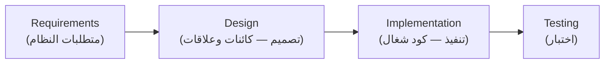

**شرح العناصر:**
- **Requirements:** وصف واضح لإيش النظام لازم يعمل (متل `SRS`)
- **Design:** نشاط إبداعي — تحديد المكونات (`components`) والعلاقات بينها بناءً على المتطلبات
- **Implementation:** تحقيق (`realizing`) التصميم كبرنامج فعلي
- **Testing:** التأكد إنه المتطلبات فعلاً اتحققت

**شرح الروابط:**
- **السهم من Requirements إلى Design:** المتطلبات هي المدخل اللي بيبني عليه المصمم قراراته
- **السهم من Design إلى Implementation:** التصميم هو الخارطة اللي المبرمج بيتبعها لكتابة الكود

**التطبيق في هذا السياق:** هاد المخطط هو "الخيط الناظم" لكل المحاضرة — كل قسم جاي رح يكون إما جزء من `Design` (خطوات الـ `OOD` الخمس) أو جزء من `Implementation` (إعادة الاستخدام، إدارة التهيئة، التطوير على منصتين).

---

#### 📖 التعريف الدقيق

بالمشاريع الصغيرة أو البسيطة، هندسة البرمجيات ككل ممكن تنحصر بس بمرحلة التصميم والتنفيذ — يعني باقي الأنشطة (التحليل، التحقق `verification`، التحقق من الصحة `validation`) بتندمج معاها بدل ما تكون مراحل منفصلة. بمشاريع أكبر، التصميم والتنفيذ بيكونوا بس **جزء واحد** من مجموعة عمليات هندسة البرمجيات.

مهم تفرّق بين المصطلحين: **`Design`** (التصميم) هو نشاط إبداعي (`creative activity`) بتحدد فيه مكونات البرنامج والعلاقات بينها بناءً على متطلبات الزبون — يعني بتفكر: "شو الأجزاء اللي رح أحتاجها؟ وكيف بتحكي مع بعض؟". أما **`Implementation`** (التنفيذ) فهو عملية "تحقيق" (`realizing`) هاد التصميم كبرنامج فعلي شغال — يعني تحويل الأفكار لكود.

#### 🎯 الملخص السريع
- `Design and Implementation` = المرحلة اللي بيتولّد فيها نظام قابل للتنفيذ
- `Design` = نشاط إبداعي (كائنات + علاقات)، `Implementation` = تحويل التصميم لكود شغال
- ممكن تكون مدمجة (مشاريع بسيطة) أو منفصلة (مشاريع كبيرة) عن باقي مراحل هندسة البرمجيات

#### 📚 التطبيق
هاد التمييز أساس كل الخطوات الجاية — القسم 2 رح يوضح متى نوثق التصميم رسمياً، وبعدين رح نمشي بخمس خطوات لبناء تصميم كائني التوجه فعلي.

#### 📄 النص الأصلي من المحاضرة
<details>
<summary>عرض النص الأصلي (coverage: 100%)</summary>

> Software design and implementation is the phase at which an executable software system is developed. Software design and implementation is: Software engineering for simple systems and all other activities are merged with this process; Only one of set of processes (req, veri, vali, ..) involved in software engineering. Software design is creative activity in which you identify software components and their relationships based on customer's requirements. Software implementation is the process of realizing the design as a program.

**ملاحظة على التغطية:**
- ✓ تم شرح بالكامل: تعريف المرحلة، الفرق بين التصميم والتنفيذ، وحالتي الدمج والانفصال

</details>

---

### 2. متى نوثّق التصميم رسمياً؟

<!-- @type: principle -->
<!-- @render: {type: "diagram-first", visualization: "flowchart", coverage: "100%"} -->
<!-- @connectivity: {prerequisite: "1"} -->

#### 📍 أين نحن الآن؟
بعد ما عرفنا إنه التصميم نشاط إبداعي، بنسأل سؤال عملي: هل لازم دايماً يكون موثق رسمياً بمخططات `UML`؟

#### ⬅️ الربط مع السابق
هاد امتداد مباشر للقسم السابق — التصميم موجود دايماً كفكرة، بس السؤال هون هو "كيف بتوثقها؟".

#### 💡 الفكرة الأساسية
**ما في إجابة واحدة صحيحة — أحياناً التصميم بيضل بس فكرة براس المبرمج أو مرسوم على `whiteboard`، وأحياناً لازم يكون موثق رسمياً بـ `UML`. القرار بيعتمد على السياق: حجم الفريق، حجم المشروع، ولغة البرمجة المستخدمة.**

---

#### 📊 المخطط: Decision Framework — هل أوثق التصميم رسمياً؟

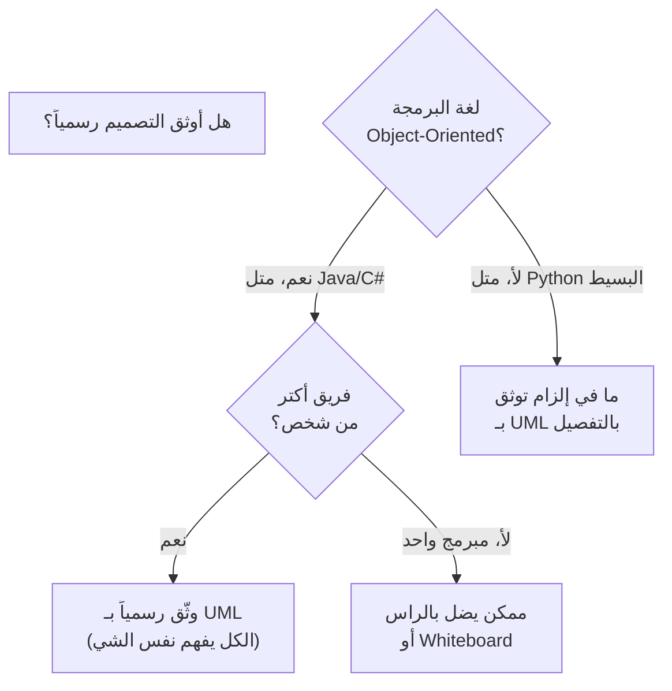

**شرح العناصر:**
- **لغة البرمجة Object-Oriented؟:** أول سؤال — الدكتور صراحة بيقول استخدم `UML` لما تكون شغال بمنهج كائني التوجه
- **فريق أكتر من شخص؟:** لو فريق، التوثيق الرسمي بيصير أهم عشان الكل يفهم نفس التصميم
- **Formal / Informal:** المخرجين المحتملين حسب الإجابات

**شرح الروابط:**
- **السهم من Q1 لـ Skip:** لو اللغة مش كائنية التوجه (متل `Python` البسيط)، ما في داعي تفصيل بـ `UML`
- **السهم من Q2 لـ Formal:** فريق أكبر من شخص بيحتاج لغة مشتركة موثقة

**التطبيق في هذا السياق:** طبّق هاد الإطار على أي مشروع تشتغل فيه — مشروع تخرج فردي بلغة بسيطة؟ خليك مرن. مشروع فريق بـ `Java` أو `C++`؟ وثّق بـ `UML`.

---

#### 📖 الإطار القرار (Decision Framework)

اسأل نفسك:

**1. هل شغال بمنهج كائني التوجه (`Object-Oriented`)؟**
- نعم: التوثيق بـ `UML` مفيد ومنطقي
- لأ (متل `Python` البسيط): ما في إلزام تفصّل بـ `UML` أو لغات وصف تانية

**2. هل الفريق أكتر من شخص واحد؟**
- نعم: التوثيق الرسمي بيصير أهم — بيخلي الكل يفهم نفس التصميم ويشتغل بالتوازي
- لأ: التصميم ممكن يضل بس براس المبرمج أو مرسوم على ورقة/`whiteboard`

#### 💼 السياقات المختلفة (Context Examples)

**السيناريو 1: مشروع تخرج فردي بـ Python بسيط**
- ما في إلزام توثيق رسمي بالتفصيل — فكرة عامة براسك كافية.

**السيناريو 2: فريق شركة ناشئة (Startup) بـ Java، 5 أشخاص**
- التوثيق بـ `UML` (حتى لو مختصر) بيصير مهم عشان الكل يفهم نفس البنية ويشتغل بالتوازي على أجزاء مختلفة.

#### 🎯 الملخص السريع
- في حالتين: تصميم موثّق رسمياً (`UML`) أو تصميم غير موثّق (براس المبرمج/`whiteboard`)
- التوثيق الرسمي أهم مع: منهج كائني التوجه + فريق أكبر من شخص
- ما في إلزام تستخدم `UML` لكل مشروع

#### 📚 التطبيق
هاد المبدأ رح ينطبق على كل خطوات الـ `OOD` الجاية — رح نستخدم `UML` كأداة توثيق افتراضية بالمحاضرة، بس تذكر إنها أداة اختيارية مش إلزامية بكل سياق.

#### 🤔 تفعيل الفهم
لو انت شغال لحالك على سكربت `Python` صغير لتحليل بيانات، هل لازم ترسم `UML class diagram` قبل ما تبلش؟ وليش الجواب بيختلف لو كان نفس المشروع بس بفريق 4 أشخاص وبـ `Java`؟

#### ⚠️ أخطاء شائعة

#### الفهم الخاطئ ❌:
افتراض إنه أي مشروع لازم يبلش بمخططات `UML` كاملة قبل كتابة أي سطر كود، وإلا التصميم "ناقص".

#### الفهم الصحيح ✅:
المحاضرة صراحة بتقول إنه أحياناً التصميم بيضل غير موثق رسمياً، وهاد طبيعي — خصوصاً بالمشاريع الصغيرة أو اللغات غير الكائنية أو لما تكون شغال لحالك.

#### 📄 النص الأصلي من المحاضرة
<details>
<summary>عرض النص الأصلي (coverage: 100%)</summary>

> Sometimes, there is a separate design stage → the design is modeled and documented. Other times, a design is in the programmer's head or sketched on a whiteboard or paper. It isn't necessary to describe the design in detail using UML or other description languages, use it when OO, not Python!

**ملاحظة على التغطية:**
- ✓ تم شرح بالكامل: الحالتين وشرط استخدام UML
- ℹ️ إضافة من الدليل: Decision framework والسيناريوهات (ليست بالمحاضرة الأصلية)

</details>

---

### 3. خطوات التصميم الكائني التوجه (نظرة عامة)

<!-- @type: fact -->
<!-- @render: {type: "diagram-first", visualization: "flowchart", coverage: "100%"} -->
<!-- @connectivity: {prerequisite: "2"} -->

#### 📍 أين نحن الآن؟
هاد القسم بيقدّم نظرة عامة على خمس خطوات موحدة لازم تعملها لتطوير تصميم نظام كائني التوجه.

#### ⬅️ الربط مع السابق
بعد ما فهمنا إنه التصميم ممكن يكون موثق أو لأ، هلأ منستعرض **خطوات** التصميم الكائني التوجه نفسها لما نقرر نوثقه.

#### 💡 الفكرة الأساسية
**لتطوير تصميم نظام كائني التوجه، لازم تعمل خمس خطوات بالترتيب: فهم السياق والتفاعلات، التصميم المعماري، تحديد أصناف الكائنات، بناء نماذج التصميم، وتحديد الواجهات.**

---

#### 📊 المخطط: خطوات التصميم الكائني التوجه (OOD)

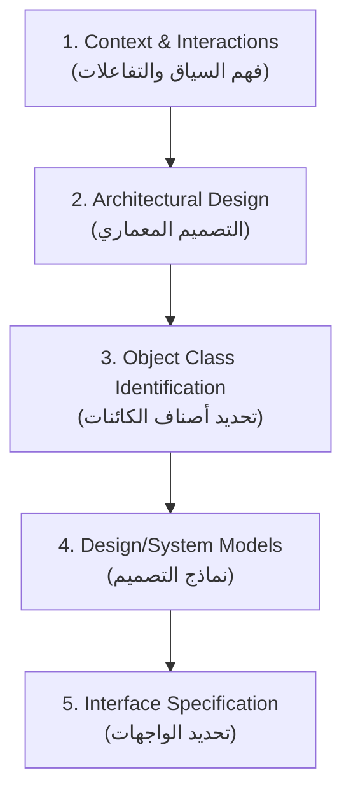

**شرح العناصر:**
- **Context & Interactions:** فهم حدود النظام والأنظمة الخارجية المتفاعلة معه
- **Architectural Design:** تحديد المكونات الرئيسية وتنظيمها
- **Object Class Identification:** استخراج الكائنات الفعلية من وصف النظام
- **Design/System Models:** بناء نماذج توضح الكائنات وعلاقاتها وتفاعلاتها
- **Interface Specification:** تحديد توقيعات الخدمات بين المكونات

**شرح الروابط:**
- **كل سهم بيمثل "يؤسس لـ":** كل خطوة بتبني على اللي قبلها — ما تقدر تحدد المعمارية قبل ما تفهم شو النظام لازم يتفاعل معه، وما تقدر تحدد الكائنات قبل ما تعرف المكونات المعمارية

**التطبيق في هذا السياق:** المثال اللي رح يرافقنا طول القسم هو **محطة طقس** (`wilderness weather station`) منتشرة بمناطق نائية، بتسجل بيانات الطقس محلياً وبتبعتها دورياً لنظام معلومات الطقس عبر قمر صناعي (`satellite link`).

---

#### 📖 التعريف الدقيق

هاي الخطوات الخمس موحدة وتنطبق على أي تصميم كائني التوجه — بس تذكر إنها مش بالضرورة خطية 100% (خصوصاً الخطوة 3، تحديد الكائنات، اللي هي عملية تكرارية بترجعلها أكتر من مرة).

#### 🎯 الملخص السريع
- 5 خطوات: سياق/تفاعلات → معمارية → أصناف كائنات → نماذج تصميم → واجهات
- كل خطوة تبني على السابقة
- المثال المرافق: نظام محطة طقس بيتصل بنظام معلومات طقس عبر قمر صناعي

#### 📚 التطبيق
كل قسم فرعي جاي (3.1 لـ 3.5) رح يشرح وحدة من هاي الخطوات الخمسة بالتفصيل مع تطبيقها على مثال محطة الطقس.

#### 📄 النص الأصلي من المحاضرة
<details>
<summary>عرض النص الأصلي (coverage: 100%)</summary>

> Remember what is an OO system? To develop a system design, we need: 1. Understand & define the context and the external interactions with the system 2. Design the system architecture 3. Identify the principal objects in the system 4. Develop design models 5. Specify interfaces. Wilderness weather stations are deployed in remote areas. Each weather station records local wither information and periodically transfers this to a weather information system, using a satellite link.

**ملاحظة على التغطية:**
- ✓ تم شرح بالكامل: الخطوات الخمس ووصف مثال محطة الطقس

</details>

---

### 3.1. نموذج سياق النظام والتفاعلات (System Context & Interaction Models)

<!-- @type: fact -->
<!-- @render: {type: "diagram-first", visualization: "uml", coverage: "100%"} -->
<!-- @connectivity: {prerequisite: "3"} -->

#### 📍 أين نحن الآن؟
هاي أول خطوة فعلية بالتصميم — فهم علاقة النظام ببيئته الخارجية.

#### ⬅️ الربط مع السابق
الخطوة الأولى من الخطوات الخمس اللي عرضناها بالقسم 3 — نبدأ فيها قبل أي شي تاني.

#### 💡 الفكرة الأساسية
**أول مرحلة بالتصميم هي فهم العلاقة بين البرنامج اللي بتصممه وبيئته الخارجية، عشان تحدد حدود النظام (`system boundaries`) — شو الميزات المنفذة داخل نظامك وشو المنفذة بأنظمة تانية مرتبطة فيه.**

---

#### 📊 المخطط: نموذج سياق محطة الطقس (System Context Model)

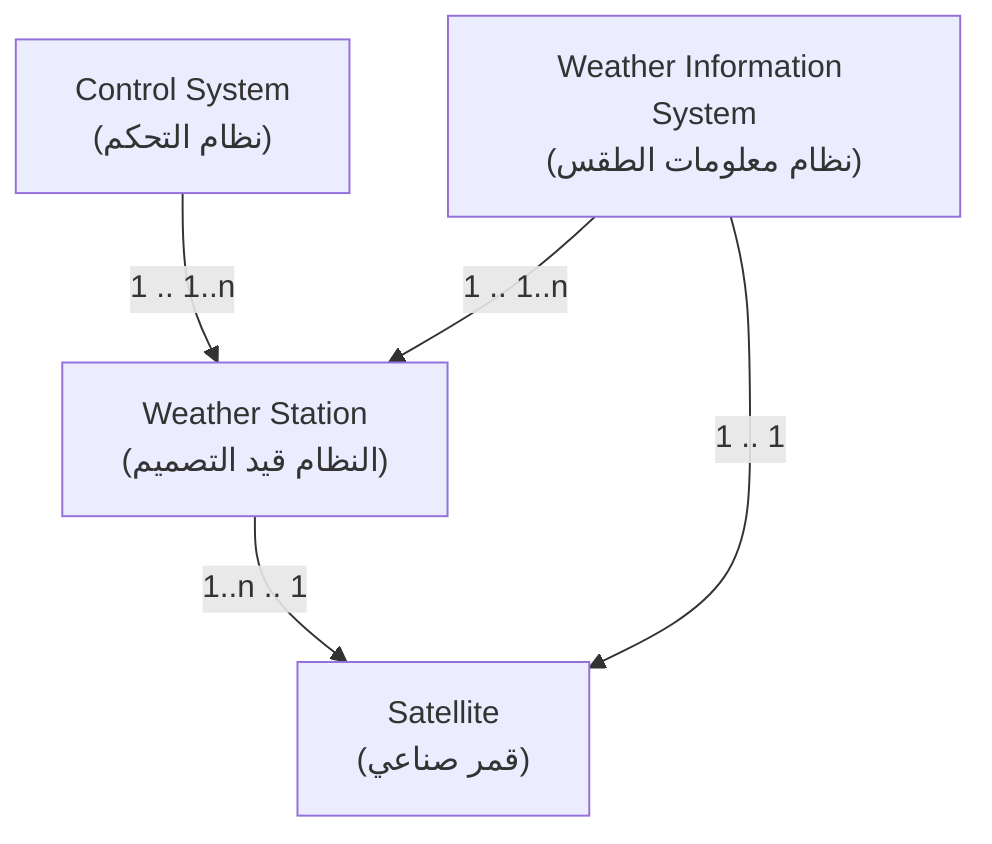

**شرح العناصر:**
- **Control System:** نظام خارجي بيرسل أوامر تحكم للمحطة (تشغيل/إيقاف/إعادة ضبط)
- **Weather Information System:** نظام خارجي بيستقبل بيانات الطقس والحالة من المحطة
- **Weather Station:** النظام قيد التصميم نفسه
- **Satellite:** وسيط اتصال بينقل البيانات بين المحطة ونظام المعلومات

**شرح الروابط:**
- **الأرقام على الأسهم (`1`, `1..n`):** هي `associations` بترقيم بتوضح كم كيان مرتبط بكم كيان — مثلاً نظام معلومات طقس واحد (`1`) ممكن يتصل بعدة محطات (`1..n`)
- **العلاقة مع Satellite:** كل الاتصال البيني بين المحطة ونظام المعلومات بيصير عبر القمر الصناعي

**التطبيق في هذا السياق:** هاد النوع من المخططات (شبيه بـ `block diagram`) هو **نموذج هيكلي/ساكن** (`structural model`) — بيوريك مين موجود بالبيئة، من غير ما يشرح كيف بيصير التفاعل فعلياً (هاد دور النموذج الجاي).

---

#### 📊 المخطط: نموذج التفاعل (Use Case / Interaction Model)

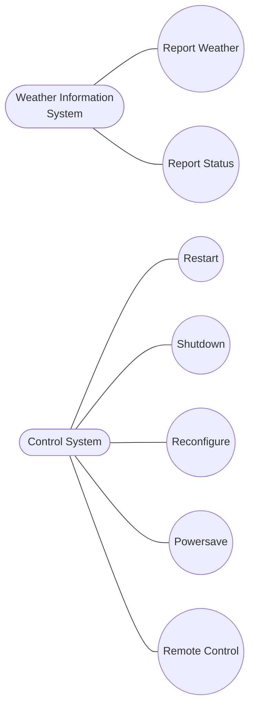

**شرح العناصر:**
- **Weather Information System / Control System (الأشكال المستطيلة المدوّرة):** الكيانات الخارجية (`actors`) — بتمثل شكل "رجل العصا" (`stick figure`) بمخطط `UML` الأصلي
- **الدوائر (Report Weather, Restart, إلخ):** كل دائرة هي حالة استخدام (`use case`) — تفاعل ممكن واحد بين النظام والكيان الخارجي

**شرح الروابط:**
- **الخط من `WIS` لـ `Report Weather` و`Report Status`:** نظام معلومات الطقس بيقدر يطلب من المحطة تقرير طقس أو تقرير حالة
- **الخطوط من `Control System`:** نظام التحكم بيقدر يطلب 5 عمليات: إعادة تشغيل، إيقاف، إعادة ضبط، توفير طاقة، وتحكم عن بعد

**التطبيق في هذا السياق:** هاد **نموذج ديناميكي** (`dynamic model`) — بيوريك كيف النظام فعلياً بيتفاعل مع بيئته أثناء الاستخدام، عكس نموذج السياق الساكن فوق.

---

#### 📖 الشرح

اقرأ المخططين كالتالي: نموذج السياق (الأول) شبيه بخريطة ثابتة — بيوريك مين موجود بالمنطقة بس. نموذج التفاعل (الثاني) شبيه بفيديو — بيوريك شو فعلياً بيصير أثناء الاستخدام.

كل حالة استخدام (`use case`) لازم توثق بجدول وصفي فيه: **النظام**، **Use case**، **Actors**، **Description**، **Stimulus** (الحافز اللي بيبدأ التفاعل)، **Response** (الاستجابة الناتجة)، و**Comments**.

| الحقل | القيمة (مثال: Report Weather) |
| --- | --- |
| **النظام** | Weather station |
| **Use case** | Report weather |
| **Actors** | Weather information system, Weather station |
| **Description** | المحطة بترسل ملخص بيانات الطقس (أقصى/أدنى/معدل الحرارة، الضغط، سرعة الرياح، إجمالي الأمطار، اتجاه الرياح) المجمّعة كل خمس دقائق |
| **Stimulus** | نظام المعلومات بيفتح اتصال قمر صناعي وبيطلب البيانات |
| **Response** | البيانات الملخّصة بترسل لنظام المعلومات |
| **Comments** | معدل الإبلاغ غالباً مرة كل ساعة، بس ممكن يختلف من محطة لمحطة |

#### 🎯 الملخص السريع
- نموذج السياق (`context model`) = هيكلي/ساكن، بيبيّن الأنظمة الخارجية المرتبطة (block diagram + associations)
- نموذج التفاعل (`interaction model`) = ديناميكي، بيبيّن كيف النظام بيتفاعل فعلياً (`use case model`: أشكال بيضاوية + stick figures)
- كل `use case` لازم يوثّق بجدول: النظام، الحالة، الفاعلين، الوصف، الحافز، الاستجابة، الملاحظات

#### 📚 التطبيق
فهم حدود النظام والتفاعلات الخارجية هون هو اللي رح يوجهنا بالخطوة الجاية لتحديد **المعمارية الداخلية** للنظام (القسم 3.2).

#### 💡 التشبيه
فهم `system context model` مثل رسم خريطة لحي كامل قبل ما تصمم بيت — لازم تعرف مين جيرانك (الأنظمة الخارجية) قبل ما تحدد وين أبواب بيتك (نقاط التكامل).

#### ⚠️ أخطاء شائعة

#### الفهم الخاطئ ❌:
الاعتقاد إنه نموذج السياق ونموذج التفاعل هما نفس الشي لأنه الاثنين بيتعاملوا مع "الأنظمة الخارجية".

#### الفهم الصحيح ✅:
نموذج السياق **ساكن** (بيبيّن مين موجود بالبيئة بس، زي خريطة)، بينما نموذج التفاعل **ديناميكي** (بيبيّن شو فعلياً بيصير أثناء الاستخدام، زي فيديو).

#### 📄 النص الأصلي من المحاضرة
<details>
<summary>عرض النص الأصلي (coverage: 100%)</summary>

> 1st phase in software design is develop an understanding of the relationships between: 1. The software being designed 2. Its external environment. Understanding the context → establish the system boundaries. System context model: a structural model that demonstrates the other systems in the environment of the system being developed. Interaction model: a dynamic model that shows how the system interacts with its environments as it is used. Context model: is represented using associations... we could use simple block diagram. Interactions of a system with its environment [does not include too much detail]. We can use a use case model: Each possible interaction is named in ellipse; External entity involved in the interaction is represented by stick figure.

**ملاحظة على التغطية:**
- ✓ تم شرح بالكامل: نموذج السياق، نموذج التفاعل، جدول وصف الـ use case بمثال Report Weather

</details>

---

### 3.2. التصميم المعماري (Architectural Design)

<!-- @type: fact -->
<!-- @render: {type: "diagram-first", visualization: "component", coverage: "100%"} -->
<!-- @connectivity: {prerequisite: "3.1"} -->

#### 📍 أين نحن الآن؟
بعد ما حددنا حدود النظام وتفاعلاته الخارجية، هلأ منحدد المكونات الداخلية الرئيسية.

#### ⬅️ الربط مع السابق
التفاعلات اللي حددناها بالقسم 3.1 (`Report Weather`, `Restart`, إلخ) هي اللي رح توجه شو المكونات الداخلية اللي محتاجينها.

#### 💡 الفكرة الأساسية
**بعد تحديد التفاعلات، نصمم المعمارية بتحديد المكونات الرئيسية اللي بيتكون منها النظام وتفاعلاتها، وننظمها باستخدام نمط معماري (`architectural pattern`).**

---

#### 📊 المخطط: معمارية محطة الطقس

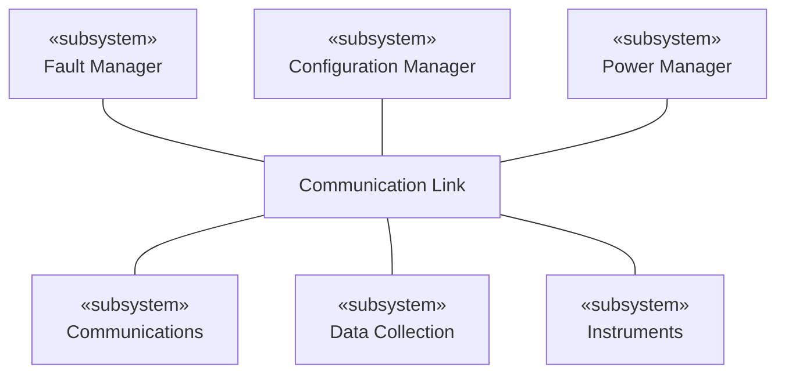

**شرح العناصر:**
- **Fault Manager:** يدير الأعطال بالنظام
- **Configuration Manager:** يدير إعادة الضبط والتهيئة
- **Power Manager:** يدير استهلاك واستخدام الطاقة
- **Communication Link:** طبقة اتصال مركزية بين كل الأقسام
- **Communications:** يدير الاتصال الخارجي (مع القمر الصناعي)
- **Data Collection:** يجمع بيانات الطقس من الأدوات
- **Instruments:** أدوات القياس الفعلية (حرارة، رياح...)

**شرح الروابط:**
- **كل الخطوط بتمر عبر `Communication Link`:** طبقة اتصال مركزية (`bus`) — أي `subsystem` بيحكي مع أي `subsystem` تاني عن طريقها، مش مباشرة

**التطبيق في هذا السياق:** هاد النمط المعماري (طبقة اتصال مركزية) بيسمح بإضافة `subsystem` جديد بالمستقبل من غير ما تعدّل كل الأقسام التانية — بس توصله بـ `Communication Link`.

---

#### 📊 المخطط: معمارية Data Collection subsystem (تفصيل داخلي)

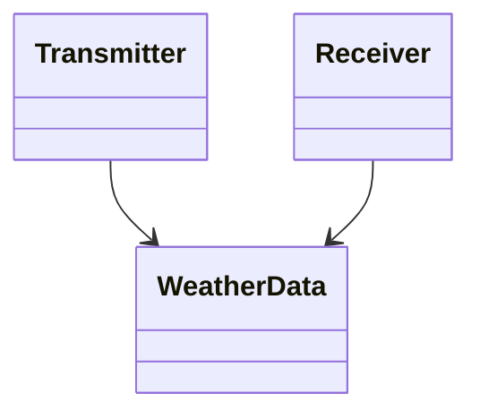

**شرح العناصر:**
- **Transmitter:** الكائن المسؤول عن إرسال البيانات
- **Receiver:** الكائن المسؤول عن استقبال الأوامر/البيانات
- **WeatherData:** الكائن اللي بيحمل البيانات نفسها وبيتناقل بين الاثنين

**شرح الروابط:**
- **الأسهم لـ `WeatherData`:** كل من `Transmitter` و`Receiver` بيتعاملوا مع نفس الكائن `WeatherData`

**التطبيق في هذا السياق:** كل `subsystem` بحد ذاته ممكن يكون إله معمارية داخلية خاصة فيه — هاد مثال إنه `Data Collection` مش صندوق أسود، فيه بنية داخلية واضحة.

#### 📖 الشرح
اقرأ المخطط الأول كالتالي: فوق في ثلاث `subsystems` مسؤولة عن الإدارة الداخلية (أعطال، تهيئة، طاقة)، وتحت في ثلاث `subsystems` مسؤولة عن الوظائف الأساسية (اتصال، جمع بيانات، أدوات) — وكلهم مرتبطين ببعض عبر طبقة وسطى واحدة اسمها `Communication Link`.

#### 🎯 الملخص السريع
- المعمارية = تحديد المكونات الرئيسية + تنظيمها بنمط معماري
- محطة الطقس انقسمت لست subsystems حول طبقة اتصال مركزية واحدة
- كل subsystem ممكن يكون إله معمارية داخلية خاصة فيه (زي Data Collection: Transmitter + Receiver + WeatherData)

#### 📚 التطبيق
هاي المكونات المعمارية (`Data Collection`, `Instruments`, إلخ) رح تكون المصدر الأساسي اللي رح نستخرج منه أصناف الكائنات بالقسم الجاي (3.3).

#### ⚠️ أخطاء شائعة

#### الفهم الخاطئ ❌:
التفكير إنه المعمارية شي واحد بس على مستوى النظام الكامل، وما إلها علاقة بتفاصيل داخلية.

#### الفهم الصحيح ✅:
كل `subsystem` ممكن يكون إله معماريته الداخلية الخاصة — يعني المعمارية موجودة على أكتر من مستوى (النظام الكامل، وكل subsystem لحاله).

#### 📄 النص الأصلي من المحاضرة
<details>
<summary>عرض النص الأصلي (coverage: 100%)</summary>

> After defining the interactions → design architectural design: Identify major components that make up the system and their interactions; Organize the components using an architectural pattern. [Architecture of weather station diagram: Fault Manager, Configuration Manager, Power Manager over Communication Link over Communications, Data Collection, Instruments]. architecture for each subsystem [Data Collection: Transmitter, Receiver, WeatherData].

**ملاحظة على التغطية:**
- ✓ تم شرح بالكامل: خطوة التصميم المعماري ومثال معمارية محطة الطقس على المستويين

</details>

---

### 3.3. تحديد أصناف الكائنات (Object Class Identification)

<!-- @type: principle -->
<!-- @render: {type: "diagram-first", visualization: "hierarchy", coverage: "100%"} -->
<!-- @connectivity: {prerequisite: "3.2"} -->

#### 📍 أين نحن الآن؟
بعد تحديد المكونات المعمارية، هلأ منستخرج الكائنات (`objects`) الفعلية اللي رح تُبنى منها هاي المكونات.

#### ⬅️ الربط مع السابق
المكونات المعمارية اللي حددناها بالقسم 3.2 (زي `Data Collection`, `Instruments`) هي المصدر اللي رح نستخرج منه أصناف الكائنات.

#### 💡 الفكرة الأساسية
**تحديد أصناف الكائنات من أصعب أجزاء التصميم الكائني التوجه — ما في صيغة سحرية واحدة، في أربع طرق مختلفة بتصلح لسياقات مختلفة، والاختيار بيعتمد على مهارة وخبرة المصمم.**

---

#### 📊 المخطط: أربع طرق لتحديد أصناف الكائنات

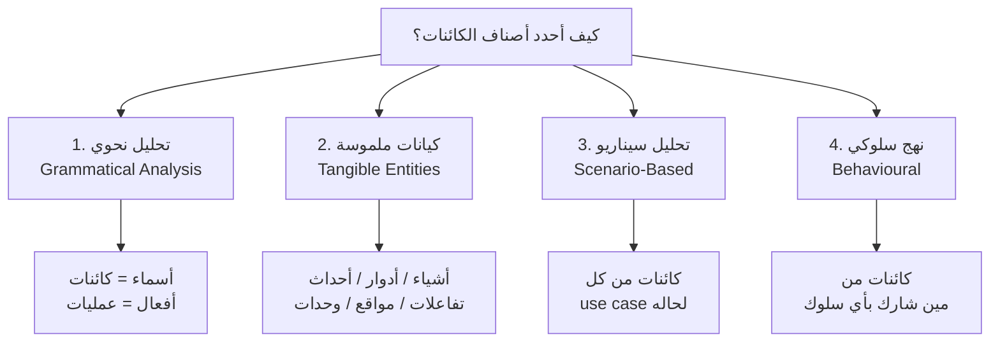

**شرح العناصر:**
- **تحليل نحوي:** تاخد وصف طبيعي للنظام وتحلله لغوياً
- **كيانات ملموسة:** تدوّر على أنواع محددة من الكيانات بمجال التطبيق
- **تحليل سيناريو:** تستخرج الكائنات من كل `use case` بمفرده
- **نهج سلوكي:** تنطلق من السلوكيات وترجع للورا لتحدد المسؤول عنها

**شرح الروابط:**
- **الأسهم من `Start` للطرق الأربعة:** الطرق مش حصرية — ممكن تستخدم أكتر من وحدة مع بعض على نفس النظام

**التطبيق في هذا السياق:** بمثال محطة الطقس، استخدمنا بالأساس **التحليل النحوي** على وصف النظام النصي.

---

#### 📖 الإطار القرار (Decision Framework)

اسأل نفسك:

**1. عندك وصف نصي واضح للنظام؟**
- نعم: استخدم **التحليل النحوي** — الأسماء والصفات (`nouns & attributes`) هي كائنات، والأفعال (`verbs`) هي عمليات أو خدمات (`operations/services`)

**2. عندك معرفة عميقة بمجال العمل (`domain knowledge`)؟**
- نعم: دوّر على **كيانات ملموسة**: أشياء (`things` — متل `Aircraft`)، أدوار (`roles` — متل `manager`, `doctor`)، أحداث (`events` — متل `request`)، تفاعلات (`interactions` — متل `meetings`)، مواقع (`location` — متل `offices`)، ووحدات تنظيمية (`organizational units` — متل `companies`)

**3. عندك حالات استخدام (`use cases`) موثقة؟**
- نعم: استخدم **التحليل المبني على السيناريو** — استخرج الكائنات والخصائص والدوال من كل سيناريو بمفرده

**4. بتعرف السلوكيات المطلوبة بس مش الكائنات؟**
- نعم: استخدم **النهج السلوكي** — حدد الكائنات بناءً على "مين شارك بأي سلوك"

#### 💼 السياقات المختلفة (Context Examples)

**السيناريو 1: نظام محطة الطقس (وصف نصي متوفر)**
من وصف: "محطة الطقس هي حزمة من أدوات مُتحكَّم فيها برمجياً بتجمع بيانات، بتعالجها، وبترسلها لمزيد من المعالجة..." — استخدمنا **التحليل النحوي**: الأفعال (تجمع، تعالج، ترسل) صارت عمليات، والأسماء (محطة، بيانات، أدوات) صارت كائنات. النتيجة: `WeatherStation`, `WeatherData`, `Ground Thermometer`, `Anemometer`, `Barometer`.

**السيناريو 2: نظام إدارة مستشفى (بدون وصف نصي كافي، بس مجال معروف)**
لو ما عندك وصف نصي مفصل، بس بتعرف مجال المستشفيات، استخدم **الكيانات الملموسة**: أدوار (`Doctor`, `Nurse`, `Patient`)، أحداث (`Appointment`, `Admission`)، مواقع (`Room`, `Ward`) — هاد أسرع من إنك تنتظر وصف نصي كامل.

---

#### 📖 الشرح

من وصف نظام محطة الطقس تم استخراج الأصناف التالية بالتحليل النحوي:

| الصنف | الخصائص | الدوال |
| --- | --- | --- |
| `WeatherStation` | `identifier` | `reportWeather()`, `reportStatus()`, `powerSave(instruments)`, `remoteControl(commands)`, `reconfigure(commands)`, `restart(instruments)`, `shutdown(instruments)` |
| `WeatherData` | `airTemperatures`, `groundTemperatures`, `windSpeeds`, `windDirections`, `pressures`, `rainfall` | `collect()`, `summarize()` |
| `Ground Thermometer` | `gt_Ident`, `temperature` | `get()`, `test()` |
| `Anemometer` | `an_Ident`, `windSpeed`, `windDirection` | `get()`, `test()` |
| `Barometer` | `bar_Ident`, `pressure`, `height` | `get()`, `test()` |

#### 🎯 الملخص السريع
- تحديد الكائنات = عملية تكرارية بدون صيغة سحرية، بتعتمد على خبرة المصمم
- 4 طرق: تحليل نحوي (أسماء=كائنات/أفعال=عمليات)، كيانات ملموسة، تحليل سيناريو، نهج سلوكي
- مثال محطة الطقس أعطى: WeatherStation, WeatherData, Ground Thermometer, Anemometer, Barometer

#### 📚 التطبيق
الأصناف اللي حددناها هون رح تكون أساس نماذج التصميم بالقسم الجاي (3.4).

#### 💡 التشبيه
تحديد أصناف الكائنات مثل **عمل محقق جنائي** — ما في صيغة ثابتة توصلك للحل، بس عندك أدوات مختلفة (تحليل الأدلة النصية، معرفة سياق الجريمة، تتبع السلوكيات) وبتستخدم اللي يناسب الحالة، وأحياناً بترجع تراجع استنتاجاتك.

#### 🤔 تفعيل الفهم
لو عندك وصف نظام مكتبة إلكترونية: "المستخدم بيبحث عن كتاب، يستعيره، ويرجعه بعد فترة" — استخدم التحليل النحوي: شو الكائنات (أسماء) وشو العمليات (أفعال) اللي بتطلع من هاد الوصف؟

#### ⚠️ أخطاء شائعة

#### الفهم الخاطئ ❌:
التفكير إنه في طريقة واحدة "صحيحة" ثابتة لتحديد الكائنات، ولو اتبعتها رح توصل للنتيجة الصح من أول مرة.

#### الفهم الصحيح ✅:
ما في "صيغة سحرية" (`magic formula`)، والعملية **تكرارية** (`iterative`) — طبيعي جداً إنك ترجع وتعدل الأصناف اللي حددتها أكتر من مرة، وممكن تستخدم أكتر من طريقة مع بعض.

#### 📄 النص الأصلي من المحاضرة
<details>
<summary>عرض النص الأصلي (coverage: 100%)</summary>

> Identifying object classes is often a difficult part of object oriented design. There is no 'magic formula' for object identification. It relies on the skill, experience and domain knowledge of system designers. Object identification is an iterative process. Use a grammatical analysis of a natural description... Objects & attributes are nouns; Operations or services are verbs. Or, use tangible entities: Things, Roles, Events, Interactions, Location, Organizational units. Use a scenario-based analysis... Use a behavioural approach... A weather station is a package of software controlled instruments which collects data, performs some data processing and transmits this data for further processing. The instruments include air and ground thermometers, an anemometer, a wind vane, a barometer and a rain gauge. Data is collected periodically. When a command is issued to transmit the weather data, the weather station processes and summarises the collected data. The summarised data is transmitted to the mapping computer when a request is received.

**ملاحظة على التغطية:**
- ✓ تم شرح بالكامل: كل طرق التحديد الأربع، ومثال أصناف كائنات محطة الطقس بالكامل
- ℹ️ إضافة من الدليل: تشبيه المحقق الجنائي، سيناريو المستشفى ومكتبة إلكترونية (ليست بالمحاضرة)

</details>

---

### 3.1-3.3 مثال متكامل: من السياق للكائنات بمثال محطة الطقس

<!-- @type: example-for-topics-3.1-to-3.3 -->

#### 📌 السياق: نظام محطة طقس بمنطقة نائية
عندك مشروع حقيقي: بناء نظام محطة طقس بيرسل بياناته لمركز مراقبة عبر قمر صناعي — نفس فكرة تطبيقات `IoT` الحديثة (أجهزة استشعار بترسل بيانات لسيرفر مركزي).

#### 💼 السيناريو (Real-World Example)
لو كنت المصمم، بتمشي هيك: **أولاً** (3.1) بتحدد إنه نظامك (`Weather Station`) بيتفاعل مع `Weather Information System` (بيطلب تقارير) و`Control System` (بيرسل أوامر) عبر `Satellite`. **ثانياً** (3.2) بتصمم المعمارية الداخلية: `subsystems` لإدارة الأعطال والتهيئة والطاقة، ووحدات تانية للاتصال وجمع البيانات وقراءة الأدوات — كلهم متصلين بطبقة `Communication Link` مركزية. **ثالثاً** (3.3) من وصف النظام النصي، بتستخرج الكائنات الفعلية: `WeatherStation` (الكائن الرئيسي)، `WeatherData` (حاوية البيانات)، وكائنات الأدوات (`Ground Thermometer`, `Anemometer`, `Barometer`).

#### 💡 كيف تجتمع المفاهيم؟
- **نموذج السياق (3.1):** حدد إنه في 3 أنظمة خارجية (Control, Weather Info, Satellite)
- **المعمارية (3.2):** ترجم هاد الفهم لـ 6 subsystems منظمة حول Communication Link
- **تحديد الكائنات (3.3):** من داخل subsystem واحد بس (`Data Collection`)، استخرجنا `WeatherData`, `Transmitter`, `Receiver` — ومن وصف النظام الكامل استخرجنا `WeatherStation` والأدوات
- **النتيجة:** تصميم متكامل ينتقل بسلاسة من "مين برا النظام" لـ "شو جوا النظام" لـ "شو الكائنات الفعلية"

#### ⚠️ لو ما طبّقتهم صح؟
لو قفزت مباشرة لتحديد الكائنات (خطوة 3) من غير ما تحدد السياق والمعمارية أول، ممكن تفوتك كائنات مهمة مسؤولة عن التفاعل مع الأنظمة الخارجية (زي `Communication Link` أو `Transmitter`/`Receiver`) — لأنه هاي الكائنات طلعت أصلاً من فهم المعمارية، مش من وصف النظام العام بس.

---

### 3.4. نموذج التصميم: الهيكلي مقابل الديناميكي (Structural vs Dynamic Models)

<!-- @type: fact -->
<!-- @render: {type: "diagram-first", visualization: "sequence+state", coverage: "95%"} -->
<!-- @connectivity: {prerequisite: "3.3"} -->

#### 📍 أين نحن الآن؟
بعد ما حددنا الكائنات، هلأ منبني نماذج توضح شكل النظام وتفاعلاته بشكل منظّم وموثّق.

#### ⬅️ الربط مع السابق
الأصناف اللي حددناها بالقسم 3.3 (`WeatherStation`, `WeatherData`...) هي اللي رح تظهر جوا النماذج هون.

#### 💡 الفكرة الأساسية
**نموذج التصميم بيوريك الكائنات وعلاقاتها، وبيشكّل الجسر بين المتطلبات والتنفيذ. في نوعين موحدين بـ `UML`: نماذج هيكلية/ساكنة (structure ثابتة) ونماذج ديناميكية (تفاعلات وتغييرات حالة).**

---

#### 📊 المخطط: نموذج التتابع (Sequence Diagram) لسيناريو Report Weather

```mermaid
sequenceDiagram
    participant WIS as Weather Information System
    participant Sat as :SatComms
    participant WS as :WeatherStation
    participant Link as :Commslink
    participant WD as :WeatherData

    WIS->>Sat: request(report)
    Sat-->>WIS: acknowledge
    Sat->>WS: reportWeather()
    WS->>Link: get(summary)
    Link->>WD: summarize()
    WS->>Sat: send(report)
    Sat-->>WIS: reply(report)
```

**شرح العناصر:**
- **Weather Information System:** الكيان الخارجي اللي بيبدأ الطلب
- **SatComms:** الكائن اللي بيستقبل الطلب عبر القمر الصناعي
- **WeatherStation:** الكائن المنسّق لعملية التقرير
- **Commslink:** الكائن اللي بيجمع الملخص من مصدر البيانات
- **WeatherData:** الكائن اللي بيلخّص البيانات الخام

**شرح الروابط:**
- **الأسهم المتصلة (`->>`):** استدعاءات (طلب تنفيذ عملية)
- **الأسهم المتقطعة (`-->>`):** ردود (نتيجة الاستدعاء)
- **الترتيب من فوق لتحت:** يمثل تسلسل زمني — الوقت ماشي عمودياً

**التطبيق في هذا السياق:** هاد النموذج **ديناميكي** — بيوضح بالضبط ترتيب النداءات، وهاد بيساعد المبرمج يعرف بالظبط شو الدالة اللي لازم يستدعيها ومتى.

---

#### 📊 المخطط: مخطط الحالة (State Diagram) لكائن WeatherStation

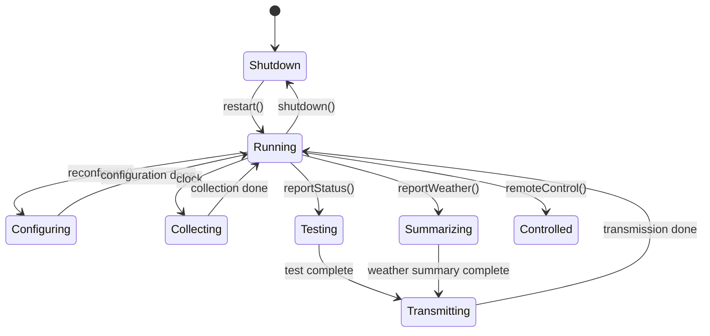

**شرح العناصر:**
- **Shutdown:** الحالة الابتدائية — النظام مطفي
- **Running:** الحالة المركزية اللي بترجعلها بعد أغلب العمليات
- **Configuring / Collecting / Testing / Transmitting / Summarizing:** حالات فرعية مؤقتة أثناء تنفيذ عملية معينة
- **Controlled:** حالة نهائية بعد استقبال أمر تحكم عن بعد

**شرح الروابط:**
- **الأسهم المسمّاة (`restart()`, `clock`, `test complete`...):** الحدث أو الاستدعاء اللي بيسبب الانتقال من حالة لتانية

**التطبيق في هذا السياق:** هاد مثال على كائن سلوكه **معقّد بما فيه الكفاية** ليستحق `state diagram` — مش كل الكائنات بالنظام بتحتاج هيك تفصيل.

---

#### 📖 الشرح

**النماذج الهيكلية/الساكنة** (`structural models`) بتوصف البنية الثابتة للنظام باستخدام أصناف الكائنات والعلاقات — أهمها: علاقات التعميم (`generalization`)، الاستخدام/الاستخدام-من-قِبَل (`uses/used-by`)، والتركيب (`composition`). مثال عليها: **نماذج الأقسام الفرعية** (`subsystem models`) بشكل `class diagram` وين كل `subsystem` بيتمثل كـ `package` (زي مخطط `Data Collection` بالقسم 3.2).

**النماذج الديناميكية** (`dynamic models`) بتوصف البنية المتغيرة، وبتبيّن تسلسل طلبات الخدمة (`sequence of services requests`) وتغييرات الحالة (`state changes`) الناتجة عنها — مثالها **نماذج التتابع** (فوق) و**مخططات الحالة** (فوق كمان).

مخططات الحالة مفيدة كنماذج عالية المستوى لسلوك كائن معيّن وقت التنفيذ، بس **مش لازم تعمل `state diagram` لكل الكائنات** — كثير كائنات بالنظام بسيطة نسبياً وعمل نموذج حالة إلها بيضيف تفاصيل غير ضرورية للتصميم.

#### 🎯 الملخص السريع
- نوعين رئيسيين: نماذج هيكلية/ساكنة (subsystem/class diagrams) ونماذج ديناميكية (sequence, state)
- Sequence diagram: استدعاءات (`->>`) وردود (`-->>`) مرتبة زمنياً من فوق لتحت
- State diagram: مفيد بس للكائنات ذات السلوك المعقّد (زي WeatherStation)، مش لكل الكائنات

#### 📚 التطبيق
النماذج اللي بنيناها هون (خاصة الأسماء والاستدعاءات زي `reportWeather()`, `get(summary)`) رح تحدد بدقة شو الواجهات اللي لازم نصممها بالقسم الجاي والأخير (3.5).

#### ⚠️ أخطاء شائعة

#### الفهم الخاطئ ❌:
التفكير إنه لازم تعمل `state diagram` لكل كائن بالنظام حتى النظام يكون "كامل" وموثق مئة بالمئة.

#### الفهم الصحيح ✅:
أغلب الكائنات بالنظام بسيطة، وعمل `state model` إلها بيضيف تفاصيل زايدة وغير ضرورية — استخدمها بس للكائنات اللي سلوكها فعلاً معقّد ومتعدد الحالات.

#### 📄 النص الأصلي من المحاضرة
<details>
<summary>عرض النص الأصلي (coverage: 95%)</summary>

> Shows objects or object classes in a system. Shows associations between entities. is bridge between system requirements and implementation... In UML, there are about 13 different types of models... In UML, we normally develop two kinds of design model: Structural models (static); Dynamic models... Sequence models show the sequence of object interactions that take place: Objects are arranged horizontally across the top; Time is represented vertically...; A thin rectangle in an object lifeline represents the time when the object is the controlling object. State diagrams are used to show how objects respond to different service requests and the state transitions triggered by these requests... You don't usually need a state diagram for all of the objects in the system.

**ملاحظة على التغطية:**
- ✓ تم شرح بالكامل: النوعين الرئيسيين للنماذج، sequence model بالتفصيل، state model ومتى نحتاجه
- ⚠️ لم يتم شرح بالتفصيل: القائمة الكاملة للـ 13 نوع نموذج بـ UML (المحاضرة نفسها ما فصّلتهم، بس ذكرت العدد)

</details>

---

### 3.5. تحديد الواجهات (Interface Specification)

<!-- @type: practice -->
<!-- @render: {type: "diagram-first", visualization: "uml", coverage: "100%"} -->
<!-- @connectivity: {prerequisite: "3.4"} -->

#### 📍 أين نحن الآن؟
هاي آخر خطوة من خطوات الـ `OOD` الخمس — تحديد الواجهات الدقيقة بين المكونات.

#### ⬅️ الربط مع السابق
الاستدعاءات اللي ظهرت بنموذج التتابع بالقسم 3.4 (زي `reportWeather()`, `get(summary)`) هي اللي لازم تتحول هون لتوقيعات واجهة رسمية.

#### 💡 الفكرة الأساسية
**الواجهات لازم تُحدَّد بدقة حتى يقدر المصممون يصمموا الكائنات والمكونات التانية بالتوازي (`in parallel`) — والقاعدة الذهبية: أخفِ تمثيل الواجهة الداخلي جوا الكائن نفسه.**

---

#### 📊 المخطط: واجهتا محطة الطقس

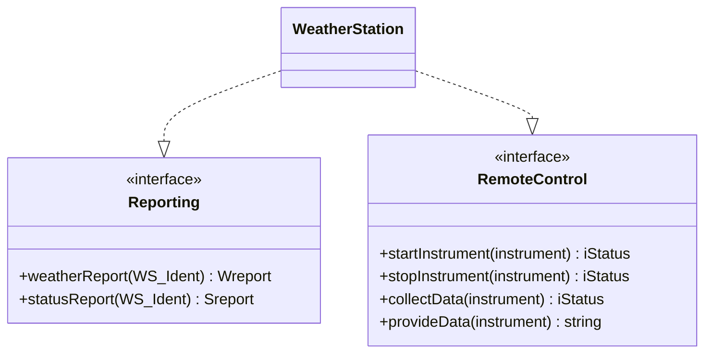

**شرح العناصر:**
- **Reporting «interface»:** واجهة فيها دالتين لطلب تقرير الطقس أو الحالة
- **RemoteControl «interface»:** واجهة فيها أربع دوال للتحكم عن بعد بالأدوات
- **WeatherStation:** الكائن اللي بينفذ (`implements`) الواجهتين

**شرح الروابط:**
- **الأسهم المتقطعة (`..|>`):** تعني "ينفذ الواجهة" (`realization`) — `WeatherStation` بتوفر فعلياً الخدمات المذكورة بكل واجهة

**التطبيق في هذا السياق:** كل صندوق بيحدد بس **توقيعات** (`signatures`) الدوال (اسم الدالة + نوع المدخلات + نوع المخرجات)، من غير أي تفاصيل عن كيف هاي الدوال منفذة فعلياً جوا `WeatherStation`.

---

#### 📖 الشرح

تصميم الواجهة بيحدد التوقيعات والدلالات (`semantics`) للخدمات اللي بيقدّمها كائن أو مجموعة كائنات — و`UML` بتستخدم `class diagrams` لهاد الغرض (وممكن كمان تستخدم `Java` لتوثيق الواجهة). أهم قاعدة تصميمية هون: **المصممين لازم يتجنبوا تصميم تمثيل الواجهة الداخلي بشكل مكشوف، وبدل هيك يخفوا هاد التمثيل جوا الكائن نفسه** — يعني اللي بيشوف الواجهة من برا بيشوف بس شو الخدمة المتاحة، مش كيف هي منفذة بالضبط.

#### 🎯 الملخص السريع
- تحديد الواجهات = آخر خطوة، بتسمح بتصميم متوازي للمكونات
- الواجهة تحدد التوقيعات والدلالات بس، مو التنفيذ الداخلي
- UML بتستخدم class diagrams للواجهات (وممكن Java كمان)
- قاعدة ذهبية: أخفِ تمثيل الواجهة جوا الكائن نفسه

#### 📚 التطبيق
بعد هاي الخطوة الخامسة، التصميم الكائني التوجه يكون مكتمل ونقدر ننتقل لمرحلة **التنفيذ** (القسم 4) — تحويل هاد التصميم لكود فعلي شغال.

#### 💡 التشبيه
الواجهة (`interface`) مثل **قائمة الطعام بمطعم** — أنت (المستخدم) بتشوف بس أسماء الأطباق وأسعارها (التوقيع)، بدون ما تشوف تفاصيل الطبخة بالمطبخ (التنفيذ الداخلي). لو الشيف غيّر الوصفة، القائمة (الواجهة) بتضل نفسها.

#### ⚠️ أخطاء شائعة

#### الفهم الخاطئ ❌:
كشف تفاصيل كيفية تنفيذ الواجهة (مثلاً كيف بالضبط `WeatherStation` بتخزن بياناتها) بمخطط الواجهة نفسه.

#### الفهم الصحيح ✅:
المصمم الجيد بيخفي هاد التمثيل الداخلي جوا الكائن — الواجهة بس بتكشف "شو" الخدمة المتاحة (التوقيع)، مش "كيف" هي منفذة بالضبط، وهاد بيسمح بتغيير التنفيذ لاحقاً من غير ما يأثر على المستخدمين.

#### 📄 النص الأصلي من المحاضرة
<details>
<summary>عرض النص الأصلي (coverage: 100%)</summary>

> Interface between components. Object interfaces have to be specified so that the objects and other components can be designed in parallel. Interface design defines the signatures and semantics of services that are provided by object or group of objects. The UML uses class diagrams for interface specification but Java may also be used. Designers should avoid designing the interface representation but should hide this in the object itself. [Reporting interface: weatherReport, statusReport; Remote Control interface: startInstrument, stopInstrument, collectData, provideData]

**ملاحظة على التغطية:**
- ✓ تم شرح بالكامل: الغرض من تحديد الواجهات، القاعدة الذهبية للإخفاء، ومثال واجهتي محطة الطقس

</details>

---

### 4. التنفيذ (Implementation): نظرة عامة

<!-- @type: fact -->
<!-- @render: {type: "diagram-first", visualization: "flowchart", coverage: "100%"} -->
<!-- @connectivity: {prerequisite: "3.5"} -->

#### 📍 أين نحن الآن؟
انتهينا من التصميم الكائني التوجه بكل خطواته، وهلأ منتنقل لمرحلة التنفيذ الفعلي.

#### ⬅️ الربط مع السابق
الواجهات والنماذج اللي صممناها بالقسم 3 هي اللي رح تتحول هون لكود فعلي شغال.

#### 💡 الفكرة الأساسية
**التنفيذ معني بإنشاء نسخة قابلة للتنفيذ من النظام — والمحاضرة بتركز على ثلاث قضايا عملية: إعادة الاستخدام، إدارة التهيئة، والتطوير على منصتين مضيف-هدف.**

---

#### 📊 المخطط: مواضيع مرحلة التنفيذ

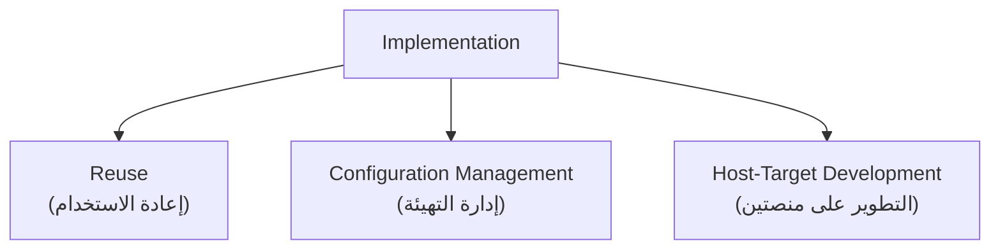

**شرح العناصر:**
- **Reuse:** كيف تستفيد من كود موجود بدل الكتابة من الصفر
- **Configuration Management:** كيف تتابع نسخ الكود المتغيرة بمشروع فيه أكتر من مطوّر
- **Host-Target Development:** لما الجهاز اللي بتطوّر عليه مختلف عن الجهاز اللي رح يشتغل عليه البرنامج

**شرح الروابط:**
- **الأسهم الثلاثة من `Implementation`:** المواضيع الثلاثة مستقلة عن بعض، وكل واحد ممكن يُدرس لحاله

**التطبيق في هذا السياق:** هاي المواضيع الثلاثة هي اللي بتفرّق بين "عرف يكتب كود" و"عارف يدير مشروع برمجي حقيقي".

---

#### 📖 التعريف الدقيق

مرحلة التنفيذ هي إنك تاخد التصميم اللي بنيته (الكائنات، النماذج، الواجهات) وتحوّله فعلياً لبرنامج شغال. المحاضرة بتفترض عندك مستوى جيد بالبرمجة، فبتركز بدل هيك على ثلاث قضايا هندسية عملية.

#### 🎯 الملخص السريع
- التنفيذ = إنشاء نسخة قابلة للتنفيذ من التصميم
- التركيز على 3 مواضيع: إعادة الاستخدام، إدارة التهيئة، التطوير مضيف-هدف

#### 📚 التطبيق
كل قسم فرعي جاي (4.1، 4.2، 4.3) رح يشرح وحدة من هاي المواضيع الثلاثة بالتفصيل.

#### 📄 النص الأصلي من المحاضرة
<details>
<summary>عرض النص الأصلي (coverage: 100%)</summary>

> Implementation is concerned with creating executable version. You are considered to have a good level in programming. We focus on: Reuse; Configuration management; Host-target development.

**ملاحظة على التغطية:**
- ✓ تم شرح بالكامل: تعريف التنفيذ والمواضيع الثلاثة اللي رح تُغطّى

</details>

---

### 4.1. إعادة الاستخدام (Reuse)

<!-- @type: principle -->
<!-- @render: {type: "diagram-first", visualization: "hierarchy", coverage: "100%"} -->
<!-- @connectivity: {prerequisite: "4"} -->

#### 📍 أين نحن الآن؟
أول موضوع بمرحلة التنفيذ — كيف نستفيد من كود وأنظمة موجودة بدل الكتابة من الصفر.

#### ⬅️ الربط مع السابق
بعد ما فهمنا إنه التنفيذ رح يركز على ثلاث قضايا، منبدأ بأولها: إعادة الاستخدام.

#### 💡 الفكرة الأساسية
**أغلب البرمجيات الحديثة بتُبنى بإعادة استخدام مكونات موجودة، مش بالكتابة من الصفر — وفي أربع مستويات لإعادة الاستخدام، والاختيار بين مستوى وتاني بيعتمد على موازنة التكلفة مقابل الفايدة.**

---

#### 📊 المخطط: مستويات إعادة الاستخدام (من الأقل للأكثر تحديداً)

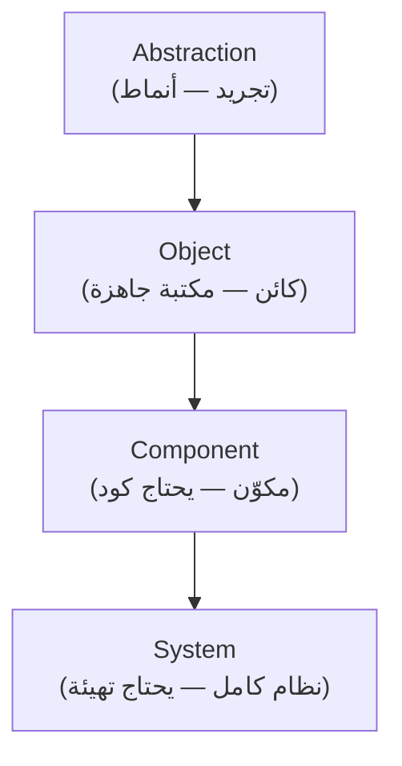

**شرح العناصر:**
- **Abstraction:** ما بتعيد استخدام سوفتوير مباشرة، بس بتستفيد من معرفة أنماط ناجحة سبق استُخدمت (`design and architectural patterns`)
- **Object:** بتعيد استخدام كائنات جاهزة من مكتبة، من غير كتابة كود جديد — أمثلة: `JUnit`, `JavaMail`
- **Component:** بتحتاج تكتب شوي كود إضافي عشان تستخدم المكوّن الجاهز بسياقك
- **System:** بتعيد استخدام تطبيق كامل جاهز، بيتطلب بعض التهيئة (إضافة أو تعديل كود)

**شرح الروابط:**
- **السهم من A لـ S:** كل ما تنزل بالمستوى، بتحتاج تكتب كود أكتر — بس كمان بتاخد نظام أكبر وأكثر اكتمالاً

**التطبيق في هذا السياق:** لو مشروعك محتاج مكتبة اختبار، ما تكتبها من الصفر — استخدم `JUnit` (مستوى `Object`). لو محتاج نظام إدارة محتوى كامل، فكّر بمستوى `System` (زي `WordPress`).

---

#### 📖 الإطار القرار (Decision Framework)

اسأل نفسك:

**1. عندك وقت وميزانية محدودة، وبتحتاج حل سريع؟**
- نعم: فكّر بمستوى `System` أو `Component` رغم تكلفة الشراء/التكييف

**2. المكوّن الجاهز بيلبي احتياجك بالضبط من غير تعديل؟**
- نعم: مستوى `Object` هو الأنسب (متل `JUnit`)
- لأ، بيحتاج شوي تعديل: مستوى `Component`

**3. بس عندك فكرة أو نمط تصميمي مفيد، بدون مكوّن جاهز فعلياً؟**
- نعم: مستوى `Abstraction` — استفد من النمط، اكتب الكود بنفسك

#### 💼 السياقات المختلفة (Context Examples)

**السيناريو 1: فريق صغير بيبني تطبيق ويب بسيط بوقت محدود**
- الأنسب: مستوى `System` أو `Component` — استخدام `framework` جاهز (زي `Django` أو `Express`) بيوفر وقت كبير، حتى لو كلفة التكييف موجودة.

**السيناريو 2: فريق بيبني نظام مخصص جداً لعميل بمتطلبات فريدة**
- الأنسب: مستوى `Abstraction` أو `Object` — استخدام أنماط تصميم مثبتة أو مكتبات بسيطة (`JSON parser` مثلاً)، بس بناء المنطق الأساسي بأنفسهم لأنه مافي نظام جاهز يطابق المتطلبات الفريدة.

---

#### 📖 الشرح

الكتابة من الصفر (`from scratch`) كانت الأسلوب السائد من الستينات لحد التسعينات (`1960s to 1990s`)، بس صارت غير عملية (`unviable`) للأنظمة التجارية وأنظمة الإنترنت بسبب عاملين: **التكلفة** (`costs`) و**الجدول الزمني** (`schedule`).

إعادة الاستخدام بتساعدك على: تطوير أنظمة جديدة بسرعة أكبر، تقليل مخاطر التطوير (`development risks`)، تخفيض التكاليف، وإنتاج برمجيات أكتر موثوقية (لأنها **مُختبَرة مسبقاً**!).

بالمقابل، في تكاليف حقيقية لازم تاخدها بعين الاعتبار: **تكاليف الوقت** (البحث، التقييم، الاختبار)، **تكلفة الشراء** (`Cost of buying` — ممكن تكون عالية جداً للمنتجات الجاهزة `COTS`)، **تكلفة التكييف والتهيئة** (`adapting & configuration`)، و**تكلفة الدمج** (`integrating` — سواء عناصر معاد استخدامها مع بعضها، أو مع كود جديد).

#### 📌 نقطة مهمة: Textbook vs Industry Reality

| الجانب | في الكتاب | في الشركات |
| --- | --- | --- |
| **إعادة الاستخدام** | تُدرَّس كأربع مستويات نظرية واضحة | غالباً بتصير خليط: framework جاهز (System) + مكتبات صغيرة (Object) بنفس المشروع |
| **الكتابة من الصفر** | غير عملية اقتصادياً (متفق عليه) | نادراً جداً ما تصير — حتى بمشاريع صغيرة، بتلاقي framework أو مكتبة أساس |

#### 🎯 الملخص السريع
- إعادة الاستخدام = بناء أنظمة من مكونات موجودة بدل الكتابة من الصفر
- 4 مستويات: تجريد (أنماط) → كائن (مكتبات جاهزة) → مكوّن (يحتاج كود) → نظام كامل (يحتاج تهيئة)
- فوائد: سرعة، أمان أكتر، تكلفة أقل، موثوقية أعلى
- تكاليف: وقت البحث/التقييم/الاختبار، الشراء، التكييف، الدمج

#### 📚 التطبيق
فهم مستويات وتكاليف إعادة الاستخدام بيساعدك تقرر بمشروعك الفعلي: هل تكتب مكوّن جديد ولا تدور على واحد جاهز؟

#### 💡 التشبيه
إعادة الاستخدام مثل **تجهيز بيت جديد** — ممكن تشتري أثاث جاهز (مستوى System)، تشتري خشب وتركب رفوف بنفسك (مستوى Component)، أو بس تستوحي فكرة تصميم من مجلة ديكور وتنفذها بنفسك (مستوى Abstraction). كل خيار له تكلفة وقت وفلوس مختلفة.

#### 🤔 تفعيل الفهم
لو بتبني تطبيق موبايل بسيط بفريق من شخصين وميزانية محدودة، وبتحتاج ميزة "تسجيل دخول بحساب Google" — هل تكتب هاد المنطق من الصفر، ولا تستخدم مكتبة/SDK جاهزة؟ أي مستوى إعادة استخدام بيمثل هاد القرار؟

#### ⚠️ أخطاء شائعة

#### الفهم الخاطئ ❌:
الافتراض إنه إعادة الاستخدام دايماً الخيار الأرخص والأسرع، فأحسن قرار تلقائياً إنك تدمج مكون جاهز.

#### الفهم الصحيح ✅:
في تكاليف حقيقية (وقت البحث والتقييم والاختبار، الشراء، التكييف، والدمج) ممكن تفوق فايدة إعادة الاستخدام بحالات معينة — القرار لازم يكون موزون، مش تلقائي.

#### 📄 النص الأصلي من المحاضرة
<details>
<summary>عرض النص الأصلي (coverage: 100%)</summary>

> Most modern is constructed by reusing existing components [do not reinvent the wheel]. Scratch: From 1960s to 1990s. Unviable for commercial and internet based systems: Costs; schedule. Reuse levels: Abstraction... Object... Component... System... Reusing aids to: Develop new systems more quickly; Minimize development risks; Lower costs; More reliable software [tested before!]. Associated costs: Costs of time... Cost of buying: Very high cost specially for COTS. Cost of adapting & configuration... Cost of integrating: reusable elements with each other [could be from different providers]; reusable elements with new code.

**ملاحظة على التغطية:**
- ✓ تم شرح بالكامل: تاريخ الكتابة من الصفر، مستويات إعادة الاستخدام الأربعة، الفوائد، وكل أنواع التكاليف
- ℹ️ إضافة من الدليل: Decision framework، السيناريوهات، جدول Textbook vs Industry (ليست بالمحاضرة الأصلية)

</details>

---

### 4.2. إدارة التهيئة (Configuration Management)

<!-- @type: fact -->
<!-- @render: {type: "diagram-first", visualization: "flowchart", coverage: "100%"} -->
<!-- @connectivity: {prerequisite: "4.1"} -->

#### 📍 أين نحن الآن؟
ثاني موضوع بمرحلة التنفيذ — كيف نتابع نسخ الكود المتعددة بمشروع تطوير حقيقي.

#### ⬅️ الربط مع السابق
بعد ما فهمنا إعادة الاستخدام (وممكن نكون دمجنا مكونات من مصادر مختلفة)، لازم يكون عندنا طريقة منظمة لتتبع كل هاي النسخ المتغيرة.

#### 💡 الفكرة الأساسية
**عملية التطوير بتنتج نسخ كتير مختلفة من كل مكوّن سوفتوير — ونظام إدارة التهيئة بيتتبع هاي النسخ عبر ثلاث أنشطة أساسية: إدارة النسخ، دمج النظام، وتتبع المشاكل.**

---

#### 📊 المخطط: الأنشطة الأساسية لإدارة التهيئة

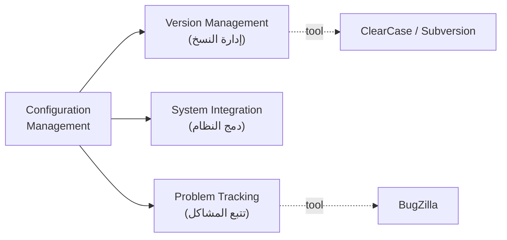

**شرح العناصر:**
- **Version Management:** بتتبّع النسخ المختلفة من كل مكوّن سوفتوير
- **System Integration:** بتساعد المطورين يحددوا شو نسخ المكونات المستخدمة لبناء كل نسخة من النظام
- **Problem Tracking:** بتخلي المستخدمين يبلّغوا عن أخطاء، وتخلي المطورين يشوفوا مين شغال عليها ومتى تُحل

**شرح الروابط:**
- **الخط المتقطع (tool):** أدوات فعلية بتنفذ كل نشاط — `ClearCase`/`Subversion` لإدارة النسخ، `BugZilla` لتتبع المشاكل

**التطبيق في هذا السياق:** هاي بالضبط نفس الأفكار اللي بيشتغل عليها `Git` وأدوات إدارة النسخ الحديثة اللي غالباً استخدمتيها بمشاريعك.

---

#### 📖 التعريف الدقيق

الهدف من إدارة التهيئة إنها تدعم عملية دمج النظام (`system integration`) حتى كل المطورين يقدروا يوصلوا لكود المشروع ووثائقه بطريقة منضبطة (`controlled way`)، وتخليهم يعرفوا بالضبط شو التغييرات اللي صارت.

**إدارة النسخ** (`version management`) بتتبّع النسخ المختلفة من كل مكوّن. **دمج النظام** (`system integration`) بتساعد المطورين يحددوا شو نسخ المكونات المستخدمة لبناء كل نسخة من النظام — وهاد بيساعد بعملية التجميع التلقائي (`auto compiling`). **تتبع المشاكل** (`problem tracking`) بتخلي المستخدمين يبلّغوا عن أخطاء (`bugs`)، وتخلي المطورين يشوفوا مين شغال على حلها ومتى تم إصلاحها.

#### 🎯 الملخص السريع
- إدارة التهيئة = تتبع النسخ المتعددة من كل مكوّن + التحكم بالوصول المنضبط
- 3 أنشطة: إدارة النسخ، دمج النظام (auto compiling)، تتبع المشاكل (bugs)
- أدوات شائعة: `ClearCase`, `Subversion`, `BugZilla`

#### 📚 التطبيق
إدارة التهيئة ضرورية بأي مشروع فيه أكتر من مطوّر أو أكتر من نسخة للنظام.

#### ⚠️ أخطاء شائعة

#### الفهم الخاطئ ❌:
التفكير إنه إدارة التهيئة بس معناها "حفظ نسخة احتياطية" من الكود بين فترة وفترة.

#### الفهم الصحيح ✅:
إدارة التهيئة أوسع من هيك — فيها ثلاث أنشطة متمايزة: تتبع النسخ، تنسيق أي نسخ مكونات بتُستخدم مع بعض لبناء نسخة النظام الكاملة، وتتبع الأخطاء ومين مسؤول عنها.

#### 📄 النص الأصلي من المحاضرة
<details>
<summary>عرض النص الأصلي (coverage: 100%)</summary>

> Development process will produce many different versions of each software component. Configuration management system keep track of these versions... Configuration management aim: Support system integration process, so all developers can access project code and documents in a controlled way; Find out what changes have been made. Fundamental configuration activities: Version management... System integration... [help at auto compiling]; Problem tracking... Tools: ClearCase (Bellagio and Milligan, 2005); Subversion ((Pilato et al., 2008); BugZilla.

**ملاحظة على التغطية:**
- ✓ تم شرح بالكامل: الهدف من إدارة التهيئة، الأنشطة الثلاثة، والأدوات المذكورة

</details>

---

### 4.3. التطوير على منصتين مضيف-هدف (Host-Target Development)

<!-- @type: fact -->
<!-- @render: {type: "diagram-first", visualization: "flowchart", coverage: "100%"} -->
<!-- @connectivity: {prerequisite: "4.2"} -->

#### 📍 أين نحن الآن؟
آخر موضوع بمرحلة التنفيذ، وآخر موضوع بالمحاضرة كلها.

#### ⬅️ الربط مع السابق
بعد ما ضمنّا التنسيق بين نسخ الكود (إدارة التهيئة)، بقى السؤال: وين فعلياً رح يشتغل هاد الكود؟

#### 💡 الفكرة الأساسية
**أحياناً بتطوّر البرنامج على حاسوب (`host system`)، وبتشغّله فعلياً على حاسوب مختلف تماماً (`target system`) — وهون بيصير استخدام المحاكيات (`simulators`) ضرورياً.**

---

#### 📊 المخطط: Host-Target Development

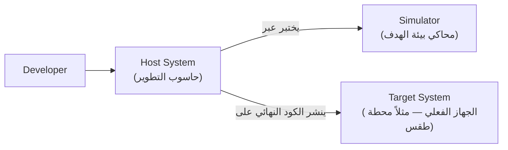

**شرح العناصر:**
- **Host System:** الحاسوب اللي المطوّر بيكتب ويختبر عليه الكود
- **Simulator:** برنامج بيحاكي بيئة الجهاز الهدف على المضيف، للاختبار قبل النشر
- **Target System:** الجهاز الفعلي اللي رح يشتغل عليه البرنامج بالنهاية (ممكن يكون مختلف كلياً عن الـ Host)

**شرح الروابط:**
- **السهم "يختبر عبر":** قبل النشر الفعلي، بتستخدم المحاكي عشان تتأكد إنه الكود بيشتغل صح بدون ما تحتاج الجهاز الحقيقي كل مرة
- **السهم "ينشر الكود النهائي على":** بعد التأكد، الكود بينتقل فعلياً للجهاز الهدف

**التطبيق في هذا السياق:** محطة الطقس نفسها مثال ممتاز — غالباً بتُطوّر على حاسوب عادي، بس بتشتغل فعلياً على معالج صغير مدمج (`embedded`) بالمحطة.

---

#### 📖 التعريف الدقيق

مش كل مرة الجهاز اللي بتكتب عليه الكود هو نفس الجهاز اللي رح يشتغل عليه البرنامج بالنهاية. أحياناً الـ`host` والـ`target` من نفس النوع، بس بكثير حالات — خصوصاً بالأنظمة المدمجة (`embedded systems`) — بيكونوا **مختلفين كلياً** (`completely different`). عشان تتعامل مع هاد الفرق، بتستخدم **محاكيات** (`simulators`) حتى تقدر تختبر وتصحح الكود قبل ما تحمّله فعلياً على الجهاز الحقيقي.

#### 🎯 الملخص السريع
- Host-target development = تطوير على جهاز، تشغيل على جهاز آخر مختلف
- الجهازين ممكن يكونوا من نفس النوع، بس غالباً مختلفين كلياً (خصوصاً بالأنظمة المدمجة)
- المحاكيات (simulators) هي الحل للتعامل مع هاد الاختلاف

#### 📚 التطبيق
هاد المفهوم مهم جداً لو رح تطوّر أي نظام مدمج (`embedded`) أو نظام بموارد محدودة.

#### ⚠️ أخطاء شائعة

#### الفهم الخاطئ ❌:
افتراض إنه الجهاز اللي بتكتب فيه الكود دايماً هو نفس الجهاز اللي رح يشتغل عليه البرنامج بالنهاية.

#### الفهم الصحيح ✅:
بكثير حالات (خصوصاً الأنظمة المدمجة زي محطة الطقس) الجهازين مختلفين كلياً، ولازم تستخدم محاكيات عشان تطوّر وتختبر قبل النشر الفعلي على الجهاز الهدف.

#### 📄 النص الأصلي من المحاضرة
<details>
<summary>عرض النص الأصلي (coverage: 100%)</summary>

> Develop on one computer (host system), execute on a separate computer (target system). The host and target systems are sometimes of the same type but, often they are completely different. Using simulators.

**ملاحظة على التغطية:**
- ✓ تم شرح بالكامل: تعريف host-target development، والفرق المحتمل بين الجهازين، ودور المحاكيات

</details>

---

## الجزء الثاني: ملخص شامل (Alternative Complete Reading)

خلّينا نبدأ من الصورة الكاملة: هاي المحاضرة بتاخدك من "عندي متطلبات نظام" لـ "عندي كائنات وكود شغال" — وهاد بيصير بخمس خطوات تصميم بالإضافة لثلاث قضايا عملية بالتنفيذ. أول شي، لازم تفرّق بين التصميم والتنفيذ: التصميم نشاط إبداعي بتحدد فيه مكونات البرنامج والعلاقات بينها بناءً على متطلبات الزبون، بينما التنفيذ هو تحويل هاد التصميم لبرنامج فعلي شغال. وسؤال مهم بيتكرر: هل لازم توثق التصميم رسمياً بـ `UML`؟ الجواب ما في إجابة واحدة — أحياناً التصميم بيضل بس فكرة براس المبرمج أو مرسوم على `whiteboard`، وأحياناً لازم يكون موثق. القرار بيعتمد على السياق: إذا كنت شغال بمنهج كائني التوجه (`Object-Oriented`) متل `Java` أو `C++` وبفريق أكبر من شخص، التوثيق الرسمي بيصير مهم جداً — لأنه بيخلي الكل يفهم نفس البنية ويشتغل بالتوازي. أما لو كنت شغال لحالك بلغة بسيطة متل `Python`، فكرة عامة براسك ممكن تكون كافية.

بعدين منجي لخمس خطوات تصميم كائني التوجه، وكل واحدة بتبني على اللي قبلها. **الخطوة الأولى** هي فهم سياق النظام وتفاعلاته الخارجية — يعني تحدد حدود نظامك (`system boundaries`): شو جوا نظامك وشو برا. لهاد الغرض بتستخدم نموذجين: **نموذج سياق النظام** (`system context model`) وهو نموذج **هيكلي/ساكن** شبيه بخريطة — بيوريك مين موجود ببيئة نظامك (بمثال محطة الطقس: `Control System`, `Weather Information System`, `Satellite`)، باستخدام `associations` مرقّمة بشكل `block diagram`. والنموذج التاني هو **نموذج التفاعل** (`interaction model`) وهو نموذج **ديناميكي** شبيه بفيديو — بيوريك كيف نظامك فعلياً بيتفاعل مع بيئته، وبيستخدم عادة `use case model` وين كل تفاعل ممكن بيتمثل بشكل بيضاوي، والكيان الخارجي بيتمثل "برجل عصا". كل `use case` (زي `Report Weather`) لازم يوثّق بجدول فيه: النظام، اسم الحالة، الفاعلين، وصف كامل، الحافز اللي بيبدأ التفاعل، والاستجابة الناتجة.

**الخطوة الثانية** هي التصميم المعماري — بعد ما فهمت التفاعلات الخارجية، بتحدد المكونات الرئيسية اللي بيتكون منها نظامك الداخلي، وتنظمها بنمط معماري. بمثال محطة الطقس، النظام انقسم لست `subsystems`: ثلاثة فوق لإدارة الأعطال والتهيئة والطاقة (`Fault Manager`, `Configuration Manager`, `Power Manager`)، وثلاثة تحت للوظائف الأساسية (`Communications`, `Data Collection`, `Instruments`) — وكل هاي الأقسام مرتبطة ببعض عبر طبقة اتصال مركزية واحدة اسمها `Communication Link`، بحيث أي قسم بيحكي مع قسم تاني عن طريقها مش مباشرة. والمهم إنه كل `subsystem` بحد ذاته ممكن يكون إله معمارية داخلية خاصة — متل `Data Collection` اللي فيها `Transmitter` و`Receiver` بيتعاملوا مع كائن `WeatherData`.

**الخطوة الثالثة**، وهي من أصعب الخطوات، هي تحديد أصناف الكائنات — وهون المحاضرة بتأكد إنه ما في "صيغة سحرية" واحدة، والعملية تكرارية بتعتمد على خبرة المصمم. في أربع طرق تساعدك: **التحليل النحوي** (تاخد وصف نصي للنظام، الأسماء بتصير كائنات وخصائص، والأفعال بتصير عمليات)؛ **الكيانات الملموسة** (تدوّر على أشياء، أدوار متل مدير أو دكتور، أحداث متل طلب، تفاعلات متل اجتماعات، مواقع متل مكاتب، ووحدات تنظيمية متل شركات)؛ **التحليل المبني على السيناريو** (تستخرج الكائنات من كل `use case` بمفرده)؛ و**النهج السلوكي** (تحدد الكائنات بناءً على مين شارك بأي سلوك). بمثال محطة الطقس، استخدمنا التحليل النحوي على الوصف النصي واستخرجنا: `WeatherStation` (فيها معرّف ودوال متل `reportWeather()` و`shutdown()`)، `WeatherData` (فيها بيانات الطقس ودوال `collect()` و`summarize()`)، وكائنات الأدوات (`Ground Thermometer`, `Anemometer`, `Barometer`).

**الخطوة الرابعة** هي بناء نماذج التصميم — واللي بتشكّل جسر بين المتطلبات والتنفيذ، ولازم تكون مجرّدة بما فيه الكفاية بدون تفاصيل زايدة، بس محتوية تفاصيل كافية للمبرمجين. `UML` بتوفر نوعين رئيسيين: **نماذج هيكلية/ساكنة** بتوصف البنية الثابتة (كائنات وعلاقات، متل `subsystem models` بشكل `class diagram`)، و**نماذج ديناميكية** بتوصف التفاعلات وتغييرات الحالة بمرور الزمن. من أهم النماذج الديناميكية: **نموذج التتابع** (`sequence model`) اللي بيبيّن ترتيب طلبات الخدمة بين الكائنات — الكائنات مرتبة أفقياً فوق، والزمن ماشي عمودياً، والتفاعلات أسهم مسمّاة (استدعاءات وردود). بمثال محطة الطقس، شفنا كيف طلب `Report Weather` بيمشي من `Weather Information System` لـ `SatComms` لـ `WeatherStation` لـ `Commslink` لـ `WeatherData` وبيرجع بالاتجاه المعاكس. و**مخطط الحالة** (`state diagram`) اللي بيبيّن كيف كائن معيّن بيغيّر حالته استجابة للأحداث — بس المهم إنه ما في داعي تعمل `state diagram` لكل كائن، بس للكائنات اللي سلوكها فعلاً معقّد (زي `WeatherStation` نفسها اللي بتتنقل بين `Shutdown`, `Running`, `Configuring`, `Collecting`, `Testing`, `Transmitting`, `Summarizing`, و`Controlled`).

**الخطوة الخامسة والأخيرة** هي تحديد الواجهات — وهون الهدف إنك تحدد بدقة الخدمات اللي بيقدمها كل كائن، حتى تقدر تصمم الكائنات المختلفة بالتوازي من غير ما وحدة تنتظر التانية. تصميم الواجهة بيحدد التوقيعات (`signatures`) ودلالات (`semantics`) الخدمات بس، من دون كشف كيف هي منفذة فعلياً — وهاي القاعدة الذهبية اللي لازم تحفظها: **أخفِ تمثيل الواجهة جوا الكائن نفسه**. بمثال محطة الطقس، في واجهتين: `Reporting` (فيها `weatherReport()` و`statusReport()`) و`Remote Control` (فيها أربع دوال للتحكم بالأدوات).

بعد ما يخلص التصميم، منجي لمرحلة **التنفيذ** — وهون المحاضرة بتفترض عندك مستوى برمجة جيد، وبتركز على ثلاث قضايا عملية. **إعادة الاستخدام** (`Reuse`) هي أول قضية: أغلب البرمجيات الحديثة بتُبنى بإعادة استخدام مكونات موجودة، لأن الكتابة من الصفر (اللي كانت شائعة من الستينات للتسعينات) صارت غير عملية اقتصادياً بسبب التكلفة والوقت. في أربع مستويات: **التجريد** (استخدام أنماط تصميمية ناجحة بدون كود مباشر)، **الكائن** (مكتبات جاهزة زي `JUnit` أو `JavaMail`، بدون كتابة كود)، **المكوّن** (يحتاج كتابة شوي كود)، و**النظام** (تطبيق كامل جاهز، بيحتاج تهيئة). إعادة الاستخدام بتوفر سرعة، تقليل مخاطر، تكلفة أقل، وموثوقية أعلى — بس في تكاليف حقيقية لازم توازنها: وقت البحث والتقييم والاختبار، تكلفة الشراء (عالية خصوصاً للمنتجات الجاهزة `COTS`)، تكلفة التكييف، وتكلفة الدمج مع عناصر أخرى أو كود جديد.

**إدارة التهيئة** (`Configuration management`) هي ثاني قضية — لأنه عملية التطوير بتنتج نسخ كتير مختلفة من كل مكوّن، ولازم يكون في نظام يتتبعها وإلا ممكن تدمج نسخ غلط ببعضها. في ثلاث أنشطة أساسية: **إدارة النسخ** (تتبع النسخ المختلفة)، **دمج النظام** (تحديد شو نسخ المكونات المستخدمة لبناء كل نسخة، وهاد بيساعد بالتجميع التلقائي)، و**تتبع المشاكل** (تمكين المستخدمين من الإبلاغ عن أخطاء، والمطورين من معرفة مين شغال عليها ومتى تُحل). من الأدوات المذكورة: `ClearCase`, `Subversion`, `BugZilla`.

**التطوير على منصتين مضيف-هدف** (`Host-target development`) هي ثالث قضية — أحياناً بتطوّر البرنامج على حاسوب (`host`) وبتشغّله على حاسوب مختلف تماماً (`target`)، خصوصاً بالأنظمة المدمجة. لحل هاي الفجوة بتستخدم **محاكيات** (`simulators`) تحاكي بيئة الجهاز الهدف على المضيف قبل النشر الفعلي.

### الأخطاء اللي الناس دايماً تقع فيها

#### الفهم الخاطئ ❌:
كثير طلاب بيفكروا إنه التصميم لازم دايماً يكون موثّق بالتفصيل بـ `UML` قبل ما تبلش تكتب كود، وإنه أي مشروع من دون مخططات `UML` كاملة معناته "تصميم سيء".

#### الفهم الصحيح ✅:
المحاضرة بوضوح بتقول إنه أحياناً التصميم بيضل بس فكرة براس المبرمج أو مرسوم على `whiteboard`، ومش لازم توثقه بالتفصيل — خصوصاً إذا كنت شغال بلغة مش كائنية التوجه أو لحالك.

---

#### الفهم الخاطئ ❌:
في تخيّل إنه "إعادة الاستخدام" (`Reuse`) دايماً بتوفر وقت وفلوس، فأحسن قرار دايماً إنك تشتري أو تدمج مكون جاهز بدل ما تكتب كودك الخاص.

#### الفهم الصحيح ✅:
في تكاليف حقيقية مرتبطة بإعادة الاستخدام: وقت البحث والتقييم والاختبار، تكلفة الشراء، وتكلفة التكييف والدمج — يعني القرار لازم يكون موزون بين الفايدة والتكلفة، مش دايماً "إعادة الاستخدام = أفضل خيار تلقائياً".

### الأسئلة المتوقعة في الامتحان

الأستاذ غالباً بيسأل عن: ترتيب خطوات الـ `OOD` الخمسة وشو بيصير بكل خطوة، الفرق بين النماذج المختلفة (`context` مقابل `interaction`، أو `structural` مقابل `dynamic`)، طرق تحديد أصناف الكائنات الأربعة (خصوصاً التحليل النحوي: أسماء = كائنات، أفعال = عمليات)، ومستويات إعادة الاستخدام الأربعة مع أمثلتها. كمان ممكن يجيك سؤال يطلب منك تقرأ `sequence diagram` أو `state diagram` لمحطة الطقس وتفسر شو صاير فيه، أو تحدد الأنشطة الثلاثة لإدارة التهيئة.

### الربط مع المحاضرة الجاية

التصميم اللي بنيناه هون (الكائنات، النماذج، الواجهات) هو الأساس اللي رح تبني عليه مرحلة **الاختبار** (`Testing`) لاحقاً — كل ما كان التصميم مضبوط وموثق منطقياً، كل ما كان أسهل تختبر وتصلح وتوسّع النظام.

---

## الجزء الثالث: أسئلة اختيار من متعدد (MCQ)

### السؤال 1 (Medium)

**السؤال:** Which UML model demonstrates the *other systems* present in the environment of the system being developed, using simple associations (like a block diagram)?

أ) The interaction model
ب) The system context model
ج) The sequence model
د) The state machine model

**الإجابة الصحيحة:** ب

**التعليل الكامل:**
- ❌ أ): نموذج التفاعل ديناميكي — بيبيّن كيف النظام بيتفاعل مع بيئته أثناء الاستخدام، مش بس مين الأنظمة الموجودة.
- ✅ ب): نموذج سياق النظام موثّق بالمحاضرة صراحة كنموذج هيكلي بيبيّن الأنظمة الأخرى الموجودة ببيئة النظام قيد التطوير.
- ❌ ج): نموذج التتابع بيُستخدم لاحقاً بخطوة نماذج التصميم، مش لبيان الأنظمة الخارجية.
- ❌ د): مخطط الحالة بيبيّن كيف كائن واحد بيغيّر حالته، ومالوش علاقة بالأنظمة الخارجية.

---

### السؤال 2 (Medium)

**السؤال:** What is the key difference between the system context model and the interaction model?

أ) They are two different names for exactly the same diagram type
ب) The interaction model is structural, the context model is dynamic
ج) Both models only apply to embedded systems like weather stations
د) The context model is structural, the interaction model is dynamic

**الإجابة الصحيحة:** د

**التعليل الكامل:**
- ❌ أ): الاثنين لهم أغراض وترميز مختلف — واحد block diagram والتاني use case model.
- ❌ ب): هاد بيعكس التصنيف الصحيح — نموذج التفاعل هو الديناميكي مش الهيكلي.
- ❌ ج): الاثنين مفهومان عامان بينطبقوا على أي نظام كائني التوجه، مش خاصين بالأنظمة المدمجة بس.
- ✅ د): نموذج السياق هيكلي/ساكن (بيبيّن مين موجود)، ونموذج التفاعل ديناميكي (بيبيّن كيف النظام بيتفاعل فعلياً معهم).

---

### السؤال 3 (Hard)

**السؤال:** What is the correct order of the five steps needed to develop an object-oriented system design?

أ) Context/interactions → Architecture → Object identification → Design models → Interface specification
ب) Objects → Context → Architecture → Interfaces → Models
ج) Architecture → Context → Objects → Models → Interfaces
د) Interfaces → Models → Objects → Architecture → Context

**الإجابة الصحيحة:** أ

**التعليل الكامل:**
- ✅ أ): هاد بالضبط الترتيب اللي حددته المحاضرة — فهم السياق أولاً، ثم المعمارية، ثم تحديد الكائنات، ثم النماذج، وأخيراً الواجهات.
- ❌ ب): الكائنات ما بتنحدد قبل السياق، لأنه فهم السياق هو اللي بيوجه معرفة الكائنات لاحقاً.
- ❌ ج): المعمارية ما بتتصمم قبل فهم السياق والتفاعلات الخارجية أولاً.
- ❌ د): هاد بيعكس الترتيب كلياً — الواجهات بتُحدد آخر خطوة، مش أول خطوة.

---

### السؤال 4 (Medium)

**السؤال:** In the weather station's architectural diagram, which subsystem acts as the central connector between the management subsystems (Fault, Configuration, Power Managers) and the functional subsystems (Communications, Data Collection, Instruments)?

أ) WeatherData
ب) SatComms
ج) Communication Link
د) Transmitter

**الإجابة الصحيحة:** ج

**التعليل الكامل:**
- ❌ أ): WeatherData كائن تم استخراجه لاحقاً بخطوة تحديد الكائنات، مش subsystem معماري.
- ❌ ب): SatComms ظهر بمخطط التتابع لاحقاً، مش بالمخطط المعماري لمحطة الطقس نفسها.
- ✅ ج): Communication Link هو الطبقة الوسطى اللي بتربط كل الـ subsystems الستة ببعضها.
- ❌ د): Transmitter هو أحد كائنين داخل subsystem واحد فقط (Data Collection)، مش الرابط المركزي بين كل الأقسام.

---

### السؤال 5 (Medium)

**السؤال:** What is the fundamental distinction between structural (static) models and dynamic models in UML design?

أ) There is no real distinction between them; the terms are interchangeable
ب) Dynamic models describe static class relationships, structural models describe timing
ج) Both types are used exclusively for describing external systems
د) Structural models describe static structure using classes/relationships; dynamic models show interactions and state changes over time

**الإجابة الصحيحة:** د

**التعليل الكامل:**
- ❌ أ): المحاضرة بتفرّق صراحة بين النوعين بتعريفات مختلفة وأمثلة مختلفة.
- ❌ ب): هاد بيعكس التعريف الصحيح — العلاقات الساكنة هي دور النماذج الهيكلية، مش الديناميكية.
- ❌ ج): النماذج الهيكلية والديناميكية بتوصف النظام الداخلي نفسه، مش الأنظمة الخارجية (هاد دور نموذج السياق).
- ✅ د): هاد يطابق تعريف المحاضرة تماماً — الهيكلية بتستخدم كائنات وعلاقات، والديناميكية بتبيّن تسلسل الطلبات وتغييرات الحالة.

---

### السؤال 6 (Medium)

**السؤال:** Using the grammatical analysis approach to object identification, what do verbs typically represent?

أ) External systems in the context model
ب) Object attributes
ج) Object classes themselves
د) Operations or services

**الإجابة الصحيحة:** د

**التعليل الكامل:**
- ❌ أ): الأنظمة الخارجية بتيجي من نموذج السياق، مش من تحليل الأفعال بالتحليل النحوي.
- ❌ ب): الخصائص، متل الكائنات، بتمثّل بالأسماء وليس بالأفعال.
- ❌ ج): أصناف الكائنات كمان بتمثّل بالأسماء، مش الأفعال.
- ✅ د): المحاضرة توضح إنه بالتحليل النحوي، الأفعال (verbs) تمثل العمليات أو الخدمات، بينما الأسماء تمثل الكائنات والخصائص.

---

### السؤال 7 (Hard)

**السؤال:** In the sequence diagram for the "Report Weather" scenario, what is the correct order of calls after Weather Information System sends `request(report)`?

أ) SatComms acknowledges the request, then calls reportWeather() on WeatherStation, which then calls get(summary) on Commslink
ب) WeatherData summarizes itself first, then creates a WeatherStation object, then SatComms sends the initial request
ج) Commslink calls WeatherStation directly, which then calls SatComms to acknowledge the request
د) The request bypasses SatComms and WeatherStation, going directly to WeatherData

**الإجابة الصحيحة:** أ

**التعليل الكامل:**
- ✅ أ): هاد بالضبط تسلسل مخطط التتابع: acknowledge → reportWeather() → get(summary).
- ❌ ب): هاد بيعكس الترتيب الزمني — WeatherData بتلخّص نفسها بس بعد ما تُطلب منها، مش قبل بدء التسلسل.
- ❌ ج): الاتجاه معكوس — WeatherStation هي اللي بتنادي Commslink، وSatComms هي اللي بتنادي WeatherStation، مش العكس.
- ❌ د): الطلب لازم يمر عبر SatComms وWeatherStation وCommslink قبل ما يوصل لـ WeatherData.

---

### السؤال 8 (Medium)

**السؤال:** In the weather station's state diagram, which service call triggers a transition from `Running` to `Testing`?

أ) restart()
ب) shutdown()
ج) reportStatus()
د) reconfigure()

**الإجابة الصحيحة:** ج

**التعليل الكامل:**
- ❌ أ): restart() بينقل الكائن من Shutdown إلى Running، مش من Running إلى Testing.
- ❌ ب): shutdown() بيرجع الكائن من Running إلى حالة Shutdown، مش Testing.
- ✅ ج): وفق مخطط الحالة، reportStatus() هو اللي بينقل الكائن من Running إلى Testing.
- ❌ د): reconfigure() بينقل الكائن من Running إلى Configuring، مش Testing.

---

### السؤال 9 (Medium)

**السؤال:** Which category of "tangible entities" used for object identification would best describe an entity like "manager" or "doctor"?

أ) Organizational units
ب) Roles
ج) Events
د) Things

**الإجابة الصحيحة:** ب

**التعليل الكامل:**
- ❌ أ): الوحدات التنظيمية بتشير لكيانات متل الشركات، مش لأدوار أفراد.
- ✅ ب): المحاضرة صراحة بتعطي "manager, doctor" كأمثلة على فئة Roles.
- ❌ ج): الأحداث بتشير لأشياء متل "طلب" (request)، مش لأدوار وظيفية.
- ❌ د): الأشياء (Things) بتشير لكيانات مادية متل "طائرة"، مش لأدوار بشرية.

---

### السؤال 10 (Medium)

**السؤال:** A team reuses a testing library like `JUnit` by calling its existing classes directly, without writing any new library code. Which reuse level does this best represent?

أ) Abstraction
ب) System
ج) Component
د) Object

**الإجابة الصحيحة:** د

**التعليل الكامل:**
- ❌ أ): إعادة استخدام التجريد بتعني الاستفادة من معرفة أنماط، مش استدعاء كائنات مكتبة جاهزة مباشرة.
- ❌ ب): إعادة استخدام النظام بتعني إعادة استخدام تطبيق كامل، مش مكتبة اختبار واحدة.
- ❌ ج): إعادة استخدام المكوّن بتحتاج كتابة شوي كود، بعكس السيناريو المذكور اللي ما فيه كتابة كود جديد.
- ✅ د): المحاضرة بتعطي JUnit وJavaMail كأمثلة صريحة على إعادة الاستخدام بمستوى الكائن (Object) — استخدام كائنات جاهزة بدون كتابة كود.

---

### السؤال 11 (Hard)

**السؤال:** Which of the following is **NOT** one of the four reuse levels mentioned in the lecture?

أ) Testing
ب) Abstraction
ج) Component
د) System

**الإجابة الصحيحة:** أ

**التعليل الكامل:**
- ✅ أ): "Testing" مش مستوى إعادة استخدام بالمحاضرة — المستويات الأربعة هي Abstraction, Object, Component, System فقط.
- ❌ ب): Abstraction هو أحد المستويات الأربعة الفعلية المذكورة بالمحاضرة.
- ❌ ج): Component هو أحد المستويات الأربعة الفعلية المذكورة بالمحاضرة.
- ❌ د): System هو أحد المستويات الأربعة الفعلية المذكورة بالمحاضرة.

---

### السؤال 12 (Medium)

**السؤال:** Which of the following is explicitly listed as one of the costs associated with software reuse?

أ) Cost of hiring additional senior developers
ب) Cost of renaming variables across the codebase
ج) Cost of integrating reusable elements with each other or with new code
د) Cost of writing detailed unit tests for legacy code

**الإجابة الصحيحة:** ج

**التعليل الكامل:**
- ❌ أ): توظيف مطورين إضافيين مش من ضمن أنواع التكاليف المذكورة بالمحاضرة.
- ❌ ب): إعادة تسمية المتغيرات غير مذكورة إطلاقاً كتكلفة إعادة استخدام.
- ✅ ج): المحاضرة صراحة بتذكر تكلفة دمج العناصر المعاد استخدامها مع بعضها (وممكن تكون من مزودين مختلفين) أو مع كود جديد.
- ❌ د): كتابة اختبارات الوحدة غير مذكورة كتكلفة إعادة استخدام بالمحاضرة.

---

### السؤال 13 (Medium)

**السؤال:** Which fundamental configuration management activity allows users to report bugs and lets developers see who is working on a fix and when it was resolved?

أ) Version management
ب) Problem tracking
ج) Host-target development
د) System integration

**الإجابة الصحيحة:** ب

**التعليل الكامل:**
- ❌ أ): إدارة النسخ بتتتبع النسخ المختلفة من المكونات، مش تقارير الأخطاء.
- ✅ ب): المحاضرة تحدد Problem tracking بالضبط بهاد التعريف — إبلاغ المستخدمين عن الأخطاء ومعرفة مين مسؤول عن حلها ومتى.
- ❌ ج): التطوير على منصتين موضوع منفصل كلياً عن إدارة التهيئة.
- ❌ د): دمج النظام بيحدد شو نسخ المكونات المستخدمة لبناء النظام، مش تتبع الأخطاء.

---

### السؤال 14 (Medium)

**السؤال:** Regarding host-target development, which tool or technique is typically used when the host and target systems are completely different?

أ) BugZilla
ب) Version management
ج) A use case model
د) A simulator

**الإجابة الصحيحة:** د

**التعليل الكامل:**
- ❌ أ): BugZilla أداة تتبع مشاكل من إدارة التهيئة، غير مرتبطة بالتطوير على منصتين.
- ❌ ب): إدارة النسخ نشاط من إدارة التهيئة، مش حل لفجوة الاختلاف بين host وtarget.
- ❌ ج): نموذج حالات الاستخدام أداة من خطوة نموذج التفاعل بالتصميم، غير مرتبطة بهاد الموضوع.
- ✅ د): المحاضرة تحدد إنه المحاكيات (simulators) هي اللي بتُستخدم لسد الفجوة لما يكون host وtarget مختلفين كلياً.

---

### السؤال 15 (Medium)

**السؤال:** Which notation does UML use to specify interfaces, allowing objects and components to be designed in parallel?

أ) Class diagrams (with the `«interface»` stereotype)
ب) Context models
ج) State diagrams
د) Use case diagrams

**الإجابة الصحيحة:** أ

**التعليل الكامل:**
- ✅ أ): المحاضرة صراحة تذكر إنه UML تستخدم class diagrams (مع stereotype «interface») لتحديد الواجهات — وممكن كمان استخدام Java.
- ❌ ب): نماذج السياق بتبيّن الأنظمة الخارجية، مش تفاصيل الواجهات الداخلية.
- ❌ ج): مخططات الحالة بتبيّن كيف الكائن بيغيّر حالته، مش توقيعات الواجهات.
- ❌ د): مخططات حالات الاستخدام بتُستخدم لنموذج التفاعل، مش لتحديد الواجهات.

---

### السؤال 16 (Hard)

**السؤال:** What is the main purpose of the "System integration" activity within configuration management?

أ) To simulate target hardware behavior on the host system during development
ب) To identify object classes from a natural language system description
ج) To help developers define which component versions build each version of the system, aiding auto-compiling
د) To let end users directly report bugs without developer involvement

**الإجابة الصحيحة:** ج

**التعليل الكامل:**
- ❌ أ): محاكاة الجهاز الهدف موضوع منفصل كلياً (host-target development)، مش دمج النظام.
- ❌ ب): تحديد أصناف الكائنات جزء من خطوة التصميم، مش من إدارة التهيئة.
- ✅ ج): المحاضرة تحدد دمج النظام بالضبط بهاد الدور — تحديد نسخ المكونات المستخدمة لبناء كل نسخة من النظام، وهاد بيساعد بالتجميع التلقائي.
- ❌ د): إبلاغ المستخدمين عن الأخطاء هو دور Problem tracking، وحتى فيه، المطورين لازم يشوفوا ويتابعوا الحل — مش "بدون تدخل مطورين".

---

## الجزء الرابع: بطاقات سؤال وجواب (Q&A Cards)

### البطاقة 1
**Q:** شو الفرق الأساسي بين التصميم (design) والتنفيذ (implementation)؟
**A:** التصميم نشاط إبداعي لتحديد مكونات البرنامج وعلاقاتها بناءً على متطلبات الزبون، بينما التنفيذ هو تحويل هاد التصميم لبرنامج فعلي شغال.

### البطاقة 2
**Q:** هل لازم دايماً توثق التصميم بالتفصيل باستخدام UML؟
**A:** لا، أحياناً التصميم بيضل بس براس المبرمج أو مرسوم على whiteboard — التوثيق الرسمي بـ UML مهم أكتر مع منهج كائني التوجه وفريق أكبر من شخص.

### البطاقة 3
**Q:** شو الخطوات الخمس لتطوير تصميم نظام كائني التوجه؟
**A:** فهم السياق والتفاعلات الخارجية، التصميم المعماري، تحديد أصناف الكائنات، بناء نماذج التصميم، وأخيراً تحديد الواجهات.

### البطاقة 4
**Q:** شو يبيّن نموذج سياق النظام (system context model)؟
**A:** نموذج هيكلي بيبيّن باقي الأنظمة الموجودة ببيئة النظام قيد التطوير، باستخدام associations بسيطة شبيه بـ block diagram.

### البطاقة 5
**Q:** شو النموذج المستخدم لتوثيق نموذج التفاعل مع البيئة الخارجية؟
**A:** نموذج حالات الاستخدام (use case model)، وين كل تفاعل ممكن يُمثّل ببيضاوي، والكيان الخارجي يُمثّل برجل عصا (stick figure).

### البطاقة 6
**Q:** التصميم المعماري بيهتم بإيش بالضبط؟
**A:** بتحديد المكونات الرئيسية اللي بيتكون منها النظام وتفاعلاتها، وتنظيمها باستخدام نمط معماري (architectural pattern).

### البطاقة 7
**Q:** كيف بيشتغل التحليل النحوي (grammatical analysis) بتحديد أصناف الكائنات؟
**A:** بتاخد وصف طبيعي للنظام، وتعتبر الأسماء والصفات كائنات وخصائص، والأفعال عمليات أو خدمات.

### البطاقة 8
**Q:** شو نوعا نماذج التصميم اللي عادة بنطوّرهم بـ UML؟
**A:** نماذج هيكلية/ساكنة (structural) بتوصف البنية الثابتة بالكائنات والعلاقات، ونماذج ديناميكية (dynamic) بتوصف التفاعلات وتغييرات الحالة بمرور الزمن.

### البطاقة 9
**Q:** شو بيبيّن نموذج التتابع (sequence model)؟
**A:** بيبيّن تسلسل التفاعلات بين الكائنات — الكائنات مرتبة أفقياً فوق، الزمن ماشي عمودياً، والتفاعلات أسهم مسمّاة.

### البطاقة 10
**Q:** متى لازم تعمل state diagram لكائن معيّن؟
**A:** بس لما يكون سلوك الكائن معقّد نسبياً — أغلب الكائنات البسيطة ما بتحتاج state model لأنه بيضيف تفاصيل غير ضرورية.

### البطاقة 11
**Q:** ليش المصممين لازم يخفوا تمثيل الواجهة جوا الكائن نفسه؟
**A:** عشان الواجهة تبقى بس تعرض التوقيعات والخدمات المتاحة (شو)، من غير ما تكشف كيف هي منفذة فعلياً داخل الكائن (كيف) — وهاد بيسمح بتصميم متوازي وتغيير التنفيذ لاحقاً بدون ما يأثر على المستخدمين.

### البطاقة 12
**Q:** شو مستويات إعادة الاستخدام الأربعة؟
**A:** التجريد (patterns)، الكائن (مكتبات جاهزة زي JUnit)، المكوّن (يحتاج كتابة كود)، والنظام الكامل (يحتاج تهيئة/تعديل).

### البطاقة 13
**Q:** شو الأنشطة الأساسية الثلاثة لإدارة التهيئة؟
**A:** إدارة النسخ (version management)، دمج النظام (system integration)، وتتبع المشاكل (problem tracking).

### البطاقة 14
**Q:** شو معنى host-target development؟
**A:** إنك تطوّر البرنامج على حاسوب (host system) وتشغّله فعلياً على حاسوب مختلف (target system) — وممكن تستخدم محاكيات (simulators) لما يكون الجهازين مختلفين كلياً.

---

## الجزء الخامس: ورقة المراجعة السريعة (Cheat Sheet)

### 5.1 جدول المقارنة السريعة

| المعيار | نموذج السياق (Context) | نموذج التفاعل (Interaction) |
| --- | --- | --- |
| **النوع** | هيكلي/ساكن | ديناميكي |
| **الغرض** | مين الأنظمة الخارجية الموجودة | كيف النظام بيتفاعل معهم فعلياً |
| **الأداة** | Block diagram / associations | Use case model |

| المعيار | النماذج الهيكلية (Structural) | النماذج الديناميكية (Dynamic) |
| --- | --- | --- |
| **تصف** | البنية الثابتة (كائنات + علاقات) | التفاعلات وتغييرات الحالة |
| **أمثلة** | Subsystem/class diagrams | Sequence models, State machine models |

| مستوى إعادة الاستخدام | يحتاج كتابة كود؟ | مثال |
| --- | --- | --- |
| **Abstraction** | لا (تستفيد من معرفة فقط) | Design/architectural patterns |
| **Object** | لا | JUnit, JavaMail |
| **Component** | نعم (شوي كود) | مكتبة جاهزة تحتاج ربط |
| **System** | نعم (تهيئة/تعديل) | تطبيق كامل جاهز (COTS) |

### 5.2 القواعس الذهبية

| # | القاعدة |
| --- | --- |
| 1 | التصميم مش لازم يكون موثق بـ UML دايماً — القرار بيعتمد على لغة البرمجة وحجم الفريق |
| 2 | خطوات الـ OOD الخمس بترتيب صارم: سياق → معمارية → كائنات → نماذج → واجهات |
| 3 | تحديد الكائنات عملية تكرارية بدون صيغة سحرية — اعتمد على أكتر من طريقة (نحوي + سيناريو) |
| 4 | ما تعمل state diagram لكل كائن — بس للي سلوكه فعلاً معقّد |
| 5 | أخفِ تمثيل الواجهة الداخلي جوا الكائن — الواجهة تكشف "شو" مش "كيف" |
| 6 | الكتابة من الصفر غير عملية اقتصادياً — قيّم تكاليف إعادة الاستخدام (وقت، شراء، تكييف، دمج) قبل القرار |
| 7 | إدارة التهيئة = نسخ + دمج + تتبع مشاكل — مش بس نسخة احتياطية |
| 8 | لو الـ host والـ target مختلفين، استخدم محاكيات قبل النشر الفعلي |

### 5.3 مرجع سريع للمصطلحات

| المصطلح الإنجليزي | المعنى بالعربي |
| --- | --- |
| `Software Design` | نشاط إبداعي لتحديد المكونات والعلاقات بناءً على المتطلبات |
| `Software Implementation` | تحويل التصميم لبرنامج قابل للتنفيذ فعلياً |
| `System Context Model` | نموذج هيكلي يبيّن الأنظمة الخارجية المرتبطة بالنظام |
| `Interaction Model` | نموذج ديناميكي (عادة use case) يبيّن تفاعل النظام مع بيئته |
| `Architectural Design` | تحديد المكونات الرئيسية وتنظيمها بنمط معماري |
| `Object Class Identification` | استخراج الكائنات من وصف النظام — عملية تكرارية بلا صيغة سحرية |
| `Design/System Model` | جسر بين المتطلبات والتنفيذ؛ هيكلي (static) أو ديناميكي (dynamic) |
| `Interface Specification` | تحديد توقيعات ودلالات الخدمات بين المكونات لتصميم متوازي |
| `Reuse` | بناء أنظمة من مكونات موجودة بدل الكتابة من الصفر |
| `Configuration Management` | تتبع نسخ المكونات المتعددة ودمجها بطريقة منضبطة |
| `Host-Target Development` | تطوير على جهاز، تنفيذ على جهاز آخر (غالباً مختلف) |
| `COTS` | Commercial Off-The-Shelf — منتج تجاري جاهز للشراء والاستخدام |
| `Signature` | توقيع الدالة (اسمها + مدخلاتها + مخرجاتها) بدون تفاصيل تنفيذها |
