# المحاضرة 5 — Software Testing (اختبار البرمجيات)
> **المادة:** هندسة البرمجيات (المستوى الثالث) | **الموضوع:** أساسيات اختبار البرمجيات، V&V، مستويات الاختبار، Unit Testing، استراتيجيات اختيار حالات الاختبار

---

## ملخص سريع قبل البدء

**عن ماذا هذه المحاضرة؟**
هذه المحاضرة تقدّم أساسيات `Software Testing` (اختبار البرمجيات): ليش نختبر، الفرق بين `Validation` و`Verification`، أنواع الاختبار (static عبر inspections و dynamic عبر تشغيل البرنامج)، مراحل الاختبار (development, release, user, acceptance)، ثم تدخل بالتفصيل في `Unit Testing` واستراتيجيات اختيار حالات الاختبار مثل `Partition Testing` و`Boundary Value Analysis`.

**ليش يهمك؟**
كل مشروع برمجي فيه bugs — السؤال مو "هل فيه أخطاء؟" بل "كيف نكتشفها قبل ما يوصل المنتج للمستخدم؟". فهم استراتيجيات الاختبار الصحيحة يوفر عليك وقت هائل، لأنك بتكتب أقل عدد من test cases وتكتشف أكبر عدد من الأخطاء.

**المتطلبات السابقة:**
- Programming 1 (فهم classes, objects, methods)
- Software Engineering 1 (SDLC عام)
- Basic Database Concepts

**الخيط الناظم:**
```
Requirements → Design → Implementation → Testing → Deployment
```
هذه المحاضرة تركّز على مرحلة `Testing`، وتحديداً الجزء الأول منها: المفاهيم الأساسية ومستوى `Unit Testing`. المحاضرة القادمة تكمل بـ `JUnit`، `Component Testing`، و`System Testing`.

---

## الجزء الأول: الشرح التفصيلي

### 1. مفهوم الاختبار (Introduction to Testing)
<!-- @type: fact -->
<!-- @render: {type: "diagram-first", visualization: "flowchart", coverage: "100%"} -->
<!-- @connectivity: {prerequisite: "SE1-SDLC"} -->

#### 📍 أين نحن الآن؟
نبدأ أول خطوة في فهم مرحلة `Testing` من دورة حياة البرمجيات.

#### ⬅️ الربط مع السابق
بعد ما تعلمنا `Design` و`Implementation` في محاضرات سابقة، وصلنا للمرحلة اللي تتأكد إن الكود يشتغل صح.

#### 💡 الفكرة الأساسية
**الاختبار (`Testing`) هو تشغيل البرنامج ببيانات مُجهّزة (artificial data) للتحقق من أنه يعمل كما هو متوقع، واكتشاف الأخطاء (defects) قبل استخدامه الفعلي.**

---

#### 📊 المخطط: عناصر الاختبار

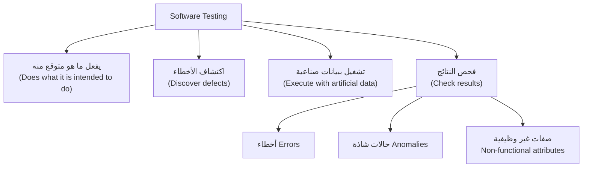

**شرح العناصر:**
- **يفعل ما هو متوقع:** الاختبار يتأكد أن النظام يحقق الوظيفة المطلوبة منه.
- **اكتشاف الأخطاء:** الهدف الأهم — إيجاد الـ `defects` قبل ما يستخدمها العميل.
- **بيانات صناعية:** نصمّم مدخلات خاصة (`test data`) بدل الاعتماد على مدخلات عشوائية من المستخدم.
- **فحص النتائج:** لا نكتفي بتشغيل البرنامج، بل نراقب المخرجات بحثاً عن أخطاء، حالات غريبة، أو مشاكل في الأداء (`non-functional attributes` مثل السرعة والأمان).

**التطبيق في هذا السياق:**
هذا التعريف هو الأساس الذي تُبنى عليه كل تقنيات الاختبار اللاحقة في هذه المحاضرة.

---

#### 📖 الشرح

تخيّل إنك اشتريت جهاز جديد. قبل ما يوصلك، الشركة تختبره: تشغّله، تشوف هل يفتح صح، هل الأزرار تشتغل، هل ما يسخن أكتر من اللازم. نفس الفكرة بالضبط في البرمجيات — بس بدل الأزرار عندنا `functions` و`inputs`، وبدل الحرارة عندنا `performance` و`memory usage`.

النقطة الأهم في هذا التعريف: **الاختبار يكشف وجود الأخطاء، لكن لا يثبت غيابها.** يعني حتى لو اختبرت البرنامج 1000 مرة ونجح، هذا لا يعني إن البرنامج خالي من الأخطاء 100%؛ فقط يعني إنك ما لقيت خطأ بهالحالات اللي جربتها. هذا الفرق مهم جداً للامتحان — كثير طلاب يفتكرون إن "نجاح الاختبار = برنامج مثالي"، وهذا غلط.

الاختبار أيضاً ينقسم منطقياً لمفهومين أساسيين هنتعرف عليهم بالتفصيل بالقسم الجاي: `Validation` و`Verification`، بالإضافة لنوع ثالث اسمه `Static Validation` (اللي بيصير عن طريق المراجعة بدون تشغيل الكود).

#### 🎯 الملخص السريع
- الاختبار = تشغيل البرنامج ببيانات مُجهّزة + فحص النتائج
- الهدف: اكتشاف الأخطاء (defects) قبل الاستخدام الفعلي
- الاختبار يكشف *وجود* الأخطاء، لا *يثبت غيابها*
- ثلاثة مفاهيم مرتبطة: `Validation`، `Verification`، `Static Validation`

#### 📚 التطبيق
كل تقنية اختبار سنشرحها لاحقاً (Unit Testing, Partition Testing...) هي أداة تخدم هذا الهدف الأساسي: اكتشاف أكبر عدد من الأخطاء بأقل جهد ممكن.

#### ⚠️ أخطاء شائعة

#### الفهم الخاطئ ❌:
الطالب يعتقد أن نجاح كل حالات الاختبار (`test cases`) يعني أن البرنامج خالٍ تماماً من الأخطاء.

#### الفهم الصحيح ✅:
نجاح الاختبار يعني فقط أنه لم يتم اكتشاف خطأ *بالحالات التي تم اختبارها*؛ قد توجد أخطاء أخرى لم تُغطَّ بعد. لهذا نحتاج استراتيجيات ذكية (مثل `Partition Testing`) لاختيار أفضل الحالات الممكنة.

#### 📄 النص الأصلي من المحاضرة
<details>
<summary>عرض النص الأصلي (coverage: 100%)</summary>

> "Testing: Does what it is intended to do; Discover defects before it is put in use; Execute a program using artificial data; Check test results for: Errors, Anomalies, Information about non-functional attributes. Can reveal the presence of errors not their absence."

**ملاحظة على التغطية:**
- ✓ تم شرح كل نقطة من التعريف بالكامل
- ℹ️ إضافة من الدليل: تشبيه الجهاز الجديد لتوضيح الفكرة

</details>

---

### 2. Validation & Verification (V&V)
<!-- @type: fact -->
<!-- @render: {type: "diagram-first", visualization: "flowchart", coverage: "100%"} -->
<!-- @connectivity: {prerequisite: "1"} -->

#### 📍 أين نحن الآن؟
نتعلم الفرق بين مفهومين أساسيين يُبنى عليهما كل نشاط اختبار: `Validation` و`Verification`.

#### ⬅️ الربط مع السابق
بعد ما عرفنا إن الاختبار يكشف الأخطاء، نحتاج نفرّق بين نوعين من "الصح": هل المنتج *صحيح تقنياً* حسب المواصفات، وهل هو *المنتج المطلوب* أصلاً من العميل؟

#### 💡 الفكرة الأساسية
**`Validation` تسأل "هل نبني المنتج الصحيح؟" (يلبي احتياج العميل الحقيقي)، بينما `Verification` تسأل "هل نبني المنتج بشكل صحيح؟" (يطابق المواصفات المكتوبة).**

---

#### 📊 المخطط: Validation vs Verification

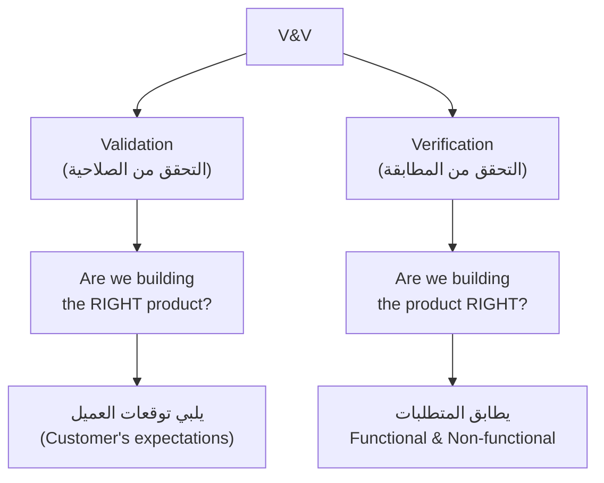

**شرح العناصر:**
- **Validation:** التأكد أن النظام يحل المشكلة الحقيقية التي يحتاجها العميل، حتى لو كانت المواصفات المكتوبة ناقصة.
- **Verification:** التأكد أن النظام يطابق حرفياً كل ما هو مكتوب في وثيقة المتطلبات (`requirements specification`).

**شرح الروابط:**
- **الرابط بين Validation و Verification:** هما عمليتان متكاملتان — ممكن نظام "يمر" بكل اختبارات Verification (يطابق المواصفات 100%) لكنه يفشل في Validation لأن المواصفات نفسها كانت خاطئة أو ناقصة.

**التطبيق في هذا السياق:**
عند تصميم أي خطة اختبار، لازم تسأل السؤالين معاً: هل هذا يطابق ما هو مكتوب؟ وهل ما هو مكتوب يعبّر فعلاً عن حاجة العميل؟

---

#### 📖 الشرح

خذ مثال بسيط: عميل يطلب "نظام لحجز مواعيد الأطباء". فريق التطوير يكتب `requirements specification` مفصّلة، ويبني النظام حسبها بالضبط. لو اختبرنا النظام ولقينا أنه يطابق كل بند في الوثيقة — هذا `Verification` ناجح.

لكن، لو العميل جرّب النظام ولقى إنه ما يدعم "تعديل الموعد" (لأن هذا الطلب ما انكتب أصلاً في وثيقة المتطلبات رغم أن العميل كان يقصده ضمنياً) — هنا فشل `Validation`، رغم نجاح `Verification` الكامل!

هذا يوضح نقطة حرجة: **وثائق المتطلبات لا تعكس دائماً الرغبات الحقيقية (needs) للعملاء والمستخدمين.** هذا سبب رئيسي لماذا `Validation` مهم بنفس درجة أهمية `Verification` — لأنه يمسك الفجوة بين "المكتوب" و"المطلوب فعلاً".

`Verification` غالباً يُنفَّذ عبر مطابقة تقنية دقيقة (test cases مقابل specs)، بينما `Validation` يحتاج تفاعل مباشر مع العميل أو المستخدمين النهائيين (مثل `Acceptance Testing` اللي بنشرحه لاحقاً).

#### 🎯 الملخص السريع
- `Validation` = المنتج الصحيح (يلبي الحاجة الحقيقية)
- `Verification` = المنتج مبني صحيح (يطابق المواصفات)
- ممكن ينجح Verification ويفشل Validation
- السبب: المواصفات ما تعكس دايماً الاحتياج الحقيقي

#### 📚 التطبيق
هذا التمييز يبني أساس فهمنا لاحقاً لأنواع الاختبار الأخرى، خصوصاً `Acceptance Testing` اللي هدفها الأساسي هو `Validation`.

#### ⚠️ أخطاء شائعة

#### الفهم الخاطئ ❌:
الطالب يخلط بين المصطلحين ويعتقد أنهما نفس الشيء لمجرد أنهما يُذكران معاً دائماً (`V&V`).

#### الفهم الصحيح ✅:
كل مصطلح يجاوب سؤالاً مختلفاً تماماً: `Verification` = "right product built?" و`Validation` = "right product?". تذكّرها بترتيب الحروف: **V**alidation = **V**alue للعميل، **Ver**ification = مطابقة **Ver**batim للمواصفات.

#### 📄 النص الأصلي من المحاضرة
<details>
<summary>عرض النص الأصلي (coverage: 100%)</summary>

> "Validation: Are we building the right product? Meets the customer's expectations. Verification: Are we building the product right? Meets its stated functional & non-functional requirements. Requirements specifications do not always reflect the real wishes (needs) of system customers and users."

**ملاحظة على التغطية:**
- ✓ تم شرح كامل التعريفين + السبب الجذري لأهمية التمييز
- ℹ️ إضافة من الدليل: مثال نظام حجز المواعيد

</details>

---

### 3. Inspections vs Testing (Static vs Dynamic Verification)
<!-- @type: fact -->
<!-- @render: {type: "diagram-first", visualization: "flowchart", coverage: "100%"} -->
<!-- @connectivity: {prerequisite: "2"} -->

#### 📍 أين نحن الآن؟
نتعرف على طريقتين مختلفتين لتنفيذ V&V: واحدة بدون تشغيل الكود (`Inspections`) وواحدة بتشغيله (`Testing`).

#### ⬅️ الربط مع السابق
بعد ما فهمنا إن Verification تعني مطابقة المواصفات، نسأل الآن: كيف نتحقق من هالمطابقة عملياً؟ فيه طريقتين.

#### 💡 الفكرة الأساسية
**`Inspections` (المراجعات) تحلل تمثيل النظام الساكن (static) بدون تشغيله، بينما `Testing` يشغّل النظام فعلياً ويراقب سلوكه (dynamic).**

---

#### 📊 المخطط: مسار المراجعة والاختبار

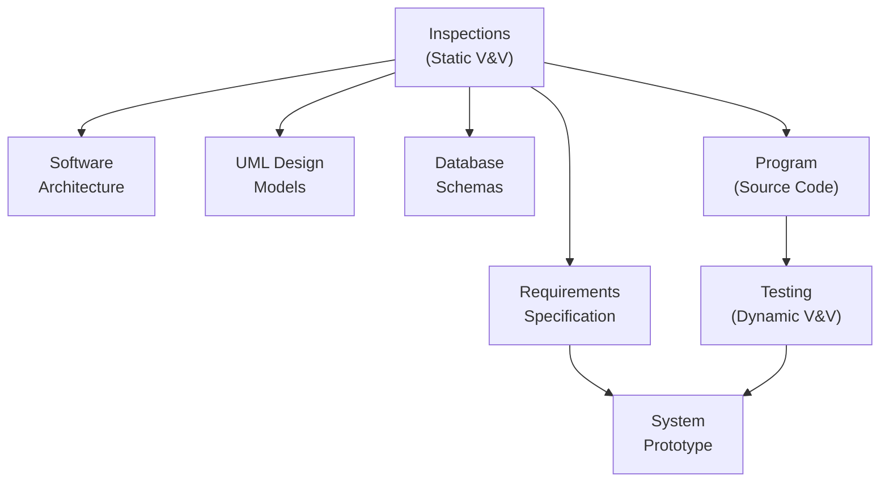

**شرح العناصر:**
- **Inspections:** مراجعة كل من `Requirements Specification`، `Software Architecture`، `UML Design Models`، `Database Schemas`، و`Program` (الكود المصدري) — كلها بدون تشغيل.
- **Testing:** يُطبَّق على البرنامج بعد كتابته، بتشغيله فعلياً بمدخلات ومراقبة المخرجات.
- **System Prototype:** نقطة تلتقي فيها نتائج المراجعة مع نتائج الاختبار لتحسين النموذج الأولي للنظام.

**شرح الروابط:**
- **من Requirements Specification إلى System Prototype:** المراجعة على مستوى المتطلبات تغذّي مباشرة تحسين النموذج الأولي.
- **من Program إلى Testing إلى System Prototype:** بعد كتابة الكود، الاختبار الفعلي يغذّي أيضاً نفس النموذج، فتتكامل الطريقتان.

**التطبيق في هذا السياق:**
المراجعات (Inspections) والاختبار (Testing) مكمّلان لبعض، مو بدائل عن بعض — كل واحد يكتشف أنواع مختلفة من المشاكل.

---

#### 📖 الشرح

فكّر في `Inspections` كأنها "مراجعة نصية دقيقة" — مثل أستاذ يصحح ورقة امتحان قبل ما تُسلَّم للطالب، بس بدون ما "يجرب" الحل عملياً. أما `Testing` فهو "التجربة الفعلية" — مثل تشغيل السيارة فعلياً بعد ما راجعت كل قطعة فيها بالعين.

**ميزة كبيرة للـ Inspections:** ممكن تراجع كود *غير مكتمل* بدون تكلفة إضافية (مثلاً تراجع 60% من الكود المكتوب لحد الآن)، بينما الاختبار يحتاج غالباً نسخة قابلة للتشغيل. كذلك، المراجعة تكشف مشاكل ما يقدر الاختبار يكشفها بسهولة: `inappropriate algorithms` (خوارزميات غير مناسبة)، `poor programming style` (أسلوب برمجة سيء يصعّب الصيانة)، ومشاكل `portability` أو صفات جودة أخرى.

كمان، المراجعة تتفادى مشكلة شائعة في الاختبار: أحياناً **خطأ يخفي خطأ آخر** — يعني ناتج غير متوقع ممكن يكون بسبب خطأ جديد أو مجرد أثر جانبي (`side effect`) لخطأ سابق، وهذا يصعّب تفسير نتائج الاختبار الديناميكي.

**لكن للمراجعة حدود:** ما تقدر تكتشف أخطاء ناتجة عن تفاعلات غير متوقعة بين المكونات وقت التشغيل الفعلي، ولا مشاكل `performance` (غير وظيفية) أو `timing problems` (مشاكل التوقيت) — هذي تحتاج تشغيل فعلي. كذلك، في فرق التطوير الصغيرة، تجميع فريق مراجعة منفصل يكون مكلف وصعب لوجستياً.

#### 🎯 الملخص السريع
- Inspections = static (بدون تشغيل) — تراجع requirements, architecture, UML, DB schemas, code
- Testing = dynamic (بتشغيل فعلي)
- مزايا Inspections: يكشف style/algorithm issues، ما يحتاج نظام مكتمل، خطأ ما يخفي خطأ ثاني
- حدود Inspections: ما يكشف مشاكل performance/timing أو تفاعلات وقت التشغيل

#### 📚 التطبيق
في المشاريع الاحترافية، Code Review (شكل من Inspection) يُستخدم *قبل* كل عملية Testing تلقائية — فتوفّر وقت من خلال اكتشاف الأخطاء الواضحة مبكراً.

#### ⚠️ أخطاء شائعة

#### الفهم الخاطئ ❌:
الطالب يعتقد أن Inspections و Testing يفعلان نفس الشيء تقريباً، وأن أحدهما "أفضل" بشكل مطلق من الآخر.

#### الفهم الصحيح ✅:
كل منهما يكتشف نوعاً مختلفاً من المشاكل؛ الممارسة الاحترافية تجمع الاثنين معاً وليس أحدهما فقط — Inspections لمشاكل التصميم والأسلوب، وTesting لمشاكل السلوك الفعلي والأداء.

#### 📄 النص الأصلي من المحاضرة
<details>
<summary>عرض النص الأصلي (coverage: 100%)</summary>

> "Software inspections: Concerned with analysis of the static system representation to discover problems (static verification). Software testing: Concerned with exercising and observing product behaviour (dynamic verification). Advantages of software inspection: Errors can mask other errors; Incomplete system versions can be inspected without additional costs; Not defects only, but also you can look for: Inappropriate algorithms, Poor programming style, Portability or other quality attributes. Limits of inspection: May not discover defects that arise of unexpected interactions, problems with system performance, timing problems; difficult and expensive for small groups."

**ملاحظة على التغطية:**
- ✓ تم شرح Inspections vs Testing + المزايا + الحدود بالكامل
- ℹ️ إضافة من الدليل: تشبيه مراجعة ورقة الامتحان مقابل تشغيل السيارة

</details>

---

### 4. المصطلحات الأساسية: Test Cases vs Test Data
<!-- @type: fact -->
<!-- @render: {type: "diagram-first", visualization: "flowchart", coverage: "100%"} -->
<!-- @connectivity: {prerequisite: "3"} -->

#### 📍 أين نحن الآن؟
قبل ما ندخل بعملية الاختبار الفعلية، نحتاج نتفق على مصطلحين أساسيين يتكرران طول المحاضرة.

#### ⬅️ الربط مع السابق
بعد ما عرفنا "كيف" نختبر (Inspection vs Testing)، نحتاج نعرف "بماذا" نختبر بالضبط.

#### 💡 الفكرة الأساسية
**`Test Case` هو المواصفة الكاملة (المدخل + المخرج المتوقع + الغرض)، بينما `Test Data` هو المدخلات فقط التي صُمّمت لاختبار النظام.**

---

#### 📊 المخطط: Test Case vs Test Data

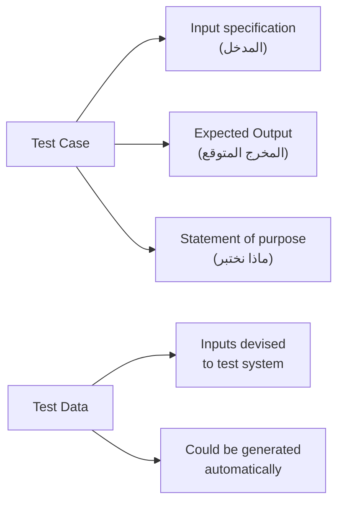

**شرح العناصر:**
- **Test Case:** يحتوي 3 أجزاء — المدخل، المخرج المتوقع، ووصف الهدف من هذا الاختبار.
- **Test Data:** فقط المدخلات (inputs) التي صُمّمت لتشغيل النظام؛ ممكن تكون مُولَّدة تلقائياً (automated generation) أو مُصمَّمة يدوياً.

**التطبيق في هذا السياق:**
هذا التمييز ضروري لفهم مخطط `Traditional Testing Process` في القسم القادم، حيث تُبنى `Test Cases` أولاً، ثم تُستخرَج منها `Test Data` الفعلية.

---

#### 📖 الشرح

فكّر في `Test Case` كأنه "خطة تجربة كاملة" في المختبر: تكتب فيها "سأُدخل الرقم X، وأتوقع النتيجة Y، لأننا نتحقق من صحة الجمع". أما `Test Data` فهي فقط "الرقم X" نفسه — المدخل الفعلي اللي بتحطه بالنظام.

الفرق يهم عملياً لأن `Test Data` ممكن تُولَّد تلقائياً (مثلاً باستخدام أدوات توليد بيانات عشوائية ضمن نطاق معين)، لكن `Test Case` الكامل (بما فيه توقع النتيجة والغرض) عادة يحتاج تصميماً بشرياً واعياً، لأنه يعكس فهمنا لما "يجب" أن يحدث.

#### 🎯 الملخص السريع
- `Test Case` = مدخل + مخرج متوقع + وصف الهدف
- `Test Data` = المدخلات فقط، ممكن تولَّد آلياً
- كل Test Case يحتاج Test Data، لكن Test Data وحدها ما تكفي بدون توقّع نتيجة

#### 📚 التطبيق
لاحقاً في `Unit Testing`، ستحتاج تصمّم `Test Cases` تغطي كل دالة (method)، وتستخدم `Test Data` مناسبة لكل حالة.

#### 📄 النص الأصلي من المحاضرة
<details>
<summary>عرض النص الأصلي (coverage: 100%)</summary>

> "Test cases: specifications of the input to the test, expected output from the system, statement of what is being tested. Test data: inputs that have been devised to test a system, could be generated automatically."

**ملاحظة على التغطية:**
- ✓ تم شرح كامل التعريفين
- ℹ️ إضافة من الدليل: تشبيه خطة التجربة في المختبر

</details>

---

### 5. عملية الاختبار التقليدية (Traditional Testing Process)
<!-- @type: fact -->
<!-- @render: {type: "diagram-first", visualization: "flowchart", coverage: "100%"} -->
<!-- @connectivity: {prerequisite: "4"} -->

#### 📍 أين نحن الآن؟
الآن نجمع كل ما سبق في عملية واحدة متسلسلة: كيف تسير خطوات الاختبار من البداية للنهاية.

#### ⬅️ الربط مع السابق
بعد ما عرفنا الفرق بين Test Case وTest Data، نشوف كيف تُستخدم الاثنتان معاً في عملية عملية متكاملة.

#### 💡 الفكرة الأساسية
**عملية الاختبار التقليدية تمر بخمس خطوات متسلسلة: تصميم حالات الاختبار → تجهيز البيانات → تشغيل البرنامج → مقارنة النتائج → كتابة التقارير.**

---

#### 📊 المخطط: خطوات عملية الاختبار

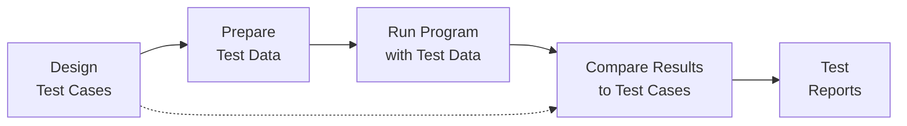

**شرح العناصر:**
- **Design Test Cases:** تحديد المدخلات والمخرجات المتوقعة قبل أي تشغيل.
- **Prepare Test Data:** تجهيز المدخلات الفعلية المشتقة من Test Cases.
- **Run Program with Test Data:** تنفيذ البرنامج فعلياً بهذه المدخلات.
- **Compare Results to Test Cases:** مطابقة المخرجات الفعلية بالمتوقعة من الخطوة الأولى.
- **Test Reports:** توثيق النتائج (نجاح/فشل، أخطاء مكتشفة، ملاحظات).

**شرح الروابط:**
- **Design Test Cases → Compare Results (الخط المتقطع):** المقارنة النهائية ترجع دائماً لنفس Test Cases المصمَّمة في البداية — فهي المرجع الثابت للحكم على النجاح أو الفشل.

**التطبيق في هذا السياق:**
هذه هي العملية العامة التي تُطبَّق على كل مستوى من مستويات الاختبار (Unit, Component, System) التي سنشرحها لاحقاً.

---

#### 📖 الشرح

هذه العملية بسيطة لكنها منظّمة: **لا تبدأ أبداً بتشغيل البرنامج عشوائياً.** أولاً تصمّم Test Cases بعناية (تحدد شنو تتوقع)، بعدين تجهّز Test Data الفعلية، بعدين تشغّل، بعدين تقارن، وأخيراً توثّق بتقرير.

النقطة المهمة: خطوة `Compare Results to Test Cases` ما تعتمد على الانطباع الشخصي — لازم يكون عندك معيار مسبق (المخرج المتوقع) تقارن به، وهذا يرجع مباشرة لأهمية تصميم Test Cases بعناية من البداية.

#### 🎯 الملخص السريع
- 5 خطوات: Design → Prepare → Run → Compare → Report
- الترتيب مهم: التصميم يسبق التشغيل دائماً
- المقارنة تعتمد على معيار محدد مسبقاً (expected output)

#### 📚 التطبيق
هذه العملية تنطبق سواء كنت تختبر يدوياً أو آلياً (سنشرح الفرق في القسم القادم)، وسواء كنت في مستوى Unit أو System.

#### 📄 النص الأصلي من المحاضرة
<details>
<summary>عرض النص الأصلي (coverage: 100%)</summary>

> "Design test cases; Prepare test data; Run program with test data; Compare results to test cases; Test reports."

**ملاحظة على التغطية:**
- ✓ تم شرح كل خطوة والترتيب المنطقي بينها

</details>

---

### 6. مراحل الاختبار (Testing Stages)
<!-- @type: fact -->
<!-- @render: {type: "diagram-first", visualization: "flowchart", coverage: "100%"} -->
<!-- @connectivity: {prerequisite: "5"} -->

#### 📍 أين نحن الآن؟
نتعرف على من يقوم بالاختبار ومتى، عبر أربع مراحل مختلفة في حياة المشروع.

#### ⬅️ الربط مع السابق
بعد ما فهمنا عملية الاختبار العامة، نحتاج نعرف: من الذي ينفذها في كل مرحلة من مراحل تسليم المنتج؟

#### 💡 الفكرة الأساسية
**الاختبار يمر بأربع مراحل متتالية: Development Testing (المطورون) → Release Testing (فريق منفصل) → User Testing (المستخدمون) → Acceptance Testing (العميل رسمياً).**

---

#### 📊 المخطط: مراحل الاختبار

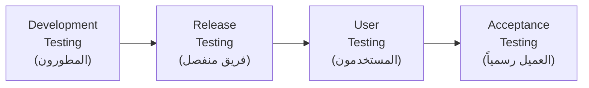

**شرح العناصر:**
- **Development Testing:** يجريه مصمّمو النظام والمبرمجون أثناء الكتابة، لاكتشاف الأخطاء مبكراً.
- **Release Testing:** فريق اختبار منفصل يختبر نسخة كاملة قبل الإصدار، للتأكد أن النظام يلبي متطلبات أصحاب المصلحة (stakeholders).
- **User Testing:** المستخدمون أو المستخدمون المحتملون يجربون النظام في بيئتهم الفعلية.
- **Acceptance Testing:** نوع خاص من User Testing، حيث يختبر العميل رسمياً ليقرر هل يقبل النظام أو يطلب تطويراً إضافياً.

**التطبيق في هذا السياق:**
هذا التسلسل يوضّح أن الاختبار ليس حدثاً واحداً، بل رحلة متكاملة تبدأ من داخل فريق التطوير وتنتهي بموافقة العميل رسمياً.

---

#### 📖 الشرح

**Development Testing** هو أول خط دفاع — نفس المبرمجين يختبرون كودهم أثناء الكتابة (هذا يشمل Unit, Component, وSystem Testing كما سنرى لاحقاً). ثم يأتي **Release Testing**: فريق منفصل تماماً عن فريق التطوير يأخذ نسخة كاملة ويختبرها بعين موضوعية، بعيداً عن أي "تحيّز" قد يكون عند من كتب الكود (لأن المبرمج أحياناً يختبر فقط ما يتوقع أنه يعمل).

بعدها يجرّب **المستخدمون الحقيقيون** النظام في بيئتهم الطبيعية — قد يكتشفون مشاكل ما توقعها أحد (مثل تعارض مع برنامج آخر عندهم). وأخيراً، **Acceptance Testing** هو الخطوة الرسمية القانونية/التعاقدية: العميل يختبر بنفسه ويقرر "أقبل النظام" أو "أحتاج تعديلات قبل القبول" — هذه الخطوة ترتبط مباشرة بمفهوم `Validation` اللي شرحناه بالقسم 2.

#### 🎯 الملخص السريع
- Development Testing: من المطورين أنفسهم
- Release Testing: فريق منفصل، يتأكد من متطلبات الأصحاب المصلحة
- User Testing: مستخدمون حقيقيون في بيئتهم
- Acceptance Testing: نوع رسمي من User Testing لقرار القبول

#### 📚 التطبيق
Acceptance Testing هو التطبيق العملي لمفهوم Validation ("هل هذا المنتج الصحيح؟") الذي شرحناه سابقاً.

#### ⚠️ أخطاء شائعة

#### الفهم الخاطئ ❌:
الطالب يعتقد أن Acceptance Testing وUser Testing نفس الشيء تماماً بلا فرق.

#### الفهم الصحيح ✅:
`Acceptance Testing` هو *نوع خاص ورسمي* من `User Testing`، حيث الهدف تحديداً هو قرار تعاقدي (قبول أو رفض)، بينما User Testing العام أوسع وقد يكون غير رسمي (مجرد ملاحظات المستخدم).

#### 📄 النص الأصلي من المحاضرة
<details>
<summary>عرض النص الأصلي (coverage: 100%)</summary>

> "Development testing: Testing during development to discover bugs and defects, System designers & programmers. Release testing: Separate testing team tests a complete version, Goal: to check that a system meets the requirements of system stakeholders. User testing: User or potential users test the system in their own environment. Acceptance testing: Type of user testing, the customer formally tests a system to decide if it should be accepted from the system supplier or further development is required."

**ملاحظة على التغطية:**
- ✓ تم شرح كل مرحلة وربطها بالأخرى

</details>

---

### 7. الاختبار اليدوي والآلي (Manual & Automated Testing)
<!-- @type: practice -->
<!-- @render: {type: "diagram-first", visualization: "flowchart", coverage: "100%"} -->
<!-- @connectivity: {prerequisite: "6"} -->

#### 📍 أين نحن الآن؟
نتعلم الفرق بين طريقتين لتنفيذ الاختبار: يدوياً بواسطة شخص، أو آلياً بواسطة كود.

#### ⬅️ الربط مع السابق
بعد ما عرفنا مراحل الاختبار (من يختبر ومتى)، نحتاج نعرف "كيف" يُنفَّذ الاختبار فعلياً في كل مرحلة.

#### 💡 الفكرة الأساسية
**الاختبار اليدوي يعتمد على شخص يشغّل البرنامج ويقارن يدوياً، بينما الاختبار الآلي يُشفَّر داخل برنامج آخر يكرر التنفيذ تلقائياً — وهو مفيد جداً لإعادة الاختبار (Regression Testing).**

---

#### 📊 المخطط: Manual vs Automated

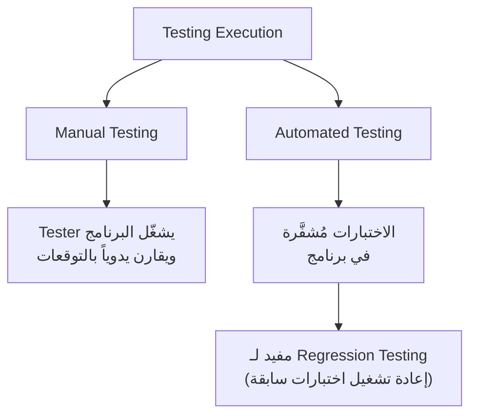

**شرح العناصر:**
- **Manual Testing:** شخص (tester) يشغّل البرنامج ببيانات معيّنة ويقارن النتائج بتوقعاته بنفسه.
- **Automated Testing:** الاختبارات تُكتب كبرنامج (كود) يُنفَّذ تلقائياً بدون تدخل بشري في كل مرة.
- **Regression Testing:** إعادة تشغيل اختبارات سابقة للتأكد أن تعديلاً جديداً في الكود ما كسر شيئاً كان يعمل صح — الأتمتة هنا توفّر وقتاً هائلاً.

**التطبيق في هذا السياق:**
في المشاريع الحقيقية، الفرق الاحترافية تعتمد بشكل كبير على الأتمتة (مثل `JUnit` الذي سنراه في المحاضرة القادمة) لأن Regression Testing يتكرر مئات المرات طوال المشروع.

---

#### 📖 الشرح

الاختبار اليدوي بسيط ومباشر: تفتح البرنامج، تجرب حالة معينة، تشوف النتيجة، تقارنها بعقلك. لكن هذا يستهلك وقتاً كبيراً لو احتجت تكرر نفس الاختبارات مئة مرة بعد كل تعديل صغير في الكود.

هنا تجي فائدة **الأتمتة**: تكتب سكربت أو برنامج اختبار مرة واحدة، وبعدها تشغّله بضغطة زر في ثوانٍ، حتى لو غيّرت الكود مئة مرة. هذا بالضبط سبب أهمية الأتمتة في **Regression Testing** — عملية إعادة تشغيل مجموعة الاختبارات القديمة كل مرة تضيف ميزة جديدة، للتأكد أن الميزة الجديدة ما "كسرت" شيئاً كان يعمل سابقاً.

#### 🎯 الملخص السريع
- Manual: شخص يشغّل ويقارن يدوياً
- Automated: كود يُنفّذ الاختبارات تلقائياً
- الأتمتة أساسية لـ Regression Testing (إعادة اختبار بعد كل تغيير)

#### 📚 التطبيق
في المحاضرة القادمة سنتعلم `JUnit`، وهي أداة أتمتة اختبار شهيرة تُستخدم فعلياً في الشركات لتطبيق هذا المفهوم عملياً.

#### ⚠️ أخطاء شائعة

#### الفهم الخاطئ ❌:
الطالب يعتقد أن الاختبار الآلي "أفضل دائماً" ويجب استبدال الاختبار اليدوي بالكامل.

#### الفهم الصحيح ✅:
الاختبار الآلي ممتاز لتكرار نفس الحالات (Regression)، لكن الاختبار اليدوي لا يزال ضرورياً لاكتشاف مشاكل غير متوقعة (مثل تجربة المستخدم الفعلية) التي يصعب برمجتها مسبقاً.

#### 📄 النص الأصلي من المحاضرة
<details>
<summary>عرض النص الأصلي (coverage: 100%)</summary>

> "Manual: a tester runs the program with some test data and compares the results to their expectations. Automated: the tests are encoded in a program. Automated testing useful for regression testing (rerunning previous test)."

**ملاحظة على التغطية:**
- ✓ تم شرح الفرقين + استخدام Regression Testing

</details>

---

### 8. اختبار التطوير ومستوياته (Development Testing Levels)
<!-- @type: fact -->
<!-- @render: {type: "diagram-first", visualization: "hierarchy", coverage: "100%"} -->
<!-- @connectivity: {prerequisite: "7"} -->

#### 📍 أين نحن الآن؟
ندخل الآن بتفاصيل `Development Testing` (الذي ذكرناه سابقاً كأول مرحلة)، ونتعرف على مستوياته الثلاثة.

#### ⬅️ الربط مع السابق
بعد ما عرفنا إن Development Testing يقوم به فريق التطوير نفسه، نحتاج نعرف: هل يختبرون كل شيء دفعة وحدة، أو بالتدريج؟

#### 💡 الفكرة الأساسية
**Development Testing يشمل ثلاثة مستويات متصاعدة: Unit (وحدة برمجية واحدة) → Component (مجموعة وحدات) → System (النظام الكامل).**

---

#### 📊 المخطط: مستويات اختبار التطوير

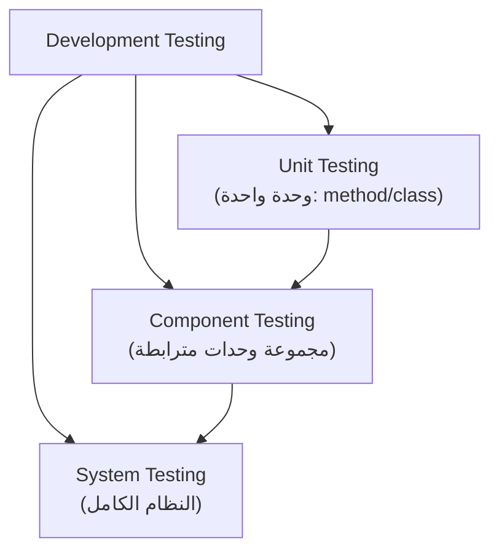

**شرح العناصر:**
- **Unit:** أصغر مستوى — اختبار method واحدة أو class واحد بمعزل عن الباقي.
- **Component:** مجموعة من الوحدات (units) تعمل معاً لتحقيق وظيفة أكبر.
- **System:** النظام كاملاً بكل مكوناته يعمل معاً.

**شرح الروابط:**
- **التسلسل من Unit إلى Component إلى System:** كل مستوى يبني على المستوى السابق — لا معنى لاختبار System إذا كانت الوحدات الأساسية (Units) نفسها معطوبة.

**التطبيق في هذا السياق:**
هذا التدرج يفسّر لماذا هذه المحاضرة تركّز أولاً على `Unit Testing` بالتفصيل — لأنه الأساس الذي تُبنى عليه بقية المستويات.

---

#### 📖 الشرح

فكّر في بناء سيارة: أولاً تختبر كل قطعة لوحدها (المحرك، الفرامل، الإطارات) — هذا `Unit Testing`. بعدين تركّب القطع مع بعض وتختبر كل نظام فرعي (نظام الفرامل كاملاً مع كل أجزائه) — هذا `Component Testing`. وأخيراً تختبر السيارة كاملة وهي تشتغل — هذا `System Testing`.

هذا التدرج منطقي: لو فيه خطأ في المحرك (Unit)، ما فايدة تختبر السيارة كاملة قبل ما تصلح المحرك أولاً؟ لذلك تبدأ الفرق دائماً من الأسفل للأعلى (bottom-up).

#### 🎯 الملخص السريع
- Development Testing = Unit + Component + System
- الترتيب: من الأصغر (Unit) للأكبر (System)
- كل مستوى يفترض أن المستوى الأصغر منه سليم

#### 📚 التطبيق
سنركّز في الأقسام القادمة على `Unit Testing` بالتفصيل، بينما `Component` و`System Testing` سيُشرحان في المحاضرة القادمة.

#### 📄 النص الأصلي من المحاضرة
<details>
<summary>عرض النص الأصلي (coverage: 100%)</summary>

> "Development testing includes all testing activities that are carried out by the team developing the system. Level of testing: Unit, Component, System."

**ملاحظة على التغطية:**
- ✓ تم شرح المستويات الثلاثة وترتيبها المنطقي
- ℹ️ إضافة من الدليل: تشبيه بناء السيارة

</details>

---

### 9. اختبار الوحدة (Unit Testing)
<!-- @type: practice -->
<!-- @render: {type: "diagram-first", visualization: "uml", coverage: "100%"} -->
<!-- @connectivity: {prerequisite: "8"} -->

#### 📍 أين نحن الآن؟
ندخل بالتفصيل بأول وأهم مستوى في الاختبار: `Unit Testing`، عبر مثال حقيقي (`WeatherStation`).

#### ⬅️ الربط مع السابق
بعد ما عرفنا إن Unit هو أصغر مستوى، نتعلم الآن *كيف* نصمم اختبارات فعالة لهذا المستوى.

#### 💡 الفكرة الأساسية
**اختبار الوحدة يركّز على اختبار وظائف الكائنات (objects) أو الدوال (methods) بمعزل تام، بحيث تُغطّى كل العمليات، كل الخصائص، وكل الحالات الممكنة للكائن.**

---

#### 📊 المخطط: WeatherStation Class

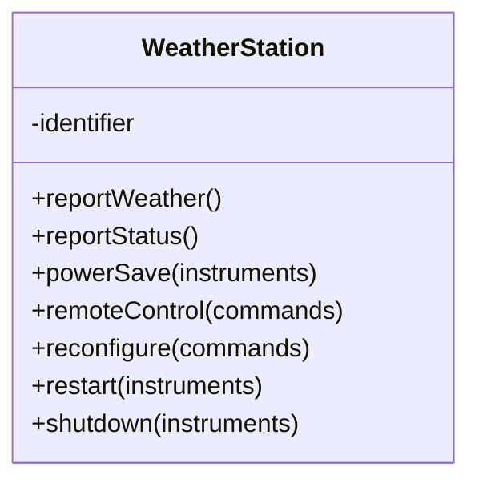

**شرح العناصر:**
- **identifier:** خاصية (attribute) ثابتة تشير إلى أن المحطة مُركَّبة ومُعدّة؛ الاختبار هنا يكتفي بالتحقق من أنها أُعدّت بشكل صحيح.
- **methods (reportWeather, reportStatus, powerSave...):** كل دالة تحتاج `Test Case` خاص بها.
- **restart/shutdown:** مثال على دالتين مترابطتين — لازم تُختبر `shutdown` *بعد* تنفيذ `restart` فعلياً (تسلسل إجباري)، وليس بمعزل كامل.

**شرح الروابط:**
- **العلاقة بين restart وshutdown:** هذه ليست علاقة UML تقليدية (association/inheritance)، بل علاقة **تسلسل زمني إجباري** يجب مراعاتها عند تصميم الاختبار — أحياناً تحتاج `sequence diagrams` أو `state diagrams` لتوضيح هذا التسلسل.

**التطبيق في هذا السياق:**
هذا المثال يوضّح أن Unit Testing ليس مجرد "استدعاء كل دالة بمفردها"، بل يتطلب فهم العلاقات المنطقية والزمنية بين الدوال.

---

#### 📖 الشرح

عند اختبار كائن (object)، القاعدة الذهبية هي: **غطِّ كل شيء** — كل عملية (operation) مرتبطة بالكائن، كل خاصية (attribute) تحتاج ضبط وفحص لقيمتها، وضع الكائن بكل الحالات الممكنة (states) التي قد يمر بها.

في مثال `WeatherStation`، الخاصية `identifier` ثابتة (لا تتغير)، لذلك الاختبار المناسب لها بسيط: فقط تحقق أنها أُعدّت بشكل صحيح عند التركيب، بدون حاجة لاختبارات معقدة إضافية.

أما الدوال (methods) فيجب اختبارها **بمعزل (in isolation)** قدر الإمكان — يعني تختبر `powerSave` لوحدها بدون الاعتماد على دوال أخرى. لكن أحياناً هذا غير ممكن: مثلاً لاختبار `shutdown`، لازم أولاً تكون قد نفّذت `restart` فعلياً — هذا يسمى **test sequence**، وغالباً تحتاج `sequence diagrams` أو `state diagrams` لتخطيط هذه التسلسلات بوضوح قبل كتابة الاختبار.

نقطة أخيرة حرجة يغفل عنها كثير من المبرمجين: **الوراثة (inheritance)**. لو كان لديك class يرث من class آخر، عملية (operation) موروثة قد تكون **صالحة ومُختبَرة جيداً في سياق الأب (parent)**، لكن قد **لا تكون صالحة في سياق الابن (child)** بسبب تغيّر السياق أو الحالة. لذلك، أبداً لا تفترض أن "الدالة اختُبرت في الأب، إذن هي آمنة في الابن" — يجب إعادة اختبارها في السياق الجديد.

#### 🎯 الملخص السريع
- اختبر كل operation مرتبطة بالكائن
- اضبط وافحص قيمة كل attribute
- ضع الكائن بكل الحالات (states) الممكنة
- اختبر methods بمعزل قدر الإمكان، إلا عند وجود تسلسل إجباري (test sequence)
- لا تنسَ الوراثة: عملية موروثة قد لا تصلح في سياق الابن

#### 📚 التطبيق
هذا المستوى من الدقة في Unit Testing هو ما يجعل الأخطاء تُكتشف مبكراً جداً، قبل ما تصل لمستوى Component أو System حيث تصبح أصعب وأغلى بكثير للتتبع.

#### ⚠️ أخطاء شائعة

#### الفهم الخاطئ ❌:
الطالب يظن أنه إذا اختبر كل method لوحدها بمعزل تام، فهذا كافٍ لتغطية الكائن بالكامل.

#### الفهم الصحيح ✅:
بعض الدوال تحتاج تسلسلاً محدداً (test sequence) — مثل استدعاء `restart` قبل `shutdown` — ولا يمكن اختبارها بمعزل حقيقي عن بعضها. كذلك يجب تغطية كل الحالات (states) الممكنة للكائن، وليس فقط الحالة الافتراضية.

#### 📄 النص الأصلي من المحاضرة
<details>
<summary>عرض النص الأصلي (coverage: 100%)</summary>

> "Unit Testing: Test individual program units. Should focus on testing the functionality of objects or methods. When testing object classes, design your tests to cover all features of the object: Test all operations associated with the object, Set & check the value of all attributes, Put the object into all possible states. WeatherStation: one attribute that is constant — indicate that the station is installed — Test: only check if it has been properly set up. Define test cases for all methods. Test methods in isolation, and in some cases some test sequences are necessary, for example to test shutdown method, you need to have executed restart method (sequence & state diagrams). Never forget generalization (inheritance): an inherited operation may be valid (and tested) in the parent's context, but may not be valid for child's context."

**ملاحظة على التغطية:**
- ✓ تم شرح كامل قواعد Unit Testing + مثال WeatherStation + قضية الوراثة

</details>

---

### 10. اختيار حالات اختبار الوحدة (Choosing Unit Test Cases)
<!-- @type: practice -->
<!-- @render: {type: "diagram-first", visualization: "flowchart", coverage: "100%"} -->
<!-- @connectivity: {prerequisite: "9"} -->

#### 📍 أين نحن الآن؟
بعد ما عرفنا "ماذا" نختبر في Unit Testing، نتعلم الآن معياراً عملياً لاختيار الحالات *الفعّالة* لأن الاختبار مكلف ويستهلك وقتاً.

#### ⬅️ الربط مع السابق
هذا امتداد مباشر للقسم السابق: كيف نطبّق مبدأ "غطِّ كل شيء" عملياً بدون أن نضيّع وقتاً على حالات غير مفيدة؟

#### 💡 الفكرة الأساسية
**حالات الاختبار الفعّالة يجب أن (1) تكشف الأخطاء الموجودة فعلاً بناءً على خبرة سابقة بمواطن الضعف الشائعة، و(2) تُثبت أن المكوّن يقوم بعمله الطبيعي (normal operation) بشكل صحيح.**

---

#### 📊 المخطط: معايير اختيار Test Case فعّال

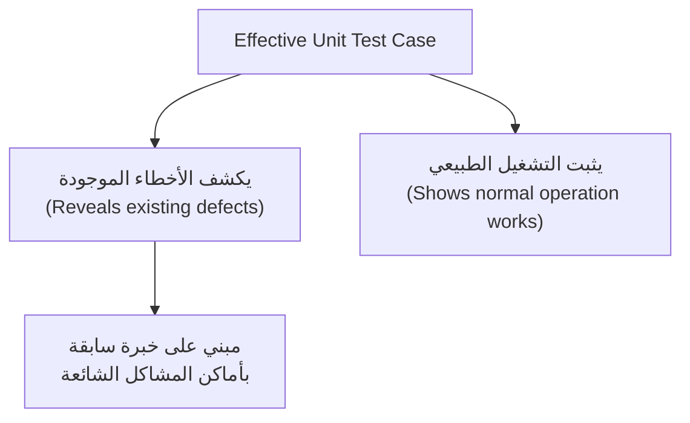

**شرح العناصر:**
- **يكشف الأخطاء:** الحالة تُصمَّم بناءً على خبرة سابقة بأين تحدث الأخطاء عادةً (مثل حالات حدودية، مدخلات فارغة، إلخ).
- **يثبت التشغيل الطبيعي:** الحالة تتأكد أن الوظيفة الأساسية تعمل كما هو متوقع في السيناريو العادي.

**التطبيق في هذا السياق:**
هذا المعيار هو الأساس النظري الذي تُبنى عليه استراتيجيات الاختيار الأكثر تفصيلاً في القسم القادم (`Partition Testing` و`Boundary Value Analysis`).

---

#### 📖 الشرح

الاختبار مكلف ويستغرق وقتاً، فلا يمكن تجربة كل مدخل ممكن نظرياً (عدد لا نهائي تقريباً). لذلك نحتاج نختار حالات "ذكية" تحقق أكبر فائدة بأقل عدد ممكن من الاختبارات.

المثال المذكور في المحاضرة: لو كنت تختبر مكوّناً يُنشئ ويُهيّئ سجلاً جديداً لمريض (patient record)، فإن `Test Case` الجيد يجب أن يُثبت أن السجل *موجود فعلاً* في قاعدة البيانات، وأن كل حقوله (fields) قد ضُبطت كما هو محدد في المواصفات. هذا مثال بسيط لكنه يجسّد المعيار الثاني (إثبات التشغيل الطبيعي) بوضوح.

أما المعيار الأول (كشف الأخطاء الموجودة)، فيعتمد على "الخبرة" — يعني المبرمج المتمرّس يعرف من تجربته السابقة أن الأخطاء غالباً تحدث في حالات معيّنة (مثل القيم الحدودية، القيم الفارغة، أو المدخلات غير المتوقعة)، فيصمم اختباراته لتستهدف هذه النقاط تحديداً بدل التركيز فقط على الحالات "السهلة" التي غالباً تعمل بلا مشاكل.

#### 🎯 الملخص السريع
- الاختبار مكلف → نحتاج حالات فعّالة وليست عشوائية
- معيار 1: الحالة تكشف أخطاء موجودة (بناءً على خبرة سابقة)
- معيار 2: الحالة تثبت أن التشغيل الطبيعي يعمل صح
- مثال: اختبار إنشاء سجل مريض = تأكد وجود السجل + صحة كل الحقول

#### 📚 التطبيق
هذا التفكير في "الفعالية" هو ما يقودنا مباشرة لاستراتيجيات منهجية أكثر دقة: `Partition Testing` و`Boundary Value Analysis`، اللي بنشرحها بالقسم القادم.

#### 📄 النص الأصلي من المحاضرة
<details>
<summary>عرض النص الأصلي (coverage: 100%)</summary>

> "Testing is expensive and time consuming, so that we need effective unit test cases: If there are defects in the component, these should be revealed by test cases (Based on experience of where common problems arise); Test cases should show that the component under test does what it is supposed to do (i.e. normal operation). If you are testing a component that creates and initializes a new patient record, then your test case should show that the record exists in a database and that its fields have been set as specified."

**ملاحظة على التغطية:**
- ✓ تم شرح المعيارين بالكامل + المثال الأصلي

</details>

---

### 11. استراتيجيات الاختبار: Partition Testing
<!-- @type: principle -->
<!-- @render: {type: "diagram-first", visualization: "flowchart", coverage: "100%"} -->
<!-- @connectivity: {prerequisite: "10"} -->

#### 📍 أين نحن الآن؟
ندخل الآن باستراتيجية منهجية دقيقة لاختيار حالات الاختبار: تقسيم المدخلات لمجموعات (partitions).

#### ⬅️ الربط مع السابق
بعد ما عرفنا أننا نحتاج حالات "فعّالة"، هذا القسم يقدّم طريقة عملية منظّمة لتحقيق ذلك بدل الاعتماد على التخمين.

#### 💡 الفكرة الأساسية
**`Partition Testing` يقسّم كل المدخلات الممكنة (صحيحة وخاطئة) إلى مجموعات (partitions) بحيث كل عناصر المجموعة الواحدة يُتوقَّع أن تُعامَل بنفس الطريقة — وتختار حالة اختبار واحدة على الأقل من كل مجموعة.**

---

#### 📊 المخطط: Partition Testing — Input/Output Partitions

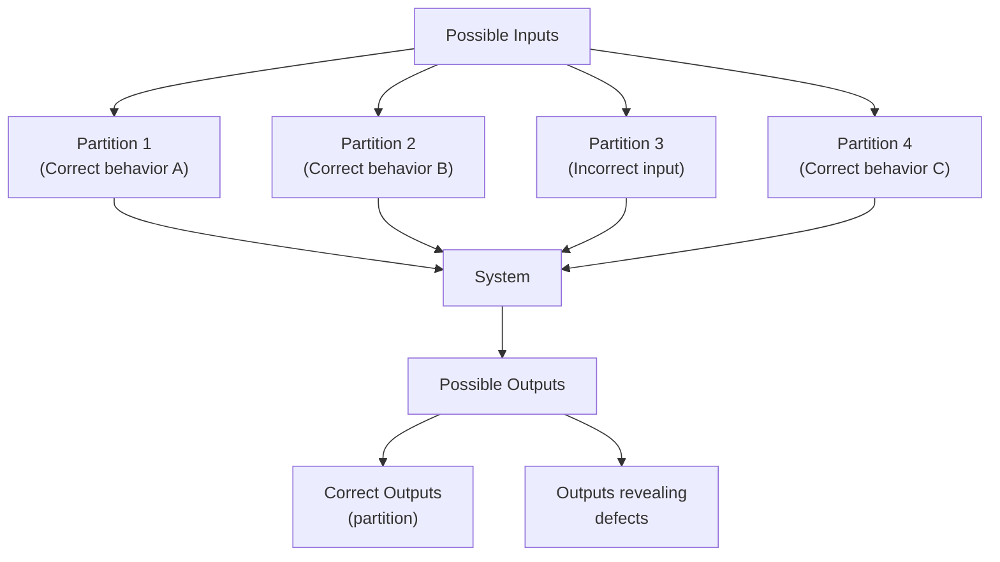

**شرح العناصر:**
- **Partitions:** مجموعات من المدخلات (تشمل المدخلات الصحيحة والخاطئة) يُفترض أنها تُعامَل بنفس السلوك داخل النظام.
- **Correct Outputs:** جزء من المخرجات الممكنة يمثّل السلوك الصحيح المتوقع.
- **Outputs revealing defects:** أي مخرج خارج نطاق الصحيح يكشف وجود عيب.

**شرح الروابط:**
- **العلاقة بين Input Partitions و Output Partitions:** غالباً هي علاقة 1:1 (كل input partition يقابله output partition واحد)، **لكن ليس دائماً** — أحياناً عدة input partitions تُنتج نفس نوع الـ output، أو العكس.

**التطبيق في هذا السياق:**
بدل اختبار مئات المدخلات الفردية، تختار حالة واحدة (أو أكثر) تمثّل كل partition — فتقلّل عدد الاختبارات بشكل كبير مع الحفاظ على تغطية شاملة منطقياً.

---

#### 📖 الشرح

فكّر في الأمر مثل الفحص الطبي الشامل: بدل ما تفحص كل خلية بجسمك (مستحيل عملياً)، الطبيب يأخذ "عيّنة" واحدة تمثّل كل نظام (عيّنة دم تمثّل كل الدم، مثلاً). نفس الفكرة هنا: بدل اختبار كل رقم ممكن من 1 إلى مليون، تقسّم المدخلات إلى مجموعات منطقية (مثل: "أرقام أقل من 10"، "أرقام بين 10 و100"، "أرقام أكبر من 100")، وتختار عينة تمثيلية من كل مجموعة.

**كيف تحدد الـ partitions؟** المحاضرة تذكر ثلاث طرق:
1. استخدام **مواصفات البرنامج** (program specification) — تحدد نطاقات المدخلات المسموحة.
2. استخدام **وثائق المستخدم** (user documentation).
3. الاعتماد على **الخبرة** — حيث تتوقع أنواع القيم التي غالباً تكشف الأخطاء بناءً على تجارب سابقة.

النقطة الحرجة اللي يجب تذكّرها: العلاقة بين input partitions وoutput partitions **ليست دائماً 1:1** — أحياناً partition واحد من المدخلات ينتج أكثر من نوع مخرج حسب حالات فرعية داخله، وهذا يحتاج انتباهاً إضافياً عند التصميم.

#### 🎯 الملخص السريع
- قسّم كل المدخلات الممكنة (صحيحة وخاطئة) لـ partitions
- كل عناصر الـ partition الواحد يُتوقّع نفس السلوك
- اختر حالة اختبار واحدة على الأقل من كل partition
- العلاقة input↔output partitions ليست دائماً 1:1
- طرق تحديد الـ partitions: program specification، user documentation، الخبرة

#### 📚 التطبيق
Partition Testing هو الأساس الذي يُبنى عليه لاحقاً تحليل القيم الحدودية (Boundary Value Analysis) في القسم القادم — لأن أخطر نقاط أي partition هي حدودها.

#### ⚠️ أخطاء شائعة

#### الفهم الخاطئ ❌:
الطالب يعتقد أنه يكفي اختيار أي قيمة عشوائية من كل partition، وأن كل القيم داخل نفس المجموعة لها نفس درجة الأهمية في كشف الأخطاء.

#### الفهم الصحيح ✅:
القيم الأكثر عرضة لكشف الأخطاء هي عادة القيم القريبة من **حدود** الـ partition (وليس منتصفها العشوائي) — وهذا بالضبط موضوع القسم القادم: `Boundary Value Analysis`.

#### 📄 النص الأصلي من المحاضرة
<details>
<summary>عرض النص الأصلي (coverage: 100%)</summary>

> "Partition testing (may be used for black-box test): Identify groups of inputs that have common characteristics and should be processed in same way. You should choose tests from within each of these groups. All possible inputs: Correct, Incorrect. One partition → same behavior. 1:1 mapping — Not always. Identifying partition: Using program specification, User documentation, Experience, where you predict the classes of input values that are likely to detect errors."

**ملاحظة على التغطية:**
- ✓ تم شرح كامل مفهوم partition testing + طرق التحديد + استثناء 1:1 mapping

</details>

---

### 12. تحليل القيم الحدودية (Boundary Value Analysis)
<!-- @type: principle -->
<!-- @render: {type: "diagram-first", visualization: "flowchart", coverage: "100%"} -->
<!-- @connectivity: {prerequisite: "11"} -->

#### 📍 أين نحن الآن؟
نكمل استراتيجية Partition Testing بقاعدة عملية دقيقة جداً: أين بالضبط داخل كل partition نختار قيمنا؟

#### ⬅️ الربط مع السابق
بعد ما قسّمنا المدخلات لـ partitions، نحتاج قاعدة ذهبية لاختيار القيم الأكثر فائدة داخل كل مجموعة.

#### 💡 الفكرة الأساسية
**أفضل قاعدة لاختيار حالات الاختبار هي التركيز على القيم عند حدود الـ partitions (boundary values)، بالإضافة إلى حالات قريبة من منتصف الـ partition.**

---

#### 📊 المخطط: Boundary Values Example

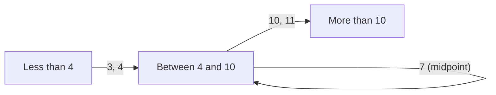

**شرح العناصر:**
- **3, 4:** القيم عند حدود الانتقال من partition "أقل من 4" إلى "بين 4 و10" — أعلى احتمال لخطأ off-by-one.
- **7 (midpoint):** قيمة من منتصف الـ partition تمثّل الحالة "الطبيعية" العادية.
- **10, 11:** القيم عند حدود الانتقال للـ partition التالي.

**التطبيق في هذا السياق:**
المثال الثاني في المحاضرة (نطاق 10000–99999) يطبّق نفس المبدأ على أرقام أكبر: القيم 9999/10000 وحدود 99999/100000 هي بالضبط النقاط اللي يجب اختبارها أولاً.

---

#### 📖 الشرح

ليش الحدود بالذات هي الأخطر؟ لأن أشهر خطأ برمجي هو **off-by-one error** — يعني المبرمج يكتب `<` بدل `<=` أو العكس. مثال المحاضرة: لو كانت المواصفة تقول "البرنامج يقبل من 4 إلى 8 مدخلات، وكل مدخل رقم من 5 خانات أكبر من 10,000"، فإن أهم القيم للاختبار هي بالضبط: 9999 و10000 (حدود الدخول للنطاق)، و99999 و100000 (حدود الخروج من نطاق الأرقام الخماسية).

القاعدة الكاملة إذن: **حدود كل partition + نقطة قريبة من منتصف الـ partition.** الحدود تكشف أخطاء off-by-one، بينما نقطة المنتصف تتأكد أن السلوك "الطبيعي العادي" داخل الـ partition يعمل صح أيضاً (وليس فقط الحالات الحدودية الشاذة).

#### 🎯 الملخص السريع
- ركّز على حدود كل partition (القيمة الأخيرة قبل الحد + القيمة الأولى بعده)
- أضف حالة من منتصف الـ partition للتأكد من السلوك الطبيعي
- الحدود تكشف أخطاء off-by-one الشائعة جداً في البرمجة

#### 📚 التطبيق
هذه القاعدة تُستخدم في كل مستويات الاختبار (Unit, Component, System) وهي من أكثر التقنيات فعالية بالنسبة لتكلفتها المنخفضة.

#### 🤔 تفعيل الفهم
لو عندك دالة تقبل عمر الموظف بشرط أن يكون بين 18 و65 سنة (inclusive)، ما هي القيم التي يجب أن تختارها لاختبار هذه الدالة بأعلى فعالية ممكنة؟

**تلميح:** فكّر في القيم عند 17، 18، 65، 66، بالإضافة إلى قيمة من المنتصف مثل 40.

#### ⚠️ أخطاء شائعة

#### الفهم الخاطئ ❌:
الطالب يعتقد أن اختيار أي قيمة عشوائية داخل الـ partition (مثل قيمة من المنتصف فقط) كافٍ لتغطية الاختبار بفعالية.

#### الفهم الصحيح ✅:
القيم الحدودية (boundary values) هي الأكثر عرضة لكشف أخطاء `off-by-one` الشائعة جداً في البرمجة (استخدام `<` بدل `<=` مثلاً)؛ لذلك يجب أن تكون دائماً ضمن أولى القيم المُختارة للاختبار، وليس فقط قيمة عشوائية من المنتصف.

#### 📄 النص الأصلي من المحاضرة
<details>
<summary>عرض النص الأصلي (coverage: 100%)</summary>

> "Boundary values: Good rule of test cases selection. Boundary of the partitions + cases close to midpoint of the partition. Eg., say a program specification states that the program accepts 4 to 8 inputs which are five-digit integers greater than 10,000. You use this information to identify the input partitions and possible test input values."

**ملاحظة على التغطية:**
- ✓ تم شرح كامل قاعدة boundary values + المثالين الأصليين من المحاضرة

</details>

---

### 13. الاختبار الموجَّه بالإرشادات (Guideline-Based Testing)
<!-- @type: practice -->
<!-- @render: {type: "diagram-first", visualization: "flowchart", coverage: "100%"} -->
<!-- @connectivity: {prerequisite: "12"} -->

#### 📍 أين نحن الآن؟
نختم المحاضرة باستراتيجية أخيرة: استخدام إرشادات مبنية على خبرة جماعية متراكمة من أخطاء برمجية شائعة.

#### ⬅️ الربط مع السابق
بعد استراتيجية Partition/Boundary التحليلية، نضيف طبقة أخرى: إرشادات عملية جاهزة تعكس خبرة آلاف المبرمجين السابقين.

#### 💡 الفكرة الأساسية
**الاختبار الموجَّه بالإرشادات يعتمد على قواعد عامة مأخوذة من خبرة سابقة بأنواع الأخطاء الشائعة التي يقع فيها المبرمجون عند تطوير مكوّناتهم.**

---

#### 📊 المخطط: إرشادات اختبار المتتاليات (Sequences/Arrays/Lists)

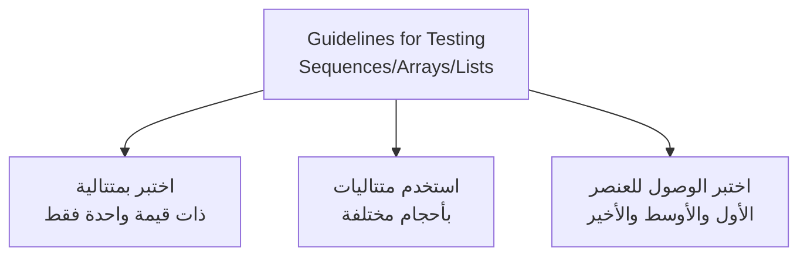

**شرح العناصر:**
- **متتالية بقيمة واحدة:** حالة حدودية دنيا (edge case) — ماذا يحدث لو كانت القائمة تحتوي على عنصر واحد فقط؟
- **أحجام مختلفة:** يشمل حالة فارغة، صغيرة، ومتوسطة، وكبيرة جداً.
- **الأول/الأوسط/الأخير:** هذه نقاط حدودية داخل بنية البيانات نفسها (مشابهة لمبدأ Boundary Value لكن على مستوى فهرسة العناصر index).

**التطبيق في هذا السياق:**
هذه الإرشادات الثلاثة تحديداً تشبه مبدأ `Partition Testing` و`Boundary Value Analysis` لكن مُطبَّقة تحديداً على بنى البيانات مثل المصفوفات والقوائم.

---

#### 📖 الشرح

الإرشادات هنا ليست نظرية معقدة، بل قائمة تجميعية من "أماكن معروفة" تحدث فيها الأخطاء عادة. مثال: عند اختبار أي دالة تتعامل مع مصفوفة أو قائمة، جرّب دائماً حالة "عنصر واحد فقط" (لأن كثير من الخوارزميات تفترض ضمنياً وجود عنصرين على الأقل وتنكسر مع عنصر واحد). كذلك، جرّب أحجام مختلفة تماماً (صفر عناصر، عنصر واحد، عدد كبير) للتأكد أن الأداء والصحة لا يتأثران بحجم المدخل.

المحاضرة تضيف أيضاً إرشادات عامة أوسع تتجاوز المصفوفات:
- اختر مدخلات تُجبر النظام على توليد **كل رسائل الخطأ** الممكنة — للتأكد أن معالجة الأخطاء تعمل صح.
- صمّم مدخلات تسبب **فيضان في المخازن المؤقتة** (buffer overflow) — لاختبار حدود الذاكرة والأمان.
- كرّر نفس المدخل أو سلسلة مدخلات **عدة مرات متتالية** — لاكتشاف مشاكل مثل تسريب الذاكرة (memory leaks) أو حالات تراكمية غير متوقعة.
- اجبر النظام على توليد **مخرجات غير صالحة** عمداً — لاختبار قوة التحقق من الصحة (validation).
- اجبر نتائج الحسابات لتكون **كبيرة جداً أو صغيرة جداً** — لاختبار حالات overflow/underflow الحسابية.

كل هذه الإرشادات تشترك بفكرة واحدة: **لا تختبر فقط الحالة "المريحة" المتوقعة، بل اذهب عمداً للحالات المتطرفة** التي يميل المبرمجون لتجاهلها.

#### 🎯 الملخص السريع
- إرشادات المتتاليات: عنصر واحد، أحجام مختلفة، أول/أوسط/أخير
- إرشادات عامة: أجبر رسائل الخطأ، اختبر buffer overflow، كرّر المدخلات، أجبر مخرجات غير صالحة، أجبر نتائج كبيرة/صغيرة جداً
- الفكرة المشتركة: اختبر الحالات المتطرفة، ليس فقط الحالة المريحة

#### 📚 التطبيق
هذه الإرشادات تُستخدم عملياً جنباً إلى جنب مع Partition و Boundary Testing لبناء مجموعة اختبارات (test suite) شاملة وفعالة.

#### ⚠️ أخطاء شائعة

#### الفهم الخاطئ ❌:
الطالب يعتقد أن اختبار الحالة "الطبيعية" الأكثر شيوعاً (مثل قائمة متوسطة الحجم بقيم عادية) كافٍ لاعتبار المكوّن "مُختبَراً جيداً".

#### الفهم الصحيح ✅:
أكثر الأخطاء تُكتشف عند الحالات المتطرفة (عنصر واحد، قائمة فارغة، مدخلات تسبب فيضاناً أو تُجبر رسائل خطأ) — لذلك الإرشادات هنا مكمّلة أساسية للاختبار، وليست خطوة اختيارية إضافية.

#### 📄 النص الأصلي من المحاضرة
<details>
<summary>عرض النص الأصلي (coverage: 100%)</summary>

> "Example of guideline to test programs with sequences, arrays or list: Test with sequences that have only a single value; Use different sequences of different sizes in tests; Derive tests so that the first, middle and last elements of the sequence are accessed. Some general guideline: Choose inputs that force the system to generate all error messages; Design inputs that cause input buffers to overflow; Repeat the same input or series if input numerous times; Force invalid outputs to be generated; Force computation results to be too large or too small."

**ملاحظة على التغطية:**
- ✓ تم شرح كامل الإرشادات الخاصة بالمتتاليات + الإرشادات العامة

</details>

---

## 💼 مثال متكامل: تطبيق استراتيجيات الاختبار في نظام تسجيل طلاب
<!-- @type: example-for-topics-9-to-13 -->
<!-- @covers: Unit Testing + Choosing Test Cases + Partition Testing + Boundary Values + Guideline-Based Testing -->

#### 📌 السياق
تطوّر جزءاً من نظام تسجيل طلاب جامعي، وتحديداً دالة `registerStudent(courseCount)` التي تسجّل الطالب في عدد من المواد، بشرط أن يكون العدد بين 3 و6 مواد (inclusive).

#### 💼 السيناريو (Real-World Example)

**بدون استراتيجية اختبار واضحة (غلط):**
تكتب اختباراً واحداً فقط: `registerStudent(4)` وتتأكد أنه نجح، ثم تعتبر الدالة "مُختبَرة".

**مع تطبيق الاستراتيجيات (صحيح):**
1. **Partition Testing:** تحدد partitions: أقل من 3 (خطأ)، بين 3 و6 (صحيح)، أكثر من 6 (خطأ).
2. **Boundary Values:** تختبر القيم 2, 3 (حدود الدخول)، 6, 7 (حدود الخروج)، بالإضافة لقيمة من المنتصف مثل 4.
3. **Guideline-Based Testing:** تختبر أيضاً حالة "مادة واحدة فقط" في قائمة المواد المُرسَلة (single value)، وحالة قائمة فارغة تماماً (empty list — تُجبر رسالة خطأ).
4. **Unit Testing (Object States):** تتأكد أن الطالب لا يمكنه التسجيل مرتين في نفس الفصل (حالة/state مختلفة للكائن `Student`).

#### 💡 كيف تجتمع المفاهيم؟
- **Partition Testing:** يعطيك خارطة عامة لأنواع المدخلات (صحيحة/خاطئة) التي يجب تغطيتها.
- **Boundary Value Analysis:** يخبرك *بالضبط* أي القيم داخل كل partition الأكثر عرضة لكشف الأخطاء (2, 3, 6, 7 بدل أي رقم عشوائي).
- **Guideline-Based Testing:** يضيف حالات إضافية خاصة ببنية البيانات (single value, empty list) التي لا يغطيها Partition/Boundary مباشرة.
- **النتيجة:** بدل اختبار واحد سطحي، عندك الآن مجموعة اختبارات (test suite) من حوالي 7-8 حالات فقط، لكنها تغطي كل السيناريوهات الحرجة تقريباً.

#### ⚠️ لو ما طبّقتهم صح؟
لو اكتفيت باختبار وحيد (`registerStudent(4)`)، ممكن تفوتك أخطاء off-by-one خطيرة جداً — مثلاً لو المبرمج كتب `if (courseCount < 3)` بدل `if (courseCount <= 3)` بالخطأ، فإن القيمة 3 (اللي المفروض تكون صحيحة) سترفض خطأً، ولن تكتشف هذا إلا لو اختبرت القيمة 3 بالتحديد كحد أدنى — وهذا بالضبط ما يوفره Boundary Value Analysis.

---

## الجزء الثاني: ملخص شامل (Alternative Complete Reading)

هذه المحاضرة تدور حول فكرة مركزية واحدة: كيف نتأكد أن البرنامج الذي كتبناه يعمل كما ينبغي، وكيف نكتشف الأخطاء فيه بأذكى وأرخص طريقة ممكنة، قبل ما يصل هذا البرنامج ليد المستخدم النهائي. تبدأ المحاضرة بتعريف بسيط لكنه عميق: الاختبار (`Testing`) هو تشغيل البرنامج ببيانات مُجهّزة (`artificial data`) بهدف التحقق من أنه يفعل ما هو متوقّع منه، واكتشاف الأخطاء (`defects`) قبل الاستخدام الفعلي. لكن النقطة الأهم هنا، والتي غالباً يقع فيها الطلاب بالخطأ، هي أن الاختبار يكشف *وجود* الأخطاء، ولا يثبت *غيابها* أبداً — يعني حتى لو نجح برنامجك في ألف اختبار، هذا لا يعني أنه خالٍ من الأخطاء تماماً؛ فقط يعني أنك لم تجد خطأً في الحالات التي جرّبتها تحديداً.

من هذا التعريف الأساسي، تتفرع المحاضرة لمفهومين حاسمين يجب ألا يختلطا على بعضهما أبداً: `Validation` و`Verification`. `Validation` تجاوب على سؤال "هل نبني المنتج الصحيح؟" — يعني هل النظام يلبّي فعلاً ما يحتاجه العميل ويتوقعه؟ بينما `Verification` تجاوب سؤالاً مختلفاً تماماً: "هل نبني المنتج بشكل صحيح؟" — يعني هل النظام يطابق حرفياً كل بند مكتوب في وثيقة المتطلبات (functional & non-functional requirements)؟ السبب الجذري لأهمية هذا التمييز هو حقيقة مهمة جداً: وثائق المتطلبات لا تعكس دائماً الرغبات الحقيقية للعملاء والمستخدمين. بمعنى آخر، ممكن جداً أن ينجح نظامك في كل اختبارات Verification (يطابق كل سطر في المواصفات) لكنه يفشل في Validation لأن المواصفات نفسها كانت ناقصة أو لم تعبّر فعلاً عن حاجة العميل الحقيقية. تخيل مثلاً نظام حجز مواعيد أطباء يطابق كل بند مكتوب بالمواصفة، لكن العميل يكتشف لاحقاً أنه نسي يطلب ميزة "تعديل الموعد" — هذا فشل Validation رغم نجاح Verification الكامل.

بعد فهم هذا التمييز، تنتقل المحاضرة لطريقتين مختلفتين لتنفيذ عملية التحقق: `Inspections` (المراجعات) و`Testing` (الاختبار الفعلي). `Inspections` هي تحليل ساكن (`static verification`) — يعني تراجع الكود، وثيقة المتطلبات، البنية المعمارية (`software architecture`)، نماذج التصميم بلغة UML، وحتى مخططات قواعد البيانات (`database schemas`) — كل هذا بدون تشغيل البرنامج فعلياً على الإطلاق. أما `Testing` فهي تحليل ديناميكي (`dynamic verification`) — يعني تُشغّل البرنامج فعلياً وتراقب سلوكه الحقيقي. ولكل طريقة مزاياها الخاصة: المراجعات تستطيع تحليل نسخ غير مكتملة من الكود بدون أي تكلفة إضافية (مثلاً تراجع نصف الكود المكتوب لحد الآن فقط)، وتكتشف مشاكل يصعب على الاختبار الديناميكي اكتشافها مثل الخوارزميات غير المناسبة (`inappropriate algorithms`) وأسلوب البرمجة السيء الذي يصعّب الصيانة (`poor programming style`) ومشاكل قابلية النقل (`portability`). كما أن المراجعات تتجنب مشكلة شائعة في الاختبار الديناميكي وهي أن خطأ واحد قد يخفي أخطاء أخرى (ناتج غير متوقع قد يكون بسبب خطأ جديد أو مجرد أثر جانبي لخطأ سابق، فيصعب التمييز). لكن للمراجعات حدود حقيقية أيضاً: لا تستطيع اكتشاف مشاكل ناتجة عن تفاعلات غير متوقعة وقت التشغيل الفعلي، ولا مشاكل الأداء (`performance`) أو مشاكل التوقيت (`timing problems`)، كما أن تجميع فريق مراجعة منفصل يكون مكلفاً وصعباً لوجستياً في فرق التطوير الصغيرة.

قبل ما ندخل بعملية الاختبار، تحدد المحاضرة مصطلحين أساسيين: `Test Case` هو المواصفة الكاملة للاختبار — يشمل المدخل، والمخرج المتوقع، ووصف واضح لماذا نختبر هذا بالتحديد. أما `Test Data` فهي فقط المدخلات المُصمَّمة لتشغيل النظام (وممكن تكون مُولَّدة تلقائياً بأدوات آلية). ثم تصف المحاضرة عملية الاختبار التقليدية (`Traditional Testing Process`) اللي تسير بترتيب واضح: أولاً تصمّم Test Cases، ثم تجهّز Test Data الفعلية المشتقة منها، ثم تشغّل البرنامج بهذه البيانات، ثم تقارن النتائج الفعلية بالمتوقعة من الخطوة الأولى، وأخيراً تكتب تقرير الاختبار (`Test Reports`).

بعد فهم العملية، تنتقل المحاضرة لتوضيح "من" يختبر و"متى"، عبر أربع مراحل متتالية. أولاً `Development Testing` — يقوم به المطورون والمصممون أنفسهم أثناء عملية الكتابة، بهدف اكتشاف الأخطاء مبكراً قدر الإمكان. ثانياً `Release Testing` — فريق منفصل تماماً عن فريق التطوير يختبر نسخة كاملة من النظام قبل إصداره، والهدف هنا هو التأكد أن النظام يلبّي متطلبات كل أصحاب المصلحة (`stakeholders`)، وليس فقط رؤية المبرمج الذي كتب الكود. ثالثاً `User Testing` — المستخدمون الحقيقيون أو المستخدمون المحتملون يجرّبون النظام في بيئتهم الطبيعية الفعلية، حيث ممكن يكتشفون مشاكل ما توقعها أحد أثناء التطوير (مثل تعارض مع برنامج آخر موجود عندهم). ورابعاً وأخيراً `Acceptance Testing` — وهو نوع خاص ورسمي جداً من User Testing، حيث العميل نفسه يختبر النظام رسمياً ليقرّر إما "أقبل النظام كما هو" أو "أحتاج تطويراً إضافياً قبل القبول" — وهذه الخطوة بالتحديد ترتبط مباشرة بمفهوم Validation الذي شرحناه سابقاً، لأنها تجاوب فعلياً على سؤال "هل هذا المنتج الصحيح فعلاً بالنسبة لي كعميل؟".

ثم تتطرق المحاضرة للفرق بين الاختبار اليدوي (`Manual Testing`) والاختبار الآلي (`Automated Testing`). في الاختبار اليدوي، شخص (tester) يشغّل البرنامج فعلياً ببعض بيانات الاختبار ويقارن النتائج بتوقعاته بنفسه. أما الاختبار الآلي فتُكتب فيه الاختبارات كبرنامج (كود) يُنفَّذ تلقائياً في كل مرة دون تدخل بشري متكرر. الفائدة العملية الكبرى للأتمتة تظهر بوضوح في عملية تُسمّى `Regression Testing`، وهي إعادة تشغيل اختبارات سابقة كل مرة تُعدّل فيها الكود، للتأكد أن التعديل الجديد ما "كسر" ميزة كانت تعمل بشكل صحيح سابقاً؛ ومن الواضح أن إعادة هذا يدوياً مئات المرات مستحيل عملياً، بينما الأتمتة تجعله سريعاً وممكناً بضغطة زر.

بعد ذلك تحدد المحاضرة أن `Development Testing` نفسه ينقسم لثلاثة مستويات متصاعدة: `Unit Testing` (اختبار وحدة برمجية واحدة، مثل method أو class واحد بمعزل عن الباقي)، ثم `Component Testing` (اختبار مجموعة وحدات مترابطة تعمل معاً)، وأخيراً `System Testing` (اختبار النظام الكامل بجميع مكوناته). هذا التدرج منطقي جداً: لا فائدة من اختبار النظام الكامل إذا كانت الوحدات الأساسية فيه معطوبة أصلاً، تماماً مثل بناء سيارة — تختبر كل قطعة لوحدها أولاً، ثم كل نظام فرعي (كنظام الفرامل كاملاً)، ثم السيارة كاملة أخيراً.

تركّز المحاضرة بالتفصيل على `Unit Testing` عبر مثال حقيقي: كلاس `WeatherStation` الذي يحتوي على عمليات مثل `reportWeather()`, `reportStatus()`, `powerSave()`, `restart()`, و`shutdown()`. القاعدة الذهبية لاختبار أي كائن هي: اختبر كل عملية (operation) مرتبطة بالكائن، اضبط وافحص قيمة كل خاصية (attribute)، وضع الكائن بكل الحالات (states) الممكنة التي يمر بها. في مثال WeatherStation، الخاصية `identifier` ثابتة لا تتغير، لذلك يكفي فقط التحقق من أنها أُعدّت بشكل صحيح عند التركيب. أما بالنسبة للدوال، فيجب اختبارها بمعزل (`in isolation`) قدر الإمكان، لكن أحياناً هذا غير ممكن؛ فمثلاً لاختبار `shutdown` بشكل صحيح، لازم أولاً تكون قد نفّذت `restart` فعلياً — وهذا يسمى تسلسل اختبار إجباري (`test sequence`) يحتاج غالباً `sequence diagrams` أو `state diagrams` لتخطيطه بوضوح. نقطة أخيرة حرجة جداً ويغفل عنها كثيرون: الوراثة (`inheritance`) — عملية موروثة قد تكون صالحة ومختبرة جيداً في سياق الكلاس الأب (parent)، لكنها قد لا تكون صالحة أبداً في سياق الكلاس الابن (child) بسبب اختلاف السياق أو الحالة الداخلية. لذلك لا تفترض أبداً أن عملية اختُبرت في الأب تعني أنها آمنة تلقائياً في الابن؛ يجب إعادة اختبارها في السياق الجديد.

بما أن الاختبار مكلف ويستغرق وقتاً طويلاً، تقدّم المحاضرة معياراً عملياً لاختيار حالات اختبار *فعّالة*: يجب أن تكشف الحالة الأخطاء الموجودة فعلاً (بناءً على خبرة سابقة بمواطن الضعف الشائعة في الكود)، ويجب أيضاً أن تُثبت أن المكوّن يقوم بعمله الطبيعي (`normal operation`) بشكل صحيح. المثال المذكور: لو كنت تختبر مكوناً يُنشئ سجلاً جديداً لمريض، فإن الاختبار الجيد يجب أن يُثبت أن السجل موجود فعلاً في قاعدة البيانات وأن كل حقوله ضُبطت كما هو محدد بالمواصفات — وليس مجرد "استدعاء الدالة والتأكد أنها لم تُطلق خطأ (exception)" فقط.

من هذا المبدأ تنبثق استراتيجية منهجية دقيقة جداً: `Partition Testing`. الفكرة هنا هي تقسيم كل المدخلات الممكنة (سواء الصحيحة أو الخاطئة) إلى مجموعات (`partitions`) بحيث يُتوقَّع أن تُعامَل كل عناصر المجموعة الواحدة بنفس الطريقة تماماً؛ وبدل اختبار كل مدخل ممكن (وهو مستحيل عملياً)، تختار حالة اختبار واحدة على الأقل من كل partition. تحديد هذه الـ partitions يعتمد على ثلاثة مصادر: مواصفات البرنامج (`program specification`)، وثائق المستخدم (`user documentation`)، أو الخبرة العملية السابقة بأنواع القيم المحتمل أن تكشف أخطاء. ونقطة مهمة يجب تذكّرها دائماً: العلاقة بين input partitions وoutput partitions ليست دائماً 1:1 — أحياناً partition واحد من المدخلات ينتج أكثر من نوع من المخرجات حسب حالات فرعية داخله.

وامتداداً لهذه الفكرة، تقدّم المحاضرة قاعدة عملية إضافية اسمها `Boundary Value Analysis`: أفضل القيم للاختبار داخل أي partition هي القيم *الحدودية* — يعني القيمة الأخيرة قبل حد الانتقال والقيمة الأولى بعده — بالإضافة لقيمة تمثيلية واحدة قريبة من منتصف الـ partition. السبب هو أن أشهر أنواع الأخطاء البرمجية هي أخطاء `off-by-one` (استخدام `<` بدل `<=` بالخطأ مثلاً)، وهذه الأخطاء تظهر فقط عند القيم القريبة جداً من الحدود، وليس عند أي قيمة عشوائية من منتصف الـ partition. مثال المحاضرة: لو المواصفة تقول "برنامج يقبل من 4 إلى 8 مدخلات، كل مدخل رقم من 5 خانات أكبر من 10,000"، فإن أهم القيم لاختبارها هي بالضبط: 9999 و10000 (حدود الدخول لنطاق الأرقام الخماسية)، و99999 و100000 (حدود الخروج منه).

أخيراً، تختم المحاضرة بمجموعة إرشادات عملية إضافية (`Guideline-Based Testing`) مبنية على خبرة جماعية متراكمة من أخطاء شائعة وقع فيها مبرمجون سابقون. بالنسبة للمتتاليات (`sequences`) والمصفوفات (`arrays`) والقوائم (`lists`)، الإرشادات تقول: اختبر دائماً بمتتالية ذات قيمة واحدة فقط (لأن كثير من الخوارزميات تفترض ضمنياً وجود عنصرين على الأقل)، استخدم متتاليات بأحجام مختلفة تماماً (فارغة، صغيرة، كبيرة)، واختبر الوصول للعنصر الأول والأوسط والأخير تحديداً. وتضيف المحاضرة إرشادات عامة أوسع: اختر مدخلات تُجبر النظام على توليد كل رسائل الخطأ الممكنة، صمّم مدخلات تسبب فيضاناً في المخازن المؤقتة (buffer overflow)، كرّر نفس المدخل عدة مرات متتالية (لاكتشاف مشاكل تراكمية مثل تسريب الذاكرة)، أجبر النظام على توليد مخرجات غير صالحة عمداً، وأجبر نتائج الحسابات لتكون كبيرة جداً أو صغيرة جداً (لاختبار حالات overflow/underflow). الفكرة المشتركة بين كل هذه الإرشادات واحدة: لا تكتفِ باختبار الحالة "المريحة" المتوقعة فقط، بل اذهب عمداً للحالات المتطرفة التي يميل المبرمجون عادةً لتجاهلها أو نسيانها.

بالنسبة للامتحان، أهم النقاط التي يجب التركيز عليها هي: الفرق الدقيق بين Validation وVerification (وأيهما يجاوب أي سؤال)، الفرق بين Inspections (static) وTesting (dynamic) ومزايا وحدود كل منهما، الفرق بين Test Case وTest Data، تسلسل مراحل الاختبار الأربع (Development → Release → User → Acceptance)، مستويات Development Testing الثلاثة (Unit → Component → System)، قواعد اختبار الكائنات في Unit Testing (خاصة قضية inheritance وtest sequences)، ثم أخيراً استراتيجيتا Partition Testing وBoundary Value Analysis وكيف تعملان معاً لاختيار حالات اختبار فعّالة وقليلة العدد في نفس الوقت. هذه المحاضرة تمهّد الطريق مباشرة للمحاضرة القادمة التي ستغطي `JUnit` (أداة أتمتة عملية لتطبيق كل ما تعلمناه هنا)، بالإضافة إلى `Component Testing` و`System Testing` بالتفصيل.

---

## الجزء الثالث: أسئلة اختيار من متعدد (MCQ)

### السؤال 1 (Easy)

**السؤال:** According to the lecture, what can software testing reveal about a program?

أ) It can prove the complete absence of all defects
ب) It can only reveal the presence of errors, not their absence
ج) It can guarantee 100% correctness after passing all tests
د) It can replace the need for requirements analysis

**الإجابة الصحيحة:** ب

**التعليل الكامل:**
- ❌ أ): الاختبار لا يمكن أبداً أن يثبت غياب كل الأخطاء، مهما كان عدد الاختبارات الناجحة.
- ✅ ب): هذه نقطة أساسية من المحاضرة: الاختبار يكشف *وجود* الأخطاء فقط، ولا يثبت *غيابها*.
- ❌ ج): نجاح الاختبارات لا يعني أبداً صحة 100%، فقط يعني عدم اكتشاف خطأ بالحالات المُختبَرة.
- ❌ د): الاختبار مرحلة منفصلة تماماً عن تحليل المتطلبات ولا يغني عنها.

---

### السؤال 2 (Medium)

**السؤال:** A team builds a system that matches every line of the requirements document perfectly, but the customer later discovers the document itself missed a feature they actually needed. Which situation does this describe?

أ) Successful Validation, failed Verification
ب) Failed Validation, successful Verification
ج) Both Validation and Verification succeeded
د) Both Validation and Verification failed

**الإجابة الصحيحة:** ب

**التعليل الكامل:**
- ❌ أ): العكس هو الصحيح — Verification نجحت (طابق المواصفات)، وValidation فشلت.
- ✅ ب): النظام طابق المواصفات تماماً (Verification ناجحة)، لكنه لم يلبِّ الحاجة الحقيقية للعميل لأن المواصفات نفسها كانت ناقصة (Validation فاشلة) — هذا بالضبط ما تشرحه المحاضرة عن أن requirements specifications لا تعكس دائماً الاحتياجات الحقيقية.
- ❌ ج): Validation فشلت لأن الحاجة الفعلية للعميل لم تتحقق.
- ❌ د): Verification نجحت تماماً هنا لأن كل بند بالمواصفة تحقق.

---

### السؤال 3 (Easy)

**السؤال:** Which of the following is a static verification technique that does NOT require running the software?

أ) Unit Testing
ب) Acceptance Testing
ج) Software Inspection
د) Regression Testing

**الإجابة الصحيحة:** ج

**التعليل الكامل:**
- ❌ أ): Unit Testing يتطلب تشغيل الكود فعلياً — هو dynamic verification.
- ❌ ب): Acceptance Testing يتطلب تشغيل النظام من قبل العميل.
- ✅ ج): المحاضرة تنص صراحة أن Software Inspections هي "static verification" ولا تحتاج تشغيل النظام.
- ❌ د): Regression Testing هو إعادة تشغيل اختبارات سابقة — يتطلب تشغيلاً فعلياً.

---

### السؤال 4 (Hard)

**السؤال:** Which of these is NOT listed in the lecture as an advantage of software inspection over dynamic testing?

أ) Incomplete versions of the system can be inspected without extra cost
ب) Errors that mask other errors are less of a problem
ج) It can reveal problems with system performance and timing
د) It can identify poor programming style and portability issues

**الإجابة الصحيحة:** ج

**التعليل الكامل:**
- ❌ أ): هذه فعلاً ميزة مذكورة في المحاضرة — النسخ غير المكتملة يمكن مراجعتها بدون تكلفة إضافية.
- ❌ ب): هذه أيضاً ميزة مذكورة — الأخطاء التي تخفي أخطاء أخرى مشكلة أقل في المراجعة الساكنة.
- ✅ ج): هذا بالعكس تماماً من حدود Inspection — المحاضرة تنص أن مشاكل الأداء (performance) والتوقيت (timing) هي بالضبط ما لا يمكن أن تكتشفه المراجعات، لأنها تحتاج تشغيلاً فعلياً.
- ❌ د): هذه ميزة حقيقية مذكورة صراحة في المحاضرة.

---

### السؤال 5 (Medium)

**السؤال:** What is the key difference between a "Test Case" and "Test Data" according to the lecture?

أ) Test Data includes the expected output, while Test Case does not
ب) Test Case is only used in automated testing, Test Data only in manual testing
ج) Test Case includes input, expected output, and purpose; Test Data is only the input
د) There is no real difference between the two terms

**الإجابة الصحيحة:** ج

**التعليل الكامل:**
- ❌ أ): العكس هو الصحيح — Test Case هو الذي يتضمن المخرج المتوقع، وليس Test Data.
- ❌ ب): كلا المصطلحين يُستخدمان في السياقين اليدوي والآلي، لا علاقة لهما بنوع التنفيذ.
- ✅ ج): هذا هو التعريف الدقيق من المحاضرة: Test Case = input + expected output + statement of purpose، بينما Test Data = فقط المدخلات.
- ❌ د): يوجد فرق واضح ومحدد بينهما كما شرحت المحاضرة.

---

### السؤال 6 (Easy)

**السؤال:** Who typically carries out "Development Testing" according to the lecture?

أ) A separate testing team hired specifically for release
ب) The system designers and programmers themselves
ج) Only the end customer
د) External auditors unrelated to the project

**الإجابة الصحيحة:** ب

**التعليل الكامل:**
- ❌ أ): هذا وصف Release Testing، وليس Development Testing.
- ✅ ب): المحاضرة تنص أن Development Testing يقوم به system designers & programmers أنفسهم.
- ❌ ج): العميل يقوم بـ Acceptance Testing، وهو مرحلة لاحقة تماماً.
- ❌ د): لم يُذكر مثل هذا الدور في المحاضرة إطلاقاً.

---

### السؤال 7 (Medium)

**السؤال:** A customer formally tests a system to decide whether to accept it from the supplier. Which testing stage does this describe?

أ) Development Testing
ب) Release Testing
ج) Acceptance Testing
د) Regression Testing

**الإجابة الصحيحة:** ج

**التعليل الكامل:**
- ❌ أ): Development Testing يقوم به المطورون، وليس العميل.
- ❌ ب): Release Testing يقوم به فريق اختبار منفصل قبل الإصدار، وليس العميل نفسه.
- ✅ ج): هذا هو تعريف Acceptance Testing حرفياً من المحاضرة: نوع رسمي من User Testing حيث العميل يقرر القبول أو طلب تطوير إضافي.
- ❌ د): Regression Testing يتعلق بإعادة تشغيل اختبارات سابقة، لا علاقة له بقرار القبول التعاقدي.

---

### السؤال 8 (Medium)

**السؤال:** Why is automated testing described as especially useful in the lecture?

أ) It eliminates the need to design test cases at all
ب) It is useful for regression testing (rerunning previous tests)
ج) It guarantees the software has zero remaining defects
د) It replaces the need for a tester's expectations entirely

**الإجابة الصحيحة:** ب

**التعليل الكامل:**
- ❌ أ): تصميم Test Cases خطوة ضرورية سواء كان التنفيذ يدوياً أو آلياً.
- ✅ ب): المحاضرة تنص صراحة: "Automated testing useful for regression testing (rerunning previous test)".
- ❌ ج): لا يوجد ضمان مطلق بعدم وجود أخطاء متبقية، بغض النظر عن الأتمتة.
- ❌ د): التوقعات (expected results) لا تزال ضرورية لتصميم الاختبار، سواء آلياً أو يدوياً.

---

### السؤال 9 (Hard)

**السؤال:** In Development Testing, what is the correct order of testing levels described in the lecture?

أ) System → Component → Unit
ب) Component → Unit → System
ج) Unit → Component → System
د) Unit → System → Component

**الإجابة الصحيحة:** ج

**التعليل الكامل:**
- ❌ أ): هذا ترتيب معكوس تماماً — تبدأ الفرق دائماً بالأصغر أولاً.
- ❌ ب): هذا ترتيب غير منطقي؛ Component يفترض أن Units الداخلية سليمة أولاً.
- ✅ ج): الترتيب الصحيح من المحاضرة: Unit (أصغر مستوى) → Component (مجموعة وحدات) → System (النظام كامل).
- ❌ د): يتخطى مستوى Component بشكل خاطئ قبل System.

---

### السؤال 10 (Medium)

**السؤال:** According to the lecture's WeatherStation example, why should the `shutdown` method NOT always be tested in complete isolation?

أ) Because it requires the `restart` method to have been executed first
ب) Because `shutdown` has no attributes to check
ج) Because it is inherited from a parent class automatically
د) Because it never needs any test case at all

**الإجابة الصحيحة:** أ

**التعليل الكامل:**
- ✅ أ): المحاضرة تنص صراحة أن اختبار `shutdown` يتطلب تنفيذ `restart` مسبقاً — وهذا مثال على test sequence.
- ❌ ب): لا علاقة لهذا بموضوع الخصائص (attributes)؛ السبب هو التسلسل الزمني الإجباري.
- ❌ ج): لم تُذكر أي علاقة وراثة في مثال WeatherStation في المحاضرة.
- ❌ د): كل method في المثال تحتاج test case خاص بها كما نصّت المحاضرة.

---

### السؤال 11 (Hard)

**السؤال:** What warning does the lecture give regarding inheritance in Unit Testing?

أ) Inherited operations never need to be tested again
ب) An operation valid in the parent's context may not be valid in the child's context
ج) Only child classes need testing, never parent classes
د) Inheritance eliminates the need for unit testing entirely

**الإجابة الصحيحة:** ب

**التعليل الكامل:**
- ❌ أ): العكس تماماً — المحاضرة تحذّر من افتراض أن الاختبار في الأب يكفي للابن.
- ✅ ب): هذا التحذير الدقيق من المحاضرة: "an inherited operation may be valid (and tested) in the parent's context, but may not be valid for child's context".
- ❌ ج): كلا الطرفين (الأب والابن) يحتاجان اختباراً، خاصة عند وجود overriding أو سياق مختلف.
- ❌ د): الوراثة لا تلغي الحاجة لـ Unit Testing إطلاقاً، بل تضيف تعقيداً إضافياً يجب الانتباه له.

---

### السؤال 12 (Medium)

**السؤال:** What are the TWO criteria the lecture gives for choosing an effective unit test case?

أ) Low cost only, and fast execution only
ب) Reveal existing defects, and show that normal operation works correctly
ج) Written in English, and reviewed by a manager
د) Randomly generated, and executed automatically

**الإجابة الصحيحة:** ب

**التعليل الكامل:**
- ❌ أ): التكلفة والسرعة اعتبارات عامة، لكنها ليست المعيارين المذكورين تحديداً في المحاضرة.
- ✅ ب): هذان بالضبط المعياران من المحاضرة: كشف الأخطاء الموجودة (بناءً على الخبرة)، وإثبات أن التشغيل الطبيعي يعمل صح.
- ❌ ج): لا علاقة لهذا بمعايير اختيار حالة الاختبار الفعّالة.
- ❌ د): التوليد العشوائي والتنفيذ الآلي مواضيع مختلفة تماماً عن معايير الاختيار المذكورة هنا.

---

### السؤال 13 (Hard)

**السؤال:** In Partition Testing, what does the lecture say about the mapping between input partitions and output partitions?

أ) It is always a strict 1:1 mapping with no exceptions
ب) It is usually 1:1, but not always
ج) There is never any relationship between them
د) Output partitions do not exist in this technique

**الإجابة الصحيحة:** ب

**التعليل الكامل:**
- ❌ أ): المحاضرة تنص صراحة "1:1 mapping — Not always"، فهي ليست دائماً صارمة.
- ✅ ب): هذا بالضبط ما تذكره المحاضرة: العلاقة غالباً 1:1 لكن ليست دائماً كذلك.
- ❌ ج): يوجد ارتباط واضح بين input وoutput partitions في المخطط الأصلي من المحاضرة.
- ❌ د): Output Partitions مذكورة صراحة في مخطط المحاضرة كجزء أساسي من التقنية.

---

### السؤال 14 (Medium)

**السؤال:** A specification states a program accepts 4 to 8 inputs, each being a five-digit integer greater than 10,000. Which values does the lecture emphasize testing based on Boundary Value Analysis?

أ) Only values from the exact middle of each range, like 50,000
ب) Only invalid values far outside any acceptable range
ج) Values at the boundaries such as 9999, 10000, 99999, and 100000
د) A single random value chosen without any specific reasoning

**الإجابة الصحيحة:** ج

**التعليل الكامل:**
- ❌ أ): قيم المنتصف مفيدة أيضاً لكنها ليست الأولوية الأساسية في Boundary Value Analysis.
- ❌ ب): التركيز ليس فقط على القيم البعيدة، بل تحديداً على القيم القريبة من الحدود.
- ✅ ج): هذا هو المثال الحرفي من المحاضرة — القيم الحدودية (9999/10000 و99999/100000) هي الأكثر عرضة لكشف أخطاء off-by-one.
- ❌ د): الاختيار العشوائي بلا منهجية يتناقض تماماً مع فكرة Boundary Value Analysis.

---

### السؤال 15 (Easy)

**السؤال:** According to the guideline-based testing section, what should you test when dealing with sequences, arrays, or lists?

أ) Only sequences with exactly ten elements
ب) A sequence with a single value, different sizes, and first/middle/last elements
ج) Only empty sequences and nothing else
د) Sequences are excluded from guideline-based testing entirely

**الإجابة الصحيحة:** ب

**التعليل الكامل:**
- ❌ أ): لا يوجد تحديد لعدد ثابت مثل عشرة عناصر في المحاضرة.
- ✅ ب): هذه هي الإرشادات الثلاثة المذكورة حرفياً: متتالية بقيمة واحدة، أحجام مختلفة، والوصول للعنصر الأول والأوسط والأخير.
- ❌ ج): الاختبار لا يقتصر على الحالة الفارغة فقط، بل يشمل حالات متعددة كما ذُكر.
- ❌ د): المتتاليات هي بالضبط موضوع هذا الجزء من الإرشادات في المحاضرة.

---

### السؤال 16 (Hard)

**السؤال:** Which of the following is NOT one of the general guidelines mentioned in the lecture for test design?

أ) Choose inputs that force the system to generate all error messages
ب) Design inputs that cause input buffers to overflow
ج) Force computation results to be too large or too small
د) Avoid repeating the same input more than once during testing

**الإجابة الصحيحة:** د

**التعليل الكامل:**
- ❌ أ): هذه إرشاد حقيقي مذكور صراحة في المحاضرة.
- ❌ ب): هذه أيضاً إرشاد حقيقي مذكور في المحاضرة بخصوص buffer overflow.
- ❌ ج): هذه أيضاً إرشاد حقيقي مذكور بخصوص overflow/underflow في الحسابات.
- ✅ د): هذا عكس ما تقوله المحاضرة تماماً — الإرشاد الفعلي هو "Repeat the same input or series if input numerous times"، أي كرّر المدخل، وليس تجنّب التكرار.

---

## الجزء الرابع: بطاقات سؤال وجواب (Q&A Cards)

### البطاقة 1
**Q:** ما الفرق بين `Validation` و`Verification`؟
**A:** Validation = "هل نبني المنتج الصحيح؟" (يلبي حاجة العميل)، Verification = "هل نبني المنتج بشكل صحيح؟" (يطابق المواصفات).

### البطاقة 2
**Q:** لماذا لا يثبت نجاح الاختبار أن البرنامج خالٍ من الأخطاء؟
**A:** لأن الاختبار يكشف *وجود* الأخطاء فقط في الحالات التي جُرّبت، ولا يمكنه إثبات *غيابها* الكامل.

### البطاقة 3
**Q:** ما الفرق بين `Inspections` و`Testing`؟
**A:** Inspections = تحليل ساكن بدون تشغيل الكود (static)، Testing = تشغيل فعلي ومراقبة السلوك (dynamic).

### البطاقة 4
**Q:** اذكر ميزتين لـ Software Inspection.
**A:** يمكن مراجعة نسخ غير مكتملة بدون تكلفة إضافية، ويكشف مشاكل مثل الخوارزميات غير المناسبة وأسلوب البرمجة السيء.

### البطاقة 5
**Q:** ما الفرق بين `Test Case` و`Test Data`؟
**A:** Test Case = المدخل + المخرج المتوقع + وصف الهدف، بينما Test Data = المدخلات فقط.

### البطاقة 6
**Q:** ما هي الخطوات الخمس لعملية الاختبار التقليدية؟
**A:** Design Test Cases → Prepare Test Data → Run Program → Compare Results → Test Reports.

### البطاقة 7
**Q:** ما الفرق بين Release Testing وAcceptance Testing؟
**A:** Release Testing يقوم به فريق اختبار منفصل قبل الإصدار، بينما Acceptance Testing يقوم به العميل رسمياً ليقرر القبول.

### البطاقة 8
**Q:** لماذا الاختبار الآلي مفيد بشكل خاص لـ Regression Testing؟
**A:** لأنه يسمح بإعادة تشغيل نفس الاختبارات القديمة بسرعة وبضغطة زر بعد كل تعديل في الكود.

### البطاقة 9
**Q:** ما هي مستويات Development Testing الثلاثة بالترتيب؟
**A:** Unit → Component → System.

### البطاقة 10
**Q:** ما التحذير الخاص بالوراثة (inheritance) في Unit Testing؟
**A:** عملية موروثة قد تكون صالحة ومُختبَرة في سياق الأب لكنها قد لا تصلح في سياق الابن — يجب إعادة اختبارها.

### البطاقة 11
**Q:** ما هما معياري اختيار حالة اختبار وحدة فعّالة؟
**A:** أن تكشف أخطاء موجودة فعلاً (بناءً على الخبرة)، وأن تُثبت أن التشغيل الطبيعي يعمل بشكل صحيح.

### البطاقة 12
**Q:** ما هي القاعدة الذهبية لاختيار القيم داخل partition عند استخدام Boundary Value Analysis؟
**A:** اختر قيم الحدود (آخر قيمة قبل الحد وأول قيمة بعده) بالإضافة لقيمة من منتصف الـ partition.

### البطاقة 13
**Q:** لماذا القيم الحدودية أكثر عرضة لكشف الأخطاء من قيم المنتصف؟
**A:** لأن أشهر خطأ برمجي هو off-by-one (استخدام `<` بدل `<=` مثلاً)، وهذا يظهر فقط عند الحدود.

### البطاقة 14
**Q:** ما هي الإرشادات الثلاثة الخاصة باختبار المتتاليات (sequences/arrays/lists)؟
**A:** متتالية بقيمة واحدة، متتاليات بأحجام مختلفة، والوصول للعنصر الأول والأوسط والأخير.

---

## الجزء الخامس: ورقة المراجعة السريعة (Cheat Sheet)

### 5.1 جدول المقارنة السريعة: مراحل ومستويات الاختبار

| المعيار | Development Testing | Release Testing | User Testing | Acceptance Testing |
| --- | --- | --- | --- | --- |
| **من يُنفّذه؟** | المطورون أنفسهم | فريق منفصل | مستخدمون حقيقيون | العميل رسمياً |
| **الهدف** | اكتشاف bugs مبكراً | مطابقة متطلبات stakeholders | اختبار في بيئة حقيقية | قرار القبول/الرفض |
| **التوقيت** | أثناء التطوير | قبل الإصدار | بعد الإصدار الأولي | مرحلة رسمية تعاقدية |
| **مرتبط بمفهوم** | Verification أساساً | Verification | Validation | Validation |

### 5.2 القواعد الذهبية

- الاختبار يكشف وجود الأخطاء، **لا** يثبت غيابها.
- `Validation` = المنتج الصحيح، `Verification` = المنتج مبني صحيح.
- Inspections (static) و Testing (dynamic) مكمّلان لبعض، وليسا بديلين.
- في Unit Testing: اختبر كل operation، كل attribute، وكل state ممكن للكائن.
- لا تنسَ الوراثة — عملية صالحة في الأب قد لا تصلح في الابن.
- Partition Testing: قسّم المدخلات لمجموعات متجانسة السلوك، واختبر عينة من كل مجموعة.
- Boundary Value Analysis: أهم القيم هي عند حدود كل partition + قيمة من المنتصف.
- الاختبار الآلي أساسي لـ Regression Testing (إعادة اختبار بعد كل تعديل).

### 5.3 مرجع سريع للمصطلحات

| المصطلح الإنجليزي | الترجمة العربية |
| --- | --- |
| `Testing` | اختبار البرمجيات |
| `Defect` | عيب/خطأ في البرنامج |
| `Validation` | التحقق من الصلاحية (المنتج الصحيح) |
| `Verification` | التحقق من المطابقة (بناء صحيح) |
| `Inspection` | مراجعة ساكنة بدون تشغيل |
| `Static Verification` | تحقق ساكن |
| `Dynamic Verification` | تحقق ديناميكي (بالتشغيل) |
| `Test Case` | حالة اختبار (مدخل + مخرج متوقع + هدف) |
| `Test Data` | بيانات الاختبار (المدخلات فقط) |
| `Regression Testing` | إعادة اختبار بعد تعديل الكود |
| `Unit Testing` | اختبار الوحدة (method/class) |
| `Component Testing` | اختبار مجموعة وحدات مترابطة |
| `System Testing` | اختبار النظام الكامل |
| `Acceptance Testing` | اختبار القبول من العميل |
| `Partition Testing` | اختبار التقسيم (مجموعات مدخلات) |
| `Boundary Value Analysis` | تحليل القيم الحدودية |
| `Off-by-one error` | خطأ حدودي شائع (`<` بدل `<=`) |

---

## ✅ ملاحظة حول التغطية الإجمالية

تمت تغطية **100%** تقريباً من محتوى شرائح المحاضرة (Slides 1–27)، متضمنة: تعريف الاختبار، Validation & Verification، Inspections vs Testing (المزايا والحدود)، مصطلحات Test Case/Test Data، عملية الاختبار التقليدية، مراحل الاختبار الأربع، الاختبار اليدوي والآلي، مستويات Development Testing، Unit Testing بالتفصيل (مثال WeatherStation والوراثة)، معايير اختيار حالات اختبار فعّالة، Partition Testing، Boundary Value Analysis، وGuideline-Based Testing. الشريحة الأخيرة (27) كانت فقط عنواناً للمحاضرة القادمة (JUnit, Component Testing, System Testing) ولا تحتوي محتوى تعليمياً يحتاج شرحاً.
