# المحاضرة 7 — Project Management and Planning (تخطيط وإدارة المشاريع البرمجية)
> **المادة:** هندسة البرمجيات (المستوى الثالث) | **الموضوع:** تعقب تقدم المشروع، تقدير الكلفة والجهد، فريق التطوير، إدارة المخاطر، تخطيط المشروع

---

## ملخص سريع قبل البدء

**عن ماذا هذه المحاضرة؟** كيف نجدول مشروع برمجي (Phases → Steps → Activities)، كيف نقدّر زمنه وكلفته، كيف نبني فريق التطوير، وكيف ندير المخاطر التي قد تهدده، وأخيراً كيف نوثّق كل هذا في **خطة مشروع (Project Plan)** واحدة.

**ليش يهمك؟** بدون جدولة وتقدير دقيقين، المشروع يتأخر ويكلّف أكثر من المتوقع. وبدون إدارة مخاطر، أي مفاجأة (مرض موظف، تغيير متطلبات) توقف المشروع بالكامل. هذه هي الأدوات التي يستخدمها أي `Project Manager` حقيقي.

**المتطلبات السابقة:** فهم عام لدورة حياة تطوير البرمجيات (`SDLC`)، ومفهوم المتطلبات (`Requirements`).

**الخيط الناظم:**
```
فهم حاجات المستثمر → جدولة المشروع (Phases/Steps/Activities) → تقدير الزمن (CPM/Gantt)
→ تقدير الكلفة والجهد → بناء الفريق → إدارة المخاطر → توثيق كل شيء في Project Plan
```

---

## الجزء الأول: الشرح التفصيلي

### 1. تعقب تقدم المشروع (Tracking Project Progress)
<!-- @type: fact -->
<!-- @render: {type: "diagram-first", coverage: "100%"} -->
<!-- @connectivity: {prerequisite: "none"} -->

#### 📍 أين نحن الآن؟
نبدأ بفهم الأسئلة الأساسية التي يطرحها أي مدير مشروع قبل البدء بالتطوير.

#### ⬅️ الربط مع السابق
هذا أول موضوع في المحاضرة — نقطة الانطلاق لكل ما يليها من جدولة وتقدير.

#### 💡 الفكرة الأساسية
**قبل تطوير أي نظام، يجب الإجابة عن أربعة أسئلة: هل نفهم حاجة المستثمر؟ هل نقدر نصمم حلاً؟ كم يستغرق تطويره؟ وكم تكلفته؟ والإجابة عن السؤالين الأخيرين تتطلب `Scheduling` جيدة.**

---

#### 📊 المخطط: من فهم الحاجة إلى الجدولة

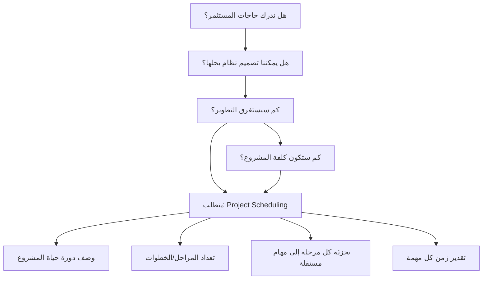

**الشرح:** الأسئلة الأربعة الأولى (خصوصاً السؤالان الأخيران عن الزمن والكلفة) لا يمكن الإجابة عليها بدقة إلا بعد بناء جدولة (`Scheduling`) صحيحة تتضمن العناصر الأربعة الموضحة.

---

#### 📖 الشرح

أي مدير مشروع، قبل ما يبدأ الفريق بكتابة سطر كود واحد، لازم يجاوب على أربعة أسئلة بالترتيب: هل فهمنا فعلاً إيش يبي المستثمر (`Investor`/`Stakeholder`)؟ هل عندنا حل تقني ممكن يحل مشكلته؟ كم راح ياخذ الوقت؟ وكم راح تكلف الشركة؟

السؤالان الأخيران (الزمن والكلفة) هم الصعبين، ولا يمكن الإجابة عليهم بدقة إلا من خلال جدولة (`Project Scheduling`) منظمة تصف دورة حياة التطوير، وتقسّم المشروع لمراحل، ثم لمهام مستقلة صغيرة يمكن تقدير زمن كل واحدة منها على حدة.

هذا يشبه بناء بيت: ما تقدر تقول للزبون "البيت راح يكلف كذا ويخلص بعد شهرين" إلا لو قسمت العمل إلى خطوات صغيرة (حفر أساس، بناء جدران، كهرباء...) وقدّرت زمن كل خطوة.

#### 🎯 الملخص السريع
- 4 أسئلة أساسية: الفهم، إمكانية الحل، الزمن، الكلفة
- الزمن والكلفة يحتاجان جدولة (`Scheduling`) منظمة
- الجدولة = وصف دورة الحياة + مراحل + مهام + تقدير زمن

#### 📚 التطبيق
هذه الأسئلة هي الأساس الذي تُبنى عليه كل عملية الجدولة والتقدير في بقية المحاضرة.

#### 📄 النص الأصلي من المحاضرة
<details>
<summary>عرض النص الأصلي (coverage: 100%)</summary>

> "هل ندرك حاجات المستثمر؟ هل يمكننا تصميم نظام يحل مشكلات المستثمر؟ كم سيستغرق تطوير النظام؟ كم ستكون كلفة المشروع؟ الإجابة على السؤالين الأخيرين تتطلب جدولة جيدة للمشروع: وصف دورة حياة التطوير للمشروع، تعداد المراحل أو الخطوات للمشروع، تجزئة كل مرحلة إلى عدد من المهام المستقلة، وصف وتمثيل للتفاعلات بين المهام وتقدير الزمن الذي تستغرقه كل مهمة."

**ملاحظة على التغطية:**
- ✓ تم شرح كل نقطة كما وردت
- ℹ️ إضافة من الدليل: تشبيه بناء البيت

</details>

---

### 2. مصطلحات الجدولة: Activity, Milestone, Precursor, Duration
<!-- @type: fact -->
<!-- @render: {type: "diagram-first", coverage: "100%"} -->
<!-- @connectivity: {prerequisite: "1"} -->

#### 📍 أين نحن الآن؟
نتعلم المصطلحات الأساسية التي ستُستخدم في كل الجدولة والتقدير بعدها.

#### ⬅️ الربط مع السابق
بعد ما عرفنا أن الجدولة تحتاج تحديد المهام، نحتاج نعرّف بالضبط إيش تعني كلمة "مهمة" وما يرتبط بها.

#### 💡 الفكرة الأساسية
**فهم حاجات المستثمر يتم بتعداد كل مخرجات المشروع (وثائق، وظائف، أنظمة فرعية، أمن وأداء)، ثم تحديد `Activity` (مهمة تستغرق وقتاً) و`Milestone` (نقطة زمنية تكون فيها المهمة قد اكتملت).**

---

#### 📊 المخطط: المصطلحات الأساسية

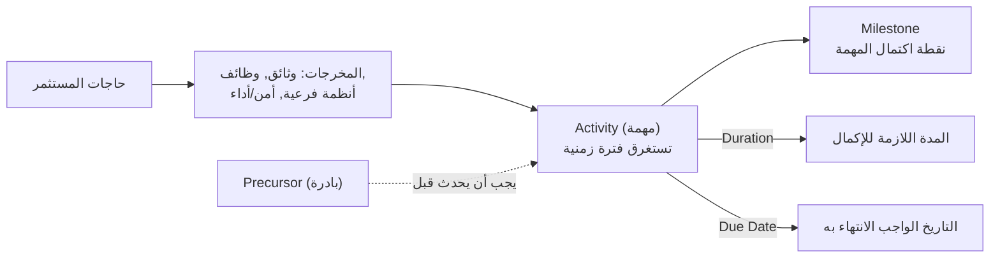

**الشرح:** كل `Activity` قد يسبقها `Precursor` (حدث لازم يحصل قبلها)، ولها `Duration` (مدة تنفيذها) و`Due Date` (موعد نهائي)، وتنتهي عند `Milestone`.

---

#### 📖 التعريف الدقيق

- **`Precursor` (بادرة):** حدث أو مجموعة أحداث يجب أن تحدث حتى تبدأ مهمة ما (أو قبل بدايتها).
- **`Duration` (المدة):** الفترة الزمنية اللازمة لإكمال المهمة.
- **`Due Date`:** التاريخ الذي يجب أن تكون المهمة قد انتهت بحلوله.
- **`Activity` (المهمة):** جزء من المشروع يستغرق فترة زمنية.
- **`Milestone`:** النقطة الزمنية التي تكون فيها المهمة قد اكتملت (لا تستغرق زمناً، هي نقطة).

#### 🎯 الملخص السريع
- `Precursor` = شرط مسبق قبل بدء المهمة
- `Duration` = كم تستغرق المهمة
- `Due Date` = آخر موعد للانتهاء
- `Activity` = عمل يستغرق زمناً | `Milestone` = نقطة اكتمال

#### 📚 التطبيق
هذه المصطلحات هي "قاموس" الجدولة، وستُستخدم في بناء مخطط `Phase → Step → Activity` في القسم التالي.

#### ⚠️ أخطاء شائعة

#### الفهم الخاطئ ❌:
كثير من الطلاب يخلطون بين `Activity` و`Milestone` ويظنون أنهما نفس الشيء.

#### الفهم الصحيح ✅:
`Activity` يستغرق وقتاً (مثلاً "حفر الأساس" يأخذ 3 أيام)، أما `Milestone` فهو نقطة لحظية تُعلن اكتمال المهمة (مثلاً "تم الانتهاء من حفر الأساس") — لا يوجد لها مدة زمنية.

#### 📄 النص الأصلي من المحاضرة
<details>
<summary>عرض النص الأصلي (coverage: 100%)</summary>

> "فهم واستيعاب حاجات المستثمر من خلال تعداد جميع منتجات (مخرجات) المشروع مثل: الوثائق، الوظائف، الأنظمة الفرعية، الوثوقية والأداء والأمن. تحديد ما يسمى بالمهام (activity وهي جزء من المشروع يستغرق فترة زمنية) وكذلك تحديد milestone وهي النقطة الزمنية والتي تكون فيها المهمة قد اكتملت. Precursor (بادرة): حدث أو مجموعة أحداث يجب أن تحدث حتى أو قبل تبدأ مهمة ما. Duration (المدة): الفترة الزمنية اللازمة لإكمال المهمة. Due date وهو التاريخ الذي يجب بحلوله أن تكون المهمة قد انتهت."

</details>

---

### 3. جدولة المشروع: Phase → Step → Activity
<!-- @type: fact -->
<!-- @render: {type: "diagram-first", coverage: "100%"} -->
<!-- @connectivity: {prerequisite: "2"} -->

#### 📍 أين نحن الآن؟
ننتقل من المصطلحات المفردة إلى البنية الهرمية الكاملة للمشروع.

#### ⬅️ الربط مع السابق
بعد تعريف `Activity` و`Milestone`، الآن نرى كيف تترتب هذه المهام هرمياً داخل المشروع.

#### 💡 الفكرة الأساسية
**المشروع يُقسَّم هرمياً إلى: Project → Phases (مراحل) → Steps (خطوات) → Activities (مهام). كل نشاط ينتهي بـ Milestone.**

---

#### 📊 المخطط: البنية الهرمية للمشروع

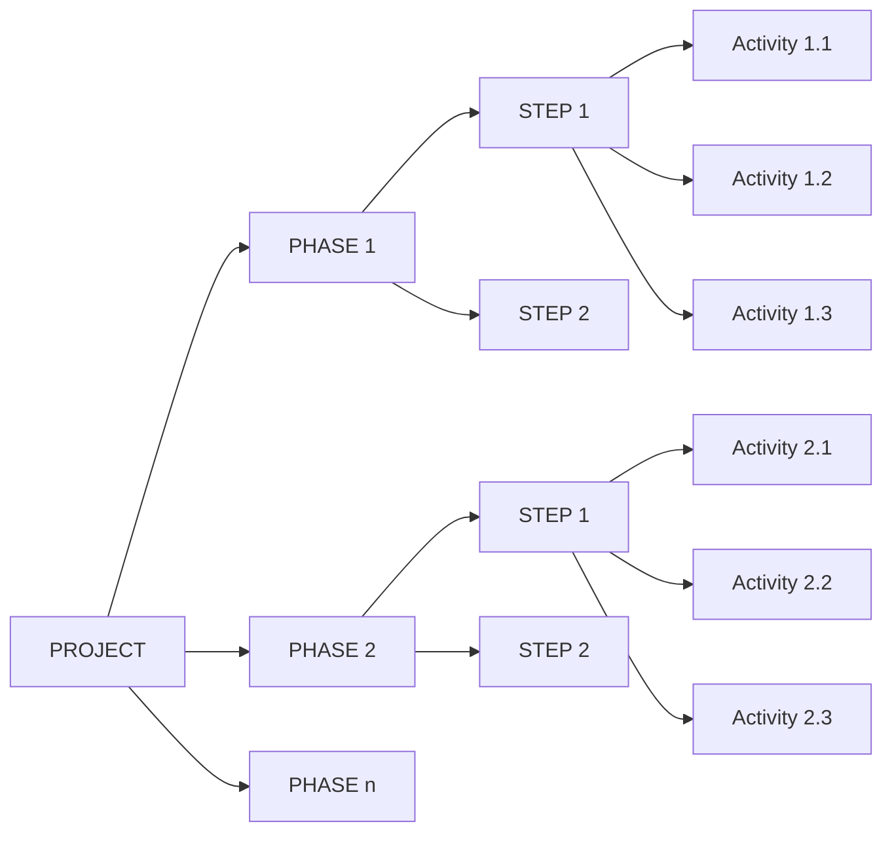

**الشرح:** المشروع (`Project`) يتفرع إلى مراحل (`Phase`)، وكل مرحلة تتفرع إلى خطوات (`Step`)، وكل خطوة تتكون من عدة مهام (`Activity`) — هرم واضح من العام إلى الجزء الصغير القابل للتقدير الزمني.

---

#### 📊 المخطط: مثال تطبيقي — بناء بيت

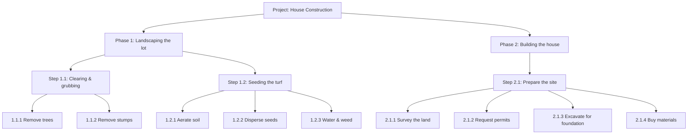

**الشرح:** مثال حقيقي من المحاضرة — بناء بيت له مرحلتان رئيسيتان (تجهيز الأرض، بناء البيت)، وكل مرحلة تتفرع لخطوات، وكل خطوة لأنشطة محددة قابلة للتنفيذ والتقدير الزمني.

---

#### 📖 الشرح

فكر في المشروع مثل شجرة: الجذع هو المشروع نفسه (`Project`)، الأغصان الكبيرة هي المراحل (`Phases`)، الأغصان الفرعية هي الخطوات (`Steps`)، والأوراق هي المهام (`Activities`) — وهي أصغر وحدة عمل يمكن تقدير زمنها وإسنادها لشخص محدد.

في المثال الحقيقي (بناء بيت)، `Phase 1` هو "تجهيز الأرض" و`Phase 2` هو "بناء البيت". كل `Phase` له عدة `Steps`، مثل "تنظيف الأرض" ثم "زراعة العشب" ثم "زراعة الشجيرات". وكل `Step` له `Activities` دقيقة مثل "إزالة الأشجار" و"إزالة الجذوع".

هذا التقسيم الهرمي هو أساس ما يُسمى لاحقاً `Work Breakdown Structure (WBS)`.

#### 🎯 الملخص السريع
- الترتيب الهرمي: `Project → Phase → Step → Activity`
- كل مرحلة (`Phase`) تحتوي عدة خطوات (`Step`)
- كل خطوة تحتوي عدة مهام (`Activity`)
- المهام هي أصغر وحدة قابلة للتقدير والإسناد

#### 📚 التطبيق
هذا التقسيم يُستخدم لاحقاً في `Work Breakdown Structure` و`Activity Graph` لبناء مخطط الشبكة الزمني للمشروع كاملاً.

#### 📄 النص الأصلي من المحاضرة
<details>
<summary>عرض النص الأصلي (coverage: 100%)</summary>

> "PROJECT → PHASE 1, PHASE 2, ... PHASE n → كل Phase له STEP 1, STEP 2 ... → كل Step له ACTIVITY 1.1, ACTIVITY 1.2 ... مثال: Phase 1: Landscaping the lot (Step 1.1: Clearing and grubbing, Activity 1.1.1: Remove trees, Activity 1.1.2: Remove stumps, Step 1.2: Seeding the turf...) Phase 2: Building the house (Step 2.1: Prepare the site, Activity 2.1.1: Survey the land...) Milestones: 1.1.1 xxx, 1.1.2 xxx..."

</details>

---

### 4. تجزئة العمل ومخطط المهام (WBS & Activity Graph)
<!-- @type: fact -->
<!-- @render: {type: "diagram-first", visualization: "flowchart", coverage: "100%"} -->
<!-- @connectivity: {prerequisite: "3"} -->

#### 📍 أين نحن الآن؟
بعد بناء الهرم النصي (Phase/Step/Activity)، نحوّله الآن إلى مخطط شبكي (`Network Diagram`) يوضح العلاقات والتسلسل بين المهام.

#### ⬅️ الربط مع السابق
نفس المهام التي عددناها في القسم السابق، لكن الآن نرسم كيف ترتبط ببعضها زمنياً (أيهم يجب أن يسبق أيهم).

#### 💡 الفكرة الأساسية
**`Work Breakdown` هو وصف لبنية المشروع كمجموعة أعمال مستقلة، أما `Activity Graph` (مخطط المهام) فيصف العلاقات بينها: العُقد (`nodes`) تمثل `Milestones`، والخطوط تمثل `Activities` المُضمَّنة بينها.**

---

#### 📊 المخطط: مخطط المهام (Activity Graph) لمشروع بناء البيت

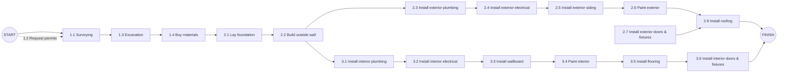

**شرح العناصر:**
- **العُقد الدائرية (`START`, `FINISH`):** نقاط `Milestone` تمثل بداية ونهاية المشروع.
- **الصناديق (`1.1, 1.2, ...`):** كل صندوق يمثل `Activity` واحدة.

**شرح الروابط:**
- **السهم من نشاط لآخر:** يعني أن النشاط الأول يجب أن ينتهي (أو يُعتبر `Precursor`) قبل أن يبدأ الثاني.
- **تفرّع الأسهم:** يعني أن عدة أنشطة يمكن أن تبدأ بالتوازي بعد اكتمال نشاط واحد (مثلاً بعد "بناء الجدران الخارجية" يمكن البدء بالسباكة الداخلية والخارجية معاً).

**التطبيق في هذا السياق:** هذا المخطط هو الأساس الذي تُبنى عليه لاحقاً حسابات `Critical Path Method (CPM)`.

---

#### 📖 الشرح

`Work Breakdown` (تجزئة العمل) يعني وصف المشروع كمجموعة من الأعمال المستقلة عن بعضها — أي أننا نستطيع إسناد كل نشاط لشخص أو فريق مختلف. أما `Activity Graph` (مخطط المهام) فهو تمثيل بصري لهذه الأعمال يوضح: أيهم يعتمد على أيهم (`dependencies`)، وأيهم يمكن تنفيذه بالتوازي مع غيره.

في المخطط، العُقد (`nodes`) تمثل النقاط الزمنية المسماة `milestones` (بداية/نهاية مهمة)، بينما الخطوط الواصلة بين العُقد تمثل `Activities` المُضمَّنة — أي العمل الفعلي المستغرق للوقت.

#### 🎯 الملخص السريع
- `Work Breakdown` = تقسيم المشروع لأعمال مستقلة
- `Activity Graph` = مخطط يوضح العلاقات بين المهام
- العُقد (`nodes`) = `milestones` | الخطوط = `Activities`
- بعض المهام يمكن تنفيذها بالتوازي (تفرعات المخطط)

#### 📚 التطبيق
بدون هذا المخطط، لا يمكن حساب `Critical Path` (المسار الحرج) لاحقاً — لأنه يعتمد بالكامل على معرفة ترتيب واعتماديات المهام.

#### 📄 النص الأصلي من المحاضرة
<details>
<summary>عرض النص الأصلي (coverage: 100%)</summary>

> "تجزئة العمل: وصف لبنية المشروع على شكل مجموعة من الأعمال المستقلة. مخطط المهام يصف العلاقات بين مجموعة المهام حيث تمثل العقد nodes النقاط المسماة milestone وتمثل الخطوط المهام المضمنة."

</details>

---

### 5. تقدير الزمن بالأيام لكل نشاط
<!-- @type: fact -->
<!-- @render: {type: "diagram-first", coverage: "100%"} -->
<!-- @connectivity: {prerequisite: "4"} -->

#### 📍 أين نحن الآن؟
بعد رسم مخطط المهام، نضيف عليه رقماً لكل نشاط: كم يوماً يستغرق.

#### ⬅️ الربط مع السابق
نفس مخطط المهام السابق، لكن كل خط عليه الآن قيمة زمنية (`Time Estimate`).

#### 💡 الفكرة الأساسية
**كل `Activity` في مخطط المهام يُقدَّر له زمن بالأيام، وهذه القيم هي المدخلات الأساسية لحساب `Critical Path` لاحقاً.**

---

#### 📊 المخطط: تقدير مدة الإكمال على مخطط المهام

```mermaid
graph LR
    Start((START)) -->|"1.2 = 15"| A1["1.1 Surveying = 3"]
    A1 -->|"1.3 = 10"| A3["Excavation"]
    A3 -->|"1.4 = 10"| A4["Buy materials"]
    A4 -->|"2.1 = 15"| B22["2.2 Build wall = 20"]
    B22 -->|"2.3 = 10"| B23["Ext. plumbing"]
    B23 -->|"2.4 = 10"| B24["Ext. electrical"]
    B24 -->|"2.5 = 8"| B25["Ext. siding"]
    B25 -->|"2.6 = 5"| B26["Paint exterior"]
    B22 -->|"3.1 = 15"| B32["3.2 Interior electrical = 9"]
    B32 -->|"3.3 = 9"| B33["Wallboard"]
    B33 -->|"3.4 = 18"| B34["Paint interior"]
    B34 -->|"3.5 = 11"| B35["Flooring"]
    B26 -->|"2.7 = 6"| B27["Doors & fixtures"]
    B27 -->|"2.8 = 9"| Finish((FINISH))
    B35 -->|"3.6 = 7"| Finish
```

**الشرح:** الأرقام على كل سهم هي `Duration` بالأيام لكل نشاط، مأخوذة مباشرة من جدول تقدير الزمن.

---

#### 📖 الشرح

جدول تقدير الزمن أدناه هو نفس قائمة الأنشطة من الأقسام السابقة، لكن مع عمود إضافي: `Time estimate (in days)`. هذا الجدول هو المدخل الأساسي لأي حساب لاحق (`Critical Path`, `Gantt Chart`).

| Activity | Time estimate (days) |
| --- | --- |
| 1.1 Survey the land | 3 |
| 1.2 Request permits | 15 |
| 1.3 Excavate for the foundation | 10 |
| 1.4 Buy materials | 10 |
| 2.1 Lay the foundation | 15 |
| 2.2 Build the outside walls | 20 |
| 2.3 Install exterior plumbing | 10 |
| 2.4 Exterior electrical work | 10 |
| 2.5 Exterior siding | 8 |
| 2.6 Paint the exterior | 5 |
| 2.7 Install doors and fixtures | 6 |
| 2.8 Install roof | 9 |
| 3.1 Install the interior plumbing | 12 |
| 3.2 Install interior electrical work | 15 |
| 3.3 Install wallboard | 9 |
| 3.4 Paint the interior | 18 |
| 3.5 Install floor covering | 11 |
| 3.6 Install doors and fixtures | 7 |

#### 🎯 الملخص السريع
- كل نشاط له تقدير زمني بالأيام
- هذه القيم = مدخل لحساب `CPM` و`Gantt Chart`
- الأرقام توضع على أسهم مخطط المهام مباشرة

#### 📚 التطبيق
بدون هذا الجدول لا يمكن حساب `Earliest Start`, `Latest Start`, `Slack`, أو `Critical Path` في القسم التالي.

#### 📄 النص الأصلي من المحاضرة
<details>
<summary>عرض النص الأصلي (coverage: 100%)</summary>

> [جدول "تقدير الزمن بالأيام" الكامل، من Activity 1.1 إلى Activity 3.6، مع عمود Time estimate]

</details>

---

### 6. طريقة المسار الحرج (Critical Path Method - CPM)
<!-- @type: fact -->
<!-- @render: {type: "diagram-first", coverage: "100%"} -->
<!-- @connectivity: {prerequisite: "5"} -->

#### 📍 أين نحن الآن؟
بعد أن أصبح لدينا مخطط مهام مع أزمنة، نستخدمه الآن لإيجاد أقل مدة ممكنة لإنهاء المشروع كاملاً.

#### ⬅️ الربط مع السابق
نستخدم نفس مخطط المهام والأزمنة من القسم السابق لحساب `Earliest Start`, `Latest Start`, و`Slack` لكل نشاط.

#### 💡 الفكرة الأساسية
**`CPM` هو الحد الأدنى للمدة الزمنية اللازمة لإنهاء المشروع، ويحدد أكثر المهام حرجاً — وهي المهام التي `Slack` الخاص بها يساوي صفر.**

---

#### 📊 المخطط: مفاهيم الزمن في CPM

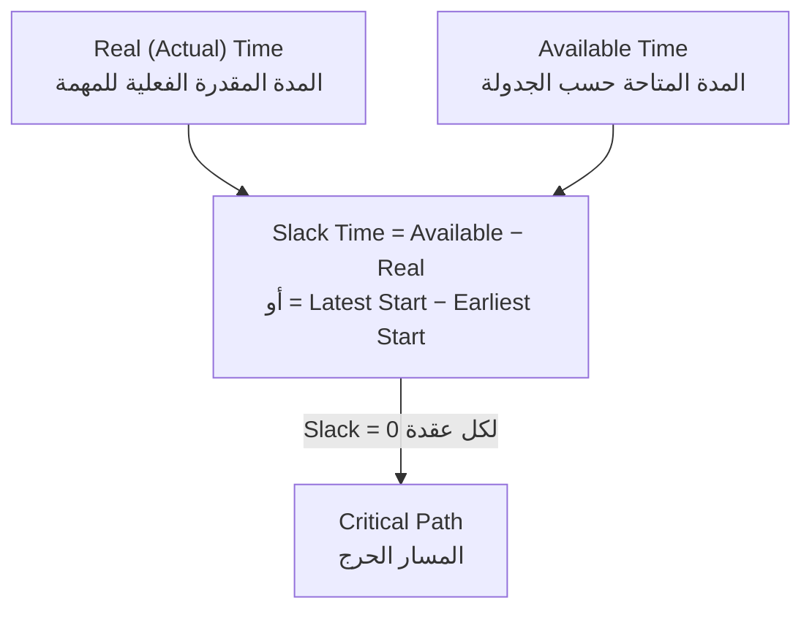

**الشرح:** `Slack` هو الفرق بين الوقت المتاح والوقت الفعلي اللازم للمهمة. أي مهمة `Slack` عندها صفر تقع على `Critical Path` — أي تأخيرها يؤخر المشروع كله.

---

#### 📖 الشرح المفاهيمي

- **`Real (Actual) time`:** المدة المقدَّرة واللازمة فعلياً لإكمال المهمة.
- **`Available time`:** المدة الزمنية المتوفرة أو المتاحة للمهمة حسب الجدولة العامة.
- **`Slack time`:** الفرق بين المدتين السابقتين، ويُحسب بطريقتين متكافئتين:
  - `Slack = Available − Real`
  - `Slack = Latest start − Earliest start`
- **`Critical path`:** المسار الذي يكون فيه `Slack time` عند كل عقدة يساوي **صفر**. هذا يعني أن أي تأخير في أي مهمة على هذا المسار يؤخر المشروع بأكمله مباشرة.

#### 📊 جدول: Earliest/Latest Start و Slack (مثال بناء البيت)

| Activity | Earliest start | Latest start | Slack |
| --- | --- | --- | --- |
| 1.1 | 1 | 13 | 12 |
| 1.2 | 1 | 1 | **0** |
| 1.3 | 16 | 16 | **0** |
| 1.4 | 26 | 26 | **0** |
| 2.1 | 36 | 36 | **0** |
| 2.2 | 51 | 51 | **0** |
| 2.3 | 71 | 83 | 12 |
| 2.4 | 81 | 93 | 12 |
| 2.5 | 91 | 103 | 12 |
| 2.6 | 99 | 111 | 12 |
| 2.7 | 104 | 119 | 15 |
| 2.8 | 104 | 116 | 12 |
| 3.1 | 71 | 71 | **0** |
| 3.2 | 83 | 83 | **0** |
| 3.3 | 98 | 98 | **0** |
| 3.4 | 107 | 107 | **0** |
| 3.5 | 107 | 107 | **0** |
| 3.6 | 118 | 118 | **0** |
| Finish | 124 | 124 | **0** |

**قراءة الجدول:** الأنشطة التي `Slack = 0` (مثل 1.2 → 1.3 → 1.4 → 2.1 → 2.2 → 3.1 → 3.2 → 3.3 → 3.4 → 3.5 → 3.6) تشكّل معاً **المسار الحرج** — وهي المسار الداخلي (تجهيز السباكة والكهرباء الداخلية) وليس المسار الخارجي (السباكة الخارجية) رغم أنه يبدو "الأهم" ظاهرياً.

#### 🎯 الملخص السريع
- `Slack = 0` → المهمة على المسار الحرج
- تأخير أي مهمة حرجة = تأخير المشروع كله
- المهام ذات `Slack` موجب لديها "مرونة" في التوقيت دون التأثير على تاريخ الانتهاء الكلي

#### 📚 التطبيق
مدير المشروع يركّز موارده وانتباهه على المهام الحرجة (`Slack = 0`) لأنها الأكثر خطورة على الجدول الزمني الكلي.

#### ⚠️ أخطاء شائعة

#### الفهم الخاطئ ❌:
يظن البعض أن أطول نشاط منفرد هو الأهم أو الأكثر حرجاً في المشروع.

#### الفهم الصحيح ✅:
الأهمية لا تُقاس بطول المهمة نفسها، بل بقيمة `Slack` الخاصة بها. مهمة قصيرة جداً بـ `Slack = 0` أكثر خطورة من مهمة طويلة لكن لديها مرونة زمنية كبيرة.

#### 📄 النص الأصلي من المحاضرة
<details>
<summary>عرض النص الأصلي (coverage: 100%)</summary>

> "CPM: الحد الأدنى للمدة الزمنية اللازمة لإنهاء المشروع. تحديد المهام الأكثر حرجاً في إنهاء المشروع ضمن الفترة الزمنية المحددة. Real (Actual) time: المدة المقدرة واللازمة لإكمال المهمة. Available time: المدة الزمنية المتوفرة أو المتاحة حسب الجدولة لإكمال المهمة. Slack time: الفرق بين المدتين السابقتين... Slack = available – real Or Slack = latest start – earliest start. Critical path ويكون فيه المقدار time slack عند كل عقدة هو صفر." + [جدول Earliest/Latest start/Slack كاملاً]

</details>

---

### 7. مخطط Gantt
<!-- @type: fact -->
<!-- @render: {type: "diagram-first", coverage: "100%"} -->
<!-- @connectivity: {prerequisite: "6"} -->

#### 📍 أين نحن الآن؟
بعد حساب `Critical Path`، نعرض كل هذه المعلومات بصرياً بطريقة سهلة القراءة لأي شخص في الفريق.

#### ⬅️ الربط مع السابق
`Gantt Chart` هو الشكل البصري النهائي لكل بيانات الجدولة والزمن التي جهزناها في الأقسام السابقة.

#### 💡 الفكرة الأساسية
**مخطط `Gantt` يعرض الأنشطة على خط زمني (شهور/أسابيع) ويساعد في بيان المهام التي يمكن أن تُنفذ بالتوازي مع بعضها البعض.**

---

#### 📊 المخطط: تمثيل مبسّط لمخطط Gantt

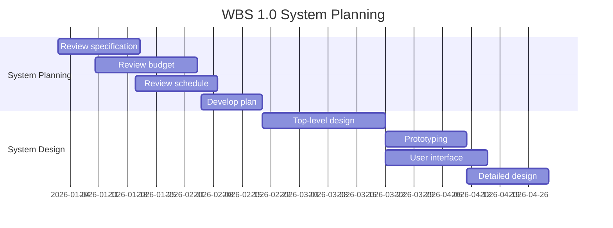

**الشرح:** كل شريط أفقي يمثل نشاطاً ومدته على خط الزمن (شهور)؛ الأشرطة المتداخلة أفقياً (مثل `Prototyping` و`User interface`) تعني أنه يمكن تنفيذها بالتوازي.

---

#### 📖 الشرح

مخطط `Gantt` هو الأداة الأشهر لعرض جدول المشروع بصرياً: المحور الأفقي يمثل الزمن (شهور مثلاً `JAN, FEB, MAR...`)، وكل سطر يمثل نشاطاً برمزه (`Activity number`) وشريطاً يبين بدايته ونهايته. الرموز الإضافية توضح: الجزء المكتمل (`Completed`)، المدة (`Duration`)، الوقت الإضافي المتاح (`Float`)، ما إذا كان النشاط حرجاً (`Critical`)، والتأخير (`Slippage`).

أهم ميزة في `Gantt` أنه يساعد في بيان المهام التي يمكن أن تُنفذ مع بعضها البعض (بالتوازي)، وهذا يسهّل على مدير المشروع توزيع الموارد بكفاءة.

#### 🎯 الملخص السريع
- `Gantt` = عرض بصري للأنشطة على خط زمني
- يوضح الأنشطة المتوازية بصرياً بسهولة
- يستخدم رموز موحدة: مكتمل / حرج / متأخر / نقاط بداية ونهاية

#### 📚 التطبيق
`Gantt Chart` هو ما يعرضه مدير المشروع في الاجتماعات الأسبوعية لمتابعة التقدم الفعلي مقابل المخطط له.

#### 📄 النص الأصلي من المحاضرة
<details>
<summary>عرض النص الأصلي (coverage: 90%)</summary>

> "مخطط Gantt يساعد في بيان المهام التي يمكن أن تُنفذ مع بعضها البعض." + [صورة مخطط Gantt يوضح WBS 1.0 System Planning وWBS 2.0 System Design مع رموز Completed/Duration/Float/Critical/Slippage/Start-Finish task]

**ملاحظة على التغطية:**
- ✓ الفكرة الأساسية والرموز موضحة
- ℹ️ إضافة من الدليل: كود Mermaid gantt توضيحي (المخطط الأصلي صورة وليس بيانات رقمية)

</details>

---

### 8. فريق التطوير وتنظيم المشروع
<!-- @type: practice -->
<!-- @render: {type: "diagram-first", coverage: "100%"} -->
<!-- @connectivity: {prerequisite: "7"} -->

#### 📍 أين نحن الآن؟
بعد جدولة المشروع زمنياً، ننتقل للعنصر البشري: من سينفذ هذه المهام؟

#### ⬅️ الربط مع السابق
الجدولة والتقدير الزمني عديمة الفائدة بدون فريق مناسب ينفذها.

#### 💡 الفكرة الأساسية
**نجاح المشروع يعتمد على إسناد المهام المناسبة للأشخاص المناسبين، مع مراعاة معايير محددة عند الاختيار، وتنظيم واضح للتواصل داخل الفريق.**

---

#### 📊 المخطط: تنظيم فريق المشروع (Chief Programmer Team)

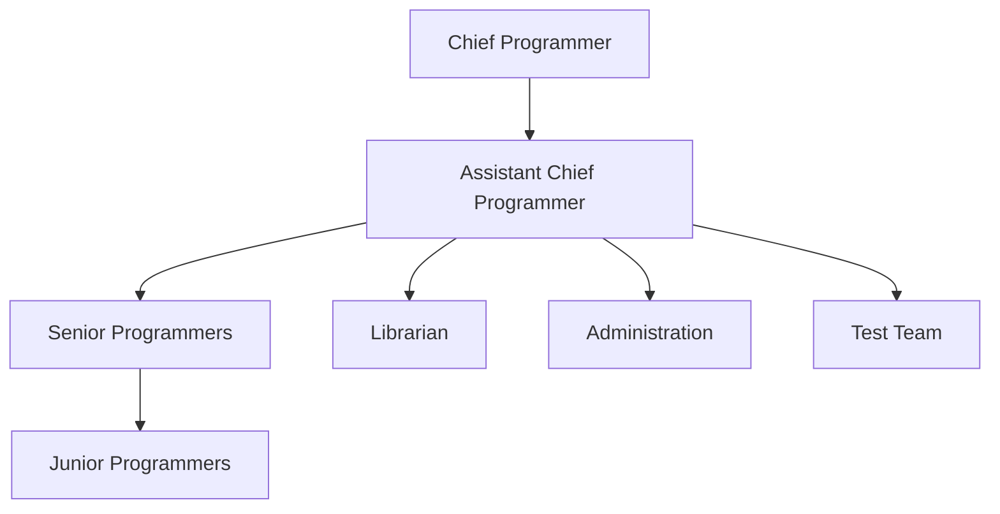

**شرح العناصر:**
- **`Chief Programmer`:** رأس الهرم، القرارات التقنية الكبرى.
- **`Assistant Chief Programmer`:** يدير التواصل بين الرئيس وباقي الفريق.
- **`Senior/Junior Programmers`:** فريق التنفيذ الفعلي.
- **`Librarian, Administration, Test Team`:** أدوار داعمة (توثيق، إدارة، اختبار).

**شرح الروابط:** كل عضو يتواصل غالباً مع رئيسه المباشر، وليس بالضرورة مع بقية الأعضاء — أي التواصل هرمي وليس أفقياً بالكامل.

---

#### 📖 الشرح

المهام الأساسية التي تتطلب مشاركة بشرية في أي مشروع برمجي هي: تحليل المتطلبات، تصميم النظام، تصميم البرنامج، تحقيق (تنفيذ) البرنامج، الاختبار، التدريب، الصيانة، والجودة. كل هذه المهام يحتاج إسنادها لأشخاص مناسبين.

عند انتقاء الأشخاص، يجب مراعاة عدة نقاط: القدرة على تنفيذ العمل، مدى الاهتمام بالعمل، الخبرة (بتطبيقات مشابهة، وبأدوات ولغات وتقنيات معينة)، التدريب المتاح، القدرة على التواصل مع الآخرين، ومهارات الإدارة.

من ناحية التنظيم، كل عضو في الفريق غالباً ما يتواصل مع رئيسه المباشر، لكن ليس بالضرورة مع بقية الأعضاء — وهذا يُقلل من التشتت لكنه يزيد الحمل على الروابط الهرمية العليا (مثل `Assistant Chief Programmer`).

#### 🎯 الملخص السريع
- 8 مهام أساسية: تحليل، تصميم نظام، تصميم برنامج، تنفيذ، اختبار، تدريب، صيانة، جودة
- معايير الاختيار: القدرة، الاهتمام، الخبرة، التدريب، التواصل، مهارات الإدارة
- التنظيم هرمي: كل عضو يتواصل مع رئيسه بشكل أساسي

#### 📚 التطبيق
هذا التنظيم يحدد مسارات اتخاذ القرار وتدفق المعلومات، وهو جزء من `Project Plan` النهائي (قسم `Team Organization`).

#### ⚠️ أخطاء شائعة

#### الفهم الخاطئ ❌:
يظن البعض أن اختيار الفريق يعتمد فقط على الخبرة التقنية البحتة.

#### الفهم الصحيح ✅:
الخبرة عنصر واحد فقط من ستة معايير؛ التواصل ومهارات الإدارة لا تقل أهمية، خاصة في الفرق الكبيرة.

#### 📄 النص الأصلي من المحاضرة
<details>
<summary>عرض النص الأصلي (coverage: 100%)</summary>

> "المهام الأساسية التي تتطلب مشاركة بشرية: تحليل المتطلبات، تصميم النظام، تصميم البرنامج، تحقيق البرنامج، الاختبار، التدريب، الصيانة، الجودة. تبرز أهمية الفريق عند إسناد المهام المناسبة للأشخاص المناسبين... القدرة على تنفيذ العمل، مدى الاهتمام بالعمل، الخبرة، تطبيقات مشابهة، أدوات لغات تقنيات، التدريب، القدرة على التواصل مع الآخرين، مهارات الإدارة. كل عضو في الفريق غالباً ما يجب أن يتواصل مع رئيسه، ولكن ليس بالضرورة مع الأعضاء الآخرين."

</details>

---

### 9. تقدير الجهد والكلفة (Cost & Effort Estimation)
<!-- @type: practice -->
<!-- @render: {type: "diagram-first", coverage: "100%"} -->
<!-- @connectivity: {prerequisite: "8"} -->

#### 📍 أين نحن الآن؟
ننتقل من "من ينفذ" إلى "كم سيكلف" — أحد أصعب جوانب إدارة المشاريع البرمجية.

#### ⬅️ الربط مع السابق
بعد تحديد الفريق، تقدير الكلفة يعتمد جزئياً على حجم هذا الفريق ونوعيته.

#### 💡 الفكرة الأساسية
**تقدير الكلفة من أصعب المسائل في إدارة المشاريع البرمجية، ويجب أن يتم في أبكر وقت ممكن، ثم يُعاد بشكل تكراري كلما تقدم المشروع لأن دقة التقدير تتحسن مع الوقت.**

---

#### 📊 المخطط: أنواع الكلف

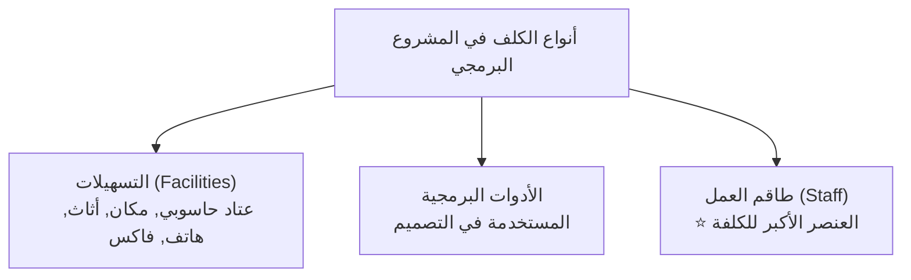

**الشرح:** ثلاثة أنواع رئيسية من الكلف، وطاقم العمل هو العنصر الأكبر تأثيراً على الكلفة الإجمالية دائماً.

---

#### 📊 المخطط: تحسّن دقة التقدير بمرور مراحل المشروع

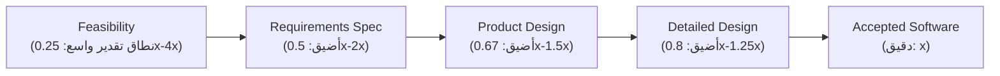

**الشرح:** الشك في بداية المشروع (مرحلة `Feasibility`) كبير جداً فيؤثر على دقة الكلفة والحجم، ثم يضيق نطاق عدم اليقين تدريجياً كلما تقدمنا في مراحل المشروع حتى نصل للكلفة الفعلية الدقيقة.

---

#### 📖 الشرح

تقدير الكلفة يجب أن يتم بشكل تكراري (`iterative`) وليس مرة واحدة فقط، لأن الشك في بداية المشروع يجعل نطاق التقدير واسعاً جداً (قد يصل الحجم الفعلي إلى 4 أضعاف التقدير الأولي أو ربعه فقط). كلما تقدم المشروع عبر مراحله (`Feasibility → Requirements → Product Design → Detailed Design → Accepted Software`) يضيق هذا النطاق تدريجياً حتى يصبح التقدير دقيقاً قرب نهاية المشروع.

أما أنواع الكلف الثلاثة فهي: التسهيلات (العتاد الحاسوبي، المكان، الأثاث، الهاتف، الفاكس)، الأدوات البرمجية المستخدمة في التصميم، وطاقم العمل — وهو العنصر الأكبر للكلفة في أي مشروع برمجي تقريباً.

**عوامل مسببة لتقديرات خاطئة:**
- الطلبات المتكررة من المستخدمين من أجل التغيير
- التغاضي أو نسيان بعض المهام
- عدم فهم المستخدم للمتطلبات
- التحليل غير الكافي عند القيام بتقدير الكلفة
- انعدام أو نقص التنسيق بين تطوير النظام والخدمات التقنية والعمليات وبيانات الإدارة خلال مرحلة التطوير
- فقدان الطريقة الدقيقة أو التوجيه الصحيح للتقدير

**عوامل مؤثرة على تقدير الكلفة:**
- تعقيد النظام المقترح
- طلب دمج النظام مع نظام سابق أو حالي
- تعقيد البرنامج في النظام
- حجم النظام (بعدد الوظائف)
- قدرات وعدد أعضاء فريق التطوير
- خبرة الفريق بالتطبيق، لغة البرمجة، العتاد

#### 🎯 الملخص السريع
- الكلفة = تسهيلات + أدوات برمجية + طاقم عمل (الأكبر)
- التقدير يجب أن يكون تكرارياً، يضيق نطاقه مع تقدم المشروع
- 6 عوامل تسبب تقديرات خاطئة، و6 عوامل تؤثر على الكلفة

#### 📚 التطبيق
مدير المشروع يعيد تقدير الكلفة في كل `Milestone` رئيسي، لا يكتفي بالتقدير الأولي.

#### ⚠️ أخطاء شائعة

#### الفهم الخاطئ ❌:
يظن البعض أن تقدير الكلفة يُحسب مرة واحدة في بداية المشروع ولا يتغير.

#### الفهم الصحيح ✅:
التقدير عملية تكرارية؛ يُعاد حسابه في كل مرحلة لأن دقة المعلومات المتوفرة تزداد مع الوقت، وهذا يقلل من نطاق الخطأ المحتمل.

#### 📄 النص الأصلي من المحاضرة
<details>
<summary>عرض النص الأصلي (coverage: 95%)</summary>

> "تقدير الكلفة أحد المسائل الصعبة في عملية الإدارة والتخطيط للمشاريع البرمجية. يجب أن يتم تقدير الكلفة في أبكر وقت ممكن من حياة المشروع. أنواع الكلف: التسهيلات، الأدوات البرمجية، طاقم العمل (العنصر الأكبر للكلفة). تقدير الكلفة يجب أن يتم بشكل تكراري: الشك في بداية المشروع يمكن أن يؤثر على دقة الكلفة وحجم التقديرات." + [مخطط RELATIVE SIZE RANGE عبر PHASES AND MILESTONES] + [قوائم العوامل المسببة للتقديرات الخاطئة والعوامل المؤثرة على تقدير الكلفة]

</details>

---

### 10. طرائق تقدير الجهد
<!-- @type: fact -->
<!-- @render: {type: "diagram-first", coverage: "100%"} -->
<!-- @connectivity: {prerequisite: "9"} -->

#### 📍 أين نحن الآن؟
بعد فهم أنواع الكلف والعوامل المؤثرة، نتعرف الآن على الطرق الفعلية لحساب رقم التقدير.

#### ⬅️ الربط مع السابق
هذه هي "الصيغ الرياضية" العملية لتحويل كل العوامل السابقة إلى رقم كلفة أو جهد فعلي.

#### 💡 الفكرة الأساسية
**توجد عدة طرائق لتقدير الجهد: الاعتماد على خبرة مشاريع سابقة (توزيع بيتا الاحتمالي)، مصفوفة Wolverton، وصيغ رياضية مثل Felix & Watson وBailey & Basili وCOCOMO.**

---

#### 📊 المخطط: أنواع طرائق التقدير

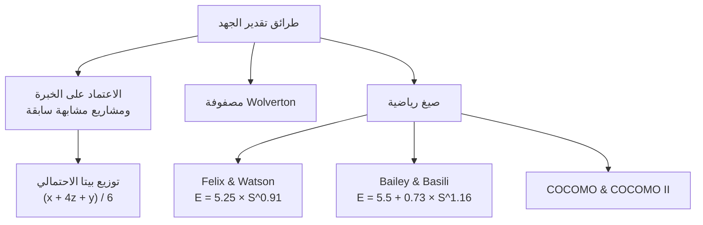

**الشرح:** ثلاثة مسارات رئيسية للتقدير: رأي الخبراء (احتمالي)، مصفوفة تصنيفية (Wolverton)، أو معادلات رياضية جاهزة (COCOMO وغيرها).

---

#### 📖 الشرح

**1. الاعتماد على الخبرة والمشاريع السابقة:** نسأل هل يوجد نظام مشابه بنفس الحجم؟ يمكن سؤال عدد من الخبراء وأخذ ثلاثة آراء: متفائل (`y`)، متشائم (`x`)، وتخمين أكثر احتمالاً (`z`). ثم تُحسب القيمة النهائية بمعادلة **توزيع بيتا الاحتمالي**:

$$\text{Estimate} = \frac{x + 4z + y}{6}$$

**2. مصفوفة Wolverton:** تعتمد على عاملين يؤثران على الصعوبة: هل المسألة قديمة (`O`) أم جديدة (`N`)؟ وهل هي سهلة (`E`)، متوسطة (`M`)، أو صعبة (`H`)؟ يُقابل كل نوع من أنواع البرمجيات (`Control, I/O, Pre/post processor, Algorithm, Data management, Time-critical`) قيمة كلفة لكل سطر برمجي حسب الصعوبة.

**مثال تطبيقي (Wolverton):** نظام مكوّن من ثلاثة أقسام بأحجام 100، 200، 100 سطر (بكلف مختلفة لكل قسم):
$$(100 × 17) + (200 × 35) + (100 × 31) = \$11{,}800$$

**3. صيغ رياضية أخرى:**
- **Felix & Watson:** تعتمد على عوامل الإنتاجية (`productivity factors`)، حيث تُعطى القيمة 1 لكل عامل يزيد الإنتاجية، و0 إن كان يقللها. المعادلة: `E = 5.25 × S^0.91`
- **Bailey & Basili:** `E = 5.5 + 0.73 × S^1.16`
- **COCOMO & COCOMO II:** نماذج معتمدة على عوامل الإنتاجية (29 عاملاً موزعة على: خبرة الفريق، تعقيد الكود، القيود، بيئة العمل...)

#### 🎯 الملخص السريع
- توزيع بيتا: `(x + 4z + y) / 6` من آراء ثلاثة خبراء
- Wolverton: مصفوفة صعوبة (قديم/جديد × سهل/متوسط/صعب)
- Felix & Watson وBailey & Basili وCOCOMO: معادلات أُسّية بناءً على حجم البرنامج `S`

#### 📚 التطبيق
هذه الطرق تُستخدم معاً غالباً: تقدير أولي بالخبرة، ثم تدقيق بمعادلة رياضية مثل `COCOMO` عند توفر تفاصيل أكثر.

#### 📄 النص الأصلي من المحاضرة
<details>
<summary>عرض النص الأصلي (coverage: 90%)</summary>

> "الاعتماد على الخبرة والمشاريع السابقة... متفائل (y)، متشائم (x)، تخمين أكثر احتمالاً (z)، توزيع بيتا الاحتمالي: (x + 4z + y)/6. مصفوفة الكلفة وفق نموذج Wolverton: عاملان يؤثران على الصعوبة: المسألة قديمة O أم جديدة N، هل هي سهلة E متوسطة M صعبة H." + [جدول Wolverton الكامل] + "عندها إذا كان مثلاً النظام من ثلاثة أقسام... (100*17)+(200*35)+(100*31)=$11800" + "طريقة Felix & Watson... E = 5.25*S^0.91، Bailey & Basili E = 5.5+0.73*S^1.16، COCOMO & COCOMO II" + [قائمة الـ 29 عاملاً]

**ملاحظة على التغطية:**
- ✓ الصيغ والمثال العددي مغطاة بالكامل
- ⚠️ لم تُفصّل كل الـ29 عاملاً بشكل مستقل (قائمة طويلة جداً في المصدر)

</details>

---

### 11. إدارة المخاطر: المفاهيم الأساسية
<!-- @type: fact -->
<!-- @render: {type: "diagram-first", coverage: "100%"} -->
<!-- @connectivity: {prerequisite: "10"} -->

#### 📍 أين نحن الآن؟
بعد إتمام الجدولة والتقدير والفريق، ننتقل لموضوع مختلف تماماً: ماذا لو حصل خطأ ما؟

#### ⬅️ الربط مع السابق
كل التقديرات السابقة (زمن، كلفة) مبنية على افتراض أن كل شيء سيسير كما هو مخطط — إدارة المخاطر تتعامل مع الانحرافات عن هذا الافتراض.

#### 💡 الفكرة الأساسية
**`Risk` هو حدث غير مرغوب به وله نتائج سلبية. `Risk Management` هي فهم واستيعاب هذه المخاطر والتحكم بها، وتُقاس بثلاثة عناصر: `Impact` (الخسارة)، `Probability` (الاحتمال)، و`Control` (التحكم).**

---

#### 📊 المخطط: مكوّنات المخاطرة

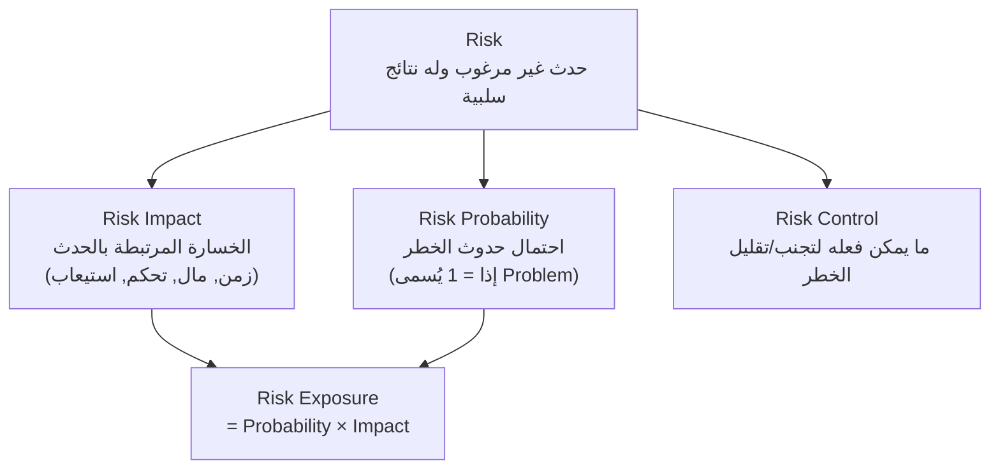

**الشرح:** المخاطرة تُقاس بثلاثة أبعاد؛ الاحتمال والتأثير يُضربان معاً لإنتاج رقم واحد (`Risk Exposure`) يمثل حجم الخطر الفعلي القابل للمقارنة بين المخاطر المختلفة.

---

#### 📖 الشرح

`Risk` (الخطر) هو حدث غير مرغوب به له نتائج سلبية على المشروع، ويختلف عن الأحداث العادية الأخرى بثلاثة مقاييس:

- **`Risk Impact`:** الخسارة المرتبطة بالحدث — قد تكون خسارة في الزمن، المال، التحكم، أو الاستيعاب (مثال: تغيير المتطلبات قد يؤدي لفقد السيطرة على التصميم إن كان منجزاً بالفعل).
- **`Risk Probability`:** احتمال حدوث الخطر. **ملاحظة مهمة:** إذا كان الاحتمال يساوي 1 (أي مؤكد الحدوث)، عندها لا يُسمى `Risk` بل يُسمى `Problem` (مشكلة فعلية وليست احتمالاً).
- **`Risk Control`:** لكل خطر يجب تحديد ما يمكن فعله لتجنبه أو تقليله — مثلاً إذا كانت المتطلبات عرضة للتغيير، نصمم بشكل مرن يسمح بالتعديل لاحقاً.

يُحسب حجم الخطر بمعادلة:
$$\text{Risk Exposure} = \text{Risk Probability} \times \text{Risk Impact}$$

**مثال:** إذا كان احتمال تغيير المتطلبات بعد انتهاء التصميم هو 0.3، وكلفة إعادة التصميم هي $11,000، فإن مقدار الخطر (`Risk Exposure`) = 0.3 × $11,000 = **$3,300**.

#### 🎯 الملخص السريع
- `Risk` ≠ `Problem`: الخطر احتمالي، المشكلة مؤكدة (احتمال = 1)
- `Risk Exposure = Probability × Impact`
- `Risk Control` يعني وضع خطة عملية للتقليل أو التجنب

#### 📚 التطبيق
`Risk Exposure` هو الرقم الذي يُستخدم لاحقاً في ترتيب المخاطر حسب الأولوية (`Risk Prioritization`).

#### ⚠️ أخطاء شائعة

#### الفهم الخاطئ ❌:
يخلط بعض الطلاب بين `Risk` و`Problem` ويستخدمونهما كمترادفين.

#### الفهم الصحيح ✅:
`Risk` احتمالي (قد يحدث أو لا)، بينما `Problem` هو حدث مؤكد الحدوث بالفعل (احتماله = 1) — الفرق جوهري في كيفية التعامل مع كل منهما.

#### 📄 النص الأصلي من المحاضرة
<details>
<summary>عرض النص الأصلي (coverage: 100%)</summary>

> "الخطر risk حدث غير مرغوب به وله نتائج سلبية. إدارة المخاطر risk management فهم واستيعاب المخاطر والتحكم بها... Risk impact: الخسارة المرتبطة بالحدث... Risk probability احتمال حدوث الخطر، إذا كان الاحتمال 1 عندها تسمى problem. Risk control: لكل خطر يجب أن نحدد ما يمكننا القيام به لتجنب أو تقليل الخطر... تحديد حجم أو مقدار الخطر: Risk exposure = risk probability * risk impact. مثلاً إذا كان احتمال تغيير المتطلبات هو 0.3 بعد انتهاء التصميم وكانت كلفة إعادة التصميم هي $11000 عندها يكون مقدار الخطر هو $3300."

</details>

---

### 12. أنواع وتصنيف المخاطر + Risk Checklist
<!-- @type: fact -->
<!-- @render: {type: "diagram-first", coverage: "100%"} -->
<!-- @connectivity: {prerequisite: "11"} -->

#### 📍 أين نحن الآن؟
بعد فهم كيف نقيس المخاطر، نتعلم الآن كيف نصنّفها بحسب مصدرها ونوعها.

#### ⬅️ الربط مع السابق
هذا التصنيف يساعد في التعرّف السريع على مصدر الخطر عند استخدام `Risk Exposure` من القسم السابق.

#### 💡 الفكرة الأساسية
**المخاطر تُصنَّف من ناحية المصدر إلى (عامة/خاصة بالمشروع)، ومن ناحية التأثير إلى (مشروع/منتج/عمل)، ويوجد `Risk Checklist` قياسي بستة أنواع رئيسية.**

---

#### 📊 المخطط: تصنيفات المخاطر

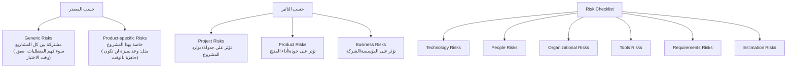

**الشرح:** ثلاثة أطر تصنيفية مختلفة (حسب المصدر، حسب التأثير، وقائمة الفحص الشاملة) تُستخدم معاً للتأكد من عدم إغفال أي نوع من أنواع الخطر.

---

#### 📖 الشرح

**التصنيف حسب المصدر:**
- **`Generic Risks`:** مشتركة بين مختلف المشاريع البرمجية، مثل سوء فهم المتطلبات، عدم تنظيم فريق العمل، أو ضيق الوقت للاختبار.
- **`Product-specific Risks`:** خاصة بمشروع معين، مثل أن ينص المدير على أن البرمجية ستدعم الشبكة بحلول موعد محدد، إلا أن ذلك لن يكون متاحاً بحلول ذلك الوقت.

**التصنيف حسب التأثير:**
- **`Project Risks`:** تؤثر على جدولة أو موارد المشروع (مثال: عدم وجود مصمم ذو خبرة).
- **`Product Risks`:** تؤثر على جودة وأداء المنتج البرمجي (مثال: فشل في شراء مكوّن مناسب أو بطيء الأداء خلافاً لما كان متوقعاً).
- **`Business Risks`:** تؤثر على المؤسسة أو الشركة البرمجية (مثال: إنتاج شركة منافسة لمنتج جديد).

**`Risk Checklist` (قائمة الفحص) بحسب النوع:**

| النوع | مصدره | أمثلة من المحاضرة |
| --- | --- | --- |
| `Technology` | تقنية العتاد والبرمجيات المستخدمة | قاعدة البيانات لا تعالج المعاملات بالسرعة المتوقعة؛ مكونات معاد استخدامها بها عيوب |
| `People` | أفراد فريق التطوير | استحالة توظيف كوادر بالمهارات المطلوبة؛ غياب موظفين رئيسيين وقت الحاجة |
| `Organizational` | البيئة المؤسساتية | إعادة هيكلة الإدارة أثناء المشروع؛ مشاكل مالية تجبر تقليص الميزانية |
| `Tools` | الأدوات البرمجية | كود مولّد غير فعّال؛ أدوات لا تتكامل مع بعضها |
| `Requirements` | تغيّر المتطلبات أو إدارتها | تغييرات تتطلب إعادة تصميم كبيرة؛ عدم فهم العملاء لتأثير التغييرات |
| `Estimation` | طريقة تقدير الموارد | التقليل من تقدير وقت التطوير أو معدل إصلاح الأخطاء أو حجم البرنامج |

#### 🎯 الملخص السريع
- المصدر: `Generic` (عامة) أو `Product-specific` (خاصة)
- التأثير: `Project` / `Product` / `Business`
- 6 أنواع في `Risk Checklist`: Technology, People, Organizational, Tools, Requirements, Estimation

#### 📚 التطبيق
عند بداية أي مشروع، يمر مدير المشروع على `Risk Checklist` كاملة للتأكد من عدم إغفال أي فئة من فئات الخطر المحتملة.

#### 📄 النص الأصلي من المحاضرة
<details>
<summary>عرض النص الأصلي (coverage: 95%)</summary>

> "مخاطر عامة Generic: عامة (مشتركة) بين مختلف المشاريع البرمجية... مخاطر خاصة بالمشروع Product-specific... مخاطر المشروع Project risks... مخاطر المنتج Product risks... مخاطر العمل Business risks... Risk Checklist: Technology risks, People risks, Organizational risks, Tools risks, Requirements risk, Estimation risks." + [جدول Risk type / Possible risks الكامل بـ14 مثالاً]

**ملاحظة على التغطية:**
- ✓ كل الفئات والتعريفات مغطاة
- ℹ️ تم تلخيص أمثلة الجدول بدلاً من نسخها الـ14 كاملة حرفياً

</details>

---

### 13. عملية إدارة المخاطر (Risk Management Process)
<!-- @type: fact -->
<!-- @render: {type: "diagram-first", coverage: "100%"} -->
<!-- @connectivity: {prerequisite: "12"} -->

#### 📍 أين نحن الآن؟
بعد تصنيف المخاطر، نتعلم الآن العملية الكاملة خطوة بخطوة لإدارتها.

#### ⬅️ الربط مع السابق
نطبّق التصنيفات والمقاييس (`Impact`, `Probability`, `Exposure`) من الأقسام السابقة ضمن عملية منظمة من ثلاث مراحل رئيسية.

#### 💡 الفكرة الأساسية
**عملية إدارة المخاطر تتكون من ثلاث مراحل رئيسية: `Risk Assessment` (تقييم)، ثم `Risk Control` (تحكم)، وتحتها مهام فرعية متعددة تشمل التحديد والتحليل والتخفيف والمتابعة.**

---

#### 📊 المخطط: عملية إدارة المخاطر الكاملة

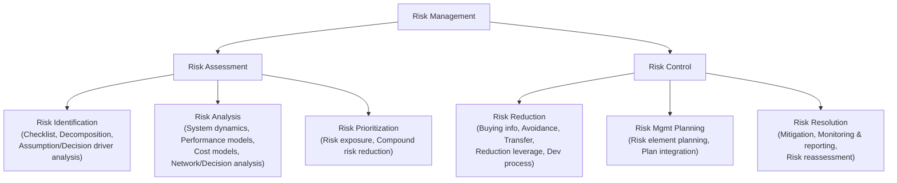

**شرح العناصر:** المرحلتان الرئيسيتان هما `Risk Assessment` (تقييم شامل للمخاطر: تحديد، تحليل، ترتيب أولويات) و`Risk Control` (التحكم الفعلي: تقليل، تخطيط، حل).

**شرح الروابط:** التدفق منطقي من أعلى لأسفل — لا يمكن التحكم بخطر (`Control`) قبل تقييمه (`Assessment`) أولاً.

---

#### 📖 الشرح

المراحل الثلاث الأساسية لعملية إدارة المخاطر هي:

1. **`Risk Identification` (تحديد المخاطر):** تحديد المخاطر كافة التي قد تواجه المشروع (مشروع، منتج، عمل).
2. **`Risk Analysis` (تحليل المخاطر):** دراسة احتمال حدوث المخاطر ونتائجها — متى، ولماذا، وأين قد تحدث؟
3. **`Risk Control` (التحكم بالمخاطر):** ويتضمن:
   - **`Risk Planning`:** وضع خطة لتجنب الأخطاء أو تقليل أثرها على المشروع.
   - **`Risk Monitoring`:** تقدير مدى الخطورة بشكل منتظم ومراجعة الخطة لتقليل أثرها كلما تعلّمنا أكثر حول تلك الخطورة.

يُوثَّق كل هذا في **`Risk Management Plan`** الذي يتضمن: مناقشة المخاطر التي يواجهها المشروع، تحليل تلك المخاطر، معلومات حول كيفية معالجتها، وغير ذلك.

#### 🎯 الملخص السريع
- 3 مراحل: `Identification → Analysis → Control`
- `Control` يتضمن `Planning` و`Monitoring`
- كل شيء يُوثَّق في `Risk Management Plan`

#### 📚 التطبيق
هذه العملية تتكرر طوال حياة المشروع، وليست خطوة تُنفذ مرة واحدة في البداية فقط.

#### 📄 النص الأصلي من المحاضرة
<details>
<summary>عرض النص الأصلي (coverage: 95%)</summary>

> "تحديد المخاطر risk identification: تحديد المخاطر كافة (مشروع، المنتج، العمل). تحليل المخاطر risk analysis: احتمال حدوث المخاطر ونتائجها، (متى، ولماذا، وأين تحدث؟). التحكم بالمخاطر risk control: Risk planning: وضع خطة لتجنب الأخطاء، أو بتقليل أثرها على المشروع. Risk monitoring: تقدير مدى الخطورة بشكل منتظم ومراجعة الخطة لتقليل أثرها كلما تعلمت أكثر حول تلك الخطورة." + [مخطط شجرة Risk management الكامل] + "خطة إدارة المخاطر risk management plan: توثيق مخرجات مرحلة إدارة المخاطر..."

</details>

---

### 14. تحليل المخاطر ومثال حساب حجم الخطر
<!-- @type: principle -->
<!-- @render: {type: "diagram-first", coverage: "100%"} -->
<!-- @connectivity: {prerequisite: "13"} -->

#### 📍 أين نحن الآن؟
نطبّق عملياً كيف نقدّر احتمال وأثر خطر معين، ثم نستخدم شجرة قرار لمقارنة استراتيجيات مختلفة.

#### ⬅️ الربط مع السابق
هذا تطبيق عملي مباشر لمعادلة `Risk Exposure` التي تعلمناها في القسم 11، لكن على قرار حقيقي متعدد الفروع.

#### 💡 الفكرة الأساسية
**بما أن تقدير قيم رقمية دقيقة لاحتمال المخاطر صعب، نستخدم نطاقات تقريبية (Very low إلى Very high) وتصنيفات تأثير (Catastrophic إلى Insignificant)، ثم نستخدم شجرة قرار لمقارنة `Combined Risk Exposure` بين خيارات مختلفة.**

---

#### 📊 المخطط: نطاقات الاحتمال والتأثير

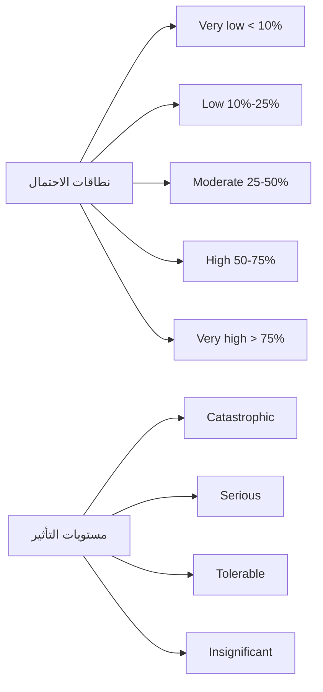

**الشرح:** بدلاً من أرقام دقيقة يصعب تحديدها، نستخدم فئات تقريبية للاحتمال والتأثير معاً لترتيب المخاطر حسب الأولوية (مثلاً: خطر باحتمال `High` وتأثير `Catastrophic` هو الأولوية القصوى).

---

#### 📊 المخطط: شجرة قرار لتقدير حجم الخطر (Regression Testing Example)

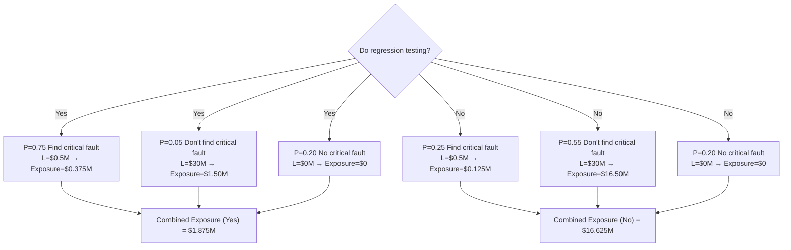

**شرح العناصر:** `P(UO)` = احتمال لنتيجة غير مرغوبة (`Unwanted Outcome`)، `L(UO)` = الخسارة الناجمة عن هذا الخطر.

**شرح الروابط:** كل فرع من القرار (`Yes`/`No` لإجراء `regression testing`) يؤدي لثلاثة احتمالات فرعية، ومجموع حاصل ضرب كل احتمال في خسارته يُعطي `Combined Risk Exposure` لكل خيار.

**التطبيق:** واضح أن `Combined Exposure` لعدم إجراء `regression testing` ($16.625M) أكبر بكثير من إجرائه ($1.875M) — أي أن الإجراء الوقائي (رغم كلفته) يقلل الخطر الكلي بشكل هائل، مما يبرر القيام به.

---

#### 📖 الشرح

بما أن تقدير قيمة رقمية دقيقة لاحتمال حدوث خطر (كـ "23.5%") أمر صعب عملياً، تُستخدم فئات تقريبية: `Very low` (أقل من 10%)، `Low` (10-25%)، `Moderate` (25-50%)، `High` (50-75%)، `Very high` (أكثر من 75%). وبالمثل يُصنَّف الأثر (`Effect`) إلى: `Catastrophic` (كارثي)، `Serious` (خطير)، `Tolerable` (محتمل)، `Insignificant` (غير مهم).

في المثال العملي، نقارن بين خيارين: إجراء `regression testing` أو عدمه، وفي كل خيار توجد ثلاث نتائج محتملة (إيجاد خطأ حرج، عدم إيجاده رغم وجوده، أو عدم وجود خطأ أصلاً) — لكل منها احتمال وخسارة محددة. جمع حاصل ضرب الاحتمال في الخسارة عبر كل الفروع يعطي `Combined Risk Exposure` الذي يمكّننا من مقارنة القرارين رقمياً.

#### 🎯 الملخص السريع
- الاحتمال يُقدَّر بفئات تقريبية (Very low → Very high)
- الأثر يُقدَّر بفئات (Catastrophic → Insignificant)
- شجرة القرار تجمع `P × L` لكل فرع لحساب `Combined Risk Exposure`

#### 📚 التطبيق
هذا التحليل يساعد في اتخاذ قرارات مبررة اقتصادياً (مثل: هل يستحق الأمر كلفة إضافية لتقليل خطر أكبر؟).

#### 🤔 تفعيل الفهم
لو كان لديك خياران لاختبار وحدة برمجية: اختبار سريع بكلفة منخفضة (لكن احتمال عالٍ لعدم اكتشاف خطأ حرج)، أو اختبار شامل بكلفة أعلى (لكن احتمال منخفض جداً لعدم الاكتشاف) — كيف تستخدم `Combined Risk Exposure` لتبرير قرارك للإدارة؟

#### 📄 النص الأصلي من المحاضرة
<details>
<summary>عرض النص الأصلي (coverage: 100%)</summary>

> "صعوبة تقدير قيم رقمية لاحتمال المخاطر: Very low < 10%, Low 10%-25%, Moderate 25-50%, High 50-75%, Very high > 75%. أثر المخاطر: Catastrophic, serious, tolerable, insignificant." + [شجرة قرار Do regression testing الكاملة مع كل قيم P(UO) وL(UO) والنتائج المجمعة $1.875M و$16.625M]

</details>

---

### 15. التعامل مع المخاطر (Risk Handling Strategies)
<!-- @type: principle -->
<!-- @render: {type: "diagram-first", coverage: "100%"} -->
<!-- @connectivity: {prerequisite: "14"} -->

#### 📍 أين نحن الآن؟
بعد أن عرفنا كيف نقيس حجم الخطر، نتعلم الآن الاستراتيجيات الثلاث للتعامل معه فعلياً.

#### ⬅️ الربط مع السابق
هذه الاستراتيجيات هي "القرار النهائي" بعد كل التحليل السابق (`Impact`, `Probability`, `Exposure`).

#### 💡 الفكرة الأساسية
**توجد ثلاث استراتيجيات للتعامل مع الخطر: تجنبه، نقله لطرف آخر، أو قبوله والتحكم به ضمن موارد المشروع — والاختيار بينها يعتمد على `Risk Leverage` (مدى فعالية تقليل الخطر مقابل كلفته).**

---

#### 📊 المخطط: استراتيجيات التعامل مع المخاطر

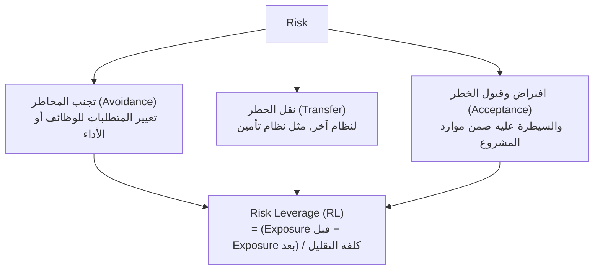

**الشرح:** كل استراتيجية تُقيَّم اقتصادياً عبر `Risk Leverage`؛ إذا كانت القيمة منخفضة جداً، لا تستحق العملية كلفتها ويجب البحث عن بديل أكثر فعالية أو أقل كلفة.

---

#### 📖 الشرح

الاستراتيجيات الثلاث للتعامل مع الخطر (`Decision Framework`):

**1. هل يمكن تجنب الخطر بالكامل (`Avoidance`)؟**
عبر تغيير المتطلبات المتعلقة بالوظائف أو الأداء التي تسبب الخطر أصلاً.

**2. هل يمكن نقل الخطر (`Transfer`)؟**
مثلاً نقله لنظام تأمين، أو طرف ثالث يتحمل المسؤولية.

**3. هل الأفضل قبول الخطر (`Acceptance`) والتحكم به؟**
افتراض الخطر وقبوله ضمن موارد المشروع، مع خطة رقابة مستمرة.

**تقييم فعالية أي إجراء تقليل خطر** يتم عبر:
$$RL = \frac{\text{Risk Exposure before reduction} - \text{Risk Exposure after reduction}}{\text{Cost of risk reduction}}$$

إذا كانت قيمة `RL` غير مرتفعة بشكل كافٍ لتبرير القيام بالإجراء، عندها يمكن البحث عن طريقة أخرى تُقلل الكلفة أو تكون أكثر فعالية.

#### 💼 السياقات المختلفة (Context Examples)

**سيناريو 1 — نظام صغير بمتطلبات مرنة:** الأفضل `Avoidance` (إعادة تحديد المتطلبات لتفادي الميزة الخطرة) لأن كلفة التغيير منخفضة.

**سيناريو 2 — مشروع بنكي بمخاطر أمنية عالية:** الأفضل `Transfer` (شراء بوليصة تأمين أو الاستعانة بجهة متخصصة بالأمن) لأن الخسارة المحتملة ضخمة جداً بحيث لا يمكن تحملها داخلياً.

**سيناريو 3 — خطر منخفض التأثير معروف مسبقاً:** الأفضل `Acceptance` مع مراقبة دورية، لأن كلفة التجنب أو النقل تفوق الفائدة المتوقعة.

#### 🎯 الملخص السريع
- 3 استراتيجيات: تجنب / نقل / قبول وتحكم
- `Risk Leverage = (Exposure قبل − Exposure بعد) / كلفة التقليل`
- `RL` منخفض ⇐ ابحث عن بديل أفضل

#### 📚 التطبيق
هذا هو القرار النهائي الذي يتخذه مدير المشروع بعد كل عملية تحليل المخاطر، ويُوثَّق في `Risk Management Plan`.

#### 🤔 تفعيل الفهم
لديك خطر `Risk Exposure` قدره $10,000 قبل أي إجراء، ويمكن تقليله إلى $2,000 بعد شراء أداة اختبار آلي تكلف $500. احسب `Risk Leverage` وحدد هل يستحق الاستثمار في هذه الأداة؟
*(تلميح: RL = (10000-2000)/500 = 16 — قيمة عالية جداً، تستحق الاستثمار بوضوح)*

#### 📄 النص الأصلي من المحاضرة
<details>
<summary>عرض النص الأصلي (coverage: 100%)</summary>

> "ثلاثة استراتيجيات: تجنب المخاطر وذلك بتغيير المتطلبات للوظائف أو الأداء. نقل الخطر إلى نظام آخر، نظام تأمين مثلاً. افتراض الخطر وقبوله والسيطرة عليه ضمن موارد المشروع. كلفة تقليل الخطر: Risk leverage (RL) = (risk exposure before reduction – risk exposure after reduction) / (cost of risk reduction). إذا كانت قيمة RL غير مرتفعة بشكل كافٍ لتبرير القيام بالعملية المناسبة عندها يمكن البحث عن طريقة أخرى تقلل الكلفة أو أكثر فعالية."

</details>

---

### 16. تخطيط المشروع (Project Plan) — البنود الكاملة
<!-- @type: fact -->
<!-- @render: {type: "diagram-first", coverage: "100%"} -->
<!-- @connectivity: {prerequisite: "15"} -->

#### 📍 أين نحن الآن؟
هذا الموضوع الختامي — نجمع كل ما تعلمناه (جدولة، تقدير، فريق، مخاطر) في وثيقة واحدة شاملة.

#### ⬅️ الربط مع السابق
`Project Plan` هو الوثيقة التي تحتوي كل مخرجات الأقسام السابقة (الجدولة، التقدير، تنظيم الفريق، خطة المخاطر) بالإضافة لعناصر جديدة (الجودة، الأمن، التوثيق).

#### 💡 الفكرة الأساسية
**`Project Plan` هو الوثيقة التي تصف احتياجات الزبون وما سيتم عمله لتلبيتها؛ يستخدمها الزبون لمعرفة مهام ومراحل التطوير، وتُسهّل تعقب تقدم المشروع ومطابقة الكلفة والمخطط الزمني.**

---

#### 📊 المخطط: بنود خطة المشروع الكاملة

```mermaid
graph TD
    PP["Project Plan"]
    PP --> Scope["Project Scope<br/>يتضمن / لن يتضمن"]
    PP --> Sched["Project Schedule<br/>مراحل + نواتج مرحلية + مخطط زمني"]
    PP --> Org["Team Organization<br/>الأشخاص + الأعمال + التنظيم"]
    PP --> Tech["Technical Description<br/>عتاد, برمجيات, مترجمات, قيود"]
    PP --> Std["Standards & Procedures & Tools<br/>خوارزميات, لغات, تقنيات مراجعة"]
    PP --> QA["Quality Assurance Plan"]
    PP --> CM["Configuration Management Plan"]
    PP --> Doc["Documentation Plan"]
    PP --> DM["Data Management Plan"]
    PP --> RM2["Resource Management Plan"]
    PP --> Test["Test Plan"]
    PP --> Train["Training Plan"]
    PP --> Sec["Security Plan"]
    PP --> Risk["Risk Management Plan"]
    PP --> Maint["Maintenance Plan"]
```

**الشرح:** خطة المشروع وثيقة شاملة تجمع 14 بنداً رئيسياً؛ بعضها فني (Technical, Configuration) وبعضها إداري (Team Organization, Resource Management) وبعضها وقائي (Risk, Security, QA).

---

#### 📖 تفصيل أهم البنود

- **`Project Scope` (مجال المشروع):** يوضح بدقة ما **يتضمنه** المشروع وما **لن يتضمنه** — يضمن للمستثمر أننا نعرف بالضبط ما يريده.
- **`Project Schedule`:** يُعبَّر عنه من خلال تقسيم العمل إلى مراحل جزئية، مع نواتج مرحلية (`deliverables`) ومخطط زمني (كل ما تعلمناه في الأقسام 3-7).
- **`Team Organization`:** يحدد الأشخاص المشاركين، الأعمال المُسندة إليهم، وكيفية تنظيمهم — مع الأخذ بالحسبان أن بعض الأشخاص لا يكونون موجودين طوال فترة التطوير، لذا يُوضع مخطط لتخصيص الموارد حسب المراحل الزمنية.
- **`Technical Description`:** وصف تقني للنظام المقترح: العتاد الحاسوبي، البرمجيات، المترجمات، التجهيزات الخاصة، وأي قيود خاصة (مثل زمن التنفيذ، الاستجابة، الأمن، الأداء).
- **`Standards, Procedures & Tools`:** يعدد المعايير والإجراءات الواجب استخدامها: الخوارزميات، الأدوات، تقنيات المراجعة والتفحص (`inspection & review`)، لغات التصميم والبرمجة، وتقنيات الاختبار.
- **`Quality Assurance Plan`:** (للمشاريع الكبيرة) يصف عملية المراجعة والفحص والاختبار وتقنيات أخرى تضمن أن المشروع يلبي الاحتياجات.
- **`Configuration Management Plan`:** خصوصاً عند وجود إصدارات متعددة، يساعد في التحكم بالإصدارات المختلفة.
- **`Data Management Plan`:** كيفية جمع البيانات، تخزينها، معالجتها، وأرشفتها.
- **`Resource Management Plan`:** تحديد نوعية الأقراص المستخدمة، كيفية توزيع البيانات عليها، ووسائط التخزين الاحتياطية.

#### 🎯 الملخص السريع
- 14 بنداً رئيسياً في `Project Plan`
- `Scope` يحدد الحدود، `Schedule` يحدد الزمن، `Team Organization` يحدد الأشخاص
- المشاريع الكبيرة تضيف: `QA Plan` مستقل، `Configuration Management` منفصل

#### 📚 التطبيق
هذه الوثيقة هي "العقد" غير الرسمي بين فريق التطوير والمستثمر — يرجع إليها الطرفان عند أي خلاف حول ما تم الاتفاق عليه.

#### ⚠️ أخطاء شائعة

#### الفهم الخاطئ ❌:
يظن بعض الطلاب أن `Project Plan` هو نفسه `Project Schedule` فقط (أي مجرد جدول زمني).

#### الفهم الصحيح ✅:
`Project Schedule` هو بند واحد فقط من 14 بنداً داخل `Project Plan` الشامل، الذي يغطي أيضاً الفريق، الجودة، المخاطر، الأمن، التوثيق، وغيرها.

#### 📄 النص الأصلي من المحاضرة
<details>
<summary>عرض النص الأصلي (coverage: 95%)</summary>

> "تخطيط المشروع project plan: احتياجات الزبون، ما سيتم عمله لتلبية الاحتياجات. يستخدمه الزبون: معرفة مهام ومراحل التطوير، تسهيل عملية تتبع تقدم المشروع، استخدامه أيضاً لمطابقة الكلفة والمخطط الزمني. بنود تخطيط المشروع: مجال المشروع، جدولة المشروع، تنظيم فريق المشروع، وصف تقني للنظام المقترح، المعايير والإجراءات والأدوات المقترحة، مخطط ضمان الجودة، مخطط إدارة الإعدادات، مخطط التوثيق، مخطط إدارة البيانات، مخطط إدارة الموارد، مخطط الاختبار، مخطط التدريب، مخطط الأمن، مخطط إدارة المخاطر، مخطط الصيانة." + [تفصيل كل بند: Scope, Schedule, Team Organization, Technical Description, Standards/Procedures/Tools, QA Plan, Configuration Management, Data Management, Resource Management]

**ملاحظة على التغطية:**
- ✓ كل الـ14 بنداً مذكورة، وأهمها مفصّل بالكامل
- ⚠️ بنود التدريب/الأمن/الصيانة/الاختبار/التوثيق ذُكرت بالاسم فقط في المصدر بدون تفصيل إضافي (المحاضرة توقفت عند slide 50)

</details>

---

## الجزء الثاني: ملخص شامل (Alternative Complete Reading)

هذه المحاضرة، ببساطة، تجيب عن سؤال واحد كبير: كيف نأخذ فكرة "نبني نظاماً برمجياً" ونحوّلها إلى خطة عملية قابلة للتنفيذ والقياس؟ الإجابة تمر بخمس محطات متتالية: الجدولة، تقدير الزمن، تقدير الكلفة، بناء الفريق، وإدارة المخاطر — وكلها تنتهي في وثيقة واحدة اسمها `Project Plan`.

نبدأ بأربعة أسئلة كل مدير مشروع يسألها قبل البدء: هل نفهم حاجة المستثمر فعلاً؟ هل عندنا حل تقني ممكن؟ كم يستغرق؟ وكم يكلف؟ السؤالان الأخيران هما الأصعب، ولا يمكن الإجابة عليهما بدقة بدون `Scheduling` منظمة. الجدولة تبدأ بفهم مخرجات المشروع (وثائق، وظائف، أنظمة فرعية، أمن وأداء)، ثم تحديد `Activity` (مهمة تستغرق وقتاً محدداً) و`Milestone` (نقطة زمنية تُعلن اكتمال تلك المهمة). ولكل `Activity` قد يكون لها `Precursor` — حدث يجب أن يحدث قبلها — بالإضافة إلى `Duration` (المدة المطلوبة) و`Due Date` (الموعد النهائي).

هذه المهام تُرتَّب هرمياً: `Project` يتفرع إلى `Phases` (مراحل كبرى، مثل "تجهيز الأرض" و"بناء البيت" في مثال المحاضرة)، وكل `Phase` يتفرع إلى `Steps` (خطوات، مثل "تنظيف الأرض" ثم "زراعة العشب")، وكل `Step` يتكون من `Activities` دقيقة قابلة للتنفيذ والإسناد لشخص واحد (مثل "إزالة الأشجار" أو "إزالة الجذوع"). هذا التقسيم يُسمى `Work Breakdown` — تجزئة العمل إلى أعمال مستقلة عن بعضها.

بعد التجزئة، نحتاج نرسم `Activity Graph` (مخطط المهام): شبكة تربط الأنشطة ببعضها، حيث العُقد تمثل `Milestones` والخطوط تمثل `Activities`. هذا المخطط يوضح الاعتماديات: أي نشاط يجب أن يسبق أي نشاط آخر، وأيهما يمكن تنفيذه بالتوازي (مثل السباكة الداخلية والخارجية اللتان يمكن تنفيذهما معاً بعد بناء الجدران). على هذا المخطط نضع تقديرات الزمن بالأيام لكل نشاط، وهذه الأرقام هي المدخل الأساسي لأهم أداة في الجدولة: `Critical Path Method (CPM)`.

`CPM` يجيب على سؤال: ما هو الحد الأدنى المطلق من الوقت اللازم لإنهاء المشروع؟ ولتحقيق هذا، نحسب لكل نشاط ثلاث قيم: `Earliest Start` (أبكر وقت يمكن أن يبدأ فيه)، `Latest Start` (آخر وقت يمكن أن يبدأ فيه دون التأثير على الموعد النهائي)، والفرق بينهما يُسمى `Slack` (أو `Float`). أي نشاط `Slack` عنده يساوي صفر يقع على `Critical Path` — أي المسار الحرج — وهذا يعني أن أي تأخير فيه، ولو يوم واحد، يؤخر المشروع كله مباشرة. في مثال بناء البيت، لوحظ أن المسار الحرج مر عبر السباكة والكهرباء الداخلية وليس الخارجية، رغم أن هذه الأخيرة قد تبدو "الأهم" ظاهرياً لمن ينظر للمخطط لأول مرة — وهذا درس مهم: الأهمية تُقاس بـ`Slack` وليس بطول النشاط أو مكانه في التسلسل الظاهري. كل هذه البيانات (الأنشطة، أزمنتها، والمسار الحرج) تُعرَض بصرياً في `Gantt Chart`، وهو أداة تساعد بشكل خاص في توضيح الأنشطة التي يمكن تنفيذها بالتوازي مع بعضها.

الجدولة وحدها لا تكفي — نحتاج فريقاً ينفذها. المهام الأساسية التي تحتاج مشاركة بشرية هي: تحليل المتطلبات، تصميم النظام، تصميم البرنامج، التنفيذ، الاختبار، التدريب، الصيانة، والجودة. وعند اختيار الأشخاص لهذه المهام، تُراعى ستة معايير: القدرة على تنفيذ العمل، مدى الاهتمام به، الخبرة (بتطبيقات مشابهة وبأدوات ولغات معينة)، التدريب المتاح، القدرة على التواصل، ومهارات الإدارة. من ناحية التنظيم، الشكل الشائع هو تنظيم هرمي (`Chief Programmer` في القمة، ثم `Assistant Chief Programmer`، ثم `Senior/Junior Programmers` بالإضافة لأدوار داعمة مثل `Librarian` و`Test Team`) — وكل عضو يتواصل بشكل أساسي مع رئيسه المباشر، وليس بالضرورة مع بقية الفريق.

بعد الفريق يأتي السؤال الأصعب: كم سيكلف كل هذا؟ تقدير الكلفة من أصعب مسائل إدارة المشاريع البرمجية، ويجب أن يبدأ في أبكر وقت ممكن، لكن الأهم أنه **يجب أن يكون تكرارياً** — لا يُحسب مرة واحدة ويُنسى. السبب أن الشك (`Uncertainty`) في بداية المشروع يجعل نطاق التقدير واسعاً جداً (قد يصل الحجم الفعلي لأربعة أضعاف التقدير الأولي أو ربعه فقط في مرحلة `Feasibility`)، وهذا النطاق يضيق تدريجياً كلما تقدمنا عبر مراحل المشروع حتى نصل لتقدير دقيق قرب النهاية. تتكون الكلفة من ثلاثة أنواع: التسهيلات (عتاد، مكان، أثاث، هاتف)، الأدوات البرمجية، وطاقم العمل — وهذا الأخير هو **العنصر الأكبر للكلفة** في أي مشروع تقريباً. وتوجد عوامل عديدة تسبب تقديرات خاطئة (طلبات تغيير متكررة، تغاضٍ عن مهام، سوء فهم المتطلبات، تحليل غير كافٍ، ضعف تنسيق، فقدان منهجية واضحة) وعوامل أخرى تؤثر على حجم التقدير (تعقيد النظام، طلب الدمج مع أنظمة سابقة، حجم النظام، خبرة الفريق).

لتقدير الجهد فعلياً، توجد عدة طرق: الاعتماد على خبرة مشاريع سابقة مشابهة، حيث يُسأل عدد من الخبراء عن ثلاثة تقديرات (متفائل `y`، متشائم `x`، وأكثر احتمالاً `z`) وتُدمج بمعادلة `توزيع بيتا الاحتمالي`: `(x + 4z + y) / 6`. أو استخدام `مصفوفة Wolverton` التي تعتمد على عاملين (هل المسألة قديمة أم جديدة، وهل هي سهلة أم متوسطة أم صعبة) لتحديد كلفة كل سطر برمجي حسب نوع البرمجية (تحكم، إدخال/إخراج، خوارزمية...). أو استخدام معادلات رياضية جاهزة مثل `Felix & Watson` (`E = 5.25 × S^0.91`) و`Bailey & Basili` (`E = 5.5 + 0.73 × S^1.16`) و`COCOMO/COCOMO II` التي تعتمد على تقييم 29 عاملاً مختلفاً يؤثر على الإنتاجية (خبرة الفريق، تعقيد الكود، بيئة العمل، وغيرها).

القسم الأخير والمهم جداً هو إدارة المخاطر. `Risk` هو حدث غير مرغوب له نتائج سلبية، ويختلف بشكل جوهري عن `Problem` — فإذا كان احتمال حدوث الحدث يساوي 1 بالضبط (أي مؤكد الحدوث)، فهو `Problem` وليس `Risk`. لكل خطر ثلاثة أبعاد: `Impact` (الخسارة المرتبطة، سواء في الزمن، المال، أو التحكم)، `Probability` (احتمال الحدوث)، و`Control` (ما يمكن فعله للتعامل معه). حاصل ضرب `Probability × Impact` يُعطي رقماً واحداً قابلاً للمقارنة يُسمى `Risk Exposure` — وهو "حجم" الخطر الفعلي. مثال من المحاضرة: احتمال تغيير المتطلبات 0.3، وكلفة إعادة التصميم $11,000، فالـ `Risk Exposure` = $3,300.

المخاطر تُصنَّف بأكثر من طريقة: حسب المصدر (`Generic` مشتركة بين كل المشاريع، أو `Product-specific` خاصة بمشروع معين)، وحسب التأثير (`Project Risks` تؤثر على الجدولة والموارد، `Product Risks` تؤثر على جودة المنتج، `Business Risks` تؤثر على الشركة نفسها). وتوجد قائمة فحص قياسية (`Risk Checklist`) بستة أنواع: `Technology`, `People`, `Organizational`, `Tools`, `Requirements`, `Estimation` — كل نوع له أمثلة ملموسة (مثل: استحالة توظيف كوادر مناسبة تحت `People`، أو تغييرات تتطلب إعادة تصميم كبيرة تحت `Requirements`).

عملية إدارة المخاطر نفسها تمر بثلاث مراحل: `Risk Identification` (تحديد كل المخاطر المحتملة)، `Risk Analysis` (دراسة احتمالها ونتائجها ومتى وأين قد تحدث)، ثم `Risk Control` الذي يتضمن `Risk Planning` (وضع خطة تجنب أو تقليل) و`Risk Monitoring` (متابعة دورية ومراجعة الخطة). ولأن تقدير أرقام دقيقة لاحتمال الخطر أمر صعب عملياً، تُستخدم فئات تقريبية (`Very low` أقل من 10% وصولاً لـ`Very high` أكثر من 75%) وفئات للتأثير (`Catastrophic` إلى `Insignificant`). مثال شجرة القرار في المحاضرة (حول إجراء `regression testing` أم لا) يوضح كيف يُستخدم `Combined Risk Exposure` لمقارنة قرارين: عدم إجراء الاختبار كانت خسارته المتوقعة $16.625M مقابل $1.875M فقط عند إجرائه — رقم يجعل القرار واضحاً اقتصادياً رغم أن كل خيار له كلفته المباشرة.

وأخيراً، عند مواجهة خطر معيّن، هناك ثلاث استراتيجيات: `Avoidance` (تجنبه بتغيير المتطلبات)، `Transfer` (نقله لطرف آخر مثل شركة تأمين)، أو `Acceptance` (قبوله والتحكم به ضمن الموارد المتاحة). ولتقييم أي إجراء لتقليل خطر معين اقتصادياً، تُستخدم معادلة `Risk Leverage = (Exposure قبل التقليل − Exposure بعد التقليل) / كلفة التقليل` — فإذا كانت القيمة الناتجة منخفضة جداً، فالإجراء لا يستحق كلفته ويجب البحث عن بديل.

كل ما سبق — الجدولة، الفريق، الكلفة، المخاطر — يجتمع أخيراً في وثيقة واحدة شاملة اسمها `Project Plan`، تحتوي 14 بنداً: `Scope` (يحدد بدقة ما يتضمنه المشروع وما لا يتضمنه)، `Schedule` (المراحل والنواتج والمخطط الزمني)، `Team Organization`، `Technical Description` (العتاد والبرمجيات والقيود)، `Standards/Procedures/Tools`، بالإضافة إلى خطط منفصلة للجودة، إدارة الإعدادات، التوثيق، إدارة البيانات، إدارة الموارد، الاختبار، التدريب، الأمن، إدارة المخاطر، والصيانة. هذه الوثيقة تعمل كـ"عقد" غير رسمي بين فريق التطوير والمستثمر: يستخدمها الزبون لمعرفة مهام ومراحل التطوير، وتُسهّل تعقب تقدم المشروع، وتُستخدم لمطابقة الكلفة والمخطط الزمني الفعليين بما تم التخطيط له.

من المهم أن تربط بين كل هذه العناصر: الجدولة الجيدة تُطعم تقدير الكلفة (لأن الزمن = كلفة عمالة)، وتقدير الكلفة يتأثر بحجم وخبرة الفريق، وإدارة المخاطر تؤثر على كل شيء لأنها تحدد الاحتياطات (`Contingency`) التي يجب إضافتها للزمن والكلفة معاً. مدير المشروع الجيد لا يتعامل مع هذه المواضيع بشكل منفصل، بل يراها منظومة واحدة مترابطة تُوثَّق جميعاً في `Project Plan`.

---

## الجزء الثالث: أسئلة اختيار من متعدد (MCQ)

### السؤال 1 (Easy)

**السؤال:** In project scheduling, what is a "Milestone"?

أ) A task that consumes a fixed amount of time
ب) A point in time marking the completion of an activity
ج) A person responsible for the project schedule
د) A tool used to draw Gantt charts

**الإجابة الصحيحة:** ب

**التعليل الكامل:**
- ❌ أ): هذا تعريف `Activity` وليس `Milestone` — النشاط يستغرق زمناً، أما `Milestone` فهو نقطة لحظية
- ✅ ب): `Milestone` هي النقطة الزمنية التي تكون فيها المهمة قد اكتملت، كما ورد صراحة في المحاضرة
- ❌ ج): هذا وصف لدور بشري (مثل `Chief Programmer`) وليس مصطلحاً زمنياً
- ❌ د): `Gantt` هو أداة عرض، وليس نفس مفهوم `Milestone`

---

### السؤال 2 (Medium)

**السؤال:** According to the lecture, what does "Precursor" mean in project scheduling?

أ) The total cost estimated for a specific activity
ب) An event that must occur before an activity can start
ج) The person assigned to supervise an activity
د) The final deliverable produced by an activity

**الإجابة الصحيحة:** ب

**التعليل الكامل:**
- ❌ أ): `Precursor` لا علاقة له بالكلفة، بل بالتسلسل الزمني والاعتماديات
- ✅ ب): كما ورد نصاً في المحاضرة، `Precursor` هو حدث أو مجموعة أحداث يجب أن تحدث قبل بدء مهمة ما
- ❌ ج): هذا وصف لدور إداري وليس مفهوماً زمنياً
- ❌ د): هذا وصف لمخرج (`deliverable`) وليس شرطاً مسبقاً

---

### السؤال 3 (Medium)

**السؤال:** In the Activity Graph (network diagram) discussed in the lecture, what do the nodes represent?

أ) Individual developers assigned to the project
ب) The estimated cost of each activity
ج) Milestones marking completed points in the project
د) Software tools used during development

**الإجابة الصحيحة:** ج

**التعليل الكامل:**
- ❌ أ): العُقد لا تمثل أشخاصاً بل نقاطاً زمنية
- ❌ ب): الكلفة ليست ممثلة في العُقد بل ترتبط بحسابات منفصلة
- ✅ ج): كما ذكرت المحاضرة صراحة: "العقد nodes تمثل النقاط المسماة milestone"
- ❌ د): الأدوات البرمجية غير ممثلة في هذا المخطط

---

### السؤال 4 (Hard)

**السؤال:** In Critical Path Method (CPM), which of the following activities is considered "critical"?

أ) The activity with the longest individual duration in days
ب) The activity with the highest assigned cost
ج) The activity whose Slack time equals zero
د) The first activity that starts in the project

**الإجابة الصحيحة:** ج

**التعليل الكامل:**
- ❌ أ): طول المدة وحده لا يحدد الأهمية؛ نشاط قصير بـ `Slack = 0` أكثر حرجاً من نشاط طويل بـ `Slack` مرتفع
- ❌ ب): الكلفة غير مرتبطة مباشرة بتعريف `Critical Path`
- ✅ ج): كما ورد في المحاضرة: `Critical path` هو المسار الذي يكون فيه `Slack time` عند كل عقدة يساوي صفر
- ❌ د): بداية المشروع ليست بالضرورة على المسار الحرج

---

### السؤال 5 (Easy)

**السؤال:** How is "Slack time" calculated according to the lecture?

أ) Slack = Duration × Cost
ب) Slack = Available time − Real time
ج) Slack = Earliest start × Latest start
د) Slack = Risk probability × Risk impact

**الإجابة الصحيحة:** ب

**التعليل الكامل:**
- ❌ أ): هذه معادلة غير مذكورة في المحاضرة إطلاقاً
- ✅ ب): كما ورد نصاً: `Slack = available – real` (أو بديلاً `Latest start – Earliest start`)
- ❌ ج): الضرب بين القيمتين ليس المعادلة الصحيحة، بل الطرح
- ❌ د): هذه معادلة `Risk Exposure` وليست `Slack`

---

### السؤال 6 (Medium)

**السؤال:** What is the main purpose of a Gantt chart, as described in the lecture?

أ) To calculate the exact cost of the entire project
ب) To show which activities can be executed in parallel with each other
ج) To identify which team member is most experienced
د) To calculate the risk exposure of each activity

**الإجابة الصحيحة:** ب

**التعليل الكامل:**
- ❌ أ): مخطط Gantt يعرض الزمن بصرياً وليس الكلفة مباشرة
- ✅ ب): كما ورد في المحاضرة: "يساعد في بيان المهام التي يمكن أن تُنفذ مع بعضها البعض"
- ❌ ج): لا علاقة لـ Gantt بتقييم خبرة الأفراد
- ❌ د): حساب المخاطر أداة منفصلة تماماً عن Gantt

---

### السؤال 7 (Hard)

**السؤال:** According to the lecture, which cost component is typically the LARGEST contributor to a software project's total cost?

أ) Software design tools
ب) Facilities (hardware, space, furniture)
ج) Development staff (personnel)
د) Documentation printing costs

**الإجابة الصحيحة:** ج

**التعليل الكامل:**
- ❌ أ): الأدوات البرمجية مذكورة كأحد الأنواع الثلاثة، لكنها ليست الأكبر
- ❌ ب): التسهيلات أيضاً نوع من الكلف لكن ليست الأكبر
- ✅ ج): نصت المحاضرة صراحة أن "طاقم العمل هو العنصر الأكبر للكلفة"
- ❌ د): كلفة طباعة الوثائق غير مذكورة كنوع مستقل في المحاضرة أصلاً

---

### السؤال 8 (Medium)

**السؤال:** Why must cost estimation be performed iteratively throughout a project, according to the lecture?

أ) Because customers change their minds about the price every week
ب) Because uncertainty early in the project widens the estimation range significantly
ج) Because tools automatically recalculate cost every day
د) Because programming languages change frequently during development

**الإجابة الصحيحة:** ب

**التعليل الكامل:**
- ❌ أ): هذا سبب غير مذكور في المحاضرة إطلاقاً
- ✅ ب): كما ورد: "الشك في بداية المشروع يمكن أن يؤثر على دقة الكلفة وحجم التقديرات" وهذا النطاق يضيق تدريجياً
- ❌ ج): لا علاقة لهذا بالأدوات الآلية
- ❌ د): تغيير لغة البرمجة ليس السبب المذكور في المحاضرة

---

### السؤال 9 (Hard)

**السؤال:** In the "Beta probabilistic distribution" formula used for expert-based estimation, which combination is correct?

أ) Estimate = (x + y + z) / 3
ب) Estimate = (x + 4z + y) / 6
ج) Estimate = (2x + 2y + 2z) / 6
د) Estimate = x × y × z

**الإجابة الصحيحة:** ب

**التعليل الكامل:**
- ❌ أ): هذا متوسط بسيط، ليس معادلة توزيع بيتا المذكورة في المحاضرة
- ✅ ب): كما ورد نصاً: توزيع بيتا الاحتمالي = `(x + 4z + y) / 6` حيث `z` هو التخمين الأكثر احتمالاً وله وزن مضاعف
- ❌ ج): هذه ليست المعادلة الصحيحة رياضياً ولا كما ذُكرت
- ❌ د): الضرب غير منطقي هنا وغير مذكور في المحاضرة

---

### السؤال 10 (Medium)

**السؤال:** In the Wolverton cost matrix, what do the two dimensions used to assess difficulty represent?

أ) Team size and project deadline
ب) Old vs New problem, and Easy/Medium/Hard difficulty
ج) Programming language and hardware type
د) Client budget and expected revenue

**الإجابة الصحيحة:** ب

**التعليل الكامل:**
- ❌ أ): حجم الفريق والموعد النهائي غير مذكورين كأبعاد لمصفوفة Wolverton
- ✅ ب): كما ورد: "عاملان يؤثران على الصعوبة: المسألة قديمة O أم جديدة N، هل هي سهلة E متوسطة M صعبة H"
- ❌ ج): لغة البرمجة والعتاد ليسا الأبعاد المستخدمة في هذه المصفوفة تحديداً
- ❌ د): الميزانية والإيرادات غير مرتبطين بهذا النموذج

---

### السؤال 11 (Easy)

**السؤال:** What distinguishes a "Problem" from a "Risk," according to the lecture?

أ) A Problem always costs more money than a Risk
ب) A Problem has a probability of exactly 1 (certain to happen)
ج) A Problem only affects the development team, not the client
د) A Problem is documented, while a Risk is not

**الإجابة الصحيحة:** ب

**التعليل الكامل:**
- ❌ أ): الكلفة ليست معيار التمييز بين المصطلحين
- ✅ ب): كما ورد نصاً: "إذا كان الاحتمال 1 عندها تسمى problem"
- ❌ ج): كلاهما قد يؤثر على أطراف متعددة، هذا ليس معيار التمييز
- ❌ د): كلاهما يمكن توثيقه، هذا ليس الفرق الجوهري المذكور

---

### السؤال 12 (Hard)

**السؤال:** A requirements-change risk has a probability of 0.3 and would cost $11,000 in redesign if it occurs. What is its Risk Exposure?

أ) $11,000
ب) $3,300
ج) $300
د) $33,000

**الإجابة الصحيحة:** ب

**التعليل الكامل:**
- ❌ أ): هذا هو `Impact` فقط بدون ضربه بالاحتمال
- ✅ ب): `Risk Exposure = Probability × Impact = 0.3 × $11,000 = $3,300`، وهو المثال بالضبط من المحاضرة
- ❌ ج): خطأ حسابي (ربما نتيجة قسمة بدلاً من ضرب)
- ❌ د): خطأ حسابي (ربما نتيجة ضرب معكوس للعشري)

---

### السؤال 13 (Medium)

**السؤال:** Which of the following is classified as a "Business Risk" rather than a "Project Risk" or "Product Risk"?

أ) A senior designer becomes unavailable, delaying the schedule
ب) A purchased software component performs slower than expected
ج) A competing company releases a similar product first
د) The database cannot process transactions as fast as expected

**الإجابة الصحيحة:** ج

**التعليل الكامل:**
- ❌ أ): هذا مثال على `Project Risk` (يؤثر على الجدولة والموارد)
- ❌ ب): هذا مثال على `Product Risk` (يؤثر على أداء المنتج)
- ✅ ج): كما ورد في المحاضرة كمثال مباشر على `Business Risk`: "إنتاج شركة منافسة لمنتج جديد"
- ❌ د): هذا أيضاً مثال على `Product Risk` وليس `Business Risk`

---

### السؤال 14 (Hard)

**السؤال:** Which of the following is NOT one of the three core Risk Management process stages mentioned in the lecture?

أ) Risk Identification
ب) Risk Analysis
ج) Risk Marketing
د) Risk Control

**الإجابة الصحيحة:** ج

**التعليل الكامل:**
- ❌ أ): هذه إحدى المراحل الثلاث الفعلية المذكورة في المحاضرة
- ❌ ب): هذه أيضاً إحدى المراحل الثلاث الفعلية
- ✅ ج): `Risk Marketing` مصطلح غير موجود إطلاقاً في المحاضرة أو في أدبيات إدارة المخاطر المذكورة
- ❌ د): هذه المرحلة الثالثة والأخيرة المذكورة فعلياً في المحاضرة

---

### السؤال 15 (Medium)

**السؤال:** According to the lecture, what does "Risk Leverage (RL)" measure?

أ) The total number of risks identified in a project
ب) The effectiveness of a risk-reduction action relative to its cost
ج) The number of team members assigned to handle a specific risk
د) The maximum acceptable probability for any risk

**الإجابة الصحيحة:** ب

**التعليل الكامل:**
- ❌ أ): عدد المخاطر المكتشفة غير مرتبط بمعادلة `Risk Leverage`
- ✅ ب): المعادلة: `RL = (Exposure قبل − Exposure بعد) / كلفة التقليل` — تقيس مدى فعالية إجراء تقليل الخطر مقابل كلفته
- ❌ ج): عدد الأفراد غير جزء من هذه المعادلة
- ❌ د): لا يوجد سقف احتمال أقصى مرتبط بهذا المصطلح في المحاضرة

---

### السؤال 16 (Easy)

**السؤال:** Which of the following is NOT one of the three risk-handling strategies mentioned in the lecture?

أ) Avoidance — changing requirements to eliminate the risk
ب) Transfer — moving the risk to another party, such as insurance
ج) Acceptance — assuming and controlling the risk within project resources
د) Elimination — guaranteeing the risk can never occur again

**الإجابة الصحيحة:** د

**التعليل الكامل:**
- ❌ أ): هذه إحدى الاستراتيجيات الثلاث الفعلية المذكورة في المحاضرة
- ❌ ب): هذه أيضاً إحدى الاستراتيجيات الثلاث الفعلية
- ❌ ج): هذه الاستراتيجية الثالثة المذكورة فعلياً
- ✅ د): `Elimination` بهذا التعريف (ضمان مطلق بعدم حدوث الخطر مجدداً) غير واقعي وغير مذكور في المحاضرة؛ الاستراتيجيات الثلاث الحقيقية هي Avoidance وTransfer وAcceptance فقط

---

## الجزء الرابع: بطاقات سؤال وجواب (Q&A Cards)

### البطاقة 1
**Q:** ما الفرق بين `Activity` و`Milestone`؟
**A:** `Activity` يستغرق فترة زمنية (`Duration`)، بينما `Milestone` هو نقطة زمنية لحظية تُعلن اكتمال مهمة.

### البطاقة 2
**Q:** ما معادلة `Slack time`؟
**A:** `Slack = Available time − Real time`، أو بديلاً `Slack = Latest start − Earliest start`.

### البطاقة 3
**Q:** ما تعريف `Critical Path`؟
**A:** المسار الذي يكون فيه `Slack time` عند كل عقدة يساوي صفر — أي أن أي تأخير فيه يؤخر المشروع كله.

### البطاقة 4
**Q:** ما فائدة مخطط `Gantt` الرئيسية؟
**A:** يساعد في بيان المهام التي يمكن تنفيذها مع بعضها البعض بالتوازي.

### البطاقة 5
**Q:** ما أنواع الكلف الثلاثة في المشروع البرمجي؟
**A:** التسهيلات (عتاد ومكان وأثاث)، الأدوات البرمجية، وطاقم العمل — وهو الأكبر كلفة.

### البطاقة 6
**Q:** لماذا يجب أن يكون تقدير الكلفة تكرارياً؟
**A:** لأن الشك في بداية المشروع كبير جداً، ويضيق نطاق التقدير تدريجياً كلما تقدم المشروع عبر مراحله.

### البطاقة 7
**Q:** ما معادلة `توزيع بيتا الاحتمالي` لتقدير الجهد؟
**A:** `(x + 4z + y) / 6` حيث `x` متشائم، `y` متفائل، `z` أكثر احتمالاً (له وزن مضاعف).

### البطاقة 8
**Q:** متى يُسمى `Risk` بدلاً من ذلك `Problem`؟
**A:** عندما يكون احتمال حدوثه يساوي 1 بالضبط (أي مؤكد الحدوث).

### البطاقة 9
**Q:** ما معادلة `Risk Exposure`؟
**A:** `Risk Exposure = Risk Probability × Risk Impact`.

### البطاقة 10
**Q:** ما الفئات الست في `Risk Checklist`؟
**A:** Technology, People, Organizational, Tools, Requirements, Estimation.

### البطاقة 11
**Q:** ما الاستراتيجيات الثلاث للتعامل مع الخطر؟
**A:** التجنب (`Avoidance`)، النقل (`Transfer`)، والقبول والتحكم (`Acceptance`).

### البطاقة 12
**Q:** كم عدد البنود الرئيسية في `Project Plan` حسب المحاضرة؟
**A:** 14 بنداً، منها: Scope, Schedule, Team Organization, Technical Description, QA Plan, Risk Management Plan.

### البطاقة 13
**Q:** ما معادلة `Risk Leverage`؟
**A:** `(Risk Exposure قبل التقليل − Risk Exposure بعد التقليل) / كلفة إجراء التقليل`.

---

## الجزء الخامس: ورقة المراجعة السريعة (Cheat Sheet)

### 5.1 جدول المقارنة السريعة: مصطلحات الجدولة

| المصطلح | التعريف | مثال |
| --- | --- | --- |
| `Activity` | جزء من المشروع يستغرق فترة زمنية | "حفر الأساس" |
| `Milestone` | نقطة زمنية تُعلن اكتمال مهمة | "تم الانتهاء من حفر الأساس" |
| `Precursor` | حدث يجب أن يحدث قبل بدء المهمة | الحصول على تصريح البناء قبل الحفر |
| `Duration` | المدة اللازمة لإكمال المهمة | 3 أيام |
| `Due Date` | آخر موعد يجب أن تنتهي به المهمة | 15 مارس |
| `Slack` | الفرق بين الوقت المتاح والفعلي | `Available − Real` |
| `Critical Path` | مسار تكون فيه كل الأنشطة بـ Slack = 0 | يحدد أقل مدة ممكنة للمشروع |

### 5.2 القواعد الذهبية

- الكلفة والزمن **دائماً** يُقدَّران بشكل تكراري — لا تعتمد على التقدير الأولي فقط.
- طاقم العمل هو **دائماً** العنصر الأكبر تكلفةً في أي مشروع برمجي.
- `Risk` احتمالي (احتمال < 1)، بينما `Problem` مؤكد الحدوث (احتمال = 1).
- `Risk Exposure = Probability × Impact` — هذه المعادلة الأهم في كل قسم إدارة المخاطر.
- المسار الحرج يُحدَّد بـ `Slack = 0`، وليس بطول النشاط.

### 5.3 مرجع سريع للمصطلحات

| الإنجليزي | العربي |
| --- | --- |
| `Project Scheduling` | جدولة المشروع |
| `Work Breakdown Structure (WBS)` | تجزئة العمل |
| `Activity Graph` | مخطط المهام |
| `Critical Path Method (CPM)` | طريقة المسار الحرج |
| `Gantt Chart` | مخطط جانت |
| `Risk Exposure` | حجم/مقدار الخطر |
| `Risk Leverage` | كلفة تقليل الخطر |
| `Risk Avoidance / Transfer / Acceptance` | تجنب / نقل / قبول الخطر |
| `Project Plan` | خطة (تخطيط) المشروع |
| `Configuration Management` | إدارة الإعدادات |

### 5.4 جدول مقارنة: استراتيجيات التعامل مع المخاطر

| الاستراتيجية | الوصف | متى تُستخدم |
| --- | --- | --- |
| **Avoidance** | تغيير المتطلبات لإزالة سبب الخطر | عندما تكون كلفة التغيير منخفضة |
| **Transfer** | نقل الخطر لطرف آخر (تأمين مثلاً) | عندما تكون الخسارة المحتملة كبيرة جداً |
| **Acceptance** | قبول الخطر والتحكم به داخلياً | عندما تكون كلفة التجنب/النقل أعلى من الفائدة |
