# المحاضرة 8 — Software Measurement (قياس البرمجيات)
> **المادة:** هندسة البرمجيات (2) — المستوى الثالث | **الموضوع:** مقاييس المنتج، مقاييس الكائنية (OO)، مقاييس الفريق والجودة

---

## ملخص سريع قبل البدء

**عن ماذا هذه المحاضرة؟** نتعلم كيف نحوّل خصائص البرمجيات (الحجم، التعقيد، جودة التصميم) لأرقام قابلة للقياس، بدل ما نحكم عليها بالإحساس بس.

**ليش يهمك؟** المقاييس (`metrics`) تساعدك تكتشف مشاكل التصميم *قبل* ما تصير كارثة — مثل class معقد جداً أو اقتران عالي بين الفئات يصعّب الصيانة لاحقاً.

**المتطلبات السابقة:** Programming 1، مبادئ OOP (classes، inheritance، methods)، Software Engineering 1.

**الخيط الناظم:**
```
حجم الكود (LOC) → تعقيده (Cyclomatic Complexity) → جودة تصميمه الكائني (DIT, NOC, Coupling, Cohesion)
→ جودة تبعيات الحزم (Ca, Ce, Instability) → إنتاجية الفريق (Code Churn) → جودة المنتج (Defects, Failure Rate)
```

---

## الجزء الأول: الشرح التفصيلي

### 1. مفهوم القياس (Measurement)
<!-- @render: {type: "diagram-first", visualization: "flowchart", coverage: "100%"} -->
<!-- @connectivity: {prerequisite: "none"} -->

#### 📍 أين نحن الآن؟
بداية المحاضرة — نفهم قبل كل شيء إيش يعني "نقيس" أي شيء.

#### ⬅️ الربط مع السابق
لا يوجد موضوع سابق مباشر؛ هذه أول لبنة نبني عليها بقية المحاضرة.

#### 💡 الفكرة الأساسية
**المقياس (`measure`) هو طريقة لربط رقم بخاصية من خصائص شيء فيزيائي — علاقة واحد لواحد بين الأشياء الحقيقية والأرقام.**

---

#### 📊 المخطط

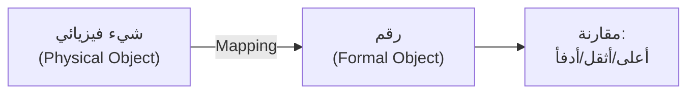

**الشرح:** أي قياس هو جسر بين شيء واقعي (كطفل) ورقم (كالوزن)، وبمجرد ما يصير عندنا رقم نقدر نقارن.

---

#### 📖 الشرح
مثال بسيط: الوزن يُقاس بالجرام (`gr`)، الطول بالمتر، الحرارة بالدرجة المئوية (`C`) أو الفهرنهايت (`F`). بمجرد ما نحول الخاصية لرقم، نقدر نقول "هذا أثقل" أو "هذا أدفأ" بدل ما نعتمد على الإحساس فقط.

نفس الفكرة تنطبق على البرمجيات: بدل ما نقول "هذا الكود معقد" بإحساسنا، نحتاج رقم يعبّر عن التعقيد فعلاً — وهذا هو موضوع المحاضرة كلها.

#### 🎯 الملخص السريع
- القياس = ربط رقم بخاصية فيزيائية
- الهدف: نقدر نقارن (أكثر/أقل)
- أمثلة: وزن، طول، حرارة

#### 📚 التطبيق
هذا المفهوم الأساسي سيُطبّق بعد قليل على البرمجيات نفسها — كيف نقيس حجمها وتعقيدها.

#### ⚠️ أخطاء شائعة

#### الفهم الخاطئ ❌:
القياس فقط للأشياء المادية الملموسة (وزن، طول).

#### الفهم الصحيح ✅:
القياس يمكن أن يُطبّق على أي خاصية قابلة للتعريف بدقة، حتى لو كانت مجردة مثل "تعقيد البرنامج" — طالما عرّفنا كيف نحسبها.

#### 📄 النص الأصلي من المحاضرة
<details>
<summary>عرض النص الأصلي (coverage: 100%)</summary>

> Way of associating a number with some attribute of a physical object; one-to-one mapping between physical objects and formal objects. e.g: weight → gr, height → meters, temperature → C or F. Then we can say: higher, warmer, …

**ملاحظة على التغطية:**
- ✓ تم شرح التعريف والأمثلة بالكامل

</details>

---

### 1.1. لماذا نقيس البرمجيات؟ (Software Measurement)
<!-- @render: {type: "diagram-first", visualization: "hierarchy", coverage: "100%"} -->
<!-- @connectivity: {prerequisite: "1"} -->

#### 📍 أين نحن الآن؟
ننتقل من مفهوم القياس العام إلى تطبيقه على البرمجيات تحديداً.

#### ⬅️ الربط مع السابق
بما إن القياس = ربط رقم بخاصية، نحتاج نطبق هذا على خصائص البرمجيات (التعقيد، الأداء، الأمان، التكلفة).

#### 💡 الفكرة الأساسية
**مقياس البرمجيات (`software metric`) هو أي مقياس مرتبط مباشرة بالبرمجية نفسها أو بعملية إنتاجها.**

---

#### 📊 المخطط: مجالات مقاييس البرمجيات

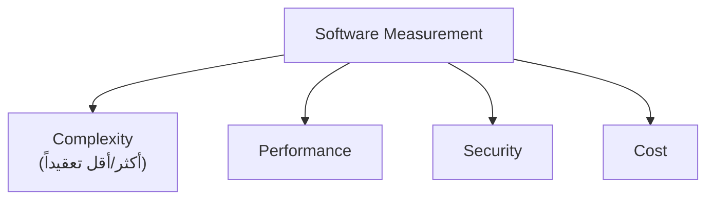

**الشرح:** المقاييس تغطي جوانب مختلفة تماماً من البرمجية — مو بس السرعة أو التكلفة، بل حتى مدى تعقيد بنيتها الداخلية.

---

#### 📖 الشرح
عندنا حاجة حقيقية لتقييم صفات البرمجية بشكل موضوعي: هل هذا الكود معقد أكثر من ذاك؟ هل الأداء مقبول؟ هل التصميم آمن؟ كل هذه أسئلة تحتاج **رقم** يجاوب عليها بدل التخمين.

`Software metric` = مقياس لأي شيء مرتبط بالبرمجية أو بعملية إنتاجها (مثل عدد الأسطر، أو الوقت اللي أخذه فريق ليكتب feature).

#### 🎯 الملخص السريع
- نحتاج نقيّم: التعقيد، الأداء، الأمان، التكلفة
- `Software metric`: أي مقياس مرتبط بالبرمجية أو إنتاجها

#### 📚 التطبيق
بقية المحاضرة كلها أمثلة عملية على مقاييس برمجية حقيقية — بدءاً من حجم الكود.

#### ⚠️ أخطاء شائعة

#### الفهم الخاطئ ❌:
مقاييس البرمجيات تقتصر على "عدد الأسطر" فقط.

#### الفهم الصحيح ✅:
هناك مقاييس لكل شيء تقريباً: الحجم، التعقيد، جودة التصميم الكائني، إنتاجية الفريق، وحتى معدل الأعطال.

#### 📄 النص الأصلي من المحاضرة
<details>
<summary>عرض النص الأصلي (coverage: 100%)</summary>

> Need to a method/way for evaluating/estimating the different attributes of software: Complex (more or less), Performance, Security, Cost, etc. Software metric is a measure of anything directly related to software or its production.

**ملاحظة على التغطية:**
- ✓ تم شرح كل النقاط

</details>

---

### 2. حجم المنتج: عدد أسطر الكود LOC
<!-- @render: {type: "diagram-first", visualization: "hierarchy", coverage: "100%"} -->
<!-- @connectivity: {prerequisite: "1.1"} -->

#### 📍 أين نحن الآن؟
أول مقياس فعلي نتعلمه: كيف نقيس حجم البرنامج.

#### ⬅️ الربط مع السابق
بعد ما عرفنا إن عندنا حاجة لمقاييس، نبدأ بأبسط واحد: عدّ الأسطر.

#### 💡 الفكرة الأساسية
**`LOC` (Lines of Code) يقيس حجم البرنامج بعدّ أسطر الكود، لكنه لا يعكس التعقيد أو الجودة.**

---

#### 📊 المخطط

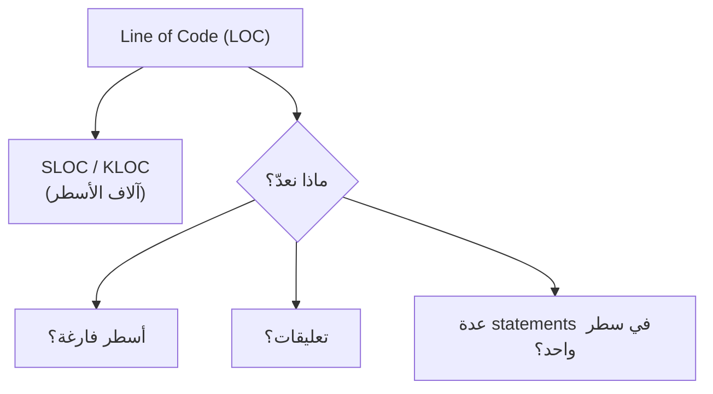

**الشرح:** قبل ما تحسب `LOC` لازم تقرر إيش يُحسب وإيش لا — القرار نفسه يغيّر الرقم النهائي.

---

#### 📖 الشرح
`LOC` (وبالآلاف: `KLOC`، أو `SLOC` لعدد الأسطر البرمجية) هو أبسط مقياس لحجم الكود — بس عدّ الأسطر. لكن فيه إشكالية: **هل نعدّ الأسطر الفارغة؟ التعليقات (comments)؟ لو كتبت statement أو اثنين في سطر واحد، هل يُحسب سطر أو اثنين؟**

مشكلة ثانية: `LOC` يعتمد على اللغة البرمجية (`language dependent`) — نفس المنطق قد يحتاج 10 أسطر بلغة و3 أسطر بلغة ثانية، فمقارنة برنامجين بلغتين مختلفتين بـ `LOC` غير عادلة. كذلك `LOC` لا يعكس التعقيد ولا المحتوى الفعلي — برنامج قصير قد يكون أعقد من برنامج طويل. وأكبر عيب: **لازم تنتظر لين يكتمل تنفيذ النظام عشان تحسب `LOC` فعلياً**.

#### 🎯 الملخص السريع
- `LOC/SLOC/KLOC`: عدّ أسطر الكود
- قرار "ماذا نعدّ" يغيّر النتيجة
- لغوي (`language dependent`) ولا يعكس التعقيد

#### 📚 التطبيق
`LOC` غالباً يُستخدم كمقام (`denominator`) في مقاييس أخرى لاحقاً، مثل `Defect Density`.

#### ⚠️ أخطاء شائعة

#### الفهم الخاطئ ❌:
برنامج بعدد أسطر أكبر = برنامج أعقد أو أسوأ تصميماً.

#### الفهم الصحيح ✅:
`LOC` يقيس الحجم فقط، مو التعقيد ولا الجودة. برنامج قصير مكتوب بذكاء ممكن يكون أعقد من برنامج طويل مكرر.

#### 📄 النص الأصلي من المحاضرة
<details>
<summary>عرض النص الأصلي (coverage: 100%)</summary>

> Line of Code LOC, SLOC, KLOC. What to count? (Yes/No): Empty Lines, Comments, Several statements on one line. LOC is language dependent. Does not respect complexity and content. Wait until the system is implemented!

**ملاحظة على التغطية:**
- ✓ تم شرح كل نقطة

</details>

---

### 3. تعقيد المنتج: Cyclomatic Complexity (McCabe)
<!-- @render: {type: "diagram-first", visualization: "flowchart", coverage: "100%"} -->
<!-- @connectivity: {prerequisite: "2"} -->

#### 📍 أين نحن الآن؟
بعد الحجم، ننتقل لمقياس أهم: تعقيد منطق الكود نفسه.

#### ⬅️ الربط مع السابق
`LOC` ما يكفي لمعرفة صعوبة الكود؛ نحتاج مقياس يعكس عدد المسارات المنطقية داخل الدالة.

#### 💡 الفكرة الأساسية
**`Cyclomatic Complexity` (`CC`) تقيس عدد المسارات المستقلة خطياً داخل دالة، بالمعادلة `V(G) = e − n + 2p`.**

---

#### 📊 المخطط: مثال حساب CC من المحاضرة (دالة showClients)

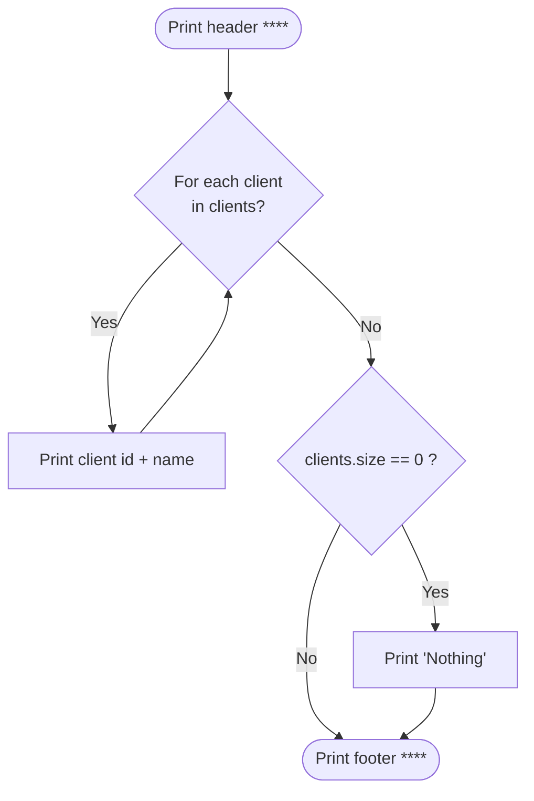

**الشرح:** هذا هو نفس مثال المحاضرة لدالة `showClients` — طباعة قائمة عملاء، مع حالة خاصة لو القائمة فاضية.

---

#### 📖 الشرح
`V(G) = e − n + 2p` حيث:
- **e**: عدد الحواف (`edges`) في مخطط التدفق
- **n**: عدد العُقد (`vertices/nodes`)
- **p**: عدد الأجزاء غير المتصلة في المخطط (عادة `1` لدالة واحدة متصلة)

في مثال المحاضرة: `E = 7, N = 6, P = 1 → V(G) = 7 − 6 + 2(1) = 3`. يعني الدالة فيها **3 مسارات مستقلة خطياً** تقدر تمشي فيها أثناء التنفيذ (المسار الطبيعي، مسار التكرار، ومسار الحالة الخاصة لو القائمة فاضية).

كل ما زاد عدد الشروط (`if`, `for`, `while`) في الدالة، زاد `V(G)` — لأنه فعلياً يعدّ عدد نقاط القرار +1.

#### 🎯 الملخص السريع
- `V(G) = e − n + 2p`
- تحسب من مخطط التدفق (`flow graph`)
- كل قرار (`if/for/while`) يزيد التعقيد

#### 📚 التطبيق
تُستخدم لتحديد أي دالة تحتاج إعادة هيكلة (`refactoring`) قبل ما تصير صعبة الصيانة أو الاختبار.

#### ⚠️ أخطاء شائعة

#### الفهم الخاطئ ❌:
`Cyclomatic Complexity` مقياس دقيق لجودة الكود بشكل عام.

#### الفهم الصحيح ✅:
`CC` يقيس فقط تعقيد المسارات المنطقية؛ لا يعكس تعقيد أنواع أخرى مثل بنية البيانات أو تعقيد الواجهات (`interfaces`).

#### 📄 النص الأصلي من المحاضرة
<details>
<summary>عرض النص الأصلي (coverage: 100%)</summary>

> CC: Number of linearly independent paths through a function, calculated from flow graph. V(G) = e – n + 2p. e: number of edges, n: number of vertices, p: number of unconnected parts of graph. Example: E=7, N=6, P=1, V(G)=3.

**ملاحظة على التغطية:**
- ✓ تم شرح المعادلة والمثال الكامل

</details>

---

### 3.1. متى يكون التعقيد خطيراً؟ (CC Thresholds & Testability)
<!-- @render: {type: "diagram-first", visualization: "hierarchy", coverage: "100%"} -->
<!-- @connectivity: {prerequisite: "3"} -->

#### 📍 أين نحن الآن؟
بعد ما تعلمنا كيف نحسب `CC`، نتعلم كيف نفسّر النتيجة.

#### ⬅️ الربط مع السابق
الرقم لوحده ما يفيد إلا لو عرفنا متى يكون "عالي" ومتى يرتبط بالاختبار (`testing`).

#### 💡 الفكرة الأساسية
**لما `V(G) > 10`، احتمال وجود أخطاء (`defects`) في الدالة يرتفع، و`CC` يعطينا حدود عليا وسفلى لتغطية الاختبار.**

---

#### 📊 المخطط

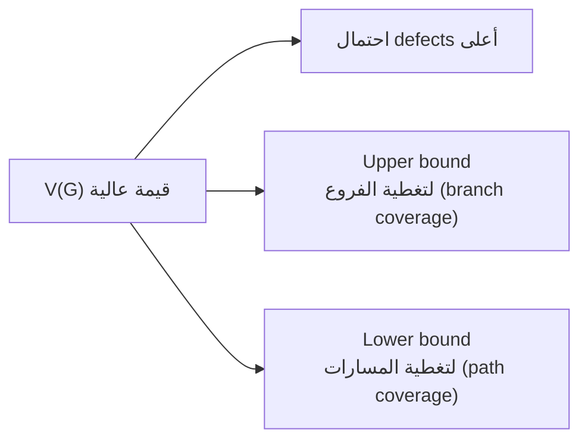

**الشرح:** `CC` مؤشر على الخطورة، وأيضاً دليل لعدد حالات الاختبار المطلوبة كحد أدنى وأقصى.

---

#### 📖 الشرح
عملياً، `V(G)` يُحسب آلياً (`automated`) بأدوات جاهزة. القاعدة المعروفة: إذا تجاوز `10`، احتمال ظهور أخطاء في تلك الدالة يرتفع بشكل ملحوظ.

من ناحية الاختبار (`testability`): `V(G)` يعطيك **حداً أعلى** لعدد حالات الاختبار اللازمة لتغطية كل الفروع (`branch coverage`) — أي كل شرط جُرّب صح وغلط. وأيضاً يعطيك **حداً أدنى** لتغطية كل المسارات الممكنة (`path coverage`).

العيب: `CC` ما يهتم بأنواع تعقيد ثانية، مثل تعقيد بنية البيانات أو تعقيد الواجهات بين المكونات.

#### 🎯 الملخص السريع
- `V(G) > 10` → خطر أعلى
- حد أعلى لتغطية الفروع، حد أدنى لتغطية المسارات
- لا يشمل تعقيد البيانات أو الواجهات

#### 📚 التطبيق
فريق QA يستخدم `CC` لتحديد أولويات الاختبار — الدوال ذات `V(G)` الأعلى تحتاج اهتمام أكبر.

#### ⚠️ أخطاء شائعة

#### الفهم الخاطئ ❌:
كل دالة فيها `V(G) > 10` لازم تُعاد كتابتها فوراً.

#### الفهم الصحيح ✅:
`10` مجرد إشارة تحذير (`indicator`) لارتفاع احتمال الأخطاء، وليست قاعدة صارمة تُطبّق آلياً بدون مراجعة السياق.

#### 📄 النص الأصلي من المحاضرة
<details>
<summary>عرض النص الأصلي (coverage: 100%)</summary>

> Automated. V(G) > 10 → defects prob. rises. Testability: V(G) upper bound for branch coverage (each control structure evaluated true/false); V(G) lower bound for path coverage (all possible paths executed). Does not respect other types of complexity: data structure, interfaces.

**ملاحظة على التغطية:**
- ✓ تم شرح كل نقطة

</details>

---

### 4. مقاييس البرمجة الكائنية (Chidamber & Kemerer, 1994)
<!-- @render: {type: "diagram-first", visualization: "hierarchy", coverage: "100%"} -->
<!-- @connectivity: {prerequisite: "3.1"} -->

#### 📍 أين نحن الآن؟
ننتقل من مقاييس الدوال المفردة إلى مقاييس تصميم الفئات (`classes`) بالكامل.

#### ⬅️ الربط مع السابق
`CC` يقيس تعقيد دالة واحدة؛ الآن نحتاج مقاييس تقيّم جودة تصميم الفئة ككل في نظام كائني التوجه (`OO`).

#### 💡 الفكرة الأساسية
**مجموعة `Chidamber & Kemerer` تحتوي 6 مقاييس أساسية لتقييم تصميم الفئات: `DIT`, `NOC`, `WMC`, `RFC`, `CBO`, `LCOM`.**

---

#### 📊 المخطط

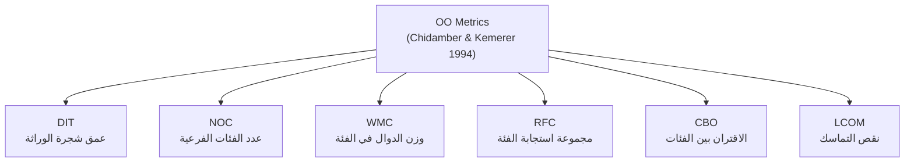

**الشرح:** كل مقياس يقيس جانب مختلف من تصميم الفئة — وراثة، تعقيد داخلي، تفاعل، اقتران، وتماسك.

---

#### 📖 الشرح
هذه المجموعة من أشهر مقاييس التصميم الكائني في الصناعة والأكاديميا. كل واحد يجاوب سؤال مختلف: كم فئة ورثت من هذه الفئة؟ (`NOC`) كم فرع لها؟ (`DIT`) هل الدوال داخلها فعلاً مرتبطة ببعض؟ (`LCOM`) وهل الفئة معتمدة بشكل مفرط على فئات ثانية؟ (`CBO`).

قاعدة عملية مذكورة في المحاضرة: **`WMC` بقيمة 20 لفئة تُعتبر جيدة، لكن لا يُفضّل تجاوز 40**.

#### 🎯 الملخص السريع
- 6 مقاييس: `DIT, NOC, WMC, RFC, CBO, LCOM`
- كل واحد يقيّم بُعداً مختلفاً من التصميم
- `WMC`: جيد عند 20، لا يتجاوز 40

#### 📚 التطبيق
سنشرح `DIT, NOC, CBO, LCOM` بالتفصيل في الأقسام القادمة لأنها الأكثر استخداماً عملياً.

#### ⚠️ أخطاء شائعة

#### الفهم الخاطئ ❌:
مقياس واحد من الستة يكفي للحكم على جودة التصميم.

#### الفهم الصحيح ✅:
هذه المقاييس تُقرأ **مع بعض**، لأن فئة قد تكون منخفضة في مقياس وعالية في آخر (مثلاً: `DIT` منخفض لكن `CBO` عالي جداً = مشكلة اقتران رغم بساطة الوراثة).

#### 📄 النص الأصلي من المحاضرة
<details>
<summary>عرض النص الأصلي (coverage: 100%)</summary>

> Chidamber & Kemerer (1994): DIT, NOC, WMC (WMC of 20 for a class is good, but do not exceed 40), RFC, CBO, LCOM.

**ملاحظة على التغطية:**
- ✓ تم شرح المجموعة كاملة؛ التفصيل في الأقسام التالية

</details>

---

### 4.1. عمق شجرة الوراثة (DIT — Depth of Inheritance Tree)
<!-- @render: {type: "diagram-first", visualization: "hierarchy", coverage: "100%"} -->
<!-- @connectivity: {prerequisite: "4"} -->

#### 📍 أين نحن الآن؟
أول مقياس تفصيلي من مجموعة `Chidamber & Kemerer`.

#### ⬅️ الربط مع السابق
بعد نظرة عامة على المقاييس الستة، نتعمق في `DIT` تحديداً.

#### 💡 الفكرة الأساسية
**`DIT` يقيس أقصى مسافة (عدد المستويات) بين الفئة الجذر (`root class`) وأي فئة في شجرة الوراثة.**

---

#### 📊 المخطط

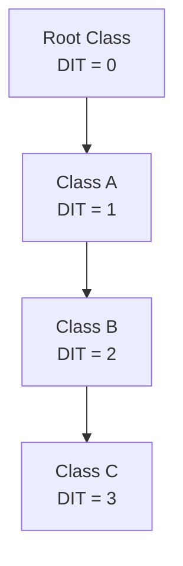

**الشرح:** كل مستوى وراثة إضافي يزيد `DIT` بواحد؛ الفئة الجذر دائماً `DIT = 0`.

---

#### 📖 الشرح
كل ما كانت الفئة أعمق في شجرة الوراثة، كل ما زاد عدد الدوال (`methods`) التي ترثها من الأجداد — وهذا يعني عدد أكبر من الدوال يحتاج اختبار عند تعديل أي جزء.

في حالة الوراثة المتعددة (`multiple inheritance`)، `DIT` = أقصى مسافة بين الجذر والفئة. القاعدة العامة: شجرة أعمق تعني **إعادة استخدام أكبر** (`reuse`) لكن أيضاً **تعقيد تصميم أكبر** — مقايضة (`trade-off`) بين الاثنين.

#### 🎯 الملخص السريع
- `DIT`: أقصى مسافة من الجذر
- الجذر دائماً `DIT = 0`
- أعمق = reuse أكثر لكن تعقيد أكبر

#### 📚 التطبيق
يُستخدم لتحديد إذا كانت شجرة الوراثة معقدة جداً وتحتاج تبسيط.

#### ⚠️ أخطاء شائعة

#### الفهم الخاطئ ❌:
`DIT` عالي دائماً شيء سيء يجب تجنبه.

#### الفهم الصحيح ✅:
`DIT` عالي يعني إعادة استخدام أكبر للكود الموروث، لكن بالمقابل صعوبة أكبر في فهم واختبار كل الفئات في السلسلة — القرار يعتمد على السياق.

#### 📄 النص الأصلي من المحاضرة
<details>
<summary>عرض النص الأصلي (coverage: 100%)</summary>

> Root class has DIT of 0. For multiple inheritance: DIT is Max distance between root & the class. Deeper a class is in the hierarchy, the greater the number of methods likely to inherit (more methods to be tested). Deeper trees: more reuse, greater design complexity.

**ملاحظة على التغطية:**
- ✓ تم شرح كل نقطة

</details>

---

### 4.2. عدد الفئات الفرعية (NOC — Number of Children)
<!-- @render: {type: "diagram-first", visualization: "hierarchy", coverage: "100%"} -->
<!-- @connectivity: {prerequisite: "4.1"} -->

#### 📍 أين نحن الآن؟
مقياس ثانٍ من نفس المجموعة، يقيس اتجاهاً مختلفاً من الوراثة (العرض بدل العمق).

#### ⬅️ الربط مع السابق
`DIT` قاس العمق؛ `NOC` يقيس العرض (كم فئة ترث مباشرة من هذه الفئة).

#### 💡 الفكرة الأساسية
**`NOC` يعدّ عدد الفئات الفرعية المباشرة (`immediate subclasses`) لفئة معينة، ويُفضّل عمق أكثر من عرض.**

---

#### 📊 المخطط

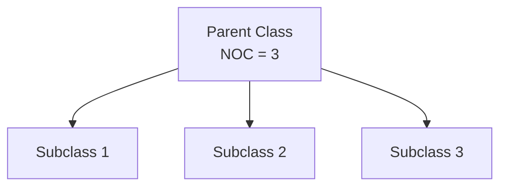

**الشرح:** `NOC` هنا = 3 لأن عندنا 3 فئات فرعية مباشرة من نفس الأب.

---

#### 📖 الشرح
بشكل عام، الأفضل أن يكون التصميم **أعمق (`depth`)** بدل **أعرض (`breadth`)** في الهرمية، لأن العمق يشجع على إعادة استخدام الدوال عبر الوراثة. `NOC` مرتفع يعطينا مؤشر على **تأثير** تلك الفئة الكبير على التصميم العام للنظام — لأن أي تغيير فيها ينتشر على عدد أكبر من الفئات الفرعية.

#### 🎯 الملخص السريع
- `NOC`: عدد الفئات الفرعية المباشرة
- عمق أفضل من عرض (يشجع reuse)
- `NOC` عالي = تأثير أكبر على التصميم

#### 📚 التطبيق
`NOC` عالي جداً يعني أي تعديل على الفئة الأم قد يكسر عدد كبير من الفئات الفرعية — إشارة لمراجعة التصميم.

#### ⚠️ أخطاء شائعة

#### الفهم الخاطئ ❌:
`NOC` عالي دليل على تصميم قوي ومرن.

#### الفهم الصحيح ✅:
`NOC` عالي يعني تأثير كبير وربما هشاشة في التصميم — أي خطأ في الفئة الأم ينتشر لعدد كبير من الفئات الفرعية دفعة واحدة.

#### 📄 النص الأصلي من المحاضرة
<details>
<summary>عرض النص الأصلي (coverage: 100%)</summary>

> Counts the number of immediate subclasses of a particular class. Generally it is better to have depth than breadth in the class hierarchy (promotes reuse of methods through inheritance). NOC gives an indication of the potential influence of a class on the overall design.

**ملاحظة على التغطية:**
- ✓ تم شرح كل نقطة

</details>

---

### 4.3. الاقتران (Coupling — CBO)
<!-- @render: {type: "diagram-first", visualization: "hierarchy", coverage: "100%"} -->
<!-- @connectivity: {prerequisite: "4.2"} -->

#### 📍 أين نحن الآن؟
ننتقل من علاقات الوراثة إلى علاقات الاستخدام بين الفئات — الاقتران.

#### ⬅️ الربط مع السابق
`DIT` و`NOC` يخصان الوراثة فقط؛ `CBO` يقيس نوع علاقة مختلف تماماً: استخدام فئة لفئة أخرى.

#### 💡 الفكرة الأساسية
**`Coupling` هو قوة الارتباط بين الكيانات المختلفة، و`CBO` (Coupling Between Objects) يعدّ عدد الفئات الأخرى (غير الوراثة) التي ترتبط بها فئة معينة.**

---

#### 📊 المخطط: مثال Coupling من المحاضرة

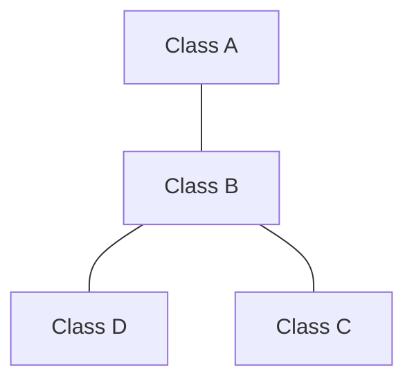

**الشرح:** `Class B` مرتبطة مع `A` و`C` و`D` — فـ `CBO` الخاص بـ `Class B` = 3 (لأنها ترتبط بثلاث فئات أخرى عبر استخدام دوالها).

---

#### 📖 الشرح
الاقتران (`Coupling`) يحدث بطريقتين: **استخدام دوال كائن آخر (`use of an object's methods`)**، أو **الوراثة (`inheritance`)**. لكن `CBO` تحديداً يهتم فقط بالنوع الأول — العلاقات **خارج** شجرة الوراثة.

الاقتران المفرط خارج الوراثة له عواقب: **يضر بالتصميم المعياري (`modular design`)**، ويمنع إعادة الاستخدام (`prevents reuse`). كل ما كان الكائن أكثر استقلالية، كل ما كان أسهل إعادة استخدامه. وكل ما زاد الاقتران، كل ما زادت حساسية النظام للتغييرات، وكل ما احتجنا اختبار أكبر (`more coupling → more testing`).

**القاعدة الذهبية:** حافظ على اقتران منخفض (`low coupling`) لكن تماسك عالي (`high cohesion`).

#### 🎯 الملخص السريع
- `CBO`: عدد الفئات المرتبطة (بدون الوراثة)
- اقتران عالٍ = تصميم هش، صعوبة إعادة استخدام
- الهدف: `low coupling, high cohesion`

#### 📚 التطبيق
`CBO` عالي جداً في فئة معينة إشارة لإعادة النظر في تصميمها — ربما تحتاج تُقسّم أو تُفصل اعتماديتها.

#### ⚠️ أخطاء شائعة

#### الفهم الخاطئ ❌:
كل ارتباط بين الفئات (بما فيها الوراثة) يُحسب ضمن `CBO`.

#### الفهم الصحيح ✅:
`CBO` يستثني علاقات الوراثة تماماً — يهتم فقط بالعلاقات الناتجة عن استخدام دوال كائن لكائن آخر.

#### 📄 النص الأصلي من المحاضرة
<details>
<summary>عرض النص الأصلي (coverage: 100%)</summary>

> A measure of the strength of association established by connections between different entities. Occurs through: use of an object's methods, inheritance. CBO for a particular class is a count of how many non-inheritance related couples it maintains with other classes. Excessive coupling outside inheritance hierarchy: detrimental to modular design, prevents reuse. The more independent an object is, the easier it is to reuse. More coupling → more testing. Keep low coupling but high cohesion.

**ملاحظة على التغطية:**
- ✓ تم شرح كل نقطة

</details>

---

### 4.4. التماسك (Cohesion — LCOM)
<!-- @render: {type: "diagram-first", visualization: "hierarchy", coverage: "100%"} -->
<!-- @connectivity: {prerequisite: "4.3"} -->

#### 📍 أين نحن الآن؟
آخر مقياس تصميمي مباشر قبل الانتقال لمقاييس مستوى الحزم (`packages`).

#### ⬅️ الربط مع السابق
بعد الاقتران (علاقة **بين** الفئات)، ننتقل للتماسك (علاقة **داخل** الفئة الواحدة).

#### 💡 الفكرة الأساسية
**التماسك (`Cohesion`) يقيس مدى ارتباط دوال الفئة الواحدة ببعضها، و`LCOM` يقيس "نقص" هذا التماسك.**

---

#### 📊 المخطط: حساب LCOM

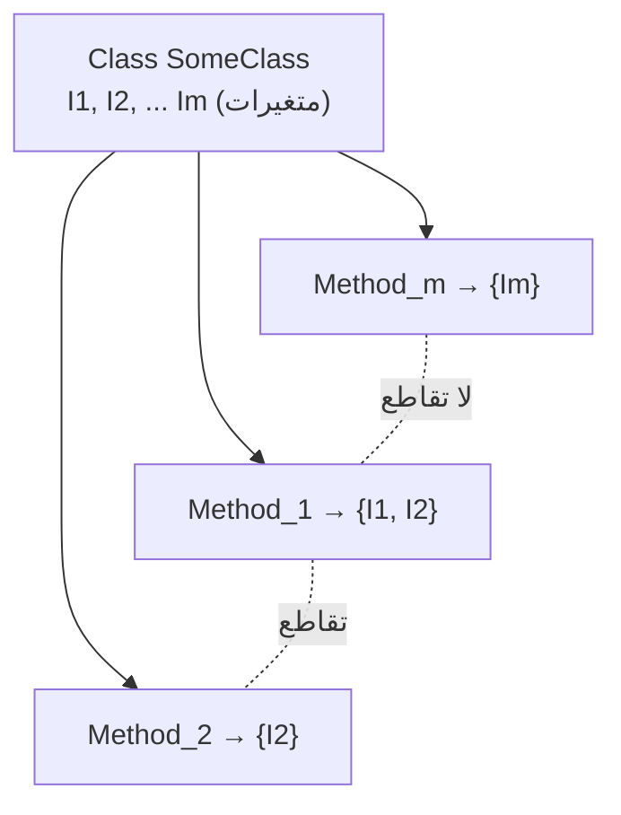

**الشرح:** `LCOM` يفحص أي الدوال تشترك بنفس المتغيرات (تقاطع) وأيها لا تشترك (منفصلة تماماً).

---

#### 📖 الشرح
تصميم كائني فعّال يسعى لتعظيم التماسك، لأن هذا يعزز التغليف (`encapsulation`). درجة تماسك عالية تعني: **الفئات مستقلة بذاتها (`self-contained`)**، وتحتاج **رسائل أقل** بين الكائنات (كفاءة أعلى).

**كيف نحسب `LCOM`؟** لكل دالة `Mi` في الفئة، نحدد مجموعة المتغيرات (`{Ii}`) التي تستخدمها. لو عندنا `n` دالة، عندنا `n` مجموعة: `{I1}, {I2}, …, {In}`. **`LCOM` = عدد المجموعات المنفصلة تماماً (`disjoint`)** الناتجة من تقاطع هذه المجموعات مع بعض.

**نقص التماسك (`Lack of Cohesion`) يعني إن الفئة يجب أن تُقسّم لفئتين أو أكثر** — لأنها فعلياً تقوم بأكثر من مسؤولية واحدة.

#### 🎯 الملخص السريع
- التماسك العالي = فئات مستقلة وفعّالة
- `LCOM`: عدد المجموعات المنفصلة من متغيرات الدوال
- `LCOM` عالي = يجب تقسيم الفئة

#### 📚 التطبيق
`LCOM` عالي إشارة مباشرة لانتهاك مبدأ المسؤولية الواحدة (`Single Responsibility Principle`) الذي غالباً يُدرّس في مواضيع OOP الأخرى.

#### ⚠️ أخطاء شائعة

#### الفهم الخاطئ ❌:
`LCOM` مرتفع يعني الفئة كبيرة الحجم فقط (كثرة أسطر).

#### الفهم الصحيح ✅:
`LCOM` مرتفع تحديداً يعني إن دوال الفئة لا تشترك بنفس البيانات — أي إنها تخدم أغراضاً مختلفة يجب فصلها في فئات منفصلة، بغض النظر عن حجم الكود.

#### 📄 النص الأصلي من المحاضرة
<details>
<summary>عرض النص الأصلي (coverage: 100%)</summary>

> A metric that measures the degree to which methods in a class are related to each other. Effective OO design maximizes cohesion because they promote encapsulation. High cohesion means: classes are self-contained, fewer messages need to be passed. LCOM = #disjoint sets formed by the intersection of the n sets. Lack of cohesion implies that a class should be split into 2 or more classes.

**ملاحظة على التغطية:**
- ✓ تم شرح التعريف وطريقة الحساب

</details>

---

### 5. مقاييس اعتمادية الحزم (Dependency Metrics: Ca, Ce)
<!-- @render: {type: "diagram-first", visualization: "hierarchy", coverage: "100%"} -->
<!-- @connectivity: {prerequisite: "4.4"} -->

#### 📍 أين نحن الآن؟
ننتقل من مستوى الفئة المفردة إلى مستوى الحزمة (`package`/`namespace`) بالكامل.

#### ⬅️ الربط مع السابق
بعد مقاييس التصميم داخل الفئات، نحتاج نفهم كيف تعتمد الحزم على بعضها البعض — هل الحزمة **مستقرة (`stable`)** أم **غير مستقرة (`unstable`)**؟

#### 💡 الفكرة الأساسية
**`Ca` يقيس الاعتماديات الواردة (كم فئة خارجية تعتمد عليّ)، و`Ce` يقيس الاعتماديات الصادرة (كم فئة أعتمد عليها أنا خارجياً).**

---

#### 📊 المخطط: مثال الحزم من المحاضرة

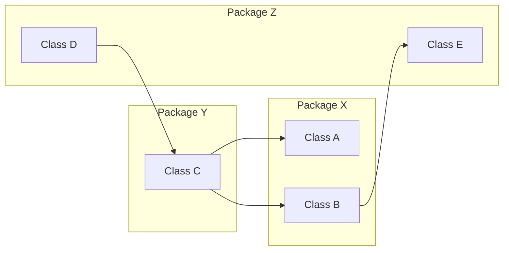

**الشرح:** هذا نفس مثال المحاضرة — `Package Y` (تحتوي `Class C`) لها `Ca(Y) = 1` (فقط `D` من خارج تعتمد عليها) و`Ce(Y) = 2` (تعتمد على `A` و`B` من خارجها).

---

#### 📖 الشرح
- **`Afferent Coupling (Ca)`**: عدد الفئات **خارج** الحزمة التي تعتمد على فئات **داخل** الحزمة (اعتماديات واردة، `incoming`).
- **`Efferent Coupling (Ce)`**: عدد الفئات **داخل** الحزمة التي تعتمد على فئات **خارج** الحزمة (اعتماديات صادرة، `outgoing`).

في مثال المحاضرة: `Package Y` تحتوي `Class C` فقط. `Class D` (من `Package Z`) تعتمد على `C` → هذا اعتماد وارد واحد، إذن `Ca(Y) = 1`. بالمقابل، `Class C` نفسها تعتمد على `A` و`B` (من `Package X`) → اعتمادان صادران، إذن `Ce(Y) = 2`.

#### 🎯 الملخص السريع
- `Ca`: اعتماديات واردة (من الخارج عليّ)
- `Ce`: اعتماديات صادرة (أنا على الخارج)
- تُحسب على مستوى الحزمة/الـ namespace

#### 📚 التطبيق
`Ca` و`Ce` يُستخدمان معاً لحساب مقياس **الاستقرار (`Instability`)** في القسم التالي.

#### ⚠️ أخطاء شائعة

#### الفهم الخاطئ ❌:
`Ca` و`Ce` يُحسبان على مستوى الفئة المفردة مثل `CBO`.

#### الفهم الصحيح ✅:
`Ca` و`Ce` يُحسبان على مستوى **الحزمة أو الـ namespace** ككل — أي علاقات الحزمة مع الحزم الأخرى، وليس فئة بمفردها.

#### 📄 النص الأصلي من المحاضرة
<details>
<summary>عرض النص الأصلي (coverage: 100%)</summary>

> Afferent Coupling (Ca): #classes outside the category depending on the classes inside the category (incoming dependencies). Efferent Coupling (Ce): #classes inside the category depending on classes outside the category (outgoing dependencies). Example: Ca(Y)=1, Ce(Y)=2.

**ملاحظة على التغطية:**
- ✓ تم شرح التعريف والمثال الكامل

</details>

---

### 5.1. عدم الاستقرار (Instability)
<!-- @render: {type: "diagram-first", visualization: "flowchart", coverage: "100%"} -->
<!-- @connectivity: {prerequisite: "5"} -->

#### 📍 أين نحن الآن؟
نستخدم `Ca` و`Ce` لبناء مقياس واحد نهائي يصف استقرار الحزمة.

#### ⬅️ الربط مع السابق
`Ca` و`Ce` أرقام خام؛ `Instability` يحولهما لنسبة واحدة سهلة الفهم بين 0 و1.

#### 💡 الفكرة الأساسية
**`i = Ce / (Ca + Ce)`: نسبة الاعتماديات الصادرة إلى إجمالي الاعتماديات — كلما اقتربت من 0 كانت الحزمة أكثر استقراراً.**

---

#### 📊 المخطط

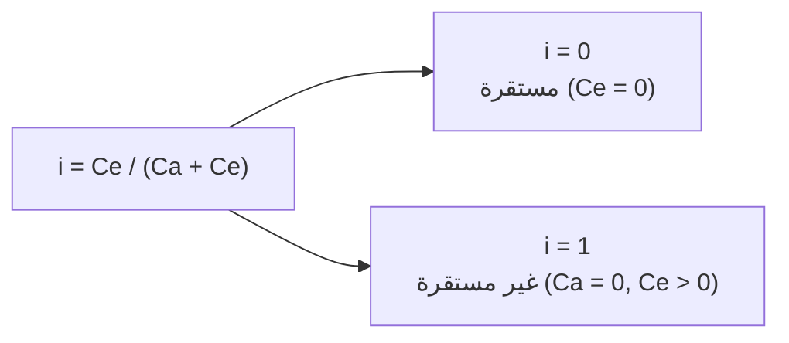

**الشرح:** القيمة القريبة من `0` تعني الحزمة يعتمد عليها الكثير بدون ما تعتمد هي على أحد (مستقرة). القيمة القريبة من `1` تعني العكس.

---

#### 📖 الشرح
`Instability` هي نسبة الاعتماديات الصادرة (`Ce`) إلى **إجمالي** الاعتماديات (`Ca + Ce`). لاحظ أهمية هذا:

- **حزمة مستقرة (`Stable`)**: `i ≈ 0` عندما `Ce = 0` — أي **لا أحد بداخلها يعتمد على شيء خارجي**، بينما آخرون قد يعتمدون عليها بكثرة. هذه حزمة "جيدة" أو "مستقلة" لأنها لا تحتاج تغيير عندما يتغير غيرها.
- **حزمة غير مستقرة (`Unstable`)**: `i ≈ 1` عندما `Ca = 0, Ce > 0` — أي **لا أحد يعتمد عليها**، لكنها هي بذاتها تعتمد على أشياء خارجية كثيرة. هذه حزمة "سيئة" أو "معتمِدة"، لأن أي تغيير في الحزم التي تعتمد عليها يجبرها على التغيير أيضاً.

#### 🎯 الملخص السريع
- `i = Ce / (Ca + Ce)`
- `i → 0`: مستقرة، مستقلة
- `i → 1`: غير مستقرة، معتمِدة على الغير

#### 📚 التطبيق
مصممو الأنظمة يسعون لجعل الحزم "الأساسية" (`core`) مستقرة (`i` منخفض) والحزم "التطبيقية" (التي تتغير كثيراً) غير مستقرة (`i` مرتفع) — هذا مبدأ معروف في هندسة البرمجيات (`Stable Dependencies Principle`).

#### ⚠️ أخطاء شائعة

#### الفهم الخاطئ ❌:
`Instability` مرتفع دائماً شيء سيء يجب تجنبه في كل الحزم.

#### الفهم الصحيح ✅:
بعض الحزم (مثل حزم واجهة المستخدم `UI`) من الطبيعي أن تكون غير مستقرة لأنها تتغير باستمرار وتعتمد على منطق العمل؛ المشكلة الحقيقية تكون عندما تكون حزم "أساسية" مفترض تكون مستقرة لكنها غير مستقرة فعلياً.

#### 📄 النص الأصلي من المحاضرة
<details>
<summary>عرض النص الأصلي (coverage: 100%)</summary>

> Ratio of outgoing dependencies to total number of dependencies. i = Ce / (Ca + Ce). Stable → i = 0 (Ce = 0). Unstable → i = 1 (Ca = 0, Ce > 0).

**ملاحظة على التغطية:**
- ✓ تم شرح الصيغة وحالتي الاستقرار وعدمه
- ℹ️ إضافة من الدليل: مثال UI مقابل حزم core

</details>

---

### 6. مقاييس المطورين والفريق (Developer & Team Metrics)
<!-- @render: {type: "diagram-first", visualization: "hierarchy", coverage: "100%"} -->
<!-- @connectivity: {prerequisite: "5.1"} -->

#### 📍 أين نحن الآن؟
ننتقل من مقاييس الكود إلى مقاييس الأشخاص والفريق الذي يكتبه.

#### ⬅️ الربط مع السابق
كل ما سبق قاس **الكود نفسه**؛ الآن نلمح لمقاييس تقيس **من يكتب الكود**.

#### 💡 الفكرة الأساسية
**مقاييس الفريق تشمل: الإنتاجية، المعرفة، الخبرة، وصحة التواصل داخل الفريق — لكن معظمها لم يُغطَّ بالتفصيل في هذه المادة، عدا الإنتاجية.**

---

#### 📊 المخطط

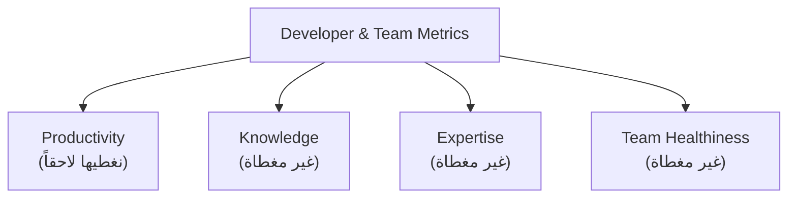

**الشرح:** المحاضرة تذكر 4 محاور، لكن فقط `Productivity` (وتحديداً `Code Churn`) مغطى بالتفصيل في هذا المقرر.

---

#### 📖 الشرح
تشمل مقاييس الفريق أربعة محاور: **الإنتاجية** (مدى نشاط المطورين وكمية العمل المنجز)، **المعرفة** (مدى فهم المطورين للنظام الذي يعملون عليه)، **الخبرة** (الأدوات والمكتبات المستخدمة)، و**صحة الفريق** (التواصل ومشاركة المعرفة). المحاضرة توضح صراحة إن آخر ثلاثة محاور (`Knowledge, Expertise, Team Healthiness`) **غير مغطاة في هذا المقرر** — وسنركز فقط على الإنتاجية عبر مقياس `Code Churn` في القسم القادم.

#### 🎯 الملخص السريع
- 4 محاور: Productivity, Knowledge, Expertise, Team Healthiness
- المُغطّى فعلياً هنا: Productivity فقط (Code Churn)

#### 📚 التطبيق
هذا القسم مقدمة مختصرة قبل الدخول في تفاصيل `Code Churn` مباشرة.

#### ⚠️ أخطاء شائعة

#### الفهم الخاطئ ❌:
المحاضرة تغطي كل جوانب مقاييس الفريق الأربعة بالتفصيل.

#### الفهم الصحيح ✅:
المحاضرة نفسها تنص صراحة إن `Knowledge, Expertise, Team Healthiness` غير مغطاة في هذا المقرر (`Not covered in this course`)، والمُفصّل فقط هو الإنتاجية.

#### 📄 النص الأصلي من المحاضرة
<details>
<summary>عرض النص الأصلي (coverage: 100%)</summary>

> Productivity: How active developers are? How much work is being done? Knowledge: How much developers know the software they are working on? Expertise: What kind of tools and libraries developers use? Team "Healthiness": Communication and knowledge sharing. [Not covered in this course]

**ملاحظة على التغطية:**
- ✓ تم ذكر كل المحاور والإشارة الصريحة لغير المغطى

</details>

---

### 6.1. مقاييس الإنتاجية: Code Churn
<!-- @render: {type: "diagram-first", visualization: "hierarchy", coverage: "100%"} -->
<!-- @connectivity: {prerequisite: "6"} -->

#### 📍 أين نحن الآن؟
تفصيل المحور الوحيد المغطى من مقاييس الفريق: الإنتاجية.

#### ⬅️ الربط مع السابق
بعد ما عرفنا إن الإنتاجية هي المحور المُغطى، نتعرف على مقياسها العملي: `Code Churn`.

#### 💡 الفكرة الأساسية
**`Code Churn` يقيس كمية الكود المتغيّر في البرنامج خلال فترة زمنية معينة.**

---

#### 📊 المخطط

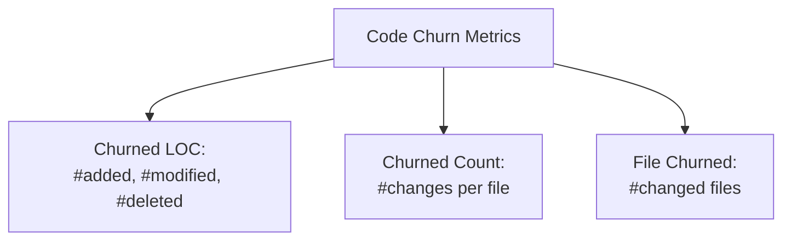

**الشرح:** ثلاثة أشكال لقياس التغيير: على مستوى السطر، على مستوى عدد مرات التعديل، وعلى مستوى الملفات المتأثرة.

---

#### 📖 الشرح
`Code Churn` هو ببساطة **كمية الكود التي تغيّرت** في مدة زمنية (يومياً، أسبوعياً، إلخ). يُقاس بثلاث طرق:
- **`Churned LOC`**: عدد الأسطر المُضافة (`added`)، المُعدّلة (`modified`)، والمحذوفة (`deleted`).
- **`Churned Count`**: عدد التغييرات (`commits`/تعديلات) التي حصلت على ملف واحد.
- **`File Churned`**: عدد الملفات التي تغيّرت خلال الفترة.

هذا المقياس مفيد لمعرفة أي أجزاء الكود "ساخنة" (`hot spots`) وتحتاج تعديل مستمر — غالباً ما ترتبط الملفات ذات `churn` عالٍ بمعدل أخطاء أعلى.

#### 🎯 الملخص السريع
- `Churned LOC`: أسطر مضافة/معدّلة/محذوفة
- `Churned Count`: عدد مرات تعديل الملف
- `File Churned`: عدد الملفات المتغيّرة

#### 📚 التطبيق
تُستخدم في تحليل جودة الفريق وتوقع أماكن الأخطاء المحتملة — الملفات كثيرة التعديل تحتاج مراجعة أدق.

#### ⚠️ أخطاء شائعة

#### الفهم الخاطئ ❌:
`Code Churn` عالٍ دليل على إنتاجية عالية بالضرورة.

#### الفهم الصحيح ✅:
`Code Churn` العالي قد يعني إما فريق نشط فعلاً، أو (بشكل أشيع) كود غير مستقر يحتاج تعديلات متكررة بسبب تصميم سيء أو أخطاء متكررة — يحتاج تفسير حسب السياق.

#### 📄 النص الأصلي من المحاضرة
<details>
<summary>عرض النص الأصلي (coverage: 100%)</summary>

> Amount of code changed in the software during a period of time. Churned LOC: #added, #modified, #deleted LOC. Churned Count: #changes made to a file. File Churned: #changed files.

**ملاحظة على التغطية:**
- ✓ تم شرح كل نقطة

</details>

---

### 7. مقاييس الجودة: Defect Density
<!-- @render: {type: "diagram-first", visualization: "hierarchy", coverage: "100%"} -->
<!-- @connectivity: {prerequisite: "6.1"} -->

#### 📍 أين نحن الآن؟
ننتقل من مقاييس الفريق إلى مقاييس جودة المنتج النهائي.

#### ⬅️ الربط مع السابق
بعد ما قسنا التغيير في الكود، نقيس الآن نتيجة هذا الكود: هل فيه أخطاء (`defects`)؟

#### 💡 الفكرة الأساسية
**`Defect Density` = عدد الأخطاء مقسوماً على حجم النظام، ويصف معدل الأخطاء نسبةً لحجم الوظيفة.**

---

#### 📊 المخطط

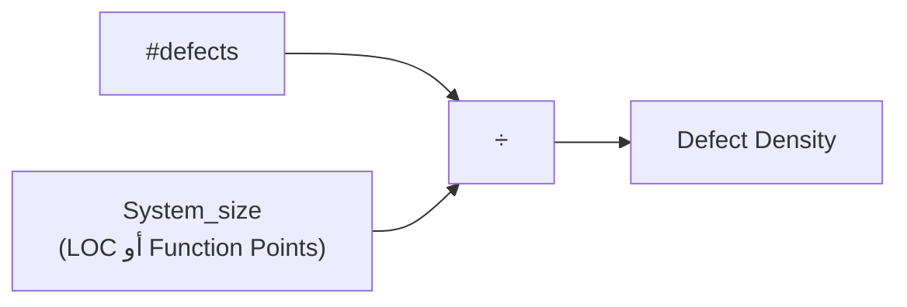

**الشرح:** كلما زاد الحجم بالنسبة لعدد الأخطاء الثابت، انخفضت الكثافة — والعكس صحيح.

---

#### 📖 الشرح
`Defect Density` هو **مقياس معدل (`rate-metric`)** يصف كم عدد الأخطاء التي تحدث لكل وحدة حجم/وظيفة في النظام. الصيغة: `#defects / System_size`.

`System_size` هنا مرن — يمكن أن يُبنى على **`LOC`** (عدد الأسطر) أو **`Function Points`** (وحدة قياس وظيفية بديلة عن الأسطر). هذا يجعل `Defect Density` مقياساً عادلاً للمقارنة بين أنظمة مختلفة الحجم، بعكس عدد الأخطاء الخام وحده.

#### 🎯 الملخص السريع
- `Defect Density = #defects / System_size`
- `System_size`: يمكن أن يكون `LOC` أو `Function Points`
- مقياس معدل (`rate metric`) يسمح بالمقارنة العادلة

#### 📚 التطبيق
يُستخدم لمقارنة جودة إصدارات مختلفة من نفس المنتج، أو مقارنة فرق مختلفة على نفس المعيار.

#### ⚠️ أخطاء شائعة

#### الفهم الخاطئ ❌:
نظام فيه عدد أخطاء مطلق أكبر هو دائماً أسوأ جودة.

#### الفهم الصحيح ✅:
العدد المطلق للأخطاء غير كافٍ للمقارنة؛ نظام أكبر حجماً طبيعي يكون فيه عدد أخطاء أكبر مطلقاً لكن `Defect Density` قد يكون أقل (أفضل) من نظام أصغر.

#### 📄 النص الأصلي من المحاضرة
<details>
<summary>عرض النص الأصلي (coverage: 100%)</summary>

> A rate-metric which describes how many defects occur for each size/functionality unit of a system. #defects / System_size. Size can be based on LOC or Function Points.

**ملاحظة على التغطية:**
- ✓ تم شرح التعريف والصيغة والمصادر البديلة للحجم

</details>

---

### 7.1. مقاييس الجودة: Failure Rate
<!-- @render: {type: "diagram-first", visualization: "hierarchy", coverage: "100%"} -->
<!-- @connectivity: {prerequisite: "7"} -->

#### 📍 أين نحن الآن؟
آخر مقياس جودة في المحاضرة، ويربط الأخطاء بالزمن بدل الحجم.

#### ⬅️ الربط مع السابق
`Defect Density` قاس الأخطاء نسبةً للحجم؛ `Failure Rate` يقيسها نسبةً للوقت.

#### 💡 الفكرة الأساسية
**`Failure Rate (λ)` هو معدل ظهور الأعطال عبر الزمن، محسوباً من دالة الموثوقية (`Reliability function R(t)`).**

---

#### 📊 المخطط

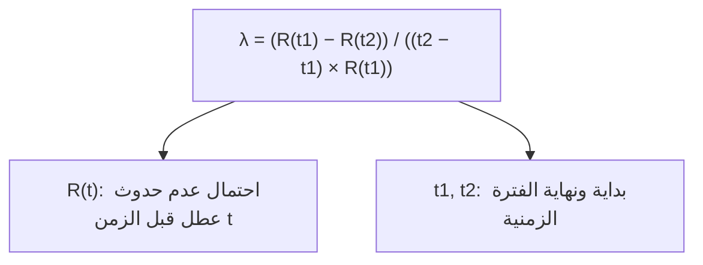

**الشرح:** المعادلة تقيس مدى انخفاض الموثوقية بين نقطتين زمنيتين، نسبةً للفترة والموثوقية عند البداية.

---

#### 📖 الشرح
`Failure Rate` يعبّر عنه بالرمز `λ` ويُحسب بالصيغة:

`λ = (R(t1) − R(t2)) / ((t2 − t1) × R(t1))`

حيث:
- **`R(t)`**: دالة الموثوقية (`Reliability function`) — أي احتمال عدم حدوث أي عطل قبل الزمن `t`.
- **`t1`, `t2`**: بداية ونهاية الفترة الزمنية المحددة التي نقيس فيها معدل الأعطال.

كلما كان الفرق `R(t1) − R(t2)` كبيراً (يعني الموثوقية انخفضت كثيراً خلال الفترة)، ارتفع معدل الفشل `λ`.

#### 🎯 الملخص السريع
- `λ = (R(t1) − R(t2)) / ((t2 − t1) × R(t1))`
- `R(t)`: احتمال عدم وجود عطل قبل الزمن `t`
- يقيس الأعطال عبر الزمن (بعكس `Defect Density` الذي يقيسها عبر الحجم)

#### 📚 التطبيق
يُستخدم في مرحلة الصيانة والتشغيل (`post-deployment`) لتقييم مدى موثوقية النظام مع الوقت، خصوصاً في الأنظمة الحرجة.

#### ⚠️ أخطاء شائعة

#### الفهم الخاطئ ❌:
`Failure Rate` و`Defect Density` نفس الشيء لأنهما يتعلقان بالأخطاء.

#### الفهم الصحيح ✅:
`Defect Density` مقياس ثابت بالنسبة للحجم (لا يتغير بمرور الوقت)، بينما `Failure Rate` مقياس ديناميكي يقيس معدل ظهور الأعطال **عبر فترة زمنية محددة**، بناءً على دالة الموثوقية.

#### 📄 النص الأصلي من المحاضرة
<details>
<summary>عرض النص الأصلي (coverage: 100%)</summary>

> Rate of defects over time. λ = (R(t1) – R(t2)) / ((t2-t1) x R(t1)). Where: R(t) is the reliability function, i.e. probability of no failure before time t. t1 and t2 are the beginning and ending of specified interval of time.

**ملاحظة على التغطية:**
- ✓ تم شرح الصيغة وكل المتغيرات

</details>

---

### 8. أدوات قياس المقاييس (Tools)
<!-- @render: {type: "diagram-first", visualization: "hierarchy", coverage: "100%"} -->
<!-- @connectivity: {prerequisite: "7.1"} -->

#### 📍 أين نحن الآن؟
ختام المحاضرة — كيف نحسب هذه المقاييس عملياً بدل الحساب اليدوي.

#### ⬅️ الربط مع السابق
بعد كل المقاييس النظرية (`DIT, NOC, CBO, LCOM`...)، نحتاج أدوات تحسبها آلياً.

#### 💡 الفكرة الأساسية
**توجد إضافات (`plugins`) جاهزة لبيئات التطوير (`IDE`) تحسب هذه المقاييس تلقائياً: `SourceCodeMetrics` لـ NetBeans، و`Metrics` لـ Eclipse.**

---

#### 📊 المخطط: خطوات استخدام SourceCodeMetrics

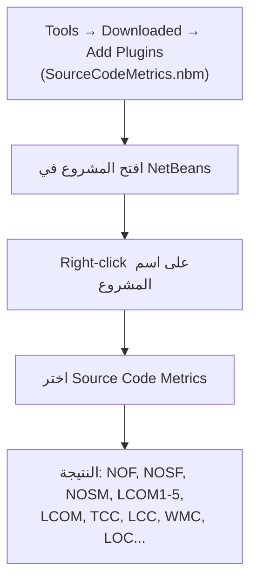

**الشرح:** خطوات تثبيت واستخدام الإضافة في NetBeans، من التثبيت حتى ظهور تقرير المقاييس.

---

#### 📖 الشرح
في **NetBeans**: تُثبّت إضافة `SourceCodeMetrics` عبر `Tools → Downloaded → Add Plugins` (ملف `SourceCodeMetrics.nbm`). بعد التثبيت تجدها في قائمة `Tools`. تفتح مشروعك، تضغط بزر الفأرة الأيمن على اسم المشروع في لوحة `Projects`، وتختار `Source Code Metrics`.

النتيجة تظهر في نافذة الإخراج (`Output`) وتشمل مقاييس عديدة: `NOF, NOSF, NOSM, LCOM1, LCOM2, ... LCOM5, LCOM, TCC, LCC, WMC, LOC` وغيرها — كثير منها امتدادات أو نسخ بديلة لما شرحناه في هذه المحاضرة.

في **Eclipse**: توجد إضافة مشابهة اسمها `Metrics` تؤدي نفس الغرض.

#### 🎯 الملخص السريع
- NetBeans: إضافة `SourceCodeMetrics`
- Eclipse: إضافة `Metrics`
- تحسب تلقائياً: `NOF, NOSM, LCOM, WMC, LOC` وغيرها

#### 📚 التطبيق
بدل الحساب اليدوي لكل مقياس شرحناه، الأدوات تعطيك النتائج مباشرة على كودك الحقيقي — مفيد جداً في المشاريع العملية والواجبات.

#### ⚠️ أخطاء شائعة

#### الفهم الخاطئ ❌:
هذه الأدوات حصرية لـ NetBeans فقط، ولا يوجد بديل لبيئات أخرى.

#### الفهم الصحيح ✅:
المحاضرة تذكر أداتين على الأقل — `SourceCodeMetrics` لـ NetBeans و`Metrics` لـ Eclipse — أي المفهوم مدعوم عبر أكثر من بيئة تطوير.

#### 📄 النص الأصلي من المحاضرة
<details>
<summary>عرض النص الأصلي (coverage: 100%)</summary>

> For Netbeans: SourceCodeMetrics plugin. For Eclipse: Metrics plugin. After installing, you will find it in Tools menu. Open your project. Right click on project name in Projects panel. Choose Source Code Metrics. NOF, NOSF, NOSM, LCOM1, LCOM2,…LCOM5, LCOM, TCC, LCC, WMC, LOC,…

**ملاحظة على التغطية:**
- ✓ تم شرح كل خطوة وكل الأدوات المذكورة

</details>

---

## الجزء الثاني: ملخص شامل (Alternative Complete Reading)

لو قرأت التفصيل السابق وحسيت إنه كثير أو معقد، أو كنت تراجع سريع قبل الامتحان، هذا الملخص يغطي كل شيء بأسلوب سردي أبسط.

كل الموضوع يدور حول فكرة واحدة: **كيف نحوّل خصائص البرمجية لأرقام نقدر نحكم عليها بدل ما نعتمد على الإحساس؟** القياس بشكل عام هو ربط رقم بخاصية فيزيائية — زي الوزن بالجرام أو الطول بالمتر — وبمجرد ما يصير عندنا رقم نقدر نقول "هذا أعلى" أو "هذا أثقل". نفس المنطق ينطبق على البرمجيات: بدل ما نقول "هذا الكود معقد" بالإحساس، `Software Metrics` تعطينا أرقام فعلية لتقييم التعقيد، الأداء، الأمان، والتكلفة.

أبسط مقياس هو **حجم المنتج** عبر `LOC` (عدد أسطر الكود، وبالآلاف `KLOC`). المشكلة إن `LOC` قرار غير واضح: هل نعدّ الأسطر الفارغة؟ التعليقات؟ لو كتبت عدة statements بسطر واحد؟ كل قرار يغيّر الرقم النهائي. وأكبر مشكلتين: `LOC` يعتمد على اللغة البرمجية نفسها (نفس المنطق قد يحتاج أسطر أكثر بلغة معينة)، ولا يعكس التعقيد الفعلي للكود — ممكن برنامج قصير يكون أعقد من برنامج طويل. وأيضاً لازم تنتظر اكتمال النظام فعلياً عشان تحسبه.

المقياس الأهم للتعقيد هو **`Cyclomatic Complexity` (`CC`) لماكيب** (McCabe، 1976)، ويحسب عدد المسارات المستقلة خطياً داخل دالة معينة عبر الصيغة `V(G) = e − n + 2p` حيث `e` عدد الحواف في مخطط التدفق، `n` عدد العُقد، و`p` عدد الأجزاء غير المتصلة. مثال المحاضرة: دالة `showClients` التي تطبع قائمة عملاء (مع حالة خاصة لو القائمة فاضية) لها `E=7, N=6, P=1` فيصير `V(G) = 7−6+2 = 3` — يعني 3 مسارات مستقلة (المسار العادي، مسار التكرار، ومسار الحالة الخاصة). القاعدة العملية: **إذا تجاوز `V(G)` الرقم 10، احتمال وجود أخطاء يرتفع بشكل ملحوظ**، ولذلك تُستخدم كإشارة تحذير لفرق QA لتحديد أولويات الاختبار. `CC` أيضاً يعطي حداً أعلى لعدد حالات اختبار الفروع (`branch coverage`) وحداً أدنى لتغطية المسارات (`path coverage`)، لكنه لا يعكس أنواع تعقيد أخرى مثل بنية البيانات أو الواجهات.

بعد الدوال المفردة، ننتقل لتصميم الفئات كاملة عبر مجموعة **`Chidamber & Kemerer` (1994)** المكونة من ستة مقاييس: `DIT, NOC, WMC, RFC, CBO, LCOM`. من المهم أن تُقرأ هذه المقاييس مع بعض وليس كل واحد بمفرده، لأن فئة قد تكون منخفضة في مقياس وعالية في آخر. القاعدة العملية المذكورة: `WMC` بقيمة 20 لفئة تُعتبر جيدة، لكن يُفضّل عدم تجاوز 40.

**`DIT` (Depth of Inheritance Tree)** يقيس أقصى مسافة بين فئة الجذر (التي يكون `DIT` لها دائماً = 0) وأي فئة في شجرة الوراثة؛ وفي حالة الوراثة المتعددة، `DIT` هو أقصى مسافة بينها. كلما كانت الفئة أعمق في الشجرة، كلما زاد عدد الدوال التي ترثها من الآباء وبالتالي زاد عدد الدوال المطلوب اختبارها. الشجرة الأعمق تعني إعادة استخدام (`reuse`) أكبر، لكن أيضاً تعقيد تصميم أكبر — مقايضة حقيقية وليست دائماً "جيدة" أو "سيئة" بشكل مطلق.

**`NOC` (Number of Children)** يعدّ عدد الفئات الفرعية المباشرة لفئة معينة. القاعدة العامة: يُفضّل العمق على العرض في هرمية الفئات لأن العمق يشجع reuse أكثر. `NOC` عالي يعطي مؤشراً على تأثير كبير لتلك الفئة على التصميم العام — أي خطأ فيها ينتشر لعدد كبير من الفئات الفرعية دفعة واحدة، وهذا يجعلها نقطة هشة محتملة يجب مراقبتها بعناية.

**الاقتران (`Coupling`)** هو قوة الارتباط بين الفئات المختلفة، ويحدث بطريقتين: استخدام دوال كائن آخر، أو الوراثة. لكن `CBO` (Coupling Between Objects) يهتم فقط بالنوع الأول — أي العلاقات خارج شجرة الوراثة. في مثال المحاضرة، `Class B` مرتبطة مع `A` و`C` و`D` فـ `CBO(B) = 3`. الاقتران المفرط خارج الوراثة يضر بالتصميم المعياري ويمنع إعادة الاستخدام؛ كل ما كان الكائن أكثر استقلالية، كل ما كان أسهل إعادة استخدامه، وكل ما زاد الاقتران زادت حساسية النظام للتغييرات واحتجنا اختباراً أكثر. القاعدة الذهبية المتكررة في المحاضرة: **حافظ على اقتران منخفض لكن تماسك عالي (`Keep low coupling but high cohesion`)**.

**التماسك (`Cohesion`)** يقيس مدى ارتباط دوال الفئة الواحدة ببعضها. تصميم كائني فعّال يسعى لتعظيم التماسك لأنه يعزز التغليف (`encapsulation`) — الفئات ذات التماسك العالي مستقلة بذاتها وتحتاج رسائل أقل بينها وبين غيرها (كفاءة أعلى). `LCOM` (Lack of Cohesion in Methods) يُحسب بأخذ مجموعة المتغيرات المستخدمة في كل دالة `{I1}, {I2}, …, {In}`، ثم عدّ عدد المجموعات المنفصلة تماماً (`disjoint`) بعد تقاطعها مع بعض. لو `LCOM` عالٍ، هذا يعني الفئة فعلياً تخدم أكثر من مسؤولية وتحتاج تُقسّم لفئتين أو أكثر — وهذا مرتبط مباشرة بمبدأ المسؤولية الواحدة الذي تعرفه من مواضيع أخرى.

بعد مستوى الفئة، ننتقل لمستوى الحزمة (`package`/`namespace`) عبر مقاييس **`Ca` و`Ce`**. `Afferent Coupling (Ca)` يعدّ عدد الفئات خارج الحزمة التي تعتمد على فئات داخلها (اعتماديات واردة)، بينما `Efferent Coupling (Ce)` يعدّ عدد الفئات داخل الحزمة التي تعتمد على فئات خارجها (اعتماديات صادرة). في مثال المحاضرة عن `Package Y` (تحتوي `Class C`): `Class D` من الخارج تعتمد على `C` فـ `Ca(Y)=1`، بينما `C` نفسها تعتمد على `A` و`B` من الخارج فـ `Ce(Y)=2`.

من هذين الرقمين نحصل على **`Instability`**: `i = Ce / (Ca + Ce)`. الحزمة **المستقرة (`Stable`)** لها `i ≈ 0` عندما `Ce = 0` — أي لا شيء بداخلها يعتمد على الخارج بينما آخرون يعتمدون عليها بكثرة، وهذه حزمة "مستقلة" لا تحتاج تغيير عند تغيّر غيرها. أما الحزمة **غير المستقرة (`Unstable`)** فلها `i ≈ 1` عندما `Ca = 0, Ce > 0` — لا أحد يعتمد عليها لكنها تعتمد على أشياء خارجية كثيرة، فأي تغيير في تلك الأشياء يجبرها على التغيير أيضاً. بعض الحزم (مثل واجهات المستخدم) من الطبيعي أن تكون غير مستقرة لأنها تتغير باستمرار؛ المشكلة الحقيقية تكون في الحزم "الأساسية" (`core`) التي يُفترض أن تكون مستقرة لكنها غير مستقرة فعلياً.

بعد مقاييس الكود، تذكر المحاضرة **مقاييس الفريق والمطورين** التي تشمل أربعة محاور: الإنتاجية، المعرفة، الخبرة، وصحة الفريق (التواصل ومشاركة المعرفة) — لكن المحاضرة تنص صراحة إن آخر ثلاثة محاور **غير مغطاة في هذا المقرر**، والمُفصّل فقط هو الإنتاجية عبر مقياس **`Code Churn`**، أي كمية الكود المتغيرة خلال فترة زمنية معينة. يُقاس بثلاث طرق: `Churned LOC` (عدد الأسطر المضافة/المعدّلة/المحذوفة)، `Churned Count` (عدد التغييرات على ملف واحد)، و`File Churned` (عدد الملفات المتغيرة). هذا المقياس يساعد في تحديد "الأماكن الساخنة" (`hot spots`) في الكود التي تُعدّل باستمرار، وغالباً ما ترتبط بمعدل أخطاء أعلى — رغم إن `churn` عالٍ لا يعني دائماً إنتاجية عالية، فقد يعني كوداً غير مستقر يحتاج تعديلات متكررة بسبب تصميم سيء.

أخيراً، تغطي المحاضرة مقياسين لجودة المنتج النهائي: **`Defect Density`** و**`Failure Rate`**. `Defect Density` هو مقياس معدل (`rate-metric`) يصف كم عدد الأخطاء لكل وحدة حجم/وظيفة: `#defects / System_size`، حيث `System_size` يمكن أن يكون بـ`LOC` أو بـ`Function Points` — وهذا يجعله مقياساً عادلاً للمقارنة بين أنظمة مختلفة الحجم، بعكس العدد المطلق للأخطاء وحده. أما **`Failure Rate (λ)`** فيقيس معدل الأعطال عبر الزمن (وليس عبر الحجم) بالصيغة `λ = (R(t1) − R(t2)) / ((t2−t1) × R(t1))`، حيث `R(t)` هي دالة الموثوقية (احتمال عدم حدوث عطل قبل الزمن `t`)، و`t1, t2` بداية ونهاية الفترة الزمنية. كل ما انخفضت `R` بشكل كبير بين النقطتين، ارتفع معدل الفشل — مفيد جداً في مرحلة التشغيل والصيانة لتقييم موثوقية النظام مع الوقت.

ختمت المحاضرة بذكر أدوات عملية لحساب كل هذه المقاييس آلياً بدل الحساب اليدوي: إضافة **`SourceCodeMetrics`** لبيئة `NetBeans` (تُثبّت عبر `Tools → Downloaded → Add Plugins`، ثم تُستخدم بالضغط بزر الفأرة الأيمن على المشروع واختيار `Source Code Metrics`، لتظهر مقاييس مثل `NOF, NOSM, LCOM1-5, WMC, LOC` وغيرها)، وإضافة **`Metrics`** لبيئة `Eclipse` لنفس الغرض.

**نقطة مهمة للامتحان:** ركّز جيداً على الصيغ الثلاث الأساسية — `V(G) = e − n + 2p`، `i = Ce/(Ca+Ce)`، و`Defect Density = #defects/System_size` — لأنها الأكثر ترجيحاً للظهور في أسئلة حسابية مباشرة. وركّز أيضاً على الفرق العملي بين كل من `DIT` (وراثة/عمق)، `NOC` (وراثة/عرض)، `CBO` (اقتران خارج الوراثة)، و`LCOM` (تماسك داخل الفئة) — لأن الأسئلة كثيراً ما تختبر قدرتك على التفريق بينها.

**الربط مع المحاضرة الجاية:** بعد ما تعلمنا كيف نقيس ونشخص مشاكل التصميم، المحاضرة التالية غالباً ستكمل الموضوع بتفاصيل إضافية حول مقاييس أخرى (كما أشارت آخر شريحة "More about metrics — Next Lecture").

---

## الجزء الثالث: أسئلة اختيار من متعدد (MCQ)

### السؤال 1 (Easy)

**السؤال:** When calculating LOC (Lines of Code) for a software system, which of the following is a genuine ambiguity the team must decide on?

أ) Whether to count empty lines, comments, and multiple statements on one line
ب) Whether the programming language used is object-oriented or not
ج) Whether the system runs on Windows or Linux
د) Whether the developer used an IDE or a text editor

**الإجابة الصحيحة:** أ

**التعليل الكامل:**
- ✅ أ): المحاضرة تذكر صراحة إن القرار (Yes/No) يشمل الأسطر الفارغة، التعليقات، وعدة statements في سطر واحد — وهذا يغيّر الرقم النهائي فعلياً.
- ❌ ب): كون اللغة كائنية التوجه أو لا لا علاقة له بطريقة عدّ الأسطر نفسها.
- ❌ ج): نظام التشغيل لا يؤثر على قرار عدّ الأسطر إطلاقاً.
- ❌ د): أداة الكتابة (IDE أو محرر نصوص) لا تُغيّر كيفية حساب `LOC`.

---

### السؤال 2 (Medium)

**السؤال:** What is the correct formula for McCabe's Cyclomatic Complexity V(G)?

أ) V(G) = n − e + 2p
ب) V(G) = e − n + 2p
ج) V(G) = e + n − 2p
د) V(G) = e × n / p

**الإجابة الصحيحة:** ب

**التعليل الكامل:**
- ❌ أ): هذا عكس ترتيب `e` و`n` في المعادلة، وهو خطأ شائع لأن الطالب يخلط الترتيب.
- ✅ ب): هذه هي الصيغة كما وردت في المحاضرة تماماً: `e` عدد الحواف، `n` عدد العُقد، `p` عدد الأجزاء غير المتصلة.
- ❌ ج): استخدام الجمع بدل الطرح وتغيير إشارة `2p` يغيّر المعنى الرياضي بالكامل.
- ❌ د): هذه ليست صيغة `V(G)` إطلاقاً — لا وجود لعملية الضرب أو القسمة في المعادلة الأصلية.

---

### السؤال 3 (Medium)

**السؤال:** In the lecture's example (the `showClients` function), the flow graph has E=7, N=6, P=1. What is V(G)?

أ) 1
ب) 2
ج) 3
د) 4

**الإجابة الصحيحة:** ج

**التعليل الكامل:**
- ❌ أ): لو حسبت `V(G) = 1` فأنت غالباً استخدمت `p` فقط بدون تطبيق المعادلة الكاملة.
- ❌ ب): القيمة `2` غير صحيحة حسابياً؛ التعويض الصحيح: `7 − 6 + 2(1) = 3`.
- ✅ ج): بتطبيق `V(G) = e − n + 2p = 7 − 6 + 2×1 = 3`، وهذا مطابق تماماً لما ورد في شريحة المحاضرة.
- ❌ د): القيمة `4` أعلى من الناتج الفعلي؛ ربما ناتج جمع خاطئ للأرقام.

---

### السؤال 4 (Easy)

**السؤال:** According to the lecture, what happens when Cyclomatic Complexity V(G) exceeds 10?

أ) The class hierarchy depth increases
ب) The function automatically becomes multi-threaded
ج) The LOC count becomes invalid
د) The probability of defects rises

**الإجابة الصحيحة:** د

**التعليل الكامل:**
- ❌ أ): عمق شجرة الوراثة (`DIT`) لا علاقة له بـ `Cyclomatic Complexity`؛ هذان مقياسان مختلفان تماماً.
- ❌ ب): `CC` مقياس ساكن لتحليل الكود، ولا علاقة له بتحويل الدالة إلى متعددة الخيوط (`multi-threaded`) بأي شكل.
- ❌ ج): `LOC` مقياس منفصل تماماً عن `CC`؛ تجاوز `V(G)` لـ 10 لا يبطل حساب `LOC`.
- ✅ د): المحاضرة تنص صراحة: `V(G) > 10 → defects prob. rises`، أي احتمال وجود أخطاء في الدالة يرتفع.

---

### السؤال 5 (Easy)

**السؤال:** What is the DIT (Depth of Inheritance Tree) value of a root class?

أ) 1
ب) 0
ج) Equal to NOC
د) Undefined

**الإجابة الصحيحة:** ب

**التعليل الكامل:**
- ❌ أ): القيمة `1` تخص أول فئة فرعية مباشرة من الجذر، وليست الجذر نفسه.
- ✅ ب): المحاضرة تنص صراحة: `Root class has DIT of 0`.
- ❌ ج): `DIT` و`NOC` مقياسان مستقلان تماماً؛ لا توجد علاقة تساوٍ بينهما.
- ❌ د): `DIT` للجذر معرّف بوضوح (=0)، وليس قيمة غير محددة.

---

### السؤال 6 (Medium)

**السؤال:** Regarding class hierarchy design, what does the lecture recommend?

أ) Breadth is always preferred over depth for easier testing
ب) It is generally better to have depth than breadth in the class hierarchy
ج) NOC and DIT should always be kept at zero
د) Multiple inheritance should be avoided in all designs

**الإجابة الصحيحة:** ب

**التعليل الكامل:**
- ❌ أ): المحاضرة تقول العكس تماماً — العرض ليس مفضلاً على العمق.
- ✅ ب): النص الأصلي: `Generally it is better to have depth than breadth in the class hierarchy (Promotes reuse of methods through inheritance)`.
- ❌ ج): إبقاء `NOC` و`DIT` عند صفر يعني عدم وجود أي وراثة إطلاقاً، وهذا ليس ما تنصح به المحاضرة.
- ❌ د): المحاضرة تناقش الوراثة المتعددة (`multiple inheritance`) كحالة موجودة وتشرح كيف يُحسب `DIT` فيها، دون أن تنهى عنها.

---

### السؤال 7 (Hard)

**السؤال:** What exactly does CBO (Coupling Between Objects) count for a particular class?

أ) The total number of methods the class defines
ب) The number of instance variables used across all methods
ج) The number of subclasses inheriting from the class
د) The count of non-inheritance related couples it maintains with other classes

**الإجابة الصحيحة:** د

**التعليل الكامل:**
- ❌ أ): عدد الدوال الإجمالي يخص `WMC` (Weighted Methods per Class)، وليس `CBO`.
- ❌ ب): استخدام المتغيرات عبر الدوال هو أساس حساب `LCOM`، وليس `CBO`.
- ❌ ج): عدد الفئات الفرعية الوارثة هو تعريف `NOC`، وهو مقياس منفصل تماماً عن الاقتران.
- ✅ د): النص الأصلي بالضبط: `CBO for a particular class is a count of how many non-inheritance related couples it maintains with other classes`.

---

### السؤال 8 (Easy)

**السؤال:** According to the lecture's golden rule about class design, what should a good design maintain?

أ) Low coupling but high cohesion
ب) High coupling and high cohesion
ج) Low coupling and low cohesion
د) High coupling but low cohesion

**الإجابة الصحيحة:** أ

**التعليل الكامل:**
- ✅ أ): الشريحة تنص حرفياً: `Keep low coupling but high cohesion` — وهي القاعدة الذهبية المكررة في المحاضرة.
- ❌ ب): اقتران عالٍ يضر بالتصميم المعياري ويمنع إعادة الاستخدام، فهو غير مرغوب حتى لو التماسك عالٍ.
- ❌ ج): تماسك منخفض يعني الفئة تخدم مسؤوليات متعددة، وهذا عكس ما ينصح به التصميم الفعّال.
- ❌ د): هذا عكس القاعدة الذهبية تماماً — المطلوب اقتران منخفض وليس عالياً.

---

### السؤال 9 (Hard)

**السؤال:** If a class has a high LCOM (Lack of Cohesion in Methods) value, what does this most likely imply?

أ) The class is too simple and should be merged with another
ب) The class needs more instance variables added
ج) The class should be split into two or more classes
د) The class has too many subclasses

**الإجابة الصحيحة:** ج

**التعليل الكامل:**
- ❌ أ): `LCOM` عالٍ لا علاقة له ببساطة الفئة، بل بانعدام الترابط بين دوالها.
- ❌ ب): إضافة متغيرات جديدة لا تحل مشكلة نقص التماسك، وقد تزيدها سوءاً.
- ✅ ج): النص الأصلي: `Lack of cohesion implies that a class should be split into 2 or more classes` — لأنها فعلياً تخدم مسؤوليات متعددة غير مترابطة.
- ❌ د): عدد الفئات الفرعية يخص `NOC`، ولا علاقة مباشرة له بـ `LCOM`.

---

### السؤال 10 (Medium)

**السؤال:** What does Afferent Coupling (Ca) measure for a package?

أ) The number of classes inside the package depending on classes outside it
ب) The total lines of code in the package
ج) The cyclomatic complexity of all classes combined
د) The number of classes outside the package depending on classes inside it

**الإجابة الصحيحة:** د

**التعليل الكامل:**
- ❌ أ): هذا تعريف `Efferent Coupling (Ce)`، وليس `Ca` — الاتجاه معكوس هنا.
- ❌ ب): `Ca` لا علاقة له بعدد الأسطر؛ هذا يخص `LOC`.
- ❌ ج): `Ca` مقياس اعتمادية بين الحزم، وليس له علاقة بـ `Cyclomatic Complexity`.
- ✅ د): النص الأصلي: `Afferent Coupling (Ca): #classes outside the category depending on the classes inside the category (incoming dependencies)`.

---

### السؤال 11 (Medium)

**السؤال:** In the lecture's package example, Package Y contains Class C, which depends on Class A and Class B (both outside Package Y). What is Ce(Y)?

أ) 2
ب) 1
ج) 0
د) 3

**الإجابة الصحيحة:** أ

**التعليل الكامل:**
- ✅ أ): `Class C` تعتمد على فئتين خارج الحزمة (`A` و`B`)، فـ `Ce(Y) = 2` تماماً كما ورد في شريحة المحاضرة.
- ❌ ب): القيمة `1` هي `Ca(Y)` وليست `Ce(Y)` — خلط بين الاتجاهين.
- ❌ ج): القيمة صفر تعني عدم وجود أي اعتمادية صادرة، لكن `Class C` تعتمد فعلياً على فئتين خارجيتين.
- ❌ د): القيمة `3` أعلى من العدد الفعلي للاعتماديات الصادرة المذكورة في المثال.

---

### السؤال 12 (Hard)

**السؤال:** According to the Instability formula i = Ce / (Ca + Ce), when is a package considered maximally STABLE?

أ) When Ca = 0 and Ce > 0
ب) When Ce = 0 (i ≈ 0)
ج) When Ca = Ce
د) When both Ca and Ce equal zero

**الإجابة الصحيحة:** ب

**التعليل الكامل:**
- ❌ أ): هذا الشرط بالضبط يصف الحزمة **غير المستقرة** (`Unstable → i = 1`) حسب نص المحاضرة، وليس المستقرة.
- ✅ ب): النص الأصلي: `Stable → i = 1 (Ce = 0)` [ملاحظة: هذا يعني عملياً `i` يقترب من صفر عندما `Ce=0` لأن البسط صفر]، أي عدم وجود اعتماديات صادرة يجعل الحزمة مستقرة.
- ❌ ج): تساوي `Ca` و`Ce` يعطي `i = 0.5`، وهي حالة متوسطة وليست الاستقرار الأقصى.
- ❌ د): لو كان كلاهما صفر، الصيغة تصبح غير معرّفة رياضياً (قسمة على صفر)؛ هذا ليس السيناريو الموصوف في المحاضرة.

---

### السؤال 13 (Easy)

**السؤال:** Which of the following is NOT one of the three Code Churn metrics mentioned in the lecture?

أ) Churned LOC
ب) File Churned
ج) Churned Count
د) Defect Density

**الإجابة الصحيحة:** د

**التعليل الكامل:**
- ❌ أ): `Churned LOC` مذكور صراحة كأحد مقاييس `Code Churn` الثلاثة (عدد الأسطر المضافة/المعدّلة/المحذوفة).
- ❌ ب): `File Churned` مذكور أيضاً كمقياس ثالث (عدد الملفات المتغيرة).
- ❌ ج): `Churned Count` مذكور كمقياس ثانٍ (عدد التغييرات على ملف).
- ✅ د): `Defect Density` مقياس منفصل تماماً يخص جودة المنتج وليس إنتاجية الفريق أو تغيّر الكود.

---

### السؤال 14 (Medium)

**السؤال:** What is the formula for Defect Density as presented in the lecture?

أ) #defects / System_size
ب) System_size / #defects
ج) #defects × System_size
د) #defects − System_size

**الإجابة الصحيحة:** أ

**التعليل الكامل:**
- ✅ أ): هذه هي الصيغة الحرفية من المحاضرة: عدد الأخطاء مقسوماً على حجم النظام.
- ❌ ب): عكس البسط والمقام يغيّر المعنى بالكامل — هذا يصبح "الحجم لكل خطأ" وليس معدل الأخطاء.
- ❌ ج): الضرب بدل القسمة غير منطقي رياضياً ولا يمثل "معدل" (`rate`) كما تصفه المحاضرة.
- ❌ د): الطرح لا يعطي نسبة أو معدلاً، بل فرقاً مطلقاً لا معنى له كمقياس معدل.

---

### السؤال 15 (Hard)

**السؤال:** In the Failure Rate formula λ = (R(t1) − R(t2)) / ((t2 − t1) × R(t1)), what does R(t) represent?

أ) The number of defects found by time t
ب) The reliability function — probability of no failure before time t
ج) The total lines of code written by time t
د) The Cyclomatic Complexity measured at time t

**الإجابة الصحيحة:** ب

**التعليل الكامل:**
- ❌ أ): عدد الأخطاء المكتشفة ليس هو تعريف `R(t)` في هذه الصيغة؛ ذلك أقرب لمقاييس `Defect Density`.
- ✅ ب): النص الأصلي: `R(t) is the reliability function, i.e. probability of no failure before time t`.
- ❌ ج): عدد أسطر الكود لا علاقة له بدالة الموثوقية `R(t)` في معادلة معدل الفشل.
- ❌ د): `Cyclomatic Complexity` مقياس ساكن للكود، وليس دالة زمنية للموثوقية.

---

### السؤال 16 (Easy)

**السؤال:** Which plugin does the lecture mention for calculating source code metrics in NetBeans?

أ) Eclipse Metrics
ب) IntelliJ Analyzer
ج) SourceCodeMetrics
د) Visual Studio Profiler

**الإجابة الصحيحة:** ج

**التعليل الكامل:**
- ❌ أ): `Metrics` (وليس `Eclipse Metrics`) هو اسم الإضافة الخاصة ببيئة Eclipse تحديداً، وليست الإضافة الخاصة بـ NetBeans.
- ❌ ب): `IntelliJ Analyzer` غير مذكور إطلاقاً في المحاضرة؛ هذا اسم مُختلق.
- ✅ ج): النص الأصلي: `For Netbeans: SourceCodeMetrics plugin`.
- ❌ د): `Visual Studio Profiler` غير مذكور في المحاضرة، وهو أداة مختلفة تماماً من بيئة مختلفة (Visual Studio).

---

## الجزء الرابع: بطاقات سؤال وجواب (Q&A Cards)

### البطاقة 1
**Q:** ما تعريف "المقياس" (measure) بشكل عام؟
**A:** طريقة لربط رقم بخاصية فيزيائية — علاقة واحد لواحد بين الأشياء الحقيقية والأرقام (مثل الوزن بالجرام).

### البطاقة 2
**Q:** ما أكبر عيبين لمقياس LOC؟
**A:** يعتمد على اللغة البرمجية (language dependent)، ولا يعكس التعقيد أو المحتوى الفعلي للكود.

### البطاقة 3
**Q:** ما صيغة Cyclomatic Complexity؟
**A:** V(G) = e − n + 2p، حيث e الحواف، n العُقد، p الأجزاء غير المتصلة.

### البطاقة 4
**Q:** ماذا يحدث عندما يتجاوز V(G) القيمة 10؟
**A:** احتمال وجود أخطاء (defects) في الدالة يرتفع بشكل ملحوظ.

### البطاقة 5
**Q:** ما هي قيمة DIT لفئة الجذر (root class)؟
**A:** صفر دائماً (Root class has DIT of 0).

### البطاقة 6
**Q:** هل يُفضّل العمق أم العرض في شجرة الوراثة، ولماذا؟
**A:** العمق أفضل، لأنه يشجع إعادة استخدام الدوال عبر الوراثة (promotes reuse).

### البطاقة 7
**Q:** ما الفرق بين CBO وNOC؟
**A:** CBO يقيس الاقتران خارج الوراثة (استخدام دوال كائن آخر)، بينما NOC يعدّ الفئات الفرعية المباشرة عبر الوراثة.

### البطاقة 8
**Q:** ما القاعدة الذهبية المتكررة في المحاضرة عن الاقتران والتماسك؟
**A:** حافظ على اقتران منخفض لكن تماسك عالٍ (Keep low coupling but high cohesion).

### البطاقة 9
**Q:** ماذا يعني LCOM عالٍ؟
**A:** الفئة يجب أن تُقسّم لفئتين أو أكثر لأنها تخدم مسؤوليات غير مترابطة.

### البطاقة 10
**Q:** ما الفرق بين Ca و Ce؟
**A:** Ca اعتماديات واردة (فئات خارجية تعتمد على الحزمة)، Ce اعتماديات صادرة (الحزمة تعتمد على فئات خارجية).

### البطاقة 11
**Q:** متى تكون الحزمة "غير مستقرة" (Unstable) حسب مقياس الاستقرار؟
**A:** عندما i ≈ 1، أي Ca = 0 و Ce > 0 — لا أحد يعتمد عليها لكنها تعتمد على الخارج كثيراً.

### البطاقة 12
**Q:** ما المحاور الأربعة لمقاييس الفريق، وأيها المُغطى فعلياً في هذا المقرر؟
**A:** Productivity, Knowledge, Expertise, Team Healthiness — والمُغطى فعلياً هو Productivity فقط (عبر Code Churn).

### البطاقة 13
**Q:** ما الأنواع الثلاثة لمقاييس Code Churn؟
**A:** Churned LOC (أسطر مضافة/معدّلة/محذوفة)، Churned Count (عدد التغييرات على ملف)، File Churned (عدد الملفات المتغيرة).

### البطاقة 14
**Q:** ما صيغة Defect Density، وما مصدر System_size؟
**A:** #defects / System_size، حيث System_size يمكن أن يكون LOC أو Function Points.

### البطاقة 15
**Q:** ما الفرق الجوهري بين Defect Density و Failure Rate؟
**A:** Defect Density يقيس الأخطاء نسبةً للحجم (ثابت)، بينما Failure Rate يقيسها نسبةً للزمن (ديناميكي عبر فترة t1-t2).

---

## الجزء الخامس: ورقة المراجعة السريعة (Cheat Sheet)

### 5.1 جدول المقارنة السريعة: أهم المقاييس

| المقياس | ماذا يقيس؟ | الصيغة/القاعدة | تفسير القيمة العالية |
| --- | --- | --- | --- |
| **LOC** | حجم الكود | عدّ الأسطر | حجم أكبر فقط، لا يعني تعقيداً |
| **CC (V(G))** | تعقيد المسارات | e − n + 2p | > 10 → احتمال أخطاء أعلى |
| **DIT** | عمق الوراثة | أقصى مسافة من الجذر | reuse أكبر لكن تعقيد أكبر |
| **NOC** | عرض الوراثة | عدد الفئات الفرعية المباشرة | تأثير أكبر على التصميم |
| **CBO** | الاقتران (غير الوراثة) | عدد الفئات المرتبطة | اقتران عالٍ = هشاشة، صعوبة reuse |
| **LCOM** | نقص التماسك | عدد المجموعات المنفصلة | عالٍ = يجب تقسيم الفئة |
| **Ca / Ce** | اعتماديات الحزمة | وارد/صادر | يُستخدمان لحساب الاستقرار |
| **Instability (i)** | استقرار الحزمة | Ce / (Ca + Ce) | 1 = غير مستقرة، 0 = مستقرة |
| **Defect Density** | جودة نسبة للحجم | #defects / System_size | أعلى = جودة أسوأ نسبياً |
| **Failure Rate (λ)** | جودة نسبة للزمن | (R(t1)−R(t2)) / ((t2−t1)×R(t1)) | أعلى = موثوقية تنخفض أسرع |

### 5.2 القواعد الذهبية

- **`LOC`**: انتبه لقرار "ماذا نعدّ" — يغيّر الرقم، ولا يعكس التعقيد.
- **`Cyclomatic Complexity`**: `V(G) > 10` = علامة خطر، راجع الدالة.
- **الوراثة**: عمق أفضل من عرض — يشجع إعادة الاستخدام.
- **التصميم الكائني**: اقتران منخفض (`low coupling`) + تماسك عالٍ (`high cohesion`) = الهدف دائماً.
- **الحزم**: حزمة مستقرة (`i ≈ 0`) = مستقلة لا تعتمد على الخارج؛ حزمة غير مستقرة (`i ≈ 1`) = تعتمد على الخارج كثيراً.
- **الجودة**: `Defect Density` يقارن نسبةً للحجم، `Failure Rate` يقارن نسبةً للزمن — لا تخلط بينهما.

### 5.3 مرجع سريع للمصطلحات

| المصطلح الإنجليزي | الترجمة العربية |
| --- | --- |
| Line of Code (LOC) | عدد أسطر الكود |
| Cyclomatic Complexity | التعقيد الدوراني (تعقيد ماكيب) |
| Flow Graph | مخطط التدفق |
| Depth of Inheritance Tree (DIT) | عمق شجرة الوراثة |
| Number of Children (NOC) | عدد الفئات الفرعية |
| Weighted Methods per Class (WMC) | وزن الدوال في الفئة |
| Response for a Class (RFC) | مجموعة استجابة الفئة |
| Coupling Between Objects (CBO) | الاقتران بين الكائنات |
| Lack of Cohesion in Methods (LCOM) | نقص التماسك بين الدوال |
| Afferent Coupling (Ca) | الاقتران الوارد |
| Efferent Coupling (Ce) | الاقتران الصادر |
| Instability | عدم الاستقرار |
| Code Churn | معدل تغيّر الكود |
| Defect Density | كثافة الأخطاء |
| Reliability Function R(t) | دالة الموثوقية |
| Failure Rate (λ) | معدل الفشل/الأعطال |

---

## 🔴 أقسام إضافية

#### 🎯 Quick Reference: اختر المقياس المناسب بسرعة

| إذا كنت تريد تقييم | استخدم |
| --- | --- |
| حجم الكود فقط | `LOC/KLOC` |
| تعقيد دالة واحدة | `Cyclomatic Complexity` |
| عمق الوراثة | `DIT` |
| عرض الوراثة | `NOC` |
| اقتران فئة بفئات أخرى | `CBO` |
| تماسك داخل فئة واحدة | `LCOM` |
| استقرار حزمة كاملة | `Ca, Ce, Instability` |
| نشاط الفريق البرمجي | `Code Churn` |
| جودة نسبة لحجم النظام | `Defect Density` |
| جودة نسبة للزمن | `Failure Rate` |

#### 📊 الفرق حسب الحجم (Context by Scale)

| حجم المشروع | أي المقاييس يهمك أكثر؟ | السبب |
| --- | --- | --- |
| **مشروع صغير (فرد/2 أشخاص)** | `LOC`, `CC` | التركيز على جودة الكود المباشرة |
| **مشروع متوسط (فريق واحد)** | `DIT, NOC, CBO, LCOM` | التركيز على جودة تصميم الفئات |
| **مشروع كبير (عدة فرق/حزم)** | `Ca, Ce, Instability` | التركيز على استقرار التبعيات بين الحزم |
| **منتج بعد الإطلاق (production)** | `Defect Density, Failure Rate` | التركيز على جودة وموثوقية المنتج الفعلية |
