# المحاضرة 9 — Software Measurement (قياس البرمجيات)
> **المادة:** هندسة البرمجيات (المستوى الثالث) | **الموضوع:** مقاييس البرمجيات (Software Metrics)، Function Points، Halstead Metric

---

## ملخص سريع قبل البدء

**عن ماذا هذه المحاضرة؟** نتعلم كيف نقيس البرمجيات رقمياً — من خصائص داخلية بسيطة (مثل عدد الأسطر) إلى مقاييس متقدمة زي `Function Points` و`Halstead Metric` اللي تقدر تقدّر لنا الجهد والوقت المطلوب للمشروع.

**ليش يهمك؟** بدون قياس، ما تقدر تعرف هل الكود جيد أو سيء، ولا تقدر تقدّر تكلفة أو وقت المشروع بشكل موضوعي — القياس يحوّل "شعور المبرمج" إلى أرقام يقارن بيها.

**المتطلبات السابقة:**
- Programming 1
- Software Engineering 1
- Basic Database Concepts

**الخيط الناظم:**
```
Internal Attributes (نقيسها مباشرة) → External Attributes (نستنتجها) → Product Metrics (Static/Dynamic) → Function Points (تقدير الجهد) → Halstead Metric (تقدير الجهد من الكود نفسه)
```

---

## الجزء الأول: الشرح التفصيلي

### 1. افتراضات القياس (Metrics Assumptions)
<!-- @type: fact -->
<!-- @render: {type: "diagram-first", visualization: "graph", coverage: "100%"} -->

#### 📍 أين نحن الآن؟
نبدأ بفهم أهم قاعدة في قياس البرمجيات: إيش نقدر نقيسه فعلياً، وإيش نتمنى نعرفه.

#### ⬅️ الربط مع السابق
هذا أول موضوع في المحاضرة — الأساس الذي تُبنى عليه كل المقاييس اللاحقة.

#### 💡 الفكرة الأساسية
**فيه علاقة بين اللي نقدر نقيسه (Internal Attributes) واللي فعلاً نبي نعرفه (External Attributes) — إحنا نقيس الداخلي، ونستنتج منه الخارجي.**

---

#### 📊 المخطط: External vs Internal Attributes

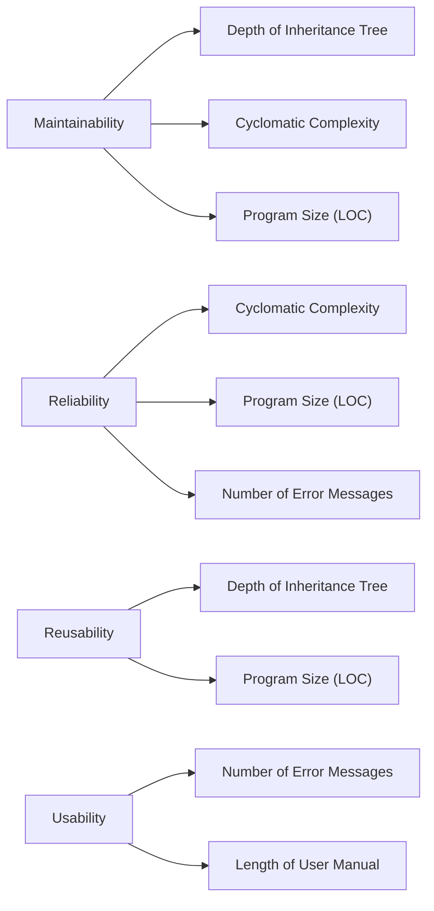

**الشرح:** على اليسار **External Quality Attributes** (اللي المستخدم أو المدير يهتم فيها فعلياً)، وعلى اليمين **Internal Attributes** (اللي نقدر نقيسها مباشرة من الكود). كل سهم يعني "هذا المقياس الداخلي يُستخدم كمؤشر على تلك الصفة الخارجية".

---

#### 📖 الشرح

تخيل إنك تبي تعرف "هل هذا الكود سهل الصيانة (`Maintainability`)؟" — هذا سؤال خارجي، ما تقدر تقيسه بشكل مباشر برقم واحد. لكن تقدر تقيس أشياء داخلية زي `Cyclomatic Complexity` (عدد المسارات في الكود) أو `Depth of Inheritance Tree` (عمق شجرة الوراثة)، وتفترض إن كلما زادت هذي الأرقام، قلّت سهولة الصيانة.

نفس الفكرة تنطبق على `Reliability` (الموثوقية) و`Reusability` (إعادة الاستخدام) و`Usability` (سهولة الاستخدام) — كلها خصائص خارجية، ونحن نستنتجها من مقاييس داخلية مثل عدد رسائل الخطأ (`Number of Error Messages`) أو طول دليل المستخدم (`Length of User Manual`).

**المشكلة الأساسية هنا:** العلاقة بين الداخلي والخارجي هي **افتراض** (assumption) وليست حقيقة مؤكدة 100%. برنامج فيه `Cyclomatic Complexity` عالية قد يكون فعلاً سهل الصيانة لو موثّق كويس — لكن إحصائياً، الافتراض يصح في أغلب الحالات.

#### 🎯 الملخص السريع
- **External Attributes:** صفات يهتم فيها المستخدم/المدير (Maintainability, Reliability, Reusability, Usability) — صعب قياسها مباشرة
- **Internal Attributes:** صفات نقيسها من الكود مباشرة (DIT, Cyclomatic Complexity, LOC, Error Messages, Manual Length)
- العلاقة بينهم هي **افتراض** إحصائي وليست يقين رياضي

#### 📚 التطبيق
هذا المبدأ هو الأساس لكل مقياس برمجي جاي بعده في المحاضرة — كل مقياس (Function Points، Halstead) هو محاولة لقياس شيء داخلي عشان نستنتج منه شيء خارجي (الجهد، التكلفة، الجودة).

#### ⚠️ أخطاء شائعة

#### الفهم الخاطئ ❌:
الطالب يعتقد إن رقم داخلي منخفض (مثل LOC قليلة) يعني تلقائياً إن البرنامج "زين" أو سهل الصيانة بشكل مؤكد.

#### الفهم الصحيح ✅:
المقاييس الداخلية هي **مؤشرات احتمالية** فقط، مو ضمانات. برنامج قصير ممكن يكون معقد جداً منطقياً (`high Cyclomatic Complexity`) رغم قلة أسطره.

#### 📄 النص الأصلي من المحاضرة
<details>
<summary>عرض النص الأصلي (coverage: 100%)</summary>

> "The relationship exists between what we can measure and what we want to know. We can only measure internal attributes but are often more interested in external software attributes."

**ملاحظة على التغطية:**
- ✓ تم شرح الفرق بين Internal و External بالكامل
- ✓ تم شرح كل الأمثلة الموجودة في مخطط المحاضرة (Maintainability, Reliability, Reusability, Usability)
- ℹ️ إضافة من الدليل: توضيح إن العلاقة "افتراض إحصائي"

</details>

---

### 2. Predictor vs Control Metrics (مقاييس التنبؤ مقابل مقاييس التحكم)
<!-- @type: fact -->
<!-- @render: {type: "diagram-first", visualization: "graph", coverage: "100%"} -->
<!-- @connectivity: {prerequisite: "1"} -->

#### 📍 أين نحن الآن؟
بعد ما عرفنا "داخلي مقابل خارجي"، الآن نصنّف المقاييس نفسها حسب وظيفتها.

#### ⬅️ الربط مع السابق
`Predictor Metrics` هي فعلياً نفس فكرة الـ `Internal Attributes` اللي شرحناها بالضبط — لكن بتسمية مختلفة حسب الاستخدام.

#### 💡 الفكرة الأساسية
**فيه نوعان من المقاييس: مقاييس تراقب عملية التطوير نفسها (`Control`)، ومقاييس مرتبطة بالمنتج البرمجي نفسه (`Predictor`).**

---

#### 📊 المخطط: Predictor vs Control Metrics

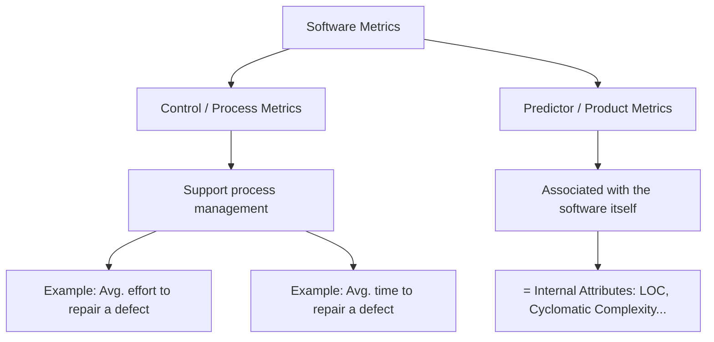

**الشرح:** `Control Metrics` تراقب **العملية** (كم وقت تاخذ إصلاح خطأ مثلاً)، بينما `Predictor Metrics` ترتبط **بالمنتج البرمجي** نفسه — وهي نفس الـ Internal Attributes اللي شرحناها في القسم السابق.

---

#### 📖 الشرح

**Control (Process) Metrics:** تخيلها مثل "لوحة قيادة الفريق" — تساعد مدير المشروع يدير العملية. مثال: متوسط الجهد المطلوب لإصلاح عطل واحد (`Avg. effort to repair defects`)، أو متوسط الوقت المطلوب لإصلاحه.

**Predictor (Product) Metrics:** هذي مرتبطة بالمنتج البرمجي نفسه — نفس الـ `Internal Attributes` اللي رأيناها (LOC، Cyclomatic Complexity). سُميت "Predictor" لأنها تُستخدم للتنبؤ بصفات خارجية زي جودة الكود.

**الفرق العملي:** لو سألتك "كم وقت ياخذ إصلاح باق؟" هذا سؤال Control. لو سألتك "كم سطر كود في هذا الملف؟" هذا سؤال Predictor.

#### 🎯 الملخص السريع
- **Control Metrics** = تراقب الـ process (مثال: متوسط وقت إصلاح الأخطاء)
- **Predictor Metrics** = ترتبط بالـ product نفسه (= Internal Attributes)

#### 📚 التطبيق
مديرو المشاريع يستخدمون Control Metrics لتخطيط الجداول الزمنية، بينما المهندسون يستخدمون Predictor Metrics لتحسين جودة الكود.

#### ⚠️ أخطاء شائعة

#### الفهم الخاطئ ❌:
يظن البعض أن كل مقياس رقمي في هندسة البرمجيات هو نفس النوع.

#### الفهم الصحيح ✅:
لازم تفرّق: هل المقياس عن **العملية** (كم وقت، كم جهد) أم عن **الكود نفسه** (كم سطر، كم تعقيد)؟ هذا يحدد نوعه.

#### 📄 النص الأصلي من المحاضرة
<details>
<summary>عرض النص الأصلي (coverage: 100%)</summary>

> "Control or Process metrics: Support process management. Ex. Avg. effort, time required to repair defects. Predictor or product metrics: Associated with the software itself. Internal attributes: LOC, CC,.."

</details>

---

### 3. Product Metrics: Dynamic vs Static (مقاييس ديناميكية مقابل ساكنة)
<!-- @type: fact -->
<!-- @render: {type: "diagram-first", visualization: "graph", coverage: "100%"} -->
<!-- @connectivity: {prerequisite: "2"} -->

#### 📍 أين نحن الآن؟
نقسّم الـ Product Metrics (اللي عرفناها بالقسم السابق) إلى نوعين حسب **وقت** جمعها.

#### ⬅️ الربط مع السابق
هذا تفصيل إضافي داخل `Predictor/Product Metrics` اللي شرحناها للتو.

#### 💡 الفكرة الأساسية
**Dynamic Metrics تُجمع أثناء تشغيل البرنامج، بينما Static Metrics تُجمع من تمثيل البرنامج (الكود) بدون تشغيله.**

---

#### 📊 المخطط: Dynamic vs Static Metrics

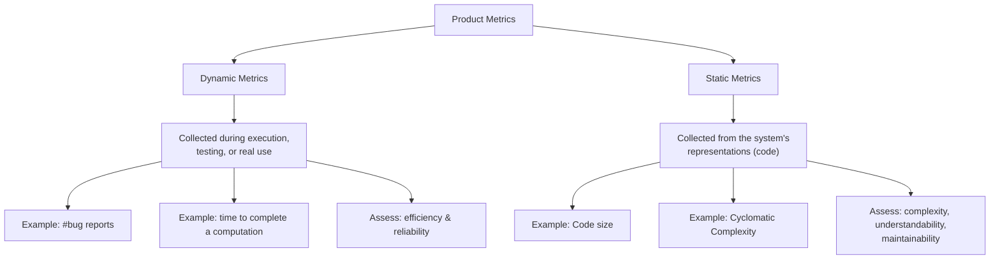

**الشرح:** الفرق الجوهري هو **متى** تجمع المقياس — أثناء التشغيل الفعلي (Dynamic) أو من الكود نفسه بدون تشغيله (Static).

---

#### 📖 الشرح

**Dynamic Metrics** تحتاج البرنامج يكون **شغال فعلاً** — إما وقت التطوير (اختبار)، أو بعد ما صار في الإنتاج (production). مثال: عدد تقارير الأخطاء اللي المستخدمين يرسلونها (`#bug reports`)، أو الوقت اللي ياخذه حساب معيّن (`time taken to complete a computation`). هذي المقاييس تقيّم **الكفاءة والموثوقية** (`efficiency and reliability`) — يعني: هل البرنامج سريع؟ هل يعطي نتائج صح؟

**Static Metrics** لا تحتاج تشغيل البرنامج إطلاقاً — تُجمع من قراءة الكود نفسه (source code، أو حتى من مخططات التصميم). مثال: حجم الكود (`Code size`) أو التعقيد الدوراني (`Cyclomatic Complexity`). هذي تقيّم **التعقيد، سهولة الفهم، وسهولة الصيانة** (`complexity, understandability, maintainability`).

**مثال يومي:** تخيل سيارة — الـ Static metric يشبه "قراءة مواصفات المحرك من الكتالوج" (بدون تشغيل السيارة)، بينما الـ Dynamic metric يشبه "قياس استهلاك الوقود أثناء القيادة الفعلية".

#### 🎯 الملخص السريع
- **Dynamic** = وقت التشغيل → يقيس الكفاءة والموثوقية
- **Static** = من الكود مباشرة (بدون تشغيل) → يقيس التعقيد والصيانة
- Static أسهل وأرخص لأنها ما تحتاج تشغيل فعلي للنظام

#### 📚 التطبيق
Static Metrics تُستخدم من بداية التطوير (حتى قبل الاختبار)، بينما Dynamic Metrics تحتاج نظام يشتغل — عادة بعد مرحلة الـ Testing أو في الـ Production.

#### ⚠️ أخطاء شائعة

#### الفهم الخاطئ ❌:
يعتقد بعض الطلاب أن Dynamic تعني "متغيرة/تتحدث باستمرار" وStatic تعني "ثابتة لا تتغير أبداً".

#### الفهم الصحيح ✅:
الفرق الحقيقي هو **مصدر القياس**: هل نحتاج تشغيل البرنامج فعلياً (Dynamic) أم نكتفي بقراءة الكود (Static)؟ وليس مدى تغيّر الرقم نفسه.

#### 📄 النص الأصلي من المحاضرة
<details>
<summary>عرض النص الأصلي (coverage: 100%)</summary>

> "Dynamic metrics: Collected during a program execution, system testing, or after the system has gone into use. Ex. #bug reports, time taken to complete a computation. Static metrics: Collected during the representations of the system. Ex. Code size, CC"

</details>

---

### 4. Fan-in / Fan-out (عدد الاستدعاءات الداخلة والخارجة)
<!-- @type: fact -->
<!-- @render: {type: "diagram-first", visualization: "graph", coverage: "100%"} -->
<!-- @connectivity: {prerequisite: "3"} -->

#### 📍 أين نحن الآن؟
مثال محدد وملموس على مقياس `Static` — Fan-in/Fan-out على مستوى الدالة (method).

#### ⬅️ الربط مع السابق
هذا مقياس Static (يُقاس من الكود مباشرة بدون تشغيل)، يُستخدم عادة لتقييم التعقيد.

#### 💡 الفكرة الأساسية
**Fan-in هو عدد الدوال (functions) اللي تستدعي دالة معينة، وFan-out هو عدد الدوال اللي هذي الدالة تستدعيها هي.**

---

#### 📊 المخطط: Fan-in / Fan-out

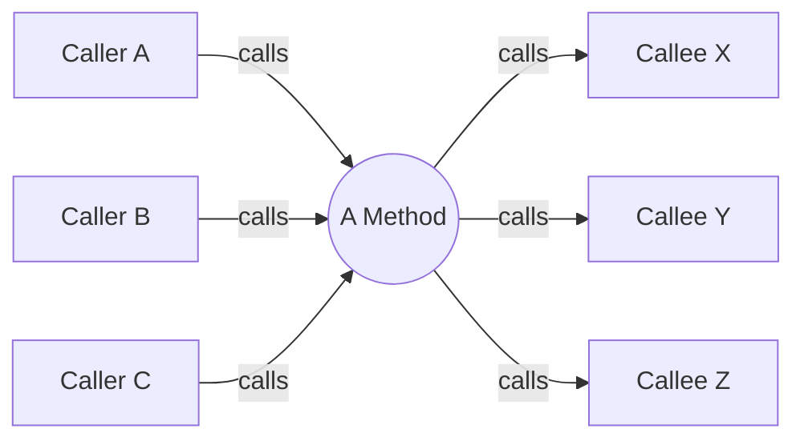

**الشرح:** الأسهم الداخلة (يسار) تمثل **Fan-in** = 3 (عدد الدوال اللي تنادي هذي الدالة). الأسهم الخارجة (يمين) تمثل **Fan-out** = 3 (عدد الدوال اللي هذي الدالة تناديها).

---

#### 📖 الشرح

`Fan-in` = عدد الدوال الأخرى اللي **تستدعي** الدالة الحالية (من ينادي عليّ؟). `Fan-out` = عدد الدوال اللي الدالة الحالية **تستدعيها** هي (أنا أنادي على مين؟).

**ليش مهم؟** دالة عندها `Fan-in` عالي = دالة "مركزية" يعتمد عليها الكثير — أي تغيير فيها يأثر على أماكن كثيرة، فهي حساسة. دالة عندها `Fan-out` عالي = دالة "معقدة" لأنها تنسّق بين أشياء كثيرة، وهذا يخليها أصعب للفهم والاختبار.

**مثال:** دالة `calculateTotalPrice()` في متجر إلكتروني ممكن يكون عندها `Fan-out` عالي لأنها تنادي `getDiscount()`، `getTax()`، `getShippingCost()` وغيرها — تعقيدها من كثرة اعتمادها على دوال ثانية.

#### 🎯 الملخص السريع
- **Fan-in** = كم دالة تنادي عليّ (من الداخل نحوي)
- **Fan-out** = كم دالة أنا أناديها (مني نحو الخارج)
- Fan-out عالي غالباً = تعقيد أكبر في الدالة نفسها

#### 📚 التطبيق
يُستخدم Fan-in/Fan-out لتحديد الدوال "الخطرة" في النظام — إما لأنها مركزية جداً (Fan-in عالي) أو معقدة جداً (Fan-out عالي)، وبالتالي تحتاج اهتمام إضافي في المراجعة والاختبار.

#### ⚠️ أخطاء شائعة

#### الفهم الخاطئ ❌:
يخلط بعض الطلاب بين الاتجاهين ويظنون Fan-in يعني "الدوال اللي أناديها أنا".

#### الفهم الصحيح ✅:
تذكّر الاتجاه بالسهم: **In** = يدخل لي (غيري ينادي عليّ)، **Out** = يخرج مني (أنا أنادي على غيري).

#### 📄 النص الأصلي من المحاضرة
<details>
<summary>عرض النص الأصلي (coverage: 100%)</summary>

> عنوان الشريحة "Fan-in/Fan-out" مع رسم يوضح أسهم داخلة وخارجة من/إلى "A method".

**ملاحظة على التغطية:**
- ✓ تم شرح المفهوم بالكامل من الرسم التوضيحي (المحاضرة اعتمدت على الرسم فقط بدون نص تفصيلي)
- ℹ️ إضافة من الدليل: مثال عملي (متجر إلكتروني) لتوضيح الفائدة

</details>

---

### 5. طول أسماء المتغيرات (Length of Identifiers)
<!-- @type: practice -->
<!-- @render: {type: "diagram-first", visualization: "graph", coverage: "100%"} -->
<!-- @connectivity: {prerequisite: "4"} -->

#### 📍 أين نحن الآن؟
مقياس Static بسيط آخر، لكنه مرتبط بجودة الكود وليس تعقيده المنطقي.

#### ⬅️ الربط مع السابق
مثل Fan-in/Fan-out، هذا مقياس Static يُقاس مباشرة من نص الكود.

#### 💡 الفكرة الأساسية
**متوسط طول أسماء المتغيرات والدوال والفئات هو مؤشر بسيط على مدى فهمية الكود (`understandability`).**

---

#### 📊 المخطط: أثر طول الاسم على الفهم

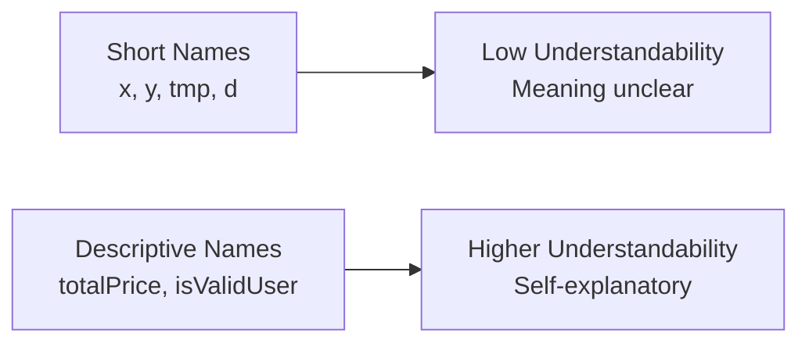

**الشرح:** كل ما زاد طول الاسم (لكن بشكل معقول ومفهوم)، زادت فرصة أن يكون الاسم واضح المعنى.

---

#### 📖 الشرح

فكرة هذا المقياس بسيطة: `Average length of identifiers` (متوسط طول أسماء المعرّفات — أي المتغيرات، الفئات، الدوال...) يُعطي مؤشر على مدى فهم الكود. الافتراض هو: كل ما كان الاسم أطول، كان أقرب لأن يكون **ذا معنى واضح** (`meaningful`)، وبالتالي البرنامج أسهل فهماً.

**مثال:** متغير اسمه `d` غامض تماماً — هل هو `date`؟ `distance`؟ `discount`؟ بينما `orderDate` أو `shippingDistance` واضح المعنى مباشرة، حتى لو ما شفت باقي الكود.

**لكن انتبه:** هذا المقياس **بسيط جداً** وله حدود — اسم طويل جداً بلا داعٍ (زي `theTotalAmountOfMoneyThatTheCustomerNeedsToPayRightNow`) ما يزيد الفهم، بل يعقّد القراءة.

#### 🎯 الملخص السريع
- المقياس: متوسط طول أسماء المتغيرات/الدوال/الفئات
- الافتراض: أسماء أطول = غالباً أوضح معنى = فهم أفضل
- ليس مقياساً دقيقاً 100%، لكنه سهل الحساب وسريع كمؤشر أولي

#### 📚 التطبيق
يُستخدم كمؤشر سريع أثناء مراجعة الكود (`code review`) لتقييم مدى وضوح التسمية، خصوصاً في مقارنة نسخ مختلفة من نفس المشروع.

#### ⚠️ أخطاء شائعة

#### الفهم الخاطئ ❌:
"كل ما كان اسم المتغير أطول، كان الكود أفضل تلقائياً."

#### الفهم الصحيح ✅:
الطول وحده مؤشر تقريبي بس — القيمة الحقيقية إن يكون الاسم **معبّراً عن معناه** بوضوح، مو بس طويلاً.

#### 📄 النص الأصلي من المحاضرة
<details>
<summary>عرض النص الأصلي (coverage: 100%)</summary>

> "Average length of identifiers (names of variables, classes, methods, …). The longer the identifiers, the more likely they are to be meaningful and hence the more understandable the program"

</details>

---

### 6. Function Points — المقدمة والأهداف
<!-- @type: fact -->
<!-- @render: {type: "diagram-first", visualization: "graph", coverage: "100%"} -->
<!-- @connectivity: {prerequisite: "5"} -->

#### 📍 أين نحن الآن؟
ننتقل من مقاييس بسيطة (طول الأسماء، Fan-in) إلى منهجية متكاملة لتقدير جهد المشروع بالكامل: `Function Points`.

#### ⬅️ الربط مع السابق
كل المقاييس السابقة قاست **جزء صغير** من الكود. Function Points تحاول تقييم **النظام كله** من ناحية الوظائف اللي يقدمها.

#### 💡 الفكرة الأساسية
**Function Points (FP) هي طريقة لقياس البرمجيات عن طريق حساب عدد الوظائف اللي يقدمها النظام للمستخدم، بغض النظر عن لغة البرمجة المستخدمة.**

---

#### 📊 المخطط: فكرة Function Points

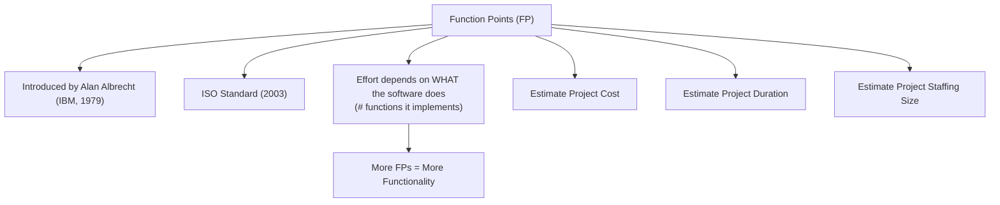

**الشرح:** يوضح المخطط أصل الفكرة (Albrecht) وهدفها النهائي: تقدير التكلفة والوقت والفريق المطلوب، اعتماداً على "كم وظيفة" يقدمها النظام.

---

#### 📖 الشرح

`Function Points` (اختصاراً FP) طريقة قدّمها **Alan Albrecht** من شركة IBM سنة **1979**، وأصبحت معياراً دولياً `ISO` سنة **2003**. تُعتبر من أفضل الطرق لتقدير التكلفة (`cost estimation`) عبر تحليل يُسمى `Function Point Analysis (FPA)`.

**الفكرة الجوهرية:** الجهد المطلوب لتطوير برنامج **لا يعتمد على عدد أسطر الكود** (لأن هذا يختلف حسب لغة البرمجة)، بل يعتمد على **"إيش يسوي البرنامج"** — يعني عدد الوظائف الفعلية اللي يقدمها. كل ما زاد عدد الـ FPs، زادت وظائف النظام.

**الفائدة العملية الكبرى:** بما إنها **مستقلة عن التقنية** المستخدمة، تقدر تقارن مشروعين مختلفين — واحد بلغة Java وواحد بلغة Python — بنفس المقياس، لأن الاثنين "يسوون نفس الوظائف" حتى لو الكود مختلف تماماً.

**الأهداف الرسمية:**
1. قياس البرمجيات عن طريق تحديد الوظائف المطلوبة والمقدَّمة فعلياً للعميل
2. قياس التطوير والصيانة **بشكل مستقل عن التقنية**
3. قياس متسق عبر كل المشاريع والمؤسسات (نفس المقياس يصلح لأي مشروع)

**الفوائد:** تقدير دقيق نسبياً لـ:
- تكلفة المشروع (`Project cost`)
- مدة المشروع (`Project duration`)
- حجم الفريق المطلوب (`Project staffing size`)

#### 🎯 الملخص السريع
- Function Points = مقياس للوظائف، مو للكود
- مستقل عن لغة البرمجة → يسمح بالمقارنة العادلة بين المشاريع
- يُستخدم لتقدير: التكلفة، المدة، حجم الفريق

#### 📚 التطبيق
هذا الأساس النظري نحتاجه قبل ما نتعلم **كيف نحسب** الـ Function Points فعلياً في الأقسام الجاية.

#### ⚠️ أخطاء شائعة

#### الفهم الخاطئ ❌:
يظن البعض أن Function Points تقيس عدد أسطر الكود أو حجم الملفات.

#### الفهم الصحيح ✅:
Function Points تقيس **الوظائف** التي يقدمها النظام للمستخدم — شاشة إدخال، تقرير، جدول بيانات — بغض النظر عن كم سطر كود يلزم لتنفيذها.

#### 📄 النص الأصلي من المحاضرة
<details>
<summary>عرض النص الأصلي (coverage: 100%)</summary>

> "Introduced by Alan Albrecht of IBM (1979). 2003, ISO standard. Probably the best approach to cost estimation (function point analysis - FPA). assumes that the effort required to develop a piece of software depends on what the software does (#functions it implements). The larger number of FPs the more functionality... Measure software by quantifying the functionality requested by and provided to the customer. Measure software development and maintenance independently of technology used for implementation. Measure software development and maintenance consistently across all projects and organizations... The ability to accurately estimate: Project cost, Project duration, Project staffing size"

</details>

---

### 7. Function Points — ماذا نحسب؟ (What to Count)
<!-- @type: fact -->
<!-- @render: {type: "diagram-first", visualization: "graph", coverage: "100%"} -->
<!-- @connectivity: {prerequisite: "6"} -->

#### 📍 أين نحن الآن؟
بعد ما فهمنا الهدف من FP، الآن نتعلم **إيش بالضبط** نعدّه في النظام.

#### ⬅️ الربط مع السابق
هذا التفصيل العملي لتطبيق الفكرة النظرية اللي شرحناها بالقسم السابق.

#### 💡 الفكرة الأساسية
**نحسب 5 أنواع من العناصر في النظام: مدخلات، مخرجات، ملفات داخلية، ملفات خارجية، واستعلامات.**

---

#### 📊 المخطط: عناصر Function Point Analysis

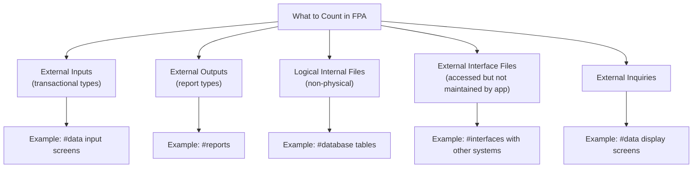

**الشرح:** خمسة أنواع من العناصر تُشكّل معاً "بصمة" النظام الوظيفية — كل نوع يُحسب بشكل منفصل.

---

#### 📖 الشرح

عند تحليل نظام بمنهجية FP، نبحث عن خمسة أنواع من العناصر:

1. **External Inputs (المدخلات الخارجية):** أي بيانات تدخل النظام من المستخدم — مثل شاشات إدخال البيانات (`#data input screens`).
2. **External Outputs (المخرجات الخارجية):** أي تقارير أو نتائج يخرجها النظام — مثل عدد التقارير (`#reports`).
3. **Logical Internal Files (الملفات الداخلية المنطقية):** مجموعات بيانات يديرها النظام نفسه — مثل جداول قاعدة البيانات (`#database tables`)، وسُميت "منطقية" لأنها **ليست ملفات فيزيائية** بل مجموعات بيانات مترابطة منطقياً.
4. **External Interface Files (ملفات الواجهة الخارجية):** بيانات يستخدمها النظام لكنه **لا يديرها ولا يحدّثها** — يستخدمها فقط من نظام آخر. مثال: واجهة (`interface`) مع نظام دفع خارجي.
5. **External Inquiries (الاستعلامات الخارجية):** طلبات بحث/عرض لا تُغيّر البيانات — مثل شاشات عرض المعلومات (`#data display screens`).

**مثال مباشر من المحاضرة:** شاشة تسجيل دخول تحتوي حقول Email وPassword — كل حقل هنا يُعتبر `DET` (سنشرحه بالقسم الجاي)، وكل الشاشة تُصنّف كـ `External Input`.

#### 🎯 الملخص السريع
- **External Inputs** = بيانات تدخل (شاشات إدخال)
- **External Outputs** = بيانات تخرج/تقارير
- **Logical Internal Files** = بيانات يديرها النظام (جداول DB)
- **External Interface Files** = بيانات يستخدمها بس ما يديرها (من نظام ثاني)
- **External Inquiries** = استعلامات بحث/عرض فقط

#### 📚 التطبيق
هذا التصنيف هو الخطوة الأولى قبل حساب النقاط الفعلية (Complexity Points) اللي راح نشرحها بعدين.

#### ⚠️ أخطاء شائعة

#### الفهم الخاطئ ❌:
الخلط بين `Logical Internal Files` و`External Interface Files` — يظن البعض إنهم نفس الشيء لأن الاثنين "ملفات".

#### الفهم الصحيح ✅:
الفرق الجوهري: **من يملك ويحدّث البيانات؟** لو النظام نفسه يحدّثها → `Logical Internal File`. لو نظام آخر يحدّثها وهذا النظام بس يستخدمها → `External Interface File`.

#### 📄 النص الأصلي من المحاضرة
<details>
<summary>عرض النص الأصلي (coverage: 100%)</summary>

> "What to count: Number of external inputs (transactional types), External outputs (report types), Logical internal files (nonphysical), External interface files (files accessed by the application but not maintained or updated by it), External inquiries. Example: #data input screens, #data display screens, #database tables, #reports, #interfaces with other software systems"

</details>

---

### 8. Function Points — DET و RET وجداول التعقيد
<!-- @type: fact -->
<!-- @render: {type: "diagram-first", visualization: "graph", coverage: "100%"} -->
<!-- @connectivity: {prerequisite: "7"} -->

#### 📍 أين نحن الآن؟
الآن نتعلم كيف نحدد **درجة تعقيد** كل عنصر عددناه بالقسم السابق (Low/Average/High) وكم نقطة يستحق.

#### ⬅️ الربط مع السابق
بعد ما عرفنا **إيش** نعد، الآن نتعلم **كيف نحسب قيمته** بالتفصيل باستخدام DET وRET.

#### 💡 الفكرة الأساسية
**كل عنصر (شاشة، ملف، تقرير) يُقيَّم حسب عدد حقوله (DET) وعدد مجموعاته الفرعية (RET)، وهذا يحدد مستوى تعقيده ونقاطه.**

---

#### 📊 المخطط: DET و RET

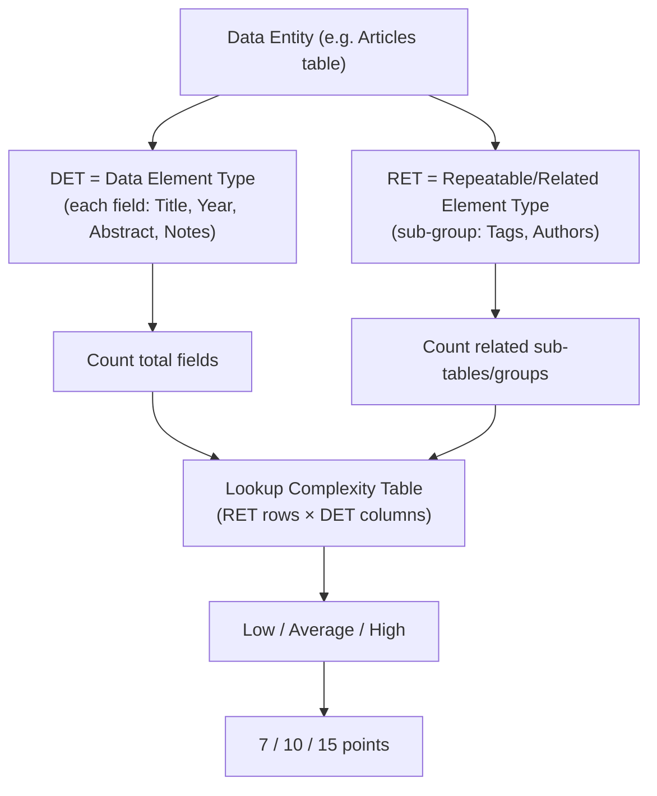

**الشرح:** نحسب عدد الـ `DET` (الحقول) وعدد الـ `RET` (المجموعات المرتبطة)، ثم نستخدم جدول البحث (Lookup Table) لتحديد مستوى التعقيد، وبالتالي عدد النقاط.

---

#### 📖 الشرح

**DET (Data Element Type):** كل حقل بيانات يظهر للمستخدم أو يُدخله — مثل `First Name`، `Last Name`، `Email`، `Password` في شاشة تسجيل. كل حقل منفرد = DET واحد.

**RET (Repeatable data element types):** مجموعة فرعية من البيانات يتعرف عليها المستخدم كوحدة منطقية مترابطة — مثل جدول `Authors` المرتبط بجدول `Articles`. كل مجموعة فرعية مرتبطة (كيان آخر يتصل بالكيان الأساسي) = RET واحد.

**مثال من المحاضرة:** كيان `Articles` عنده الحقول `Title، Year، Abstract، Notes` (= 4 DETs)، ومرتبط بكيانين آخرين `Tags` و`Authors` (كل واحد منهم = RET واحد، إذن مجموع RETs = 2).

**جدول تحديد مستوى التعقيد (Complexity Level):**

| RETs | DETs 1-19 | DETs 20-50 | DETs 51+ |
| --- | --- | --- | --- |
| 1 | Low | Low | Average |
| 2 to 5 | Low | Average | High |
| 6 or more | Average | High | High |

**جدول تحويل المستوى إلى نقاط:**

| Complexity | Points |
| --- | --- |
| Low | 7 |
| Average | 10 |
| High | 15 |

**كيف تستخدم الجدولين معاً؟** أولاً تحسب عدد RETs وDETs للعنصر، تدخل الجدول الأول لتحصل على المستوى (Low/Average/High)، ثم تستخدم الجدول الثاني لتحويل هذا المستوى إلى نقاط فعلية تُضاف لمجموع الـ Function Points.

#### 🎯 الملخص السريع
- **DET** = حقل بيانات واحد (مثل: اسم، بريد إلكتروني)
- **RET** = مجموعة فرعية مترابطة (كيان آخر مرتبط)
- الجدول الأول: RETs × DETs → يحدد المستوى (Low/Average/High)
- الجدول الثاني: المستوى → نقاط (7/10/15)

#### 📚 التطبيق
هذي الآلية الدقيقة تسمح بمقارنة موضوعية بين نظامين مختلفين — بدل الاعتماد على "شعور" المطوّر بحجم الميزة.

#### ⚠️ أخطاء شائعة

#### الفهم الخاطئ ❌:
يظن البعض أن DET وRET نفس الشي، أو يخلطون بين ترتيب الصفوف (RET) والأعمدة (DET) في جدول التعقيد.

#### الفهم الصحيح ✅:
**DET** = عدّ الحقول المفردة (الأعمدة في الجدول). **RET** = عدّ المجموعات/الكيانات المرتبطة (الصفوف في الجدول). لازم تحسبهم بشكل منفصل قبل الدخول للجدول.

#### 📄 النص الأصلي من المحاضرة
<details>
<summary>عرض النص الأصلي (coverage: 100%)</summary>

> جدول RETS × Data Element Types (DETs) مع تصنيف L/A/H، وجدول Complexity → Points (Low=7, Average=10, High=15)، مع تعريف: "RET (Repeatable data element types): User recognizable subgroup of data elements"، ورسم توضيحي لكيان Articles المرتبط بـ Tags وAuthors.

</details>

---

### 9. Function Points — أمثلة تطبيقية
<!-- @type: practice -->
<!-- @render: {type: "diagram-first", visualization: "graph", coverage: "100%"} -->
<!-- @connectivity: {prerequisite: "8"} -->

#### 📍 أين نحن الآن؟
نطبّق كل اللي تعلمناه عن Function Points على مثالين حقيقيين من المحاضرة.

#### ⬅️ الربط مع السابق
هذا تطبيق مباشر للأقسام 6، 7، 8 معاً — التصنيف، DET/RET، والنقاط.

#### 💡 الفكرة الأساسية
**نطبّق تصنيف العناصر الخمسة على نظام حقيقي (نظام تتبع الأخطاء)، ونربط بين "عدد الشاشات" والجهد المقدَّر بالأشهر.**

---

#### 📊 المخطط: مثال نظام تتبع الأخطاء (Bug Tracking System)

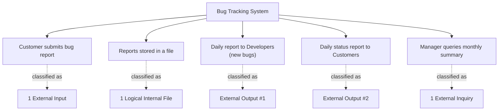

**الشرح:** كل وظيفة بالنظام تُصنَّف حسب نوعها الوظيفي، ثم تُعد.

---

#### 📖 الشرح

**المثال الأول — نظام تتبع الأخطاء:** النظام يسمح للعملاء بالإبلاغ عن أخطاء (bugs) في منتج. تُخزَّن التقارير في ملف، ويستلم المطورون تقرير يومي بالأخطاء الجديدة (لازم يحلّونها)، بينما يستلم العملاء تقرير يومي بحالة الأخطاء اللي أرسلوها. كمان الإدارة تقدر تستعلم عن ملخص شهر معيّن.

**التصنيف:**
- **External Inputs = 1** (إبلاغ العميل عن الخطأ)
- **Logical Internal Files = 1** (ملف تخزين التقارير)
- **External Outputs = 2** (تقرير المطورين اليومي + تقرير حالة العملاء اليومي)
- **External Inquiries = 1** (استعلام الإدارة الشهري)

**المثال الثاني — نظام معلومات الموظفين:** نظام يسمح للمستخدم بتصفح وتحديث معلومات الموظفين في قاعدة بيانات. لو صممنا شاشة واحدة تعرض معلومات موظف واحد، هذي "وظيفة واحدة" (function point واحد) من النظام — ولأنها مهمة بسيطة نقدر نتخيل تنفيذها، نقدّر جهدها بـ **شهر عمل واحد** (`1 person month`)، شامل توضيح المتطلبات، كتابة المواصفة، الاختبار والتحقق.

لو النظام فيه **6 شاشات** مشابهة (مثلاً: شاشة عرض، شاشة تعديل، شاشة حذف...)، فالتقدير يكون تقريباً **6 أشهر عمل** — لأن عدد الوظائف (الشاشات) يتناسب طردياً مع الجهد المقدَّر.

#### 🎯 الملخص السريع
- المثال 1: تصنيف مباشر (EI=1, ILF=1, EO=2, EQ=1)
- المثال 2: كل شاشة = وظيفة واحدة تقريباً، والجهد يتناسب مع عدد الشاشات
- الفكرة العامة: عدد الوظائف (screens/reports/تقارير) يُقدّر الجهد بالأشهر مباشرة

#### 📚 التطبيق
هذا النوع من التقدير السريع (screen-count estimation) يُستخدم فعلياً في شركات كثيرة كخطوة أولية سريعة قبل عمل تحليل FP كامل بالتفصيل (DET/RET).

#### ⚠️ أخطاء شائعة

#### الفهم الخاطئ ❌:
افتراض أن كل التقارير في المثال الأول تُحسب كـ External Input لأنها "متعلقة بالمستخدم".

#### الفهم الصحيح ✅:
لازم تسأل: هل البيانات **تدخل** النظام (Input) أم **تخرج منه** (Output)؟ تقرير المطورين اليومي والتقرير للعملاء كلاهما بيانات **تخرج** من النظام، فهما External Outputs، مو Inputs.

#### 📄 النص الأصلي من المحاضرة
<details>
<summary>عرض النص الأصلي (coverage: 100%)</summary>

> "Develop a system which allows customers to report bugs in a product. These reports will be stored in a file and developers will receive a daily report with new bugs which they need to solve. Customers will also receive a daily status report for bugs which they submitted. Management can query the system for a summary info of particular months." + "#External inputs = 1, #Logical internal files = 1, #External outputs = 2, #External inquiries = 1" + مثال شاشة معلومات الموظف مع تقدير شهر عمل واحد لكل شاشة.

</details>

---

### 10. Halstead Metric (1977)
<!-- @type: fact -->
<!-- @render: {type: "diagram-first", visualization: "graph", coverage: "100%"} -->
<!-- @connectivity: {prerequisite: "9"} -->

#### 📍 أين نحن الآن؟
ننتقل من مقياس على مستوى "النظام كله" (Function Points) إلى مقياس على مستوى **الكود المصدري** نفسه: `Halstead Metric`.

#### ⬅️ الربط مع السابق
بينما Function Points تقيس الوظائف بدون النظر للكود، Halstead Metric يقيس **الكود نفسه رمزاً برمز (token by token)**.

#### 💡 الفكرة الأساسية
**Halstead يعتبر أي برنامج مجموعة من الرموز (tokens) — إما Operators (عوامل) أو Operands (معاملات) — ومن عدّها نحسب مقاييس متعددة.**

---

#### 📊 المخطط: تصنيف الرموز في Halstead

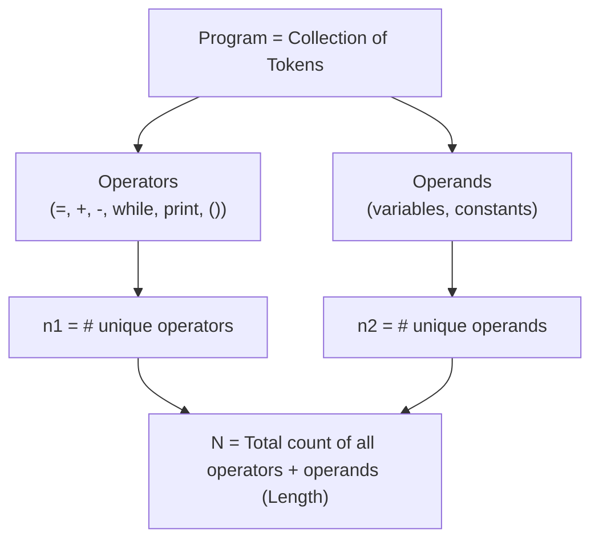

**الشرح:** كل رمز في الكود إما Operator (يقوم بعملية) أو Operand (له قيمة). نحسب عدد الأنواع الفريدة من كل نوع، ثم مجموعهم الكلي.

---

#### 📖 الشرح

يعتبر **Maurice Halstead** (1977) البرنامج مجموعة من الرموز (`tokens`)، وكل رمز إما:
- **Operator (عامل):** أي شيء يقوم بعملية — مثل `=`، `while`، `>`، `+`، `-`، `print()`، حتى الفواصل والأقواس.
- **Operand (معامل):** أي رمز له قيمة — متغير أو ثابت.

**ملاحظة مهمة:** هالستيد نفسه **لم يحسب** التصريحات (`declarations`)، عبارات الإدخال/الإخراج، أو التعليقات كرموز — لكن **معظم المنظمات حالياً تحسب كل أجزاء البرنامج**.

**التعريفات الأساسية:**
- **n1** = عدد الـ Operators **الفريدة** (unique)
- **n2** = عدد الـ Operands **الفريدة** (unique)
- **N** = طول البرنامج = **إجمالي عدد** كل الـ Operators والـ Operands (بدون تفريد — العدّ الكامل مع التكرار)
- **Estimated N** = تقدير رياضي للطول = `n1 × log₂(n1) + n2 × log₂(n2)`

**مثال محلول من المحاضرة:**
```
z = 0;
while x > 0
    z = z + y;
    x = x - 1
end-while;
print(z);
```
- **Operators الفريدة** `( = ; while > + - print () )` → **n1 = 8**
- **Operands الفريدة** `( z x 0 y 1 )` → **n2 = 5**
- **N** (كل التكرارات مجتمعة) = operators + operands = 11 + 14 = **25**

#### 🎯 الملخص السريع
- Operator = يعمل عملية (`=`, `while`, `+`)
- Operand = له قيمة (متغير أو ثابت)
- n1/n2 = عدد الأنواع **الفريدة**، N = **إجمالي** كل الرموز (مع التكرار)

#### 📚 التطبيق
هذه الأرقام الأربعة (n1, n2, N, Estimated N) هي أساس حساب `Volume` و`Difficulty` و`Effort` اللي راح نشرحها بالقسم الجاي.

#### ⚠️ أخطاء شائعة

#### الفهم الخاطئ ❌:
يخلط الطلاب بين n1/n2 (العدد الفريد/unique) وN (العدد الإجمالي مع التكرار) — فيحسبون N بجمع n1+n2 مباشرة.

#### الفهم الصحيح ✅:
n1 وn2 يُحسبان بعدّ **الأنواع المختلفة فقط مرة واحدة**، بينما N يُحسب بعدّ **كل ظهور** لكل رمز في الكود (مع التكرار). في المثال، N=25 مو n1+n2=13.

#### 📄 النص الأصلي من المحاضرة
<details>
<summary>عرض النص الأصلي (coverage: 100%)</summary>

> "A program is considered to be a collection of tokens. Tokens are either operators or operands... Halstead did not count declarations, input or output statements, or comments do not count as tokens. Most organizations currently count all parts of a program." + "Count unique operators (n1). Count unique operands (n2). Length of the program (N) = total count of operators and operands. Estimate of length is defined as (Est N = n1*log2n1 + n2*log2n2)" مع مثال الكود المحلول (n1=8, n2=5, N=25).

</details>

---

### 11. Halstead Metric — الحجم والصعوبة والجهد
<!-- @type: fact -->
<!-- @render: {type: "diagram-first", visualization: "graph", coverage: "100%"} -->
<!-- @connectivity: {prerequisite: "10"} -->

#### 📍 أين نحن الآن؟
بعد ما جمعنا n1, n2, N، الآن نستخدمها لحساب مقاييس أعمق: الحجم، الصعوبة، والجهد.

#### ⬅️ الربط مع السابق
هذي المعادلات تُبنى مباشرة على n1 وn2 اللي تعلمناها بالقسم السابق.

#### 💡 الفكرة الأساسية
**من الأرقام الأساسية (n1, n2, N) نحسب Volume (الحجم)، Difficulty (الصعوبة)، Effort (الجهد)، وحتى الوقت المتوقع للبرمجة بالثواني.**

---

#### 📊 المخطط: من n1/n2 إلى الوقت المقدَّر

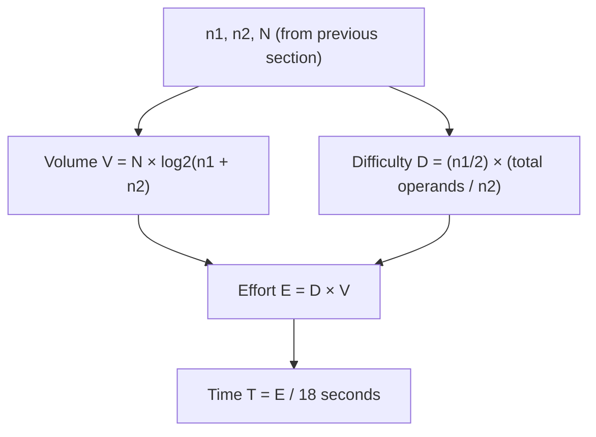

**الشرح:** كل مقياس يُبنى على سابقه — الحجم يعتمد على n1/n2/N، الصعوبة تعتمد على n1/n2، والجهد ضرب الاثنين، وأخيراً الوقت من الجهد.

---

#### 📖 الشرح

**Volume (الحجم):** `V = N × log₂(n1 + n2)` — يقيس "حجم" البرنامج فعلياً بوحدات المعلومات (bits تقريباً)، مو بس عدد الأسطر.

**Difficulty (الصعوبة):** `D = (n1/2) × (إجمالي عدد الـ operands / n2)` — كل ما زاد عدد الـ operators الفريدة مقابل قلة تنوع الـ operands، زادت صعوبة فهم البرنامج (لأن نفس القيم القليلة تتكرر بعمليات كثيرة ومتنوعة). الصعوبة ترتبط بمدى صعوبة **مراجعة الكود، صيانته، وفهمه**.

**Effort (الجهد):** `E = D × V` — الجهد الكلي المطلوب لبناء البرنامج هو حاصل ضرب الصعوبة في الحجم؛ برنامج كبير وسهل قد يحتاج جهد أقل من برنامج صغير لكن معقد جداً.

**Time (الوقت المقدَّر للبرمجة):** `T = E / 18` **ثانية** — معادلة تحويلية تربط "وحدة الجهد النظرية" بزمن برمجة فعلي بالثواني، بحيث تقدر تحوّلها لساعات أو أيام عمل.

**الترتيب المنطقي:** n1, n2, N (عدّ الرموز) → Volume (حجم المعلومات) → Difficulty (صعوبة الفهم) → Effort (الجهد الكلي = صعوبة × حجم) → Time (تحويل الجهد إلى وقت فعلي).

#### 🎯 الملخص السريع
- **Volume V** = N × log₂(n1+n2)
- **Difficulty D** = (n1/2) × (total operands/n2)
- **Effort E** = D × V
- **Time T** = E ÷ 18 ثانية

#### 📚 التطبيق
Halstead Metric يُستخدم لتقدير وقت البرمجة الفعلي **من الكود نفسه**، بعكس Function Points اللي تقدّر من الوظائف **قبل** كتابة الكود — الاثنين مكمّلان لبعض في مراحل مختلفة من المشروع.

#### ⚠️ أخطاء شائعة

#### الفهم الخاطئ ❌:
يظن البعض أن Effort وVolume نفس الشيء لأن الاثنين "يقيسون حجم البرنامج".

#### الفهم الصحيح ✅:
**Volume** يقيس حجم المعلومات في الكود فقط. **Effort** يضرب هذا الحجم بمستوى **الصعوبة** — فبرنامج كبير لكن بسيط ممكن يكون Effort أقل من برنامج صغير لكن معقد جداً.

#### 📄 النص الأصلي من المحاضرة
<details>
<summary>عرض النص الأصلي (coverage: 100%)</summary>

> "Halstead metric could be used to estimate the program volume, difficulty and effort. Volume V = N * log2(n1+n2). Difficulty D = (n1/2) * (total #operands/n2). Effort E = D * V. Difficulty is related to the difficulty of the program to understand (through code reviewing, maintenance, …). Effort could used to estimate actual coding time using: Time required to program T = E / 18 seconds"

</details>

---

### 12. ملاحظة ختامية عن القياس (Last Word about Measurement)
<!-- @type: practice -->
<!-- @render: {type: "diagram-first", visualization: "none", coverage: "100%"} -->
<!-- @connectivity: {prerequisite: "11"} -->

#### 📍 أين نحن الآن؟
نختم المحاضرة بنظرة نقدية على كل المقاييس اللي تعلمناها.

#### ⬅️ الربط مع السابق
بعد ما تعلمنا مقاييس كثيرة (Internal Attributes، Function Points، Halstead)، نحتاج نفهم **حدودها** الحقيقية.

#### 💡 الفكرة الأساسية
**رغم وجود مقاييس كثيرة للبرمجيات، معظمها له قيود عملية حقيقية — يجب استخدامها بحذر ووعي بحدودها.**

---

#### 📖 الشرح

المحاضرة تختم بأربع ملاحظات نقدية مهمة:

1. **A lot of metrics (مقاييس كثيرة جداً):** فيه عدد كبير من المقاييس المتاحة (زي اللي درسناها بالمحاضرة)، وهذا بحد ذاته تحدٍّ — أيها تختار؟
2. **Most at source code level (معظمها على مستوى الكود المصدري) → too late (متأخر جداً):** أغلب هذي المقاييس (زي Halstead، Cyclomatic Complexity) تحتاج **كود مكتوب فعلاً** عشان تُحسب — يعني تكتشف المشاكل **بعد** ما صرفت الجهد في الكتابة، مو قبلها.
3. **Some are difficult to calculate (بعضها صعب الحساب):** مقاييس زي Function Points تحتاج تحليل دقيق (DET، RET، جداول تعقيد) — مو كل فريق عنده الوقت أو الخبرة لتطبيقها بدقة.
4. **No standard metric (لا يوجد مقياس معياري واحد):** ما فيه "مقياس واحد يحكم الكل" — كل مقياس يغطي جانب معيّن (الحجم، التعقيد، الوظائف) وما فيه مقياس شامل مثالي.

**الخلاصة الإيجابية:** رغم هذي القيود، **استخدام المقاييس الموجودة يساعد فعلياً** على تعظيم صفات الجودة (`quality attributes`) — يعني حتى لو المقاييس غير مثالية، أفضل من عدم القياس إطلاقاً.

#### 🎯 الملخص السريع
- مقاييس كثيرة، ما فيه مقياس معياري واحد
- أغلبها على مستوى الكود = متأخر (بعد الكتابة)
- بعضها معقد الحساب (زي FP)
- لكن استخدامها أفضل من عدم القياس

#### 📚 التطبيق
هذه الملاحظة تربط كل المقاييس اللي درسناها بالمحاضرة (Internal Attributes, FP, Halstead) بسياق عملي واقعي — لازم تختار المقياس المناسب حسب مرحلة المشروع والهدف من القياس.

#### ⚠️ أخطاء شائعة

#### الفهم الخاطئ ❌:
يظن البعض أنه لازم يطبّق كل المقاييس الموجودة على كل مشروع عشان "يضمن الجودة".

#### الفهم الصحيح ✅:
الأفضل اختيار مقياس أو مقياسين مناسبين لهدفك ومرحلة مشروعك — مقياس واحد مطبَّق بذكاء أفضل من عشرة مقاييس مطبَّقة بشكل سطحي.

#### 📄 النص الأصلي من المحاضرة
<details>
<summary>عرض النص الأصلي (coverage: 100%)</summary>

> "A lot of metrics. Most at source code level → too late. Some are difficult to calculate. No standard metric. Using existing metrics could help at maximizing the quality attributes"

</details>

---

## الجزء الثاني: ملخص شامل (Alternative Complete Reading)

هذي المحاضرة تدور حول فكرة واحدة كبيرة: **كيف نحوّل خصائص البرمجيات — اللي أغلبها مجردة ونظرية زي "الجودة" أو "سهولة الصيانة" — إلى أرقام نقدر نقيسها ونقارن بيها؟** كل موضوع في المحاضرة هو زاوية مختلفة على نفس السؤال.

نبدأ بمشكلة أساسية: إحنا نريد نعرف صفات خارجية (`External Attributes`) زي `Maintainability` (سهولة الصيانة)، `Reliability` (الموثوقية)، `Reusability` (إعادة الاستخدام)، و`Usability` (سهولة الاستخدام) — لكن هذي الصفات صعب قياسها مباشرة برقم. الحل العملي هو قياس صفات داخلية (`Internal Attributes`) نقدر نحسبها مباشرة من الكود، زي `Depth of Inheritance Tree` (عمق شجرة الوراثة)، `Cyclomatic Complexity` (التعقيد الدوراني)، `Program Size in LOC` (حجم البرنامج بالأسطر)، `Number of Error Messages` (عدد رسائل الأخطاء)، و`Length of User Manual` (طول دليل المستخدم). كل واحدة من هذي الصفات الداخلية تُستخدم كمؤشر (`indicator`) على واحدة أو أكثر من الصفات الخارجية — مثلاً، `Cyclomatic Complexity` العالية تُستخدم كمؤشر على انخفاض `Maintainability` وانخفاض `Reliability` معاً. المهم تتذكر إن هذي العلاقة **افتراضية وإحصائية**، مو حقيقة رياضية مؤكدة — يعني ممكن يكون فيه برنامج بتعقيد عالٍ لكنه فعلياً سهل الصيانة لو موثّق كويس، لكن هذا استثناء وليس القاعدة.

بعدين المحاضرة تصنّف المقاييس نفسها من زاويتين مختلفتين. الزاوية الأولى: **Predictor Metrics مقابل Control Metrics**. الـ `Control` أو `Process Metrics` تراقب **عملية التطوير** نفسها — مثل متوسط الوقت أو الجهد اللازم لإصلاح عطل (`Avg. effort/time to repair defects`) — وهذي تفيد مدير المشروع لإدارة الفريق والجدول الزمني. أما الـ `Predictor` أو `Product Metrics` فمرتبطة **بالمنتج البرمجي نفسه** — وهي في الواقع نفس الـ Internal Attributes اللي تكلمنا عنها، بس بتسمية مختلفة تركّز على وظيفتها كمؤشر تنبؤي.

الزاوية الثانية للتصنيف: **Dynamic Metrics مقابل Static Metrics**، وهذا التصنيف خاص بالـ Product Metrics تحديداً. الفرق الجوهري هو **متى** تُجمع البيانات. `Dynamic Metrics` تحتاج البرنامج يكون **شغّال فعلياً** — إما وقت الاختبار أو بعد ما صار في الإنتاج — وأمثلتها عدد تقارير الأخطاء (`#bug reports`) أو الوقت المستغرق لحساب معيّن. هذي تقيّم **الكفاءة والموثوقية** (`efficiency and reliability`). بالمقابل، `Static Metrics` تُجمع **من الكود نفسه بدون تشغيله إطلاقاً** — مثل حجم الكود أو `Cyclomatic Complexity` — وتقيّم **التعقيد، الفهمية، وسهولة الصيانة**. الفكرة العملية: Static أرخص وأسرع لأنها ما تحتاج بيئة تشغيل كاملة، بينما Dynamic أدق لأنها تعكس السلوك الفعلي للبرنامج تحت الاستخدام الحقيقي.

مثال ملموس على مقياس Static هو **Fan-in/Fan-out**، اللي يُطبَّق على مستوى الدالة الواحدة (method). `Fan-in` هو عدد الدوال الأخرى اللي **تنادي** على دالة معيّنة — يعني كم جهة تعتمد عليها. `Fan-out` هو عدد الدوال اللي هذي الدالة **هي** تناديها — يعني كم جهة هي تعتمد عليها. دالة بـ Fan-in عالٍ تُعتبر "مركزية" وحسّاسة، لأن أي تعديل فيها يأثر على أماكن كثيرة بالنظام. دالة بـ Fan-out عالٍ تُعتبر "معقدة" لأنها تنسّق بين عناصر كثيرة، وهذا يصعّب اختبارها وفهمها. مقياس ثاني بسيط هو **طول أسماء المتغيرات** (`Length of Identifiers`) — كل ما كان متوسط طول أسماء المتغيرات والدوال أطول، زاد احتمال كونها ذات معنى واضح (`meaningful`)، وبالتالي البرنامج أسهل فهماً. طبعاً هذا مؤشر بسيط جداً وله حدوده — اسم طويل بلا داعٍ ما يفيد، والمهم الوضوح مو الطول بحد ذاته.

بعد هذي المقاييس الصغيرة، تنتقل المحاضرة لمنهجية أكبر وأشمل: **Function Points (FP)**. قدّمها Alan Albrecht من شركة IBM سنة 1979، وأصبحت معياراً دولياً ISO سنة 2003، وتُعتبر من أفضل طرق تقدير التكلفة (`cost estimation`) عبر ما يُسمى `Function Point Analysis`. الفكرة الأساسية: **الجهد المطلوب لتطوير برنامج يعتمد على "إيش يسوي البرنامج" (عدد وظائفه) وليس على عدد أسطر كوده** — وهذا يخليها **مستقلة عن لغة البرمجة المستخدمة**، وبالتالي تقدر تقارن بموضوعية بين مشروعين مختلفين تماماً بالتقنية. الأهداف الرسمية لـ FP ثلاثة: قياس الوظائف المطلوبة والمقدَّمة فعلياً للعميل، قياس التطوير والصيانة بشكل مستقل عن التقنية، وقياس متسق عبر كل المشاريع والمؤسسات. والفائدة العملية: تقدير دقيق نسبياً لتكلفة المشروع، مدته، وحجم الفريق المطلوب.

لتطبيق FP عملياً، نحسب خمسة أنواع من العناصر بالنظام: **External Inputs** (بيانات تدخل النظام، مثل شاشات إدخال)، **External Outputs** (بيانات أو تقارير تخرج من النظام)، **Logical Internal Files** (مجموعات بيانات يديرها النظام نفسه، مثل جداول قاعدة بيانات — وسُميت "منطقية" لأنها ليست ملفات فيزيائية)، **External Interface Files** (بيانات يستخدمها النظام لكن **لا يديرها** — تُدار من نظام خارجي آخر)، و**External Inquiries** (طلبات بحث أو عرض لا تُغيّر البيانات). الفرق الأهم بين Logical Internal Files وExternal Interface Files هو: **من يملك ويحدّث البيانات؟** — لو النظام نفسه يحدّثها فهي داخلية، ولو نظام آخر يحدّثها وهذا النظام بس يستخدمها فهي واجهة خارجية.

لتحديد تعقيد كل عنصر من هذي الخمسة ونقاطه، نستخدم مفهومي **DET** و**RET**. الـ `DET` (Data Element Type) هو كل حقل بيانات مفرد — مثل `First Name`، `Email`، `Password`. الـ `RET` (Repeatable data element type) هو مجموعة فرعية مترابطة يتعرف عليها المستخدم كوحدة منطقية — مثل كيان `Authors` المرتبط بكيان `Articles` الرئيسي. بعد حساب عدد الـ DETs والـ RETs لعنصر معيّن، ندخل جدول بحث (Lookup Table) بمحورين: صفوف RETs (1، 2-5، 6+) وأعمدة DETs (1-19، 20-50، 51+)، ونحصل على مستوى التعقيد: Low أو Average أو High. ثم نستخدم جدول ثاني بسيط لتحويل هذا المستوى إلى نقاط: Low=7، Average=10، High=15. مجموع نقاط كل العناصر الخمسة يعطينا إجمالي Function Points للنظام.

المحاضرة توضح هذا بمثالين. الأول: نظام تتبع أخطاء يسمح للعملاء بالإبلاغ عن مشاكل، وتُخزَّن في ملف، والمطورون يستلمون تقرير يومي بالأخطاء الجديدة، والعملاء يستلمون تقرير يومي بحالة أخطائهم، والإدارة تستعلم عن ملخص شهري. تصنيفها: External Inputs=1 (بلاغ العميل)، Logical Internal Files=1 (ملف التقارير)، External Outputs=2 (تقرير المطورين وتقرير العملاء)، External Inquiries=1 (استعلام الإدارة). المثال الثاني: نظام معلومات موظفين، حيث كل شاشة تعرض أو تعدّل بيانات موظف تُعتبر "وظيفة واحدة" تقريباً، وبما إن هذي مهمة بسيطة يقدر المطور يتخيل تنفيذها، يُقدَّر جهدها بشهر عمل واحد شامل التوضيح والتصميم والاختبار — فلو النظام فيه 6 شاشات، التقدير يكون تقريباً 6 أشهر عمل، لأن الجهد يتناسب طردياً مع عدد الوظائف.

آخر موضوع كبير هو **Halstead Metric**، اللي قدّمه Maurice Halstead سنة 1977، ويشتغل على **مستوى الكود المصدري نفسه** — بعكس Function Points اللي تشتغل على مستوى الوظائف قبل كتابة الكود. الفكرة: أي برنامج مجموعة رموز (`tokens`)، وكل رمز إما **Operator** (عامل يقوم بعملية، مثل `=`، `while`، `+`، `print()`) أو **Operand** (معامل له قيمة، مثل متغير أو ثابت). هالستيد نفسه لم يحسب التصريحات أو التعليقات كرموز، لكن معظم المنظمات حالياً تحسب كل أجزاء البرنامج. نحسب **n1** (عدد الـ Operators الفريدة/unique) و**n2** (عدد الـ Operands الفريدة)، و**N** (الطول الكلي = إجمالي كل الرموز مع التكرار، مو بس الأنواع الفريدة). في المثال المحلول بالمحاضرة (كود بسيط فيه `while loop`)، حصلنا على n1=8 (العمليات الفريدة `= ; while > + - print ()`) وn2=5 (المعاملات الفريدة `z x 0 y 1`)، وN=25 (المجموع الكلي مع التكرار).

من n1 وn2 وN نحسب أربعة مقاييس متسلسلة. **Volume** (الحجم) = N × log₂(n1+n2)، يقيس حجم المعلومات في البرنامج. **Difficulty** (الصعوبة) = (n1/2) × (إجمالي عدد الـ operands ÷ n2)، وترتبط بصعوبة فهم البرنامج وصيانته ومراجعته — كل ما زادت الـ operators الفريدة مع قلة تنوع الـ operands، زادت الصعوبة. **Effort** (الجهد) = Difficulty × Volume، الجهد الكلي المطلوب لبناء البرنامج. وأخيراً **Time** (الوقت المقدَّر للبرمجة) = Effort ÷ 18 ثانية، معادلة تحويلية تعطينا تقدير زمني فعلي بالثواني (يمكن تحويله لساعات أو أيام).

المحاضرة تختم بملاحظة نقدية مهمة جداً: رغم وجود **مقاييس كثيرة** (زي كل اللي درسناها)، أغلبها يُحسب **على مستوى الكود المصدري**، وهذا يعني إنها **متأخرة** — تكتشف المشاكل بعد ما صرفت الجهد بالكتابة، مو قبلها. بعض المقاييس (زي Function Points) **صعبة الحساب** وتحتاج تحليل دقيق ووقت. والأهم: **ما فيه مقياس معياري واحد شامل** يغطي كل جوانب الجودة — كل مقياس يركّز على جانب معيّن. لكن رغم هذي القيود، **استخدام المقاييس الموجودة، ولو بشكل انتقائي وذكي، يساعد فعلياً على تعظيم صفات الجودة** بدل عدم القياس إطلاقاً.

**نصيحة للامتحان:** ركّز على الفرق بين كل زوج من المفاهيم (Internal vs External، Predictor vs Control، Dynamic vs Static، DET vs RET، n1/n2 vs N)، وتأكد إنك تقدر تحسب مثال Function Points ومثال Halstead يدوياً بنفس طريقة الأمثلة المحلولة بالمحاضرة — لأن هذي عادة أكثر أسئلة الامتحان شيوعاً في مواضيع القياس.

---

## الجزء الثالث: أسئلة اختيار من متعدد (MCQ)

### السؤال 1 (Easy)

**السؤال:** According to the "metrics assumptions" concept, why do we measure internal attributes like Cyclomatic Complexity instead of external attributes like Maintainability directly?

أ) Because internal attributes are more important to the customer
ب) Because external attributes never change during development
ج) Because external attributes cannot be measured directly, so we use internal attributes as indicators
د) Because Cyclomatic Complexity is part of the External Quality Attributes group

**الإجابة الصحيحة:** ج

**التعليل الكامل:**
- ❌ أ): العكس صحيح — الصفات الخارجية (External) هي اللي تهم العميل أكثر، لكن يصعب قياسها مباشرة.
- ❌ ب): الصفات الخارجية تتغير فعلاً حسب جودة الكود؛ هذا ليس السبب.
- ✅ ج): هذا بالضبط ما ذكرته المحاضرة — "we can only measure internal attributes but are often more interested in external software attributes"، فنستخدم الداخلي كمؤشر على الخارجي.
- ❌ د): Cyclomatic Complexity مصنَّفة في المخطط ضمن Internal Attributes وليس External.

---

### السؤال 2 (Medium)

**السؤال:** A team tracks "average effort required to repair defects" to help the project manager plan the schedule. What type of metric is this?

أ) Control (Process) Metric
ب) Predictor (Product) Metric
ج) Dynamic Metric
د) Static Metric

**الإجابة الصحيحة:** أ

**التعليل الكامل:**
- ✅ أ): المحاضرة تنص أن "Control or Process metrics: Support process management. Ex. Avg. effort, time required to repair defects" — هذا مطابق تماماً للمثال المذكور.
- ❌ ب): Predictor Metrics مرتبطة بالمنتج نفسه (LOC، CC) وليست بعملية إصلاح الأعطال.
- ❌ ج): Dynamic هي تصنيف فرعي داخل Product Metrics، وليست نفس تصنيف Control/Predictor.
- ❌ د): نفس السبب — Static أيضاً تصنيف فرعي لمقاييس المنتج، لا علاقة له بمقاييس العملية مباشرة.

---

### السؤال 3 (Easy)

**السؤال:** Which of the following is an example of a Dynamic Metric?

أ) Cyclomatic Complexity computed from source code
ب) Number of bug reports collected after the system goes into use
ج) Depth of Inheritance Tree from the class diagram
د) Code size measured in lines of code

**الإجابة الصحيحة:** ب

**التعليل الكامل:**
- ❌ أ): يُحسب من الكود مباشرة بدون تشغيل → Static Metric.
- ✅ ب): المحاضرة تذكر "#bug reports" كمثال صريح على Dynamic Metrics، لأنها تُجمع بعد استخدام النظام فعلياً.
- ❌ ج): يُحسب من تمثيل التصميم بدون تشغيل → Static.
- ❌ د): حجم الكود مثال صريح على Static Metric في المحاضرة.

---

### السؤال 4 (Medium)

**السؤال:** In the context of Fan-in/Fan-out for a given method M, what does "Fan-out" represent?

أ) The number of methods that call M
ب) The total lines of code inside M
ج) The number of variables declared inside M
د) The number of other methods that M calls

**الإجابة الصحيحة:** د

**التعليل الكامل:**
- ❌ أ): هذا تعريف **Fan-in** وليس Fan-out.
- ❌ ب): طول الكود لا علاقة له بمفهوم Fan-in/Fan-out إطلاقاً.
- ❌ ج): عدد المتغيرات ليس جزءاً من هذا المقياس.
- ✅ د): Fan-out هو عدد الدوال الأخرى التي تستدعيها الدالة M — يوضحه الرسم بالأسهم الخارجة (الحمراء) من "A method" في المحاضرة.

---

### السؤال 5 (Medium)

**السؤال:** Based on the "Length of Identifiers" metric, why might longer variable names be considered a positive sign?

أ) Longer names always execute faster
ب) Longer names reduce the total lines of code
ج) Longer names are more likely to be meaningful and improve understandability
د) Longer names are required by every programming language

**الإجابة الصحيحة:** ج

**التعليل الكامل:**
- ❌ أ): طول الاسم لا علاقة له بسرعة التنفيذ إطلاقاً.
- ❌ ب): بالعكس، الأسماء الطويلة قد تزيد عدد الأحرف بالكود، لا تقلله.
- ✅ ج): نص المحاضرة صريح: "The longer the identifiers, the more likely they are to be meaningful and hence the more understandable the program".
- ❌ د): لا توجد لغة برمجة تفرض طول أسماء معيّن؛ هذا افتراض غير صحيح.

---

### السؤال 6 (Easy)

**السؤال:** Who introduced Function Points, and in which year?

أ) Maurice Halstead, 1977
ب) Alan Albrecht, 1979
ج) ISO Committee, 2003
د) Barry Boehm, 1981

**الإجابة الصحيحة:** ب

**التعليل الكامل:**
- ❌ أ): Maurice Halstead هو مطوّر Halstead Metric سنة 1977، وليس Function Points.
- ✅ ب): المحاضرة تذكر صراحة "Introduced by Alan Albrecht of IBM (1979)".
- ❌ ج): ISO اعتمدته كمعيار سنة 2003، لكنها لم "تُقدّمه" — فقط اعتمدته كمعيار لاحقاً.
- ❌ د): Barry Boehm غير مذكور في هذي المحاضرة، وهذا اسم مرتبط بمقاييس تقدير أخرى (COCOMO) وليس Function Points.

---

### السؤال 7 (Medium)

**السؤال:** Which of the following is NOT listed as an objective of Function Point Analysis?

أ) Measure functionality independently of the implementation technology
ب) Measure software consistently across all projects and organizations
ج) Quantify the functionality requested by and provided to the customer
د) Replace all other software metrics permanently

**الإجابة الصحيحة:** د

**التعليل الكامل:**
- ❌ أ): هذا هدف صريح مذكور في المحاضرة.
- ❌ ب): هذا أيضاً هدف صريح مذكور.
- ❌ ج): هذا الهدف الأول المذكور حرفياً بالمحاضرة.
- ✅ د): لم تذكر المحاضرة أبداً أن Function Points تحل محل كل المقاييس الأخرى — بالعكس، المحاضرة تختم بالتأكيد على "No standard metric"، أي لا يوجد مقياس واحد يغني عن الباقي.

---

### السؤال 8 (Hard)

**السؤال:** A system component allows the application to READ data from another organization's database, but this application does NOT maintain or update that data. Which Function Point category fits this component?

أ) External Input
ب) Logical Internal File
ج) External Inquiry
د) External Interface File

**الإجابة الصحيحة:** د

**التعليل الكامل:**
- ❌ أ): External Input هو بيانات تدخل النظام من المستخدم، مو بيانات نظام خارجي يُقرأ فقط.
- ❌ ب): Logical Internal File يجب أن يديره ويحدّثه النظام نفسه، وهذا غير متحقق هنا.
- ❌ ج): External Inquiry هي استعلامات بحث/عرض تفاعلية، وليست ملف بيانات كامل يُقرأ من نظام آخر.
- ✅ د): التعريف مطابق تماماً لـ External Interface File — "files accessed by the application but not maintained or updated by it".

---

### السؤال 9 (Medium)

**السؤال:** In Function Point Analysis, what does a "DET" (Data Element Type) represent?

أ) A group of related sub-entities recognized by the user
ب) The total complexity score of an entity
ج) A single, individual field of data (e.g., Email, Password)
د) The number of external systems connected to the application

**الإجابة الصحيحة:** ج

**التعليل الكامل:**
- ❌ أ): هذا تعريف **RET** وليس DET.
- ❌ ب): DET حقل بيانات، مو درجة تعقيد نهائية.
- ✅ ج): مثال المحاضرة على شاشة Mendeley Sign Up يوضح إن كل حقل (First Name, Last Name, Email...) هو DET منفرد.
- ❌ د): عدد الأنظمة الخارجية لا علاقة له بتعريف DET.

---

### السؤال 10 (Hard)

**السؤال:** An entity has 3 RETs and 25 DETs. Using the complexity lookup table from the lecture, what is its complexity level?

أ) Low
ب) Average
ج) High
د) Cannot be determined without more information

**الإجابة الصحيحة:** ب

**التعليل الكامل:**
- ❌ أ): Low تكون فقط عند RETs=1 (مع أي عدد DET حتى 50) أو RETs 2-5 مع DETs 1-19 — وهذا غير متحقق هنا (25 DETs خارج نطاق 1-19).
- ✅ ب): حسب الجدول، RETs "2 to 5" مع DETs "20-50" = **Average** — و3 RETs تقع ضمن "2 to 5"، و25 DETs تقع ضمن "20-50".
- ❌ ج): High تحتاج إما RETs=6+ مع DETs 20-50، أو RETs 2-5 مع DETs 51+ — وكلاهما غير متحقق هنا.
- ❌ د): الجدول يعطي إجابة محددة بدون الحاجة لمعلومات إضافية.

---

### السؤال 11 (Medium)

**السؤال:** If an element's complexity is classified as "High", how many Function Points does it contribute?

أ) 15 points
ب) 7 points
ج) 10 points
د) 20 points

**الإجابة الصحيحة:** أ

**التعليل الكامل:**
- ✅ أ): جدول تحويل النقاط بالمحاضرة يحدد "High = 15 points" بشكل مباشر.
- ❌ ب): 7 نقاط هي لمستوى Low، وليس High.
- ❌ ج): 10 نقاط هي لمستوى Average، وليس High.
- ❌ د): 20 نقطة غير موجودة إطلاقاً في جدول المحاضرة — أعلى قيمة هي 15.

---

### السؤال 12 (Hard)

**السؤال:** In the bug-tracking system example from the lecture, customers receive a daily status report about the bugs they submitted. How is this component classified?

أ) External Input
ب) External Inquiry
ج) Logical Internal File
د) External Output

**الإجابة الصحيحة:** د

**التعليل الكامل:**
- ❌ أ): التقرير **يخرج** من النظام للعميل، مو يدخل النظام منه.
- ❌ ب): Inquiry تكون استعلام تفاعلي فوري وليست تقريراً دورياً يُرسل تلقائياً.
- ❌ ج): هذا ليس ملف تخزين، بل تقرير يُنتَج ويُرسل للمستخدم.
- ✅ د): المحاضرة تحسب صراحة "#External outputs = 2"، وأحدهما هو تقرير الحالة اليومي المُرسل للعملاء (والثاني تقرير المطورين).

---

### السؤال 13 (Easy)

**السؤال:** In Halstead's classification of a program's tokens, which of these is considered an "Operand"?

أ) The `while` keyword
ب) The `+` symbol
ج) The variable `x` in the statement `x = x - 1`
د) The `print()` function call syntax

**الإجابة الصحيحة:** ج

**التعليل الكامل:**
- ❌ أ): `while` تقوم بعملية تحكم منطقي → Operator.
- ❌ ب): `+` رمز عملية حسابية → Operator.
- ✅ ج): المتغير `x` له قيمة (يحمل رقماً) → Operand، وهذا مطابق لتصنيف المثال المحلول بالمحاضرة (n2 يحتوي x).
- ❌ د): `print()` تقوم بعملية إخراج → Operator، وهي مصنّفة ضمن n1 في المثال المحلول.

---

### السؤال 14 (Medium)

**السؤال:** What is the correct formula for Halstead's Program Volume (V)?

أ) V = n1 × n2
ب) V = N × log2(n1 + n2)
ج) V = (n1/2) × (total operands / n2)
د) V = D × E

**الإجابة الصحيحة:** ب

**التعليل الكامل:**
- ❌ أ): هذي المعادلة غير موجودة في المحاضرة إطلاقاً.
- ✅ ب): المحاضرة تنص حرفياً "Volume V = N * log2(n1+n2)".
- ❌ ج): هذي معادلة **Difficulty (D)** وليست Volume.
- ❌ د): هذي معادلة معكوسة وغير منطقية — Effort يُحسب من D×V، مو العكس.

---

### السؤال 15 (Hard)

**السؤال:** Which factor does Halstead's Difficulty (D) formula directly depend on?

أ) The ratio between unique operators (n1) and the reuse of operands
ب) The total number of comments in the source code
ج) The time required to test the program
د) The number of external files accessed by the program

**الإجابة الصحيحة:** أ

**التعليل الكامل:**
- ✅ أ): المعادلة "D = (n1/2) × (total #operands/n2)" تعتمد على n1 (عدد العمليات الفريدة) ونسبة استخدام الـ operands (إجمالي العمليات مقسوماً على عدد الـ operands الفريدة n2).
- ❌ ب): التعليقات لا تُحسب أصلاً كـ tokens حسب هالستيد الأصلي، ولا علاقة لها بمعادلة Difficulty.
- ❌ ج): وقت الاختبار غير مرتبط بمعادلة Difficulty في هالستيد.
- ❌ د): الملفات الخارجية مفهوم من Function Points، ولا علاقة له بمعادلة Halstead's Difficulty.

---

### السؤال 16 (Medium)

**السؤال:** After computing Halstead's Effort (E), how is the estimated coding Time (T) calculated?

أ) T = E × 18
ب) T = E − 18
ج) T = V / D
د) T = E / 18 seconds

**الإجابة الصحيحة:** د

**التعليل الكامل:**
- ❌ أ): الضرب في 18 يعطي رقماً أكبر بكثير من الجهد الفعلي، وهذا عكس المعادلة الصحيحة.
- ❌ ب): الطرح غير منطقي رياضياً هنا وغير مذكور بالمحاضرة.
- ❌ ج): هذي معادلة غير موجودة؛ V وD تُستخدمان لحساب E، وليس T مباشرة.
- ✅ د): المحاضرة تنص حرفياً "Time required to program T = E / 18 seconds".

---

## الجزء الرابع: بطاقات سؤال وجواب (Q&A Cards)

### البطاقة 1
**Q:** ما الفرق بين Internal Attributes وExternal Attributes؟
**A:** Internal Attributes نقيسها مباشرة من الكود (مثل LOC، Cyclomatic Complexity)، بينما External Attributes صفات نهتم فيها فعلياً (Maintainability، Reliability) لكن صعب قياسها مباشرة، فنستنتجها من الداخلية.

### البطاقة 2
**Q:** أعط مثالاً على Internal Attribute يُستخدم كمؤشر على أكثر من External Attribute واحد.
**A:** `Cyclomatic Complexity` يُستخدم كمؤشر على كل من `Maintainability` و`Reliability` معاً حسب المخطط بالمحاضرة.

### البطاقة 3
**Q:** ما تعريف Control (Process) Metrics؟ أعط مثالاً.
**A:** مقاييس تدعم إدارة العملية، مثل متوسط الوقت أو الجهد اللازم لإصلاح عطل (`Avg. effort/time to repair defects`).

### البطاقة 4
**Q:** ما تعريف Predictor (Product) Metrics؟
**A:** مقاييس مرتبطة بالمنتج البرمجي نفسه — وهي نفس الـ Internal Attributes (مثل LOC وCC).

### البطاقة 5
**Q:** ماذا تُقيّم Dynamic Metrics، ومتى تُجمع؟
**A:** تُقيّم الكفاءة والموثوقية (`efficiency and reliability`)، وتُجمع أثناء تشغيل البرنامج أو بعد استخدامه الفعلي.

### البطاقة 6
**Q:** ماذا تُقيّم Static Metrics، ومتى تُجمع؟
**A:** تُقيّم التعقيد وسهولة الفهم والصيانة (`complexity, understandability, maintainability`)، وتُجمع من تمثيل النظام (الكود) بدون تشغيله.

### البطاقة 7
**Q:** عرّف Fan-in وFan-out لدالة معيّنة.
**A:** Fan-in = عدد الدوال التي تنادي هذه الدالة. Fan-out = عدد الدوال التي هذه الدالة تناديها هي.

### البطاقة 8
**Q:** ليش طول اسم المتغير يُعتبر مؤشر جودة؟
**A:** لأن الأسماء الأطول أكثر احتمالاً لتكون ذات معنى واضح (`meaningful`)، وبالتالي يزيد فهم البرنامج.

### البطاقة 9
**Q:** من قدّم Function Points ومتى؟ ومتى أصبحت معياراً ISO؟
**A:** Alan Albrecht من IBM سنة 1979، وأصبحت معياراً ISO سنة 2003.

### البطاقة 10
**Q:** ما هي الأنواع الخمسة التي نحسبها في Function Point Analysis؟
**A:** External Inputs، External Outputs، Logical Internal Files، External Interface Files، وExternal Inquiries.

### البطاقة 11
**Q:** ما تعريف DET (Data Element Type)؟
**A:** حقل بيانات مفرد يظهر للمستخدم أو يُدخله، مثل حقل Email أو Password.

### البطاقة 12
**Q:** ما تعريف RET (Repeatable data element type)؟
**A:** مجموعة فرعية من البيانات المترابطة يتعرف عليها المستخدم كوحدة منطقية، مثل كيان Authors المرتبط بكيان Articles.

### البطاقة 13
**Q:** ما نقاط التعقيد الثلاثة في Function Points؟
**A:** Low = 7 نقاط، Average = 10 نقاط، High = 15 نقطة.

### البطاقة 14
**Q:** ما الفرق بين n1، n2، وN في Halstead Metric؟
**A:** n1 = عدد الـ Operators الفريدة، n2 = عدد الـ Operands الفريدة، N = إجمالي عدد كل الرموز (operators + operands) مع التكرار.

### البطاقة 15
**Q:** ما معادلة Volume في Halstead؟
**A:** V = N × log₂(n1 + n2)

### البطاقة 16
**Q:** ما معادلة Difficulty وEffort في Halstead؟
**A:** Difficulty D = (n1/2) × (إجمالي operands ÷ n2)، وEffort E = D × V.

---

## الجزء الخامس: ورقة المراجعة السريعة (Cheat Sheet)

### 5.1 جدول المقارنة السريعة

| المعيار | Dynamic Metrics | Static Metrics |
| --- | --- | --- |
| **يحتاج تشغيل البرنامج؟** | نعم | لا |
| **يُقيّم** | Efficiency & Reliability | Complexity, Understandability, Maintainability |
| **مثال** | #bug reports, computation time | Code size, Cyclomatic Complexity |
| **التوقيت** | أثناء/بعد الاستخدام الفعلي | من الكود مباشرة، أي وقت |

| المعيار | Predictor (Product) Metrics | Control (Process) Metrics |
| --- | --- | --- |
| **مرتبط بـ** | المنتج البرمجي نفسه | عملية التطوير |
| **مثال** | LOC, Cyclomatic Complexity | Avg. effort/time to repair defects |
| **يفيد** | تقييم جودة الكود | إدارة الجدول الزمني والفريق |

### 5.2 القواعد الذهبية

- **الداخلي مؤشر، مو ضمان:** Internal Attributes تُستخدم لاستنتاج External Attributes، لكن العلاقة افتراضية إحصائية وليست يقيناً.
- **Fan-in = من ينادي عليّ، Fan-out = أنا أنادي على مين.**
- **Function Points تقيس "الوظائف"، مو "الكود"** — لذا هي مستقلة عن لغة البرمجة.
- **DET = حقل مفرد، RET = مجموعة/كيان مرتبط.**
- **الفرق بين Logical Internal File وExternal Interface File:** من يملك ويحدّث البيانات؟ (داخلي = النظام نفسه، خارجي = نظام آخر).
- **في Halstead:** n1/n2 = أنواع فريدة (unique)، N = مجموع كل الظهورات (مع التكرار).
- **ترتيب معادلات Halstead:** n1, n2, N → Volume → Difficulty → Effort → Time.
- **لا يوجد مقياس معياري واحد شامل** — كل مقياس يغطي جانباً معيّناً فقط.

### 5.3 مرجع سريع للمصطلحات

| المصطلح الإنجليزي | المعنى بالعربي |
| --- | --- |
| `Internal Attribute` | صفة داخلية تُقاس مباشرة من الكود |
| `External Attribute` | صفة خارجية يهتم فيها المستخدم (Maintainability, Reliability...) |
| `Predictor / Product Metric` | مقياس مرتبط بالمنتج البرمجي نفسه |
| `Control / Process Metric` | مقياس مرتبط بعملية التطوير وإدارتها |
| `Dynamic Metric` | مقياس يُجمع أثناء تشغيل البرنامج |
| `Static Metric` | مقياس يُجمع من الكود بدون تشغيله |
| `Fan-in` | عدد الدوال التي تنادي دالة معيّنة |
| `Fan-out` | عدد الدوال التي تناديها دالة معيّنة |
| `Function Points (FP)` | مقياس للوظائف التي يقدمها النظام |
| `External Input` | بيانات تدخل النظام من المستخدم |
| `External Output` | بيانات/تقارير تخرج من النظام |
| `Logical Internal File` | بيانات يديرها ويحدّثها النظام نفسه |
| `External Interface File` | بيانات يستخدمها النظام لكن نظام آخر يديرها |
| `External Inquiry` | استعلام بحث/عرض لا يغيّر البيانات |
| `DET (Data Element Type)` | حقل بيانات مفرد |
| `RET (Repeatable data Element Type)` | مجموعة فرعية/كيان مرتبط |
| `Halstead Metric` | مقياس يحلل الكود كرموز (operators/operands) |
| `Operator` | رمز يقوم بعملية (=, while, +) |
| `Operand` | رمز له قيمة (متغير أو ثابت) |
| `Volume (V)` | حجم المعلومات في البرنامج |
| `Difficulty (D)` | مدى صعوبة فهم/صيانة البرنامج |
| `Effort (E)` | الجهد الكلي المطلوب لبناء البرنامج |
