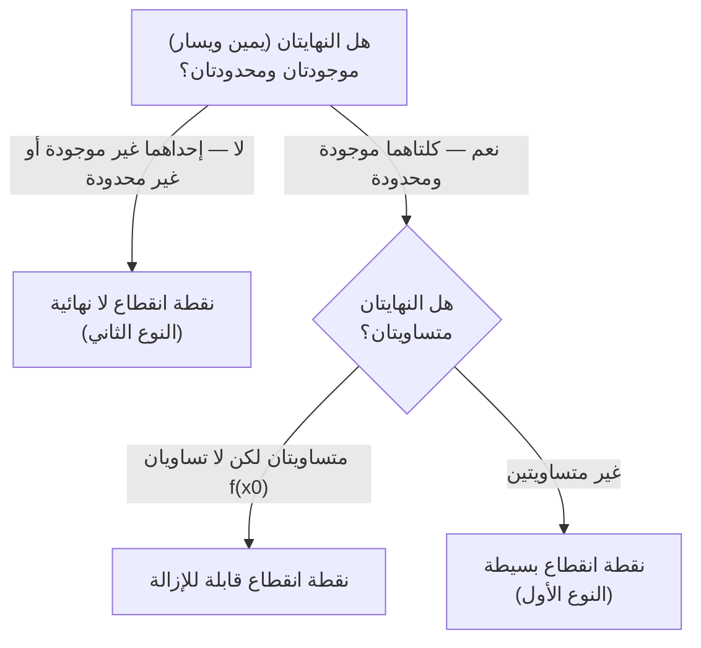

# المحاضرة 2 — Functions, Limits, Continuity and Differentiation (الدوال، النهايات، الاستمرار، والاشتقاق)

> هذه المحاضرة تبني الأساس الكامل لمادة `رياضيات 2`: تبدأ بتعريف الدوال وتصنيفها، تنتقل إلى النهايات والاستمرار (حجر الأساس لكل التحليل الرياضي)، وتنتهي بالاشتقاق بكل قواعده — بما فيه الاشتقاق اللوغاريتمي والمشتقات الجزئية.

---

## الجزء الأول: ملخص منظم (اقرأ قبل المحاضرة!)

### 📍 عن هذه المحاضرة
> هذه المحاضرة تغطي ثلاثة محاور مترابطة: `functions` (تعريفها وأنواعها الاثني عشر)، `limits & continuity` (تعريف `epsilon-delta`، خواص النهايات، وتصنيف نقاط الانقطاع)، و`differentiation` (تعريف المشتق، كل قواعد الاشتقاق، الاشتقاق اللوغاريتمي، والمشتقات الجزئية).

### 🎯 ستتعلم
- تعريف الدالة، مجموعة التعريف $D_f$ ومجموعة القيم $W_f$، والفرق بين الدالة وحيدة القيمة ومتعددة القيم
- أنواع الدوال الاثني عشر: صحيحة، كسرية، صماء، أسية، لوغاريتمية، ضمنية، دورية، عكسية، مثلثية عكسية، وقطعية (`hyperbolic`)
- تعريف النهاية بصيغة `epsilon-delta` وخواصها وطرق حساب حالات عدم التعيين
- تعريف الاستمرار وتصنيف نقاط الانقطاع الثلاثة
- تعريف المشتق من مبدأ النهاية، وكل قواعد الاشتقاق (38 قاعدة) بما فيها الاشتقاق اللوغاريتمي والمشتقات الجزئية

### 📋 المتطلبات السابقة
- رياضيات 1 (أساسيات الجبر والتفاضل)
- المفاهيم الأساسية للدوال المثلثية ($\sin$, $\cos$, $\tan$) واللوغاريتمية ($\ln$, $\log$)

### 💡 الأفكار الرئيسية
- **الدالة** علاقة تربط كل قيمة $x$ بقيمة أو أكثر من $y$
- **النهاية** هي القيمة التي تقترب منها الدالة عند اقتراب $x$ من نقطة معينة، دون أن تصل إليها بالضرورة
- **الاستمرار** يعني أن النهاية عند نقطة تساوي قيمة الدالة عندها فعلياً
- **المشتقة** هي معدل التغيير اللحظي للدالة، وتُبنى مباشرة من تعريف النهاية

### 🔗 الربط بالمحاضرات الأخرى
هذه المحاضرة أساس لكل ما يأتي لاحقاً في `رياضيات 2`: المتسلسلات (`series`) تعتمد على مفهوم النهاية، وتحليل `Fourier` يعتمد على الاشتقاق والدوال الدورية.

### ⚠️ الأخطاء الشائعة الواجب تجنبها
- الخلط بين $D_f$ (مجموعة التعريف) و $W_f$ (مجموعة القيم)
- نسيان شرط $f(x) \geq 0$ عند حساب مجال تعريف الدالة الجذرية
- افتراض أن وجود نهاية من اليمين واليسار يكفي دون التحقق من تساويهما
- الخلط بين نقطة الانقطاع القابلة للإزالة ونقطة الانقطاع البسيطة

---

## الجزء الثاني: الشرح التفصيلي — 1. الدوال وأنواعها (Functions and Their Types)

### 1.1. تعريف الدالة، ‏$D_f$ و $W_f$
<!-- @render: {type: "equation-first", visualization: "none", coverage: "100%"} -->
<!-- @connectivity: {prerequisite: "رياضيات 1"} -->

#### 💡 الفكرة الأساسية
**الدالة $y = f(x)$ هي قاعدة تُحدّد لكل قيمة من $x$ قيمة واحدة أو أكثر من $y$.**

#### 📐 التعريف / الصيغة

$$
y = f(x)
$$

| الرمز | الاسم | ما يمثّله |
| --- | --- | --- |
| $D_f$ | مجموعة التعريف (`domain`) | كل القيم التي يأخذها $x$ |
| $W_f$ | مجموعة القيم (`range`) | كل القيم التي يأخذها $y$ |

#### 📖 الشرح
عندما نكتب $y = f(x)$ فنحن نقول: "أعطني قيمة $x$، وسأعطيك قيمة $y$ الموافقة لها حسب القاعدة $f$". مجموعة كل قيم $x$ المسموح استخدامها تسمى $D_f$، ومجموعة كل النتائج الممكنة لـ $y$ تسمى $W_f$.

في المثال المرافق للمحاضرة، جدول التغيرات يبيّن أن الدالة تنخفض من $+\infty$ إلى القيمة $3$ عند $x = 1$، ثم ترتفع مجدداً إلى $+\infty$. لذلك:

$$
D_f = \;]-\infty,\, +\infty[ \qquad\text{(كل الأعداد الحقيقية مسموحة كمدخل)}
$$

$$
W_f = [3,\, +\infty[ \qquad\text{(القيم الناتجة لا تقل عن 3 أبداً)}
$$

#### 📊 أنواع الدالة من حيث عدد القيم

| النوع | الشرط | مثال |
| --- | --- | --- |
| وحيدة القيمة | كل $x$ يقابله $y$ واحد فقط | $y = x + 1$ |
| متعددة القيم | $x$ واحد قد يقابله أكثر من $y$ | $y^2 = x$ تعطي $y = \pm 2$ عند $x = 4$ |
| ثابتة | $y$ تأخذ قيمة واحدة دوماً بغض النظر عن $x$ | $y = 2$ |

#### 💡 التشبيه:
> فكّر بالدالة كآلة صرف نقدي (`ATM`): تُدخل بطاقتك ($x$) وتحصل على مبلغ محدد ($y$). **وجه الشبه:** البطاقات المقبولة $= D_f$، والمبالغ الممكن سحبها $= W_f$.

#### 🎯 الملخص السريع
- $D_f$ = كل قيم $x$ المسموحة (المدخل)
- $W_f$ = كل قيم $y$ الناتجة (المخرج)
- ثلاثة أنواع من حيث عدد القيم: وحيدة القيمة، متعددة القيم، ثابتة

#### 📚 التطبيق / استخدام
مفهوم $D_f$ أساسي في كل أنواع الدوال اللاحقة — كل نوع (كسرية، جذرية، لوغاريتمية…) له شرط خاص لحساب $D_f$.

#### 📄 النص الأصلي من المحاضرة

عرض النص الأصلي (coverage: 100%)

**النص الأصلي يقول:**
> "نقول عن المقدار y أنه دالة في المتحول x اذا كانت كل قيمة للمتحول x تحدد قيمة أو أكثر للمتحول y وعندها نكتب: y = f(x)... اذا قابلت كل قيمة ل x قيمة واحدة ل y فنسمي الدالة دالة وحيدة القيمة. اذا قابلت كل قيمة ل x أكثر من قيمة ل y عندها نسمي الدالة دالة متعددة القيم... اذا كانت x تأخذ قيمة ثابتة وحيدة دوما عندئذ نسمي الدالة ب الدالة الثابتة."

**ملاحظة على التغطية:**
- ✓ تم شرح بالكامل: تعريف الدالة، $D_f$، $W_f$، الدالة وحيدة/متعددة القيم، الدالة الثابتة، المثال العددي الكامل

#### ⚠️ أخطاء شائعة

#### الفهم الخاطئ ❌:
اعتقاد أن $D_f$ و $W_f$ نفس الشيء، أو الخلط بينهما عند قراءة جدول التغيرات.

#### الفهم الصحيح ✅:
$D_f$ تُقرأ من محور $x$ (السطر الأفقي الأول في الجدول)، بينما $W_f$ تُقرأ من القيم التي تظهر فعلياً في سطر $f(x)$. في المثال: $D_f = \;]-\infty, +\infty[$ و $W_f = [3, +\infty[$ فقط، لأن أدنى قيمة وصلت إليها الدالة هي $3$.

---

### 1.2. الدوال الصحيحة (كثيرات الحدود) والدوال الكسرية
<!-- @render: {type: "equation-first", visualization: "none", coverage: "100%"} -->
<!-- @connectivity: {prerequisite: "section_1.1"} -->

#### ⬅️ الربط مع السابق
بعد تعريف الدالة عموماً، نبدأ بأبسط نوعين: كثيرات الحدود والكسور الجبرية.

#### 💡 الفكرة الأساسية
**كثيرة الحدود معرّفة دوماً على $\mathbb{R}$، أما الدالة الكسرية فهي غير معرّفة عند القيم التي تُصفّر المقام.**

#### 📐 التعريف / الصيغة (الدالة الصحيحة)

$$
F(x) = a_n x^n + a_{n-1}x^{n-1} + \cdots + a_1 x + a_0
\qquad\Longrightarrow\qquad
D_f = \mathbb{R}
$$

#### 📐 المعادلة: الدالة الكسرية

$$
y = f(x) = \frac{h(x)}{g(x)}, \qquad h(x),\ g(x)\ \text{دوال صحيحة}
$$

**الشرح:**
> معرّفة على $\mathbb{R}$ ما عدا القيم التي تعدم المقام، أي $D_f = \mathbb{R} \setminus \{x : g(x) = 0\}$

#### 📖 الشرح
كثيرة الحدود (`polynomial`) هي جمع حدود من الشكل $a_n x^n$ — لا يوجد فيها قسمة ولا جذور، لذلك يمكن حساب قيمتها عند أي $x$ حقيقي بدون مشاكل، ومن هنا $D_f = \mathbb{R}$.

أما الدالة الكسرية فهي قسمة بين كثيرتي حدود. المشكلة الوحيدة تحدث عندما يُصفّر المقام $g(x) = 0$، لأن القسمة على صفر غير معرّفة رياضياً. لذلك نحل المعادلة $g(x) = 0$ ونستبعد حلولها من $\mathbb{R}$ للحصول على $D_f$.

**مثال 1 — المقام له جذور حقيقية:**

$$
y = \frac{x+1}{x^2-x-12}
$$

نحل معادلة المقام:

$$
x^2-x-12 = 0 \;\Longrightarrow\; (x-4)(x+3) = 0 \;\Longrightarrow\; x = 4 \ \text{ أو }\ x = -3
$$

$$
\boxed{\,D_f = \mathbb{R} \setminus \{-3,\, 4\}\,}
$$

**مثال 2 — المقام لا يتصفّر أبداً:**

$$
y = \frac{3}{x^2+1}
$$

المعادلة $x^2+1 = 0 \Rightarrow x^2 = -1$ مستحيلة الحل (لا يوجد عدد حقيقي مربعه سالب)، إذن المقام لا يتصفر أبداً:

$$
\boxed{\,D_f = \mathbb{R}\,}
$$

#### 💡 التشبيه:
> الدالة الكسرية كأنها توزيع كعكة على عدد من الأشخاص. **وجه الشبه:** عدد الأشخاص (المقام) $= 0$ يعني "لا يمكن التوزيع" — نقطة غير معرّفة.

#### 🎯 الملخص السريع
- كثيرة الحدود: $D_f = \mathbb{R}$ دائماً
- الدالة الكسرية: $D_f = \mathbb{R}$ ناقص جذور المقام
- إذا كانت معادلة المقام مستحيلة الحل (`discriminant` سالب)، فـ $D_f = \mathbb{R}$

#### 📚 التطبيق / استخدام
حساب $D_f$ للدوال الكسرية يتكرر في كل مسألة نهايات لاحقاً، خصوصاً عند حساب النهايات عند نقاط عدم التعريف.

#### 📄 النص الأصلي من المحاضرة

عرض النص الأصلي (coverage: 100%)

**النص الأصلي يقول:**
> "الدوال الصحيحة (كثيرات الحدود): وهي دالة من الشكل: F(x) = aₙ.xⁿ + ... + a₁.a₀x+ وهي دوما معرفة على R. الدوال الكسرية: وهي دالة من الشكل y = f(x) = h(x)/g(x) حيث h(x) و g(x) دوال صحيحة، وهي معرفة على مجموعة القيم R ما عدا القيم التي تعدم المقام."

**ملاحظة على التغطية:**
- ✓ تم شرح بالكامل: تعريف كل من النوعين + المثالين الكاملين بالحل

#### ⚠️ أخطاء شائعة

#### الفهم الخاطئ ❌:
حل معادلة المقام فقط دون التحقق مما إذا كانت لها حلول حقيقية، أو نسيان استبعاد الحلول من $\mathbb{R}$.

#### الفهم الصحيح ✅:
دائماً نحل $g(x) = 0$ أولاً؛ فإن كان للمعادلة حلول حقيقية (كما في $x^2-x-12=0$) نستبعدها، وإن كانت مستحيلة الحل (كما في $x^2+1=0$) يبقى $D_f = \mathbb{R}$ كاملاً.

---

### 1.3. الدوال الصماء (الجذرية)
<!-- @render: {type: "equation-first", visualization: "none", coverage: "100%"} -->
<!-- @connectivity: {prerequisite: "section_1.2"} -->

#### ⬅️ الربط مع السابق
بعد الدوال الكسرية (شرط عدم تصفير المقام)، ننتقل لنوع له شرط مختلف: الكمية تحت الجذر يجب ألا تكون سالبة.

#### 💡 الفكرة الأساسية
**الدالة الجذرية $y = \sqrt{f(x)}$ معرّفة فقط عندما تكون الكمية تحت الجذر $f(x) \geq 0$.**

#### 📐 التعريف / الصيغة

$$
y = \sqrt{f(x)}, \qquad \text{معرفة بشرط: } f(x) \geq 0
$$

#### 📖 الشرح
الجذر التربيعي لعدد سالب غير معرّف في الأعداد الحقيقية (لأن مربع أي عدد حقيقي لا يكون سالباً)، لذلك الشرط الوحيد لتعريف الدالة الجذرية هو أن يكون ما تحت الجذر أكبر من أو يساوي صفر. لحل هذا الشرط نبني **جدول إشارة** (`sign table`) للمقدار $f(x)$.

عندما يكون $f(x)$ نفسه كسراً (كما في المثال 2)، يصبح لدينا شرطان مجتمعان:

1. **البسط والمقام يجب أن يكونا بنفس الإشارة** (ليكون الكسر موجباً)،
2. **بالإضافة إلى** أن المقام يجب ألا يساوي صفراً أصلاً (شرط الدالة الكسرية).

في هذه الحالة نبني جدول إشارة مشترك (بسط، مقام، الكسر الناتج) ونحدد أين الكسر موجب أو معدوم.

#### 📊 الأمثلة الأربعة المحلولة

**مثال 1 — جذر لكثيرة حدود:**

$$
y = \sqrt{x^2-x-12} \;\Longrightarrow\; x^2-x-12 \geq 0 \;\Longrightarrow\; (x-4)(x+3) \geq 0
$$

من جدول الإشارة: القيمة موجبة أو معدومة **خارج** الفترة $]-3,\,4[$، إذن:

$$
D_f = \;]-\infty,\,-3]\ \cup\ [4,\,+\infty[
$$

**مثال 2 — جذر لكسر (شرطان مجتمعان):**

$$
y = \sqrt{\frac{x-1}{3-x}} \;\Longrightarrow\; \frac{x-1}{3-x} \geq 0 \quad\text{مع}\quad x \neq 3
$$

النقطة $x = 1$ تعدم البسط، والنقطة $x = 3$ تعدم المقام. من جدول الإشارة (بسط، مقام، كسر): الكسر مقبول (موجب أو صفر) على $[1,\,3[$، إذن:

$$
D_f = [1,\, 3[
$$

**مثال 3 — جذر في البسط وكسر معاً:**

$$
y = \frac{\sqrt{x}}{x-2} \;\Longrightarrow\; x \geq 0 \ \text{(لتعريف الجذر)} \quad\text{و}\quad x \neq 2 \ \text{(لعدم تصفير المقام)}
$$

$$
D_f = [0,\,+\infty[\ \setminus\ \{2\} = [0,\,2[\ \cup\ ]2,\,+\infty[
$$

**مثال 4 — الجذر في المقام (الشرط يصبح صارماً):**

$$
y = \frac{x-2}{\sqrt{x}} \;\Longrightarrow\; x > 0 \ \text{بشكل صارم} \;\Longrightarrow\; D_f = \;]0,\,+\infty[
$$

السبب: لو كان $x = 0$ لأصبح المقام $\sqrt{0} = 0$، وهذا ممنوع.

#### 💡 التشبيه:
> الجذر التربيعي كصانع مسبح — لا يمكنه ملء مسبح بعمق سالب. **وجه الشبه:** العمق السالب ($f(x) < 0$) = طلب مستحيل، فلا يعمل النظام.

#### 🎯 الملخص السريع
- الشرط الأساسي: $f(x) \geq 0$
- إذا كان الجذر في المقام: الشرط يصبح صارماً $f(x) > 0$
- إذا كان تحت الجذر كسر: يجب حل شرط الإشارة مع مراعاة استبعاد نقاط تصفير المقام

#### 📚 التطبيق / استخدام
هذا النمط من جداول الإشارة سيتكرر حرفياً في حساب النهايات ذات حالة عدم التعيين $\frac{0}{0}$ عندما تحوي جذوراً.

#### 📄 النص الأصلي من المحاضرة

عرض النص الأصلي (coverage: 100%)

**النص الأصلي يقول:**
> "الدوال الصماء (الجذرية): وهي دالة من الشكل: y = √f(x)، وهي معرفة بشرط: f(x) ≥ 0" — مع أربعة أمثلة محلولة بالكامل بجداول الإشارة.

**ملاحظة على التغطية:**
- ✓ تم شرح بالكامل: التعريف + الأمثلة الأربعة كاملة بمنطق حلها

#### ⚠️ أخطاء شائعة

#### الفهم الخاطئ ❌:
عند وجود جذر في المقام، استخدام الشرط $f(x) \geq 0$ بدلاً من $f(x) > 0$.

#### الفهم الصحيح ✅:
إذا كان الجذر في المقام (كالمثال 4)، فحتى لو كان $f(x) = 0$ مسموحاً للجذر نظرياً، فإن الناتج ($\sqrt{0} = 0$) يجعل المقام صفراً وهذا ممنوع؛ لذلك الشرط يصبح صارماً: $f(x) > 0$.

---

### 1.4. الدوال الأسية واللوغاريتمية
<!-- @render: {type: "equation-first", visualization: "none", coverage: "100%"} -->
<!-- @connectivity: {prerequisite: "section_1.3"} -->

#### ⬅️ الربط مع السابق
بعد الدوال الجبرية (كثيرات حدود، كسرية، جذرية)، ننتقل للدوال المتعالية (`transcendental`): الأسية واللوغاريتمية، وهما عكس بعضهما البعض.

#### 💡 الفكرة الأساسية
**الدالة الأسية معرّفة دوماً على نفس مجال $f(x)$، بينما اللوغاريتمية تتطلب أن يكون ما بداخلها موجباً تماماً $f(x) > 0$.**

#### 📐 التعريف / الصيغة (الدالة الأسية)

$$
y = a^{f(x)}, \qquad a > 0
$$

**الشرح:**
> لا شرط إضافي — معرّفة على نفس مجال $f(x)$. وعندما $a = e$ نسميها **الدالة الأسية النيبرية** $y = e^{f(x)}$.

#### 📐 المعادلة: الدالة اللوغاريتمية

$$
y = \log_a\big(f(x)\big), \qquad \text{معرفة بشرط } f(x) > 0
$$

**الشرح:**
> شرط صارم (وليس $\geq$). وعندما $a = e$ نكتب $y = \ln\big(f(x)\big)$ وتسمى **الدالة اللوغاريتمية الطبيعية**.

#### 📖 الشرح
الدالة الأسية $y = a^{f(x)}$ (حيث $a$ عدد ثابت موجب) معرّفة على نفس مجموعة تعريف $f(x)$ نفسها — لا يوجد شرط إضافي، لأن رفع عدد موجب لأي أس (سالب، كسري، عشري) يعطي نتيجة معرّفة دائماً.

على النقيض، الدالة اللوغاريتمية $y = \log_a\big(f(x)\big)$ تتطلب أن يكون المقدار الداخلي موجباً تماماً ($f(x) > 0$، وليس $\geq 0$) لأن اللوغاريتم غير معرّف عند الصفر أو الأعداد السالبة.

**مثالان أسيّان:**

$$
y = e^{\frac{1}{x}} \;\Longrightarrow\; D_f = \mathbb{R}\setminus\{0\}
\qquad\text{(لأن } \tfrac{1}{x} \text{ نفسها معرّفة على هذا المجال، والأس لا يضيف شرطاً)}
$$

$$
y = e^{\sqrt{x-1}} \;\Longrightarrow\; D_f = [1,\,+\infty[
\qquad\text{(لأن الجذر يتطلب } x-1 \geq 0\text{)}
$$

**مثال لوغاريتمي (شرطان مجتمعان):**

$$
y = \ln\!\left(\frac{x-1}{5-x}\right) + \ln\lvert x-3 \rvert
$$

الشرط الأول: $\lvert x-3 \rvert > 0 \Rightarrow x \neq 3$.
الشرط الثاني: $\dfrac{x-1}{5-x} > 0$. بجدول الإشارة (بسط يعدم عند $x=1$، مقام يعدم عند $x=5$): الكسر موجب على $]1,\,5[$.

بدمج الشرطين:

$$
D_f = \;]1,\,5[\ \setminus\ \{3\} = \;]1,\,3[\ \cup\ ]3,\,5[
$$

#### 💡 التشبيه:
> اللوغاريتم كباب لا يُفتح إلا بمفتاح موجب. **وجه الشبه:** المفتاح السالب أو الصفري ($f(x) \leq 0$) = الباب لا يفتح أبداً.

#### 🎯 الملخص السريع
- الدالة الأسية: $D_f$ = نفس مجال $f(x)$ بلا شرط إضافي
- الدالة اللوغاريتمية: شرط صارم $f(x) > 0$
- $a = e$ يعطي الدالة الأسية/اللوغاريتمية النيبرية ($e^{f(x)}$ و $\ln f(x)$)
- $\log_a(x) = \dfrac{\ln x}{\ln a}$ (قاعدة تحويل الأساس)

#### 📚 التطبيق / استخدام
الدالتان الأسية واللوغاريتمية تظهران لاحقاً في نهايات شهيرة ($\lim a^{x}$) وفي قواعد الاشتقاق (القواعد 19–22).

#### 📄 النص الأصلي من المحاضرة

عرض النص الأصلي (coverage: 100%)

**النص الأصلي يقول:**
> "الدوال الأسية: وهي دالة من الشكل: y = a^f(x) ؛ a عدد ثابت موجب، وهي معرفة على نفس مجموعة تعريف f(x). اذا كانت a=e عندئذ y=e^f(x) نسمي الدالة الأسية النيبرية... الدوال اللوغاريتمية: وهي دالة من الشكل: y = log_a(f(x))، وهي معرفة بشرط f(x)>0. اذا كانت a=e عندئذ y=log_e(f(x))=ln f(x) وتسمى الدالة اللوغاريتمية الطبيعية."

**ملاحظة على التغطية:**
- ✓ تم شرح بالكامل: التعريفين + جميع الأمثلة المرفقة (الأسية واللوغاريتمية) + قاعدة تحويل الأساس

#### ⚠️ أخطاء شائعة

#### الفهم الخاطئ ❌:
استخدام الشرط $f(x) \geq 0$ (كما في الجذر) بدلاً من $f(x) > 0$ عند حساب مجال الدالة اللوغاريتمية.

#### الفهم الصحيح ✅:
اللوغاريتم يرفض القيمة صفر تماماً (على عكس الجذر الذي يقبلها). الشرط دائماً صارم: $f(x) > 0$ بدون خط تحت الإشارة. أما الأسية فلا تحتاج أي شرط إضافي: $a^{-5}$، $a^{0.3}$، $a^{0}$ كلها معرّفة ما دام $a > 0$.

---

### 1.5. الدوال الضمنية، الدورية، والعكسية
<!-- @render: {type: "equation-first", visualization: "none", coverage: "100%"} -->
<!-- @connectivity: {prerequisite: "section_1.4"} -->

#### ⬅️ الربط مع السابق
بعد أنواع الدوال المعرّفة بصيغة صريحة ($y = f(x)$)، نتعرف الآن على ثلاثة مفاهيم إضافية تصف *شكل العلاقة* بين $x$ و $y$ بدلاً من نوع الصيغة.

#### 💡 الفكرة الأساسية
**الدالة الظاهرية تُكتب صراحة كـ $y = f(x)$؛ الضمنية لا يمكن فصل $y$ فيها بمفردها؛ الدورية تكرر نفس القيم كل مسافة ثابتة $T$؛ والعكسية تعكس دور $x$ و $y$.**

#### 📐 التعريف / الصيغة (الدالة الضمنية)

$$
f(x,\,y) = 0
$$

#### 📐 المعادلة: الدالة الدورية

$$
f(x+T) = f(x) \qquad \text{لكل } x, \quad T = \text{الدور}
$$

#### 📐 المعادلة: الدالة العكسية

$$
y = f(x) \;\Longleftrightarrow\; x = f^{-1}(y), \qquad f^{-1} : W_f \to D_f
$$

#### 📖 الشرح
**الدالة الظاهرية مقابل الضمنية:** إذا كانت العلاقة بين $x$ و $y$ واضحة بحيث يمكن كتابة الدالة بالشكل $y = f(x)$ (مثل $y = \sqrt{3x+1}$، أو حتى $y^2 = x^2+1$ التي يمكن حل $y$ منها) نسميها **ظاهرية**. أما إذا تعذر فصل $y$ بمفرده — مثل:

$$
y\,e^{x+y} - \sin(x\,y) = 0
$$

فهي **دالة ضمنية**، ونكتبها بالشكل العام $f(x,y) = 0$.

**الدالة الدورية:** نقول إن للدالة دور $T$ إذا تكرر نفس السلوك كل $T$ وحدة على محور $x$، أي $f(x+T) = f(x)$ لكل $x$.

*مثال 1:* $f(x) = 3\cos(x) + \sin(x)$ دورها $2\pi$، لأن:

$$
f(x+2\pi) = 3\cos(x+2\pi) + \sin(x+2\pi) = 3\cos(x)+\sin(x) = f(x)
$$

(بما أن الدالتين المثلثيتين الأساسيتين دورهما $2\pi$)

*مثال 2:* $f(x) = \tan(x)$ دورها $\pi$ فقط (نصف دور $\sin/\cos$)، لأن:

$$
\tan(x+\pi) = \frac{\sin(x+\pi)}{\cos(x+\pi)} = \frac{-\sin x}{-\cos x} = \tan(x)
$$

#### 📊 قاعدة عامة للدور

| الدالة | الدور |
| --- | --- |
| $\sin(ax)$ ، $\cos(ax)$ | $\dfrac{2\pi}{a}$ |
| $\tan(ax)$ ، $\cot(ax)$ | $\dfrac{\pi}{a}$ |

**الدالة العكسية:** إذا كانت $y = f(x)$ دالة تُقابل كل عنصر $x \in D_f$ بعنصر $y \in W_f$، فالدالة العكسية $f^{-1}$ تعكس الاتجاه: $f^{-1} : W_f \to D_f$. لإيجادها عملياً نحل معادلة $y = f(x)$ من أجل $x$ بدلالة $y$.

*مثال 1:*

$$
y = 4x - 3 \;\Longrightarrow\; 4x = y+3 \;\Longrightarrow\; x = \frac{y+3}{4} = f^{-1}(y)
$$

*مثال 2:*

$$
y = \frac{x-2}{x+1}
$$

بضرب الطرفين بـ $(x+1)$:

$$
y(x+1) = x-2 \;\Longrightarrow\; xy+y = x-2 \;\Longrightarrow\; xy - x = -y-2
$$

$$
x(y-1) = -y-2 \;\Longrightarrow\; x = \frac{y+2}{1-y}
$$

#### 💡 التشبيه:
> الدالة العكسية كزر "تراجع" (`undo`) — إن كانت $f$ تحول $x$ إلى $y$، فـ $f^{-1}$ تعيد $y$ إلى $x$ الأصلي. **وجه الشبه:** $f$ = تشفير، $f^{-1}$ = فك تشفير.

#### 🎯 الملخص السريع
- ظاهرية: $y = f(x)$ صريحة | ضمنية: $f(x,y) = 0$ غير قابلة للفصل
- دورية: $f(x+T) = f(x)$ — دور $\sin(ax)/\cos(ax)$ هو $2\pi/a$، ودور $\tan(ax)/\cot(ax)$ هو $\pi/a$
- عكسية: $f : D_f \to W_f$ تصبح $f^{-1} : W_f \to D_f$ بحل المعادلة من أجل $x$

#### 📚 التطبيق / استخدام
مفهوم الدور أساسي لاحقاً في تحليل `Fourier`؛ ومفهوم الدالة العكسية أساس مباشر للدوال المثلثية العكسية في القسم التالي.

#### 📄 النص الأصلي من المحاضرة

عرض النص الأصلي (coverage: 100%)

**النص الأصلي يقول:**
> "نقول عن دالة انها ظاهرية اذا كانت العلاقة بين y و x علاقة واضحة... أما اذا كانت العلاقة غير واضحة... فعندئذ نسمي هذه الدالة بالدالة الضمنية نكتبها بالشكل: f(x,y)=0... نقول عن الدالة f(x) انها دورية دورها T اذا كان: f(x+T)=f(x)... اذا كانت لدينا الدالة y=f(x) عندئذ الدالة العكسية لهذه الدالة هي دالة من الشكل x=g(y)."

**ملاحظة على التغطية:**
- ✓ تم شرح بالكامل: التعريفات الثلاثة + جميع الأمثلة (بما فيها مثالي الدالة العكسية بالحل الكامل) + قواعد الدور الأربعة

#### ⚠️ أخطاء شائعة

#### الفهم الخاطئ ❌:
الخلط بين دور $\sin(ax)$ ودور $\tan(ax)$ واستخدام نفس الصيغة $\frac{2\pi}{a}$ للاثنين.

#### الفهم الصحيح ✅:
$\sin$ و $\cos$ لهما دور طبيعي $2\pi$ لأنهما يكملان دورة كاملة قبل التكرار، بينما $\tan$ و $\cot$ لهما دور طبيعي $\pi$ فقط بسبب تناظرهما الخاص. لذلك: $\sin(ax)/\cos(ax)$ دورها $\frac{2\pi}{a}$، أما $\tan(ax)/\cot(ax)$ فدورها $\frac{\pi}{a}$.

---

### 1.6. الدوال المثلثية العكسية والدوال القطعية (Hyperbolic)
<!-- @render: {type: "equation-first", visualization: "none", coverage: "100%"} -->
<!-- @connectivity: {prerequisite: "section_1.5"} -->

#### ⬅️ الربط مع السابق
بعد تعريف مفهوم الدالة العكسية عموماً، نطبقه على الدوال المثلثية، ثم نتعرف على عائلة جديدة مبنية على الدالة الأسية: الدوال القطعية.

#### 💡 الفكرة الأساسية
**الدوال المثلثية العكسية ($\arcsin$, $\arccos$, $\arctan$, $\operatorname{arccot}$) تُرجع الزاوية من قيمة النسبة المثلثية؛ والدوال القطعية ($\operatorname{sh}$, $\operatorname{ch}$, $\operatorname{th}$, $\coth$) مبنية بالكامل من $e^{x}$ و $e^{-x}$.**

#### 📐 التعريف / الصيغة (الدوال المثلثية العكسية)

$$
y = \arcsin(x) \;\Longrightarrow\; D_f = [-1,\,1], \quad W_f = \left[-\frac{\pi}{2},\, \frac{\pi}{2}\right]
$$

#### 📐 المعادلة: الدوال القطعية الأساسية

$$
\operatorname{sh}(x) = \frac{e^{x} - e^{-x}}{2}
$$

$$
\operatorname{ch}(x) = \frac{e^{x} + e^{-x}}{2}
$$

#### 📖 الشرح
**الدوال المثلثية العكسية:** إذا كان $y = \sin(x)$ فإن $x = \arcsin(y)$. لكن $\sin$ بحد ذاتها متعددة القيم على مجالها الطبيعي ($\mathbb{R}$) — لذلك يُقصر مجال $W_f$ للدالة العكسية على فترة معينة لتبقى وحيدة القيمة:

| الدالة | $D_f$ | $W_f$ |
| --- | --- | --- |
| $y = \arcsin(x)$ | $[-1,\,1]$ | $\left[-\frac{\pi}{2},\, \frac{\pi}{2}\right]$ |
| $y = \arccos(x)$ | $[-1,\,1]$ | $[0,\, \pi]$ |
| $y = \arctan(x)$ | $\mathbb{R}$ | $\left]-\frac{\pi}{2},\, \frac{\pi}{2}\right[$ |
| $y = \operatorname{arccot}(x)$ | $\mathbb{R}$ | $]0,\, \pi[$ |

*أمثلة عددية:* $\arcsin\left(\frac{1}{2}\right) = \frac{\pi}{6}$ لأن الزاوية التي $\sin$ لها يساوي $\frac{1}{2}$ هي $\frac{\pi}{6}$ (ضمن $W_f$ المسموح)، و $\arctan(1) = \frac{\pi}{4}$.

**الدوال القطعية (`hyperbolic functions`):** بُنيت اسمياً على تشابه مع الدوال المثلثية ($\operatorname{Sh}$ اختصار `sinus hyperbolicus`، $\operatorname{ch}$ اختصار `cosinus hyperbolicus`، وهكذا) لكنها مبنية جبرياً من الدالة الأسية $e^{x}$:

| الدالة | التعريف | $D_f$ | $W_f$ |
| --- | --- | --- | --- |
| $\operatorname{sh}(x)$ | $\dfrac{e^{x}-e^{-x}}{2}$ | $\mathbb{R}$ | $\mathbb{R}$ |
| $\operatorname{ch}(x)$ | $\dfrac{e^{x}+e^{-x}}{2}$ | $\mathbb{R}$ | $[0,\,+\infty[$ |
| $\operatorname{th}(x)$ | $\dfrac{\operatorname{sh}(x)}{\operatorname{ch}(x)} = \dfrac{e^{x}-e^{-x}}{e^{x}+e^{-x}}$ | $\mathbb{R}$ | $]-1,\,1[$ |
| $\coth(x)$ | $\dfrac{\operatorname{ch}(x)}{\operatorname{sh}(x)}$ | $\mathbb{R}\setminus\{0\}$ | $\mathbb{R}\setminus\{-1,\,1\}$ |

المجال $\mathbb{R}\setminus\{0\}$ لـ $\coth$ سببه أن $\operatorname{sh}(0) = 0$ فيتصفّر المقام.

**خاصية الزوجية/الفردية:** $\operatorname{sh}$ دالة **فردية** لأن:

$$
\operatorname{sh}(-x) = \frac{e^{-x}-e^{x}}{2} = -\operatorname{sh}(x)
$$

بينما $\operatorname{ch}$ دالة **زوجية** ($\operatorname{ch}(-x) = \operatorname{ch}(x)$) لأن الحدين يتبادلان مكانهما دون تغيير المجموع.

#### 📐 المعادلة: القوانين الهامة للدوال القطعية

$$
\operatorname{ch}^2(x) - \operatorname{sh}^2(x) = 1
$$

**الشرح:**
> المعادلة الأساسية، وهي نظير $\cos^2 x + \sin^2 x = 1$ في المثلثيات العادية

$$
\operatorname{sh}(x)+\operatorname{ch}(x) = e^{x}, \qquad \operatorname{ch}(x)-\operatorname{sh}(x) = e^{-x}
$$

$$
\operatorname{th}(x) = \frac{\operatorname{sh}(x)}{\operatorname{ch}(x)}, \qquad \coth(x) = \frac{\operatorname{ch}(x)}{\operatorname{sh}(x)}
$$

$$
\operatorname{sh}(2x) = 2\operatorname{sh}(x)\operatorname{ch}(x), \qquad \operatorname{ch}(2x) = \operatorname{ch}^2(x)+\operatorname{sh}^2(x)
$$

$$
\operatorname{ch}^2(x) = \frac{\operatorname{ch}(2x)+1}{2}, \qquad \operatorname{sh}^2(x) = \frac{\operatorname{ch}(2x)-1}{2}
$$

#### 💡 التشبيه:
> $\operatorname{ch}$ و $\operatorname{sh}$ كتوأمين مبنيين من نفس المكونات ($e^{x}$ و $e^{-x}$) بترتيب جمع أو طرح مختلف. **وجه الشبه:** $\operatorname{ch} = \frac{\text{كبير}+\text{صغير}}{2}$ (زوجي، دائماً موجب)، $\operatorname{sh} = \frac{\text{كبير}-\text{صغير}}{2}$ (فردي، يمكن أن يكون سالباً).

#### 🎯 الملخص السريع
- الدوال المثلثية العكسية تُقصر مجالها لتبقى وحيدة القيمة
- $\operatorname{sh}$ فردية، $\operatorname{ch}$ زوجية
- الهوية الأساسية: $\operatorname{ch}^2 - \operatorname{sh}^2 = 1$
- $\operatorname{th}(x) \in\ ]-1,\,1[$ دائماً محصورة

#### 📚 التطبيق / استخدام
هذه القوانين تُستخدم مباشرة في إثبات متطابقات مثل $\operatorname{th}(2x) = \frac{2\operatorname{th}(x)}{1+\operatorname{th}^2(x)}$ (تمرين محلول في المحاضرة) وستظهر في قواعد الاشتقاق لاحقاً (القواعد 15–18 و 35–38).

#### 📄 النص الأصلي من المحاضرة

عرض النص الأصلي (coverage: 100%)

**النص الأصلي يقول:**
> "الدوال المثلثية العكسية: y=sinx → x=sin⁻¹(y)=arcsin(y)... y=arc sin(x) Df=[-1,1], Wf=[-π/2,π/2]... الدوال القطعية: Sh اختصار ل sin h، ch اختصار ل cos h، th اختصار ل tan h، coth اختصار ل cot h... sh(x)=(eˣ-e⁻ˣ)/2 Df=R Wf=R... سؤال: هل الدالة sh(x) فردية ام زوجية؟ ... فالدالة فردية... قوانين هامة: ch²(x)-sh²(x)=1 ..."

**ملاحظة على التغطية:**
- ✓ تم شرح بالكامل: جدول الدوال المثلثية العكسية الأربعة، تعريفات القطعية الأربعة، إثبات الفردية/الزوجية، القوانين الخمسة
- ℹ️ إضافة من الدليل: التمرينان (إثبات $\operatorname{th}(2x)$ و $\operatorname{ch}(2x)$) نُقلا بحلهما الكامل ضمن جزء التمارين لاحقاً بدل تكرارهما هنا

#### ⚠️ أخطاء شائعة

#### الفهم الخاطئ ❌:
افتراض أن $\arcsin(\sin(x)) = x$ لكل $x$، أو أن مجال $\arctan$ يشمل القيمتين $\pm\frac{\pi}{2}$ ذاتهما.

#### الفهم الصحيح ✅:
$\arcsin(\sin(x)) = x$ فقط عندما $x \in \left[-\frac{\pi}{2}, \frac{\pi}{2}\right]$ (مجال القيم $W_f$)؛ خارج هذا المجال يجب أولاً "طي" الزاوية داخله. كذلك $W_f$ لـ $\arctan$ هي فترة **مفتوحة** $\left]-\frac{\pi}{2}, \frac{\pi}{2}\right[$ — القيمتان الطرفيتان لا تُبلغان أبداً (لأن $\tan$ تؤول إلى $\pm\infty$ عندهما).

---

## الجزء الثاني: الشرح التفصيلي — 2. النهايات والاستمرار (Limits and Continuity)

### 2.1. تعريف النهاية (Epsilon-Delta) وخواصها
<!-- @render: {type: "equation-first", visualization: "none", coverage: "100%"} -->
<!-- @connectivity: {prerequisite: "section_1.6"} -->

#### ⬅️ الربط مع السابق
بعد أن تعرّفنا على كل أنواع الدوال، ننتقل للسؤال الأهم: كيف تتصرف الدالة عندما يقترب $x$ من نقطة معينة؟ هذا هو مفهوم النهاية.

#### 💡 الفكرة الأساسية
**نهاية الدالة $f(x)$ عند $x_0$ هي القيمة $l$ التي تقترب منها $f(x)$ كلما اقترب $x$ من $x_0$، بدقة رياضية صارمة عبر `epsilon-delta`.**

#### 📐 التعريف / الصيغة

$$
\lim_{x \to x_0} f(x) = l
$$

**الشرح:**
> تُقرأ: نهاية $f(x)$ عندما يسعى $x$ إلى $x_0$ تساوي $l$

$$
\forall\, \varepsilon > 0 \;:\; \exists\, \delta > 0 \;:\; \lvert x-x_0 \rvert < \delta \;\Longrightarrow\; \lvert f(x)-l \rvert < \varepsilon
$$

#### 📖 الشرح
هذا التعريف يقول بلغة رياضية دقيقة: "مهما اخترنا هامش خطأ صغير جداً $\varepsilon$ حول القيمة $l$، يمكننا إيجاد نطاق صغير $\delta$ حول $x_0$ بحيث كل $x$ داخل هذا النطاق تعطي $f(x)$ قريبة من $l$ بمقدار أقل من $\varepsilon$". بعبارة أبسط: كلما اقتربنا أكثر من $x_0$، اقتربت $f(x)$ أكثر من $l$، بدون حدود.

عندما تكون النهاية عند $x \to +\infty$ يتغير التعريف: بدلاً من $\delta$ حول $x_0$، نستخدم عتبة $M$ كبيرة بحيث كل $x > M$ يجعل $f(x)$ قريبة من $l$. وبالمثل عند $x \to -\infty$ نستخدم عتبة $m$ صغيرة (سالبة كبيرة) بحيث كل $x < m$ يعطي التقارب.

#### 📊 خواص النهايات (كيف تتوزع على العمليات)

**① الثابت الضربي يخرج من النهاية:**

$$
\lim_{x\to x_0}\big(b \cdot f(x)\big) = b \cdot \lim_{x\to x_0} f(x)
$$

**② النهاية تدخل داخل اللوغاريتم:**

$$
\lim_{x\to x_0} \log_a\big(f(x)\big) = \log_a\left(\lim_{x\to x_0} f(x)\right)
$$

*مثال:*

$$
\lim_{x\to\infty}\ln\left(\frac{2x-1}{x-2}\right) = \ln 2
$$

**③ النهاية تدخل داخل الجذر:**

$$
\lim_{x\to x_0} \sqrt[n]{f(x)} = \sqrt[n]{\lim_{x\to x_0} f(x)}
$$

**④** النهاية تتوزع أيضاً على الجمع والطرح والضرب والقسمة (بشرط ألا يكون المقام صفراً في حالة القسمة).

#### 📐 المعادلة: خاصية الإحاطة (Squeeze Theorem)

$$
g(x) \leq f(x) \leq h(x) \quad\text{و}\quad \lim g(x) = \lim h(x) = l \;\Longrightarrow\; \lim f(x) = l
$$

**الشرح:**
> الدالة "محاصرة" بين دالتين لهما نفس النهاية فتُجبر على نفس القيمة

#### 💡 التشبيه:
> التعريف كلعبة "أقرب فأقرب": أنت تتحدى ($\varepsilon$)، والنهاية ترد بمنطقة أمان ($\delta$) تضمن الدقة المطلوبة. **وجه الشبه:** $\varepsilon$ = مدى دقة التحدي، $\delta$ = رد النظام لتحقيقه.

#### 🎯 الملخص السريع
- `epsilon-delta`: دقة $x_0$ (عبر $\delta$) تضمن دقة $l$ (عبر $\varepsilon$)
- عند $x \to \infty$: $\delta$ تُستبدل بعتبة $M$ أو $m$
- النهاية تتوزع على $+,\ -,\ \times,\ \div,\ \log,\ \sqrt{\ }$ بشروط
- الإحاطة: دالتان محاصرتان بنفس النهاية تجبران الدالة الوسطى على نفس النتيجة

#### 📚 التطبيق / استخدام
هذا التعريف هو الأساس النظري لكل تقنيات حساب النهايات في القسم التالي، ولتعريف الاستمرار والمشتقة لاحقاً.

#### 📄 النص الأصلي من المحاضرة

عرض النص الأصلي (coverage: 100%)

**النص الأصلي يقول:**
> "تعريف: نقول أن للدالة y=f(x) نهاية ولتكن l في النقطة x=x₀ اذا وجدت اعداد ε,δ التي تحقق: ∀ε>0: ∃δ>0: |x-x₀|<δ → |f(x)-l|<ε ... النهاية تتوزع على الجمع والطرح والضرب والقسمة... الإحاطة: g(x)≤f(x)≤h(x) ..."

**ملاحظة على التغطية:**
- ✓ تم شرح بالكامل: التعريف الأساسي + حالتي اللانهاية + خواص التوزع + الإحاطة + المثال العددي

#### ⚠️ أخطاء شائعة

#### الفهم الخاطئ ❌:
الاعتقاد بأن النهاية عند $x_0$ تتطلب أن تكون الدالة معرّفة عند $x_0$ نفسها.

#### الفهم الصحيح ✅:
النهاية تصف سلوك الدالة **حول** $x_0$، وليس بالضرورة **عند** $x_0$. قد لا تكون $f(x_0)$ معرّفة أصلاً (كما في $\frac{\sin x}{x}$ عند $x = 0$) ومع ذلك تكون النهاية موجودة ومحدودة.

---

### 2.2. حالات عدم التعيين وطرق حساب النهايات
<!-- @render: {type: "equation-first", visualization: "none", coverage: "100%"} -->
<!-- @connectivity: {prerequisite: "section_2.1"} -->

#### ⬅️ الربط مع السابق
بعد التعريف النظري، نحتاج أدوات عملية لحساب النهايات، خاصة عندما يعطي التعويض المباشر نتيجة غير محددة.

#### 💡 الفكرة الأساسية
**سبع حالات عدم تعيين قياسية، وخمس طرق أساسية لحلها.**

#### 📐 التعريف / الصيغة (حالات عدم التعيين السبع)

$$
\frac{\pm\infty}{\pm\infty}, \qquad \frac{0}{0}, \qquad +\infty-\infty, \qquad \pm\infty \times 0
$$

$$
(1)^{0}, \qquad (0)^{0}, \qquad (\infty)^{0}
$$

**الشرح:**
> الصيغ الثلاث الأخيرة منقولة حرفياً كما وردت في المحاضرة الأصلية. لاحظ أن "الملخص السريع" أدناه يكتبها بالصورة $1^{\infty}$ و $0^{0}$ و $\infty^{0}$ — راجع هذا الفرق مع مُدرّس المادة.

#### 📖 الشرح
عندما يعطي التعويض المباشر لـ $x = x_0$ إحدى هذه الصور السبعة، لا يمكننا الاستنتاج مباشرة — نحتاج معالجة جبرية أولاً.

#### ⚙️ الطرق الخمس لحساب النهايات

**① حدود مسيطرة (`dominant terms`)**
عند $x \to \infty$ في كثيرة حدود أو كسر جبري، نُخرج أعلى قوة من $x$ كعامل مشترك من البسط والمقام، لأنها هي التي "تسيطر" على السلوك عند اللانهاية.

**② الضرب والقسمة بالمرافق (`conjugate`)**
تُستخدم عند وجود جذور تسبب $\infty-\infty$ أو $\frac{0}{0}$. نضرب البسط والمقام بمرافق التعبير الجذري لإزالة الجذر.

*مثال:*

$$
\lim_{x\to+\infty}\left(\sqrt{x^2-2x-1}-\sqrt{x^2-7x+3}\right) \qquad \text{حالة } \infty-\infty
$$

نضرب بالمرافق، فيصبح البسط:

$$
(x^2-2x-1)-(x^2-7x+3) = 5x-4
$$

بعد إخراج $x$ كعامل مشترك من البسط والمقام والتبسيط، تؤول النهاية إلى $\dfrac{5}{2}$.

**③ الإحاطة**
تُستخدم عند وجود دالة مقيدة (مثل $\sin$ أو $\cos$) مضروبة بشيء يؤول إلى صفر أو لانهاية.

**④ تحليل لجداء أقواس (`factoring`)**
تُستخدم عند $\frac{0}{0}$ في كسر جبري (وليس جذري) — نحلل البسط والمقام لعوامل ونحذف العامل المشترك المسبب للصفر.

*مثال:*

$$
\lim_{x\to1}\frac{x^2-1}{x-1} = \lim_{x\to1}\frac{(x-1)(x+1)}{x-1} = \lim_{x\to1}(x+1) = 2
$$

**⑤ نهايات شهيرة (`famous limits`)**
قوائم نتائج محفوظة (انظر القسم التالي) نستخدمها مباشرة أو بعد تحويل جبري بسيط.

*مثال على قسمة إقليدية لحالة $(1)^{\infty}$:*

$$
\lim_{x\to\infty}\left(\frac{x}{x+1}\right)^{x}
$$

نكتبها بصيغة "$1 +$ شيء":

$$
\frac{x}{x+1} = 1 + \frac{-1}{x+1}
$$

ثم بتعويض $t = \dfrac{-1}{x+1}$ (فعندما $x \to \infty$ فإن $t \to 0$)، تصبح النهاية من الشكل القياسي $\lim (1+t)^{\frac{1}{t}}$ وتؤول إلى:

$$
e^{-1} = \frac{1}{e}
$$

#### 💡 التشبيه:
> حالات عدم التعيين كأسئلة غامضة الجواب ("$\infty$ ناقص $\infty$ = ؟") لا يمكن الإجابة عنها مباشرة. **وجه الشبه:** التقنيات الخمس = أدوات "توضيح السؤال" قبل الإجابة.

#### 🎯 الملخص السريع
- 7 حالات عدم تعيين: $\frac{\infty}{\infty}$، $\frac{0}{0}$، $\infty-\infty$، $\infty\times0$، $1^{\infty}$، $0^{0}$، $\infty^{0}$
- 5 طرق: حدود مسيطرة، مرافق، إحاطة، تحليل، نهايات شهيرة
- عند $1^{\infty}$ أو صيغ مشابهة: التعويض $t = \frac{1}{x}$ أو ما شابه يحوّلها لصيغة $(1+t)^{\frac{1}{t}} \to e$

#### 📚 التطبيق / استخدام
هذه التقنيات الخمس تُستخدم حرفياً بنفس الأسلوب لاحقاً عند دراسة الاستمرار (حساب النهاية من اليمين واليسار) وعند حساب المشتقة من تعريف النهاية مباشرة.

#### 📄 النص الأصلي من المحاضرة

عرض النص الأصلي (coverage: 95%)

**النص الأصلي يقول:**
> "حالات عدم التعيين: ±∞/±∞ , 0/0 , +∞-∞ , ±∞×0 , (1)⁰ , (0)⁰ , (∞)⁰ ... طرق حساب النهايات: حدود مسيطرة، الضرب والقسمة بالمرافق، إحاطة، تحليل لجداء أقواس، نهايات شهيرة." مع مجموعة تمارين محلولة بالتفصيل (مرافق مزدوج، قسمة إقليدية، نهايات `sin(mx)/sin(nx)`).

**ملاحظة على التغطية:**
- ✓ تم شرح بالكامل: الحالات السبع + الطرق الخمس + مثالين تفصيليين (المرافق والقسمة الإقليدية)
- ⚠️ لم يُشرح بالكامل: كل التمارين العددية الإضافية في المحاضرة (مثل $\lim_{x\to3} \frac{\sqrt{2x+3}-\sqrt{x+6}}{\sqrt{x-1}-\sqrt{8-2x}}$) — أسلوبها مطابق تماماً للمثال المشروح (مرافق مزدوج) وأُدرجت في جزء تمارين تتبع التنفيذ لاحقاً بدل التكرار

#### ⚠️ أخطاء شائعة

#### مهم للامتحان ⚠️:
عند استخدام تقنية "حدود مسيطرة" تحت الجذر، تذكّر أن $\sqrt{x^2} = \lvert x \rvert$، وعند $x \to -\infty$ فإن $\lvert x \rvert = -x$ وليس $x$ — هذا خطأ إشارة شائع جداً يقلب النتيجة من موجبة لسالبة أو العكس.

#### الفهم الخاطئ ❌:
معاملة $\infty - \infty$ وكأن ناتجها صفر تلقائياً.

#### الفهم الصحيح ✅:
$\infty - \infty$ حالة عدم تعيين تماماً — الناتج يعتمد على "من يكبر أسرع"، وقد يكون أي عدد حقيقي أو $+\infty$ أو $-\infty$ بحسب الدالتين. يجب دائماً معالجتها جبرياً (بالمرافق عادة) قبل الحكم على النتيجة.

---

### 2.3. نهايات شهيرة
<!-- @render: {type: "equation-first", visualization: "none", coverage: "100%"} -->
<!-- @connectivity: {prerequisite: "section_2.2"} -->

#### ⬅️ الربط مع السابق
هذه قائمة نتائج جاهزة تُستخدم كأداة خامسة من أدوات حساب النهايات المذكورة أعلاه.

#### 💡 الفكرة الأساسية
**قائمة نهايات محفوظة تُستخدم مباشرة أو بعد تعويض بسيط لتحويل أي نهاية مشابهة إلى الصيغة القياسية.**

#### 📐 التعريف / الصيغة

$$
\lim_{x\to0}\frac{\sin x}{x} = 1
$$

$$
\lim_{x\to0}\frac{\tan x}{x} = 1
$$

$$
\lim_{x\to\infty}\left(1+\frac{1}{x}\right)^{x} = e
$$

$$
\lim_{x\to0}(1+x)^{\frac{1}{x}} = e
$$

#### 📖 الشرح
هذه النهايات لا تُشتق كل مرة من الصفر بل تُحفظ كقواعد جاهزة:

| # | النهاية | القيمة |
| --- | --- | --- |
| 1 | $\lim\limits_{x\to0} \dfrac{\sin x}{x}$ و $\lim\limits_{x\to0} \dfrac{x}{\sin x}$ | $1$ |
| 2 | $\lim\limits_{x\to0} \dfrac{\tan x}{x}$ و $\lim\limits_{x\to0} \dfrac{x}{\tan x}$ | $1$ |
| 3 | $\lim\limits_{x\to\infty} \left(1+\frac{1}{x}\right)^{x}$ | $e$ |
| 4 | $\lim\limits_{x\to0} (1+x)^{\frac{1}{x}}$ | $e$ |
| 5 | $\lim\limits_{x\to\infty} a^{x}$ | $+\infty$ إن $a>1$ ؛ $0$ إن $-1<a<1$ ؛ لا توجد إن $a<-1$ |

**قاعدة الاستخدام بالتعميم:** إذا واجهت نهاية مشابهة بشكل $\frac{\sin(mx)}{\sin(nx)}$ عند $x\to0$، لا تحاول حفظ صيغة جديدة، بل فكّك المسألة إلى الشكل القياسي:

$$
f(x) = m \cdot \frac{\sin(mx)}{mx} \cdot \frac{nx}{\sin(nx)} \cdot \frac{1}{n}
$$

$$
\Longrightarrow\quad \lim_{x\to0} f(x) = \frac{m}{n}
$$

كل جزء من هذا التفكيك يؤول إلى $1$ بالنهاية الشهيرة رقم 1، ويبقى فقط $\frac{m}{n}$.

**قاعدة أخرى شائعة (النوع الجذري):** عند نهايات من الشكل $\dfrac{\sqrt{x \pm a} - c}{\sqrt{x \pm b} - d}$ نستخدم المرافق مرتين (لكل جذر على حدة) بنفس منطق المثال المشروح سابقاً.

#### 💡 التشبيه:
> النهايات الشهيرة كجدول ضرب محفوظ — بدل إعادة اشتقاقه كل مرة، نطبقه مباشرة أو نُحوّل السؤال لشكله. **وجه الشبه:** تحويل $\frac{\sin(mx)}{\sin(nx)}$ لصيغة $\frac{\sin u}{u}$ = "إعادة كتابة السؤال بلغة الجدول المحفوظ".

#### 🎯 الملخص السريع
- $\frac{\sin x}{x} \to 1$ و $\frac{\tan x}{x} \to 1$ عند $x\to0$
- $\left(1+\frac{1}{x}\right)^{x} \to e$ عند $x\to\infty$، و $(1+x)^{\frac{1}{x}} \to e$ عند $x\to0$ (نفس النهاية بصيغتين)
- عند صيغ مركبة، فكك المقدار لأجزاء تطابق الصيغة القياسية بالضبط

#### 📚 التطبيق / استخدام
النهايتان الثالثة والرابعة ($e$) أساس تعريف الدالة الأسية النيبرية نفسها، وستظهران لاحقاً في نهايات الدوال اللوغاريتمية عند دراسة الاشتقاق من التعريف.

#### 📄 النص الأصلي من المحاضرة

عرض النص الأصلي (coverage: 100%)

**النص الأصلي يقول:**
> "نهايات شهيرة: lim(x→0) sinx/x = 1, lim(x→0) x/sinx = 1 ... lim(x→∞)(1+1/x)ˣ = e ... lim(x→0)(1+x)^(1/x) = e ... lim(x→∞) aˣ = +∞ ; a>1 ، 0 ; -1<a<1 ، لا توجد نهاية ; a<-1" مع تمارين محلولة كاملة (`(1+1/x)^(x/2)`، `(1+3/x)ˣ` بالتعويض `t=3/x`، `sin(mx)/sin(nx)`).

**ملاحظة على التغطية:**
- ✓ تم شرح بالكامل: القائمة الكاملة + منطق التعويض للصيغ المركبة + مثال $\frac{\sin(mx)}{\sin(nx)}$ بالتفصيل

#### ⚠️ أخطاء شائعة

#### الفهم الخاطئ ❌:
تطبيق $\lim \left(1+\frac{1}{x}\right)^{x} = e$ حرفياً على $\lim \left(1+\frac{1}{x}\right)^{\frac{x}{2}}$ دون تعديل.

#### الفهم الصحيح ✅:
نفصل الأس الإضافي كقوة خارجية:

$$
\left(1+\frac{1}{x}\right)^{\frac{x}{2}} = \left[\left(1+\frac{1}{x}\right)^{x}\right]^{\frac{1}{2}} \;\longrightarrow\; e^{\frac{1}{2}} = \sqrt{e}
$$

القاعدة: افصل الأس الإضافي كقوة خارجية على النهاية الشهيرة، ولا تُدخله داخل الصيغة مباشرة.

---

### 2.4. الاستمرار وتصنيف نقاط الانقطاع
<!-- @render: {type: "equation-first", visualization: "none", coverage: "100%"} -->
<!-- @connectivity: {prerequisite: "section_2.3"} -->

#### ⬅️ الربط مع السابق
بعد إتقان حساب النهايات، نستخدمها الآن للإجابة عن سؤال جديد: هل الدالة "متصلة" بلا قفزات عند نقطة معينة؟

#### 💡 الفكرة الأساسية
**الدالة مستمرة عند $x_0$ إذا كانت نهايتها عند $x_0$ تساوي قيمتها الفعلية $f(x_0)$ — أي لا فرق بين "أين تتجه" الدالة و"أين هي فعلياً".**

#### 📐 التعريف / الصيغة

$$
\lim_{x\to x_0} f(x) = f(x_0)
$$

$$
\lim_{x\to x_0^{+}} f(x) = \lim_{x\to x_0^{-}} f(x) = f(x_0)
$$

**الشرح:**
> الصيغة الثانية هي الشكل الواجب فحصه عند وجود نهايتي يمين ويسار (الدوال المعرّفة بالتجزئة)

#### 📖 الشرح
لكي تكون الدالة مستمرة عند نقطة $x_0$، يجب التحقق من ثلاثة أشياء **متزامنة**:

1. النهاية عند $x_0$ موجودة،
2. $f(x_0)$ معرّفة،
3. القيمتان متساويتان.

عندما تكون الدالة معرّفة بتعريف مجزّأ (`piecewise`، أي صيغة مختلفة قبل وبعد نقطة معينة)، يجب حساب النهاية من اليمين ($x \to x_0^{+}$) ومن اليسار ($x \to x_0^{-}$) بشكل منفصل، والتأكد أنهما متساويتان معاً وتساويان $f(x_0)$.

**تكون الدالة مستمرة على مجال $I$** إذا كانت مستمرة عند كل نقطة من هذا المجال، وتكون **مستمرة على $\mathbb{R}$** إذا كانت مستمرة عند كل نقطة من $\mathbb{R}$.

**مثال 1 (غير مستمرة):**

$$
f(x) = \frac{x^2-1}{x-1} \ \text{ لـ } x \neq 1, \qquad f(1) = 1
$$

النهاية عند $x=1$ تعطي $\frac{0}{0}$ (عدم تعيين)، وبعد التحليل:

$$
\lim_{x\to1}\frac{(x-1)(x+1)}{x-1} = \lim_{x\to1}(x+1) = 2
$$

بما أن $2 \neq f(1) = 1$، فالدالة **غير مستمرة** عند $x=1$.

**مثال 2 (مستمرة):**

$$
f(x) = x^2 \ \text{ لـ } 0 \leq x \leq 1, \qquad f(x) = 2-x \ \text{ لـ } 1 < x \leq 2
$$

$$
\lim_{x\to1^{-}} x^2 = 1, \qquad \lim_{x\to1^{+}} (2-x) = 1, \qquad f(1) = 1
$$

الثلاثة متساوية، إذن الدالة **مستمرة** عند $x=1$.

#### 📊 المخطط: تصنيف نقاط الانقطاع

#### ما هذا المخطط؟
> يوضّح كيفية تصنيف نقطة الانقطاع $x_0$ إلى واحدة من ثلاثة أنواع، بناءً على حالة النهايتين اليمنى واليسرى عندها.

**شرح العناصر:**
- **العقدة الجذر**: نقطة الانطلاق — نفحص أولاً وجود النهايتين اليمنى واليسرى وكونهما محدودتين
- **نقطة انقطاع لا نهائية (النوع الثاني)**: إحدى النهايتين غير موجودة أو غير محدودة
- **نقطة انقطاع قابلة للإزالة**: النهايتان موجودتان ومتساويتان، لكن الناتج المشترك $\neq f(x_0)$
- **نقطة انقطاع بسيطة (النوع الأول)**: النهايتان موجودتان ومحدودتان لكن غير متساويتين

**شرح الروابط:**
- **الجذر ← النوع الثاني**: يكفي أن تفشل إحدى النهايتين — مثال: $\lim_{x\to0^{-}} = -1$ بينما $\lim_{x\to0^{+}} = +\infty$
- **الجذر ← الفحص الثاني**: إذا نجح الفحص الأول ننتقل لمقارنة النهايتين ببعضهما
- **الفحص الثاني ← قابلة للإزالة**: النهايتان متساويتان لكنهما تخالفان قيمة الدالة — مثال: $\lim = 2$ بينما $f(0) = 0$
- **الفحص الثاني ← بسيطة**: النهايتان محدودتان ومختلفتان — مثال: $\lim^{+} = -1$ و $\lim^{-} = 1$

#### 🎯 الملخص السريع
- **قابلة للإزالة:** النهاية موجودة ومحدودة لكن $\neq f(x_0)$ — مثال: $\lim = 2$، $f(0) = 0$
- **بسيطة (النوع الأول):** نهايتا اليمين واليسار موجودتان ومحدودتان لكن غير متساويتين — مثال: $\lim^{+} = -1$، $\lim^{-} = 1$
- **لا نهائية (النوع الثاني):** إحدى النهايتين غير موجودة أو لا نهائية — مثال: $\lim^{-} = -1$، $\lim^{+} = +\infty$

#### 📚 التطبيق / استخدام
تصنيف نقاط الانقطاع يُستخدم مباشرة عند رسم الدوال (تحديد الخطوط المقاربة) وعند دراسة قابلية الاشتقاق (كل نقطة غير مستمرة تلقائياً غير قابلة للاشتقاق).

#### 📄 النص الأصلي من المحاضرة

عرض النص الأصلي (coverage: 100%)

**النص الأصلي يقول:**
> "نقول عن الدالة f(x) أنها مستمرة عند النقطة (x₀) اذا تحقق الشرط: lim(x→x₀) f(x)=f(x₀)... تصنيف نقاط الانقطاع: A) نقطة الانقطاع القابلة للإزالة... B) نقطة الانقطاع البسيطة (نقطة انقطاع من النوع الأول)... C) نقطة انقطاع لا نهائية (نقطة انقطاع من النوع الثاني)..." مع أمثلة محلولة كاملة لكل نوع.

**ملاحظة على التغطية:**
- ✓ تم شرح بالكامل: تعريف الاستمرار + المثالين + تصنيف الأنواع الثلاثة بالتعريف والمثال لكل منها

#### ⚠️ أخطاء شائعة

#### الفهم الخاطئ ❌:
الاكتفاء بالتحقق من تساوي النهايتين (يمين ويسار) دون مقارنتهما بقيمة $f(x_0)$ الفعلية عند الحكم على الاستمرار.

#### الفهم الصحيح ✅:
تساوي النهايتين شرط ضروري لكن غير كافٍ — يجب أيضاً أن يساوي هذا الناتج المشترك القيمة الفعلية $f(x_0)$. إن تساوت النهايتان لكن اختلفتا عن $f(x_0)$، فهي نقطة انقطاع قابلة للإزالة، وليست استمراراً.

---

## الجزء الثاني: الشرح التفصيلي — 3. الاشتقاق والتفاضل (Differentiation)

### 3.1. تعريف المشتق من مبدأ النهاية
<!-- @render: {type: "equation-first", visualization: "none", coverage: "100%"} -->
<!-- @connectivity: {prerequisite: "section_2.4"} -->

#### ⬅️ الربط مع السابق
بعد إتقان النهايات والاستمرار، نستخدمهما الآن لبناء أهم أداة في التحليل الرياضي: المشتقة.

#### 💡 الفكرة الأساسية
**مشتق الدالة عند نقطة هو نهاية نسبة تزايد الدالة إلى تزايد $x$، عندما يؤول هذا التزايد إلى الصفر.**

#### 📐 التعريف / الصيغة (الصيغة الأولى — بدلالة $\Delta x$)

$$
f'(x_0) = \lim_{\Delta x \to 0} \frac{f(x_0+\Delta x)-f(x_0)}{\Delta x}
$$

#### 📐 المعادلة: الصيغة الثانية — بدلالة $x \to x_0$

$$
f'(x_0) = \lim_{x \to x_0} \frac{f(x)-f(x_0)}{x-x_0}
$$

**الشرح:**
> الصيغتان متكافئتان تماماً؛ الأولى تستخدم $\Delta x = x - x_0$ كمتغير يؤول للصفر، والثانية تستخدم $x$ نفسها كمتغير يؤول إلى $x_0$

#### 📖 الشرح
كلتا الصيغتين تعبّران عن نفس الفكرة: معدل تغيّر $y$ بالنسبة لتغيّر $x$ عندما يصبح هذا التغيير صغيراً جداً (يؤول للصفر). **المشتق يكون موجوداً فقط إذا كانت هذه النهاية موجودة ومحدودة** (وليست لا نهائية أو غير موجودة).

**مثال (إثبات من التعريف):** ليكن $f(x) = \sqrt{x}$ معرّفاً على $[0,+\infty[$ وقابلاً للاشتقاق على $]0,+\infty[$. نثبت أن $f'(x) = \frac{1}{2\sqrt{x}}$.

باستخدام الصيغة الثانية، لتكن $x_0 \in\ ]0,+\infty[$ ولنحسب $f(x)-f(x_0) = \sqrt{x} - \sqrt{x_0}$:

$$
f'(x_0) = \lim_{x\to x_0} \frac{\sqrt{x}-\sqrt{x_0}}{x-x_0}
$$

هذه حالة $\frac{0}{0}$. نضرب بالمرافق $\left(\sqrt{x}+\sqrt{x_0}\right)$:

$$
\frac{\sqrt{x}-\sqrt{x_0}}{x-x_0}
= \frac{(\sqrt x-\sqrt{x_0})(\sqrt x+\sqrt{x_0})}{(x-x_0)(\sqrt x+\sqrt{x_0})}
= \frac{x-x_0}{(x-x_0)(\sqrt x+\sqrt{x_0})}
= \frac{1}{\sqrt x+\sqrt{x_0}}
$$

بأخذ النهاية عند $x \to x_0$:

$$
f'(x_0) = \frac{1}{\sqrt{x_0}+\sqrt{x_0}} = \frac{1}{2\sqrt{x_0}}
\qquad\Longrightarrow\qquad
f'(x) = \frac{1}{2\sqrt{x}}
$$

**لاحظ أن هذا الإثبات يستخدم بالضبط نفس تقنية "الضرب بالمرافق" المستخدمة في حساب النهايات.**

#### 💡 التشبيه:
> المشتقة كسرعة عداد السيارة اللحظية. **وجه الشبه:** المسافة المقطوعة في زمن صغير جداً ($\Delta x \to 0$) هي بالضبط "السرعة عند تلك اللحظة" ($f'(x)$).

#### 🎯 الملخص السريع
- المشتق = نهاية نسبة التزايد عند $\Delta x \to 0$
- يجب أن تكون النهاية موجودة **ومحدودة** ليكون المشتق موجوداً
- إثبات $f' = \frac{1}{2\sqrt{x}}$ يستخدم تقنية المرافق مباشرة من قسم النهايات

#### 📚 التطبيق / استخدام
هذا التعريف هو الأساس الذي *اشتُقت* منه كل قواعد الاشتقاق الجاهزة في الأقسام التالية — فهم هذا القسم يفسر "لماذا" تعمل تلك القواعد.

#### 📄 النص الأصلي من المحاضرة

عرض النص الأصلي (coverage: 100%)

**النص الأصلي يقول:**
> "نعرف مشتق دالة بأنه نسبة تزايد الدالة على تزايد المتحول المستقل x عندما يسعى الفرق Δx=x-x₀ الى الصفر ويعطى بالشكل: y'=f'(x)=lim(Δx→0) Δy/Δx ... ويكون المشتق موجود اذا كانت هذه النهاية موجودة و محدودة. مثال: ليكن f(x)=√x معرف على [0,+∞[ وقابل للاشتقاق على ]0,+∞[ أثبت أن: f'(x)=1/(2√x)" مع الحل الكامل بالمرافق.

**ملاحظة على التغطية:**
- ✓ تم شرح بالكامل: الصيغتان المتكافئتان + شرط الوجود + الإثبات الكامل خطوة بخطوة

#### ⚠️ أخطاء شائعة

#### الفهم الخاطئ ❌:
نسيان أن $x_0$ في الإثبات هي نقطة "عامة" ثابتة أثناء الحساب، فيحدث خلط بين $x$ (متغير النهاية) و $x_0$ (النقطة الثابتة).

#### الفهم الصحيح ✅:
طوال عملية أخذ النهاية $x \to x_0$، تبقى $x_0$ ثابتة تماماً (كأنها رقم معروف)، بينما $x$ هو المتغير الذي يتحرك نحوها. بعد انتهاء الحساب فقط، نستبدل $x_0$ بـ $x$ عامة لأن النتيجة صالحة لأي نقطة في المجال.

---

### 3.2. قواعد الاشتقاق الأساسية (الجبرية والمركبة)
<!-- @render: {type: "equation-first", visualization: "none", coverage: "100%"} -->
<!-- @connectivity: {prerequisite: "section_3.1"} -->

#### ⬅️ الربط مع السابق
بدلاً من العودة لتعريف النهاية كل مرة، نستخدم الآن قواعد جاهزة (نتائج ذلك التعريف) لتسريع عملية الاشتقاق.

#### 💡 الفكرة الأساسية
**كل دالة مركّبة ($f(g(x))$) تُشتق بضرب مشتق الدالة الخارجية (بدلالة الداخلية) في مشتق الدالة الداخلية — هذه هي قاعدة السلسلة الضمنية في كل الصيغ التالية.**

#### 📐 التعريف / الصيغة (القواعد الجبرية الأساسية 1–10)

| # | الدالة | المشتقة |
| --- | --- | --- |
| 1 | $y = b$ (ثابت) | $y' = 0$ |
| 2 | $y = x$ | $y' = 1$ ، و $y = bx \Rightarrow y' = b$ |
| 3 | $y = f_1(x) \pm f_2(x)$ | $y' = f_1'(x) \pm f_2'(x)$ |
| 4 | $y = y_1 \cdot y_2$ (جداء) | $y' = y_1' y_2 + y_2' y_1$ |
| 5 | $y = y_1 y_2 \cdots y_n$ (جداء موسّع) | انظر الصيغة الموسّعة أدناه |
| 6 | $y = \dfrac{y_1}{y_2}$ (قسمة) | $y' = \dfrac{y_1' y_2 - y_2' y_1}{y_2^{\,2}}$ |
| 7 | $y = \dfrac{b}{x}$ (حالة خاصة من 6) | $y' = -\dfrac{b}{x^{2}}$ |
| 8 | $y = x^{n}$ | $y' = n\,x^{\,n-1}$ |
| 9 | $y = \big(f(x)\big)^{n}$ | $y' = n\,f'(x)\,\big(f(x)\big)^{\,n-1}$ |
| 10 | $y = \sqrt{f(x)}$ | $y' = \dfrac{f'(x)}{2\sqrt{f(x)}}$ |

#### 📐 المعادلة: قاعدة الجداء الموسّعة (لأكثر من دالتين — رقم 5)

$$
y = y_1 y_2 \cdots y_n
$$

$$
y' = y_1'(y_2 y_3 \cdots y_n) + y_2'(y_1 y_3 \cdots y_n) + \cdots + y_n'(y_1 y_2 \cdots y_{n-1})
$$

**الشرح:**
> نشتق كل عامل على حدة تاركين الباقي كما هو، ونجمع كل الحدود

#### 📖 الشرح
لاحظ النمط: كل قاعدة "مركّبة" (رقم 9، 10، وما يليها في الأقسام القادمة) هي نفس القاعدة الأساسية البسيطة، لكن مضروبة بـ $f'(x)$ — وهذا انعكاس مباشر لقاعدة السلسلة (`chain rule`): عندما تشتق دالة داخل دالة، تشتق "الخارجية بالنسبة لمحتواها" ثم تضرب بمشتق "الداخلية بالنسبة لـ $x$".

**مثال تطبيقي (قاعدة 9):**

$$
y = (3x^2+2x-1)^{5}
$$

هنا $f(x) = 3x^2+2x-1$ و $n = 5$ و $f'(x) = 6x+2$. بتطبيق القاعدة:

$$
y' = 5\,(6x+2)\,(3x^2+2x-1)^{4}
$$

#### 💡 التشبيه:
> قاعدة السلسلة كطبقات بصل — عند تقشير الطبقة الخارجية (اشتقاقها) يجب ضربها بمعدل تقشير الطبقة الداخلية. **وجه الشبه:** $n\big(f(x)\big)^{n-1}$ = تقشير الطبقة الخارجية، $f'(x)$ = "سرعة" تغير الطبقة الداخلية.

#### 🎯 الملخص السريع
- قاعدة الثابت: $0$ | قاعدة $x$: $1$
- الجمع/الطرح: يوزّع المشتق مباشرة
- الجداء: $y_1' y_2 + y_2' y_1$ (وليس $y_1' \cdot y_2'$)
- القسمة: $\dfrac{y_1' y_2 - y_2' y_1}{y_2^{2}}$ (ترتيب البسط مهم!)
- كل قاعدة "مركّبة" = القاعدة البسيطة $\times\, f'(x)$

#### 📚 التطبيق / استخدام
هذه القواعد العشر هي الأساس الذي تُبنى عليه كل قواعد الاشتقاق للدوال المثلثية، الأسية، اللوغاريتمية، والقطعية في الأقسام التالية — فهم هذا القسم يجعل حفظ 30+ قاعدة أسهل لأنها كلها بنفس النمط.

#### 📄 النص الأصلي من المحاضرة

عرض النص الأصلي (coverage: 100%)

**النص الأصلي يقول:**
> "قواعد الاشتقاق: 1. y=b → y'=0 ... 2. y=x → y'=1, y=bx → y'=b ... 3. y=f₁(x)±f₂(x) → y'=f₁'(x)±f₂'(x) ... 4. y=y₁.y₂ → y'=y₁'.y₂+y₂'.y₁ ... 6. y=y₁/y₂ → y'=(y₁'y₂-y₂'y₁)/y₂² ... 8. y=xⁿ → y'=n.xⁿ⁻¹ ... 9. y=(f(x))ⁿ → y'=n.f'(x).(f(x))ⁿ⁻¹ ... 10. y=√f(x) → y'=f'(x)/2√f(x)" مع مثال محلول للقاعدة 9.

**ملاحظة على التغطية:**
- ✓ تم شرح بالكامل: كل القواعد الجبرية الأساسية (1، 2، 3، 4، 5، 6، 7، 8، 9، 10) + المثال المحلول

#### ⚠️ أخطاء شائعة

#### الفهم الخاطئ ❌:
اشتقاق الجداء $y_1 \cdot y_2$ بضرب المشتقين معاً $y_1' \cdot y_2'$ (كأنه يشابه اشتقاق المجموع).

#### الفهم الصحيح ✅:
الجداء له قاعدة خاصة: $y' = y_1' y_2 + y_2' y_1$ — كل عامل يُشتق بدوره مع إبقاء العامل الآخر كما هو، ثم نجمع الحدين. تجربة سريعة للتحقق: $y = x \cdot x = x^2$ فـ $y' = 2x$؛ بالقاعدة الصحيحة $1\cdot x + 1 \cdot x = 2x$ ✅، وبالقاعدة الخاطئة $1 \cdot 1 = 1$ ❌.

---

### 3.3. اشتقاق الدوال المثلثية، الأسية، اللوغاريتمية، والقطعية
<!-- @render: {type: "equation-first", visualization: "none", coverage: "100%"} -->
<!-- @connectivity: {prerequisite: "section_3.2"} -->

#### ⬅️ الربط مع السابق
بعد القواعد الجبرية، نطبق نفس منطق "قاعدة $\times\, f'(x)$" على كل أنواع الدوال المتعالية (المثلثية، الأسية، اللوغاريتمية، والقطعية) التي درسناها في القسم الأول.

#### 💡 الفكرة الأساسية
**كل دالة متعالية ($\sin$, $e$, $\ln$, $\operatorname{sh}$…) لها مشتقة أساسية معروفة، وعند تركيبها مع $f(x)$ تُضرب هذه المشتقة بـ $f'(x)$ تطبيقاً لقاعدة السلسلة.**

#### 📐 التعريف / الصيغة (النموذج العام)

$$
y = \sin\big(f(x)\big) \;\Longrightarrow\; y' = f'(x)\cos\big(f(x)\big)
$$

$$
y = e^{f(x)} \;\Longrightarrow\; y' = f'(x)\,e^{f(x)}
$$

$$
y = \ln\big(f(x)\big) \;\Longrightarrow\; y' = \frac{f'(x)}{f(x)}
$$

#### 📖 الشرح

**جدول القواعد المثلثية والقطعية (11–18):**

| # | الدالة المثلثية | المشتقة | # | الدالة القطعية | المشتقة |
| --- | --- | --- | --- | --- | --- |
| 11 | $\sin\big(f(x)\big)$ | $f'(x)\cos\big(f(x)\big)$ | 15 | $\operatorname{sh}\big(f(x)\big)$ | $f'(x)\operatorname{ch}\big(f(x)\big)$ |
| 12 | $\cos\big(f(x)\big)$ | $-f'(x)\sin\big(f(x)\big)$ | 16 | $\operatorname{ch}\big(f(x)\big)$ | $f'(x)\operatorname{sh}\big(f(x)\big)$ |
| 13 | $\tan\big(f(x)\big)$ | $\dfrac{f'(x)}{\cos^{2}\big(f(x)\big)}$ | 17 | $\operatorname{th}\big(f(x)\big)$ | $\dfrac{f'(x)}{\operatorname{ch}^{2}\big(f(x)\big)}$ |
| 14 | $\cot\big(f(x)\big)$ | $-\dfrac{f'(x)}{\sin^{2}\big(f(x)\big)}$ | 18 | $\coth\big(f(x)\big)$ | $-\dfrac{f'(x)}{\operatorname{sh}^{2}\big(f(x)\big)}$ |

لاحظ التماثل الكامل بين المثلثيات العادية والقطعية — نفس الشكل تماماً، فقط استبدل $\sin \leftrightarrow \operatorname{sh}$، $\cos \leftrightarrow \operatorname{ch}$، $\tan \leftrightarrow \operatorname{th}$، $\cot \leftrightarrow \coth$ (مع اختلاف إشارة $\operatorname{ch}(-x)$ لأنها زوجية بخلاف $\cos$).

**جدول القواعد الأسية واللوغاريتمية (19–22):**

| # | الدالة | المشتقة |
| --- | --- | --- |
| 19 | $\ln\big(f(x)\big)$ | $\dfrac{f'(x)}{f(x)}$ |
| 20 | $\log_a\big(f(x)\big)$ | $\dfrac{f'(x)}{f(x)} \times \dfrac{1}{\ln a}$ |
| 21 | $e^{f(x)}$ | $f'(x)\,e^{f(x)}$ |
| 22 | $a^{f(x)}$ | $f'(x)\,a^{f(x)}\ln(a)$ |

**مثال (لوغاريتم بأساس مختلف):**

$$
y = \log_3(x^2) \;\Longrightarrow\; y' = \frac{2x}{x^2} \times \frac{1}{\ln 3} = \frac{2}{x\ln 3}
$$

**مثال (أسي بأساس مختلف):**

$$
y = 3^{\,x^2} \;\Longrightarrow\; y' = 2x \cdot 3^{\,x^2} \cdot \ln(3)
$$

**مثال متقدم (تبسيط قبل الاشتقاق):**

$$
y = \ln\!\left(\sqrt{\frac{1+\sin x}{1-\cos x}}\,\right)
$$

بدل الاشتقاق المباشر المعقد، نطبّق خواص اللوغاريتم أولاً لتبسيط التعبير:

$$
y = \ln\!\left(\left(\frac{1+\sin x}{1-\cos x}\right)^{\!1/2}\right) = \frac{1}{2}\Big(\ln(1+\sin x) - \ln(1-\cos x)\Big)
$$

والآن الاشتقاق مباشر وبسيط:

$$
y' = \frac{1}{2}\left[\frac{\cos x}{1+\sin x} - \frac{\sin x}{1-\cos x}\right]
$$

**هذا مثال جوهري على أهمية تبسيط اللوغاريتم (تحويل الضرب لجمع، والقسمة لطرح، والأس لمعامل ضرب) قبل الاشتقاق.**

#### 💡 التشبيه:
> جداول الاشتقاق المتعالية كقاموس ترجمة ثنائي اللغة (مثلثي ↔ قطعي). **وجه الشبه:** تعلّم عمود واحد (المثلثي) يعطيك تلقائياً العمود الآخر (القطعي) بنفس البنية.

#### 🎯 الملخص السريع
- $\sin/\cos/\tan/\cot$ و $\operatorname{sh}/\operatorname{ch}/\operatorname{th}/\coth$ لهما نفس بنية الاشتقاق تماماً
- $\ln\big(f(x)\big)$ مشتقتها دائماً "المشتق فوق الأصل" $\frac{f'}{f}$
- قبل اشتقاق تعبير لوغاريتمي معقد، بسّطه بخواص اللوغاريتم أولاً (ضرب ← جمع، قسمة ← طرح، أس ← معامل)

#### 📚 التطبيق / استخدام
تبسيط اللوغاريتم قبل الاشتقاق هو بالضبط الأساس لتقنية "الاشتقاق اللوغاريتمي" في القسم التالي، المستخدمة لدوال من الشكل $f(x)^{g(x)}$.

#### 📄 النص الأصلي من المحاضرة

عرض النص الأصلي (coverage: 100%)

**النص الأصلي يقول:**
> جدول القواعد الكامل من 11 إلى 22 (sin, cos, tan, cot, sh, ch, th, coth, ln, log_a, e^f, a^f) مع أمثلة محلولة، ومثال `y=ln(√((1+sinx)/(1-cosx)))` محلول بالكامل بخطوات التبسيط والاشتقاق.

**ملاحظة على التغطية:**
- ✓ تم شرح بالكامل: كل قواعد الجدول (12 قاعدة) + مثالا $\log_3$ و $3^{x^2}$ + المثال المتقدم الكامل بخطواته

#### ⚠️ أخطاء شائعة

#### الفهم الخاطئ ❌:
اشتقاق $\log_a\big(f(x)\big)$ بنفس صيغة $\ln\big(f(x)\big)$ مباشرة، أي نسيان معامل $\frac{1}{\ln a}$.

#### الفهم الصحيح ✅:
بما أن $\log_a(x) = \frac{\ln x}{\ln a}$ و $\ln(a)$ ثابت، فمشتقة $\log_a\big(f(x)\big)$ هي $\frac{f'(x)}{f(x)} \times \frac{1}{\ln a}$ — معامل $\frac{1}{\ln a}$ إضافي دائماً موجود، إلا عندما $a = e$ (لأن $\ln(e) = 1$ فيختفي المعامل تلقائياً).

---

### 3.4. الدوال العكسية المثلثية والقطعية، والاشتقاق اللوغاريتمي
<!-- @render: {type: "equation-first", visualization: "none", coverage: "100%"} -->
<!-- @connectivity: {prerequisite: "section_3.3"} -->

#### ⬅️ الربط مع السابق
بعد الدوال المباشرة، نكمل الجدول بمشتقات الدوال العكسية (المثلثية والقطعية)، ثم نتعلم تقنية خاصة للدوال من شكل الأس المتغير $f(x)^{g(x)}$.

#### 💡 الفكرة الأساسية
**عند اشتقاق دالة من الشكل $f(x)^{g(x)}$ (كل من الأساس والأس متغيران)، لا توجد قاعدة مباشرة — الحل هو أخذ اللوغاريتم للطرفين أولاً (الاشتقاق اللوغاريتمي).**

#### 📐 التعريف / الصيغة (نموذج الدوال العكسية)

$$
y = \arcsin\big(f(x)\big) \;\Longrightarrow\; y' = \frac{f'(x)}{\sqrt{1-f^{2}(x)}}
$$

#### 📐 المعادلة: قاعدة الاشتقاق اللوغاريتمي

$$
y = f(x)^{g(x)} \;\Longrightarrow\; \ln y = g(x)\ln\big(f(x)\big)
$$

$$
\Longrightarrow\quad y' = f(x)^{g(x)} \cdot \Big(g(x)\ln\big(f(x)\big)\Big)'
$$

#### 📖 الشرح

**جدول الدوال المثلثية العكسية (27–30):**

| # | الدالة | المشتقة |
| --- | --- | --- |
| 27 | $\arcsin\big(f(x)\big)$ | $\dfrac{f'(x)}{\sqrt{1-f^{2}(x)}}$ |
| 28 | $\arccos\big(f(x)\big)$ | $-\dfrac{f'(x)}{\sqrt{1-f^{2}(x)}}$ |
| 29 | $\arctan\big(f(x)\big)$ | $\dfrac{f'(x)}{1+f^{2}(x)}$ |
| 30 | $\operatorname{arccot}\big(f(x)\big)$ | $-\dfrac{f'(x)}{1+f^{2}(x)}$ |

**جدول الدوال القطعية العكسية (35–38):**

| # | الدالة | المشتقة |
| --- | --- | --- |
| 35 | $\operatorname{arcsh}\big(f(x)\big)$ | $\dfrac{f'(x)}{\sqrt{1+f^{2}(x)}}$ |
| 36 | $\operatorname{arcch}\big(f(x)\big)$ | $\dfrac{f'(x)}{\sqrt{f^{2}(x)-1}}$ |
| 37 | $\operatorname{arcth}\big(f(x)\big)$ | $\dfrac{f'(x)}{1-f^{2}(x)}$ |
| 38 | $\operatorname{arccoth}\big(f(x)\big)$ | $-\dfrac{f'(x)}{f^{2}(x)-1}$ |

**مثال مركّب:**

$$
y = \arcsin(\tan x) \;\Longrightarrow\; y' = \frac{(\tan x)'}{\sqrt{1-\tan^{2}x}} = \frac{\frac{1}{\cos^{2}x}}{\sqrt{1-\tan^{2}x}}
$$

يمكن تبسيطها أكثر بإخراج $\cos^{2}x$ من تحت الجذر (باستخدام هوية $\cos^{2}x - \sin^{2}x = \cos(2x)$):

$$
y' = \frac{1}{\cos(x)\,\sqrt{\cos(2x)}}
$$

**قاعدة الاشتقاق اللوغاريتمي — لماذا نحتاجها؟**
قواعد الاشتقاق العادية (قاعدة $x^{n}$ مثلاً) تفترض أن الأس $n$ **ثابت**. لكن عندما يكون كل من الأساس والأس دالتين في $x$ معاً ($f(x)^{g(x)}$)، لا توجد قاعدة مباشرة. الحل: نأخذ $\ln$ للطرفين لتحويل الأس المزعج إلى معامل ضرب عادي (باستخدام خاصية $\ln(a^{b}) = b\ln a$)، ثم نشتق الطرفين ضمنياً:

$$
\ln y = g(x)\ln\big(f(x)\big)
$$

$$
\xrightarrow{\ \text{اشتقاق الطرفين}\ }\quad \frac{y'}{y} = \Big(g(x)\ln\big(f(x)\big)\Big)'
$$

$$
\Longrightarrow\quad y' = y \cdot \Big(g(x)\ln\big(f(x)\big)\Big)'
$$

وأخيراً نعوّض $y$ بالتعبير الأصلي $f(x)^{g(x)}$.

**مثال 1:** $y = (\cos x)^{\sin x}$

نأخذ $\ln$:

$$
\ln y = \sin x \cdot \ln(\cos x)
$$

نشتق:

$$
\frac{y'}{y} = \cos(x)\ln(\cos x) + \sin(x)\cdot\left(\frac{-\sin x}{\cos x}\right) = \cos(x)\ln(\cos x) - \tan(x)\sin(x)
$$

إذن:

$$
y' = (\cos x)^{\sin x}\Big[\cos(x)\ln(\cos x) - \tan(x)\sin(x)\Big]
$$

**مثال 2 (الأساس نفسه هو المتحول $x$):** $y = x^{x}$

نأخذ $\ln$:

$$
\ln y = x\ln(x)
$$

نشتق (بقاعدة الجداء، فكلا العاملين دالة في $x$):

$$
\frac{y'}{y} = 1\cdot\ln(x) + x\cdot\frac{1}{x} = \ln(x)+1
$$

إذن:

$$
y' = x^{x}\big(\ln(x)+1\big)
$$

#### 💡 التشبيه:
> الاشتقاق اللوغاريتمي كتفكيك مشكلة مستحيلة لجزأين ممكنين. **وجه الشبه:** أخذ $\ln$ = "تحويل الأس المتغير المستعصي إلى ضرب عادي يمكن التعامل معه بقواعد الجداء المعتادة".

#### 🎯 الملخص السريع
- الدوال المثلثية العكسية والقطعية العكسية لها بنية جدولية متماثلة تماماً بين النوعين
- الاشتقاق اللوغاريتمي يُستخدم حصراً عندما يكون **كل من الأساس والأس** دالتين في $x$
- الخطوات: $\ln$ للطرفين ← تبسيط بخواص اللوغاريتم ← اشتقاق ضمني ← ضرب النتيجة بـ $y$ الأصلية

#### 📚 التطبيق / استخدام
الاشتقاق اللوغاريتمي أداة أساسية في مسائل التفاضل المتقدمة، وأيضاً تجهيز مباشر لفهم المشتقات الجزئية في القسم التالي (كلاهما يعتمد على معالجة تعبيرات مركّبة بشكل منهجي).

#### 📄 النص الأصلي من المحاضرة

عرض النص الأصلي (coverage: 100%)

**النص الأصلي يقول:**
> جدول القواعد 23-38 كاملاً (الدوال المثلثية العكسية والقطعية العكسية)، مثال `y=arcsin(tanx)` محلول بالكامل، ثم "قاعدة الاشتقاق اللوغاريتمي: اذا كان لدينا الدالة من الشكل y=f(x)^g(x) عندئذ لاشتقاق هذه الدالة نأخذ لوغاريتم الطرفين" مع مثالين محلولين بالكامل (`(cosx)^sinx` و `x^x` عبر مثال `(sh√x)^x`).

**ملاحظة على التغطية:**
- ✓ تم شرح بالكامل: جداول القواعد + مثال $\arcsin(\tan x)$ + قاعدة الاشتقاق اللوغاريتمي بالكامل + مثالا $(\cos x)^{\sin x}$ و $x^{x}$

#### ⚠️ أخطاء شائعة

#### الفهم الخاطئ ❌:
محاولة اشتقاق $y = x^{x}$ بقاعدة $x^{n}$ العادية ($y' = x \cdot x^{\,x-1}$)، أو بقاعدة $a^{f(x)}$ ($y' = x' \cdot x^{x}\ln x$) — كلتاهما خاطئة لأنهما تفترضان أن أحد الطرفين (الأس أو الأساس) ثابت.

#### الفهم الصحيح ✅:
عندما يكون **كلا** الأساس والأس دالة في $x$، لا تصلح أي من القاعدتين المعتادتين ($x^{n}$ أو $a^{x}$) بمفردها؛ استخدم الاشتقاق اللوغاريتمي حصراً:

$$
y = x^{x} \;\Rightarrow\; \ln y = x\ln x \;\Rightarrow\; \frac{y'}{y} = \ln x + 1 \;\Rightarrow\; y' = x^{x}(\ln x + 1)
$$

---

### 3.5. المشتقات الجزئية (Partial Derivatives)
<!-- @render: {type: "equation-first", visualization: "none", coverage: "100%"} -->
<!-- @connectivity: {prerequisite: "section_3.4"} -->

#### ⬅️ الربط مع السابق
حتى الآن اشتققنا دوالاً بمتحول واحد $x$. الآن نوسّع المفهوم لدوال بمتحولين $x$ و $y$ معاً، مثل الدوال الضمنية التي رأيناها في القسم الأول.

#### 💡 الفكرة الأساسية
**المشتق الجزئي بالنسبة لأحد المتحولين يُحسب بمعاملة المتحول الآخر كأنه ثابت تماماً.**

#### 📐 التعريف / الصيغة (المشتق الجزئي بالنسبة لـ $x$)

$$
\frac{\partial f}{\partial x} = \lim_{x\to x_0}\frac{f(x,\,y_0)-f(x_0,\,y_0)}{x-x_0}
$$

#### 📐 المعادلة: المشتق الجزئي بالنسبة لـ $y$

$$
\frac{\partial f}{\partial y} = \lim_{y\to y_0}\frac{f(x_0,\,y)-f(x_0,\,y_0)}{y-y_0}
$$

#### 📖 الشرح
لدالة بمتحولين $f(x,y)$، المشتق الجزئي بالنسبة لـ $x$ (يُرمز له $\frac{\partial f}{\partial x}$ أو $f'_x$) يقيس كيف تتغير $f$ عندما يتحرك $x$ فقط، بينما $y$ مثبتة عند قيمة معينة $y_0$. بالمثل $\frac{\partial f}{\partial y}$ يقيس التغير بالنسبة لـ $y$ فقط مع تثبيت $x$.

عملياً: **عند الاشتقاق بالنسبة لـ $x$ نعتبر $y$ ثابتاً تماماً** (كأنه رقم عادي)، والعكس صحيح عند الاشتقاق بالنسبة لـ $y$.

**مثال 1:** $f(x,y) = \dfrac{y}{x}$

$$
\frac{\partial f}{\partial x} = -\frac{y}{x^{2}}
\qquad\text{(}y\text{ ثابت، فهذه قسمة ثابت على } x \text{ — القاعدة 7)}
$$

$$
\frac{\partial f}{\partial y} = \frac{1}{x}
\qquad\text{(}x\text{ ثابت، فهذه } y \text{ مضروبة بثابت } \tfrac{1}{x}\text{)}
$$

**مثال 2:** $f(x,y) = \arctan\!\left(\dfrac{x}{y}\right)$

$$
\frac{\partial f}{\partial x} = \frac{\frac{1}{y}}{1+\frac{x^{2}}{y^{2}}} = \frac{y}{x^{2}+y^{2}}
$$

$$
\frac{\partial f}{\partial y} = \frac{-\frac{x}{y^{2}}}{1+\frac{x^{2}}{y^{2}}} = \frac{-x}{x^{2}+y^{2}}
$$

#### 📐 المعادلة: المشتقات الجزئية من المرتبة الثانية

$$
\frac{\partial^{2} f}{\partial x^{2}} = \frac{\partial}{\partial x}\left(\frac{\partial f}{\partial x}\right)
$$

$$
\frac{\partial^{2} f}{\partial x\, \partial y} = \frac{\partial}{\partial x}\left(\frac{\partial f}{\partial y}\right) = \frac{\partial}{\partial y}\left(\frac{\partial f}{\partial x}\right)
$$

**الشرح:**
> الصيغة الثانية تسمى **المشتقة المتقاطعة**، وتُعطي نفس النتيجة من أي اتجاه اشتققنا

**مثال (مرتبة ثانية):** $f(x,y) = x\sin(y) + x^{2}y$

| المشتقة | الناتج |
| --- | --- |
| $\dfrac{\partial f}{\partial x}$ | $\sin(y)+2xy$ |
| $\dfrac{\partial f}{\partial y}$ | $x\cos(y)+x^{2}$ |
| $\dfrac{\partial^{2} f}{\partial x^{2}}$ | $2y$ |
| $\dfrac{\partial^{2} f}{\partial y^{2}}$ | $-x\sin(y)$ |
| $\dfrac{\partial^{2} f}{\partial x\,\partial y}$ (متقاطعة) | $\cos(y)+2x$ — يمكن حسابها من أي الاتجاهين وتُعطي نفس النتيجة |

**الحالة المركّبة (الاشتقاق اللوغاريتمي مع مشتق جزئي):** لدالة $f(x,y) = \big(x\sin(y)\big)^{\,xy}$ وحساب $\frac{\partial f}{\partial x}$ فقط. نأخذ $\ln$:

$$
\ln f = xy\,\ln\big(x\sin y\big)
$$

نشتق جزئياً بالنسبة لـ $x$ (مع $y$ ثابتة تماماً، باستخدام قاعدة الجداء):

$$
\frac{f'_x}{f} = y\ln\big(x\sin y\big) + \frac{\sin y}{x\sin y}\cdot xy = y\ln\big(x\sin y\big) + y
$$

إذن:

$$
f'_x = \big(x\sin y\big)^{\,xy}\Big(y\ln\big(x\sin y\big) + y\Big)
$$

#### 💡 التشبيه:
> المشتق الجزئي كتصوير فيلم بينما يتحرك ممثل واحد فقط والباقي يتجمد في مكانهم. **وجه الشبه:** $x$ المتحرك = الممثل الوحيد النشط، $y$ الثابتة = بقية المشهد المجمّد.

#### 🎯 الملخص السريع
- الاشتقاق بالنسبة لـ $x$: عامِل $y$ كثابت عادي
- الاشتقاق بالنسبة لـ $y$: عامِل $x$ كثابت عادي
- المشتقة المتقاطعة $\frac{\partial^{2} f}{\partial x\,\partial y}$ تُعطي نفس النتيجة بغض النظر عن ترتيب الاشتقاق
- الاشتقاق اللوغاريتمي ينطبق أيضاً على المشتقات الجزئية بنفس المنطق تماماً

#### 📚 التطبيق / استخدام
المشتقات الجزئية أساس أي دراسة لاحقة للدوال متعددة المتحولات (نقاط حرجة، تدرّج، معادلات تفاضلية جزئية)، وتظهر مباشرة عند التعامل مع الدوال الضمنية $f(x,y)=0$ من القسم الأول.

#### 📄 النص الأصلي من المحاضرة

عرض النص الأصلي (coverage: 100%)

**النص الأصلي يقول:**
> "نقول أن للدالة f(x,y) مشتق جزئي في النقطة (x₀,y₀) بالنسبة للمتحول x إذا وجدت النهاية: lim(x→x₀) [f(x,y₀)-f(x₀,y₀)]/(x-x₀)... عندما نشتق بالنسبة لx نعتبر y ثابت. عندما نشتق بالنسبة لy نعتبر x ثابت." مع 3 أمثلة للمرتبة الأولى، تعريف المشتقات من المرتبة الثانية، مثالين كاملين، وتمرين `(x.sin(y))^(x.y)` محلول جزئياً لـ `∂f/∂x`.

**ملاحظة على التغطية:**
- ✓ تم شرح بالكامل: التعريف + الأمثلة الثلاثة للمرتبة الأولى + تعريف المرتبة الثانية + المثالين الكاملين + مثال الاشتقاق اللوغاريتمي الجزئي

#### ⚠️ أخطاء شائعة

#### الفهم الخاطئ ❌:
عند حساب $\frac{\partial f}{\partial x}$ لتعبير مثل $f(x,y) = \frac{y}{x}$، معاملة $y$ وكأنها متحولة تتغير أيضاً، فينتج تطبيق خاطئ لقاعدة القسمة الكاملة بدلاً من قاعدة "ثابت مقسوم على $x$".

#### الفهم الصحيح ✅:
بما أن $y$ ثابتة تماماً أثناء الاشتقاق بالنسبة لـ $x$، فإن $f(x,y) = \frac{y}{x}$ تصبح فعلياً بصيغة $\frac{\text{ثابت}}{x}$ (القاعدة رقم 7: $y = \frac{b}{x} \Rightarrow y' = -\frac{b}{x^{2}}$)، فتكون $\frac{\partial f}{\partial x} = -\frac{y}{x^{2}}$ مباشرة دون الحاجة لقاعدة القسمة الكاملة.

---

## الجزء الثالث: أسئلة اختيار من متعدد (MCQ)

### سؤال 1 (مفاهيمي)
**ما الفرق الجوهري بين $D_f$ و $W_f$ لدالة $y=f(x)$؟**

أ) $D_f$ مجموعة قيم $y$، و $W_f$ مجموعة قيم $x$
ب) $D_f$ مجموعة قيم $x$ المسموحة، و $W_f$ مجموعة القيم الناتجة لـ $y$
ج) $D_f$ و $W_f$ متطابقتان دائماً
د) $D_f$ تخص الدوال الكسرية فقط، و $W_f$ تخص كل الدوال

**الإجابة الصحيحة: ب**
- ✅ (ب) صحيحة: $D_f$ (مجموعة التعريف) هي القيم المسموح إدخالها لـ $x$، و $W_f$ (مجموعة القيم) هي نتائج $y$ الفعلية.
- ❌ (أ) خاطئة: عكس التعريف تماماً.
- ❌ (ج) خاطئة: قد تتطابقان في حالات نادرة لكن ليس دائماً (كما رأينا في المثال: $D_f = \;]-\infty,+\infty[$ بينما $W_f = [3,+\infty[$).
- ❌ (د) خاطئة: كلا المفهومين ينطبقان على كل أنواع الدوال بلا استثناء.

---

### سؤال 2 (حسابي)
**ما مجموعة تعريف الدالة $y = \dfrac{x+1}{x^{2}-x-12}$؟**

أ) $\mathbb{R}$
ب) $\mathbb{R} \setminus \{-3,\, 4\}$
ج) $\mathbb{R} \setminus \{3,\, -4\}$
د) $]-3,\, 4[$

**الإجابة الصحيحة: ب**
- ✅ (ب) صحيحة: حل $x^{2}-x-12=0 \Rightarrow (x-4)(x+3)=0 \Rightarrow x=4$ أو $x=-3$، فنستبعد هاتين القيمتين.
- ❌ (أ) خاطئة: تتجاهل شرط عدم تصفير المقام.
- ❌ (ج) خاطئة: إشارتا الحلين معكوستان (الحل الصحيح $-3$ و $4$ وليس $3$ و $-4$).
- ❌ (د) خاطئة: هذا استبعاد للفترة كاملة بدل نقطتين فقط، وهو خطأ منطقي (الدالة معرّفة داخل هذه الفترة أيضاً، وغير معرّفة عند طرفيها فقط).

---

### سؤال 3 (تطبيق)
**لأي شرط تكون $y = \sqrt{\dfrac{x-1}{3-x}}$ معرّفة؟**

أ) $x > 3$ فقط
ب) $\dfrac{x-1}{3-x} \geq 0$ مع $x \neq 3$
ج) $x \geq 1$ فقط
د) $x < 1$ فقط

**الإجابة الصحيحة: ب**
- ✅ (ب) صحيحة: شرط الجذر $\geq 0$ مجتمعاً مع شرط عدم تصفير المقام $x \neq 3$ (نتيجة حل الشرطين معاً: $D_f = [1,3[$).
- ❌ (أ) خاطئة: تتجاهل إمكانية أن يكون كل من البسط والمقام سالبين معاً (فيصبح الكسر موجباً).
- ❌ (ج) خاطئة: تتجاهل شرط المقام تماماً.
- ❌ (د) خاطئة: غير مكتملة ولا تراعي جدول الإشارة الكامل.

---

### سؤال 4 (مقارنة)
**ما الفرق بين شرط تعريف $y=\sqrt{f(x)}$ وشرط تعريف $y=\ln\big(f(x)\big)$؟**

أ) لا يوجد فرق، كلاهما $f(x) \geq 0$
ب) الجذر يقبل $f(x)=0$، بينما اللوغاريتم يرفضه صراحة ($f(x)>0$)
ج) اللوغاريتم يقبل $f(x)=0$، والجذر يرفضه
د) كلاهما يتطلب $f(x) > 0$ فقط

**الإجابة الصحيحة: ب**
- ✅ (ب) صحيحة: الجذر التربيعي لصفر معرّف ($\sqrt{0}=0$)، أما $\ln(0)$ فغير معرّف نهائياً (يؤول لـ $-\infty$).
- ❌ (أ) خاطئة: تتجاهل الفرق الجوهري بين الشرطين.
- ❌ (ج) خاطئة: معكوسة تماماً عن الحقيقة.
- ❌ (د) خاطئة: الجذر يقبل المساواة، فشرطه $\geq 0$ وليس $> 0$ صارماً.

---

### سؤال 5 (مفاهيمي)
**متى تُصنّف الدالة $f(x,y)=0$ كدالة ضمنية بدلاً من ظاهرية؟**

أ) عندما تحتوي على $x$ و $y$ معاً
ب) عندما يتعذّر فصل $y$ بمفردها بدلالة $x$ فقط
ج) عندما تكون الدالة كسرية
د) عندما تكون الدالة دورية

**الإجابة الصحيحة: ب**
- ✅ (ب) صحيحة: هذا هو التعريف الدقيق للدالة الضمنية — العلاقة موجودة لكن لا يمكن كتابتها صراحة بصيغة $y=f(x)$.
- ❌ (أ) خاطئة: حتى الدوال الظاهرية قد تُكتب بشكل يحتوي $x$ و $y$ (مثل $y^{2}=x^{2}+1$ القابلة للحل).
- ❌ (ج) و(د) خاطئتان: لا علاقة مباشرة بين كون الدالة كسرية أو دورية وبين كونها ضمنية.

---

### سؤال 6 (حسابي)
**ما دور الدالة $f(x) = \cos(5x)$؟**

أ) $2\pi$
ب) $\dfrac{2\pi}{5}$
ج) $\dfrac{\pi}{5}$
د) $5 \cdot 2\pi$

**الإجابة الصحيحة: ب**
- ✅ (ب) صحيحة: $\cos(ax)$ دورها $\frac{2\pi}{a}$، وهنا $a=5$، فالدور $\frac{2\pi}{5}$.
- ❌ (أ) خاطئة: هذا دور $\cos(x)$ الأساسية بدون معامل، وليس $\cos(5x)$.
- ❌ (ج) خاطئة: $\frac{\pi}{a}$ هي صيغة دور $\tan(ax)$ أو $\cot(ax)$، وليس $\cos(ax)$.
- ❌ (د) خاطئة: عملية ضرب خاطئة بدلاً من القسمة.

---

### سؤال 7 (تتبع حل)
**عند حساب $\lim\limits_{x\to\infty} \left(\dfrac{x}{x+1}\right)^{x}$، ما التصنيف الصحيح لخطوات الحل؟**

أ) نطبق $\lim a^{x}$ مباشرة لأن الأساس ثابت
ب) نُعيد كتابتها كـ $\left(1 + \frac{-1}{x+1}\right)^{x}$، ثم نعوّض $t=\frac{-1}{x+1}$ لنحصل على صيغة $(1+t)^{\frac{1}{t}}$ القياسية
ج) نستخدم قاعدة الإحاطة مباشرة
د) النهاية غير موجودة لأنها حالة $\infty^{0}$

**الإجابة الصحيحة: ب**
- ✅ (ب) صحيحة: هذا بالضبط أسلوب الحل الموصوف في المحاضرة، والنتيجة النهائية $\frac{1}{e}$.
- ❌ (أ) خاطئة: الأساس $\frac{x}{x+1}$ ليس ثابتاً؛ هذه حالة عدم تعيين $1^{\infty}$ تتطلب معالجة خاصة.
- ❌ (ج) خاطئة: خاصية الإحاطة تُستخدم لدوال محاصرة بدالتين، وليس لهذا النمط.
- ❌ (د) خاطئة: تصنيف غير صحيح للحالة (هي $1^{\infty}$ وليست $\infty^{0}$)، والنهاية موجودة فعلاً وتساوي $\frac{1}{e}$.

---

### سؤال 8 (مفاهيمي)
**ما الفرق الجوهري بين نقطة الانقطاع "القابلة للإزالة" ونقطة الانقطاع "البسيطة" (النوع الأول)؟**

أ) لا فرق، كلاهما نفس المفهوم
ب) القابلة للإزالة: النهاية موجودة ومحدودة لكن $\neq f(x_0)$. البسيطة: نهايتا اليمين واليسار موجودتان لكن غير متساويتين
ج) القابلة للإزالة تحدث فقط في الدوال الكسرية
د) البسيطة تعني أن الدالة غير معرّفة عند تلك النقطة أساساً

**الإجابة الصحيحة: ب**
- ✅ (ب) صحيحة: هذا التعريف الدقيق لكل نوع كما ورد في المحاضرة.
- ❌ (أ) خاطئة: هما نوعان مختلفان تماماً بمعايير تصنيف مختلفة.
- ❌ (ج) خاطئة: القابلة للإزالة يمكن أن تحدث في أي نوع دالة (كسرية أو غيرها).
- ❌ (د) خاطئة: عدم التعريف عند نقطة ليس شرطاً للانقطاع البسيط — المهم هو عدم تساوي النهايتين.

---

### سؤال 9 (تطبيق)
**الدالة $f(x)=\dfrac{x-2}{\lvert x-2 \rvert}$ عند $x=2$: ما نوع نقطة الانقطاع؟**

أ) قابلة للإزالة
ب) بسيطة من النوع الأول (لأن $\lim^{-} = -1$ و $\lim^{+} = 1$، غير متساويتين لكن موجودتان)
ج) لا نهائية من النوع الثاني
د) الدالة مستمرة عند هذه النقطة

**الإجابة الصحيحة: ب**
- ✅ (ب) صحيحة: كما في المحاضرة، النهاية من اليسار $-1$ ومن اليمين $1$ — موجودتان ومحدودتان لكن غير متساويتين.
- ❌ (أ) خاطئة: القابلة للإزالة تتطلب تساوي النهايتين، وهذا غير محقق هنا.
- ❌ (ج) خاطئة: كلتا النهايتين موجودتان ومحدودتان ($-1$ و $1$)، وليستا لا نهائيتين.
- ❌ (د) خاطئة: عدم تساوي النهايتين يعني عدم الاستمرار مباشرة.

---

### سؤال 10 (حسابي)
**ما ناتج $\lim\limits_{x\to0} \dfrac{\tan x}{x}$؟**

أ) $0$
ب) $\infty$
ج) $1$
د) غير موجودة

**الإجابة الصحيحة: ج**
- ✅ (ج) صحيحة: نهاية شهيرة أساسية مطابقة لجدول النهايات الشهيرة (رقم 2).
- ❌ (أ)، (ب)، (د) خاطئة: تخالف النتيجة القياسية المحفوظة مباشرة.

---

### سؤال 11 (مفاهيمي)
**لماذا يُشترط أن تكون نهاية المشتق $f'(x_0)$ "موجودة ومحدودة" وليس فقط "موجودة"؟**

أ) لأن النهاية اللانهائية ($+\infty$ أو $-\infty$) لا تمثل معدل تغيّر قابلاً للقياس بشكل عملي، رغم أنها "موجودة" بمعنى معيّن
ب) لأن الشرطين متطابقان تماماً ولا فرق بينهما
ج) لأن هذا شرط تعسفي بلا سبب رياضي
د) فقط لتبسيط الحسابات

**الإجابة الصحيحة: أ**
- ✅ (أ) صحيحة: نهاية تؤول لـ $\infty$ تعني ميلاً رأسياً (`vertical tangent`)، وهذا لا يُعتبر مشتقاً بالمعنى الرياضي الدقيق لأنه غير محدود القيمة.
- ❌ (ب) خاطئة: هناك فرق جوهري — نهاية "موجودة" بالمعنى الموسّع تشمل $\pm\infty$، لكن "محدودة" تستبعد ذلك.
- ❌ (ج) و(د) خاطئتان: الشرط له أساس رياضي دقيق مرتبط بتعريف الاشتقاق نفسه.

---

### سؤال 12 (تطبيق)
**لدالة $y = (3x^{2}+2x-1)^{5}$، أي قاعدة اشتقاق تُستخدم مباشرة؟**

أ) قاعدة الجداء (رقم 4)
ب) قاعدة $\big(f(x)\big)^{n}$ (رقم 9): $y' = n f'(x)\big(f(x)\big)^{n-1}$
ج) قاعدة القسمة (رقم 6)
د) قاعدة اللوغاريتم

**الإجابة الصحيحة: ب**
- ✅ (ب) صحيحة: الدالة بصيغة $(\text{تعبير})^{5}$ بالضبط، فتُطبّق القاعدة رقم 9 مباشرة: $y' = 5(6x+2)(3x^{2}+2x-1)^{4}$.
- ❌ (أ) خاطئة: لا يوجد جداء دالتين هنا، بل قوة واحدة لتعبير واحد.
- ❌ (ج) خاطئة: لا يوجد قسمة في الدالة.
- ❌ (د) خاطئة: لا حاجة للوغاريتم لأن الأس $5$ ثابت (وليس دالة في $x$).

---

### سؤال 13 (مفاهيمي)
**متى يجب استخدام الاشتقاق اللوغاريتمي بدلاً من القواعد المباشرة؟**

أ) عند اشتقاق أي دالة أسية $a^{x}$
ب) عندما يكون كل من الأساس والأس دالتين في $x$ معاً (مثل $f(x)^{g(x)}$)
ج) عند اشتقاق كثيرات الحدود فقط
د) لا يُستخدم أبداً مع الدوال المركّبة

**الإجابة الصحيحة: ب**
- ✅ (ب) صحيحة: هذا هو الشرط الدقيق — عندما تفشل كل من قاعدة $x^{n}$ (أس ثابت) وقاعدة $a^{x}$ (أساس ثابت) لأن كليهما متغير.
- ❌ (أ) خاطئة: إذا كان الأساس $a$ ثابتاً حقيقياً، تكفي القاعدة رقم 22 المباشرة دون حاجة للوغاريتم.
- ❌ (ج) و(د) خاطئتان: كثيرات الحدود لا تحتاج هذه التقنية أبداً، والاشتقاق اللوغاريتمي مصمم خصيصاً للحالات المركّبة الصعبة.

---

### سؤال 14 (حسابي)
**لدالة $f(x,y) = \dfrac{y}{x}$، ما قيمة $\dfrac{\partial f}{\partial x}$؟**

أ) $\dfrac{1}{x}$
ب) $-\dfrac{y}{x^{2}}$
ج) $\dfrac{y}{x^{2}}$
د) $-\dfrac{1}{x^{2}}$

**الإجابة الصحيحة: ب**
- ✅ (ب) صحيحة: باعتبار $y$ ثابتاً، الدالة تصبح $\frac{\text{ثابت}}{x}$ (قاعدة رقم 7: $y=\frac{b}{x} \Rightarrow y'=-\frac{b}{x^{2}}$)، فـ $\frac{\partial f}{\partial x} = -\frac{y}{x^{2}}$.
- ❌ (أ) خاطئة: هذا هو $\frac{\partial f}{\partial y}$ (المشتق بالنسبة للمتحول الآخر) وليس $\frac{\partial f}{\partial x}$.
- ❌ (ج) خاطئة: خطأ إشارة (نسيان الإشارة السالبة من قاعدة $-\frac{b}{x^{2}}$).
- ❌ (د) خاطئة: نسيان ضرب البسط بـ $y$ (المفروض تبقى $y$ في البسط لأنها الثابت الأصلي).

---

### سؤال 15 (مقارنة)
**ما العلاقة بين المشتقتين الجزئيتين المتقاطعتين $\dfrac{\partial^{2} f}{\partial x\,\partial y}$ و $\dfrac{\partial^{2} f}{\partial y\,\partial x}$؟**

أ) دائماً مختلفتان تماماً
ب) متساويتان دائماً (بغض النظر عن ترتيب الاشتقاق) للدوال المدروسة في هذه المحاضرة
ج) لا علاقة بينهما إطلاقاً
د) إحداهما دائماً صفر

**الإجابة الصحيحة: ب**
- ✅ (ب) صحيحة: كما وضّح المثال المحلول $f(x,y) = x\sin(y)+x^{2}y$، حساب المشتقة المتقاطعة من أي الاتجاهين يعطي نفس النتيجة ($\cos y + 2x$).
- ❌ (أ)، (ج)، (د) خاطئة: تخالف النتيجة المشاهدة في كل الأمثلة المحلولة في المحاضرة.

---

### سؤال 16 (تطبيق)
**عند دراسة $f(x)=x^{2}$ على $[0,1]$ و $f(x)=2-x$ على $]1,2]$، لماذا صُنّفت الدالة كمستمرة عند $x=1$؟**

أ) لأن $f(1)$ معرّفة فقط
ب) لأن نهاية اليسار ($1$) = نهاية اليمين ($1$) = $f(1)=1$، والشروط الثلاثة متحققة معاً
ج) لأن كلا الفرعين كثيرتا حدود
د) لأن $x=1$ نقطة وسطى بين الفترتين

**الإجابة الصحيحة: ب**
- ✅ (ب) صحيحة: هذا هو الشرط الكامل للاستمرار — تساوي النهايتين مع القيمة الفعلية معاً.
- ❌ (أ) خاطئة: وجود $f(1)$ وحده غير كافٍ؛ يجب أن يساوي النهايتين أيضاً.
- ❌ (ج) خاطئة: كون الفروع كثيرات حدود لا يضمن الاستمرار عند نقاط الوصل تلقائياً.
- ❌ (د) خاطئة: الموقع الهندسي للنقطة لا علاقة له بشرط الاستمرار الرياضي.

---

## الجزء الرابع: تمارين تحليل وتطبيق

### تمرين تحليلي 1 (`written_analysis`)
**السؤال:** فسّر لماذا يُشترط $f(x) > 0$ (شرط صارم) بدلاً من $f(x) \geq 0$ عند تعريف $y = \ln\big(f(x)\big)$، رغم أن الجذر $y=\sqrt{f(x)}$ يقبل $f(x)=0$.

**نموذج الحل الكامل:**
الفرق يعود لسلوك الدالتين عند الصفر: $\sqrt{0} = 0$ قيمة حقيقية محدودة تماماً، لذلك الجذر "يقبل" الصفر بلا مشكلة. أما $\ln(x)$ عندما $x \to 0^{+}$ فإنها تؤول إلى $-\infty$ (لا نهائية)، ولا توجد قيمة حقيقية لـ $\ln(0)$ نفسها؛ فاللوغاريتم غير معرّف عند الصفر تماماً، وليس فقط عند السالب. لذلك الشرط يجب أن يستبعد الصفر تماماً: $f(x) > 0$.

---

### تمرين تحليلي 2 (`case_study`)
**السؤال:** طالب حسب $D_f$ للدالة $y=\dfrac{\sqrt{x}}{x-2}$ فكتب $D_f = [0,+\infty[$ فقط، ونسي استبعاد $x=2$. اشرح الخطأ واذكر $D_f$ الصحيح.

**نموذج الحل الكامل:**
الخطأ أن الطالب طبّق شرط الجذر فقط ($x \geq 0$ من $\sqrt{x}$) ونسي شرط المقام في الدالة الكسرية ($x \neq 2$، لأن القسمة على صفر غير معرّفة). عند وجود أكثر من نوع دالة مركّب معاً (هنا: جذرية + كسرية)، يجب تطبيق **كل** الشروط معاً وأخذ تقاطعها (`intersection`)، وليس شرطاً واحداً فقط. الحل الصحيح:

$$
D_f = [0,+\infty[\ \setminus\ \{2\} = [0,2[\ \cup\ ]2,+\infty[
$$

---

### تمرين تحليلي 3 (`derivation_exercise`)
**السؤال:** بنفس أسلوب إثبات $f'(x)=\frac{1}{2\sqrt{x}}$ من التعريف (بالمرافق)، أثبت من تعريف النهاية أن مشتقة $f(x)=x^{2}$ هي $f'(x)=2x$.

**نموذج الحل الكامل:**

$$
f'(x_0) = \lim_{x\to x_0}\frac{f(x)-f(x_0)}{x-x_0} = \lim_{x\to x_0}\frac{x^{2}-x_0^{2}}{x-x_0}
$$

هذه حالة $\frac{0}{0}$. نحلل البسط بفرق مربعين: $x^{2}-x_0^{2} = (x-x_0)(x+x_0)$:

$$
= \lim_{x\to x_0} \frac{(x-x_0)(x+x_0)}{x-x_0} = \lim_{x\to x_0}(x+x_0) = 2x_0
$$

وبتعميم $x_0$ إلى $x$ نحصل على $f'(x)=2x$، وهي مطابقة لنتيجة القاعدة الجاهزة رقم 8 ($y=x^{n} \Rightarrow y'=n x^{n-1}$) عند $n=2$.

---

### تمرين تحليلي 4 (`table_fill`)
**السؤال:** أكمل الجدول التالي بربط كل دالة بشرط تعريفها الصحيح:

| الدالة | الشرط (أكمل) |
| --- | --- |
| $y = \dfrac{h(x)}{g(x)}$ | ؟ |
| $y = \sqrt{f(x)}$ | ؟ |
| $y = \log_a\big(f(x)\big)$ | ؟ |
| $y = a^{f(x)}$ ، $a>0$ | ؟ |

**نموذج الحل الكامل:**

| الدالة | الشرط |
| --- | --- |
| $y = \dfrac{h(x)}{g(x)}$ | $g(x) \neq 0$ |
| $y = \sqrt{f(x)}$ | $f(x) \geq 0$ |
| $y = \log_a\big(f(x)\big)$ | $f(x) > 0$ |
| $y = a^{f(x)}$ ، $a>0$ | لا شرط إضافي — معرّفة على نفس مجال $f(x)$ |

---

### تمرين تحليلي 5 (`case_study`)
**السؤال:** أراد طالب اشتقاق $y=(\sin x)^{\cos x}$ باستخدام القاعدة رقم 22 ($y=a^{f(x)}$) مباشرة معتبراً $a=\sin x$ ثابتاً. اشرح لماذا هذا خطأ، واحسب المشتقة الصحيحة.

**نموذج الحل الكامل:**
الخطأ أن $a$ في القاعدة 22 يجب أن يكون **عدداً ثابتاً حقيقياً**، وليس دالة في $x$. هنا $\sin x$ نفسها متغيرة، لذلك يجب استخدام الاشتقاق اللوغاريتمي:

$$
\ln y = \cos x \cdot \ln(\sin x)
$$

بالاشتقاق:

$$
\frac{y'}{y} = -\sin x \cdot \ln(\sin x) + \cos x \cdot \frac{\cos x}{\sin x} = -\sin x\,\ln(\sin x) + \frac{\cos^{2}x}{\sin x}
$$

إذن:

$$
y' = (\sin x)^{\cos x}\left[-\sin x\,\ln(\sin x) + \frac{\cos^{2}x}{\sin x}\right]
$$

---

## الجزء الخامس: تمارين تتبع التنفيذ

### تمرين تتبع 1: حساب $D_f$ لدالة جذرية كسرية

**المدخل:** $y = \sqrt{\dfrac{x-1}{3-x}}$

| الخطوة | العملية | الحالة (يملؤها الطالب) |
| --- | --- | --- |
| 1 | حدد شروط عدم التعريف (نقاط البسط والمقام) | ؟ |
| 2 | ابنِ جدول إشارة للبسط والمقام والكسر الناتج | ؟ |
| 3 | حدد الفترة التي يكون فيها الكسر $\geq 0$ | ؟ |

**نموذج الحل الكامل:**

| الخطوة | العملية | الحالة |
| --- | --- | --- |
| 1 | $x=1$ تعدم البسط، $x=3$ تعدم المقام | نقطتان حرجتان: $1$ و $3$ |
| 2 | البسط سالب عند $x<1$ وموجب عند $x>1$؛ المقام موجب عند $x<3$ وسالب عند $x>3$؛ الكسر سالب على $]-\infty,1[$، موجب على $]1,3[$، سالب على $]3,+\infty[$ | جدول إشارة مكتمل |
| 3 | الكسر $\geq 0$ على $[1,3[$ (نقبل $x=1$ لأن الكسر يساوي صفراً هناك، ونستبعد $x=3$ لتصفير المقام) | $D_f = [1,\,3[$ |

**النتيجة النهائية:** $D_f = [1,\, 3[$

---

### تمرين تتبع 2: تصنيف نقطة انقطاع

**المدخل:** $f(x) = \dfrac{\sin x}{2x}$ لـ $x>0$ ، و $f(x)=\dfrac{1}{x}$ لـ $x<0$ ، و $f(0)=\dfrac{1}{2}$

| الخطوة | العملية | الحالة (يملؤها الطالب) |
| --- | --- | --- |
| 1 | احسب $\lim\limits_{x\to0^{+}} f(x)$ | ؟ |
| 2 | احسب $\lim\limits_{x\to0^{-}} f(x)$ | ؟ |
| 3 | قارن مع $f(0)$ وصنّف نوع النقطة | ؟ |

**نموذج الحل الكامل:**

| الخطوة | العملية | الحالة |
| --- | --- | --- |
| 1 | $\lim\limits_{x\to0^{+}} \dfrac{\sin x}{2x} = \dfrac{1}{2}\lim\limits_{x\to0}\dfrac{\sin x}{x} = \dfrac{1}{2}\cdot 1$ | $\dfrac{1}{2}$ |
| 2 | $\lim\limits_{x\to0^{-}} \dfrac{1}{x} = \dfrac{1}{0^{-}}$ | $-\infty$ (غير محدودة) |
| 3 | إحدى النهايتين غير محدودة ($-\infty$) | نقطة انقطاع لا نهائية (النوع الثاني)، والدالة غير مستمرة عند $x=0$ |

**النتيجة النهائية:** نقطة انقطاع لا نهائية من النوع الثاني عند $x=0$

---

### تمرين تتبع 3: اشتقاق دالة مركّبة بعدة قواعد

**المدخل:** $y = \ln\!\left(\sqrt{\dfrac{1+\sin x}{1-\cos x}}\,\right)$

| الخطوة | العملية | الحالة (يملؤها الطالب) |
| --- | --- | --- |
| 1 | بسّط باستخدام خواص اللوغاريتم (الأس، القسمة) | ؟ |
| 2 | اشتق كل حد على حدة | ؟ |
| 3 | اجمع النتيجة النهائية | ؟ |

**نموذج الحل الكامل:**

| الخطوة | العملية | الحالة |
| --- | --- | --- |
| 1 | $y = \dfrac{1}{2}\Big[\ln(1+\sin x) - \ln(1-\cos x)\Big]$ | تبسيط الأس ($\frac{1}{2}$) والقسمة (طرح) |
| 2 | مشتقة $\ln(1+\sin x)$ هي $\dfrac{\cos x}{1+\sin x}$؛ ومشتقة $\ln(1-\cos x)$ هي $\dfrac{\sin x}{1-\cos x}$ | حدان منفصلان بقاعدة $\ln\big(f(x)\big)$ |
| 3 | $y' = \dfrac{1}{2}\left[\dfrac{\cos x}{1+\sin x} - \dfrac{\sin x}{1-\cos x}\right]$ | الجمع النهائي مع معامل $\frac{1}{2}$ |

**النتيجة النهائية:**

$$
y' = \frac{1}{2}\left[\frac{\cos x}{1+\sin x} - \frac{\sin x}{1-\cos x}\right]
$$

---

## الجزء السادس: أسئلة نظرية متوقعة بالامتحان

### سؤال نظري 1
**السؤال:** عرّف الدالة وحيدة القيمة والدالة متعددة القيم، واذكر مثالاً لكل منهما.

**الإجابة النموذجية:**
الدالة وحيدة القيمة هي التي يقابل فيها كل $x$ قيمة $y$ واحدة فقط (مثال: $y=x+1$). الدالة متعددة القيم هي التي يمكن أن يقابل فيها $x$ واحد أكثر من قيمة لـ $y$ (مثال: $y^{2}=x$، فعند $x=4$ نحصل على $y=\pm 2$).

### سؤال نظري 2
**السؤال:** اشرح لماذا شرط تعريف الدالة اللوغاريتمية $f(x)>0$ صارم بينما شرط الدالة الجذرية $f(x)\geq 0$ غير صارم.

**الإجابة النموذجية:**
الجذر التربيعي لصفر يعطي نتيجة حقيقية محددة ($\sqrt{0}=0$)، بينما اللوغاريتم عند الصفر يؤول إلى $-\infty$ (غير معرّف كقيمة حقيقية). لذلك الجذر يقبل المساواة والدالة اللوغاريتمية ترفضها تماماً.

### سؤال نظري 3
**السؤال:** عرّف نهاية الدالة بصيغة `epsilon-delta`، واشرح المعنى الحدسي للتعريف.

**الإجابة النموذجية:**
$\lim\limits_{x\to x_0} f(x)=l$ إذا تحقق: $\forall \varepsilon>0: \exists \delta>0: \lvert x-x_0 \rvert<\delta \Rightarrow \lvert f(x)-l \rvert<\varepsilon$. المعنى الحدسي: مهما اخترنا هامش دقة صغير $\varepsilon$ حول $l$، يمكن دائماً إيجاد نطاق صغير كافٍ $\delta$ حول $x_0$ بحيث كل $x$ ضمنه تجعل $f(x)$ ضمن هذا الهامش من $l$.

### سؤال نظري 4
**السؤال:** اذكر التقنيات الخمس لحساب النهايات في حالات عدم التعيين، واشرح متى تُستخدم كل واحدة.

**الإجابة النموذجية:**
(1) الحدود المسيطرة: عند $x\to\infty$ في كسور جبرية، نُخرج أعلى قوة كعامل مشترك. (2) الضرب بالمرافق: عند وجود جذور مسببة لـ $\infty-\infty$ أو $\frac{0}{0}$. (3) الإحاطة: عند وجود دالة مقيّدة ($\sin/\cos$) مضروبة بشيء يؤول لصفر أو لانهاية. (4) تحليل لجداء أقواس: عند $\frac{0}{0}$ في كسر جبري بدون جذور — نحلل ونحذف العامل المشترك. (5) نهايات شهيرة: تُستخدم مباشرة أو بعد تحويل جبري بسيط لصيغة قياسية محفوظة.

### سؤال نظري 5
**السؤال:** عرّف استمرار الدالة عند نقطة، واشرح الشروط الثلاثة الواجب تحققها معاً.

**الإجابة النموذجية:**
الدالة مستمرة عند $x_0$ إذا تحقق $\lim\limits_{x\to x_0} f(x)=f(x_0)$. الشروط الثلاثة الضمنية: (1) النهاية عند $x_0$ موجودة ومحدودة، (2) $f(x_0)$ معرّفة فعلياً، (3) القيمتان متساويتان تماماً. عند وجود نهايتي يمين ويسار منفصلتين، يجب أن تتساوى القيم الثلاث معاً (اليمين = اليسار = $f(x_0)$).

### سؤال نظري 6
**السؤال:** اشرح الفرق بين نقاط الانقطاع الثلاثة (قابلة للإزالة، بسيطة، لا نهائية) من حيث حالة النهايتين.

**الإجابة النموذجية:**
**القابلة للإزالة:** النهاية موجودة ومحدودة لكن تختلف عن $f(x_0)$. **البسيطة (النوع الأول):** نهايتا اليمين واليسار موجودتان ومحدودتان لكن مختلفتان عن بعضهما. **اللا نهائية (النوع الثاني):** إحدى النهايتين (أو كلتاهما) غير موجودة أصلاً أو غير محدودة (تؤول لـ $\infty$).

### سؤال نظري 7
**السؤال:** عرّف المشتق من مبدأ النهاية، واشرح شرط وجوده.

**الإجابة النموذجية:**
$f'(x_0) = \lim\limits_{x\to x_0} \dfrac{f(x)-f(x_0)}{x-x_0}$، أو مكافئاً $\lim\limits_{\Delta x\to0} \dfrac{f(x_0+\Delta x)-f(x_0)}{\Delta x}$. يوجد المشتق فقط إذا كانت هذه النهاية **موجودة ومحدودة** — أي ليست لا نهائية وليست غير موجودة (كحالة اختلاف نهايتي اليمين واليسار).

### سؤال نظري 8
**السؤال:** اشرح متى يجب استخدام الاشتقاق اللوغاريتمي، ولخّص خطواته.

**الإجابة النموذجية:**
يُستخدم عندما يكون كل من الأساس والأس دالتين في $x$ معاً ($f(x)^{g(x)}$)، حيث لا تنطبق قاعدة $x^{n}$ (تتطلب أساً ثابتاً) ولا قاعدة $a^{x}$ (تتطلب أساساً ثابتاً). الخطوات: (1) أخذ $\ln$ للطرفين وتحويلها إلى $\ln y = g(x)\ln\big(f(x)\big)$، (2) اشتقاق الطرفين ضمنياً ($\frac{y'}{y} = \big[g(x)\ln(f(x))\big]'$)، (3) ضرب النتيجة بـ $y$ الأصلية للحصول على $y'$ النهائية.

---

## الجزء السابع: ورقة المراجعة السريعة (Cheat Sheet)

### 🔑 خريطة التكامل
| المحور | ماذا يغطي | يرتبط بـ |
| --- | --- | --- |
| الدوال وأنواعها | تعريف $D_f$، $W_f$، و12 نوع دالة وشروط تعريفها | أساس حساب مجالات كل النهايات والمشتقات لاحقاً |
| النهايات والاستمرار | `epsilon-delta`، حالات عدم التعيين، تصنيف الانقطاع | أساس تعريف المشتق ودراسة الرسم البياني |
| الاشتقاق والتفاضل | 38 قاعدة اشتقاق، الاشتقاق اللوغاريتمي، المشتقات الجزئية | يبني مباشرة على النهايات؛ أساس المتسلسلات و`Fourier` لاحقاً |

### 🔑 القواعد الذهبية
| # | القاعدة |
| --- | --- |
| 1 | الدالة الكسرية: استبعد جذور المقام من $\mathbb{R}$ للحصول على $D_f$ |
| 2 | الدالة الجذرية: الشرط $f(x) \geq 0$ (غير صارم) |
| 3 | الدالة اللوغاريتمية: الشرط $f(x) > 0$ (صارم) — لا تخلط بينه وبين شرط الجذر |
| 4 | كل قاعدة اشتقاق "مركّبة" = القاعدة البسيطة $\times\, f'(x)$ (قاعدة السلسلة) |
| 5 | استخدم الاشتقاق اللوغاريتمي فقط عندما يكون الأساس **و** الأس معاً دالتين في $x$ |
| 6 | الاستمرار عند نقطة يتطلب تساوي: نهاية اليمين = نهاية اليسار = $f(x_0)$ معاً |
| 7 | عند اشتقاق $\frac{\partial f}{\partial x}$، عامِل $y$ كثابت تماماً (والعكس عند $\frac{\partial f}{\partial y}$) |

### 🔑 جداول مرجعية سريعة

**نهايات شهيرة:**

| النهاية | القيمة |
| --- | --- |
| $\lim\limits_{x\to0} \dfrac{\sin x}{x}$ | $1$ |
| $\lim\limits_{x\to0} \dfrac{\tan x}{x}$ | $1$ |
| $\lim\limits_{x\to\infty}\left(1+\dfrac{1}{x}\right)^{x}$ | $e$ |
| $\lim\limits_{x\to0}(1+x)^{\frac{1}{x}}$ | $e$ |

**مشتقات أساسية:**

| الدالة | المشتقة |
| --- | --- |
| $x^{n}$ | $n\,x^{\,n-1}$ |
| $\sqrt{f(x)}$ | $\dfrac{f'(x)}{2\sqrt{f(x)}}$ |
| $\sin\big(f(x)\big)$ | $f'(x)\cos\big(f(x)\big)$ |
| $e^{f(x)}$ | $f'(x)\,e^{f(x)}$ |
| $\ln\big(f(x)\big)$ | $\dfrac{f'(x)}{f(x)}$ |
| $\arcsin\big(f(x)\big)$ | $\dfrac{f'(x)}{\sqrt{1-f^{2}(x)}}$ |
| $\operatorname{sh}\big(f(x)\big)$ | $f'(x)\operatorname{ch}\big(f(x)\big)$ |

**شروط تعريف الدوال:**

| الدالة | الشرط |
| --- | --- |
| كسرية $\dfrac{h}{g}$ | $g(x) \neq 0$ |
| جذرية $\sqrt{f}$ | $f(x) \geq 0$ |
| لوغاريتمية $\ln f$ | $f(x) > 0$ |
| أسية $a^{f}$ | لا شرط إضافي |

---

## الجزء الثامن: بطاقات سؤال وجواب (Q&A Cards)

### البطاقة 1
**Q1:** ما الفرق بين $D_f$ و $W_f$؟
**A:** $D_f$ قيم $x$ المسموحة (المدخل)، و $W_f$ قيم $y$ الناتجة (المخرج).

### البطاقة 2
**Q2:** متى تكون الدالة "متعددة القيم"؟
**A:** عندما يقابل قيمة $x$ واحدة أكثر من قيمة لـ $y$ (مثل $y^{2}=x$).

### البطاقة 3
**Q3:** ما شرط تعريف الدالة الكسرية $\dfrac{h(x)}{g(x)}$؟
**A:** $g(x) \neq 0$ — نستبعد جذور المقام من $\mathbb{R}$.

### البطاقة 4
**Q4:** ما شرط تعريف $y = \sqrt{f(x)}$؟
**A:** $f(x) \geq 0$.

### البطاقة 5
**Q5:** ما شرط تعريف $y = \ln\big(f(x)\big)$؟
**A:** $f(x) > 0$ (شرط صارم، على عكس الجذر).

### البطاقة 6
**Q6:** ما الفرق بين الدالة الظاهرية والضمنية؟
**A:** الظاهرية تُكتب صراحة $y=f(x)$؛ والضمنية يتعذر فصل $y$ فيها فتُكتب $f(x,y)=0$.

### البطاقة 7
**Q7:** ما دور $\sin(ax)$ و $\tan(ax)$؟
**A:** دور $\sin(ax)/\cos(ax)$ هو $\frac{2\pi}{a}$؛ ودور $\tan(ax)/\cot(ax)$ هو $\frac{\pi}{a}$.

### البطاقة 8
**Q8:** هل $\operatorname{sh}(x)$ فردية أم زوجية؟ ولماذا؟
**A:** فردية، لأن $\operatorname{sh}(-x) = -\operatorname{sh}(x)$ (يمكن إثباتها من تعريفها بـ $e^{x}$ و $e^{-x}$).

### البطاقة 9
**Q9:** ما الهوية الأساسية للدوال القطعية المشابهة لـ $\sin^{2}+\cos^{2}=1$؟
**A:** $\operatorname{ch}^{2}(x) - \operatorname{sh}^{2}(x) = 1$.

### البطاقة 10
**Q10:** اكتب تعريف النهاية بصيغة `epsilon-delta`.
**A:** $\forall \varepsilon>0: \exists \delta>0: \lvert x-x_0 \rvert<\delta \Rightarrow \lvert f(x)-l \rvert<\varepsilon$.

### البطاقة 11
**Q11:** ما قيمة $\lim\limits_{x\to0} \dfrac{\sin x}{x}$؟
**A:** $1$.

### البطاقة 12
**Q12:** ما الشروط الثلاثة لاستمرار الدالة عند $x_0$؟
**A:** النهاية موجودة ومحدودة، و $f(x_0)$ معرّفة، وكلاهما متساويان.

### البطاقة 13
**Q13:** ما الفرق بين نقطة الانقطاع القابلة للإزالة والبسيطة؟
**A:** القابلة للإزالة: النهاية موجودة لكن $\neq f(x_0)$. البسيطة: نهايتا اليمين واليسار موجودتان لكن غير متساويتين.

### البطاقة 14
**Q14:** ما تعريف المشتق من مبدأ النهاية؟
**A:** $f'(x_0) = \lim\limits_{x\to x_0} \dfrac{f(x)-f(x_0)}{x-x_0}$.

### البطاقة 15
**Q15:** متى نستخدم الاشتقاق اللوغاريتمي؟
**A:** عندما يكون الأساس والأس معاً دالتين في $x$ (مثل $f(x)^{g(x)}$).

### البطاقة 16
**Q16:** كيف نشتق $\dfrac{\partial f}{\partial x}$ لدالة بمتحولين؟
**A:** نعامل $y$ كثابت تماماً ونشتق بالنسبة لـ $x$ بالقواعد المعتادة.

### البطاقة 17
**Q17:** ما مشتقة $x^{n}$؟
**A:** $n\,x^{\,n-1}$.

### البطاقة 18
**Q18:** ما مشتقة $\ln\big(f(x)\big)$؟
**A:** $\dfrac{f'(x)}{f(x)}$.

---

## الجزء التاسع: قائمة فحص ذاتي قبل الامتحان ✅

- [ ] أقدر أشرح الفرق بين $D_f$ و $W_f$ بكلماتي
- [ ] أقدر أحسب مجموعة تعريف أي نوع دالة (كسرية، جذرية، لوغاريتمية، أسية) بدون رجوع للحل
- [ ] أعرف الفرق بين الدالة الظاهرية والضمنية، وبين الدورية والعكسية
- [ ] أعرف متى أستخدم كل تقنية من تقنيات حساب النهايات الخمس
- [ ] أقدر أكتب تعريف النهاية بصيغة `epsilon-delta` من الذاكرة
- [ ] أعرف الفرق بين أنواع نقاط الانقطاع الثلاثة وأقدر أصنّف أي مثال
- [ ] أقدر أثبت مشتقة دالة بسيطة من تعريف النهاية مباشرة (مثل $\sqrt{x}$ أو $x^{2}$)
- [ ] أحفظ جداول قواعد الاشتقاق الأساسية (الجبرية، المثلثية، الأسية، اللوغاريتمية، القطعية، العكسية)
- [ ] أعرف بالضبط متى أستخدم الاشتقاق اللوغاريتمي ولماذا القواعد المعتادة لا تكفي
- [ ] أقدر أحسب مشتقاً جزئياً من المرتبة الأولى والثانية (بما فيها المشتقة المتقاطعة)
- [ ] راجعت كل الأخطاء الشائعة المذكورة في هذا الدليل (خصوصاً أخطاء الإشارة والخلط بين الشروط)
