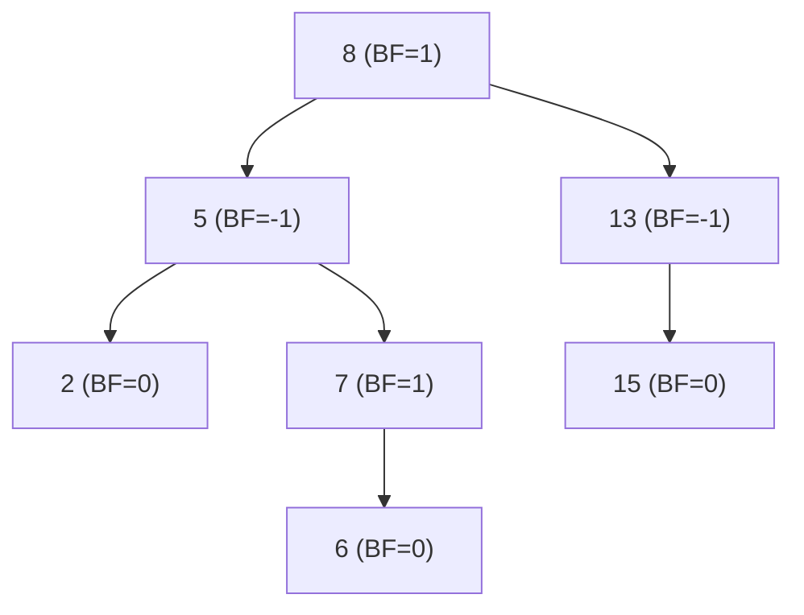
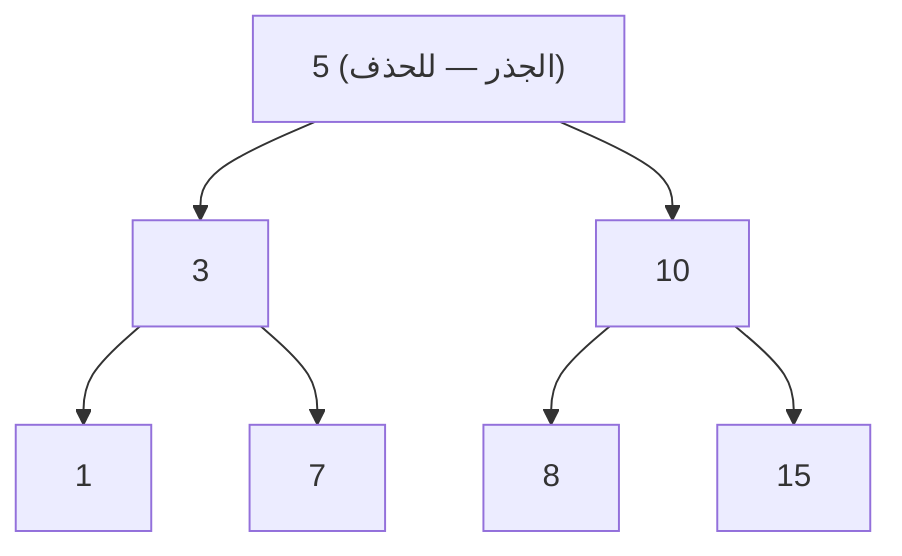
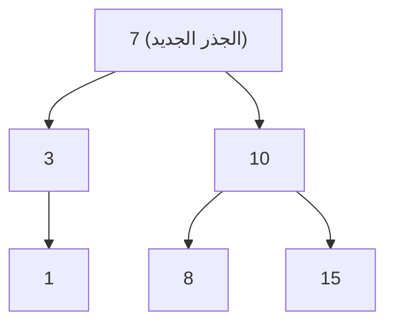

## المحاضرة 1: تقسيم المسألة وتجميع الحلول (Divide and Conquer)

**المصدر:** [نمط 2022-2023 — الفصل الأول]
### السؤال 1 (سهل)
زمن تنفيذ خوارزمية البحث الثنائي:
أ) $O(1)$
ب) $O(\log_2 n)$
ج) $O(n \log_2 n)$
د) $O(n^2)$
**الإجابة الصحيحة: ب**
**التعليل:**
البحث الثنائي يستبعد نصف المجال المتبقي في كل خطوة، فعدد الخطوات اللازمة يتناسب مع $\log_2 n$ — وهذا زمن $\Theta(\log_2 n)$ في كل الحالات تقريباً كما ورد بالمحاضرة.

أ) $O(1)$ هي أفضل حالة (البحث الناجح فوراً عند العنصر الأوسط) وليست الزمن العام.
ج), د) أبطأ بكثير من الحقيقة — تخصان الفرز لا البحث.

**المصدر:** [نمط 2022-2023 — الفصل الأول]
### السؤال 2 (صعب)
بفرض لديك القائمة $a[1:14]$ المكونة من العناصر التالية:
`-15, -6, 0, 7, 9, 23, 54, 82, 101, 112, 125, 131, 142, 151`
بتطبيق الدالة `BinSearch()` في البحث عن العنصر $x = 151$ نجد أن قيمة `mid` تساوي:
أ) 12
ب) 13
ج) 14
د) 15
**الإجابة الصحيحة: ج**
**التعليل:**
نتتبع خطوات `BinSearch()` (low=1, high=14):
الخطوة1: `mid=(1+14)/2=7` → `a[7]=54<151` → `low=8`.
الخطوة2: `mid=(8+14)/2=11` → `a[11]=125<151` → `low=12`.
الخطوة3: `mid=(12+14)/2=13` → `a[13]=142<151` → `low=14`.
الخطوة4: `mid=(14+14)/2=14` → `a[14]=151=x` — تم إيجاد العنصر عند `mid=14`.

أ), ب), د) قيم `mid` وسيطة أو غير موجودة في التتبع الصحيح — القيمة النهائية التي يُعثر عندها على العنصر هي 14.

**المصدر:** [نمط 2022-2023 — الفصل الأول]
### السؤال 3 (متوسط)
إن استخدام تقنية التقسيم والتجميع في مسألة إيجاد max و min يخفض زمن التنفيذ بنسبة:
أ) 5%
ب) 20%
ج) 50%
د) كل ما ورد خاطئ
**الإجابة الصحيحة: د**
**التعليل:**
خوارزمية `max-min` بتقنية `Divide and Conquer` تحتاج $3n/2-2$ مقارنة، مقابل $2n-2$ مقارنة في الطريقة التقليدية، وهذا يمثل تخفيضاً بنسبة تقترب من **25%** كما ورد صراحة بالمحاضرة — وهذه النسبة غير مذكورة بين الخيارات المطروحة هنا.

أ), ب), ج) كلها نسب لا تطابق التخفيض الفعلي (25%)، لذا الإجابة الصحيحة هي "كل ما ورد خاطئ".

لاحظ أن السؤال نفسه يتكرر لاحقاً بدورات أخرى مع إضافة خيار 25% صراحة — فانتبه لقائمة الخيارات المحددة في كل نسخة.

**المصدر:** [نمط 2022-2023 — الفصل الثاني]
### السؤال 4 (متوسط)
في خوارزمية البحث الثنائي: يعطى الزمن الوسطي للبحث الناجح والفاشل $S(n)$ بالصيغة:
أ) $S(n) = O(1)$
ب) $S(n) = O(\log n)$
ج) $S(n) = O(n)$
د) $S(n) = O(n \log n)$
**الإجابة الصحيحة: ب**
**التعليل:**
عمق شجرة القرار الثنائية للبحث الثنائي هو $\Theta(\log n)$، وهذا يحدد الزمن الوسطي لكل من البحث الناجح والفاشل على حد سواء.

**المصدر:** [نمط 2022-2023 — الفصل الثاني]
### السؤال 5 (متوسط)
إن استخدام تقنية التقسيم والتجميع في مسألة إيجاد max و min يخفض زمن التنفيذ بنسبة:
أ) 5%
ب) 10%
ج) 15%
د) 25%
**الإجابة الصحيحة: د**
**التعليل:**
كما ورد صراحة بالمحاضرة، خوارزمية max-min بتقنية `Divide and Conquer` أمثلية بعدد مقارنات $3n/2-2$، أقل من الطريقة التقليدية ($2n-2$) بنسبة تقترب من 25% — وهي مذكورة هنا صراحة بين الخيارات، بعكس نسخة دورة1 من هذا السؤال.

**المصدر:** [نمط 2023-2024 — الفصل الأول]
### السؤال 6 (متوسط)
في خوارزمية البحث الثنائي: يعطى الزمن الوسطي للبحث الناجح والفاشل $S(n)$ بالصيغة:
أ) $S(n) = O(1)$
ب) $S(n) = O(\log n)$
ج) $S(n) = O(n)$
د) $S(n) = O(n \log n)$
**الإجابة الصحيحة: ب**
**التعليل:**
عمق شجرة القرار للبحث الثنائي $\Theta(\log n)$، وهو المرجع لكل من الحالة الناجحة والفاشلة وسطياً.

**المصدر:** [نمط 2023-2024 — الفصل الأول]
### السؤال 7 (متوسط)
إن استخدام تقنية التقسيم والتجميع في مسألة إيجاد max و min يخفض زمن التنفيذ بنسبة:
أ) 5%
ب) 10%
ج) 15%
د) 25%
**الإجابة الصحيحة: د**
**التعليل:**
التخفيض الفعلي من $2n-2$ إلى $3n/2-2$ مقارنة يقترب من 25% كما ورد صراحة بالمحاضرة.

## المحاضرة 2: البرمجة الديناميكية (Dynamic Programming)

**المصدر:** [نمط 2022-2023 — الفصل الثاني]
### السؤال 8 (متوسط)
زمن تنفيذ خوارزمية البائع المتجول بالبرمجة الديناميكية:
أ) $O(2^n)$
ب) $O(n 2^n)$
ج) $O(n^2 2^n)$
د) $O(n^3 2^n)$
**الإجابة الصحيحة: ج**
**التعليل:**
حالة `TSP` بالبرمجة الديناميكية تُبنى على $g(i,S)$ لكل رأس $i$ ومجموعة فرعية $S$ (عدد الحالات $\approx n2^n$)، وحساب كل حالة يتطلب المرور على أعضاء $S$ (عامل $n$ إضافي)، فالزمن الكلي $\Theta(n^2 2^n)$ — وهو أفضل من $n!$ التقليدي لكنه يبقى أسّياً (`TSP` مسألة `NP-hard`).

**المصدر:** [نمط 2022-2023 — الفصل الثاني]
### السؤال 9 (صعب)
لديك بيان موجه وموزون ومكون من ثلاثة رؤوس ومجموعة أطوال أضلاعه:
$$E = \{<1,2> = 7, <2,3> = -5, <1,3> = 5\}$$
إيجاد طول المسار الأقصر من الرأس 1 إلى الرأس 3 يعتمد على:
أ) خوارزمية Dijkstra
ب) خوارزمية Bellman Ford
ج) خوارزمية Kruskal
د) كل الإجابات الواردة خاطئة
**الإجابة الصحيحة: ب**
**التعليل:**
يوجد ضلع بوزن سالب ($<2,3>=-5$) لكن بلا حلقة سالبة، لذا لا يمكن استخدام Dijkstra (يفترض أوزاناً موجبة فقط)، ويجب استخدام **Bellman-Ford** التي تدعم الأوزان السالبة صراحة.
ج) Kruskal لشجرة الامتداد الأصغرية، لا علاقة لها بأقصر المسارات.

**المصدر:** [نمط 2022-2023 — الفصل الثاني]
### السؤال 10 (صعب)
لديك بيان موجه وموزون ومكون من ثلاثة رؤوس ومجموعة أطوال أضلاعه:
$$E = \{<1,2> = 1, <2,3> = 1, <2,1> = -2\}$$
إيجاد طول المسار الأقصر من الرأس 1 إلى الرأس 3 يعتمد على:
أ) خوارزمية Dijkstra
ب) خوارزمية Bellman Ford
ج) خوارزمية Kruskal
د) كل الإجابات الواردة خاطئة
**الإجابة الصحيحة: د**
**التعليل:**
لاحظ الحلقة `1→2→1` بوزن $1+(-2)=-1$ — وهي **حلقة سالبة**! في وجود حلقة سالبة، مفهوم "أقصر مسار" يصبح غير معرّف أصلاً (يمكن تكرار الحلقة لتقليل الطول بلا نهاية)، فلا تصح أي خوارزمية من الخيارات المطروحة (ولا حتى Bellman-Ford نفسها، التي تكتفي باكتشاف الحلقة السالبة دون إعطاء طول محدد).
هذا يفرّق بين هذا السؤال والسؤال المشابه له مباشرة: هنا **حلقة** سالبة (مشكلة بنيوية)، بينما هناك **ضلع** سالب فقط بلا حلقة (قابل للحل بـBellman-Ford).

**المصدر:** [نمط 2023-2024 — الفصل الأول]
### السؤال 11 (متوسط)
زمن تنفيذ خوارزمية البائع المتجول بالبرمجة الديناميكية:
أ) $O(2^n)$
ب) $O(n 2^n)$
ج) $O(n^2 2^n)$
د) $O(n^3 2^n)$
**الإجابة الصحيحة: ج**
**التعليل:**
حالات $g(i,S)$ بعدد $\approx n2^n$، وكل حالة تحتاج مروراً على أعضاء $S$ (عامل $n$)، فالزمن الكلي $\Theta(n^2 2^n)$.

**المصدر:** [نمط 2023-2024 — الفصل الأول]
### السؤال 12 (صعب)
لديك بيان موجه وموزون ومكون من ثلاثة رؤوس ومجموعة أطوال أضلاعه:
$$E = \{\langle1, 2\rangle = 7, \langle2, 3\rangle = -5, \langle1, 3\rangle = 5\}$$
إيجاد طول المسار الأقصر من الرأس 1 إلى الرأس 3 يعتمد على:
أ) خوارزمية Dijkstra
ب) خوارزمية Bellman Ford
ج) خوارزمية Kruskal
د) كل الإجابات الواردة خاطئة .
**الإجابة الصحيحة: ب**
**التعليل:**
ضلع سالب بلا حلقة سالبة → يجب استخدام Bellman-Ford (Dijkstra لا تدعم الأوزان السالبة).

**المصدر:** [نمط 2023-2024 — الفصل الأول]
### السؤال 13 (صعب)
لديك بيان موجه وموزون ومكون من ثلاثة رؤوس ومجموعة أطوال أضلاعه:
$$E = \{\langle1, 2\rangle = 1, \langle2, 3\rangle = 1, \langle2, 1\rangle = -2\}$$
إيجاد طول المسار الأقصر من الرأس 1 إلى الرأس 3 يعتمد على:
أ) خوارزمية Dijkstra
ب) خوارزمية Bellman Ford
ج) خوارزمية Kruskal
د) كل الإجابات الواردة خاطئة .
**الإجابة الصحيحة: د**
**التعليل:**
حلقة `1→2→1` بوزن $-1$ (سالبة) — مفهوم "أقصر مسار" غير معرّف هنا، فلا تصح أي من الخوارزميات المطروحة.

**المصدر:** [نمط 2024-2025 — الفصل الأول]
### السؤال 14 (صعب)
لديك بيان موجه وموزون ومكون من ثلاثة رؤوس ومجموعة أطوال أضلاعه: $E = \{\langle1,2\rangle = 7, \langle2,3\rangle = -5, \langle1,3\rangle = 5\}$. إيجاد طول المسار الأقصر من الرأس 1 إلى الرأس 3 يعتمد على:
أ) خوارزمية Dijkstra
ب) خوارزمية BFS
ج) خوارزمية Kruskal
د) كل الإجابات الواردة خاطئة .
**الإجابة الصحيحة: د**
**التعليل:**
يوجد ضلع سالب ($<2,3>=-5$)، فـ Dijkstra لا تصلح. BFS تحسب المسار بعدد الأضلاع لا بالوزن (تتجاهل الأوزان تماماً)، فهي غير مناسبة لمسار أقصر **موزون**. Kruskal لشجرة امتداد، لا علاقة لها بأقصر مسار.
الخوارزمية الصحيحة فعلياً (Bellman-Ford) غير مطروحة بين الخيارات هنا، لذا الإجابة الصحيحة هي "كل الإجابات الواردة خاطئة" — بخلاف نسخ هذا السؤال بدورات أخرى حيث كانت Bellman-Ford أحد الخيارات مباشرة.

**المصدر:** [نمط 2023-2024 — الفصل الثاني]
### السؤال 15 (صعب)
لديك بيان موجه وموزون ومكون من ثلاثة رؤوس ومجموعة أطوال أضلاعه $E = \{\langle1,2\rangle = 7, \langle2,3\rangle = -5, \langle1,3\rangle = 5\}$. إيجاد طول المسار الأقصر من الرأس 1 إلى الرأس 3 يعتمد على:
أ) خوارزمية Dijkstra
ب) خوارزمية BFS
ج) خوارزمية Kruskal
د) كل الإجابات الواردة خاطئة.
**الإجابة الصحيحة: د**
**التعليل:**
ضلع سالب ($-5$) يمنع استخدام Dijkstra، وBFS تتجاهل الأوزان تماماً (تحسب فقط عدد الأضلاع)، وKruskal لشجرة امتداد لا لأقصر مسار. الخوارزمية الصحيحة فعلياً (Bellman-Ford) غير مطروحة هنا، فالإجابة "كل الإجابات الواردة خاطئة".

## المحاضرة 3: طريقة الطمّاع (العنوان بالعربي)

**المصدر:** [نمط 2022-2023 — الفصل الأول]
### السؤال 16 (صعب)
الحل الأمثل لمسألة الحقيبة التي سعتها $m = 20$ و 3 أغراض أوزانها: $(w_1, w_2, w_3) = (8, 5, 7)$ وأرباحها المكتسبة $(p_1, p_2, p_3) = (24, 10, 8)$:
أ) $(1, 1, 1)$
ب) $(1, 1/2, 0)$
ج) $(1, 1/3, 0)$
د) $(1, 1/4, 0)$
**الإجابة الصحيحة: أ**
**التعليل:**
مجموع أوزان الأغراض الثلاثة $8+5+7=20$ يساوي بالضبط سعة الحقيبة $m$، فيمكن أخذ الأغراض الثلاثة كاملةً دون أي كسر — وهذا هو الحل الأمثل حتماً لأنه يستغل كامل السعة ويأخذ كل ربح متاح.

ب), ج), د) كلها تفترض عدم كفاية السعة وتترك جزءاً من الغرض الثاني، لكن هذا غير صحيح لأن مجموع الأوزان يساوي السعة تماماً فلا داعي لأي كسر.

تذكير بترتيب `Greedy Knapsack`: نرتب حسب `p/w` تنازلياً (هنا: 3, 2, 8/7) ثم نأخذ كل غرض بالكامل ما دام يتسع — والمصادفة أن كل الأغراض هنا تتسع بالضبط.

**المصدر:** [نمط 2022-2023 — الفصل الأول]
### السؤال 17 (صعب)
الحل الأمثل لمسألة الحقيبة التي سعتها $m = 8$ و 3 أغراض أوزانها: $(w_1, w_2, w_3) = (2, 3, 5)$ وأرباحها المكتسبة $(p_1, p_2, p_3) = (10, 9, 10)$:
أ) $(1, 1, 1/5)$
ب) $(1, 1, 2/5)$
ج) $(1, 1, 3/5)$
د) كل ما ورد خاطئ
**الإجابة الصحيحة: ج**
**التعليل:**
النسب $p_i/w_i$ هي $5, 3, 2$ للأغراض الثلاثة على التوالي — وهي بالفعل مرتبة تنازلياً حسب الترتيب المعطى. نأخذ الغرض الأول كاملاً (وزن2، تبقى6)، الثاني كاملاً (وزن3، تبقى3)، ثم كسراً من الثالث: $3/5$ من وزنه (لأن المتبقي 3 من أصل 5).

أ) و ب) يفترضان كسوراً خاطئة لا تطابق السعة المتبقية الفعلية (3 من 5).

القاعدة الأساسية: عندما تكون النسب مرتبة تنازلياً أصلاً حسب فهرس الغرض، تُقرأ الإجابة مباشرة بنفس ترتيب $(x_1,x_2,x_3)$ كما هنا.

**المصدر:** [نمط 2022-2023 — الفصل الأول]
### السؤال 18 (صعب)
تعطى شجرة موجهة وموزونة بالمجهة $w = \{4, 2, 2, 1, 3, 5, 4, 2, 3\}$ يكون لمسألة TVSP حلاً من أجل:
أ) $\delta = 3$
ب) $\delta = 4$
ج) $\delta = 5$
د) كل ما ورد صحيح
**الإجابة الصحيحة: ج**
**التعليل:**
أكبر وزن ضلع منفرد في المجموعة المعطاة هو 5. في مسألة TVSP لا يمكن لعملية القص أن "تقسّم" ضلعاً واحداً — فأي ضلع بوزن أكبر من $\delta$ يجعل المسألة بلا حل مهما اخترنا رؤوس القص، لأن مجرد عبور ذلك الضلع وحده يتجاوز الحد المسموح. لذلك يجب أن يكون $\delta \geq 5$ كشرط ضروري لوجود حل، وبين الخيارات المطروحة فقط $\delta=5$ يحقق هذا الشرط.

أ) $\delta=3$ و ب) $\delta=4$ كلاهما أصغر من 5، فيبقى الضلع الأثقل (وزنه5) عائقاً بلا حل ممكن.

هذه فكرة أساسية في TVS: قيمة $\delta$ يجب أن لا تقل أبداً عن أثقل ضلع منفرد في الشجرة، وإلا فالمسألة تصبح غير قابلة للحل بنيوياً.

**المصدر:** [نمط 2022-2023 — الفصل الأول]
### السؤال 19 (متوسط)
زمن تنفيذ خوارزمية تقسيم عقدة شجرية:
أ) $\Theta(n)$
ب) $\Theta(n^2)$
ج) $\Theta(\log_2 n)$
د) $\Theta(2^n)$
**الإجابة الصحيحة: أ**
**التعليل:**
خوارزمية TVS تمر مرور `post-order` واحد على الشجرة، وتزور كل رأس مرة واحدة بالضبط لحساب `d[T]` والمقارنة مع $\delta$، فزمنها الكلي خطي $\Theta(n)$.

ب) $\Theta(n^2)$ هو زمن Dijkstra، وليس TVS — الفرق بينهما أن Dijkstra يفحص كل الأزواج تقريباً بينما TVS يزور كل رأس مرة واحدة فقط، كما ورد صراحة في جدول المقارنة بالمحاضرة.

ج) و د) لا تناسبان أي خوارزمية شجرية بسيطة بمرور واحد.

**المصدر:** [نمط 2022-2023 — الفصل الأول]
### السؤال 20 (صعب)
إن طول المسار الخارجي الموزون لشجرة دمج ثنائية أمثلية لستة ملفات أطوالها $2, 3, 5, 7, 9, 13$:
أ) 92
ب) 93
ج) 94
د) 95
**الإجابة الصحيحة: ب**
**التعليل:**
نطبق خوارزمية الدمج الأمثل (`Tree()`): ندمج أصغر شجرتين في كل مرة ونجمع كلفة كل دمج:
`2+3=5` → المتبقي `{5,5,7,9,13}`
`5+5=10` → `{7,9,10,13}`
`7+9=16` → `{10,13,16}`
`10+13=23` → `{16,23}`
`16+23=39` → `{39}`
مجموع كلف الدمج كلها: $5+10+16+23+39 = 93$، وهذا هو طول المسار الخارجي الموزون.

أ), ج), د) نتائج قريبة لكنها خاطئة حسابياً — الفرق الشائع يأتي من دمج غير أصغر شجرتين متاحتين في إحدى الخطوات.

القاعدة الذهبية هنا: "دمج أصغر ملفين أولاً" في كل مرحلة لضمان أقل مجموع تحركات (`weighted external path`) ممكن.

**المصدر:** [نمط 2022-2023 — الفصل الأول]
### السؤال 21 (سهل)
زمن تنفيذ خوارزمية Dijkstra:
أ) $O(\log_2 n)$
ب) $O(n)$
ج) $O(n \log_2 n)$
د) $O(n^2)$
**الإجابة الصحيحة: د**
**التعليل:**
النسخة القياسية لـ Dijkstra بتمثيل مصفوفة المسافات (كما شُرحت بالمحاضرة) تحتاج في كل تكرار البحث الخطي `choose()` عن أصغر مسافة بين الرؤوس غير المثبتة بزمن $O(n)$، وتُكرَّر هذه العملية $n$ مرة، فيكون الزمن الكلي $O(n^2)$.

أ), ب), ج) رتب نمو أسرع من الفعلي ولا تطابق طبيعة الخوارزمية بهذا التمثيل.

**المصدر:** [نمط 2022-2023 — الفصل الأول]
### السؤال 22 (صعب)
تعطى شجرة موجهة وموزونة، مجموع أوزان أضلاعها يساوي 11 ولنفترض أن $\delta = 13$ عندئذ مجموعة الرؤوس المقسمة $X$:
أ) $X$ تتضمن رأساً واحداً
ب) $X = \phi$
ج) $X$ تتضمن أكثر من رأس واحداً
د) كل ما ورد خاطئ
**الإجابة الصحيحة: ب**
**التعليل:**
أي مسار من الجذر إلى ورقة لا يمكن أن يتجاوز مجموع كل أوزان أضلاع الشجرة (11)، لأن المسار يستخدم مجموعة جزئية فقط من هذه الأضلاع. بما أن $\delta=13 > 11$، فإن تأخير أي مسار في الشجرة أصلاً أصغر من الحد المسموح — فلا حاجة لأي عملية قص إطلاقاً، أي $X=\phi$ (المجموعة الفارغة).

أ) و ج) يفترضان حاجة للقص رغم أن الشجرة أصلاً ضمن الحد المسموح.

هذه حالة حدّية مهمة في TVSP: إذا كان $\delta$ أكبر من أو يساوي مجموع كل الأوزان، فالحل دائماً $X=\phi$ بغض النظر عن شكل الشجرة تحديداً.

**المصدر:** [نمط 2022-2023 — الفصل الأول]
### السؤال 23 (متوسط)
خوارزمية Dijkstra قابلة للتطبيق على:
أ) البيانات الموجهة والموزونة بقيم موجبة وسالبة
ب) البيانات الموجهة والموزونة وتتضمن حلقات ذات طول سالب.
ج) البيانات الموجهة والموزونة بقيم موجبة فقط.
د) كل ما ورد خاطئ.
**الإجابة الصحيحة: ج**
**التعليل:**
Dijkstra خوارزمية شرهة تفترض أن أول رأس يُثبَّت مسافته النهائية لا يمكن أن يتحسن لاحقاً، وهذا الافتراض يصح فقط عندما تكون كل الأوزان موجبة.

أ) و ب) يذكران أوزاناً سالبة أو حلقات سالبة — وفي هاتين الحالتين يجب استخدام Bellman-Ford بدلاً من Dijkstra لأن الافتراض الشره ينهار.

هذا من أشيع الأخطاء المذكورة صراحة بالمحاضرة: "الاعتقاد أن Dijkstra تعمل مع أوزان سالبة".

**المصدر:** [نمط 2022-2023 — الفصل الأول]
### السؤال 24 (صعب)
تعطى شجرة موجهة وموزونة بالمجهة $w = \{4, 2, 2, 1, 3, 5, 4, 2, 3\}$ يكون لمسألة TVSP حلاً من أجل:
أ) $\delta = 2$
ب) $\delta = 3$
ج) $\delta = 4$
د) $\delta = 5$
**الإجابة الصحيحة: د**
**التعليل:**
نفس منطق السؤال السابق حول أوزان هذه الشجرة: أكبر وزن ضلع منفرد فيها هو 5، وأي $\delta$ أصغر من ذلك (كـ 2 أو 3 أو 4) يجعل المسألة مستحيلة الحل بنيوياً، لأن الضلع الأثقل وحده يتجاوز الحد بغض النظر عن القص.

أ), ب), ج) كلها أصغر من 5 فتُستبعد جميعها.

**المصدر:** [نمط 2022-2023 — الفصل الأول]
### السؤال 25 (متوسط)
بفرض لديك بيان موجه وموزون بقيم موجبة وترغب بإيجاد المسار الأقصر بين رأسين مختلفين عندئذ يمكنك تطبيق خوارزمية:
أ) Kruskal
ب) Prim
ج) Dijkstra
د) a أو b
**الإجابة الصحيحة: ج**
**التعليل:**
"المسار الأقصر بين رأسين" هي مسألة أقصر المسارات، وDijkstra هي الخوارزمية المخصصة لذلك عند توفر أوزان موجبة.

أ) Kruskal و ب) Prim كلاهما لبناء شجرة الامتداد الأصغرية (مسألة مختلفة تماماً: تغطية كل الرؤوس بأقل كلفة، وليس أقصر مسار بين رأسين محددين).

التمييز بين "أقصر مسار" (Dijkstra) و"شجرة امتداد أصغرية" (Kruskal/Prim) هو أشيع خلط في أسئلة هذا الفصل — يجب الانتباه لصيغة السؤال بدقة.

**المصدر:** [نمط 2022-2023 — الفصل الأول]
### السؤال 26 (متوسط)
بفرض لديك بيان موجه وموزون بقيم موجبة وترغب بإيجاد شجرة الامتداد ذات الكلفة الأقل عندئذ يمكنك تطبيق خوارزمية:
أ) Kruskal
ب) Prim
ج) Dijkstra
د) a أو b
**الإجابة الصحيحة: د**
**التعليل:**
كل من Kruskal وPrim خوارزميتان شرهتان صحيحتان لإيجاد شجرة الامتداد الأصغرية (MST)، تختلفان فقط في طريقة الاختيار (Kruskal يرتب الأضلاع، Prim يبدأ من رأس وينمّي الشجرة)، لكن كلتيهما تصلان لنفس الكلفة الصغرى.

ج) Dijkstra مخصصة لأقصر المسارات من مصدر واحد، وهي مسألة مختلفة عن شجرة الامتداد الأصغرية رغم تشابه الشكل.

**المصدر:** [نمط 2022-2023 — الفصل الأول]
### السؤال 27 (صعب)
طول المسار الخارجي الموزون لشجرة الدمج الثنائية الأمثلية لخمسة ملفات أطوالها: $5, 10, 20, 30, 30$:
أ) 203
ب) 205
ج) 207
د) 209
**الإجابة الصحيحة: ب**
**التعليل:**
بتطبيق دمج أصغر شجرتين في كل مرة:
`5+10=15` → `{15,20,30,30}`
`15+20=35` → `{30,30,35}`
`30+30=60` → `{35,60}`
`35+60=95` → `{95}`
المجموع الكلي: $15+35+60+95=205$.

أ), ج), د) نتائج قريبة لكنها ناتجة عن ترتيب دمج غير الأصغر أولاً.

**المصدر:** [نمط 2022-2023 — الفصل الثاني]
### السؤال 28 (صعب)
طول المسار الخارجي الموزون لشجرة الدمج الثنائية الأمثلية لخمسة ملفات أطوالها: $2, 3, 5, 8, 13$:
أ) 62
ب) 64
ج) 68
د) 70
**الإجابة الصحيحة: ب**
**التعليل:**
دمج أصغر شجرتين في كل مرة: `2+3=5`→`{5,5,8,13}`، `5+5=10`→`{8,10,13}`، `8+10=18`→`{13,18}`، `13+18=31`→`{31}`. المجموع الكلي: $5+10+18+31=64$.
أ), ج), د) نتائج ناتجة عن ترتيب دمج مختلف عن "الأصغر أولاً".

**المصدر:** [نمط 2022-2023 — الفصل الثاني]
### السؤال 29 (متوسط)
واحدة من العبارات الآتية صحيحة:
أ) تبدأ خوارزمية Prim من ضلع.
ب) تبدأ خوارزمية Kruskal من رأس.
ج) تبدأ خوارزمية Prim من فارغة.
د) كل ما ورد خاطئ.
**الإجابة الصحيحة: ج**
**التعليل:**
Prim تبدأ من مجموعة أضلاع فارغة ورأس وحيد يُختار عشوائياً، ثم تنمّي الشجرة تدريجياً بإضافة أقرب رأس مجاور في كل خطوة — وهذا أقرب وصف لبداية "فارغة" بين الخيارات المطروحة.
أ) خاطئة: Prim تبدأ من رأس، وليس ضلعاً محدداً مسبقاً.
ب) خاطئة: Kruskal تبدأ من ترتيب **الأضلاع** كلها تصاعدياً، وليس من رأس واحد.

**المصدر:** [نمط 2022-2023 — الفصل الثاني]
### السؤال 30 (متوسط)
لتكن $A = \{a_1, a_2, \dots, a_n\}$ مجموعة من الأغراض ولكل غرض له وزن وقيمة. إن مسألة إيجاد مجموعة جزئية من مجموعة الأغراض $A$ تحقق أعلى قيمة ومجموع أوزانها أقل أو يساوي وزن ماكس يعتمد على:
أ) مفهوم تقنية التقسيم والتجميع
ب) الطريقة الشرهة
ج) البرمجة الديناميكية
د) مفهوم التراجعية
**الإجابة الصحيحة: ج**
**التعليل:**
هذه صياغة عامة لمسألة "0/1 Knapsack" (اختيار كامل أو ترك كل غرض، دون ذكر إمكانية الكسر) — وكما ورد صراحة بالمحاضرة، الطريقة الشرهة أمثلية فقط في **Fractional Knapsack**؛ أما النسخة 0/1 (بدون كسور) فتحتاج **البرمجة الديناميكية** لضمان الحل الأمثل.
ب) فخ شائع: تبدو الصياغة شبيهة بمسائل `greedy` الأخرى، لكن غياب أي إشارة للكسر يرجّح 0/1 Knapsack تحديداً.

**المصدر:** [نمط 2022-2023 — الفصل الثاني]
### السؤال 31 (صعب)
الربح المكتسب من الحل الأمثل لمسألة الحقيبة التي سعتها $m = 20$ و 3 أغراض أوزانها: $(w_1, w_2, w_3) = (8, 5, 7)$ وأرباحها المكتسبة $(p_1, p_2, p_3) = (24, 10, 8)$:
أ) 32
ب) 42
ج) 44
د) 46
**الإجابة الصحيحة: ب**
**التعليل:**
كما في سؤال مشابه بدورة1: مجموع الأوزان $8+5+7=20=m$ بالضبط، فالحل الأمثل يأخذ كل الأغراض كاملة، والربح الكلي $24+10+8=42$.

**المصدر:** [نمط 2022-2023 — الفصل الثاني]
### السؤال 32 (صعب)
الحل الأمثل لمسألة الحقيبة التي سعتها $m = 15$ و 3 أغراض أوزانها: $(w_1, w_2, w_3) = (10, 9, 10)$ وأرباحها المكتسبة $(p_1, p_2, p_3) = (2, 3, 5)$:
أ) $(1, 1, 1/5)$
ب) $(1, 1, 2/5)$
ج) $(1, 5/9, 0)$
د) كل ما ورد خاطئ
**الإجابة الصحيحة: ج**
**التعليل:**
النسب $p_i/w_i = 0.2, 0.333, 0.5$ للأغراض 1، 2، 3 على الترتيب — أعلى نسبة هي الغرض الثالث، فهو يُؤخذ كاملاً أولاً (وزن10، يتبقى5)، ثم الغرض الثاني (أعلى نسبة تالية) يُؤخذ جزئياً بمقدار $5/9$ من وزنه، والغرض الأول (أقل نسبة) لا يُؤخذ منه شيء.
هذا الامتحان يكتب متجه الحل **بترتيب الاختيار الفعلي** (النسبة الأعلى أولاً) وليس بترتيب فهرس الغرض الأصلي — لذلك يظهر كـ $(1, 5/9, 0)$ بدل $(0, 5/9, 1)$. انتبه لهذا الفرق في كل أسئلة Knapsack التي لا تكون نسبها مرتبة أصلاً حسب فهرس الغرض.

**المصدر:** [نمط 2022-2023 — الفصل الثاني]
### السؤال 33 (صعب)
تعطى شجرة موجهة وموزونة بالمتجهة $w = \{4, 2, 2, 1, 3, 5, 4, 2, 3\}$ يكون لمسألة TVSP حلاً من أجل:
أ) $\delta = 2$
ب) $\delta = 3$
ج) $\delta = 4$
د) $\delta = 5$
**الإجابة الصحيحة: د**
**التعليل:**
أكبر وزن ضلع منفرد هو 5، وأي $\delta$ أصغر منه يجعل المسألة بلا حل بنيوياً (لا يمكن قص ضلع واحد). فقط $\delta=5$ يحقق الشرط الضروري.

**المصدر:** [نمط 2022-2023 — الفصل الثاني]
### السؤال 34 (متوسط)
زمن تنفيذ خوارزمية تقسيم عقدة شجرية:
أ) $\Theta(n)$
ب) $\Theta(n^2)$
ج) $\Theta(\log_2 n)$
د) $\Theta(2^n)$
**الإجابة الصحيحة: أ**
**التعليل:**
TVS تمر مرور `post-order` واحد على الشجرة (زيارة كل رأس مرة واحدة)، فزمنها الكلي $\Theta(n)$.

**المصدر:** [نمط 2022-2023 — الفصل الثاني]
### السؤال 35 (صعب)
إن طول المسار الخارجي الموزون لشجرة دمج ثنائية أمثلية لستة ملفات أطوالها $2, 3, 5, 7, 9, 13$:
أ) 92
ب) 93
ج) 94
د) 95
**الإجابة الصحيحة: ب**
**التعليل:**
كما حُسب سابقاً: `2+3=5`→`5+5=10`→`7+9=16`→`10+13=23`→`16+23=39`. المجموع: $5+10+16+23+39=93$.

**المصدر:** [نمط 2022-2023 — الفصل الثاني]
### السؤال 36 (سهل)
زمن تنفيذ خوارزمية Dijkstra:
أ) $O(\log_2 n)$
ب) $O(n)$
ج) $O(n \log_2 n)$
د) $O(n^2)$
**الإجابة الصحيحة: د**
**التعليل:**
البحث الخطي `choose()` عن أصغر مسافة يكلّف $O(n)$ ويتكرر $n$ مرة، فالزمن الكلي $O(n^2)$.

**المصدر:** [نمط 2022-2023 — الفصل الثاني]
### السؤال 37 (صعب)
تعطى شجرة موجهة وموزونة، مجموع أوزان أضلاعها يساوي 10 ولنفترض أن $\delta = 10$ عندئذ مجموعة الرؤوس المقسمة $X$:
أ) $X$ تتضمن رأساً واحداً
ب) $X = \emptyset$
ج) $X$ تتضمن أكثر من رأس واحد
د) كل ما ورد خاطئ
**الإجابة الصحيحة: ب**
**التعليل:**
بما أن $\delta=10$ يساوي مجموع كل الأوزان، فإن أي مسار جزئي في الشجرة له تأخير أصغر من أو يساوي 10 حتماً — فلا حاجة لأي قص، أي $X=\emptyset$.

**المصدر:** [نمط 2022-2023 — الفصل الثاني]
### السؤال 38 (متوسط)
بفرض لديك بيان موجه وموزون بقيم موجبة وترغب بإيجاد شجرة الامتداد ذات الكلفة الأقل عندئذ تستخدم خوارزمية:
أ) Prim
ب) DFS
ج) BFS
د) Dijkstra
**الإجابة الصحيحة: أ**
**التعليل:**
شجرة الامتداد الأصغرية (MST) تُبنى بخوارزمية شرهة مخصصة كـ Prim أو Kruskal، وPrim هي الخيار المطروح هنا.
ب), ج) DFS/BFS خوارزميتا تصفّح لا تضمنان أقل كلفة.
د) Dijkstra لأقصر المسارات من مصدر واحد، مسألة مختلفة عن MST.

**المصدر:** [نمط 2023-2024 — الفصل الأول]
### السؤال 39 (متوسط)
زمن تنفيذ خوارزمية تقسيم عقدة شجرية:
أ) $\Theta(n)$
ب) $\Theta(n^2)$
ج) $\Theta(\log_2 n)$
د) $\Theta(2^n)$
**الإجابة الصحيحة: أ**
**التعليل:**
TVS تمر مرور `post-order` واحد فقط بزيارة كل رأس مرة، فزمنها $\Theta(n)$ — كما تكرر في نسخ سابقة من هذا السؤال.

**المصدر:** [نمط 2023-2024 — الفصل الأول]
### السؤال 40 (صعب)
إن طول المسار الخارجي الموزون لشجرة دمج ثنائية أمثلية لستة ملفات أطوالها 2, 3, 5, 7, 9, 13:
أ) 92
ب) 93
ج) 94
د) 95
**الإجابة الصحيحة: ب**
**التعليل:**
كما حُسب سابقاً بالتفصيل: مجموع كلف الدمج التدريجي (أصغر شجرتين أولاً) يساوي $5+10+16+23+39=93$.

**المصدر:** [نمط 2023-2024 — الفصل الأول]
### السؤال 41 (سهل)
زمن تنفيذ خوارزمية Dijkstra:
أ) $O(\log_2 n)$
ب) $O(n)$
ج) $O(n \log_2 n)$
د) $O(n^2)$
**الإجابة الصحيحة: د**
**التعليل:**
البحث الخطي المتكرر عن أصغر مسافة يعطي $O(n)\times n=O(n^2)$.

**المصدر:** [نمط 2023-2024 — الفصل الأول]
### السؤال 42 (صعب)
تعطى شجرة موجهة وموزونة، مجموع أوزان أضلاعها يساوي 10 ولنفترض أن $\delta = 10$ عندئذ مجموعة الرؤوس المقسمة $X$:
أ) $X$ تتضمن رأساً واحداً
ب) $X = \phi$
ج) $X$ تتضمن أكثر من رأس واحد
د) كل ما ورد خاطئ
**الإجابة الصحيحة: ب**
**التعليل:**
$\delta$ يساوي مجموع كل الأوزان، فلا يمكن لأي مسار أن يتجاوزه — لا حاجة لقص، $X=\phi$.

**المصدر:** [نمط 2023-2024 — الفصل الأول]
### السؤال 43 (متوسط)
بفرض لديك بيان موجه وموزون بقيم موجبة وترغب بإيجاد شجرة الامتداد ذات الكلفة الأقل عندئذ تستخدم خوارزمية:
أ) Prim
ب) DFS
ج) BFS
د) Dijkstra
**الإجابة الصحيحة: أ**
**التعليل:**
شجرة الامتداد الأصغرية تُبنى بخوارزمية Prim الشرهة، وليس بخوارزميات التصفّح (DFS/BFS) أو أقصر المسارات (Dijkstra).

**المصدر:** [نمط 2023-2024 — الفصل الأول]
### السؤال 44 (صعب)
طول المسار الخارجي الموزون لشجرة الدمج الثنائية الأمثلية لخمسة ملفات أطوالها: 2, 3, 5, 8, 13:
أ) 62
ب) 64
ج) 68
د) 70
**الإجابة الصحيحة: ب**
**التعليل:**
دمج تدريجي (أصغر أولاً): $2+3=5$، $5+5=10$، $8+10=18$، $13+18=31$؛ المجموع $5+10+18+31=64$.

**المصدر:** [نمط 2023-2024 — الفصل الأول]
### السؤال 45 (متوسط)
واحدة من العبارات الآتية صحيحة:
أ) تبدأ خوارزمية Prim من ضلع .
ب) تبدأ خوارزمية Kruskal من رأس
ج) تبدأ خوارزمية Prim من فارغة .
د) كل ما ورد خاطئ
**الإجابة الصحيحة: ج**
**التعليل:**
Prim تبدأ من رأس ومجموعة أضلاع فارغة تنمو تدريجياً — أقرب وصف صحيح بين الخيارات.
ب) خاطئة: Kruskal تبدأ من ترتيب الأضلاع، لا من رأس.

**المصدر:** [نمط 2023-2024 — الفصل الأول]
### السؤال 46 (متوسط)
لتكن $A = \{a_1, a_2, \dots, a_n\}$ مجموعة من الأغراض ولكل غرض له وزن وقيمة. إن مسألة إيجاد مجموعة جزئية من مجموعة الأغراض $A$ تحقق : أعلـى قيمة و مجمـوع أوزانها أقل أو يساوي من مقدار معطى يعتمد على:
أ) مفهوم تقنية التقسيم والتجميع
ب) الطريقة الشرهة
ج) البرمجة الديناميكية
د) كل ما ورد خاطئ
**الإجابة الصحيحة: ج**
**التعليل:**
صياغة 0/1 Knapsack (دون ذكر كسور)، فالحل الأمثل يحتاج البرمجة الديناميكية.

**المصدر:** [نمط 2023-2024 — الفصل الأول]
### السؤال 47 (صعب)
الربح المكتسب من الحل الأمثل لمسألة الحقيبة التي سعتها $m=20$ و 3 أغراض أوزانها $(w_1, w_2, w_3) = (8, 5, 7)$ وأرباحها المكتسبة $(P_1, P_2, P_3) = (24, 10, 8)$:
أ) 32
ب) 42
ج) 44
د) 46
**الإجابة الصحيحة: ب**
**التعليل:**
مجموع الأوزان يساوي السعة تماماً (20)، فالربح الكلي عند أخذ كل الأغراض $24+10+8=42$.

**المصدر:** [نمط 2023-2024 — الفصل الأول]
### السؤال 48 (صعب)
الحل الأمثل لمسألة الحقيبة التي سعتها $m=15$ و 3 أغراض أوزانها $(w_1, w_2, w_3) = (10, 9, 10)$ وأرباحها المكتسبة $(p_1, p_2, p_3) = (2, 3, 5)$:
أ) $(1, 1, 1/5)$
ب) $(1, 1, 2/5)$
ج) $(1, 5/9, 0)$
د) كل ما ورد خاطئ
**الإجابة الصحيحة: ج**
**التعليل:**
النسب $0.2, 0.333, 0.5$ — الغرض الثالث (أعلى نسبة) يُؤخذ كاملاً، ثم الثاني جزئياً بمقدار $5/9$، والأول لا شيء. الحل مكتوب بترتيب الاختيار: $(1, 5/9, 0)$.

**المصدر:** [نمط 2023-2024 — الفصل الأول]
### السؤال 49 (صعب)
تعطى شجرة موجهة وموزونة بالمصطلحات $\{4, 2, 2, 1, 3, 5, 4, 2, 3\} = w$ يكون لمسألة TVSP حلاً من أجل:
أ) $\delta = 2$
ب) $\delta = 3$
ج) $\delta = 4$
د) $\delta = 5$
**الإجابة الصحيحة: د**
**التعليل:**
أكبر وزن ضلع منفرد هو 5، فقط $\delta=5$ يحقق الشرط الضروري لوجود حل.

**المصدر:** [نمط 2024-2025 — الفصل الأول]
### السؤال 50 (متوسط)
يعتمد إيجاد شجرة الامتداد ذات الكلفة الأقل من بيان مترابط غير موجه وموزون بقيم موجبة على:
أ) مفهوم تقنية التقسيم والتجميع
ب) الطريقة الشرهة
ج) البرمجة الديناميكية
د) كل ما ورد خاطئ
**الإجابة الصحيحة: ب**
**التعليل:**
شجرة الامتداد الأصغرية (MST) تُبنى بخوارزميات شرهة (Kruskal/Prim) — قرار محلي في كل خطوة (أرخص ضلع لا يُكوّن حلقة، أو أقرب رأس) يُبنى عليه الحل الكلي الأمثل.
ج) البرمجة الديناميكية تُستخدم لمسائل أخرى (كـ Floyd-Warshall وTSP)، وليست الأداة القياسية لـ MST.

**المصدر:** [نمط 2024-2025 — الفصل الأول]
### السؤال 51 (متوسط)
لتكن $A = \{a_1, a_2, \dots, a_n\}$ مجموعة من الأغراض ولكل غرض له وزن وقيمة. إن خوارزمية إيجاد مجموعة جزئية من مجموعة الأغراض $A$ تحقق: أعلى قيمة ومجموع أوزانها أقل أو يساوي من مقدار معطى تنفذ بزمن:
أ) $O(n)$
ب) $O(n \log_2 n)$
ج) $O(n^2)$
د) $O(2^n)$
**الإجابة الصحيحة: د**
**التعليل:**
هذه صياغة 0/1 Knapsack (بدون كسور) — وهي مسألة `NP-hard`. الحل الشامل/بالتراجع الذي يفحص كل مجموعة جزئية ممكنة من الأغراض يحتاج زمناً أسّياً $O(2^n)$.
ملاحظة: هذا السؤال يعتمد على معرفة عامة بتصنيف تعقيد 0/1 Knapsack، إذ لم تُفصَّل خوارزمية 0/1 Knapsack بالبرمجة الديناميكية بصيغتها الزمنية الدقيقة ضمن محاضرات هذا الفصل المتاحة — الإجابة معتمدة على كون المسألة NP-hard وليست على اقتباس مباشر من المحاضرة.

**المصدر:** [نمط 2024-2025 — الفصل الأول]
### السؤال 52 (صعب)
الربح المكتسب من الحل الأمثل لمسألة الحقيبة التي سعتها $m=20$ و 3 أغراض أوزانها: $(w_1, w_2, w_3) = (8, 5, 7)$ وأرباحها المكتسبة $(P_1, P_2, P_3) = (24, 10, 8)$:
أ) 32
ب) 42
ج) 44
د) 46
**الإجابة الصحيحة: ب**
**التعليل:**
مجموع الأوزان $=20=m$، فيُؤخذ الجميع، والربح $24+10+8=42$.

**المصدر:** [نمط 2024-2025 — الفصل الأول]
### السؤال 53 (صعب)
الحل الأمثل لمسألة الحقيبة التي سعتها $m=15$ و 3 أغراض أوزانها: $(w_1, w_2, w_3) = (6, 4, 4)$ وأرباحها المكتسبة $(P_1, P_2, P_3) = (2, 3, 5)$:
أ) $(1, 1, 1/5)$
ب) $(1, 1, 2/5)$
ج) $(1, 5/9, 0)$
د) كل ما ورد خاطئ
**الإجابة الصحيحة: د**
**التعليل:**
النسب $p_i/w_i = 0.333, 0.75, 1.25$ للأغراض1،2،3. الغرض الثالث (أعلى نسبة) كامل (وزن4، تبقى11)، الثاني كامل (وزن4، تبقى7)، الأول يحتاج وزن6 وهو ≤ المتبقي(7) فيُؤخذ **كاملاً** أيضاً — أي الحل هو $(1,1,1)$ فعلياً (السعة لا تُستنفد بالكامل، ويبقى فائض1، لكن هذا لا يمنع كونه الحل الأمثل، لأن كل الأغراض المتاحة أُخذت بالكامل ولا يوجد ما يُضاف أكثر).
هذا الحل $(1,1,1)$ غير مطابق لأي من الخيارات الثلاثة المحسوبة كخيارات كسرية (أ، ب، ج)، لذا الإجابة الصحيحة هي "كل ما ورد خاطئ".
تنبيه: هذا يختلف عن أسئلة Knapsack الأخرى بهذه الدورات لأن مجموع أوزان الأغراض هنا (14) أقل من السعة (15) أصلاً، فلا حاجة لأي كسر إطلاقاً.

**المصدر:** [نمط 2024-2025 — الفصل الأول]
### السؤال 54 (متوسط)
بفرض لديك بيان موجه وموزون بقيم موجبة وترغب باستخدام خوارزمية Dijkstra في إيجاد أطوال أقصر المسارات بين رأس المصدر وبقية رؤوس البيان بزمن تنفيذ:
أ) $\Theta(n)$
ب) $\Theta(n^2)$
ج) $\Theta(n^3)$
د) $\Theta(2^n)$
**الإجابة الصحيحة: ب**
**التعليل:**
Dijkstra من مصدر واحد لكل الرؤوس الأخرى: بحث خطي متكرر $n$ مرة → $\Theta(n^2)$.

**المصدر:** [نمط 2024-2025 — الفصل الأول]
### السؤال 55 (صعب)
تعطى شجرة موجهة وموزونة:
$$T = \{\langle1,2\rangle, 4, \langle1,3\rangle, 2, \langle2,4\rangle, 2, \langle3,5\rangle, 1, \langle3,6\rangle, 3, \langle4,7\rangle, 1, \langle4,8\rangle, 4, \langle6,9\rangle, 2, \langle6,10\rangle, 3\}$$
ولنفترض أن $\delta = 5$ عندئذ مجموعة الرؤوس المقسمة $X$:
أ) $X = \{2, 3, 4\}$
ب) $X = \{3, 4, 6\}$
ج) $X = \{2, 4, 6\}$
د) $X = \{2, 4\}$
**الإجابة الصحيحة: TODO**
**التعليل:**
تتبعتُ خوارزمية TVS (مرور `post-order`، حساب `d[v]=max(d[child]+وزن الضلع)`، وقص أي فرع يجعل `d[child]+وزن > δ`) على هذه الشجرة تحديداً:

بنية الشجرة: `1→2(4)→4(2)→{7(1),8(4)}`، و`1→3(2)→{5(1),6(3)→{9(2),10(3)}}`.

- `d[6] = max(0+2, 0+3) = 3` (لا قص عند9،10).
- `d[4] = max(0+1, 0+4) = 4` (لا قص عند7،8).
- عند تجميع3: فحص الفرع6 → `d[6]+وزن(3,6) = 3+3 = 6 > 5` → **قص عند6**، تُضاف6 إلى X، ومساهمتها في `d[3]` تصبح0. `d[3] = max(0+1 [من5], 0) = 1`.
- عند تجميع2: فحص الفرع4 → `d[4]+وزن(2,4) = 4+2 = 6 > 5` → **قص عند4**، تُضاف4 إلى X، مساهمتها0. `d[2] = 0`.
- عند الجذر1: فحص2 → `0+4=4 ≤ 5` (لا قص)، فحص3 → `1+2=3 ≤ 5` (لا قص).

بهذا التتبع تكون مجموعة القص $X=\{4,6\}$ فقط، ولا تطابق أياً من الخيارات الأربعة المطروحة (كلها تتضمن3 عناصر أو مجموعة أخرى من عنصرين). لم أستطع حل هذا التعارض بثقة — إما وجود قناعة/اصطلاح مختلف قليلاً لخوارزمية TVS تدرّس بهذا الفصل تحديداً (مثل معاملة عقدة القص نفسها بشكل مختلف)، أو خطأ في نقل أوزان الشجرة أثناء استخراج الامتحان. تُركت TODO عمداً بدل تخمين إجابة غير مؤكدة على حساب رياضي واضح.

**المصدر:** [نمط 2024-2025 — الفصل الأول]
### السؤال 56 (صعب)
طول المسار الخارجي الموزون لشجرة الدمج الثنائية الأمثلية لخمسة ملفات أطوالها: 5, 10, 20, 30, 30:
أ) 200
ب) 205
ج) 210
د) 215
**الإجابة الصحيحة: ب**
**التعليل:**
دمج تدريجي: $5+10=15$، $15+20=35$، $30+30=60$، $35+60=95$. المجموع $15+35+60+95=205$.

**المصدر:** [نمط 2024-2025 — الفصل الأول]
### السؤال 57 (صعب)
تعطى شجرة موجهة وموزونة بالمصطلحات $w = \{4, 2, 2, 1, 3, 5, 4, 2, 3\}$ يكون لمسألة TVSP حلاً من أجل:
أ) $\delta = 2$
ب) $\delta = 3$
ج) $\delta = 4$
د) $\delta = 5$
**الإجابة الصحيحة: د**
**التعليل:**
أكبر وزن ضلع منفرد هو 5 — فقط $\delta=5$ يحقق الشرط الضروري.

**المصدر:** [نمط 2023-2024 — الفصل الثاني]
### السؤال 58 (متوسط)
لتكن $A = \{a_1, a_2, \dots, a_n\}$ مجموعة من الأغراض ولكل غرض له وزن وقيمة. إن مسألة إيجاد مجموعة جزئية من مجموعة الأغراض $A$ تحقق: أعلى قيمة ومجموع أوزانها أقل أو يساوي من مقدار معطى يعتمد على:
أ) مفهوم تقنية التقسيم والتجميع
ب) الطريقة الشرهة
ج) البرمجة الديناميكية
د) كل ما ورد خاطئ
**الإجابة الصحيحة: ج**
**التعليل:**
صياغة 0/1 Knapsack بدون إشارة لإمكانية الكسر — الحل الأمثل يحتاج البرمجة الديناميكية، لأن الطريقة الشرهة أمثلية فقط في النسخة الكسرية (Fractional Knapsack).

**المصدر:** [نمط 2023-2024 — الفصل الثاني]
### السؤال 59 (صعب)
الربح المكتسب من الحل الأمثل لمسألة الحقيبة التي سعتها $m=20$ و 3 أغراض أوزانها $(w_1, w_2, w_3) = (8, 5, 7)$ وأرباحها المكتسبة $(P_1, P_2, P_3) = (24, 10, 8)$:
أ) 32
ب) 42
ج) 44
د) 46
**الإجابة الصحيحة: ب**
**التعليل:**
مجموع الأوزان $=20=m$ فيُؤخذ الجميع كاملاً، والربح $24+10+8=42$.

**المصدر:** [نمط 2023-2024 — الفصل الثاني]
### السؤال 60 (صعب)
الحل الأمثل لمسألة الحقيبة التي سعتها $m=15$ و 3 أغراض أوزانها $(w_1, w_2, w_3) = (8, 6, 5)$ وأرباحها المكتسبة $(P_1, P_2, P_3) = (2, 3, 5)$:
أ) $(1, 1, 1/5)$
ب) $(1, 1, 2/5)$
ج) $(1, 5/9, 0)$
د) كل ما ورد خاطئ
**الإجابة الصحيحة: د**
**التعليل:**
النسب $p_i/w_i = 0.25, 0.5, 1$ للأغراض1،2،3. أعلى نسبة (الغرض3، وزن5) يُؤخذ كاملاً (تبقى10)، ثم الغرض2 (نسبة0.5، وزن6) كاملاً (تبقى4)، ثم الغرض1 يحتاج وزن8 لكن المتبقي فقط4 → يُؤخذ كسر $4/8=1/2$ منه.
الحل الفعلي بترتيب الاختيار: $(1, 1, 1/2)$ — وهذا **غير مطابق** لأي من الخيارات الثلاثة المحسوبة (أ، ب، ج تفترض كسوراً مختلفة تماماً كـ1/5 أو 2/5 أو 5/9)، لذا الإجابة الصحيحة هي "كل ما ورد خاطئ".

**المصدر:** [نمط 2023-2024 — الفصل الثاني]
### السؤال 61 (متوسط)
بفرض لديك بيان موجه وموزون بقيم موجبة وترغب باستخدام خوارزمية Dijkstra في إيجاد أطوال أقصر المسارات بين كل رأسين مختلفين عندئذ الزمن المستهلك:
أ) $\Theta(n)$
ب) $\Theta(n^2)$
ج) $\Theta(n^3)$
د) $\Theta(2^n)$
**الإجابة الصحيحة: ج**
**التعليل:**
لإيجاد أقصر مسار بين **كل زوج رؤوس** (وليس من مصدر واحد فقط)، يجب تشغيل Dijkstra من كل رأس على حدة كمصدر — أي $n$ تشغيلة بزمن $\Theta(n^2)$ لكل واحدة، فالزمن الكلي $n\times\Theta(n^2)=\Theta(n^3)$.
هذا يفسّر أيضاً لماذا يُستخدم عملياً Floyd-Warshall (الذي يحل نفس المسألة بزمن $\Theta(n^3)$ مباشرة عبر البرمجة الديناميكية) بدلاً من تكرار Dijkstra.

**المصدر:** [نمط 2023-2024 — الفصل الثاني]
### السؤال 62 (متوسط)
بفرض لديك بيان موجه وموزون بقيم موجبة وترغب بإيجاد شجرة الامتداد ذات الكلفة الأقل عندئذ تستخدم خوارزمية:
أ) Prim
ب) DFS
ج) BFS
د) Dijkstra
**الإجابة الصحيحة: أ**
**التعليل:**
شجرة الامتداد الأصغرية تُبنى بخوارزمية Prim الشرهة — DFS/BFS للتصفح فقط، وDijkstra لأقصر المسارات من مصدر واحد.

**المصدر:** [نمط 2023-2024 — الفصل الثاني]
### السؤال 63 (صعب)
تعطى شجرة موجهة وموزونة:
$$T = \{\langle1,2\rangle, 4, \langle1,3\rangle, 2, \langle2,4\rangle, 2, \langle3,5\rangle, 1, \langle3,6\rangle, 3, \langle4,7\rangle, 1, \langle4,8\rangle, 4, \langle6,9\rangle, 2, \langle6,10\rangle, 3\}$$
ولنفترض أن $\delta = 5$ عندئذ مجموعة الرؤوس المقسمة $X$:
أ) $X = \{2, 3, 4\}$
ب) $X = \{3, 4, 6\}$
ج) $X = \{2, 4, 6\}$
د) $X = \{2, 4\}$
**الإجابة الصحيحة: TODO**
**التعليل:**
نفس الشجرة تماماً وبنفس $\delta=5$ الواردة في دورة4 (السؤال المقابل لها هناك). بتتبع خوارزمية TVS بدقة (انظر الشرح المفصل هناك) توصّلت لمجموعة قص $X=\{4,6\}$ فقط — وهي لا تطابق أياً من الخيارات الأربعة المطروحة هنا أيضاً. تُركت TODO لنفس السبب: تعارض واضح بين الحساب المباشر لخوارزمية TVS كما وردت بالمحاضرة والخيارات المتاحة، دون قدرة على حسم مصدر الفرق بثقة.

**المصدر:** [نمط 2023-2024 — الفصل الثاني]
### السؤال 64 (صعب)
طول المسار الخارجي الموزون لشجرة الدمج الثنائية الأمثلية لخمسة ملفات أطوالها: 2, 3, 5, 7, 9, 13:
أ) 90
ب) 92
ج) 93
د) 95
**الإجابة الصحيحة: ج**
**التعليل:**
دمج تدريجي (أصغر أولاً): $2+3=5$→$5+5=10$→$7+9=16$→$10+13=23$→$16+23=39$. المجموع الكلي $5+10+16+23+39=93$.

**المصدر:** [نمط 2023-2024 — الفصل الثاني]
### السؤال 65 (صعب)
تعطى شجرة موجهة وموزونة بالمصطلحات $w = \{4, 2, 2, 1, 3, 5, 4, 2, 3\}$ يكون لمسألة TVSP حلاً من أجل:
أ) $\delta = 2$
ب) $\delta = 3$
ج) $\delta = 4$
د) $\delta = 5$
**الإجابة الصحيحة: د**
**التعليل:**
أكبر وزن ضلع منفرد هو5 — فقط $\delta=5$ يحقق الشرط الضروري لوجود حل.

**المصدر:** [نمط 2023-2024 — الفصل الثاني]
### السؤال 66 (متوسط)
واحدة من العبارات الآتية صحيحة:
أ) تبدأ خوارزمية Prim من ضلع.
ب) تبدأ خوارزمية Kruskal من رأس.
ج) تبدأ خوارزمية Prim من فارغة.
د) كل ما ورد خاطئ.
**الإجابة الصحيحة: ج**
**التعليل:**
Prim تبدأ من رأس ومجموعة أضلاع فارغة تنمو تدريجياً — أقرب وصف صحيح بين الخيارات.
ب) خاطئة: Kruskal تبدأ من ترتيب الأضلاع كلها، وليس من رأس منفرد.

## المحاضرة 8: تحليل خوارزميات تقسيم المسألة وتجميع الحلول (Merge Sort, Quick Sort, Selection, Multiplication, Exponentiation)

**المصدر:** [نمط 2022-2023 — الفصل الأول]
### السؤال 67 (سهل)
زمن تنفيذ خوارزمية الفرز السريع:
أ) $O(1 + \log_2 n)$
ب) $O(\log_2 n)$
ج) $O(n \log_2 n)$
د) $O(n^2)$
**الإجابة الصحيحة: ج**
**التعليل:**
الفرز السريع بمتوسط الحالات (وهو الزمن المرجعي المعتاد عند ذكر "زمن التنفيذ" دون تحديد) هو $O(n \log_2 n)$، لأن كل مستوى تجزئة يقسّم تقريباً بالنصف على $\log n$ مستوى، وكل مستوى يكلّف $O(n)$.

أ), ب) أسرع بكثير من الحقيقة ولا تناسب خوارزمية فرز تعالج كل عنصر.
د) $O(n^2)$ هي أسوأ حالة فقط (عند اختيار سيء متكرر لعنصر التجزئة)، وليست الزمن العام المقصود هنا.

**المصدر:** [نمط 2022-2023 — الفصل الأول]
### السؤال 68 (صعب)
لتكن المتجهة:
`a[1:9] = (65, 70, 75, 80, 85, 60, 55, 50, 45)`
خرج الدالة `partition(a, 1, 10)`:
أ) 4
ب) 5
ج) 6
د) 7
**الإجابة الصحيحة: ب**
**التعليل:**
نطبّق خوارزمية `partition` بعنصر تجزئة `v=a[1]=65`، مع `i` يمسح يميناً و`j` يمسح يساراً حتى يتقاطعا. بتتبع الخطوات (تبديل 70↔45، ثم 75↔50، ثم 80↔55، ثم 85↔60) تصبح المتجهة النهائية `60,45,50,55,65,85,80,75,70` وتُعاد قيمة `j=5` كموضع نهائي لعنصر التجزئة `65`.

أ), ج), د) قيم قريبة لكنها تنتج عن خطأ في إحدى خطوات المسح أو التبديل.

هذا التطبيق المباشر لخوارزمية `partition` المشروحة بالمحاضرة (اختيار مرجع → مسح متقابل → تبديل → استقرار) — راجعها إن احتجت تتبع الخطوات بنفسك.

**المصدر:** [نمط 2022-2023 — الفصل الأول]
### السؤال 69 (متوسط)
إن استخدام تقنية التقسيم والتجميع في مسألة حساب القوى (Exponential) يخفض زمن التنفيذ إلى:
أ) $O(1)$
ب) $O(\log_2 n)$
ج) $O(n)$
د) $O(n \log_2 n)$
**الإجابة الصحيحة: ب**
**التعليل:**
خوارزمية `power` تستدعي نفسها عودياً **مرة واحدة فقط** بحجم نصف الأس ($n/2$) في كل مستوى، بعكس الفرز الذي يستدعي مرتين، فينتج تعقيد لوغاريتمي $O(\log_2 n)$ بدلاً من $O(n\log n)$.

أ) $O(1)$ أسرع من الممكن فعلياً (لا يمكن حساب `a^n` بزمن ثابت لأي n).
ج), د) أبطأ من الحقيقة — تخصان مسائل أخرى (كالفرز) تحتاج استدعاءً عودياً مزدوجاً.

**المصدر:** [نمط 2022-2023 — الفصل الثاني]
### السؤال 70 (سهل)
إن تعقيد خوارزمية الفرز السريع:
أ) $O(1 \cdot \log n)$
ب) $O(\log n)$
ج) $O(n \log n)$
د) $O(n^2)$
**الإجابة الصحيحة: ج**
**التعليل:**
متوسط حالة الفرز السريع هو $O(n\log n)$ لأن التجزئة تقسّم المتجهة تقريباً بالنصف في كل مستوى على $\log n$ مستوى، وكل مستوى يكلّف $O(n)$ إجمالاً.
أ), ب) أسرع بكثير من الممكن فعلياً لخوارزمية فرز تعالج كل عنصر على الأقل مرة.
د) هي أسوأ الحالات فقط (اختيار سيء متكرر لعنصر التجزئة)، وليست "التعقيد" العام المقصود دون تحديد.

**المصدر:** [نمط 2022-2023 — الفصل الثاني]
### السؤال 71 (صعب)
لتكن المتجهة $a[1:9] = (55, 60, 65, 70, 75, 50, 45, 40, 35)$، خرج الدالة $\text{partition}(a, 1, 10)$:
أ) 4
ب) 5
ج) 6
د) 7
**الإجابة الصحيحة: ب**
**التعليل:**
بتطبيق `partition` بعنصر مرجعي `v=a[1]=55` ومسح `i`,`j` متقابلين مع التبديل عند كل تقاطع غير مكتمل (60↔35، ثم65↔40، ثم70↔45، ثم75↔50)، تصبح المتجهة `50,35,40,45,55,75,70,65,60` ويُعاد الموضع النهائي `j=5`.
أ), ج), د) قيم ناتجة عن خطأ محتمل في أحد خطوات المسح أو التبديل.
لاحظ أن هذا السؤال يتكرر بنفس البنية بمعطيات مختلفة قليلاً في دورات أخرى — دائماً طبّق نفس خطوات `partition` بدقة (اختيار `v=a[m]`، مسح `i++` حتى `a[i]>=v`، مسح `j--` حتى `a[j]<=v`، تبديل إن `i<j`، تكرار حتى `i>=j`).

**المصدر:** [نمط 2022-2023 — الفصل الثاني]
### السؤال 72 (متوسط)
إن استخدام تقنية التقسيم والتجميع في مسألة حساب القوى (Exponential) يخفض زمن التنفيذ إلى:
أ) $O(1)$
ب) $O(\log_2 n)$
ج) $O(n)$
د) $O(n \log_2 n)$
**الإجابة الصحيحة: ب**
**التعليل:**
خوارزمية `power` تستدعي نفسها عودياً مرة واحدة فقط بحجم نصف الأس، فتنتج تعقيداً لوغاريتمياً $O(\log_2 n)$ وليس خطياً أو خطياً-لوغاريتمياً كما في مسائل تحتاج استدعاءين عوديين (كالفرز).

**المصدر:** [نمط 2023-2024 — الفصل الأول]
### السؤال 73 (سهل)
زمن تنفيذ خوارزمية الفرز بالدمج:
أ) $O(1 + \log_2 n)$
ب) $O(\log_2 n)$
ج) $O(n \log_2 n)$
د) $O(n^2)$
**الإجابة الصحيحة: ج**
**التعليل:**
Merge Sort يقسّم من المنتصف دائماً على $\log n$ مستوى، وكل مستوى دمج يكلّف $O(n)$، فالزمن الكلي $O(n\log n)$ في **كل الحالات** (بعكس Quick Sort).

**المصدر:** [نمط 2023-2024 — الفصل الأول]
### السؤال 74 (صعب)
لتكن المتجهة $a[1:9] = (55, 60, 65, 70, 75, 50, 45, 40, 35)$. خرج الدالة $\text{partition}(a, 1, 10)$:
أ) 4
ب) 5
ج) 6
د) 7
**الإجابة الصحيحة: ب**
**التعليل:**
كما حُسب سابقاً بنفس المتجهة: الموضع النهائي لعنصر التجزئة هو $j=5$.

**المصدر:** [نمط 2023-2024 — الفصل الأول]
### السؤال 75 (متوسط)
إن استخدام تقنية التقسيم والتجميع في مسألة حساب القوى (Exponential) يخفض زمن التنفيذ إلى:
أ) $O(1)$
ب) $O(\log_2 n)$
ج) $O(n)$
د) $O(n \log_2 n)$
**الإجابة الصحيحة: ب**
**التعليل:**
استدعاء عودي واحد فقط بحجم نصف الأس → تعقيد لوغاريتمي $O(\log_2 n)$.

**المصدر:** [نمط 2023-2024 — الفصل الثاني]
### السؤال 76 (صعب)
ليكن لدينا الملفين التاليين A1 و A2 وكلاهما يحويان 10 قيم متطابقة ولكن بترتيب مختلف.
contents of (A1) before sorting: → 1, 2, 3, 4, 5, 6, 7, 8, 10, 9
contents of (A2) before sorting: → 7, 3, 1, 8, 2, 4, 6, 5, 10, 9
أي ملف يكون فرزه أسرع عند تطبيق خوارزمية الفرز بالدمج المباشر (Direct Merge Sort)؟ (حيث أن الفرز تصاعدي)
أ) يحتاج كلا الملفين إلى نفس الوقت للفرز
ب) الملف A2 فرزه أسرع
ج) الملف A1 فرزه أسرع
د) لا يمكن تطبيق خوارزمية الفرز بالدمج المباشر على ملفات
**الإجابة الصحيحة: أ**
**التعليل:**
خاصية أساسية لـ**الفرز بالدمج المباشر (Direct Merge Sort)** — بعكس Natural Merge Sort — أنه **لا يستغل** أي ترتيب موجود مسبقاً في البيانات: يعامل كل عنصر كسلسلة مرتبة بطول1 دائماً، ويضاعف طول السلاسل المدموجة بنفس عدد المرورات بغض النظر عن مدى ترتيب المدخل الأصلي مسبقاً.
لذلك، رغم أن A1 شبه مرتب تماماً (خطأ واحد بسيط بمكان9و10) بينما A2 مبعثر تماماً، فإن Direct Merge Sort يقوم بنفس عدد المرورات وبنفس عدد المقارنات تقريباً على كليهما — أي **نفس الزمن بالضبط**.
ب), C) يفترضان حساسية للترتيب المسبق، وهي خاصية **Natural Merge Sort** تحديداً، وليست Direct Merge Sort — هذا فخ شائع بين الخوارزميتين.

## المحاضرة 9: Graph (العنوان بالعربي: البيان)

**المصدر:** [نمط 2022-2023 — الفصل الأول]
### السؤال 77 (متوسط)
يتم تنفيذ خوارزمية البحث بالعمق أولاً على بيان مكون من n رأس بزمن:
أ) $O(\log_2 n)$
ب) $O(n)$
ج) $O(n \log_2 n)$
د) $O(n^2)$
**الإجابة الصحيحة: د**
**التعليل:**
عند تمثيل البيان بمصفوفة التجاور (الحالة الافتراضية في هذا السؤال، إذ لم يُذكر تمثيل بالقوائم)، يحتاج DFS لفحص مصفوفة التجاور بأكملها لكل رأس بحثاً عن جيرانه، أي زمن $O(n^2)$ إجمالاً.

ب) $O(n)$ صحيح فقط إذا كان التمثيل بقوائم التجاور (`O(n+e)`)، وليس بالمصفوفة.
أ) و ج) لا علاقة لهما بتعقيد DFS إطلاقاً — هذه رتب نمو خاصة بالبحث الثنائي والفرز.

الفكرة الأساسية أن اختيار طريقة التمثيل (مصفوفة أو قوائم) لا يغيّر صحة DFS بل يغيّر كفاءتها الزمنية فقط — نقطة تتكرر كثيراً في أسئلة هذه الدورات.

**المصدر:** [نمط 2022-2023 — الفصل الأول]
### السؤال 78 (متوسط)
العدد الأعظمي للأضلاع في بيان غير موجه ومكون من 10 رؤوس:
أ) 44
ب) 45
ج) 46
د) 47
**الإجابة الصحيحة: ب**
**التعليل:**
عدد أضلاع البيان الكامل غير الموجه = $n(n-1)/2 = 10 \times 9 / 2 = 45$.

أ), ج), د) أخطاء حسابية بسيطة حول نفس الصيغة.

**المصدر:** [نمط 2022-2023 — الفصل الأول]
### السؤال 79 (متوسط)
العدد الأعظمي للأضلاع في بيان موجه ومكون من 5 رؤوس:
أ) 18
ب) 19
ج) 20
د) 21
**الإجابة الصحيحة: ج**
**التعليل:**
عدد أضلاع البيان الكامل الموجه = $n(n-1) = 5 \times 4 = 20$ (لأن كل زوج رؤوس يمكن أن يربطهما ضلعان بالاتجاهين المختلفين، بعكس غير الموجه).

أ), ب), د) أخطاء حسابية قريبة من القيمة الصحيحة.

**المصدر:** [نمط 2022-2023 — الفصل الأول]
### السؤال 80 (متوسط)
بفرض لديك بيان $G$ غير موجه ويتضمن $n$ رأساً. يكون البيان $G$ شجرة إذا تحقق ما يلي:
أ) البيان $G$ مترابط، وحذف أي ضلع ينتج بيان غير مترابط.
ب) من أجل أي رأسين مختلفين في البيان $G$ يوجد مسار بسيط واحد فقط يصل بين الرأسين.
ج) البيان $G$ لا يتضمن أي حلقة ويملك $n-1$ ضلعاً.
د) كل ما ورد صحيحاً.
**الإجابة الصحيحة: د**
**التعليل:**
هذه العبارات الثلاث كلها تعريفات متكافئة لنفس المفهوم — "الشجرة": مترابطة وأدنى عدد أضلاع ممكن (أ)، مسار بسيط وحيد بين أي رأسين (ب)، وخالية من الحلقات بعدد أضلاع $n-1$ (ج). كل واحدة منها تصف نفس البنية من زاوية مختلفة.

لا يوجد خيار خاطئ هنا لأن الثلاثة صحيحة فعلاً ومتكافئة منطقياً.

هذا مثال جيد على أن مفهوم "الشجرة" له عدة تعريفات متكافئة يجب حفظها كلها، وليس تعريفاً واحداً فقط.

**المصدر:** [نمط 2022-2023 — الفصل الأول]
### السؤال 81 (سهل)
بفرض لديك بيان $G$ غير موجه ويتضمن 10 رؤوس و 20 ضلعاً فإن مجموع درجات رؤوسه:
أ) 20
ب) 30
ج) 40
د) 50
**الإجابة الصحيحة: ج**
**التعليل:**
القاعدة الأساسية: $\sum degree(i) = 2e$ دائماً في البيان غير الموجه (لأن كل ضلع يُحسب مرتين، مرة لكل طرف). هنا $e=20$ فيكون المجموع $2\times20=40$.

أ), ب), د) لا تطابق الصيغة $2e$ الصحيحة.

عدد الرؤوس (10) غير مستخدم هنا مباشرة — هو معلومة إضافية للسؤال فقط، والحساب يعتمد فقط على عدد الأضلاع.

**المصدر:** [نمط 2022-2023 — الفصل الأول]
### السؤال 82 (متوسط)
بفرض لديك بيان $G$ غير موجه عندئذ:
أ) مصفوفة التجاور للبيان $G$ متناظرة.
ب) درجة الرأس $(i)$ تساوي إلى مجموع عناصر السطر $(i)$ في مصفوفة التجاور.
ج) درجة الرأس $(i)$ تساوي إلى مجموع عناصر العمود $(i)$ في مصفوفة التجاور.
د) كل ما ورد صحيح.
**الإجابة الصحيحة: د**
**التعليل:**
في البيان غير الموجه، مصفوفة التجاور متناظرة دائماً ($A[i][j]=A[j][i]$) لأن الضلع $(i,j)$ هو نفسه $(j,i)$ — وهذا يجعل مجموع السطر ومجموع العمود لنفس الرأس متساويين، وكلاهما يساوي درجة ذلك الرأس فعلاً.

الثلاث عبارات صحيحة ومترابطة منطقياً: التناظر (أ) هو بالضبط ما يجعل (ب) و(ج) متكافئتين.

**المصدر:** [نمط 2022-2023 — الفصل الأول]
### السؤال 83 (متوسط)
بفرض لديك بيان $G$ موجه عندئذ:
أ) مصفوفة التجاور للبيان $G$ متناظرة.
ب) الدرجة الواردة للرأس $(i)$ تساوي إلى مجموع عناصر السطر $(i)$ في مصفوفة التجاور.
ج) الدرجة الصادرة للرأس $(i)$ تساوي إلى مجموع عناصر العمود $(i)$ في مصفوفة التجاور.
د) كل ما ورد خاطئ.
**الإجابة الصحيحة: د**
**التعليل:**
في البيان الموجه، مصفوفة التجاور **ليست** متناظرة عموماً (أ خاطئة). والأهم: العبارتان ب وج معكوستان فعلياً — إذا كان `A[i][j]=1` يعني ضلعاً من `i` إلى `j`، فمجموع السطر `i` يمثل عدد الأضلاع **الخارجة** من `i` (الدرجة الصادرة)، ومجموع العمود `i` يمثل عدد الأضلاع **الداخلة** إليه (الدرجة الواردة) — أي عكس ما ذُكر تماماً في ب وج.

بما أن الثلاث عبارات خاطئة كلها (كل واحدة لسبب مختلف)، فالإجابة الصحيحة هي "كل ما ورد خاطئ".

هذا فخ شائع: يجب التفريق بدقة بين "سطر=صادر" و"عمود=وارد" في البيان الموجه، وعدم الخلط بينهما أو افتراض التناظر كما في غير الموجه.

**المصدر:** [نمط 2022-2023 — الفصل الأول]
### السؤال 84 (متوسط)
واحدة من العبارات الآتية خاطئة:
أ) يستخدم المكبس في تنفيذ خوارزمية البحث بالعمق أولاً.
ب) يستخدم المكبس في تنفيذ خوارزمية البحث بالعرض أولاً.
ج) يستخدم الرتل في تنفيذ خوارزمية البحث بالعرض أولاً.
د) تستخدم العودية في تنفيذ خوارزمية البحث بالعمق أولاً.
**الإجابة الصحيحة: ب**
**التعليل:**
BFS يستخدم **الرتل (queue - FIFO)** حصرياً للتوسّع طبقة بطبقة، وليس المكدس/المكبس — لذلك العبارة ب) هي الخاطئة.

أ) صحيحة: DFS يستخدم مكدساً (ضمنياً عبر العودية) للتعمّق.
ج) صحيحة: BFS يستخدم الرتل فعلاً.
د) صحيحة: العودية أساس تنفيذ DFS.

القاعدة الذهبية: DFS↔مكدس/عودية (تعمّق)، BFS↔رتل (توسّع طبقي) — لا تُستبدل هذه الأدوات بين الخوارزميتين أبداً.

**المصدر:** [نمط 2022-2023 — الفصل الثاني]
### السؤال 85 (سهل)
إذا كان عدد الأضلاع في بيان غير موجه وكامل يساوي 10 فإن عدد رؤوسه يساوي:
أ) 3
ب) 4
ج) 5
د) 6
**الإجابة الصحيحة: ج**
**التعليل:**
من صيغة البيان الكامل $n(n-1)/2=10$، نجرب $n=5$: $5\times4/2=10$ ✓. إذن عدد الرؤوس 5.
أ), ب), د) لا تحقق المعادلة عند التعويض المباشر.

**المصدر:** [نمط 2022-2023 — الفصل الثاني]
### السؤال 86 (متوسط)
عدد الأضلاع في بيان شجرة من الرتبة مكون من 20 رأس يساوي:
أ) 18
ب) 19
ج) 20
د) 21
**الإجابة الصحيحة: ب**
**التعليل:**
كل شجرة بـ $n$ رأساً تحتوي بالضبط $n-1$ ضلعاً — خاصية أساسية للأشجار. هنا $n=20$ فيكون عدد الأضلاع $19$.
أ), ج), د) لا تطابق القاعدة $n-1$.

**المصدر:** [نمط 2022-2023 — الفصل الثاني]
### السؤال 87 (متوسط)
بفرض لديك بيان $G$ غير موجه ويتضمن $n$ رأساً، يكون البيان $G$ شجرة إذا تحقق ما يلي:
أ) البيان $G$ مترابط، وحذف أي ضلع ينتج بيان غير مترابط.
ب) من أجل أي رأسين مختلفين في البيان $G$ يوجد مسار بسيط واحد فقط يصل بين الرأسين.
ج) البيان $G$ لا يتضمن أي حلقة ويمتلك $n-1$ ضلغاً.
د) كل ما ورد صحيحاً.
**الإجابة الصحيحة: د**
**التعليل:**
كما في السؤال المماثل بدورة1، هذه ثلاثة تعريفات متكافئة لنفس مفهوم "الشجرة" — مترابطة وأدنى الأضلاع (أ)، مسار بسيط وحيد بين أي رأسين (ب)، خالية من الحلقات بـ$n-1$ ضلعاً (ج) — وكلها صحيحة معاً.

**المصدر:** [نمط 2022-2023 — الفصل الثاني]
### السؤال 88 (سهل)
بفرض لديك بيان $G$ غير موجه ويتضمن 20 ضلغاً فإن مجموع درجات رؤوسه يساوي:
أ) 5
ب) 10
ج) 20
د) 40
**الإجابة الصحيحة: د**
**التعليل:**
$\sum degree(i)=2e=2\times20=40$ دائماً في البيان غير الموجه (كل ضلع يُحسب مرتين).
أ), ب), ج) لا تطابق ضعف عدد الأضلاع.

**المصدر:** [نمط 2022-2023 — الفصل الثاني]
### السؤال 89 (سهل)
بفرض لديك بيان $G$ موجه مكون من 20 رأس، مصفوفة التجاور للبيان مكونة من:
أ) 20 عنصراً.
ب) 40 عنصراً.
ج) 200 عنصراً.
د) 400 عنصراً.
**الإجابة الصحيحة: د**
**التعليل:**
مصفوفة التجاور دائماً بحجم $n\times n$، فمع 20 رأساً يكون عدد العناصر $20\times20=400$.
أ), ب), ج) أخطاء تناسب حسابات خطية أو جزئية بدل التربيعية الصحيحة.

**المصدر:** [نمط 2022-2023 — الفصل الثاني]
### السؤال 90 (متوسط)
واحدة من العبارات الآتية خاطئة:
أ) يستخدم المكس في تنفيذ خوارزمية البحث بالعمق
ب) يستخدم المكس في تنفيذ خوارزمية البحث بالعرض
ج) يستخدم الرف في تنفيذ خوارزمية البحث بالعرض
د) تستخدم العودية في تنفيذ خوارزمية البحث بالعمق
**الإجابة الصحيحة: ب**
**التعليل:**
(المكس/الرف هنا إشارة إلى المكدس/الرتل). BFS يستخدم الرتل حصراً وليس المكدس، فالعبارة ب) هي الخاطئة.
أ), ج), د) صحيحة: DFS يستخدم مكدساً وعودية، وBFS يستخدم رتلاً.

**المصدر:** [نمط 2022-2023 — الفصل الثاني]
### السؤال 91 (متوسط)
يتم تنفيذ خوارزمية البحث بالعمق أولاً على بيان مكون من $n$ رأس بزمن:
أ) $O(\log n)$
ب) $O(n)$
ج) $O(n \log n)$
د) $O(n^2)$
**الإجابة الصحيحة: د**
**التعليل:**
بتمثيل مصفوفة التجاور (الافتراض القياسي عند عدم تحديد التمثيل)، يحتاج DFS لفحص المصفوفة كاملة، فزمنه $O(n^2)$.

**المصدر:** [نمط 2022-2023 — الفصل الثاني]
### السؤال 92 (صعب)
بفرض البيان غير الموجه $G$ حيث:
$$V(G) = \{1, 2, 3, 4, 5, 6, 7, 8\}$$
$$E(G) = \{(1,2), (1,3), (2,4), (2,5), (3,6), (3,7), (4,8), (5,8), (6,8), (7,8)\}$$
عندئذ البيان:
أ) مترابط
ب) ثنائي الترابط
ج) ثنائي التجزئة
د) كل ما ورد صحيح
**الإجابة الصحيحة: د**
**التعليل:**
هذا البيان يحقق الخصائص الثلاث معاً:
**مترابط:** يوجد مسار بين أي رأسين (كل الرؤوس تصل جذر1 عبر المسارات الشجرية، وتتصل ببعضها عبر الرأس8).
**ثنائي الترابط (bi-connected):** لا يوجد رأس واحد حذفه يفصل البيان — فبين أي فرعين (مثلاً فرع2 وفرع3) يوجد دائماً مساران مستقلان (أحدهما عبر الرأس1 والآخر عبر الرأس8)، فلا توجد نقطة مفصلية.
**ثنائي التجزئة (bipartite):** يمكن تقسيم الرؤوس لمجموعتين $\{1,4,5,6,7\}$ و$\{2,3,8\}$ بحيث كل ضلع يصل بين المجموعتين فقط (تحقق بتلوين ثنائي: 1أ، 2ب، 3ب، 4أ، 5أ، 6أ، 7أ، 8ب — كل الأضلاع تعبر بين اللونين).
لذلك الخيار "كل ما ورد صحيح" هو الصحيح.

**المصدر:** [نمط 2023-2024 — الفصل الأول]
### السؤال 93 (صعب)
بفرض البيان غير الموجه $G$ حيث:
$$V(G) = \{1, 2, 3, 4, 5, 6, 7, 8\}$$
$$E(G) = \{(1, 2), (1, 3), (2, 4), (2, 5), (3, 6), (3, 7), (4, 8), (5, 8), (6, 8), (7, 8)\}$$
عندئذ البيان:
أ) مترابط
ب) ثنائي الترابط
ج) ثنائي التجزئة
د) كل ما ورد صحيح ..
**الإجابة الصحيحة: د**
**التعليل:**
نفس البيان المحلَّل سابقاً: مترابط (كل الرؤوس متصلة)، ثنائي الترابط (مساران مستقلان بين كل فرعين عبر الرأسين1 و8، بلا نقطة مفصلية)، وثنائي التجزئة (تلوين ثنائي صالح: $\{1,4,5,6,7\}$ مقابل $\{2,3,8\}$، وكل ضلع يعبر بين المجموعتين). الخصائص الثلاث صحيحة معاً.

**المصدر:** [نمط 2023-2024 — الفصل الأول]
### السؤال 94 (سهل)
إذا كان عدد الأضلاع في بيان غير موجه وكامل يساوي 10 فإن عدد رؤوسه يساوي:
أ) 3
ب) 4
ج) 5
د) 6
**الإجابة الصحيحة: ج**
**التعليل:**
$n(n-1)/2=10 \Rightarrow n=5$.

**المصدر:** [نمط 2023-2024 — الفصل الأول]
### السؤال 95 (متوسط)
عدد الأضلاع في بيان موجه وكامل ومكون من 5 رؤوس يساوي:
أ) 18
ب) 19
ج) 20
د) 21
**الإجابة الصحيحة: ج**
**التعليل:**
$n(n-1)=5\times4=20$ لبيان موجه كامل.

**المصدر:** [نمط 2023-2024 — الفصل الأول]
### السؤال 96 (متوسط)
بفرض لديك بيان $G$ غير موجه ويتضمن $n$ رأساً. يكون البيان $G$ شجرة إذا تحقق ما يلي:
أ) البيان $G$ مترابط، وحذف أي ضلع ينتج بيان غير مترابط
ب) من أجل أي رأسين مختلفين في البيان $G$ يوجد مسار بسيط واحد فقط يصل بين الرأسين
ج) البيان $G$ لا يتضمن أي حلقة ويملك $n-1$ ضلعاً
د) كل ما ورد صحيحاً.
**الإجابة الصحيحة: د**
**التعليل:**
ثلاثة تعريفات متكافئة لمفهوم الشجرة، وكلها صحيحة معاً.

**المصدر:** [نمط 2023-2024 — الفصل الأول]
### السؤال 97 (سهل)
بفرض لديك بيان $G$ غير موجه ويتضمن 20 ضلعاً فإن مجموع درجات رؤوسه يساوي:
أ) 5
ب) 10
ج) 20
د) 40
**الإجابة الصحيحة: د**
**التعليل:**
$\sum degree(i)=2e=40$.

**المصدر:** [نمط 2023-2024 — الفصل الأول]
### السؤال 98 (متوسط)
بفرض لديك بيان $G$ موجه مكون من 15 رأس، مصفوفة التجاور للبيان مكونة من:
أ) 20 عنصراً.
ب) 401 عنصراً.
ج) 200 عنصراً.
د) كل ما ورد خاطئ
**الإجابة الصحيحة: د**
**التعليل:**
مصفوفة التجاور بحجم $n\times n = 15\times15=225$ عنصراً. هذه القيمة الصحيحة (225) غير موجودة بين الخيارات المطروحة (20، 401، 200)، فالإجابة الصحيحة هي "كل ما ورد خاطئ".

**المصدر:** [نمط 2023-2024 — الفصل الأول]
### السؤال 99 (متوسط)
واحدة من العبارات الآتية خاطئة:
أ) يستخدم المكدس في تنفيذ خوارزمية البحث بالعمق
ب) يستخدم المكدس في تنفيذ خوارزمية البحث بالعرض
ج) يستخدم الرتل في تنفيذ خوارزمية البحث بالعرض
د) تستخدم العودية في تنفيذ خوارزمية البحث بالعمق
**الإجابة الصحيحة: ب**
**التعليل:**
BFS يستخدم الرتل حصراً، لا المكدس — العبارة ب) هي الخاطئة.

**المصدر:** [نمط 2023-2024 — الفصل الأول]
### السؤال 100 (متوسط)
يتم تنفيذ خوارزمية البحث بالعمق أولاً على بيان مكون من $n$ رأس بزمن:
أ) $O(\log_2 n)$
ب) $O(n)$
ج) $O(n \log_2 n)$
د) $O(n^2)$
**الإجابة الصحيحة: د**
**التعليل:**
بتمثيل مصفوفة التجاور، DFS يفحص المصفوفة كاملة → $O(n^2)$.

**المصدر:** [نمط 2024-2025 — الفصل الأول]
### السؤال 101 (سهل)
بفرض لديك بيان $G$ موجه مكون من 20 رأس، عندئذ عدد قوائم الترابط في قائمة التجاور للبيان يساوي:
أ) 20
ب) 40
ج) 200
د) 400
**الإجابة الصحيحة: أ**
**التعليل:**
في تمثيل قوائم التجاور، يُخصَّص رأس قائمة واحد **لكل رأس** من رؤوس البيان (بغض النظر عن عدد الأضلاع)، فيكون العدد 20 مباشرة.
د) 400 هو حجم مصفوفة التجاور المكافئة، وهو تمثيل مختلف تماماً — لا تخلط بينهما.

**المصدر:** [نمط 2024-2025 — الفصل الأول]
### السؤال 102 (سهل)
بفرض لديك بيان $G$ غير موجه ومجموع درجات رؤوسه يساوي 40 فإن عدد أضلاعه يساوي:
أ) 10
ب) 20
ج) 30
د) 40
**الإجابة الصحيحة: ب**
**التعليل:**
عكس القاعدة $\sum degree=2e$: $e=40/2=20$.

**المصدر:** [نمط 2024-2025 — الفصل الأول]
### السؤال 103 (متوسط)
عند تمثيل بيان $G$ موجه وموزون وعدد رؤوسه 10 بطريقة مصفوفة التجاور فإن:
أ) عدد الأسطر يساوي عدد الأعمدة ويساوي 11
ب) تكون المصفوفة متناظرة وتحوي قيم بولينية
ج) تكون المصفوفة غير متناظرة وتحوي أوزان الأضلاع
د) تكون المصفوفة متناظرة وتحوي أوزان الأضلاع
**الإجابة الصحيحة: ج**
**التعليل:**
لبيان موجه: المصفوفة **غير متناظرة عموماً** (الضلع `<i,j>` ليس بالضرورة نفسه `<j,i>`)، ولأنه موزون فهي تخزّن **أوزان الأضلاع الفعلية** وليس قيماً بوليانية 0/1 فقط.
أ) خاطئة: الحجم $10\times10$ وليس $11\times11$.
ب), د) خاطئتان: افتراض التناظر لا يصح في البيان الموجه.

**المصدر:** [نمط 2024-2025 — الفصل الأول]
### السؤال 104 (سهل)
لمعرفة بيان غير موجه إنه مترابط، نستخدم:
أ) خوارزمية DFS أو BFS
ب) خوارزمية Dijkstra
ج) خوارزمية Kruskal
د) كل ما ورد صحيح
**الإجابة الصحيحة: أ**
**التعليل:**
دالة `connected()` بالمحاضرة تعتمد مباشرة على استدعاء `dfs()` (أو بالمثل `bfs()`) من كل رأس غير مزار وعدّ مرات الاستدعاء — إن كان العدد1 فالبيان مترابط.
ب), ج) خوارزميتان لمسائل مختلفة (أقصر مسار، شجرة امتداد)، لا تفحصان الترابط مباشرة.

**المصدر:** [نمط 2024-2025 — الفصل الأول]
### السؤال 105 (سهل)
إذا كان عدد الأضلاع في بيان غير موجه وكامل يساوي 10 فإن عدد رؤوسه يساوي:
أ) 3
ب) 4
ج) 5
د) 6
**الإجابة الصحيحة: ج**
**التعليل:**
$n(n-1)/2=10 \Rightarrow n=5$.

**المصدر:** [نمط 2023-2024 — الفصل الثاني]
### السؤال 106 (متوسط)
واحدة من العبارات الآتية خاطئة:
أ) يستخدم المكدس في تنفيذ خوارزمية البحث بالعمق
ب) يستخدم المكدس في تنفيذ خوارزمية البحث بالعرض
ج) يستخدم الرتل في تنفيذ خوارزمية البحث بالعرض
د) تستخدم العودية في تنفيذ خوارزمية البحث بالعمق
**الإجابة الصحيحة: ب**
**التعليل:**
BFS يستخدم الرتل حصراً، لا المكدس — العبارة ب) هي الخاطئة، بعكس أ، ج، د الصحيحة.

**المصدر:** [نمط 2023-2024 — الفصل الثاني]
### السؤال 107 (سهل)
إذا كان عدد الأضلاع في بيان غير موجه وكامل يساوي 10 فإن عدد رؤوسه يساوي:
أ) 3
ب) 4
ج) 5
د) 6
**الإجابة الصحيحة: ج**
**التعليل:**
$n(n-1)/2=10 \Rightarrow n=5$.

**المصدر:** [نمط 2023-2024 — الفصل الثاني]
### السؤال 108 (سهل)
بفرض لديك بيان $G$ غير موجه ويتضمن 20 ضلعاً فإن مجموع درجات رؤوسه يساوي:
أ) 5
ب) 10
ج) 20
د) 40
**الإجابة الصحيحة: د**
**التعليل:**
$\sum degree(i)=2e=2\times20=40$.

**المصدر:** [نمط 2023-2024 — الفصل الثاني]
### السؤال 109 (سهل)
بفرض لديك بيان $G$ موجه مكون من 20 رأس، مصفوفة التجاور للبيان مكونة من:
أ) 20
ب) 40
ج) 200
د) 400
**الإجابة الصحيحة: د**
**التعليل:**
$n\times n = 20\times20=400$ عنصراً.

## المحاضرة الكل: أسئلة عامة

**المصدر:** [نمط 2022-2023 — الفصل الأول]
### السؤال 110 (صعب)
اتعطى مجموعة $S = \{2, 5, 10, 20, 50, 100, 200\}$ من العملات المعدنية ومقدار $k$. إن أقل عدد من العملات المعدنية يكون مجموعها يساوي $k = 357$:
أ) 4
ب) 5
ج) 6
د) 7
**الإجابة الصحيحة: ب**
**التعليل:**
هذا تطبيق نموذجي لخوارزمية `greedy` على مسألة الفكة (Coin Change): نختار دائماً أكبر عملة ممكنة دون تجاوز المتبقي.
$357 \to 200 (متبقي157) \to 100 (متبقي57) \to 50 (متبقي7) \to 5 (متبقي2) \to 2 (متبقي0)$ — أي 5 عملات بالضبط: $200+100+50+5+2=357$.

يمكن التأكد رياضياً أنه لا يوجد تركيب من 4 عملات فقط من هذه المجموعة يعطي 357 (كل قيم المجموعة زوجية عدا 5، و357 عدد فردي، فيجب أن يظهر 5 مرة واحدة أو ثلاث مرات ضمن التركيبة، ولا توجد تركيبة من 3 عملات زوجية تكمل الباقي بالضبط).

هذا مثال إضافي (لم يرد صراحة بالمحاضرة) لتطبيق فكرة `greedy` نفسها التي رأيناها في Knapsack والدمج الأمثل: قرار محلي أفضل (أكبر عملة ممكنة) في كل خطوة.

**المصدر:** [نمط 2022-2023 — الفصل الأول]
### السؤال 111 (صعب)
العلاقة بين طول المسار الداخلي وطول المسار الخارجي $E$ في شجرة بحث ثنائية مكونة من 5 عقد:
أ) $E = I + 10$
ب) $E = I + 5$
ج) $E = I + 15$
د) $E = I + 20$
**الإجابة الصحيحة: أ**
**التعليل:**
العلاقة القياسية بين طولي المسار الداخلي والخارجي في شجرة ثنائية ممتدة (extended binary tree) هي $E = I + 2n$، حيث $n$ عدد العقد الداخلية. هنا $n=5$، فتكون $E=I+10$.

ب), ج), د) لا تطابق معامل الـ 2 الصحيح في الصيغة (يجب أن يكون $2n$ وليس $n$ أو $3n$ أو $4n$).

هذه علاقة عامة (من نظرية الأشجار الممتدة) لم تُشرح تفصيلياً في محاضرات هذا الفصل، لذا الإجابة معتمدة على الصيغة الرياضية القياسية لا على اقتباس محدد من المحاضرة.

**المصدر:** [نمط 2022-2023 — الفصل الثاني]
### السؤال 112 (صعب)
لديك شجرة ثنائية ممتلئة بالعقد ومكونة من 15 عقدة، فإن طول المسار الداخلي للشجرة يساوي:
أ) 32
ب) 33
ج) 34
د) 35
**الإجابة الصحيحة: ج**
**التعليل:**
شجرة ثنائية ممتلئة بـ15 عقدة هي شجرة كاملة الامتلاء بعمق4 مستويات (1+2+4+8=15 عقدة في المستويات0،1،2،3). طول المسار الداخلي = مجموع أعماق كل العقد: $1{\times}0+2{\times}1+4{\times}2+8{\times}3=0+2+8+24=34$.
هذه صيغة عامة من نظرية الأشجار الممتدة، محسوبة هنا مباشرة من بنية الشجرة الكاملة الامتلاء.

**المصدر:** [نمط 2023-2024 — الفصل الأول]
### السؤال 113 (صعب)
لديك شجرة ثنائية ممتلئة بالعقد ومكونة من 15 عقدة، فإن طول المسار الداخلي للشجرة يساوي:
أ) 32
ب) 33
ج) 34
د) 35
**الإجابة الصحيحة: ج**
**التعليل:**
شجرة كاملة الامتلاء بعمق4 مستويات: $1{\times}0+2{\times}1+4{\times}2+8{\times}3=34$.

**المصدر:** [نمط 2024-2025 — الفصل الأول]
### السؤال 114 (متوسط)
أي من المصفوفات التالية تمثل كومة ثنائية من نوع (maximized heap)؟
أ) [2, 3, 5, 7, 6, 9, 6, 8]
ب) [1, 4, 3, 2, 7, 6, 5]
ج) [8, 4, 7, 5, 3, 2, 6, 1]
د) [9, 6, 7, 4, 2, 7, 5, 1]
**الإجابة الصحيحة: د**
**التعليل:**
كومة max-heap تشترط: كل أب ≥ أبناؤه، لكل عقدة في المصفوفة (بترقيم1-based: أبناء `i` هما `2i` و`2i+1`).
فحص D) `[9,6,7,4,2,7,5,1]`: الجذر9≥6،9≥7 ✓. العقدة6(idx2) وأبناؤها4،2: 6≥4،6≥2 ✓. العقدة7(idx3) وأبناؤها7،5: 7≥7،7≥5 ✓. العقدة4(idx4) وابنها1: 4≥1 ✓. كل الشروط محققة → D صحيحة.
أ) الجذر2 أصغر من أبنائه (خطأ فوري). B) الجذر1 أصغر من كل شيء تقريباً. C) العقدة4(idx2) لها ابن5(idx4) أكبر منها (4<5) → مخالفة.

هذا سؤال عام حول بنية الكومة الثنائية (max-heap) — مفهوم أساسي بتحليل الخوارزميات لم يُشرح صراحة في الملفات المتاحة لهذا الفصل، والإجابة معتمدة على تعريف max-heap القياسي.

**المصدر:** [نمط 2024-2025 — الفصل الأول]
### السؤال 115 (صعب)
ليكن لدينا ملف (F) ونريد ترتيب محتوياته تصاعدياً. بعد تطبيق تعليمات إحدى خوارزميات الفرز لمرة واحدة فقط (أي تطبيق المرور الأول من الحلقة التكرارية) تصبح محتويات الملف كما هو موضح:
(F) before sorting → 6, 8, 9, 1, 2, 7, 5, 1, 4.
(F) after first loop → 6, 8, 1, 9, 2, 7, 1, 5, 4.
ما اسم خوارزمية الفرز المستخدمة؟
أ) Direct-Merge Sort (الفرز بالدمج المباشر)
ب) Natural-Merge Sort (الفرز بالدمج الطبيعي)
ج) Balanced-Merge Sort (n=6) (الفرز بالدمج المتوازن)
د) Heapsort (خوارزمية الفرز باستخدام الكومة)
**الإجابة الصحيحة: أ**
**التعليل:**
في Direct-Merge Sort، تُعامَل كل عناصر الملف كسلاسل مرتبة بطول1 مبدئياً، وتُدمج كل زوج متجاور في مرور واحد ليصبح طول السلاسل2. بتطبيق ذلك على الملف الأصلي `6,8,9,1,2,7,5,1,4`: الزوج`(6,8)`مرتب أصلاً`(6,8)`، `(9,1)`يصبح`(1,9)`، `(2,7)`مرتب`(2,7)`، `(5,1)`يصبح`(1,5)`، والعنصر الأخير الفردي`4`يبقى وحده. الناتج: `6,8,1,9,2,7,1,5,4` — **مطابق تماماً** لما ورد بالسؤال.
ب) Natural-Merge Sort تستغل السلاسل المرتبة الموجودة أصلاً بالملف (بأطوال متفاوتة)، وليس أزواجاً ثابتة الطول — نمط مختلف عمّا ظهر هنا.
د) Heapsort لا ينتج هذا النمط من "دمج أزواج متجاورة" في مرور واحد إطلاقاً.

**المصدر:** [نمط 2024-2025 — الفصل الأول]
### السؤال 116 (متوسط)
عند تقطيع مفاتيح بطريقة الدوران (rotation) مع الطي (fold-shift) والاختيار الخطي (linear probing)، ما هو نوع التجمع الناتج في جدول التقطيع؟
أ) double clustering
ب) quadratic clustering
ج) primary clustering
د) secondary clustering
**الإجابة الصحيحة: ج**
**التعليل:**
الاختيار الخطي (linear probing) — بغض النظر عن دالة التقطيع نفسها (طي أو دوران) — يُعرف بإنتاج **التجمع الأولي (primary clustering)**: كتل متتالية من الخانات المشغولة تنمو وتتوسع لأن كل تصادم يُحل بالانتقال للخانة التالية مباشرة، ما يزيد احتمال تصادمات جديدة في نفس المنطقة.
ب), D) هذان النوعان مرتبطان بطرق تحقيق تربيعي أو مضاعف (quadratic/double hashing) وليس بالاختيار الخطي البسيط.

**المصدر:** [نمط 2024-2025 — الفصل الأول]
### السؤال 117 (صعب)
لنقوم بإنشاء شجرة AVL عن طريق إدخال الأعداد الصحيحة التالية بالتسلسل (نبدأ بإضافة 13 ثم 5 إلخ..):
$$13, 5, 2, 15, 8, 7, 6$$
بعد الانتهاء من إنشاء الشجرة يكون معامل التوازن (balance factor) للعقد كالتالي (بالترتيب: 13، 5، 2، 15، 8، 7، 6):
أ) $-1,\ 0,\ 0,\ 1,\ -1,\ 0,\ 0$
ب) $1,\ -1,\ -1,\ 0,\ 0,\ -1,\ 0$
ج) $-1,\ -1,\ 0,\ 0,\ 1,\ 1,\ 0$
د) $1,\ 1,\ 1,\ -1,\ 0,\ -1,\ 0$
ه) كل ما ورد خاطئ
**الإجابة الصحيحة: ج**
**التعليل:**
تتبعتُ الإدراج خطوة بخطوة (مع دورانات AVL كاملة):
- إدراج13 ثم5: تنمو يساراً بلا اختلال.
- إدراج2: اختلال LL عند13 → دوران يمين → الجذر يصبح5(يسار2، يمين13).
- إدراج15: تنضم يمين13 دون اختلال.
- إدراج8: تنضم يسار13 دون اختلال.
- إدراج7: يسبب اختلال RL عند الجذر5 (الفرع الأيمن13 أصبح ثقيلاً من جهته اليسرى عبر8) → دوران مزدوج (يمين عند13 ثم يسار عند5) → الجذر الجديد يصبح8، بأبناء5(يسار2، يمين7) و13(يمين15).
- إدراج6: ينضم يسار7 دون اختلال إضافي.

الشجرة النهائية: الجذر8 (BF=1)، أبناؤه5(BF=-1) و13(BF=-1)، وأحفاده2(BF=0)،7(BF=1)،15(BF=0)، وأخيراً6(BF=0) يسار7.
بترتيب الأعمدة المطلوب (13, 5, 2, 15, 8, 7, 6): $-1, -1, 0, 0, 1, 1, 0$ — يطابق الخيار **ج** تماماً حرفاً بحرف.



#### تذكرة:
> فكّر فيها هيك: كل مرة تضيف عقدة وتخرّب التوازن، AVL ما بتصبر — عم تصحّح فوراً بدوران وحيد (LL/RR) أو مزدوج (LR/RL) حسب مكان الاختلال بالضبط.
> السر إنك تحسب معامل التوازن (ارتفاع اليسار ناقص اليمين) بعد كل إدراج، وأول عقدة يطلع عندها |BF|>1 هي مركز الدوران — مو الجذر بالضرورة.

**المصدر:** [نمط 2024-2025 — الفصل الأول]
### السؤال 118 (متوسط)
في شجرة Bayer إذا كان عدد أولاد صفحة يساوي $k$، فكم عدد العناصر ضمن هذه الصفحة؟
أ) $k+1$ أو 0
ب) $k-1$
ج) $k+1$
د) $k$
ه) كل ما ورد خاطئ
**الإجابة الصحيحة: ب**
**التعليل:**
خاصية بنيوية أساسية في أشجار B (Bayer/B-tree): صفحة (عقدة) بها $k$ ابناً تحتوي بالضبط $k-1$ مفتاحاً/عنصراً — لأن كل عنصرين متجاورين داخل الصفحة يفصل بينهما بالضبط مؤشر ابن واحد، بالإضافة لمؤشرين طرفيين.
أ) الاستثناء الوحيد هو الأوراق (0 ابن) التي قد تحوي أي عدد من العناصر ضمن حدود السعة — لكن هذا ليس القانون العام المطلوب هنا لصفحة "بها k ابن" فعلياً.

**المصدر:** [نمط 2024-2025 — الفصل الأول]
### السؤال 119 (متوسط)
عند تطبيق خوارزمية الـ Heapsort وبعد حذف العنصر الأصغر للمرة الأخيرة (last minimum element)، ما نوع ترتيب عناصر المصفوفة الناتجة؟
أ) ترتيب تصاعدي
ب) ترتيب تنازلي
ج) minimized partial order (ترتيب جزئي أصغري)
د) maximized partial order (ترتيب جزئي أعظمي)
**الإجابة الصحيحة: أ**
**التعليل:**
باستخدام min-heap واستخراج العنصر الأصغر تكراراً ووضع كل عنصر مستخرَج في مكانه التالي بالمصفوفة الناتجة، فإن أول عنصر يُستخرج (الأصغر على الإطلاق) يوضع أولاً، وآخر عنصر يُستخرج (الأكبر) يوضع أخيراً — أي أن المصفوفة النهائية بعد آخر استخراج تكون **مرتبة تصاعدياً بالكامل**.

**المصدر:** [نمط 2024-2025 — الفصل الأول]
### السؤال 120 (متوسط)
أي من القوانين التالية يمكن استخدامه كطريقة تقطيع لمفاتيح في جدول تقطيع؟ (حيث أن $c$ ثابت ما).
أ) (key+c)%2
ب) (key+time())%listsize
ج) (key-c)%listsize
د) (key+c)%listsize
ه) كل ما ورد صحيح
**الإجابة الصحيحة: د**
**التعليل:**
دالة التقطيع الصحيحة يجب أن تعتمد فقط على المفتاح نفسه (وثابت معروف)، وأن تُرجع قيمة ضمن مجال الجدول (`%listsize`)، وأن تكون **قطعية (deterministic)** — نفس المفتاح يُعطي دائماً نفس النتيجة.
ب) خاطئة قطعاً: تستخدم `time()` وهي قيمة متغيرة خارجية، فنفس المفتاح يُعطي عناوين مختلفة في أوقات مختلفة — هذا يكسر أساس فكرة التقطيع.
أ) خاطئة: تُهمل `listsize` تماماً وتقتصر على المجال `{0,1}` بغض النظر عن حجم الجدول الفعلي.
ج) قد تنتج قيماً سالبة رياضياً حسب اصطلاح باقي القسمة عند $key<c$، فالصيغة الآمنة والمعيارية القياسية هي `(key+c)%listsize` كما في D.

**المصدر:** [نمط 2024-2025 — الفصل الأول]
### السؤال 121 (صعب)
لدينا شجرة AVL التالية، كم عدد العقد التي سيختل عندها التوازن لو تم إضافة عقدة جديدة كولد للعقدة g؟
```text
      a
     /       b   e
   / \       c   d   f
 /
g
```
أ) 1
ب) 2
ج) 3
د) 4
**الإجابة الصحيحة: TODO**
**التعليل:**
رسم الشجرة الأصلي بالامتحان تلف أثناء استخراج النص (فقدت خطوط الأبناء `/` و`\` معناها، ولم يعد ممكناً تحديد مكان `g` بدقة ضمن الشجرة بثقة كافية — هل هي حفيدة `c` أم فرع منفصل تماماً؟). بدون إعادة بناء موثوقة للشكل الأصلي، أي عدّ لعدد العقد التي يختل توازنها سيكون تخميناً غير مبني على الرسم الفعلي.
تُركت هذه TODO عمداً بدل تخمين شكل الشجرة — إن توفرت صورة الامتحان الأصلية يمكن حلها بدقة عبر حساب معامل التوازن لكل جدّ لـ`g` بعد الإدراج الافتراضي.

**المصدر:** [نمط 2024-2025 — الفصل الأول]
### السؤال 122 (صعب)
نقوم ببناء شجرة Bayer (الدرجة=2) من خلال إدخال القيم التالية بالتسلسل:
$$\text{values} \to 21, 35, 60, 76, 10, 4, 17, 30, 19$$
ثم نقوم بحذف العنصر (35). في أي صفحة يوجد العنصر (17)؟
أ) page: [17]
ب) page: [17, 30]
ج) page: [4, 10, 17]
د) page: [17, 19, 21]
ه) كل ما ورد خاطئ
**الإجابة الصحيحة: TODO**
**التعليل:**
هذا السؤال يتطلب بناء وحذف كاملين لشجرة B-tree (Bayer) خطوة بخطوة، وهو موضوع لم يُشرح إطلاقاً في أي من ملفات محاضرات هذا الفصل المتاحة (par1، par2، par3، par8، par9 تغطي D&C، DP، Greedy، وGraph فقط — لا يوجد فيها أي شرح لأشجار B/Bayer). كما أن مصطلح "الدرجة=2" هنا قابل لأكثر من اصطلاح تعريفي مختلف لأشجار B (الحد الأدنى للدرجة t=2 بمعنى Cormen، أو الدرجة كحد أقصى للأبناء بمعنى آخر)، وهذا الفرق يغيّر نتيجة البناء والحذف جذرياً.
نظراً لغياب أي مرجعية من المحاضرات ولوجود غموض حقيقي بالاصطلاح المستخدم تحديداً بهذا المساق، تُركت TODO بدل محاولة بناء كامل للشجرة بثقة غير مؤكدة.

**المصدر:** [نمط 2024-2025 — الفصل الأول]
### السؤال 123 (متوسط)
كم من الزمن تحتاج الكومة max-heap لإيجاد العنصر الأكبر (max value) الموجود فيها؟
أ) $O(\log N)$
ب) $O(N)$
ج) $O(N \log N)$
د) $O(1)$
ه) كل ما ورد خاطئ
**الإجابة الصحيحة: د**
**التعليل:**
في max-heap، العنصر الأكبر يقع **دائماً عند الجذر** (فهرس1 بالمصفوفة) بحكم خاصية الكومة نفسها (كل أب ≥ أبناؤه، وبالتالي الجذر ≥ كل العناصر). قراءة الجذر عملية وصول مباشر بزمن ثابت $O(1)$، لا تحتاج أي بحث أو مرور على الشجرة.

**المصدر:** [نمط 2024-2025 — الفصل الأول]
### السؤال 124 (صعب)
لدينا جدول تقطيع فارغ طوله 10 يستخدم للتقطيع طريقة باقي القسمة modulo division، والاختيار الخطي linear probing. بعد إدراج 8 مفاتيح في هذا الجدول، يصبح الجدول كما هو موضح أدناه:
| 0 | 1 | 2 | 3 | 4 | 5 | 6 | 7 | 8 | 9 |
|---|---|---|---|---|---|---|---|---|---|
| | | 12 | 13 | 2 | 3 | 23 | 5 | 18 | 15 |
أي من الخيارات التالية يعطي ترتيباً محتملاً لإدراج المفاتيح في الجدول؟
أ) 12, 13, 2, 3, 5, 23, 18, 15
ب) 13, 5, 12, 2, 3, 18, 23, 15
ج) 2, 3, 5, 12, 13, 15, 18, 23
د) 12, 18, 13, 2, 3, 23, 5, 15
ه) كل ما ورد خاطئ
**الإجابة الصحيحة: د**
**التعليل:**
أختبر الترتيب D) بمحاكاة `hash(key)=key%10` مع الاختيار الخطي:
`12%10=2`→خانة2 فارغة→توضع2. `18%10=8`→خانة8 فارغة→توضع8. `13%10=3`→خانة3 فارغة→توضع3. `2%10=2`→مشغولة(12)→تجربة3(مشغولة)→4 فارغة→توضع4. `3%10=3`→مشغولة(13)→4(مشغولة)→5 فارغة→توضع5. `23%10=3`→مشغولة→4،5 مشغولتان→6 فارغة→توضع6. `5%10=5`→مشغولة(3)→6(مشغولة)→7 فارغة→توضع7. `15%10=5`→مشغولة→6،7 مشغولتان→8(مشغولة18)→9 فارغة→توضع9.
النتيجة النهائية: `2:12, 3:13, 4:2, 5:3, 6:23, 7:5, 8:18, 9:15` — **مطابقة تماماً** للجدول المعطى بالسؤال. إذن الترتيب D صالح فعلاً.

**المصدر:** [نمط 2024-2025 — الفصل الأول]
### السؤال 125 (صعب)
ما هو ناتج حذف العقدة (5) من شجرة AVL التالية؟
```text
        5
       /       3   10
     / \  /     1   7 8 15
```
أ)
```text
      7
     /       3   10
   / \  /     1   8 15 1
```
ب)
```text
      8
     /       3   10
   / \  /     1   7 15 8
```
ج)
```text
      3
     /       1   10
       /         7   15
     /
    8
```
د)
```text
      10
     /       3   15
   /       2   7
                 8
```
**الإجابة الصحيحة: أ**
**التعليل:**
الشجرة الأصلية (بإعادة بنائها من الرسم): الجذر5، بأبناء3 و10، و3 له أبناء1 و7، و10 له أبناء8 و15:



عند حذف عقدة الجذر ولها ابنان، الطريقة القياسية تستبدلها بـ**السلف المباشر (in-order predecessor)** — أكبر عنصر في الشجرة الفرعية اليسرى، وهو هنا العقدة7 (أقصى يمين الفرع الأيسر). بعد الاستبدال: الجذر الجديد7، وأبناؤه3(الذي فقد ابنه الأيمن7، فيتبقى له فقط1) و10(بأبنائه8و15كما هما):



هذا يطابق بنية الخيار A (جذر7، يسار3 بابن واحد1، يمين10 بابنيه8و15) — الأرقام الزائدة في نص الخيارات (كـ"1" مكررة بنهاية بعضها) هي على الأرجح ضجيج ناتج عن تلف استخراج الرسم من الامتحان الأصلي، وليست جزءاً حقيقياً من بنية الشجرة.
الشجرة متوازنة أصلاً (BF=0 عند كل عقدة) فلا حاجة لأي دوران إضافي بعد الاستبدال.

**المصدر:** [نمط 2024-2025 — الفصل الأول]
### السؤال 126 (متوسط)
لماذا تُعتبر أشجار Bayer متوازنة؟
أ) the lengths of the paths from the root to all leaf nodes are all equal.
ب) the lengths of the paths from the root to all leaf nodes differ from each other by at most 1.
ج) the number of children of any two non-leaf sibling nodes differ by at most 1.
د) the number of records in any two leaf nodes differ by at most 1 (يختلف العدد بـ 1 على الأكثر).
**الإجابة الصحيحة: أ**
**التعليل:**
الخاصية المعرِّفة لتوازن أشجار B (على عكس AVL) هي أن **كل الأوراق تقع بالضبط على نفس المستوى** — أي أن أطوال المسارات من الجذر لكل الأوراق متساوية تماماً، وليست فقط متقاربة (بفارق1 كما في AVL).
ب) هذا الوصف يصف توازن AVL تحديداً، وليس أشجار B.
ج), D) لا تصفان خاصية التوازن الأساسية لأشجار B إطلاقاً.

**المصدر:** [نمط 2024-2025 — الفصل الأول]
### السؤال 127 (صعب)
لدينا جدول تقطيع طوله (100) ويحوي حالياً (4) مفاتيح فقط محجوزة بالعناوين التالية: 17, 23, 49, 70, 81. طرق التقطيع المستخدمة هي طريقة الطي (Fold-Shift method) والاختبار بإزاحة المفتاح (KeyOffset probe). ما هو ناتج تقطيع المفتاحين التاليين لإضافتهما إلى الجدول السابق؟
$$\text{key1} = 12112012 \quad,\quad \text{key2} = 36211212$$
أ) 1: 75, 2: 93
ب) 1: 55, 2: 93
ج) 1: 55, 2: 81
د) 1: 53, 2: 86
ه) كل ما ورد خاطئ
**الإجابة الصحيحة: ب**
**التعليل:**
بطريقة الطي (Fold-Shift) نقسّم كل مفتاح لمجموعات من رقمين (يناسب جدولاً طوله100) ونجمعها:
`key1=12112012` → المجموعات `12,11,20,12` → المجموع $12+11+20+12=55$. الخانة55 فارغة (غير موجودة ضمن17،23،49،70،81) → توضع مباشرة عند **55**.
`key2=36211212` → المجموعات `36,21,12,12` → المجموع $36+21+12+12=81$ — لكن الخانة81 **مشغولة أصلاً**! نطبّق `KeyOffset probe` (الانتقال بمقدار إزاحة مشتقة من المفتاح نفسه، هنا آخر مجموعتين رقميتين=12) → $81+12=93$ — خانة فارغة → توضع عند **93**.
النتيجة: `1:55, 2:93` تطابق الخيار B تماماً.

**المصدر:** [نمط 2023-2024 — الفصل الثاني]
### السؤال 128 (صعب)
أي من الطرق التالية تعتبر مناسبة لمعالجة تخفيف نسبة التصادمات W: تطبيق double hashing. X: استخدام أعداد زوجية في حسابات التقطيع. Y: استخدام جدول تقطيع مؤلف من رزم (buckets). Z: استخدام إزاحة المقلاح (key offset) لمعالجة التصادمات.
أ) only: W & Y
ب) only: W & Y & Z
ج) only: X & Y & Z
د) W & X & Y & Z
**الإجابة الصحيحة: ب**
**التعليل:**
`W (التقطيع المضاعف double hashing)`، `Y (جدول برزم/buckets)`، و`Z (إزاحة المفتاح key offset)` كلها تقنيات معروفة ومعترف بها لتخفيف التصادمات وتقليل التجمع (clustering) — تُستخدم بدائل عن الاختيار الخطي البسيط.
`X (استخدام أعداد زوجية في حسابات التقطيع)` ليست تقنية معيارية لمعالجة التصادمات إطلاقاً — هذا خيار مُقحَم كمُشتِّت (distractor) لا أساس نظرياً له.
لذلك الإجابة الصحيحة هي التوليفة التي تستبعد X وتُبقي على الثلاث تقنيات الحقيقية: B.

**المصدر:** [نمط 2023-2024 — الفصل الثاني]
### السؤال 129 (صعب)
بعد بناء شجرة Bayer (الترجيع 2) من خلال إدخال القيم التالية بالتسلل في أوراق صفحة يوجد العنصر (12)؟
$$\text{values} \to 20, 40, 60, 80, 10, 5, 12, 30$$
أ) page: [12, 20]
ب) page: [5, 10, 12]
ج) page: [12, 40]
د) page: [12, 20, 30]
**الإجابة الصحيحة: TODO**
**التعليل:**
يتطلب هذا السؤال محاكاة كاملة لبناء شجرة B (Bayer) خطوة بخطوة (بما فيها انقسامات الصفحات عند الفيضان)، وهو موضوع غير مشروح إطلاقاً في ملفات محاضرات هذا الفصل المتاحة، مع غموض حقيقي حول اصطلاح "الترجيع/الدرجة=2" المستخدم بالضبط في هذا المساق. تُركت TODO لنفس أسباب سؤال بناء Bayer المشابه في دورة4، تجنباً لتخمين نتيجة بناء متعدد الخطوات دون مرجعية موثوقة.

**المصدر:** [نمط 2023-2024 — الفصل الثاني]
### السؤال 130 (صعب)
ما هو عدد الدورانات المطلوبة لإدراج سلسلة العناصر التالية في شجرة AVL فارغة؟
$$\text{values} \to 9, 6, 5, 8, 7, 10$$
أ) 3
ب) 2
ج) 1
د) 0
**الإجابة الصحيحة: أ**
**التعليل:**
تتبع الإدراج خطوة بخطوة:
- `9`ثم`6`: بلا اختلال.
- `5`: اختلال LL عند9 → **دوران1** (يمين عند9) → الجذر يصبح6(يسار5،يمين9).
- `8`: تنضم يسار9 بلا اختلال.
- `7`: يسبب اختلال RL عند الجذر6 (لأن فرعه الأيمن9 صار ثقيلاً من جهته اليسرى عبر8) → **دوران مزدوج2** (يمين عند9 ثم يسار عند6) → الجذر الجديد8، بأبناء6(يسار5،يمين7) و9(بلا يسار،يمين لا شيء بعد).

  انتظر — لنعد الحساب: بعد إدراج8 (يسار9)، الشجرة: 6(يسار5،يمين9(يسار8)). إدراج7: 7>6→يمين(9)؛7<9→يسار(8)؛7<8→يسار من8. تصبح:6(يسار5،يمين9(يسار8(يسار7))). فحص8: BF=1(يسار7ارتفاع1،يمين0) سليم. فحص9: يسار(8فرعه)ارتفاع2،يمين0→BF=2 **اختلال LL عند9** → **دوران3** (يمين عند9) → فرع9 يصبح8(يسار7،يمين9). فحص الجذر6: يسار(5)ارتفاع1، يمين(8فرعه)ارتفاع2→BF=-1 سليم، لا دوران إضافي بالجذر.
- `10`: يمين9(بعد كل ما سبق)، بلا اختلال إضافي (فحصت الشجرة النهائية وتبقى متوازنة).

المجموع: 3 دورانات فردية عبر كامل عملية الإدراج (1 عند إدخال5، و2 متتاليان عند إدخال7). هذا يطابق الخيار A.

**المصدر:** [نمط 2023-2024 — الفصل الثاني]
### السؤال 131 (صعب)
لدينا جدول تقطيع فارغ طوله 10 يستخدم طريقة باقي القسمة modulo division، والاختيار الخطي للبحث linear probing بعد إدراج 6 مفاتيح في هذا الجدول، يصبح الجدول كما هو موضح أدناه:
| 0 | 1 | 2 | 3 | 4 | 5 | 6 | 7 | 8 | 9 |
|---|---|---|---|---|---|---|---|---|---|
| | | 42 | 23 | 34 | 52 | 46 | 33 | | |
أي من الخيارات التالية يمثل ترتيباً محتملاً لإدراج المفاتيح في الجدول؟
أ) 46, 42, 34, 52, 23, 33
ب) 42, 46, 33, 23, 34, 52
ج) 34, 42, 23, 52, 33, 46
د) 46, 34, 42, 23, 52, 33
**الإجابة الصحيحة: د**
**التعليل:**
أختبر D) بمحاكاة `hash(key)=key%10`:
`46%10=6`→فارغة→تُوضع6. `34%10=4`→فارغة→تُوضع4. `42%10=2`→فارغة→تُوضع2. `23%10=3`→فارغة→تُوضع3. `52%10=2`→مشغولة(42)→3(مشغولة)→4(مشغولة)→5 فارغة→تُوضع5. `33%10=3`→مشغولة→4،5 مشغولتان→6(مشغولة46)→7 فارغة→تُوضع7.
النتيجة: `2:42, 3:23, 4:34, 5:52, 6:46, 7:33` — مطابقة تماماً للجدول المعطى. الترتيب D صالح.

**المصدر:** [نمط 2023-2024 — الفصل الثاني]
### السؤال 132 (متوسط)
هل تحقق الشجرة التالية شروط شجرة Bayer من الدرجة $d=2$؟
أ) نعم
ب) لا
**الإجابة الصحيحة: TODO**
**التعليل:**
رسم الشجرة المقصودة بالسؤال مفقود تماماً من النص المستخرَج من الامتحان الأصلي (لم يبقَ أي وصف نصي أو رمزي للشجرة، فقط عنوان السؤال والخيارين "نعم/لا"). لا يمكن الإجابة بثقة بلا الرسم الفعلي — تُركت TODO حتى تتوفر صورة الامتحان الأصلية لإعادة بنائها.

**المصدر:** [نمط 2023-2024 — الفصل الثاني]
### السؤال 133 (متوسط)
عند تقطيع مفاتيح الخيار الأقل قيم (digit extraction) بطريقة (quadratic probing)، ما هو نوع التجمع الناتج في جدول التقطيع؟
أ) quadratic clustering
ب) double clustering
ج) primary clustering
د) secondary clustering
**الإجابة الصحيحة: د**
**التعليل:**
الاختبار التربيعي (quadratic probing) — بغض النظر عن دالة التقطيع (هنا digit extraction) — معروف بتقليل التجمع الأولي لكنه يُنتج نوعاً أخف يُعرف بـ**التجمع الثانوي (secondary clustering)**: المفاتيح التي تتصادم عند نفس الخانة الأولى تتبع نفس تسلسل التحقق بالضبط.
أ) "quadratic clustering" ليس مصطلحاً معيارياً؛ الاسم الصحيح لهذه الظاهرة هو "secondary clustering".
ج) "primary clustering" مرتبط بالاختيار الخطي تحديداً، لا التربيعي.

**المصدر:** [نمط 2023-2024 — الفصل الثاني]
### السؤال 134 (صعب)
بفرض لدينا شجرة Bayer tree درجتها $d=4$ وعدد مستوياتها (3)، كم هو عدد الصفحات كحد أدنى في هذه الشجرة؟
أ) 13
ب) 31
ج) 11
د) 7
**الإجابة الصحيحة: د**
**التعليل:**
باعتماد "الدرجة $d$" هنا كحد أقصى لعدد الأبناء لكل صفحة (كما يقتضيه سياق أسئلة هذه الدورة نفسها)، فإن الحد الأدنى لعدد الأبناء لكل صفحة غير-ورقية هو $\lceil d/2 \rceil=2$:
المستوى1 (الجذر): صفحة واحدة، بحد أدنى2 ابن.
المستوى2: $2$ صفحة (أبناء الجذر)، كل واحدة بحد أدنى2 ابن.
المستوى3 (أوراق): $2\times2=4$ صفحة.
المجموع الأدنى: $1+2+4=7$ صفحة — يطابق الخيار D تماماً.

**المصدر:** [نمط 2023-2024 — الفصل الثاني]
### السؤال 135 (متوسط)
أي من المصفوفات التالية تمثل كومة ثلاثية binary heap؟
أ) [26, 13, 17, 14, 11, 9, 15]
ب) [26, 15, 14, 17, 11, 9, 13]
ج) [26, 15, 13, 14, 11, 9, 17]
د) [26, 15, 17, 14, 11, 9, 13]
**الإجابة الصحيحة: د**
**التعليل:**
فحص شرط max-heap (كل أب ≥ أبناؤه) لـ D) `[26,15,17,14,11,9,13]`: الجذر26≥15،26≥17 ✓. العقدة15(idx2)وأبناؤها14،11: 15≥14،15≥11 ✓. العقدة17(idx3)وأبناؤها9،13: 17≥9،17≥13 ✓. كل الشروط محققة.
أ) العقدة13(idx2)أصغر من ابنها14 (idx4) — مخالفة. B) العقدة15(idx2)أصغر من ابنها17(idx4) — مخالفة. C) العقدة13(idx3)أصغر من ابنها17(idx6) — مخالفة.

**المصدر:** [نمط 2023-2024 — الفصل الثاني]
### السؤال 136 (متوسط)
لدينا جدول تقطيع طوله (100) ويحوي حالياً (4) مفاتيح فقط محجوزة بالعناوين التالية (تم تطبيقها دون الحصول أي تصادم):
$\text{Hash}(41250322) = 25$
$\text{Hash}(38175123) = 17$
$\text{Hash}(90625104) = 62$
$\text{Hash}(56823344) = 82$
ما هي طريقة التقطيع المطبقة على المفاتيح المخزنة في هذا الجدول؟
أ) modulo division (طريقة باقي القسمة)
ب) direct method (الطريقة المباشرة)
ج) digit extraction (طريقة اختيار الأرقام)
د) fold-shift (طريقة الطي)
**الإجابة الصحيحة: ج**
**التعليل:**
باختبار استخراج الرقمين الثالث والرابع (من اليسار) من كل مفتاح:
`41250322`→الرقمان3،4 هما`2،5`→`25` ✓ يطابق!
`38175123`→الرقمان3،4 هما`1،7`→`17` ✓ يطابق!
`90625104`→الرقمان3،4 هما`6،2`→`62` ✓ يطابق!
`56823344`→الرقمان3،4 هما`8،2`→`82` ✓ يطابق!
تطابق تام عبر كل المفاتيح الأربعة يؤكد أن الطريقة المستخدمة هي **اختيار أرقام محددة من مواضع ثابتة بالمفتاح (digit extraction)** — وليس باقي القسمة (الأرقام هنا ليست ناتج `key%100` مباشرة) ولا الطريقة المباشرة (المفتاح لا يساوي نتيجة التقطيع).

**المصدر:** [نمط 2023-2024 — الفصل الثاني]
### السؤال 137 (متوسط)
ما هو الناتج لإضافة قيمة (7) إلى شجرة AVL التالية؟
أ) (رسم الخيار مفقود في الاستخراج)
ب) (رسم الخيار مفقود في الاستخراج)
ج) (رسم الخيار مفقود في الاستخراج)
د) (رسم الخيار مفقود في الاستخراج)
**الإجابة الصحيحة: TODO**
**التعليل:**
الشجرة الأصلية المطلوب الإضافة إليها، وكذلك محتوى الخيارات الأربعة (A، B، C، D)، فُقدت بالكامل أثناء استخراج نص الامتحان — لم يبقَ سوى الحروف المجردة بلا أي رسم أو وصف. من المستحيل الإجابة بثقة بلا الرسم الأصلي. تُركت TODO.

**المصدر:** [نمط 2023-2024 — الفصل الثاني]
### السؤال 138 (صعب)
ما الناتج لتحويل المصفوفة التالية إلى كومة كاملة max-heap؟
$$\text{arr} = [14, 15, 20, 30, 12, 25, 16]$$
أ) 12, 14, 16, 30, 15, 25, 20
ب) 30, 15, 25, 14, 12, 20, 16
ج) 30, 20, 25, 15, 12, 14, 16
د) 30, 25, 20, 14, 12, 16, 15
**الإجابة الصحيحة: ب**
**التعليل:**
أبني الكومة بخوارزمية `build-heap` (heapify من آخر عقدة غير ورقية صعوداً حتى الجذر، 1-based, أبناء `i` هما `2i`,`2i+1`):
البداية: `[14,15,20,30,12,25,16]`.
heapify(idx3=20): أبناؤه idx6=25،idx7=16 → الأكبر25>20 → تبديل → `[14,15,25,30,12,20,16]`.
heapify(idx2=15): أبناؤه idx4=30،idx5=12 → الأكبر30>15 → تبديل → `[14,30,25,15,12,20,16]`.
heapify(idx1=14): أبناؤه idx2=30،idx3=25 → الأكبر30>14 → تبديل → `[30,14,25,15,12,20,16]`؛ استمرار heapify عند idx2(الآن14): أبناؤه idx4=15،idx5=12 → الأكبر15>14 → تبديل → `[30,15,25,14,12,20,16]`.
النتيجة النهائية: `30,15,25,14,12,20,16` — تطابق الخيار B تماماً حرفاً بحرف.

**المصدر:** [نمط 2023-2024 — الفصل الثاني]
### السؤال 139 (سهل)
ما هو تعريف شجرة AVL tree؟
أ) balanced binary tree
ب) balanced binary search tree
ج) complete balanced binary tree
د) balanced generalized search tree
**الإجابة الصحيحة: ب**
**التعليل:**
AVL هي شجرة **بحث ثنائية** (تحافظ على خاصية BST: يسار<الأب<يمين) مع قيد إضافي بأن معامل التوازن لكل عقدة ضمن $\{-1,0,1\}$ — أي "شجرة بحث ثنائية متوازنة" تحديداً، وليس مجرد "شجرة ثنائية متوازنة" عامة (التي قد لا تحقق ترتيب البحث).
ج) "شجرة كاملة متوازنة" وصف أضيق من AVL (لا تشترط AVL الاكتمال).

**المصدر:** [نمط 2023-2024 — الفصل الثاني]
### السؤال 140 (متوسط)
لدينا كومة (min-heap) ممثلة من خلال مصفوفة مؤلفة من $n$ عنصر. أين يكون العنصر ذو القيمة الكبرى بالتأكيد؟
أ) في إحدى أوراق الشجرة
ب) $\lfloor n/2 \rfloor - 1$
ج) $\lfloor n-1 \rfloor$
د) $\lfloor 0 \rfloor$
**الإجابة الصحيحة: أ**
**التعليل:**
في min-heap، شرط الأب≤الأبناء يعني أن أي عقدة داخلية (لها ابن واحد على الأقل) أصغر من أو تساوي ذلك الابن — فلا يمكن أن تكون القيمة الأكبر في الشجرة كلها عند عقدة لها أبناء (لأن أحد أبنائها سيكون أصغر منها فقط، ما يخالف كونها الأكبر إذا وُجد أي عنصر آخر أكبر منها في مكان آخر يخالف القاعدة بشكل غير متسق) — بعبارة أدق: القيمة الكبرى يجب أن تقع عند **ورقة** (عقدة بلا أبناء)، لأنها لو كانت داخلية لوجب أن تكون أصغر من أو تساوي أبناءها، وهذا يناقض كونها الأكبر على الإطلاق.
ب), C), D) مواضع فهرسية ثابتة لا تضمن وجود القيمة الكبرى هناك بالضرورة — الأكيد الوحيد هو أنها بإحدى الأوراق (قد تكون أي واحدة منها).
