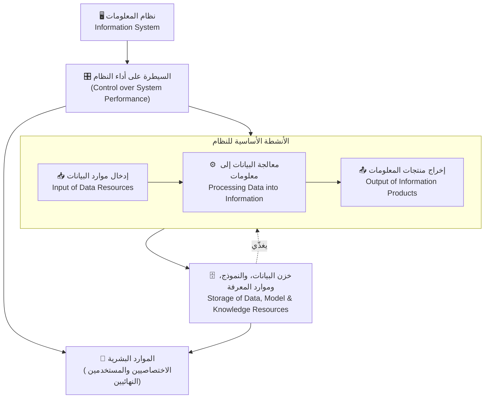
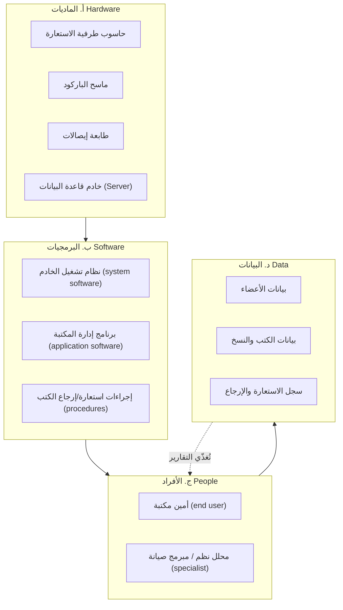
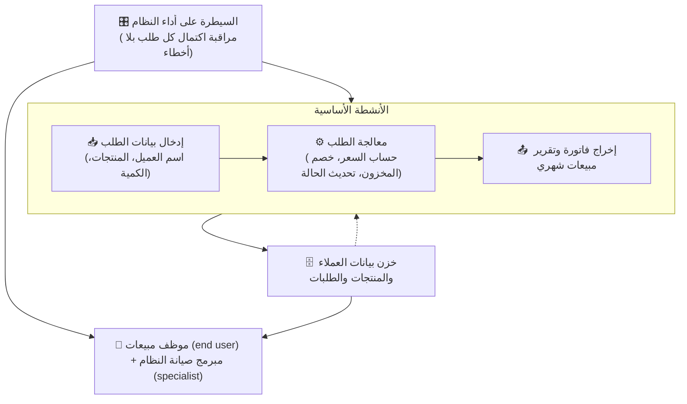

# المحاضرة 1 — Introduction to Information Systems (المفهوم العام لنظام المعلومات)
> **المادة:** نظم المعلومات (المستوى الرابع) | **الموضوع:** تعريف النظام والبيانات والمعلومات، تصنيف الأنظمة، نموذج نظام المعلومات وموارده الأربعة، ومقدمة عن التكنولوجيا الداعمة (البرمجيات والاتصالات)

---

## ملخص سريع قبل البدء

**عن ماذا هذه المحاضرة؟** هذه أول محاضرة في مادة `Information Systems`. تبني الأساس النظري الكامل: ما هو "النظام" أصلاً، الفرق بين البيانات (`Data`) والمعلومات (`Information`)، وكيف يوصف أي نظام معلومات حاسوبي بأربعة موارد أساسية (ماديات، برمجيات، أفراد، بيانات).

**ليش يهمك؟** كل محاضرات المادة القادمة (دورة حياة تطوير الأنظمة، تحليل النظم بـ `DFD`، تصميم `ERD`) مبنية على المصطلحات الأساسية هنا. لو ما فهمت الفرق بين نظام مفتوح ومغلق، أو بين البيانات والمعلومات، بتتوه لاحقاً في التحليل والتصميم.

**المتطلبات السابقة:** لا يوجد متطلب برمجي مسبق — المادة نظرية/تحليلية بالكامل.

**الخيط الناظم:**
```
ما هو النظام؟ (System Definition + Boundaries)
        ↓
تصنيف الأنظمة: مفتوح / مغلق (System Classifications)
        ↓
البيانات مقابل المعالجة مقابل المعلومات (Data → Processing → Information)
        ↓
مكونات النظام الأساسية (Input / Processing / Output)
        ↓
نموذج نظام المعلومات الكامل (Information System Model)
        ↓
موارد نظام المعلومات الأربعة (Hardware / Software / People / Data)
        ↓
التكنولوجيا الداعمة: البرمجيات (OS, Utilities, Translators) والاتصالات (Telecommunication)
```

---

## الجزء الأول: الشرح التفصيلي (سطر بسطر / فقرة بفقرة)

### 1. المفهوم العام لنظام المعلومات (General Concept of Information Systems)

### 1.1. تعريف نظام المعلومات وحدوده (Information System & Boundaries)
<!-- @type: fact -->
<!-- @render: {type: "prose-first", coverage: "100%"} -->
<!-- @connectivity: {prerequisite: "none"} -->

#### 📍 أين نحن الآن؟
نقطة البداية الكاملة للمادة — نعرّف "نظام المعلومات" قبل أي تفصيل آخر.

#### ⬅️ الربط مع السابق
لا يوجد موضوع سابق — هذه نقطة الانطلاق.

#### 💡 الفكرة الأساسية
**نظام المعلومات (`Information System`) هو بيئة تحتوي على عدد من العناصر المتفاعلة فيما بينها ومع محيطها، بهدف جمع البيانات ومعالجتها حاسوبياً وإنتاج وبث المعلومات التي تحتاجها المنظمة لصناعة القرارات.**

#### 📖 الشرح

التعريف المعتمد يبيّن نقطتين أساسيتين لازم تفهمهما مع بعض:

**أولاً — النظام كيان له حدود (`Boundaries`):** أي نظام أو بيئة قائمة بذاتها تفصلها عن الكيانات الأخرى أو عن المحيط الذي يعمل فيه حدود (`Boundaries`). في معظم الحالات هذه الحدود **لا تمتلك صفة مادية**، أي أنها غير ملموسة — يعني حدود نظام المعلومات في شركة ليست جداراً فيزيائياً، بل خط فاصل منطقي بين "ما يدخل ضمن مسؤولية النظام" و"ما هو خارج نطاقه". هذا مهم عملياً: أول خطوة في تحليل أي نظام هي تحديد حدوده — أين يبدأ وأين ينتهي مسؤولية النظام عن معالجة البيانات.

**ثانياً — الهدف من النظام:** جمع البيانات من محيطه، معالجتها حاسوبياً، ثم إنتاج وبث المعلومات التي تحتاجها الإدارة لصناعة القرارات. يعني نظام المعلومات مو مجرد "برنامج" — هو منظومة كاملة (بشر + أجهزة + برمجيات + إجراءات) تشتغل مع بعض لتحويل بيانات خام إلى معلومات مفيدة.

#### 🎯 الملخص السريع
- نظام المعلومات = بيئة من عناصر متفاعلة، لها حدود غير ملموسة عن محيطها
- الهدف: جمع البيانات → معالجتها حاسوبياً → إنتاج وبث معلومات لصناعة القرارات
- الحدود (`Boundaries`) هي أول شيء يحدَّد عند تحليل أي نظام

#### 📚 التطبيق
هذا التعريف هو الأساس الذي تُبنى عليه كل تصنيفات النظام اللاحقة (مفتوح/مغلق) وكل تحليل لاحق (DFD يعتمد أصلاً على تحديد حدود النظام لمعرفة أين تكون الكيانات الخارجية `External Entities`).

#### ⚠️ أخطاء شائعة

#### الفهم الخاطئ ❌:
نظام المعلومات هو مجرد البرنامج أو التطبيق الحاسوبي المستخدم في الشركة.

#### الفهم الصحيح ✅:
البرنامج جزء واحد فقط من نظام المعلومات؛ النظام الكامل يشمل أيضاً الأجهزة، الأفراد الذين يشغّلونه، والإجراءات، والبيانات نفسها — كل هذا ضمن حدود (`Boundaries`) واحدة تخدم هدفاً مشتركاً.

#### 📄 النص الأصلي من المحاضرة
<details>
<summary>عرض النص الأصلي (coverage: 100%)</summary>

> "نظام المعلومات هو: بيئة تحتوي على عدد من العناصر التي تتفاعل فيما بينها ومع محيطها بهدف جمع البيانات ومعالجتها حاسوبيا وإنتاج وبث المعلومات التي تحتاجها لصناعة القرارات. والتعريف يبين ان نظام المعلومات: 1 ـ هو بيئة أو كيان قائم بذاته تفصله عن الكيانات الأخرى أو عن المحيط الذي يعمل فيه حدود (boundaries). وفي معظم الحالات لا تمتلك هذه الحدود صفه المادية، أي أنها غير ملموسة."

**ملاحظة على التغطية:**
- ✓ تم شرح التعريف الكامل والنقطة المتعلقة بالحدود بالتفصيل
- ℹ️ إضافة من الدليل: ربط مفهوم الحدود بتحليل النظام لاحقاً (DFD)

</details>

---

### 2. تصنيف الأنظمة (System Classifications)

### 2.1. النظام المغلق مقابل النظام المفتوح (Closed System vs Open System)
<!-- @type: fact -->
<!-- @render: {type: "prose-first", coverage: "100%"} -->
<!-- @connectivity: {prerequisite: "1.1"} -->

#### 📍 أين نحن الآن؟
بعد تعريف النظام وحدوده، نصنّف الأنظمة حسب علاقتها بالبيئة المحيطة بها.

#### ⬅️ الربط مع السابق
بما أن للنظام حدوداً (`Boundaries`)، السؤال التالي منطقياً: هل هذه الحدود مغلقة تماماً عن المحيط، أم تسمح بتبادل معه؟ هذا بالضبط أساس تصنيف الأنظمة.

#### 💡 الفكرة الأساسية
**تُقسم الأنظمة إلى نظم مغلقة لا تتفاعل مع بيئتها، ونظم مفتوحة تتفاعل مع بيئتها باستمرار عبر مدخلات ومخرجات.**

#### 📖 الشرح

**النظام المغلق (`Closed System`):** هو النظام الذي ليس له أي علاقة مع أي نوع من البيئة المحيطة به، ويعمل بمعزل عنها؛ بمعنى لا يحتاج النظام إلى مدخلات اختراج أو عملية اخراج من والى البيئة لكي يعمل. **مثال:** الساعة الزجاجية (الرملية) والحركات التي تعمل بالبطاريات وتفاعلات كيميائية معينة تُعد من الأنظمة المغلقة الزجاجية التي لا تحتاج إلى مؤثر خارجي.

**النظام المفتوح (`Open System`):** عكس النظام المغلق، فهو النظام الذي يتفاعل مع بيئته ويعتمد عليها في اتمام عمليته عن طريق المدخلات التي يتم معالجتها ويقوم بإخراج المعلومات كنتائج لهذه العملية. **وبذلك يتأثر بكل العوامل الخارجية المحيط به.** الأمثلة على هذا النوع من الأنظمة عديدة مثل جسم الإنسان، نظام إداري، نظام الحاسوب...الخ.

**الفرق الجوهري:** النظام المغلق مكتفٍ ذاتياً (`self-contained`) — يعمل بمعزل تام. النظام المفتوح يعيش على التبادل مع البيئة: يستقبل مدخلات، يعالجها، ويُخرج معلومات تؤثر وتتأثر بالمحيط. **كل أنظمة المعلومات الحاسوبية التي ندرسها في هذه المادة هي أنظمة مفتوحة** — لأنها بطبيعتها تستقبل بيانات من محيطها (عملاء، موظفين، معاملات) وتُخرج معلومات تُستخدم في القرار.

| المعيار | النظام المغلق `Closed System` | النظام المفتوح `Open System` |
| --- | --- | --- |
| العلاقة بالبيئة | لا توجد — يعمل بمعزل | تفاعل مستمر (مدخلات ↔ مخرجات) |
| التأثر بالعوامل الخارجية | لا يتأثر | يتأثر بكل العوامل المحيطة |
| أمثلة | الساعة الرملية، الحركات بالبطاريات، تفاعلات كيميائية معينة | جسم الإنسان، نظام إداري، نظام الحاسوب |
| هل هي أنظمة معلومات حاسوبية؟ | لا | نعم — كل أنظمة المعلومات مفتوحة |

#### 🎯 الملخص السريع
- نظام مغلق = بلا تفاعل مع البيئة (مثال: الساعة الرملية)
- نظام مفتوح = تفاعل دائم عبر مدخلات ومخرجات (مثال: نظام الحاسوب، جسم الإنسان)
- كل أنظمة المعلومات الحاسوبية هي أنظمة **مفتوحة**

#### 📚 التطبيق
عندما تُحلَّل منظمة لاحقاً بـ `DFD`، أي كيان خارجي (`External Entity`) يرسل أو يستقبل بيانات هو دليل على أن النظام مفتوح ويتفاعل مع بيئته.

#### ⚠️ أخطاء شائعة

#### الفهم الخاطئ ❌:
النظام المغلق يعني نظاماً معزولاً بالكامل عن أي تغيير، بينما لا وجود له عملياً في أنظمة المعلومات.

#### الفهم الصحيح ✅:
النظام المغلق موجود فعلاً لكن في أمثلة فيزيائية/ميكانيكية بسيطة (ساعة رملية، بطارية)؛ أما كل أنظمة المعلومات التي تدرسها هذه المادة فهي مفتوحة بلا استثناء لأنها تحتاج تبادل بيانات مع محيطها لتعمل.

#### 📄 النص الأصلي من المحاضرة
<details>
<summary>عرض النص الأصلي (coverage: 100%)</summary>

> "النظم المغلقة Closed System: النظام المغلق هو النظام الذي ليس له اي نوع من علاقة مع اي نوع مع البيئة المحيطة به ويعمل بمعزل عنها. بمعنى لا يحتاج النظام الى مدخلات اخراج او عملية اخراج من و الى البيئة لكي يعمل. من امثلة الانظمة المغلقة الزجاجية البيوت الزجاجية التي لا تحتاج إلى مؤثر خارجي. النظم المفتوحة Open System: النظام المفتوح عكس النظام المغلق فهو النظام الذي يتفاعل مع بيئته ويعتمد عليها في اتمام عمليته عن طريق المدخلات التي يتم معالجتها ويقوم بإخراج المعلومات كنتائج لهذه العملية. وكذلك يتأثر بكل العوامل الخارجية المحيط به. الأمثلة على هذا النوع من الأنظمة عديدة مثل جسم الإنسان، نظام اداري، نظام الحاسوب...الخ."

**ملاحظة على التغطية:**
- ✓ تم شرح كلا النوعين والفرق الجوهري بينهما
- ℹ️ إضافة من الدليل: جدول مقارنة سريع + ربط بمفهوم External Entity في DFD

</details>

---

### 2.2. أمثلة تطبيقية على الأنظمة (System Examples)
<!-- @type: fact -->
<!-- @render: {type: "prose-first", coverage: "100%"} -->
<!-- @connectivity: {prerequisite: "2.1"} -->

#### 📍 أين نحن الآن؟
بعد فهم تصنيف الأنظمة، نشوف أمثلة حقيقية متنوعة توضح كيف يوصف أي نظام مفتوح بمكوناته.

#### ⬅️ الربط مع السابق
هذه الأمثلة كلها أنظمة **مفتوحة** بطبيعتها — تستقبل مدخلات من بيئتها وتُخرج نتائج.

#### 💡 الفكرة الأساسية
**أي نظام حقيقي — حاسوبي، تسويقي، جوي، أو مصرفي — يمكن وصفه بنفس الطريقة: مجموعة موارد تعمل معاً وفق إجراءات لتحويل مدخلات إلى مخرجات تخدم مستخدماً معيناً.**

#### 📖 الشرح

المحاضرة تعطي أربعة أمثلة متنوعة عمداً — لاحظ كيف يتكرر نفس القالب (موارد + إجراءات → خدمة/منتج) في كل مثال رغم اختلاف المجال:

| النظام | الوصف |
| --- | --- |
| **نظام الحاسوب** (`Computer System`) | هو مجموعة من الأجهزة والبرمجيات تحت نوع معين من التحكم لمعالجة بيانات وإنتاج معلومات. |
| **نظام تسويق** (`Marketing System`) | مجموعة من الناس، والبضائع، والمعدات، والإجراءات تُنتج أو توزّع بضاعة أو خدمات للمستخدم. |
| **نظام الخطوط الجوية** (`Airline System`) | يتكون هذا النظام من الأجهزة وطائرات ورحلات ومسافرين، ويعمل هذا النظام على تنظيم رحلات للمسافرين وتقديم خدمات لهم خلال الرحلات بالإضافة الى تقديم خدمات شحن جوي. |
| **النظام المصرفي** (`Banking System`) | يتكون من موظفين، اجراءات، وعملة، ويقوم النظام على اساس تقديم خدمات ايداع وصرف وتقديم قروض الى الزبائن بحيث تحكم هذه المعاملة قوانين ولوائح محددة لتسيير السياسة المالية للمصرف. |

**لاحظ النمط المشترك:** كل مثال يذكر (أ) موارد النظام (بشر، أجهزة، بضائع...)، (ب) الإجراءات أو التنظيم، (ج) الهدف/الخدمة النهائية للمستخدم. هذا بالضبط ما سنراه لاحقاً بشكل رسمي في "موارد نظام المعلومات الأربعة".

#### 🎯 الملخص السريع
- نظام الحاسوب: أجهزة + برمجيات + تحكم → معالجة بيانات وإنتاج معلومات
- نظام التسويق: أفراد + بضائع + معدات + إجراءات → توزيع بضاعة/خدمات
- نظام الخطوط الجوية: أجهزة + طائرات + رحلات + مسافرين → خدمات نقل وشحن
- النظام المصرفي: موظفين + إجراءات + عملة → إيداع/صرف/قروض ضمن لوائح مالية

#### 📚 التطبيق
هذه الأمثلة (خصوصاً المصرفي والخطوط الجوية) ستُستخدم لاحقاً كسيناريوهات جاهزة عند رسم `DFD` أو `ERD` في محاضرات التحليل والتصميم.

#### 📄 النص الأصلي من المحاضرة
<details>
<summary>عرض النص الأصلي (coverage: 100%)</summary>

> "نظام الحاسوب: هو مجموعة من الأجهزة والبرمجيات تحت نوع معين من التحكم لمعالجة بيانات وإنتاج معلومات. نظام تسوق: مجموعة من الناس والبضائع والمعدات والإجراءات تنتج أو توزع بضاعة او خدمات للمستخدم. النظام الخطوط الجوية: يتكون هذا النظام من الأجهزة وطائرات ورحلات ومسافرين ويعمل هذا النظام على تنظيم رحلات للمسافرين وتقديم خدمات لهم خلال الرحلات بالإضافة الى تقديم خدمات شحن جوي. النظام المصرفي: يتكون من موظفين، اجراءات وعملة و يقوم النظام على اساس تقديم خدمات ايداع وصرف وتقديم قروض الى الزبائن بحيث تحكم هذه المعاملة قوانين ولوائح محددة لتسيير السياسة المالية للمصرف."

**ملاحظة على التغطية:**
- ✓ تم شرح الأمثلة الأربعة كاملة
- ℹ️ إضافة من الدليل: جدول تلخيصي + إبراز النمط المشترك بينها

</details>

---

### 3. البيانات والمعالجة والمعلومات (Data, Processing & Information)

### 3.1. البيانات (Data)
<!-- @type: fact -->
<!-- @render: {type: "prose-first", coverage: "100%"} -->
<!-- @connectivity: {prerequisite: "1.1"} -->

#### 📍 أين نحن الآن؟
بعد فهم "النظام" بشكل عام، ندخل الآن على المادة الخام التي يشتغل عليها أي نظام معلومات: البيانات.

#### ⬅️ الربط مع السابق
نظام المعلومات (كما عرّفناه) هدفه معالجة البيانات لإنتاج معلومات — إذاً لازم نعرف أولاً "شنو هي البيانات؟" بدقة.

#### 💡 الفكرة الأساسية
**البيانات (`Data`) هي مفاهيم لغوية أو رياضية أو رمزية خالية من المعنى الظاهري، متفق عليها لتمثيل الأشخاص أو الأشياء أو الأحداث — وهي بحاجة لعملية معالجة (`Processing`) لتتحول إلى معلومات.**

#### 📖 الشرح

البيانات (`Data`) هي: مفاهيم لغوية أو رياضية أو رمزية خالية من المعنى الظاهري متفق عليها لتمثيل الأشخاص أو الأشياء أو الأحداث. فمفاهيم مثل: كرسي، وصندوق، وسيارة، وأحمر، وكبير، و٦، هي بيانات ليس لها معنى ظاهري لها. وهي بحاجة لأن تخضع لعملية معالجة (`Processing`) لتتحول إلى معلومات.

**النقطة الجوهرية:** البيانات بحد ذاتها **لا معنى وظيفياً لها** بمعزل عن السياق — الرقم "٦" وحده لا يخبرك بشيء (٦ سنوات؟ ٦ موظفين؟ ٦ دولارات؟). البيانات تصبح مفيدة فقط بعد معالجتها ووضعها في سياق يجيب على سؤال محدد يحتاجه متخذ القرار.

#### 🎯 الملخص السريع
- البيانات = مفاهيم لغوية/رياضية/رمزية خالية من المعنى الظاهري
- أمثلة: كرسي، صندوق، سيارة، أحمر، كبير، ٦
- البيانات بحاجة إلى معالجة (`Processing`) لتتحول إلى معلومات (`Information`)

#### 📚 التطبيق
هذا التمييز أساس المفهوم التالي مباشرة: المعالجة (`Processing`) — وهي العملية التي تحوّل هذه البيانات الخام إلى معلومات ذات معنى.

#### 📄 النص الأصلي من المحاضرة
<details>
<summary>عرض النص الأصلي (coverage: 100%)</summary>

> "البيانات والبيانات (data) هي: مفاهيم لغوية أو رياضية أو رمزية خالية من المعني الظاهري متفق عليها لتمثيل الأشخاص او الاشياء أو الاحداث. فمفاهيم مثل كرسي، وصندوق، وسيارة، وأحمر، وكبير، و٦، هي بيانات لا معنى ظاهري لها. وهي بحاجة لأن تخضع لعملية معالجة (processing) لتتحول إلى معلومات."

**ملاحظة على التغطية:**
- ✓ تم شرح التعريف كاملاً مع كل الأمثلة الواردة
- ℹ️ إضافة من الدليل: توضيح لماذا الرقم وحده لا معنى له بدون سياق

</details>

---

### 3.2. المعالجة والمعلومات (Processing & Information)
<!-- @type: fact -->
<!-- @render: {type: "prose-first", coverage: "100%"} -->
<!-- @connectivity: {prerequisite: "3.1"} -->

#### 📍 أين نحن الآن؟
بعد تعريف البيانات، نفهم كيف تتحول إلى معلومات عبر المعالجة.

#### ⬅️ الربط مع السابق
عرّفنا البيانات كمفاهيم خالية من المعنى، وقلنا إنها "بحاجة لمعالجة" — هذا القسم يشرح تلك المعالجة بالضبط.

#### 💡 الفكرة الأساسية
**المعالجة (`Processing`) هي العمليات (جمع، تصنيف، ترتيب، ترميز، اختصار، ترجمة، جدولة...) التي تحوّل المفاهيم الخالية من المعنى الظاهري إلى مفاهيم ذات معنى تُسمى المعلومات (`Information`)، وتُستخدم في صنع القرار وحل المشاكل.**

#### 📖 الشرح

المعالجة تتم عن طريق الجمع، أو التصنيف، أو الترتيب، أو الترميز أو التمييز، أو الإختصار، أو الترجمة، أو الجدولة...الخ. وغرض هذه المعالجة هو تحويل المفاهيم الخالية من المعنى الظاهري إلى مفاهيم ذات معنى تساعد في عملية صنع القرار وحل المشاكل، ويطلق عليها تسمية المعلومات (`information`).

**نقطة حرجة يجب حفظها:** والمعالجة في نظام المعلومات الحاسوبي تجرى بواسطة الحاسوب الذي يتميز بقدرته الهائلة على معالجة حجوم ضخمة جداً من البيانات بسرعة عالية جداً ودقة متناهية ومن دون تعب أو ملل. هذه هي بالضبط الميزة التي تجعل الحاسوب أداة المعالجة المفضّلة على نطاق واسع في أي منظمة حديثة — مقارنة بالمعالجة اليدوية البطيئة والمعرّضة للخطأ البشري والتعب.

**سلسلة التحويل الكاملة:**

```
بيانات خام (Data — لا معنى ظاهري)
        ↓ [جمع / تصنيف / ترتيب / ترميز / اختصار / ترجمة / جدولة]
        ↓  المعالجة (Processing)
معلومات (Information — ذات معنى، تخدم القرار)
```

#### 🎯 الملخص السريع
- المعالجة (`Processing`) = عمليات تحويل (جمع، تصنيف، ترتيب، ترميز، اختصار، ترجمة، جدولة)
- الهدف: تحويل بيانات خالية من المعنى إلى معلومات (`Information`) تخدم القرار وحل المشاكل
- الحاسوب يعالج حجوماً ضخمة، بسرعة عالية، ودقة متناهية، بدون تعب أو ملل — لهذا هو أداة المعالجة الأساسية

#### 📚 التطبيق
هذا التعريف بالضبط هو ما سيُبنى عليه لاحقاً مفهوم "المعالجة" (`Processing`) كأحد الأجزاء الثلاثة الأساسية لأي نظام (Input / Processing / Output).

#### ⚠️ أخطاء شائعة

#### الفهم الخاطئ ❌:
أي بيانات مجمّعة تلقائياً تصبح "معلومات" بمجرد تخزينها في الحاسوب.

#### الفهم الصحيح ✅:
البيانات تحتاج فعلياً عملية معالجة محددة (تصنيف، ترتيب، حساب...) لتتحول إلى معلومات ذات معنى وظيفي يخدم القرار؛ مجرد التخزين وحده لا يكفي.

#### 📄 النص الأصلي من المحاضرة
<details>
<summary>عرض النص الأصلي (coverage: 100%)</summary>

> "المعالجة وهذه المعالجة تتم عن طريق الجمع او التصنيف او الترتيب او الترميز او التمييز، او الإختصار، او الترجمة، او الجدولة، ...الخ، وغرض هذه المعالجة هو تحويل المفاهيم الخالية من المعنى الظاهري الى مفاهيم ذات معنى تساعد في عملية صنع القرار وحل المشاكل ويطلق عليها تسمية المعلومات (information) والمعالجة في نظام المعلومات الحاسوبي تجرى بواسطة الحاسوب الذي يتميز بقدرته الهائلة على معالجة حجوم ضخمة من البيانات بسرعة عالية جداً ودقة متناهية ومن دون تعب أو ملل."

**ملاحظة على التغطية:**
- ✓ تم شرح التعريف الكامل، عمليات المعالجة المذكورة، وميزة الحاسوب في المعالجة
- ℹ️ إضافة من الدليل: مخطط تسلسلي نصي يلخص سلسلة التحويل من بيانات إلى معلومات

</details>

---

### 4. ما هو النظام؟ ومكوناته الأساسية (System Definition & Basic Parts)

### 4.1. التعريف العام والمعتمد للنظام (System Definition)
<!-- @type: fact -->
<!-- @render: {type: "prose-first", coverage: "100%"} -->
<!-- @connectivity: {prerequisite: "3.2"} -->

#### 📍 أين نحن الآن؟
بعد فهم البيانات والمعلومات، نرجع نعمّق تعريف "النظام" نفسه بشكل رسمي أكثر — بما يشمل كل أنواع الأنظمة، وليس فقط الحاسوبية.

#### ⬅️ الربط مع السابق
سبق أن عرّفنا نظام المعلومات تحديداً (القسم 1.1)؛ هنا نعرّف مفهوم "النظام" (`System`) بشكل عام أوسع يشمل أي نظام في أي مجال.

#### 💡 الفكرة الأساسية
**النظام (`System`) — بأبسط تعريف — هو "مجموعة من العناصر المترابطة أو المتداخلة التي تكون كلاً متكاملاً"، والتعريف المعتمد يضيف أن هذه الأجزاء تتفاعل مع بعضها ومع البيئة لتحقيق هدف عن طريق قبول المدخلات وإنتاج المخرجات من خلال إجراء تحويل منظم.**

#### 📖 الشرح

ما هو النظام (`System`)؟ بكل بساطة، يمكن تعريف النظام بأنه «مجموعة من العناصر المترابطة أو المتداخلة التي تكون كلاً متكاملاً». ويمكننا التعرف على العديد من النظم في حقول العلوم البايولوجية والفيزيائية والتكنولوجية والمجتمعات الإنسانية. وهذا يشمل نظام المجموعة الشمسية، والنظام البايولوجي لجسم الإنسان، والنظام التكنولوجي لمولد الطاقة الكهربائية.

**التعريف المعتمد للنظام هو:** النظام هو مجموعة من الأجزاء المترابطة التي تتفاعل مع البيئة ومع بعضها البعض لتحقيق هدف ما عن طريق قبول المدخلات وإنتاج المخرجات من خلال إجراء تحويل منظم.

**الفرق بين التعريفين:** التعريف البسيط يقول فقط "أجزاء مترابطة تكوّن كلاً متكاملاً" — وهذا صحيح لكنه عام جداً حتى إنه ينطبق على أي مجموعة مترابطة (المجموعة الشمسية مثلاً). التعريف المعتمد يضيف العنصر الوظيفي الحاسم: **الهدف** (لماذا يوجد النظام)، و**التحويل المنظم** (كيف يعمل: مدخلات → عملية تحويل → مخرجات). هذا التعريف الثاني هو الذي يُبنى عليه فهم أي نظام معلومات لاحقاً.

#### 🎯 الملخص السريع
- تعريف بسيط: النظام = أجزاء مترابطة تكوّن كلاً متكاملاً (ينطبق على أي مجال: بيولوجي، فيزيائي، تكنولوجي، اجتماعي)
- التعريف المعتمد: أجزاء مترابطة + تتفاعل مع بعضها ومع البيئة + هدف محدد + تحويل منظم (مدخلات → مخرجات)
- الفرق الجوهري: التعريف المعتمد يضيف "الهدف" و"عملية التحويل المنظمة"

#### 📚 التطبيق
التعريف المعتمد هو الأساس المباشر للقسم التالي: الأجزاء الثلاثة الأساسية لأي نظام (`Input`, `Processing`, `Output`).

#### 📄 النص الأصلي من المحاضرة
<details>
<summary>عرض النص الأصلي (coverage: 100%)</summary>

> "ما هو النظام؟ ما هو النظام (System)؟ ببساطة، يمكن تعريف النظام بأنه «مجموعة من الأجزاء المترابطة أو المتداخلة التي تكون كلاً متكاملاً». ويمكننا التعرف على العديد من النظم في حقول العلوم البايولوجية والفيزيائية والتكنولوجية والمجتمعات الإنسانية. وهذا يشمل نظام المجموعة الشمسية، والنظام البايولوجي لجسم الإنسان، والنظام التكنولوجي لمولد الطاقة الكهربائية. التعريف المعتمد للنظام هو: النظام: هو مجموعة من الأجزاء المترابطة التي تتفاعل مع البيئة ومع بعضها البعض لتحقيق هدف ما عن طريق قبول المدخلات وإنتاج المخرجات من خلال إجراء تحويل منظم."

**ملاحظة على التغطية:**
- ✓ تم شرح كلا التعريفين (البسيط والمعتمد) والفرق بينهما بالكامل
- ✓ تم ذكر جميع أمثلة النظم من حقول العلوم المختلفة

</details>

---

### 4.2. أجزاء النظام الأساسية الثلاثة (Basic System Parts: Input / Processing / Output)
<!-- @type: fact -->
<!-- @render: {type: "diagram-first", visualization: "flowchart", coverage: "100%"} -->
<!-- @connectivity: {prerequisite: "4.1"} -->

#### 📍 أين نحن الآن؟
بعد تعريف النظام بشكل عام، نفصّل الآن الأجزاء الثلاثة المتفاعلة التي يحتوي عليها أي نظام.

#### ⬅️ الربط مع السابق
التعريف المعتمد للنظام ذكر "قبول المدخلات وإنتاج المخرجات من خلال إجراء تحويل منظم" — هذا القسم يشرح هذه الثلاثة بالتفصيل: `Input`، `Processing`، `Output`.

#### 💡 الفكرة الأساسية
**النظام يحتوي على ثلاثة أجزاء متفاعلة رئيسية: المدخلات (`Input`) التي تدخل النظام، المعالجة (`Processing`) التي تحوّلها، والمخرجات (`Output`) التي تخرج للمستفيدين منها.**

---

#### 📊 المخطط: الأجزاء الثلاثة الأساسية للنظام


**شرح العناصر:**
- **المدخلات (`Input`):** تتعلق باستحصال وتجميع العناصر التي تدخل النظام لكي تعالج، مثلاً المواد الخام، والطاقة، والبيانات، والجهود البشرية والتي يجب أن تتوفر وتنظم لأغراض المعالجة.
- **المعالجة (`Processing`):** وهي عمليات تحويلية يتم من خلالها تحويل المدخلات إلى مخرجات، من أمثلتها العمليات التصنيعية، وعملية التنفس عند الإنسان، والحسابات التي تجرى على البيانات.
- **المخرجات (`Output`):** وتتعلق بنقل العناصر التي انتجت خلال عمليات التحويل إلى الجهات التي تحتاجها، مثلاً المنتجات النهائية، والخدمات البشرية، والمعلومات الإدارية التي يجب أن تنقل إلى مستخدميها.

**شرح الروابط:**
- **المدخلات → المعالجة:** المدخلات (بعد جمعها وتنظيمها) تدخل عملية التحويل.
- **المعالجة → المخرجات:** التحويل ينتج مخرجات جاهزة للاستخدام.
- **المخرجات → المستفيدون:** المخرجات تُنقل إلى الجهات التي تحتاجها فعلاً.

---

#### 📖 الشرح

هذا التقسيم الثلاثي عام جداً — ينطبق على أي نظام بغض النظر عن مجاله. لاحظ التنوع في الأمثلة المذكورة في كل جزء: **المعالجة** مثلاً تشمل أمثلة مختلفة تماماً في طبيعتها — عملية تصنيعية (نظام صناعي)، عملية التنفس عند الإنسان (نظام بيولوجي)، وحسابات على بيانات (نظام معلومات حاسوبي). هذا يوضح أن هذا الإطار الثلاثي (`Input → Processing → Output`) هو **قالب عام** يمكن تطبيقه على أي نوع نظام، وهو بالضبط ما يجعل نظام المعلومات الحاسوبي حالة خاصة من هذا القالب العام: مدخلاته بيانات، ومعالجته حسابات وعمليات تحويلية حاسوبية، ومخرجاته معلومات إدارية.

#### 🎯 الملخص السريع
- Input: استحصال وتجميع عناصر (مواد خام، طاقة، بيانات، جهود بشرية) لتنظم لأغراض المعالجة
- Processing: عمليات تحويلية (تصنيع، تنفس، حسابات) تحوّل المدخلات إلى مخرجات
- Output: نقل نتائج التحويل (منتجات، خدمات، معلومات إدارية) إلى الجهات المستفيدة

#### 📚 التطبيق
هذا الإطار الثلاثي هو نفسه الذي سنراه موسّعاً في "نموذج نظام المعلومات" (القسم القادم) بإضافة عنصرين: التخزين (`Storage`) والتحكم (`Control`).

#### 📄 النص الأصلي من المحاضرة
<details>
<summary>عرض النص الأصلي (coverage: 100%)</summary>

> "أجزاء النظام الأساسية النظام يحتوي على ثلاثة أجزاء متفاعلة رئيسية: المدخلات input: وتتعلق باستحصال وتجميع العناصر التي تدخل الى النظام لكي تعالج، مثلاً المواد الخام، والطاقة، والبيانات، والجهود البشرية والتي يجب أن تتوفر وتنظم لاغراض المعالجة. المعالجة processing: وهي عمليات تحويلية يتم من خلالها تحويل المدخلات الى مخرجات. من أمثلتها العمليات التصنيعية، وعملية التنفس عند الإنسان، والحسابات التي تجرى على البيانات. المخرجات output: وتتعلق بنقل العناصر التي انتجت خلال عمليات التحويل الى الجهات التي تحتاجها. مثلاً المنتجات النهائية، والخدمات البشرية، والمعلومات الإدارية التي يجب أن تنقل الى مستخدميها."

**ملاحظة على التغطية:**
- ✓ تم شرح الأجزاء الثلاثة وأمثلتها كاملة
- ℹ️ إضافة من الدليل: مخطط `mermaid` يوضح التسلسل + ربط بنموذج نظام المعلومات الموسّع

</details>

---

### 4.3. الفرق بين مصطلحي البيانات والمعلومات (Data vs Information — دورة التحويل الكاملة)
<!-- @type: fact -->
<!-- @render: {type: "prose-first", coverage: "100%"} -->
<!-- @connectivity: {prerequisite: "3.2"} -->

#### 📍 أين نحن الآن؟
بعد أن رأينا البيانات، والمعالجة، وأجزاء النظام، نعود لنؤكد ونعمّق الفرق بين البيانات والمعلومات — لأنه من أكثر النقاط التي يخلط فيها الطلاب.

#### ⬅️ الربط مع السابق
هذا امتداد مباشر للقسم 3.1 و3.2، لكن بتفصيل أدق حول كيف تصبح البيانات معلومات فعلياً ومتى تكتسب "قيمة".

#### 💡 الفكرة الأساسية
**البيانات هي المواد الخام التي تُنتج المعلومات حينما تُعالج؛ المعلومات هي بيانات تم تحويلها إلى صورة ذات معنى وقابلة للاستخدام من قبل المستفيد الأخير — والبيانات لا قيمة لها في العادة إلا بعد أن تتحول إلى معلومات.**

#### 📖 الشرح

يُستخدم مصطلحا «بيانات» و«معلومات» بشكل تبادلي أحياناً، ولكن من المهم والمفيد لنا أن نميّز بين المصطلحين: فالبيانات هي المواد الخام التي حينما تُعالج ينتج منها السلع المصنّعة التي هي المعلومات. وعلى هذا الأساس يمكن لنا أن نعرف «المعلومات» بأنها بيانات تم تحويلها إلى صورة ذات معنى وقابلة للاستخدام من قبل المستفيد الأخير.

**والبيانات في العادة لا تعود لها قيمة إلا أن يتم تحويلها إلى معلومات ويتم ذلك من خلال:**
1. **معالجتها** (`Processing`)
2. **ثم تحليل محتواها** (`Analysis`)
3. **ثم وضعها بصورة تمكّن الانسان من استخدامها** (`Presentation`)

وعليه يتوجب علينا أن ننظر إلى المعلومات كمياً بصورة معالجة وموضوعة بشكل يعطيها قيمة عند المستخدم النهائي.

**التشبيه الأنسب:** البيانات مثل المواد الخام في مصنع (خشب، معدن، قماش)، والمعالجة والتحليل والعرض هي خطوط الإنتاج، والمعلومات هي المنتج النهائي الجاهز للبيع (كرسي مصنّع، سيارة). المادة الخام وحدها بلا قيمة سوقية تُذكر مقارنة بالمنتج النهائي — نفس الفكرة تماماً بين البيانات والمعلومات.

#### 🎯 الملخص السريع
- البيانات = مواد خام | المعلومات = بيانات مُعالَجة وذات معنى وقابلة للاستخدام
- البيانات تكتسب قيمة فقط بعد: معالجة → تحليل محتوى → عرض بصورة قابلة للاستخدام
- المعلومات تُقاس بالقيمة التي تعطيها للمستخدم النهائي، وليس بحجمها فقط

#### 📚 التطبيق
هذا المفهوم (خصوصاً خطوات: معالجة → تحليل → عرض) هو ما يحدد جودة أي نظام معلومات لاحقاً — نظام يُنتج بيانات ضخمة لكن بلا تحليل أو عرض مناسب لا يُعتبر نظام معلومات فعّالاً.

#### ⚠️ أخطاء شائعة

#### الفهم الخاطئ ❌:
البيانات والمعلومات مصطلحان مترادفان تماماً ويمكن استخدامهما بالتبادل دائماً.

#### الفهم الصحيح ✅:
البيانات مادة خام بلا معنى وظيفي، بينما المعلومات ناتج معالجة وتحليل وعرض لتلك البيانات — التمييز مهم لأن قيمة نظام المعلومات تُقاس بجودة تحويله للبيانات إلى معلومات، لا بكمية البيانات المخزّنة فقط.

#### 📄 النص الأصلي من المحاضرة
<details>
<summary>عرض النص الأصلي (coverage: 100%)</summary>

> "الفرق بين مصطلحي البيانات والمعلومات ويستخدم مصطلحاً «بيانات» و«معلومات» بشكل تبادلي، ولكن من المهم والمفيد لنا ان نميز بين المصطلحين، فالبيانات هي المواد الخام التي حينما تعالج ينتج منها السلع المصنعة التي هي المعلومات. وعلى هذا الاساس يمكن لنا ان نعرف «المعلومات» بأنها بيانات تم تحويلها الى صورة ذات معنى وقابلة للإستخدام من قبل المستفيد الأخير. والبيانات في العادة لا يعد لها قيمة الا ان يتم تحول إلى معلومات ويتم ذلك من خلال: (١) معالجتها، و(٢) ثم تحليل محتواها، و(٣) ثم وضعها بصورة تمكن الانسان من استخدامها. وعليه يتوجب علينا ان ننظر الى المعلومات كبيانات معالجة وموضوعة بشكل يعطيها قيمة عند المستخدم النهائي."

**ملاحظة على التغطية:**
- ✓ تم شرح التعريف الكامل والخطوات الثلاث بالترتيب المذكور
- ℹ️ إضافة من الدليل: تشبيه المصنع لتوضيح الفرق

</details>

---

### 5. نموذج نظام المعلومات الكامل (Information System Model)
<!-- @type: fact -->
<!-- @render: {type: "diagram-first", visualization: "flowchart", coverage: "100%"} -->
<!-- @connectivity: {prerequisite: "4.2"} -->

#### 📍 أين نحن الآن؟
بعد فهم الأجزاء الثلاثة العامة لأي نظام (`Input/Processing/Output`)، نبني الآن النموذج المتكامل الخاص بنظام المعلومات تحديداً — والذي يضيف عنصرين مهمين: التحكم والتخزين.

#### ⬅️ الربط مع السابق
هذا النموذج هو التوسعة المباشرة لأجزاء النظام الأساسية الثلاثة (القسم 4.2)، مطبّقة تحديداً على نظام المعلومات ومضافاً إليها التخزين والتحكم والموارد البشرية.

#### 💡 الفكرة الأساسية
**نموذج نظام المعلومات يوضح أن نشاطات النظام (إدخال، معالجة، إخراج) تخضع للسيطرة على أداء النظام، وتعتمد على مورد خزن (بيانات، نموذج، معرفة)، وتُنفَّذ جميعها بواسطة الموارد البشرية (الاختصاصيين والمستخدمين النهائيين).**

---

#### 📊 المخطط: نموذج نظام المعلومات (Information System Model)



**شرح العناصر:**
- **السيطرة على أداء النظام (`Control`):** الطبقة العلوية التي تراقب وتضبط أن الإدخال والمعالجة والإخراج تسير بشكل صحيح ومتوافق مع أهداف النظام.
- **إدخال موارد البيانات (`Input`):** استقبال البيانات الخام من مصادرها لتغذية عملية المعالجة.
- **معالجة البيانات إلى معلومات (`Processing`):** التحويل الفعلي للبيانات الخام إلى معلومات ذات معنى.
- **إخراج منتجات المعلومات (`Output`):** إنتاج المعلومات النهائية وتوزيعها لمن يحتاجها.
- **خزن البيانات والنموذج وموارد المعرفة (`Storage`):** قاعدة تخزّن البيانات نفسها، بالإضافة إلى النماذج (`Models`) وموارد المعرفة (`Knowledge Resources`) التي تُستخدم أثناء المعالجة، وتُغذّي دورة العمل باستمرار (بيانات تاريخية، قواعد عمل محفوظة).
- **الموارد البشرية (`Human Resources`):** الاختصاصيون (المحللون والمبرمجون ومشغلو الحاسوب) والمستخدمون النهائيون (الاختصاصيين والمستخدمين النهائيين) الذين يُشغّلون وينفّذون كل هذه الطبقات.

**شرح الروابط:**
- **السيطرة → الأنشطة الأساسية:** التحكم يشرف على الإدخال/المعالجة/الإخراج معاً كوحدة واحدة.
- **الأنشطة الأساسية ↔ التخزين:** المعالجة تستخدم بيانات مخزّنة مسبقاً وتُغذّي التخزين ببيانات جديدة (علاقة ثنائية الاتجاه).
- **التخزين والتحكم → الموارد البشرية:** في القاعدة، كل هذه الطبقات تعتمد على الموارد البشرية (المتخصصين والمستخدمين النهائيين) الذين يبنون النموذج ويستخدمونه فعلياً.

---

#### 📖 الشرح

اقرأ هذا النموذج كهرم: في القمة "نظام المعلومات" ككل، تحته مباشرة طبقة "السيطرة على أداء النظام" التي تراقب كل شيء يجري في الوسط. في وسط النموذج ثلاثة أنشطة متسلسلة أفقياً بالضبط كما رأيناها في القسم السابق (إدخال → معالجة → إخراج)، لكن هنا مسمّاة بدقة أكبر: "إدخال موارد البيانات"، "معالجة البيانات إلى معلومات"، "إخراج منتجات المعلومات". تحت هذه الأنشطة توجد طبقة "خزن البيانات، والنموذج، وموارد المعرفة" — وهي ما يجعل نظام المعلومات مختلفاً عن مجرد آلة تحويل بسيطة؛ فهو يحتفظ بذاكرة (بيانات تاريخية) ونماذج ومعرفة يعيد استخدامها. أما القاعدة الكاملة لهذا الهرم فهي "الموارد البشرية" — لأنه بدون الاختصاصيين الذين يبنون النظام والمستخدمين النهائيين الذين يستخدمونه، لا قيمة لأي من الطبقات السابقة.

**لماذا هذا النموذج مهم؟** لأنه يلخّص المادة كلها في رسم واحد: أي نظام معلومات حاسوبي = تحكم + (إدخال → معالجة → إخراج) + تخزين + موارد بشرية. القسم القادم (موارد نظام المعلومات الأربعة) يفصّل هذه العناصر نفسها لكن من زاوية "الموارد" بدل "الأنشطة".

#### 🎯 الملخص السريع
- الطبقة العليا: السيطرة على أداء النظام (`Control`)
- الوسط: إدخال موارد البيانات → معالجة البيانات إلى معلومات → إخراج منتجات المعلومات
- طبقة الدعم: خزن البيانات والنموذج وموارد المعرفة
- القاعدة: الموارد البشرية (الاختصاصيين والمستخدمين النهائيين)

#### 📚 التطبيق
هذا النموذج هو الإطار المرجعي الذي سيُستخدم لاحقاً في المادة عند دراسة أنواع نظم المعلومات المتخصصة (`TPS`, `MIS`) — فكل هذه الأنظمة تتبع نفس الهيكل العام.

#### ⚠️ أخطاء شائعة

#### الفهم الخاطئ ❌:
نموذج نظام المعلومات هو فقط "مدخلات → معالجة → مخرجات" بدون أي إضافة أخرى.

#### الفهم الصحيح ✅:
النموذج الكامل يضيف طبقتين أساسيتين فوق وتحت هذه الأنشطة: السيطرة (`Control`) التي تراقب الأداء، والتخزين (`Storage`) الذي يحتفظ بالبيانات والنماذج والمعرفة — وكل هذا مبني على الموارد البشرية في الأساس.

#### 📄 النص الأصلي من المحاضرة
<details>
<summary>عرض النص الأصلي (coverage: 100%)</summary>

> "نموذج نظام المعلومات Information system model: نظام المعلومات، السيطرة على أداء النظام، إدخال موارد البيانات، معالجة البيانات إلى معلومات، إخراج منتجات المعلومات، خزن البيانات، والنموذج، وموارد المعرفة، للموارد البشرية (الاختصاصيين والمستخدمين النهائيين)"

**ملاحظة على التغطية:**
- ✓ تم إعادة رسم المخطط الهرمي بالكامل بـ mermaid مع شرح كل عنصر ورابط
- ✓ تم تغطية كل العناصر الخمسة الظاهرة في الرسم الأصلي (السيطرة، الإدخال، المعالجة، الإخراج، الخزن، الموارد البشرية)

</details>

---

### 6. موارد نظام المعلومات الأربعة (The Four Information System Resources)

### 6.1. نظرة عامة على الموارد الأربعة
<!-- @type: fact -->
<!-- @render: {type: "prose-first", coverage: "100%"} -->
<!-- @connectivity: {prerequisite: "5"} -->

#### 📍 أين نحن الآن؟
بعد رؤية النموذج الكامل لنظام المعلومات، نفصّل الآن الموارد الأربعة التي يعتمد عليها هذا النموذج.

#### ⬅️ الربط مع السابق
"الموارد البشرية" و"خزن البيانات" ظهرت في النموذج السابق كطبقات — هذا القسم يوسّعها رسمياً إلى تصنيف من أربع فئات شامل لكل النظام، وليس فقط طبقتين.

#### 💡 الفكرة الأساسية
**يحتوي نظام المعلومات على أربعة موارد أساسية: الماديات (`Hardware`)، والبرمجيات (`Software`)، والأفراد (`People`)، والبيانات (`Data`) — وكل نظام معلومات حاسوبي، أياً كان حجمه، يُبنى من هذه الموارد الأربعة معاً.**

#### 📖 الشرح

يحتوي نظام المعلومات على أربعة موارد أساسية: الماديات، والبرمجيات، والأفراد، والبيانات. هذا التصنيف الرباعي هو **الإطار الأشمل** الذي يمكن من خلاله وصف أي نظام معلومات حاسوبي — من أبسط حاسوب شخصي إلى أضخم نظام مصرفي موزّع. لاحظ أن هذا التصنيف يتقاطع مع النموذج الهرمي السابق (القسم 5): "الأفراد" هنا هم أنفسهم "الموارد البشرية" هناك، و"البيانات" هي جزء من طبقة "الخزن"، بينما "الماديات" و"البرمجيات" هي الأدوات التي تنفّذ طبقات "الإدخال" و"المعالجة" و"الإخراج".

| المورد | يشمل |
| --- | --- |
| **أ. الماديات** `Hardware Resources` | حاسبات، محطات عمل، طابعات، أقراص، شبكات اتصال |
| **ب. البرمجيات** `Software Resources` | برمجيات المنظومة (`system software`)، برمجيات تطبيقية (`application software`)، إجراءات (`procedures`) |
| **ج. الأفراد** `People Resources` | اختصاصيون (`specialists`)، مستخدمون نهائيون (`end users`) |
| **د. البيانات** `Data Resources` | المادة الخام لنظم المعلومات؛ اليوم تُعد أيضاً معرفة (`knowledge`) للمنظمة |

القسم القادم سيفصّل كل واحد من هذه الأربعة على حدة.

#### 🎯 الملخص السريع
- 4 موارد: ماديات، برمجيات، أفراد، بيانات
- كل نظام معلومات حاسوبي — بغض النظر عن حجمه — مبني من هذه الأربعة معاً
- هذا التصنيف يوازي (ولا يناقض) نموذج "الأنشطة" في القسم السابق

#### 📚 التطبيق
هذا التصنيف الرباعي يُستخدم لاحقاً كأداة تحليل قياسية: عند تحليل أي نظام حقيقي، يُطلب غالباً من المحلل تحديد موارده الأربعة بوضوح.

#### 📄 النص الأصلي من المحاضرة
<details>
<summary>عرض النص الأصلي (coverage: 100%)</summary>

> "موارد نظام المعلومات يحتوي نظام المعلومات على أربعة موارد أساسية: الماديات، البرمجيات، الأفراد، والبيانات."

**ملاحظة على التغطية:**
- ✓ تم شرح التصنيف الرباعي وربطه بالنموذج السابق
- ℹ️ إضافة من الدليل: جدول تلخيصي للموارد الأربعة قبل التفصيل

</details>

---

### 6.2. موارد الماديات (Hardware Resources)
<!-- @type: fact -->
<!-- @render: {type: "prose-first", coverage: "100%"} -->
<!-- @connectivity: {prerequisite: "6.1"} -->

#### 📍 أين نحن الآن؟
أول مورد من الموارد الأربعة: الماديات (الأجهزة الملموسة).

#### ⬅️ الربط مع السابق
هذا تفصيل للفئة الأولى من الجدول السابق.

#### 💡 الفكرة الأساسية
**موارد الماديات تشمل جميع العدات والمواد المادية المستخدمة في معالجة البيانات — من الحاسبات نفسها إلى وسائط تخزين البيانات وشبكات الاتصال.**

#### 📖 الشرح

موارد الماديات: ويشمل جميع المعدات المادية والمواد المستخدمة في معالجة البيانات. وهي بالأخص الكيان، مثل الحاسبات والآلات الحاسبة، كما تشمل أوساط البيانات مثل الأوراق والاقراص المغناطيسية. ومن أمثلة الماديات في نظام المعلومات الحاسوبي:

- **الحاسوبات الكبيرة والصغيرة والدقيقة** (`Mainframes`, `Minicomputers`, `Microcomputers`).
- **محطات الحاسوب** (`computer workstations`) وتستخدم لوحات المفاتيح لإدخال البيانات، أو الطابعات، أو الأقراص الضوئية أو المغناطيسية لإخراج المنتجات أو المعلومات أو الأقراص أو للخزن.
- **شبكات الاتصال:** وتتكون من الحاسبات والمحطات ومعالجات الاتصالات، ومعدات أخرى مربوطة بوسائط الاتصال المختلفة لتوفير قوة حاسباتية داخل المنظمة.

#### 🎯 الملخص السريع
- الماديات = كل ما هو ملموس: أجهزة معالجة (Mainframe/Mini/Micro)، محطات عمل، وسائط تخزين
- تشمل أيضاً شبكات الاتصال (حاسبات + محطات + معالجات اتصال + معدات موصولة)
- الغرض: توفير القوة الحاسوبية اللازمة داخل المنظمة

#### 📚 التطبيق
الماديات هي البنية التحتية الفيزيائية التي تشغّل عليها البرمجيات (المورد التالي) — بدونها لا يمكن لأي برنامج أن يعمل.

#### 📄 النص الأصلي من المحاضرة
<details>
<summary>عرض النص الأصلي (coverage: 100%)</summary>

> "موارد الماديات: ويشمل جميع المعدات المادية والمواد المستخدمة في معالجة البيانات. وهي بالأخص الكيان، مثل الحاسبات والآلات الحاسبة، كما تشمل أوساط البيانات مثل الأوراق والاقراص المغناطيسية. ومن أمثلة الماديات في نظام المعلومات الحاسوبي: الحاسوبات الكبيرة والصغيرة والدقيقة. محطات الحاسوبات workstations وتستخدم لوحات المفاتيح لإدخال البيانات، أو الطابعات، أو الأقراص الضوئية أو المغناطيسية لإخراج المنتجات أو المعلومات أو الأقراص أو المغناطيسية للخزن. شبكات الاتصال وتتكون من الحاسبات والمحطات ومعالجات الاتصالات ومعدات اخرى مربوطة بوسائط الاتصال المختلفة لتوفير قوة حاسباتية داخل المنظمة."

**ملاحظة على التغطية:**
- ✓ تم شرح كل الأمثلة الواردة (الحاسبات، محطات العمل، شبكات الاتصال)

</details>

---

### 6.3. موارد البرمجيات (Software Resources)
<!-- @type: fact -->
<!-- @render: {type: "prose-first", coverage: "100%"} -->
<!-- @connectivity: {prerequisite: "6.2"} -->

#### 📍 أين نحن الآن؟
المورد الثاني: البرمجيات — وهي أوسع من مجرد "برامج"، تشمل أيضاً الإجراءات التنظيمية.

#### ⬅️ الربط مع السابق
بعد أن رأينا الأجهزة المادية (الماديات)، نرى الآن ما الذي يجعلها تعمل بذكاء: البرمجيات.

#### 💡 الفكرة الأساسية
**موارد البرمجيات تعني مجموعة برمجيات التشغيل الخاصة بمعالجة البيانات، وتُقسم إلى برمجيات المنظومة (`system software`) وبرمجيات تطبيقية (`application software`) وإجراءات (`procedures`) — وليس فقط "البرامج" التي تشمل الإيعازات فقط.**

#### 📖 الشرح

موارد البرمجيات: يعني مصطلح برمجيات مجموعة برمجيات الإيعازات الخاصة بمعالجة البيانات. ولكن هذا المصطلح لا يشمل فقط البرامج التي توجه تشغيل الحاسوب وإنما يشمل مجموعة الإيعازات التي يحتاجها الأفراد لمعالجة البيانات والتي تسمى إجراءات. ومن البرمجيات:

| النوع | التعريف |
| --- | --- |
| **برمجيات المنظومة** `system software` | برنامج مثل نظام التشغيل الذي يدير ويدعم عمليات منظومة الحاسوب. |
| **البرامجيات التطبيقية** `application software` | برامج توجّه المعالجة لاستخدام معيّن من قبل الحاسوب من قبل المستخدم النهائي. من أمثلتها نظام السيطرة على الخزن، ونظام الرواتب، ونظم معالجة النصوص. |
| **الإجراءات** `procedures` | توجيهات تشغيلية للأفراد الذين سيستخدمون نظام المعلومات ومن أمثلتها التوجيهات الخاصة بملأ الاستمارات أو استخدام حزمة برمجيات معينة. |

**نقطة مهمة يجب حفظها:** الكثير يظن أن "البرمجيات" تعني فقط الكود المكتوب (برنامج التشغيل + البرامج التطبيقية)، لكن التعريف الرسمي هنا **يضيف الإجراءات (`procedures`) كنوع ثالث** من البرمجيات — لأنها أيضاً "إيعازات" لكن موجّهة للبشر بدل الحاسوب.

#### 🎯 الملخص السريع
- برمجيات المنظومة (`system software`): تدير وتدعم تشغيل الحاسوب (مثل نظام التشغيل)
- البرمجيات التطبيقية (`application software`): تخدم استخدام معيّن (سيطرة على الخزن، رواتب، معالجة نصوص)
- الإجراءات (`procedures`): توجيهات تشغيلية للأفراد أنفسهم (ملء استمارات، استخدام حزمة برمجية)

#### 📚 التطبيق
هذا التقسيم الثلاثي (منظومة / تطبيقية / إجراءات) هو الأساس الذي ستُبنى عليه المحاضرة القادمة عن "تكنولوجيا نظم المعلومات: البرمجيات" التي تشرح تفصيلياً نظام التشغيل والبرامج الخدمية والمترجمات.

#### ⚠️ أخطاء شائعة

#### الفهم الخاطئ ❌:
"البرمجيات" في نظام المعلومات تعني فقط البرامج المكتوبة بلغة برمجة تُشغَّل على الحاسوب.

#### الفهم الصحيح ✅:
مصطلح "موارد البرمجيات" أوسع من ذلك — يشمل أيضاً الإجراءات (`procedures`) وهي توجيهات تشغيلية موجّهة للبشر أنفسهم، وليس فقط للحاسوب.

#### 📄 النص الأصلي من المحاضرة
<details>
<summary>عرض النص الأصلي (coverage: 100%)</summary>

> "موارد البرامجيات: يعني مصطلح برمجيات مجموعة برمجيات الايعازات الخاصة بمعالجة البيانات. ولكن هذا المصطلح لا يشمل فقط البرامج التي توجه تشغيل الحاسوب ولكنه يشمل مجموعة الايعازات التي يحتاجها الافراد لمعالجة البيانات والتي تسمى اجراءات. من البرمجيات: برمجيات المنظومة system software مثل نظام التشغيل الذي يدير ويدعم عمليات منظومة الحاسوب. البرامجيات التطبيقية application software وهي برامج توجه المعالجة لاستخدام معين من قبل الحاسوب من قبل المستخدم النهائي. ومن امثلتها نظام السيطرة على الخزن، ونظام الرواتب، ونظم معالجة النصوص. الإجراءات procedures وهي توجيهات تشغيلية للأفراد الذين سيستخدمون نظام المعلومات ومن امثلتها التوجيهات الخاصة بملأ الاستمارات او استخدام حزمة برمجيات معينة."

**ملاحظة على التغطية:**
- ✓ تم شرح الأنواع الثلاثة وتعريفاتها وأمثلتها بالكامل

</details>

---

### 6.4. موارد الأفراد (People Resources)
<!-- @type: fact -->
<!-- @render: {type: "prose-first", coverage: "100%"} -->
<!-- @connectivity: {prerequisite: "6.3"} -->

#### 📍 أين نحن الآن؟
المورد الثالث: الأفراد — العنصر البشري الضروري لتشغيل كل الموارد الأخرى.

#### ⬅️ الربط مع السابق
البرمجيات (سواء منظومة أو تطبيقية) لا تعمل من فراغ — يحتاجها بشر لبنائها وتشغيلها واستخدامها، وهذا موضوع هذا القسم.

#### 💡 الفكرة الأساسية
**موارد الأفراد تنقسم إلى نوعين: الاختصاصيون (`Specialists`) الذين يحللون ويصممون ويشغّلون نظام المعلومات، والمستخدمون النهائيون (`End Users`) الذين يستخدمون نظام المعلومات فعلياً في عملهم.**

#### 📖 الشرح

موارد الأفراد: هناك حاجة للأفراد لتشغيل جميع أنظمة المعلومات وهذا المورد يتكون من الاختصاصيين والمستخدمين النهائيين.

**الاختصاصيون (`Specialists`):** هم الأفراد الذين يحللون ويصممون ويشغّلون نظام المعلومات، ويتكونون من محللي الأنظمة، والمبرمجين، ومشغلي الحاسوب، والملاك الاداري والتقني والكتابي. وطبيعياً، يقوم محلل النظم بتصميم النظم بالاستناد إلى الاحتياجات المعلوماتية للمستفيدين النهائيين؛ ويقوم المبرمجون بإعداد برامج الحاسوب بناءً على المواصفات التي يقدمها محلل النظم؛ ويقوم مشغلو الحاسوب بتشغيل الحاسوبات الكبيرة والصغيرة.

**المستخدمون النهائيون (`End Users`):** هم الأفراد الذين يستخدمون نظام المعلومات ويمكن أن يكونوا المدراء أو المحاسبين أو المهندسين أو البائعين أو العملاء أو الكتبة، أو أكثرنا مستخدمين نهائيين لأنظمة المعلومات.

| النوع | يشمل | دورهم |
| --- | --- | --- |
| **الاختصاصيون (`Specialists`)** | محللو الأنظمة، المبرمجون، مشغلو الحاسوب، الملاك الاداري/التقني/الكتابي | يحللون ويصممون ويشغّلون النظام |
| **المستخدمون النهائيون (`End Users`)** | مدراء، محاسبون، مهندسون، بائعون، عملاء، كتبة | يستخدمون النظام في أعمالهم اليومية |

#### 🎯 الملخص السريع
- اختصاصيون = من يبني ويشغّل النظام (محلل، مبرمج، مشغّل حاسوب)
- مستخدمون نهائيون = من يستخدم النظام لإنجاز عمله (مدير، محاسب، عميل...)
- أغلب الناس في أي منظمة هم مستخدمون نهائيون وليسوا اختصاصيين

#### 📚 التطبيق
هذا التمييز (اختصاصي ↔ مستخدم نهائي) سيُستخدم لاحقاً في مرحلة تحليل النظام (`SDLC`) عند الحديث عن جمع المتطلبات — لأن المتطلبات تُجمع أساساً من المستخدمين النهائيين ويترجمها محلل النظم (اختصاصي).

#### ⚠️ أخطاء شائعة

#### الفهم الخاطئ ❌:
"المستخدم النهائي" مصطلح يقتصر على الموظفين داخل الشركة فقط.

#### الفهم الصحيح ✅:
المستخدم النهائي يشمل أيضاً أطرافاً خارجية مثل العملاء والبائعين، طالما هم يستخدمون مخرجات نظام المعلومات فعلياً.

#### 📄 النص الأصلي من المحاضرة
<details>
<summary>عرض النص الأصلي (coverage: 100%)</summary>

> "موارد الافراد: هناك حاجة للأفراد لتشغيل جميع أنظمة المعلومات وهذا المورد يتكون من الاختصاصيين والمستخدمين النهائيين. الاختصاصيين specialists: وهم الأفراد الذين يحللون ويصممون ويشغلون نظام الانظمة، ويتكونون من محللي الانظمة، والمبرمجين، ومشغلي الحاسوب. والملاك الاداري والتقني والكتابي. وطبيعياً، يقوم محلل النظم بتصميم النظم بالإستناد إلى الاحتياجات المعلوماتية للمستفيدين النهائيين؛ ويقوم المبرمجون بإعداد برامج الحاسوب بناءً على المواصفات التي يقدمها محلل النظم؛ ويقوم مشغلو الحاسوب بتشغيل الحاسوبات الكبيرة والصغيرة. المستخدمون النهائيون: هم الأفراد الذين يستخدمون نظام المعلومات ويمكن ان يكونوا المدراء او المحاسبين او المهندسين او البائعين او العملاء او الكتبة. أو أكثرنا مستخدمين نهائيين لانظمة المعلومات."

**ملاحظة على التغطية:**
- ✓ تم شرح النوعين وأمثلتهما بالكامل

</details>

---

### 6.5. موارد البيانات (Data Resources)
<!-- @type: fact -->
<!-- @render: {type: "prose-first", coverage: "100%"} -->
<!-- @connectivity: {prerequisite: "6.4"} -->

#### 📍 أين نحن الآن؟
المورد الرابع والأخير: البيانات — أهم مورد اليوم من ناحية القيمة الاستراتيجية.

#### ⬅️ الربط مع السابق
بعد الماديات والبرمجيات والأفراد، يبقى المورد الذي كل هذه الموارد الثلاثة موجودة أصلاً لمعالجته: البيانات.

#### 💡 الفكرة الأساسية
**البيانات هي أكثر من مجرد مادة خام لنظم المعلومات — قواعد البيانات وقواعد النماذج التي تُخزَّن فيها تشكل موارد ثمينة للمنظمة، وتُعتبر اليوم جزءاً من معرفة (`Knowledge`) المنظمة نفسها.**

#### 📖 الشرح

موارد البيانات: البيانات هي أكثر من المواد الخام لنظم المعلومات. إن مفهوم موارد البيانات قد تم توسيعه من قبل المدراء وإختصاصيي أنظمة المعلومات. فقد وجدوا أن البيانات والمعلومات تشكل موارد ثمينة للمنظمة. لذلك فالبيانات والمعلومات التي تُخزَّن في قواعد بيانات وقواعد نماذج تُعد جزءاً من موارد البيانات أو موارد المعلومات للمنظمة.

**النقطة الجوهرية:** قديماً كان يُنظر للبيانات كمُخرج ثانوي بسيط للعمليات اليومية، أما اليوم فقد تحوّل النظر إليها كأصل استراتيجي (`asset`) بحد ذاته — يُدار، يُحمى، ويُستثمر فيه تماماً مثل الأصول المادية الأخرى للمنظمة. هذا التحول في النظرة هو ما يفسر أهمية "قواعد البيانات" و"قواعد النماذج" كمخزون معرفي (`Knowledge`) حقيقي.

#### 🎯 الملخص السريع
- البيانات أكثر من "مادة خام" — هي مورد ثمين ومعرفة (`Knowledge`) للمنظمة
- تُخزَّن في قواعد بيانات (`Databases`) وقواعد نماذج (`Model Bases`)
- توسّع النظر إليها من مجرد أثر جانبي للعمليات إلى أصل استراتيجي يُدار بعناية

#### 📚 التطبيق
هذا المفهوم يُمهّد مباشرة لموضوعات لاحقة في المادة مثل نمذجة البيانات (`ERD`) وقواعد البيانات — لأن "موارد البيانات" هي بالضبط ما تُنظّمه هذه الأدوات لاحقاً.

#### 📄 النص الأصلي من المحاضرة
<details>
<summary>عرض النص الأصلي (coverage: 100%)</summary>

> "موارد البيانات: البيانات هي اكثر من المواد الخام لنظم المعلومات. ان مفهوم موارد البيانات قد تم توسيعه من قبل المدراء وإختصاصيي أنظمة المعلومات. فقد وجدوا ان البيانات والمعلومات تشكل موارد ثمينة للمنظمة. لذلك فالبيانات والمعلومات التي تخزن في قواعد بيانات وقواعد نماذج تعتبر جزءاً من موارد البيانات او موارد المعلومات للمنظمة."

**ملاحظة على التغطية:**
- ✓ تم شرح المفهوم كاملاً وتوسّع النظرة له

</details>

---

### 7. تكنولوجيا نظم المعلومات: البرمجيات (Information Systems Technology: Software)

### 7.1. نظام التشغيل (Operating System — OS)
<!-- @type: fact -->
<!-- @render: {type: "prose-first", coverage: "100%"} -->
<!-- @connectivity: {prerequisite: "6.3"} -->

#### 📍 أين نحن الآن؟
بعد التصنيف العام لموارد البرمجيات (منظومة/تطبيقية/إجراءات)، ندخل الآن على التكنولوجيا الفعلية — بدءاً بأهم برمجية منظومة على الإطلاق: نظام التشغيل.

#### ⬅️ الربط مع السابق
نظام التشغيل هو المثال الأساسي والأهم على "برمجيات المنظومة" (`system software`) التي ذكرناها في القسم 6.3.

#### 💡 الفكرة الأساسية
**نظام التشغيل (`Operating System — OS`) هو الجزء الأهم من برمجيات منظومة الحاسوب — مجموعة كبيرة ومعقدة من البرامج تتواجد جزئياً في الذاكرة الأولية لمراقبة كل ما يجري في الحاسوب طوال الوقت، وأهم وظائفه إدارة العمل (`job management`) وإدارة الملفات (`file management`).**

#### 📖 الشرح

سنتحدث عن ثلاث أنواع من البرمجيات وهي: نظم التشغيل، والبرامج الخدمية، والمترجمات.

**نظام التشغيل (`Operating System — OS`):** وهو الجزء الأهم من برمجيات منظومة الحاسوب، وهو مجموعة كبيرة ومعقدة من البرامج، بعضها يتواجد في الذاكرة الأولية في الحاسوب كل الوقت ليراقب كل ما يجري في الحاسوب. وهذا الجزء يسمى المشرف (`Supervisor`) وقد يسمى أحياناً المراقب أو برنامج السيطرة. وبغض النظر عن نوع الحاسوب الذي تستخدمه، فلا بد أن يكون هناك نوع ما من نظم التشغيل بينك وبين الحاسوب.

**إن أهم وظائف نظام التشغيل هي:**
- **إدارة العمل (`Job Management`):** عملية جعل البرامج تحمل إلى الذاكرة الأولية، وجعل المعالج ينفذ شفرتها، وإيقافها عند الوصول إلى نهايتها الطبيعية أو عندما يحدث خطأ ما.
- **والسيطرة على الإدخال/الاخراج المادي، وإدارة الملفات (`File Management`):** مجموعة من الخدمات لتنظيم وتخزين واسترجاع البيانات على الذواكر الثانوية (القرص أو الشريط). وهذه خدمة مهمة في برمجة الأعمال.

#### 🎯 الملخص السريع
- نظام التشغيل = الجزء الأهم من برمجيات المنظومة، يراقب كل ما يجري في الحاسوب طوال الوقت
- جزء منه يُسمى المشرف (`Supervisor`) أو المراقب أو برنامج السيطرة
- أهم وظيفتين: إدارة العمل (`Job Management`) وإدارة الملفات (`File Management`)

#### 📚 التطبيق
لا يمكن تشغيل أي برنامج تطبيقي (مثل الأمثلة المذكورة في القسم 6.3) بدون نظام تشغيل يدير تحميله وتنفيذه وإدارة بياناته.

#### ⚠️ أخطاء شائعة

#### الفهم الخاطئ ❌:
نظام التشغيل هو مجرد "واجهة المستخدم" التي نراها عند تشغيل الحاسوب.

#### الفهم الصحيح ✅:
نظام التشغيل مجموعة برامج معقدة تعمل خلف الكواليس طوال الوقت (جزء منها في الذاكرة دائماً) — أهم وظائفها إدارة تحميل وتنفيذ البرامج (`Job Management`) وتنظيم تخزين واسترجاع البيانات (`File Management`).

#### 📄 النص الأصلي من المحاضرة
<details>
<summary>عرض النص الأصلي (coverage: 100%)</summary>

> "تكنولوجيا نظم المعلومات: البرامجيات سنتحدث عن ثلاث انواع من البرامجيات وهي نظم التشغيل، والبرامج الخدمية، والمترجمات. نظام التشغيل (OS): وهو الجزء الاهم من برمجيات منظومة الحاسوب، وهو مجموعة كبيرة ومعقدة من البرامج، بعضها يتواجد في الذاكرة الاولية في الحاسوب كل الوقت ليراقب كل ما يجري في الحاسوب. وهذا الجزء يسمى المشرف (Supervisor) وقد يسمى أحياناً المراقب او برنامج السيطرة. وبغض النظر عن النوع الحاسوب الذي تستخدمه فلابد ان يكون هناك نوع ما من نظم التشغيل بينك وبين الحاسوب. ان اهم وظائف نظام التشغيل هي: ادارة العمل (job management) والسيطرة على الإدخال/الاخراج المادي، وادارة الملفات (File management). ادارة العمل: هي عملية جعل البرامج تحمل الى الذاكرة الاولية، وجعل المعالج ينفذ شفرتها، وإيقافها عند الوصول الى نهايتها الطبيعية او عندما يحدث خطأ ما. ادارة الملف (File management): مجموعة من الخدمات لتنظيم وتخزين، واسترجاع البيانات على الذواكر الثانوية (القرص او الشريط). وهذه خدمة مهمة في برمجة الاعمال."

**ملاحظة على التغطية:**
- ✓ تم شرح تعريف نظام التشغيل والمشرف (Supervisor) ووظيفتيه الأساسيتين بالكامل

</details>

---

### 7.2. البرامج الخدمية (Utility Programs)
<!-- @type: fact -->
<!-- @render: {type: "prose-first", coverage: "100%"} -->
<!-- @connectivity: {prerequisite: "7.1"} -->

#### 📍 أين نحن الآن؟
النوع الثاني من البرمجيات التقنية بعد نظام التشغيل: البرامج الخدمية.

#### ⬅️ الربط مع السابق
نظام التشغيل يدير العمل والملفات بشكل عام؛ البرامج الخدمية أدوات أكثر تخصصاً تنفّذ مهام محددة متكررة الحاجة.

#### 💡 الفكرة الأساسية
**البرامج الخدمية (`Utility Programs`) تقوم بوظائف متعددة شائعة الحاجة في ظروف المعالجة المختلفة — أبرزها الترتيب (`Sort`)، والنسخ (`Copy`)، والتحرير (`Edit`).**

#### 📖 الشرح

تقوم البرامج الخدمية بالعديد من الوظائف التي تكون لها حاجة في العديد من ظروف المعالجة. مثلاً، الحاجة لترتيب ملف بيانات، أي وضع البيانات حسب ترتيب معيّن، هي معالجة شائعة جداً. الحاجة الشائعة الأخرى هي نقل محتويات ذاكرة ثانوية معيّنة إلى ذاكرة ثانوية أخرى، وهذا يمكن أداؤه من خلال البرنامج الخدمي (`Copy`). البرنامج الخدمي الثالث الشائع هو برنامج التحرير (`edit`)، وهو برنامج يمكن المستخدم من خلق ملفات البيانات وإجراء التعديلات عليها.

| البرنامج الخدمي | الوظيفة |
| --- | --- |
| **الترتيب** `Sort` | وضع بيانات ملف معيّن حسب ترتيب محدد |
| **النسخ** `Copy` | نقل محتويات ذاكرة ثانوية معيّنة إلى ذاكرة ثانوية أخرى |
| **التحرير** `Edit` | تمكين المستخدم من خلق ملفات البيانات وإجراء التعديلات عليها |

#### 🎯 الملخص السريع
- البرامج الخدمية تُنفّذ مهام معالجة متكررة الحاجة، أشهرها ثلاثة
- Sort = ترتيب البيانات، Copy = نقل محتوى بين ذواكر، Edit = إنشاء/تعديل ملفات البيانات

#### 📚 التطبيق
هذه الأدوات تُستخدم يومياً من قبل المستخدمين النهائيين والاختصاصيين على حدٍ سواء أثناء إدارة أي ملف بيانات في نظام المعلومات.

#### 📄 النص الأصلي من المحاضرة
<details>
<summary>عرض النص الأصلي (coverage: 100%)</summary>

> "البرامج الخدمية Utility Programs تقوم البرامج الخدمية بالعديد من الوظائف التي تكون لها حاجة في العديد من ظروف المعالجة. مثلاً، الحاجة لترتيب ملف بيانات. أي وضع البيانات بحسب ترتيب معين، هي معالجة شائعة جداً. الحاجة الشائعة الاخرى هي نقل محتويات ذاكرة ثانوية معينة الى ذاكرة ثانوية اخرى، وهذا يمكن اداءه من خلال البرنامج الخدمي (Copy). البرنامج الخدمي الثالث الشائع هو برنامج التحرير (edit)، وهو برنامج يمكن المستخدم من خلق ملفات البيانات وإجراء التعديلات عليها."

**ملاحظة على التغطية:**
- ✓ تم شرح البرامج الخدمية الثلاثة (Sort, Copy, Edit) كاملة

</details>

---

### 7.3. مترجمات اللغات: Compiler مقابل Interpreter (Language Translators)
<!-- @type: fact -->
<!-- @render: {type: "prose-first", coverage: "100%"} -->
<!-- @connectivity: {prerequisite: "7.2"} -->

#### 📍 أين نحن الآن؟
النوع الثالث والأخير من البرمجيات التقنية: مترجمات اللغات — وهي ما يحوّل الكود المصدري إلى لغة يفهمها الحاسوب.

#### ⬅️ الربط مع السابق
بعد نظام التشغيل والبرامج الخدمية، نحتاج أداة أخرى مختلفة تماماً في وظيفتها: أداة تترجم البرامج نفسها (التي كتبها المبرمجون) إلى شكل قابل للتنفيذ.

#### 💡 الفكرة الأساسية
**هناك أسلوبان لترجمة اللغات: المترجم `Compiler` الذي يترجم البرنامج المصدر بأكمله دفعة واحدة إلى لغة الآلة قبل التنفيذ، والمترجم `Interpreter` الذي يترجم وينفّذ كل إيعاز في البرنامج المصدر بمفرده مباشرة.**

#### 📖 الشرح

هناك أسلوبان لترجمة اللغات. حيث يقوم المترجم المسمى `Compiler` بترجمة البرنامج المصدر بأكمله إلى لغة الآلة، والبرنامج الهدف الناتج يُحمَّل إلى الذاكرة الأولية وينفّذ. المترجم الثاني يسمى `Interpreter` الذي يقوم بترجمة وتنفيذ كل إيعاز في البرنامج المصدر بمفرده. وفائدة المترجم `Interpreter` تكمن في أنه يخبر المبرمج في حالة وجود أي خطأ في أي إيعاز مباشرة.

| المعيار | `Compiler` | `Interpreter` |
| --- | --- | --- |
| طريقة الترجمة | يترجم البرنامج المصدر **بأكمله دفعة واحدة** إلى لغة الآلة | يترجم وينفّذ **كل إيعاز على حدة** بمفرده |
| متى ينفَّذ | ينتج برنامجاً هدفاً كاملاً يُحمَّل إلى الذاكرة الأولية وينفَّذ | ينفَّذ الإيعاز فور ترجمته، إيعازاً إيعازاً |
| اكتشاف الأخطاء | يظهر الخطأ بعد محاولة ترجمة البرنامج بأكمله | يخبر المبرمج بوجود خطأ في أي إيعاز **مباشرة** عند الوصول إليه |

**لماذا هذا الفرق مهم؟** لأن اختيار `Compiler` أو `Interpreter` يؤثر مباشرة على سرعة اكتشاف الأخطاء أثناء تطوير البرنامج: `Interpreter` يعطي تغذية راجعة فورية سطراً بسطر، بينما `Compiler` يتطلب انتظار انتهاء الترجمة الكاملة لمعرفة الأخطاء، لكنه غالباً ينتج برنامجاً هدفاً أسرع في التنفيذ لاحقاً.

#### 🎯 الملخص السريع
- Compiler: يترجم كامل البرنامج دفعة واحدة → ينتج برنامجاً هدفاً يُنفَّذ لاحقاً
- Interpreter: يترجم وينفّذ إيعازاً إيعازاً مباشرة
- ميزة Interpreter: يُبلّغ عن الخطأ فوراً عند حدوثه في أي إيعاز

#### 📚 التطبيق
هذا الفرق أساسي في أي مقارنة بين لغات البرمجة المفسَّرة (`Interpreted`) والمصرَّفة (`Compiled`) في مواد البرمجة اللاحقة.

#### 📄 النص الأصلي من المحاضرة
<details>
<summary>عرض النص الأصلي (coverage: 100%)</summary>

> "مترجمات اللغات Language Translators وهناك اسلوبان لترجمة اللغات، حيث يقوم المترجم المسمى Compiler بترجمة البرنامج المصدر باكمله الى لغة الماكنة، والبرنامج الهدف الناتج يحمل الى الذاكرة الاولية وينفذ. المترجم الثاني يسمى interpreter الذي يقوم بترجمة وتنفيذه البرنامج المصدر بمفرده. وفائدة المترجم interpreter تكمن في انه يخبر المبرمج في حالة وجود أي خطأ في أي ايعاز مباشرة."

**ملاحظة على التغطية:**
- ✓ تم شرح الأسلوبين والفرق الجوهري بينهما، وأضيف جدول مقارنة توضيحي

</details>

---

### 8. تكنولوجيا نظم المعلومات: الاتصالات (Information Systems Technology: Telecommunications)
<!-- @type: fact -->
<!-- @render: {type: "prose-first", coverage: "100%"} -->
<!-- @connectivity: {prerequisite: "7.3"} -->

#### 📍 أين نحن الآن؟
آخر موضوع في هذه المحاضرة — الانتقال من "البرمجيات" إلى تكنولوجيا داعمة أخرى: الاتصالات.

#### ⬅️ الربط مع السابق
بعد البرمجيات (نظام تشغيل، برامج خدمية، مترجمات) التي تشتغل داخل حاسوب واحد، ننتقل الآن لتكنولوجيا تربط عدة حاسبات ببعضها.

#### 💡 الفكرة الأساسية
**الاتصالات (`Telecommunication`) هي إرسال المعلومات بأي شكل (صوت، بيانات، نصوص، صور) من مكان إلى مكان آخر باستخدام الوسائل الإلكترونية أو الضوئية — واتصالات البيانات تحديداً تصف عملية نقل واستلام البيانات من خلال الاتصال الذي يربط بين حاسوب واحد أو أكثر ومعدات ادخال وإخراج متنوعة.**

#### 📖 الشرح

الاتصالات (`Telecommunication`) هي إرسال المعلومات بأي شكل (صوت، بيانات، نصوص، وصور) من مكان إلى مكان آخر باستخدام الوسائل الإلكترونية أو الضوئية. أما اتصالات البيانات فهي مصطلح أكثر تخصصاً، ويصف عملية نقل واستلام البيانات من خلال الاتصال التي تربط بين حاسوب واحد أو أكثر ومعدات ادخال وإخراج متنوعة.

**النقطة الجوهرية:** لاحظ الفرق بين المصطلح العام (`Telecommunication`) والمصطلح المتخصص (اتصالات البيانات): الأول يشمل أي نوع محتوى (صوت، نص، صورة، بيانات) بأي وسيلة (إلكترونية أو ضوئية)، بينما الثاني يركّز تحديداً على نقل البيانات بين أجهزة حاسوبية ومعداتها المرتبطة بها.

#### 🎯 الملخص السريع
- Telecommunication = نقل معلومات (صوت/بيانات/نصوص/صور) بوسائل إلكترونية أو ضوئية
- اتصالات البيانات = مصطلح أكثر تخصصاً يصف نقل واستلام البيانات بين حاسوب أو أكثر ومعدات إدخال/إخراج
- الوسائل: إلكترونية أو ضوئية (fiber-optic)

#### 📚 التطبيق
هذا المفهوم هو المدخل لموضوعات لاحقة في المادة عن الشبكات (`WAN`/`LAN`) والهياكل النجمية والحلقية، ويربط مباشرة بموارد "شبكات الاتصال" المذكورة سابقاً ضمن "موارد الماديات" (القسم 6.2).

#### 📄 النص الأصلي من المحاضرة
<details>
<summary>عرض النص الأصلي (coverage: 100%)</summary>

> "تكنولوجيا نظم المعلومات: الإتصالات Telecommunication الإتصالات هي إرسال المعلومات باي شكل (صوت، بيانات، نصوص، وصور) من مكان إلى مكان آخر بإستخدام الوسائل الإلكترونية أو الضوئية. أما اتصالات البيانات فهي مصطلح أكثر تخصصاً ويصف عملية نقل واستلام البيانات من خلال الاتصال التي تربط بين حاسوب واحد أو أكثر ومعدات ادخال واخراج متنوعة."

**ملاحظة على التغطية:**
- ✓ تم شرح كلا المصطلحين (العام والمتخصص) والفرق بينهما بالكامل

</details>

---

## الجزء الثاني: ملخص شامل (Alternative Complete Reading)

> هذا الجزء بديل كامل ومتصل لقراءة المحاضرة — إذا كنت مستعجلاً أو تراجع ليلة الامتحان، اقرأ هذا الجزء وحده وستكون جاهزاً بدون الحاجة للرجوع للتفصيل أعلاه.

خلينا نبدأ من الصفر: هذه المحاضرة هي حجر الأساس لكل مادة `Information Systems`، وتجاوب على سؤال بسيط بس عميق: شنو هو "النظام" أصلاً، وشنو هو "نظام المعلومات" تحديداً، وشنو الموارد التي يحتاجها ليشتغل؟ وليش هذا مهم؟ لأن كل محاضرة قادمة — من دورة حياة تطوير الأنظمة إلى تحليل النظم بالـ `DFD` إلى تصميمها بالـ `ERD` — مبنية على فهمك الدقيق للمصطلحات هنا. لو خلطت بين "بيانات" و"معلومات"، أو ما فهمت وين تنتهي حدود النظام، بتتوه في كل تحليل جاي.

نبدأ بتعريف نظام المعلومات نفسه: هو بيئة تحتوي على عدد من العناصر التي تتفاعل فيما بينها ومع محيطها، بهدف جمع البيانات ومعالجتها حاسوبياً وإنتاج وبث المعلومات التي تحتاجها المنظمة لصناعة القرارات. النقطة المهمة جداً هنا هي "الحدود" (`Boundaries`) — أي نظام، مهما كان، له حدود تفصله عن الكيانات والبيئة المحيطة به، وفي الغالب هذه الحدود غير ملموسة (يعني ما فيها جدار فيزيائي)، بل خط فاصل منطقي بين ما يقع ضمن مسؤولية النظام وما يقع خارجها. هذا المفهوم راح يرجعلك لاحقاً وأنت ترسم أي `DFD` — لأن أول شي بتحدده هو حدود النظام عشان تعرف مين هي الكيانات الخارجية (`External Entities`).

بعد فهم الحدود، الأنظمة تنقسم إلى نوعين حسب علاقتها بمحيطها: النظام المغلق (`Closed System`) الذي ما إله أي علاقة مع بيئته — يشتغل بمعزل تام وما يحتاج مدخلات أو مخرجات من الخارج، مثل الساعة الرملية أو الحركات التي تشتغل ببطارية. أما النظام المفتوح (`Open System`) فهو عكس هذا تماماً — يتفاعل مع بيئته باستمرار، يستقبل مدخلات، يعالجها، ويطلع مخرجات، ويتأثر بكل العوامل الخارجية المحيطة فيه — مثل جسم الإنسان، أو نظام إداري، أو نظام الحاسوب. والمهم جداً حفظه: **كل أنظمة المعلومات الحاسوبية هي أنظمة مفتوحة** بدون استثناء، لأنها بطبيعتها تحتاج تبادل مستمر مع بيئتها (عملاء، موظفين، معاملات) عشان تشتغل أصلاً.

المحاضرة بعدين تعطيك أربعة أمثلة واقعية على أنظمة مفتوحة عشان تشوف كيف ينطبق نفس القالب على مجالات مختلفة تماماً: نظام الحاسوب هو مجموعة من الأجهزة والبرمجيات تحت نوع من التحكم لمعالجة بيانات وإنتاج معلومات؛ نظام التسويق هو مجموعة من الناس والبضائع والمعدات والإجراءات تنتج أو توزّع بضاعة أو خدمات للمستخدم؛ نظام الخطوط الجوية يتكون من الأجهزة والطائرات والرحلات والمسافرين وينظم رحلات ويقدم خدمات نقل وشحن جوي؛ والنظام المصرفي يتكون من موظفين وإجراءات وعملة ويقدم خدمات إيداع وصرف وقروض ضمن قوانين ولوائح تحكم السياسة المالية للمصرف. لاحظ النمط المتكرر في كل مثال: موارد (بشر + أجهزة + بضائع) + إجراءات تنظيمية → خدمة أو منتج نهائي للمستخدم — وهذا بالضبط ما راح تشوفه لاحقاً بشكل رسمي في موضوع "موارد نظام المعلومات الأربعة".

بعدين نرجع للمادة الخام اللي يشتغل عليها أي نظام معلومات: البيانات. البيانات (`Data`) هي مفاهيم لغوية أو رياضية أو رمزية خالية من المعنى الظاهري متفق عليها لتمثيل الأشخاص أو الأشياء أو الأحداث — أمثلة مثل: كرسي، صندوق، سيارة، أحمر، كبير، أو حتى الرقم ٦. لاحظ إن هذه المفاهيم ما إلها معنى وظيفي بمعزل عن سياق — الرقم "٦" وحده ما يقولك شي (٦ سنوات؟ ٦ موظفين؟ ٦ دولارات؟). البيانات تحتاج تخضع لعملية معالجة (`Processing`) عشان تتحول لمعلومات مفيدة. والمعالجة نفسها تتم عن طريق عمليات مثل الجمع، أو التصنيف، أو الترتيب، أو الترميز، أو الاختصار، أو الترجمة، أو الجدولة — وغرضها تحويل هذه المفاهيم الخالية من المعنى إلى مفاهيم ذات معنى تساعد في صنع القرار وحل المشاكل، وهذا اللي نسميه المعلومات (`Information`). ونقطة مهمة جداً: هذه المعالجة في الأنظمة الحاسوبية تتم بواسطة الحاسوب، اللي يتميز بقدرته الهائلة على معالجة حجوم ضخمة جداً من البيانات، بسرعة عالية، ودقة متناهية، ومن دون تعب أو ملل — وهذا بالضبط سبب اعتماد المنظمات الحديثة على الحاسوب كأداة المعالجة الأساسية بدل المعالجة اليدوية.

خلينا الحين نرجع لتعريف "النظام" (`System`) بشكل أعم — لأنه مفهوم ينطبق على أي مجال، مو بس أنظمة المعلومات. بأبسط تعريف، النظام هو "مجموعة من الأجزاء المترابطة أو المتداخلة التي تكوّن كلاً متكاملاً" — وهذا التعريف ينطبق على المجموعة الشمسية، وجسم الإنسان، ومولد الطاقة الكهربائية، وأي نظام تاني تتخيله. لكن التعريف المعتمد يضيف عنصرين حاسمين: النظام هو مجموعة من الأجزاء المترابطة التي تتفاعل مع البيئة ومع بعضها البعض **لتحقيق هدف ما** عن طريق قبول المدخلات وإنتاج المخرجات من خلال **إجراء تحويل منظم**. الفرق بين التعريفين هو بالضبط "الهدف" و"التحويل المنظم" — وبدونهما، أي مجموعة أجزاء مترابطة ممكن تُسمى نظاماً حتى لو ما إلها وظيفة واضحة، وهذا مو الفكرة اللي نريدها في نظم المعلومات.

من هذا التعريف المعتمد، ينبثق مباشرة تقسيم أي نظام إلى ثلاثة أجزاء متفاعلة أساسية: المدخلات (`Input`) وهي استحصال وتجميع العناصر التي تدخل النظام لتُعالج — مثل المواد الخام، الطاقة، البيانات، والجهود البشرية؛ المعالجة (`Processing`) وهي العمليات التحويلية اللي تحوّل المدخلات إلى مخرجات — مثل العمليات التصنيعية، عملية التنفس عند الإنسان، والحسابات على البيانات؛ والمخرجات (`Output`) وهي نقل العناصر المنتجة خلال التحويل إلى الجهات المحتاجة لها — مثل المنتجات النهائية، الخدمات، والمعلومات الإدارية. لاحظ التنوع المتعمّد في الأمثلة (تصنيع، بيولوجيا، حساب) — هذا يوضح إن هذا القالب الثلاثي عام جداً وينطبق على أي نظام، ونظام المعلومات الحاسوبي هو حالة خاصة منه: مدخلاته بيانات، معالجته حسابات وعمليات تحويلية حاسوبية، ومخرجاته معلومات إدارية.

قبل ما نكمل، خلينا نأكد على الفرق بين البيانات والمعلومات بشكل أدق لأنه من أكثر النقاط اللي يخلط فيها الطلاب. البيانات هي المواد الخام اللي حينما تُعالج ينتج منها "السلع المصنّعة" اللي هي المعلومات — يعني نقدر نعرّف المعلومات بأنها بيانات تم تحويلها إلى صورة ذات معنى وقابلة للاستخدام من قبل المستفيد الأخير. والبيانات في العادة ما إلها قيمة إلا لما تتحول إلى معلومات، وهذا يصير من خلال ثلاث خطوات بالترتيب: أولاً معالجتها (`Processing`)، ثانياً تحليل محتواها (`Analysis`)، وثالثاً وضعها بصورة تمكّن الإنسان من استخدامها (`Presentation`). فكّر فيها متلث: البيانات مثل المواد الخام في مصنع (خشب، معدن)، والمعالجة والتحليل والعرض هي خطوط الإنتاج، والمعلومات هي المنتج النهائي الجاهز — المادة الخام وحدها ما إلها قيمة سوقية تُذكر مقارنة بالمنتج النهائي.

الآن نجمع كل هذا في نموذج واحد متكامل: نموذج نظام المعلومات (`Information System Model`). تخيله كهرم: في القمة "نظام المعلومات" ككل، تحته طبقة "السيطرة على أداء النظام" (`Control`) اللي تراقب كل شي يصير في المنتصف. في وسط الهرم، ثلاثة أنشطة متسلسلة أفقياً — بالضبط نفس الأجزاء الثلاثة اللي شرحناها بس بمسميات أدق: "إدخال موارد البيانات"، "معالجة البيانات إلى معلومات"، و"إخراج منتجات المعلومات". تحت هذه الأنشطة توجد طبقة "خزن البيانات، والنموذج، وموارد المعرفة" — وهذا اللي يخلّي نظام المعلومات مختلف عن مجرد آلة تحويل بسيطة، لأنه يحتفظ بذاكرة (بيانات تاريخية) ونماذج ومعرفة يعيد استخدامها باستمرار. أما قاعدة الهرم بالكامل فهي "الموارد البشرية (الاختصاصيين والمستخدمين النهائيين)" — لأنه بدون البشر اللي يبنون النظام ويستخدمونه، ما إله قيمة أي طبقة من الطبقات اللي فوق.

من هذا النموذج نفصّل الآن الموارد الأربعة الأساسية اللي يعتمد عليها نظام المعلومات: الماديات (`Hardware`)، البرمجيات (`Software`)، الأفراد (`People`)، والبيانات (`Data`). أي نظام معلومات حاسوبي، صغير كان أو كبير، مبني من هذه الأربعة معاً.

**الماديات** تشمل جميع المعدات المادية والمواد المستخدمة في معالجة البيانات — الحاسبات الكبيرة والصغيرة والدقيقة، والآلات الحاسبة، وأوساط البيانات مثل الأوراق والأقراص المغناطيسية. من أمثلتها أيضاً محطات الحاسوب (`workstations`) اللي تستخدم لوحات المفاتيح للإدخال والطابعات أو الأقراص الضوئية والمغناطيسية للإخراج والخزن، بالإضافة لشبكات الاتصال اللي تتكون من الحاسبات والمحطات ومعالجات الاتصالات ومعدات أخرى مربوطة بوسائط اتصال مختلفة لتوفير قوة حاسوباتية داخل المنظمة.

**البرمجيات** مصطلح أوسع مما يظنه أغلب الناس — مو بس البرامج اللي توجه تشغيل الحاسوب، بل يشمل كمان الإجراءات (`procedures`) اللي يحتاجها الأفراد أنفسهم لمعالجة البيانات. تنقسم البرمجيات إلى ثلاثة أنواع: برمجيات المنظومة (`system software`) مثل نظام التشغيل اللي يدير ويدعم عمليات منظومة الحاسوب؛ البرامجيات التطبيقية (`application software`) اللي توجّه المعالجة لاستخدام معيّن من قبل المستخدم النهائي — مثل نظام السيطرة على الخزن، نظام الرواتب، ونظم معالجة النصوص؛ والإجراءات (`procedures`) وهي توجيهات تشغيلية للأفراد أنفسهم، مثل التوجيهات الخاصة بملء الاستمارات أو استخدام حزمة برمجيات معيّنة.

**الأفراد** ينقسمون إلى نوعين: الاختصاصيون (`Specialists`) اللي يحللون ويصممون ويشغّلون نظام المعلومات — ويشمل هذا محللي الأنظمة (اللي يصمم النظم بالاستناد لاحتياجات المستفيدين النهائيين)، والمبرمجين (اللي يعدّون البرامج بناءً على مواصفات محلل النظم)، ومشغلي الحاسوب (اللي يشغّلون الحاسبات الكبيرة والصغيرة)، والملاك الإداري والتقني والكتابي. أما المستخدمون النهائيون (`End Users`) فهم من يستخدمون نظام المعلومات فعلياً في عملهم — المدراء، المحاسبون، المهندسون، البائعون، العملاء، أو الكتبة، وأغلبنا فعلياً مستخدمون نهائيون لأنظمة المعلومات.

**البيانات** أخيراً هي أكثر من مجرد مادة خام — مفهومها تم توسيعه من قبل المدراء واختصاصيي أنظمة المعلومات لأنهم وجدوا إن البيانات والمعلومات تشكل موارد ثمينة للمنظمة. لذلك، البيانات والمعلومات اللي تُخزَّن في قواعد بيانات وقواعد نماذج تُعتبر جزءاً من موارد البيانات أو موارد المعلومات للمنظمة نفسها — يعني تحوّلت من مجرد أثر جانبي للعمليات إلى أصل استراتيجي يُدار بعناية.

بعد الموارد الأربعة، المحاضرة تنتقل للتكنولوجيا الفعلية اللي تشغّل البرمجيات — وتشرح ثلاث أنواع. أولاً، **نظام التشغيل** (`Operating System — OS`) وهو الجزء الأهم من برمجيات منظومة الحاسوب، مجموعة كبيرة ومعقدة من البرامج، بعضها يتواجد في الذاكرة الأولية طوال الوقت ليراقب كل ما يجري — وهذا الجزء يسمى المشرف (`Supervisor`) أو المراقب أو برنامج السيطرة. بغض النظر عن نوع الحاسوب، لازم يكون في نوع من نظم التشغيل بينك وبينه. أهم وظيفتين لنظام التشغيل هما إدارة العمل (`Job Management`) — وهي جعل البرامج تُحمَّل إلى الذاكرة الأولية، وجعل المعالج ينفّذ شفرتها، وإيقافها عند وصولها لنهايتها الطبيعية أو عند حدوث خطأ — وإدارة الملفات (`File Management`) — وهي مجموعة خدمات لتنظيم وتخزين واسترجاع البيانات على الذواكر الثانوية (القرص أو الشريط)، وهذه خدمة مهمة جداً في برمجة الأعمال.

ثانياً، **البرامج الخدمية** (`Utility Programs`) اللي تنفّذ وظائف شائعة الحاجة في ظروف معالجة مختلفة — أبرزها ثلاثة: الترتيب (`Sort`) اللي يضع بيانات ملف معيّن حسب ترتيب محدد؛ النسخ (`Copy`) اللي ينقل محتويات ذاكرة ثانوية معيّنة إلى ذاكرة ثانوية أخرى؛ والتحرير (`Edit`) اللي يمكّن المستخدم من خلق ملفات البيانات وإجراء التعديلات عليها.

ثالثاً، **مترجمات اللغات** (`Language Translators`) — وفيها أسلوبان: `Compiler` اللي يترجم البرنامج المصدر بأكمله دفعة واحدة إلى لغة الآلة، والبرنامج الهدف الناتج يُحمَّل إلى الذاكرة الأولية وينفَّذ؛ و`Interpreter` اللي يترجم وينفّذ كل إيعاز في البرنامج المصدر بمفرده. الفائدة الكبرى للـ `Interpreter` هي إنه يخبر المبرمج بوجود أي خطأ في أي إيعاز **مباشرة** عند الوصول إليه، بينما `Compiler` يحتاج انتظار انتهاء ترجمة كامل البرنامج قبل ما تعرف فيه أخطاء أو لا.

وأخيراً، المحاضرة تختم بمقدمة عن تكنولوجيا داعمة تانية غير البرمجيات: **الاتصالات** (`Telecommunication`) وهي إرسال المعلومات بأي شكل — صوت، بيانات، نصوص، صور — من مكان لمكان آخر باستخدام وسائل إلكترونية أو ضوئية. أما "اتصالات البيانات" تحديداً فهي مصطلح أكثر تخصصاً يصف عملية نقل واستلام البيانات من خلال الاتصال اللي يربط بين حاسوب واحد أو أكثر ومعدات إدخال وإخراج متنوعة. هذا الموضوع هو بوابة الدخول لمحاضرات لاحقة عن الشبكات (`WAN`/`LAN`) والهياكل النجمية والحلقية، ويربط مباشرة بموضوع "شبكات الاتصال" اللي ذكرناه سابقاً ضمن موارد الماديات.

**خلاصة المحاضرة كاملة:** نظام المعلومات = بيئة لها حدود، هدفها معالجة بيانات (خالية من المعنى) إلى معلومات (ذات معنى) عبر ثلاثة أجزاء أساسية (إدخال، معالجة، إخراج) تعمل تحت سيطرة وتخزين، وتُدار بأربعة موارد (ماديات، برمجيات، أفراد، بيانات)، وتعتمد على تكنولوجيا داعمة (نظام تشغيل، برامج خدمية، مترجمات، اتصالات). لو حفظت هذا التسلسل المنطقي كاملاً، أنت جاهز فعلياً لأي سؤال في هذه المحاضرة، ومهيّأ لفهم كل محاضرة قادمة في المادة.

---

## الجزء الثالث: أسئلة اختيار من متعدد (MCQ)

### السؤال 1 (Easy)

**السؤال:** According to the adopted definition, what does an "Information System" primarily aim to do?

أ) Store hardware components only
ب) Collect data, process it, and produce/distribute information for decision-making
ج) Replace all human employees with machines
د) Design network cables between offices

**الإجابة الصحيحة:** ب

**التعليل الكامل:**
- ❌ أ): التخزين جزء واحد فقط، وليس الهدف الكامل من النظام
- ✅ ب): هذا هو نص التعريف المعتمد بالضبط: جمع البيانات، معالجتها، وإنتاج وبث المعلومات لصناعة القرار
- ❌ ج): نظام المعلومات لا يهدف لاستبدال البشر بل يعتمد أصلاً على الموارد البشرية
- ❌ د): تصميم الشبكات جزء تقني فرعي وليس الهدف الأساسي للنظام

---

### السؤال 2 (Medium)

**السؤال:** What is a key characteristic of a system's "boundaries" (حدود النظام) as described in the lecture?

أ) They are always physical walls separating departments
ب) They usually lack a physical characteristic and are intangible
ج) They only exist in closed systems
د) They are irrelevant to system analysis

**الإجابة الصحيحة:** ب

**التعليل الكامل:**
- ❌ أ): الحدود في معظم الحالات ليست مادية
- ✅ ب): النص صريح: "في معظم الحالات لا تمتلك هذه الحدود صفة المادية، أي أنها غير ملموسة"
- ❌ ج): كل نظام (مغلق أو مفتوح) له حدود، ليس فقط النظام المغلق
- ❌ د): تحديد الحدود هو أول خطوة أساسية في تحليل أي نظام

---

### السؤال 3 (Easy)

**السؤال:** Which of the following is an example of a Closed System?

أ) The human body
ب) A banking system
ج) An hourglass (sand timer)
د) A computer system

**الإجابة الصحيحة:** ج

**التعليل الكامل:**
- ❌ أ): جسم الإنسان مثال على نظام مفتوح
- ❌ ب): النظام المصرفي يتفاعل مع بيئته (عملاء، معاملات) فهو مفتوح
- ✅ ج): الساعة الرملية مذكورة صراحة كمثال على النظام المغلق الذي لا يتفاعل مع بيئته
- ❌ د): نظام الحاسوب مثال صريح على نظام مفتوح في المحاضرة

---

### السؤال 4 (Medium)

**السؤال:** All computer-based information systems are classified as:

أ) Closed systems, because they process data internally
ب) Open systems, because they interact continuously with their environment
ج) Neither open nor closed — they are a separate category
د) Closed systems only when offline

**الإجابة الصحيحة:** ب

**التعليل الكامل:**
- ❌ أ): المعالجة الداخلية لا تلغي الحاجة لمدخلات ومخرجات من البيئة
- ✅ ب): كل أنظمة المعلومات الحاسوبية مفتوحة لأنها تعتمد على مدخلات ومخرجات مستمرة مع بيئتها
- ❌ ج): التصنيف يقتصر على مفتوح/مغلق فقط في هذه المحاضرة
- ❌ د): حالة الاتصال بالإنترنت لا علاقة لها بتصنيف النظام كمفتوح أو مغلق

---

### السؤال 5 (Medium)

**السؤال:** In the Airline System example from the lecture, which combination of resources is mentioned?

أ) Employees, currency, and procedures only
ب) Equipment, aircraft, flights, and passengers
ج) Databases, servers, and cloud storage only
د) Marketing staff and advertising budgets

**الإجابة الصحيحة:** ب

**التعليل الكامل:**
- ❌ أ): هذا وصف النظام المصرفي وليس الخطوط الجوية
- ✅ ب): النص صريح: "يتكون هذا النظام من الأجهزة وطائرات ورحلات ومسافرين"
- ❌ ج): لم يُذكر هذا في وصف نظام الخطوط الجوية في المحاضرة
- ❌ د): هذا وصف قد يلائم نظام تسويقي وليس نظام الخطوط الجوية تحديداً

---

### السؤال 6 (Easy)

**السؤال:** According to the lecture's definition, "Data" is best described as:

أ) Meaningful information ready for decision-making
ب) Linguistic, mathematical, or symbolic concepts free of apparent meaning
ج) Only numerical values stored in a database
د) The final output of a processing cycle

**الإجابة الصحيحة:** ب

**التعليل الكامل:**
- ❌ أ): هذا وصف "المعلومات" (Information) وليس البيانات
- ✅ ب): هذا نص التعريف الحرفي: "مفاهيم لغوية أو رياضية أو رمزية خالية من المعنى الظاهري"
- ❌ ج): البيانات تشمل أمثلة غير رقمية أيضاً مثل "كرسي" و"أحمر"
- ❌ د): البيانات هي المدخل للمعالجة، وليست ناتجها النهائي

---

### السؤال 7 (Medium)

**السؤال:** What is the primary purpose of "Processing" (المعالجة) as defined in the lecture?

أ) To store raw data permanently without any change
ب) To transform meaningless concepts into meaningful concepts (information) that support decision-making
ج) To physically transport hardware between departments
د) To classify employees into specialists and end users

**الإجابة الصحيحة:** ب

**التعليل الكامل:**
- ❌ أ): التخزين وحده ليس معالجة، والمعالجة تُغيّر البيانات
- ✅ ب): هذا نص التعريف: تحويل المفاهيم الخالية من المعنى إلى معلومات تساعد في صنع القرار وحل المشاكل
- ❌ ج): لا علاقة للمعالجة بنقل الأجهزة فيزيائياً
- ❌ د): هذا تصنيف الموارد البشرية، ولا علاقة له بمفهوم المعالجة

---

### السؤال 8 (Hard)

**السؤال:** Why does the lecture emphasize that computers are especially suited for data processing?

أ) Because computers never require electricity
ب) Because computers can process huge volumes of data at high speed, with high accuracy, without fatigue
ج) Because computers can replace all human resources in an information system
د) Because computers only process closed systems

**الإجابة الصحيحة:** ب

**التعليل الكامل:**
- ❌ أ): استهلاك الطاقة غير مذكور كسبب في المحاضرة
- ✅ ب): النص صريح: قدرته الهائلة على معالجة حجوم ضخمة بسرعة عالية ودقة متناهية ومن دون تعب أو ملل
- ❌ ج): الموارد البشرية ما تزال ضرورية (اختصاصيين ومستخدمين نهائيين) حتى مع الحاسوب
- ❌ د): لا علاقة لهذا المفهوم بتصنيف الأنظمة كمفتوحة أو مغلقة

---

### السؤال 9 (Medium)

**السؤال:** Which statement best captures the difference between the "simple" and "adopted" definitions of a System?

أ) They are identical — no real difference exists
ب) The adopted definition adds the notions of achieving a goal and an organized transformation process
ج) The simple definition applies only to computer systems
د) The adopted definition removes the idea of interacting parts

**الإجابة الصحيحة:** ب

**التعليل الكامل:**
- ❌ أ): التعريف المعتمد يضيف عناصر جوهرية غير موجودة بالتعريف البسيط
- ✅ ب): التعريف المعتمد أضاف "تحقيق هدف ما" و"إجراء تحويل منظم عبر مدخلات ومخرجات"
- ❌ ج): التعريف البسيط عام جداً وينطبق على أي نظام (شمسي، بيولوجي، تكنولوجي)
- ❌ د): التعريف المعتمد يبقي فكرة الأجزاء المترابطة ويضيف عليها

---

### السؤال 10 (Easy)

**السؤال:** Which of the following correctly lists the three basic interacting parts of any system?

أ) Control, Storage, People
ب) Input, Processing, Output
ج) Hardware, Software, Data
د) Specialists, End Users, Procedures

**الإجابة الصحيحة:** ب

**التعليل الكامل:**
- ❌ أ): هذه عناصر من نموذج نظام المعلومات الموسّع وليست الأجزاء الثلاثة الأساسية
- ✅ ب): النص صريح: "النظام يحتوي على ثلاثة أجزاء متفاعلة رئيسية: المدخلات، والمعالجة، والمخرجات"
- ❌ ج): هذه ثلاث من الموارد الأربعة، وليست الأجزاء الوظيفية للنظام
- ❌ د): هذا تصنيف فرعي ضمن مورد "الأفراد" و"البرمجيات"، وليس أجزاء النظام الأساسية

---

### السؤال 11 (Medium)

**السؤال:** In the Information System Model (diagram), what layer sits directly above the Input-Processing-Output activities?

أ) Storage of Data, Model & Knowledge Resources
ب) Human Resources
ج) Control over System Performance
د) Application Software

**الإجابة الصحيحة:** ج

**التعليل الكامل:**
- ❌ أ): طبقة التخزين تقع أسفل الأنشطة الأساسية وليس أعلاها
- ❌ ب): الموارد البشرية تقع في قاعدة النموذج بالكامل
- ✅ ج): "السيطرة على أداء النظام" هي الطبقة العليا التي تشرف على أنشطة الإدخال/المعالجة/الإخراج
- ❌ د): البرمجيات التطبيقية ليست جزءاً من هذا النموذج الهرمي تحديداً

---

### السؤال 12 (Hard)

**السؤال:** Why does the Information System Model include a "Storage of Data, Model, and Knowledge Resources" layer beneath the core activities?

أ) Because storage is only needed for backup purposes with no other function
ب) Because it allows the system to retain historical data, models, and knowledge that feed back into processing
ج) Because it replaces the need for human resources
د) Because storage is only relevant to closed systems

**الإجابة الصحيحة:** ب

**التعليل الكامل:**
- ❌ أ): التخزين يخدم أكثر من مجرد النسخ الاحتياطي؛ يغذّي المعالجة المستمرة بالبيانات والنماذج
- ✅ ب): هذه الطبقة هي ما يميز نظام المعلومات عن آلة تحويل بسيطة — يحتفظ بذاكرة ونماذج ومعرفة يعاد استخدامها
- ❌ ج): الموارد البشرية تبقى ضرورية بشكل منفصل تماماً في قاعدة النموذج
- ❌ د): النموذج يوصف أنظمة معلومات وهي بطبيعتها مفتوحة، لا مغلقة

---

### السؤال 13 (Easy)

**السؤال:** How many core resources does an Information System consist of, according to the lecture?

أ) Two: Hardware and Software
ب) Three: Input, Processing, Output
ج) Four: Hardware, Software, People, Data
د) Five: Control, Input, Processing, Output, Storage

**الإجابة الصحيحة:** ج

**التعليل الكامل:**
- ❌ أ): هذا ناقص؛ يوجد موردان إضافيان (أفراد وبيانات)
- ❌ ب): هذه الأجزاء الوظيفية للنظام وليست الموارد
- ✅ ج): النص صريح: "يحتوي نظام المعلومات على أربعة موارد أساسية: الماديات، البرمجيات، الأفراد، والبيانات"
- ❌ د): هذه عناصر نموذج نظام المعلومات (الأنشطة)، وليست تصنيف الموارد الأربعة

---

### السؤال 14 (Medium)

**السؤال:** Which of these is classified under Hardware Resources in the lecture?

أ) Application software for payroll
ب) Communication networks connecting computers and terminals
ج) System analysts and programmers
د) Operational procedures for filling forms

**الإجابة الصحيحة:** ب

**التعليل الكامل:**
- ❌ أ): برنامج الرواتب مثال على برمجيات تطبيقية، وليس ماديات
- ✅ ب): شبكات الاتصال مذكورة صراحة كمثال على موارد الماديات
- ❌ ج): المحللون والمبرمجون هم موارد أفراد (اختصاصيين)
- ❌ د): الإجراءات التشغيلية هي نوع من موارد البرمجيات

---

### السؤال 15 (Medium)

**السؤال:** What distinguishes "Procedures" (الإجراءات) from other software resources?

أ) They are instructions directed at the computer's processor only
ب) They are operational directives aimed at the people who will use the information system
ج) They only apply to closed systems
د) They replace the need for application software

**الإجابة الصحيحة:** ب

**التعليل الكامل:**
- ❌ أ): الإجراءات موجّهة للبشر، وليس للمعالج مباشرة
- ✅ ب): النص صريح: "توجيهات تشغيلية للأفراد الذين سيستخدمون نظام المعلومات"
- ❌ ج): لا علاقة للإجراءات بتصنيف مغلق/مفتوح
- ❌ د): الإجراءات نوع مستقل ثالث من البرمجيات، لا تحل محل البرامج التطبيقية

---

### السؤال 16 (Hard)

**السؤال:** A company hires someone to design a new information system based on end-user needs, and another person to write the code per the analyst's specifications. What roles are these, respectively?

أ) End user, then computer operator
ب) System analyst, then programmer
ج) Programmer, then system analyst
د) Computer operator, then end user

**الإجابة الصحيحة:** ب

**التعليل الكامل:**
- ❌ أ): المستخدم النهائي لا يصمم النظام بل يستخدمه فقط
- ✅ ب): محلل النظم يصمم بناءً على احتياجات المستفيدين، والمبرمج يكتب الكود بناءً على مواصفات المحلل — بهذا الترتيب بالضبط
- ❌ ج): الترتيب معكوس؛ المبرمج يعمل بعد المحلل وليس قبله
- ❌ د): مشغل الحاسوب يشغّل الأجهزة الكبيرة/الصغيرة، وليس له علاقة بالتصميم أو البرمجة هنا

---

### السؤال 17 (Medium)

**السؤال:** Why does the lecture state that "Data" has expanded beyond being just raw material?

أ) Because data and information stored in databases and model bases are considered valuable organizational resources
ب) Because data no longer requires any processing to become useful
ج) Because raw data is now considered hardware
د) Because data has replaced the role of end users

**الإجابة الصحيحة:** أ

**التعليل الكامل:**
- ✅ أ): النص صريح: البيانات والمعلومات المخزَّنة في قواعد بيانات وقواعد نماذج تُعد موارد ثمينة للمنظمة
- ❌ ب): البيانات ما زالت بحاجة لمعالجة لتتحول لمعلومات ذات قيمة
- ❌ ج): البيانات مورد منفصل تماماً عن الماديات (Hardware)
- ❌ د): لا علاقة بين توسّع مفهوم البيانات ودور المستخدمين النهائيين

---

### السؤال 18 (Medium)

**السؤال:** What are the two most important functions of an Operating System (OS) mentioned in the lecture?

أ) Sorting and copying files
ب) Job management and file management
ج) Compiling and interpreting code
د) Sending and receiving telecommunications

**الإجابة الصحيحة:** ب

**التعليل الكامل:**
- ❌ أ): الترتيب والنسخ وظائف للبرامج الخدمية (Utility Programs)، وليس نظام التشغيل
- ✅ ب): النص صريح: "أهم وظائف نظام التشغيل هي: إدارة العمل والسيطرة على الإدخال/الإخراج المادي، وإدارة الملفات"
- ❌ ج): الترجمة والتفسير وظائف مترجمات اللغات، وليس نظام التشغيل
- ❌ د): الاتصالات موضوع منفصل تماماً عن وظائف نظام التشغيل

---

### السؤال 19 (Hard)

**السؤال:** A programmer notices that an `Interpreter`-based language reports an error immediately at the specific faulty instruction, while a `Compiler`-based language only reports errors after attempting to translate the entire program. What explains this difference?

أ) Compilers do not support error detection at all
ب) An Interpreter translates and executes each instruction individually, while a Compiler translates the entire source program before execution
ج) Interpreters are always faster than compilers in final execution speed
د) Compilers only work with closed systems

**الإجابة الصحيحة:** ب

**التعليل الكامل:**
- ❌ أ): المترجمات تكتشف الأخطاء، لكن بعد محاولة ترجمة البرنامج كاملاً
- ✅ ب): هذا الفرق الجوهري المذكور بالنص بين الأسلوبين، وهو سبب اختلاف توقيت اكتشاف الأخطاء
- ❌ ج): سرعة التنفيذ النهائية غير مذكورة كمقارنة مباشرة في المحاضرة بهذا الشكل
- ❌ د): لا علاقة لمترجمات اللغات بتصنيف الأنظمة المغلقة/المفتوحة

---

### السؤال 20 (Medium)

**السؤال:** According to the lecture, what specifically does "Data Communications" (اتصالات البيانات) describe, as opposed to the broader term "Telecommunication"?

أ) Sending any kind of information (voice, data, text, images) using electronic or optical means
ب) The process of transmitting and receiving data through a connection linking one or more computers with various input/output equipment
ج) Only the transmission of voice calls between two phones
د) The manufacturing process of network cables

**الإجابة الصحيحة:** ب

**التعليل الكامل:**
- ❌ أ): هذا تعريف المصطلح العام "Telecommunication"، وليس "اتصالات البيانات" تحديداً
- ✅ ب): النص صريح: اتصالات البيانات "تصف عملية نقل واستلام البيانات من خلال الاتصال التي تربط بين حاسوب واحد أو أكثر ومعدات ادخال وإخراج متنوعة"
- ❌ ج): اتصالات البيانات مو مقصورة على المكالمات الصوتية فقط
- ❌ د): تصنيع الكابلات موضوع تقني غير مذكور في المحاضرة

---

## الجزء الرابع: أسئلة تصميم (Design Questions)

### سؤال التصميم 1: تحديد موارد نظام معلومات جامعي

**المطلوب:** نظام معلومات لمكتبة جامعية يحتاج إدارة استعارة الكتب، وتسجيل الأعضاء، وإصدار تقارير للإدارة.

**المطلوب تحديداً:**
1. صمّم مخطط بنيوي (`architecture diagram`) يوضح الموارد الأربعة لنظام معلومات المكتبة (ماديات، برمجيات، أفراد، بيانات) وكيف تتفاعل مع بعضها.
2. صنّف النظام كمفتوح أو مغلق مع التبرير.

**نموذج الحل الكامل:**



**شرح الحل:**
النظام مصنَّف **مفتوحاً**، لأنه يتفاعل باستمرار مع بيئته: يستقبل مدخلات من الأعضاء (طلبات استعارة، تسجيل عضوية)، ويُخرج معلومات (تقارير، تنبيهات تأخير) تؤثر في قرارات الإدارة — بالضبط كما عُرّف النظام المفتوح في المحاضرة. لاحظ كيف تحتوي كل فئة من الموارد الأربعة أمثلة محددة: الماديات (أجهزة ملموسة)، البرمجيات (منظومة + تطبيقية + إجراءات كما شُرح في القسم 6.3)، الأفراد (اختصاصي مقابل مستخدم نهائي)، والبيانات (المادة الخام التي يعالجها النظام لإنتاج تقارير الإدارة).

---

### سؤال التصميم 2: نموذج نظام معلومات لنظام مبيعات صغير

**المطلوب:** متجر إلكتروني صغير يريد بناء نظام معلومات يدير الطلبات من لحظة استقبالها وحتى إصدار تقرير مبيعات شهري.

**المطلوب تحديداً:**
1. ارسم مخططاً (`flowchart`) يطبّق نموذج نظام المعلومات الكامل (تحكم، إدخال، معالجة، إخراج، تخزين، موارد بشرية) على سيناريو هذا المتجر.
2. حدّد أي جزء من المخطط يمثّل "المدخلات"، وأيّه يمثّل "المعالجة"، وأيّه "المخرجات".

**نموذج الحل الكامل:**



**شرح الحل:**
**المدخلات** هي بيانات الطلب الخام (اسم العميل، المنتجات المطلوبة، الكمية) — بيانات لا معنى وظيفياً كاملاً لها لوحدها. **المعالجة** هي التحويل الفعلي: حساب السعر الإجمالي، خصم الكمية من المخزون، وتحديث حالة الطلب — وهذه العمليات (حساب، تصنيف، تحديث) تطابق تعريف "المعالجة" في المحاضرة (جمع، تصنيف، ترتيب...). **المخرجات** هي الفاتورة (معلومات فورية للعميل) وتقرير المبيعات الشهري (معلومات مجمّعة لصانع القرار في المتجر) — وهذا بالضبط الفرق بين البيانات الخام والمعلومات ذات المعنى القابلة للاستخدام.

---

## الجزء الخامس: بطاقات سؤال وجواب (Q&A Cards)

### البطاقة 1
**Q:** ما هو التعريف المعتمد لنظام المعلومات؟
**A:** بيئة تحتوي عناصر متفاعلة، هدفها جمع البيانات ومعالجتها حاسوبياً وإنتاج وبث المعلومات لصناعة القرارات.

### البطاقة 2
**Q:** لماذا تُعتبر حدود النظام (`Boundaries`) غير ملموسة في معظم الحالات؟
**A:** لأنها خط فاصل منطقي بين مسؤولية النظام وخارجه، وليست جداراً فيزيائياً.

### البطاقة 3
**Q:** ما مثال على نظام مغلق ذُكر في المحاضرة؟
**A:** الساعة الرملية (والحركات التي تعمل بالبطاريات) — لا تتفاعل مع بيئتها إطلاقاً.

### البطاقة 4
**Q:** لماذا تُعتبر كل أنظمة المعلومات الحاسوبية أنظمة مفتوحة؟
**A:** لأنها تتفاعل باستمرار مع بيئتها عبر مدخلات ومخرجات، وتتأثر بالعوامل الخارجية.

### البطاقة 5
**Q:** ما الفرق بين البيانات والمعلومات؟
**A:** البيانات مفاهيم خالية من المعنى الظاهري (مادة خام)، والمعلومات بيانات عولجت وأصبحت ذات معنى وقابلة للاستخدام.

### البطاقة 6
**Q:** ما الخطوات الثلاث التي تكسب البيانات قيمتها لتصبح معلومات؟
**A:** المعالجة، ثم تحليل المحتوى، ثم وضعها بصورة تمكّن الإنسان من استخدامها.

### البطاقة 7
**Q:** ما هي الأجزاء الثلاثة الأساسية لأي نظام؟
**A:** المدخلات (Input)، المعالجة (Processing)، والمخرجات (Output).

### البطاقة 8
**Q:** ما هي الطبقتان اللتان يضيفهما نموذج نظام المعلومات فوق وتحت أنشطة الإدخال/المعالجة/الإخراج؟
**A:** السيطرة على أداء النظام (فوق)، وخزن البيانات والنموذج وموارد المعرفة (تحت).

### البطاقة 9
**Q:** عدّد موارد نظام المعلومات الأربعة.
**A:** الماديات، البرمجيات، الأفراد، والبيانات.

### البطاقة 10
**Q:** ما الأنواع الثلاثة لموارد البرمجيات؟
**A:** برمجيات المنظومة (system software)، البرمجيات التطبيقية (application software)، والإجراءات (procedures).

### البطاقة 11
**Q:** من هم "الاختصاصيون" في موارد الأفراد؟
**A:** محللو الأنظمة، المبرمجون، مشغلو الحاسوب، والملاك الإداري/التقني/الكتابي — من يحلل ويصمم ويشغّل النظام.

### البطاقة 12
**Q:** ما هما أهم وظيفتين لنظام التشغيل (OS)؟
**A:** إدارة العمل (Job Management) وإدارة الملفات (File Management).

### البطاقة 13
**Q:** اذكر البرامج الخدمية الثلاثة المذكورة في المحاضرة.
**A:** الترتيب (Sort)، النسخ (Copy)، والتحرير (Edit).

### البطاقة 14
**Q:** ما الفرق الجوهري بين Compiler وInterpreter؟
**A:** Compiler يترجم كامل البرنامج دفعة واحدة قبل التنفيذ؛ Interpreter يترجم وينفّذ كل إيعاز على حدة، ويبلّغ عن الأخطاء فوراً.

### البطاقة 15
**Q:** ما تعريف "الاتصالات" (Telecommunication) بشكل عام؟
**A:** إرسال المعلومات بأي شكل (صوت، بيانات، نصوص، صور) من مكان لآخر باستخدام وسائل إلكترونية أو ضوئية.

### البطاقة 16
**Q:** ما الفرق بين "الاتصالات" العامة و"اتصالات البيانات" تحديداً؟
**A:** اتصالات البيانات مصطلح متخصص يصف نقل واستلام البيانات بين حاسوب أو أكثر ومعدات إدخال/إخراج، بينما الاتصالات مصطلح أعم يشمل أي محتوى.

### البطاقة 17
**Q:** لماذا يُعتبر الحاسوب أداة المعالجة المفضّلة في نظم المعلومات؟
**A:** لقدرته على معالجة حجوم ضخمة من البيانات بسرعة عالية، ودقة متناهية، ومن دون تعب أو ملل.

---

## الجزء السادس: ورقة المراجعة السريعة (Cheat Sheet)

### 6.1 جدول المقارنة السريعة

| المفهوم | التعريف المختصر | مثال |
| --- | --- | --- |
| نظام مغلق `Closed System` | لا يتفاعل مع بيئته | ساعة رملية |
| نظام مفتوح `Open System` | يتفاعل مع بيئته عبر مدخلات/مخرجات | جسم الإنسان، نظام الحاسوب |
| بيانات `Data` | مفاهيم خالية من المعنى الظاهري | كرسي، ٦، أحمر |
| معلومات `Information` | بيانات مُعالَجة وذات معنى | تقرير مبيعات شهري |
| `Compiler` | يترجم البرنامج كاملاً دفعة واحدة | لغات مثل C قبل التنفيذ |
| `Interpreter` | يترجم وينفّذ إيعازاً إيعازاً | يبلّغ عن الخطأ فوراً |

### 6.2 القواعد الذهبية

- أي نظام معلومات حاسوبي = نظام **مفتوح** دائماً، بلا استثناء.
- البيانات لا قيمة لها إلا بعد: معالجة → تحليل → عرض بصورة قابلة للاستخدام.
- الأجزاء الثلاثة الأساسية لأي نظام: **Input → Processing → Output**.
- موارد نظام المعلومات الأربعة: **الماديات، البرمجيات، الأفراد، البيانات**.
- موارد البرمجيات الثلاث: **system software + application software + procedures** (وليس فقط "البرنامج").
- الأفراد نوعان: **Specialists** (يبنون/يشغّلون) و**End Users** (يستخدمون).
- نظام التشغيل: أهم وظيفتين هما **Job Management** و**File Management**.
- Interpreter يُبلّغ عن الخطأ فوراً؛ Compiler يترجم الكل أولاً.

### 6.3 مرجع سريع للمصطلحات

| المصطلح الإنجليزي | المعنى بالعربي |
| --- | --- |
| `Boundaries` | حدود النظام |
| `Closed System` | نظام مغلق |
| `Open System` | نظام مفتوح |
| `Data` | بيانات |
| `Processing` | معالجة |
| `Information` | معلومات |
| `Input` | مدخلات |
| `Output` | مخرجات |
| `Hardware Resources` | موارد الماديات |
| `Software Resources` | موارد البرمجيات |
| `People Resources` | موارد الأفراد |
| `Data Resources` | موارد البيانات |
| `Specialists` | الاختصاصيون |
| `End Users` | المستخدمون النهائيون |
| `Operating System (OS)` | نظام التشغيل |
| `Supervisor` | المشرف (جزء من نظام التشغيل) |
| `Job Management` | إدارة العمل |
| `File Management` | إدارة الملفات |
| `Utility Programs` | البرامج الخدمية |
| `Compiler` | المترجم (يترجم البرنامج كاملاً) |
| `Interpreter` | المفسّر (يترجم وينفّذ إيعازاً إيعازاً) |
| `Telecommunication` | الاتصالات |

---

<!-- VALIDATION
schema: 1.0
parts: detail,summary,mcq,design,qa,cheat_sheet
mcq_count: 20
design_count: 2
qa_count: 17
diagrams: 3
-->
