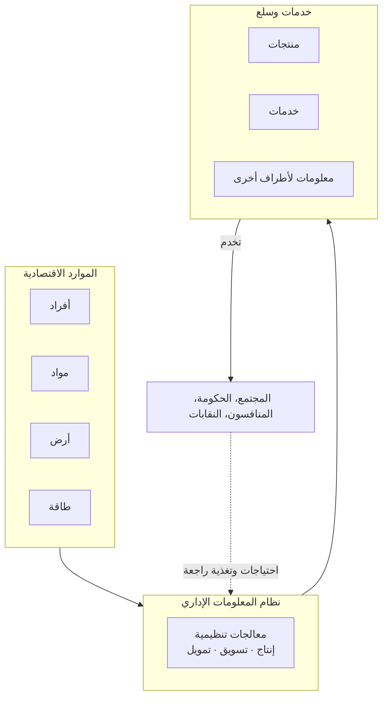
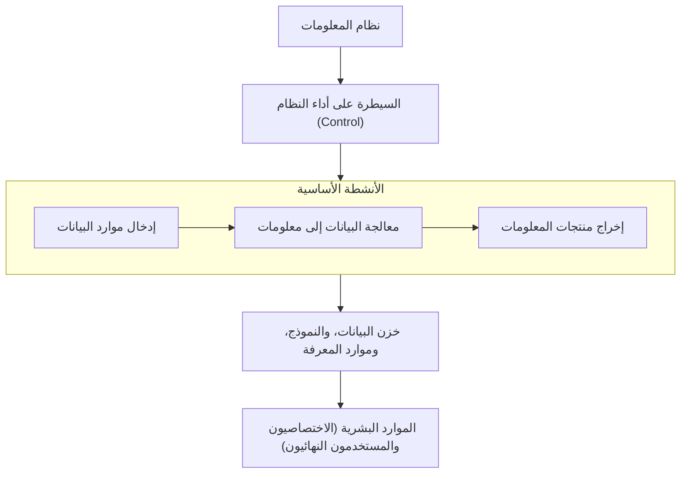

# دليل نظم المعلومات — القراءة الشاملة للمادة

> مستند واحد متصل، مرتّب حسب فصول المادة كما ألقتها الدكتورة أليدا اسبر. كل فكرة
> تحمل رقم الشريحة المصدر كرقم علوي صغير (مثال: ⁵) فوقها — ارجع للشريحة نفسها لو
> أردت التفاصيل الكاملة أو الرسم الأصلي. الأسئلة المميزة بـ 📝 هي أسئلة حقيقية وردت
> في امتحانات سابقة، ذُكرت فقط بعد التأكد أن إجابتها تطابق ما تقوله المحاضرة فعلاً.

---

## الفصل الأول — المفاهيم التأسيسية لنظام المعلومات
*(محاضرة 10/04 — الشرائح 1 إلى 21)*

نظام المعلومات (`Information System`) هو بيئة تحتوي على عدد من العناصر
المتفاعلة فيما بينها ومع محيطها، هدفها جمع البيانات ومعالجتها حاسوبياً وإنتاج
وبث المعلومات التي تحتاجها المنظمة لصناعة القرارات.² هذا التعريف
يحمل نقطة مهمة يجب فهمها منذ البداية: أي نظام — بما فيه نظام المعلومات — هو
كيان له حدود (`Boundaries`) تفصله عن محيطه، وفي أغلب الحالات هذه الحدود غير
مادية، أي غير ملموسة. حدود الشركة كنظام معلومات ليست جداراً فيزيائياً، بل خط
فاصل منطقي بين ما يقع ضمن مسؤولية النظام وما هو خارجه — وهذا بالضبط أول شيء
يحدده أي محلل عند البدء بدراسة نظام قائم.

فكرة "النظام" أوسع من نظم المعلومات وحدها. بالمعنى العام، النظام (`System`) هو
مجموعة من الأجزاء المترابطة التي تتفاعل مع البيئة ومع بعضها البعض لتحقيق هدف
ما، عن طريق قبول مدخلات وإنتاج مخرجات من خلال عملية تحويل منظم⁷ —
وينطبق هذا على أي مجال: النظام الشمسي، جسم الإنسان، أو مولد الطاقة الكهربائية،
تماماً كما ينطبق على نظام معلومات حاسوبي. وما يميز نظام المعلومات عن أي نظام
عام آخر هو نوع مدخلاته ومخرجاته تحديداً: مدخلاته بيانات، ومعالجته حسابات
وعمليات تحويل حاسوبية، ومخرجاته معلومات إدارية.

هذا التقسيم الثلاثي — مدخلات (`Input`)، معالجة (`Processing`)، مخرجات
(`Output`) — هو القالب الذي يفسّر أي نظام بغض النظر عن مجاله.⁸
المدخلات هي استحصال وتجميع ما يدخل النظام ليُعالَج (مواد خام، طاقة، بيانات،
جهود بشرية)، والمعالجة عمليات تحويلية تحوّل هذه المدخلات إلى مخرجات (عملية
تصنيعية، تنفّس الإنسان، أو حسابات على بيانات — أمثلة من مجالات مختلفة تماماً
لنفس الفكرة)، والمخرجات هي نقل نتائج هذا التحويل إلى الجهات التي تحتاجها.

يمكن رؤية هذا القالب بوضوح في أي نظام حقيقي: نظام الحاسوب مجموعة أجهزة
وبرمجيات تحت تحكم معين لمعالجة بيانات وإنتاج معلومات؛ نظام التسويق أفراد
وبضائع ومعدات وإجراءات تنتج أو توزّع بضاعة أو خدمات؛ نظام الخطوط الجوية أجهزة
وطائرات ورحلات ومسافرين لتنظيم الرحلات وخدمات الشحن؛ والنظام المصرفي موظفون
وإجراءات وعملة لتقديم خدمات إيداع وصرف وقروض ضمن لوائح مالية محددة.⁴
في كل مثال من هذه الأربعة يتكرر نفس النمط: موارد + إجراءات ← خدمة أو منتج
نهائي — وهذا بالضبط ما سنراه لاحقاً بصيغة رسمية في "موارد نظام المعلومات
الأربعة".

### مفتوح أم مغلق؟

تُصنَّف الأنظمة إلى نوعين حسب علاقتها ببيئتها.³ النظام المغلق
(`Closed System`) لا علاقة له بأي نوع من البيئة المحيطة به ويعمل بمعزل تام
عنها — لا يحتاج مدخلات ولا يُخرج شيئاً إلى الخارج ليعمل، مثل الساعة الرملية أو
الحركات التي تعمل بالبطاريات وتفاعلات كيميائية معينة. النظام المفتوح
(`Open System`) هو عكسه تماماً: يتفاعل مع بيئته ويعتمد عليها، يستقبل مدخلات
يعالجها ويُخرج معلومات كنتيجة، ويتأثر بكل العوامل الخارجية المحيطة به — جسم
الإنسان، أي نظام إداري، ونظام الحاسوب كلها أمثلة عليه. **النقطة الحاسمة لهذه
المادة:** كل أنظمة المعلومات الحاسوبية التي ندرسها مفتوحة بلا استثناء، لأنها
بطبيعتها تستقبل بيانات من بيئتها (عملاء، موظفين، معاملات) وتُخرج معلومات تؤثر
في هذه البيئة وتتأثر بها.

### من بيانات إلى معلومات

البيانات (`Data`) هي مفاهيم لغوية أو رياضية أو رمزية متفق عليها لتمثيل
الأشخاص أو الأشياء أو الأحداث، لكنها خالية من المعنى الظاهري بمفردها — كرسي،
صندوق، سيارة، أحمر، كبير، أو الرقم ٦ كلها بيانات لا تخبرك بشيء لوحدها (٦
سنوات؟ ٦ موظفين؟).⁵ ما يحوّل هذه البيانات الخام إلى شيء مفيد هو
المعالجة (`Processing`): الجمع، التصنيف، الترتيب، الترميز، الاختصار، الترجمة،
أو الجدولة — عمليات غرضها الوحيد تحويل مفاهيم لا معنى ظاهري لها إلى مفاهيم ذات
معنى تخدم صنع القرار وحل المشاكل، وهذا الناتج هو ما يُسمى المعلومات
(`Information`).⁶ والحاسوب هو أداة المعالجة المفضّلة في أي منظمة
حديثة تحديداً لأنه يعالج أحجاماً ضخمة من البيانات بسرعة عالية جداً ودقة
متناهية، بدون تعب أو ملل — ميزة لا تضاهيها أي معالجة يدوية.

لكن المعالجة وحدها لا تكفي لخلق قيمة فعلية. البيانات في العادة لا تكتسب قيمة
حقيقية إلا بعد ثلاث خطوات متتالية: أولاً معالجتها، ثم تحليل محتواها
(`Analysis`)، ثم وضعها بصورة تمكّن الإنسان من استخدامها فعلياً
(`Presentation`).¹⁰ بمعنى آخر، البيانات هي المواد الخام في مصنع،
والمعالجة والتحليل والعرض هي خطوط الإنتاج، والمعلومات هي المنتج النهائي الجاهز
للاستخدام — وقيمة نظام المعلومات كله تُقاس بجودة هذا التحويل، لا بحجم البيانات
المخزّنة. هذا بالذات ما يوضحه رسم "مفاهيم معالجة البيانات" — معالجة البيانات
ليست عملية معزولة داخل قسم الحاسوب، بل جزء من دورة اقتصادية وإدارية أكبر بكثير
تربط موارد المنظمة بمخرجاتها النهائية:⁹

**اقرأ الرسم هكذا:** الموارد الاقتصادية للمنظمة تدخل نظام المعلومات الإداري
كمدخلات، تُعالَج تنظيمياً (إنتاج/تسويق/تمويل)، وتخرج كخدمات وسلع تخدم محيطاً
أوسع بكثير من مجرد قسم الحاسوب — مجتمعاً وجهات حكومية ومنافسين، وهذا المحيط
نفسه يغذّي النظام باحتياجات وتغذية راجعة جديدة، فتكتمل الدورة.

### نموذج نظام المعلومات الكامل

كل ما سبق يتجمّع في نموذج هرمي واحد:¹¹

في قمة الهرم "نظام المعلومات"، تحته طبقة "السيطرة على أداء النظام"
(`Control`) التي تراقب كل ما يجري. في الوسط ثلاثة أنشطة متسلسلة أفقياً هي
نفسها Input/Processing/Output لكن بمسميات أدق: إدخال موارد البيانات، معالجة
البيانات إلى معلومات، إخراج منتجات المعلومات. تحت هذه الأنشطة طبقة "خزن
البيانات، والنموذج، وموارد المعرفة" — وهي ما يمنح نظام المعلومات ذاكرة (بيانات
تاريخية ونماذج يعاد استخدامها) بدل أن يكون مجرد آلة تحويل بسيطة. وقاعدة الهرم
بالكامل هي "الموارد البشرية" (الاختصاصيين والمستخدمين النهائيين) — لأنه
بدونهم لا قيمة لأي طبقة من الطبقات السابقة.

### الموارد الأربعة

هذا النموذج يُترجَم عملياً إلى تصنيف رباعي أشمل، يصف أي نظام معلومات حاسوبي
مهما كان حجمه: الماديات، والبرمجيات، والأفراد، والبيانات.¹²

**الماديات (`Hardware Resources`)** تشمل كل المعدات المادية المستخدمة في
معالجة البيانات: حاسبات كبيرة ومتوسطة ودقيقة (`Mainframes/Minicomputers/
Microcomputers`)، محطات عمل (`workstations`) بلوحات مفاتيح للإدخال وطابعات أو
أقراص للإخراج والخزن، وشبكات الاتصال التي تربط الحاسبات والمحطات ومعالجات
الاتصالات معاً لتوفير قوة حاسوبية داخل المنظمة.¹³

**البرمجيات (`Software Resources`)** لا تعني فقط البرامج التي تُشغَّل، بل
مجموعة الإيعازات التي يحتاجها الأفراد لمعالجة البيانات، وتشمل ثلاثة أنواع:
برمجيات المنظومة (`system software`) مثل نظام التشغيل الذي يدير عمليات
الحاسوب، والبرمجيات التطبيقية (`application software`) الموجّهة لاستخدام
محدد من قبل المستخدم النهائي (نظام رواتب، نظم معالجة نصوص)، والإجراءات
(`procedures`) وهي توجيهات تشغيلية مكتوبة للأفراد (تعليمات ملء استمارة،
استخدام حزمة برامج معينة).¹⁴

**الأفراد (`People Resources`)** ينقسمون لفئتين: الاختصاصيون
(`specialists`) — محللو الأنظمة، المبرمجون، ومشغلو الحاسوب — الذين يحللون
ويصممون ويشغّلون نظام المعلومات بناءً على احتياجات المستخدمين النهائيين؛
والمستخدمون النهائيون (`end users`) أنفسهم، وهم أي شخص يستخدم النظام —
مديرون، مهندسون، بائعون، عملاء — وهم أكثر فئة استخداماً للنظام
عملياً.¹⁵

**البيانات (`Data Resources`)** لم تعد تُنظر إليها كمجرد مادة خام يجب
معالجتها، بل توسّع المفهوم ليشمل قواعد البيانات وقواعد النماذج ذاتها كموارد
معرفية ثمينة للمنظمة، تماماً كالموارد المادية والبشرية الأخرى.¹⁶

### تكنولوجيا نظم المعلومات: البرمجيات

بعد فهم أن البرمجيات مورد أساسي، تفصّل المحاضرة ثلاثة أنواع منها بالتحديد.
نظام التشغيل (`Operating System — OS`) هو الجزء الأهم من برمجيات أي منظومة
حاسوبية — مجموعة كبيرة ومعقدة من البرامج، جزء منها يبقى دائماً في الذاكرة
الأولية (`Supervisor`) ليراقب كل ما يجري في الحاسوب باستمرار. أهم وظيفتين له:
إدارة العمل (`job management`) — جعل البرامج تُحمَّل للذاكرة وتُنفَّذ وتُوقَف
عند انتهائها الطبيعي أو عند حدوث خطأ — وإدارة الملفات (`file management`) —
تنظيم وتخزين واسترجاع البيانات على الذواكر الثانوية كالقرص أو الشريط، وهي
خدمة أساسية في برمجة الأعمال.¹⁷⋅¹⁸

البرامج الخدمية (`Utility Programs`) تؤدي وظائف مساندة يحتاجها العديد من
ظروف المعالجة: ترتيب ملف بيانات حسب معيار معين، نقل محتويات ذاكرة ثانوية إلى
أخرى (`Copy`)، أو برنامج التحرير (`Edit`) الذي يمكّن المستخدم من خلق ملفات
بيانات جديدة وإجراء تعديلات عليها.¹⁹

أما مترجمات اللغات (`Language Translators`) فلها أسلوبان: المترجم المسمى
`Compiler` يترجم البرنامج المصدر بأكمله دفعة واحدة إلى لغة الآلة، والبرنامج
الهدف الناتج يُحمَّل إلى الذاكرة الأولية ويُنفَّذ لاحقاً؛ أما `Interpreter`
فيترجم وينفّذ كل إيعاز في البرنامج المصدر بمفرده مباشرة. ميزة `Interpreter`
الجوهرية أنه يخبر المبرمج فوراً في حال وجود أي خطأ في أي إيعاز، بينما
`Compiler` يترجم البرنامج كاملاً أولاً.²⁰

آخر ما يبدأ به هذا الفصل هو الاتصالات (`Telecommunication`) — إرسال المعلومات
بأي صورة (صوت، بيانات، نصوص، صور) من مكان لآخر باستخدام الوسائل الإلكترونية أو
الضوئية. اتصالات البيانات تحديداً مصطلح أكثر تخصصاً: يصف عملية نقل واستلام
البيانات من خلال اتصال يربط حاسوباً واحداً أو أكثر ومعدات إدخال وإخراج
متنوعة.²¹ هذا التعريف هو المدخل لتفاصيل الشبكات وأنواعها التي
تُستكمل في الفصل التالي.

---

*(الفصل الثاني وما بعده — تكنولوجيا الاتصالات والشبكات، ثم دورة حياة تطوير
الأنظمة، ثم إدارة المشاريع، ثم GIS، ثم النمذجة بـ DFD — قيد الإعداد، سيُضاف كل
فصل بعد التحقق الكامل من شرائحه وأسئلته الحقيقية بنفس الطريقة.)*
