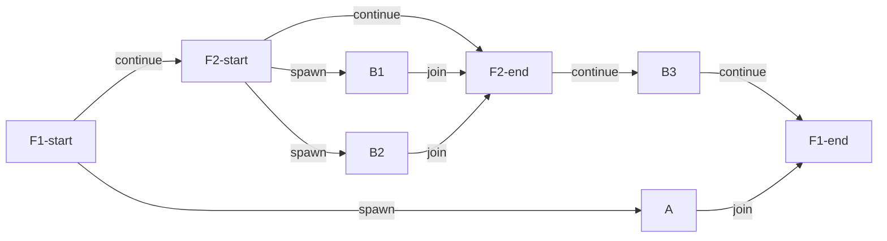
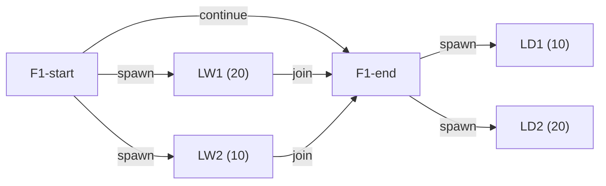
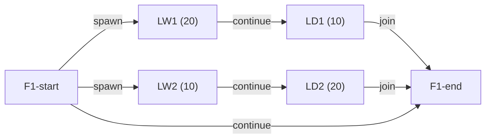

# المحاضرة 2 — Task Parallelism (التوازي بالمهام)

> **المادة:** البرمجة المتوازية والمتزامنة (نظري) | **الموضوع:** `Task Parallelism` — كيف نكسر البرنامج لمهام موازية ونحسب كفاءتها
> **الدكتور:** د. عبدو دربولي | **المصدر:** Fundamentals of Parallel Programming — Rice University

---

## الجزء الأول: ملخص منظم (اقرأ قبل المحاضرة!)

### 1. lecture_overview

هذه المحاضرة بتشرح أساسيات `Task Parallelism` — الطريقة اللي فيها نعطي البرنامج تعليمات صريحة لتشغيل مهام بنفس الوقت بدل ما تكون تسلسلية. رح تتعرف على الأدوات النظرية (`async`/`finish`) والعملية (`Fork/Join` بـ Java)، وكيف نقيس كفاءة التوازي بـ `Computation Graphs` وقوانين `Amdahl's Law`.

---

### 2. learning_objectives

بعد هذه المحاضرة ستقدر على:

- استخدام `async` و `finish` لكتابة برامج موازية
- تحويل خوارزمية تسلسلية لموازية باستخدام `Fork/Join` بـ Java
- رسم `Computation Graph` لأي برنامج موازي وتحديد المسارات المتوازية
- حساب `WORK` و `SPAN (CPL)` و `Ideal Parallelism`
- تطبيق قانون `Amdahl's Law` وتفسير نتائجه
- تحديد متى يحدث `Data Race` وكيف تتجنبه

---

### 3. prerequisites

- أساسيات Java (Classes, Methods, Loops)
- مفهوم `Thread` بنظم التشغيل (خيط تنفيذ — وحدة أصغر من البرنامج تشتغل مستقلة)
- مفهوم الخوارزمية الـ `Divide and Conquer` (قسّم وتغلّب)

---

### 4. main_concepts

| المفهوم | الوصف |
| --- | --- |
| `Task Parallelism` | تشغيل مهام مختلفة بنفس الوقت على معالجات مختلفة |
| `async` / `finish` | بنيتان للتحكم بإنشاء المهام والانتظار حتى اكتمالها |
| `Fork/Join Framework` | إطار Java لتطبيق `async`/`finish` بشكل فعلي |
| `Computation Graph (CG)` | رسم بياني يُمثّل العمليات وعلاقات الترتيب بينها |
| `WORK` و `SPAN` | مقياسان لكمية العمل الكلي وأطول مسار حرج |
| `Ideal Parallelism` | أقصى تسريع نظري = `WORK / SPAN` |
| `Multiprocessor Scheduling` | كيف يوزع المجدول المهام على المعالجات |
| `Amdahl's Law` | قانون يحدد سقف التسريع حسب نسبة الجزء التسلسلي |

---

### 5. connections

- **المحاضرة 1 (Introduction):** عرّفت لماذا نحتاج التوازي والفرق بين `Parallelism` و `Concurrency`
- **هذه المحاضرة:** تُعطيك الأدوات الأولى (`async`/`finish`) وكيف تقيس جدواها
- **المحاضرة 3 (Functional Parallelism):** ستبني على نفس الأدوات لكن بزاوية دالية
- **المحاضرة 4 (Loop Parallelism):** تطبيق متخصص للتوازي على الحلقات

---

### 6. common_mistakes

1. **الخلط بين `async` و `Thread`:** `async` أداة مفاهيمية عالية المستوى، `Thread` هو التنفيذ الفعلي — `async` ما بيعني دايماً خيط جديد
2. **نسيان `finish` بعد `async`:** لو ما حطيت `finish`، البرنامج ممكن يكمل قبل ما تخلص المهام الفرعية
3. **الخلط بين `WORK` و `SPAN`:** `WORK` = المجموع الكلي، `SPAN` = أطول مسار حرج — ما هما نفس الشي
4. **الاعتقاد أن زيادة المعالجات = زيادة غير محدودة بالسرعة:** `Amdahl's Law` يثبت إن في سقف
5. **تجاهل `Data Race`:** لو خيطين يكتبو نفس المتغير بنفس الوقت بلا تزامن، النتيجة عشوائية

---

## الجزء الثاني: الشرح التفصيلي

---

### 1. Task Parallelism — ما هو ولماذا نحتاجه؟

<!-- @render: {type: "code-first", visualization: "none", coverage: "95%"} -->
<!-- @connectivity: {prerequisite: "lecture_01", group: "1.1-1.2"} -->

#### 📍 أين نحن الآن؟

هذه المجموعة (1.1 → 1.2) هي نقطة الانطلاق — بتعرّف `Task Parallelism` وبتشرح الأدوات الأساسية `async` و `finish`.

#### ⬅️ الربط مع السابق

المحاضرة الأولى شرحت *لماذا* نحتاج التوازي (استغلال أكثر من معالج). هالمجموعة تأخذك للخطوة التالية: *كيف* تُعبّر عن التوازي بشكل برمجي.

---

#### 💡 الفكرة الأساسية

**`Task Parallelism` هو أسلوب برمجة بيحدد المبرمج فيه بشكل صريح أي خطوات تشتغل بالتوازي.**

💡 **التشبيه:** تخيل إنك عندك ورشة عمل. بالبرمجة التسلسلية، عامل وحد بيكمّل كل عمليه بالترتيب. بـ `Task Parallelism`، المبرمج نفسه يقرر "هذا الجزء يشتغل سوا مع ذاك"، متل مدير الورشة اللي يقسّم الشغل على العمال بشكل واضح.

#### 📖 الشرح

المشكلة الأساسية: المعالجات الحديثة عندها أكثر من نواة (`core`)، بس البرامج التسلسلية ما بتستفيد منها. الحل؟ نُحدد للمترجم/البيئة أي أجزاء البرنامج ممكن تشتغل بنفس الوقت.

`Task Parallelism` بيتميز عن `Data Parallelism` (محاضرة لاحقة) بأنه يركز على **تقسيم العمل المنطقي (المهام)** لا تقسيم البيانات. السؤال الجوهري هو: "أي خطوات من الخوارزمية ممكن تشتغل بالتوازي؟"

#### 🎯 الملخص السريع

- `Task Parallelism` = المبرمج يحدد ماذا يشتغل بالتوازي
- عكسه البرمجة التسلسلية: خطوة بعد خطوة
- الهدف: استغلال أكثر من معالج/نواة

#### 📄 النص الأصلي من المحاضرة

<details>
<summary>عرض النص الأصلي (coverage: 95%)</summary>

> "Task Parallelism: a style of parallel programming in which parallelism is driven by programmer-specified tasks. For an algorithm's whole steps, we parallelize steps on cores."

**ملاحظة على التغطية:**
- ✓ تم شرح "programmer-specified tasks" بالكامل
- ✓ تم شرح مفهوم التوازي على المعالجات
- ℹ️ إضافة من الدليل: التشبيه بالورشة، والمقارنة بـ `Data Parallelism`

</details>

---

### 1.1. Parallelism using Async and Finish — الأداتان الأساسيتان

<!-- @render: {type: "code-first", visualization: "none", coverage: "97%"} -->
<!-- @connectivity: {prerequisite: "section_1.0", group: "1.1-1.2"} -->

#### 💡 الفكرة الأساسية

**`async` تُنشئ مهمة فرعية تشتغل بالتوازي، و`finish` تنتظر حتى تنتهي كل المهام الفرعية التي أُنشئت داخلها.**

💡 **التشبيه:** `async` = "يا موظف، اشتغل على هذا المشروع بموازٍ وأنا بكمل شغلي"، `finish` = "لا تتقدم قبل ما الكل يخلص". وجه الشبه: `async` = إسناد مهمة، `finish` = نقطة تجمع.

---

#### 💻 الكود

```java
// T0 (Parent task) - المهمة الأم
STMT0;                          // تنفذ بالمهمة الأم
finish {                        // بلّش بلوك الانتظار
    async {
        STMT1; // T1 (Child task) - مهمة فرعية بالتوازي
    }
    STMT2; // Continue in T0 - تكمل بالمهمة الأم بالتوازي مع T1
}   // End finish - ينتظر T1 تنتهي
STMT3; // Continue in T0 - بعد ما T1 خلصت
```

#### شرح الكود سطراً بسطر

1. **STMT0:** تنفذ بالمهمة الأم `T0` قبل أي توازي
2. **`finish { ... }`:** كل ما يُنشأ داخل هذا البلوك من `async` tasks لازم يخلص قبل ما نكمل بعده
3. **`async { STMT1; }`:** يُنشئ مهمة فرعية `T1` تشتغل بالتوازي مع باقي كود `T0`
4. **STMT2:** تشتغل في `T0` بنفس الوقت اللي `T1` بتشتغل فيه
5. **نهاية `finish`:** هون `T0` بتنتظر حتى `T1` تنتهي (`join`)
6. **STMT3:** تنفذ بعد ما `T1` و `T0` (كلتيهما) أنهتا العمل داخل `finish`

#### 📖 الشرح

التفاعل بين المهمتين يشبه علاقة `fork/join`:

- **`fork`:** لما يلتقي `async`، تتفرع مهمة جديدة (T1) من الأم (T0) — كل وحدة تكمل بمسار منفصل
- **`join`:** عند نهاية `finish`، تلتقي المسارات — T0 تنتظر T1 قبل ما تكمل

نقطة مهمة: `async` ممكن تشتغل *قبل أو بعد أو بالتوازي* مع باقي كود الأم — المرجدول هو اللي بيقرر، مش المبرمج. هذا بيدي مرونة للنظام لجدولة المهام حسب الإمكانية.

كمان، `async` و `finish` يمكن تكون **متداخلة** (nested) — يعني ممكن يكون عندك `async` جوا `async`، أو `finish` جوا `finish`. هذا بيخليها قوية جداً لخوارزميات `Divide and Conquer`.

🤔 **تفعيل الفهم:** لو ما كتبنا `finish` ورجينا مباشرة لـ STMT3، إيش رح يصير؟ هل نضمن إن STMT1 خلصت؟

#### 🎯 الملخص السريع

- **`async S`:** ينشئ مهمة فرعية تنفذ `S` — يمكن تشتغل بالتوازي
- **`finish S`:** ينفذ `S` وينتظر كل `async` منشأ داخل `S` ينتهي
- يمكن تداخل `async`/`finish` بشكل اعتباطي
- نقطة `fork` = بدء `async`، نقطة `join` = نهاية `finish`

#### ⚠️ أخطاء شائعة

#### الفهم الخاطئ ❌:
كتير طلاب يظنو إن `async` بيشغل المهمة الفرعية **أولاً** قبل ما تكمل المهمة الأم، أو إنها بتشتغل بعدها.

#### الفهم الصحيح ✅:
`async` تعني "اشتغل بشكل غير متزامن" — يعني النظام حر يشغلها قبل أو بعد أو بالتوازي. الضمانة الوحيدة هي إن `finish` ما بتخلص حتى تخلص كل الـ `async` التابعة لها. المبرمج ما يفترض ترتيب تنفيذ معين بدون `finish`.

#### 📄 النص الأصلي من المحاضرة

<details>
<summary>عرض النص الأصلي (coverage: 98%)</summary>

> "async ⟨stmt1⟩ causes the parent task to create a new child task to execute the body of the async, ⟨stmt1⟩, asynchronously (i.e., before, after, or in parallel) with the remainder of the parent task."
>
> "finish ⟨stmt2⟩ causes the parent task to execute ⟨stmt2⟩, and then wait until ⟨stmt2⟩ and all async tasks created within ⟨stmt2⟩ have completed."
>
> "Async and finish constructs may be arbitrarily nested."

**ملاحظة على التغطية:**
- ✓ تم شرح `async` كاملاً مع التأكيد على "before, after, or in parallel"
- ✓ تم شرح `finish` وعلاقة الانتظار
- ✓ تم ذكر التداخل (nested)
- ℹ️ إضافة من الدليل: تشبيه fork/join، سؤال تفكير

</details>

---

### 1.2. مثال تطبيقي: حساب مجموع مصفوفة (Sequential → Parallel)

<!-- @render: {type: "code-first", visualization: "none", coverage: "96%"} -->
<!-- @connectivity: {prerequisite: "section_1.1", group: "1.1-1.2"} -->

*بعد ما فهمنا `async` و `finish`، خلينا نشوف كيف نحوّل خوارزمية تسلسلية لموازية — مثال حساب مجموع مصفوفة هو المثال الأكثر استخداماً بالمحاضرة.*

#### 💡 الفكرة الأساسية

**الخوارزمية التسلسلية بتجمع كل عناصر المصفوفة واحداً بعد واحد، بينما الموازية تقسم المصفوفة لنصفين وتجمعهما بالتوازي.**

#### 💻 الكود — النسخة التسلسلية

```java
// Algorithm 1: Sequential ArraySum
// Input: Array of numbers X
// Output: sum = sum of elements in array X
int sum = 0;
for (int i = 0; i <= X.length - 1; i++) {
    sum = sum + X[i]; // إضافة كل عنصر واحداً بعد واحد
}
return sum;
```

#### شرح الكود سطراً بسطر

1. **`sum = 0`:** تهيئة المجموع بصفر
2. **`for` loop:** تمر على كل عناصر المصفوفة بالترتيب
3. **`sum + X[i]`:** هذه العمليات **متسلسلة** — كل جمع يعتمد على نتيجة الجمع السابق
4. المشكلة: ما في شيء نوازيه هنا — كل جمع يحتاج قيمة `sum` السابقة

#### 💻 الكود — النسخة الموازية (Two-way Parallel ArraySum)

```java
// Algorithm 2: Two-way Parallel ArraySum
// Input: Array of numbers X
// Output: sum = sum of elements in array X

int sum1 = 0, sum2 = 0; // متغيران منفصلان لكل نصف

// احسب sum1 (النصف الأول) و sum2 (النصف الثاني) بالتوازي
finish {
    async {
        // Task T2 — النصف الأول من المصفوفة
        for (int i = 0; i <= X.length/2 - 1; i++) {
            sum1 = sum1 + X[i];
        }
    };
    async {
        // Task T3 — النصف الثاني من المصفوفة
        for (int i = X.length/2; i <= X.length - 1; i++) {
            sum2 = sum2 + X[i];
        }
    };
}
// T1 تنتظر T2 و T3 ينتهيان
// Continuation of T1
sum = sum1 + sum2; // الجمع النهائي بعد الانتهاء
return sum;
```

#### شرح الكود سطراً بسطر

1. **`sum1 = 0, sum2 = 0`:** متغيران منفصلان لكل نصف — مهم جداً لتجنب `Data Race`
2. **`finish { ... }`:** نقطة التزامن الكلية — T1 بتنتظر هون
3. **`async { ... T2 }` الأول:** مهمة فرعية تحسب مجموع النصف الأول [0 → n/2-1]
4. **`async { ... T3 }` الثاني:** مهمة فرعية تحسب مجموع النصف الثاني [n/2 → n-1]
5. **بعد `finish`:** ضمان إن T2 و T3 كلاهما خلصا
6. **`sum = sum1 + sum2`:** الجمع الأخير بعد ضمان اكتمال النصفين

#### 📖 الشرح

لماذا هذا يعمل بالتوازي؟ لأن T2 و T3 **مستقلتان** — كل وحدة تعمل على نصف مختلف من المصفوفة وبيكتب في متغير مختلف (`sum1` أو `sum2`). ما في بيانات مشتركة بينهما أثناء الحساب.

لماذا نستخدم `sum1` و `sum2` منفصلتين بدل `sum` واحد؟ لو كلتاهما يكتبان `sum` بنفس الوقت = `Data Race`. لما نستخدم متغيرين منفصلين، كل مهمة بتكتب في مكانها الخاص بدون تضارب.

النمط هنا هو **Parallel Divide-and-Conquer** (قسّم وتغلّب الموازي): قسّم المشكلة لأجزاء مستقلة، حلّها بالتوازي، ادمج النتائج.

🤔 **تفعيل الفهم:** لو كان عندنا 4 معالجات، كيف نعدّل الكود لنقسّم المصفوفة لـ 4 أجزاء؟

#### 🎯 الملخص السريع

- الخوارزمية التسلسلية: O(n) عمليات متسلسلة
- الموازية: تقسيم + توازي + دمج
- المفتاح: المتغيرات المنفصلة تمنع `Data Race`
- النمط: `finish { async{half1}; async{half2}; }` ثم الدمج

#### ⚠️ أخطاء شائعة

#### الفهم الخاطئ ❌:
"ممكن أستخدم `sum` واحد وكل `async` يضيف عليه بدل ما أعمل `sum1` و `sum2`"

#### الفهم الصحيح ✅:
هذا يسبب `Data Race` لأن الخيطين ممكن يقرأو قيمة `sum` القديمة قبل ما الثاني يحدّثها، فتُفقد إحدى الإضافات. دايماً اعمل متغيرات منفصلة لكل `async`، وادمج بعد `finish`.

#### 📄 النص الأصلي من المحاضرة

<details>
<summary>عرض النص الأصلي (coverage: 96%)</summary>

> "Algorithm 2: Two-way Parallel ArraySum — Compute sum1 (lower half) and sum2 (upper half) in parallel."
>
> "The whole idea behind parallel programming for multicore processors is to determine which of the sequential steps can run in parallel with each other and how the parallelism should be coordinated."
>
> "Think about calculating the sum of array of integers using divide and conquer approach."

**ملاحظة على التغطية:**
- ✓ تم شرح الخوارزمية التسلسلية والموازية
- ✓ تم شرح لماذا نستخدم متغيرين منفصلين
- ✓ تم شرح نمط `Divide and Conquer`
- ℹ️ إضافة من الدليل: التحذير من `Data Race`، سؤال التفكير

</details>

---

### 2. Tasks in Java's Fork/Join Framework

<!-- @render: {type: "code-first", visualization: "none", coverage: "95%"} -->
<!-- @connectivity: {prerequisite: "section_1.2", group: "2.1"} -->

#### 📍 أين نحن الآن؟

انتقلنا من المفاهيم النظرية (`async`/`finish`) للتطبيق الفعلي بـ Java. `Fork/Join` هو إطار العمل اللي بيترجم هذه المفاهيم لكود Java حقيقي.

#### ⬅️ الربط مع السابق

`async` = `fork()`، و `finish` = `join()` أو `invokeAll()`. إذا فهمت المجموعة السابقة، هالإطار هو مجرد تطبيق لنفس الأفكار.

---

#### 💡 الفكرة الأساسية

**`Fork/Join Framework` بـ Java يُطبّق `async`/`finish` عبر `RecursiveAction` و `fork()` و `join()`.**

💡 **التشبيه:** `RecursiveAction` هي "وصفة المهمة"، `fork()` هو "إبدأ الطبخ"، و `join()` هو "انتظر حتى يخلص الأكل".

---

#### 💻 الكود

```java
import java.util.concurrent.RecursiveAction;
import java.util.concurrent.ForkJoinPool;
import java.util.concurrent.ForkJoinTask;

// المهمة الموازية: تمتد من RecursiveAction
class ArraySumTask extends RecursiveAction {
    int[] X;
    int lo, hi;
    int result;

    ArraySumTask(int[] X, int lo, int hi) {
        this.X = X; this.lo = lo; this.hi = hi;
    }

    @Override
    protected void compute() {
        // هنا نكتب المنطق — هذا هو "جسم" المهمة
        if (hi - lo <= THRESHOLD) {
            // حالة أساسية: احسب المجموع تسلسلياً
            result = 0;
            for (int i = lo; i < hi; i++) result += X[i];
        } else {
            int mid = (lo + hi) / 2;
            ArraySumTask left = new ArraySumTask(X, lo, mid);
            ArraySumTask right = new ArraySumTask(X, mid, hi);

            // fork() = async: شغّل left بالتوازي
            // join()  = finish: انتظر left تنتهي
            ForkJoinTask.invokeAll(left, right); // fork + join سوا

            result = left.result + right.result; // الدمج بعد الانتهاء
        }
    }
}

// تشغيل المهمة
ForkJoinPool pool = new ForkJoinPool();
ArraySumTask task = new ArraySumTask(X, 0, X.length);
pool.invoke(task);
System.out.println(task.result);
```

#### شرح الكود سطراً بسطر

1. **`extends RecursiveAction`:** هذا يحدد إن المهمة "نوع Fork/Join" — بدون إرجاع قيمة (استخدم `RecursiveTask<V>` لو تحتاج إرجاع)
2. **`compute()`:** هو ما يعادل `async { ... }` — المنطق الفعلي للمهمة
3. **`left.fork()`:** = `async { left.compute() }` — ينشئ مهمة موازية لـ `left`
4. **`left.join()`:** = `finish { }` — ينتظر `left` تنتهي
5. **`ForkJoinTask.invokeAll(left, right)`:** يعمل `fork()` على كليهما ثم `join()` على كليهما — مختصر وأفضل
6. **`ForkJoinPool`:** هو "حوض الخيوط" — بيدير الخيوط الفعلية خلف الكواليس

#### 📖 الشرح

**الفرق بين `join()` و `finish`:**
- `finish` بتنتظر *كل* `async` منشأ داخلها
- `join()` بتنتظر *مهمة محددة بعينها*
- لتطبيق سلوك `finish` بالـ `Fork/Join`، لازم تستدعي `join()` على *كل* مهمة أنشأتها

**لماذا `invokeAll` أفضل من fork+join يدوياً؟**
`invokeAll(left, right)` بيعمل fork على كليهما أولاً (توازي كامل)، ثم join عليهما. لو كتبت `left.fork(); left.join(); right.fork(); right.join()` — هذا غلط لأنك بتنتظر `left` تنتهي قبل ما تبدأ `right`!

**`ForkJoinPool`:** بيدير pool من خيوط Java. لما `fork()` تُستدعى، المهمة بتُضاف لقائمة انتظار الـ pool. هذا يعني التوازي مرتبط بعدد خيوط الـ pool، مش بعدد المعالجات مباشرة.

#### 🎯 الملخص السريع

| مفهوم نظري | Java Fork/Join |
| --- | --- |
| `async { S }` | `task.fork()` |
| `finish { }` | `task.join()` (على كل task) |
| جسم `async` | `compute()` method |
| تنفيذ المهمة | `ForkJoinPool.invoke()` |
| async+finish معاً | `ForkJoinTask.invokeAll(...)` |

#### ⚠️ أخطاء شائعة

#### الفهم الخاطئ ❌:
"بكتب `left.fork(); left.join();` ثم `right.fork(); right.join();` — هذا يعمل بالتوازي"

#### الفهم الصحيح ✅:
هذا تسلسلي! الصح هو: `left.fork(); right.fork(); left.join(); right.join();` — أو `invokeAll(left, right)` المختصرة. الفكرة: اعمل fork على الكل أولاً، ثم join على الكل.

#### 📄 النص الأصلي من المحاضرة

<details>
<summary>عرض النص الأصلي (coverage: 95%)</summary>

> "In Java Fork/Join framework, a task can be specified in the compute() method of a user-defined class that extends the standard RecursiveAction class."
>
> "l.fork() creates a new task that executes L's compute() method and this implements the functionality of the async construct."
>
> "join() is a lower-level primitive than finish because join() waits for a specific task, whereas finish implicitly waits for all tasks created in its scope."
>
> "FJ tasks are executed in a ForkJoinPool, which is a pool of Java threads. This pool supports the invokeAll() method that combines both the fork and join operations."

**ملاحظة على التغطية:**
- ✓ تم شرح `RecursiveAction` و `compute()`
- ✓ تم شرح الفرق بين `join()` و `finish`
- ✓ تم شرح `ForkJoinPool` و `invokeAll()`
- ℹ️ إضافة من الدليل: كود كامل مع شرح سطري، مثال الخطأ الشائع

</details>

---

### 3. Computation Graphs — تمثيل التنفيذ بيانياً

<!-- @render: {type: "diagram-first", visualization: "flowchart", coverage: "97%"} -->
<!-- @connectivity: {prerequisite: "section_2.1", group: "3.1-3.3"} -->

#### 📍 أين نحن الآن؟

هذه المجموعة (3.1 → 3.3) تنتقل من "كيف نكتب برنامج موازي" لـ "كيف نحلله بصرياً". `Computation Graph` هو الأداة البصرية الأساسية لفهم التوازي وقياسه.

#### ⬅️ الربط مع السابق

بعد ما كتبنا `async` و `finish`، نحتاج طريقة نسأل: "أي عمليتان ممكن تشتغلا سوا؟ وأيتهما يجب أن تنتهي قبل الأخرى؟" الـ `Computation Graph` يجاوب هذا السؤال بصرياً.

---

#### 💡 الفكرة الأساسية

**`Computation Graph (CG)` هو رسم بياني موجّه لا حلقي (`DAG`) يصور الخطوات والعلاقات بينها في برنامج موازٍ.**

💡 **التشبيه:** `CG` مثل خريطة الطرق — كل دائرة (عقدة) هي مدينة، وكل سهم هو طريق اتجاه واحد. لا تقدر تسافر من مدينة B إلا بعد ما تمر بالمدينة A اللي بتسبقها.

---

#### 📊 المخطط — عناصر الـ Computation Graph

**جدول العُقد (Nodes):**

| النوع | المعنى | مثال |
| --- | --- | --- |
| عقدة عادية | خطوة حسابية بسيطة (بدون spawn/finish) | STMT1، STMT2 |
| `F-start` | بداية بلوك `finish` | بداية `finish { }` |
| `F-end` | نهاية بلوك `finish` (نقطة الانتظار) | نهاية `finish { }` |

**جدول الروابط (Edges):**

| نوع الرابط | اللون (بالمحاضرة) | المعنى |
| --- | --- | --- |
| `Continue` | أسود | الخطوة التالية داخل نفس المهمة (تسلسل) |
| `Spawn` | أخضر | المهمة الأم تُنشئ مهمة فرعية (`async`) |
| `Join` | أحمر | المهمة الفرعية تنتهي وتُبلّغ `F-end` |

---

#### 📊 المخطط — مثال من المحاضرة

للكود التالي:
```
1. finish { // F1
2.   async { A; }
3.   finish { // F2
4.     async { B1; }
5.     async { B2; }
6.   } // F2
7.   B3;
8. } // F1
```



**اقرأ المخطط كالتالي:**

1. `F1-start` → ينشئ `A` بالتوازي (spawn أخضر) وبنفس الوقت يكمل للـ `F2-start`
2. `F2-start` → ينشئ `B1` و `B2` بالتوازي ويكمل لـ `F2-end`
3. `F2-end` ينتظر `B1` و `B2` (join أحمر) قبل يكمل
4. بعد `F2-end` → `B3` ثم `F1-end`
5. `F1-end` ينتظر `A` (join أحمر)

**القاعدة الذهبية:** إذا عقدتان X و Y ما يوجد بينهما مسار موجّه بأي اتجاه، فهما يمكن أن تشتغلا بالتوازي.

في المثال أعلاه: `A` و `B1` و `B2` ما فيهم مسارات موجهة بينهم → يمكن تشتغل بالتوازي.

---

#### 📖 الشرح

**لماذا نستخدم الـ DAG (الرسم البياني الموجه اللاحلقي)؟**
- "موجّه" لأن الترتيب مهم: A قبل B مش مثل B قبل A
- "لاحلقي" لأن عقدة لا تستطيع أن تعتمد على نفسها — الاعتماد الدائري مستحيل منطقياً (A تنتظر B، B تنتظر A = `Deadlock`)
- هذه الخاصية تضمن إن البرنامج سينتهي دايماً (ما في حلقات لانهائية بالتبعية)

**الـ CG مرتبط بـ input محدد:** نفس الكود ممكن يعطي `CG` مختلف لو تغيّر الـ input (مثل حجم المصفوفة). لذا الـ `CG` يصور "تنفيذ بعينه"، مش الكود بشكل عام.

#### 🎯 الملخص السريع

- **عقدة** = خطوة تسلسلية بسيطة بدون spawn/finish
- **`Continue` edge** = تسلسل داخل مهمة واحدة
- **`Spawn` edge** = إنشاء مهمة فرعية
- **`Join` edge** = انتهاء مهمة فرعية وإبلاغ finish
- **ممكن توازي:** عقدتان بدون مسار موجه بينهما

#### 📄 النص الأصلي من المحاضرة

<details>
<summary>عرض النص الأصلي (coverage: 97%)</summary>

> "A Computation Graph (CG) captures the dynamic execution of a parallel program, for a specific input."
>
> "CG nodes are 'steps' in the program's execution — A step is a sequential subcomputation without any spawned, begin-finish or end-finish operations."
>
> "CG edges represent ordering constraints: Continue edges define sequencing of steps within a task; Spawn edges connect parent tasks to child spawned tasks; Join edges connect the end of each spawned task to its IEF's end-must finish operations."
>
> "All computation graphs must be acyclic — It is not possible for a node to depend on itself."
>
> "Key idea: If two statements, X and Y, have no path of directed edges from one to the other, then they can run in parallel with each other."

**ملاحظة على التغطية:**
- ✓ تم شرح أنواع العقد والروابط
- ✓ تم شرح خاصية اللاحلقية
- ✓ تم شرح القاعدة الذهبية للتوازي
- ℹ️ إضافة من الدليل: مخطط Mermaid تفاعلي

</details>

---

### 3.1. مثال تطبيقي: مقارنة الحلّين (Solution #1 vs Solution #2)

<!-- @render: {type: "diagram-first", visualization: "flowchart", coverage: "96%"} -->
<!-- @connectivity: {prerequisite: "section_3.0", group: "3.1-3.3"} -->

*بعد ما فهمنا الـ CG، خلينا نشوف مثالاً من المحاضرة يقارن بين طريقتين لحل نفس المشكلة — غسيل الملابس بغسالتين ومجففتين.*

#### 💡 الفكرة الأساسية

**نفس المهام ممكن تُوزَّع بطريقتين مختلفتين، وكل طريقة تعطي `Computation Graph` مختلفاً وأداءً مختلفاً.**

المشكلة: عندنا 2 غسالة و2 مجفف، نريد تشغيل حملتين من الغسيل (LW1, LW2) ثم تجفيفهما (LD1, LD2).

---

#### 📊 Solution #1 — "أنهِ كل الغسيل أولاً، ثم الجفاف"

```java
finish { // F1
    async { LW1; } // الحملة الأولى بالغسالة
    async { LW2; } // الحملة الثانية بالغسالة
} // انتظر كل الغسيل
async { LD1; } // جفّف الأولى
async { LD2; } // جفّف الثانية
```



**الأرقام = وقت التنفيذ بالدقائق**

#### 📊 Solution #2 — "كل حملة في خيط: الغسالة ثم المجفف"

```java
finish { // F1
    async { LW1; LD1; } // الحملة الأولى: غسيل ثم تجفيف
    async { LW2; LD2; } // الحملة الثانية: غسيل ثم تجفيف
}
```



#### 📖 الشرح

**المقارنة:**

| | Solution #1 | Solution #2 |
| --- | --- | --- |
| الترتيب | كل الغسيل → كل التجفيف | كل حملة = غسيل + تجفيف |
| مدة `Span` (المسار الحرج) | 20 + 20 = 40 دقيقة | 20 + 20 = 40 دقيقة |
| مرونة التوازي | تجفيف لا يبدأ حتى ينتهي كل الغسيل | التجفيف يبدأ مع غسيل الحملة الثانية |

في الواقع العملي، Solution #2 أفضل لأن المجفف يبدأ عمله مع انتهاء LW1 بينما LW2 لا تزال تعمل — هذا **pipelining** ضمني (نوضحه بمحاضرة لاحقة).

🤔 **تفعيل الفهم:** لو `LW1 = 10` و `LW2 = 20` و `LD1 = 10` و `LD2 = 20`، احسب `SPAN` لكلا الحلّين وقارن.

#### 📄 النص الأصلي من المحاضرة

<details>
<summary>عرض النص الأصلي (coverage: 96%)</summary>

> المحاضرة تقدم مثال: 2 washers, 2 dryers, 0 cost to spawn.
>
> Solution #1: `finish { async { LW1 }; async { LW2 }; }; async { LD1 }; async { LD2 };`
> Solution #2: `finish { async { LW1; LD1 }; async { LW2; LD2 }; }`
>
> "Which solution is better?"

**ملاحظة على التغطية:**
- ✓ تم تمثيل كلا الحلين بالكود والمخطط
- ✓ تم المقارنة
- ℹ️ إضافة من الدليل: تحليل pipelining الضمني

</details>

---

### 4. Complexity Measures — قياس WORK و SPAN

<!-- @render: {type: "equation-first", visualization: "none", coverage: "98%"} -->
<!-- @connectivity: {prerequisite: "section_3.1", group: "4.1-4.3"} -->

#### 📍 أين نحن الآن؟

بعد ما رسمنا الـ `CG`، الآن نقيسه بأرقام. هذه المجموعة (4.1 → 4.3) تعطيك الأدوات الحسابية لتقييم كفاءة أي برنامج موازٍ.

#### ⬅️ الربط مع السابق

الـ `CG` هو الرسم، `WORK` و `SPAN` هما القياس — بدونهما ما نقدر نقارن بين طريقتين برمجيتين رقمياً.

---

#### 💡 الفكرة الأساسية

**`WORK` هو مجموع وقت كل العمليات، و`SPAN` هو أطول مسار حرج في الرسم البياني — معاً يحددان حدود أداء البرنامج الموازي.**

💡 **التشبيه:** `WORK` = عدد الساعات الكلي اللي يشتغلها كل العمال مجتمعين. `SPAN` = أطول مهمة مسلسلة ما تقدر تقصّرها مهما أضفت عمال. وجه الشبه: مشروع فيه بعض المراحل يجب أن تنتهي قبل أن تبدأ مراحل أخرى.

---

#### 📐 التعريف الرسمي

$$\text{WORK}(G) = \sum_{N \in G} \text{TIME}(N)$$

$$\text{SPAN}(G) = \text{CPL}(G) = \text{أطول مسار في G بحيث تُجمع أوقات تنفيذ العقد في المسار}$$

**حيث:**
- `TIME(N)` = وقت تنفيذ عقدة N بمعالج واحد
- `WORK(G)` = العمل الكلي لو نفّذنا كل شيء بمعالج واحد
- `SPAN(G)` = يُسمى أيضاً `CPL` (Critical Path Length) — الحد الأدنى الزمني حتى لو عندنا معالجات لانهائية

---

#### 📖 الشرح اللفظي

**WORK (العمل الكلي):**
مجموع أوقات كل العقد في الـ `CG`. هذا يساوي وقت التنفيذ على معالج واحد: `T₁ = WORK(G)`.

**SPAN (المسار الحرج):**
أطول مسار من بداية الـ `CG` لنهايته، بحيث تُجمع أوقات العقد على المسار. هذا هو الحد الأدنى لوقت التنفيذ حتى لو عندنا معالجات لانهائية: `T∞ = SPAN(G)`.

**لماذا SPAN هو الحد الأدنى؟** لأن عمليات المسار الحرج متسلسلة — كل عملية تعتمد على السابقة. لا يمكن توازيها بأي طريقة. هذا "سقف زجاجي" للتسريع.

**مثال رقمي** (من المحاضرة، مثال حساب مجموع المصفوفة، أوقات = 10-20):
- Solution #1: `WORK = 20+10+10+20 = 60`, `SPAN = 20+20 = 40` (F1-start→LW1→...→LD1)
- Solution #2: `WORK = 20+10+10+20 = 60`, `SPAN = 20+20 = 40` (F1-start→LW1→LD1→F1-end)

#### 🎯 الملخص السريع

- `WORK` = T₁ = وقت التنفيذ على معالج واحد
- `SPAN` = T∞ = أقصر وقت ممكن بمعالجات لانهائية = المسار الحرج
- `T∞ ≤ Tₚ ≤ T₁` (وقت التنفيذ الفعلي بين الحدّين)

#### 📄 النص الأصلي من المحاضرة

<details>
<summary>عرض النص الأصلي (coverage: 98%)</summary>

> "TIME(N) = execution time of node N"
> "WORK(G) = sum of TIME(N), for all nodes N in CG G — WORK(G) is the total work to be performed in G"
> "CPL(G) = length of a longest path in CG G, when adding up execution times of all nodes in the path — Such paths are called critical paths — CPL(G) is also the shortest possible execution time for the computation graph"

**ملاحظة على التغطية:**
- ✓ تم شرح `WORK` و `SPAN/CPL` كاملاً
- ✓ تم ذكر العلاقة `T∞ ≤ Tₚ ≤ T₁`
- ℹ️ إضافة من الدليل: مثال رقمي مفصّل

</details>

---

### 4.1. Ideal Parallelism — التوازي المثالي

<!-- @render: {type: "equation-first", visualization: "none", coverage: "97%"} -->
<!-- @connectivity: {prerequisite: "section_4.0", group: "4.1-4.3"} -->

*بعد ما حسبنا `WORK` و `SPAN`، الخطوة المنطقية التالية هي: ما هو أقصى تسريع نظري يمكننا تحقيقه؟*

#### 💡 الفكرة الأساسية

**`Ideal Parallelism` = `WORK/SPAN` — هو أقصى تسريع نظري يمكن تحقيقه بعدد معالجات غير محدود.**

---

#### 📐 التعريف الرسمي

$$\text{Ideal Parallelism}(G) = \frac{\text{WORK}(G)}{\text{SPAN}(G)}$$

---

#### 📖 الشرح

`Ideal Parallelism` بتجاوب على السؤال: "لو عندي معالجات لا نهاية لها، كم مرة يمكن أن يكون برنامجي أسرع من النسخة التسلسلية؟"

**مثال من المحاضرة:**
- `WORK(G) = 26`، `SPAN(G) = 11`
- `Ideal Parallelism = 26/11 ≈ 2.36`
- هذا يعني: مهما أضفت معالجات، البرنامج لن يكون أسرع من 2.36x مقارنة بالتسلسلي

**ما الذي يُخبرنا به؟**
- `Ideal Parallelism` كبيرة (مثلاً 100) → برنامج موازٍ ممتاز، يستفيد من المعالجات
- `Ideal Parallelism` صغيرة (مثلاً 2) → المسار الحرج كبير، التوازي محدود

**ملاحظة مهمة:** `Ideal Parallelism` خاصية البرنامج فقط — لا علاقة لها بالأجهزة الفعلية. نفس الكود على أي جهاز له نفس الـ `Ideal Parallelism`.

**جواب سؤال المحاضرة** — أي CG أكثر توازياً؟

| | CG1 | CG2 |
| --- | --- | --- |
| الشكل | "عريض وقصير" — B,C,D,E بالتوازي | "طويل وضيق" — سلاسل B→D→F و C→E→G |
| `WORK` | 10 | 10 |
| `SPAN` | 7 (A→F→G→H→I→J مثلاً) | 5 (A→B→D→F→H→J) |
| `Ideal Parallelism` | 10/7 ≈ 1.43 | 10/5 = 2 |
| الأفضل؟ | ❌ | ✅ |

CG2 أفضل لأن المسار الحرج أقصر رغم إن `WORK` متساوٍ.

#### 🎯 الملخص السريع

- `Ideal Parallelism` = `WORK/SPAN` = أقصى تسريع نظري
- لا تعتمد على عدد المعالجات الفعلي
- كلما كبرت = توازي أفضل
- سقف نظري — الواقع أقل دائماً

#### 📄 النص الأصلي من المحاضرة

<details>
<summary>عرض النص الأصلي (coverage: 97%)</summary>

> "Define ideal parallelism of Computation G Graph as the ratio, WORK(G)/CPL(G)"
> "Ideal Parallelism only depends on the computation graph, and is the speedup that you can obtain with an unbounded number of processors"
> "Example: WORK(G) = 26, CPL(G) = 11, Ideal Parallelism = WORK(G)/CPL(G) = 26/11 ≈ 2.36"

**ملاحظة على التغطية:**
- ✓ تم شرح الصيغة
- ✓ تم شرح المثال الرقمي
- ✓ تم الإجابة على سؤال "أي CG أفضل"
- ℹ️ إضافة من الدليل: مقارنة CG1 vs CG2 بأرقام

</details>

---

### 5. Data Races — التسابق على البيانات

<!-- @render: {type: "code-first", visualization: "none", coverage: "97%"} -->
<!-- @connectivity: {prerequisite: "section_3.0", group: "5.1"} -->

#### 📍 أين نحن الآن؟

بعد ما فهمنا كيف نكتب برامج موازية ونحللها، لازم نفهم أخطر خطأ ممكن يقع فيه: `Data Race`. هذا القسم "الجرس التحذيري" قبل ما نبدأ بالتطبيق الفعلي.

#### ⬅️ الربط مع السابق

عندما يُوجد مسار موجه بين عقدتين في الـ `CG`، فإن ترتيبهما مضمون. `Data Race` يحدث عندما عقدتان بلا مسار بينهما (يعني تشتغلان بالتوازي) ويحاول إحداهما الكتابة على نفس الموقع الذي يقرأه أو يكتب فيه الآخر.

---

#### 💡 الفكرة الأساسية

**`Data Race` يحدث لما عمليتان موازيتان تصلان لنفس الموقع وإحداهما على الأقل تكتب فيه — النتيجة عندها غير محددة.**

💡 **التشبيه:** خيطان يحاولان تعديل نفس الورقة في نفس الوقت. وحد محا ما كتبه الثاني قبل ما يُقرأ — لا تعرف ما ستجد على الورقة. وجه الشبه: `Data Race` = تضارب في الكتابة، النتيجة عشوائية.

---

#### 💻 الكود — مثال Data Race

```java
// Thread A                    // Thread B
// كلاهما يعمل بنفس الوقت
counter++;                     counter++;
// النتيجة المتوقعة: counter + 2
// النتيجة الفعلية الممكنة: counter + 1 (Race Condition!)
```

**لماذا؟** `counter++` في الواقع ثلاث عمليات:
1. اقرأ قيمة `counter` (مثلاً 5)
2. أضف 1 → (6)
3. اكتب 6 في `counter`

لو الخيطان نفذا الخطوة 1 في نفس الوقت قبل أي منهما ينفذ الخطوة 3، كلاهما قرأ 5، كلاهما حسب 6، وكلاهما كتب 6 — رغم أن النتيجة يجب أن تكون 7!

---

#### 📖 الشرح — التعريف الرسمي

`Data Race` يحدث على موقع L في برنامج موازٍ بـ `CG` إذا وجدت خطوتان S1 و S2 بحيث:

1. **S1 لا تعتمد على S2 والعكس** — يعني لا يوجد مسار موجه بينهما → يمكنهما الاشتغال بالتوازي
2. **كلتاهما تقرأ أو تكتب L، وعلى الأقل إحداهما تكتب**

**الأنواع الثلاثة:**
- **Write-Read:** S1 تكتب، S2 تقرأ → S2 قد تقرأ القيمة القديمة أو الجديدة
- **Write-Write:** كلاهما يكتبان → قيمة واحدة فقط ستبقى، لا نعرف أيهما
- **Read-Write:** S1 تقرأ، S2 تكتب → S1 قد تقرأ قبل أو بعد كتابة S2

**حتى لو الكتابة نفسها!** مثال: S1 و S2 كلاهما يكتبان القيمة ذاتها في L — هذا لا يزال `Data Race` بالتعريف، حتى لو النتيجة "عملياً صحيحة" (`benign race`). السبب: عدم الاتساق يعتمد على تفاصيل المترجم والمعالج.

---

#### ⚠️ أخطاء شائعة

#### الفهم الخاطئ ❌:
"`Data Race` يعني البرنامج سيتوقف (Crash) — لو البرنامج اشتغل، ما في مشكلة"

#### الفهم الصحيح ✅:
`Data Race` بالغالب لا يوقف البرنامج — البرنامج يُكمل لكن **بنتيجة خاطئة**. هذا أخطر لأنه صعب الاكتشاف. البرنامج يعطيك 6 بدل 7 وأنت لا تعرف ليش!

---

#### الفهم الخاطئ ❌:
"`Data Race` = `Deadlock`"

#### الفهم الصحيح ✅:
`Data Race` = البرنامج يكمل لكن بنتيجة عشوائية. `Deadlock` = البرنامج يتوقف كلياً (موضوع محاضرات لاحقة). السؤال الفاصل: هل البرنامج توقف؟ لو نعم → قد يكون `Deadlock`. لو كمل بنتيجة غريبة → قد يكون `Data Race`.

---

#### 📄 النص الأصلي من المحاضرة

<details>
<summary>عرض النص الأصلي (coverage: 97%)</summary>

> "A data race occurs on location L in a program execution with computation graph CG if there exist steps (nodes) S1 and S2 in CG such that:
> 1. S1 does not depend on S2 and S2 does not depend on S1, i.e., S1 and S2 can potentially execute in parallel, and
> 2. Both S1 and S2 read or write L, and at least one of the accesses is a write."
>
> "A data-race is usually considered an error. The result of a read operation in a data race is undefined."
>
> "Note that our definition of data race includes the case that both S1 and S2 write the same value in location L, even if the data race is benign."

**ملاحظة على التغطية:**
- ✓ تم شرح الشرطين اللازمين للـ Data Race
- ✓ تم التمييز عن Deadlock
- ✓ تم ذكر الـ benign race
- ℹ️ إضافة من الدليل: مثال counter++ مفصّل

</details>

---

### 6. Multiprocessor Scheduling and Parallel Speedup

<!-- @render: {type: "equation-first", visualization: "none", coverage: "96%"} -->
<!-- @connectivity: {prerequisite: "section_4.1", group: "6.1-6.2"} -->

#### 📍 أين نحن الآن؟

هذه المجموعة (6.1 → 6.2) تربط النظري بالعملي: كيف يُجدوَل تنفيذ الـ `CG` على معالجات حقيقية، وكيف نقيس التسريع الفعلي.

#### ⬅️ الربط مع السابق

عرفنا `WORK` و `SPAN` كحدّين نظريين. الآن نسأل: ما الذي يحدث فعلاً على P معالجات؟

---

#### 💡 الفكرة الأساسية

**`Tₚ` هو وقت التنفيذ على P معالجات، وهو محصور دائماً بين `T∞` (SPAN) و `T₁` (WORK).**

---

#### 📐 الصيغ الأساسية

$$T_\infty \leq T_P \leq T_1$$

$$\text{Speedup}(P) = \frac{T_1}{T_P}$$

$$\text{Speedup}(P) \leq P \quad \text{(لا يتجاوز عدد المعالجات)}$$

$$\text{Speedup}(P) \leq \frac{\text{WORK}}{\text{SPAN}} \quad \text{(لا يتجاوز التوازي المثالي)}$$

$$\text{Efficiency}(P) = \frac{\text{Speedup}(P)}{P} = \frac{T_1}{P \times T_P}$$

---

#### 📖 الشرح اللفظي

**الجدول الزمني القانوني (Legal Schedule):**
جدول يُراعي تبعيات الـ `CG`: لكل حافة موجهة (A→B)، لا يُجدوَل B إلا بعد اكتمال A.

**الجدول الجشع (Greedy Schedule):**
المُجدول لا يسمح للمعالج بالخمول (Idle) إذا كانت توجد مهمة جاهزة. هذا هو السلوك الافتراضي لـ `ForkJoinPool`.

**مثال من المحاضرة** (من الصورة):
- `T₁ = WORK = 16`، `T∞ = SPAN = 12`
- على P=2: جدول #1 → `T₂ = 14`، جدول #2 → `T₂ = 12`
- `Speedup` لجدول #2: 16/12 ≈ 1.33

**Efficiency:**
"كفاءة المعالجات" — كم من 100% بيُستغل فعلاً؟
- `Efficiency = 1` (100%) → مثالي، كل معالج مشغول دايماً
- `Efficiency < 1` → بعض المعالجات خاملة أحياناً
- لا يمكن أن تتجاوز 1 بلا overhead (وللجداول المثالية: `1/P ≤ Efficiency ≤ 1`)

#### 🎯 الملخص السريع

| الرمز | المعنى |
| --- | --- |
| `T₁` | WORK — وقت التنفيذ على معالج واحد |
| `T∞` | SPAN — وقت التنفيذ مع معالجات لا نهائية |
| `Tₚ` | وقت التنفيذ الفعلي على P معالجات |
| `Speedup(P)` | `T₁/Tₚ` — كم مرة أسرع من التسلسلي |
| `Efficiency(P)` | `Speedup/P` — كفاءة استخدام المعالجات |

#### 📄 النص الأصلي من المحاضرة

<details>
<summary>عرض النص الأصلي (coverage: 96%)</summary>

> "A legal schedule is one that obeys the dependence constraints in the CG."
> "We will restrict our attention to schedules that have no unforced idleness — Such schedules are also referred to as 'greedy' schedules."
> "We define Tₚ as the execution time of a CG on P processors, and observe that: T∞ ≤ Tₚ ≤ T₁"
> "Speedup(P) = T₁/Tₚ must be ≤ P and also ≤ WORK/SPAN"
> "Define Efficiency(P) = Speedup(P)/P = T₁/(P×Tₚ)"

**ملاحظة على التغطية:**
- ✓ تم شرح الجدول القانوني والجشع
- ✓ تم شرح حدود Tₚ
- ✓ تم شرح Speedup و Efficiency
- ℹ️ إضافة من الدليل: جدول ملخص بالرموز

</details>

---

### 7. Amdahl's Law — قانون أمدال

<!-- @render: {type: "equation-first", visualization: "none", coverage: "98%"} -->
<!-- @connectivity: {prerequisite: "section_6.1", group: "7.1"} -->

#### 📍 أين نحن الآن؟

هذا القسم هو "الدرس الأكبر" بالمحاضرة — قانون يحدد سقف التسريع بناءً على النسبة التسلسلية بالبرنامج.

#### ⬅️ الربط مع السابق

عرفنا إن `Speedup ≤ WORK/SPAN`. `Amdahl's Law` يُعيد صياغة هذا بلغة أوضح: "الجزء التسلسلي قيد غير قابل للكسر".

---

#### 💡 الفكرة الأساسية

**قانون أمدال يقول: لو `q` هي نسبة `WORK` التي يجب تنفيذها تسلسلياً، فإن أقصى تسريع ممكن بأي عدد من المعالجات هو `1/q`.**

💡 **التشبيه:** تخيل إنك بتنظّم حفلة — 90% من الاستعدادات يمكن أن تتم بالتوازي (تنظيف + طبخ + ديكور)، لكن 10% يجب أن تتم تسلسلياً (الاستقبال لازم يكون بعد ما كل شيء جاهز). مهما أضفت مساعدين، لن تتجاوز سرعة `1/0.1 = 10x`.

---

#### 📐 التعريف الرسمي

$$\text{Speedup}(P) = \frac{T_1}{T_n} = \frac{1}{\frac{F_{parallel}}{n} + (1 - F_{parallel})} = \frac{1}{\frac{F_{parallel}}{n} + F_{sequential}}$$

**الحد الأعلى:**

$$\text{Speedup}(P) \leq \frac{1}{q}$$

**حيث:**
- `q` = نسبة `WORK` التي يجب تنفيذها تسلسلياً (= `Fsequential`)
- `Fparallel` = نسبة الكود القابلة للتوازي = `1 - q`
- `n` = عدد المعالجات

---

#### 📖 الشرح

**لماذا هذا القانون صحيح؟**

إذا كان `q` من `WORK(G)` يجب أن يُنفَّذ تسلسلياً، فإن:

$$\text{SPAN}(G) \geq q \times \text{WORK}(G)$$

وبالتالي:

$$\text{Speedup}(P) = \frac{T_1}{T_P} \leq \frac{\text{WORK}(G)}{\text{SPAN}(G)} \leq \frac{\text{WORK}(G)}{q \times \text{WORK}(G)} = \frac{1}{q}$$

**أمثلة رقمية:**

| الجزء التسلسلي q | أقصى تسريع 1/q |
| --- | --- |
| 50% (0.5) | 2x |
| 25% (0.25) | 4x |
| 10% (0.1) | 10x |
| 5% (0.05) | 20x |
| 1% (0.01) | 100x |

**الدرس:** حتى لو 1% فقط من البرنامج تسلسلي، لن تتجاوز سرعتك 100x — مهما كان عندك من معالجات!

**الشكل البياني من المحاضرة:**
يُظهر الرسم البياني إن الـ Speedup يتشبع بسرعة بدون أن يرتفع بشكل خطي — زيادة المعالجات من 64 إلى 1024 ما تُعطي نفس الزيادة بالسرعة.

#### ملاحظة:
هذا الموضوع موضح بـ **رسم بياني** في المحاضرة الأصلية (صفحة "Illustration of Amdahl's Law"). راجع الملف الأصلي للرسم التفصيلي الذي يُظهر Speedup بدالة عدد المعالجات لنسب متوازية مختلفة (50%, 75%, 90%, 95%).

#### 🎯 الملخص السريع

- `q` = نسبة العمل التسلسلي الإجباري
- أقصى تسريع = `1/q`
- المعالجات الإضافية لا تساعد في الجزء التسلسلي
- استراتيجية التحسين: قلّل `q` قدر الإمكان

#### 📚 التطبيق

قانون أمدال يُستخدم لتقييم "هل يستحق التوازي الاستثمار؟" — لو 50% من الكود تسلسلي، مهما ضخّمت الجهاز، أقصى تحسين هو 2x فقط.

#### ⚠️ أخطاء شائعة

#### الفهم الخاطئ ❌:
"لو عندي 8 معالجات، رح يشتغل 8 مرات أسرع"

#### الفهم الصحيح ✅:
هذا صحيح فقط لو `q = 0` (لا يوجد كود تسلسلي إطلاقاً) — غير ممكن عملياً. دايماً في جزء تسلسلي (إدخال بيانات، تهيئة متغيرات، طباعة نتائج). الـ `Speedup` الفعلي دائماً أقل من عدد المعالجات.

#### 📄 النص الأصلي من المحاضرة

<details>
<summary>عرض النص الأصلي (coverage: 98%)</summary>

> "A simple observation made by Gene Amdahl in 1967: if q ≤ 1 is the fraction of WORK in a parallel program that must be executed sequentially, then the best speedup that can be obtained for that program for any number of processors, P, is Speedup(P) ≤ 1/q."
>
> "If fraction q of WORK(G) is sequential, it must be the case that SPAN(G) ≥ q × WORK(G)"
>
> "Therefore, Speedup(P) = T₁/Tₚ must be ≤ WORK(G)/(q × WORK(G)) = 1/q"

**ملاحظة على التغطية:**
- ✓ تم شرح القانون بصيغتيه (نسبة الجزء التسلسلي و الموازي)
- ✓ تم شرح الإثبات الرياضي
- ✓ تم إعطاء جدول أمثلة رقمية
- ℹ️ إضافة من الدليل: جدول q → max speedup، تشبيه الحفلة

</details>

---

## الجزء الثاني (تكملة): الملخص الشامل

---

خلّينا نرجع للنقطة الجوهرية اللي هالمحاضرة كلها بتدور حولها: عندما يكون عندك برنامج بطيء، والسبب هو إنه بيشتغل خطوة بعد خطوة رغم إن عندك معالجات متعددة، كيف تحلّ هذه المشكلة؟ الجواب هو `Task Parallelism`.

`Task Parallelism` مو سحر — المبرمج هو اللي يقرر أي أجزاء من الكود تشتغل بالتوازي وأيها يجب أن تكون تسلسلية. الأداتان الأساسيتان لهذا هما `async` و `finish`. تخيل `async` كأنك تعطي موظفاً مهمة وتقول له "اشتغل عليها وأنا رح أكمل شغلي"، و `finish` كأنك تقف عند نقطة التجمع وتنتظر كل الموظفين يرجعوا قبل ما تكمل. الجميل هو إن `async` ممكن تشتغل قبل أو بعد أو بالتوازي مع الكود اللي بعدها — النظام حر يقرر، والضمانة الوحيدة إن `finish` ما تخلص حتى تخلص كل الـ `async` التابعة لها.

لما تنزل من المفاهيم النظرية للكود الفعلي، `Fork/Join Framework` بـ Java هو الجسر. `fork()` = `async`، و `join()` = `finish` لكن لمهمة محددة. الخدعة الأكثر شيوعاً في الأخطاء: لو كتبت `left.fork(); left.join(); right.fork();` — أنت في الواقع تسلسلي مش موازي! الصح هو تعمل fork على الكل أولاً، ثم join على الكل — أو تستخدم `invokeAll()` المختصرة.

الآن بعد ما كتبت الكود الموازي، كيف تحلله؟ هنا يجي `Computation Graph`. تخيله خريطة طرق للتنفيذ — كل دائرة (عقدة) هي خطوة حسابية بسيطة، والأسهم (حوافة) تمثل قيوداً: إما "استمرار داخل نفس المهمة" (Continue)، أو "إنشاء مهمة فرعية" (Spawn)، أو "انتهاء مهمة فرعية" (Join). القاعدة الذهبية: إذا عقدتان بلا مسار موجه بينهما، تستطيعان الاشتغال بالتوازي. هذا ما يحدد التوازي الحقيقي في برنامجك.

بعد رسم الـ `CG`، نقيسه. `WORK` هو مجموع أوقات كل العقد — وهذا يساوي `T₁` (وقت التنفيذ على معالج واحد). `SPAN` هو أطول مسار من البداية للنهاية — وهذا يساوي `T∞` (الحد الأدنى لوقت التنفيذ مهما كثرت المعالجات). لماذا `SPAN` هو الحد الأدنى؟ لأن عمليات المسار الحرج متسلسلة بطبيعتها — الثانية تعتمد على الأولى، لا يمكن توازيها.

من `WORK` و `SPAN` نشتق `Ideal Parallelism` = `WORK/SPAN`. هذا يجيب: "لو عندي معالجات لا نهاية لها، كم مرة يمكن أن يكون برنامجي أسرع؟". `Ideal Parallelism = 2.36` يعني: مهما أضفت معالجات، لن تتجاوز 2.36x من النسخة التسلسلية. لماذا؟ لأن المسار الحرج سيظل موجوداً دائماً.

لكن التوازي يأتي بخطر: `Data Race`. تخيل خيطين يحاولان تعديل نفس المتغير `counter` بنفس اللحظة. `counter++` في الواقع ثلاث عمليات (اقرأ، زد، اكتب). لو الخيطان قرآ القيمة القديمة قبل أي منهما يكتب، ستُضاع إحدى الإضافتين. والأخطر: البرنامج لن يتوقف ولن يرمي exception — سيكمل بنتيجة خاطئة بهدوء. `Data Race` = يشتغل لكن يكذب في النتيجة.

على المستوى العملي، وقت التنفيذ الفعلي `Tₚ` (على P معالجات) محصور دائماً: `T∞ ≤ Tₚ ≤ T₁`. الـ `Speedup(P) = T₁/Tₚ` لا يتجاوز عدد المعالجات P، ولا يتجاوز `Ideal Parallelism`. الـ `Efficiency(P) = Speedup/P` تقيس كم من طاقة المعالجات تُستغل فعلاً — 100% مثالي، وفي الواقع دائماً أقل.

وهنا يأتي الدرس الأكبر بالمحاضرة: **قانون أمدال**. يقول جين أمدال عام 1967: لو `q` هي نسبة الكود الذي يجب تنفيذه تسلسلياً، فأقصى تسريع ممكن هو `1/q` — بغض النظر عن عدد المعالجات. لماذا؟ لأن الجزء التسلسلي لا يمكن توازيه بأي شكل — إذا كان `SPAN ≥ q × WORK`، فإن `Speedup ≤ WORK/SPAN ≤ 1/q`. 50% كود تسلسلي → أقصى تسريع 2x. 10% فقط تسلسلي → أقصى 10x. والمذهل: حتى لو 1% فقط تسلسلي، السقف هو 100x — مهما بلغ عدد معالجاتك.

هذا القانون يُغيّر طريقة تفكيرك: قبل ما تشتري خوادم أكثر، اسأل: "كم نسبة الكود التسلسلي في برنامجي؟" لو الجواب 50%، زيادة المعالجات من 4 إلى 1000 لن تغير شيئاً يُذكر بعد حد معين.

---

#### الفهم الخاطئ ❌:
"زيادة المعالجات تسرّع البرنامج دائماً بشكل خطي"

#### الفهم الصحيح ✅:
التسريع له سقف = `1/q` حيث `q` هي نسبة الجزء التسلسلي. بعد نقطة معينة، إضافة معالجات لا تُحسّن الأداء.

---

#### الفهم الخاطئ ❌:
"`Ideal Parallelism` هو عدد المعالجات الذي يجب استخدامه"

#### الفهم الصحيح ✅:
`Ideal Parallelism` هو أقصى تسريع نظري بمعالجات لا نهائية — ليس توصية بعدد المعالجات. بعد ما يتجاوز عدد المعالجات الـ `Ideal Parallelism`، لا يوجد فائدة من إضافة المزيد.

---

**ما يطلع بالامتحان:** احسب `WORK` و `SPAN` لـ `CG` معطى، احسب `Ideal Parallelism`، وطبّق `Amdahl's Law` لإيجاد أقصى تسريع.

**الربط مع المحاضرة الجاية:** `Functional Parallelism` ستبني على نفس `async`/`finish` لكن بنمط برمجي أنظف — `Future` و `Memoization`.

---

## الجزء الثالث: أسئلة اختيار من متعدد (MCQ)

---

### السؤال 1 (medium)

**السؤال:** ما الفرق الجوهري بين `async` و `finish` في `Task Parallelism`؟

أ) `async` يُنشئ مهمة فرعية جديدة، و`finish` يُنهي البرنامج كلياً

ب) `async` يُنشئ مهمة فرعية تشتغل بالتوازي، و`finish` ينتظر كل المهام التابعة حتى تنتهي

ج) `async` و`finish` نفس الشيء، فقط اختلاف في الاسم

د) `finish` يُنشئ المهمة، و`async` يُوقفها

**الإجابة الصحيحة:** ب

**التعليل الكامل:**
- ❌ أ) `finish` لا ينهي البرنامج — ينتظر فقط المهام المحددة داخله ثم يكمل
- ✅ ب) هذا بالضبط دور كل منهما — `async` = fork، `finish` = join
- ❌ ج) هما مختلفان جوهرياً في الوظيفة — الخلط بينهما بيسبب أخطاء برمجية
- ❌ د) العكس — `async` هو اللي يُنشئ، و`finish` هو نقطة الانتظار

---

### السؤال 2 (medium)

**السؤال:** في `Fork/Join Framework` بـ Java، ما المكافئ لـ`finish` من حيث الوظيفة؟

أ) استدعاء `fork()` على كل مهمة

ب) استدعاء `join()` على مهمة محددة فقط

ج) استدعاء `join()` على كل مهمة تم إنشاؤها داخل نطاق `finish`

د) استدعاء `invoke()` على الـ`ForkJoinPool`

**الإجابة الصحيحة:** ج

**التعليل الكامل:**
- ❌ أ) `fork()` مكافئ `async`، مش `finish`
- ❌ ب) `join()` على مهمة واحدة بيختلف عن `finish` اللي ينتظر الكل
- ✅ ج) لتطبيق `finish`، لازم تستدعي `join()` على كل مهمة أُنشئت داخل نطاق `finish` — المحاضرة تقول: "join() waits for a specific task, whereas finish implicitly waits for all tasks"
- ❌ د) `invoke()` هو لتشغيل المهمة الجذرية، مش لتطبيق `finish`

---

### السؤال 3 (hard) — سيناريو كود

**السؤال:** بالكود التالي:

```java
// في داخل compute():
ArraySumTask left = new ArraySumTask(X, lo, mid);
ArraySumTask right = new ArraySumTask(X, mid, hi);
left.fork();
left.join();
right.fork();
right.join();
```

أي من التالي يصف سلوك هذا الكود تحديداً؟

أ) `left` و`right` تشتغلان بالتوازي بشكل صحيح

ب) `left` تنتهي قبل ما تبدأ `right`، وهذا تسلسلي وليس موازياً

ج) الكود يرمي `RuntimeException` لأن `fork()` و`join()` لا يمكن استدعاؤهما بالتتالي

د) `right` تُنفَّذ قبل `left` بسبب ترتيب `fork()`

**الإجابة الصحيحة:** ب

**التعليل الكامل:**
- ❌ أ) هذا هو الفهم الخاطئ الشائع — الكود يبدو "موازياً" بس هو تسلسلي فعلياً
- ✅ ب) `left.fork()` يبدأ left، ثم `left.join()` ينتظر حتى left تنتهي — فقط بعدها تبدأ right. الصح: `left.fork(); right.fork(); left.join(); right.join();` أو `invokeAll(left, right)`
- ❌ ج) لا يوجد exception — الكود يعمل بدون أخطاء لكن بشكل تسلسلي
- ❌ د) `right` لا تبدأ حتى `left.join()` تنتهي

---

### السؤال 4 (hard) — حسابي

**السؤال:** برنامج موازٍ عنده `WORK = 100` وحدة، و`SPAN = 20` وحدة. ما هو الـ`Ideal Parallelism`؟

أ) 2

ب) 5

ج) 20

د) 100

**الإجابة الصحيحة:** ب

**التعليل الكامل:**
- الصيغة: `Ideal Parallelism = WORK / SPAN = 100 / 20 = 5`
- ❌ أ) هذا لو `SPAN = 50` أو `WORK = 40`
- ✅ ب) `100/20 = 5` — يعني أقصى تسريع نظري هو 5x بمعالجات لا نهائية
- ❌ ج) هذا لو `WORK/SPAN = 20/1` — خطأ حسابي بقلب القسمة
- ❌ د) هذا الـ`WORK` نفسه، مش الـ`Ideal Parallelism`

---

### السؤال 5 (hard) — حسابي

**السؤال:** لو نسبة الجزء التسلسلي في برنامج هي `q = 0.2` (20%)، ما أقصى `Speedup` ممكن حسب قانون `Amdahl's Law`؟

أ) 2

ب) 4

ج) 5

د) 10

**الإجابة الصحيحة:** ج

**التعليل الكامل:**
- الصيغة: `Max Speedup = 1/q = 1/0.2 = 5`
- ❌ أ) يقابل `q = 0.5` (50% تسلسلي)
- ❌ ب) يقابل `q = 0.25` (25% تسلسلي)
- ✅ ج) `1/0.2 = 5` — مهما كان عدد المعالجات، التسريع لن يتجاوز 5x
- ❌ د) يقابل `q = 0.1` (10% تسلسلي)

---

### السؤال 6 (medium)

**السؤال:** ما هو `SPAN (CPL)` لرسم بياني `CG`؟

أ) مجموع أوقات تنفيذ جميع العقد في الرسم

ب) أقل عدد معالجات يمكن استخدامها لتنفيذ البرنامج

ج) طول أطول مسار في الـ`CG` بإضافة أوقات تنفيذ عقده

د) متوسط وقت تنفيذ جميع العقد

**الإجابة الصحيحة:** ج

**التعليل الكامل:**
- ❌ أ) هذا تعريف `WORK`، مش `SPAN`
- ❌ ب) `SPAN` لا يتعلق بعدد المعالجات مباشرة
- ✅ ج) التعريف الدقيق: `CPL(G) = length of a longest path in CG G, when adding up execution times of all nodes in the path`
- ❌ د) المتوسط مفهوم إحصائي، لا علاقة له بـ`SPAN`

---

### السؤال 7 (hard) — مقارنة

**السؤال:** الفرق بين `Data Race` و`Deadlock` هو:

أ) لا فرق — كلاهما يسببان توقف البرنامج

ب) `Data Race` يُوقف البرنامج، بينما `Deadlock` يُكمّله بنتيجة خاطئة

ج) `Data Race` يُكمّل البرنامج بنتيجة غير محددة، بينما `Deadlock` يُوقفه كلياً

د) `Data Race` يصير فقط مع `synchronized`، بينما `Deadlock` يصير بدونها

**الإجابة الصحيحة:** ج

**التعليل الكامل:**
- ❌ أ) كلاهما مختلفان جوهرياً بالسلوك
- ❌ ب) العكس هو الصحيح — `Data Race` يكمل بنتيجة خاطئة، `Deadlock` يوقف
- ✅ ج) `Data Race`: خيطان يصلان بيانات مشتركة بلا تزامن → نتيجة عشوائية لكن البرنامج "يكمل". `Deadlock`: خيوط تنتظر بعضها للأبد → توقف تام
- ❌ د) `Data Race` يصير بالضبط عندما لا تستخدم `synchronized` — العكس صحيح

---

### السؤال 8 (hard) — سيناريو كود

**السؤال:** بالكود التالي:

```java
int sum = 0;
finish {
    async { for (int i = 0; i < n/2; i++) sum += X[i]; };
    async { for (int i = n/2; i < n; i++) sum += X[i]; };
}
```

أي من التالي يصف المشكلة الأساسية في هذا الكود؟

أ) ما في مشكلة، الكود صحيح ويعطي المجموع الصحيح دايماً

ب) يوجد `Data Race` على المتغير `sum` لأن كلا الـ`async` يكتبان عليه بالتوازي

ج) الـ`finish` زائد ولا لزوم له في هذا الكود

د) الكود سيسبب `Deadlock` لأن المهمتين تنتظران بعضهما

**الإجابة الصحيحة:** ب

**التعليل الكامل:**
- ❌ أ) النتيجة ليست صحيحة دايماً — `Data Race` يجعلها غير محددة
- ✅ ب) كلا الـ`async` يقرآن ويكتبان `sum` بنفس الوقت — `sum += X[i]` = اقرأ `sum`، أضف، اكتب — لو الاثنان قرآ القيمة القديمة قبل أي منهما يكتب، تُفقد إحدى الإضافات. الحل: استخدام `sum1` و `sum2` منفصلتين
- ❌ ج) `finish` ضروري لضمان انتهاء المهمتين قبل إرجاع النتيجة
- ❌ د) لا يوجد `Deadlock` هنا — لا توجد عمليات انتظار متبادلة بين المهمتين

---

### السؤال 9 (medium) — تتبع خوارزمية

**السؤال:** في `Computation Graph`، متى يمكن لعقدتين X و Y أن تشتغلا بالتوازي؟

أ) عندما يوجد حافة `Continue` من X إلى Y

ب) عندما لا يوجد أي مسار موجه من X إلى Y أو من Y إلى X

ج) عندما يوجد حافة `Spawn` من X إلى Y

د) عندما تنتميان لنفس مهمة `async`

**الإجابة الصحيحة:** ب

**التعليل الكامل:**
- ❌ أ) حافة `Continue` تعني X يجب أن ينتهي قبل Y — لا توازي
- ✅ ب) هذه القاعدة الذهبية من المحاضرة: "If two statements, X and Y, have no path of directed edges from one to the other, then they can run in parallel"
- ❌ ج) حافة `Spawn` من X إلى Y تعني X أنشأ Y — وجود علاقة تبعية
- ❌ د) نفس المهمة = تنفيذ تسلسلي داخل تلك المهمة

---

### السؤال 10 (hard) — حسابي

**السؤال:** برنامج عنده `WORK = 60` دقيقة، `SPAN = 30` دقيقة. إذا شغّلناه على `P = 3` معالجات، ما أقصى `Speedup` يمكن تحقيقه؟

أ) 2

ب) 3

ج) 4

د) 6

**الإجابة الصحيحة:** أ

**التعليل الكامل:**
- `Ideal Parallelism = WORK/SPAN = 60/30 = 2`
- `Speedup(P) ≤ min(P, Ideal Parallelism) = min(3, 2) = 2`
- ✅ أ) السقف هو `Ideal Parallelism = 2`، حتى لو عندنا 3 معالجات
- ❌ ب) لو كان `Ideal Parallelism ≥ 3` ممكن، لكن هنا `Span` يحد السقف بـ 2
- ❌ ج) مستحيل — `Speedup ≤ WORK/SPAN = 2`
- ❌ د) مستحيل — هذا يعني `T₁/Tₚ = 6` → `Tₚ = 10`، لكن `T∞ = SPAN = 30 > 10`، تناقض

---

### السؤال 11 (medium)

**السؤال:** في `Fork/Join Framework`، ما وظيفة `ForkJoinPool`؟

أ) ينشئ مهمة موازية جديدة مباشرة

ب) يدير مجموعة خيوط `Java` ويوزع عليها المهام الموازية

ج) يمثل المهمة الموازية الواحدة التي تمتد من `RecursiveAction`

د) يُنهي كل مهام `async` عند انتهاء البرنامج

**الإجابة الصحيحة:** ب

**التعليل الكامل:**
- ❌ أ) `fork()` هو اللي ينشئ مهمة — `ForkJoinPool` هو "الحاوية" التي تُشغّل فيها المهام
- ✅ ب) "FJ tasks are executed in a ForkJoinPool, which is a pool of Java threads" — بيدير الخيوط خلف الكواليس
- ❌ ج) `RecursiveAction` هي المهمة نفسها، و`ForkJoinPool` هو المنفّذ
- ❌ د) `ForkJoinPool` لا ينهي المهام — فقط يديرها ويجدولها

---

### السؤال 12 (hard)

**السؤال:** أي من التالي يصف بشكل صحيح متى يحدث `Data Race`؟

أ) عندما تنتظر مهمة مهمة أخرى في `finish` block

ب) عندما يصل خيطان لنفس موقع البيانات بالتوازي، وأحدهما على الأقل يكتب

ج) عندما تحاول مهمتان قراءة نفس الموقع بالتوازي (قراءة-قراءة)

د) عندما يوجد `join` edge في الـ`Computation Graph`

**الإجابة الصحيحة:** ب

**التعليل الكامل:**
- ❌ أ) هذا وصف صحيح لـ`finish`/`join` — مش `Data Race`
- ✅ ب) الشرطان من المحاضرة: (1) عقدتان بدون مسار موجه بينهما، (2) كلاهما يصلان للموقع L وإحداهما تكتب
- ❌ ج) قراءة-قراءة لا تُشكّل `Data Race` — المشكلة تبدأ عند الكتابة
- ❌ د) `join` edge في الـ`CG` يُوجد ترتيباً وتبعية — هذا يمنع `Data Race`، لا يُسببه

---

### السؤال 13 (hard) — حسابي

**السؤال:** برنامج 80% منه قابل للتوازي و20% تسلسلي. حسب قانون `Amdahl's Law`، ما أقصى تسريع بـ `P = 100` معالج؟

أ) 4

ب) 5

ج) 80

د) 100

**الإجابة الصحيحة:** ب

**التعليل الكامل:**
- `q = 0.20` (الجزء التسلسلي)
- `Max Speedup = 1/q = 1/0.20 = 5`
- بديل: `Speedup(100) = 1 / (0.8/100 + 0.2) = 1 / (0.008 + 0.2) = 1/0.208 ≈ 4.8` ≈ 5 كحد أعلى
- ✅ ب) `1/0.2 = 5` — مهما كثرت المعالجات، السقف 5x
- ❌ أ) يقابل `q = 0.25` (25%)
- ❌ ج) هذه نسبة الجزء الموازي وليست الـ`Speedup`
- ❌ د) عدد المعالجات لا يساوي الـ`Speedup` بوجود جزء تسلسلي

---

### السؤال 14 (medium)

**السؤال:** ما خاصية `Computation Graph` التي تضمن انتهاء البرنامج الموازي دائماً؟

أ) يجب أن يكون الرسم متصلاً (Connected)

ب) يجب أن يكون الرسم موجهاً لا حلقياً (`DAG`)

ج) يجب أن يكون لكل عقدة حافة `Continue` وحافة `Spawn`

د) يجب أن يكون عدد حوافة `Spawn` مساوياً لعدد حوافة `Join`

**الإجابة الصحيحة:** ب

**التعليل الكامل:**
- ❌ أ) الاتصال ليس شرطاً كافياً — يمكن أن يكون متصلاً وفيه حلقات
- ✅ ب) "لاحلقي" يضمن إنه ما في عقدة تعتمد على نفسها — لا يمكن أن ينتظر البرنامج نفسه. هذا يمنع `Deadlock` البنيوي: "It is not possible for a node to depend on itself"
- ❌ ج) ليس كل عقدة تحتاج لـ`Spawn` — العقد الطرفية ليس لها فروع
- ❌ د) التكافؤ العددي غير مطلوب — وهو لا يضمن الانتهاء بأي حال

---

### السؤال 15 (hard) — حسابي

**السؤال:** برنامج عنده `T₁ = 40` وحدة و`T₂ = 25` وحدة (على معالجَين). ما هو `Speedup(2)` وما هو `Efficiency(2)`؟

أ) `Speedup = 1.6`، `Efficiency = 0.8`

ب) `Speedup = 2`، `Efficiency = 1`

ج) `Speedup = 1.6`، `Efficiency = 0.6`

د) `Speedup = 0.8`، `Efficiency = 1.6`

**الإجابة الصحيحة:** أ

**التعليل الكامل:**
- `Speedup(2) = T₁/T₂ = 40/25 = 1.6`
- `Efficiency(2) = Speedup/P = 1.6/2 = 0.8`
- ✅ أ) الحسابات صحيحة — 80% من طاقة المعالجَين تُستغل
- ❌ ب) `Speedup = 2` يعني `T₂ = 20`، لكن المعطى `T₂ = 25`
- ❌ ج) الـ`Speedup` صحيح لكن `Efficiency = 1.6/2 = 0.8` مش 0.6
- ❌ د) الصيغة مقلوبة — `Speedup = T₁/Tₚ` مش `Tₚ/T₁`

---

### السؤال 16 (hard) — مقارنة أدوات

**السؤال:** الفرق بين `join()` و`finish` في سياق `Fork/Join`:

أ) `join()` ينتظر كل المهام المنشأة، بينما `finish` ينتظر مهمة محددة فقط

ب) `join()` ينتظر مهمة محددة بعينها، بينما `finish` ينتظر كل `async` منشأ داخله ضمنياً

ج) `join()` و`finish` يعملان نفس الشيء تماماً في `Java`

د) `finish` أسرع من `join()` لأنه لا ينتظر كل المهام

**الإجابة الصحيحة:** ب

**التعليل الكامل:**
- ❌ أ) العكس — `join()` يستهدف مهمة واحدة، `finish` ينتظر الكل
- ✅ ب) "join() is a lower-level primitive than finish because join() waits for a specific task, whereas finish implicitly waits for all tasks created in its scope" — المحاضرة مباشرة
- ❌ ج) مختلفان — `join()` يحتاج استدعاء صريح لكل مهمة لتطبيق سلوك `finish`
- ❌ د) `finish` ينتظر الكل — مش أسرع بالمعنى هذا

---

## الجزء الرابع: أسئلة تصحيح الكود

---

### سؤال تصحيح 1 (logic)

```java
finish {
    async { sum1 = computeLeft(X); };
    async { sum2 = computeRight(X); };
}
// خطأ: تم تجاهل sum1 و sum2
return computeLeft(X) + computeRight(X); // إعادة الحساب!
```

**الخطأ:** السطر الأخير يُعيد حساب كل شيء تسلسلياً بعد ما حسبناه بالتوازي — هدر كامل للتوازي وخطأ في الأداء.

**التصحيح:**
```java
finish {
    async { sum1 = computeLeft(X); };
    async { sum2 = computeRight(X); };
}
return sum1 + sum2; // استخدام النتائج المحسوبة بالتوازي
```

---

### سؤال تصحيح 2 (misconception)

```java
// محاولة حساب مجموع موازٍ
int total = 0;
finish {
    async {
        for (int i = 0; i < n/2; i++) total += X[i];
    };
    async {
        for (int i = n/2; i < n; i++) total += X[i];
    };
}
return total;
```

**الخطأ:** `Data Race` على `total` — كلا الـ`async` يكتبان في نفس المتغير بالتوازي.

**التصحيح:**
```java
int sum1 = 0, sum2 = 0;
finish {
    async {
        for (int i = 0; i < n/2; i++) sum1 += X[i];
    };
    async {
        for (int i = n/2; i < n; i++) sum2 += X[i];
    };
}
return sum1 + sum2; // دمج آمن بعد finish
```

---

### سؤال تصحيح 3 (logic)

```java
ArraySumTask left = new ArraySumTask(X, lo, mid);
ArraySumTask right = new ArraySumTask(X, mid, hi);
left.fork();
left.join();  // ← خطأ
right.fork();
right.join();
result = left.result + right.result;
```

**الخطأ:** `left.join()` ينتظر `left` تنتهي قبل ما تبدأ `right` — هذا تسلسلي وليس موازياً.

**التصحيح:**
```java
ArraySumTask left = new ArraySumTask(X, lo, mid);
ArraySumTask right = new ArraySumTask(X, mid, hi);
ForkJoinTask.invokeAll(left, right); // fork الكل أولاً ثم join الكل
result = left.result + right.result;
```

---

### سؤال تصحيح 4 (return_check)

```java
class SumTask extends RecursiveTask<Integer> {
    @Override
    protected Integer compute() {
        // ... حساب ...
        int leftResult = left.join();
        int rightResult = right.join();
        // خطأ: نسيان الإرجاع
    }
}
```

**الخطأ:** `compute()` للـ `RecursiveTask<Integer>` يجب أن يرجع قيمة `Integer`.

**التصحيح:**
```java
protected Integer compute() {
    left.fork();
    right.fork();
    int leftResult = left.join();
    int rightResult = right.join();
    return leftResult + rightResult; // ← لازم
}
```

---

### سؤال تصحيح 5 (dead_code)

```java
finish {
    async { task1.run(); };
    async { task2.run(); };
    async { task3.run(); };
    // كود بعد كل الـ async ولكن داخل finish
    System.out.println("جميع المهام اكتملت!"); // ← هل هذا صحيح؟
}
```

**الخطأ:** الـ `println` بيشتغل في المهمة الأم داخل `finish`، قبل ما task1/task2/task3 تنتهي! فالرسالة قد تظهر قبل انتهاء المهام.

**التصحيح:**
```java
finish {
    async { task1.run(); };
    async { task2.run(); };
    async { task3.run(); };
}
// بعد finish — هنا كل المهام انتهت بالتأكيد
System.out.println("جميع المهام اكتملت!"); // ✅
```

---

## الجزء الرابع: ورقة المراجعة السريعة (Cheat Sheet)

---

### القواعد الذهبية

| # | القاعدة |
| --- | --- |
| 1 | `async` = fork (إنشاء مهمة موازية)، `finish` = join (انتظار الكل) |
| 2 | عقدتان بلا مسار موجه بينهما في الـ`CG` → يمكن تشتغلا بالتوازي |
| 3 | `Data Race` = عقدتان موازيتان + إحداهما تكتب نفس الموقع → نتيجة غير محددة |
| 4 | `Ideal Parallelism = WORK/SPAN` = أقصى تسريع نظري |
| 5 | `Amdahl's Law`: أقصى `Speedup = 1/q` حيث `q` = نسبة الجزء التسلسلي |
| 6 | `T∞ ≤ Tₚ ≤ T₁` — وقت التنفيذ الفعلي بين `SPAN` و`WORK` |
| 7 | `fork` الكل أولاً ثم `join` الكل — لا تنتظر مهمة قبل ما تبدأ أخرى |
| 8 | متغيرات منفصلة لكل `async` تمنع `Data Race` |

---

### مرجع سريع للمصطلحات

| المصطلح | التعريف بسطر |
| --- | --- |
| `Task Parallelism` | أسلوب توازي المبرمج فيه يحدد المهام الموازية صراحةً |
| `async` | ينشئ مهمة فرعية تشتغل قبل/بعد/بالتوازي مع الأم |
| `finish` | ينفّذ كوده وينتظر كل `async` منشأ داخله حتى تنتهي |
| `Fork/Join` | إطار Java يطبّق `async`/`finish` عبر `fork()`/`join()` |
| `Computation Graph` | DAG يمثل الخطوات وعلاقات التبعية في برنامج موازٍ |
| `WORK` | مجموع أوقات كل العقد = `T₁` |
| `SPAN / CPL` | أطول مسار حرج = `T∞` = الحد الأدنى لوقت التنفيذ |
| `Ideal Parallelism` | `WORK/SPAN` = أقصى تسريع نظري بمعالجات لانهائية |
| `Speedup(P)` | `T₁/Tₚ` = نسبة التسريع على P معالجات |
| `Efficiency(P)` | `Speedup/P` = كفاءة استخدام المعالجات (0 إلى 1) |
| `Greedy Schedule` | جدول لا يسمح بخمول المعالج إذا توفرت مهام جاهزة |
| `Amdahl's Law` | `Max Speedup ≤ 1/q` حيث `q` = نسبة العمل التسلسلي |
| `Data Race` | عقدتان موازيتان تصلان بيانات مشتركة وإحداهما تكتب |

---

### مرجع سريع للصيغ

| الصيغة | الاستخدام |
| --- | --- |
| `WORK(G) = Σ TIME(N)` | مجموع أوقات كل العقد |
| `SPAN(G) = CPL(G) = أطول مسار` | الحد الأدنى لوقت التنفيذ |
| `Ideal Parallelism = WORK/SPAN` | أقصى تسريع نظري |
| `T∞ ≤ Tₚ ≤ T₁` | حدود وقت التنفيذ الفعلي |
| `Speedup(P) = T₁/Tₚ` | قياس التسريع |
| `Speedup(P) ≤ min(P, WORK/SPAN)` | الحد الأعلى للتسريع |
| `Efficiency(P) = Speedup/P` | كفاءة استخدام المعالجات |
| `Max Speedup = 1/q` (Amdahl) | أقصى تسريع بعدد معالجات غير محدود |
| `Speedupₙ = 1/(Fₚ/n + (1-Fₚ))` | صيغة أمدال الكاملة |

---

## الجزء الخامس: بطاقات سؤال وجواب (Q&A Cards)

---

### البطاقة 1
**Q:** ما الفرق بين `async` و `Thread` في Java؟
**A:** `async` مفهوم نظري عالي المستوى (يمكن تنفيذه بطرق مختلفة). `Thread` هو تطبيق فعلي محدد. `async` لا يعني بالضرورة خيطاً جديداً — قد يُنفَّذ على نفس الخيط أو جدوله النظام بذكاء.

---

### البطاقة 2
**Q:** ما الفرق بين `WORK` و `SPAN`؟
**A:** `WORK` = مجموع وقت تنفيذ كل العقد (لو نفّذنا تسلسلياً). `SPAN` = طول أطول مسار حرج (الحد الأدنى مهما أضفنا معالجات). كلاهما يقيس الـ `CG` من زاويتين مختلفتين.

---

### البطاقة 3
**Q:** لماذا يجب أن يكون الـ `Computation Graph` لاحلقياً (DAG)؟
**A:** لأن الحلقة تعني "A يعتمد على B يعتمد على A" = `Deadlock` هيكلي. اللاحلقية تضمن إنه دايماً في مهمة "جاهزة للتنفيذ" وإن البرنامج سينتهي.

---

### البطاقة 4
**Q:** متى يحدث `Data Race`؟
**A:** عندما: (1) عقدتان في الـ`CG` بدون مسار موجه بينهما (قد تشتغلا بالتوازي)، و(2) كلتاهما تصلان نفس الموقع وإحداهما تكتب. النتيجة: قيمة غير محددة (عشوائية).

---

### البطاقة 5
**Q:** ما هو `Ideal Parallelism` وماذا يعني عملياً؟
**A:** `WORK/SPAN`. يعني: لو عندك معالجات لا نهاية لها، كم مرة يمكن أن يكون برنامجك أسرع من التسلسلي. مثلاً `IP = 4` → حتى مع 1000 معالج، التسريع لن يتجاوز 4x.

---

### البطاقة 6
**Q:** ما قانون `Amdahl's Law` وما دلالته؟
**A:** `Max Speedup = 1/q` حيث `q` = نسبة الكود التسلسلي. دلالته: حتى جزء صغير تسلسلي يضع سقفاً صارماً على التسريع. 10% تسلسلي = لا تتجاوز 10x مهما كثرت المعالجات.

---

### البطاقة 7
**Q:** ما الخطأ في: `left.fork(); left.join(); right.fork(); right.join();`؟
**A:** هذا تسلسلي مقنّع! `left.join()` ينتظر `left` تنتهي قبل ما تبدأ `right`. الصح: `left.fork(); right.fork(); left.join(); right.join();` أو `invokeAll(left, right)`.

---

### البطاقة 8
**Q:** ما الفرق بين `join()` و`finish`؟
**A:** `join()` ينتظر مهمة واحدة محددة. `finish` ينتظر كل `async` منشأ داخله ضمنياً. لتطبيق `finish` بـ Java Fork/Join، لازم تستدعي `join()` على كل مهمة.

---

### البطاقة 9
**Q:** ما هو `Efficiency(P)` ومتى يساوي 1؟
**A:** `Efficiency = Speedup/P = T₁/(P × Tₚ)`. يساوي 1 (100%) عندما كل معالجاتك مشغولة 100% طوال التنفيذ — مثالي نظرياً، دايماً أقل في الواقع بسبب خمول المعالج عند `join`.

---

### البطاقة 10
**Q:** ما أنواع حوافة الـ `Computation Graph`؟
**A:** ثلاثة أنواع: `Continue` (تسلسل داخل مهمة)، `Spawn` (إنشاء مهمة فرعية عبر `async`)، `Join` (إبلاغ نهاية `finish` بانتهاء مهمة فرعية).

---

### البطاقة 11
**Q:** لماذا نستخدم متغيرين (`sum1`, `sum2`) بدل متغير واحد (`sum`) في الـ Parallel ArraySum؟
**A:** لمنع `Data Race`. لو كلا الـ`async` يكتبان في `sum` بالتوازي، قد تُفقد إحدى الإضافات. المتغيران المنفصلان يجعل كل مهمة تعمل في منطقة مستقلة، والدمج يحدث بأمان بعد `finish`.

---

### البطاقة 12
**Q:** ما هو `T∞` وكيف يرتبط بـ `SPAN`؟
**A:** `T∞ = SPAN(G)` = وقت التنفيذ مع عدد معالجات لانهائي = طول المسار الحرج. لا يمكن تجاوزه حتى بعدد لانهائي من المعالجات لأن عمليات المسار الحرج متسلسلة بطبيعتها.

---

### البطاقة 13
**Q:** ما الفرق بين `Greedy Schedule` والجدول العادي؟
**A:** الجدول الجشع (`Greedy`) لا يسمح للمعالج بالخمول إذا كانت توجد مهمة جاهزة للتنفيذ. هذا يُعطي الأداء الأفضل عملياً ويُقلّل `Tₚ`.

---

*تم بناء هذا الدليل بناءً على محاضرة التوازي بالمهام — Task Parallelism، الدكتور عبدو دربولي، كلية هندسة المعلوماتية.*
