# المحاضرة 1 — Introduction to Software Engineering (مقدمة في هندسة البرمجيات)
> **المادة:** هندسة البرمجيات (المستوى الثالث) | **الموضوع:** مقدمة عامة، أزمة البرمجيات، تعريف الهندسة، المنتجات والعمليات، الإدارة

---

## ملخص سريع قبل البدء

**عن ماذا هذه المحاضرة؟**
هذه أول محاضرة في مقرر هندسة البرمجيات، وهي محاضرة **تأسيسية** بالكامل — ما فيها خوارزميات أو أكواد، بس فيها **الفكرة الكبيرة**: ليش نحتاج "هندسة" للبرمجيات أصلاً؟ وشنو الفرق بين مبرمج يكتب كود عشوائي ومهندس برمجيات يتبع منهجية منظمة؟

**ليش يهمك؟**
لأن كل المحاضرات الجاية (SDLC Models، Requirements، Design، Testing) هي **تفاصيل** الحل لمشكلة عرّفناها في هذه المحاضرة: أن البرمجيات — لو ما اتبعنا منهج هندسي — بتفشل، بتتأخر، وبتكلف أكتر من المتوقع.

**المتطلبات السابقة:** `Programming 1`، معرفة عامة بمفهوم البرنامج (Program) والنظام (System).

**الخيط الناظم:**
```
لماذا نحتاج SE؟ (Software Crisis)
        ↓
ما هي SE؟ (Definition)
        ↓
من يطبقها؟ (Software Engineers) وماذا ينتجون؟ (Software Products)
        ↓
كيف يعملون؟ (Software Process)
        ↓
من يدير كل هذا؟ (Management: People, Product, Process, Project)
```

---

## الجزء الأول: الشرح التفصيلي

### 1. مقدمة: تطوّر البرمجيات وتعقيدها
<!-- @type: fact -->
<!-- @render: {type: "diagram-first", visualization: "hierarchy", coverage: "95%"} -->

#### 📍 أين نحن الآن؟
هذه أول نقطة في المقرر كله — نفهم ليش البرمجيات صارت أصعب بمرور الوقت.

#### ⬅️ الربط مع السابق
لا يوجد موضوع سابق — هذه بداية المقرر، لكنها تبني على معرفتك بـ `Programming 1` (أنك كتبت برامج بسيطة من قبل).

#### 💡 الفكرة الأساسية
**البرمجيات تغيّرت بشكل جذري من "برنامج بسيط بمعالج واحد" إلى "أنظمة موزّعة معقّدة عالمياً" — وهذا التطور هو سبب الحاجة لهندسة البرمجيات.**

---

#### 📊 المخطط: تطور تعقيد البرمجيات

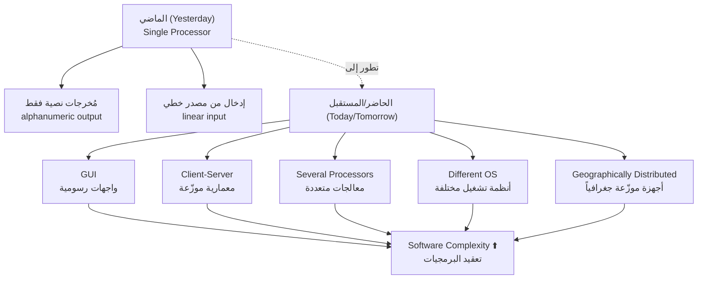

**شرح العناصر:**
- **Old (الماضي):** برنامج يشتغل على معالج واحد، يقرأ إدخال بسيط (متسلسل)، ويطبع نتائج نصية.
- **New (الحاضر):** أنظمة بواجهات رسومية `GUI`، تعمل على أكثر من جهاز (`client-server`)، بأكثر من نظام تشغيل، وبأجهزة موزّعة في أماكن مختلفة من العالم.
- **السهم إلى Complexity:** كل عامل من هذه العوامل (GUI، توزيع، تعدد المعالجات) يضيف طبقة تعقيد جديدة — والنتيجة التراكمية هي **تعقيد أكبر بكثير** مما كان عليه البرنامج التقليدي.

**التطبيق في هذا السياق:**
هذا المخطط هو أساس كل المشكلة اللي هندسة البرمجيات جاءت تحلّها: كل ما زاد التعقيد، زادت فرص الخطأ، وزادت الحاجة لمنهجية هندسية منظمة بدل "الكتابة الحرة".

---

#### 📖 الشرح

تخيل إنك بتقارن بين **آلة كاتبة قديمة** وبين **نظام بريد إلكتروني عالمي** مثل Gmail. الآلة الكاتبة بسيطة: تكتب حرف، يطلع حرف. أما Gmail: فيه ملايين المستخدمين، سيرفرات موزّعة حول العالم، أنظمة أمان، تزامن بين الأجهزة، وواجهة رسومية معقدة. الفرق مو بس "أكبر"، الفرق **نوعي**: كل طبقة (server، client، database، security) لازم تتفاعل صح مع الباقي، وأي خطأ صغير في مكان واحد ينعكس على كل النظام.

هذا بالضبط اللي حصل مع البرمجيات مع مرور الوقت. في الماضي كان البرنامج "جزيرة معزولة" — يشتغل لحاله على جهاز واحد. اليوم، البرنامج جزء من **شبكة تفاعلات** معقدة: `GUI` يحتاج يتفاعل مع المستخدم بصرياً، `client-server architecture` يعني فيه جزء يشتغل عندك وجزء يشتغل على سيرفر بعيد، و`geographically distributed machines` تعني إن أجزاء النظام قد تكون في قارات مختلفة.

النتيجة: **Software Complexity** (تعقيد البرمجيات) صار سؤال محوري — كيف نتحكم في هذا التعقيد بدل ما يتحكم فينا؟ هذا بالضبط الدور اللي تلعبه هندسة البرمجيات.

#### 🎯 الملخص السريع
- البرمجيات انتقلت من "معالج واحد، إدخال بسيط" إلى أنظمة موزّعة معقدة.
- عوامل زيادة التعقيد: `GUI`، `client-server`، معالجات متعددة، أنظمة تشغيل مختلفة، توزيع جغرافي.
- زيادة التعقيد = زيادة الحاجة لمنهجية هندسية.

#### 📚 التطبيق
هذا التعقيد هو "المشكلة" التي ستُبنى عليها بقية المحاضرة: أزمة البرمجيات (Software Crisis) هي **النتيجة المباشرة** لهذا التعقيد غير المُدار.

#### ⚠️ أخطاء شائعة

#### الفهم الخاطئ ❌:
الطالب يظن أن "تعقيد البرمجيات" يعني فقط "كمية الأسطر البرمجية" (عدد كبير من الكود).

#### الفهم الصحيح ✅:
التعقيد هنا يقصد به **تعقيد التفاعلات** بين مكونات النظام (عدد المعالجات، توزيع الأجهزة، اختلاف الأنظمة) — مو بس طول الكود. برنامج قصير جداً لكن موزّع على 5 سيرفرات حول العالم يُعتبر معقداً جداً.

#### 📄 النص الأصلي من المحاضرة
<details>
<summary>عرض النص الأصلي (coverage: 95%)</summary>

> Software yesterday, today, tomorrow — What is the difference؟
> Single processor, alphanumeric output, input from linear source
> GUI، Client-server architecture، Several processors، Different OS، Geographically distributed machines
> Software complexity؟

**ملاحظة على التغطية:**
- ✓ تم شرح كل العوامل المذكورة في الشريحة (GUI، client-server، إلخ)
- ℹ️ إضافة من الدليل: تشبيه الآلة الكاتبة مقابل Gmail لتوضيح الفكرة

</details>

---

### 2. أزمة البرمجيات (Software Crisis)
<!-- @type: fact -->
<!-- @render: {type: "diagram-first", visualization: "flowchart", coverage: "95%"} -->
<!-- @connectivity: {prerequisite: "1"} -->

#### 📍 أين نحن الآن؟
بعد ما فهمنا إن البرمجيات صارت معقدة، الآن نشوف **النتيجة الفعلية** لهذا التعقيد: مشاريع تفشل، تتأخر، وتتجاوز الميزانية.

#### ⬅️ الربط مع السابق
التعقيد المتزايد (القسم 1) هو السبب الجذري لما يُسمّى "أزمة البرمجيات".

#### 💡 الفكرة الأساسية
**أزمة البرمجيات تعني وجود مشاكل جدّية ومتكررة في تكلفة، توقيت، صيانة، وجودة أغلب المشاريع البرمجية — وهي المشكلة التي جاءت هندسة البرمجيات لحلّها.**

---

#### 📊 المخطط: أعراض أزمة البرمجيات وأمثلتها

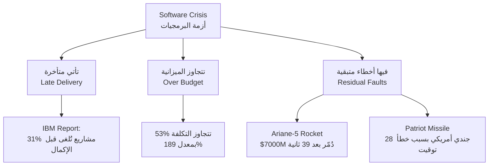

**شرح العناصر:**
- **Late / Over / Faults:** الأعراض الثلاثة الأساسية لأزمة البرمجيات كما ذُكرت في المحاضرة — التأخير، تجاوز الميزانية، والأخطاء المتبقية بعد التسليم.
- **الأمثلة (Ariane-5, Patriot Missile):** حالات واقعية موثّقة توضح أن الخطأ في البرمجيات ليس نظرياً — بل له تكلفة مالية وحتى بشرية حقيقية.

**التطبيق في هذا السياق:**
هذه الأمثلة تُستخدم لتبرير "لماذا نحتاج هندسة البرمجيات؟" — فهي ليست ترفاً أكاديمياً، بل ضرورة عملية لتجنّب كوارث حقيقية.

---

#### 📖 الشرح

خُد مثال `Ariane-5`: صاروخ فضائي كلّف حوالي **7 مليارات دولار** على مدى 10 سنوات تطوير، ودُمّر بعد **39 ثانية فقط** من الإطلاق. السبب؟ ليس خطأ في المحركات أو الوقود، بل **خطأ برمجي بسيط**: محاولة تحويل رقم من صيغة `64-bit` إلى `16-bit` تسبب في فيضان (overflow) أوقف النظام بالكامل.

هذا النوع من الأمثلة يوضح فكرة أساسية: **الخطأ البرمجي الصغير قد يكون له نتيجة كارثية كبيرة**. لهذا السبب أزمة البرمجيات لا تعني فقط "البرنامج ما يشتغل صح"، بل تشمل أيضاً مشاكل في **إدارة المشروع نفسه**: مشاريع تُلغى قبل الانتهاء (31% حسب تقرير IBM)، ومشاريع تتجاوز الميزانية بمعدل مذهل يصل إلى 189%.

مصدر آخر للأزمة هو **الصيانة**: حتى لو سلّمت النظام بنجاح، غالباً ستحتاج تصليحات وتحديثات لاحقة — مثال Windows XP الذي صدر ومعه فوراً 18 ميجابايت من التحديثات لإصلاح ثغرات أمنية اكتُشفت في نفس يوم الإصدار!

#### 🎯 الملخص السريع
- الأزمة = مشاكل متكررة في: التكلفة، التوقيت، الصيانة، الجودة.
- أمثلة موثّقة: Ariane-5 (7000 مليون دولار)، Patriot Missile (28 قتيل)، Y2K.
- التقارير تُظهر أن نسبة كبيرة من المشاريع تُلغى أو تتجاوز الميزانية.

#### 📚 التطبيق
فهم "أزمة البرمجيات" هو المبرر المباشر لتعريف "هندسة البرمجيات" في القسم القادم — فهي محاولة منهجية لحل هذه الأزمة.

#### ⚠️ أخطاء شائعة

#### الفهم الخاطئ ❌:
الطالب يظن أن "أزمة البرمجيات" مشكلة قديمة انتهت بعد Y2K أو أنها مبالغة أكاديمية.

#### الفهم الصحيح ✅:
الأزمة مستمرة حتى اليوم — أي نظام حديث (بنوك، منصات تجارة إلكترونية) لا يزال عرضة لنفس المشاكل (تأخير، تجاوز ميزانية، أخطاء) إذا لم يُدار بمنهجية هندسية صحيحة.

#### 📄 النص الأصلي من المحاضرة
<details>
<summary>عرض النص الأصلي (coverage: 95%)</summary>

> Software: still come late, exceed budget, full of residual faults.
> "31% of projects get cancelled before they are completed, 53% over-run their cost estimates by an average of 189% and for every 100 projects, there are 94 restarts" IBM Report
> Y2K، Patriot missile (28 U.S. soldiers)، Ariane-5 space rocket ($7000M، destroyed after 39 seconds، conversion error 64-bit to 16-bit)، Windows XP patches

**ملاحظة على التغطية:**
- ✓ كل الأمثلة والأرقام من الشرائح مذكورة
- ℹ️ إضافة من الدليل: تشبيه وربط الأمثلة بفكرة "الخطأ الصغير بنتيجة كبيرة"

</details>

---

### 3. تكلفة البرمجيات (Software Costs)
<!-- @type: fact -->
<!-- @render: {type: "diagram-first", coverage: "100%"} -->
<!-- @connectivity: {prerequisite: "2"} -->

#### 📍 أين نحن الآن؟
بعد أعراض الأزمة، نفهم أحد أهم أبعادها: **التكلفة**.

#### ⬅️ الربط مع السابق
تجاوز الميزانية (من القسم 2) مرتبط مباشرة بفهم كيف تتوزّع تكلفة البرمجيات أصلاً.

#### 💡 الفكرة الأساسية
**تكلفة البرمجيات غالباً تفوق تكلفة الأجهزة (Hardware)، وتكلفة الصيانة تفوق تكلفة التطوير الأولي — خصوصاً للأنظمة طويلة العمر.**

---

#### 📊 المخطط: توزيع تكلفة البرمجيات

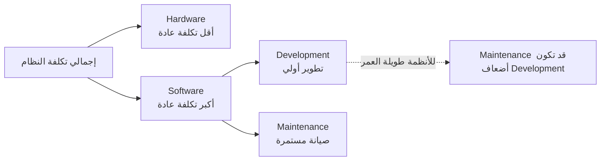

**شرح العناصر:**
- **Hardware مقابل Software:** في أنظمة الحاسوب الشخصي (PC)، غالباً تكلفة البرمجيات المُثبَّتة عليه أعلى من تكلفة الجهاز نفسه.
- **Development مقابل Maintenance:** التطوير هو الكتابة الأولى للنظام، بينما الصيانة هي كل التعديلات والإصلاحات بعد الإطلاق — وهي غالباً **أكبر بكثير** على المدى الطويل.

**التطبيق في هذا السياق:**
هذا يفسّر لماذا سنركّز لاحقاً (في محاضرات قادمة) على "Software Maintenance" كموضوع كامل بذاته — لأنها ليست تفصيلاً ثانوياً، بل الجزء الأكبر من التكلفة الفعلية.

---

#### 📖 الشرح

فكّر في الأمر مثل شراء سيارة: ثمن شراء السيارة نفسها (Hardware) قد يكون معقولاً، لكن **الصيانة والوقود على مدى 10 سنوات** (Software + Maintenance) قد يتجاوز ثمن السيارة نفسها بأضعاف. نفس المنطق ينطبق على البرمجيات: قد تدفع مبلغاً معيناً لشراء نظام حاسوب أو تطبيق، لكن **تكلفة الصيانة على المدى الطويل** (إصلاح الأخطاء، إضافة ميزات، التكيّف مع تغييرات السوق) غالباً تفوق التكلفة الأولية بأضعاف، خصوصاً للأنظمة التي تُستخدم لسنوات طويلة (مثل الأنظمة البنكية).

هذا يفسّر ليش الشركات الكبيرة تستثمر بكثافة في "جودة الكود" منذ البداية — لأن الكود السيء اليوم يعني **صيانة مكلفة جداً** غداً.

#### 🎯 الملخص السريع
- تكلفة البرمجيات > تكلفة الأجهزة (Hardware) في أغلب الأحيان.
- تكلفة الصيانة (Maintenance) > تكلفة التطوير الأولي (Development) للأنظمة طويلة العمر.
- هذا الدرس يبرر الاستثمار في جودة الكود منذ البداية.

#### 📚 التطبيق
سيُبنى على هذه الفكرة لاحقاً موضوع "Software Maintenance" كمرحلة كاملة من دورة حياة البرمجيات.

#### ⚠️ أخطاء شائعة

#### الفهم الخاطئ ❌:
الطالب يظن أن أكبر تكلفة في أي مشروع برمجي هي تكلفة كتابة الكود في المرة الأولى (Development).

#### الفهم الصحيح ✅:
للأنظمة طويلة العمر، تكلفة الصيانة (إصلاح الأخطاء، التحديثات، التكيف مع المتطلبات الجديدة) قد تصل لعدة أضعاف تكلفة التطوير الأولي.

#### 📄 النص الأصلي من المحاضرة
<details>
<summary>عرض النص الأصلي (coverage: 100%)</summary>

> Software costs often dominate computer system costs. The costs of software on a PC are often greater than the hardware cost.
> Software costs more to maintain than it does to develop. For systems with a long life, maintenance costs may be several times development costs.

</details>

---

### 4. تعريف هندسة البرمجيات (Software Engineering)
<!-- @type: fact -->
<!-- @render: {type: "diagram-first", coverage: "100%"} -->
<!-- @connectivity: {prerequisite: "2,3"} -->

#### 📍 أين نحن الآن؟
بعد ما عرفنا المشكلة (الأزمة والتكلفة)، الآن نتعرّف رسمياً على **الحل**: هندسة البرمجيات.

#### ⬅️ الربط مع السابق
كل ما ذكرناه عن الأزمة والتكلفة هو "المشكلة" — هندسة البرمجيات (`Software Engineering` أو `SE`) هي "الحل" المنهجي.

#### 💡 الفكرة الأساسية
**هندسة البرمجيات هي تخصص هندسي يهدف لإنتاج برمجيات ذات جودة عالية، قابلة للصيانة، في الوقت المحدد، وضمن الميزانية — باستخدام مبادئ هندسية سليمة.**

---

#### 📊 المخطط: من المشكلة إلى الحل

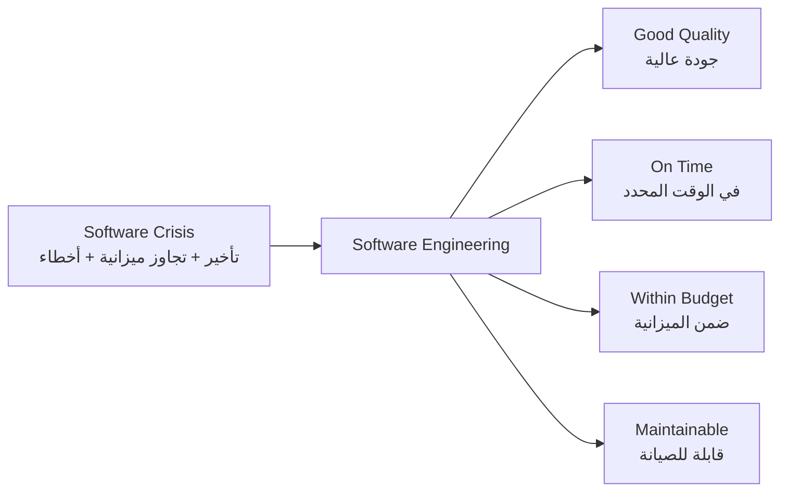

**شرح العناصر:**
- **SE (المركز):** التخصص الذي يربط المشكلة بالحل — تطبيق منهجية هندسية منظمة.
- **الأهداف الأربعة:** هي المعايير التي يُقاس بها نجاح أي مشروع هندسة برمجيات — وهي **مرآة مباشرة** لأعراض الأزمة المذكورة في القسم 2 (تأخير ↔ On Time، تجاوز ميزانية ↔ Within Budget، أخطاء ↔ Good Quality).

**التطبيق في هذا السياق:**
هذا المخطط يوضح أن هندسة البرمجيات **ليست نظرية مجردة**، بل استجابة مباشرة ومحددة الأهداف لمشاكل حقيقية موثّقة.

---

#### 📖 الشرح

هندسة البرمجيات، حسب أول مؤتمر عن الموضوع سنة 1968، هي: **"إنشاء واستخدام مبادئ هندسية سليمة للحصول على برمجيات تُطوَّر اقتصادياً، وتكون موثوقة، وتعمل بكفاءة على أجهزة حقيقية"**. وحسب تعريف Schach: هي **"تخصص هدفه إنتاج برمجيات ذات جودة، تُسلَّم في الوقت المحدد، ضمن الميزانية، وتُلبّي متطلبات العميل"**.

لاحظ الفرق بين "برمجة" (Programming) و"هندسة برمجيات" (Software Engineering): البرمجة تعني كتابة كود يعمل. الهندسة تعني كتابة كود يعمل **مع مراعاة القيود الواقعية**: الوقت، الميزانية، احتياجات العميل، وقابلية الصيانة المستقبلية. هذا يشبه الفرق بين شخص يبني كوخاً خشبياً بشكل عشوائي وبين مهندس مدني يصمم مبنى وفق مخططات ومعايير سلامة — كلاهما "يبني"، لكن أحدهما يتبع منهجية هندسية والآخر لا.

#### 🎯 الملخص السريع
- SE = تطبيق مبادئ هندسية على تطوير البرمجيات.
- الهدف: جودة + توقيت + ميزانية + قابلية صيانة.
- الفرق بين "برمجة" و"هندسة برمجيات": الالتزام بمنهجية ومعايير، مو بس "الكود يشتغل".

#### 📚 التطبيق
هذا التعريف هو الأساس النظري لكل المقرر — كل محاضرة قادمة (Life Cycle Models، Requirements، Design، Testing) هي **أداة** لتحقيق هذه الأهداف الأربعة.

#### ⚠️ أخطاء شائعة

#### الفهم الخاطئ ❌:
الطالب يظن أن "هندسة البرمجيات" مرادفة تماماً لـ "البرمجة" (Programming) — أي أنها فقط كتابة الكود.

#### الفهم الصحيح ✅:
البرمجة هي جزء واحد فقط من هندسة البرمجيات. الهندسة تشمل أيضاً: التخطيط، تحليل المتطلبات، التصميم، الاختبار، والصيانة — كل مرحلة تخدم هدف "الجودة + التوقيت + الميزانية".

#### 📄 النص الأصلي من المحاضرة
<details>
<summary>عرض النص الأصلي (coverage: 100%)</summary>

> SE has the objective of solving these problems by producing good quality, maintainable software, on time, within budget.
> "The establishment and use of sound engineering principles in order to obtain economically developed software that is reliable and works efficiently on real machines" 1st SE conf. 1968
> "A discipline whose aim is the production of quality software, software that is delivered on time, within budget and that satisfies its requirements" Schach

</details>

---

### 5. مهندس البرمجيات (Software Engineers)
<!-- @type: fact -->
<!-- @render: {type: "diagram-first", coverage: "100%"} -->
<!-- @connectivity: {prerequisite: "4"} -->

#### 📍 أين نحن الآن؟
بعد تعريف "هندسة البرمجيات" كتخصص، نتعرف على الشخص الذي يمارسها: مهندس البرمجيات.

#### ⬅️ الربط مع السابق
إذا كانت SE هي "المنهجية"، فمهندس البرمجيات هو من **يطبّق** هذه المنهجية عملياً.

#### 💡 الفكرة الأساسية
**مهندس البرمجيات ملزَم باتّباع منهج منظّم، واستخدام الأدوات والتقنيات المناسبة للمشكلة والقيود، مع استغلال الموارد المتاحة بكفاءة.**

---

#### 📊 المخطط: مسؤوليات مهندس البرمجيات

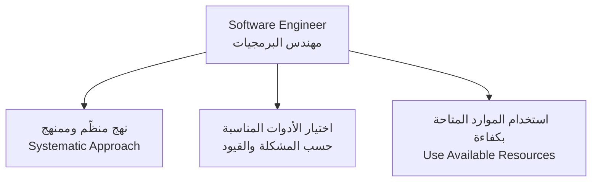

**شرح العناصر:**
- **R1 (نهج منظم):** لا يكتب كود عشوائياً، بل يتبع خطوات محددة (تحليل → تصميم → تنفيذ → اختبار).
- **R2 (اختيار الأدوات):** الأداة أو التقنية المناسبة تختلف حسب طبيعة المشروع وقيوده (وقت، ميزانية، حجم فريق).
- **R3 (الموارد):** الاستخدام الأمثل لما هو متاح فعلياً (وقت، أشخاص، أدوات) بدل افتراض موارد غير محدودة.

**التطبيق في هذا السياق:**
هذه النقاط الثلاث ستتكرر ضمنياً في كل محاضرة قادمة عن اختيار النماذج (Models) والأدوات المناسبة لكل مشروع.

---

#### 📖 الشرح

فكّر في مهندس البرمجيات مثل طبيب: الطبيب الجيد لا يعطي نفس العلاج لكل مريض — يقيّم الحالة، يختار الأداة المناسبة (دواء، جراحة، علاج طبيعي)، ويعمل ضمن الموارد المتاحة (المستشفى، الوقت، حالة المريض). كذلك مهندس البرمجيات: لا يستخدم نفس الأداة أو المنهجية لكل مشروع — نظام بنكي يحتاج منهجية مختلفة عن تطبيق جوال بسيط لستارت أب.

النقطة الأهم هنا هي "systematic and organized approach" — أي أن العمل **ليس عشوائياً**. هذا هو جوهر الفرق بين المبرمج الهاوي والمهندس المحترف: الالتزام بخطوات منظمة قابلة للتكرار والمراجعة، بدل الاعتماد على "الإلهام" فقط.

#### 🎯 الملخص السريع
- مهندس البرمجيات يتبع نهجاً منظماً، لا عشوائياً.
- يختار الأدوات والتقنيات حسب طبيعة المشكلة والقيود.
- يستغل الموارد المتاحة فعلياً (لا يفترض موارد غير محدودة).

#### 📚 التطبيق
هذه المبادئ الثلاثة هي المعيار الذي سنستخدمه لاحقاً للمقارنة بين نماذج دورة الحياة المختلفة (Waterfall, Spiral, Agile...).

#### ⚠️ أخطاء شائعة

#### الفهم الخاطئ ❌:
الطالب يظن أن وجود أداة أو منهجية "أفضل" بشكل مطلق يجب استخدامها دائماً.

#### الفهم الصحيح ✅:
لا توجد أداة أو منهجية "الأفضل" بشكل مطلق — الاختيار الصحيح يعتمد على طبيعة المشروع وقيوده (هذه الفكرة ستُفصَّل أكثر عند دراسة اختيار نماذج SDLC لاحقاً).

#### 📄 النص الأصلي من المحاضرة
<details>
<summary>عرض النص الأصلي (coverage: 100%)</summary>

> Software engineers must: Adopt a systematic and organized approach to their work. Use appropriate tools and techniques depending on the problem to be solved and the development constraints. Use the resource available.

</details>

---

### 6. البرمجيات، البرامج، والتوثيق (Software, Programs & Documentation)
<!-- @type: fact -->
<!-- @render: {type: "diagram-first", visualization: "hierarchy", coverage: "95%"} -->
<!-- @connectivity: {prerequisite: "4"} -->

#### 📍 أين نحن الآن؟
نميّز بين مصطلحين كثيراً ما يُخلط بينهما: "Software" و"Program"، ثم نشوف مكوّناتهما التفصيلية.

#### ⬅️ الربط مع السابق
مهندس البرمجيات (القسم 5) لا ينتج فقط "كوداً" — بل ينتج "برمجية" كاملة، وهذا القسم يوضح الفرق.

#### 💡 الفكرة الأساسية
**البرنامج (Program) هو الكود المصدري فقط، بينما البرمجية (Software) تشمل البرنامج + التوثيق (Documentation) + إجراءات التشغيل (Operating Procedures).**

---

#### 📊 المخطط: مكوّنات البرمجية والتوثيق وإجراءات التشغيل

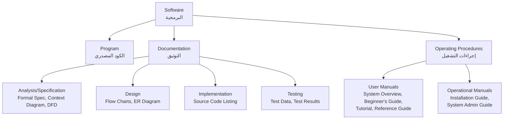

**شرح العناصر:**
- **Program:** فقط الكود المصدري القابل للتشغيل.
- **Documentation:** كل الوثائق المرافقة، مقسّمة حسب مرحلة التطوير (تحليل، تصميم، تنفيذ، اختبار).
- **Operating Procedures:** أدلة الاستخدام (للمستخدم النهائي) والتشغيل (لمسؤول النظام).

**شرح الروابط:**
- **Software يتفرّع إلى ثلاثة:** لأن أي منتج برمجي كامل يحتاج الثلاثة معاً — كود يعمل + شرح لكيفية عمله + دليل لتشغيله.

**التطبيق في هذا السياق:**
هذا التمييز مهم جداً في تقييم أي "منتج برمجي" (سنراه في القسم القادم) — فالمنتج الناقص التوثيق يُعتبر منتجاً غير مكتمل، حتى لو كان الكود يعمل بشكل صحيح.

---

#### 📖 الشرح

تخيّل إنك اشتريت جهازاً إلكترونياً جديداً — الجهاز نفسه (الكود/Program) قد يعمل ممتاز، لكن لو ما فيه **كتيّب تعليمات** (Documentation) ولا **دليل تركيب** (Operating Procedures)، بتواجه صعوبة كبيرة في استخدامه أو صيانته. نفس الفكرة بالضبط في البرمجيات: `Program` هو الكود فقط، لكن `Software` هو المنتج الكامل: الكود + كل الوثائق التي تشرحه (من مرحلة التحليل إلى الاختبار) + الأدلة التي تعلّم المستخدم والمسؤول كيف يستخدمونه.

لاحظ التمييز داخل `Documentation` نفسها: هناك وثائق لكل مرحلة من مراحل التطوير — `Formal Specification` و`Context Diagram` و`Data Flow Diagram` لمرحلة التحليل، `Flow Charts` و`Entity-relationship Diagram` لمرحلة التصميم، `Source Code Listing` للتنفيذ، و`Test Data`/`Test Results` للاختبار. أما `Operating Procedures` فتنقسم إلى: `User Manuals` (موجّهة للمستخدم العادي: نظرة عامة، دليل للمبتدئين، تعليمي، دليل مرجعي) و`Operational Manuals` (موجّهة لمسؤول النظام: دليل التركيب ودليل إدارة النظام).

#### 🎯 الملخص السريع
- `Software` = `Program` + `Documentation` + `Operating Procedures`.
- `Documentation` مقسّمة حسب مراحل التطوير: تحليل، تصميم، تنفيذ، اختبار.
- `Operating Procedures` مقسّمة إلى: أدلة للمستخدم و أدلة تشغيلية للمسؤول.

#### 📚 التطبيق
هذا التمييز سنحتاجه عند الحديث عن "مكوّنات المنتج البرمجي" في القسم القادم، وعند تقييم اكتمال أي تسليم مشروع.

#### ⚠️ أخطاء شائعة

#### الفهم الخاطئ ❌:
الطالب يستخدم كلمتي "Software" و"Program" كمترادفتين تماماً.

#### الفهم الصحيح ✅:
"Program" هو الكود المصدري فقط، بينما "Software" مصطلح أوسع يشمل الكود + كل التوثيق + إجراءات التشغيل المرافقة له.

#### 📄 النص الأصلي من المحاضرة
<details>
<summary>عرض النص الأصلي (coverage: 95%)</summary>

> Software consists of programs, documentation of any facet of the program and the procedures used to setup and operate the software system. While program is source code.
> Documentation Manuals: Analysis/Specification (Formal Specification, Context-Diagram, Data Flow Diagram), Design (Flow Charts, Entity-relationship Diagram), Implementation (Source Code Listing, Cross-Reference Listing), Testing (Test Data, Test Results).
> Operating Procedures: User Manuals (System Overview, Beginner's Guide, Tutorial, Reference Guide), Operational Manuals (Installation Guide, System Administration Guide).

</details>

---

### 7. منتجات البرمجيات: عام مقابل مخصص (Generic vs Bespoke Products)
<!-- @type: principle -->
<!-- @render: {type: "diagram-first", visualization: "decision", coverage: "95%"} -->
<!-- @connectivity: {prerequisite: "6"} -->

#### 📍 أين نحن الآن؟
بعد فهم مكوّنات "البرمجية"، نصنّف أنواع منتجات البرمجيات حسب من يملك قرار التطوير.

#### ⬅️ الربط مع السابق
كل ما شرحناه عن مكونات Software (القسم 6) ينطبق على نوعين مختلفين تماماً من المنتجات — سنميّز بينهما هنا.

#### 💡 الفكرة الأساسية
**المنتج البرمجي إمّا عام (Generic) يملك مواصفاته المطوّر نفسه، أو مخصص (Bespoke/Customized) يملك مواصفاته العميل — ولكل نوع سياق استخدام مختلف.**

---

#### 📊 المخطط: إطار القرار — Generic أم Bespoke؟

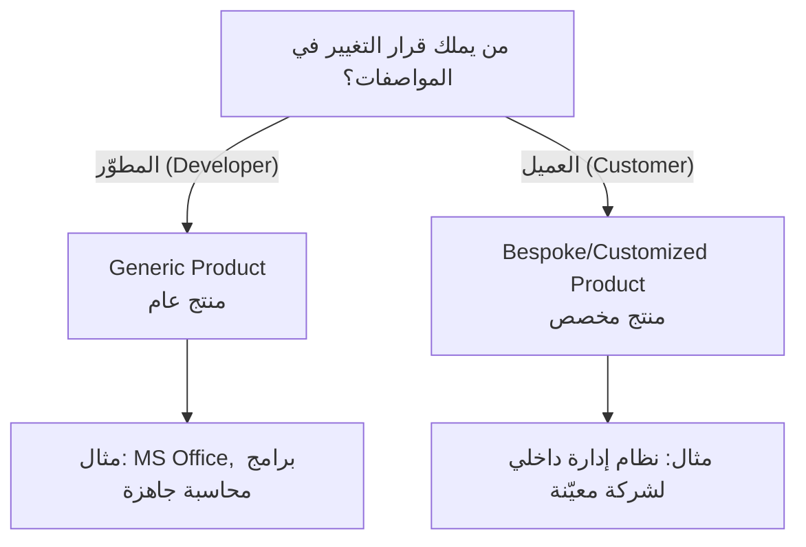

**شرح العناصر:**
- **Generic:** مواصفات المنتج (ماذا يفعل البرنامج) يقررها **المطوّر**، ويُباع نفس المنتج لعملاء متعددين دون تعديل جذري.
- **Bespoke/Customized:** مواصفات المنتج يقررها **العميل** تحديداً، والمطوّر ينفّذ حسب طلب ذلك العميل فقط.

**التطبيق في هذا السياق:**
هذا التصنيف يحدد لاحقاً كيف تُدار متطلبات المشروع (Requirements) — منتج عام يحتاج بحث سوق، بينما منتج مخصص يحتاج جلسات مع عميل محدد.

---

#### 📖 الشرح

فكّر في الفرق بين شراء **سيارة جاهزة من المعرض** (Generic) وبين **طلب سيارة مصمّمة خصيصاً حسب مواصفاتك** (Bespoke). السيارة الجاهزة صمّمتها الشركة المصنّعة بناءً على تقديرها لما يريده السوق العام — أنت كمشترٍ لا تتحكم بالمواصفات، فقط تختار من بين الخيارات المتاحة. أما السيارة المخصصة، فأنت من يحدد كل تفصيلة، والمُصنِّع ينفّذ حسب طلبك.

في البرمجيات، `MS Office` مثال على منتج `Generic`: مايكروسوفت هي من تقرر أي ميزة تُضاف أو تُحذف، وتبيع نفس المنتج لملايين المستخدمين. بالمقابل، نظام داخلي لإدارة مخزون شركة معيّنة هو منتج `Bespoke` — الشركة (العميل) هي من تحدد بالضبط ما تحتاجه، والمطوّر ينفّذ وفق تلك المواصفات فقط.

**لماذا هذا التمييز مهم؟** لأنه يحدد **من يتخذ القرار** عند حدوث تغيير في المتطلبات لاحقاً — وهذا موضوع سنعود له بالتفصيل عند دراسة "Software Requirements".

#### 🎯 الملخص السريع
- `Generic`: المطوّر يملك القرار، يُباع لعملاء متعددين.
- `Bespoke/Customized`: العميل يملك القرار، يُطوَّر لعميل واحد محدد.
- الفرق الجوهري: **من يقرر مواصفات "ماذا يجب أن يفعل البرنامج؟"**

#### 📚 التطبيق
هذا التصنيف يحدد لاحقاً استراتيجية جمع المتطلبات ونموذج دورة الحياة الأنسب للمشروع.

#### ⚠️ أخطاء شائعة

#### الفهم الخاطئ ❌:
الطالب يظن أن الفرق بين Generic وBespoke هو فقط "عدد المستخدمين" (منتج لشخص واحد أم للجميع).

#### الفهم الصحيح ✅:
الفرق الجوهري هو **من يملك قرار التغيير في المواصفات** — وليس فقط عدد المستخدمين. قد يكون هناك منتج مخصص يُستخدم من قِبل آلاف الموظفين داخل شركة واحدة، لكنه يبقى Bespoke لأن الشركة (العميل) هي من تقرر مواصفاته.

#### 📄 النص الأصلي من المحاضرة
<details>
<summary>عرض النص الأصلي (coverage: 95%)</summary>

> Generic: The specification of what the software should do is owned by the software developer and decisions on software change are made by the developer.
> Customized: The specification of what the software should do is owned by the customer for the software and they make decisions on software changes that are required.

**ملاحظة على التغطية:**
- ✓ التعريف الكامل لكلا النوعين
- ℹ️ إضافة من الدليل: تشبيه السيارة الجاهزة مقابل المخصصة

</details>

---

### 8. المنتج البرمجي: المكونات (Software Product Components)
<!-- @type: fact -->
<!-- @render: {type: "diagram-first", coverage: "100%"} -->
<!-- @connectivity: {prerequisite: "7"} -->

#### 📍 أين نحن الآن؟
نفصّل الآن ماذا **بالتحديد** يُسلَّم للعميل عند اكتمال المشروع.

#### ⬅️ الربط مع السابق
بغض النظر عن كون المنتج `Generic` أو `Bespoke` (القسم 7)، كلاهما يشتمل على نفس أنواع المكوّنات المُسلَّمة.

#### 💡 الفكرة الأساسية
**المنتج البرمجي هو كل ما يُسلَّم فعلياً للمستخدم — ولا يقتصر على الكود، بل يشمل الأكواد، الوثائق، البيانات، والخطط.**

---

#### 📊 المخطط: مكوّنات المنتج البرمجي

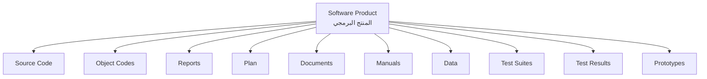

**شرح العناصر:**
- **Source Code / Object Codes:** الكود المصدري والكود القابل للتنفيذ بعد الترجمة.
- **Reports / Plan:** تقارير المشروع وخططه (زمنية، إدارية).
- **Documents / Manuals:** التوثيق التقني وأدلة الاستخدام (تفصيلها في القسم 6).
- **Data / Test Suites / Test Results:** بيانات النظام، مجموعات الاختبار، ونتائجها.
- **Prototypes:** النماذج الأولية التي طُوّرت أثناء المشروع.

**التطبيق في هذا السياق:**
هذه القائمة تُستخدم كـ "قائمة تحقق" (checklist) عملية عند تسليم أي مشروع — إذا نقص أي عنصر منها، فالتسليم غير مكتمل.

---

#### 📖 الشرح

عند تسليم مشروع برمجي، العميل لا يستلم فقط "ملف تنفيذي واحد". بل يستلم **حزمة كاملة**: الكود المصدري (لتعديله لاحقاً إن لزم)، الكود القابل للتشغيل مباشرة، تقارير توضّح حالة المشروع، خطط زمنية ومالية، وثائق ودلائل استخدام، بيانات النظام، مجموعات الاختبارات ونتائجها، وحتى النماذج الأولية (Prototypes) التي استُخدمت أثناء التطوير للتوضيح.

هذا يوضّح لماذا "المنتج البرمجي" مفهوم أوسع بكثير من مجرد "برنامج يعمل" — فالتسليم الاحترافي الكامل يشمل كل هذه العناصر مجتمعة.

#### 🎯 الملخص السريع
- المنتج = Source Code + Object Codes + Reports + Plan + Documents + Manuals + Data + Test Suites + Test Results + Prototypes.
- ليس فقط "الكود" — بل حزمة تسليم كاملة.

#### 📚 التطبيق
هذه القائمة معيار عملي لتقييم اكتمال أي تسليم مشروع في مقرر Software Project Planning لاحقاً.

#### ⚠️ أخطاء شائعة

#### الفهم الخاطئ ❌:
الطالب يظن أن "المنتج البرمجي" يعني فقط ملف الكود التنفيذي (executable).

#### الفهم الصحيح ✅:
المنتج البرمجي حزمة كاملة تشمل الكود، التوثيق، البيانات، نتائج الاختبار، والخطط — كلها جزء من "التسليم" النهائي للعميل.

#### 📄 النص الأصلي من المحاضرة
<details>
<summary>عرض النص الأصلي (coverage: 100%)</summary>

> Software product is a product designated for delivery to the user: Source Code, Object Codes, Reports, Plan, Documents, Manuals, Data, Test Suites, Test Results, Prototypes.

</details>

---

### 9. أساطير البرمجيات الشائعة (Software Myths)
<!-- @type: practice -->
<!-- @render: {type: "diagram-first", coverage: "100%"} -->
<!-- @connectivity: {prerequisite: "4"} -->

#### 📍 أين نحن الآن؟
بعد فهم ماهية هندسة البرمجيات، نكشف عن **معتقدات خاطئة شائعة** تُضعف تطبيقها بشكل صحيح.

#### ⬅️ الربط مع السابق
هذه الأساطير غالباً تكون السبب الجذري وراء وقوع فرق العمل في "أزمة البرمجيات" (القسم 2) — لأنهم يتصرفون بناءً على معتقدات خاطئة.

#### 💡 الفكرة الأساسية
**هناك معتقدات شائعة وخاطئة حول طبيعة البرمجيات (سهولة التعديل، الموثوقية، الاختبار، إعادة الاستخدام...) — والوعي بها يحمي فريق العمل من قرارات سيئة.**

---

#### 📊 المخطط: تصنيف أساطير البرمجيات

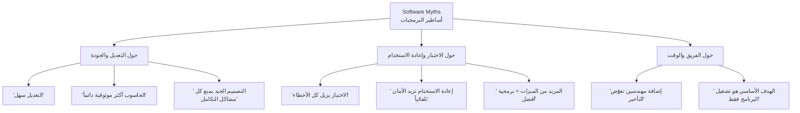

**شرح العناصر:**
- **M1 (التعديل والجودة):** أساطير حول أن التغيير أو الموثوقية أمور بديهية وسهلة.
- **M2 (الاختبار وإعادة الاستخدام):** أساطير حول أن هذه الممارسات تحل المشاكل تلقائياً وبشكل كامل.
- **M3 (الفريق والوقت):** أساطير إدارية شائعة، أشهرها "قانون بروكس" الضمني: إضافة أشخاص لا تعوّض التأخير.

**التطبيق في هذا السياق:**
معرفة هذه الأساطير تحمي مهندس البرمجيات (القسم 5) من اتخاذ قرارات إدارية أو تقنية سيئة تبدو منطقية للوهلة الأولى.

---

#### 📖 الشرح

من أشهر هذه الأساطير: **"إضافة المزيد من المهندسين للمشروع المتأخر يعوّض التأخير"**. هذا يبدو منطقياً — كأنك تفكر: "لو 5 عمال بنوا جداراً في يوم، فـ10 عمال يبنونه في نصف يوم". لكن الواقع مختلف: مهندسون جدد يحتاجون وقتاً للتعلّم عن المشروع (Onboarding)، ويزيدون تعقيد التواصل بين أعضاء الفريق (كل شخص جديد = خطوط تواصل إضافية)، فغالباً **يزيد التأخير بدل ما يقلّه** — هذا ما يُعرف في هندسة البرمجيات بـ "قانون بروكس" (وسنتعمّق فيه في مقرر Software Project Planning).

أسطورة أخرى: **"الاختبار (Testing) أو إثبات صحة البرنامج يزيل كل الأخطاء"**. هذا خاطئ — الاختبار يمكن أن يُثبت **وجود** أخطاء، لكنه لا يستطيع أبداً أن يُثبت **غياب** كل الأخطاء الممكنة (خصوصاً في الأنظمة الكبيرة والمعقدة). هذه فكرة أساسية سنتعمّق فيها لاحقاً في مقرر Software Testing.

وأسطورة ثالثة شائعة بين المبتدئين: **"البرمجية ذات الميزات الأكثر هي البرمجية الأفضل"**. الواقع أن إضافة ميزات كثيرة دون داعٍ تزيد التعقيد، تُصعّب الصيانة، وقد تُربك المستخدم بدل أن تفيده — الجودة لا تُقاس بعدد الميزات بل بمدى ملاءمتها لاحتياج المستخدم الفعلي.

#### 🎯 الملخص السريع
- التعديل ليس سهلاً دائماً، والاختبار لا يزيل كل الأخطاء.
- إضافة مهندسين للمشروع المتأخر قد تزيد التأخير (لا تحلّه تلقائياً).
- المزيد من الميزات ≠ برمجية أفضل.
- الهدف الحقيقي ليس فقط "تشغيل البرنامج" بل تحقيق أهداف الجودة والصيانة أيضاً.

#### 📚 التطبيق
الوعي بهذه الأساطير يحمي فريق المشروع من قرارات خاطئة عند التخطيط (Software Project Planning) وعند الاختبار (Software Testing) لاحقاً في المقرر.

#### ⚠️ أخطاء شائعة

#### الفهم الخاطئ ❌:
الطالب (أو مدير مشروع مبتدئ) يعتقد أن إضافة أعضاء جدد للفريق دائماً تُسرّع إنجاز مشروع متأخر.

#### الفهم الصحيح ✅:
في الغالب، إضافة أعضاء جدد لمشروع متأخر **تزيد** التأخير مؤقتاً بسبب وقت التدريب وتعقيد التواصل الإضافي — الحل الحقيقي غالباً يكون بإعادة التخطيط، لا بزيادة العدد فقط.

#### 📄 النص الأصلي من المحاضرة
<details>
<summary>عرض النص الأصلي (coverage: 100%)</summary>

> Software easy to change. Computers provide greater reliability than the devices they replace. Testing software or "proving" software correct can remove all the errors. Reusing software increases safety. Software can work right the first time. Software can designed thoroughly enough to avoid most integration problems. Software with more features is better software. Addition of more software engineers will make up the delay. Aim is to develop working programs.

**ملاحظة على التغطية:**
- ✓ كل الأساطير التسعة من الشريحتين مذكورة ومصنّفة
- ℹ️ إضافة من الدليل: شرح تفصيلي لثلاث أساطير أساسية (الفريق، الاختبار، الميزات) مع تشبيهات

</details>

---

### 10. عملية البرمجيات وأنشطتها (Software Process & Activities)
<!-- @type: fact -->
<!-- @render: {type: "diagram-first", visualization: "flowchart", coverage: "100%"} -->
<!-- @connectivity: {prerequisite: "9"} -->

#### 📍 أين نحن الآن؟
بعد تفنيد الأساطير، نتعرف على "العملية" (Process) الصحيحة والمنهجية لإنتاج البرمجيات.

#### ⬅️ الربط مع السابق
الابتعاد عن الأساطير (القسم 9) يعني اتّباع عملية منظّمة بدلاً من العمل العشوائي — وهذا القسم يعرّف تلك العملية.

#### 💡 الفكرة الأساسية
**عملية البرمجيات (Software Process) هي الطريقة المنظّمة التي نُنتج بها البرمجيات، وتتكوّن من أربعة أنشطة أساسية متسلسلة: التخصيص، التطوير، التحقق، والتطوّر.**

---

#### 📊 المخطط: أنشطة عملية البرمجيات

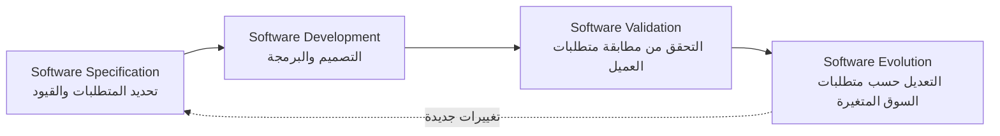

**شرح العناصر:**
- **Specification:** يحدد فيها المهندسون والعملاء معاً ما هو البرنامج المطلوب وقيود تشغيله.
- **Development:** مرحلة التصميم والبرمجة الفعلية.
- **Validation:** التأكد من أن البرنامج المُنتَج يحقق فعلاً ما طلبه العميل.
- **Evolution:** تعديل البرنامج لاحقاً بسبب تغيّر متطلبات العميل أو السوق.

**شرح الروابط:**
- **السهم المتقطع من Evolution إلى Specification:** يوضح أن العملية **دورية** — التعديلات المستقبلية تبدأ من جديد بمرحلة تحديد المتطلبات الجديدة.

**التطبيق في هذا السياق:**
هذه الأنشطة الأربعة هي **الهيكل العام** الذي ستُبنى عليه كل نماذج دورة الحياة (Waterfall, Spiral, Agile) التي ستُدرَس لاحقاً — فكل نموذج هو طريقة مختلفة لترتيب/تكرار هذه الأنشطة الأربعة.

---

#### 📖 الشرح

فكّر في `Software Process` مثل **وصفة طبخ منظمة**: أولاً تحدد ما هي الوجبة المطلوبة والمكوّنات المتاحة (Specification)، ثم تطبخ فعلياً باتّباع الخطوات (Development)، ثم تتذوّق للتأكد أن الطعم مطابق لما أراده الضيف (Validation)، وأخيراً — لو الضيف طلب تعديلاً (أقل ملحاً مثلاً) — تُعدّل الوصفة للمرة القادمة (Evolution). هذه العملية ليست خطوة واحدة تُنجَز مرة واحدة وتنتهي، بل **دورة متكررة**: أي مشروع برمجي حي (يُستخدم فعلياً) يمرّ بهذه المراحل الأربعة أكثر من مرة على مدار حياته.

الفكرة الجوهرية هنا هي أن `Software Process` تساعد الفريق على استخدام **أفضل الممارسات الفنية والإدارية** لإنجاز المشروع بنجاح، وهي وسيلة لتحسين الجودة، الإنتاجية، وقابلية التنبؤ في عملية التطوير والصيانة.

#### 🎯 الملخص السريع
- عملية البرمجيات = طريقة إنتاج البرمجيات.
- 4 أنشطة أساسية: Specification → Development → Validation → Evolution.
- العملية دورية: Evolution تُعيد الدورة من جديد عند تغيّر المتطلبات.

#### 📚 التطبيق
هذا الإطار هو الأساس الذي ستُبنى عليه محاضرة "Software Life Cycle Models" القادمة مباشرة.

#### ⚠️ أخطاء شائعة

#### الفهم الخاطئ ❌:
الطالب يظن أن "Software Process" تنتهي بمجرد تسليم البرنامج للعميل (أي تتوقف عند مرحلة Validation).

#### الفهم الصحيح ✅:
العملية تستمر بعد التسليم عبر مرحلة `Evolution` — فأي نظام حي يستمر في التغيّر بسبب متطلبات جديدة، وهذا يُعيد تشغيل الدورة من مرحلة Specification من جديد.

#### 📄 النص الأصلي من المحاضرة
<details>
<summary>عرض النص الأصلي (coverage: 100%)</summary>

> SP: the way in which we produce software. SP: help the developers to use the best technical and managerial practices to successfully complete their projects. SP is a way to improve the quality, productivity, predictability of the software development and maintenance efforts.
> Software specification, Software development, Software validation, Software evolution.

</details>

---

### 11. خصائص البرمجيات وتطبيقاتها (Software Characteristics & Applications)
<!-- @type: fact -->
<!-- @render: {type: "diagram-first", coverage: "95%"} -->
<!-- @connectivity: {prerequisite: "10"} -->

#### 📍 أين نحن الآن؟
نستكشف الآن ما الذي يجعل "البرمجيات" مختلفة جوهرياً عن "الأجهزة" (Hardware)، وأين تُستخدم عملياً.

#### ⬅️ الربط مع السابق
هذه الخصائص تفسّر جزئياً لماذا عملية البرمجيات (القسم 10) تحتاج مرحلة `Evolution` مستمرة — لأن طبيعة البرمجيات نفسها مرنة وقابلة للتعديل المستمر.

#### 💡 الفكرة الأساسية
**البرمجيات لا "تبلى" مثل الأجهزة، ولا تُصنَّع بل تُنسَخ، وقابليتها لإعادة الاستخدام والمرونة هي خصائص فريدة تميّزها عن المنتجات الصناعية التقليدية.**

---

#### 📊 المخطط: منحنى فشل الأجهزة مقابل البرمجيات

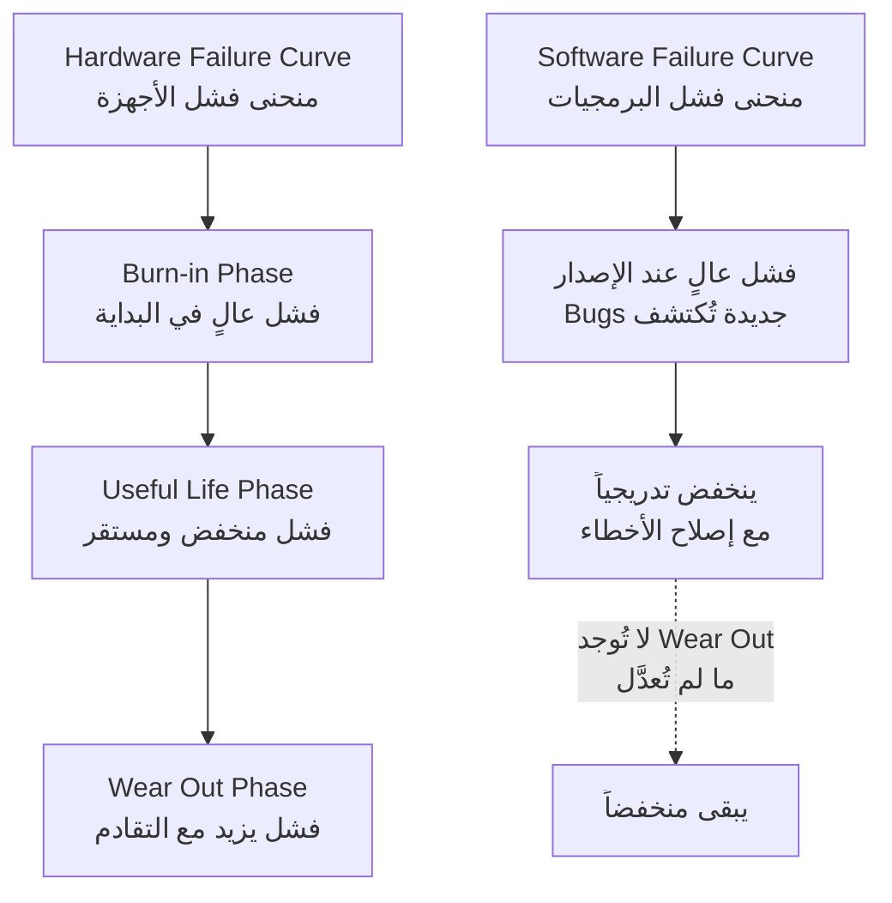

**شرح العناصر:**
- **منحنى الأجهزة (على شكل حوض/U):** يبدأ بفشل عالٍ (عيوب تصنيع)، يستقر في منتصف العمر، ثم يرتفع الفشل مرة أخرى مع تقادم الجهاز فيزيائياً (تآكل).
- **منحنى البرمجيات:** يبدأ بفشل عالٍ (أخطاء لم تُكتشف بعد)، ثم ينخفض مع كل إصلاح، ولا يوجد "تآكل" فيزيائي — إذا لم يُعدَّل الكود، يبقى بنفس مستوى الفشل إلى ما لا نهاية.

**التطبيق في هذا السياق:**
هذا الفرق الجوهري (عدم وجود Wear Out في البرمجيات) هو السبب في أن "صيانة البرمجيات" مختلفة تماماً عن "صيانة الأجهزة" — لن نحتاج أبداً "نستبدل" برنامجاً لأنه "تعب"، بل فقط عندما نريد تعديله أو تحسينه.

---

#### 📖 الشرح

**البرمجيات لا تبلى (Software does not wear out):** الجهاز الفيزيائي (مثل محرك سيارة) يتآكل فيزيائياً مع الاستخدام حتى يفشل. لكن الكود البرمجي لا "يتآكل" — لو كتبت برنامجاً اليوم وشغّلته بعد 10 سنوات بدون أي تعديل، سيعمل تماماً كما عمل في اليوم الأول (بافتراض توفّر بيئة تشغيل مماثلة). الفشل الوحيد الذي يحصل في البرمجيات ناتج عن **أخطاء موجودة أصلاً منذ الكتابة** ولم تُكتشف بعد — لا عن تدهور فيزيائي.

**البرمجيات لا تُصنَّع، بل تُنسَخ (Software is not manufactured, just copied):** تصنيع 1000 جهاز حاسوب يتطلب 1000 عملية تصنيع منفصلة، وكل جهاز عرضة لعيوب تصنيعية فردية. أما البرمجية، فبمجرد كتابتها مرة واحدة، تُنسَخ نسخاً متطابقة تماماً بلا أي تكلفة تصنيع إضافية أو عيوب فردية.

**إعادة الاستخدام والمرونة:** يمكن إعادة استخدام مكوّنات برمجية (Reusability) في مشاريع أخرى، والبرمجيات مرنة (Flexible) بمعنى أنها قابلة للتعديل بسهولة أكبر نسبياً من الأجهزة الفيزيائية.

بالنسبة لتطبيقات البرمجيات (Software Applications)، فهي متنوعة جداً: `System Software` (المترجمات، أنظمة التشغيل، برامج التشغيل)، `Real-time Software` (لمراقبة الأحداث الفورية مثل الطقس)، `Embedded Software` (المضمّنة في الأجهزة مثل السيارات والطائرات)، `Business Software` (إدارة الموظفين والحسابات)، `Personal Computer Software` (مثل MS Office)، `Artificial Intelligence Software` (الأنظمة الخبيرة، الشبكات العصبية)، `Web Based Software` (مثل CGI وHTML)، و`Engineering and Scientific Software` (مثل CAD وMATLAB).

#### 🎯 الملخص السريع
- البرمجيات لا تبلى فيزيائياً (على عكس الأجهزة).
- البرمجيات تُنسَخ، لا تُصنَّع بشكل متكرر.
- خصائص إضافية: قابلية إعادة الاستخدام، والمرونة.
- تطبيقاتها متنوعة: System، Real-time، Embedded، Business، PC، AI، Web، Engineering/Scientific.

#### 📚 التطبيق
فهم أن البرمجيات "لا تبلى" هو سبب رئيسي لماذا الصيانة (Maintenance) تختلف جذرياً عن صيانة الأجهزة — سنتعمّق في هذا في مقرر Software Maintenance.

#### ⚠️ أخطاء شائعة

#### الفهم الخاطئ ❌:
الطالب يظن أن البرمجيات تتوقف عن العمل بشكل صحيح مع مرور الوقت (كأنها "تتعب" مثل الأجهزة).

#### الفهم الصحيح ✅:
البرمجيات لا تتدهور فيزيائياً — أي فشل يحدث لاحقاً يكون بسبب أخطاء موجودة أصلاً منذ الكتابة (لم تُكتشف بعد)، أو بسبب تغيّر البيئة المحيطة بها (نظام تشغيل جديد مثلاً)، وليس بسبب "تآكل" الكود نفسه.

#### 📄 النص الأصلي من المحاضرة
<details>
<summary>عرض النص الأصلي (coverage: 95%)</summary>

> Software does not wear out (hardware vs. software). Software is not manufactured (just copies!). Reusability of components. Software is flexible.
> System Software, Real-time Software, Embedded Software, Business Software, Personal Computer Software, Artificial Intelligence Software, Web Based Software, Engineering and Scientific Software.

</details>

---

### 12. البرمجية الجيدة ومصطلحات هندسة البرمجيات (Good Software & Terminologies)
<!-- @type: fact -->
<!-- @render: {type: "diagram-first", coverage: "90%"} -->
<!-- @connectivity: {prerequisite: "11"} -->

#### 📍 أين نحن الآن؟
نجمع الآن معايير "الجودة" مع أهم المصطلحات التقنية التي ستتكرر طوال المقرر.

#### ⬅️ الربط مع السابق
بعد فهم خصائص البرمجيات (القسم 11)، نحدد ما الذي يجعلها **"جيدة"** تحديداً، ثم نُعرِّف المصطلحات التي ستُستخدم لقياس تلك الجودة.

#### 💡 الفكرة الأساسية
**البرمجية الجيدة تتميز بقابلية الصيانة، الاعتمادية والأمان، الكفاءة، والقبول من المستخدمين — وتُقاس هذه الصفات عبر مصطلحات دقيقة مثل Deliverables وMetrics وProductivity.**

---

#### 📊 المخطط: خصائص البرمجية الجيدة ومصطلحات القياس

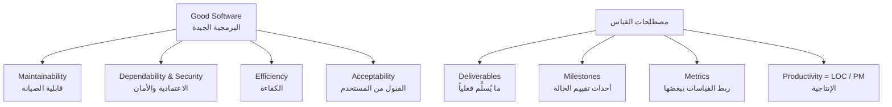

**شرح العناصر:**
- **Maintainability:** قابلية البرمجية للتطور مع تغيّر احتياجات العميل.
- **Dependability & Security:** موثوقية النظام وأمانه ضد الأعطال أو الاختراقات.
- **Efficiency:** عدم إهدار موارد النظام (ذاكرة، معالج).
- **Acceptability:** ملاءمة النظام لنوع المستخدمين المستهدَفين (قابل للفهم والاستخدام).
- **Deliverables / Milestones / Metrics / Productivity:** مصطلحات لقياس تقدّم وجودة المشروع (سنفصّلها أدناه).

**التطبيق في هذا السياق:**
هذه المعايير الأربعة (Maintainability, Dependability, Efficiency, Acceptability) ستكون **معيار التقييم** الذي نعود له عند دراسة "Software Metrics" لاحقاً في المقرر.

---

#### 📖 الشرح

**خصائص البرمجية الجيدة:** ليست "تعمل بشكل صحيح" كافية وحدها. البرمجية الجيدة يجب أن تكون **قابلة للصيانة** (لأن متطلبات الأعمال تتغيّر باستمرار)، **موثوقة وآمنة** (لا تسبب ضرراً مادياً أو مالياً، ولا يستطيع مستخدمون خبيثون اختراقها)، **كفوءة** (لا تُهدر ذاكرة أو وقت معالجة دون داعٍ)، و**مقبولة** من المستخدمين المستهدَفين (مفهومة، سهلة الاستخدام، ومتوافقة مع الأنظمة الأخرى التي يستخدمونها).

**أهم المصطلحات المتكررة في هندسة البرمجيات:**
- **Deliverables (المُسلَّمات):** كل ما يُنتَج أثناء التطوير ويُسلَّم فعلياً — مثل الكود المصدري، أدلة المستخدم، إجراءات التشغيل.
- **Milestones (المعالم):** أحداث تُستخدم لتقييم حالة تقدّم المشروع — مثل الانتهاء من المواصفات، أو اكتمال وثائق التصميم.
- **Product مقابل Process:** المنتج (Product) هو ما يُسلَّم فعلياً للعميل (مجموعة Deliverables)، بينما العملية (Process) هي الطريقة التي أنتجنا بها ذلك المنتج (مجموعة الأنشطة).
- **Measure / Measurement / Metrics:** `Measure` مؤشر كمّي لخاصية معيّنة (مثل عدد الأخطاء في مراجعة وحدة برمجية واحدة). `Measurement` هو فعل جمع تلك القياسات (فحص عدة وحدات لجمع أعداد الأخطاء). `Metrics` هي ربط القياسات الفردية ببعضها للوصول لمؤشر ذي معنى (مثل متوسط عدد الأخطاء لكل وحدة).
- **Process Metrics مقابل Product Metrics:** الأولى تقيس خصائص **عملية** التطوير نفسها (الإنتاجية، معدل الفشل)، والثانية تقيس خصائص **المنتج** الناتج (الحجم، الموثوقية، التعقيد).
- **Productivity (الإنتاجية):** معدل الإنتاج لكل وحدة جهد، وتُقاس عادةً بـ `LOC/PM` (عدد أسطر الكود مقسومة على عدد أشهر-الشخص Person Months).
- **Module (الوحدة البرمجية):** قد تكون subroutine في Fortran، أو package في Ada، أو procedure/function في Pascal/C، أو class/package في Java/++C — أي وحدة عمل يُسنَد إنجازها لمطوّر واحد.
- **Component (المكوّن):** جزء وظيفي مستقل قابل للتسليم، يوفّر خدماته عبر واجهات (interfaces) محددة.

#### 🎯 الملخص السريع
- خصائص البرمجية الجيدة: `Maintainability` + `Dependability & Security` + `Efficiency` + `Acceptability`.
- `Deliverables` = ما يُسلَّم، `Milestones` = أحداث تقييم الحالة.
- `Product` = المُخرجات، `Process` = طريقة الإنتاج.
- `Metrics` = ربط `Measures` الفردية ببعضها (مثال: `Productivity = LOC/PM`).

#### 📚 التطبيق
هذه المصطلحات ستُستخدم بشكل متكرر في مقرر "Software Metrics" لاحقاً، ويجب إتقانها لفهم أي نقاش تقني في المقرر بأكمله.

#### ⚠️ أخطاء شائعة

#### الفهم الخاطئ ❌:
الطالب يخلط بين `Measure` و`Measurement` و`Metrics` ويستخدمها كمرادفات تماماً.

#### الفهم الصحيح ✅:
`Measure` هو المؤشر الكمّي الفردي (مثل عدد أخطاء وحدة واحدة)، `Measurement` هو فعل جمع القياسات من عدة وحدات، و`Metrics` هي ربط تلك القياسات معاً للوصول لمؤشر معنوي (مثل متوسط عدد الأخطاء لكل وحدة).

#### 📄 النص الأصلي من المحاضرة
<details>
<summary>عرض النص الأصلي (coverage: 90%)</summary>

> Maintainability, Dependability and security, Efficiency, Acceptability [product characteristics table].
> Deliverables, Milestones, Product, Process, Measures (Measurement, Metrics), Software Process & Product Metrics, Productivity (LOC/PM), Module, Component.

**ملاحظة على التغطية:**
- ✓ كل المصطلحات من قسم "Frequent Terminologies" مغطاة
- ⚠️ لم يتم تفصيل كل صف من جدول Good Software بنفس العمق (اختصرنا الوصف الطويل لكل خاصية)

</details>

---

### 13. دور الإدارة في تطوير البرمجيات (Role of Management in SD)
<!-- @type: principle -->
<!-- @render: {type: "diagram-first", visualization: "decision", coverage: "95%"} -->
<!-- @connectivity: {prerequisite: "12"} -->

#### 📍 أين نحن الآن؟
نصل لآخر موضوع في هذه المحاضرة التأسيسية: كيف تُدار كل هذه العناصر (المنتج، العملية، المهندسون) معاً بنجاح؟

#### ⬅️ الربط مع السابق
كل ما تعلمناه (المنتج في القسم 8، العملية في القسم 10، المهندسون في القسم 5) يحتاج **إدارة** تجمعه معاً — وهذا موضوع هذا القسم الختامي.

#### 💡 الفكرة الأساسية
**نجاح أي مشروع برمجي يعتمد على إدارة أربعة عوامل متكاملة معاً: الأشخاص (People)، المنتج (Product)، العملية (Process)، والمشروع (Project) — ولا يوجد عامل واحد كافٍ بمفرده.**

---

#### 📊 المخطط: إطار القرار — العوامل الأربعة للإدارة الناجحة

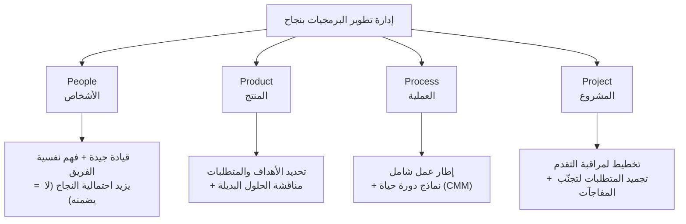

**شرح العناصر:**
- **People:** يحتاج المدير الجيد فهم علم النفس البشري وتوفير قيادة فعّالة — الأولوية: الاختيار، التدريب، التعويض، تطوير المسار المهني.
- **Product:** يحدد "ماذا نريد تسليمه للعميل؟" عبر تحديد الأهداف ونطاق العمل ومناقشة الحلول البديلة ضمن القيود (الميزانية، الموعد النهائي).
- **Process:** الإطار الذي يُبنى عليه خطة تطوير شاملة، ويشمل نماذج دورة الحياة المختلفة ونماذج تحسين العملية مثل `CMM` (Capability Maturity Model).
- **Project:** يحتاج تخطيطاً لمراقبة الحالة والتحكم في التعقيد، مع تجميد المتطلبات الأساسية لتفادي "مفاجآت" التغيير المتأخر التي تكون دائماً محفوفة بالمخاطر.

**التطبيق في هذا السياق:**
هذا الإطار الرباعي هو **خارطة طريق** لبقية المقرر بالكامل: `Product` سيُفصَّل في "Software Requirements"، `Process` في "Software Life Cycle Models"، و`Project` في "Software Project Planning".

---

#### 📖 الشرح

فكّر في إدارة مشروع برمجي مثل **إدارة فريق كرة قدم لبطولة كاملة**: المدرب الجيد (People) يحتاج يفهم نفسية لاعبيه ويقودهم بحكمة — لكن هذا وحده لا يضمن الفوز بالبطولة. يحتاج أيضاً خطة لعب واضحة (Product: ماذا نريد تحقيقه بالضبط في هذه المباراة؟)، منهجية تدريب منظمة (Process: كيف نتدرب ونُحسّن أداءنا بمرور الوقت؟)، وجدولة دقيقة للمباريات والاستراحات (Project: كيف نراقب تقدّمنا عبر الموسم كامل؟). أي عامل واحد بمفرده — مدرب عبقري بدون خطة، أو خطة ممتازة بدون فريق مدرَّب — لن يحقق النجاح.

النقطة الأهم في `Project` هي "تجميد المتطلبات" (Freeze Requirements): بعد الاتفاق مع العميل على متطلبات محددة، يجب تثبيتها قدر الإمكان. لماذا؟ لأن **أي تغيير في منتصف المشروع محفوف بالمخاطر دائماً** — قد يتطلب إعادة تصميم أجزاء كاملة، ويكسر افتراضات بُنيت عليها أجزاء أخرى من النظام. هذا لا يعني أن التغيير ممنوع تماماً، لكنه يعني أنه يجب أن يُدار بحذر شديد ضمن عملية رسمية (وليس بشكل عشوائي).

#### 🎯 الملخص السريع
- أربعة عوامل إدارية متكاملة: `People` + `Product` + `Process` + `Project`.
- `People`: قيادة جيدة تزيد احتمالية النجاح، لا تضمنه.
- `Product`: تحديد الأهداف والحلول البديلة ضمن القيود.
- `Process`: إطار عمل شامل (مثل نماذج `CMM`).
- `Project`: تخطيط لمراقبة التقدم + تجميد المتطلبات لتجنّب مخاطر التغيير المفاجئ.

#### 📚 التطبيق
هذا الإطار الرباعي سيتكرر ضمنياً طوال المقرر — كل محاضرة قادمة تتعمّق في أحد هذه العوامل الأربعة بالتفصيل.

#### 🤔 تفعيل الفهم
لو كنت مدير مشروع لتطوير نظام إدارة مستشفى، وفريقك يتكوّن من 15 مهندساً، والعميل (المستشفى) يطلب باستمرار إضافة ميزات جديدة أثناء التطوير — أي عامل من العوامل الأربعة (People, Product, Process, Project) يتأثر أكثر بهذا السلوك؟ وكيف تتعامل معه؟

**تلميح:** فكّر في مفهوم "تجميد المتطلبات" الذي شرحناه أعلاه.

#### ⚠️ أخطاء شائعة

#### الفهم الخاطئ ❌:
الطالب يظن أن وجود مدير قوي وقائد جيد للفريق (People) كافٍ وحده لضمان نجاح المشروع.

#### الفهم الصحيح ✅:
حسب المحاضرة، القيادة الجيدة **لا تضمن** نجاح المشروع، بل فقط **تزيد احتمالية** نجاحه. النجاح الفعلي يتطلب إدارة متوازنة للعوامل الأربعة معاً: People وProduct وProcess وProject.

#### 📄 النص الأصلي من المحاضرة
<details>
<summary>عرض النص الأصلي (coverage: 95%)</summary>

> Four factors: People, Product, Process, Project.
> People: SD requires good managers. Good managers understand people psychology. Provide good leadership. Cannot ensure the success of project, but can increase the probability of success. Priority: selection, training, compensation, career development, work culture.
> Product: What do we want to deliver to the customer؟ Define objectives & scope of work (requirements). Discussion of alternative solutions. Select best approach within constraints imposed by delivery deadline, budget, personnel availability. Define estimated cost, Development time, schedule.
> Process: Way in which we produce software. Provides framework from which a comprehensive plan for software development can be established. Several life cycle models & process improvement models. CMM (Capability Maturity Model), a standard for process framework.
> Project: A planning is required to monitor the status of SD. A planning is required to control the complexity. In a successful project, we must understand what can go wrong & how to do it right. Define concrete requirements & freeze them. Changes should not be incorporated to avoid software surprises, because they are always risky!

</details>

---

## الجزء الثاني: الملخص الشامل (قراءة بديلة كاملة)

هذه المحاضرة الأولى تضع حجر الأساس لمقرر هندسة البرمجيات بالكامل، وفكرتها الجوهرية بسيطة رغم كل التفاصيل: البرمجيات صارت معقدة جداً بمرور الوقت — من برامج بسيطة تعمل على معالج واحد، إلى أنظمة موزّعة عالمياً بواجهات رسومية وعدة معالجات وأنظمة تشغيل مختلفة — وهذا التعقيد المتزايد أنتج ما يُعرف بـ "أزمة البرمجيات" (Software Crisis): مشاريع تتأخر عن مواعيدها، تتجاوز ميزانياتها، وتُسلَّم وفيها أخطاء متبقية. الأرقام هنا ليست مبالَغ فيها؛ تقرير IBM يذكر أن 31% من المشاريع تُلغى قبل اكتمالها، و53% تتجاوز التكلفة المقدَّرة بمعدل 189%، ولكل 100 مشروع هناك 94 عملية إعادة انطلاق. والأمثلة الواقعية موجعة: صاروخ Ariane-5 كلّف 7 مليارات دولار على مدى عشر سنوات، ودُمّر بعد 39 ثانية فقط من الإطلاق بسبب خطأ برمجي بسيط في تحويل رقم من صيغة 64-bit إلى 16-bit. وحادثة الصاروخ Patriot أدّت لمقتل 28 جندياً أمريكياً بسبب خطأ صغير في توقيت ساعة النظام. هذه الأمثلة توضح أن هندسة البرمجيات ليست ترفاً أكاديمياً بل ضرورة عملية بتبعات حقيقية.

جزء مهم من هذه الأزمة هو التكلفة: تكلفة البرمجيات غالباً تفوق تكلفة الأجهزة (Hardware) نفسها، وتكلفة صيانة البرمجية على المدى الطويل غالباً تفوق تكلفة تطويرها الأولي — بالذات للأنظمة طويلة العمر مثل الأنظمة البنكية. هذا يشبه شراء سيارة: ثمن الشراء قد يكون معقولاً، لكن الصيانة على مدى سنوات طويلة قد تتجاوزه بأضعاف.

من هنا جاء تعريف هندسة البرمجيات (Software Engineering أو SE): هي تخصص هندسي هدفه إنتاج برمجيات ذات جودة عالية، تُسلَّم في الوقت المحدد، ضمن الميزانية، وقابلة للصيانة — أي أنها استجابة مباشرة لكل أعراض الأزمة المذكورة أعلاه (تأخير ↔ في الوقت المحدد، تجاوز ميزانية ↔ ضمن الميزانية، أخطاء ↔ جودة عالية). ومن يطبّق هذا التخصص هو مهندس البرمجيات، الذي يُفترض أن يتبع نهجاً منظماً وممنهجاً (لا عشوائياً)، ويختار الأدوات والتقنيات المناسبة حسب طبيعة كل مشروع وقيوده (لا توجد أداة "الأفضل" بشكل مطلق دائماً)، ويستغل الموارد المتاحة فعلياً.

من المهم أيضاً التمييز بين "البرنامج" (Program) و"البرمجية" (Software): البرنامج هو الكود المصدري فقط، بينما البرمجية تشمل البرنامج + التوثيق (Documentation، مقسّم حسب مراحل التحليل والتصميم والتنفيذ والاختبار) + إجراءات التشغيل (Operating Procedures، مقسّمة إلى أدلة للمستخدم النهائي وأدلة تشغيلية لمسؤول النظام). وحين نتحدث عن "المنتج البرمجي" (Software Product) الذي يُسلَّم فعلياً للعميل، فهو حزمة كاملة تشمل: الكود المصدري والكود التنفيذي، التقارير والخطط، الوثائق والأدلة، البيانات، مجموعات الاختبار ونتائجها، والنماذج الأولية (Prototypes) — وليس فقط ملفاً تنفيذياً واحداً.

منتجات البرمجيات تُصنَّف أيضاً إلى نوعين: منتجات عامة (Generic) تُملَك مواصفاتها من قِبل المطوّر نفسه ويبيعها لعملاء متعددين (مثل MS Office)، ومنتجات مخصصة (Bespoke/Customized) يملك مواصفاتها العميل تحديداً وتُطوَّر خصيصاً له. الفرق الجوهري بينهما ليس عدد المستخدمين، بل **من يقرر مواصفات البرنامج ويتحكم بالتغيير فيها**.

جزء أساسي آخر من هذه المحاضرة هو تفنيد "أساطير البرمجيات" (Software Myths) — معتقدات شائعة وخاطئة تُوقع الفرق في الأزمة نفسها. من أشهرها: الاعتقاد بأن إضافة مهندسين جدد لمشروع متأخر يعوّض التأخير — بينما الواقع أن المهندسين الجدد يحتاجون وقتاً للتعلم عن المشروع، ويزيدون تعقيد التواصل بين الفريق، فيزيد التأخير غالباً بدل أن يقلّه. أسطورة أخرى: أن الاختبار (Testing) يزيل كل الأخطاء — بينما الحقيقة أن الاختبار يمكن أن يُثبت وجود أخطاء، لكن لا يستطيع أبداً إثبات غياب كل الأخطاء الممكنة في نظام معقد. وأسطورة ثالثة: أن البرمجية ذات الميزات الأكثر هي الأفضل — بينما الواقع أن الميزات الزائدة تزيد التعقيد وصعوبة الصيانة دون فائدة حقيقية للمستخدم.

للتغلب على هذه الأزمة، تُعرَّف "عملية البرمجيات" (Software Process) كطريقة منظمة لإنتاج البرمجيات، تتكوّن من أربعة أنشطة أساسية تعمل كدورة متكررة: التخصيص (Specification، حيث يحدد العملاء والمهندسون معاً ما هو المطلوب)، التطوير (Development، التصميم والبرمجة الفعلية)، التحقق (Validation، التأكد من مطابقة النظام لمتطلبات العميل)، والتطوّر (Evolution، تعديل النظام حسب متطلبات السوق المتغيرة — والتي تُعيد الدورة من جديد إلى مرحلة التخصيص). هذا الإطار الرباعي هو الهيكل الذي ستُبنى عليه لاحقاً كل نماذج دورة حياة البرمجيات (Waterfall, Spiral, Agile) التي سندرسها في محاضرات قادمة.

من الخصائص الفريدة للبرمجيات (بالمقارنة مع الأجهزة) أنها لا "تبلى" فيزيائياً — الجهاز الفيزيائي يتآكل مع الاستخدام حتى يفشل (منحنى فشل على شكل حوض: فشل عالٍ في البداية، يستقر، ثم يرتفع مع التقادم)، بينما البرنامج لو كُتب اليوم وشُغِّل بعد عشر سنوات دون تعديل، سيعمل تماماً كما في اليوم الأول — أي فشل يحدث ناتج عن أخطاء موجودة أصلاً منذ الكتابة، لا عن "تآكل" الكود. كذلك، البرمجيات لا تُصنَّع بل تُنسَخ بلا تكلفة إضافية، وهي قابلة لإعادة الاستخدام ومرنة نسبياً. تطبيقاتها متنوعة جداً: أنظمة تشغيل، برمجيات فورية (Real-time)، برمجيات مضمّنة (Embedded)، برمجيات أعمال، تطبيقات مكتبية، ذكاء اصطناعي، ويب، وبرمجيات هندسية وعلمية.

أما البرمجية "الجيدة" تحديداً، فتتميز بأربع خصائص أساسية: قابلية الصيانة (Maintainability، لمواكبة تغيّر احتياجات الأعمال)، الاعتمادية والأمان (Dependability & Security، بحيث لا تسبب ضرراً مادياً أو مالياً ولا يستطيع مستخدمون خبيثون اختراقها)، الكفاءة (Efficiency، عدم إهدار موارد النظام مثل الذاكرة ووقت المعالجة)، والقبول (Acceptability، أن تكون مفهومة وسهلة الاستخدام ومتوافقة مع أنظمة أخرى يستخدمها المستخدمون). ولقياس هذه الخصائص عملياً، هناك مصطلحات دقيقة يجب إتقانها: "المُسلَّمات" (Deliverables، كل ما يُنتَج ويُسلَّم فعلياً)، "المعالم" (Milestones، أحداث لتقييم تقدّم المشروع)، الفرق بين "المنتج" (Product، ما يُسلَّم) و"العملية" (Process، طريقة الإنتاج)، والفرق الدقيق بين "Measure" (مؤشر كمّي فردي)، "Measurement" (فعل جمع القياسات)، و"Metrics" (ربط القياسات ببعضها للوصول لمؤشر معنوي، مثل "الإنتاجية" Productivity والتي تُقاس عادةً بـ LOC/PM أي عدد أسطر الكود لكل شهر-شخص).

وأخيراً، تختتم المحاضرة بموضوع إداري جوهري: إدارة تطوير البرمجيات تعتمد على أربعة عوامل متكاملة يجب موازنتها معاً — الأشخاص (People، حيث القيادة الجيدة تزيد احتمالية النجاح لكنها لا تضمنه، والأولوية للاختيار والتدريب والتعويض وتطوير المسار المهني)، المنتج (Product، تحديد ما نريد تسليمه للعميل بالضبط ومناقشة الحلول البديلة ضمن قيود الميزانية والموعد النهائي)، العملية (Process، الإطار الذي يُبنى عليه التخطيط الشامل، ويشمل نماذج دورة حياة ونماذج تحسين عملية مثل CMM)، والمشروع (Project، تخطيط لمراقبة الحالة والتحكم في التعقيد، مع تجميد المتطلبات الأساسية لأن أي تغيير في منتصف المشروع يحمل مخاطر دائماً). لا يوجد عامل واحد من هذه الأربعة كافٍ بمفرده — النجاح الحقيقي يتطلب إدارة متوازنة لكل العوامل الأربعة معاً، تماماً كإدارة فريق رياضي يحتاج مدرباً جيداً، وخطة لعب واضحة، ومنهجية تدريب منظمة، وجدولة دقيقة للموسم كامل.

هذه الأفكار كلها ستتكرر وتتعمّق طوال المقرر: محاضرة "Software Life Cycle Models" القادمة ستفصّل عامل "Process"، محاضرة "Software Requirements" ستفصّل عامل "Product"، و"Software Project Planning" ستفصّل عامل "Project" — بينما "Software Metrics" سيعود لمصطلحات القياس التي عرّفناها هنا. من يتقن هذه المحاضرة التأسيسية سيجد بقية المقرر أكثر ترابطاً ومنطقية بكثير.

---

## الجزء الثالث: أسئلة اختيار من متعدد (MCQ)

### السؤال 1 (سهل)
**السؤال:** حسب تقرير IBM المذكور في المحاضرة، ما النسبة التقريبية للمشاريع البرمجية التي تُلغى قبل اكتمالها؟

أ) 53%
ب) 31%
ج) 94%
د) 189%

**الإجابة الصحيحة:** ب

**التعليل الكامل:**
- ❌ أ): 53% هي نسبة المشاريع التي تتجاوز تقديرات التكلفة، وليست نسبة الإلغاء.
- ✅ ب): تقرير IBM ذكر تحديداً أن 31% من المشاريع تُلغى قبل اكتمالها.
- ❌ ج): 94 هو عدد إعادات الانطلاق (restarts) لكل 100 مشروع، وليس نسبة الإلغاء.
- ❌ د): 189% هو متوسط نسبة تجاوز تقديرات التكلفة، وليس نسبة الإلغاء.

---

### السؤال 2 (متوسط)
**السؤال:** ما سبب فشل صاروخ Ariane-5 بعد 39 ثانية من إطلاقه، كما ورد في المحاضرة؟

أ) عطل ميكانيكي في المحركات
ب) نفاد الوقود بسبب حسابات خاطئة
ج) خطأ برمجي في تحويل رقم من صيغة 64-bit إلى 16-bit
د) خطأ في نظام التوقيت (Clock) أدى لتفجيره

**الإجابة الصحيحة:** ج

**التعليل الكامل:**
- ❌ أ): المحاضرة لم تذكر أي عطل ميكانيكي — الفشل كان برمجياً بالكامل.
- ❌ ب): لم يُذكر أي مشكلة متعلقة بالوقود في هذا المثال.
- ✅ ج): المحاضرة ذكرت تحديداً "Conversion error: 64-bit to 16-bit format" كسبب الفشل.
- ❌ د): خطأ التوقيت (Clock) هو سبب حادثة Patriot Missile، وليس Ariane-5 — هذا خيار يخلط بين مثالين مختلفين من المحاضرة.

---

### السؤال 3 (متوسط)
**السؤال:** أي العبارات التالية تصف بدقة العلاقة بين تكلفة تطوير البرمجيات وتكلفة صيانتها للأنظمة طويلة العمر؟

أ) تكلفة التطوير دائماً أعلى من تكلفة الصيانة
ب) تكلفة الصيانة قد تصل لعدة أضعاف تكلفة التطوير
ج) التكلفتان متساويتان دائماً بغض النظر عن عمر النظام
د) تكلفة الصيانة تنعدم بمجرد تسليم النظام للعميل

**الإجابة الصحيحة:** ب

**التعليل الكامل:**
- ❌ أ): هذا عكس ما ذكرته المحاضرة تماماً — تكلفة الصيانة أعلى غالباً.
- ✅ ب): المحاضرة ذكرت صراحة أن "maintenance costs may be several times development costs" للأنظمة طويلة العمر.
- ❌ ج): لا يوجد أي أساس في المحاضرة لهذا التساوي المطلق.
- ❌ د): على العكس، الصيانة تبدأ فعلياً بعد التسليم وتستمر طوال حياة النظام.

---

### السؤال 4 (سهل)
**السؤال:** حسب تعريف Schach لهندسة البرمجيات، ما هي الأهداف الأساسية للبرمجية الجيدة؟

أ) أن تحتوي على أكبر عدد ممكن من الميزات
ب) جودة، تسليم في الوقت المحدد، ضمن الميزانية، وتُلبّي المتطلبات
ج) أن تُكتب بأحدث لغة برمجة متوفرة في السوق
د) أن يكتبها مهندس واحد فقط لضمان الاتساق

**الإجابة الصحيحة:** ب

**التعليل الكامل:**
- ❌ أ): هذا يتعارض مع أسطورة "software with more features is better" المذكورة في المحاضرة كمعتقد خاطئ.
- ✅ ب): هذا نص تعريف Schach حرفياً كما ورد في المحاضرة.
- ❌ ج): لم تربط المحاضرة الجودة بلغة برمجة معينة إطلاقاً.
- ❌ د): لم يُذكر أي شرط بخصوص عدد المطورين في التعريف.

---

### السؤال 5 (صعب)
**السؤال:** فريق تطوير برمجي متأخر عن الموعد النهائي، فقرر المدير إضافة 5 مهندسين جدد للفريق فوراً لتسريع الإنجاز. بناءً على "أساطير البرمجيات" المذكورة في المحاضرة، ما التوقّع الأكثر واقعية لهذا القرار؟

أ) سيُنجز المشروع أسرع بشكل مباشر ومتناسب مع عدد المهندسين الجدد
ب) لن يتأثر الموعد النهائي إطلاقاً بإضافة أو عدم إضافة مهندسين
ج) قد يزيد التأخير مؤقتاً بسبب وقت التدريب وتعقيد التواصل الإضافي
د) سيقلّ عدد الأخطاء البرمجية تلقائياً بمجرد زيادة عدد المهندسين

**الإجابة الصحيحة:** ج

**التعليل الكامل:**
- ❌ أ): هذا بالضبط الأسطورة التي فنّدتها المحاضرة — "Addition of more software engineers will make up the delay" معتقد خاطئ.
- ❌ ب): غير دقيق — القرار يؤثر فعلياً، لكن ليس بالاتجاه الإيجابي المتوقع دائماً.
- ✅ ج): المهندسون الجدد يحتاجون وقتاً للتعلم عن المشروع، ويزيدون تعقيد قنوات التواصل بين الفريق، فيزيد التأخير غالباً بدل أن يقلّه.
- ❌ د): لا علاقة مباشرة بين عدد المهندسين الجدد وعدد الأخطاء — بل قد يزيد الأخطاء بسبب نقص الفهم الكامل للسياق.

---

### السؤال 6 (متوسط)
**السؤال:** شركة تطوّر تطبيقاً وتقرر بنفسها ما هي الميزات التي ستضيفها، ثم تبيع نفس التطبيق لملايين المستخدمين حول العالم دون تخصيص لكل عميل. ما نوع هذا المنتج؟

أ) Bespoke Product
ب) Generic Product
ج) Prototype Product
د) Embedded Product

**الإجابة الصحيحة:** ب

**التعليل الكامل:**
- ❌ أ): Bespoke يعني أن العميل (لا المطوّر) هو من يملك قرار المواصفات — عكس السيناريو المذكور.
- ✅ ب): المطوّر هنا يملك قرار المواصفات ويبيع نفس المنتج لعملاء متعددين — هذا التعريف الدقيق لـ Generic Product.
- ❌ ج): Prototype مصطلح مختلف تماماً يشير لنموذج أولي أثناء التطوير، وليس تصنيفاً لنوع المنتج النهائي.
- ❌ د): Embedded يشير لبرمجيات مضمّنة في أجهزة (مثل السيارات)، وليس له علاقة بمن يملك قرار المواصفات.

---

### السؤال 7 (متوسط)
**السؤال:** ما الفرق الجوهري بين "Program" و"Software" حسب المحاضرة؟

أ) لا يوجد فرق، المصطلحان مترادفان تماماً
ب) Program هو الكود المصدري فقط، بينما Software تشمل الكود + التوثيق + إجراءات التشغيل
ج) Software هي فقط الكود القابل للتنفيذ (Object Code)، بينما Program يشمل كل شيء
د) Program مصطلح يُستخدم فقط للأنظمة المضمّنة (Embedded)

**الإجابة الصحيحة:** ب

**التعليل الكامل:**
- ❌ أ): هذا خطأ شائع بالضبط — المحاضرة ميّزت بينهما بوضوح.
- ✅ ب): هذا نص التعريف حرفياً من المحاضرة: "Software consists of programs, documentation... and the procedures... While program is source code".
- ❌ ج): هذا عكس التعريف الصحيح تماماً.
- ❌ د): لا علاقة بين هذا التمييز وبين الأنظمة المضمّنة إطلاقاً.

---

### السؤال 8 (صعب)
**السؤال:** أي المشاريع التالية أنسب تصنيفاً كـ "منتج مخصص" (Bespoke Product) حسب المعيار المذكور في المحاضرة؟

أ) برنامج محاسبة عام يُباع لآلاف الشركات الصغيرة دون تعديل
ب) نظام إدارة داخلي طوّرته شركة برمجيات خصيصاً لمواصفات مستشفى معيّن يحدد كل تفاصيله
ج) تطبيق جوال ترفيهي متاح مجاناً لأي مستخدم حول العالم
د) نظام تشغيل يُثبَّت على ملايين الأجهزة المختلفة حول العالم

**الإجابة الصحيحة:** ب

**التعليل الكامل:**
- ❌ أ): برنامج يُباع لعملاء متعددين دون تخصيص هو مثال كلاسيكي على Generic Product.
- ✅ ب): المستشفى (العميل) هو من يحدد المواصفات بالتفصيل، والمطوّر ينفّذ حسب طلبه فقط — هذا التعريف الدقيق لـ Bespoke Product، حتى لو استخدمه مئات الموظفين لاحقاً.
- ❌ ج): تطبيق متاح للجميع دون تخصيص هو Generic وليس Bespoke.
- ❌ د): نظام تشغيل يُباع للجميع بنفس المواصفات هو مثال آخر على Generic Product.

---

### السؤال 9 (سهل)
**السؤال:** حسب المحاضرة، ما هي الأنشطة الأربعة الأساسية لعملية البرمجيات (Software Process)؟

أ) التخطيط، التصميم، البرمجة، التوثيق
ب) Specification, Development, Validation, Evolution
ج) التحليل، الاختبار، النشر، التقاعد
د) Requirements, Coding, Debugging, Deployment

**الإجابة الصحيحة:** ب

**التعليل الكامل:**
- ❌ أ): هذه ليست الأنشطة الأربعة المذكورة حرفياً في المحاضرة، بل مصطلحات عامة مختلفة.
- ✅ ب): هذه بالضبط الأنشطة الأربعة كما وردت في المحاضرة: Software specification, Software development, Software validation, Software evolution.
- ❌ ج): لم تُذكر هذه المصطلحات بهذا الترتيب أو التسمية في المحاضرة.
- ❌ د): مصطلحات مألوفة لكنها لا تطابق التسمية والترتيب الرسمي المذكور في المحاضرة.

---

### السؤال 10 (متوسط)
**السؤال:** لماذا لا يظهر "Wear Out Phase" (مرحلة التآكل) في منحنى فشل البرمجيات، على عكس منحنى فشل الأجهزة؟

أ) لأن البرمجيات دائماً خالية من الأخطاء بعد الإصدار
ب) لأن البرمجيات لا تتآكل فيزيائياً، وأي فشل يحدث ناتج عن أخطاء موجودة أصلاً منذ الكتابة
ج) لأن الشركات تستبدل البرمجيات كل سنة تلقائياً
د) لأن الأجهزة لا تتآكل أيضاً، والفرق وهمي

**الإجابة الصحيحة:** ب

**التعليل الكامل:**
- ❌ أ): غير صحيح — البرمجيات قد تحتوي أخطاء غير مكتشفة، لكن هذا لا علاقة له بمنحنى التآكل الفيزيائي.
- ✅ ب): هذا هو التفسير الدقيق المذكور في المحاضرة — "Software does not wear out" لأنه لا يوجد تدهور فيزيائي، فقط أخطاء موجودة أصلاً.
- ❌ ج): لا علاقة لهذا بمنحنى الفشل الموضّح في المحاضرة، وهو افتراض غير مبرَّر.
- ❌ د): الأجهزة تتآكل فيزيائياً فعلاً حسب المخطط الموضّح في المحاضرة (Burn-in → Useful Life → Wear Out)، فالفرق حقيقي وليس وهمياً.

---

### السؤال 11 (متوسط)
**السؤال:** ما الفرق بين "Measure" و"Metrics" حسب المصطلحات المذكورة في المحاضرة؟

أ) لا فرق بينهما، مصطلحان مترادفان
ب) Measure هو ربط عدة قياسات ببعضها، بينما Metrics مؤشر كمّي فردي
ج) Measure مؤشر كمّي فردي لخاصية معينة، بينما Metrics تربط القياسات الفردية ببعضها للوصول لمؤشر معنوي
د) Measure يُستخدم فقط لقياس المنتج، وMetrics تُستخدم فقط لقياس العملية

**الإجابة الصحيحة:** ج

**التعليل الكامل:**
- ❌ أ): المحاضرة ميّزت بينهما بوضوح كمصطلحين مختلفين.
- ❌ ب): هذا عكس التعريف الصحيح تماماً.
- ✅ ج): هذا التعريف الدقيق من المحاضرة: Measure مؤشر فردي (مثل عدد أخطاء وحدة واحدة)، وMetrics ربط قياسات متعددة (مثل متوسط الأخطاء لكل وحدة).
- ❌ د): كلا المصطلحين ينطبقان على المنتج والعملية معاً حسب السياق (Process Metrics وProduct Metrics كلاهما مذكوران في المحاضرة).

---

### السؤال 12 (سهل)
**السؤال:** كيف تُحسَب "الإنتاجية" (Productivity) حسب المحاضرة؟

أ) عدد المهندسين في الفريق
ب) LOC / PM (عدد أسطر الكود مقسومة على أشهر-الشخص)
ج) عدد ساعات العمل اليومية
د) عدد الاجتماعات المُنجَزة في المشروع

**الإجابة الصحيحة:** ب

**التعليل الكامل:**
- ❌ أ): عدد المهندسين وحده لا يقيس الإنتاجية، بل هو أحد مدخلات حساب Person Months.
- ✅ ب): المحاضرة ذكرت تحديداً "Productivity may be measured as LOC/PM".
- ❌ ج): لم تُذكر ساعات العمل كوحدة قياس للإنتاجية في المحاضرة.
- ❌ د): لا علاقة لعدد الاجتماعات بمقياس الإنتاجية المذكور في المحاضرة.

---

### السؤال 13 (صعب)
**السؤال:** مدير مشروع يعتمد فقط على قيادة قوية وفريق متحمس، دون خطة واضحة للمنتج أو عملية منظمة أو جدولة دقيقة. حسب إطار "العوامل الأربعة للإدارة" في المحاضرة، ما التوقع الأرجح؟

أ) المشروع سينجح حتماً لأن People هو أهم عامل
ب) القيادة الجيدة تزيد احتمالية النجاح لكنها لا تضمنه — نقص باقي العوامل (Product, Process, Project) يهدد النجاح
ج) لا علاقة بين جودة القيادة ونجاح المشروع إطلاقاً
د) العملية (Process) وحدها كافية لتعويض غياب القيادة الجيدة

**الإجابة الصحيحة:** ب

**التعليل الكامل:**
- ❌ أ): المحاضرة ذكرت صراحة أن القيادة الجيدة "cannot ensure the success of project, but can increase the probability of success".
- ✅ ب): هذا هو التفسير الدقيق للمحاضرة — العوامل الأربعة (People, Product, Process, Project) متكاملة، ونقص أي منها يهدد النجاح رغم قوة القيادة.
- ❌ ج): المحاضرة أكدت وجود علاقة (زيادة احتمالية النجاح)، لكنها ليست علاقة ضمان مطلق.
- ❌ د): لم تذكر المحاضرة أن أي عامل واحد "يعوّض" غياب الآخرين — العوامل الأربعة مطلوبة معاً.

---

### السؤال 14 (متوسط)
**السؤال:** لماذا يُنصح بـ "تجميد المتطلبات" (Freeze Requirements) في عامل "Project" حسب المحاضرة؟

أ) لأن العميل لا يحق له طلب أي تغيير مهما كانت الأسباب
ب) لأن أي تغيير في منتصف المشروع محفوف بالمخاطر دائماً ويسبب "مفاجآت" غير مرغوبة
ج) لأن المتطلبات لا تتغيّر أبداً في المشاريع البرمجية الحقيقية
د) لأن التجميد يُلغي الحاجة لأي توثيق إضافي

**الإجابة الصحيحة:** ب

**التعليل الكامل:**
- ❌ أ): المحاضرة لم تذكر أن التغيير "ممنوع مطلقاً"، بل أنه يجب إدارته بحذر ضمن عملية رسمية.
- ✅ ب): المحاضرة ذكرت صراحة "Changes should not be incorporated to avoid software surprises, because they are always risky!".
- ❌ ج): هذا خطأ واقعياً — المتطلبات تتغيّر باستمرار في المشاريع الحقيقية (وهذا هو سبب وجود مرحلة Evolution في Software Process أصلاً).
- ❌ د): لا علاقة بين تجميد المتطلبات والتوثيق في المحاضرة.

---

### السؤال 15 (متوسط)
**السؤال:** أي مما يلي يُعتبر مثالاً على "Documentation" وليس "Operating Procedures" حسب التصنيف الوارد في المحاضرة؟

أ) Installation Guide
ب) System Administration Guide
ج) Data Flow Diagram
د) Beginner's Guide

**الإجابة الصحيحة:** ج

**التعليل الكامل:**
- ❌ أ): Installation Guide يقع ضمن Operating Procedures (تحديداً Operational Manuals).
- ❌ ب): System Administration Guide أيضاً ضمن Operating Procedures (Operational Manuals).
- ✅ ج): Data Flow Diagram يقع ضمن Documentation (تحديداً مرحلة Analysis/Specification).
- ❌ د): Beginner's Guide يقع ضمن Operating Procedures (تحديداً User Manuals).

---

### السؤال 16 (صعب)
**السؤال:** شركة تكتشف أن نظام Windows Xp نشر يوم إطلاقه مباشرة 18 ميجابايت من التحديثات الأمنية والتوافقية. ما الذي يوضحه هذا المثال بشكل أساسي في سياق المحاضرة؟

أ) أن Windows XP كان منتجاً فاشلاً بالكامل منذ اللحظة الأولى
ب) أن أزمة البرمجيات (جودة وأخطاء متبقية) تطال حتى أكبر الشركات وأكثر المنتجات انتشاراً
ج) أن التحديثات لا علاقة لها بجودة البرمجيات إطلاقاً
د) أن هذا يثبت خطأ فكرة "Software costs more to maintain than to develop"

**الإجابة الصحيحة:** ب

**التعليل الكامل:**
- ❌ أ): لم تصف المحاضرة المنتج بـ"الفاشل"، بل استخدمته كمثال على استمرار وجود أخطاء متبقية (residual faults) حتى في منتجات ناجحة تجارياً.
- ✅ ب): هذا بالضبط الغرض من ذكر هذا المثال — إظهار أن أعراض أزمة البرمجيات (أخطاء متبقية تحتاج إصلاحاً فورياً) تحدث حتى لأكبر الشركات مثل مايكروسوفت.
- ❌ ج): على العكس، التحديثات مباشرة مرتبطة بجودة البرمجية والحاجة المستمرة للصيانة.
- ❌ د): هذا المثال يدعم فكرة أهمية الصيانة (وليس يناقضها) — فالتحديثات جزء من تكلفة الصيانة المستمرة.

---

## الجزء الرابع: بطاقات سؤال وجواب (Q&A Cards)

### البطاقة 1
**Q:** ما هي النسبة التي ذكرها تقرير IBM لمعدل تجاوز تقديرات التكلفة في المشاريع البرمجية؟
**A:** 53% من المشاريع تتجاوز تقديرات التكلفة بمعدل 189%.

### البطاقة 2
**Q:** ما سبب فشل صاروخ Ariane-5؟
**A:** خطأ برمجي في تحويل رقم من صيغة 64-bit إلى 16-bit تسبب في فيضان (overflow) أوقف النظام.

### البطاقة 3
**Q:** ما تعريف Schach لهندسة البرمجيات؟
**A:** تخصص هدفه إنتاج برمجيات ذات جودة، تُسلَّم في الوقت المحدد، ضمن الميزانية، وتُلبّي المتطلبات.

### البطاقة 4
**Q:** ما الفرق بين Program وSoftware؟
**A:** Program هو الكود المصدري فقط، بينما Software تشمل الكود + التوثيق + إجراءات التشغيل.

### البطاقة 5
**Q:** ما الفرق الجوهري بين المنتج Generic والمنتج Bespoke؟
**A:** في Generic يملك المطوّر قرار المواصفات، وفي Bespoke يملك العميل قرار المواصفات.

### البطاقة 6
**Q:** اذكر مكوّنين على الأقل من مكوّنات "المنتج البرمجي" (Software Product).
**A:** أمثلة: Source Code، Object Codes، Reports، Manuals، Test Results، Prototypes (أي اثنين منها).

### البطاقة 7
**Q:** ما الأسطورة الشائعة المتعلقة بإضافة مهندسين لمشروع متأخر، وما الحقيقة؟
**A:** الأسطورة: إضافة مهندسين تعوّض التأخير. الحقيقة: غالباً تزيده بسبب وقت التدريب وتعقيد التواصل.

### البطاقة 8
**Q:** ما الأنشطة الأربعة لعملية البرمجيات (Software Process)؟
**A:** Specification, Development, Validation, Evolution.

### البطاقة 9
**Q:** لماذا لا "تبلى" البرمجيات مثل الأجهزة؟
**A:** لأنها لا تتآكل فيزيائياً؛ أي فشل يحدث ناتج عن أخطاء موجودة أصلاً منذ الكتابة، لا عن تدهور فيزيائي.

### البطاقة 10
**Q:** كيف تُحسَب الإنتاجية (Productivity) في هندسة البرمجيات؟
**A:** عادةً بمعادلة LOC/PM (أسطر الكود مقسومة على أشهر-الشخص).

### البطاقة 11
**Q:** ما الفرق بين Measure وMeasurement وMetrics؟
**A:** Measure = مؤشر فردي، Measurement = فعل جمع القياسات، Metrics = ربط القياسات ببعضها لمؤشر معنوي.

### البطاقة 12
**Q:** ما العوامل الأربعة لإدارة تطوير البرمجيات بنجاح؟
**A:** People، Product، Process، Project.

### البطاقة 13
**Q:** لماذا يُنصح بتجميد المتطلبات (Freeze Requirements) أثناء المشروع؟
**A:** لأن أي تغيير في منتصف المشروع محفوف بالمخاطر دائماً ويسبب "مفاجآت" غير مرغوبة.

### البطاقة 14
**Q:** اذكر اثنتين من خصائص البرمجية الجيدة حسب المحاضرة.
**A:** أمثلة: Maintainability، Dependability & Security، Efficiency، Acceptability (أي اثنتين).

---

## الجزء الخامس: ورقة المراجعة السريعة (Cheat Sheet)

### 5.1 جدول المقارنة السريعة: Program مقابل Software مقابل Product

| المعيار | Program | Software | Software Product |
| --- | --- | --- | --- |
| **التعريف** | الكود المصدري فقط | Program + Documentation + Operating Procedures | كل ما يُسلَّم فعلياً للعميل |
| **المكوّنات** | كود فقط | كود + توثيق + أدلة تشغيل | كود + تقارير + خطط + بيانات + اختبارات + نماذج أولية |
| **مثال** | ملف `.py` أو `.java` | تطبيق كامل مع دليل استخدام | حزمة تسليم مشروع كاملة للعميل |

### 5.2 جدول المقارنة السريعة: Generic مقابل Bespoke

| المعيار | Generic Product | Bespoke (Customized) Product |
| --- | --- | --- |
| **من يملك المواصفات؟** | المطوّر (Developer) | العميل (Customer) |
| **من يقرر التغيير؟** | المطوّر | العميل |
| **مثال** | MS Office | نظام داخلي مخصص لشركة معيّنة |

### 5.3 القواعد الذهبية

- البرمجيات ≠ الأجهزة: لا تبلى فيزيائياً، تُنسَخ لا تُصنَّع.
- تكلفة الصيانة غالباً > تكلفة التطوير الأولي للأنظمة طويلة العمر.
- لا توجد أداة أو منهجية "الأفضل" بشكل مطلق — الاختيار يعتمد على السياق.
- إضافة مهندسين لمشروع متأخر قد تزيد التأخير، لا تُنقصه دائماً.
- الاختبار (Testing) يمكن أن يُثبت وجود أخطاء، لكن لا يستطيع إثبات غيابها الكامل.
- نجاح المشروع = إدارة متوازنة لأربعة عوامل معاً: People + Product + Process + Project.
- تجميد المتطلبات يقلّل مخاطر "المفاجآت" — أي تغيير متأخر محفوف بالمخاطر دائماً.

### 5.4 مرجع سريع للمصطلحات (إنجليزي ↔ عربي)

| المصطلح الإنجليزي | المعنى بالعربي |
| --- | --- |
| `Software Crisis` | أزمة البرمجيات |
| `Software Engineering (SE)` | هندسة البرمجيات |
| `Generic Product` | منتج عام (يملكه المطوّر) |
| `Bespoke / Customized Product` | منتج مخصص (يملكه العميل) |
| `Documentation` | التوثيق |
| `Operating Procedures` | إجراءات التشغيل |
| `Software Process` | عملية البرمجيات |
| `Specification` | التخصيص/تحديد المتطلبات |
| `Validation` | التحقق |
| `Evolution` | التطوّر (تعديل مستمر) |
| `Deliverables` | المُسلَّمات |
| `Milestones` | المعالم |
| `Measure / Measurement / Metrics` | مؤشر فردي / فعل القياس / ربط القياسات |
| `Productivity (LOC/PM)` | الإنتاجية (أسطر كود لكل شهر-شخص) |
| `Module` | وحدة برمجية |
| `Component` | مكوّن وظيفي مستقل |
| `Maintainability` | قابلية الصيانة |
| `Dependability & Security` | الاعتمادية والأمان |
| `CMM (Capability Maturity Model)` | نموذج نضج القدرات |

---

**نهاية دليل المحاضرة 1 — Introduction to Software Engineering**
