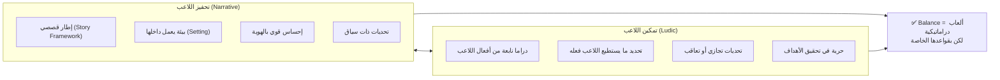
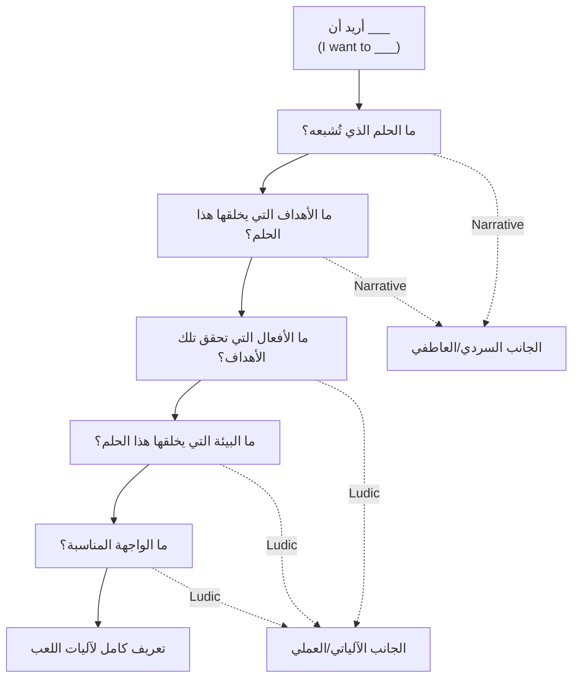

# المحاضرة 6 — Nature of Games (طبيعة الألعاب)
> **المادة:** هندسة البرمجيات (المستوى الرابع) | **الموضوع:** تعريف اللعبة، قرارات التصميم، وفلسفتا Narrative مقابل Ludic (Cornell Game Design Initiative — Lecture 2)

---

## الجزء الأول: الشرح التفصيلي

### 1. تعريف اللعبة (Definitions of Games)

#### 📍 أين نحن الآن؟
نبدأ من أهم سؤال في تصميم الألعاب: ما الذي يجعل شيئاً "لعبة" أصلاً، بدل أن يكون قصة أو أداة أو تجربة تفاعلية عادية؟

#### ⬅️ الربط مع السابق
في محاضرة Godot السابقة تعلّمنا **كيف** نبني لعبة تقنياً (أرضية، لاعب، كاميرا). هذه المحاضرة تسأل **لماذا** — ما الجوهر النظري الذي يحدد أن ما بنيناه هو "لعبة" وليس مجرد برنامج تفاعلي.

#### 💡 الفكرة الأساسية
**هناك تعريفان أكاديميان معتمدان للعبة، وكلاهما يتفقان على أربعة عناصر جوهرية: لاعبون، تحديات، قواعد، وهدف نصر.**

<!-- @type: fact -->
<!-- @render: {type: "theory-first", coverage: "100%"} -->

---

#### 📖 الشرح

المحاضرة تقدّم تعريفين أكاديميين مرجعيين للعبة:

**تعريف Adams** (من كتابه *Fundamentals of Game Design*):
> اللعبة هي شكل من أشكال الترفيه التفاعلي، حيث يجب على اللاعبين التغلّب على تحديات (`Challenges`)، من خلال اتخاذ أفعال تحكمها قواعد (`Rules`)، من أجل تحقيق شرط نصر (`Victory Condition`).

**تعريف Salen & Zimmerman** (من كتابهما *Rules of Play*):
> اللعبة هي نظام يخوض فيه اللاعبون صراعاً مصطنعاً (`Artificial Conflict`)، تحدده القواعد، وينتج عنه نتيجة قابلة للقياس (`Quantifiable Outcome`).

بالنظر للتعريفين معاً (شرح زيادة للفهم)، نلاحظ أن كليهما — رغم اختلاف الصياغة — يتفقان على أربعة عناصر متكررة تُشكّل **جوهر أي لعبة**:
- **`Players`** (لاعبون): "يجب على اللاعبين" / "يخوض فيه اللاعبون"
- **`Challenges`** (تحديات): "التغلّب على تحديات" / "صراع مصطنع"
- **`Rules`** (قواعد): "أفعال تحكمها قواعد" / "تحدده القواعد"
- **`Goals`** (أهداف/نتيجة): "شرط نصر" / "نتيجة قابلة للقياس"

هذه الأربعة عناصر ليست مجرد تعريف نظري جامد — هي عملياً **قائمة تحقق** (checklist) يستخدمها أي مصمم ليتأكد أن ما يبنيه "لعبة" فعلاً، لا مجرد محتوى تفاعلي بلا هدف أو قاعدة.

#### 💡 التشبيه
فكّر بهذه الأربعة عناصر مثل **مكونات وصفة طبخ أساسية** (بروتين، نشويات، خضار، توابل) — أي طبق تفتقد فيه أحد هذه العناصر الأربعة قد يكون طعاماً لذيذاً، لكنه لن يكون "وجبة متكاملة" بالمعنى التصنيفي. بالمثل، أي تجربة تفتقد `Rules` أو `Goals` قد تكون تفاعلية وممتعة، لكنها لن تُصنَّف "لعبة" بالمعنى الدقيق.

#### 🎯 الملخص السريع
- تعريف Adams يركّز على: ترفيه تفاعلي + تحديات + قواعد + شرط نصر
- تعريف Salen & Zimmerman يركّز على: نظام + صراع مصطنع + قواعد + نتيجة قابلة للقياس
- أربعة عناصر مشتركة بين التعريفين: `Players`, `Challenges`, `Rules`, `Goals`

#### 📚 التطبيق
هذه الأربعة عناصر (`Players`, `Goals`, `Rules`, `Challenges`) هي بالضبط ما ستُصبح "قرارات التصميم" الأربعة الأولى التي يناقشها القسم التالي مباشرة — كل عنصر نظري هنا يتحول لسؤال تصميمي عملي هناك.

#### ⚠️ أخطاء شائعة

#### الفهم الخاطئ ❌:
يظن بعض المصممين المبتدئين أن أي تجربة تفاعلية مسلية (كفيديو تفاعلي أو تطبيق استكشافي بلا هدف) تُعتبر "لعبة".

#### الفهم الصحيح ✅:
حسب كلا التعريفين، غياب `Rules` واضحة أو `Goals`/`Victory Condition` محددة يعني أن التجربة — رغم كونها تفاعلية وممتعة — لا تُصنَّف "لعبة" بالمعنى الأكاديمي الدقيق.

#### 📄 النص الأصلي من المحاضرة

عرض النص الأصلي (coverage: 100%)

> Adams: Fundamentals of Game Design — A game is a form of interactive entertainment where players must overcome challenges, by taking actions that are governed by rules, in order to meet a victory condition.
>
> Salen & Zimmerman: Rules of Play — A game is a system in which players engage in artificial conflict, defined by rules, that results in a quantifiable outcome.
>
> [Slide 4 annotates the definitions with four recurring elements: Players, Challenges, Rules, Goals]

**ملاحظة على التغطية:**
- ✓ تم شرح كلا التعريفين حرفياً بالكامل
- ✓ تم استخراج العناصر الأربعة المشتركة كما أشارت الشريحة 4 صريحاً
- ℹ️ إضافة من الدليل: تشبيه وصفة الطبخ، الربط بقرارات التصميم القادمة

---

### 2. قرارات التصميم الأساسية (Design Decisions)

#### 📍 أين نحن الآن؟
بعد استخراج الأربعة عناصر الجوهرية من التعريفين، نحوّلها الآن لأسئلة تصميمية عملية يطرحها أي مصمم لعبة على نفسه.

#### 💡 الفكرة الأساسية
**كل عنصر من عناصر تعريف اللعبة الأربعة (Players, Goals, Rules, Challenges) يقابله مجموعة أسئلة تصميمية محددة يجب الإجابة عليها قبل البدء بالتصميم الفعلي.**

<!-- @type: principle -->
<!-- @render: {type: "theory-first", coverage: "100%"} -->

---

#### 📖 الشرح

**`Players` (اللاعبون):**
- كم عدد اللاعبين في وقت واحد؟
- من أو ما هو اللاعب داخل عالم اللعبة؟ — هذا السؤال يحدد **مفهوم الهوية** (`notion of identity`): هل اللاعب بطل محدد الملامح، أم كيان مجرّد (كمؤشر أو فريق كامل)؟

**`Goals` (الأهداف):**
- ما الذي يحاول اللاعب تحقيقه؟
- هل الهدف تحدده اللعبة نفسها، أم يحدده اللاعب بنفسه؟ — هذا يحدد **محور تركيز اللاعب** (`player focus`): لعبة بهدف واحد واضح (كإنهاء مستوى) تختلف تماماً عن لعبة صندوق-رملي (`sandbox`) يحدد اللاعب أهدافه فيها بحرية.

**`Rules` (القواعد):**
- كيف يؤثّر اللاعب على عالم اللعبة؟
- كيف يتعلّم اللاعب القواعد (تعليمات صريحة؟ تجربة وخطأ؟)؟ — هذا يحدد **حدود اللعبة** (`boundaries of the game`): ما المسموح والممنوع فعله.

**`Challenges` (التحديات):**
- ما العقبات التي يجب على اللاعب التغلّب عليها؟
- هل هناك أكثر من طريقة واحدة للتغلّب عليها؟ — هذا يحدد **جوهر اللعب الفعلي** (`fundamental gameplay`): تحدٍ بطريقة حل واحدة صارمة يعطي تجربة مختلفة جذرياً عن تحدٍ متعدد الحلول.

بعد هذه الأربعة، تضيف المحاضرة ثلاثة قرارات تصميمية "أخرى" (Other Design Decisions) تكمّل الصورة:

**`Game Modes` (أنماط اللعب):**
- كيف تُركَّب التحديات معاً (متتالية؟ متفرّعة؟ حرة؟)؟
- ما سياق التفاعل (لعب فردي، تعاوني، تنافسي)؟

**`Setting` (البيئة/العالم):**
- ما طبيعة عالم اللعبة؟
- ما المنظور (منظور جانبي `side-scroller`، ثلاثي الأبعاد، وغيرها)؟ — لاحظ الترابط المباشر مع قرار `Node2D`/`Node3D` الذي اتخذناه فعلياً في محاضرة Godot!

**`Story` (القصة):**
- ما السرد الذي سيعيشه اللاعب؟
- كيف يتصل هذا السرد بآليات اللعب الفعلية (`gameplay`)؟

#### 💡 التشبيه
هذه القرارات السبعة مثل **استبيان تصميم منزل قبل البناء** (كم غرفة؟ لمن؟ أين المطبخ؟ ما الطابق؟) — بدون الإجابة عليها أولاً، ستبني شيئاً، لكنه لن يكون المنزل الذي تريده فعلاً.

#### 🎯 الملخص السريع
- 4 قرارات جوهرية: `Players`, `Goals`, `Rules`, `Challenges`
- 3 قرارات إضافية مكمّلة: `Game Modes`, `Setting`, `Story`
- كل قرار يُترجَم لأسئلة عملية محددة، لا نظرية مجردة فقط

#### 📚 التطبيق
هذه القرارات هي الأساس الذي بنينا عليه — دون تسميته صريحاً — كل خطوة عملية في محاضرة Godot: اختيار `Node3D` هو قرار `Setting`، وتصميم مفاتيح `up/down/left/right/jump` هو تطبيق مباشر لقرار `Rules`.

#### 🤔 تفعيل الفهم
تخيّل أنك تصمم لعبة صغيرة عن مستكشف يجمع أحجار كريمة في كهف. أجب بسرعة عن الأسئلة الأربعة الجوهرية: من هو اللاعب (هوية)؟ ما هدفه؟ ما القواعد التي تحكم حركته؟ وما التحدي الأساسي (ولو أكثر من طريقة لحله)؟

#### 📄 النص الأصلي من المحاضرة

عرض النص الأصلي (coverage: 100%)

> Players — How many players are there at a time? Who or what is the player in the world? Specifies a notion of identity
>
> Goals — What is the player trying to achieve? Defined by the game or by the player? Specifies the player focus
>
> Rules — How does the player effect the world? How does the player learn the rules? Specifies the boundaries of the game
>
> Challenges — What obstacles must the player overcome? Is there more than one way to overcome them? Specifies the fundamental gameplay
>
> (Other) Design Decisions — Game Modes: How are the challenges put together? What is the interaction context? | Setting: What is the nature of the game world? What is the perspective (e.g. side-scroller, 3D, etc.)? | Story: What narrative will the player experience? How is it connected to gameplay?

**ملاحظة على التغطية:**
- ✓ شرح كل الأسئلة السبعة بالكامل مع توسيع كل نقطة مكثفة
- ℹ️ إضافة من الدليل: تشبيه استبيان المنزل، الربط الصريح بمحاضرة Godot، تفعيل الفهم

---

### 3. طول جلسة اللعب (Play Length)

#### 📍 أين نحن الآن؟
بعد قرارات التصميم الكبرى، ننتقل لقرار عملي أكثر تحديداً: كم يجب أن تدوم "وحدة اللعب" الواحدة ليبقى اللاعب مستمتعاً؟

#### 💡 الفكرة الأساسية
**"أقل وحدة لعب ذات معنى" (`least meaningful unit of play`) تختلف جذرياً حسب المنصة، وقِصَر مدة اللعب لا يعني بالضرورة ضعف عمق الآليات.**

<!-- @type: practice -->
<!-- @render: {type: "theory-first", coverage: "100%"} -->

---

#### 📖 الشرح

السؤال المحوري هنا: **كم أقصر مدة يمكن أن ألعب فيها وأشعر بالمتعة فعلاً؟** — هذا ما تسميه المحاضرة "أقل وحدة معنى للعب".

الإجابة تختلف حسب المنصة بشكل حاد:
- **أجهزة الكونسول (`Console`)**: 30 دقيقة أو أكثر مقبولة كوحدة لعب واحدة
- **الأجهزة المحمولة (`Mobile`)**: لا تتجاوز دقيقة واحدة — اللاعب قد يلعب أثناء انتظار الحافلة مثلاً

اللعب "العَرَضي" (`Casual`) غالباً يعني وحدات لعب قصيرة — **لكن** المحاضرة تنبّه بوضوح: القِصَر لا يعني آليات لعب بسيطة أو سطحية! المثال المذكور: **Plants vs. Zombies** — لعبة يمكن لعبها في جلسات قصيرة جداً، لكن آلياتها (إدارة موارد، استراتيجية دفاع، أنواع نباتات متعددة) عميقة ومتطورة فعلياً.

من هنا، المحاضرة تصل لنقطة نظرية مهمة (شرح زيادة للفهم): **التمييز بين "Casual" و"Core" كتصنيف هو تمييز رديء (`bad distinction`)** — لأنه يخلط بين معيارين مختلفين تماماً: **مدة اللعب** (قصيرة/طويلة) و **عمق الآليات** (بسيطة/معقدة). لعبة قد تكون قصيرة المدة وعميقة الآليات معاً (كـ Plants vs. Zombies)، فتصنيفها كمجرد "Casual" مقابل "Core" يُضيّع هذا الفرق الجوهري.

#### 💡 التشبيه
الفرق بين مدة اللعب وعمق الآليات مثل **الفرق بين طول الوجبة وجودتها** — وجبة سريعة (10 دقائق) قد تكون طبقاً فاخراً ومُحضَّراً بعناية فائقة، بينما وجبة طويلة (ساعتين) قد تكون بسيطة وباهتة. المدة والجودة معياران مستقلان تماماً.

#### 🎯 الملخص السريع
- `Least meaningful unit of play`: أقصر مدة لعب تظل ذات معنى وممتعة
- Console: ≥30 دقيقة | Mobile: <دقيقة واحدة
- Plants vs. Zombies: مثال حقيقي على قِصَر المدة + عمق الآليات معاً
- تصنيف "Casual vs Core" تمييز رديء — يخلط بين معيارين مستقلين (المدة والعمق)

#### 📚 التطبيق
عند تصميم أي لعبة (كما رأينا في مشروع Godot)، يجب تحديد المنصة المستهدفة أولاً (حاسوب/كونسول/موبايل) لأن هذا يحدد مباشرة طول وحدة اللعب المطلوبة، وبالتالي حجم وتيرة التحديات والمكافآت.

#### ⚠️ أخطاء شائعة

#### الفهم الخاطئ ❌:
يظن بعض المصممين المبتدئين أن لعبة "Casual" (وحدات لعب قصيرة) تعني بالضرورة آليات لعب بسيطة وسطحية غير جديرة بالاهتمام التصميمي العميق.

#### الفهم الصحيح ✅:
المحاضرة تستخدم Plants vs. Zombies تحديداً لإثبات العكس — يمكن لوحدة لعب قصيرة جداً أن تحتوي آليات لعب متطورة وعميقة، والتصنيف الصحيح يجب أن يفرّق بين "مدة اللعب" و"عمق الآليات" كمعيارين مستقلين لا معياراً واحداً مدمجاً.

#### 📄 النص الأصلي من المحاضرة

عرض النص الأصلي (coverage: 100%)

> How short a game can I play and have fun? Least meaningful unit of play. Console: 30 minutes+ is acceptable. Mobile: No more than a minute. Casual often means short play units. But can have sophisticated gameplay! Example: Plants vs. Zombies. But casual vs core is a bad distinction.

**ملاحظة على التغطية:**
- ✓ شرح كامل لكل نقطة، شامل السؤال المحوري والمثال والاستنتاج النظري النهائي
- ℹ️ إضافة من الدليل: تشبيه الوجبة، الربط بقرار المنصة المستهدفة

---

### 4. فلسفتا التصميم المتنافستان: Narrative مقابل Ludic

#### 📍 أين نحن الآن؟
بعد فهم قرارات التصميم المنفردة، نواجه الآن السؤال الأكبر: هل نصمم اللعبة حول **القصة** أم حول **الآليات**؟ هذا هو أهم انقسام فلسفي في تصميم الألعاب.

#### ⬅️ الربط مع السابق
هذا الانقسام يعيد تنظيم كل القرارات السابقة (`Story` مقابل `Rules`/`Challenges`) في إطار فلسفي واحد شامل.

#### 💡 الفكرة الأساسية
**مدرسة `Narrative` ترى الألعاب كوسيط لسرد القصص، بينما مدرسة `Ludic` تراها كأنظمة آليات وقواعد — وكل مدرسة لها مزايا وعيوب واضحة ومتعارضة.**

<!-- @type: principle -->
<!-- @render: {type: "diagram-first", coverage: "100%"} -->

---

#### 📊 المخطط: مقارنة Narrative مقابل Ludic

| المحور | `Narrative` (السردية) | `Ludic` (الآلياتية) |
| --- | --- | --- |
| **الرؤية الأساسية** | الألعاب وسيط لسرد القصص | الألعاب تدور حول الآليات (`Mechanics`) |
| **التركيز** | سرد القصة | اللعب والقواعد (`Gameplay, Rules`) |
| **البنية** | هيكل سردي تقليدي (بداية-وسط-نهاية) | السرد يكون في حده الأدنى أو غائباً |
| **الميزة الأولى** | مؤثّرة عاطفياً (`Emotionally compelling`) | تركيز على وكالة اللاعب (`Player Agency`) |
| **الميزة الثانية** | رؤية فنية قوية | آليات لعب محكمة ومحددة جيداً |
| **العيب الأول** | صوت الكاتب يطغى على صوت اللاعب | ضعف في دافعية اللاعب (`Player Motivation`) |
| **العيب الثاني** | آليات لعب ضعيفة التعريف | صعوبة تمييز اللعبة عن غيرها |

---

#### 📖 الشرح

**مدرسة `Narrative`** ترى أن الألعاب هي — في جوهرها — وسيط لسرد القصص، تماماً كالأفلام أو الروايات. تركيزها الأساسي على القصة نفسها، وتتبع بنية سردية تقليدية (مقدمة، صراع، حل). ميزتاها الأساسيتان: قدرة قوية على التأثير العاطفي في اللاعب، ورؤية فنية/إخراجية قوية ومتماسكة. لكن عيبها الأساسي: قد يطغى "صوت الكاتب" (الرؤية المُسبقة للقصة) على "صوت اللاعب" (حريته في اتخاذ القرار)، وأحياناً تأتي آليات اللعب نفسها ضعيفة التصميم لأن التركيز كله كان على السرد.

**مدرسة `Ludic`** (من الكلمة اللاتينية *ludus* بمعنى "لعب" — شرح زيادة للفهم) ترى أن جوهر اللعبة هو آلياتها وقواعدها، والسرد فيها في أدنى مستوياته أو حتى غائب كلياً. ميزتاها: تركيز قوي على "وكالة اللاعب" (`Player Agency`) — أي شعور اللاعب بأن قراراته الفعلية هي ما يحرّك التجربة، وآليات لعب محكمة ومصقولة جيداً. عيبها: قد يفقد اللاعب الدافع العاطفي للاستمرار (لماذا أفعل هذا أصلاً؟)، وقد يصعب تمييز اللعبة عن ألعاب أخرى مشابهة آلياتياً بدون هوية سردية تميّزها.

#### 💡 التشبيه
`Ludic` مثل **الهيكل الإنشائي لمبنى** (أعمدة، أساسات، توزيع غرف وظيفي) — متين وعملي لكن قد يبدو بلا روح بمفرده. `Narrative` مثل **الديكور والتصميم الداخلي** — يعطي المبنى هوية وجواً عاطفياً، لكن ديكور جميل فوق هيكل ضعيف قد ينهار. وجه الشبه: أفضل الألعاب (كأفضل المباني) تحتاج الهيكل والديكور معاً، لا أحدهما فقط.

#### ⚖️ المقايضة: Narrative مقابل Ludic

| الجانب | Narrative | Ludic |
| --- | --- | --- |
| **المزايا** | تأثير عاطفي قوي، رؤية فنية متماسكة | وكالة لاعب قوية، آليات محكمة |
| **العيوب** | قد يطغى الكاتب على اللاعب، آليات ضعيفة | ضعف الدافعية العاطفية، صعوبة التمييز |
| **الأنسب لـ** | ألعاب تركّز على التجربة القصصية الغامرة | ألعاب تركّز على التحدي والمهارة الخالصة |

#### 🎯 الملخص السريع
- `Narrative`: الألعاب = وسيط قصصي، ميزتها التأثير العاطفي، عيبها طغيان الكاتب
- `Ludic`: الألعاب = نظام آليات، ميزتها وكالة اللاعب، عيبها ضعف الدافعية
- لا مدرسة "أفضل" مطلقاً — كل واحدة مناسبة لنوع تجربة مختلف

#### 📚 التطبيق
هذا الانقسام يُحلّ عملياً في القسم القادم من خلال فكرة "التوازن" — إظهار أن أفضل الألعاب لا تختار مدرسة واحدة بشكل متطرف، بل توازن بينهما بوعي.

#### ⚠️ أخطاء شائعة

#### الفهم الخاطئ ❌:
يظن بعض الطلاب أن `Ludic` و`Narrative` نقيضان لا يمكن الجمع بينهما، وأن على المصمم اختيار واحدة فقط بشكل حصري ونهائي.

#### الفهم الصحيح ✅:
المحاضرة توضّح في القسم القادم مباشرة أن أفضل تصميم للألعاب هو **توازن** بين الاثنين — تحفيز اللاعب عاطفياً (Narrative) مع تمكينه فعلياً من التصرف والتأثير (Ludic) في الوقت نفسه.

#### 📄 النص الأصلي من المحاضرة

عرض النص الأصلي (coverage: 100%)

> Dueling Design Philosophies — Narrative: Games are a story medium. Focuses on storytelling. Traditional narrative structure. Advantages: Emotionally compelling, Strong artistic vision. Disadvantages: Author voice over player voice, Poorly defined mechanics.
>
> Ludic: Games are about mechanics. Focus on gameplay, rules. Storytelling is minimal. Advantages: Focus on player agency, Tight, well-defined gameplay. Disadvantages: Lack of player motivation, Hard to distinguish yourself.

**ملاحظة على التغطية:**
- ✓ شرح كامل للفلسفتين مع كل المزايا والعيوب المذكورة حرفياً
- ℹ️ إضافة من الدليل: أصل كلمة Ludic، تشبيه الهيكل/الديكور، جدول المقايضة

---

### 4.1. مخاطر التطرّف: القصة الخالصة والآليات الخالصة

#### 📍 أين نحن الآن؟
قبل الوصول لحل "التوازن"، المحاضرة تُظهر بصرياً (بأمثلة) خطورة الانحياز الكامل لأي من الفلسفتين.

#### 💡 الفكرة الأساسية
**التطرّف الكامل نحو أي فلسفة — قصة خالصة بلا فعل، أو آليات خالصة بلا معنى — يُنتج تجربة لعب ضعيفة.**

<!-- @type: fact -->
<!-- @render: {type: "theory-first", coverage: "80%"} -->

---

#### 📌 ملاحظة: محتوى من المحاضرة الأصلية
الصفحات 10-13 كانت **صوراً/رسوماً توضيحية بلا نص مستخرَج** في المحاضرة الأصلية (قسمان: "مخاطر القصة الخالصة" و"لكن Ludic ليست كل شيء أيضاً"). راجع هذه الصفحات في `Intro GP.pdf` للرؤية البصرية الكاملة.

**ملخص المحتوى (مستنتج من السياق المحيط):**
- **الصفحتان 10-11 (مخاطر القصة الخالصة):** تعرضان مثالاً بصرياً — على الأرجح لقطة شاشة من لعبة ذات مشاهد سينمائية طويلة (`cutscenes`) — يتبعها سؤال المحاضرة المباشر: **"ماذا يفعل اللاعب؟"** (`What is the player doing?`). هذا السؤال بلاغي يوضّح المشكلة الجوهرية: لعبة تُفرِط في السرد قد تحوّل اللاعب لمُشاهد سلبي بلا فعل حقيقي — وهذا يُناقض تعريف اللعبة نفسه من القسم الأول (`Players must take actions`).
- **الصفحتان 12-13 (Ludic ليست كل شيء):** تعرضان على الأرجح مثالاً بصرياً لآليات لعب مجردة جداً (شبكة أو نظام هندسي بلا سياق أو هوية) — لتوضيح أن آليات محكمة تقنياً بلا أي سياق أو دافع عاطفي قد تكون "صحيحة" هندسياً لكنها مملة وغير جاذبة لللاعب.

#### 📖 الشرح

هذان المثالان (شرح زيادة للفهم) يُشكّلان حجة مرئية قوية: **السؤال "ماذا يفعل اللاعب؟" هو اختبار سريع وعملي** يمكن لأي مصمم تطبيقه على تصميمه الخاص — لو كانت الإجابة "يشاهد فقط" أو "لا شيء ذو معنى"، فهذا مؤشر خطر واضح على انحياز مفرط نحو `Narrative` الخالصة. بالمقابل، لو كانت اللعبة كلها أرقاماً وأنظمة بلا أي سياق يشرح "لماذا يهمني هذا؟"، فهذا مؤشر خطر على انحياز مفرط نحو `Ludic` الخالصة.

#### 🎯 الملخص السريع
- القصة الخالصة بلا فعل: اللاعب يتحول لمُشاهد سلبي (يناقض تعريف اللعبة نفسه)
- الآليات الخالصة بلا سياق: تجربة محكمة تقنياً لكنها بلا دافع عاطفي أو جاذبية
- اختبار سريع: اسأل "ماذا يفعل اللاعب هنا فعلياً؟" لتقييم أي تصميم

#### 📚 التطبيق
هذان الخطران المتعارضان هما بالضبط ما يدفع المحاضرة لتقديم مفهوم "التوازن" في القسم القادم كحل عملي وحيد.

#### 📄 النص الأصلي من المحاضرة

عرض النص الأصلي (coverage: 80%)

> The Dangers of Pure Story — [صورة بلا نص] — What is the player doing?
> But Ludic is Not Everything — [صورة بلا نص] — [صورة بلا نص]

**ملاحظة على التغطية:**
- ✓ تم شرح النص المتوفر بالكامل (سؤال "ماذا يفعل اللاعب؟" وعنوان القسمين)
- ⚠️ لم يتم استخراج محتوى الصور نفسها لأنها لقطات بصرية بلا نص برمجي — الوصف أعلى مستنتج من السياق فقط، لا من محتوى الصورة الفعلي
- ℹ️ إضافة من الدليل: صياغة "اختبار ماذا يفعل اللاعب" كأداة تصميم عملية

---

### 4.2. تصميم الألعاب كتوازن (Game Design Must Be a Balance)

#### 📍 أين نحن الآن؟
هذا هو الحل النظري لانقسام Narrative/Ludic: التصميم الجيد ليس اختياراً حصرياً، بل توازن مقصود بين تحفيز اللاعب وتمكينه.

#### 💡 الفكرة الأساسية
**التصميم الجيد يوازن بين "تحفيز اللاعب" (`Motivate the Player`) عبر عناصر Narrative و"تمكين اللاعب" (`Empower the Player`) عبر عناصر Ludic في آن واحد.**

<!-- @type: principle -->
<!-- @render: {type: "diagram-first", coverage: "100%"} -->

---

#### 📊 المخطط: التوازن بين التحفيز والتمكين

---

#### 📖 الشرح

**تحفيز اللاعب (`Motivate the Player`)** — الجانب المستمَد من `Narrative` — يحتاج: إطاراً قصصياً (`story framework`) يعمل اللاعب داخله، بيئة (`setting`) واضحة، إحساساً قوياً بالهوية (من أنا في هذا العالم؟)، وتحديات ذات سياق (لماذا هذا التحدي مهم لقصتي؟).

**تمكين اللاعب (`Empower the Player`)** — الجانب المستمَد من `Ludic` — يحتاج: دراما تنبع من **أفعال اللاعب نفسه** لا من نص مكتوب مسبقاً، تحديداً واضحاً لما يستطيع اللاعب فعله فعلياً، تحديات تُجازي النجاح وتُعاقب الفشل بوضوح، وحرية حقيقية في طريقة تحقيق الأهداف.

الخلاصة النظرية المحورية التي تصل إليها المحاضرة (شرح زيادة للفهم): **"الألعاب دراماتيكية، لكن لها اتفاقيّاتها الخاصة"** (`Games are dramatic, but they have their own conventions`) — يعني أن الألعاب يمكنها أن تكون مؤثرة عاطفياً كالأفلام، لكن الطريقة التي تحقق بها هذا التأثير مختلفة جوهرياً: ليس عبر السرد المُشاهَد فقط، بل عبر ما يفعله اللاعب بنفسه.

#### 💡 التشبيه
التوازن بين التحفيز والتمكين مثل **مدرّس رياضة جيد** — يحفّزك بقصة/رؤية ("تخيّل نفسك تفوز بالبطولة")، لكنه أيضاً يمكّنك فعلياً بتعليمك المهارات والقواعد الحقيقية لتحقيق ذلك بنفسك. مدرّس يحفّز فقط بلا تمكين ينتج حماساً بلا نتيجة، ومدرّس يمكّن فقط بلا تحفيز ينتج مهارة بلا دافع للاستمرار.

#### 🎯 الملخص السريع
- `Motivate` (من Narrative): إطار قصصي + بيئة + هوية + سياق للتحديات
- `Empower` (من Ludic): دراما من أفعال اللاعب + قدرات واضحة + مجازاة/معاقبة + حرية
- الخلاصة: الألعاب دراماتيكية لكن بقواعدها الخاصة — لا تُقلّد السرد السينمائي حرفياً

#### 📚 التطبيق
هذا التوازن هو تحديداً ما يجب أن يسعى له أي مشروع تخرج (`GP` = Graduation Project) في تصميم الألعاب — لا الانحياز الكامل لقصة أو لآليات، بل مزيج مقصود.

#### 📄 النص الأصلي من المحاضرة

عرض النص الأصلي (coverage: 100%)

> Game Design Must Be a Balance — Motivate the Player: Needs a story framework, Setting to work within, Strong sense of identity, Challenges with context. Empower the Player: Drama from player actions, Define what the player can do, Challenges reward or punish, Freedom in achieving goals. Games are dramatic, but they have their own conventions.

**ملاحظة على التغطية:**
- ✓ شرح كامل لكل نقاط التحفيز والتمكين والخلاصة النظرية النهائية
- ℹ️ إضافة من الدليل: مخطط Mermaid، تشبيه المدرّب الرياضي، الربط بمشروع التخرج

---

### 4.3. توجّه هذا المقرر: التركيز على Ludic

#### 📍 أين نحن الآن؟
بعد فهم أن التوازن هو المثال النظري الأعلى، توضّح المحاضرة موقفاً عملياً صريحاً: هذا المقرر بالتحديد سيميل عملياً نحو `Ludic`.

#### 💡 الفكرة الأساسية
**هذا المقرر يركّز على أدوات التصميم القابلة للتدريب (`Ludic`) لأنها تُمارَس وتُعلَّم عملياً، بينما التوازن الكامل مع Narrative مسؤولية الطالب نفسه.**

<!-- @type: fact -->
<!-- @render: {type: "theory-first", coverage: "100%"} -->

---

#### 📖 الشرح

المحاضرة تصرّح بوضوح: **سيركّز هذا المقرر على أدوات التصميم الآلياتية** (`design tools`) — تحديداً لأنها تقنيات يمكن تدريب الطلاب عليها فعلياً، واستخدامها يحتاج ممارسة، وتطبيقها يحمل تحديات تقنية حقيقية (تماماً كما رأينا في تعقيدات تطبيق Godot).

لكن المحاضرة تُقرّ صراحة أن **التصميم أكبر من هذا بكثير** (`design is much more`): "تستخدم الأدوات لخلق فن" — يعني الأدوات التقنية (Ludic) هي الوسيلة، لا الغاية النهائية للتصميم الجيد. وهذا النوع من الفهم الشامل **لا يمكن تعلّمه إلا بالممارسة** (`can only learn by doing`)، مع نقد وملاحظات من المدرّسين — بالضبط كما تعمل مساقات الاستوديو الفني (`studio course`) في الفنون التطبيقية.

الخلاصة العملية للطالب: **"الحفاظ على التوازن مسؤوليتك أنت"** (`Keeping balance is up to you`) — المقرر يزوّدك بأدوات Ludic، لكن مسؤوليتك كمصمم أن توازنها مع عناصر Narrative بنفسك في مشاريعك الخاصة.

#### 🎯 الملخص السريع
- المقرر يركّز عملياً على أدوات Ludic لأنها قابلة للتدريب والممارسة
- الأدوات هي وسيلة لخلق فن، لا غاية نهائية بذاتها
- التعلّم الحقيقي يحدث بالممارسة والنقد، كمساق استوديو فني
- الحفاظ على التوازن الكامل (Narrative + Ludic) مسؤولية الطالب/المصمم شخصياً

#### 📚 التطبيق
هذا التوضيح يمهّد مباشرة لمنهجية عملية محددة لتوليد أفكار لعب متوازنة — وهي "منهج Adams" الذي يليه مباشرة.

#### 📄 النص الأصلي من المحاضرة

عرض النص الأصلي (coverage: 100%)

> But This Course Will Be Ludic-Centric — Will focus on design tools. Techniques that we can train. Using them requires practice. Implementing them has technical challenges. But design is much more. You use tools to create art. Can only learn by doing. With critiques from us. Like a studio course. Keeping balance is up to you.

**ملاحظة على التغطية:**
- ✓ شرح كامل ودقيق لكل نقاط هذا القسم
- ℹ️ إضافة من الدليل: الربط بتحديات Godot التقنية كمثال ملموس على "technical challenges"

---

### 5. منهج Adams (Wish-Fulfillment Approach)

#### 📍 أين نحن الآن؟
بعد الفهم النظري الكامل، تقدّم المحاضرة أداة عملية محددة لبدء تصميم أي لعبة من الصفر: "منهج Adams" القائم على تحقيق الأمنيات.

#### ⬅️ الربط مع السابق
هذا المنهج هو **تطبيق مباشر لمبدأ التوازن**: أسئلته الأولى (الحلم، الأهداف) من عالم Narrative، وأسئلته اللاحقة (الأفعال، الواجهة) من عالم Ludic.

#### 💡 الفكرة الأساسية
**منهج Adams يبدأ التصميم من عبارة "أريد أن ___"، ثم يستخرج منها خمسة أسئلة متتالية تحدد اللعبة كاملة، من الحلم العاطفي إلى الآليات الفعلية.**

<!-- @type: practice -->
<!-- @render: {type: "diagram-first", coverage: "100%"} -->

---

#### 📊 المخطط: تدفّق منهج Adams

---

#### 📖 الشرح

منهج Adams يقوم على فكرة أن **الألعاب هي تحقيق أمنيات** (`wish-fulfillment`) — يبدأ المصمم بعبارة بسيطة: **"أريد أن ___"** (`I want to ___`)، ويملأ الفراغ بأي أمنية بشرية أساسية (أريد أن أطير، أريد أن أكون بطلاً، أريد أن أبني شيئاً عظيماً...).

من هذه العبارة، يطرح المنهج خمسة أسئلة متتالية:

1. **ما الحلم الذي تُشبعه؟** (`What dream are you satisfying?`) — سؤال عاطفي/سردي جوهري
2. **ما الأهداف التي يخلقها هذا الحلم؟** (`What goals does this dream create?`) — سؤال يترجم الحلم لغايات ملموسة
3. **ما الأفعال التي تحقق تلك الأهداف؟** (`What actions achieve those goals?`) — سؤال ينتقل من "الأهداف" إلى "الآليات" الفعلية
4. **ما البيئة التي يخلقها هذا الحلم؟** (`What setting does this dream create?`) — سؤال يحدد عالم اللعبة
5. **ما الواجهة المناسبة؟** (`What is the appropriate interface?`) — سؤال يحدد كيف يتفاعل اللاعب فعلياً (لوحة مفاتيح؟ لمس؟ حركة؟)

الخطوة الأخيرة: **استخدام هذه الإجابات لتعريف آليات اللعب** (`Use this to define gameplay`) — أي أن هذه الأسئلة الخمسة، بمجرد الإجابة عليها، تعطي مخططاً كاملاً تقريباً لتصميم اللعبة.

المحاضرة نفسها (في شريحة تالية) تصنّف هذه الأسئلة الخمسة صراحة إلى فئتين — وهو **تطبيق مباشر ومقصود لمبدأ التوازن** الذي شرحناه في القسم السابق:
- **`Narrative`**: السؤالان الأول والثاني (الحلم، الأهداف) — الجانب العاطفي/السردي
- **`Ludic`**: الأسئلة الثالث والرابع والخامس (الأفعال، البيئة، الواجهة) — الجانب الآلياتي العملي

#### 💡 التشبيه
منهج Adams مثل **تحويل حلم إلى مشروع عمل حقيقي** — تبدأ بحلم مجرد ("أريد أن أفتح مطعماً")، ثم تُترجمه تدريجياً لأهداف (زبائن راضون)، أفعال (طبخ، خدمة)، بيئة (مكان المطعم)، وواجهة (كيف يطلب الزبون؟ قائمة ورقية أم تطبيق؟). كل خطوة تقرّبك من حلم مجرد إلى مشروع قابل للتنفيذ فعلياً.

#### 🎯 الملخص السريع
- المنهج يبدأ من عبارة "أريد أن ___" كنقطة انطلاق عاطفية
- 5 أسئلة متتالية: الحلم → الأهداف → الأفعال → البيئة → الواجهة
- الأسئلة الأولى (1-2) سردية (`Narrative`)، الأخيرة (3-5) آلياتية (`Ludic`)
- النتيجة النهائية: تعريف عملي كامل لآليات اللعب

#### 📚 التطبيق
هذا المنهج هو أداة عملية مباشرة يمكن لأي طالب استخدامها فوراً عند بدء التفكير بمشروع تخرج أو لعبة شخصية — يحوّل فكرة مجردة (حلم) إلى مواصفات تصميم عملية قابلة للتنفيذ.

#### 🤔 تفعيل الفهم
طبّق منهج Adams على فكرتك الخاصة: أكمل عبارة "أريد أن ___" بأي حلم تختاره، ثم أجب بسرعة عن الأسئلة الخمسة. أي من إجاباتك تنتمي لـ Narrative، وأيها تنتمي لـ Ludic؟

#### 📄 النص الأصلي من المحاضرة

عرض النص الأصلي (coverage: 100%)

> The Adams Approach — Games as wish-fulfillment. I want to _________. Questions to answer: What dream are you satisfying? What goals does this dream create? [Narrative] What actions achieve those goals? What setting does this dream create? What is the appropriate interface? [Ludic] Use this to define gameplay.

**ملاحظة على التغطية:**
- ✓ شرح كامل للمنهج والأسئلة الخمسة مع تصنيفها Narrative/Ludic كما أشارت الشريحة صريحاً
- ℹ️ إضافة من الدليل: مخطط Mermaid، تشبيه المطعم، تفعيل الفهم

---

### 6. استكشاف تجارب اللعب المتنوعة (Exploring Gameplay)

#### 📍 أين نحن الآن؟
بعد أداة التصميم النظرية (منهج Adams)، تقدّم المحاضرة نصيحة عملية أساسية: لا يمكنك تصميم ألعاب جيدة دون أن تلعب أنواعاً متعددة منها أولاً.

#### 💡 الفكرة الأساسية
**لتصميم الألعاب، يجب أن تلعب الألعاب — وتحديداً أنواعاً متنوعة، لا نوعاً واحداً متكرراً.**

<!-- @type: practice -->
<!-- @render: {type: "theory-first", coverage: "100%"} -->

---

#### 📖 الشرح

المبدأ الأساسي هنا بسيط ومباشر: **"لتصميم الألعاب، يجب أن تلعب الألعاب!"** (`To design games, you must play games!`) — وتحديداً، يجب أن **تُجرّب أنواعاً مختلفة من تجارب اللعب**، لا أن تلعب نوع اللعبة نفسه بشكل متكرر ومحدود.

المحاضرة توصي بمصادر عملية محددة: **بوّابات الألعاب المصغّرة (`Flash portals`)** — رغم قِدَم هذه التقنية تحديداً — لا تزال مصدراً جيداً، لأن الألعاب فيها **صغيرة لكنها تركّز بالكامل على آليات اللعب** (`focus entirely on gameplay`) بلا تشتيت بصري أو سردي معقّد. مثالان محدَّدان: **Kongregate** و **Armor Games**، ويوصف كلاهما بأنهما "من أفضل" هذه المصادر.

نصيحة عملية إضافية (شرح زيادة للفهم): إن كنت تبحث عن مرجع لنوع معين — مثلاً **ألعاب الألغاز (`Puzzle games`)** — فابدأ البحث في **Kongregate أولاً**، لأنها معروفة بتنوّع وجودة ألعاب هذا النوع تحديداً.

أخيراً، تربط المحاضرة هذا المبدأ بالممارسة الفعلية للمقرر: **هذه الطريقة بالضبط ستُستخدم في منصة "Piazza" طوال الفصل الدراسي** — أي أن استكشاف ألعاب متنوعة ليس نصيحة نظرية فقط، بل جزء فعلي من متطلبات المقرر.

#### 💡 التشبيه
استكشاف أنواع لعب متعددة مثل **قراءة أنواع أدبية مختلفة قبل كتابة روايتك الأولى** — كاتب يقرأ فقط نوعاً واحداً (الرعب مثلاً) سيكتب دائماً بأسلوب محدود، بينما من يقرأ الرعب والرومانسية والخيال العلمي معاً يمتلك مفردات سردية أوسع بكثير.

#### 🎯 الملخص السريع
- المبدأ: يجب أن تلعب أنواعاً متعددة، لا نوعاً واحداً متكرراً
- المصدر الموصى به: بوّابات ألعاب Flash المصغّرة (Kongregate، Armor Games)
- نصيحة عملية: تبحث عن نوع معين (كالألغاز)؟ ابدأ من Kongregate
- هذا مبدأ عملي فعلي سيُستخدم في منصة Piazza طوال الفصل

#### 📚 التطبيق
هذا الاستكشاف الواسع يغذّي مباشرة القدرة على تطبيق منهج Adams بفعالية — كلما لعبت أنواعاً أكثر، كلما استطعت الإجابة على أسئلة "الأفعال" و"الواجهة" بخيارات أوسع وأكثر إبداعاً.

#### 📄 النص الأصلي من المحاضرة

عرض النص الأصلي (coverage: 100%)

> Exploring Gameplay — To design games, you must play games! Experience many different types of gameplay. Do not play the same type of game all the time. Flash portals are still a good resource. Games are small but focus entirely on gameplay. Kongregate & Armor Games are some of the best. Puzzle game? Look at Kongregate first. This is how we will use Piazza this semester.

**ملاحظة على التغطية:**
- ✓ شرح كامل لكل نقطة، شامل أسماء المصادر المحددة (Kongregate, Armor Games, Piazza)
- ℹ️ إضافة من الدليل: تشبيه القراءة الأدبية المتنوعة، الربط بمنهج Adams

---

### 7. أهداف واقعية لمشروع التصميم (Have Realistic Goals)

#### 📍 أين نحن الآن؟
بعد الاستعداد النظري والاستكشافي، تقدّم المحاضرة معايير عملية محددة لحجم وجودة أي مشروع لعبة (كمشروع التخرج `GP` الذي تحمل هذه المحاضرة اسمه).

#### 💡 الفكرة الأساسية
**الهدف الواقعي لمشروع لعبة هو حجم لعبة موبايل مستقلة (`indie mobile game`) — الجودة تتفوّق دائماً على الكمّية.**

<!-- @type: practice -->
<!-- @render: {type: "theory-first", coverage: "100%"} -->

---

#### 📖 الشرح

المحاضرة تحدد معياراً ملموساً للحجم المستهدف: **حجم لعبة موبايل مستقلة (`indie mobile game`)** — بمعنى:
- يمكن لعبها **فوراً** مع **حد أدنى من الشرح التعليمي** (`minimal tutorial`) — لا حاجة لدليل استخدام طويل قبل البدء
- تحتوي **آليات جوهرية قليلة، مع بعض التنويعات عليها** (`a few core mechanics with some variation`) — عمق من خلال تنويع القليل، لا تكديس آليات كثيرة غير مرتبطة

**المعيار الأهم في هذا القسم**: **الجودة تتفوّق على الكمّية** (`Quality over Quantity`) — والمثال المباشر المذكور: **"عشرة مستويات مذهلة أفضل من 30 مستوى رديء"** (`Ten amazing levels > 30 poor levels`). هذا مبدأ حاسم لأي فريق صغير أو طالب يعمل بموارد ووقت محدودين (تماماً كسيناريو مشروع تخرج).

نصيحة تكميلية: **وازن بين عدد التحديات وحجم المستوى** (`Balance number of challenges with level size`) — لا تُحمّل مستوى صغيراً بتحديات كثيرة جداً، ولا مستوى كبيراً بتحديات قليلة جداً.

وأخيراً تحذير محدد: **تجنّب "تضخّم الميزات" (`feature bloat`)** — والمثال المباشر المذكور: `power ups` (عناصر تقوية اللاعب) — أي إضافة ميزات كثيرة "لأنها ممكنة" بدون تقييم حقيقي إن كانت تُحسّن التجربة الأساسية فعلاً أم تُشتّتها فقط.

المحاضرة تُنهي هذا القسم بوعد/تحذير عملي مباشر للطلاب: **"سنقدّم لكم ملاحظات مستمرة (`constant feedback`) حول هذا"** — أي أن الحفاظ على أهداف واقعية (لا مبالغ فيها) هو معيار سيُراجَع باستمرار طوال المشروع، لا فقط في التسليم النهائي.

#### 💡 التشبيه
"الجودة تتفوّق على الكمّية" مثل **الفرق بين مطعم يقدّم 5 أطباق ممتازة معدَّة بعناية، ومطعم يقدّم 20 طبقاً متوسط الجودة** — الزبون سيتذكّر ويُقيّم المطعم الأول أعلى بكثير، لأن التميّز في القليل يترك انطباعاً أقوى من الكثرة العادية.

#### 🎯 الملخص السريع
- الهدف الواقعي: حجم لعبة موبايل مستقلة (indie mobile game)
- يجب اللعب فوراً بأقل شرح ممكن + آليات جوهرية قليلة مع تنويع
- القاعدة الذهبية: عشرة مستويات مذهلة > 30 مستوى رديء
- تجنّب تضخّم الميزات (كإضافة power-ups كثيرة بلا سبب حقيقي)

#### 📚 التطبيق
هذه المعايير عملية بشكل مباشر لأي مشروع تخرج فعلي — تحدد بوضوح متى "يكفي" العمل على مستوى/ميزة والانتقال لتلميع ما هو موجود بدل إضافة المزيد.

#### ⚠️ أخطاء شائعة

#### الفهم الخاطئ ❌:
يظن بعض الطلاب المبتدئين أن مشروعاً أكبر (عدد مستويات أكثر، ميزات أكثر) يعني بالضرورة تقييماً أعلى أو انطباعاً أفضل.

#### الفهم الصحيح ✅:
المحاضرة تنص صريحاً على العكس تماماً — "عشرة مستويات مذهلة أفضل من 30 مستوى رديء" — التركيز على تلميع كمّية أصغر من المحتوى يُعطي نتيجة أفضل من تشتيت الجهد على كمّية أكبر ومتوسطة الجودة.

#### 📄 النص الأصلي من المحاضرة

عرض النص الأصلي (coverage: 100%)

> Have Realistic Goals — Goal: Size of a indie mobile game. Can be played instantly with minimal tutorial. A few core mechanics with some variation. Quality over Quantity. Ten amazing levels > 30 poor levels. Balance number of challenges with level size. Avoid feature bloat (e.g. power ups). We will give you constant feedback on this.

**ملاحظة على التغطية:**
- ✓ شرح كامل لكل معيار مذكور، شامل المثال العددي المحدد (10 مقابل 30)
- ℹ️ إضافة من الدليل: تشبيه المطعم، الربط بسياق مشروع التخرج

---

### 8. أمثلة تجارية وأمثلة من فصول سابقة

#### 📍 أين نحن الآن؟
تُنهي المحاضرة بربط كل هذه المفاهيم النظرية بأمثلة حقيقية — تجارية معروفة، وأخرى من مشاريع طلاب سابقين في هذا المقرر بالتحديد.

#### 💡 الفكرة الأساسية
**كل مبدأ نظري سبق شرحه (توازن، تركيز على آليات قليلة، حجم واقعي) يمكن رؤيته فعلياً في ألعاب `indie` تجارية ناجحة، وفي مشاريع طلاب سابقين مماثلة تماماً لما سيُطلب من طلاب هذا الفصل.**

<!-- @type: fact -->
<!-- @render: {type: "theory-first", coverage: "100%"} -->

---

#### 📖 الشرح

المحاضرة تقدّم قائمة أمثلة تجارية (شرح زيادة للفهم لكل واحدة بحسب طبيعتها المعروفة):
- **Braid**: لعبة منصات-ألغاز (`Puzzle Platformer`) بآلية أساسية واحدة مميزة: التحكم بالزمن (السفر عبر الزمن) — مثال مباشر على "آليات جوهرية قليلة مع تنويع عميق"
- **Limbo**: لعبة منصات مظلمة بفيزياء واقعية — مثال على هوية بصرية/جوية (Setting) قوية بأقل الموارد
- **Hotline Miami**: لعبة تسلّل وأكشن من منظور علوي (`Top-down`) — مثال على آليات Ludic سريعة ومحكمة
- **Clash of Heroes**: مزيج بين لعبة "طابق 3" (`Match 3`) واستراتيجية تعتمد على الأدوار (`Turn-based`) — مثال على دمج نوعين مختلفين من الآليات في نظام واحد متماسك
- **Guild of Dungeoneering**: مزيج بين لعبة تقمّص أدوار (`RPG`) وبطاقات قابلة للتجميع (`CCG`) — يستخدم اللاعب البطاقات لبناء الزنزانة (`Dungeon`) التي يستكشفها هو نفسه بعد ذلك، وهو مثال إبداعي على ربط "الأداة" (البطاقات) بـ"التحدي" (الاستكشاف)
- **Monument Valley**: لعبة استكشاف قائمة على الألغاز، معروفة بهويتها الفنية/البصرية المميزة جداً — مثال على Setting فني قوي كجزء أساسي من هوية اللعبة

المحاضرة تُلخّص هذه القائمة بملاحظة توجيهية صريحة ومهمة: **"فكّر بألعاب مستقلة (`indie`)، لا ألعاباً معلّبة تُباع في المتاجر (`boxed retail`)"** — أي أن الطموح المرجعي المناسب لمشروع طالب هو نطاق وحجم استوديو `indie` صغير، لا استوديوهات ضخمة (`AAA`).

بعد ذلك، تقدّم المحاضرة **أمثلة حقيقية من مشاريع طلاب فصول سابقة في هذا المقرر بالتحديد** (شرح زيادة للفهم: هذا دليل عملي مباشر على أن "الأهداف الواقعية" المذكورة في القسم السابق قابلة للتحقيق فعلاً من قِبل طلاب):
- **Mount Sputnick** (ربيع 2017): لعبة تسلّق صخور تنافسية
- **Arc en Ciel** (ربيع 2015): لعبة منصات يرسم فيها اللاعب أرصفة (`Platforms`)، بينما يمحوها عدو في نفس الوقت
- **Dash** (ربيع 2014): لعبة أكشن بآلية "الاندفاع" (`Dash`) لتجنّب الأعداء والعقبات
- **Exodus Protocol** (ربيع 2013): لعبة استراتيجية بطراز X-Com، لكنها مبنية حول ثلاث وحدات فقط (مثال آخر على "آليات قليلة مع عمق")
- **Ensembler** (خريف 2011): لعبة إيقاعية بموسيقى كلاسيكية، حيث اللاعب يتقمّص دور قائد الأوركسترا

#### 💡 التشبيه
هذه الأمثلة السابقة مثل **معرض أعمال طلاب سابقين قبل بدء دورة تصميم** — لا تُريك فقط "أن الأمر ممكن نظرياً"، بل تعطيك مقياساً ملموساً وواقعياً لما هو قابل للتحقيق فعلاً بموارد طالب واحد أو فريق صغير خلال فصل دراسي واحد.

#### 🎯 الملخص السريع
- أمثلة تجارية: Braid, Limbo, Hotline Miami, Clash of Heroes, Guild of Dungeoneering, Monument Valley — كل واحدة تجسّد مبدأً نظرياً من المحاضرة
- المرجع المناسب: ألعاب Indie، لا ألعاباً ضخمة تجارية (AAA)
- أمثلة طلابية حقيقية من 2011 حتى 2017 تُثبت أن "الأهداف الواقعية" قابلة للتحقيق فعلياً

#### 📚 التطبيق
هذه الأمثلة، مجتمعة مع كل المبادئ النظرية السابقة (تعريف اللعبة، قرارات التصميم، التوازن، منهج Adams، الأهداف الواقعية)، تُشكّل مجتمعة **الأساس النظري الكامل** الذي يُفترض أن يُبنى عليه أي مشروع لعبة عملي — تماماً كما بنينا الأساس التقني العملي في محاضرة Godot السابقة.

#### 📄 النص الأصلي من المحاضرة

عرض النص الأصلي (coverage: 100%)

> Commercial Examples — Braid: Puzzle platformer with time-travel mechanics. Limbo: Dark platformer with realistic physics. Hotline Miami: Top-down stealth and action. Clash of Heroes: Match 3 + Turn-based strategy. Guild of Dungeoneering: RPG + CCG — Use cards to build the dungeon that you explore. Monument Valley: Puzzle-based exploration. Think indie games, not boxed retail.
>
> Examples from Previous Semesters — Mount Sputnick (Spring 2017): Competitive rock-climbing game. Arc en Ciel (Spring 2015): Platformer where you paint platforms, while enemy erases. Dash (Spring 2014): Action game with dash mechanics to avoid enemies, obstacles. Exodus Protocol (Spring 2013): X-Com style strategy game with only three units. Ensembler (Fall 2011): Classical music rhythm game with you as conductor.

**ملاحظة على التغطية:**
- ✓ شرح كل الأمثلة التجارية والطلابية المذكورة بالكامل مع وصف كل واحدة
- ℹ️ إضافة من الدليل: ربط كل مثال بمبدأ نظري من أقسام سابقة، تشبيه معرض الأعمال

---

## الجزء الثاني: ملخص شامل (Alternative Complete Reading)

### الفكرة الأساسية

هاي المحاضرة بتحكي عن السؤال الأعمق وراء كل تجربة لعب: شو بالضبط يخلّي شي اسمه "لعبة"؟ ومتى تصميم اللعبة بيكون قوي فعلاً؟ بعد ما تعلّمنا بمحاضرة سابقة **كيف** نبني لعبة تقنياً بمحرك Godot، هاي المحاضرة (من محاضرات Cornell University لمبادرة تصميم الألعاب) بترجع خطوة للخلف وبتسأل **ليش** — شو الأساس النظري اللي المفروض يوجّه كل قرار تقني اتخذناه.

### ليش يهمك؟

لو انت طالب بمشروع تخرج (GP) بمجال تصميم الألعاب، هاي المحاضرة عملياً هي "الدليل النظري" اللي المفروض يسبق أي كود تكتبه. فهم الفرق بين Narrative وLudic، ومنهج Adams، ومعايير الأهداف الواقعية، بيوفّر عليك كتير وقت ضائع بمحاولة بناء لعبة بلا رؤية واضحة، وبيخليك تقيّم أي فكرة لعبة عندك بمعايير حقيقية قبل ما تبلش تطويرها.

### المتطلبات السابقة

- فهم أساسي لمفهوم "اللعبة" كمنتج تفاعلي (بدون حاجة لخبرة تصميم مسبقة)
- يُفضَّل فهم المحاضرة السابقة عن Godot، لأن هاي المحاضرة تربط باستمرار بقرارات تقنية اتخذناها هناك (زي اختيار 2D/3D كتطبيق لقرار Setting)

---

### من التعريف إلى قرارات التصميم

خلّينا نبلش من السؤال الأساسي: شو اللعبة أصلاً؟ في تعريفين أكاديميين مرجعيين: **Adams** بيقول إنها "ترفيه تفاعلي يتغلّب فيه اللاعبون على تحديات بأفعال تحكمها قواعد، لتحقيق شرط نصر"، و **Salen & Zimmerman** بيقولوا إنها "نظام يخوض فيه اللاعبون صراعاً مصطنعاً تحدده القواعد، ينتج نتيجة قابلة للقياس". لو دققنا بالتعريفين، رح نلاقي أربع عناصر متكررة: **Players** (لاعبون)، **Challenges** (تحديات)، **Rules** (قواعد)، و**Goals** (أهداف). هاي الأربعة مش بس تعريف نظري — هي عملياً checklist لأي مصمم يتأكد إنه بيبني لعبة فعلية، مش بس تجربة تفاعلية بلا هدف أو قاعدة واضحة.

من هاي الأربعة عناصر، المحاضرة بتطلع بقرارات تصميم عملية: بالنسبة لـ **Players**، بتسأل كم لاعب بنفس الوقت، ومين أو شو هو اللاعب بالعالم (هوية). بالنسبة لـ **Goals**، بتسأل شو اللاعب بيحاول يحققه، وهل الهدف محدد من اللعبة نفسها أو اللاعب بيحدده. بالنسبة لـ **Rules**، بتسأل كيف اللاعب بيأثر على العالم، وكيف بيتعلم القواعد. وبالنسبة لـ **Challenges**، بتسأل شو العقبات، وهل في أكثر من طريقة للتغلب عليها. وبعدين بتضيف ثلاث قرارات إضافية: **Game Modes** (كيف التحديات مرتبة مع بعضها)، **Setting** (طبيعة عالم اللعبة والمنظور)، و **Story** (القصة وعلاقتها بالـ gameplay).

بعد هاد، المحاضرة بتطرح سؤال عملي: كم يجب أن تدوم جلسة اللعب الواحدة؟ الجواب بيختلف كتير حسب المنصة — أجهزة الكونسول ممكن تتحمل 30 دقيقة أو أكثر لوحدة لعب واحدة، بينما الموبايل ما بيتحمل أكتر من دقيقة. اللعب "Casual" غالباً بيعني وحدات قصيرة، بس هاد **ما بيعني** آليات بسيطة — المثال الكلاسيكي: Plants vs. Zombies، لعبة بوحدات لعب قصيرة جداً بس آليات عميقة فعلاً. من هون المحاضرة بتوصل لنقطة مهمة: التصنيف "Casual vs Core" تصنيف رديء لأنه بيخلط بين معيارين مختلفين تماماً — طول اللعب وعمق الآليات.

---

### الصراع الفلسفي الكبير: Narrative مقابل Ludic

هون بنوصل لأهم انقسام بمجال تصميم الألعاب كله. مدرسة **Narrative** بتشوف الألعاب كوسيط لسرد القصص — تركيزها على القصة، وبتتبع بنية سردية تقليدية. ميزتها: تأثير عاطفي قوي ورؤية فنية متماسكة. عيبها: صوت الكاتب ممكن يطغى على صوت اللاعب، وآليات اللعب نفسها ممكن تجي ضعيفة التصميم.

مدرسة **Ludic** (من كلمة *ludus* اللاتينية، يعني "لعب") بتشوف إن جوهر اللعبة هو آلياتها وقواعدها، والسرد فيها بحده الأدنى أو غايب كلياً. ميزتها: تركيز قوي على "وكالة اللاعب" — يعني شعور اللاعب إن قراراته الفعلية هي اللي بتحرك التجربة، وآليات لعب محكمة. عيبها: ممكن يفقد اللاعب الدافع العاطفي، وممكن يصعب تمييز اللعبة عن غيرها بلا هوية سردية.

المحاضرة بتوري بصرياً (بصور، بلا نص مستخرج) خطورة التطرف لأي الجهتين — مثال "القصة الخالصة" بيجي مع سؤال مباشر: "شو اللاعب عم يعمل؟" — يعني لو اللعبة كلها cutscenes وما في فعل حقيقي، فهاد بيناقض تعريف اللعبة نفسه من البداية (اللاعبين لازم "يتخذوا أفعال"). وبالمقابل، "Ludic ليست كل شيء" بتوري إن آليات محكمة تقنياً بس بلا سياق أو دافع عاطفي بتصير مملة وغير جاذبة.

الحل النظري: **التصميم الجيد توازن**. تحفيز اللاعب (من Narrative) يحتاج إطار قصصي، بيئة، هوية قوية، وتحديات بسياق. تمكين اللاعب (من Ludic) يحتاج دراما نابعة من أفعال اللاعب نفسه، تحديد واضح لما يقدر يفعله، تحديات تجازي أو تعاقب، وحرية بتحقيق الأهداف. الخلاصة اللي بتقولها المحاضرة بالحرف: "الألعاب دراماتيكية، بس عندها اتفاقياتها الخاصة" — يعني ممكن تكون مؤثرة عاطفياً بس بطريقة مختلفة جذرياً عن الأفلام: عبر فعل اللاعب نفسه، مش بس مشاهدته.

بس المحاضرة بتصرّح بصراحة: هاد المقرر بالتحديد رح يركّز على أدوات Ludic، لأنها تقنيات ممكن نتدرب عليها فعلياً وتطبيقها فيه تحديات تقنية حقيقية. بس التصميم أكبر من هاد — الأدوات وسيلة لخلق فن، والفهم الكامل بس بيجي بالممارسة والنقد، بالضبط كمساق استوديو فني. والحفاظ على التوازن الكامل؟ هاي مسؤوليتك انت كمصمم.

---

### منهج Adams: من الحلم إلى الآليات

بعد كل هاد الفهم النظري، المحاضرة بتقدم أداة عملية محددة: **منهج Adams**، القائم على فكرة إن الألعاب هي "تحقيق أمنيات" (`wish-fulfillment`). بتبلش بعبارة بسيطة: "أريد أن ___"، وبتملأ الفراغ بأي أمنية إنسانية أساسية.

من هاي العبارة، في خمس أسئلة متتالية: شو الحلم اللي عم تشبعه؟ شو الأهداف اللي هاد الحلم بيخلقها؟ شو الأفعال اللي بتحقق هاي الأهداف؟ شو البيئة اللي هاد الحلم بيخلقها؟ وشو الواجهة المناسبة؟ والمهم: المحاضرة نفسها بتصنف السؤالين الأولين (الحلم، الأهداف) كـ Narrative، والثلاثة الباقية (الأفعال، البيئة، الواجهة) كـ Ludic — يعني المنهج نفسه هو تطبيق حي ومقصود لمبدأ التوازن اللي شرحناه قبل شوي.

---

### قواعد عملية: اللعب، الحجم، والأمثلة

المحاضرة بتضيف نصايح عملية مباشرة. أولاً: **لتصمم ألعاب، لازم تلعب ألعاب** — وبأنواع متنوعة، مش نوع واحد متكرر. بوابات الألعاب المصغرة (Flash portals) لسا مصدر جيد، خصوصاً Kongregate وArmor Games، لأن الألعاب فيها صغيرة بس مركزة بالكامل على الـ gameplay. هاي الطريقة بالضبط رح تُستخدم بمنصة Piazza طول الفصل.

ثانياً: **الأهداف الواقعية**. الهدف المناسب هو حجم لعبة موبايل مستقلة — تُلعب فوراً بأقل شرح ممكن، بآليات جوهرية قليلة مع تنويع. والقاعدة الذهبية: "عشرة مستويات مذهلة أفضل من 30 مستوى رديء" — الجودة قبل الكمية دائماً. وتجنّب "تضخم الميزات" (زي إضافة power-ups كتير بلا فايدة حقيقية).

وأخيراً، أمثلة حقيقية بتربط كل هاد بالواقع: من الألعاب التجارية زي Braid (آلية زمنية واحدة عميقة)، Limbo (هوية بصرية قوية بأقل موارد)، Hotline Miami (آليات سريعة ومحكمة)، Clash of Heroes ودمج نوعين مختلفين من الآليات، Guild of Dungeoneering وربط الأداة بالتحدي، وMonument Valley بهويتها الفنية. وأمثلة طلابية حقيقية من فصول سابقة بهاد المقرر بالتحديد (Mount Sputnick، Arc en Ciel، Dash، Exodus Protocol، Ensembler) — دليل عملي إن الأهداف الواقعية دي قابلة للتحقيق فعلاً بموارد طالب أو فريق صغير.

---

### الأخطاء الشائعة والمفاهيم الخاطئة

#### الفهم الخاطئ ❌:
كتير من الطلاب بيفكروا إن Narrative وLudic نقيضان لازم تختار واحد منهم فقط بشكل نهائي وحصري.

#### الفهم الصحيح ✅:
أفضل الألعاب بتوازن بين الاثنين — تحفيز اللاعب عاطفياً (Narrative) مع تمكينه فعلياً من التصرف (Ludic) بنفس الوقت. حتى منهج Adams نفسه مبني على هاد التوازن بالضبط.

#### الفهم الخاطئ ❌:
بعض الطلاب بيفكروا إن مشروع أكبر (مستويات أكثر، ميزات أكثر) بيعني تقييم أعلى بالضرورة.

#### الفهم الصحيح ✅:
المحاضرة بتقول بالحرف: عشرة مستويات مذهلة أفضل من 30 مستوى رديء. التركيز على تلميع كمية أصغر بيعطي نتيجة أفضل من تشتيت الجهد.

---

### إيش اللي بيطلع بالامتحان

الأستاذ غالباً بيركّز على: العناصر الأربعة المشتركة بين تعريفي Adams وSalen & Zimmerman، الفرق الدقيق بين مزايا وعيوب Narrative مقابل Ludic، الأسئلة الخمسة لمنهج Adams وتصنيفها الصحيح (أي سؤال Narrative وأي Ludic)، والفرق بين "مدة اللعب" و"عمق الآليات" كمعيارين مستقلين (مثال Plants vs. Zombies).

### الربط مع الموضوع الجاي

هاي المحاضرة النظرية بتكمّل محاضرة Godot العملية السابقة — الأساس النظري (شو اللعبة، شو التوازن الصحيح) رح يوجّه أي قرار تقني لاحق (شو الآليات اللي نبنيها، شو الـ Input اللي نحتاجه، شو الـ Setting المناسب). أي محاضرة قادمة عن ميكانيكيات لعب محددة أو تصميم مستويات رح تفترض فهمك لهاي المبادئ الأساسية.

---

## الجزء الثالث: أسئلة اختيار من متعدد (MCQ)

### السؤال 1 (متوسط)
**السؤال:** ما العناصر الأربعة المشتركة بين تعريفي Adams وSalen & Zimmerman للعبة؟

أ) Graphics, Sound, Story, Interface
ب) Players, Challenges, Rules, Goals
ج) Budget, Team, Engine, Platform
د) Marketing, Sales, Reviews, Ratings

**الإجابة الصحيحة:** ب

**التعليل الكامل:**
- ❌ أ): هذه عناصر تقنية/فنية، ليست العناصر التعريفية المستخرجة من التعريفين
- ✅ ب): هذه هي العناصر الأربعة الصريحة المستخرجة من كلا التعريفين في الشريحة 4
- ❌ ج): هذه اعتبارات إنتاجية (Production)، لا تعريفية
- ❌ د): هذه اعتبارات ما بعد الإطلاق (Post-Launch)، لا علاقة لها بتعريف اللعبة نفسه

---

### السؤال 2 (متوسط)
**السؤال:** ما "notion of identity" (مفهوم الهوية) الذي يحدده قرار `Players` في التصميم؟

أ) اسم الشركة المطوّرة للعبة
ب) من أو ما هو اللاعب داخل عالم اللعبة
ج) عدد النسخ المُباعة من اللعبة
د) اسم الشخصية الرئيسية في القصة فقط

**الإجابة الصحيحة:** ب

**التعليل الكامل:**
- ❌ أ): لا علاقة بهوية الشركة، بل بهوية اللاعب داخل عالم اللعبة نفسها
- ✅ ب): هذا نص المحاضرة تحديداً تحت سؤال "من أو ما هو اللاعب في العالم؟"
- ❌ ج): مقياس مبيعات لا علاقة له بمفهوم الهوية التصميمي
- ❌ د): مفهوم الهوية أوسع من اسم الشخصية فقط، ويشمل طبيعة تمثيل اللاعب في العالم (فرد، فريق، مؤشر مجرد...)

---

### السؤال 3 (صعب)
**السؤال:** لماذا تصف المحاضرة تصنيف "Casual vs Core" بأنه "تمييز رديء" (`bad distinction`)؟

أ) لأن كل الألعاب Casual فقط، ولا وجود لألعاب Core حقيقية
ب) لأنه يخلط بين معيارين مستقلين: طول جلسة اللعب وعمق الآليات
ج) لأن المصطلحين غير مترجمين للعربية بشكل دقيق
د) لأنه تصنيف قديم لم يعد يُستخدم في الصناعة

**الإجابة الصحيحة:** ب

**التعليل الكامل:**
- ❌ أ): كلا النوعين موجودان فعلياً في الصناعة
- ✅ ب): مثال Plants vs. Zombies يوضّح أن لعبة قصيرة المدة (Casual) يمكن أن تحتوي آليات عميقة (سمة تُنسَب غالباً لـ Core) — أي أن المعيارين مستقلان
- ❌ ج): لا علاقة بالترجمة بالمشكلة النظرية المطروحة
- ❌ د): المحاضرة لا تصف المصطلح بالقِدَم، بل بضعف منطقه التصنيفي

---

### السؤال 4 (متوسط)
**السؤال:** أي ميزة تنتمي لفلسفة `Ludic` بحسب المحاضرة؟

أ) التأثير العاطفي القوي
ب) رؤية فنية/إخراجية قوية
ج) التركيز على وكالة اللاعب (Player Agency)
د) بنية سردية تقليدية

**الإجابة الصحيحة:** ج

**التعليل الكامل:**
- ❌ أ): هذه ميزة تُنسَب لـ Narrative صريحاً في المحاضرة
- ❌ ب): هذه أيضاً ميزة Narrative
- ✅ ج): وكالة اللاعب مذكورة صريحاً كميزة أولى لـ Ludic
- ❌ د): البنية السردية التقليدية سمة أساسية من Narrative تحديداً، لا Ludic

---

### السؤال 5 (صعب)
**السؤال:** بحسب قسم "مخاطر التطرّف"، ما السؤال البلاغي الذي تطرحه المحاضرة كاختبار لخطر الانحياز الكامل لـ Narrative؟

أ) "كم تكلّف اللعبة؟"
ب) "ما الذي يفعله اللاعب؟"
ج) "من كتب القصة؟"
د) "كم مدة اللعبة الكاملة؟"

**الإجابة الصحيحة:** ب

**التعليل الكامل:**
- ❌ أ): سؤال تكلفة إنتاجي، لا علاقة بمخاطر السرد الخالص
- ✅ ب): هذا السؤال البلاغي الحرفي المذكور في الشريحة 11 كاختبار لغياب الفعل الحقيقي للاعب
- ❌ ج): سؤال عن الكاتب، لا عن فعل اللاعب
- ❌ د): سؤال عن المدة، لا علاقة مباشرة بمخاطر الانحياز السردي

---

### السؤال 6 (متوسط)
**السؤال:** ما "الاتفاقيات الخاصة" (`own conventions`) التي تشير إليها المحاضرة عند قولها "الألعاب دراماتيكية، لكن لها اتفاقياتها الخاصة"؟

أ) أن الألعاب لا يمكن أن تكون مؤثرة عاطفياً مثل الأفلام أبداً
ب) أن التأثير الدرامي في الألعاب يتحقق عبر أفعال اللاعب الفعلية، لا فقط عبر السرد المُشاهَد كالأفلام
ج) أن كل لعبة يجب أن تحتوي مشاهد سينمائية (cutscenes) طويلة
د) أن الألعاب يجب أن تتبع نفس قواعد كتابة السيناريو السينمائي حرفياً

**الإجابة الصحيحة:** ب

**التعليل الكامل:**
- ❌ أ): المحاضرة تؤكد أن الألعاب يمكنها أن تكون دراماتيكية فعلاً، لا تنفي ذلك
- ✅ ب): هذا هو التفسير الدقيق لعبارة "اتفاقياتها الخاصة" — طريقة تحقيق الدراما مختلفة جوهرياً (فعل اللاعب مقابل المشاهدة السلبية)
- ❌ ج): بالعكس، الإفراط بالـ cutscenes هو تحديداً "خطر القصة الخالصة" المُحذَّر منه
- ❌ د): المحاضرة لا تطلب تقليد قواعد السينما، بل تنويه لاختلاف الوسيط

---

### السؤال 7 (متوسط)
**السؤال:** بحسب منهج Adams، أي سؤالين من الخمسة يُصنَّفان كـ `Narrative`؟

أ) الأفعال والبيئة
ب) البيئة والواجهة
ج) الحلم والأهداف
د) الأفعال والواجهة

**الإجابة الصحيحة:** ج

**التعليل الكامل:**
- ❌ أ): الأفعال والبيئة كلاهما يُصنَّفان Ludic في المحاضرة، لا Narrative
- ❌ ب): كلا السؤالين Ludic أيضاً
- ✅ ج): "ما الحلم الذي تُشبعه؟" و"ما الأهداف التي يخلقها؟" هما السؤالان المصنَّفان Narrative صريحاً في الشريحة
- ❌ د): كلاهما Ludic

---

### السؤال 8 (سهل-متوسط)
**السؤال:** ما المصدر الذي توصي المحاضرة بالبدء منه للبحث عن ألعاب ألغاز (Puzzle Games) جيدة؟

أ) Armor Games
ب) Piazza
ج) Kongregate
د) App Store مباشرة

**الإجابة الصحيحة:** ج

**التعليل الكامل:**
- ❌ أ): مذكور كمصدر جيد عام، لكن ليس التوصية المحدَّدة لألعاب الألغاز
- ❌ ب): Piazza منصة المقرر نفسها، لا مصدر ألعاب
- ✅ ج): النص الحرفي: "Puzzle game? Look at Kongregate first"
- ❌ د): غير مذكور في المحاضرة كمصدر موصى به

---

### السؤال 9 (متوسط)
**السؤال:** ما المعيار الذي تُلخّصه عبارة "عشرة مستويات مذهلة أفضل من 30 مستوى رديء"؟

أ) Feature Bloat
ب) Quality over Quantity
ج) Player Agency
د) Wish-Fulfillment

**الإجابة الصحيحة:** ب

**التعليل الكامل:**
- ❌ أ): Feature Bloat هو تحذير مختلف (تضخّم الميزات)، مذكور بجانب هذا المعيار لا بديلاً عنه
- ✅ ب): هذا المثال المباشر المستخدَم لتوضيح مبدأ Quality over Quantity في المحاضرة
- ❌ ج): مفهوم من فلسفة Ludic، غير مرتبط مباشرة بهذا المثال العددي
- ❌ د): مفهوم من منهج Adams، لا علاقة مباشرة بمعيار الجودة/الكمية

---

### السؤال 10 (صعب)
**السؤال:** أي مثال من "أمثلة الفصول السابقة" يُعد تطبيقاً مباشراً لمبدأ "آليات جوهرية قليلة مع عمق"؟

أ) Ensembler (لعبة إيقاعية بقائد أوركسترا)
ب) Exodus Protocol (استراتيجية X-Com بثلاث وحدات فقط)
ج) Arc en Ciel (رسم أرصفة بينما يمحوها عدو)
د) Mount Sputnick (تسلّق صخور تنافسي)

**الإجابة الصحيحة:** ب

**التعليل الكامل:**
- ❌ أ): مثال إبداعي على ربط موضوع (موسيقى كلاسيكية) بآلية، لا تحديداً على "القلة مع العمق"
- ✅ ب): استخدام ثلاث وحدات فقط في نمط استراتيجية معقّد أصلاً (X-Com) هو تجسيد مباشر لمبدأ "آليات قليلة، عمق كبير" المذكور في قسم Realistic Goals
- ❌ ج): مثال على آلية مبتكرة (الرسم والمحو)، لكن ليس تحديداً عن "القلة"
- ❌ د): مثال على نوع لعبة تنافسي، دون تركيز خاص على تقليل عدد الآليات

---

### السؤال 11 (متوسط)
**السؤال:** ما الهدف الحجمي الموصى به لمشروع لعبة بحسب المحاضرة؟

أ) لعبة بحجم استوديو AAA ضخم
ب) لعبة موبايل مستقلة (indie mobile game) صغيرة الحجم
ج) لعبة معلّبة تُباع بالمتاجر (boxed retail)
د) لا يوجد حجم موصى به محدد، الحجم غير مهم

**الإجابة الصحيحة:** ب

**التعليل الكامل:**
- ❌ أ): المحاضرة تنص صريحاً على تجنّب طموح حجم AAA
- ✅ ب): هذا الحجم المحدد صراحة في قسم Have Realistic Goals
- ❌ ج): المحاضرة تنص صريحاً "فكّر بـ Indie، لا Boxed Retail"
- ❌ د): الحجم مهم جداً ومحدَّد بدقة في المحاضرة

---

### السؤال 12 (متوسط)
**السؤال:** لماذا يركّز هذا المقرر عملياً على أدوات Ludic بحسب تصريح المحاضرة، مع أنها تعترف بأهمية التوازن الكامل؟

أ) لأن Narrative غير مهمة أصلاً في تصميم الألعاب
ب) لأن أدوات Ludic قابلة للتدريب والممارسة الفعلية، بينما الحفاظ على التوازن الكامل مسؤولية الطالب نفسه
ج) لأن المقرر لا يهتم بجودة التصميم النهائي
د) لأن الطلاب لا يمتلكون مهارات كتابة قصصية

**الإجابة الصحيحة:** ب

**التعليل الكامل:**
- ❌ أ): المحاضرة تؤكد أن Narrative مهمة جداً، فقط ليست التركيز العملي للتدريب في هذا المقرر تحديداً
- ✅ ب): هذا التفسير الحرفي في قسم "But This Course Will Be Ludic-Centric" — أدوات قابلة للتدريب، والتوازن مسؤولية الطالب
- ❌ ج): على العكس، المحاضرة تؤكد استخدام الأدوات "لخلق فن" كغاية أعلى
- ❌ د): لا علاقة بمهارات الطلاب الشخصية، بل باختيار تربوي واضح للمنهج

---

## الجزء الرابع: بطاقات سؤال وجواب (Q&A Cards)

### البطاقة 1
**Q:** ما العناصر الأربعة المشتركة بين تعريفي Adams وSalen & Zimmerman للعبة؟
**A:** Players (لاعبون)، Challenges (تحديات)، Rules (قواعد)، Goals (أهداف).

### البطاقة 2
**Q:** ما الفرق بين قرار `Rules` وقرار `Challenges` في التصميم؟
**A:** `Rules` تحدد كيف يؤثّر اللاعب على العالم وحدود اللعبة، بينما `Challenges` تحدد العقبات الفعلية وجوهر اللعب.

### البطاقة 3
**Q:** لماذا يُعتبر تصنيف "Casual vs Core" تمييزاً رديئاً؟
**A:** لأنه يخلط بين معيارين مستقلين: طول جلسة اللعب وعمق الآليات — مثال Plants vs. Zombies يوضّح إمكانية الجمع بين قِصَر المدة وعمق الآليات معاً.

### البطاقة 4
**Q:** ما ميزتا فلسفة `Narrative` الأساسيتان؟
**A:** التأثير العاطفي القوي (Emotionally compelling)، والرؤية الفنية القوية (Strong artistic vision).

### البطاقة 5
**Q:** ما ميزتا فلسفة `Ludic` الأساسيتان؟
**A:** التركيز على وكالة اللاعب (Player Agency)، وآليات لعب محكمة ومحددة جيداً.

### البطاقة 6
**Q:** ما السؤال البلاغي الذي يُستخدم كاختبار لخطر "القصة الخالصة"؟
**A:** "ما الذي يفعله اللاعب؟" (What is the player doing?)

### البطاقة 7
**Q:** ما الأسئلة الخمسة لمنهج Adams، بالترتيب؟
**A:** ما الحلم؟ → ما الأهداف؟ → ما الأفعال؟ → ما البيئة؟ → ما الواجهة المناسبة؟

### البطاقة 8
**Q:** أي أسئلة منهج Adams تُصنَّف Narrative، وأيها Ludic؟
**A:** الحلم والأهداف = Narrative؛ الأفعال والبيئة والواجهة = Ludic.

### البطاقة 9
**Q:** ما المصدران الموصى بهما لاستكشاف ألعاب متنوعة صغيرة؟
**A:** Kongregate و Armor Games.

### البطاقة 10
**Q:** ما القاعدة الذهبية لموازنة الجودة والكمية بحسب المحاضرة؟
**A:** "عشرة مستويات مذهلة أفضل من 30 مستوى رديء" (Quality over Quantity).

### البطاقة 11
**Q:** ما المقصود بـ "Feature Bloat" والمثال المذكور عليه؟
**A:** إضافة ميزات كثيرة بدون تقييم حقيقي لفائدتها — المثال المذكور: الإفراط في `power ups`.

### البطاقة 12
**Q:** لماذا يركّز هذا المقرر عملياً على Ludic رغم الاعتراف بأهمية التوازن؟
**A:** لأن أدوات Ludic قابلة للتدريب والممارسة الفعلية، بينما الحفاظ على التوازن الكامل مع Narrative هو مسؤولية الطالب نفسه.

---

## الجزء الخامس: ورقة المراجعة السريعة (Cheat Sheet)

### 5.1 تعريفا اللعبة

| المصدر | التعريف المختصر |
| --- | --- |
| **Adams** | ترفيه تفاعلي، تحديات تحكمها قواعد، لتحقيق شرط نصر |
| **Salen & Zimmerman** | نظام، صراع مصطنع تحدده القواعد، نتيجة قابلة للقياس |
| **العناصر المشتركة** | Players, Challenges, Rules, Goals |

### 5.2 قرارات التصميم السبعة

| القرار | السؤال الجوهري |
| --- | --- |
| `Players` | من/ما هو اللاعب؟ كم عددهم؟ |
| `Goals` | ما الهدف؟ من يحدده؟ |
| `Rules` | كيف يؤثر اللاعب بالعالم؟ كيف يتعلم القواعد؟ |
| `Challenges` | ما العقبات؟ هل لها أكثر من حل؟ |
| `Game Modes` | كيف تُركَّب التحديات؟ ما سياق التفاعل؟ |
| `Setting` | ما طبيعة العالم؟ ما المنظور؟ |
| `Story` | ما السرد؟ كيف يتصل بالـ gameplay؟ |

### 5.3 Narrative مقابل Ludic

| المحور | Narrative | Ludic |
| --- | --- | --- |
| **الرؤية** | وسيط قصصي | نظام آليات |
| **الميزة** | تأثير عاطفي، رؤية فنية | وكالة اللاعب، آليات محكمة |
| **العيب** | طغيان الكاتب، آليات ضعيفة | ضعف الدافعية، صعوبة التمييز |

### 5.4 أسئلة منهج Adams

| الترتيب | السؤال | التصنيف |
| --- | --- | --- |
| 1 | ما الحلم الذي تُشبعه؟ | Narrative |
| 2 | ما الأهداف التي يخلقها هذا الحلم؟ | Narrative |
| 3 | ما الأفعال التي تحقق تلك الأهداف؟ | Ludic |
| 4 | ما البيئة التي يخلقها هذا الحلم؟ | Ludic |
| 5 | ما الواجهة المناسبة؟ | Ludic |

### 5.5 أمثلة تجارية سريعة

| اللعبة | الآلية الأساسية |
| --- | --- |
| Braid | ألغاز + تحكم بالزمن |
| Limbo | منصات مظلمة + فيزياء واقعية |
| Hotline Miami | تسلّل وأكشن من منظور علوي |
| Clash of Heroes | Match 3 + استراتيجية بالأدوار |
| Guild of Dungeoneering | RPG + بطاقات قابلة للتجميع |
| Monument Valley | استكشاف قائم على الألغاز |
