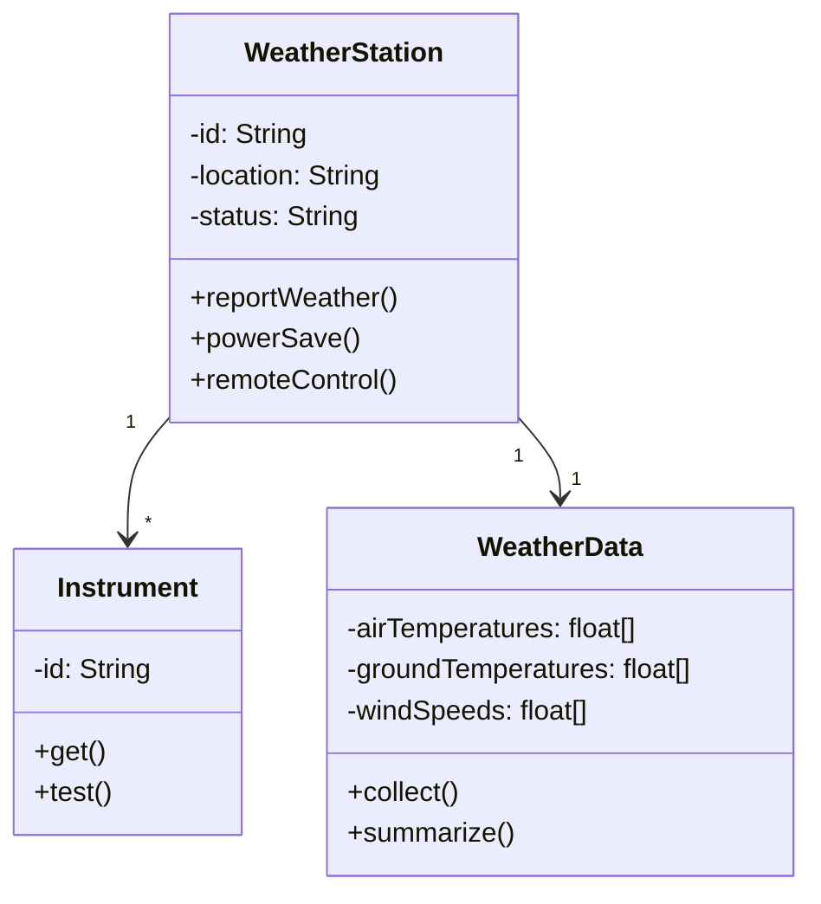
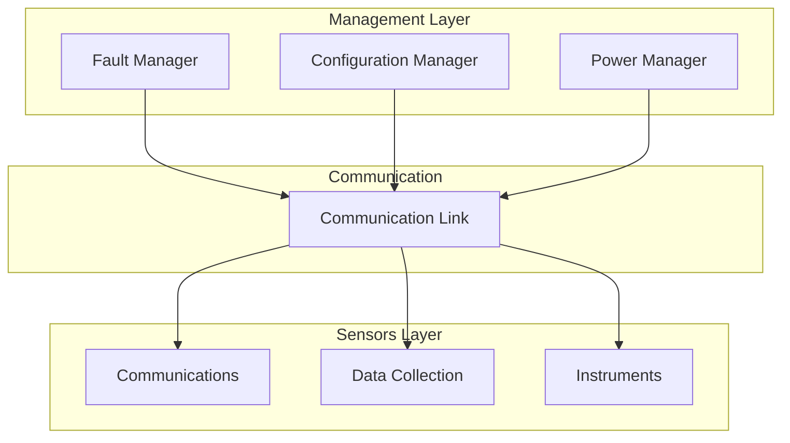
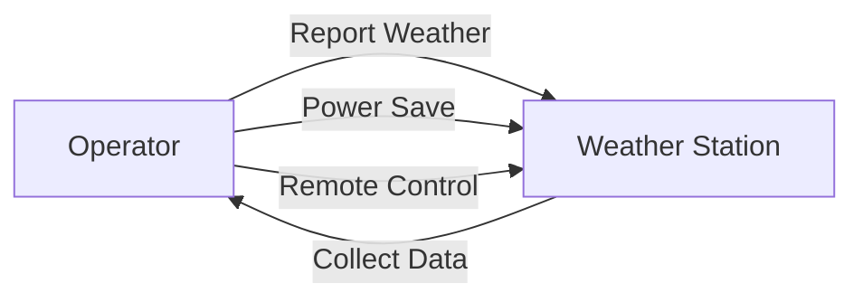
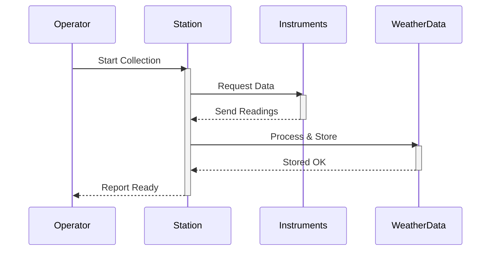
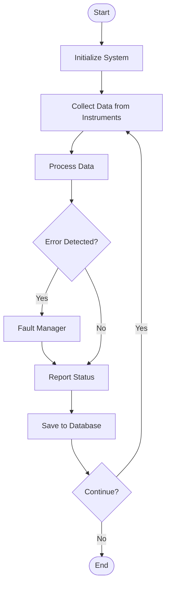
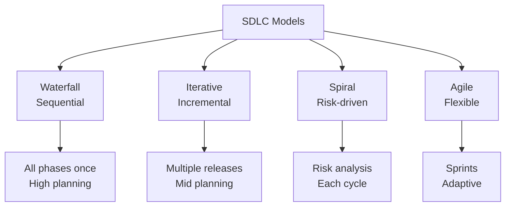
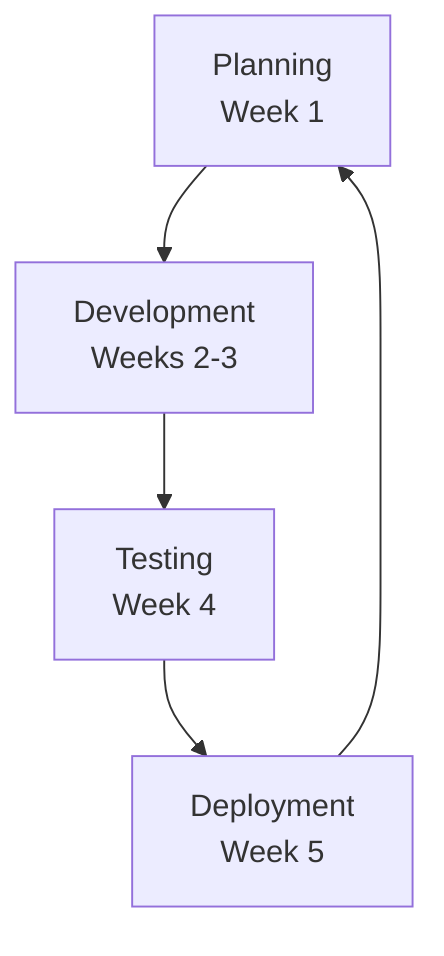

# Mermaid Diagram Templates for Software Engineering 2

> Comprehensive Mermaid examples for all diagram types used in Software Engineering lectures.
> Each diagram includes the code, explanation of elements, and application guidance.

---

## 1. Class Diagram (UML Class Diagram)

### Template & Example:



### Explanation:
- **WeatherStation**: Main class with properties and methods
- **WeatherData**: Data collection class
- **Instrument**: Base class for sensors
- **`-`** = private attribute
- **`+`** = public method
- **`"1" --> "*"`** = one-to-many relationship (1 station, many instruments)

### When to use:
- Explaining class structure and relationships
- Showing inheritance and composition
- Designing OOP systems
- Documenting data models

---

## 2. Component Diagram (System Architecture)

### Template & Example:



### Explanation:
- **Management Layer**: High-level system managers
- **Communication Link**: Central hub connecting layers
- **Sensors Layer**: Data collection and transmission
- **Arrows**: Show dependencies and data flow

### When to use:
- System architecture explanation
- Layered system design
- Component relationships
- Showing hierarchical structure

---

## 3. Use Case Diagram

### Template & Example:



### Explanation:
- **Operator**: Actor/user
- **Weather Station**: System
- **Arrows**: Use cases (interactions between actor and system)

### When to use:
- Defining system requirements
- Showing user interactions
- Capturing functional requirements
- Use case analysis

---

## 4. Sequence Diagram (Interactions Over Time)

### Template & Example:



### Explanation:
- **Solid arrows** (->>) = synchronous call (waits for response)
- **Dashed arrows** (-->) = response/return
- **activate/deactivate**: Shows when component is active
- **Order**: Top to bottom = chronological order

### When to use:
- Showing message flow between objects
- Explaining interaction sequences
- Timing and dependencies
- Protocol/workflow explanation

---

## 5. Flowchart (Process Flow)

### Template & Example:



### Explanation:
- **Rectangles**: Process steps
- **Diamonds**: Decision points
- **Rounded**: Start/End
- **Arrows**: Flow direction
- **Labels on arrows**: Decision outcomes

### When to use:
- Algorithm steps
- Process workflows
- Decision trees
- System operations
- Error handling flows

---

## 6. Hierarchy/Tree Diagram

### Template & Example:



### Explanation:
- **Top-down structure**: Parent → children
- **Categories**: Types of SDLC models
- **Details**: Characteristics of each type

### When to use:
- Classification and taxonomy
- Hierarchical relationships
- Category breakdown
- Concept organization

---

## 7. Comparison Matrix (Visual Table)

### Template & Example:

```markdown
| Model | Duration | Flexibility | Risk | Best For |
| --- | --- | --- | --- | --- |
| **Waterfall** | Long | Low | High | Clear requirements |
| **Iterative** | Medium | Medium | Medium | Evolving requirements |
| **Spiral** | Long | Medium | Low | High-risk projects |
| **Agile** | Short | High | Low | Fast-changing needs |
```

### Explanation:
- **Rows**: Options being compared
- **Columns**: Comparison criteria
- **Content**: Specific values for each combination

### When to use:
- Comparing multiple approaches
- Trade-off analysis
- Feature comparison
- Requirements matrix

---

## 8. Cycle Diagram (Circular Process)

### Template & Example:



### Explanation:
- **Circular flow**: Process repeats
- **Phases**: Each iteration step
- **Duration**: Time for each phase

### When to use:
- Iterative processes
- Lifecycle phases
- Recurring workflows
- Agile sprints or iterations

---

## Best Practices for Mermaid Diagrams:

1. **Clarity over complexity**: Keep diagrams readable
2. **Labels matter**: Clear labels on all elements and relationships
3. **Consistent naming**: Use same terminology across diagrams
4. **Element explanation**: Always explain what elements mean
5. **Connection meaning**: Clarify what arrows/lines represent
6. **Purpose statement**: Start with "This diagram shows..."
7. **Real examples**: Use actual scenarios from the subject

---

## Integration with Custom Prompt:

Each diagram should follow this structure:

```markdown
#### 📊 المخطط: [Diagram Name]

```mermaid
[Mermaid code here]
```

**شرح العناصر:**
- **Element A**: [Explanation]
- **Element B**: [Explanation]

**شرح الروابط:**
- **Arrow from A to B**: [What it means]
```

---

## Mermaid Syntax Quick Reference:

| Type | Syntax | Use |
| --- | --- | --- |
| Class | `classDiagram class A {...}` | OOP structures |
| Flowchart | `graph TD ... -->` | Processes |
| Sequence | `sequenceDiagram A->>B:` | Interactions |
| Use Case | `A -->` | Actors & systems |
| Hierarchy | `graph TD A-->B` | Trees & categories |

---

## Remember:

**Every diagram must have:**
1. ✅ Clear title
2. ✅ Mermaid code block
3. ✅ Element explanations
4. ✅ Relationship explanations  
5. ✅ Context and application
